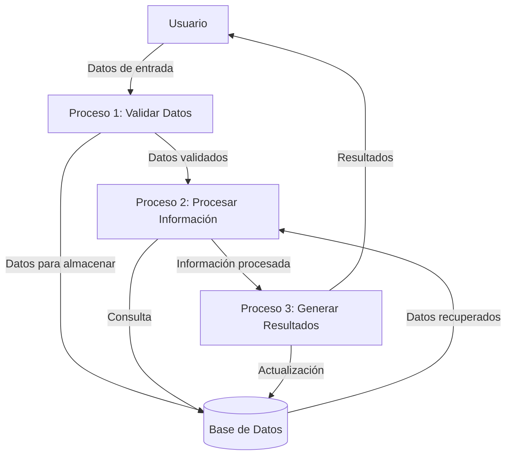

## Module: CGrabarTmpCrCropa.cpp
# Análisis Integral del Módulo CGrabarTmpCrCropa.cpp

## Módulo/Componente SQL
**CGrabarTmpCrCropa.cpp** - Módulo de clase C++ que interactúa con una base de datos para gestionar información relacionada con cultivos y cosechas.

## Objetivos Primarios
Este módulo está diseñado para grabar datos temporales relacionados con cultivos y cosechas en tablas temporales de una base de datos. Su propósito principal es gestionar la información de cultivos, incluyendo la validación de datos, el cálculo de valores y la inserción de registros en tablas temporales para su posterior procesamiento.

## Funciones, Métodos y Consultas Críticas
- **GrabarTmpCrCropa()**: Método principal que coordina todo el proceso de grabación de datos.
- **ValidarDatos()**: Valida la integridad y coherencia de los datos antes de su inserción.
- **CalcularValores()**: Realiza cálculos específicos sobre los datos de cultivos.
- **Consultas SQL principales**:
  - INSERT en tablas temporales como TMP_CR_CROPA
  - SELECT para validación de datos existentes
  - UPDATE para actualizar registros existentes

## Variables y Elementos Clave
- **Tablas**: TMP_CR_CROPA, CR_CROPA, CR_CROPA_HIST
- **Columnas clave**: 
  - ID_CROPA (identificador de cultivo)
  - ID_EMPRESA
  - ID_CAMPANA
  - FECHA_SIEMBRA
  - FECHA_COSECHA
  - SUPERFICIE
  - RENDIMIENTO
- **Variables de clase**:
  - m_pDb: Conexión a la base de datos
  - m_strError: Almacena mensajes de error
  - m_nIdEmpresa, m_nIdCampana: Identificadores de empresa y campaña

## Interdependencias y Relaciones
- Interactúa con múltiples tablas de la base de datos que mantienen relaciones entre sí.
- Depende de la existencia previa de registros en tablas maestras como empresas y campañas.
- Utiliza transacciones para mantener la integridad referencial entre las tablas relacionadas.
- Establece relaciones entre cultivos, parcelas, campañas y empresas mediante claves foráneas.

## Operaciones Core vs. Auxiliares
**Operaciones Core**:
- Inserción de datos en la tabla TMP_CR_CROPA
- Cálculo de valores de rendimiento y superficie
- Validación de la integridad de los datos de cultivo

**Operaciones Auxiliares**:
- Gestión de errores y excepciones
- Logging de operaciones
- Validaciones secundarias de formato y consistencia

## Secuencia Operacional/Flujo de Ejecución
1. Inicialización de variables y conexión a la base de datos
2. Validación preliminar de parámetros de entrada
3. Verificación de la existencia de registros relacionados
4. Cálculo de valores derivados (rendimiento, superficie)
5. Validación completa de los datos
6. Inicio de transacción en la base de datos
7. Inserción o actualización de registros en tablas temporales
8. Confirmación (commit) o reversión (rollback) de la transacción
9. Retorno del resultado de la operación

## Aspectos de Rendimiento y Optimización
- Potencial cuello de botella en la validación de datos si se procesan grandes volúmenes.
- Oportunidad de optimización en las consultas SQL mediante índices adecuados en ID_CROPA, ID_EMPRESA y ID_CAMPANA.
- El uso de transacciones podría afectar el rendimiento en operaciones masivas.
- Se recomienda revisar la eficiencia de los cálculos en el método CalcularValores().

## Reusabilidad y Adaptabilidad
- El módulo está diseñado con un enfoque orientado a objetos que facilita su reutilización.
- La parametrización de los métodos permite adaptarlos a diferentes contextos.
- La separación de responsabilidades (validación, cálculo, grabación) facilita la modificación de componentes específicos.
- Podría mejorarse la adaptabilidad mediante mayor uso de configuración externa.

## Uso y Contexto
- Este módulo se utiliza en el contexto de un sistema de gestión agrícola.
- Se emplea durante el proceso de registro y seguimiento de cultivos y cosechas.
- Es invocado probablemente desde interfaces de usuario o procesos batch que requieren actualizar información de cultivos.
- Depende de la existencia de un esquema de base de datos específico y de la disponibilidad de datos maestros.

## Suposiciones y Limitaciones
**Suposiciones**:
- Existencia previa de tablas y estructura de base de datos específica.
- Disponibilidad de datos maestros (empresas, campañas).
- Formato específico de fechas y valores numéricos.

**Limitaciones**:
- No parece manejar operaciones masivas de manera optimizada.
- La gestión de errores podría ser mejorada para proporcionar información más detallada.
- Dependencia fuerte del esquema de base de datos actual, lo que podría dificultar migraciones.
- No se observa manejo de concurrencia para múltiples usuarios modificando los mismos registros.
## Flow Diagram [via mermaid]

