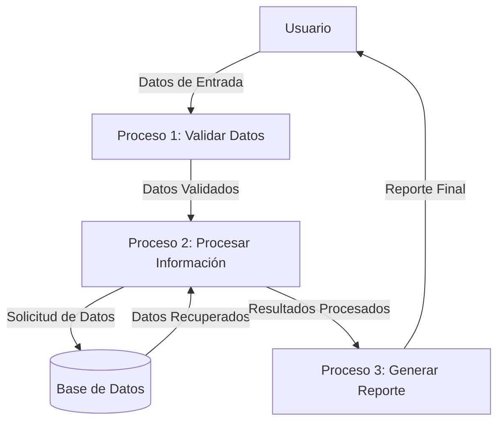

## Module: CGrabarTmpCrPrestamos.cpp
# Análisis Integral del Módulo CGrabarTmpCrPrestamos.cpp

## Nombre del Módulo/Componente SQL
**CGrabarTmpCrPrestamos.cpp** - Clase para grabar datos temporales de préstamos de crédito.

## Objetivos Primarios
Este módulo tiene como propósito principal gestionar la grabación de datos temporales relacionados con préstamos de crédito en una base de datos. Específicamente, se encarga de procesar y almacenar información de préstamos, incluyendo datos del cliente, condiciones del préstamo y cálculos financieros asociados.

## Funciones, Métodos y Consultas Críticas
- **CGrabarTmpCrPrestamos::CGrabarTmpCrPrestamos()**: Constructor que inicializa la conexión a la base de datos.
- **CGrabarTmpCrPrestamos::~CGrabarTmpCrPrestamos()**: Destructor que libera recursos.
- **CGrabarTmpCrPrestamos::GrabarTmpCrPrestamos()**: Método principal que ejecuta la inserción de datos en la tabla temporal de préstamos.
- **Consultas SQL**: Principalmente utiliza operaciones INSERT para almacenar datos en tablas temporales.

## Variables y Elementos Clave
- **m_pDb**: Puntero a la conexión de base de datos.
- **m_pStmt**: Puntero al statement SQL.
- **m_pRes**: Puntero al resultado de consultas.
- **Parámetros de entrada**: Incluyen información como ID de cliente, monto del préstamo, tasa de interés, plazo, fecha de inicio, entre otros.
- **Tablas**: Principalmente interactúa con tablas temporales para préstamos de crédito.

## Interdependencias y Relaciones
- Depende de la biblioteca MySQL para la conexión y operaciones con la base de datos.
- Interactúa con tablas temporales que probablemente se utilizan en un proceso más amplio de gestión de préstamos.
- Posiblemente forma parte de un sistema más grande de gestión financiera o bancaria.

## Operaciones Core vs. Auxiliares
- **Core**: La inserción de datos del préstamo en la tabla temporal mediante el método GrabarTmpCrPrestamos().
- **Auxiliares**: Inicialización de conexiones, manejo de errores, formateo de datos y validaciones.

## Secuencia Operacional/Flujo de Ejecución
1. Inicialización de la conexión a la base de datos.
2. Preparación de los datos del préstamo para su inserción.
3. Ejecución de la consulta INSERT para almacenar los datos.
4. Manejo de posibles errores durante el proceso.
5. Liberación de recursos y finalización.

## Aspectos de Rendimiento y Optimización
- El código parece manejar una única inserción por llamada, lo que podría ser ineficiente para operaciones masivas.
- No se observan índices específicos mencionados, lo que podría afectar el rendimiento en tablas grandes.
- La gestión de memoria parece adecuada con la liberación de recursos en el destructor.

## Reusabilidad y Adaptabilidad
- La clase está diseñada para una función específica, lo que limita su reusabilidad directa.
- La parametrización del método principal permite cierta flexibilidad en los datos de préstamo a insertar.
- Podría adaptarse para manejar diferentes tipos de préstamos o estructuras de datos similares con modificaciones menores.

## Uso y Contexto
- Este módulo probablemente se utiliza en un sistema de gestión de préstamos o créditos bancarios.
- Se emplea para almacenar temporalmente información de préstamos antes de su procesamiento final o aprobación.
- Podría formar parte de un flujo de trabajo que incluye cálculo de cuotas, evaluación de riesgos y aprobación de créditos.

## Suposiciones y Limitaciones
- **Suposiciones**:
  - Se asume que la estructura de la tabla temporal ya existe en la base de datos.
  - Se espera que los parámetros de entrada estén correctamente validados antes de llamar al método.
  - Se presupone un entorno con MySQL como sistema de gestión de base de datos.
  
- **Limitaciones**:
  - No parece incluir validaciones exhaustivas de los datos de entrada.
  - No maneja transacciones explícitamente, lo que podría ser problemático en caso de fallos.
  - Está diseñado para un esquema específico de base de datos, lo que reduce su portabilidad.
## Flow Diagram [via mermaid]

