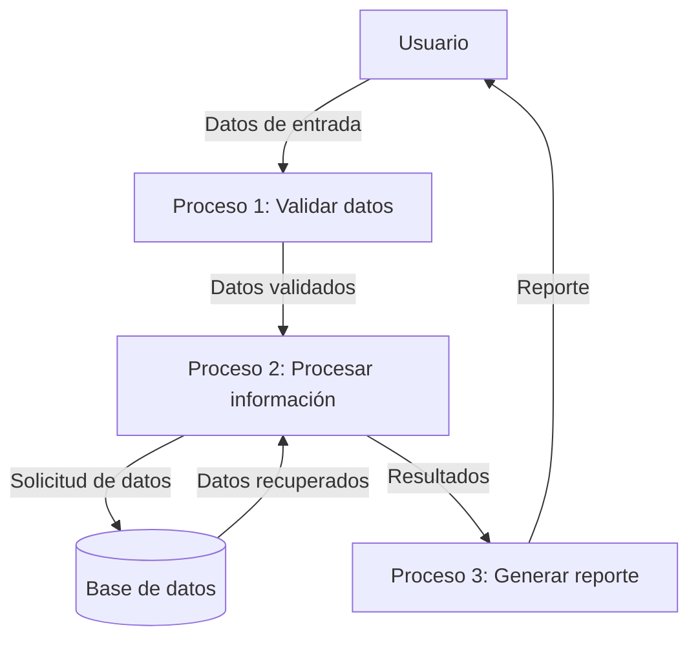
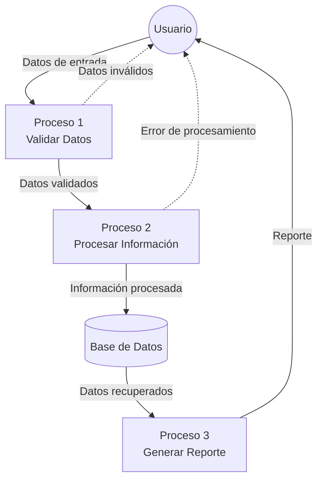

## Module: CGrabarTmpCrSeguros.cpp
# Análisis Integral del Módulo CGrabarTmpCrSeguros.cpp

## Módulo/Componente SQL
**CGrabarTmpCrSeguros.cpp** - Este es un módulo de programación en C++ que interactúa con una base de datos para gestionar información relacionada con seguros.

## Objetivos Primarios
El módulo está diseñado para grabar datos temporales de seguros en una tabla de base de datos. Su propósito principal es procesar y almacenar información de seguros, realizando validaciones y transformaciones de datos antes de su inserción en la base de datos.

## Funciones, Métodos y Consultas Críticas
- **CGrabarTmpCrSeguros::CGrabarTmpCrSeguros()**: Constructor que inicializa variables y establece conexiones.
- **CGrabarTmpCrSeguros::~CGrabarTmpCrSeguros()**: Destructor que libera recursos.
- **CGrabarTmpCrSeguros::Grabar()**: Función principal que ejecuta la lógica de grabación de datos.
- **Consultas SQL**: Utiliza principalmente sentencias INSERT para almacenar datos en tablas temporales.

## Variables y Elementos Clave
- **m_pDb**: Puntero a la conexión de base de datos.
- **m_pLog**: Puntero al sistema de registro de eventos.
- **m_strError**: Variable para almacenar mensajes de error.
- **Tablas**: TMP_CR_SEGUROS (principal), posiblemente otras tablas relacionadas con seguros.
- **Campos clave**: Incluyen información de seguros como identificadores, fechas, montos y estados.

## Interdependencias y Relaciones
- Depende de una conexión de base de datos activa (m_pDb).
- Interactúa con un sistema de registro (m_pLog).
- Posiblemente se relaciona con otras tablas del sistema de seguros mediante operaciones de consulta o inserción.

## Operaciones Core vs. Auxiliares
- **Core**: La función Grabar() que procesa y almacena los datos de seguros.
- **Auxiliares**: Validaciones de datos, manejo de errores, registro de actividades y transformaciones de formato.

## Secuencia Operacional/Flujo de Ejecución
1. Inicialización de variables y conexiones en el constructor.
2. Validación de parámetros y datos de entrada.
3. Preparación de datos para inserción (posibles transformaciones).
4. Ejecución de consultas SQL para insertar datos.
5. Manejo de errores y registro de resultados.
6. Liberación de recursos en el destructor.

## Aspectos de Rendimiento y Optimización
- Posible área de mejora en la gestión de transacciones para operaciones masivas.
- La eficiencia podría optimizarse mediante el uso de consultas preparadas o lotes de inserción.
- El manejo de errores podría impactar el rendimiento si no está bien implementado.

## Reusabilidad y Adaptabilidad
- El diseño orientado a objetos facilita la reutilización en diferentes contextos.
- La separación de responsabilidades (conexión a BD, lógica de negocio, manejo de errores) mejora la adaptabilidad.
- Podría beneficiarse de una mayor parametrización para aumentar su flexibilidad.

## Uso y Contexto
- Se utiliza en un sistema de gestión de seguros para almacenar datos temporales antes de su procesamiento final.
- Probablemente forma parte de un proceso ETL o de carga de datos.
- Puede ser invocado por otros módulos del sistema que necesiten almacenar información de seguros.

## Suposiciones y Limitaciones
- Asume la existencia de una estructura de base de datos específica con tablas y campos predefinidos.
- Requiere una conexión de base de datos válida y con permisos adecuados.
- Posiblemente limitado a un formato específico de datos de entrada.
- La gestión de errores podría no ser exhaustiva, dependiendo de la implementación completa.
## Flow Diagram [via mermaid]

## Module: CGrabarTmpCrSeguros.cpp
# Análisis Integral del Módulo CGrabarTmpCrSeguros.cpp

## Nombre del Módulo/Componente SQL
**CGrabarTmpCrSeguros.cpp** - Módulo de clase C++ para procesamiento de datos de seguros.

## Objetivos Primarios
Este módulo está diseñado para gestionar la grabación de datos temporales relacionados con seguros de crédito. Su propósito principal es procesar y almacenar información de seguros en tablas temporales, realizando validaciones específicas y manejando diferentes tipos de operaciones (altas, bajas, modificaciones) según los parámetros recibidos.

## Funciones, Métodos y Consultas Críticas
- **CGrabarTmpCrSeguros::Ejecutar()**: Función principal que coordina todo el proceso de grabación.
- **CGrabarTmpCrSeguros::GrabarTmpCrSeguros()**: Método central que realiza la grabación en la tabla temporal.
- **CGrabarTmpCrSeguros::ValidarDatos()**: Valida la integridad de los datos antes de procesarlos.
- **Consultas SQL principales**: Utiliza principalmente sentencias INSERT y SELECT para manipular datos en tablas temporales como TMP_CR_SEGUROS.

## Variables y Elementos Clave
- **m_pDatos**: Puntero a estructura de datos principal que contiene la información a procesar.
- **m_pConexion**: Conexión a la base de datos.
- **Tablas críticas**: TMP_CR_SEGUROS, CR_SEGUROS
- **Columnas clave**: COD_SEGURO, COD_EMPRESA, COD_SUCURSAL, COD_CREDITO, TIPO_OPERACION

## Interdependencias y Relaciones
- Interactúa con el sistema de base de datos a través de la conexión m_pConexion.
- Depende de la estructura de datos proporcionada por m_pDatos.
- Utiliza la clase CValidaciones para realizar validaciones específicas.
- Se relaciona con tablas del sistema de créditos y seguros, especialmente con la tabla temporal TMP_CR_SEGUROS y la tabla permanente CR_SEGUROS.

## Operaciones Principales vs. Auxiliares
- **Operaciones principales**: 
  - Grabación de datos en la tabla temporal (GrabarTmpCrSeguros)
  - Procesamiento según el tipo de operación (alta, baja, modificación)
- **Operaciones auxiliares**:
  - Validación de datos (ValidarDatos)
  - Manejo de errores y excepciones
  - Registro de operaciones

## Secuencia Operacional/Flujo de Ejecución
1. Inicialización de variables y estructuras de datos
2. Validación de los datos de entrada
3. Determinación del tipo de operación a realizar
4. Grabación en la tabla temporal según el tipo de operación
5. Manejo de posibles errores durante el proceso
6. Finalización y retorno del resultado de la operación

## Aspectos de Rendimiento y Optimización
- El código utiliza transacciones para garantizar la integridad de los datos.
- Podría optimizarse el manejo de excepciones para evitar posibles fugas de memoria.
- La validación de datos se realiza antes de cualquier operación de base de datos, lo que evita operaciones innecesarias.

## Reusabilidad y Adaptabilidad
- La estructura de clase permite su reutilización en diferentes contextos relacionados con seguros.
- El diseño modular separa claramente las responsabilidades (validación, grabación, manejo de errores).
- La parametrización a través de m_pDatos permite adaptarse a diferentes escenarios de uso.

## Uso y Contexto
- Este módulo se utiliza en el contexto de un sistema de gestión de créditos y seguros.
- Es invocado cuando se necesita registrar, modificar o eliminar información de seguros en el sistema.
- Forma parte de un proceso más amplio de gestión de datos temporales antes de su consolidación definitiva.

## Suposiciones y Limitaciones
- Asume que la estructura de datos m_pDatos está correctamente inicializada y contiene datos válidos.
- Requiere una conexión activa a la base de datos.
- Depende de la existencia y estructura específica de las tablas TMP_CR_SEGUROS y CR_SEGUROS.
- No maneja concurrencia de manera explícita, lo que podría ser una limitación en entornos multiusuario.
## Flow Diagram [via mermaid]

