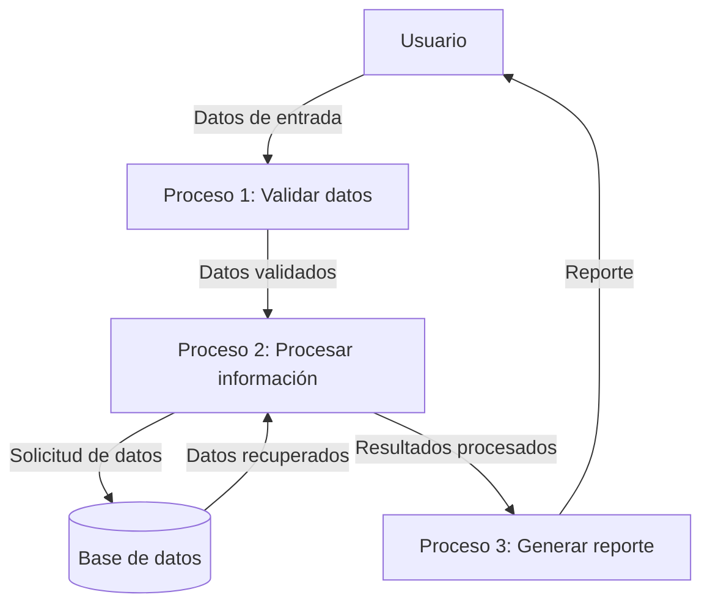

## Module: CGrabarTmpSeguroAutoCaCarmov01.cpp
# Análisis Integral del Módulo CGrabarTmpSeguroAutoCaCarmov01.cpp

## Nombre del Módulo/Componente SQL
CGrabarTmpSeguroAutoCaCarmov01.cpp - Clase para grabar datos temporales de seguros de automóviles en la tabla CARMOV01.

## Objetivos Primarios
Este módulo tiene como objetivo principal gestionar la grabación de datos temporales relacionados con seguros de automóviles en una tabla temporal (CARMOV01). Específicamente, se encarga de procesar y almacenar información sobre vehículos asegurados, incluyendo datos del cliente, características del vehículo, y detalles de la póliza.

## Funciones, Métodos y Consultas Críticas
- **Constructor y Destructor**: Inicializa y libera recursos de la clase.
- **GrabarTmpSeguroAutoCaCarmov01()**: Método principal que ejecuta la inserción de datos en la tabla temporal.
- **Consultas SQL**: Utiliza principalmente sentencias INSERT para almacenar datos en la tabla CARMOV01.

## Variables y Elementos Clave
- **Parámetros de entrada**: 
  - `pCodigo`: Código identificador del registro
  - `pCodCia`: Código de compañía
  - `pCodRamo`: Código de ramo
  - `pNumPoliza`: Número de póliza
  - Múltiples parámetros adicionales relacionados con vehículos y asegurados
- **Tablas principales**: 
  - CARMOV01: Tabla temporal para almacenar datos de seguros de automóviles

## Interdependencias y Relaciones
- Interactúa con el sistema de base de datos a través de la clase CBaseDatos.
- Depende de la estructura predefinida de la tabla CARMOV01.
- Utiliza la clase CLog para registro de eventos y errores.
- Se relaciona con otros módulos del sistema de seguros de automóviles.

## Operaciones Core vs. Auxiliares
- **Core**: 
  - La inserción de datos en la tabla CARMOV01
  - Formateo y validación de los datos de entrada
- **Auxiliares**: 
  - Manejo de errores y excepciones
  - Registro de actividades (logging)
  - Limpieza de recursos

## Secuencia Operacional/Flujo de Ejecución
1. Inicialización de variables y conexión a la base de datos
2. Preparación de la sentencia SQL INSERT
3. Asignación de valores a los parámetros de la consulta
4. Ejecución de la consulta
5. Manejo de posibles errores
6. Registro de la operación
7. Liberación de recursos

## Aspectos de Rendimiento y Optimización
- La operación de inserción podría optimizarse mediante el uso de transacciones para múltiples registros.
- No se observa uso de índices específicos, lo que podría afectar el rendimiento en tablas grandes.
- El manejo de cadenas y conversiones de tipos podría optimizarse para reducir la sobrecarga.

## Reusabilidad y Adaptabilidad
- El módulo está diseñado como una clase independiente, lo que facilita su reutilización.
- La parametrización de los datos de entrada permite adaptarlo a diferentes contextos.
- La separación de la lógica de negocio y acceso a datos facilita su mantenimiento.

## Uso y Contexto
- Este módulo se utiliza en el proceso de gestión de seguros de automóviles.
- Forma parte de un sistema más amplio de administración de pólizas.
- Se invoca cuando se necesita almacenar temporalmente información de vehículos asegurados.

## Suposiciones y Limitaciones
- Asume la existencia y estructura correcta de la tabla CARMOV01.
- Requiere que los parámetros de entrada cumplan con formatos específicos.
- No maneja transacciones complejas o procesamiento por lotes.
- Limitado a la funcionalidad específica de inserción de datos, sin capacidades de actualización o eliminación.
- Depende de la disponibilidad y correcto funcionamiento del sistema de base de datos subyacente.
## Flow Diagram [via mermaid]

