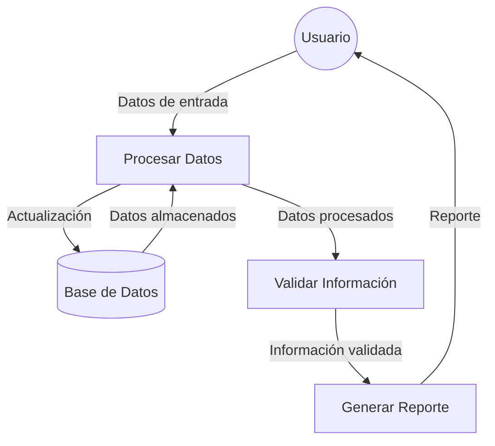

## Module: CGrabarTmpSeguroCaCarmov01.cpp
# Análisis Integral del Módulo CGrabarTmpSeguroCaCarmov01.cpp

## Nombre del Módulo/Componente SQL
CGrabarTmpSeguroCaCarmov01.cpp - Clase para grabar datos temporales de seguros en el sistema CARMOV01.

## Objetivos Primarios
Este módulo está diseñado para gestionar la grabación de datos temporales relacionados con seguros en el sistema CARMOV01. Su propósito principal es validar, procesar y almacenar información de seguros en tablas temporales, realizando las transformaciones de datos necesarias y manejando las conexiones a la base de datos.

## Funciones, Métodos y Consultas Críticas
- **CGrabarTmpSeguroCaCarmov01::CGrabarTmpSeguroCaCarmov01()**: Constructor que inicializa variables y establece conexiones.
- **CGrabarTmpSeguroCaCarmov01::~CGrabarTmpSeguroCaCarmov01()**: Destructor que libera recursos.
- **CGrabarTmpSeguroCaCarmov01::GrabarTmpSeguro()**: Método principal que coordina el proceso de grabación de datos temporales.
- **CGrabarTmpSeguroCaCarmov01::GrabarTmpSeguroDetalle()**: Gestiona la grabación de detalles de seguros.
- **Consultas SQL**: Principalmente operaciones INSERT para almacenar datos en tablas temporales.

## Variables y Elementos Clave
- **m_pConn**: Conexión a la base de datos.
- **m_pStmt**: Objeto para ejecutar sentencias SQL.
- **m_pRs**: Conjunto de resultados.
- **m_strError**: Almacena mensajes de error.
- **Tablas principales**: TMP_SEGURO_CARMOV01, TMP_SEGURO_DETALLE_CARMOV01.
- **Parámetros clave**: Información del seguro como ID, fechas, montos, y detalles relacionados.

## Interdependencias y Relaciones
- Interactúa con el sistema de base de datos a través de ADO (ActiveX Data Objects).
- Depende de las tablas temporales TMP_SEGURO_CARMOV01 y TMP_SEGURO_DETALLE_CARMOV01.
- Utiliza la clase CParametrosGenerales para obtener configuraciones del sistema.
- Se relaciona con otros componentes del sistema CARMOV01 para el procesamiento de seguros.

## Operaciones Principales vs. Auxiliares
- **Operaciones principales**: 
  - Grabación de datos en tablas temporales (GrabarTmpSeguro, GrabarTmpSeguroDetalle)
  - Procesamiento de información de seguros
- **Operaciones auxiliares**:
  - Manejo de errores y excepciones
  - Validación de datos
  - Gestión de conexiones a la base de datos
  - Conversión y formateo de datos

## Secuencia Operacional/Flujo de Ejecución
1. Inicialización de variables y conexiones en el constructor
2. Validación de parámetros de entrada
3. Preparación de sentencias SQL para inserción
4. Ejecución de consultas para grabar datos temporales
5. Manejo de posibles errores durante el proceso
6. Liberación de recursos al finalizar

## Aspectos de Rendimiento y Optimización
- El código utiliza transacciones para asegurar la integridad de los datos.
- Potencial cuello de botella en la ejecución secuencial de múltiples inserciones.
- Oportunidad de optimización en la gestión de conexiones a la base de datos.
- Posible mejora mediante el uso de operaciones por lotes para inserciones múltiples.

## Reusabilidad y Adaptabilidad
- La clase está diseñada específicamente para el sistema CARMOV01, lo que limita su reusabilidad directa.
- La estructura modular permite adaptaciones para sistemas similares con modificaciones en las consultas SQL.
- La separación de funcionalidades en métodos distintos facilita la modificación de partes específicas.

## Uso y Contexto
- Este módulo se utiliza en el contexto del procesamiento de seguros dentro del sistema CARMOV01.
- Es invocado cuando se necesita almacenar temporalmente información de seguros para su posterior procesamiento.
- Depende de la existencia y estructura correcta de las tablas temporales en la base de datos.

## Suposiciones y Limitaciones
- Asume la existencia de tablas temporales específicas con una estructura predefinida.
- Requiere una configuración correcta de la conexión a la base de datos.
- Limitado a la estructura de datos específica del sistema CARMOV01.
- No parece manejar operaciones concurrentes, lo que podría ser una limitación en entornos de alto volumen.
- Depende de la disponibilidad y correcto funcionamiento de las bibliotecas ADO para la comunicación con la base de datos.
## Flow Diagram [via mermaid]

