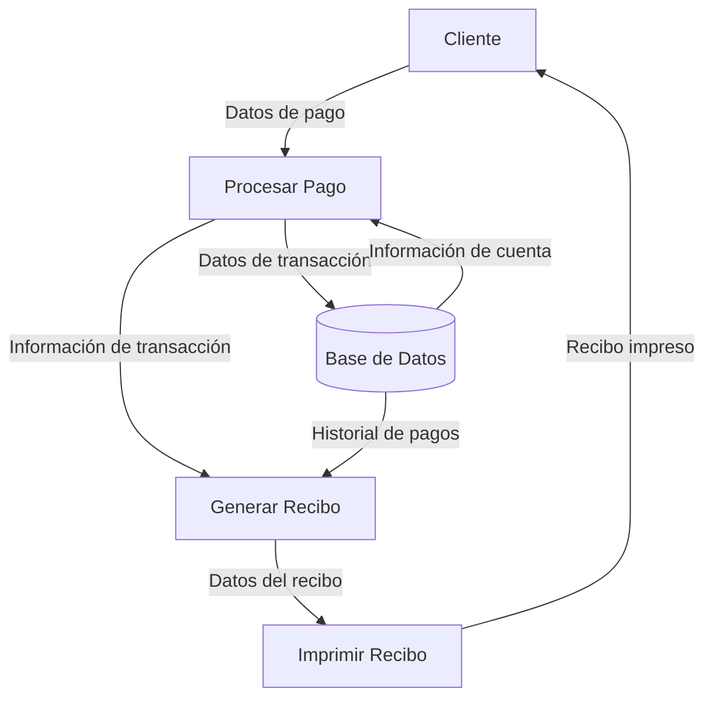

## Module: CImpresionReciboAbonos.cpp
# Análisis Integral del Módulo CImpresionReciboAbonos.cpp

## Nombre del Módulo/Componente SQL
**CImpresionReciboAbonos.cpp** - Módulo de clase para la impresión de recibos de abonos.

## Objetivos Primarios
Este módulo está diseñado para gestionar la impresión de recibos de abonos en un sistema de gestión financiera. Su propósito principal es generar documentos físicos que registren los pagos o abonos realizados, proporcionando un comprobante tanto para el cliente como para el registro interno del negocio.

## Funciones, Métodos y Consultas Críticas
- **CImpresionReciboAbonos()**: Constructor de la clase que inicializa los componentes necesarios.
- **~CImpresionReciboAbonos()**: Destructor que libera recursos.
- **ImprimirRecibo()**: Función principal que coordina el proceso de impresión del recibo.
- **ObtenerDatosAbono()**: Método que consulta la base de datos para recuperar la información del abono.
- **FormatearDatosImpresion()**: Prepara los datos para su presentación en el formato de impresión.
- **EnviarAImpresora()**: Gestiona la comunicación con el dispositivo de impresión.

## Variables y Elementos Clave
- **m_nIdAbono**: Identificador único del abono a imprimir.
- **m_strNombreCliente**: Nombre del cliente asociado al abono.
- **m_dblMontoAbono**: Cantidad monetaria del abono realizado.
- **m_strFechaAbono**: Fecha en que se realizó el abono.
- **m_strConceptoAbono**: Descripción o motivo del abono.
- **m_ptrConexionBD**: Puntero a la conexión de base de datos.
- **m_strFormatoRecibo**: Plantilla o formato del recibo a imprimir.

## Interdependencias y Relaciones
- Interactúa con el módulo de gestión de clientes para obtener información del cliente.
- Se conecta con el sistema de base de datos para consultar información de abonos.
- Utiliza el subsistema de impresión para enviar el documento a la impresora.
- Puede interactuar con módulos de contabilidad para registrar la emisión del recibo.

## Operaciones Principales vs. Auxiliares
**Operaciones Principales:**
- Generación del contenido del recibo.
- Formateo de los datos monetarios y fechas.
- Proceso de impresión física del documento.

**Operaciones Auxiliares:**
- Validación de datos del abono.
- Registro de la impresión en el sistema.
- Manejo de errores durante la impresión.
- Configuración de parámetros de la impresora.

## Secuencia Operacional/Flujo de Ejecución
1. Inicialización de la clase con el ID del abono a imprimir.
2. Consulta a la base de datos para obtener los detalles del abono.
3. Validación de la información recuperada.
4. Formateo de los datos para su presentación en el recibo.
5. Preparación del documento según la plantilla establecida.
6. Envío del documento a la impresora.
7. Verificación del estado de impresión.
8. Registro de la acción en el sistema.

## Aspectos de Rendimiento y Optimización
- La consulta a la base de datos podría optimizarse mediante índices adecuados en la tabla de abonos.
- El proceso de formateo de datos podría mejorarse para reducir el tiempo de procesamiento.
- La gestión de memoria durante la preparación del documento debe ser eficiente para evitar fugas.
- Podría implementarse un sistema de cola para gestionar múltiples solicitudes de impresión.

## Reusabilidad y Adaptabilidad
- La clase está diseñada para ser reutilizable con diferentes tipos de abonos.
- Los parámetros de formato del recibo podrían externalizarse para permitir personalización.
- La separación entre la obtención de datos y la impresión facilita la adaptación a diferentes fuentes de información.
- Podría extenderse para soportar diferentes formatos de salida (PDF, email, etc.).

## Uso y Contexto
Este módulo se utiliza en el contexto de un sistema de gestión financiera o de cobros, específicamente cuando:
- Un cliente realiza un pago parcial o total.
- Se necesita generar un comprobante físico de una transacción.
- Se requiere documentación para auditorías o registros contables.
- El personal administrativo necesita imprimir duplicados de recibos anteriores.

## Suposiciones y Limitaciones
**Suposiciones:**
- Se asume que existe una conexión activa a la base de datos.
- Se presupone la disponibilidad de una impresora configurada en el sistema.
- Se da por hecho que los datos del abono están correctamente registrados.

**Limitaciones:**
- Puede estar limitado a formatos de impresión específicos.
- Posiblemente no soporte la impresión en red o a múltiples dispositivos simultáneamente.
- Podría tener restricciones en cuanto a la personalización del formato del recibo.
- Es probable que no maneje automáticamente situaciones de error en la impresora (falta de papel, tinta, etc.).
## Flow Diagram [via mermaid]

