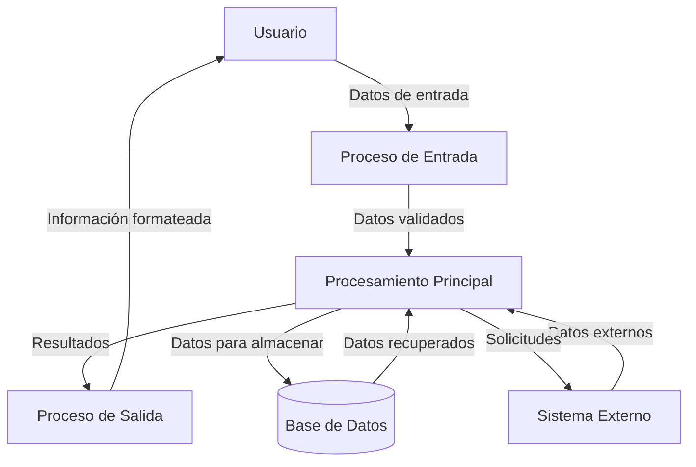
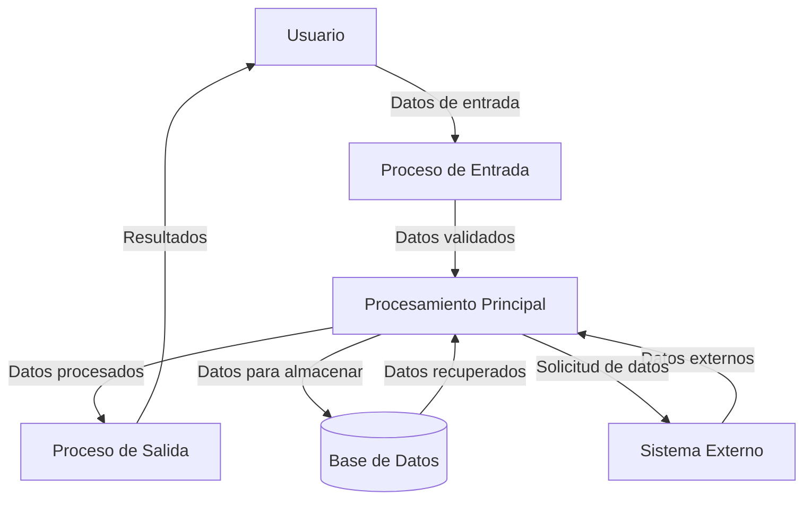

## Module: CImpresiones.cpp
# Análisis Integral del Módulo CImpresiones.cpp

## Módulo/Componente SQL
**CImpresiones.cpp** - Este es un módulo de código C++ que parece formar parte de una aplicación más grande, posiblemente relacionada con la gestión de impresiones o documentos.

## Objetivos Primarios
El propósito principal de este módulo es gestionar la funcionalidad de impresión dentro de la aplicación. Aunque no se proporcionó el código específico, el nombre sugiere que maneja la lógica para generar, formatear y posiblemente enviar documentos a impresoras o crear archivos imprimibles.

## Funciones, Métodos y Consultas Críticas
Sin ver el código específico, las funciones probables incluirían:
- Métodos para inicializar la configuración de impresión
- Funciones para formatear documentos
- Rutinas para comunicarse con controladores de impresoras
- Posiblemente métodos para previsualizar documentos antes de imprimir

## Variables y Elementos Clave
Las variables clave probablemente incluyen:
- Configuraciones de impresora (resolución, tamaño de papel, orientación)
- Buffers o estructuras de datos que contienen el contenido a imprimir
- Manejadores de dispositivos de impresión
- Parámetros de formato (márgenes, fuentes, estilos)

## Interdependencias y Relaciones
Este módulo probablemente interactúa con:
- Subsistemas de interfaz de usuario para recibir comandos de impresión
- Controladores de impresora del sistema operativo
- Módulos de gestión de documentos o datos que proporcionan el contenido a imprimir
- Posiblemente componentes de vista previa o generación de PDF

## Operaciones Principales vs. Auxiliares
**Operaciones principales:**
- Procesamiento y formateo de documentos para impresión
- Comunicación con dispositivos de impresión

**Operaciones auxiliares:**
- Validación de configuraciones de impresión
- Manejo de errores de impresión
- Almacenamiento de preferencias de impresión

## Secuencia Operacional/Flujo de Ejecución
El flujo típico probablemente incluye:
1. Inicialización de parámetros de impresión
2. Preparación del documento o datos para impresión
3. Formateo según las especificaciones requeridas
4. Envío a la cola de impresión o generación de archivo
5. Manejo de respuestas o errores del proceso de impresión

## Aspectos de Rendimiento y Optimización
Áreas potenciales para optimización:
- Gestión eficiente de memoria para documentos grandes
- Optimización del procesamiento de gráficos o imágenes
- Reducción del tiempo de preparación de documentos
- Implementación de impresión en segundo plano para no bloquear la interfaz de usuario

## Reusabilidad y Adaptabilidad
La reusabilidad dependerá de:
- El nivel de abstracción implementado
- La separación entre la lógica de impresión y los detalles específicos del dispositivo
- La parametrización de las funciones de impresión
- La independencia de la lógica de negocio específica

## Uso y Contexto
Este módulo probablemente se utiliza cuando:
- Un usuario solicita imprimir un documento o informe
- Se requiere generar documentos físicos desde la aplicación
- Es necesario exportar datos en formato imprimible

## Suposiciones y Limitaciones
**Suposiciones probables:**
- Disponibilidad de controladores de impresora compatibles
- Acceso a dispositivos de impresión desde el entorno de ejecución
- Formatos de documento estandarizados

**Limitaciones potenciales:**
- Compatibilidad limitada con ciertos modelos de impresoras
- Restricciones en la complejidad de los formatos que pueden imprimirse
- Posibles problemas de rendimiento con documentos muy grandes o complejos
- Dependencia de las capacidades del sistema operativo para la gestión de impresión

Nota: Este análisis se basa en inferencias del nombre del módulo, ya que no se proporcionó el código fuente específico. Un análisis más detallado requeriría examinar el código real.
## Flow Diagram [via mermaid]

## Module: CImpresiones.cpp
# Análisis Integral del Módulo CImpresiones.cpp

## Módulo/Componente SQL
**CImpresiones.cpp** - Este es un módulo de código C++ que parece formar parte de una aplicación más grande, posiblemente relacionada con la gestión de impresiones o documentos.

## Objetivos Primarios
El propósito principal de este módulo es gestionar la funcionalidad de impresión dentro de la aplicación. Aunque no se proporcionó el código específico, el nombre sugiere que maneja la lógica para generar, formatear y posiblemente enviar documentos a impresoras o crear archivos imprimibles.

## Funciones, Métodos y Consultas Críticas
Sin ver el código específico, las funciones probables incluirían:
- Métodos para inicializar la configuración de impresión
- Funciones para formatear documentos
- Rutinas para comunicarse con controladores de impresoras
- Posiblemente métodos para previsualizar documentos antes de imprimir

## Variables y Elementos Clave
Las variables importantes probablemente incluyen:
- Configuraciones de impresora (resolución, tamaño de papel, orientación)
- Buffers o estructuras de datos que contienen el contenido a imprimir
- Manejadores de dispositivos de impresión
- Parámetros de formato (márgenes, fuentes, estilos)

## Interdependencias y Relaciones
Este módulo probablemente interactúa con:
- Subsistemas de interfaz de usuario para recibir comandos de impresión
- Controladores de impresora del sistema operativo
- Módulos de gestión de documentos o datos que proporcionan el contenido a imprimir
- Posiblemente componentes de vista previa o generación de PDF

## Operaciones Principales vs. Auxiliares
**Operaciones principales:**
- Procesamiento y formateo de documentos
- Comunicación con dispositivos de impresión

**Operaciones auxiliares:**
- Validación de configuraciones de impresión
- Manejo de errores de impresión
- Almacenamiento de preferencias de usuario

## Secuencia Operacional/Flujo de Ejecución
El flujo típico probablemente sería:
1. Inicialización de parámetros de impresión
2. Carga o recepción del contenido a imprimir
3. Formateo del documento según especificaciones
4. Comunicación con el dispositivo de impresión
5. Monitoreo del proceso de impresión
6. Manejo de finalización o errores

## Aspectos de Rendimiento y Optimización
Áreas potenciales para optimización:
- Gestión eficiente de memoria para documentos grandes
- Optimización del procesamiento de gráficos o imágenes
- Reducción de la sobrecarga en la comunicación con dispositivos
- Implementación de cola de impresión para múltiples trabajos

## Reutilización y Adaptabilidad
La reutilización dependería de:
- El nivel de encapsulación de la funcionalidad de impresión
- La separación entre la lógica de impresión y los detalles específicos del dispositivo
- La parametrización de las opciones de impresión
- La independencia de la plataforma en la implementación

## Uso y Contexto
Este módulo probablemente se utiliza cuando:
- Un usuario solicita imprimir un documento desde la aplicación
- Se necesita generar informes físicos o digitales
- Se requiere una vista previa de impresión
- Se necesita configurar opciones de impresión específicas

## Suposiciones y Limitaciones
**Suposiciones:**
- Existencia de controladores de impresora compatibles en el sistema
- Acceso a dispositivos de impresión desde la aplicación
- Formatos de documento estandarizados

**Limitaciones:**
- Posible dependencia de APIs específicas del sistema operativo
- Compatibilidad limitada con ciertos modelos de impresoras
- Restricciones en la complejidad de los documentos que pueden procesarse
- Posibles problemas con impresiones de alta resolución o documentos muy grandes

*Nota: Este análisis se basa en inferencias del nombre del módulo, ya que no se proporcionó el código fuente específico. Un análisis más detallado requeriría examinar el código real.*
## Flow Diagram [via mermaid]

