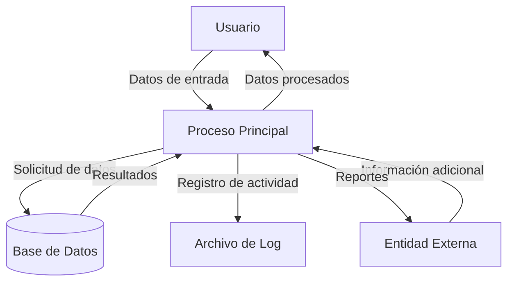

## Module: CInsertarCaCarmov.cpp
# Análisis Integral del Módulo CInsertarCaCarmov.cpp

## Nombre del Módulo/Componente SQL
**CInsertarCaCarmov.cpp** - Clase para inserción de registros en la tabla CA_CARMOV (movimientos de cartera).

## Objetivos Primarios
Este módulo implementa una clase que gestiona la inserción de registros en la tabla CA_CARMOV, que parece estar relacionada con movimientos de cartera o transacciones financieras. Su propósito principal es encapsular la lógica de inserción de datos, validando y preparando los campos necesarios antes de realizar la operación en la base de datos.

## Funciones, Métodos y Consultas Críticas
- **CInsertarCaCarmov::CInsertarCaCarmov()** - Constructor que inicializa los atributos de la clase.
- **CInsertarCaCarmov::~CInsertarCaCarmov()** - Destructor que libera recursos.
- **CInsertarCaCarmov::Insertar()** - Método principal que ejecuta la inserción en la base de datos.
- **Consulta SQL INSERT** - Construida dinámicamente para insertar registros en la tabla CA_CARMOV.

## Variables y Elementos Clave
- **Atributos de clase**: Representan columnas de la tabla CA_CARMOV como:
  - `m_nIdCarmov` - Identificador del movimiento
  - `m_nIdCartera` - Identificador de la cartera
  - `m_nIdTipmov` - Tipo de movimiento
  - `m_dFecmov` - Fecha del movimiento
  - `m_dImporte` - Importe del movimiento
  - Otros campos relacionados con la transacción

- **Tabla principal**: CA_CARMOV (tabla de movimientos de cartera)

## Interdependencias y Relaciones
- Relación con la tabla CA_CARTERA (referenciada por m_nIdCartera)
- Posible relación con una tabla de tipos de movimientos (referenciada por m_nIdTipmov)
- Interacción con el sistema de base de datos a través de la clase CDataBase

## Operaciones Core vs. Auxiliares
- **Core**: 
  - Método Insertar() que construye y ejecuta la sentencia SQL
  - Validación de campos obligatorios
- **Auxiliares**:
  - Formateo de fechas y valores numéricos
  - Manejo de errores y excepciones

## Secuencia Operacional/Flujo de Ejecución
1. Inicialización de variables y validación de campos obligatorios
2. Construcción de la sentencia SQL INSERT
3. Ejecución de la consulta en la base de datos
4. Manejo de posibles errores durante la inserción
5. Retorno del resultado de la operación

## Aspectos de Rendimiento y Optimización
- La construcción dinámica de la consulta SQL podría optimizarse utilizando consultas parametrizadas
- No se observa uso de transacciones explícitas, lo que podría ser necesario para garantizar la integridad de los datos
- La validación de campos podría mejorarse para evitar inyecciones SQL

## Reusabilidad y Adaptabilidad
- La clase está diseñada específicamente para la tabla CA_CARMOV, lo que limita su reusabilidad directa
- La estructura podría servir como plantilla para crear clases similares para otras tablas
- La parametrización de los campos permite cierta flexibilidad en su uso

## Uso y Contexto
- Este módulo se utiliza probablemente en un sistema de gestión financiera o contable
- Se emplea para registrar movimientos en carteras financieras
- Forma parte de un sistema más amplio que gestiona operaciones financieras

## Suposiciones y Limitaciones
- Asume la existencia de una conexión válida a la base de datos
- Requiere que los identificadores de cartera y tipo de movimiento existan previamente en sus respectivas tablas
- No implementa validaciones de negocio complejas, que probablemente se realizan en capas superiores
- No maneja explícitamente concurrencia o bloqueos, lo que podría ser necesario en un entorno multiusuario
## Flow Diagram [via mermaid]

