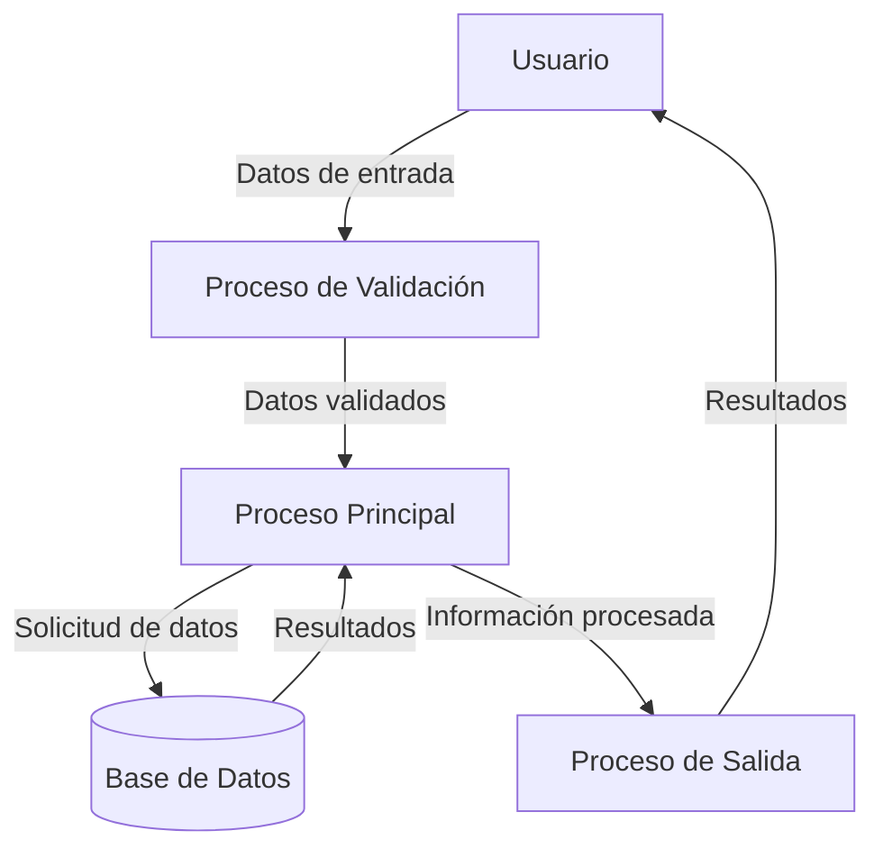

## Module: CInsertarCteNoOfrecer.cpp
# Análisis Integral del Módulo CInsertarCteNoOfrecer.cpp

## Módulo/Componente SQL
**CInsertarCteNoOfrecer.cpp** - Clase de C++ que implementa funcionalidad para insertar registros en una tabla de clientes a los que no se debe ofrecer ciertos servicios.

## Objetivos Primarios
Este módulo está diseñado para gestionar la inserción de registros en una tabla de control que identifica a clientes a los que no se debe ofrecer determinados servicios. Proporciona una interfaz para agregar, validar y gestionar estos registros en la base de datos.

## Funciones, Métodos y Consultas Críticas
- **InsertarCteNoOfrecer()**: Método principal que inserta un nuevo registro en la tabla de clientes no ofrecibles.
- **ValidarDatos()**: Valida los datos antes de la inserción.
- **ObtenerSiguienteId()**: Obtiene el siguiente ID disponible para un nuevo registro.
- **ExisteCteNoOfrecer()**: Verifica si ya existe un registro para el cliente y servicio especificados.
- **Consultas SQL principales**: INSERT para agregar registros, SELECT para validar existencia y obtener IDs.

## Variables y Elementos Clave
- **m_nIdCteNoOfrecer**: ID del registro.
- **m_nIdCliente**: ID del cliente.
- **m_nIdServicio**: ID del servicio que no se debe ofrecer.
- **m_strMotivo**: Motivo por el cual no se debe ofrecer el servicio.
- **m_nIdUsuario**: ID del usuario que realiza la operación.
- **m_dtFechaAlta**: Fecha de alta del registro.
- **Tablas**: CTE_NO_OFRECER (principal), posiblemente tablas relacionadas con clientes y servicios.

## Interdependencias y Relaciones
- Interactúa con la tabla CTE_NO_OFRECER.
- Posibles relaciones con tablas de clientes y servicios mediante IDs.
- Depende de la clase CDataBase para operaciones de base de datos.
- Utiliza CString y otros tipos de datos de MFC (Microsoft Foundation Classes).

## Operaciones Core vs. Auxiliares
- **Core**: InsertarCteNoOfrecer() - La inserción del registro en la base de datos.
- **Auxiliares**: 
  - ValidarDatos() - Validación previa a la inserción.
  - ObtenerSiguienteId() - Obtención del siguiente ID disponible.
  - ExisteCteNoOfrecer() - Verificación de duplicados.

## Secuencia Operacional/Flujo de Ejecución
1. Se inicializan los datos del cliente y servicio a no ofrecer.
2. Se validan los datos mediante ValidarDatos().
3. Se verifica si ya existe un registro similar con ExisteCteNoOfrecer().
4. Se obtiene el siguiente ID disponible con ObtenerSiguienteId().
5. Se inserta el nuevo registro en la tabla CTE_NO_OFRECER.
6. Se retorna el resultado de la operación.

## Aspectos de Rendimiento y Optimización
- Las consultas SELECT para verificación de existencia podrían beneficiarse de índices en las columnas ID_CLIENTE e ID_SERVICIO.
- La obtención del siguiente ID podría optimizarse si la base de datos soporta secuencias o identidades automáticas.
- El manejo de transacciones no es explícito, lo que podría ser un área de mejora para garantizar la integridad de los datos.

## Reusabilidad y Adaptabilidad
- La clase está diseñada específicamente para la tabla CTE_NO_OFRECER, lo que limita su reusabilidad directa.
- La estructura podría servir como plantilla para otras operaciones CRUD similares.
- La parametrización de las consultas SQL facilita su adaptación a diferentes criterios.

## Uso y Contexto
- Se utiliza en un sistema de gestión de clientes para marcar restricciones en la oferta de servicios.
- Probablemente forma parte de un sistema CRM o de gestión de relaciones con clientes.
- Se integra en un entorno MFC, sugiriendo una aplicación de escritorio para Windows.

## Suposiciones y Limitaciones
- Asume la existencia de una tabla CTE_NO_OFRECER con una estructura específica.
- Requiere que los IDs de cliente y servicio existan previamente en sus respectivas tablas.
- Depende de la implementación de CDataBase para el acceso a la base de datos.
- No maneja explícitamente transacciones, lo que podría causar problemas de integridad en caso de fallos.
- La validación de datos parece básica y podría no cubrir todos los casos de borde.
## Flow Diagram [via mermaid]

