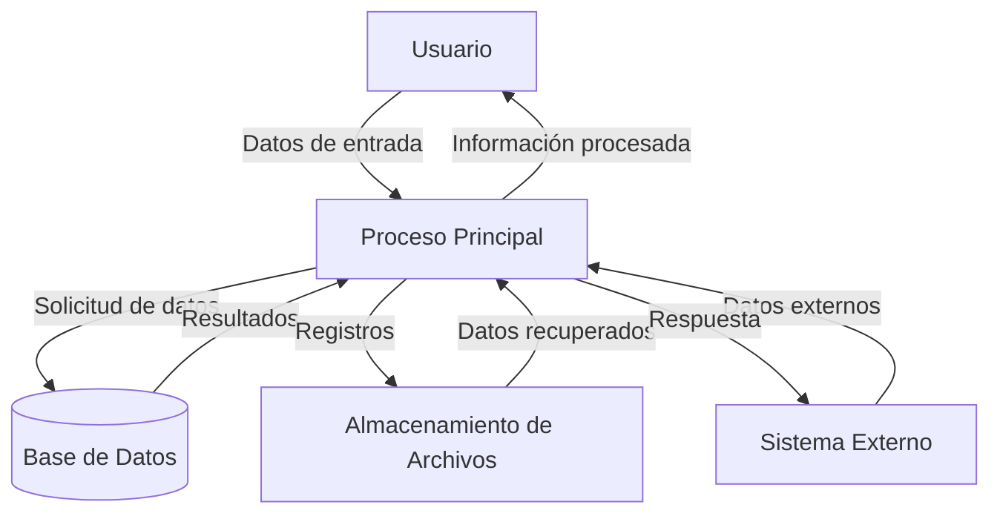

## Module: CInsertarGnTira.cpp
# Análisis Integral del Módulo CInsertarGnTira.cpp

## Nombre del Módulo/Componente SQL
**CInsertarGnTira.cpp** - Clase para la inserción de registros en la tabla GnTira.

## Objetivos Primarios
Este módulo implementa una clase que gestiona la inserción de registros en la tabla GnTira, que parece ser una tabla de control para la generación de tiras o secuencias numéricas en un sistema. Su propósito principal es encapsular la lógica necesaria para crear nuevos registros de tiras con valores específicos y manejar las transacciones de base de datos asociadas.

## Funciones, Métodos y Consultas Críticas
- **CInsertarGnTira::CInsertarGnTira()**: Constructor que inicializa la conexión a la base de datos.
- **CInsertarGnTira::~CInsertarGnTira()**: Destructor que libera recursos.
- **CInsertarGnTira::Insertar()**: Método principal que ejecuta la inserción del registro en la tabla GnTira utilizando una sentencia SQL INSERT.

## Variables y Elementos Clave
- **m_pDb**: Puntero a la conexión de base de datos.
- **m_pStmt**: Puntero al statement SQL.
- **m_pTrans**: Puntero a la transacción de base de datos.
- **Columnas de la tabla GnTira**:
  - `CdTira`: Código de la tira (clave primaria)
  - `NbTira`: Nombre de la tira
  - `VlUltimo`: Último valor generado
  - `NuLongitud`: Longitud del número
  - `TpTira`: Tipo de tira
  - `CdUsuario`: Código del usuario que crea el registro
  - `FhCreacion`: Fecha de creación del registro

## Interdependencias y Relaciones
- El módulo depende de la biblioteca de acceso a datos (`CDb`, `CStmt`, `CTrans`).
- Interactúa directamente con la tabla GnTira en la base de datos.
- Posiblemente tiene relaciones con otros módulos del sistema que requieren la generación de secuencias numéricas.

## Operaciones Principales vs. Auxiliares
- **Operación Principal**: La inserción del registro en la tabla GnTira mediante el método `Insertar()`.
- **Operaciones Auxiliares**: 
  - Inicialización de la conexión a la base de datos.
  - Manejo de transacciones (commit/rollback).
  - Gestión de errores durante la inserción.

## Secuencia Operativa/Flujo de Ejecución
1. Se crea una instancia de la clase CInsertarGnTira.
2. Se inicializa la conexión a la base de datos y los objetos relacionados.
3. Se llama al método Insertar() con los parámetros necesarios.
4. Se prepara la sentencia SQL INSERT.
5. Se ejecuta la sentencia y se verifica el resultado.
6. Se confirma la transacción si es exitosa o se revierte en caso de error.
7. Se liberan los recursos al destruir la instancia.

## Aspectos de Rendimiento y Optimización
- La clase utiliza transacciones para garantizar la integridad de los datos.
- No se observan índices específicos mencionados, pero la tabla probablemente tiene un índice en la columna CdTira.
- La operación de inserción es simple y directa, por lo que no debería presentar problemas de rendimiento significativos.

## Reusabilidad y Adaptabilidad
- La clase está diseñada siguiendo un patrón orientado a objetos que facilita su reutilización.
- Los parámetros del método Insertar() permiten adaptarlo a diferentes necesidades de creación de tiras.
- La separación de responsabilidades (conexión, transacción, ejecución) facilita su mantenimiento.

## Uso y Contexto
- Este módulo se utiliza cuando el sistema necesita crear nuevas secuencias numéricas o tiras para diversos propósitos, como la generación de identificadores únicos.
- Probablemente es invocado por otros componentes del sistema que requieren inicializar nuevas secuencias.
- Forma parte de un subsistema más amplio de gestión de datos maestros o configuración del sistema.

## Suposiciones y Limitaciones
- **Suposiciones**:
  - La tabla GnTira ya existe en la base de datos con la estructura esperada.
  - Los valores proporcionados para la inserción cumplen con las restricciones de la tabla.
  - El sistema de gestión de base de datos soporta transacciones.
  
- **Limitaciones**:
  - No se observa validación de los parámetros de entrada antes de la inserción.
  - No hay manejo específico para violaciones de unicidad o restricciones de integridad referencial.
  - La clase está diseñada para una operación específica y no proporciona funcionalidades adicionales como actualización o eliminación de registros.
## Flow Diagram [via mermaid]

