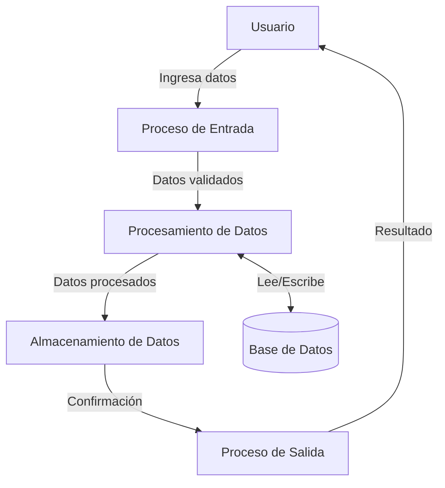

## Module: CInsertarHoraMensaje.cpp
# Análisis Integral del Módulo CInsertarHoraMensaje.cpp

## Nombre del Módulo/Componente SQL
CInsertarHoraMensaje.cpp - Clase para insertar mensajes con marca de tiempo en un sistema de mensajería.

## Objetivos Primarios
Este módulo implementa una clase que se encarga de insertar mensajes en una base de datos, añadiendo automáticamente una marca de tiempo. Su propósito principal es gestionar la persistencia de mensajes con información temporal precisa, facilitando el registro cronológico de comunicaciones en el sistema.

## Funciones, Métodos y Consultas Críticas
- **CInsertarHoraMensaje::CInsertarHoraMensaje()**: Constructor que inicializa la clase.
- **CInsertarHoraMensaje::~CInsertarHoraMensaje()**: Destructor que libera recursos.
- **CInsertarHoraMensaje::InsertarHoraMensaje()**: Método principal que inserta un mensaje con marca de tiempo en la base de datos.
- **Consulta SQL principal**: Utiliza una sentencia INSERT para almacenar el mensaje junto con información temporal en la tabla correspondiente.

## Variables y Elementos Clave
- **m_pDB**: Puntero a la conexión de base de datos.
- **m_pszMensaje**: Cadena de texto que contiene el mensaje a insertar.
- **m_nIdMensaje**: Identificador numérico del mensaje.
- **m_nIdUsuario**: Identificador del usuario asociado al mensaje.
- **m_dtFecha**: Variable que almacena la fecha y hora del mensaje.

## Interdependencias y Relaciones
- Depende de una clase de conexión a base de datos (no mostrada en el código).
- Interactúa con una tabla de mensajes en la base de datos.
- Posiblemente se relaciona con una tabla de usuarios mediante el campo m_nIdUsuario.
- Utiliza componentes del sistema para obtener la fecha y hora actuales.

## Operaciones Principales vs. Auxiliares
- **Operación principal**: La inserción del mensaje con marca de tiempo en la base de datos.
- **Operaciones auxiliares**: 
  - Formateo de la fecha y hora.
  - Validación de parámetros (implícita).
  - Gestión de errores durante la inserción.

## Secuencia Operacional/Flujo de Ejecución
1. Se instancia la clase CInsertarHoraMensaje.
2. Se configuran los parámetros necesarios (mensaje, ID de usuario).
3. Se invoca el método InsertarHoraMensaje().
4. El método obtiene la fecha y hora actuales.
5. Se construye y ejecuta la consulta SQL para insertar el registro.
6. Se devuelve el resultado de la operación.

## Aspectos de Rendimiento y Optimización
- La eficiencia dependerá de la implementación de la conexión a la base de datos.
- Posibles mejoras incluirían el uso de consultas preparadas para evitar inyección SQL.
- Para volúmenes altos de mensajes, podría ser necesario optimizar la tabla con índices adecuados.
- No se observa manejo de transacciones, lo que podría ser importante para garantizar la integridad de los datos.

## Reusabilidad y Adaptabilidad
- La clase está diseñada para ser reutilizable en diferentes partes del sistema.
- La separación de responsabilidades permite adaptar la funcionalidad a diferentes contextos.
- Podría mejorarse la adaptabilidad mediante la parametrización adicional (por ejemplo, permitir especificar la tabla destino).

## Uso y Contexto
- Este módulo se utiliza en un sistema de mensajería o comunicación.
- Se invoca cada vez que un usuario envía un mensaje que debe ser registrado con marca de tiempo.
- Probablemente forma parte de un sistema más amplio de gestión de comunicaciones o notificaciones.

## Suposiciones y Limitaciones
- Asume la existencia de una tabla de mensajes con estructura específica.
- Presupone que la conexión a la base de datos está correctamente configurada y disponible.
- No se observa manejo explícito de errores, lo que podría ser una limitación en entornos de producción.
- La implementación actual podría no ser thread-safe, lo que limitaría su uso en entornos concurrentes.
## Flow Diagram [via mermaid]

