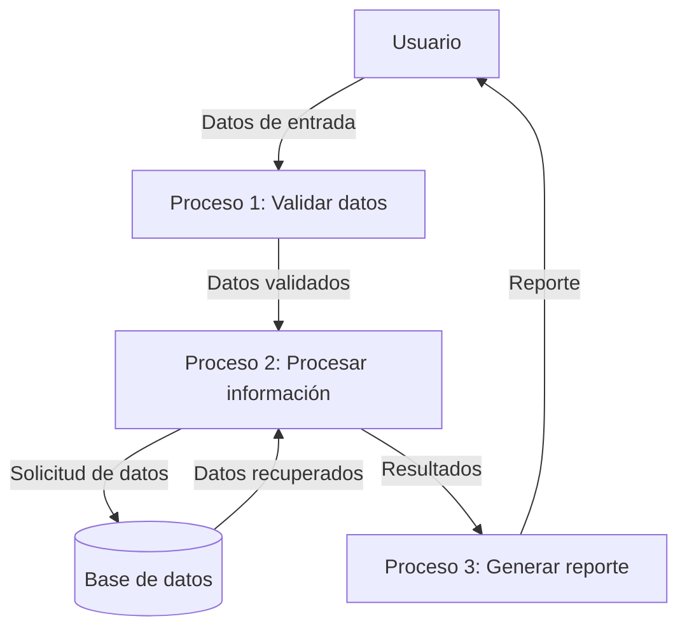

## Module: CInsertarTmpBeneficiariosCaCarmov01.cpp
# Análisis Integral del Módulo CInsertarTmpBeneficiariosCaCarmov01.cpp

## Módulo/Componente SQL
**CInsertarTmpBeneficiariosCaCarmov01.cpp** - Este es un módulo de programación en C++ que interactúa con una base de datos mediante consultas SQL.

## Objetivos Primarios
El módulo está diseñado para insertar registros en una tabla temporal de beneficiarios (`TMP_BENEFICIARIOS_CA_CARMOV01`) a partir de datos obtenidos de otras tablas del sistema. Su propósito principal es preparar datos para un proceso posterior relacionado con beneficiarios de cuentas o movimientos de cartera.

## Funciones, Métodos y Consultas Críticas
- **CInsertarTmpBeneficiariosCaCarmov01::Ejecutar()**: Función principal que coordina todo el proceso de inserción.
- **Consultas SQL principales**:
  - SELECT para obtener datos de las tablas CARMOV01, CARBEN01 y CARBEN02
  - INSERT INTO para poblar la tabla temporal TMP_BENEFICIARIOS_CA_CARMOV01
  - Uso de procedimientos almacenados como SP_OBTENER_NOMBRE_COMPLETO_CLIENTE

## Variables y Elementos Clave
- **Tablas críticas**:
  - CARMOV01: Contiene movimientos de cartera
  - CARBEN01 y CARBEN02: Contienen información de beneficiarios
  - TMP_BENEFICIARIOS_CA_CARMOV01: Tabla temporal destino
- **Columnas importantes**:
  - CARMOV01.NUMCTA, CARMOV01.NUMBEN: Identificadores de cuenta y beneficiario
  - CARBEN01.NOMBEN, CARBEN01.APEBEN, CARBEN01.AMABEN: Datos personales del beneficiario
  - CARBEN02.PORCEN: Porcentaje asignado al beneficiario
- **Parámetros clave**:
  - m_strFechaInicio y m_strFechaFin: Delimitan el rango de fechas para la consulta

## Interdependencias y Relaciones
- Existe una relación entre CARMOV01 y las tablas de beneficiarios (CARBEN01 y CARBEN02) a través de los campos NUMCTA y NUMBEN.
- El módulo depende del procedimiento almacenado SP_OBTENER_NOMBRE_COMPLETO_CLIENTE para obtener nombres completos.
- La tabla temporal creada probablemente será utilizada por otros procesos posteriores.

## Operaciones Core vs. Auxiliares
- **Core**: La consulta principal que obtiene datos de beneficiarios y los inserta en la tabla temporal.
- **Auxiliares**: 
  - Validación de parámetros de entrada
  - Manejo de errores y excepciones
  - Registro de logs de operación

## Secuencia Operacional/Flujo de Ejecución
1. Inicialización de variables y conexión a la base de datos
2. Validación de parámetros de entrada (fechas)
3. Construcción de la consulta SQL para obtener datos de beneficiarios
4. Ejecución de la consulta y procesamiento de resultados
5. Inserción de datos en la tabla temporal
6. Manejo de errores y cierre de recursos
7. Retorno del estado de la operación

## Aspectos de Rendimiento y Optimización
- La consulta utiliza JOIN entre varias tablas, lo que podría ser un punto de optimización si el volumen de datos es grande.
- No se observa uso explícito de índices, lo que podría afectar el rendimiento.
- El procesamiento por lotes podría ser beneficioso si se manejan grandes volúmenes de datos.

## Reusabilidad y Adaptabilidad
- El módulo está encapsulado en una clase, lo que facilita su reutilización.
- Los parámetros de fecha permiten cierta flexibilidad en la ejecución.
- La estructura orientada a objetos facilita la extensión o modificación del comportamiento.

## Uso y Contexto
- Este módulo parece formar parte de un sistema de gestión financiera o bancaria, específicamente relacionado con el manejo de beneficiarios de cuentas.
- Probablemente se utiliza en procesos batch o reportes que requieren información consolidada de beneficiarios.
- Se ejecuta como parte de un flujo más amplio de procesamiento de datos financieros.

## Suposiciones y Limitaciones
- **Suposiciones**:
  - Se asume que las tablas mencionadas existen y tienen la estructura esperada.
  - Se espera que el procedimiento almacenado SP_OBTENER_NOMBRE_COMPLETO_CLIENTE esté disponible.
  - Se asume un formato específico para las fechas de entrada.
- **Limitaciones**:
  - El procesamiento podría ser ineficiente para grandes volúmenes de datos.
  - No se observa manejo de transacciones explícito, lo que podría causar problemas de integridad.
  - La dependencia de estructuras de tablas específicas reduce la portabilidad del código.
## Flow Diagram [via mermaid]

