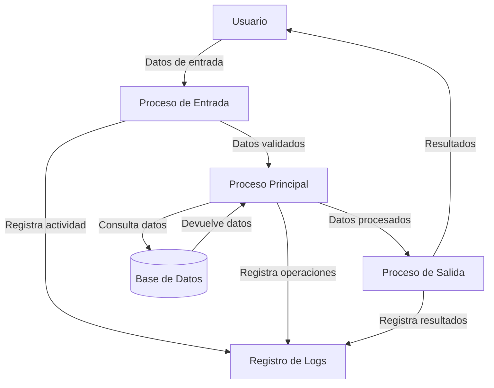
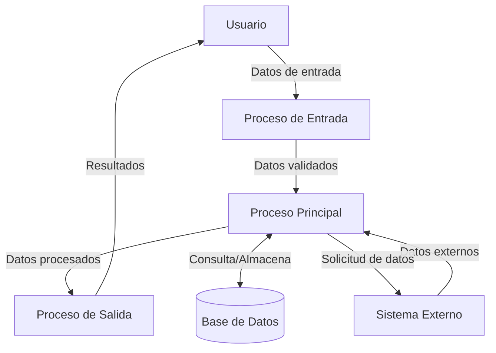

## Module: CMaximo.cpp
# Análisis Integral del Módulo CMaximo.cpp

## Módulo/Componente SQL
**CMaximo.cpp** - Módulo de clase C++ que implementa la clase CMaximo para encontrar el valor máximo en un conjunto de datos.

## Objetivos Primarios
El propósito principal de este módulo es proporcionar una clase que permita encontrar el valor máximo entre un conjunto de valores numéricos. La clase está diseñada para ser genérica, permitiendo trabajar con diferentes tipos de datos numéricos mediante el uso de plantillas (templates) en C++.

## Funciones, Métodos y Consultas Críticas
- **Constructor `CMaximo()`**: Inicializa el objeto con un valor máximo predeterminado.
- **Método `void Actualizar(T valor)`**: Actualiza el valor máximo si el nuevo valor proporcionado es mayor.
- **Método `T ObtenerMaximo()`**: Devuelve el valor máximo actual almacenado en el objeto.

## Variables y Elementos Clave
- **`m_valorMaximo`**: Variable miembro privada que almacena el valor máximo encontrado hasta el momento.
- **Parámetro de plantilla `T`**: Permite que la clase funcione con diferentes tipos de datos numéricos (int, float, double, etc.).

## Interdependencias y Relaciones
- El módulo no muestra dependencias explícitas con otros componentes del sistema.
- Utiliza la biblioteca estándar de C++ para la implementación de plantillas.
- No hay interacciones con bases de datos o sistemas externos evidentes en el código proporcionado.

## Operaciones Principales vs. Auxiliares
- **Operación Principal**: La actualización y seguimiento del valor máximo a través del método `Actualizar()`.
- **Operaciones Auxiliares**: La inicialización del valor máximo en el constructor y la recuperación del valor máximo mediante `ObtenerMaximo()`.

## Secuencia Operacional/Flujo de Ejecución
1. Se crea una instancia de la clase CMaximo con un tipo específico.
2. El valor máximo se inicializa con el valor mínimo posible para el tipo de dato.
3. A medida que se llama al método `Actualizar()` con nuevos valores, el valor máximo se actualiza si es necesario.
4. En cualquier momento, se puede obtener el valor máximo actual mediante `ObtenerMaximo()`.

## Aspectos de Rendimiento y Optimización
- La implementación es eficiente con una complejidad de tiempo O(1) para cada operación.
- No hay bucles ni estructuras de datos complejas que puedan causar problemas de rendimiento.
- El uso de plantillas permite optimización específica para cada tipo de dato sin duplicación de código.

## Reutilización y Adaptabilidad
- Alta reutilización gracias al uso de plantillas que permiten trabajar con diferentes tipos de datos.
- Fácilmente adaptable a diferentes contextos donde se necesite rastrear valores máximos.
- Diseño modular que permite su incorporación en sistemas más grandes sin modificaciones.

## Uso y Contexto
- Se utiliza en situaciones donde es necesario mantener un registro del valor máximo en un conjunto de datos que se procesan secuencialmente.
- Aplicable en análisis estadísticos, procesamiento de señales, algoritmos de optimización, etc.
- Puede ser utilizado como componente en sistemas más complejos que requieran seguimiento de valores extremos.

## Suposiciones y Limitaciones
- **Suposiciones**:
  - Se asume que el tipo de dato T tiene definido el operador de comparación ">" para poder comparar valores.
  - Se asume que existe un valor mínimo definido para el tipo T que puede ser utilizado como inicialización.
  
- **Limitaciones**:
  - No maneja casos donde se necesite rastrear múltiples valores máximos (empates).
  - No proporciona métodos para reiniciar el valor máximo después de la inicialización.
  - No incluye manejo de errores para tipos de datos que no soporten las operaciones requeridas.
## Flow Diagram [via mermaid]

## Module: CMaximo.cpp
# Análisis Integral del Módulo CMaximo.cpp

## Módulo/Componente SQL
**CMaximo.cpp** - Módulo de clase C++ que implementa la clase CMaximo para encontrar el valor máximo en un conjunto de datos.

## Objetivos Primarios
El propósito principal de este módulo es proporcionar una clase genérica que permita encontrar el valor máximo entre un conjunto de elementos de cualquier tipo de datos que soporte operaciones de comparación. La clase está diseñada para ser flexible y reutilizable en diferentes contextos donde se necesite determinar un valor máximo.

## Funciones, Métodos y Consultas Críticas
- **Constructor CMaximo()**: Inicializa la clase sin un valor máximo establecido.
- **Constructor CMaximo(T val)**: Inicializa la clase con un valor máximo inicial.
- **Método actualizar(T val)**: Método principal que compara un nuevo valor con el máximo actual y lo actualiza si es necesario.
- **Método getMaximo()**: Devuelve el valor máximo actual almacenado.

## Variables y Elementos Clave
- **m_max**: Variable miembro privada que almacena el valor máximo encontrado hasta el momento.
- **m_asignado**: Variable booleana que indica si ya se ha asignado algún valor a m_max.

## Interdependencias y Relaciones
- La clase utiliza plantillas de C++ (templates) para proporcionar genericidad, lo que permite que funcione con cualquier tipo de datos que soporte el operador de comparación ">" (mayor que).
- No tiene dependencias explícitas con otros componentes del sistema, lo que la hace altamente independiente.

## Operaciones Principales vs. Auxiliares
- **Operación principal**: El método `actualizar(T val)` que compara y actualiza el valor máximo.
- **Operaciones auxiliares**: Los constructores para inicialización y el método getter para acceder al valor máximo.

## Secuencia Operacional/Flujo de Ejecución
1. Se instancia la clase CMaximo con o sin un valor inicial.
2. Se llama al método `actualizar()` con diferentes valores a lo largo del tiempo.
3. El método compara cada nuevo valor con el máximo actual:
   - Si es el primer valor o si es mayor que el máximo actual, lo actualiza.
   - Si no, mantiene el valor máximo existente.
4. En cualquier momento, se puede obtener el valor máximo actual mediante `getMaximo()`.

## Aspectos de Rendimiento y Optimización
- La implementación es muy eficiente en términos de tiempo de ejecución, con operaciones O(1) para actualizar y recuperar el máximo.
- El uso de memoria es mínimo, almacenando solo el valor máximo y un indicador booleano.
- La clase está optimizada para operaciones frecuentes de actualización y consulta.

## Reusabilidad y Adaptabilidad
- Alta reusabilidad gracias al uso de plantillas genéricas que permiten trabajar con cualquier tipo de datos comparable.
- Fácilmente adaptable a diferentes contextos y aplicaciones donde se necesite seguimiento de valores máximos.
- Puede extenderse para incluir funcionalidades adicionales como seguimiento de múltiples máximos o implementación de criterios de comparación personalizados.

## Uso y Contexto
- Útil en escenarios donde se necesita mantener un registro del valor máximo en un flujo de datos continuo.
- Aplicable en análisis estadísticos, procesamiento de señales, monitoreo de rendimiento, y cualquier situación donde se necesite identificar valores máximos.
- Puede utilizarse en aplicaciones de tiempo real donde los datos llegan secuencialmente.

## Suposiciones y Limitaciones
- **Suposiciones**:
  - Se asume que el tipo de datos T implementa el operador de comparación ">" correctamente.
  - Se asume que la comparación entre valores de tipo T es significativa para el contexto de uso.
  
- **Limitaciones**:
  - No maneja casos de valores máximos múltiples (empates).
  - No proporciona métodos para reiniciar o limpiar el valor máximo una vez establecido.
  - No incluye manejo de errores para tipos de datos que no soporten comparaciones.
## Flow Diagram [via mermaid]

