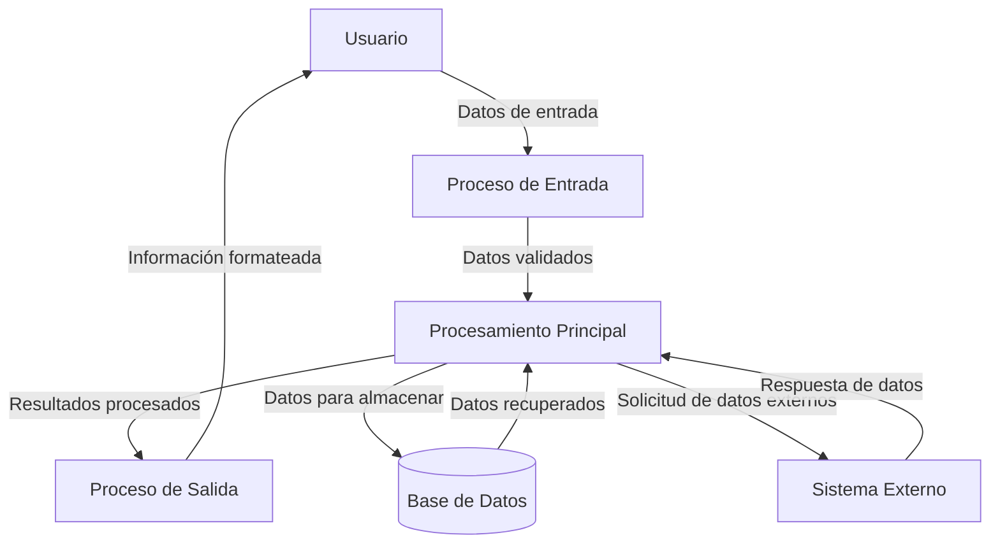

## Module: CMaximo2.cpp
# Análisis Integral del Módulo CMaximo2.cpp

## Nombre del Módulo/Componente SQL
CMaximo2.cpp - Módulo de clase C++ para manejo de valores máximos

## Objetivos Primarios
Este módulo define una clase llamada `CMaximo2` que está diseñada para almacenar y gestionar dos valores máximos de un conjunto de datos. Su propósito principal es mantener un seguimiento de los dos valores más grandes que se le proporcionan a través de operaciones de inserción.

## Funciones, Métodos y Consultas Críticas
- **Constructor `CMaximo2()`**: Inicializa los valores máximos a -1.
- **Método `Insertar(int valor)`**: Función principal que evalúa si un nuevo valor debe reemplazar alguno de los dos máximos actuales.
- **Métodos `ObtenerMaximo1()` y `ObtenerMaximo2()`**: Devuelven los valores máximos almacenados.

## Variables y Elementos Clave
- **`m_max1`**: Almacena el valor máximo encontrado.
- **`m_max2`**: Almacena el segundo valor máximo encontrado.

## Interdependencias y Relaciones
El módulo parece ser independiente y no muestra dependencias explícitas con otros componentes del sistema. No hay inclusiones de archivos de cabecera externos ni referencias a otras clases o estructuras.

## Operaciones Principales vs. Auxiliares
- **Operación Principal**: El método `Insertar(int valor)` que implementa la lógica para mantener los dos valores máximos.
- **Operaciones Auxiliares**: Los métodos getter `ObtenerMaximo1()` y `ObtenerMaximo2()` que proporcionan acceso a los valores almacenados.

## Secuencia Operacional/Flujo de Ejecución
1. Se inicializan los valores máximos a -1 en la construcción del objeto.
2. Cuando se llama a `Insertar(int valor)`:
   - Si el valor es mayor que `m_max1`, `m_max1` se convierte en `m_max2` y el nuevo valor se asigna a `m_max1`.
   - Si el valor es menor que `m_max1` pero mayor que `m_max2`, el valor se asigna a `m_max2`.
3. Los valores máximos pueden ser recuperados en cualquier momento mediante los métodos getter.

## Aspectos de Rendimiento y Optimización
El código es simple y eficiente, con operaciones de tiempo constante O(1) para todas las funciones. No hay bucles ni estructuras de datos complejas que pudieran causar problemas de rendimiento.

## Reusabilidad y Adaptabilidad
La clase es altamente reutilizable para cualquier escenario donde se necesite rastrear los dos valores máximos de un conjunto de datos. Podría adaptarse fácilmente para:
- Trabajar con otros tipos de datos (mediante templates).
- Rastrear más de dos máximos.
- Implementar funcionalidad similar para valores mínimos.

## Uso y Contexto
Esta clase probablemente se utiliza en contextos donde es importante conocer los dos valores más grandes de un conjunto, como:
- Algoritmos de clasificación.
- Análisis estadístico básico.
- Sistemas de puntuación o ranking.

## Suposiciones y Limitaciones
- **Suposiciones**: 
  - Se asume que -1 es un valor inicial adecuado, lo que podría no ser válido si los datos reales incluyen valores negativos.
  - Se asume que se trabajará con valores enteros.
  
- **Limitaciones**:
  - Solo maneja los dos valores máximos, no es configurable para más valores.
  - No tiene manejo de casos especiales como valores duplicados (si el mismo valor máximo aparece varias veces).
  - No proporciona métodos para reiniciar o limpiar los valores máximos almacenados.
## Flow Diagram [via mermaid]

