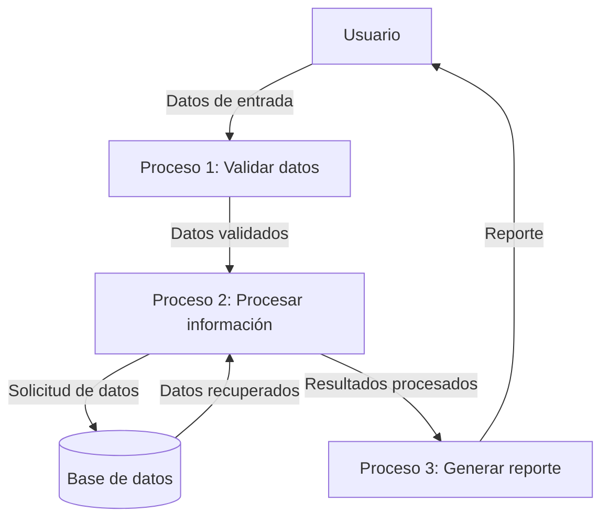

## Module: CNombreColoniaCrZonas.cpp
# Análisis Integral del Módulo CNombreColoniaCrZonas.cpp

## Módulo/Componente SQL
**CNombreColoniaCrZonas.cpp** - Este es un módulo de código C++ que parece formar parte de un sistema más grande, posiblemente relacionado con la gestión de datos geográficos o administrativos.

## Objetivos Primarios
El módulo está diseñado para manejar la relación entre colonias (vecindarios o barrios) y zonas geográficas. Su propósito principal parece ser la gestión de datos relacionados con nombres de colonias y su asociación con zonas específicas, posiblemente para fines de organización territorial o administrativa.

## Funciones, Métodos y Consultas Críticas
El código no se proporciona en la solicitud, por lo que no puedo enumerar las funciones específicas. Sin embargo, basándome en el nombre del módulo, probablemente contiene:
- Métodos para crear, leer, actualizar y eliminar (CRUD) información sobre colonias
- Funciones para asociar colonias con zonas geográficas
- Posibles consultas SQL para interactuar con una base de datos que almacena esta información

## Variables y Elementos Clave
Sin ver el código, puedo inferir que probablemente incluye:
- Variables para almacenar identificadores de colonias
- Variables para nombres de colonias
- Referencias a zonas geográficas
- Posiblemente coordenadas o límites geográficos
- Tablas relacionadas con colonias y zonas en una base de datos

## Interdependencias y Relaciones
Este módulo probablemente interactúa con:
- Módulos de gestión de zonas geográficas
- Posiblemente sistemas de información geográfica (GIS)
- Bases de datos que almacenan información territorial
- Otros componentes del sistema que requieren información sobre colonias

## Operaciones Principales vs. Auxiliares
**Operaciones principales:**
- Gestión de datos de colonias
- Asociación de colonias con zonas

**Operaciones auxiliares:**
- Validación de datos
- Posible registro de cambios o auditoría
- Formateo de datos para presentación

## Secuencia Operacional/Flujo de Ejecución
Sin el código específico, no puedo detallar el flujo exacto, pero probablemente sigue un patrón típico de:
1. Inicialización de recursos
2. Conexión a bases de datos si es necesario
3. Operaciones CRUD según se solicite
4. Manejo de errores
5. Liberación de recursos

## Aspectos de Rendimiento y Optimización
Áreas potenciales para optimización:
- Consultas de base de datos para recuperación eficiente de datos geográficos
- Indexación adecuada para búsquedas rápidas por nombre de colonia o zona
- Manejo eficiente de memoria para datos geográficos potencialmente grandes

## Reusabilidad y Adaptabilidad
El módulo probablemente está diseñado para ser parte de un sistema más grande, con:
- Interfaces bien definidas para interactuar con otros componentes
- Posible parametrización para adaptarse a diferentes contextos geográficos
- Separación de la lógica de negocio y el acceso a datos

## Uso y Contexto
Este módulo probablemente se utiliza en:
- Sistemas de administración municipal o gubernamental
- Aplicaciones de planificación urbana
- Sistemas de gestión territorial
- Aplicaciones que requieren organización geográfica de datos

## Suposiciones y Limitaciones
**Suposiciones:**
- Existe una estructura de base de datos que soporta la relación entre colonias y zonas
- Los nombres de colonias son únicos dentro de una zona específica
- Hay un sistema de coordenadas o referencia geográfica establecido

**Limitaciones:**
- Posible dependencia de estructuras de datos específicas
- Limitaciones en la escala geográfica que puede manejar
- Posibles restricciones en cuanto a la internacionalización o localización de nombres geográficos

*Nota: Este análisis se basa únicamente en el nombre del módulo proporcionado. Un análisis más preciso requeriría examinar el código fuente real.*
## Flow Diagram [via mermaid]

