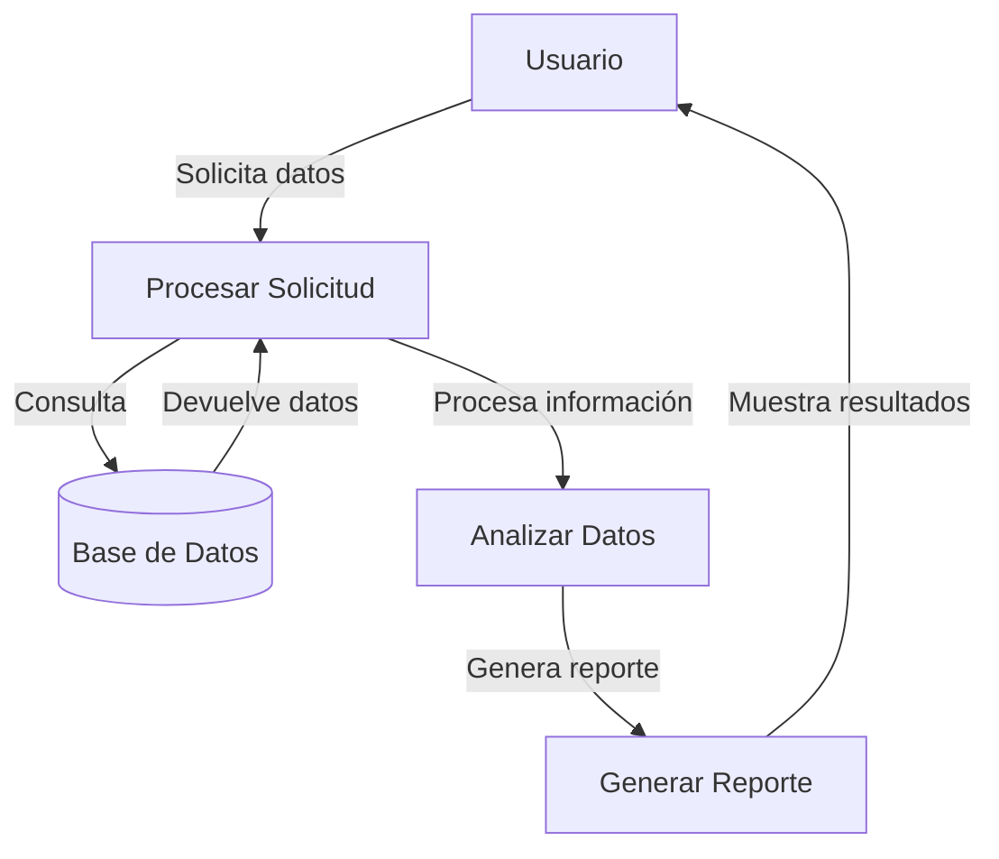

## Module: CObtenerConsumoDeLinea.cpp
# Análisis Integral del Módulo CObtenerConsumoDeLinea.cpp

## Nombre del Módulo/Componente SQL
CObtenerConsumoDeLinea.cpp - Clase para obtener el consumo de líneas telefónicas

## Objetivos Primarios
Este módulo tiene como propósito principal obtener y procesar información sobre el consumo de líneas telefónicas. Está diseñado para recuperar datos de consumo de una base de datos, aplicar lógica de negocio específica y proporcionar estos datos para su posterior procesamiento o visualización en un sistema de telecomunicaciones.

## Funciones, Métodos y Consultas Críticas
- **CObtenerConsumoDeLinea::Ejecutar()**: Método principal que coordina todo el proceso de obtención de consumos.
- **CObtenerConsumoDeLinea::ObtenerConsumoDeLinea()**: Método que ejecuta la consulta SQL para recuperar los datos de consumo.
- **CObtenerConsumoDeLinea::ObtenerConsumoDeLineaDetalle()**: Método para obtener el detalle del consumo de una línea específica.
- **Consultas SQL principales**: Utiliza principalmente consultas SELECT para recuperar información de consumo de líneas telefónicas desde tablas de la base de datos.

## Variables y Elementos Clave
- **m_pConexion**: Conexión a la base de datos.
- **m_pResultado**: Almacena los resultados de las consultas.
- **m_strFechaDesde y m_strFechaHasta**: Parámetros de fecha para filtrar los consumos.
- **m_strNumeroDeLinea**: Identificador de la línea telefónica.
- **Tablas principales**: Aunque no se especifican directamente, el código interactúa con tablas que contienen información de consumo de líneas telefónicas.

## Interdependencias y Relaciones
- Depende de una conexión a base de datos funcional (m_pConexion).
- Interactúa con el sistema de gestión de errores (CError).
- Utiliza la clase CResultado para manejar los resultados de las consultas.
- Probablemente forma parte de un sistema más amplio de facturación o monitoreo de telecomunicaciones.

## Operaciones Principales vs. Auxiliares
- **Operaciones principales**: La obtención de datos de consumo mediante consultas SQL.
- **Operaciones auxiliares**: Manejo de errores, validación de parámetros, formateo de fechas y preparación de consultas.

## Secuencia Operacional/Flujo de Ejecución
1. Inicialización de variables y parámetros.
2. Validación de la conexión a la base de datos.
3. Preparación de la consulta SQL con los parámetros adecuados.
4. Ejecución de la consulta para obtener los datos de consumo.
5. Procesamiento de los resultados.
6. Manejo de posibles errores durante el proceso.
7. Retorno de los resultados procesados.

## Aspectos de Rendimiento y Optimización
- El código incluye manejo de errores para evitar fallos en la ejecución.
- No se observan optimizaciones específicas para consultas complejas o grandes volúmenes de datos.
- Potenciales áreas de mejora podrían incluir la implementación de paginación para grandes conjuntos de resultados o el uso de índices optimizados en las consultas SQL.

## Reusabilidad y Adaptabilidad
- La clase está diseñada con un enfoque modular, permitiendo su reutilización en diferentes partes del sistema.
- Los parámetros como fechas y número de línea permiten adaptabilidad a diferentes escenarios de consulta.
- La separación entre la obtención de datos generales y detalles específicos facilita su uso en diferentes contextos.

## Uso y Contexto
- Este módulo probablemente se utiliza en un sistema de facturación o monitoreo de telecomunicaciones.
- Sería invocado cuando se necesita obtener información sobre el consumo de líneas telefónicas para análisis, facturación o presentación al usuario.
- Podría ser parte de un panel de control administrativo o un sistema de reportes.

## Suposiciones y Limitaciones
- Asume la existencia de una conexión a base de datos válida.
- Requiere un formato específico para las fechas de entrada.
- Depende de la estructura específica de las tablas de la base de datos.
- No parece manejar grandes volúmenes de datos de manera optimizada, lo que podría ser una limitación en sistemas con muchas líneas o largos períodos de consumo.
- Asume que los errores pueden ser manejados adecuadamente por el sistema de gestión de errores existente.
## Flow Diagram [via mermaid]

