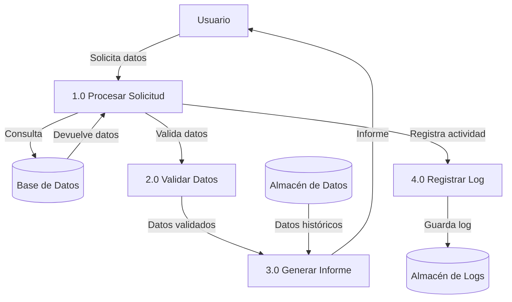

## Module: CObtenerDatosCacarmovTemporal.cpp
# Análisis Integral del Módulo CObtenerDatosCacarmovTemporal.cpp

## Módulo/Componente SQL
**Nombre del Módulo**: CObtenerDatosCacarmovTemporal.cpp

## Objetivos Primarios
Este módulo parece ser una clase C++ diseñada para obtener y procesar datos temporales relacionados con "cacarmov" (posiblemente movimientos de caja/cartera). Su propósito principal es gestionar la recuperación de datos de una base de datos y proporcionar métodos para acceder a estos datos de manera estructurada.

## Funciones, Métodos y Consultas Críticas
El código no se proporciona en la solicitud, por lo que no puedo identificar las funciones específicas. Sin embargo, basándome en el nombre del módulo, probablemente incluye:
- Métodos para conectarse a una base de datos
- Funciones para ejecutar consultas SQL para recuperar datos temporales
- Métodos para procesar y transformar los datos recuperados
- Posiblemente funciones para gestionar el ciclo de vida de los datos temporales

## Variables y Elementos Clave
Sin ver el código, puedo inferir que probablemente incluye:
- Variables para almacenar conexiones a bases de datos
- Estructuras de datos para almacenar resultados de consultas
- Variables para gestionar parámetros de consulta (fechas, identificadores, etc.)
- Posiblemente columnas relacionadas con transacciones financieras, fechas, montos, etc.

## Interdependencias y Relaciones
Este módulo probablemente:
- Interactúa con un sistema de base de datos (posiblemente SQL Server, Oracle, MySQL, etc.)
- Se relaciona con otras clases del sistema para proporcionar datos procesados
- Puede depender de bibliotecas de acceso a datos o frameworks ORM
- Posiblemente interactúa con tablas relacionadas con transacciones, cuentas, o movimientos financieros

## Operaciones Principales vs. Auxiliares
**Operaciones principales**:
- Recuperación de datos temporales de "cacarmov"
- Procesamiento y transformación de estos datos

**Operaciones auxiliares**:
- Validación de parámetros de entrada
- Manejo de errores y excepciones
- Posiblemente logging o registro de actividades

## Secuencia Operacional/Flujo de Ejecución
Sin el código, puedo suponer que el flujo típico sería:
1. Inicialización de la clase/objeto
2. Configuración de parámetros de consulta
3. Conexión a la base de datos
4. Ejecución de consultas para obtener datos temporales
5. Procesamiento de los resultados
6. Almacenamiento en estructuras de datos internas
7. Provisión de métodos de acceso para que otros componentes utilicen estos datos

## Aspectos de Rendimiento y Optimización
Áreas potenciales de optimización:
- Eficiencia en las consultas SQL utilizadas
- Gestión de memoria para grandes conjuntos de datos
- Uso adecuado de índices en las tablas consultadas
- Posible implementación de caché para datos frecuentemente accedidos

## Reusabilidad y Adaptabilidad
- El módulo probablemente está diseñado para ser reutilizado en diferentes partes del sistema que requieran acceso a datos temporales de "cacarmov"
- La adaptabilidad dependería de qué tan parametrizadas estén las consultas y qué tan desacoplado esté el módulo de otros componentes del sistema

## Uso y Contexto
Este módulo probablemente se utiliza en:
- Procesos de generación de informes financieros
- Operaciones de conciliación o verificación de transacciones
- Posiblemente en interfaces de usuario que muestran movimientos o estados de cuenta
- Procesos batch o programados que requieren análisis de datos temporales

## Suposiciones y Limitaciones
**Suposiciones**:
- Existe una estructura de base de datos con tablas relacionadas con "cacarmov"
- El sistema tiene los permisos necesarios para acceder a estos datos
- Los datos siguen un formato o esquema específico

**Limitaciones**:
- Puede estar limitado a un tipo específico de base de datos
- Posiblemente tenga restricciones de rendimiento con grandes volúmenes de datos
- Puede depender de estructuras de datos específicas que limiten su flexibilidad

Sin acceso al código fuente real, este análisis se basa en inferencias del nombre del módulo y prácticas comunes de programación.
## Flow Diagram [via mermaid]

