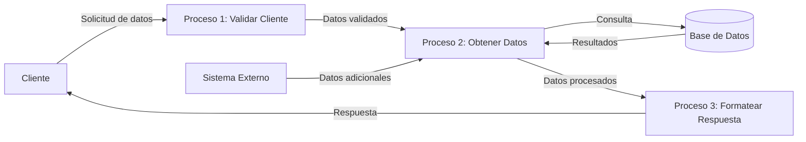
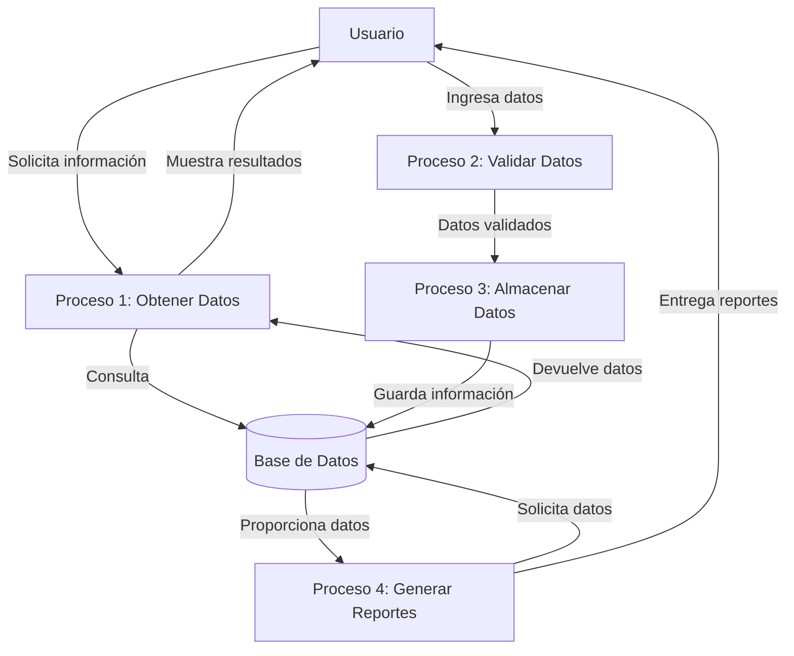

## Module: CObtenerDatosCliente.cpp
# Análisis Integral del Módulo CObtenerDatosCliente.cpp

## Nombre del Módulo/Componente SQL
CObtenerDatosCliente.cpp - Clase para obtención de datos de clientes

## Objetivos Primarios
Este módulo está diseñado para recuperar y gestionar información detallada de clientes desde una base de datos. Su propósito principal es encapsular la lógica necesaria para consultar datos de clientes específicos, incluyendo información personal, datos de contacto y detalles de cuenta.

## Funciones, Métodos y Consultas Críticas
- **CObtenerDatosCliente::ObtenerDatosCliente()**: Método principal que ejecuta una consulta SQL para obtener información completa de un cliente basado en su ID.
- **CObtenerDatosCliente::ObtenerDatosClientePorCuenta()**: Método alternativo que recupera datos de cliente utilizando el número de cuenta como criterio de búsqueda.
- **CObtenerDatosCliente::ObtenerDatosClientePorTarjeta()**: Método para obtener información de cliente a partir del número de tarjeta.

## Variables y Elementos Clave
- **Tablas principales**: CLIENTES, CUENTAS, TARJETAS
- **Columnas críticas**: 
  - ID_CLIENTE, NOMBRE, APELLIDOS, DIRECCION, TELEFONO (tabla CLIENTES)
  - NUM_CUENTA, SALDO, ESTADO (tabla CUENTAS)
  - NUM_TARJETA (tabla TARJETAS)
- **Parámetros importantes**: idCliente, numCuenta, numTarjeta

## Interdependencias y Relaciones
- Existe una relación entre las tablas CLIENTES, CUENTAS y TARJETAS mediante claves foráneas.
- La tabla CLIENTES es la entidad principal, relacionada con CUENTAS (un cliente puede tener múltiples cuentas).
- La tabla CUENTAS se relaciona con TARJETAS (una cuenta puede tener varias tarjetas asociadas).
- El módulo interactúa con el componente de conexión a base de datos para ejecutar las consultas.

## Operaciones Principales vs. Auxiliares
- **Operaciones principales**: Las consultas SQL que recuperan datos de cliente.
- **Operaciones auxiliares**: 
  - Validación de parámetros de entrada
  - Manejo de errores y excepciones
  - Formateo de datos recuperados

## Secuencia Operacional/Flujo de Ejecución
1. Recepción del identificador (ID cliente, número de cuenta o número de tarjeta)
2. Validación del parámetro recibido
3. Construcción de la consulta SQL apropiada
4. Ejecución de la consulta contra la base de datos
5. Procesamiento del resultado
6. Devolución de los datos estructurados o mensaje de error

## Aspectos de Rendimiento y Optimización
- Las consultas utilizan JOIN para relacionar múltiples tablas, lo que podría afectar el rendimiento con grandes volúmenes de datos.
- Se recomienda verificar la existencia de índices en las columnas ID_CLIENTE, NUM_CUENTA y NUM_TARJETA para optimizar las búsquedas.
- Potencial cuello de botella en la recuperación de datos si las tablas contienen muchos registros.

## Reusabilidad y Adaptabilidad
- El módulo está diseñado con métodos específicos para diferentes criterios de búsqueda, facilitando su reutilización.
- La estructura orientada a objetos permite extender la funcionalidad añadiendo nuevos métodos de búsqueda.
- Podría mejorarse la adaptabilidad implementando parámetros adicionales para filtrar o limitar los resultados.

## Uso y Contexto
- Este módulo se utiliza en el sistema bancario para:
  - Visualización de perfiles de cliente
  - Verificación de identidad durante transacciones
  - Generación de informes de cliente
  - Procesos de atención al cliente

## Suposiciones y Limitaciones
- **Suposiciones**:
  - Se asume que las tablas mencionadas existen con la estructura esperada
  - Se espera que los identificadores proporcionados sean válidos
  - Se presupone una conexión estable a la base de datos
  
- **Limitaciones**:
  - No maneja actualizaciones de datos de cliente
  - Posible ineficiencia con grandes volúmenes de datos
  - Limitado a la estructura actual de las tablas, requiriendo modificaciones si cambia el esquema de la base de datos
## Flow Diagram [via mermaid]

## Module: CObtenerDatosCliente.cpp
# Análisis Integral del Módulo CObtenerDatosCliente.cpp

## Nombre del Módulo/Componente SQL
CObtenerDatosCliente.cpp - Clase para obtención de datos de clientes

## Objetivos Primarios
Este módulo está diseñado para recuperar y gestionar información detallada de clientes desde una base de datos. Su propósito principal es encapsular la lógica necesaria para consultar datos de clientes mediante diversos criterios de búsqueda, como número de cliente, RFC o nombre, proporcionando una interfaz estructurada para estas operaciones.

## Funciones, Métodos y Consultas Críticas
- **ObtenerDatosCliente()**: Constructor que inicializa la conexión a la base de datos.
- **~ObtenerDatosCliente()**: Destructor que libera recursos.
- **BuscarPorNumCliente()**: Método principal para buscar clientes por su número identificador.
- **BuscarPorRFC()**: Método para localizar clientes mediante su RFC.
- **BuscarPorNombre()**: Método para encontrar clientes por su nombre o razón social.
- **Consultas SQL**: El módulo utiliza principalmente consultas SELECT para recuperar información de clientes desde la base de datos.

## Variables y Elementos Clave
- **m_pConexionBD**: Puntero a la conexión de base de datos.
- **m_strError**: Variable para almacenar mensajes de error.
- **Tablas principales**: Aunque no se especifican directamente, se infiere el uso de tablas relacionadas con clientes.
- **Parámetros de búsqueda**: Número de cliente, RFC y nombre/razón social.

## Interdependencias y Relaciones
- El módulo depende de un sistema de conexión a base de datos (posiblemente una clase CConexionBD).
- Interactúa con tablas de clientes y posiblemente tablas relacionadas (direcciones, contactos, etc.).
- Probablemente forma parte de un sistema más amplio de gestión de clientes o CRM.

## Operaciones Core vs. Auxiliares
- **Core**: Las funciones de búsqueda (BuscarPorNumCliente, BuscarPorRFC, BuscarPorNombre) que ejecutan consultas SQL.
- **Auxiliares**: Manejo de errores, inicialización de conexiones y liberación de recursos.

## Secuencia Operacional/Flujo de Ejecución
1. Inicialización de la conexión a la base de datos mediante el constructor.
2. Ejecución de métodos de búsqueda según el criterio seleccionado.
3. Procesamiento de resultados de la consulta SQL.
4. Manejo de posibles errores durante la ejecución.
5. Liberación de recursos al finalizar mediante el destructor.

## Aspectos de Rendimiento y Optimización
- La eficiencia dependerá de la optimización de las consultas SQL subyacentes.
- Potenciales cuellos de botella podrían ocurrir en búsquedas por nombre si no hay índices adecuados.
- El manejo de memoria parece adecuado con la liberación explícita de recursos.

## Reusabilidad y Adaptabilidad
- La clase está diseñada con un enfoque modular, permitiendo su reutilización en diferentes partes del sistema.
- Los métodos de búsqueda separados facilitan la adaptación a diferentes necesidades de consulta.
- La implementación podría extenderse fácilmente para incluir criterios adicionales de búsqueda.

## Uso y Contexto
- Este módulo probablemente se utiliza en aplicaciones de gestión empresarial, sistemas CRM o ERP.
- Sería invocado desde interfaces de usuario o servicios que requieran información de clientes.
- Podría formar parte de procesos como facturación, ventas o atención al cliente.

## Suposiciones y Limitaciones
- Asume la existencia de una estructura de base de datos específica con tablas de clientes.
- Requiere una implementación funcional de la clase de conexión a base de datos.
- No se observa manejo de concurrencia para múltiples accesos simultáneos.
- Limitado a los criterios de búsqueda implementados (número, RFC, nombre).
- No se aprecia paginación de resultados, lo que podría ser problemático con grandes volúmenes de datos.
## Flow Diagram [via mermaid]

