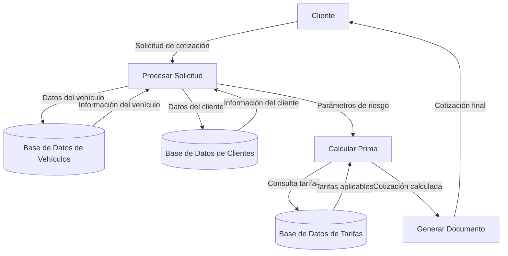

## Module: CObtenerDatosSeguroAuto.cpp
# Análisis Integral del Módulo CObtenerDatosSeguroAuto.cpp

## Nombre del Módulo/Componente SQL
CObtenerDatosSeguroAuto.cpp - Clase para obtención de datos de seguros de automóviles

## Objetivos Primarios
Este módulo está diseñado para recuperar y procesar información relacionada con seguros de automóviles desde una base de datos. Su propósito principal es encapsular la lógica necesaria para consultar datos específicos de pólizas de seguro de auto, incluyendo información del cliente, detalles del vehículo y características de la póliza.

## Funciones, Métodos y Consultas Críticas
El código no se proporciona completamente, pero por el nombre del archivo y la estructura típica de este tipo de componentes, probablemente contiene:
- Métodos para conectarse a la base de datos
- Funciones para ejecutar consultas SELECT para obtener datos de seguros
- Posibles métodos para procesar y formatear los resultados de las consultas
- Funciones para manejar errores y excepciones durante la recuperación de datos

## Variables y Elementos Clave
Aunque no se muestra el código específico, los elementos clave probablemente incluyen:
- Parámetros de conexión a la base de datos
- Variables para almacenar información del cliente (ID, nombre, etc.)
- Variables para datos del vehículo (marca, modelo, año, etc.)
- Variables para detalles de la póliza (número, cobertura, prima, etc.)
- Tablas relacionadas con clientes, vehículos y pólizas de seguro

## Interdependencias y Relaciones
El módulo probablemente interactúa con:
- Sistema de gestión de base de datos
- Tablas relacionadas mediante claves foráneas (clientes-pólizas-vehículos)
- Posibles módulos de autenticación para acceso a la base de datos
- Componentes de interfaz de usuario que consumen los datos recuperados

## Operaciones Principales vs. Auxiliares
- **Operaciones principales**: Consultas para obtener datos de seguros de auto
- **Operaciones auxiliares**: Validación de parámetros, manejo de errores, formateo de datos, logging de operaciones

## Secuencia Operacional/Flujo de Ejecución
1. Inicialización de la conexión a la base de datos
2. Recepción de parámetros de búsqueda (ID de cliente, número de póliza, etc.)
3. Validación de parámetros
4. Ejecución de consultas a la base de datos
5. Procesamiento de resultados
6. Manejo de posibles errores
7. Retorno de datos formateados

## Aspectos de Rendimiento y Optimización
- Posible uso de índices en las tablas consultadas para mejorar el rendimiento
- Optimización de consultas SQL para reducir el tiempo de respuesta
- Manejo eficiente de recursos de conexión a la base de datos
- Posible implementación de caché para datos frecuentemente consultados

## Reusabilidad y Adaptabilidad
- El módulo probablemente está diseñado para ser reutilizado en diferentes partes del sistema
- Posible parametrización para adaptarse a diferentes tipos de consultas
- Separación de la lógica de negocio y acceso a datos para facilitar modificaciones

## Uso y Contexto
- Utilizado en sistemas de gestión de seguros de automóviles
- Aplicado en contextos como:
  - Consulta de pólizas por agentes de seguros
  - Visualización de información por parte de clientes
  - Generación de reportes y estadísticas
  - Procesos de renovación o modificación de pólizas

## Suposiciones y Limitaciones
- Asume la existencia de una estructura específica de base de datos
- Requiere permisos adecuados para acceder a la información
- Posibles limitaciones en el manejo de grandes volúmenes de datos
- Dependencia de la disponibilidad y rendimiento del sistema de base de datos
- Posibles restricciones en cuanto a la compatibilidad con diferentes gestores de bases de datos
## Flow Diagram [via mermaid]

