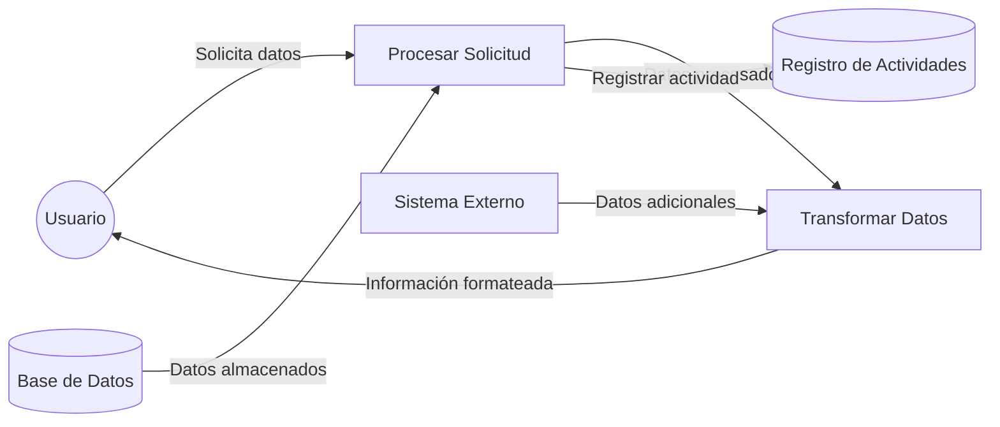

## Module: CObtenerDatosTdBeneficiariosClub.cpp
# Análisis Integral del Módulo CObtenerDatosTdBeneficiariosClub.cpp

## Nombre del Módulo/Componente SQL
CObtenerDatosTdBeneficiariosClub.cpp - Clase para obtener datos de beneficiarios de un club.

## Objetivos Primarios
Este módulo tiene como propósito principal recuperar información detallada sobre los beneficiarios asociados a un club específico desde una base de datos. Está diseñado para consultar y procesar datos de beneficiarios, incluyendo información personal y detalles de membresía.

## Funciones, Métodos y Consultas Críticas
- **CObtenerDatosTdBeneficiariosClub::Ejecutar()**: Método principal que ejecuta la consulta SQL para obtener los datos de beneficiarios.
- **CObtenerDatosTdBeneficiariosClub::ObtenerSentenciaSQL()**: Método que construye la sentencia SQL para la consulta.
- **Consulta SQL principal**: SELECT que recupera datos de beneficiarios con múltiples joins entre tablas relacionadas.

## Variables y Elementos Clave
- **Tablas principales**: 
  - TD_BENEFICIARIOS
  - TD_PERSONAS
  - TD_CLUBES
  - TD_TIPOS_BENEFICIARIOS
  - TD_TIPOS_DOCUMENTOS
  - TD_TIPOS_PARENTESCOS
  - TD_TIPOS_SEXOS
  - TD_TIPOS_ESTADOS_CIVILES
  - TD_TIPOS_ESTADOS_BENEFICIARIOS
- **Columnas críticas**: 
  - ID_BENEFICIARIO
  - ID_PERSONA
  - ID_CLUB
  - NOMBRE, APELLIDO
  - DOCUMENTO
  - FECHA_NACIMIENTO
  - Diversos campos de estado y tipo

## Interdependencias y Relaciones
- El módulo depende de múltiples tablas relacionadas mediante joins.
- Existe una relación jerárquica entre clubes, beneficiarios y personas.
- Se utilizan tablas de tipos (TD_TIPOS_*) para normalizar y categorizar la información.

## Operaciones Core vs. Auxiliares
- **Core**: La consulta SQL principal que recupera los datos de beneficiarios.
- **Auxiliares**: 
  - Validación de parámetros de entrada
  - Formateo de fechas
  - Manejo de excepciones

## Secuencia Operacional/Flujo de Ejecución
1. Se inicializa el objeto CObtenerDatosTdBeneficiariosClub con parámetros.
2. Se ejecuta el método Ejecutar().
3. Se construye la sentencia SQL mediante ObtenerSentenciaSQL().
4. Se ejecuta la consulta contra la base de datos.
5. Se procesan los resultados y se devuelven al llamador.

## Aspectos de Rendimiento y Optimización
- La consulta utiliza múltiples joins que podrían afectar el rendimiento con grandes volúmenes de datos.
- No se observa uso explícito de índices en la consulta.
- Potencial cuello de botella en la recuperación de todos los beneficiarios de un club sin paginación.

## Reusabilidad y Adaptabilidad
- El módulo está diseñado como una clase independiente, lo que facilita su reutilización.
- Los parámetros de consulta están separados de la lógica, permitiendo adaptaciones.
- La estructura de la consulta SQL podría ser más modular para facilitar modificaciones.

## Uso y Contexto
- Este módulo se utiliza probablemente en un sistema de gestión de clubes o asociaciones.
- Sirve para visualizar listados de beneficiarios asociados a un club específico.
- Podría ser utilizado en interfaces de administración o reportes.

## Suposiciones y Limitaciones
- Supone la existencia de una estructura específica de base de datos con las tablas mencionadas.
- Asume que los IDs de club son válidos y existen en la base de datos.
- No parece manejar grandes volúmenes de datos de manera optimizada (sin paginación visible).
- No se observa manejo de permisos o restricciones de acceso a los datos.
## Flow Diagram [via mermaid]

