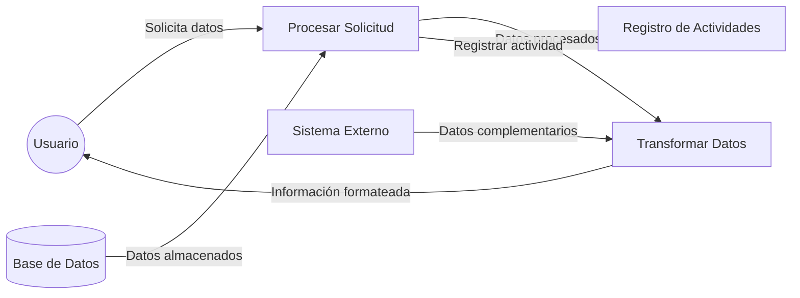

## Module: CObtenerDatosTmpCaCarmovServicio.cpp
# Análisis Integral del Módulo CObtenerDatosTmpCaCarmovServicio.cpp

## Módulo/Componente SQL
**Nombre**: CObtenerDatosTmpCaCarmovServicio.cpp

## Objetivos Primarios
Este módulo es una clase C++ diseñada para obtener y procesar datos relacionados con movimientos de servicios de carga. Su propósito principal es extraer información específica de la base de datos, aplicar transformaciones y preparar estos datos para su uso posterior en el sistema, posiblemente para facturación o seguimiento de servicios.

## Funciones, Métodos y Consultas Críticas
- **CObtenerDatosTmpCaCarmovServicio::Ejecutar()**: Método principal que coordina la ejecución de la obtención de datos.
- **CObtenerDatosTmpCaCarmovServicio::ObtenerDatos()**: Método que realiza la consulta SQL principal para extraer datos de la tabla TMP_CA_CARMOV_SERVICIO.
- **Consultas SQL**: Utiliza principalmente consultas SELECT para recuperar datos específicos basados en parámetros como ID_CARMOV y TIPO_SERVICIO.

## Variables y Elementos Clave
- **Tablas**: TMP_CA_CARMOV_SERVICIO (principal)
- **Columnas clave**: ID_CARMOV, TIPO_SERVICIO, FECHA_SERVICIO, HORA_SERVICIO, OBSERVACIONES
- **Parámetros**: m_nIdCarmov, m_nTipoServicio (utilizados para filtrar los resultados)
- **Variables de clase**: m_dtFechaServicio, m_strHoraServicio, m_strObservaciones (almacenan los resultados)

## Interdependencias y Relaciones
- El módulo interactúa con la base de datos a través de la clase CConexion.
- Depende de la tabla TMP_CA_CARMOV_SERVICIO para obtener los datos necesarios.
- Probablemente forma parte de un sistema más grande de gestión de servicios de carga o transporte.

## Operaciones Core vs. Auxiliares
- **Core**: La consulta SQL en ObtenerDatos() que extrae la información específica de la base de datos.
- **Auxiliares**: Métodos de acceso (getters) para recuperar los datos procesados, manejo de errores y validaciones.

## Secuencia Operacional/Flujo de Ejecución
1. Se inicializa la clase con parámetros específicos (ID_CARMOV y TIPO_SERVICIO).
2. Se llama al método Ejecutar() que coordina el proceso.
3. Ejecutar() llama a ObtenerDatos() para realizar la consulta a la base de datos.
4. ObtenerDatos() construye y ejecuta la consulta SQL, procesando los resultados.
5. Los datos obtenidos se almacenan en variables miembro de la clase.
6. Los métodos getter proporcionan acceso a estos datos cuando son solicitados.

## Aspectos de Rendimiento y Optimización
- La consulta SQL utiliza condiciones específicas (ID_CARMOV y TIPO_SERVICIO) que deberían estar indexadas para un rendimiento óptimo.
- El código maneja solo un registro a la vez, lo que es eficiente para consultas puntuales pero podría ser limitante para procesamiento masivo.

## Reusabilidad y Adaptabilidad
- La clase está diseñada con un enfoque modular, separando la obtención de datos de su procesamiento.
- Los parámetros de consulta están encapsulados, facilitando su reutilización con diferentes valores.
- Podría adaptarse para manejar diferentes tipos de servicios o extenderse para incluir más campos.

## Uso y Contexto
- Este módulo probablemente se utiliza en un sistema de gestión logística o de transporte.
- Se emplea para recuperar detalles específicos de servicios asociados a movimientos de carga.
- Los datos obtenidos podrían utilizarse para facturación, reportes o seguimiento operativo.

## Suposiciones y Limitaciones
- **Suposiciones**: 
  - La tabla TMP_CA_CARMOV_SERVICIO existe y tiene la estructura esperada.
  - Los campos ID_CARMOV y TIPO_SERVICIO son suficientes para identificar un registro único.
  
- **Limitaciones**:
  - Solo maneja un registro a la vez, lo que podría ser ineficiente para procesamiento por lotes.
  - No parece incluir validación exhaustiva de los datos recuperados.
  - Depende de una estructura específica de base de datos, lo que podría limitar su portabilidad.
## Flow Diagram [via mermaid]

