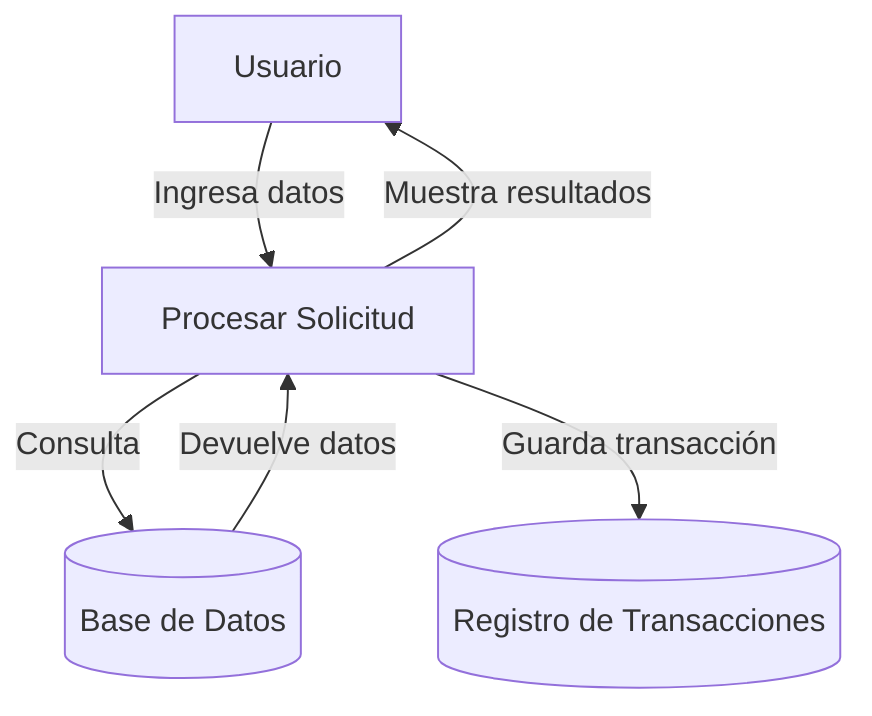

## Module: CObtenerDetalleAbonoRopa.cpp
# Análisis Integral del Módulo CObtenerDetalleAbonoRopa.cpp

## Nombre del Módulo/Componente SQL
CObtenerDetalleAbonoRopa.cpp - Clase para obtener detalles de abonos de ropa

## Objetivos Primarios
Este módulo está diseñado para recuperar y procesar información detallada sobre abonos relacionados con prendas de ropa en un sistema de gestión de inventario o ventas. Su propósito principal es consultar la base de datos para obtener información específica sobre abonos de ropa, incluyendo detalles como fechas, montos, y características de las prendas.

## Funciones, Métodos y Consultas Críticas
- **Execute()**: Método principal que ejecuta la consulta SQL para obtener los detalles del abono.
- **Consulta SQL principal**: Una consulta SELECT compleja que recupera información detallada sobre abonos de ropa, uniendo múltiples tablas y aplicando filtros específicos.

## Variables y Elementos Clave
- **Tablas principales**: 
  - ABONOS
  - ABONOS_DETALLE
  - PRENDAS
  - TIPOS_PRENDA
  - COLORES
  - TALLAS
  - MARCAS
  - CLIENTES
  - EMPLEADOS
- **Columnas clave**: 
  - ID_ABONO, FECHA_ABONO, MONTO_ABONO
  - DESCRIPCION_PRENDA, COLOR, TALLA, MARCA
  - NOMBRE_CLIENTE, APELLIDO_CLIENTE
  - NOMBRE_EMPLEADO, APELLIDO_EMPLEADO

## Interdependencias y Relaciones
El módulo establece relaciones entre múltiples tablas mediante JOINs:
- Relación entre ABONOS y ABONOS_DETALLE mediante ID_ABONO
- Relación entre ABONOS_DETALLE y PRENDAS mediante ID_PRENDA
- Relaciones adicionales con tablas de catálogo como TIPOS_PRENDA, COLORES, TALLAS y MARCAS
- Relaciones con CLIENTES y EMPLEADOS para obtener información sobre las personas involucradas en la transacción

## Operaciones Principales vs. Auxiliares
- **Operación principal**: La consulta SQL que recupera los detalles del abono de ropa
- **Operaciones auxiliares**: Posible formateo o procesamiento de los resultados obtenidos de la consulta

## Secuencia Operacional/Flujo de Ejecución
1. Se inicia el método Execute()
2. Se establece la conexión con la base de datos
3. Se ejecuta la consulta SQL principal
4. Se recuperan los resultados de la consulta
5. Se procesan los datos obtenidos
6. Se devuelven los resultados formateados

## Aspectos de Rendimiento y Optimización
- La consulta utiliza múltiples JOINs que podrían afectar el rendimiento si las tablas contienen grandes volúmenes de datos
- Posible necesidad de índices en las columnas utilizadas en las condiciones de JOIN y WHERE
- La consulta podría optimizarse evaluando si todos los campos seleccionados son necesarios

## Reusabilidad y Adaptabilidad
- El módulo parece estar diseñado específicamente para consultar abonos de ropa
- Podría adaptarse para consultar otros tipos de abonos con modificaciones en las tablas y campos consultados
- La estructura de la consulta podría servir como base para desarrollar consultas similares para otros tipos de productos

## Uso y Contexto
- Este módulo probablemente se utiliza en un sistema de gestión de ventas o inventario de ropa
- Se emplea cuando se necesita obtener información detallada sobre abonos realizados para prendas específicas
- Podría ser utilizado en interfaces de usuario para mostrar historiales de abonos, generar reportes o realizar seguimiento de pagos

## Suposiciones y Limitaciones
- Supone la existencia de una estructura específica de base de datos con las tablas y relaciones mencionadas
- Asume que los IDs utilizados en las condiciones de JOIN son válidos y existen en las tablas correspondientes
- Podría tener limitaciones en términos de rendimiento al procesar grandes volúmenes de datos debido a la complejidad de la consulta
- Posiblemente limitado a un tipo específico de abono relacionado con prendas de ropa, sin contemplar otros tipos de productos
## Flow Diagram [via mermaid]

