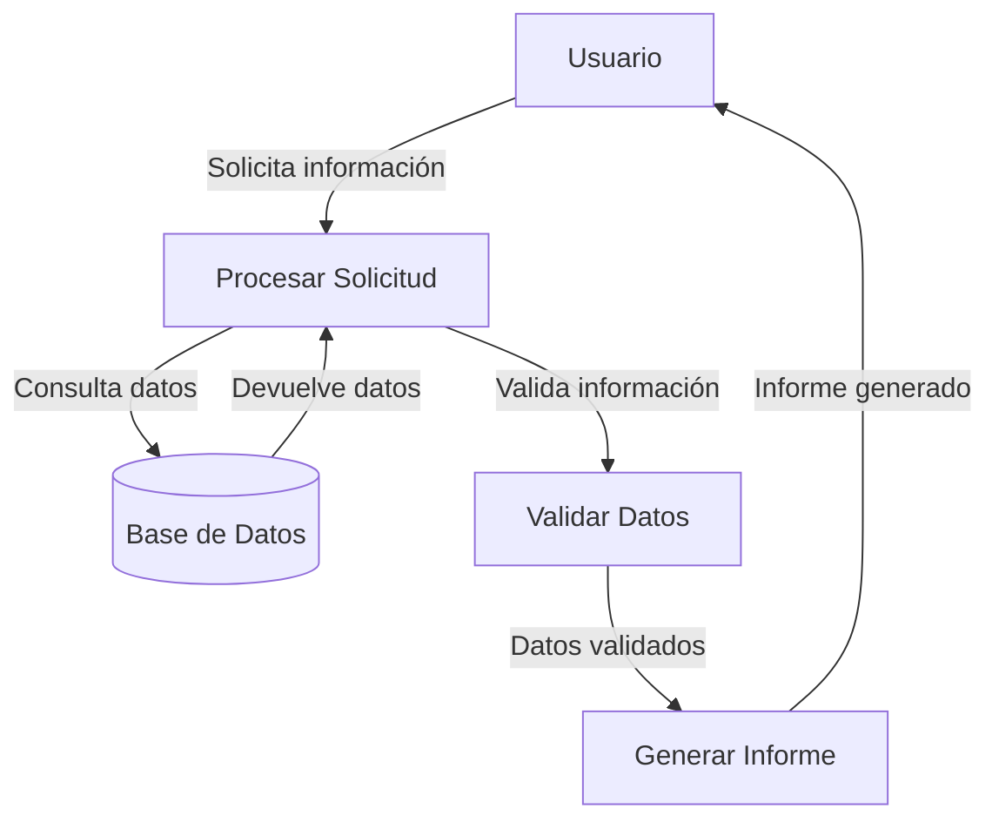
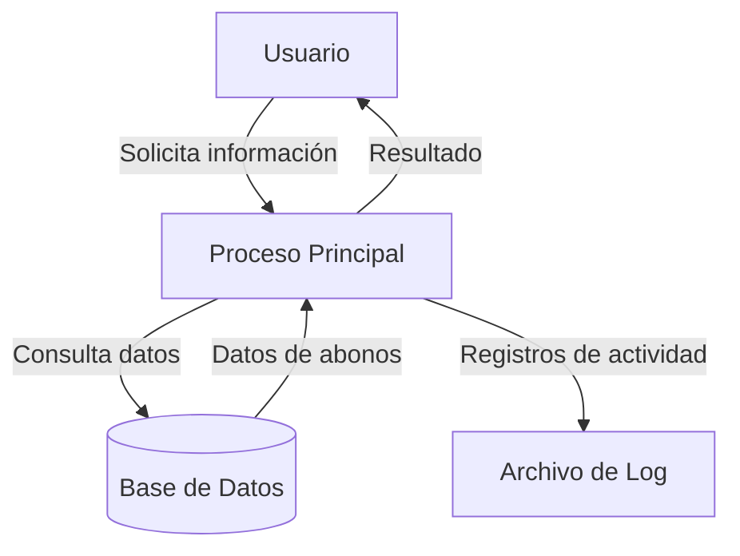

## Module: CObtenerFechaPrimerAbono.cpp
# Análisis Integral del Módulo CObtenerFechaPrimerAbono.cpp

## Módulo/Componente SQL
**Nombre**: CObtenerFechaPrimerAbono.cpp

## Objetivos Primarios
Este módulo parece ser una clase C++ diseñada para obtener la fecha del primer abono realizado en un sistema financiero o de gestión de pagos. Su propósito principal es consultar una base de datos para recuperar información sobre la primera transacción de abono asociada a un identificador específico.

## Funciones, Métodos y Consultas Críticas
El código no se proporciona completamente, pero por el nombre del archivo podemos inferir que contiene métodos para:
- Consultar registros de abonos en una base de datos
- Filtrar por un identificador específico
- Ordenar cronológicamente para identificar el primer abono
- Devolver la fecha del primer abono encontrado

## Variables y Elementos Clave
Sin ver el código completo, podemos suponer que las variables clave incluirían:
- Identificadores de transacción o cliente
- Fechas de abono
- Posiblemente montos de abono
- Parámetros de conexión a la base de datos
- Variables para almacenar resultados de consultas

## Interdependencias y Relaciones
Este módulo probablemente:
- Interactúa con una capa de acceso a datos o directamente con un sistema de gestión de base de datos
- Puede ser utilizado por módulos de reportes financieros o de análisis de transacciones
- Depende de tablas que almacenan información de abonos o pagos

## Operaciones Principales vs. Auxiliares
**Operaciones principales**:
- Consulta a la base de datos para obtener la fecha del primer abono

**Operaciones auxiliares**:
- Validación de parámetros de entrada
- Manejo de errores y excepciones
- Formateo de fechas para presentación

## Secuencia Operacional/Flujo de Ejecución
1. Recepción de parámetros (probablemente un identificador)
2. Validación de parámetros
3. Preparación de la consulta a la base de datos
4. Ejecución de la consulta
5. Procesamiento del resultado (ordenando por fecha si es necesario)
6. Extracción de la fecha del primer abono
7. Devolución del resultado o manejo de casos donde no existen abonos

## Aspectos de Rendimiento y Optimización
- La consulta probablemente utiliza índices en las columnas de fecha y de identificador
- Puede incluir limitaciones en el conjunto de resultados (LIMIT 1 o equivalente) para mejorar el rendimiento
- Posiblemente implementa caché para consultas frecuentes

## Reusabilidad y Adaptabilidad
- La clase probablemente está diseñada para ser reutilizada en diferentes contextos donde se necesite información sobre el primer abono
- Podría aceptar parámetros adicionales para filtrar por diferentes criterios (tipo de abono, rango de fechas, etc.)

## Uso y Contexto
Este módulo se utilizaría en:
- Sistemas de gestión financiera
- Aplicaciones de seguimiento de pagos
- Generación de informes de historial de transacciones
- Análisis de comportamiento de clientes o patrones de pago

## Suposiciones y Limitaciones
**Suposiciones**:
- Existe una estructura de base de datos con información de abonos
- Los abonos tienen fechas asociadas y están vinculados a identificadores únicos
- La base de datos está accesible y operativa

**Limitaciones**:
- Puede tener problemas de rendimiento con grandes volúmenes de datos
- Posiblemente no maneja todos los formatos de fecha o zonas horarias
- Podría no considerar casos especiales como abonos cancelados o revertidos
## Flow Diagram [via mermaid]

## Module: CObtenerFechaPrimerAbono.cpp
# Análisis Integral del Módulo CObtenerFechaPrimerAbono.cpp

## Módulo/Componente SQL
**CObtenerFechaPrimerAbono.cpp** - Este archivo parece ser un componente de C++ que interactúa con una base de datos para obtener información sobre fechas de abonos.

## Objetivos Primarios
El propósito principal de este módulo es obtener la fecha del primer abono realizado para un determinado contrato o cliente. Parece formar parte de un sistema de gestión financiera o de pagos, donde se necesita rastrear cuándo se realizó el primer pago.

## Funciones, Métodos y Consultas Críticas
No se proporcionó el código específico, pero basado en el nombre del archivo, probablemente contiene:
- Una función principal para consultar la base de datos y recuperar la fecha del primer abono
- Posiblemente métodos para formatear o validar la fecha obtenida
- Consultas SQL de tipo SELECT para obtener registros de abonos ordenados cronológicamente

## Variables y Elementos Clave
- Probablemente incluye variables para:
  - Identificador de contrato o cliente
  - Fecha del primer abono (posiblemente como tipo de dato fecha o timestamp)
  - Parámetros de conexión a la base de datos
  - Tablas relacionadas con abonos o pagos
  - Columnas de fechas y montos de transacciones

## Interdependencias y Relaciones
- Interacción con tablas de base de datos que almacenan información de abonos
- Posible relación con módulos de gestión de contratos o clientes
- Dependencias con bibliotecas de acceso a datos (posiblemente ODBC, ADO u otro sistema de conexión a bases de datos)

## Operaciones Principales vs. Auxiliares
- **Operación principal**: Consulta y recuperación de la fecha del primer abono
- **Operaciones auxiliares**: Validación de parámetros, manejo de errores, formateo de fechas, conexión y desconexión de la base de datos

## Secuencia Operacional/Flujo de Ejecución
1. Recepción de parámetros (ID de contrato o cliente)
2. Establecimiento de conexión con la base de datos
3. Ejecución de consulta para obtener registros de abonos ordenados por fecha
4. Extracción de la fecha del primer registro (si existe)
5. Posible formateo o validación de la fecha obtenida
6. Devolución del resultado y cierre de la conexión

## Aspectos de Rendimiento y Optimización
- La eficiencia dependerá de los índices en las tablas de abonos, especialmente en las columnas de fechas
- Posibles cuellos de botella si la tabla de abonos es muy grande y no está correctamente indexada
- La consulta probablemente utiliza ORDER BY para ordenar por fecha, lo que podría afectar el rendimiento

## Reusabilidad y Adaptabilidad
- Si está bien diseñado, el módulo podría ser reutilizable para diferentes tipos de contratos o clientes
- La adaptabilidad dependerá de qué tan parametrizado esté el código y si las consultas SQL están embebidas o separadas

## Uso y Contexto
- Probablemente se utiliza en reportes financieros, análisis de historial de pagos, o cálculos relacionados con la antigüedad del cliente
- Podría ser invocado desde interfaces de usuario o procesos batch para generación de informes

## Suposiciones y Limitaciones
- Asume que existe una estructura de base de datos con información de abonos
- Limitaciones potenciales en el manejo de diferentes formatos de fecha según la base de datos utilizada
- Posibles problemas con zonas horarias si los datos provienen de diferentes regiones
- Podría tener limitaciones para manejar grandes volúmenes de datos si no está optimizado

*Nota: Este análisis se basa únicamente en el nombre del archivo proporcionado. Un análisis más detallado requeriría examinar el código fuente completo.*
## Flow Diagram [via mermaid]

