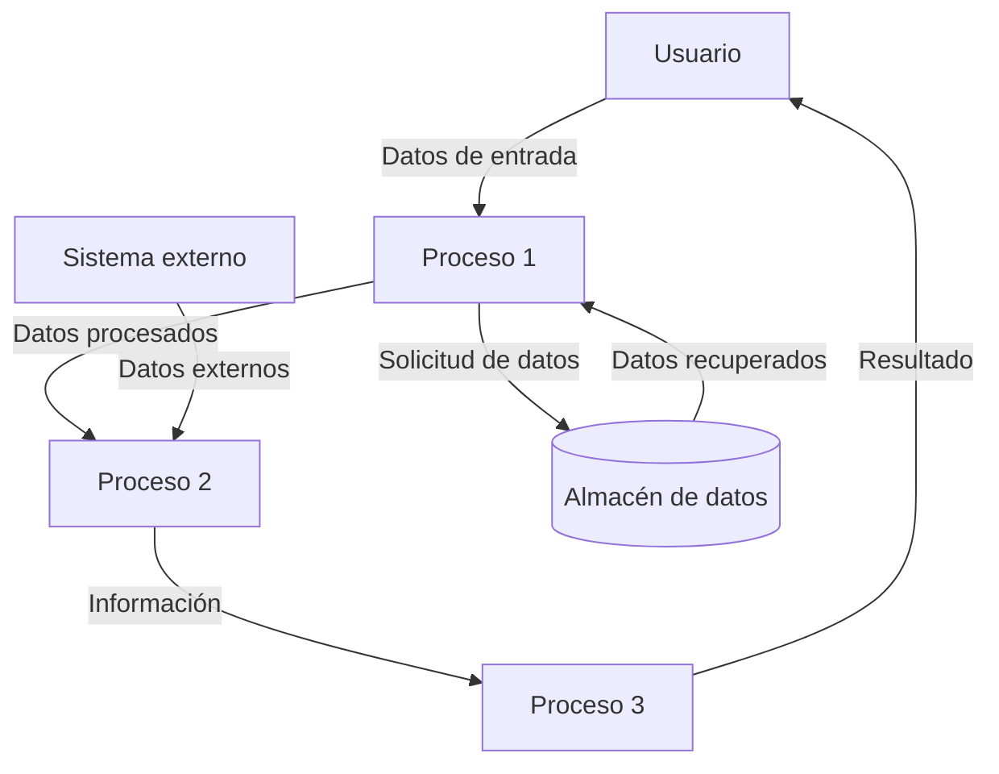

## Module: CObtenerFechaSaldaConCrCropa.cpp
# Análisis Integral del Módulo CObtenerFechaSaldaConCrCropa.cpp

## Módulo/Componente SQL
**Nombre del Módulo**: CObtenerFechaSaldaConCrCropa.cpp

## Objetivos Primarios
Este módulo parece ser una clase C++ diseñada para obtener y gestionar fechas de salida relacionadas con operaciones de crédito en un sistema financiero o de gestión. Su propósito principal es manejar la lógica para determinar fechas de salida específicas basadas en criterios de crédito y posiblemente relacionadas con operaciones agrícolas ("Cropa" podría referirse a operaciones de cultivo o agrícolas).

## Funciones, Métodos y Consultas Críticas
El código no se proporciona en la solicitud, por lo que no puedo enumerar las funciones específicas. Sin embargo, basándome en el nombre, probablemente incluye:
- Métodos para calcular o recuperar fechas de salida
- Posibles consultas SQL para obtener información de créditos
- Funciones para validar y procesar datos relacionados con fechas

## Variables y Elementos Clave
Sin ver el código, las variables probables incluirían:
- Fechas (posiblemente en formato de fecha estándar o timestamp)
- Identificadores de crédito
- Parámetros de configuración para cálculos de fechas
- Posibles referencias a tablas de base de datos relacionadas con créditos y operaciones agrícolas

## Interdependencias y Relaciones
Este módulo probablemente interactúa con:
- Sistemas de gestión de créditos
- Bases de datos que almacenan información de transacciones financieras
- Posibles módulos de calendario o gestión de tiempo
- Componentes relacionados con operaciones agrícolas o de cultivo

## Operaciones Principales vs. Auxiliares
**Operaciones principales**:
- Cálculo o recuperación de fechas de salida para créditos
- Procesamiento de criterios específicos para determinar estas fechas

**Operaciones auxiliares**:
- Validación de datos de entrada
- Manejo de errores
- Posible registro de actividades o auditoría

## Secuencia Operacional/Flujo de Ejecución
Sin el código, la secuencia probable sería:
1. Inicialización de parámetros y variables
2. Recepción de datos de entrada (identificadores de crédito, etc.)
3. Consulta a base de datos o cálculo basado en reglas de negocio
4. Procesamiento de la información obtenida
5. Devolución de las fechas de salida calculadas

## Aspectos de Rendimiento y Optimización
Áreas potenciales para optimización:
- Eficiencia en consultas a base de datos
- Manejo de memoria para grandes conjuntos de datos
- Algoritmos de cálculo de fechas
- Caché de resultados frecuentes para mejorar el rendimiento

## Reusabilidad y Adaptabilidad
Este módulo probablemente está diseñado para un contexto específico relacionado con créditos y posiblemente operaciones agrícolas. Su reusabilidad dependería de:
- Nivel de parametrización
- Separación entre lógica de negocio y acceso a datos
- Documentación clara de interfaces y dependencias

## Uso y Contexto
Este componente probablemente se utiliza en:
- Sistemas de gestión financiera
- Aplicaciones de seguimiento de créditos agrícolas
- Procesos de planificación financiera relacionados con ciclos agrícolas
- Posiblemente en reportes o análisis de cartera crediticia

## Suposiciones y Limitaciones
**Suposiciones probables**:
- Existencia de estructuras de base de datos específicas para créditos
- Formatos de fecha estandarizados
- Reglas de negocio predefinidas para determinar fechas de salida

**Limitaciones potenciales**:
- Posible dependencia de configuraciones regionales específicas
- Limitaciones en el manejo de casos especiales o excepciones
- Posible acoplamiento con sistemas específicos que dificultaría su portabilidad

Sin acceso al código fuente real, este análisis se basa en inferencias a partir del nombre del módulo y prácticas comunes en desarrollo de software financiero.
## Flow Diagram [via mermaid]

