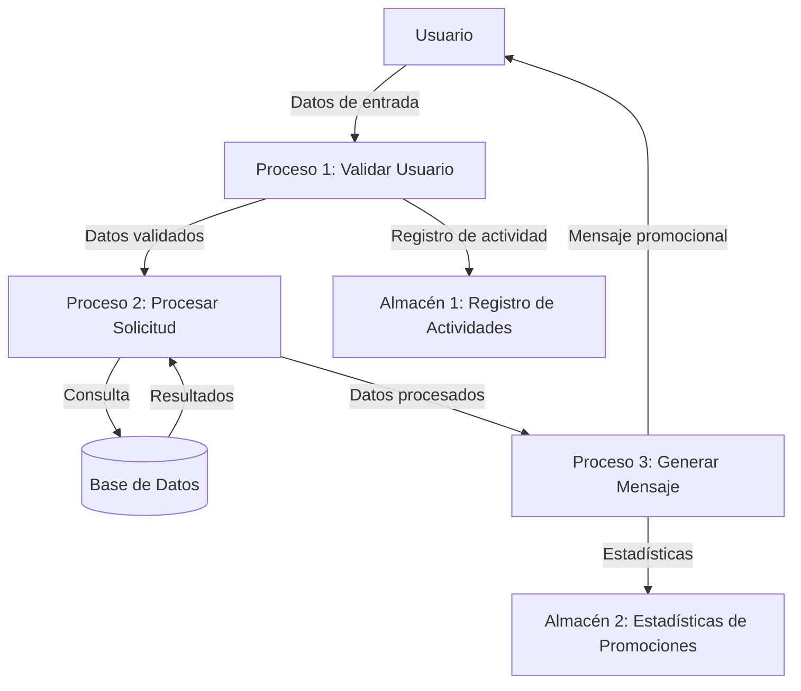

## Module: CObtenerMensajePromocionDirecta.cpp
# Análisis Integral del Módulo CObtenerMensajePromocionDirecta.cpp

## Módulo/Componente SQL
**Nombre del Módulo**: CObtenerMensajePromocionDirecta.cpp

## Objetivos Primarios
Este módulo parece ser una clase C++ diseñada para obtener mensajes de promoción directa. Su propósito principal es recuperar y gestionar mensajes promocionales específicos para clientes, posiblemente como parte de un sistema de marketing o comunicación con clientes.

## Funciones, Métodos y Consultas Críticas
El código no se ha proporcionado completamente, pero basado en el nombre del archivo, podemos inferir que probablemente contiene:
- Métodos para obtener mensajes promocionales
- Posibles consultas SQL para recuperar datos de promociones de una base de datos
- Funciones para formatear o personalizar mensajes según criterios específicos

## Variables y Elementos Clave
Sin ver el código completo, las variables clave probablemente incluirían:
- Identificadores de cliente
- Parámetros de promoción
- Variables para almacenar mensajes
- Posibles referencias a tablas de base de datos relacionadas con promociones y clientes

## Interdependencias y Relaciones
Este módulo probablemente interactúa con:
- Sistemas de gestión de clientes
- Bases de datos de campañas promocionales
- Posiblemente servicios de envío de mensajes
- Otros componentes del sistema de marketing o CRM

## Operaciones Principales vs. Auxiliares
**Operaciones principales**:
- Obtención de mensajes promocionales específicos
- Posible personalización de mensajes según datos del cliente

**Operaciones auxiliares**:
- Validación de datos
- Registro de actividades
- Manejo de errores

## Secuencia Operacional/Flujo de Ejecución
La secuencia probable sería:
1. Recibir solicitud para obtener un mensaje promocional
2. Validar parámetros de entrada
3. Consultar la base de datos para obtener información de la promoción
4. Personalizar el mensaje según datos del cliente
5. Devolver el mensaje formateado
6. Posiblemente registrar la actividad

## Aspectos de Rendimiento y Optimización
Áreas potenciales para optimización:
- Eficiencia en consultas a la base de datos
- Caché de mensajes frecuentes
- Optimización de procesamiento de datos para clientes masivos

## Reusabilidad y Adaptabilidad
Este componente probablemente está diseñado para ser:
- Reutilizable en diferentes campañas promocionales
- Adaptable a varios tipos de mensajes o canales de comunicación
- Parametrizable para diferentes segmentos de clientes

## Uso y Contexto
Este módulo probablemente se utiliza en:
- Campañas de marketing directo
- Comunicaciones personalizadas con clientes
- Sistemas de fidelización o retención de clientes
- Posiblemente integrado en un sistema CRM más amplio

## Suposiciones y Limitaciones
**Suposiciones**:
- Existencia de una estructura de base de datos con información de clientes y promociones
- Formato predefinido para mensajes promocionales
- Acceso a datos de clientes para personalización

**Limitaciones**:
- Posible dependencia de estructuras específicas de datos
- Limitaciones en la personalización según los datos disponibles
- Posibles restricciones en el volumen de mensajes que puede procesar simultáneamente

*Nota: Este análisis se basa únicamente en el nombre del archivo proporcionado, sin acceso al código fuente completo. Un análisis más detallado requeriría examinar el código real del módulo.*
## Flow Diagram [via mermaid]

