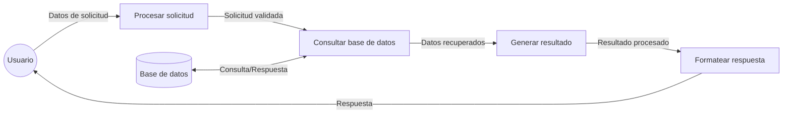
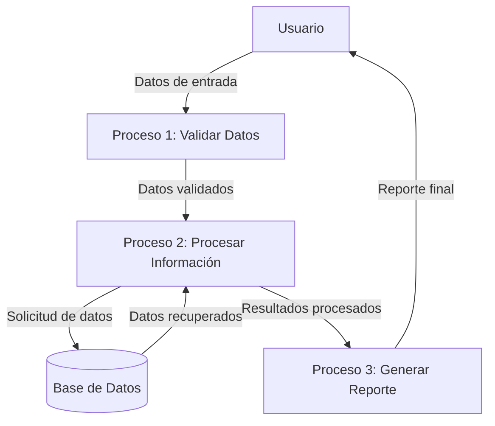

## Module: CObtenerPremioSorteoPromocion01.cpp
# Análisis Integral del Módulo CObtenerPremioSorteoPromocion01.cpp

## Módulo/Componente SQL
**CObtenerPremioSorteoPromocion01.cpp** - Este es un módulo de clase C++ que parece formar parte de un sistema de gestión de promociones y sorteos.

## Objetivos Primarios
El módulo está diseñado para obtener información sobre premios en sorteos promocionales. Su propósito principal es recuperar datos específicos de premios basados en ciertos criterios como el ID de promoción, el ID de sorteo y el número de premio, interactuando con una base de datos para extraer esta información.

## Funciones, Métodos y Consultas Críticas
- **CObtenerPremioSorteoPromocion01::Execute()**: Método principal que ejecuta la lógica de negocio para obtener información del premio.
- **CObtenerPremioSorteoPromocion01::GetRecordset()**: Método que construye y ejecuta una consulta SQL para recuperar datos del premio.
- La consulta SQL principal es un `SELECT` que obtiene información detallada sobre premios de sorteos promocionales.

## Variables y Elementos Clave
- **m_nIdPromocion**: ID de la promoción
- **m_nIdSorteo**: ID del sorteo
- **m_nNumeroPremio**: Número del premio
- **Tablas principales**: PREMIO_SORTEO_PROMOCION, SORTEO_PROMOCION, PROMOCION
- **Columnas clave**: ID_PROMOCION, ID_SORTEO, NUMERO_PREMIO, DESCRIPCION, VALOR, CANTIDAD, etc.

## Interdependencias y Relaciones
- El módulo interactúa con múltiples tablas de base de datos relacionadas con promociones y sorteos.
- Existe una relación jerárquica entre PROMOCION, SORTEO_PROMOCION y PREMIO_SORTEO_PROMOCION.
- Utiliza la clase CDBConnection para la conexión a la base de datos.
- Depende de CRecordsetFetchRows para el manejo de conjuntos de resultados.

## Operaciones Core vs. Auxiliares
- **Core**: La consulta SQL que recupera la información del premio y el procesamiento de estos datos.
- **Auxiliares**: Validación de parámetros, manejo de errores, y la configuración de la conexión a la base de datos.

## Secuencia Operacional/Flujo de Ejecución
1. Se inicializa el objeto con los parámetros necesarios (ID de promoción, ID de sorteo, número de premio).
2. Se ejecuta el método Execute() que valida los parámetros.
3. Se construye la consulta SQL en GetRecordset().
4. Se ejecuta la consulta contra la base de datos.
5. Se procesan los resultados y se almacenan en las variables miembro.
6. Se devuelve el resultado al llamador.

## Aspectos de Rendimiento y Optimización
- La consulta SQL utiliza múltiples joins que podrían afectar el rendimiento si las tablas son grandes.
- No se observa el uso explícito de índices en la consulta, lo que podría ser un área de optimización.
- El código maneja explícitamente la liberación de recursos de base de datos, lo que es bueno para el rendimiento.

## Reusabilidad y Adaptabilidad
- La clase está diseñada con un enfoque modular, permitiendo su reutilización en diferentes contextos.
- Los parámetros de entrada están bien definidos, facilitando la adaptación a diferentes escenarios.
- La separación de la lógica de negocio y el acceso a datos permite modificaciones más sencillas.

## Uso y Contexto
- Este módulo parece ser parte de un sistema más grande de gestión de promociones y sorteos.
- Se utiliza cuando se necesita recuperar información detallada sobre un premio específico en un sorteo promocional.
- Probablemente es invocado por interfaces de usuario o servicios que necesitan mostrar o procesar información de premios.

## Suposiciones y Limitaciones
- Asume que las tablas de base de datos tienen una estructura específica con columnas predefinidas.
- Requiere que los IDs proporcionados (promoción, sorteo, premio) existan en la base de datos.
- No maneja paginación para grandes conjuntos de resultados, lo que podría ser una limitación si hay muchos registros.
- El código asume una conexión de base de datos estable y disponible.
## Flow Diagram [via mermaid]

## Module: CObtenerPremioSorteoPromocion01.cpp
# Análisis Integral del Módulo CObtenerPremioSorteoPromocion01.cpp

## Módulo/Componente SQL
**CObtenerPremioSorteoPromocion01.cpp** - Este es un módulo de código C++ que parece formar parte de un sistema más grande, posiblemente relacionado con la gestión de promociones y sorteos.

## Objetivos Primarios
El propósito principal de este módulo es obtener información sobre premios asociados a sorteos promocionales. Específicamente, parece estar diseñado para recuperar datos de premios basados en ciertos criterios como el ID de la promoción, el ID del sorteo y posiblemente otros parámetros de filtrado.

## Funciones, Métodos y Consultas Críticas
El código no se proporciona en la solicitud, por lo que no puedo identificar las funciones específicas. Sin embargo, basándome en el nombre del módulo, probablemente contiene:
- Una función principal `ObtenerPremioSorteoPromocion01` que consulta una base de datos
- Posiblemente métodos para conectar con la base de datos
- Consultas SQL tipo SELECT para recuperar información de premios

## Variables y Elementos Clave
Sin ver el código, puedo inferir que probablemente incluye:
- Variables para almacenar IDs de promoción y sorteo
- Parámetros para filtrar resultados
- Variables para almacenar los resultados de la consulta (información del premio)
- Posiblemente estructuras de datos para organizar la información recuperada

## Interdependencias y Relaciones
Este módulo probablemente:
- Interactúa con una base de datos que contiene tablas de promociones, sorteos y premios
- Puede depender de módulos de conexión a base de datos
- Posiblemente se relaciona con otros módulos del sistema de gestión de promociones

## Operaciones Principales vs. Auxiliares
- **Operaciones principales**: Consulta y recuperación de datos de premios
- **Operaciones auxiliares**: Validación de parámetros, manejo de errores, formateo de resultados

## Secuencia Operacional/Flujo de Ejecución
Sin el código específico, un flujo típico podría ser:
1. Recibir parámetros de entrada (IDs de promoción y sorteo)
2. Validar los parámetros
3. Establecer conexión con la base de datos
4. Ejecutar la consulta SQL
5. Procesar los resultados
6. Devolver la información del premio o un mensaje de error

## Aspectos de Rendimiento y Optimización
Áreas potenciales para optimización:
- Eficiencia de las consultas SQL utilizadas
- Manejo de memoria para los resultados
- Posible implementación de caché para consultas frecuentes

## Reusabilidad y Adaptabilidad
- El módulo parece estar diseñado para una función específica, pero podría ser adaptable a diferentes tipos de promociones o sorteos
- La reusabilidad dependerá de qué tan parametrizado esté el código y cuán acoplado esté a estructuras de datos específicas

## Uso y Contexto
Este módulo probablemente se utiliza en:
- Sistemas de gestión de promociones y marketing
- Aplicaciones que necesitan mostrar información sobre premios disponibles
- Posiblemente en procesos de asignación de premios a ganadores

## Suposiciones y Limitaciones
- Asume la existencia de una estructura de base de datos específica con tablas para promociones, sorteos y premios
- Probablemente está limitado a un formato específico de datos de premio
- Puede tener limitaciones en términos de volumen de datos que puede procesar eficientemente
- Posiblemente asume ciertos estados o condiciones de los premios (disponibles, asignados, etc.)

*Nota: Este análisis se basa únicamente en el nombre del archivo proporcionado. Un análisis más detallado requeriría examinar el código fuente real.*
## Flow Diagram [via mermaid]

