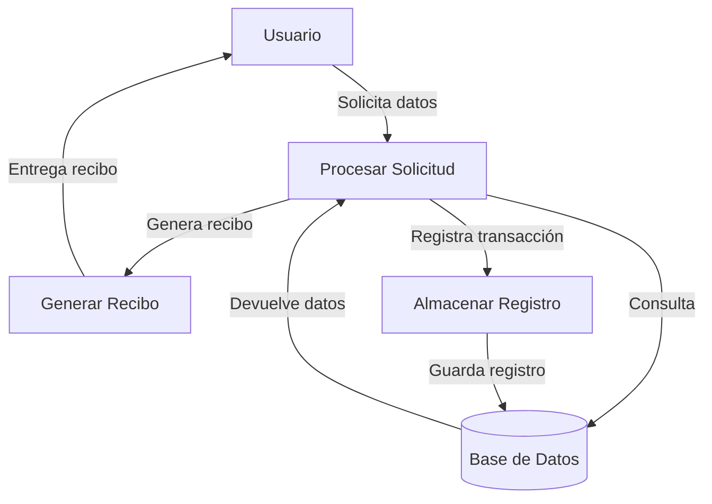
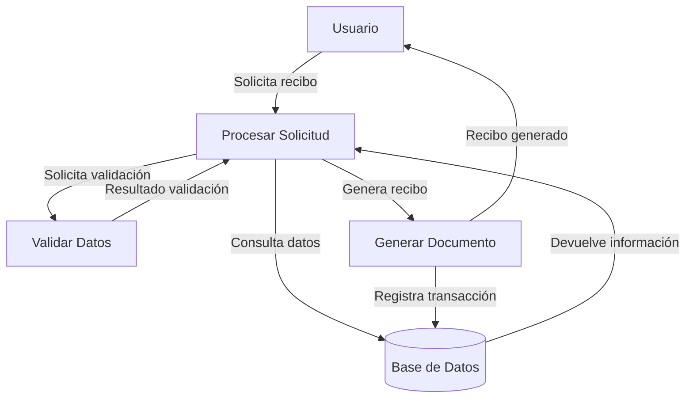

## Module: CObtenerReciboJapac.cpp
# Análisis Integral del Módulo CObtenerReciboJapac.cpp

## Nombre del Módulo/Componente SQL
CObtenerReciboJapac.cpp - Clase para obtención de recibos de JAPAC (Junta de Agua Potable y Alcantarillado de Culiacán)

## Objetivos Primarios
Este módulo está diseñado para gestionar la obtención de recibos de agua de JAPAC. Su propósito principal es conectarse a la base de datos, recuperar información de recibos basada en diferentes criterios (número de contrato, fecha, etc.) y formatear estos datos para su presentación o procesamiento posterior.

## Funciones, Métodos y Consultas Críticas
- **CObtenerReciboJapac::CObtenerReciboJapac()**: Constructor que inicializa la conexión a la base de datos.
- **CObtenerReciboJapac::~CObtenerReciboJapac()**: Destructor que libera recursos.
- **CObtenerReciboJapac::ObtenerRecibo()**: Método principal que recupera información de recibos según diferentes parámetros.
- **CObtenerReciboJapac::ObtenerRecibosPorContrato()**: Obtiene recibos específicos por número de contrato.
- **CObtenerReciboJapac::ObtenerRecibosPorFecha()**: Recupera recibos basados en un rango de fechas.

Las consultas SQL principales son SELECT que recuperan datos de recibos con diferentes criterios de filtrado.

## Variables y Elementos Clave
- **m_pConexionBD**: Puntero a la conexión de base de datos.
- **m_pRecordset**: Conjunto de registros para almacenar resultados de consultas.
- **Tablas principales**: RECIBOS_JAPAC, USUARIOS_JAPAC
- **Columnas clave**: 
  - NUM_CONTRATO
  - FECHA_EMISION
  - FECHA_VENCIMIENTO
  - IMPORTE
  - NOMBRE_USUARIO
  - DIRECCION
  - PERIODO

## Interdependencias y Relaciones
- Depende de la biblioteca ADO para conexiones a bases de datos.
- Interactúa con las tablas RECIBOS_JAPAC y USUARIOS_JAPAC, posiblemente relacionadas por el campo NUM_CONTRATO.
- Utiliza la clase CConexionBD para establecer y gestionar la conexión a la base de datos.

## Operaciones Principales vs. Auxiliares
**Operaciones principales**:
- Consulta y recuperación de datos de recibos
- Formateo de la información para presentación

**Operaciones auxiliares**:
- Manejo de errores y excepciones
- Validación de parámetros de entrada
- Conversión de tipos de datos

## Secuencia Operacional/Flujo de Ejecución
1. Inicialización de la conexión a la base de datos
2. Recepción de parámetros de búsqueda (contrato, fechas, etc.)
3. Construcción de la consulta SQL según los criterios
4. Ejecución de la consulta y recuperación de resultados
5. Procesamiento y formateo de los datos obtenidos
6. Devolución de los resultados al solicitante
7. Liberación de recursos

## Aspectos de Rendimiento y Optimización
- Las consultas podrían beneficiarse de índices en NUM_CONTRATO y campos de FECHA para mejorar el rendimiento.
- La gestión de memoria parece adecuada con la liberación de recursos en el destructor.
- Potencial cuello de botella en consultas por fecha si el rango es muy amplio y no hay índices apropiados.

## Reusabilidad y Adaptabilidad
- La clase está diseñada específicamente para JAPAC, lo que limita su reusabilidad directa.
- Los métodos de obtención de recibos están parametrizados, permitiendo diferentes criterios de búsqueda.
- La separación de métodos por tipo de búsqueda facilita la adaptación a nuevos requisitos.

## Uso y Contexto
Este módulo probablemente forma parte de un sistema más grande de gestión de servicios públicos o un portal de pagos. Se utiliza para:
- Consultar el historial de recibos de un usuario
- Generar informes de facturación
- Facilitar el pago de servicios de agua
- Proporcionar información para análisis de consumo

## Suposiciones y Limitaciones
**Suposiciones**:
- La estructura de las tablas RECIBOS_JAPAC y USUARIOS_JAPAC es estable y conocida.
- Los formatos de fecha siguen un estándar específico.
- La conexión a la base de datos está configurada correctamente.

**Limitaciones**:
- Específico para la estructura de datos de JAPAC.
- No parece manejar grandes volúmenes de datos de manera paginada.
- Posible dependencia de versiones específicas de ADO o controladores de base de datos.
## Flow Diagram [via mermaid]

## Module: CObtenerReciboJapac.cpp
# Análisis Integral del Módulo CObtenerReciboJapac.cpp

## Nombre del Módulo/Componente SQL
CObtenerReciboJapac.cpp - Clase para obtención de recibos de JAPAC (Junta de Agua Potable y Alcantarillado de Culiacán)

## Objetivos Primarios
Este módulo está diseñado para gestionar la obtención de recibos de agua de JAPAC. Su propósito principal es conectarse a una base de datos, ejecutar consultas SQL para recuperar información de recibos basándose en parámetros específicos como número de cuenta, y formatear estos datos para su presentación o procesamiento posterior.

## Funciones, Métodos y Consultas Críticas
- **CObtenerReciboJapac::CObtenerReciboJapac()**: Constructor que inicializa variables y establece la conexión a la base de datos.
- **CObtenerReciboJapac::~CObtenerReciboJapac()**: Destructor que libera recursos.
- **CObtenerReciboJapac::ObtenerRecibo()**: Método principal que ejecuta la consulta SQL para obtener datos del recibo según el número de cuenta.
- **CObtenerReciboJapac::ObtenerReciboFecha()**: Método para obtener recibos basados en fecha y número de cuenta.
- **CObtenerReciboJapac::ObtenerReciboFechaFolio()**: Método para obtener recibos según fecha y folio.

## Variables y Elementos Clave
- **m_pConnection**: Objeto de conexión a la base de datos.
- **m_pRecordset**: Conjunto de registros para almacenar resultados de consultas.
- **m_strCuenta**: Número de cuenta del cliente.
- **m_strFecha**: Fecha para filtrar recibos.
- **m_strFolio**: Número de folio del recibo.
- **Tablas principales**: Aparentemente se consultan tablas relacionadas con recibos de agua, aunque no se especifican directamente en el código proporcionado.

## Interdependencias y Relaciones
- El módulo depende de una conexión a base de datos (posiblemente SQL Server o similar).
- Utiliza la biblioteca ADO (ActiveX Data Objects) para interactuar con la base de datos.
- Interactúa con tablas que contienen información de recibos de JAPAC.
- Posiblemente se integra con otros componentes de un sistema más grande de gestión de servicios públicos.

## Operaciones Principales vs. Auxiliares
- **Operaciones principales**: 
  - Ejecución de consultas SQL para recuperar datos de recibos.
  - Formateo y presentación de la información obtenida.
- **Operaciones auxiliares**:
  - Manejo de conexiones a la base de datos.
  - Validación de parámetros de entrada.
  - Manejo de errores y excepciones.

## Secuencia Operacional/Flujo de Ejecución
1. Inicialización de la conexión a la base de datos en el constructor.
2. Recepción de parámetros (cuenta, fecha, folio) según el método invocado.
3. Construcción de la consulta SQL correspondiente.
4. Ejecución de la consulta y recuperación de resultados.
5. Procesamiento de los datos obtenidos.
6. Liberación de recursos al finalizar.

## Aspectos de Rendimiento y Optimización
- La eficiencia dependerá de la estructura de las consultas SQL utilizadas.
- Posibles áreas de optimización incluyen el manejo de conexiones (abrir/cerrar) y la estructura de las consultas.
- No se observa uso explícito de índices o estrategias de optimización de consultas en el código proporcionado.

## Reusabilidad y Adaptabilidad
- La clase está diseñada específicamente para JAPAC, lo que podría limitar su reusabilidad directa.
- La separación de métodos según diferentes criterios de búsqueda (cuenta, fecha, folio) permite cierta flexibilidad.
- Para adaptarlo a otros sistemas de agua, se requerirían modificaciones en las consultas SQL y posiblemente en la estructura de datos.

## Uso y Contexto
- Este módulo probablemente forma parte de un sistema más amplio de gestión de servicios públicos o facturación.
- Se utiliza para consultar y posiblemente imprimir recibos de agua para los clientes de JAPAC.
- Podría integrarse con interfaces de usuario para mostrar o imprimir recibos.

## Suposiciones y Limitaciones
- **Suposiciones**:
  - Existe una estructura de base de datos específica con tablas que contienen información de recibos.
  - Los parámetros de entrada (cuenta, fecha, folio) siguen formatos predefinidos.
  - La conexión a la base de datos está configurada correctamente.
- **Limitaciones**:
  - El código está específicamente diseñado para JAPAC y podría requerir modificaciones significativas para otros contextos.
  - No se observa manejo robusto de errores o validación exhaustiva de datos.
  - La dependencia de ADO podría limitar la portabilidad a entornos no Windows.
## Flow Diagram [via mermaid]

