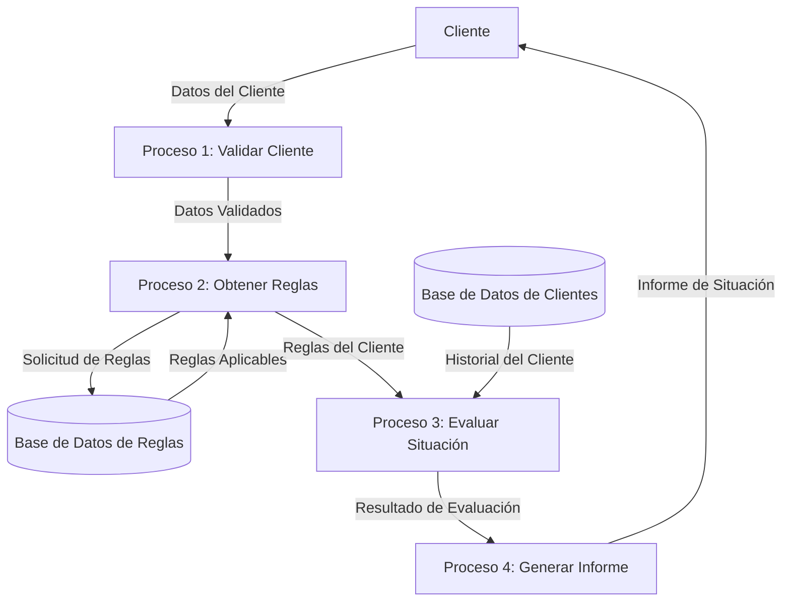

## Module: CObtenerSituacionReglaCliente.cpp
# Análisis Integral del Módulo CObtenerSituacionReglaCliente.cpp

## Nombre del Módulo/Componente SQL
CObtenerSituacionReglaCliente.cpp - Clase para obtener la situación de reglas de clientes

## Objetivos Primarios
Este módulo tiene como propósito principal obtener y evaluar la situación de las reglas aplicables a un cliente específico en un sistema de gestión. Está diseñado para recuperar información sobre reglas de negocio asociadas a clientes y determinar su estado actual de cumplimiento.

## Funciones, Métodos y Consultas Críticas
- **CObtenerSituacionReglaCliente::Inicializar()**: Inicializa los parámetros necesarios para la ejecución.
- **CObtenerSituacionReglaCliente::Ejecutar()**: Método principal que coordina la ejecución del proceso.
- **CObtenerSituacionReglaCliente::ObtenerSituacionReglaCliente()**: Recupera la situación de las reglas aplicables al cliente.
- **CObtenerSituacionReglaCliente::ObtenerSituacionReglaClienteHistorico()**: Obtiene datos históricos sobre la situación de las reglas.
- **CObtenerSituacionReglaCliente::ObtenerSituacionReglaClienteActual()**: Obtiene la situación actual de las reglas del cliente.

## Variables y Elementos Clave
- **m_pConexion**: Conexión a la base de datos.
- **m_pParametros**: Parámetros de entrada para la ejecución.
- **m_pResultado**: Almacena los resultados de la ejecución.
- **m_pLog**: Sistema de registro de eventos.
- **m_nCodigoCliente**: Identificador del cliente a evaluar.
- **m_nCodigoRegla**: Identificador de la regla a evaluar.
- **m_nCodigoSituacion**: Código que representa la situación actual de la regla.

## Interdependencias y Relaciones
- Depende de la clase base **CModulo** para la estructura general.
- Interactúa con la base de datos a través de **m_pConexion**.
- Utiliza **CParametros** para recibir parámetros de entrada.
- Emplea **CResultado** para devolver los resultados.
- Se relaciona con tablas de clientes, reglas y situaciones (aunque no se especifican los nombres exactos de las tablas).

## Operaciones Principales vs. Auxiliares
- **Operaciones Principales**:
  - Obtención de la situación de reglas para un cliente específico.
  - Evaluación del estado actual de cumplimiento de reglas.
  
- **Operaciones Auxiliares**:
  - Inicialización de parámetros.
  - Registro de eventos y errores.
  - Validación de datos de entrada.

## Secuencia Operacional/Flujo de Ejecución
1. Inicialización de parámetros mediante **Inicializar()**.
2. Ejecución principal a través de **Ejecutar()**.
3. Obtención de datos históricos o actuales según los parámetros.
4. Procesamiento de la información recuperada.
5. Generación y devolución de resultados.

## Aspectos de Rendimiento y Optimización
- El código parece implementar un manejo de errores básico, pero podría beneficiarse de una gestión más robusta.
- No se observan optimizaciones específicas para consultas a la base de datos.
- La estructura modular permite un procesamiento eficiente, pero podría mejorarse con caché para consultas frecuentes.

## Reusabilidad y Adaptabilidad
- La clase está diseñada siguiendo un patrón modular que facilita su reutilización.
- La separación entre inicialización, ejecución y obtención de resultados permite adaptarla a diferentes contextos.
- La parametrización de las consultas facilita su adaptación a diferentes clientes y reglas.

## Uso y Contexto
- Este módulo se utiliza probablemente en un sistema de gestión de clientes o de cumplimiento normativo.
- Se invoca cuando es necesario evaluar si un cliente cumple con ciertas reglas de negocio.
- Puede ser parte de un proceso más amplio de evaluación de riesgos o cumplimiento.

## Suposiciones y Limitaciones
- Asume la existencia de una estructura de base de datos con información sobre clientes y reglas.
- Requiere que los parámetros de entrada estén correctamente formateados.
- No parece manejar procesamiento concurrente, lo que podría ser una limitación en sistemas con alta carga.
- La falta de comentarios detallados en el código podría dificultar su mantenimiento a largo plazo.
## Flow Diagram [via mermaid]

