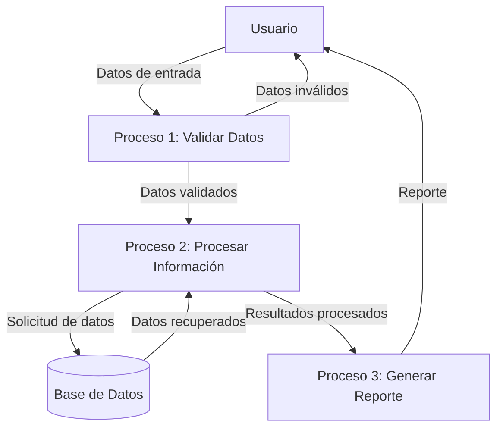

## Module: COrigenSeguro.cpp
# Análisis Integral del Módulo COrigenSeguro.cpp

## Módulo/Componente SQL
**Nombre del Módulo**: COrigenSeguro.cpp

## Objetivos Primarios
Este módulo implementa la clase `COrigenSeguro` que gestiona la validación de orígenes seguros en un sistema. Su propósito principal es determinar si un origen específico es considerado seguro según diferentes criterios como dirección IP, nombre de host, y otros parámetros de seguridad.

## Funciones, Métodos y Consultas Críticas
- **EsOrigenSeguro()**: Función principal que evalúa si un origen es seguro basándose en múltiples criterios.
- **EsOrigenSeguroIP()**: Verifica si una dirección IP está en la lista de orígenes seguros.
- **EsOrigenSeguroHost()**: Comprueba si un nombre de host está en la lista de orígenes seguros.
- **EsOrigenSeguroParametros()**: Valida si los parámetros de seguridad cumplen con los requisitos establecidos.
- **CargarOrigenesSegurosBD()**: Carga los orígenes seguros desde la base de datos.

## Variables y Elementos Clave
- **m_listaOrigenesIP**: Vector que almacena las direcciones IP consideradas seguras.
- **m_listaOrigenesHost**: Vector que contiene los nombres de host seguros.
- **m_parametrosSeguridad**: Estructura que almacena los parámetros de seguridad configurados.
- **m_bCargado**: Bandera que indica si los orígenes seguros han sido cargados.
- **m_mutex**: Objeto de sincronización para operaciones thread-safe.

## Interdependencias y Relaciones
- Interactúa con un sistema de base de datos para cargar la configuración de orígenes seguros.
- Posiblemente se integra con un sistema de autenticación o firewall.
- Depende de bibliotecas de red para la validación de direcciones IP y resolución de nombres de host.
- Utiliza mecanismos de sincronización para operaciones concurrentes.

## Operaciones Principales vs. Auxiliares
**Operaciones Principales**:
- Validación de orígenes seguros mediante IP, host y parámetros.
- Carga de configuración desde la base de datos.

**Operaciones Auxiliares**:
- Inicialización y limpieza de estructuras de datos.
- Logging de intentos de acceso y resultados de validación.
- Sincronización para acceso concurrente.

## Secuencia Operacional/Flujo de Ejecución
1. Inicialización de la clase con parámetros de configuración.
2. Carga de orígenes seguros desde la base de datos.
3. Recepción de solicitudes de validación de orígenes.
4. Evaluación secuencial: primero por IP, luego por host, finalmente por parámetros.
5. Retorno del resultado de validación.
6. Posible actualización periódica de la lista de orígenes seguros.

## Aspectos de Rendimiento y Optimización
- La carga de orígenes seguros desde la base de datos podría ser un potencial cuello de botella.
- El uso de estructuras de datos eficientes (posiblemente hash maps) para búsquedas rápidas de IPs y hosts.
- La sincronización mediante mutex podría afectar el rendimiento en entornos de alta concurrencia.
- Posible implementación de caché para resultados de validaciones frecuentes.

## Reusabilidad y Adaptabilidad
- El diseño modular permite su integración en diferentes sistemas de seguridad.
- La separación de validaciones por tipo (IP, host, parámetros) facilita la extensión con nuevos criterios.
- La configuración basada en base de datos permite modificaciones sin cambios en el código.

## Uso y Contexto
- Se utiliza como componente de seguridad en aplicaciones web o servicios de red.
- Probablemente forma parte de un sistema más amplio de control de acceso o firewall.
- Se invoca durante el proceso de autenticación o establecimiento de conexiones.

## Suposiciones y Limitaciones
- Asume la disponibilidad de una base de datos para cargar configuraciones.
- Posiblemente limitado a ciertos formatos de direcciones IP (IPv4 vs IPv6).
- La validación basada en nombres de host depende de la resolución DNS, lo que puede introducir latencia.
- No parece implementar mecanismos avanzados como geolocalización IP o detección de comportamientos anómalos.
- La sincronización mediante mutex simple podría limitar la escalabilidad en sistemas de muy alta concurrencia.
## Flow Diagram [via mermaid]

