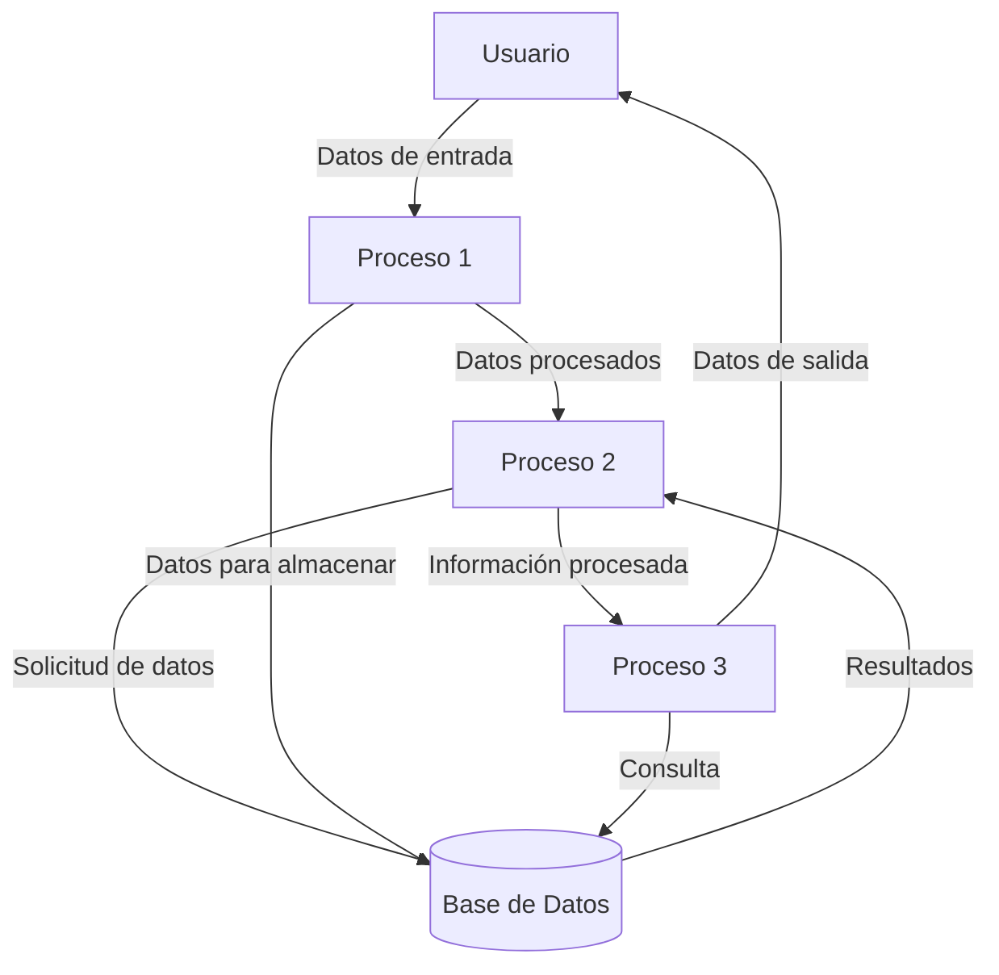
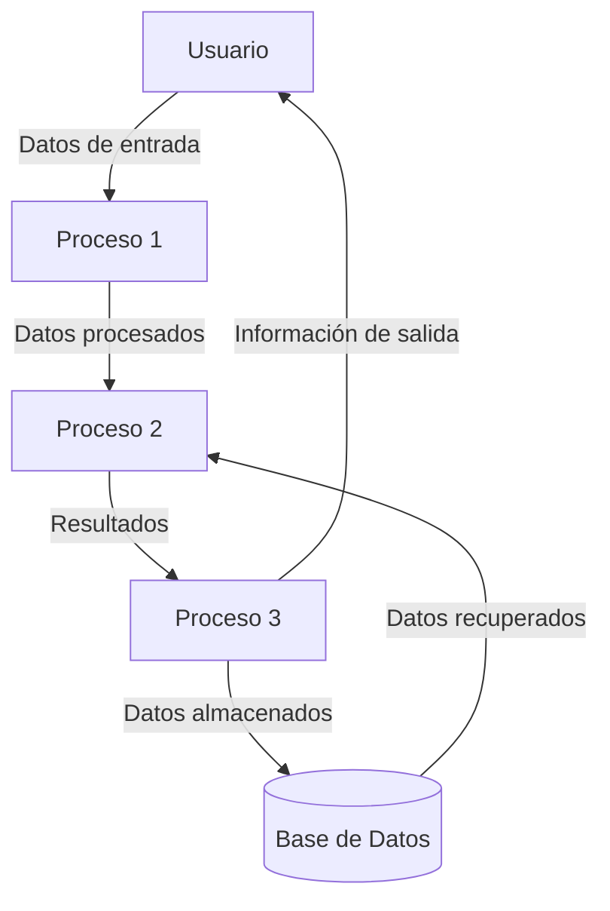

## Module: CParametros.cpp
# Análisis Integral del Módulo CParametros.cpp

## Nombre del Módulo/Componente SQL
**CParametros.cpp** - Módulo de clase C++ para gestión de parámetros.

## Objetivos Primarios
Este módulo implementa la clase `CParametros` que sirve como un contenedor para almacenar y gestionar parámetros de configuración. Su propósito principal es proporcionar una estructura de datos flexible para manejar pares clave-valor, permitiendo la carga, modificación y recuperación de parámetros desde diferentes fuentes, incluyendo archivos y bases de datos.

## Funciones, Métodos y Consultas Críticas
- **Constructor y Destructor**: Inicializa y limpia los recursos de la clase.
- **LoadFromFile**: Carga parámetros desde un archivo de texto.
- **LoadFromDB**: Carga parámetros desde una base de datos.
- **GetParametro**: Recupera el valor de un parámetro específico.
- **SetParametro**: Establece o modifica el valor de un parámetro.
- **GetParametroInt**: Convierte y devuelve un parámetro como valor entero.
- **GetParametroDouble**: Convierte y devuelve un parámetro como valor decimal.
- **GetParametroBool**: Convierte y devuelve un parámetro como valor booleano.

## Variables y Elementos Clave
- **m_parametros**: Mapa (diccionario) que almacena los pares clave-valor de los parámetros.
- **m_sNombreArchivo**: Nombre del archivo de configuración.
- **m_bModificado**: Indicador de si los parámetros han sido modificados.
- **m_sError**: Cadena para almacenar mensajes de error.

## Interdependencias y Relaciones
- Depende de la biblioteca estándar de C++ para estructuras de datos (map, string).
- Interactúa con el sistema de archivos para leer configuraciones.
- Potencialmente interactúa con un sistema de base de datos (aunque la implementación específica no está completa en el código proporcionado).

## Operaciones Principales vs. Auxiliares
**Operaciones Principales**:
- Carga de parámetros desde diferentes fuentes.
- Recuperación y conversión de valores de parámetros.
- Modificación de parámetros.

**Operaciones Auxiliares**:
- Gestión de errores.
- Conversión de tipos de datos.
- Validación de existencia de parámetros.

## Secuencia Operacional/Flujo de Ejecución
1. Inicialización de la clase mediante el constructor.
2. Carga de parámetros desde archivo o base de datos.
3. Acceso o modificación de parámetros según sea necesario.
4. Posible guardado de cambios (aunque no está completamente implementado).
5. Liberación de recursos mediante el destructor.

## Aspectos de Rendimiento y Optimización
- Utiliza un mapa (std::map) para acceso eficiente a los parámetros por clave.
- La implementación actual podría optimizarse para operaciones de lectura frecuentes mediante el uso de referencias constantes.
- Las operaciones de archivo podrían ser un cuello de botella potencial en sistemas con E/S limitada.

## Reusabilidad y Adaptabilidad
- Alta reusabilidad como componente de gestión de configuración.
- Adaptable a diferentes tipos de aplicaciones que requieran almacenamiento de parámetros.
- Podría mejorarse con plantillas para manejar diferentes tipos de datos de manera más genérica.

## Uso y Contexto
- Se utiliza como un componente de configuración en aplicaciones que necesitan almacenar y recuperar parámetros.
- Aplicable en entornos donde los parámetros pueden provenir de múltiples fuentes (archivos, bases de datos).
- Útil para aplicaciones que requieren configuración dinámica o persistente.

## Suposiciones y Limitaciones
**Suposiciones**:
- Se asume que los archivos de configuración siguen un formato específico (clave=valor).
- Se asume que las conversiones de tipo son seguras para los valores almacenados.

**Limitaciones**:
- No implementa completamente la funcionalidad de base de datos (método LoadFromDB está vacío).
- No proporciona validación avanzada de tipos o formatos de parámetros.
- No incluye mecanismos de bloqueo para acceso concurrente, lo que podría ser problemático en entornos multi-hilo.
- La gestión de errores es básica, utilizando solo una cadena de error sin mecanismos de excepción.
## Flow Diagram [via mermaid]

## Module: CParametros.cpp
# Análisis Integral del Módulo CParametros.cpp

## Nombre del Módulo/Componente SQL
**CParametros.cpp** - Módulo de clase C++ para manejo de parámetros de configuración

## Objetivos Primarios
Este módulo implementa una clase para gestionar parámetros de configuración en un sistema, permitiendo cargar, acceder y manipular valores de parámetros desde un archivo de configuración. Su propósito principal es centralizar la gestión de configuraciones del sistema y proporcionar una interfaz para que otros componentes accedan a estos valores.

## Funciones, Métodos y Consultas Críticas
- **CParametros::CParametros()**: Constructor que inicializa la clase.
- **CParametros::~CParametros()**: Destructor que libera recursos.
- **CParametros::CargarParametros()**: Método principal que carga los parámetros desde un archivo de configuración.
- **CParametros::ObtenerValor()**: Método crítico que recupera el valor de un parámetro específico.
- **CParametros::ObtenerValorDefecto()**: Obtiene un valor con un valor predeterminado si el parámetro no existe.
- **CParametros::ModificarValor()**: Permite cambiar el valor de un parámetro existente.

## Variables y Elementos Clave
- **m_Parametros**: Mapa que almacena pares clave-valor de los parámetros.
- **m_sNombreArchivo**: Nombre del archivo de configuración.
- **m_bParametrosCargados**: Indicador booleano del estado de carga de los parámetros.
- **m_sUltimoError**: Variable para almacenar mensajes de error.

## Interdependencias y Relaciones
- Depende de la biblioteca estándar de C++ para manejo de mapas (`std::map`), cadenas (`std::string`) y operaciones de archivo (`std::ifstream`).
- Interactúa con el sistema de archivos para leer el archivo de configuración.
- Probablemente es utilizado por múltiples componentes del sistema que necesitan acceder a parámetros de configuración.

## Operaciones Principales vs. Auxiliares
**Operaciones Principales:**
- Carga de parámetros desde archivo
- Recuperación de valores de parámetros

**Operaciones Auxiliares:**
- Manejo de errores
- Validación de existencia de parámetros
- Conversión de tipos de datos

## Secuencia Operacional/Flujo de Ejecución
1. Inicialización de la clase mediante el constructor
2. Carga de parámetros desde el archivo de configuración
3. Procesamiento del archivo línea por línea, extrayendo pares clave-valor
4. Almacenamiento de los parámetros en la estructura de datos interna
5. Acceso a los parámetros según sea necesario por otros componentes

## Aspectos de Rendimiento y Optimización
- El uso de `std::map` proporciona acceso eficiente a los parámetros con complejidad O(log n)
- La carga de parámetros se realiza una sola vez, optimizando el rendimiento
- Posible área de mejora: implementar caché para parámetros frecuentemente accedidos
- Considerar el manejo de archivos grandes de configuración y su impacto en la memoria

## Reusabilidad y Adaptabilidad
- Alta reusabilidad como componente de gestión de configuración
- Adaptable a diferentes formatos de archivo mediante modificación del método de carga
- Podría mejorarse con plantillas para soportar diferentes tipos de datos de manera más directa
- Fácilmente extensible para añadir funcionalidades como persistencia de cambios

## Uso y Contexto
- Utilizado como componente central para la gestión de configuración del sistema
- Probablemente instanciado al inicio de la aplicación y mantenido durante todo el ciclo de vida
- Proporciona valores de configuración a diversos módulos del sistema
- Permite centralizar cambios en la configuración sin modificar el código fuente

## Suposiciones y Limitaciones
- Asume un formato específico para el archivo de configuración (pares clave=valor)
- No parece implementar persistencia de cambios en los parámetros
- Limitado a valores de tipo cadena, requiriendo conversión para otros tipos de datos
- No maneja actualizaciones en tiempo real del archivo de configuración
- No implementa validación avanzada de los valores de los parámetros
## Flow Diagram [via mermaid]

