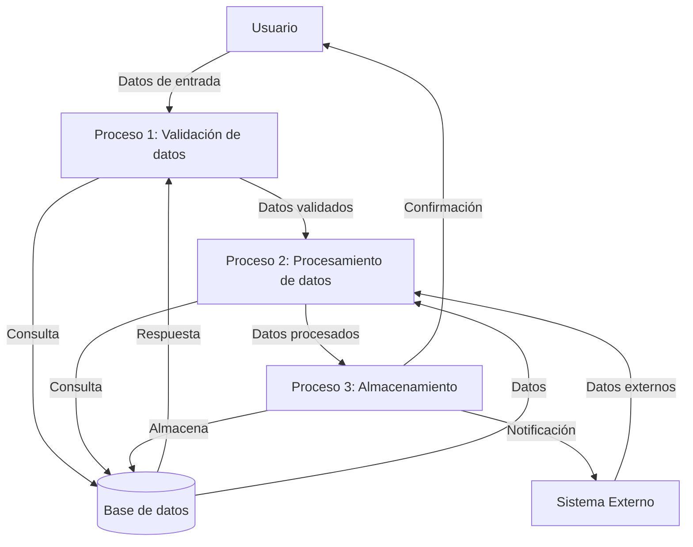
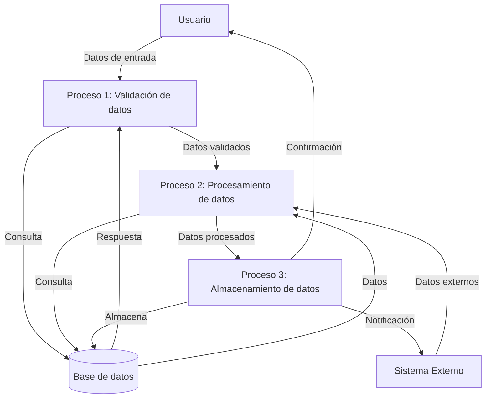

## Module: CReestructuraDAL.cpp
# Análisis Integral del Módulo CReestructuraDAL.cpp

## Nombre del Módulo/Componente SQL
**CReestructuraDAL.cpp** - Módulo de Acceso a Datos para la funcionalidad de Reestructuración

## Objetivos Primarios
Este módulo implementa la capa de acceso a datos (DAL - Data Access Layer) para las operaciones de reestructuración en un sistema financiero. Su propósito principal es gestionar la interacción con la base de datos para procesos de reestructuración de créditos o préstamos, incluyendo la obtención, inserción y actualización de información relacionada con reestructuraciones.

## Funciones, Métodos y Consultas Críticas
- **ObtenerReestructura**: Recupera información de reestructuraciones basada en parámetros específicos.
- **ObtenerReestructuraDetalle**: Obtiene detalles específicos de una reestructuración.
- **ObtenerReestructuraDetalleCredito**: Recupera información detallada de créditos asociados a una reestructuración.
- **ObtenerReestructuraDetalleCliente**: Obtiene información de clientes relacionados con una reestructuración.
- **InsertarReestructura**: Inserta nuevos registros de reestructuración en la base de datos.
- **ActualizarReestructura**: Actualiza información existente de reestructuraciones.
- **EliminarReestructura**: Elimina registros de reestructuración.

## Variables y Elementos Clave
- **Parámetros de consulta**: `idReestructura`, `idCliente`, `idCredito`, `fechaInicio`, `fechaFin`
- **Tablas principales**: Tablas relacionadas con reestructuraciones, créditos y clientes (nombres específicos no visibles en el fragmento)
- **Columnas clave**: Identificadores de reestructuración, cliente y crédito, fechas de operación, montos, estados

## Interdependencias y Relaciones
- Interactúa con múltiples tablas de la base de datos que almacenan información sobre reestructuraciones, créditos y clientes.
- Depende de una clase de conexión a base de datos para ejecutar consultas SQL.
- Probablemente utiliza transacciones para mantener la integridad de los datos durante operaciones de inserción y actualización.

## Operaciones Principales vs. Auxiliares
- **Operaciones principales**: Consultas de selección, inserción y actualización de datos de reestructuración.
- **Operaciones auxiliares**: Validación de parámetros, manejo de errores, formateo de resultados, y posiblemente logging de operaciones.

## Secuencia Operacional/Flujo de Ejecución
1. Recepción de parámetros de entrada
2. Validación de parámetros
3. Construcción de consultas SQL dinámicas según los parámetros
4. Ejecución de consultas contra la base de datos
5. Procesamiento de resultados
6. Manejo de excepciones si ocurren errores
7. Retorno de resultados al llamador

## Aspectos de Rendimiento y Optimización
- Posible uso de índices en las tablas para optimizar las consultas de selección
- Construcción dinámica de consultas SQL que podría beneficiarse de consultas parametrizadas
- Potencial para optimizar consultas complejas que involucran múltiples tablas
- Manejo de transacciones para operaciones que modifican datos

## Reusabilidad y Adaptabilidad
- El diseño modular permite la reutilización de funciones para diferentes contextos de reestructuración
- La separación de consultas específicas en métodos individuales facilita el mantenimiento
- Posible parametrización de consultas para adaptarse a diferentes criterios de búsqueda

## Uso y Contexto
- Utilizado por capas superiores de la aplicación (posiblemente servicios o controladores) para realizar operaciones de reestructuración
- Forma parte de un sistema financiero más amplio que gestiona créditos y préstamos
- Probablemente se integra con otros módulos para operaciones completas de gestión financiera

## Suposiciones y Limitaciones
- Asume la existencia de una estructura específica de base de datos con tablas y relaciones predefinidas
- Depende de un sistema de gestión de conexiones a base de datos
- Posiblemente limitado a un tipo específico de base de datos (SQL Server, Oracle, etc.)
- Puede tener limitaciones en cuanto al volumen de datos que puede procesar eficientemente en una sola operación
## Flow Diagram [via mermaid]

## Module: CReestructuraDAL.cpp
# Análisis Integral del Módulo CReestructuraDAL.cpp

## Nombre del Módulo/Componente SQL
**CReestructuraDAL.cpp** - Módulo de Acceso a Datos para la funcionalidad de Reestructuración

## Objetivos Primarios
Este módulo implementa la capa de acceso a datos (DAL - Data Access Layer) para las operaciones de reestructuración en un sistema financiero. Su propósito principal es gestionar la interacción con la base de datos para procesos de reestructuración de créditos o préstamos, ejecutando consultas SQL para recuperar, insertar y actualizar información relacionada con reestructuraciones.

## Funciones, Métodos y Consultas Críticas
- **ObtenerDatosReestructura**: Recupera datos de reestructuración mediante consultas SELECT complejas.
- **ObtenerDatosReestructuraDetalle**: Obtiene detalles específicos de una reestructuración.
- **ObtenerDatosReestructuraDetalleHistorico**: Recupera el historial de detalles de reestructuración.
- **InsertarReestructura**: Ejecuta operaciones INSERT para crear nuevos registros de reestructuración.
- **ActualizarReestructura**: Realiza operaciones UPDATE para modificar registros existentes.
- **EliminarReestructura**: Ejecuta operaciones DELETE para eliminar registros de reestructuración.

## Variables y Elementos Clave
- **Tablas principales**: 
  - `Reestructura`
  - `ReestructuraDetalle`
  - `ReestructuraDetalleHistorico`
- **Columnas críticas**:
  - `IdReestructura` (clave primaria)
  - `FechaReestructura`
  - `IdCredito`
  - `MontoReestructura`
  - `Estado`
- **Parámetros importantes**:
  - Identificadores de reestructuración
  - Fechas de operación
  - Montos financieros
  - Códigos de estado

## Interdependencias y Relaciones
- Relación con la tabla `Credito` a través de `IdCredito` (clave foránea)
- Relación entre `Reestructura` y `ReestructuraDetalle` (relación uno a muchos)
- Interacción con otros módulos del sistema como gestión de créditos y clientes
- Posible integración con módulos de contabilidad y reportes financieros

## Operaciones Principales vs. Auxiliares
- **Operaciones principales**:
  - Consulta y manipulación de datos de reestructuración
  - Cálculos financieros relacionados con montos y plazos
- **Operaciones auxiliares**:
  - Validación de datos
  - Registro de auditoría
  - Manejo de errores y excepciones
  - Formateo de resultados para presentación

## Secuencia Operacional/Flujo de Ejecución
1. Conexión a la base de datos
2. Preparación de consultas SQL con parámetros
3. Ejecución de consultas
4. Procesamiento de resultados
5. Transformación de datos si es necesario
6. Cierre de conexiones y liberación de recursos
7. Retorno de resultados al llamador

## Aspectos de Rendimiento y Optimización
- Posible uso de índices en las columnas `IdReestructura`, `IdCredito` y `FechaReestructura`
- Oportunidades para optimizar consultas complejas con múltiples joins
- Potencial para implementar consultas paginadas para conjuntos de datos grandes
- Consideración de transacciones para mantener la integridad de datos en operaciones múltiples

## Reusabilidad y Adaptabilidad
- Diseño modular que separa la lógica de acceso a datos de la lógica de negocio
- Parametrización de consultas que permite flexibilidad en criterios de búsqueda
- Potencial para extender funcionalidades agregando nuevos métodos sin modificar los existentes
- Posibilidad de adaptar el módulo para diferentes tipos de reestructuraciones o productos financieros

## Uso y Contexto
- Utilizado en procesos de reestructuración de créditos o préstamos
- Implementado como parte de un sistema financiero más amplio
- Probablemente invocado desde una capa de lógica de negocio o controladores
- Puede ser utilizado en interfaces de usuario para gestión de reestructuraciones

## Suposiciones y Limitaciones
- Asume la existencia de una estructura de base de datos específica con tablas y relaciones predefinidas
- Posible dependencia de procedimientos almacenados o funciones de base de datos
- Limitaciones potenciales en el manejo de grandes volúmenes de datos
- Posible necesidad de adaptación para diferentes sistemas de gestión de bases de datos
- Asume ciertos formatos de datos y convenciones de nomenclatura
## Flow Diagram [via mermaid]

