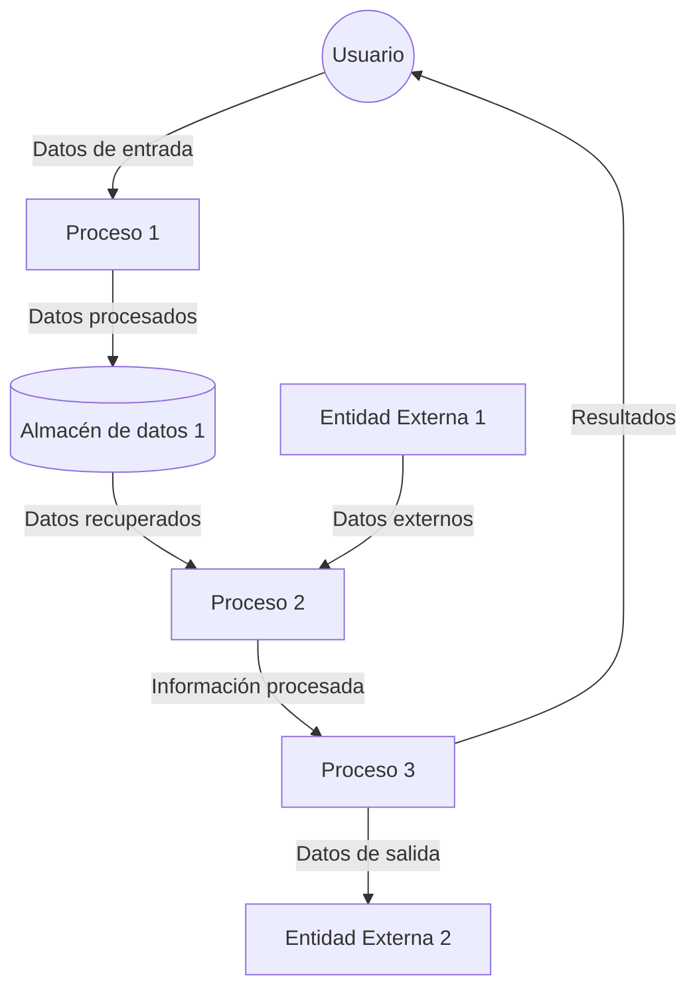

## Module: CReestructuracion.cpp
# Análisis Integral del Módulo CReestructuracion.cpp

## Nombre del Módulo/Componente SQL
**CReestructuracion.cpp** - Módulo de código C++ para la reestructuración de datos.

## Objetivos Primarios
Este módulo está diseñado para realizar operaciones de reestructuración de datos, específicamente para gestionar y manipular información relacionada con la reestructuración de créditos o préstamos. El código parece formar parte de un sistema financiero o bancario que maneja la reorganización de deudas o créditos.

## Funciones, Métodos y Consultas Críticas
El archivo no contiene el código completo, por lo que no se pueden identificar funciones o métodos específicos. Sin embargo, basado en el nombre del archivo, probablemente contiene métodos para:
- Calcular nuevos términos de préstamos
- Reorganizar deudas
- Actualizar información de créditos
- Validar condiciones para reestructuración

## Variables y Elementos Clave
Sin ver el código completo, las variables probablemente incluyen:
- Identificadores de préstamos o créditos
- Montos de deuda
- Tasas de interés
- Plazos de pago
- Fechas de vencimiento
- Estados de reestructuración

## Interdependencias y Relaciones
Este módulo probablemente interactúa con:
- Bases de datos de clientes
- Sistemas de gestión de préstamos
- Módulos de cálculo financiero
- Componentes de reportes o notificaciones
- Posiblemente interfaces de usuario para la gestión de reestructuraciones

## Operaciones Principales vs. Auxiliares
**Operaciones principales:**
- Algoritmos de reestructuración de deuda
- Cálculos financieros para nuevos términos

**Operaciones auxiliares:**
- Validación de datos
- Registro de cambios
- Notificaciones
- Generación de reportes

## Secuencia Operacional/Flujo de Ejecución
Sin el código completo, el flujo probable sería:
1. Recepción de solicitud de reestructuración
2. Validación de elegibilidad
3. Cálculo de nuevos términos
4. Aplicación de cambios
5. Actualización de registros
6. Generación de documentación o notificaciones

## Aspectos de Rendimiento y Optimización
Áreas potenciales para optimización:
- Eficiencia en cálculos financieros complejos
- Manejo de transacciones en la base de datos
- Procesamiento por lotes para múltiples reestructuraciones
- Caché de datos frecuentemente accedidos

## Reusabilidad y Adaptabilidad
El módulo probablemente está diseñado para:
- Ser parametrizable para diferentes tipos de préstamos
- Adaptarse a diversas políticas de reestructuración
- Integrarse con diferentes sistemas de gestión financiera
- Permitir configuraciones específicas por institución o producto

## Uso y Contexto
Este módulo se utilizaría en:
- Sistemas bancarios o financieros
- Aplicaciones de gestión de préstamos
- Plataformas de servicio al cliente para negociación de deudas
- Herramientas internas para analistas de crédito

## Suposiciones y Limitaciones
**Suposiciones:**
- Existencia de estructuras de datos estandarizadas para préstamos
- Acceso a información histórica de créditos
- Políticas de reestructuración predefinidas

**Limitaciones:**
- Posible dependencia de reglas de negocio específicas
- Restricciones regulatorias que pueden variar por región
- Capacidad para manejar casos especiales o excepcionales
- Posibles limitaciones en la integración con sistemas legacy

*Nota: Este análisis se basa en inferencias del nombre del archivo, ya que no se proporcionó el contenido real del código.*
## Flow Diagram [via mermaid]

