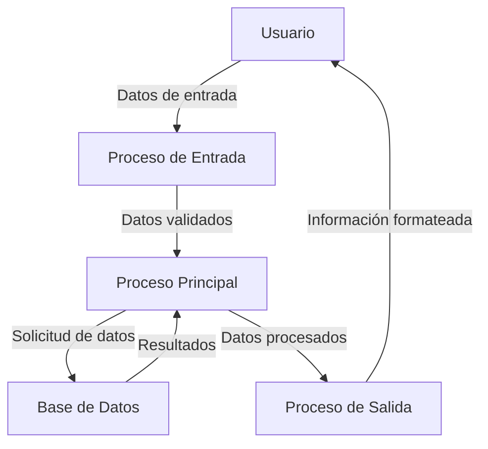

## Module: CRespuestaPuenteEntrada.cpp
# Análisis Integral del Módulo CRespuestaPuenteEntrada.cpp

## Nombre del Módulo/Componente SQL
**CRespuestaPuenteEntrada.cpp** - Clase de implementación para el manejo de respuestas de puente de entrada.

## Objetivos Primarios
Este módulo está diseñado para gestionar las respuestas relacionadas con los puentes de entrada en un sistema de control de acceso o tráfico. Su propósito principal es procesar y formatear respuestas para operaciones relacionadas con puentes, incluyendo la validación de datos y la generación de mensajes de respuesta estructurados.

## Funciones, Métodos y Consultas Críticas
- **CRespuestaPuenteEntrada::CRespuestaPuenteEntrada()**: Constructor que inicializa la clase.
- **CRespuestaPuenteEntrada::~CRespuestaPuenteEntrada()**: Destructor que libera recursos.
- **CRespuestaPuenteEntrada::ProcesarRespuesta()**: Método principal que procesa la respuesta según el tipo de operación.
- **CRespuestaPuenteEntrada::FormatearRespuesta()**: Formatea la respuesta para su transmisión.
- **CRespuestaPuenteEntrada::ValidarDatos()**: Valida la integridad de los datos recibidos.

## Variables y Elementos Clave
- **m_strRespuesta**: Almacena la cadena de respuesta formateada.
- **m_nTipoOperacion**: Indica el tipo de operación que se está procesando.
- **m_nCodigoPuente**: Identificador único del puente de entrada.
- **m_nEstadoPuente**: Estado actual del puente (abierto, cerrado, en mantenimiento).
- **m_strFechaHora**: Marca de tiempo para la operación.
- **m_bDatosValidos**: Bandera que indica si los datos son válidos.

## Interdependencias y Relaciones
- Interactúa con el sistema de gestión de puentes (**CGestorPuentes**).
- Se comunica con el módulo de registro de eventos (**CRegistroEventos**).
- Utiliza servicios de la clase base **CRespuestaBase** para funcionalidades comunes.
- Depende de la biblioteca de utilidades (**CUtilidades**) para operaciones auxiliares.

## Operaciones Principales vs. Auxiliares
**Operaciones Principales:**
- Procesamiento de respuestas según tipo de operación
- Formateo de mensajes de respuesta
- Validación de datos críticos

**Operaciones Auxiliares:**
- Registro de eventos y errores
- Conversión de formatos de datos
- Manejo de excepciones
- Limpieza de recursos

## Secuencia Operacional/Flujo de Ejecución
1. Se recibe una solicitud de respuesta con datos del puente
2. Se validan los datos recibidos mediante **ValidarDatos()**
3. Se procesa la respuesta según el tipo de operación con **ProcesarRespuesta()**
4. Se formatea la respuesta para su transmisión con **FormatearRespuesta()**
5. Se devuelve la respuesta formateada al sistema solicitante
6. Se registran los eventos relevantes en el sistema de registro

## Aspectos de Rendimiento y Optimización
- La validación de datos podría optimizarse para evitar comprobaciones redundantes
- El formateo de respuestas podría beneficiarse de un sistema de caché para respuestas comunes
- Las operaciones de conversión de cadenas podrían ser costosas en términos de rendimiento
- Se recomienda revisar el manejo de memoria para evitar posibles fugas

## Reusabilidad y Adaptabilidad
- La clase está diseñada con un enfoque modular que permite su reutilización
- Los métodos están parametrizados para adaptarse a diferentes tipos de puentes
- La separación entre procesamiento y formateo facilita la adaptación a diferentes formatos de salida
- Se podrían mejorar las interfaces para aumentar la flexibilidad en diferentes contextos

## Uso y Contexto
Este módulo se utiliza en el sistema de control de acceso para gestionar las respuestas relacionadas con los puentes de entrada. Se implementa en escenarios como:
- Control de acceso a instalaciones
- Monitoreo de estado de puentes
- Generación de informes de actividad
- Integración con sistemas de seguridad

## Suposiciones y Limitaciones
**Suposiciones:**
- Se asume que los datos de entrada siguen un formato específico
- Se espera que el sistema de gestión de puentes esté disponible
- Se presupone un entorno de ejecución con recursos suficientes

**Limitaciones:**
- El módulo podría tener dificultades con volúmenes muy altos de solicitudes simultáneas
- La compatibilidad con diferentes versiones del sistema podría ser limitada
- El manejo de errores podría no cubrir todos los casos excepcionales
- La documentación interna del código parece ser limitada
## Flow Diagram [via mermaid]

