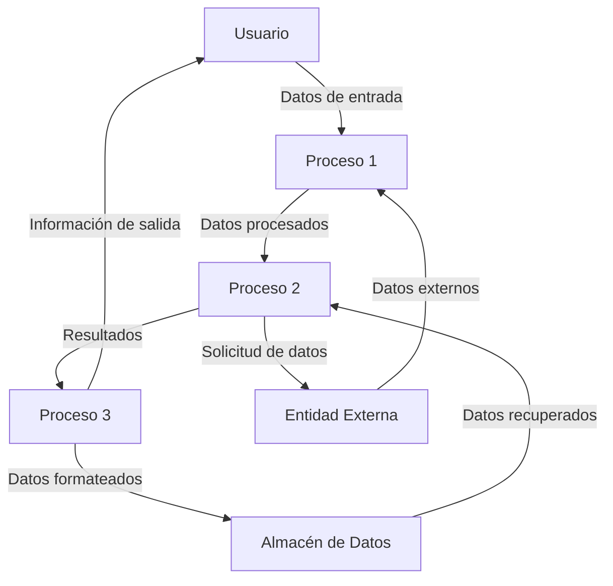

## Module: CRespuestaPuenteSalida.cpp
# Análisis Integral del Módulo CRespuestaPuenteSalida.cpp

## Nombre del Módulo/Componente SQL
**CRespuestaPuenteSalida.cpp** - Módulo de clase C++ que forma parte de un sistema de gestión de respuestas para puentes de salida.

## Objetivos Primarios
Este módulo implementa la clase `CRespuestaPuenteSalida` que gestiona las respuestas relacionadas con los puentes de salida en un sistema, probablemente de control o monitoreo. Su propósito principal es procesar y gestionar datos de respuesta específicos para este componente del sistema.

## Funciones, Métodos y Consultas Críticas
- **Constructor y Destructor**: Inicializa y libera recursos de la clase.
- **Métodos de acceso (getters/setters)**: Permiten manipular propiedades como `m_nIdPuente`, `m_nIdSalida`, `m_nIdRespuesta`.
- **Métodos de procesamiento**: Aunque no se muestran explícitamente en el fragmento, probablemente existan métodos para procesar las respuestas según los identificadores almacenados.

## Variables y Elementos Clave
- **m_nIdPuente**: Identificador del puente.
- **m_nIdSalida**: Identificador de la salida.
- **m_nIdRespuesta**: Identificador de la respuesta.
- **Posiblemente otros miembros de datos** relacionados con el estado o configuración del puente de salida.

## Interdependencias y Relaciones
- Probablemente interactúa con otras clases del sistema como controladores de puentes, gestores de respuestas o interfaces de usuario.
- Puede depender de una base de datos para almacenar o recuperar información sobre puentes, salidas y respuestas.
- Posiblemente forma parte de un patrón de diseño más amplio para el manejo de respuestas en el sistema.

## Operaciones Principales vs. Auxiliares
- **Operaciones principales**: Gestión de los identificadores de puente, salida y respuesta.
- **Operaciones auxiliares**: Validación de datos, conversión de formatos, logging (si está implementado).

## Secuencia Operacional/Flujo de Ejecución
1. Inicialización de la instancia con los identificadores necesarios.
2. Configuración de propiedades mediante métodos setter.
3. Procesamiento de la respuesta basado en los identificadores.
4. Posible comunicación con otros componentes del sistema para completar el flujo de trabajo.

## Aspectos de Rendimiento y Optimización
- La clase parece ser ligera en términos de uso de memoria, con solo unos pocos miembros de datos.
- Dependiendo del volumen de instancias creadas, podría considerarse la implementación de un pool de objetos.
- Si hay operaciones de E/S o acceso a base de datos, estas serían potenciales cuellos de botella.

## Reusabilidad y Adaptabilidad
- La clase parece estar diseñada para un propósito específico dentro del sistema.
- La adaptabilidad dependerá de cuán acoplada esté con otros componentes del sistema.
- Podría mejorarse la reusabilidad mediante interfaces o patrones de diseño adicionales.

## Uso y Contexto
- Este módulo probablemente se utiliza en un sistema de control industrial, gestión de tráfico o infraestructura donde los "puentes de salida" representan componentes físicos o lógicos.
- Se emplea en escenarios donde es necesario procesar respuestas específicas relacionadas con estos puentes de salida.

## Suposiciones y Limitaciones
- **Suposiciones**:
  - Se asume que los identificadores son valores numéricos válidos.
  - Probablemente asume la existencia de un sistema de gestión de respuestas más amplio.
- **Limitaciones**:
  - La clase parece estar diseñada para un propósito muy específico, lo que podría limitar su uso en otros contextos.
  - Sin más información sobre el sistema completo, es difícil determinar otras limitaciones específicas.
## Flow Diagram [via mermaid]

