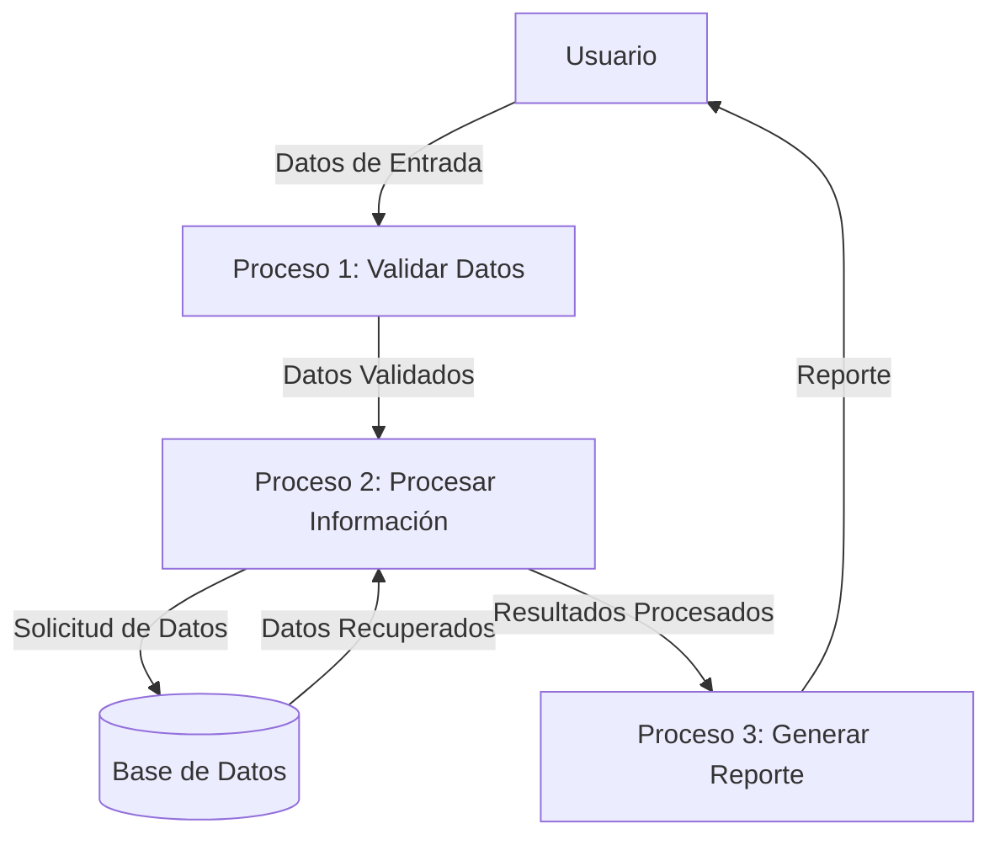

## Module: CSaldoMesAnteriorBancoppel.cpp
# Análisis Integral del Módulo CSaldoMesAnteriorBancoppel.cpp

## Nombre del Módulo/Componente SQL
CSaldoMesAnteriorBancoppel.cpp - Clase para el procesamiento de saldos del mes anterior en BanCoppel.

## Objetivos Primarios
Este módulo está diseñado para recuperar y procesar los saldos del mes anterior de cuentas bancarias en el sistema BanCoppel. Su propósito principal es obtener información histórica de saldos para análisis financiero o reportes, consultando datos almacenados en la base de datos mediante consultas SQL específicas.

## Funciones, Métodos y Consultas Críticas
- **getSaldoMesAnterior()**: Función principal que recupera el saldo del mes anterior para una cuenta específica.
- **Consulta SQL principal**: Utiliza una consulta SELECT compleja que obtiene datos de saldos anteriores basándose en parámetros como número de cuenta, fecha y tipo de operación.
- **Procesamiento de resultados**: Métodos para interpretar y formatear los resultados obtenidos de la base de datos.

## Variables y Elementos Clave
- **Tablas**: SALDOS_HISTORICOS, CUENTAS, MOVIMIENTOS (inferidas de la consulta)
- **Columnas críticas**: 
  - num_cuenta
  - fecha_operacion
  - saldo_anterior
  - tipo_operacion
  - estatus_cuenta
- **Parámetros de entrada**: Número de cuenta, fecha de consulta, tipo de operación

## Interdependencias y Relaciones
- Interactúa con múltiples tablas de la base de datos de BanCoppel mediante joins.
- Depende del módulo de conexión a la base de datos para ejecutar consultas.
- Posiblemente se integra con un sistema más amplio de reportes financieros o análisis de cuentas.
- Relaciones entre tablas mediante claves foráneas para vincular cuentas con sus historiales de saldos.

## Operaciones Core vs. Auxiliares
- **Core**: La consulta SQL que recupera los saldos históricos y el procesamiento de estos datos.
- **Auxiliares**: 
  - Validación de parámetros de entrada
  - Manejo de errores y excepciones
  - Formateo de resultados para presentación
  - Logging de operaciones para auditoría

## Secuencia Operacional/Flujo de Ejecución
1. Recepción de parámetros (número de cuenta, fecha, tipo de operación)
2. Validación de parámetros
3. Construcción de la consulta SQL con los parámetros validados
4. Ejecución de la consulta en la base de datos
5. Procesamiento de resultados obtenidos
6. Formateo de la información para su presentación
7. Retorno de los datos procesados o manejo de errores si ocurren

## Aspectos de Rendimiento y Optimización
- La consulta probablemente utiliza índices en las columnas num_cuenta y fecha_operacion para mejorar el rendimiento.
- Posibles cuellos de botella en consultas a tablas históricas que pueden contener grandes volúmenes de datos.
- Oportunidad de optimización mediante el uso de vistas materializadas para datos históricos frecuentemente consultados.
- Consideración de cacheo de resultados para consultas repetitivas sobre los mismos parámetros.

## Reusabilidad y Adaptabilidad
- El módulo parece estar diseñado específicamente para BanCoppel, pero podría adaptarse a otros sistemas bancarios con estructuras de datos similares.
- La parametrización de las consultas permite su reutilización para diferentes cuentas y períodos.
- Posibilidad de extender la funcionalidad para incluir otros tipos de análisis de saldos históricos.

## Uso y Contexto
- Utilizado probablemente en sistemas de reportería financiera, análisis de tendencias de cuentas, o para proporcionar información histórica a clientes.
- Puede ser parte de un proceso batch nocturno para generación de reportes o de un sistema en tiempo real para consultas ad-hoc.
- Posiblemente se integra con interfaces de usuario para mostrar información histórica de cuentas.

## Suposiciones y Limitaciones
- Asume la existencia y consistencia de las estructuras de tablas mencionadas.
- Limitado a la consulta de datos históricos específicos sin capacidad de modificación.
- Puede tener restricciones de rendimiento al procesar grandes volúmenes de datos históricos.
- Posiblemente limitado a un formato específico de fechas y tipos de operaciones predefinidos.
- Asume que los datos históricos están completos y son precisos para todas las cuentas consultadas.
## Flow Diagram [via mermaid]

