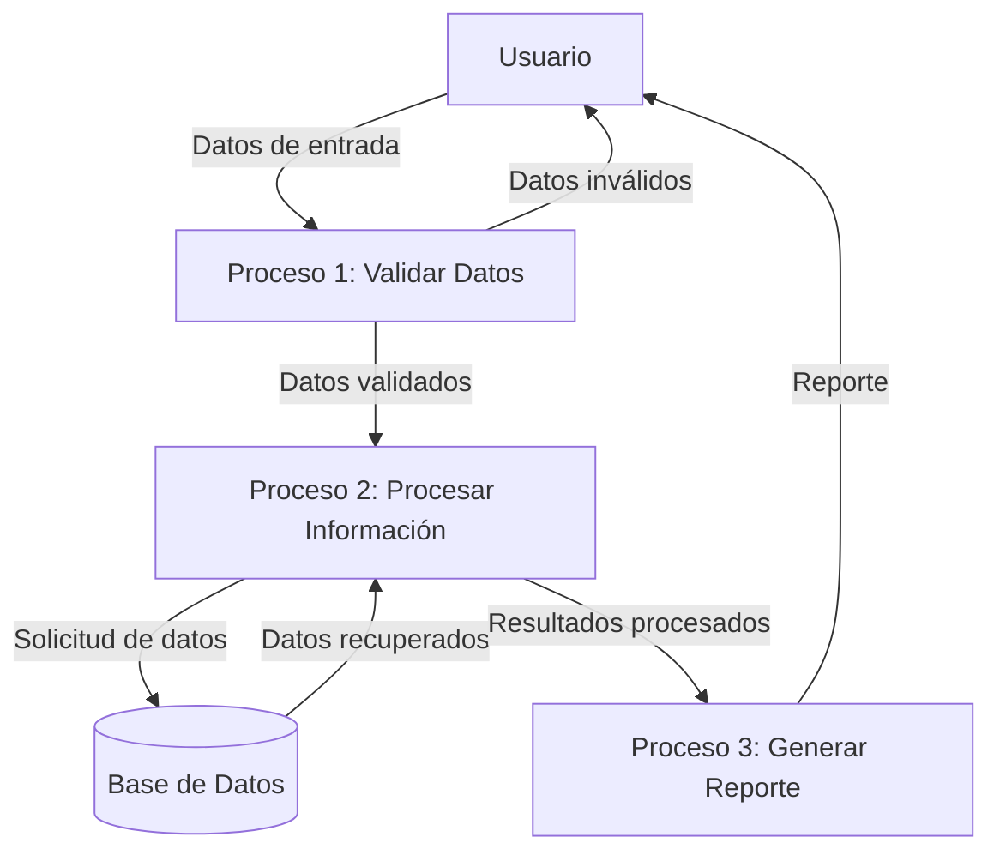

## Module: CSysFolioGlobal.cpp
# Análisis Integral del Módulo CSysFolioGlobal.cpp

## Nombre del Módulo/Componente SQL
CSysFolioGlobal.cpp - Clase para la gestión de folios globales en un sistema.

## Objetivos Primarios
Este módulo implementa la clase CSysFolioGlobal que se encarga de la administración de folios globales en el sistema. Su propósito principal es generar, validar y gestionar identificadores únicos (folios) que pueden ser utilizados para diversos propósitos en la aplicación, como la identificación de transacciones o documentos.

## Funciones, Métodos y Consultas Críticas
- **CSysFolioGlobal::CSysFolioGlobal()**: Constructor que inicializa la clase.
- **CSysFolioGlobal::~CSysFolioGlobal()**: Destructor que libera recursos.
- **CSysFolioGlobal::Init()**: Inicializa los parámetros de la clase.
- **CSysFolioGlobal::GetFolio()**: Método principal que obtiene un nuevo folio global.
- **CSysFolioGlobal::GetFolioByType()**: Obtiene un folio específico según el tipo solicitado.
- **CSysFolioGlobal::GetFolioByTypeAndBranch()**: Obtiene un folio específico según tipo y sucursal.

## Variables y Elementos Clave
- **m_pDB**: Puntero a la conexión de base de datos.
- **m_pLog**: Puntero al sistema de registro de eventos.
- **m_nFolioType**: Tipo de folio a generar.
- **m_nBranchId**: Identificador de la sucursal.
- **m_nUserId**: Identificador del usuario.
- **m_strFolioPrefix**: Prefijo para el folio.
- **m_nFolioLength**: Longitud del folio.

## Interdependencias y Relaciones
- Depende de una conexión a base de datos (m_pDB) para persistir y recuperar información de folios.
- Utiliza un sistema de registro (m_pLog) para documentar operaciones y errores.
- Interactúa con tablas de la base de datos relacionadas con folios, sucursales y usuarios.
- Posiblemente se relaciona con otros módulos del sistema que requieren folios únicos.

## Operaciones Principales vs. Auxiliares
**Operaciones Principales:**
- Generación de folios únicos mediante GetFolio() y sus variantes.
- Actualización de contadores de folios en la base de datos.

**Operaciones Auxiliares:**
- Inicialización de parámetros (Init).
- Validación de parámetros de entrada.
- Registro de eventos y errores.
- Formateo de folios según requisitos específicos.

## Secuencia Operacional/Flujo de Ejecución
1. Inicialización de la clase con parámetros necesarios.
2. Validación de los parámetros proporcionados.
3. Consulta a la base de datos para obtener el último folio utilizado.
4. Incremento del contador de folios.
5. Formateo del nuevo folio según las reglas definidas (prefijo, longitud).
6. Actualización del contador en la base de datos.
7. Devolución del nuevo folio generado.

## Aspectos de Rendimiento y Optimización
- La generación de folios podría ser un cuello de botella en sistemas con alta concurrencia.
- Es importante asegurar que las operaciones de base de datos estén optimizadas, especialmente las actualizaciones de contadores.
- Podría beneficiarse de mecanismos de caché para reducir consultas a la base de datos.
- La implementación debería considerar bloqueos adecuados para evitar duplicados en entornos multi-hilo.

## Reusabilidad y Adaptabilidad
- La clase está diseñada para ser reutilizable en diferentes contextos donde se requieran folios únicos.
- La parametrización permite adaptar el comportamiento según el tipo de folio, sucursal y formato requerido.
- Podría mejorarse la adaptabilidad mediante configuraciones más flexibles o basadas en archivos de configuración.

## Uso y Contexto
- Este módulo se utiliza en sistemas que requieren identificadores únicos para transacciones, documentos o registros.
- Es probable que sea utilizado por módulos de facturación, gestión de pedidos, o cualquier componente que necesite generar identificadores secuenciales.
- Su contexto de uso implica un entorno empresarial donde la trazabilidad y unicidad de los identificadores es crítica.

## Suposiciones y Limitaciones
- Asume la existencia de una estructura de base de datos específica para almacenar y gestionar folios.
- Requiere una conexión de base de datos estable y con permisos adecuados.
- Podría tener limitaciones en entornos distribuidos o de alta concurrencia si no se implementan mecanismos adecuados de sincronización.
- La longitud máxima del folio podría estar limitada por el diseño actual.
- Asume que los parámetros proporcionados (tipo de folio, sucursal) existen y son válidos en el sistema.
## Flow Diagram [via mermaid]

