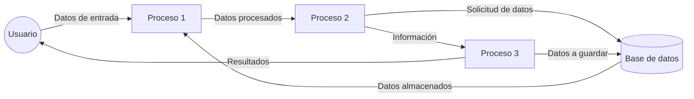
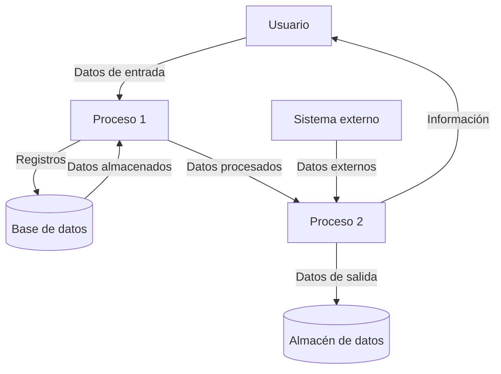

## Module: CTmpAbonoCrCmueblesPlanFija.cpp
# Análisis Integral del Módulo CTmpAbonoCrCmueblesPlanFija.cpp

## Nombre del Módulo/Componente SQL
CTmpAbonoCrCmueblesPlanFija.cpp - Clase para manejo de abonos de crédito para muebles en plan fija.

## Objetivos Primarios
Este módulo implementa una clase que gestiona operaciones relacionadas con abonos de crédito para muebles en un plan fijo. Su propósito principal es proporcionar funcionalidad para insertar, actualizar y consultar registros de abonos en una tabla temporal, facilitando el procesamiento de transacciones financieras relacionadas con créditos para muebles.

## Funciones, Métodos y Consultas Críticas
- **Insert()**: Inserta registros de abonos en la tabla temporal.
- **Update()**: Actualiza registros existentes en la tabla.
- **GetByPk()**: Recupera registros basados en la clave primaria.
- **GetAll()**: Obtiene todos los registros de la tabla.
- **Delete()**: Elimina registros específicos.
- **DeleteAll()**: Elimina todos los registros de la tabla temporal.

Las consultas SQL principales son INSERT, UPDATE, SELECT y DELETE, implementadas a través de sentencias preparadas para interactuar con la base de datos.

## Variables y Elementos Clave
- **Columnas principales**: 
  - `id_abono`: Identificador único del abono
  - `id_credito`: Identificador del crédito asociado
  - `fecha_abono`: Fecha en que se realizó el abono
  - `monto`: Cantidad del abono
  - `id_forma_pago`: Forma de pago utilizada
  - `referencia`: Referencia del pago
  - `observaciones`: Notas adicionales

- **Tabla principal**: 
  - `tmp_abono_cr_cmuebles_plan_fija`: Tabla temporal para almacenar los abonos

## Interdependencias y Relaciones
- El módulo depende de la biblioteca `CppSQLite3` para la interacción con la base de datos SQLite.
- Existe una relación implícita con otras tablas del sistema, como la tabla de créditos y la tabla de formas de pago, a través de los campos `id_credito` e `id_forma_pago`.
- La clase utiliza el patrón de diseño DAO (Data Access Object) para abstraer la interacción con la base de datos.

## Operaciones Principales vs. Auxiliares
- **Operaciones principales**: 
  - Inserción y actualización de registros de abonos
  - Consulta de abonos por identificador
  
- **Operaciones auxiliares**:
  - Eliminación de registros
  - Obtención de todos los registros
  - Validación de datos (implícita en el código)

## Secuencia Operacional/Flujo de Ejecución
1. Inicialización de la conexión a la base de datos
2. Preparación de sentencias SQL según la operación requerida
3. Vinculación de parámetros a las sentencias preparadas
4. Ejecución de las consultas
5. Procesamiento de resultados (en caso de consultas SELECT)
6. Liberación de recursos

## Aspectos de Rendimiento y Optimización
- El uso de sentencias preparadas mejora el rendimiento y previene inyecciones SQL.
- La clase maneja adecuadamente los recursos de base de datos, pero podría beneficiarse de un manejo más explícito de transacciones para operaciones por lotes.
- No se observan índices explícitos en el código, lo que podría ser un área de optimización si el volumen de datos es significativo.

## Reusabilidad y Adaptabilidad
- La clase sigue un patrón estándar para operaciones CRUD, lo que facilita su reutilización.
- El diseño orientado a objetos permite extender la funcionalidad mediante herencia.
- La parametrización de las consultas facilita la adaptación a diferentes requisitos de filtrado.
- Sin embargo, la clase está fuertemente acoplada a la estructura específica de la tabla, lo que podría limitar su adaptabilidad a cambios en el esquema.

## Uso y Contexto
- Este módulo se utiliza en el contexto de un sistema de gestión de créditos para muebles.
- Proporciona una capa de abstracción para operaciones de base de datos relacionadas con abonos temporales.
- Probablemente se utiliza como parte de un proceso más amplio de gestión de pagos y créditos.

## Suposiciones y Limitaciones
- **Suposiciones**:
  - Se asume que la tabla temporal ya existe en la base de datos.
  - Se espera que los identificadores de crédito y formas de pago sean válidos y existan en sus respectivas tablas.
  
- **Limitaciones**:
  - No se implementa validación explícita de datos antes de la inserción o actualización.
  - No hay manejo explícito de transacciones para garantizar la integridad de operaciones múltiples.
  - La clase no proporciona funcionalidad para consultas complejas o reportes agregados.
## Flow Diagram [via mermaid]

## Module: CTmpAbonoCrCmueblesPlanFija.cpp
# Análisis Integral del Módulo CTmpAbonoCrCmueblesPlanFija.cpp

## Módulo/Componente SQL
**CTmpAbonoCrCmueblesPlanFija.cpp** - Este es un módulo de clase C++ que parece formar parte de un sistema de gestión de abonos o créditos relacionados con planes fijos para muebles.

## Objetivos Primarios
El módulo está diseñado para gestionar operaciones temporales de abonos de crédito para muebles en planes fijos. Su propósito principal es proporcionar una interfaz para manipular registros en una tabla temporal, permitiendo operaciones como inserción, actualización, eliminación y consulta de datos relacionados con abonos de crédito.

## Funciones, Métodos y Consultas Críticas
- **Constructor y Destructor**: Inicializa y libera recursos del objeto.
- **Init()**: Inicializa la conexión a la base de datos.
- **Insert()**: Inserta registros en la tabla temporal de abonos.
- **Update()**: Actualiza registros existentes en la tabla.
- **Delete()**: Elimina registros específicos de la tabla.
- **DeleteAll()**: Elimina todos los registros asociados a un ID específico.
- **Get()**: Recupera información de un registro específico.
- **GetAll()**: Obtiene todos los registros asociados a un ID determinado.

## Variables y Elementos Clave
- **m_pDb**: Puntero a la conexión de base de datos.
- **m_strTableName**: Nombre de la tabla temporal ("TMP_ABONO_CR_CMUEBLES_PLAN_FIJA").
- **Campos de la tabla**: ID, FECHA, MONTO, CAPITAL, INTERES, MORA, SEGURO, OTROS, SALDO_CAPITAL, SALDO_INTERES, SALDO_MORA, SALDO_SEGURO, SALDO_OTROS, SALDO_TOTAL.

## Interdependencias y Relaciones
- Depende de la clase CDb para la conexión y operaciones con la base de datos.
- Interactúa con la tabla temporal TMP_ABONO_CR_CMUEBLES_PLAN_FIJA.
- Utiliza la biblioteca estándar de C++ para manejo de cadenas y operaciones básicas.

## Operaciones Core vs. Auxiliares
- **Core**: Las operaciones CRUD (Insert, Update, Delete, Get) que manipulan directamente los datos de abonos.
- **Auxiliares**: Inicialización de la conexión, manejo de errores, y formateo de consultas SQL.

## Secuencia Operacional/Flujo de Ejecución
1. Inicialización del objeto y conexión a la base de datos.
2. Ejecución de operaciones CRUD según se requiera:
   - Inserción de nuevos registros de abonos.
   - Actualización de registros existentes.
   - Eliminación de registros específicos o todos los asociados a un ID.
   - Consulta de registros individuales o múltiples.
3. Manejo de resultados y posibles errores en cada operación.

## Aspectos de Rendimiento y Optimización
- Las consultas SQL parecen ser directas y específicas, lo que debería proporcionar un buen rendimiento.
- No se observan índices explícitos en el código, lo que podría ser un área de optimización si la tabla maneja grandes volúmenes de datos.
- La reutilización de la conexión a la base de datos (m_pDb) evita la sobrecarga de crear múltiples conexiones.

## Reusabilidad y Adaptabilidad
- La clase está diseñada con un enfoque modular, permitiendo su reutilización en diferentes partes del sistema.
- Los métodos están parametrizados para adaptarse a diferentes escenarios de uso.
- La estructura de la clase sigue un patrón común para operaciones CRUD, facilitando su mantenimiento y extensión.

## Uso y Contexto
- Este módulo parece ser parte de un sistema financiero o de gestión de créditos, específicamente para el manejo de abonos a créditos de muebles con planes fijos.
- Se utiliza probablemente en procesos de cálculo de pagos, generación de reportes financieros o actualización de estados de cuenta.

## Suposiciones y Limitaciones
- **Suposiciones**:
  - Se asume que la tabla temporal ya existe en la base de datos.
  - Se espera que los valores monetarios se manejen con precisión adecuada.
  - Se presume que existe un sistema de validación de datos antes de llamar a estos métodos.
  
- **Limitaciones**:
  - No se observa manejo de transacciones explícito, lo que podría ser problemático en operaciones que requieren consistencia.
  - No hay validación visible de los datos de entrada dentro de los métodos.
  - La gestión de errores parece básica, sin mecanismos sofisticados de recuperación o notificación.
## Flow Diagram [via mermaid]

