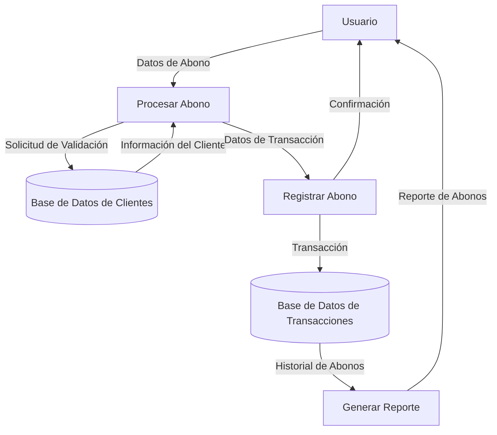

## Module: CTmpCaGrabarAbono.cpp
# Análisis Integral del Módulo CTmpCaGrabarAbono.cpp

## Nombre del Módulo/Componente SQL
CTmpCaGrabarAbono.cpp - Clase para gestionar abonos en un sistema de caja.

## Objetivos Primarios
Este módulo implementa una clase que maneja la grabación de abonos en un sistema de caja o contabilidad. Su propósito principal es procesar y registrar transacciones de abono, validando los datos y gestionando la persistencia de esta información en la base de datos.

## Funciones, Métodos y Consultas Críticas
- **CTmpCaGrabarAbono::CTmpCaGrabarAbono()**: Constructor que inicializa variables y establece valores predeterminados.
- **CTmpCaGrabarAbono::~CTmpCaGrabarAbono()**: Destructor que libera recursos.
- **CTmpCaGrabarAbono::Grabar()**: Método principal que coordina el proceso de grabación del abono.
- **CTmpCaGrabarAbono::GrabarAbono()**: Ejecuta la lógica específica para registrar el abono en la base de datos.
- **CTmpCaGrabarAbono::GrabarAbonoDetalle()**: Gestiona el registro de los detalles del abono.

## Variables y Elementos Clave
- **m_pDb**: Puntero a la conexión de base de datos.
- **m_pTmpCaAbono**: Objeto que contiene los datos del abono a grabar.
- **m_pTmpCaAbonoDetalle**: Objeto que contiene los detalles del abono.
- **m_nIdAbono**: Identificador único del abono.
- **m_nIdAbonoDetalle**: Identificador único del detalle del abono.
- **m_nIdCaja**: Identificador de la caja donde se realiza el abono.
- **m_nIdUsuario**: Identificador del usuario que realiza la operación.

## Interdependencias y Relaciones
- Interactúa con tablas de base de datos relacionadas con abonos y sus detalles.
- Depende de clases como CTmpCaAbono y CTmpCaAbonoDetalle para la estructura de datos.
- Se relaciona con un sistema de cajas y usuarios para la autenticación y registro de operaciones.

## Operaciones Principales vs. Auxiliares
- **Operaciones Principales**: 
  - Grabación del abono (GrabarAbono)
  - Registro de detalles del abono (GrabarAbonoDetalle)
- **Operaciones Auxiliares**:
  - Validación de datos
  - Manejo de errores
  - Inicialización de variables

## Secuencia Operacional/Flujo de Ejecución
1. Inicialización de variables y validación de parámetros
2. Verificación de la existencia y estado de la caja
3. Validación de los datos del abono
4. Registro del abono principal en la base de datos
5. Registro de los detalles del abono
6. Confirmación de la transacción o rollback en caso de error

## Aspectos de Rendimiento y Optimización
- Posible cuello de botella en operaciones de base de datos si se manejan grandes volúmenes de transacciones.
- La gestión de transacciones podría optimizarse para reducir el tiempo de bloqueo de tablas.
- Se recomienda revisar la eficiencia de las consultas SQL utilizadas para insertar y actualizar registros.

## Reusabilidad y Adaptabilidad
- La clase está diseñada con un enfoque modular que permite su reutilización en diferentes contextos del sistema.
- Los métodos están parametrizados para adaptarse a diferentes tipos de abonos.
- Podría mejorarse la adaptabilidad mediante una mayor parametrización de las operaciones de base de datos.

## Uso y Contexto
- Se utiliza en el contexto de un sistema de caja o contabilidad para registrar abonos.
- Es invocado cuando un usuario necesita registrar un pago o abono en el sistema.
- Forma parte de un flujo más amplio de gestión financiera o contable.

## Suposiciones y Limitaciones
- Asume la existencia de una estructura de base de datos específica con tablas para abonos y sus detalles.
- Requiere una conexión de base de datos válida y con permisos adecuados.
- Depende de la correcta configuración del sistema de cajas y usuarios.
- Podría tener limitaciones en cuanto al manejo de concurrencia si múltiples usuarios intentan registrar abonos simultáneamente.
## Flow Diagram [via mermaid]

