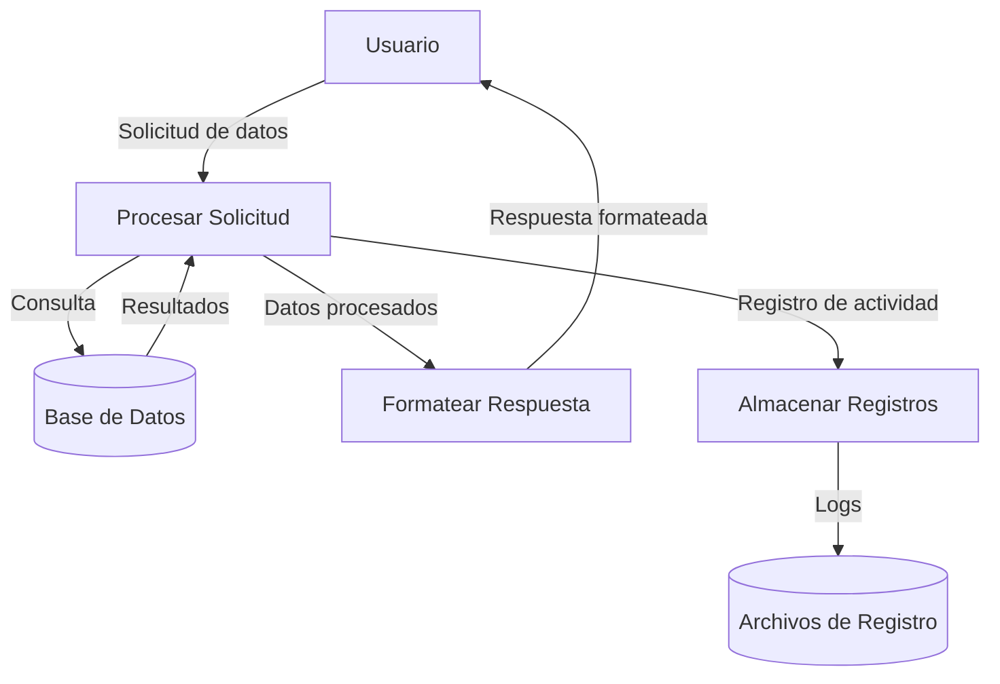

## Module: CUrlWebService.cpp
# Análisis Integral del Módulo CUrlWebService.cpp

## Nombre del Módulo/Componente SQL
**CUrlWebService.cpp** - Módulo de clase C++ para manejo de servicios web mediante URL

## Objetivos Primarios
Este módulo implementa una clase para realizar solicitudes HTTP a servicios web, principalmente enfocado en la comunicación con servicios web mediante el protocolo HTTP. Proporciona funcionalidad para enviar solicitudes GET y POST, manejar respuestas y gestionar errores de comunicación.

## Funciones, Métodos y Consultas Críticas
- **CUrlWebService::CUrlWebService()**: Constructor que inicializa la instancia y configura los parámetros predeterminados.
- **CUrlWebService::~CUrlWebService()**: Destructor que libera recursos.
- **CUrlWebService::Get()**: Método principal para realizar solicitudes HTTP GET.
- **CUrlWebService::Post()**: Método principal para realizar solicitudes HTTP POST.
- **CUrlWebService::WriteCallback()**: Función de callback estática para procesar datos recibidos.
- **CUrlWebService::SetTimeout()**: Configura el tiempo de espera para las solicitudes.
- **CUrlWebService::SetHeaders()**: Establece encabezados HTTP personalizados.

## Variables y Elementos Clave
- **m_curl**: Instancia del manejador CURL para realizar operaciones HTTP.
- **m_headers**: Lista de encabezados HTTP personalizados.
- **m_timeout**: Tiempo máximo de espera para las solicitudes.
- **m_response**: Almacena la respuesta recibida del servidor.
- **m_errorBuffer**: Buffer para almacenar mensajes de error.

## Interdependencias y Relaciones
- Dependencia de la biblioteca libcurl para la comunicación HTTP.
- Posible interacción con sistemas de registro (logging) externos.
- Interacción con servicios web externos definidos por las URLs proporcionadas.
- Posible integración con sistemas de autenticación para servicios web protegidos.

## Operaciones Principales vs. Auxiliares
**Operaciones Principales:**
- Ejecución de solicitudes GET y POST a servicios web.
- Procesamiento de respuestas HTTP.

**Operaciones Auxiliares:**
- Configuración de parámetros de conexión (timeout, headers).
- Manejo de errores y excepciones.
- Limpieza de recursos y memoria.
- Funciones de callback para procesamiento de datos.

## Secuencia Operacional/Flujo de Ejecución
1. Inicialización del objeto CUrlWebService.
2. Configuración de parámetros (timeout, headers, etc.).
3. Ejecución de solicitud HTTP (GET o POST).
4. Procesamiento de la respuesta mediante callback.
5. Almacenamiento de la respuesta en el buffer interno.
6. Manejo de errores si ocurren.
7. Retorno de la respuesta al llamador.
8. Liberación de recursos al finalizar.

## Aspectos de Rendimiento y Optimización
- Posible cuello de botella en conexiones HTTP lentas o inestables.
- Manejo de memoria para respuestas grandes podría optimizarse.
- Reutilización de conexiones CURL para múltiples solicitudes mejoraría el rendimiento.
- Implementación de caché para respuestas frecuentes podría reducir la carga del servidor.
- Manejo asíncrono de solicitudes podría mejorar la experiencia del usuario.

## Reusabilidad y Adaptabilidad
- Alta reusabilidad como componente genérico para comunicación HTTP.
- Adaptable a diferentes tipos de servicios web mediante configuración de headers y parámetros.
- Podría extenderse para soportar otros métodos HTTP (PUT, DELETE, etc.).
- Diseño modular que permite su integración en diferentes proyectos.

## Uso y Contexto
- Utilizado para integración con APIs externas y servicios web.
- Aplicable en escenarios de intercambio de datos entre sistemas.
- Útil para aplicaciones que requieren obtener o enviar datos a servicios remotos.
- Puede ser empleado en sistemas de monitoreo, integración de pagos, autenticación externa, etc.

## Suposiciones y Limitaciones
**Suposiciones:**
- Se asume disponibilidad de la biblioteca libcurl en el entorno de ejecución.
- Se espera que las URLs proporcionadas sean válidas y accesibles.
- Se asume que las respuestas del servidor serán manejables en memoria.

**Limitaciones:**
- No maneja nativamente conexiones seguras complejas (certificados personalizados).
- Limitado a los métodos HTTP implementados (GET y POST).
- No implementa manejo avanzado de sesiones o cookies.
- Posible limitación en el manejo de respuestas muy grandes.
- No incluye mecanismos de reintentos automáticos ante fallos de conexión.
## Flow Diagram [via mermaid]

