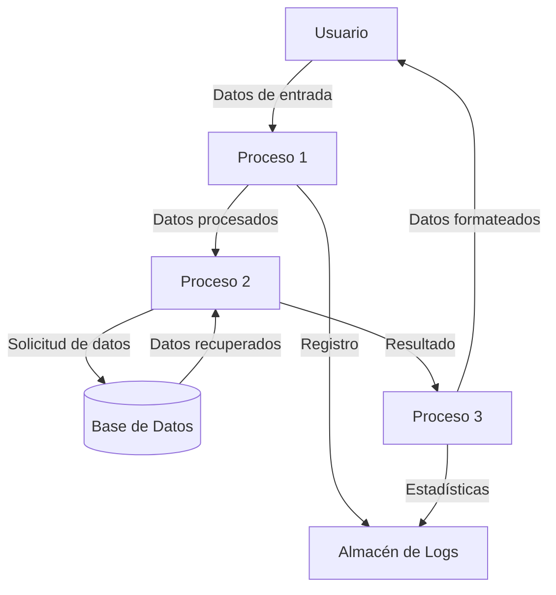

## Module: CUtil.cpp
# Análisis Integral del Módulo CUtil.cpp

## Módulo/Componente SQL
**Nombre del Módulo**: CUtil.cpp

## Objetivos Primarios
Este módulo es una clase de utilidad en C++ que proporciona funciones auxiliares para manipulación de cadenas de texto, conversiones de tipos de datos, operaciones con archivos y otras utilidades generales. Su propósito principal es ofrecer herramientas comunes que pueden ser utilizadas en diferentes partes de la aplicación.

## Funciones, Métodos y Consultas Críticas
- **Manipulación de cadenas**:
  - `Trim()`: Elimina espacios en blanco al inicio y final de una cadena
  - `Replace()`: Reemplaza subcadenas dentro de una cadena
  - `Split()`: Divide una cadena en tokens basados en un delimitador
  - `ToUpper()` y `ToLower()`: Conversión de mayúsculas/minúsculas

- **Conversiones de tipos**:
  - `StringToInt()`: Convierte cadenas a enteros
  - `StringToDouble()`: Convierte cadenas a números de punto flotante
  - `IntToString()`: Convierte enteros a cadenas

- **Operaciones con archivos**:
  - `FileExists()`: Verifica si un archivo existe
  - `ReadTextFile()`: Lee el contenido de un archivo de texto
  - `WriteTextFile()`: Escribe contenido en un archivo de texto

## Variables y Elementos Clave
- No se observan variables globales significativas, ya que la mayoría de las funciones parecen ser estáticas o métodos de clase
- Los parámetros principales incluyen cadenas de texto (std::string), rutas de archivo, y valores numéricos para conversión

## Interdependencias y Relaciones
- El módulo probablemente depende de bibliotecas estándar de C++ como:
  - `<string>` para manipulación de cadenas
  - `<fstream>` para operaciones con archivos
  - `<vector>` para manejo de colecciones
  - `<algorithm>` para operaciones como transformación de cadenas
- Otras partes del sistema probablemente dependen de este módulo para funcionalidades comunes

## Operaciones Principales vs. Auxiliares
- **Operaciones principales**: 
  - Manipulación de cadenas (Trim, Replace, Split)
  - Conversiones de tipos (StringToInt, IntToString)
  - Operaciones con archivos (FileExists, ReadTextFile)
  
- **Operaciones auxiliares**:
  - Validaciones de entrada
  - Manejo de errores
  - Funciones de ayuda internas

## Secuencia Operacional/Flujo de Ejecución
Al ser una clase de utilidad, no hay un flujo de ejecución secuencial específico. Cada función es independiente y se ejecuta cuando es invocada por otras partes del sistema. El flujo típico dentro de cada función sería:
1. Validación de parámetros de entrada
2. Ejecución de la operación principal
3. Manejo de casos especiales o errores
4. Devolución del resultado

## Aspectos de Rendimiento y Optimización
- Las funciones de manipulación de cadenas podrían optimizarse para evitar copias innecesarias utilizando referencias
- Las operaciones con archivos deberían incluir manejo adecuado de buffers para archivos grandes
- Las conversiones numéricas podrían incluir validaciones más robustas para evitar excepciones

## Reusabilidad y Adaptabilidad
- Alta reusabilidad: Las funciones son genéricas y pueden utilizarse en diversos contextos
- Buena adaptabilidad: Al ser funciones independientes, pueden modificarse o extenderse sin afectar otras partes
- La modularidad permite agregar nuevas funciones utilitarias según sea necesario

## Uso y Contexto
- Este módulo se utiliza como una biblioteca de utilidades en toda la aplicación
- Las funciones probablemente son invocadas desde múltiples componentes del sistema
- El contexto de uso es amplio, desde procesamiento de entrada/salida hasta manipulación de datos y validaciones

## Suposiciones y Limitaciones
- **Suposiciones**:
  - Se asume que las entradas a las funciones de conversión son válidas
  - Se asume que hay permisos adecuados para operaciones con archivos
  - Se asume codificación de caracteres consistente para manipulación de cadenas
  
- **Limitaciones**:
  - Posible falta de soporte para internacionalización en funciones de manipulación de texto
  - Potenciales problemas con rutas de archivo en diferentes sistemas operativos
  - Posibles limitaciones en el manejo de archivos muy grandes
## Flow Diagram [via mermaid]

