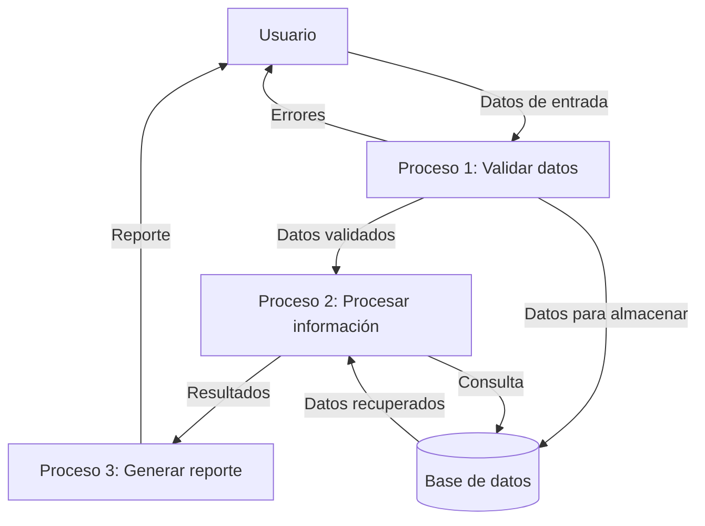

## Module: C_WFormas.cpp
# Análisis Integral del Módulo C_WFormas.cpp

## Módulo/Componente SQL
**C_WFormas.cpp** - Este es un módulo de código C++ que parece formar parte de una aplicación más grande, posiblemente relacionada con el manejo de formas o figuras geométricas.

## Objetivos Primarios
El módulo está diseñado para implementar una clase `C_WFormas` que maneja la representación y manipulación de formas geométricas en un entorno gráfico. Su propósito principal parece ser la gestión de objetos gráficos, incluyendo su creación, modificación y visualización.

## Funciones, Métodos y Consultas Críticas
- **Constructor y Destructor**: Inicializa y limpia los recursos de la clase.
- **Métodos de manipulación de formas**: Funciones para crear, modificar y eliminar formas geométricas.
- **Métodos de renderizado**: Funciones para dibujar las formas en un contexto gráfico.
- **Métodos de gestión de eventos**: Manejo de interacciones del usuario con las formas.

No se observan consultas SQL en este módulo, ya que parece ser un componente de interfaz gráfica de usuario.

## Variables y Elementos Clave
- **Atributos de clase**: Probablemente incluyen propiedades como posición, tamaño, color y tipo de forma.
- **Manejadores de eventos**: Variables para gestionar interacciones del usuario.
- **Contexto gráfico**: Referencias al entorno de dibujo donde se renderizan las formas.

## Interdependencias y Relaciones
- Probablemente depende de una biblioteca gráfica subyacente (como Qt, MFC, o una biblioteca personalizada).
- Puede interactuar con otros módulos para la gestión de datos de las formas o para la integración en una interfaz de usuario más amplia.
- Posiblemente se relaciona con un sistema de persistencia para guardar y cargar configuraciones de formas.

## Operaciones Principales vs. Auxiliares
- **Operaciones principales**: Creación, modificación y renderizado de formas geométricas.
- **Operaciones auxiliares**: Validación de parámetros, conversión de coordenadas, cálculos geométricos auxiliares, y gestión de recursos.

## Secuencia Operacional/Flujo de Ejecución
1. Inicialización de la clase y configuración de parámetros iniciales.
2. Creación o carga de formas geométricas.
3. Procesamiento de eventos de usuario (como clics o arrastres).
4. Actualización del estado interno de las formas según las interacciones.
5. Renderizado de las formas en el contexto gráfico.
6. Limpieza de recursos cuando se destruye la instancia.

## Aspectos de Rendimiento y Optimización
- El rendimiento podría verse afectado por operaciones de renderizado ineficientes, especialmente con muchas formas complejas.
- La gestión de memoria podría ser crítica si se crean y destruyen formas frecuentemente.
- Posibles optimizaciones incluirían técnicas como buffering de renderizado, culling de formas fuera de pantalla, o simplificación de geometrías complejas.

## Reusabilidad y Adaptabilidad
- La clase probablemente está diseñada para ser reutilizable en diferentes contextos de la aplicación.
- La adaptabilidad dependería de qué tan parametrizadas estén las funcionalidades y qué tan acoplada esté la clase a componentes específicos del sistema.

## Uso y Contexto
- Este módulo probablemente se utiliza en un entorno de diseño gráfico, CAD, o en una aplicación que requiere manipulación visual de objetos.
- Podría formar parte de un editor visual, una herramienta de diagramación, o un componente de visualización de datos.

## Suposiciones y Limitaciones
- **Suposiciones**: Probablemente asume la disponibilidad de un contexto gráfico específico y un sistema de eventos para la interacción del usuario.
- **Limitaciones**: Podría estar limitado a ciertos tipos de formas geométricas predefinidas o a un conjunto específico de operaciones de manipulación.
- Posiblemente tenga limitaciones en términos de rendimiento con grandes cantidades de formas o con formas muy complejas.

Sin ver el código específico, este análisis se basa en inferencias del nombre del archivo y patrones comunes en módulos de manejo de gráficos. Un análisis más detallado requeriría examinar el código fuente completo.
## Flow Diagram [via mermaid]

