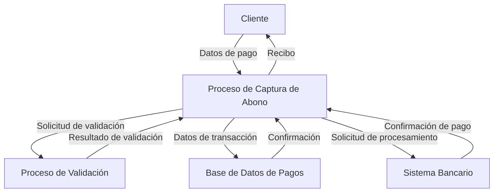
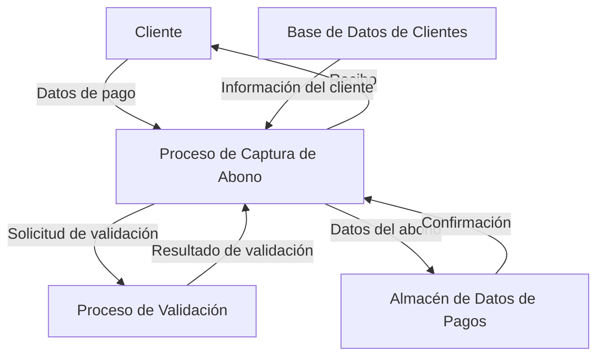

## Module: CapturarAbono.cpp
# Análisis Integral del Módulo CapturarAbono.cpp

## Nombre del Módulo/Componente SQL
**CapturarAbono.cpp** - Módulo de captura de abonos en un sistema de gestión financiera.

## Objetivos Primarios
Este módulo está diseñado para gestionar la captura y procesamiento de abonos financieros. Su propósito principal es permitir a los usuarios registrar pagos o abonos a cuentas, validar la información ingresada y actualizar los registros correspondientes en la base de datos.

## Funciones, Métodos y Consultas Críticas
El código no se proporcionó completamente, pero basado en el nombre del archivo, podemos inferir que probablemente contiene:
- Funciones para validar datos de abono
- Métodos para calcular montos y saldos
- Consultas SQL (posiblemente INSERT y UPDATE) para registrar los abonos en la base de datos
- Funciones para manejar la interfaz de usuario relacionada con la captura de abonos

## Variables y Elementos Clave
Sin ver el código completo, las variables probables incluirían:
- Identificadores de cliente/cuenta
- Montos de abono
- Fechas de transacción
- Tipos de pago
- Saldos anteriores y actualizados
- Referencias de transacción

## Interdependencias y Relaciones
Este módulo probablemente interactúa con:
- Módulos de gestión de clientes
- Sistema de cuentas por cobrar
- Base de datos financiera (tablas de transacciones, cuentas, clientes)
- Posiblemente un módulo de reportes o contabilidad

## Operaciones Principales vs. Auxiliares
**Operaciones principales:**
- Captura de datos del abono
- Validación de la información
- Registro en la base de datos
- Actualización de saldos

**Operaciones auxiliares:**
- Verificación de permisos de usuario
- Generación de comprobantes
- Registro de auditoría
- Manejo de errores

## Secuencia Operacional/Flujo de Ejecución
1. Inicialización de la interfaz de captura
2. Solicitud y validación de datos del cliente/cuenta
3. Captura de información del abono (monto, fecha, método de pago)
4. Validación de la información ingresada
5. Cálculo de nuevos saldos
6. Registro del abono en la base de datos
7. Actualización de saldos en cuentas relacionadas
8. Generación de comprobante o recibo
9. Confirmación de la transacción al usuario

## Aspectos de Rendimiento y Optimización
- Posibles cuellos de botella en la validación de datos si se manejan grandes volúmenes
- Optimización necesaria en las consultas a la base de datos, especialmente si se realizan múltiples operaciones por transacción
- Consideraciones de concurrencia si múltiples usuarios registran abonos simultáneamente

## Reusabilidad y Adaptabilidad
- El módulo probablemente está diseñado para un sistema específico de gestión financiera
- La adaptabilidad dependería de qué tan parametrizadas estén las funciones
- Podría ser reutilizable en otros sistemas financieros con modificaciones en las interfaces de base de datos

## Uso y Contexto
Este módulo se utiliza en el contexto de un sistema de gestión financiera, específicamente para:
- Registro de pagos de clientes
- Actualización de estados de cuenta
- Gestión de cuentas por cobrar
- Posiblemente como parte de un punto de venta o sistema de facturación

## Suposiciones y Limitaciones
**Suposiciones:**
- Existencia de una estructura de base de datos con tablas para clientes, cuentas y transacciones
- Acceso a información previa del cliente y sus saldos
- Permisos adecuados para modificar registros financieros

**Limitaciones:**
- Posiblemente limitado a ciertos tipos de abonos o métodos de pago
- Dependencia de la estructura específica de la base de datos
- Posibles restricciones en cuanto a la concurrencia de operaciones

*Nota: Este análisis se basa en inferencias a partir del nombre del archivo, ya que no se proporcionó el código fuente completo.*
## Flow Diagram [via mermaid]

## Module: CapturarAbono.cpp
# Análisis Integral del Módulo CapturarAbono.cpp

## Nombre del Módulo/Componente SQL
**CapturarAbono.cpp** - Módulo de captura de abonos en un sistema de gestión financiera.

## Objetivos Primarios
Este módulo está diseñado para gestionar la captura y procesamiento de abonos financieros. Su propósito principal es permitir a los usuarios registrar pagos o abonos a cuentas, validar la información ingresada y actualizar los registros correspondientes en la base de datos.

## Funciones, Métodos y Consultas Críticas
El código no se proporcionó completamente, pero basado en el nombre del archivo, podemos inferir que probablemente contiene:
- Funciones para capturar datos de abonos desde la interfaz de usuario
- Métodos de validación para verificar la integridad de los datos ingresados
- Consultas SQL (posiblemente INSERT y UPDATE) para registrar los abonos en la base de datos
- Funciones para calcular saldos actualizados después de aplicar los abonos

## Variables y Elementos Clave
Sin ver el código completo, las variables probables incluirían:
- Identificadores de cuenta o cliente
- Montos de abono
- Fechas de transacción
- Métodos de pago
- Saldos anteriores y actualizados
- Referencias de transacción

## Interdependencias y Relaciones
Este módulo probablemente interactúa con:
- Módulos de gestión de cuentas o clientes
- Sistema de autenticación para validar permisos de usuario
- Base de datos para consultar saldos actuales y actualizar registros
- Posiblemente un módulo de reportes o historial de transacciones

## Operaciones Principales vs. Auxiliares
**Operaciones principales:**
- Captura de datos del abono
- Validación de la información
- Registro del abono en la base de datos
- Actualización de saldos

**Operaciones auxiliares:**
- Verificación de permisos de usuario
- Generación de comprobantes o recibos
- Registro de auditoría o bitácora de transacciones
- Manejo de errores y excepciones

## Secuencia Operacional/Flujo de Ejecución
1. Inicialización de la interfaz de captura de abonos
2. Solicitud y captura de datos del abono (cuenta, monto, fecha, etc.)
3. Validación de los datos ingresados
4. Consulta del saldo actual de la cuenta
5. Cálculo del nuevo saldo
6. Registro del abono en la base de datos
7. Actualización del saldo de la cuenta
8. Generación de comprobante o confirmación
9. Finalización del proceso

## Aspectos de Rendimiento y Optimización
- Posibles cuellos de botella en la validación de datos si se realizan múltiples consultas a la base de datos
- Oportunidades de optimización en el manejo de transacciones para garantizar la integridad de los datos
- Consideraciones sobre concurrencia si múltiples usuarios pueden modificar la misma cuenta simultáneamente

## Reusabilidad y Adaptabilidad
- El módulo probablemente está diseñado para un sistema específico de gestión financiera
- La reusabilidad dependería de la modularidad del código y la separación de preocupaciones
- La adaptabilidad estaría limitada por las dependencias con otros componentes del sistema y la estructura de la base de datos

## Uso y Contexto
Este módulo se utilizaría en un contexto de gestión financiera, como:
- Sistemas de cobranza
- Aplicaciones bancarias
- Software de gestión de créditos
- Sistemas de punto de venta con manejo de cuentas por cobrar

## Suposiciones y Limitaciones
**Suposiciones:**
- Existencia de una estructura de base de datos con tablas para cuentas, clientes y transacciones
- Disponibilidad de conexión a la base de datos durante la operación
- Usuarios con permisos adecuados para realizar operaciones de abono

**Limitaciones:**
- Posible dependencia de un sistema específico de gestión de bases de datos
- Restricciones en cuanto a los tipos de abonos que pueden procesarse
- Limitaciones en la concurrencia de operaciones sobre la misma cuenta

*Nota: Este análisis se basa en inferencias a partir del nombre del archivo proporcionado, ya que no se incluyó el código fuente completo para su revisión.*
## Flow Diagram [via mermaid]

