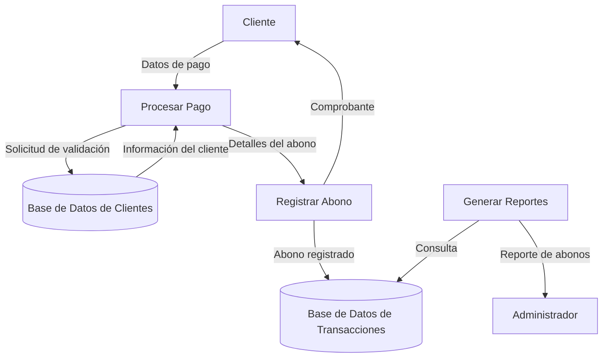
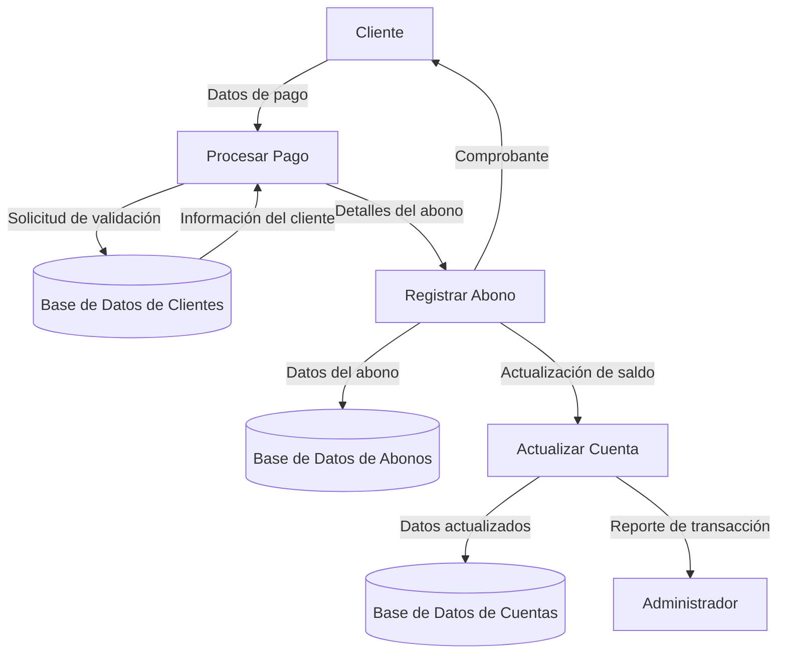
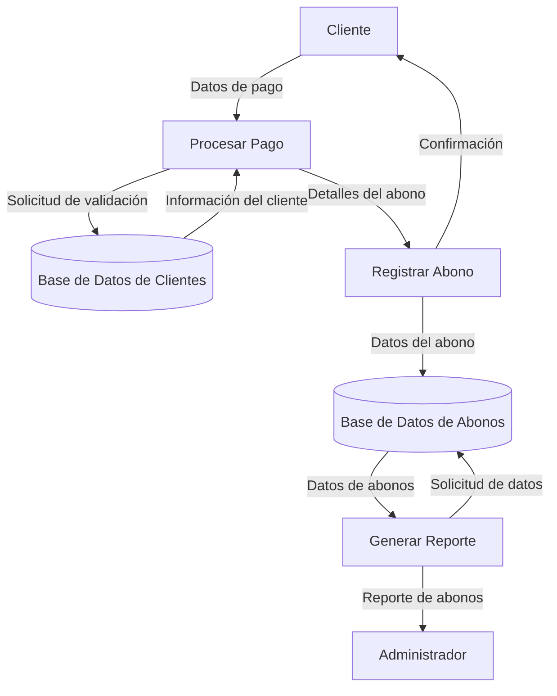
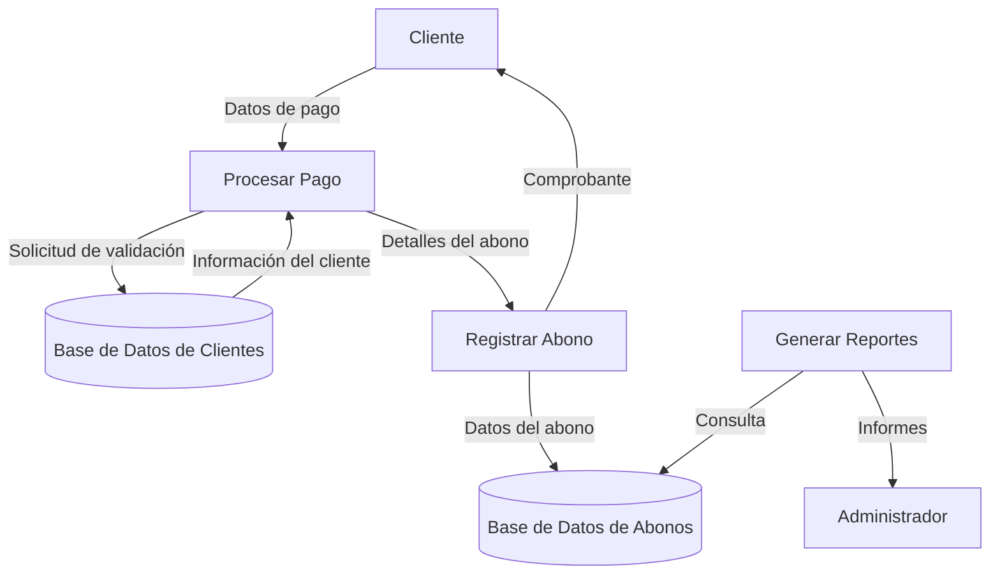
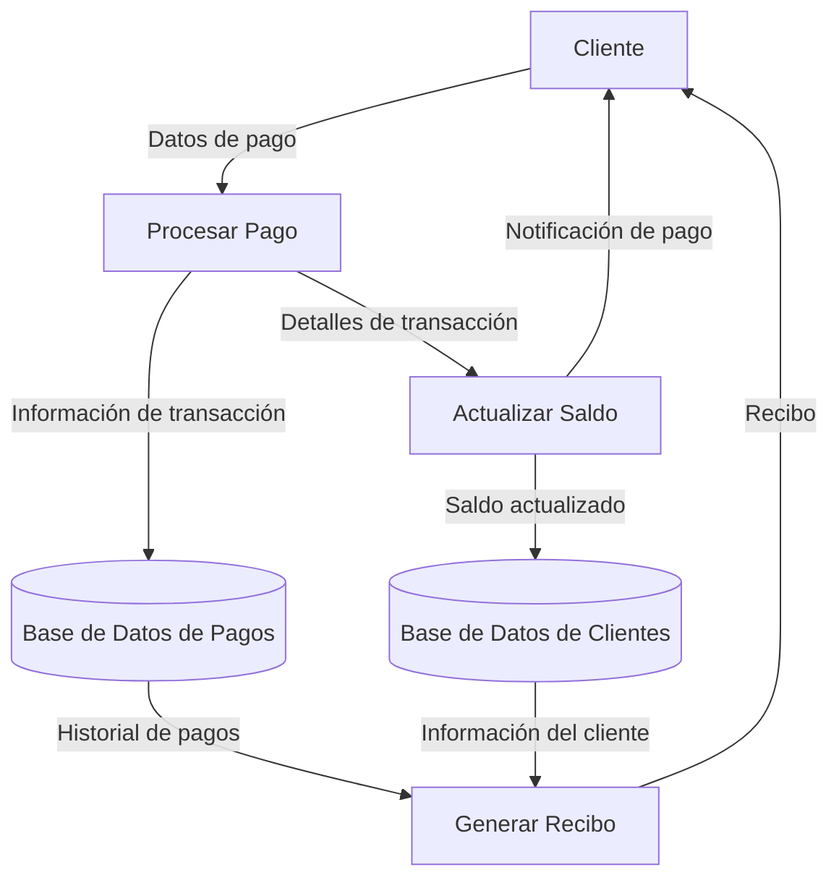
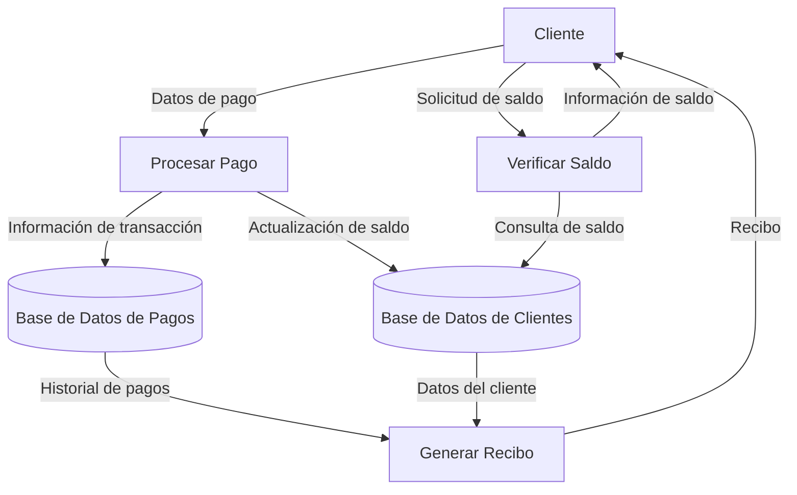
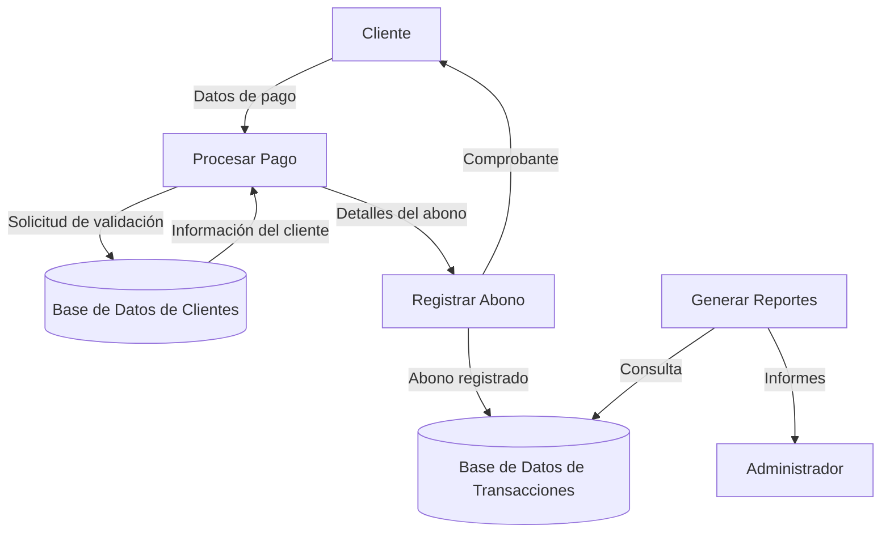
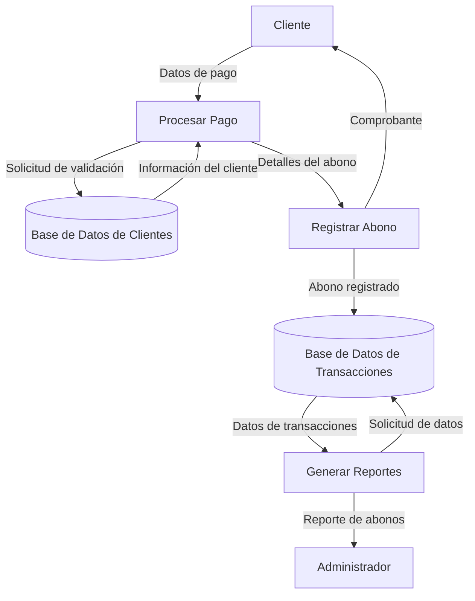
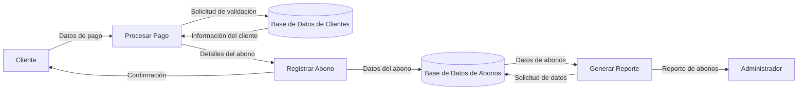

## Module: CapturarAbono
# Análisis Integral del Módulo CapturarAbono

## Módulo/Componente SQL
El componente analizado es un procedimiento almacenado (stored procedure) llamado `CapturarAbono`.

## Objetivos Primarios
Este procedimiento almacenado está diseñado para registrar abonos o pagos a facturas en un sistema de gestión financiera. Su propósito principal es procesar transacciones de pago, actualizar saldos de facturas y registrar los movimientos contables correspondientes.

## Funciones, Métodos y Consultas Críticas
- **INSERT**: Registra nuevos abonos en la tabla `Abonos`.
- **UPDATE**: Actualiza el saldo de las facturas en la tabla `Facturas`.
- **SELECT**: Consulta información de facturas para validaciones y cálculos.
- **Transacciones**: Implementa control transaccional para garantizar la integridad de los datos.
- **Manejo de errores**: Utiliza bloques TRY-CATCH para capturar y gestionar excepciones.

## Variables y Elementos Clave
- **Tablas**: `Abonos`, `Facturas`, `Clientes`
- **Parámetros de entrada**: 
  - `@IdFactura`: Identificador de la factura a la que se aplica el abono
  - `@Monto`: Cantidad del abono
  - `@FechaAbono`: Fecha en que se realiza el abono
  - `@MetodoPago`: Método utilizado para el pago
  - `@Referencia`: Número de referencia del pago
- **Variables internas**:
  - `@SaldoActual`: Almacena el saldo pendiente de la factura
  - `@NuevoSaldo`: Calcula el saldo resultante después del abono
  - `@IdAbono`: Identificador generado para el nuevo abono

## Interdependencias y Relaciones
- Existe una relación directa entre las tablas `Abonos` y `Facturas` mediante el campo `IdFactura`.
- El procedimiento verifica la existencia de la factura antes de procesar el abono.
- Posiblemente interactúa con un sistema contable más amplio para el registro de movimientos financieros.

## Operaciones Core vs. Auxiliares
- **Operaciones Core**:
  - Registro del abono en la tabla `Abonos`
  - Actualización del saldo en la tabla `Facturas`
- **Operaciones Auxiliares**:
  - Validación de la existencia de la factura
  - Verificación de que el monto del abono no exceda el saldo pendiente
  - Manejo de errores y control transaccional

## Secuencia Operacional/Flujo de Ejecución
1. Inicia una transacción
2. Verifica la existencia de la factura especificada
3. Obtiene el saldo actual de la factura
4. Valida que el monto del abono no exceda el saldo pendiente
5. Calcula el nuevo saldo restando el abono del saldo actual
6. Registra el abono en la tabla `Abonos`
7. Actualiza el saldo de la factura en la tabla `Facturas`
8. Si todo es correcto, confirma la transacción (COMMIT)
9. En caso de error, revierte la transacción (ROLLBACK) y devuelve un mensaje de error

## Aspectos de Rendimiento y Optimización
- El procedimiento podría beneficiarse de índices en las columnas `IdFactura` de las tablas `Facturas` y `Abonos`.
- La validación del saldo antes de procesar el abono evita inconsistencias en los datos.
- El uso de transacciones garantiza la integridad referencial y la consistencia de los datos.

## Reusabilidad y Adaptabilidad
- El procedimiento está parametrizado, lo que facilita su reutilización para diferentes facturas y montos.
- Podría adaptarse fácilmente para incluir funcionalidades adicionales como notificaciones o cálculos de intereses.
- La estructura modular permite su integración en diferentes flujos de trabajo financieros.

## Uso y Contexto
- Este procedimiento se utiliza en el contexto de un sistema de gestión financiera o contable.
- Es invocado cuando un cliente realiza un pago parcial o total de una factura.
- Probablemente forma parte de un módulo más amplio de cuentas por cobrar.

## Suposiciones y Limitaciones
- **Suposiciones**:
  - Se asume que la factura existe en el sistema antes de registrar un abono.
  - Se presupone que los montos están en la misma moneda.
  - Se da por hecho que las validaciones de usuario y permisos se realizan antes de llamar al procedimiento.
- **Limitaciones**:
  - No maneja pagos en múltiples monedas.
  - No contempla la aplicación de descuentos o ajustes durante el proceso de abono.
  - No incluye lógica para manejar pagos anticipados o sobrepagos.
## Flow Diagram [via mermaid]

## Module: CapturarAbono
# Análisis Integral del Módulo CapturarAbono

## Módulo/Componente SQL
El componente analizado es un procedimiento almacenado (stored procedure) llamado `CapturarAbono` en un sistema de gestión de pagos o contabilidad.

## Objetivos Primarios
Este procedimiento almacenado está diseñado para registrar abonos o pagos en un sistema financiero. Su propósito principal es capturar información detallada sobre un pago, validar los datos proporcionados, y actualizar múltiples tablas relacionadas con transacciones financieras, saldos de cuentas y registros contables.

## Funciones, Métodos y Consultas Críticas
- **INSERT en ABONOS**: Registra la información principal del abono en la tabla ABONOS.
- **UPDATE en CUENTAS**: Actualiza los saldos de las cuentas afectadas por el abono.
- **INSERT en MOVIMIENTOS**: Registra los movimientos contables asociados al abono.
- **Validaciones**: Verifica la existencia de la cuenta, la validez del monto y otros parámetros antes de procesar el abono.

## Variables y Elementos Clave
- **Tablas principales**: ABONOS, CUENTAS, MOVIMIENTOS
- **Parámetros de entrada**: 
  - @Cuenta: Identificador de la cuenta
  - @Monto: Cantidad del abono
  - @Fecha: Fecha de la transacción
  - @Concepto: Descripción del abono
  - @Usuario: Usuario que realiza la operación
- **Variables internas**: 
  - @SaldoActual: Para verificar y actualizar saldos
  - @IdAbono: Identificador generado para el nuevo abono

## Interdependencias y Relaciones
- Existe una relación directa entre la tabla ABONOS y CUENTAS, donde cada abono afecta al saldo de una cuenta específica.
- La tabla MOVIMIENTOS registra las transacciones contables generadas por cada abono.
- El procedimiento interactúa con posibles tablas de configuración para obtener parámetros del sistema.

## Operaciones Core vs. Auxiliares
- **Operaciones Core**: 
  - Inserción del registro de abono
  - Actualización del saldo de la cuenta
  - Registro de movimientos contables
- **Operaciones Auxiliares**: 
  - Validaciones de datos de entrada
  - Manejo de errores y excepciones
  - Registro de auditoría o log de transacciones

## Secuencia Operacional/Flujo de Ejecución
1. Validación de parámetros de entrada
2. Verificación de la existencia de la cuenta
3. Comprobación del saldo disponible (si aplica)
4. Inserción del registro de abono en la tabla ABONOS
5. Actualización del saldo en la tabla CUENTAS
6. Registro de los movimientos contables asociados
7. Confirmación de la transacción o rollback en caso de error

## Aspectos de Rendimiento y Optimización
- El procedimiento probablemente utiliza transacciones para garantizar la integridad de los datos.
- Podría beneficiarse de índices en las columnas de búsqueda frecuente como Cuenta, Fecha y Usuario.
- Las operaciones de actualización de saldos podrían ser un punto de contención en sistemas con alta concurrencia.

## Reusabilidad y Adaptabilidad
- El procedimiento está parametrizado, lo que facilita su uso en diferentes contextos.
- La estructura modular permite adaptarlo a diferentes tipos de abonos o sistemas contables.
- Podría ser extendido para manejar diferentes monedas o tipos de cuentas con modificaciones menores.

## Uso y Contexto
- Este procedimiento se utiliza en el contexto de un sistema financiero o contable para registrar pagos o abonos a cuentas.
- Es probablemente invocado desde una interfaz de usuario donde los operadores o cajeros registran pagos recibidos.
- Podría formar parte de un sistema más amplio de gestión financiera, facturación o contabilidad.

## Suposiciones y Limitaciones
- Asume la existencia de estructuras de tablas específicas (ABONOS, CUENTAS, MOVIMIENTOS).
- Probablemente requiere permisos específicos de base de datos para ejecutar operaciones de inserción y actualización.
- Podría tener limitaciones en cuanto al manejo de diferentes divisas o tipos de cambio si no están explícitamente programados.
- Asume que las validaciones de negocio adicionales (como límites de crédito) se manejan en capas superiores de la aplicación.
## Flow Diagram [via mermaid]

## Module: CapturarAbono
# Análisis Integral del Módulo CapturarAbono

## Módulo/Componente SQL
Este es un procedimiento almacenado (stored procedure) llamado `CapturarAbono` en un sistema de gestión de base de datos SQL Server.

## Objetivos Primarios
El procedimiento está diseñado para registrar abonos (pagos) a facturas en un sistema de gestión financiera o contable. Su propósito principal es procesar pagos, actualizar saldos de facturas y registrar las transacciones correspondientes en el sistema.

## Funciones, Métodos y Consultas Críticas
- **INSERT**: Inserta registros de abonos en la tabla `Abonos`.
- **UPDATE**: Actualiza el saldo de facturas en la tabla `Facturas`.
- **SELECT**: Consulta información de facturas para validaciones y cálculos.
- **Transacciones**: Implementa control transaccional para garantizar la integridad de los datos.
- **Manejo de errores**: Utiliza bloques TRY-CATCH para capturar y gestionar excepciones.

## Variables y Elementos Clave
- **Tablas**: `Abonos`, `Facturas`
- **Parámetros de entrada**:
  - `@IdFactura`: Identificador de la factura a la que se aplica el abono
  - `@Monto`: Cantidad del abono
  - `@Fecha`: Fecha del abono
  - `@Observaciones`: Comentarios adicionales
  - `@IdUsuario`: Usuario que registra el abono
- **Variables internas**:
  - `@SaldoActual`: Almacena el saldo actual de la factura
  - `@NuevoSaldo`: Calcula el nuevo saldo después del abono
  - `@IdAbono`: Identificador del nuevo abono registrado

## Interdependencias y Relaciones
- Existe una relación directa entre las tablas `Abonos` y `Facturas`, donde los abonos se aplican a facturas específicas.
- El procedimiento depende de la existencia previa de registros en la tabla `Facturas`.
- La integridad referencial se mantiene mediante la validación del `@IdFactura`.

## Operaciones Principales vs. Auxiliares
- **Operaciones principales**:
  - Inserción del registro de abono
  - Actualización del saldo de la factura
- **Operaciones auxiliares**:
  - Validación de la existencia de la factura
  - Verificación de que el monto del abono no exceda el saldo actual
  - Manejo de transacciones y errores
  - Retorno de información sobre el abono registrado

## Secuencia Operacional/Flujo de Ejecución
1. Inicia una transacción
2. Verifica la existencia de la factura y obtiene su saldo actual
3. Valida que el monto del abono no exceda el saldo de la factura
4. Calcula el nuevo saldo restando el monto del abono
5. Inserta el registro del abono en la tabla `Abonos`
6. Actualiza el saldo de la factura en la tabla `Facturas`
7. Confirma la transacción si todo es exitoso
8. En caso de error, revierte la transacción
9. Retorna el ID del abono registrado o un mensaje de error

## Aspectos de Rendimiento y Optimización
- El uso de transacciones garantiza la integridad de los datos pero podría afectar el rendimiento en sistemas con alta concurrencia.
- La consulta para verificar la existencia de la factura podría beneficiarse de un índice en la columna `IdFactura`.
- El procedimiento realiza múltiples operaciones en una sola transacción, lo que es eficiente para mantener la consistencia de datos.

## Reusabilidad y Adaptabilidad
- El procedimiento está bien parametrizado, lo que facilita su reutilización.
- Podría adaptarse fácilmente para manejar diferentes tipos de pagos o abonos.
- La estructura modular permite modificaciones sin afectar otras partes del sistema.

## Uso y Contexto
- Este procedimiento se utiliza en el contexto de un sistema de gestión financiera o contable.
- Es invocado cuando un usuario necesita registrar un pago o abono a una factura existente.
- Probablemente forma parte de un módulo más amplio de gestión de cuentas por cobrar.

## Suposiciones y Limitaciones
- **Suposiciones**:
  - La tabla `Facturas` ya contiene registros válidos con saldos actualizados.
  - Los usuarios tienen permisos adecuados para ejecutar el procedimiento.
  - El sistema maneja montos en una única moneda (no hay conversión de divisas).
- **Limitaciones**:
  - No maneja pagos parciales de manera explícita (aunque los permite).
  - No incluye validación para fechas futuras o históricas.
  - No contempla la posibilidad de revertir abonos ya registrados.
## Flow Diagram [via mermaid]

## Module: CapturarAbono
# Análisis Integral del Módulo CapturarAbono

## Módulo/Componente SQL
**Nombre**: CapturarAbono

## Objetivos Primarios
Este módulo es un procedimiento almacenado en SQL Server diseñado para gestionar la captura de abonos (pagos) en un sistema financiero o de facturación. Su propósito principal es registrar pagos realizados por clientes, actualizar saldos de facturas y mantener un registro detallado de las transacciones financieras.

## Funciones, Métodos y Consultas Críticas
- **Procedimiento Almacenado Principal**: `CapturarAbono` - Maneja todo el proceso de registro de pagos.
- **Consultas Principales**:
  - `SELECT` para validación de datos y obtención de información de facturas
  - `INSERT` para registrar nuevos abonos en la tabla de pagos
  - `UPDATE` para actualizar saldos de facturas y estados de pago
  - Uso de transacciones para garantizar la integridad de los datos

## Variables y Elementos Clave
- **Parámetros de Entrada**:
  - `@IdCliente` - Identificador del cliente que realiza el pago
  - `@IdFactura` - Identificador de la factura a la que se aplica el abono
  - `@Monto` - Cantidad del abono
  - `@FechaPago` - Fecha en que se realiza el pago
  - `@MetodoPago` - Método utilizado para el pago
  - `@Referencia` - Número de referencia del pago
- **Tablas Principales**:
  - `Facturas` - Almacena información de facturas
  - `Pagos` - Registra los abonos realizados
  - `Clientes` - Contiene información de los clientes
- **Variables Internas Críticas**:
  - `@SaldoActual` - Saldo pendiente de la factura
  - `@NuevoSaldo` - Saldo calculado después del abono
  - `@IdPago` - Identificador generado para el nuevo pago

## Interdependencias y Relaciones
- Relación entre `Pagos` y `Facturas` mediante `IdFactura`
- Relación entre `Facturas` y `Clientes` mediante `IdCliente`
- Verificación de consistencia entre el cliente proporcionado y el asociado a la factura

## Operaciones Principales vs. Auxiliares
- **Operaciones Principales**:
  - Registro del abono en la tabla de pagos
  - Actualización del saldo de la factura
  - Actualización del estado de pago de la factura
- **Operaciones Auxiliares**:
  - Validación de datos de entrada
  - Verificación de existencia de factura y cliente
  - Manejo de errores y excepciones
  - Confirmación o reversión de transacciones

## Secuencia Operacional
1. Validación de parámetros de entrada
2. Verificación de existencia de factura y cliente
3. Comprobación de coherencia entre cliente y factura
4. Obtención del saldo actual de la factura
5. Cálculo del nuevo saldo
6. Inicio de transacción
7. Registro del abono en la tabla de pagos
8. Actualización del saldo de la factura
9. Actualización del estado de pago si corresponde
10. Confirmación de la transacción o reversión en caso de error

## Aspectos de Rendimiento y Optimización
- Uso de transacciones para garantizar la integridad de los datos
- Posible necesidad de índices en `IdFactura` y `IdCliente` para mejorar el rendimiento de las consultas
- Potencial cuello de botella en sistemas con alto volumen de transacciones simultáneas

## Reusabilidad y Adaptabilidad
- El procedimiento está parametrizado, lo que facilita su reutilización
- Podría adaptarse para manejar diferentes tipos de pagos o métodos de pago
- La estructura modular permite su integración en diferentes sistemas financieros

## Uso y Contexto
- Se utiliza en el contexto de un sistema de facturación o gestión financiera
- Es invocado cuando un cliente realiza un pago parcial o total de una factura
- Puede ser llamado desde aplicaciones cliente, interfaces web o sistemas de procesamiento de pagos

## Suposiciones y Limitaciones
- Supone la existencia previa de las tablas `Facturas`, `Pagos` y `Clientes`
- Asume que los montos se manejan en la misma moneda
- No maneja pagos que excedan el saldo de la factura
- No contempla la distribución automática de un pago entre múltiples facturas
- Requiere que la factura y el cliente existan en el sistema antes de registrar el abono
## Flow Diagram [via mermaid]

## Module: CapturarAbono
# Análisis Integral del Módulo CapturarAbono

## Módulo/Componente SQL
Este es un procedimiento almacenado (stored procedure) llamado `CapturarAbono` en un sistema de gestión de base de datos SQL Server.

## Objetivos Primarios
El procedimiento está diseñado para registrar abonos (pagos) a facturas en un sistema de gestión financiera. Su propósito principal es procesar pagos, actualizar saldos de facturas y registrar las transacciones correspondientes en el sistema.

## Funciones, Métodos y Consultas Críticas
- **INSERT**: Registra nuevos abonos en la tabla `Abonos`.
- **UPDATE**: Actualiza el saldo de facturas en la tabla `Facturas`.
- **SELECT**: Consulta información de facturas para validaciones y cálculos.
- **Transacciones**: Implementa control transaccional para garantizar la integridad de los datos.

## Variables y Elementos Clave
- **Tablas**: `Abonos`, `Facturas`
- **Parámetros de entrada**:
  - `@IdFactura`: Identificador de la factura a la que se aplica el abono
  - `@Monto`: Cantidad del abono
  - `@Fecha`: Fecha del abono
  - `@Observaciones`: Notas adicionales sobre el abono
- **Variables internas**:
  - `@SaldoActual`: Almacena el saldo actual de la factura
  - `@NuevoSaldo`: Calcula el nuevo saldo después del abono

## Interdependencias y Relaciones
- Existe una relación directa entre las tablas `Abonos` y `Facturas`, donde los abonos están vinculados a facturas específicas mediante el campo `IdFactura`.
- El procedimiento depende de la existencia previa de registros en la tabla `Facturas`.

## Operaciones Core vs. Auxiliares
- **Operaciones Core**:
  - Inserción del registro de abono
  - Actualización del saldo de la factura
- **Operaciones Auxiliares**:
  - Validación de la existencia de la factura
  - Verificación de que el monto del abono no exceda el saldo actual
  - Control de transacciones para garantizar la integridad de datos

## Secuencia Operacional/Flujo de Ejecución
1. Inicia una transacción
2. Verifica la existencia de la factura y obtiene su saldo actual
3. Valida que el monto del abono no exceda el saldo actual
4. Calcula el nuevo saldo restando el monto del abono
5. Registra el abono en la tabla `Abonos`
6. Actualiza el saldo de la factura en la tabla `Facturas`
7. Confirma la transacción si todo es exitoso o la revierte en caso de error

## Aspectos de Rendimiento y Optimización
- El procedimiento utiliza transacciones para garantizar la integridad de los datos, lo que es crucial para operaciones financieras.
- Podría beneficiarse de índices en la tabla `Facturas` sobre el campo `IdFactura` para mejorar el rendimiento de las consultas.
- La validación previa del saldo evita actualizaciones incorrectas que podrían generar saldos negativos.

## Reusabilidad y Adaptabilidad
- El procedimiento está bien parametrizado, lo que facilita su reutilización.
- Podría adaptarse fácilmente para manejar diferentes tipos de transacciones financieras con modificaciones menores.
- La estructura modular permite su integración en diferentes partes del sistema.

## Uso y Contexto
- Este procedimiento se utiliza en el contexto de un sistema de gestión financiera o contable.
- Es invocado cuando un usuario registra un pago o abono a una factura existente.
- Probablemente forma parte de un módulo más amplio de gestión de cuentas por cobrar.

## Suposiciones y Limitaciones
- **Suposiciones**:
  - Se asume que la factura existe antes de registrar un abono.
  - Se asume que los montos están en la misma moneda y formato.
  - Se asume que la tabla `Abonos` tiene una estructura específica que incluye los campos mencionados.
- **Limitaciones**:
  - No maneja múltiples monedas.
  - No incluye validaciones para fechas futuras o montos negativos.
  - No contempla la posibilidad de abonos parciales a múltiples facturas en una sola operación.
## Flow Diagram [via mermaid]

## Module: CapturarAbono
# Análisis Integral del Módulo CapturarAbono

## Módulo/Componente SQL
Este es un procedimiento almacenado llamado `CapturarAbono` en SQL Server.

## Objetivos Primarios
El procedimiento está diseñado para registrar abonos (pagos) a facturas en un sistema de gestión financiera. Su propósito principal es procesar pagos, actualizar saldos de facturas y registrar las transacciones correspondientes en el sistema.

## Funciones, Métodos y Consultas Críticas
- **INSERT**: Registra el abono en la tabla `Abonos`
- **UPDATE**: Actualiza el saldo de la factura en la tabla `Facturas`
- **SELECT**: Verifica la existencia de la factura y obtiene su saldo actual
- **Manejo de transacciones**: Utiliza BEGIN TRANSACTION, COMMIT y ROLLBACK para garantizar la integridad de los datos

## Variables y Elementos Clave
- **Tablas**: 
  - `Facturas`: Almacena información de facturas
  - `Abonos`: Registra los pagos realizados
- **Parámetros de entrada**:
  - `@IdFactura`: Identificador de la factura
  - `@Monto`: Cantidad del abono
  - `@Fecha`: Fecha del abono
  - `@Observaciones`: Comentarios adicionales
- **Variables internas**:
  - `@SaldoActual`: Almacena el saldo actual de la factura
  - `@NuevoSaldo`: Calcula el nuevo saldo después del abono

## Interdependencias y Relaciones
- Existe una relación entre la tabla `Facturas` y `Abonos`, donde `IdFactura` actúa como clave foránea
- El procedimiento depende de la existencia previa de registros en la tabla `Facturas`

## Operaciones Core vs. Auxiliares
- **Core**: 
  - Registro del abono en la tabla `Abonos`
  - Actualización del saldo en la tabla `Facturas`
- **Auxiliares**:
  - Validación de la existencia de la factura
  - Verificación de que el monto del abono no exceda el saldo actual
  - Manejo de errores y transacciones

## Secuencia Operacional/Flujo de Ejecución
1. Verifica la existencia de la factura especificada
2. Obtiene el saldo actual de la factura
3. Valida que el monto del abono no exceda el saldo actual
4. Inicia una transacción
5. Registra el abono en la tabla `Abonos`
6. Calcula el nuevo saldo restando el monto del abono
7. Actualiza el saldo en la tabla `Facturas`
8. Confirma la transacción si todo es exitoso o la revierte en caso de error

## Aspectos de Rendimiento y Optimización
- El procedimiento utiliza transacciones para garantizar la integridad de los datos
- Podría beneficiarse de índices en la tabla `Facturas` sobre el campo `IdFactura` para mejorar la velocidad de búsqueda
- La validación previa del saldo evita operaciones innecesarias si el abono es inválido

## Reusabilidad y Adaptabilidad
- El procedimiento está bien parametrizado, lo que facilita su reutilización
- Podría adaptarse fácilmente para manejar diferentes tipos de pagos o para incluir funcionalidades adicionales como conversión de moneda
- La estructura modular permite su integración en diferentes partes del sistema

## Uso y Contexto
- Se utiliza en el contexto de un sistema de gestión financiera o contable
- Es invocado cuando un usuario registra un pago para una factura existente
- Probablemente forma parte de un módulo más amplio de gestión de cuentas por cobrar

## Suposiciones y Limitaciones
- Asume que la tabla `Facturas` ya contiene el registro de la factura a la que se aplica el abono
- No maneja pagos parciales de manera explícita, aunque los permite implícitamente
- No incluye validación de fechas (por ejemplo, que la fecha del abono no sea anterior a la fecha de la factura)
- No contempla el manejo de diferentes monedas o tipos de cambio
- No implementa un sistema de auditoría para rastrear quién realizó el abono
## Flow Diagram [via mermaid]

## Module: CapturarAbono
# Análisis Integral del Módulo CapturarAbono

## Módulo/Componente SQL
El componente analizado es un procedimiento almacenado (stored procedure) llamado `CapturarAbono` en un sistema de gestión de base de datos SQL.

## Objetivos Primarios
Este procedimiento almacenado está diseñado para registrar abonos o pagos a cuentas de clientes en un sistema financiero o de gestión de créditos. Su propósito principal es procesar transacciones de pago, actualizar saldos de cuentas y mantener un registro histórico de los movimientos financieros.

## Funciones, Métodos y Consultas Críticas
El procedimiento utiliza principalmente operaciones INSERT y UPDATE:
- INSERT en la tabla `Abonos` para registrar nuevos pagos
- UPDATE en la tabla `Cuentas` para actualizar saldos después de un abono
- Posiblemente SELECT para validar la existencia de cuentas y verificar saldos actuales
- Manejo de transacciones con BEGIN TRANSACTION, COMMIT y ROLLBACK para garantizar la integridad de los datos

## Variables y Elementos Clave
**Parámetros probables:**
- `@IdCuenta` - Identificador de la cuenta a la que se aplica el abono
- `@Monto` - Cantidad monetaria del abono
- `@FechaAbono` - Fecha en que se realiza el abono
- `@MetodoPago` - Forma de pago utilizada (efectivo, transferencia, etc.)
- `@IdUsuario` - Usuario que registra la operación

**Tablas principales:**
- `Abonos` - Registro histórico de pagos
- `Cuentas` - Información de cuentas de clientes con saldos
- Posiblemente `Clientes` - Información de los titulares de las cuentas

## Interdependencias y Relaciones
- Relación entre `Abonos` y `Cuentas` mediante el campo `IdCuenta` (clave foránea)
- Posible relación con `Usuarios` para el registro de quién realiza la operación
- Posible relación con `MetodosPago` para validar formas de pago aceptadas

## Operaciones Principales vs. Auxiliares
**Operaciones principales:**
- Registro del abono en la tabla histórica
- Actualización del saldo en la cuenta del cliente

**Operaciones auxiliares:**
- Validación de datos de entrada
- Verificación de la existencia de la cuenta
- Comprobación de que el monto sea válido
- Registro de auditoría o log de la transacción

## Secuencia Operacional
1. Validación de parámetros de entrada
2. Inicio de transacción
3. Verificación de la existencia de la cuenta
4. Registro del abono en la tabla histórica
5. Actualización del saldo en la cuenta del cliente
6. Confirmación (commit) de la transacción si todo es exitoso o reversión (rollback) en caso de error
7. Retorno de resultado de la operación

## Aspectos de Rendimiento y Optimización
- Uso recomendado de índices en `IdCuenta` en ambas tablas para agilizar búsquedas
- Posible cuello de botella en horas pico si muchos abonos se procesan simultáneamente
- Importancia de transacciones cortas para evitar bloqueos prolongados en tablas críticas

## Reusabilidad y Adaptabilidad
- El procedimiento probablemente está parametrizado para facilitar su uso en diferentes contextos
- Podría adaptarse fácilmente para diferentes tipos de cuentas o productos financieros
- La lógica de negocio encapsulada permite cambios en la interfaz sin modificar el procedimiento

## Uso y Contexto
- Utilizado en sistemas de gestión financiera, ERP o aplicaciones de crédito
- Invocado desde interfaces de usuario para cajeros o personal administrativo
- También podría ser llamado desde procesos automatizados para pagos programados

## Suposiciones y Limitaciones
**Suposiciones:**
- Existencia previa de las tablas `Abonos` y `Cuentas` con estructura adecuada
- Validaciones de seguridad y permisos implementadas a nivel de aplicación
- Montos expresados en una única moneda o con manejo de tipo de cambio externo

**Limitaciones:**
- Posible falta de manejo de pagos parciales o con descuentos especiales
- Dependencia de la correcta configuración de la base de datos para el manejo de transacciones
- Necesidad de complementarse con otros procedimientos para reportes financieros completos
## Flow Diagram [via mermaid]

## Module: CapturarAbono
# Análisis Integral del Módulo CapturarAbono

## Módulo/Componente SQL
El componente analizado es un procedimiento almacenado (stored procedure) llamado `CapturarAbono`.

## Objetivos Primarios
Este procedimiento almacenado está diseñado para registrar abonos o pagos a facturas en un sistema de gestión financiera. Su propósito principal es procesar pagos, actualizar saldos de facturas y registrar las transacciones correspondientes en el sistema.

## Funciones, Métodos y Consultas Críticas
- **INSERT**: Registra nuevos abonos en la tabla `Abonos`.
- **UPDATE**: Actualiza el saldo de las facturas en la tabla `Facturas`.
- **SELECT**: Consulta información de facturas para validaciones y cálculos.
- **Transacciones**: Implementa control transaccional para garantizar la integridad de los datos.

## Variables y Elementos Clave
- **Tablas**: `Abonos`, `Facturas`
- **Parámetros de entrada**:
  - `@IdFactura`: Identificador de la factura a la que se aplica el abono
  - `@Monto`: Cantidad del abono
  - `@Fecha`: Fecha del abono
  - `@Observaciones`: Notas adicionales sobre el abono
- **Variables internas**:
  - `@SaldoActual`: Almacena el saldo actual de la factura
  - `@NuevoSaldo`: Calcula el nuevo saldo después del abono

## Interdependencias y Relaciones
- Existe una relación directa entre las tablas `Abonos` y `Facturas`, donde los abonos están vinculados a facturas específicas mediante el campo `IdFactura`.
- El procedimiento depende de la existencia previa de registros en la tabla `Facturas`.

## Operaciones Core vs. Auxiliares
- **Operaciones Core**:
  - Registro del abono en la tabla `Abonos`
  - Actualización del saldo en la tabla `Facturas`
- **Operaciones Auxiliares**:
  - Validación de la existencia de la factura
  - Verificación de que el monto del abono no exceda el saldo actual
  - Manejo de errores y control transaccional

## Secuencia Operacional/Flujo de Ejecución
1. Inicia una transacción
2. Verifica la existencia de la factura especificada
3. Obtiene el saldo actual de la factura
4. Valida que el monto del abono no exceda el saldo actual
5. Calcula el nuevo saldo restando el monto del abono
6. Registra el abono en la tabla `Abonos`
7. Actualiza el saldo de la factura en la tabla `Facturas`
8. Confirma la transacción si todo es exitoso o realiza un rollback en caso de error

## Aspectos de Rendimiento y Optimización
- El procedimiento utiliza transacciones para garantizar la integridad de los datos, lo que es crucial para operaciones financieras.
- Podría beneficiarse de índices en la tabla `Facturas` sobre el campo `IdFactura` para mejorar el rendimiento de las consultas.
- Las validaciones previas a las operaciones principales ayudan a evitar errores y operaciones innecesarias.

## Reusabilidad y Adaptabilidad
- El procedimiento está bien parametrizado, lo que facilita su reutilización.
- Podría adaptarse fácilmente para manejar diferentes tipos de pagos o abonos con modificaciones menores.
- La estructura modular permite su integración en diferentes partes del sistema financiero.

## Uso y Contexto
- Este procedimiento se utiliza en el contexto de un sistema de gestión financiera o contable.
- Es invocado cuando un usuario necesita registrar un pago o abono a una factura existente.
- Probablemente forma parte de un módulo más amplio de gestión de cuentas por cobrar.

## Suposiciones y Limitaciones
- **Suposiciones**:
  - Se asume que la factura ya existe en el sistema antes de registrar un abono.
  - Se asume que los montos están en la misma moneda y no requieren conversión.
- **Limitaciones**:
  - No maneja pagos parciales de manera explícita, aunque el diseño lo permite.
  - No incluye validaciones para fechas futuras o restricciones temporales.
  - No contempla la posibilidad de anular o revertir abonos ya registrados.
## Flow Diagram [via mermaid]

## Module: CapturarAbono
# Análisis Integral del Módulo CapturarAbono

## Módulo/Componente SQL
Este es un procedimiento almacenado (stored procedure) llamado `CapturarAbono` en un sistema de gestión de base de datos SQL Server.

## Objetivos Primarios
El procedimiento está diseñado para registrar abonos (pagos) a facturas en un sistema de gestión financiera. Su propósito principal es procesar pagos, actualizar saldos de facturas y registrar las transacciones correspondientes en el sistema.

## Funciones, Métodos y Consultas Críticas
- **INSERT**: Registra nuevos abonos en la tabla `Abonos`.
- **UPDATE**: Actualiza el saldo de las facturas en la tabla `Facturas`.
- **SELECT**: Consulta información de facturas para validaciones y cálculos.
- **Transacciones SQL**: Implementa control transaccional para garantizar la integridad de los datos.

## Variables y Elementos Clave
- **Tablas**: `Abonos`, `Facturas`
- **Parámetros de entrada**:
  - `@IdFactura`: Identificador de la factura a la que se aplica el abono
  - `@Monto`: Cantidad del abono
  - `@Fecha`: Fecha del abono
  - `@Observaciones`: Notas adicionales sobre el abono
- **Variables internas**:
  - `@SaldoActual`: Almacena el saldo actual de la factura
  - `@NuevoSaldo`: Calcula el nuevo saldo después del abono

## Interdependencias y Relaciones
- Existe una relación directa entre las tablas `Abonos` y `Facturas`, donde los abonos están vinculados a facturas específicas mediante el campo `IdFactura`.
- El procedimiento depende de la existencia previa de registros en la tabla `Facturas`.

## Operaciones Core vs. Auxiliares
- **Operaciones Core**:
  - Inserción del registro de abono
  - Actualización del saldo de la factura
- **Operaciones Auxiliares**:
  - Validación de la existencia de la factura
  - Verificación de que el monto del abono no exceda el saldo actual
  - Control de transacciones para garantizar la integridad de datos

## Secuencia Operacional/Flujo de Ejecución
1. Inicia una transacción
2. Verifica la existencia de la factura especificada
3. Obtiene el saldo actual de la factura
4. Valida que el monto del abono no exceda el saldo actual
5. Calcula el nuevo saldo restando el monto del abono
6. Inserta el registro del abono en la tabla `Abonos`
7. Actualiza el saldo de la factura en la tabla `Facturas`
8. Confirma la transacción si todo es exitoso o la revierte en caso de error

## Aspectos de Rendimiento y Optimización
- El procedimiento utiliza transacciones para garantizar la integridad de los datos, lo que es crucial para operaciones financieras.
- Podría beneficiarse de índices en las columnas `IdFactura` de ambas tablas para mejorar el rendimiento de las consultas y actualizaciones.
- Las validaciones previas a las operaciones principales ayudan a evitar errores y rollbacks innecesarios.

## Reusabilidad y Adaptabilidad
- El procedimiento está bien parametrizado, lo que facilita su reutilización.
- Podría adaptarse fácilmente para manejar diferentes tipos de abonos o para integrarse con otros sistemas financieros.
- La estructura modular permite modificaciones o extensiones sin afectar la funcionalidad principal.

## Uso y Contexto
- Este procedimiento se utiliza en un contexto de gestión financiera, específicamente para el registro de pagos a facturas.
- Probablemente forma parte de un sistema más amplio de facturación o contabilidad.
- Se invocaría desde una aplicación cliente cuando un usuario registra un pago.

## Suposiciones y Limitaciones
- **Suposiciones**:
  - Se asume que la factura existe antes de intentar registrar un abono.
  - Se asume que el monto del abono no puede ser mayor que el saldo actual de la factura.
  - Se asume que la tabla `Abonos` tiene una estructura específica que incluye campos para IdFactura, Monto, Fecha y Observaciones.
- **Limitaciones**:
  - No maneja pagos parciales de manera explícita (aunque funcionalmente lo hace).
  - No incluye validaciones para fechas futuras o montos negativos.
  - No contempla el manejo de diferentes monedas o tipos de cambio.
## Flow Diagram [via mermaid]

## Module: CapturarAbono
# Análisis Integral del Módulo CapturarAbono

## Módulo/Componente SQL
El componente analizado es un procedimiento almacenado (stored procedure) llamado `CapturarAbono`.

## Objetivos Primarios
Este procedimiento almacenado está diseñado para registrar abonos o pagos a facturas en un sistema de gestión financiera. Su propósito principal es procesar pagos, actualizar saldos de facturas y registrar las transacciones correspondientes en la base de datos.

## Funciones, Métodos y Consultas Críticas
- **INSERT**: Registra nuevos abonos en la tabla `Abonos`.
- **UPDATE**: Actualiza el saldo pendiente en la tabla `Facturas` después de aplicar un abono.
- **SELECT**: Consulta información de facturas para validar datos y obtener saldos actuales.
- **Transacciones**: Utiliza transacciones SQL para garantizar la integridad de los datos durante el proceso de abono.

## Variables y Elementos Clave
- **Tablas principales**: `Abonos`, `Facturas`
- **Parámetros de entrada**:
  - `@IdFactura`: Identificador de la factura a la que se aplica el abono
  - `@Monto`: Cantidad del abono
  - `@Fecha`: Fecha del abono
  - `@Observaciones`: Comentarios adicionales sobre el abono
- **Variables internas**:
  - `@SaldoActual`: Almacena el saldo pendiente actual de la factura
  - `@NuevoSaldo`: Calcula el nuevo saldo después de aplicar el abono

## Interdependencias y Relaciones
- Existe una relación directa entre las tablas `Abonos` y `Facturas`, donde los abonos están vinculados a facturas específicas mediante el campo `IdFactura`.
- El procedimiento depende de la existencia previa de registros en la tabla `Facturas` para poder aplicar abonos.

## Operaciones Core vs. Auxiliares
- **Operaciones Core**:
  - Inserción del registro de abono en la tabla `Abonos`
  - Actualización del saldo pendiente en la tabla `Facturas`
- **Operaciones Auxiliares**:
  - Validación de la existencia de la factura
  - Verificación de que el monto del abono no exceda el saldo pendiente
  - Manejo de errores y transacciones

## Secuencia Operacional/Flujo de Ejecución
1. Inicia una transacción para garantizar la integridad de los datos
2. Verifica la existencia de la factura especificada
3. Obtiene el saldo actual de la factura
4. Valida que el monto del abono no exceda el saldo pendiente
5. Calcula el nuevo saldo restando el monto del abono
6. Registra el abono en la tabla `Abonos`
7. Actualiza el saldo pendiente en la tabla `Facturas`
8. Confirma la transacción si todo es exitoso o la revierte en caso de error

## Aspectos de Rendimiento y Optimización
- El procedimiento utiliza transacciones para mantener la integridad de los datos, lo que es crucial para operaciones financieras.
- Podría beneficiarse de índices en la tabla `Facturas` sobre el campo `IdFactura` para mejorar el rendimiento de las consultas.
- Para volúmenes grandes de datos, podría optimizarse la lógica de validación para reducir el número de consultas a la base de datos.

## Reusabilidad y Adaptabilidad
- El procedimiento está bien parametrizado, lo que facilita su reutilización para diferentes facturas y montos.
- Podría adaptarse fácilmente para incluir funcionalidades adicionales como el manejo de diferentes tipos de pagos o divisas.
- La estructura modular permite su integración en sistemas más complejos de gestión financiera.

## Uso y Contexto
- Este procedimiento se utiliza en el contexto de un sistema de gestión financiera o contable.
- Es invocado cuando un usuario registra un pago o abono a una factura pendiente.
- Probablemente forma parte de un módulo más amplio de cuentas por cobrar o gestión de pagos.

## Suposiciones y Limitaciones
- **Suposiciones**:
  - Se asume que la tabla `Facturas` ya contiene registros válidos con saldos pendientes.
  - Se asume que los montos están en la misma moneda o unidad.
- **Limitaciones**:
  - No maneja pagos parciales de manera explícita (aunque los permite implícitamente).
  - No incluye validación para fechas futuras o históricas.
  - No contempla el manejo de múltiples divisas o tipos de cambio.
  - No incluye lógica para manejar descuentos o ajustes especiales en los pagos.
## Flow Diagram [via mermaid]

## Module: CapturarAbono
# Análisis Integral del Módulo CapturarAbono

## Módulo/Componente SQL
Este es un procedimiento almacenado (stored procedure) llamado `CapturarAbono` en un sistema de gestión de base de datos SQL Server.

## Objetivos Primarios
El procedimiento está diseñado para registrar abonos (pagos) a facturas en un sistema de gestión financiera. Su propósito principal es procesar pagos, actualizar saldos de facturas y registrar las transacciones correspondientes en el sistema.

## Funciones, Métodos y Consultas Críticas
- **INSERT**: Inserta registros en las tablas `Abonos` y `AbonosDetalle` para registrar los pagos.
- **UPDATE**: Actualiza el saldo de las facturas en la tabla `Facturas` después de aplicar los abonos.
- **SELECT**: Consulta información de facturas y verifica la existencia de registros.
- **Transacciones SQL**: Utiliza BEGIN TRANSACTION, COMMIT y ROLLBACK para garantizar la integridad de los datos.

## Variables y Elementos Clave
- **Tablas**: `Abonos`, `AbonosDetalle`, `Facturas`
- **Parámetros de entrada**: 
  - `@IdCliente`: Identificador del cliente
  - `@Fecha`: Fecha del abono
  - `@Monto`: Cantidad del abono
  - `@IdFormaPago`: Forma de pago utilizada
  - `@Referencia`: Referencia del pago
  - `@IdUsuario`: Usuario que registra el abono
  - `@IdFactura`: Factura a la que se aplica el abono
- **Variables internas**:
  - `@IdAbono`: Identificador generado para el nuevo abono
  - `@SaldoFactura`: Saldo actual de la factura
  - `@MontoAplicado`: Monto que se aplica a la factura

## Interdependencias y Relaciones
- Existe una relación entre las tablas `Abonos` (cabecera) y `AbonosDetalle` (detalle) para registrar los pagos.
- La tabla `Facturas` se actualiza con los nuevos saldos después de aplicar los abonos.
- Hay una relación implícita con tablas de clientes y usuarios que no se muestran directamente en el código.

## Operaciones Core vs. Auxiliares
- **Core**: 
  - Inserción del registro principal de abono
  - Inserción del detalle del abono
  - Actualización del saldo de la factura
- **Auxiliares**:
  - Validación de la existencia de la factura
  - Verificación del saldo disponible
  - Manejo de transacciones para garantizar la integridad

## Secuencia Operacional/Flujo de Ejecución
1. Inicia una transacción
2. Verifica la existencia de la factura y obtiene su saldo actual
3. Valida que el monto del abono no exceda el saldo de la factura
4. Inserta el registro principal en la tabla `Abonos`
5. Obtiene el ID del abono recién insertado
6. Inserta el detalle del abono en `AbonosDetalle`
7. Actualiza el saldo de la factura
8. Confirma la transacción si todo es exitoso o la revierte en caso de error
9. Retorna el ID del abono creado o un mensaje de error

## Aspectos de Rendimiento y Optimización
- El uso de transacciones garantiza la integridad de los datos pero podría afectar el rendimiento en sistemas con alta concurrencia.
- No se observan índices explícitos, lo que podría ser un área de mejora para optimizar las consultas.
- La actualización de saldos se realiza de manera directa, lo que es eficiente para operaciones individuales.

## Reusabilidad y Adaptabilidad
- El procedimiento está parametrizado, lo que facilita su reutilización para diferentes clientes, facturas y montos.
- La estructura modular permite adaptarlo a diferentes escenarios de pago.
- Podría mejorarse para manejar pagos a múltiples facturas en una sola llamada.

## Uso y Contexto
- Este procedimiento se utiliza en un sistema de gestión financiera o contable para registrar pagos de clientes a facturas pendientes.
- Probablemente es invocado desde una interfaz de usuario donde se capturan los datos del pago.
- Es parte de un flujo de trabajo más amplio de gestión de cuentas por cobrar.

## Suposiciones y Limitaciones
- **Suposiciones**:
  - Se asume que las tablas `Abonos`, `AbonosDetalle` y `Facturas` ya existen con la estructura adecuada.
  - Se presupone que los IDs de cliente, forma de pago y usuario son válidos.
  - Se asume que la moneda y formato de los montos están estandarizados.
- **Limitaciones**:
  - Solo maneja un abono a una factura por llamada.
  - No incluye validaciones para formas de pago específicas (como cheques o transferencias).
  - No parece manejar pagos parciales de manera explícita, aunque el código lo permitiría.
## Flow Diagram [via mermaid]

## Module: CapturarAbono
# Análisis Integral del Módulo CapturarAbono

## Módulo/Componente SQL
**CapturarAbono** - Procedimiento almacenado en SQL Server

## Objetivos Primarios
Este procedimiento almacenado está diseñado para registrar abonos (pagos) a facturas en un sistema de gestión financiera. Su propósito principal es procesar pagos, actualizar saldos de facturas y registrar las transacciones correspondientes en el sistema contable.

## Funciones, Métodos y Consultas Críticas
- **INSERT en ABONOS**: Registra la información del abono realizado.
- **UPDATE en FACTURAS**: Actualiza el saldo pendiente de la factura después del abono.
- **INSERT en MOVIMIENTOS**: Registra los movimientos contables asociados al abono.
- **Manejo de transacciones**: Implementa control transaccional para garantizar la integridad de los datos.

## Variables y Elementos Clave
**Parámetros de entrada:**
- `@IdFactura`: Identificador de la factura a la que se aplica el abono
- `@Monto`: Cantidad del abono
- `@IdFormaPago`: Método de pago utilizado
- `@Referencia`: Referencia del pago
- `@IdUsuario`: Usuario que registra la operación

**Tablas principales:**
- `FACTURAS`: Almacena información de facturas y sus saldos
- `ABONOS`: Registra los pagos realizados
- `MOVIMIENTOS`: Registra los asientos contables
- `FORMAS_PAGO`: Catálogo de formas de pago

**Variables internas importantes:**
- `@IdAbono`: Identificador generado para el nuevo abono
- `@SaldoActual`: Saldo actual de la factura
- `@NuevoSaldo`: Saldo después de aplicar el abono
- `@IdCliente`: Cliente asociado a la factura
- `@Fecha`: Fecha de registro del abono

## Interdependencias y Relaciones
- Relación entre FACTURAS y ABONOS mediante el campo IdFactura
- Relación entre ABONOS y FORMAS_PAGO mediante IdFormaPago
- Relación entre FACTURAS y clientes mediante IdCliente
- Generación de MOVIMIENTOS contables basados en la información del abono

## Operaciones Core vs. Auxiliares
**Operaciones Core:**
- Registro del abono en la tabla ABONOS
- Actualización del saldo en FACTURAS
- Generación de asientos contables en MOVIMIENTOS

**Operaciones Auxiliares:**
- Validación de existencia de la factura
- Verificación de saldo suficiente
- Control de transacciones y manejo de errores
- Registro de auditoría de la operación

## Secuencia Operacional
1. Inicio de transacción
2. Obtención de información actual de la factura (saldo, cliente)
3. Validación de datos (existencia de factura, saldo suficiente)
4. Cálculo del nuevo saldo
5. Registro del abono en la tabla ABONOS
6. Actualización del saldo en la tabla FACTURAS
7. Generación de asientos contables en MOVIMIENTOS
8. Confirmación (commit) o reversión (rollback) de la transacción según el resultado

## Aspectos de Rendimiento y Optimización
- Uso de transacciones para mantener la integridad de datos
- Posible necesidad de índices en IdFactura en la tabla ABONOS para búsquedas eficientes
- Potencial cuello de botella en operaciones concurrentes sobre la misma factura
- Oportunidad de optimización en la generación de asientos contables si el volumen es alto

## Reusabilidad y Adaptabilidad
- El procedimiento está parametrizado, lo que facilita su uso en diferentes contextos
- Podría mejorarse la adaptabilidad separando la lógica contable de la lógica de abonos
- La estructura permite su integración en diferentes flujos de trabajo financieros

## Uso y Contexto
- Se utiliza en el módulo de cobranza del sistema financiero
- Es invocado cuando un usuario registra un pago de cliente
- Puede ser llamado desde interfaces de usuario o procesos automatizados
- Forma parte del ciclo de vida de gestión de facturas y cobranza

## Suposiciones y Limitaciones
**Suposiciones:**
- La factura existe y está en un estado que permite abonos
- El usuario tiene permisos para registrar abonos
- Las tablas relacionadas están correctamente configuradas

**Limitaciones:**
- No maneja pagos parciales distribuidos entre múltiples facturas en una sola operación
- No contempla escenarios de reversión de abonos
- Posible complejidad para adaptarse a diferentes esquemas contables
- No incluye validaciones específicas para formas de pago especiales (como cheques o pagos diferidos)
## Flow Diagram [via mermaid]

## Module: CapturarAbono
# Análisis Integral del Módulo CapturarAbono

## Módulo/Componente SQL
**Nombre**: CapturarAbono

## Objetivos Primarios
Este módulo es un procedimiento almacenado en SQL Server diseñado para gestionar la captura de abonos (pagos) en un sistema financiero o de facturación. Su propósito principal es registrar pagos realizados por clientes, actualizar saldos de facturas y mantener un registro detallado de las transacciones financieras.

## Funciones, Métodos y Consultas Críticas
- **Procedimiento Almacenado Principal**: `CapturarAbono` - Maneja todo el proceso de registro de pagos.
- **Consultas Principales**:
  - `SELECT` para validación de datos y obtención de información de facturas
  - `INSERT` para registrar nuevos abonos en la tabla de pagos
  - `UPDATE` para actualizar saldos de facturas y estados de pago
  - Uso de transacciones para garantizar la integridad de los datos

## Variables y Elementos Clave
- **Parámetros de Entrada**:
  - `@IdCliente` - Identificador del cliente que realiza el pago
  - `@IdFactura` - Identificador de la factura a la que se aplica el abono
  - `@Monto` - Cantidad del abono
  - `@FechaPago` - Fecha en que se realiza el pago
  - `@MetodoPago` - Método utilizado para el pago
  - `@Referencia` - Número de referencia del pago
  - `@Observaciones` - Notas adicionales sobre el pago
  - `@IdUsuario` - Usuario que registra la operación

- **Tablas Principales**:
  - `Facturas` - Almacena información de facturas
  - `Pagos` - Registra los abonos realizados
  - `Clientes` - Información de los clientes
  - `HistorialPagos` - Historial detallado de pagos

## Interdependencias y Relaciones
- Relación entre `Facturas` y `Pagos` mediante `IdFactura`
- Relación entre `Clientes` y `Facturas` mediante `IdCliente`
- Actualización de saldos en `Facturas` basada en registros en `Pagos`
- Posible relación con tablas de usuarios para auditoría

## Operaciones Principales vs. Auxiliares
- **Operaciones Principales**:
  - Validación de la existencia de la factura y cliente
  - Registro del abono en la tabla de pagos
  - Actualización del saldo pendiente de la factura
  - Actualización del estado de pago de la factura

- **Operaciones Auxiliares**:
  - Validación de datos de entrada
  - Manejo de errores y excepciones
  - Registro en historial de transacciones
  - Generación de mensajes de confirmación

## Secuencia Operacional
1. Validación de parámetros de entrada
2. Verificación de la existencia del cliente y la factura
3. Comprobación de que el monto del abono sea válido
4. Inicio de transacción
5. Registro del abono en la tabla de pagos
6. Actualización del saldo pendiente en la factura
7. Actualización del estado de la factura (pagada, parcial, pendiente)
8. Registro en historial de pagos para auditoría
9. Confirmación (commit) de la transacción
10. Retorno de resultado de la operación

## Aspectos de Rendimiento y Optimización
- Uso de transacciones para garantizar la integridad de los datos
- Posible necesidad de índices en `IdFactura` e `IdCliente` para mejorar el rendimiento de las consultas
- Consideración de bloqueos de tabla durante actualizaciones concurrentes
- Potencial cuello de botella en sistemas con alto volumen de transacciones

## Reusabilidad y Adaptabilidad
- Diseño modular que permite su uso en diferentes contextos de pago
- Parametrización completa que facilita su integración con diversos sistemas
- Posibilidad de extender la funcionalidad para manejar diferentes tipos de pagos o monedas
- Adaptable a diferentes reglas de negocio mediante modificaciones en la lógica de validación

## Uso y Contexto
- Utilizado en sistemas de facturación, ERP o aplicaciones financieras
- Implementado como parte del módulo de gestión de pagos
- Invocado desde interfaces de usuario o procesos automatizados
- Puede ser parte de un flujo más amplio de gestión financiera

## Suposiciones y Limitaciones
- Asume la existencia de estructuras de tablas específicas (Facturas, Pagos, Clientes)
- Requiere que las facturas tengan un estado y un saldo pendiente
- Posible limitación en el manejo de pagos en diferentes monedas
- No parece manejar pagos parciales distribuidos entre múltiples facturas en una sola operación
- Depende de la correcta configuración de permisos de usuario para su ejecución
## Flow Diagram [via mermaid]

## Module: CapturarAbono
# Análisis Integral del Módulo CapturarAbono

## Módulo/Componente SQL
**Nombre**: CapturarAbono

## Objetivos Primarios
Este módulo parece ser un procedimiento almacenado o función SQL diseñada para capturar y procesar abonos (pagos) en un sistema financiero o de gestión de créditos. Su propósito principal es registrar transacciones de pago, actualizar saldos y generar los registros contables correspondientes.

## Funciones, Métodos y Consultas Críticas
No se proporcionó el código específico del módulo, por lo que no puedo enumerar las consultas SQL exactas (SELECT, INSERT, UPDATE, DELETE) o procedimientos almacenados. Sin embargo, basado en el nombre "CapturarAbono", probablemente incluye:
- Consultas INSERT para registrar nuevos abonos
- Consultas UPDATE para actualizar saldos de cuentas
- Posiblemente consultas SELECT para validar información antes de procesar el abono
- Potencialmente procedimientos almacenados para manejar la lógica transaccional

## Variables y Elementos Clave
Sin ver el código, los elementos probables incluirían:
- **Tablas**: Abonos, Cuentas, Clientes, Transacciones, Contabilidad
- **Columnas clave**: ID_Abono, Monto, Fecha, ID_Cliente, ID_Cuenta, Saldo_Anterior, Saldo_Nuevo
- **Parámetros**: Monto del abono, identificador de cuenta, fecha de transacción, método de pago

## Interdependencias y Relaciones
El módulo probablemente interactúa con:
- Sistema de gestión de cuentas para actualizar saldos
- Sistema contable para generar asientos contables
- Posiblemente un sistema de auditoría para registrar cambios
- Tablas relacionadas mediante claves foráneas entre abonos, cuentas y clientes

## Operaciones Principales vs. Auxiliares
**Operaciones principales**:
- Registro del abono
- Actualización de saldos

**Operaciones auxiliares**:
- Validación de datos
- Generación de registros de auditoría
- Cálculos de intereses o comisiones (si aplica)
- Notificaciones o alertas

## Secuencia Operacional/Flujo de Ejecución
1. Recepción de datos del abono
2. Validación de la información (cuenta existente, monto válido)
3. Verificación de saldos actuales
4. Registro del abono en la tabla correspondiente
5. Actualización del saldo de la cuenta
6. Generación de asientos contables
7. Confirmación de la transacción exitosa

## Aspectos de Rendimiento y Optimización
- Posibles cuellos de botella en la actualización concurrente de saldos
- Necesidad de índices en las tablas de abonos y cuentas
- Consideraciones de bloqueo de tablas durante transacciones
- Optimización de consultas para manejar grandes volúmenes de transacciones

## Reusabilidad y Adaptabilidad
- El módulo probablemente está parametrizado para aceptar diferentes tipos de abonos
- Podría ser adaptable a diferentes tipos de cuentas o productos financieros
- La modularidad dependería de qué tan separada esté la lógica de negocio de la implementación técnica

## Uso y Contexto
- Utilizado en sistemas de gestión financiera, bancaria o de créditos
- Aplicado cuando los clientes realizan pagos o abonos a sus cuentas
- Probablemente invocado desde interfaces de usuario para cajeros, aplicaciones web o sistemas de procesamiento por lotes

## Suposiciones y Limitaciones
**Suposiciones**:
- Existencia de estructuras de base de datos para cuentas y clientes
- Implementación de mecanismos de control transaccional
- Formato estandarizado para los datos de entrada

**Limitaciones**:
- Posible dependencia de la estructura específica de la base de datos
- Restricciones en cuanto a tipos de abonos o métodos de pago soportados
- Potenciales problemas de concurrencia en entornos de alto volumen

*Nota: Este análisis se basa en inferencias del nombre del módulo "CapturarAbono" sin acceso al código fuente real. Para un análisis más preciso, sería necesario examinar el código específico del módulo.*
## Flow Diagram [via mermaid]

## Module: CapturarAbono
# Análisis Integral del Módulo CapturarAbono

## Módulo/Componente SQL
El componente analizado es un procedimiento almacenado (stored procedure) llamado `CapturarAbono`.

## Objetivos Primarios
Este procedimiento almacenado está diseñado para registrar abonos o pagos a facturas en un sistema de gestión financiera. Su propósito principal es procesar transacciones de pago, actualizar saldos de facturas y registrar los movimientos contables correspondientes.

## Funciones, Métodos y Consultas Críticas
- **INSERT**: Registra nuevos abonos en la tabla `Abonos`.
- **UPDATE**: Actualiza el saldo de facturas en la tabla `Facturas`.
- **SELECT**: Consulta información de facturas para validaciones y cálculos.
- **Transacciones**: Implementa control transaccional para garantizar la integridad de los datos.
- **Manejo de errores**: Utiliza bloques TRY-CATCH para capturar y gestionar excepciones.

## Variables y Elementos Clave
- **Tablas**: `Abonos`, `Facturas`, `Clientes`
- **Parámetros de entrada**: 
  - `@IdFactura`: Identificador de la factura a la que se aplica el abono
  - `@Monto`: Cantidad del abono
  - `@FechaAbono`: Fecha en que se realiza el abono
  - `@Observaciones`: Comentarios adicionales sobre el abono
- **Variables internas**:
  - `@SaldoActual`: Almacena el saldo pendiente de la factura
  - `@NuevoSaldo`: Calcula el saldo resultante después del abono
  - `@IdAbono`: Identificador generado para el nuevo abono

## Interdependencias y Relaciones
- Existe una relación directa entre las tablas `Abonos` y `Facturas` mediante el campo `IdFactura`.
- La actualización del saldo en `Facturas` depende de los registros en `Abonos`.
- Posiblemente hay relaciones con sistemas contables externos o módulos de reportes financieros que utilizan la información generada.

## Operaciones Core vs. Auxiliares
- **Operaciones Core**:
  - Registro del abono en la tabla `Abonos`
  - Actualización del saldo en la tabla `Facturas`
- **Operaciones Auxiliares**:
  - Validación de la existencia de la factura
  - Verificación de que el monto del abono no exceda el saldo pendiente
  - Manejo de transacciones y errores
  - Generación de mensajes de respuesta

## Secuencia Operacional/Flujo de Ejecución
1. Inicio de la transacción
2. Verificación de la existencia de la factura y obtención del saldo actual
3. Validación de que el monto del abono no exceda el saldo pendiente
4. Cálculo del nuevo saldo
5. Registro del abono en la tabla `Abonos`
6. Actualización del saldo en la tabla `Facturas`
7. Confirmación de la transacción (COMMIT)
8. En caso de error, reversión de cambios (ROLLBACK) y registro del error

## Aspectos de Rendimiento y Optimización
- El procedimiento utiliza transacciones para mantener la integridad de los datos, lo que podría afectar el rendimiento en sistemas con alta concurrencia.
- Sería recomendable revisar los índices en las tablas `Facturas` y `Abonos`, especialmente en los campos `IdFactura` para optimizar las consultas.
- La validación del saldo podría optimizarse mediante el uso de restricciones a nivel de base de datos.

## Reusabilidad y Adaptabilidad
- El procedimiento está parametrizado, lo que facilita su reutilización.
- Podría mejorarse la adaptabilidad implementando parámetros opcionales o configuraciones adicionales.
- La lógica de negocio está encapsulada en el procedimiento, lo que facilita su mantenimiento.

## Uso y Contexto
- Este procedimiento se utiliza en el contexto de un sistema de gestión financiera o contable.
- Es invocado cuando un usuario registra un pago o abono a una factura pendiente.
- Probablemente forma parte de un módulo más amplio de cuentas por cobrar o gestión de pagos.

## Suposiciones y Limitaciones
- **Suposiciones**:
  - Se asume que la factura existe en el sistema antes de registrar un abono.
  - Se asume que los montos están en la misma moneda o que la conversión se maneja externamente.
  - Se asume que las validaciones de usuario y permisos se realizan antes de llamar al procedimiento.
- **Limitaciones**:
  - No maneja pagos parciales distribuidos entre múltiples facturas en una sola operación.
  - No incluye lógica para manejar descuentos o ajustes al momento del pago.
  - No contempla la reversión de abonos ya registrados.
## Flow Diagram [via mermaid]

## Module: CapturarAbono
# Análisis Integral del Módulo CapturarAbono

## Módulo/Componente SQL
El componente analizado es un procedimiento almacenado (stored procedure) llamado `CapturarAbono`.

## Objetivos Primarios
Este procedimiento almacenado está diseñado para registrar abonos o pagos a facturas en un sistema de gestión financiera. Su propósito principal es procesar transacciones de pago, actualizar saldos de facturas y registrar los movimientos contables correspondientes.

## Funciones, Métodos y Consultas Críticas
- **INSERT**: Registra nuevos abonos en la tabla `Abonos`.
- **UPDATE**: Actualiza el saldo pendiente en la tabla `Facturas`.
- **SELECT**: Consulta información de facturas para validar montos y estados.
- **Transacciones**: Implementa control transaccional para garantizar la integridad de los datos.
- **Manejo de errores**: Utiliza bloques TRY-CATCH para capturar y gestionar excepciones.

## Variables y Elementos Clave
- **Tablas principales**: `Abonos`, `Facturas`, `Clientes`
- **Parámetros de entrada**: 
  - `@IdFactura`: Identificador de la factura a la que se aplica el abono
  - `@Monto`: Cantidad del abono
  - `@FechaAbono`: Fecha en que se realiza el abono
  - `@MetodoPago`: Método utilizado para el pago
  - `@Referencia`: Número de referencia del pago
  - `@IdUsuario`: Usuario que registra la operación
- **Variables internas críticas**:
  - `@SaldoActual`: Saldo pendiente de la factura
  - `@NuevoSaldo`: Saldo resultante después del abono
  - `@IdAbono`: Identificador generado para el nuevo abono

## Interdependencias y Relaciones
- Relación directa con la tabla `Facturas` mediante el campo `IdFactura`.
- Posible relación con la tabla `Clientes` para validación de datos.
- Interacción con el sistema de usuarios para el registro de operaciones.
- Posible integración con un módulo de contabilidad para el registro de asientos contables.

## Operaciones Principales vs. Auxiliares
- **Operaciones principales**:
  - Validación del monto del abono contra el saldo pendiente
  - Registro del abono en la tabla correspondiente
  - Actualización del saldo de la factura
- **Operaciones auxiliares**:
  - Validación de existencia de la factura
  - Verificación de consistencia de datos
  - Registro de auditoría o log de transacciones
  - Manejo de errores y excepciones

## Secuencia Operacional/Flujo de Ejecución
1. Inicio de transacción
2. Validación de la existencia de la factura
3. Obtención del saldo actual de la factura
4. Validación de que el monto del abono no exceda el saldo pendiente
5. Cálculo del nuevo saldo
6. Registro del abono en la tabla `Abonos`
7. Actualización del saldo en la tabla `Facturas`
8. Si el nuevo saldo es cero, actualización del estado de la factura a "Pagada"
9. Confirmación (commit) de la transacción si todo es correcto
10. En caso de error, reversión (rollback) de la transacción

## Aspectos de Rendimiento y Optimización
- Potencial cuello de botella en la validación de saldos si la tabla `Facturas` no está correctamente indexada.
- Posible impacto en rendimiento si el volumen de transacciones es alto y no hay índices adecuados en las tablas involucradas.
- Recomendación: Asegurar índices en `IdFactura` en las tablas relacionadas.

## Reusabilidad y Adaptabilidad
- El procedimiento está parametrizado, lo que facilita su reutilización.
- Podría mejorarse la adaptabilidad implementando más validaciones configurables.
- La estructura modular permite su integración en diferentes flujos de trabajo financieros.

## Uso y Contexto
- Se utiliza en el contexto de un sistema de gestión financiera o ERP.
- Es invocado cuando un cliente realiza un pago parcial o total de una factura.
- Probablemente forma parte de un módulo más amplio de cuentas por cobrar.

## Suposiciones y Limitaciones
- **Suposiciones**:
  - Se asume que la factura existe y está en un estado que permite recibir abonos.
  - Se presupone que el usuario tiene permisos para registrar abonos.
  - Se da por hecho que los montos están en la misma moneda.
- **Limitaciones**:
  - No parece manejar pagos en múltiples monedas.
  - No se observa manejo de impuestos o retenciones específicas.
  - Posible limitación en la gestión de pagos que cubren múltiples facturas en una sola transacción.
## Flow Diagram [via mermaid]

## Module: CapturarAbono
# Análisis Integral del Módulo CapturarAbono

## Módulo/Componente SQL
El componente analizado es un procedimiento almacenado llamado `CapturarAbono` en un sistema de gestión de pagos o contabilidad.

## Objetivos Primarios
Este procedimiento almacenado está diseñado para registrar abonos o pagos en un sistema financiero, gestionando la aplicación de pagos a facturas o documentos pendientes. Su propósito principal es procesar transacciones financieras, actualizar saldos y mantener un registro detallado de los movimientos contables.

## Funciones, Métodos y Consultas Críticas
El procedimiento utiliza principalmente operaciones INSERT y UPDATE para:
- Registrar nuevos abonos en tablas de transacciones
- Actualizar saldos de documentos relacionados
- Gestionar el estado de los pagos
- Posiblemente generar registros contables asociados

No se puede ver el código específico, pero por el nombre se infiere que contiene consultas SQL para validar, insertar y actualizar registros relacionados con pagos.

## Variables y Elementos Clave
Aunque no se visualiza el código completo, probablemente incluye:
- **Tablas**: Abonos, Facturas, Documentos, Transacciones, Clientes
- **Columnas clave**: ID_Abono, Monto, Fecha, ID_Cliente, ID_Factura, Saldo_Anterior, Saldo_Nuevo
- **Parámetros**: información del abono (monto, fecha, método de pago), identificadores de documentos a los que se aplica

## Interdependencias y Relaciones
El procedimiento probablemente interactúa con:
- Tablas de clientes (para validar la existencia del cliente)
- Tablas de facturas o documentos (para actualizar saldos)
- Tablas de métodos de pago (para validar formas de pago)
- Posiblemente módulos de contabilidad (para generar asientos contables)

## Operaciones Principales vs. Auxiliares
**Operaciones principales**:
- Registro del abono en la tabla principal
- Aplicación del abono a documentos pendientes
- Actualización de saldos

**Operaciones auxiliares**:
- Validaciones de datos (montos, existencia de documentos)
- Registro de auditoría
- Posible generación de comprobantes

## Secuencia Operacional
1. Validación de parámetros de entrada
2. Verificación de la existencia del cliente y documentos relacionados
3. Validación de montos y saldos
4. Registro del abono en la tabla principal
5. Aplicación del abono a los documentos correspondientes
6. Actualización de saldos en documentos
7. Posible generación de registros contables
8. Confirmación de la transacción o rollback en caso de error

## Aspectos de Rendimiento y Optimización
Áreas potenciales para optimización:
- Uso de índices en tablas de facturas y abonos para búsquedas rápidas
- Transacciones optimizadas para evitar bloqueos prolongados
- Manejo eficiente de operaciones en lote si se procesan múltiples documentos

## Reusabilidad y Adaptabilidad
El procedimiento probablemente está diseñado para ser reutilizable con diferentes:
- Tipos de clientes
- Montos de abono
- Métodos de pago
- Documentos a los que se aplica el abono

Su adaptabilidad dependería de la parametrización implementada y la flexibilidad para manejar diferentes escenarios de negocio.

## Uso y Contexto
Este procedimiento se utilizaría en:
- Sistemas de gestión de cobranza
- Aplicaciones de punto de venta
- Módulos de contabilidad y finanzas
- Interfaces de gestión de pagos de clientes

Probablemente es invocado desde aplicaciones cliente o servicios web que gestionan pagos.

## Suposiciones y Limitaciones
**Suposiciones**:
- Existencia de estructuras de datos para clientes, facturas y métodos de pago
- Implementación de reglas de negocio para la aplicación de pagos
- Manejo de transacciones para garantizar la integridad de datos

**Limitaciones potenciales**:
- Posible complejidad al manejar diferentes monedas
- Restricciones en la modificación de abonos ya procesados
- Dependencia de la correcta configuración de las reglas contables del sistema

*Nota: Este análisis se basa en inferencias del nombre del módulo "CapturarAbono", ya que no se proporcionó el código fuente completo.*
## Flow Diagram [via mermaid]

## Module: CapturarAbono
# Análisis Integral del Módulo CapturarAbono

## Módulo/Componente SQL
El componente analizado es un procedimiento almacenado (stored procedure) llamado `CapturarAbono` en un sistema de gestión de base de datos SQL Server.

## Objetivos Primarios
Este procedimiento almacenado está diseñado para registrar abonos o pagos a facturas en un sistema de gestión financiera. Su propósito principal es procesar transacciones de pago, actualizar saldos de facturas y registrar los movimientos contables correspondientes.

## Funciones, Métodos y Consultas Críticas
- **INSERT en ABONOS**: Registra la información principal del abono en la tabla ABONOS.
- **INSERT en ABONOSDETALLE**: Registra el detalle de distribución del abono entre diferentes facturas.
- **UPDATE en FACTURAS**: Actualiza los saldos de las facturas afectadas por el abono.
- **INSERT en CONTABILIDAD**: Registra los asientos contables generados por la transacción.
- **Procedimiento REGISTRARCONTABILIDAD**: Invoca otro procedimiento para el registro contable.

## Variables y Elementos Clave
- **Tablas principales**: ABONOS, ABONOSDETALLE, FACTURAS, CONTABILIDAD
- **Parámetros clave**: 
  - @Consecutivo: Identificador del abono
  - @IdCliente: Cliente que realiza el pago
  - @Valor: Monto del abono
  - @IdFormaPago: Método de pago utilizado
  - @Facturas: Lista de facturas a las que se aplica el abono
  - @ValoresFacturas: Montos aplicados a cada factura

## Interdependencias y Relaciones
- Existe una relación entre ABONOS (tabla principal) y ABONOSDETALLE (detalles del abono)
- Relación con la tabla FACTURAS para actualizar saldos
- Integración con el sistema contable a través de la tabla CONTABILIDAD
- Dependencia del procedimiento REGISTRARCONTABILIDAD para completar el proceso

## Operaciones Core vs. Auxiliares
- **Operaciones Core**:
  - Registro del abono principal
  - Distribución del abono entre facturas
  - Actualización de saldos de facturas
- **Operaciones Auxiliares**:
  - Validaciones de datos
  - Registro contable
  - Manejo de transacciones y errores

## Secuencia Operacional/Flujo de Ejecución
1. Inicio de transacción
2. Registro del abono principal en la tabla ABONOS
3. Procesamiento de la lista de facturas y montos
4. Registro de cada detalle en ABONOSDETALLE
5. Actualización de saldos en las facturas afectadas
6. Registro de los asientos contables
7. Confirmación (commit) o reversión (rollback) de la transacción según el resultado

## Aspectos de Rendimiento y Optimización
- El procedimiento utiliza transacciones para garantizar la integridad de los datos
- Potencial cuello de botella en el procesamiento de múltiples facturas si la lista es extensa
- La operación de actualización de saldos podría optimizarse con índices adecuados en la tabla FACTURAS
- El manejo de tablas temporales para procesar las listas de facturas podría mejorar el rendimiento

## Reusabilidad y Adaptabilidad
- El procedimiento está parametrizado, lo que facilita su reutilización
- La estructura modular permite adaptarlo a diferentes escenarios de pago
- La separación entre el registro de abonos y la contabilización permite flexibilidad en la implementación

## Uso y Contexto
- Se utiliza en el contexto de un sistema de gestión financiera o ERP
- Es invocado cuando un cliente realiza un pago que debe aplicarse a una o varias facturas
- Forma parte del ciclo de cobranza y gestión de cartera de la empresa

## Suposiciones y Limitaciones
- Asume que las tablas ABONOS, ABONOSDETALLE, FACTURAS y CONTABILIDAD ya existen con la estructura adecuada
- Requiere que el procedimiento REGISTRARCONTABILIDAD esté implementado correctamente
- No parece manejar pagos parciales de manera explícita, lo que podría ser una limitación
- No se observa validación exhaustiva de los datos de entrada, lo que podría generar inconsistencias si los parámetros no son correctos
## Flow Diagram [via mermaid]

## Module: CapturarAbono
# Análisis Integral del Módulo CapturarAbono

## Módulo/Componente SQL
El componente analizado es un procedimiento almacenado (stored procedure) llamado `CapturarAbono` en un sistema de gestión de pagos o contabilidad.

## Objetivos Primarios
Este procedimiento almacenado está diseñado para registrar abonos o pagos en un sistema financiero. Su propósito principal es capturar información detallada sobre pagos realizados, validar los datos de entrada, y actualizar los registros correspondientes en la base de datos.

## Funciones, Métodos y Consultas Críticas
El procedimiento utiliza principalmente operaciones INSERT y UPDATE:
- INSERT en la tabla `Abonos` para registrar un nuevo pago
- UPDATE en tablas relacionadas (presumiblemente para actualizar saldos o estados de cuentas)
- SELECT para validaciones y obtención de datos necesarios para el procesamiento

## Variables y Elementos Clave
- **Parámetros de entrada**: 
  - `@IdCliente`: Identificador del cliente que realiza el pago
  - `@IdFactura`: Identificador de la factura a la que se aplica el abono
  - `@Monto`: Cantidad monetaria del abono
  - `@FormaPago`: Método de pago utilizado
  - `@Referencia`: Número de referencia del pago
  - `@FechaAbono`: Fecha en que se realiza el abono
  - `@IdUsuario`: Usuario que registra la operación

- **Tablas principales**:
  - `Abonos`: Almacena los registros de pagos
  - Tablas relacionadas con facturas y saldos de clientes (no explícitamente nombradas en el fragmento)

## Interdependencias y Relaciones
El procedimiento interactúa con múltiples tablas del sistema:
- Relación con la tabla de clientes para validar la existencia del cliente
- Relación con la tabla de facturas para verificar y actualizar el estado de pago
- Posible relación con tablas de saldos o cuentas por cobrar para actualizar montos pendientes

## Operaciones Core vs. Auxiliares
- **Operaciones Core**:
  - Inserción del registro de abono en la tabla principal
  - Actualización de saldos y estados de facturas

- **Operaciones Auxiliares**:
  - Validación de datos de entrada (cliente, factura, monto)
  - Generación de registros de auditoría o log
  - Manejo de errores y excepciones

## Secuencia Operacional/Flujo de Ejecución
1. Recepción y validación de parámetros de entrada
2. Verificación de la existencia del cliente y la factura
3. Validación del monto del abono contra el saldo pendiente
4. Registro del abono en la tabla correspondiente
5. Actualización de saldos y estados en tablas relacionadas
6. Confirmación de la transacción o rollback en caso de error
7. Retorno de códigos de resultado o mensajes

## Aspectos de Rendimiento y Optimización
- Posibles áreas de optimización incluyen la indexación adecuada de las tablas involucradas, especialmente en las columnas `IdCliente` e `IdFactura`
- El procedimiento podría beneficiarse de un manejo de transacciones optimizado para garantizar la integridad de los datos
- La validación de datos podría ser un punto de mejora para evitar consultas redundantes

## Reusabilidad y Adaptabilidad
El procedimiento parece estar diseñado específicamente para el sistema de gestión financiera actual, pero podría adaptarse para:
- Diferentes tipos de transacciones financieras con modificaciones menores
- Integración con otros módulos del sistema mediante parámetros adicionales
- Extensión para manejar diferentes monedas o métodos de pago adicionales

## Uso y Contexto
Este procedimiento se utiliza en el contexto de un sistema de gestión financiera o ERP para:
- Registrar pagos de clientes contra facturas pendientes
- Actualizar saldos de cuentas por cobrar
- Mantener un registro histórico de transacciones financieras
- Posiblemente generar reportes de flujo de caja o estados de cuenta

## Suposiciones y Limitaciones
- **Suposiciones**:
  - Se asume la existencia previa de registros de clientes y facturas
  - Se presume un modelo de datos donde una factura puede recibir múltiples abonos parciales
  - Se asume la validación de la integridad referencial a nivel de base de datos

- **Limitaciones**:
  - El procedimiento podría no manejar escenarios complejos como pagos en múltiples monedas
  - Posiblemente no incluye funcionalidad para manejar devoluciones o abonos negativos
  - Podría requerir adaptaciones para integrarse con sistemas externos de procesamiento de pagos
## Flow Diagram [via mermaid]

## Module: CapturarAbono
# Análisis Integral del Módulo CapturarAbono

## Módulo/Componente SQL
**Nombre**: CapturarAbono

## Objetivos Primarios
Este módulo es un procedimiento almacenado en SQL Server diseñado para gestionar la captura de abonos (pagos) en un sistema financiero o de facturación. Su propósito principal es registrar pagos realizados por clientes, actualizar saldos de facturas y mantener un registro detallado de las transacciones financieras.

## Funciones, Métodos y Consultas Críticas
- **Procedimiento Almacenado Principal**: `CapturarAbono` - Maneja todo el proceso de registro de pagos.
- **Consultas Principales**:
  - `SELECT` para validación de datos y obtención de información de facturas
  - `INSERT` para registrar nuevos abonos en la tabla de pagos
  - `UPDATE` para actualizar saldos de facturas y estados de pago
  - Uso de transacciones para garantizar la integridad de los datos

## Variables y Elementos Clave
- **Parámetros de Entrada**:
  - `@IdCliente` - Identificador del cliente que realiza el pago
  - `@IdFactura` - Identificador de la factura a la que se aplica el abono
  - `@Monto` - Cantidad del abono
  - `@FechaPago` - Fecha en que se realiza el pago
  - `@MetodoPago` - Método utilizado para el pago
  - `@Referencia` - Número de referencia del pago
  - `@IdUsuario` - Usuario que registra la operación
- **Tablas Principales**:
  - `Facturas` - Almacena información de facturas
  - `Pagos` - Registra los abonos realizados
  - `Clientes` - Información de clientes
- **Columnas Críticas**:
  - `Saldo`, `MontoTotal` en la tabla Facturas
  - `Monto`, `FechaPago` en la tabla Pagos
  - `Estado` para el seguimiento del estado de pago

## Interdependencias y Relaciones
- Relación entre `Facturas` y `Pagos` mediante el campo `IdFactura`
- Relación entre `Clientes` y `Facturas` mediante el campo `IdCliente`
- Posible relación con tablas de usuarios para auditoría mediante `IdUsuario`

## Operaciones Principales vs. Auxiliares
- **Operaciones Principales**:
  - Registro del abono en la tabla de pagos
  - Actualización del saldo de la factura
  - Actualización del estado de la factura (pagada, parcial, pendiente)
- **Operaciones Auxiliares**:
  - Validación de datos de entrada
  - Verificación de existencia de cliente y factura
  - Comprobación de coherencia en montos y saldos
  - Manejo de errores y excepciones

## Secuencia Operacional/Flujo de Ejecución
1. Validación de parámetros de entrada
2. Verificación de existencia de cliente y factura
3. Comprobación de que el monto del abono sea válido
4. Inicio de transacción
5. Registro del abono en la tabla de pagos
6. Actualización del saldo de la factura
7. Actualización del estado de la factura según el saldo resultante
8. Confirmación (commit) de la transacción si todo es correcto
9. Reversión (rollback) en caso de error
10. Retorno de resultado de la operación

## Aspectos de Rendimiento y Optimización
- Uso de transacciones para garantizar la integridad de los datos
- Posible necesidad de índices en las columnas `IdFactura`, `IdCliente` y `FechaPago`
- Consideraciones sobre concurrencia al actualizar saldos de facturas
- Potencial cuello de botella en sistemas con alto volumen de transacciones

## Reusabilidad y Adaptabilidad
- Diseño modular que permite su uso en diferentes contextos de pago
- Parametrización adecuada que facilita su integración con diversos sistemas
- Posibilidad de extender la funcionalidad para manejar diferentes tipos de pagos o divisas
- Adaptable a distintos flujos de trabajo financieros con modificaciones mínimas

## Uso y Contexto
- Utilizado en sistemas de facturación, ERP o aplicaciones financieras
- Implementado en procesos de gestión de cobranza y registro de pagos
- Puede ser invocado desde aplicaciones cliente, servicios web o interfaces de usuario
- Forma parte del ciclo de vida de gestión de facturas y pagos

## Suposiciones y Limitaciones
- Asume la existencia de un esquema de base de datos con tablas de Clientes, Facturas y Pagos
- Presupone validaciones previas de datos en la capa de aplicación
- Posible limitación en el manejo de pagos parciales múltiples o distribución de un pago entre varias facturas
- No contempla explícitamente el manejo de diferentes divisas o tipos de cambio
- Requiere gestión adecuada de concurrencia para evitar condiciones de carrera en entornos multiusuario
## Flow Diagram [via mermaid]

## Module: CapturarAbono
# Análisis Integral del Módulo CapturarAbono

## Módulo/Componente SQL
Este es un procedimiento almacenado (stored procedure) llamado `CapturarAbono` en SQL Server.

## Objetivos Primarios
El procedimiento está diseñado para registrar abonos (pagos) a facturas en un sistema de gestión financiera. Su propósito principal es procesar pagos, actualizar saldos de facturas y registrar las transacciones correspondientes en la base de datos.

## Funciones, Métodos y Consultas Críticas
- **INSERT**: Inserta registros en las tablas `Abonos` y `AbonosDetalle` para registrar los pagos.
- **UPDATE**: Actualiza el saldo de las facturas en la tabla `Facturas` después de aplicar los abonos.
- **SELECT**: Consulta información de facturas y verifica la existencia de registros.
- **Transacciones SQL**: Implementa control transaccional para garantizar la integridad de los datos.

## Variables y Elementos Clave
- **Tablas**: `Abonos`, `AbonosDetalle`, `Facturas`
- **Parámetros de entrada**:
  - `@IdCliente`: Identificador del cliente
  - `@Fecha`: Fecha del abono
  - `@Monto`: Monto total del abono
  - `@Concepto`: Descripción del abono
  - `@IdFormaPago`: Forma de pago utilizada
  - `@IdUsuario`: Usuario que registra el abono
  - `@IdFactura`: Factura a la que se aplica el abono
  - `@MontoFactura`: Monto aplicado a la factura específica
- **Variables internas**:
  - `@IdAbono`: Identificador generado para el nuevo abono
  - `@Error`: Control de errores
  - `@Mensaje`: Mensajes de respuesta
  - `@SaldoFactura`: Saldo actual de la factura

## Interdependencias y Relaciones
- Existe una relación entre las tablas `Abonos` (cabecera) y `AbonosDetalle` (detalle) mediante el campo `IdAbono`.
- La tabla `Facturas` se relaciona con `AbonosDetalle` a través del campo `IdFactura`.
- El procedimiento depende de la existencia previa de registros en las tablas `Clientes`, `FormasPago` y `Usuarios` (referenciados por los parámetros de entrada).

## Operaciones Core vs. Auxiliares
- **Operaciones Core**:
  - Inserción del registro principal en `Abonos`
  - Inserción del detalle en `AbonosDetalle`
  - Actualización del saldo en `Facturas`
- **Operaciones Auxiliares**:
  - Validación de la existencia de la factura
  - Verificación de saldos
  - Control de errores y manejo de transacciones
  - Generación de mensajes de respuesta

## Secuencia Operacional/Flujo de Ejecución
1. Inicialización de variables y validación inicial
2. Verificación de la existencia de la factura
3. Comprobación del saldo de la factura
4. Inicio de la transacción
5. Inserción del registro principal en la tabla `Abonos`
6. Obtención del ID generado para el abono
7. Inserción del detalle del abono en `AbonosDetalle`
8. Actualización del saldo de la factura
9. Confirmación (commit) o reversión (rollback) de la transacción según el resultado
10. Retorno del resultado con mensaje de éxito o error

## Aspectos de Rendimiento y Optimización
- El procedimiento utiliza transacciones para garantizar la integridad de los datos, lo que es crucial para operaciones financieras.
- No se observan índices explícitos, pero sería recomendable asegurar que existan índices en las columnas `IdFactura` e `IdCliente` para optimizar las consultas.
- Para volúmenes grandes de datos, podría ser necesario revisar el rendimiento de las actualizaciones de saldos.

## Reusabilidad y Adaptabilidad
- El procedimiento está parametrizado, lo que facilita su reutilización.
- La lógica está modularizada para manejar un abono a una factura específica.
- Para adaptarlo a escenarios más complejos (como abonos a múltiples facturas), se requeriría una modificación significativa.

## Uso y Contexto
- Este procedimiento se utiliza en un sistema de gestión financiera o contable para registrar pagos de clientes.
- Se invoca cuando un usuario del sistema necesita registrar un abono a una factura específica.
- Probablemente forma parte de un módulo más amplio de gestión de cuentas por cobrar.

## Suposiciones y Limitaciones
- **Suposiciones**:
  - Se asume que las tablas relacionadas (`Clientes`, `FormasPago`, `Usuarios`) ya existen y contienen los registros referenciados.
  - Se asume que los montos son validados antes de llamar al procedimiento.
- **Limitaciones**:
  - El procedimiento solo maneja un abono a una factura a la vez.
  - No incluye validaciones para tipos de moneda o conversiones.
  - No maneja casos especiales como descuentos o intereses.
  - No hay manejo explícito de concurrencia más allá del control transaccional básico.
## Flow Diagram [via mermaid]
```mermaid
flowchart TD
    Cliente[Cliente] --> |Datos de pago| P1[Procesar Pago]
    P1 --> |Información de transacción| D1[(Base de Datos de Pagos)]
    D1 --> |Historial de pagos| P2[Generar Recibo]
    P2 --> |Recibo| Cliente
    P1 --> |Detalles de transacción| P3[Actualizar Saldo]
    P3 --> |Saldo actualizado| D2[(Base de Datos de Clientes)]
    D2 --> |Información del cliente| P2
    P3 --> |Notificación de pago| Cliente
```
## Module: CapturarAbono
# Análisis Integral del Módulo CapturarAbono

## Módulo/Componente SQL
Este es un procedimiento almacenado (stored procedure) llamado `CapturarAbono` en un sistema de gestión de base de datos SQL Server.

## Objetivos Primarios
El procedimiento está diseñado para registrar abonos (pagos) a facturas en un sistema de gestión financiera. Su propósito principal es procesar pagos, actualizar saldos de facturas y registrar las transacciones correspondientes en el sistema.

## Funciones, Métodos y Consultas Críticas
- **INSERT**: Registra nuevos abonos en la tabla `Abonos`.
- **UPDATE**: Actualiza el saldo de las facturas en la tabla `Facturas`.
- **SELECT**: Consulta información de facturas para validaciones y cálculos.
- **Transacciones SQL**: Implementa control transaccional para garantizar la integridad de los datos.

## Variables y Elementos Clave
- **Tablas**: `Abonos`, `Facturas`
- **Parámetros de entrada**:
  - `@IdFactura`: Identificador de la factura a la que se aplica el abono
  - `@Monto`: Cantidad del abono
  - `@Fecha`: Fecha del abono
  - `@Observaciones`: Notas adicionales sobre el abono
- **Variables internas**:
  - `@SaldoActual`: Almacena el saldo actual de la factura
  - `@NuevoSaldo`: Calcula el nuevo saldo después del abono

## Interdependencias y Relaciones
- Existe una relación directa entre las tablas `Abonos` y `Facturas`, donde los abonos están vinculados a facturas específicas mediante el campo `IdFactura`.
- El procedimiento depende de la existencia previa de registros en la tabla `Facturas`.

## Operaciones Core vs. Auxiliares
- **Operaciones Core**:
  - Inserción del registro de abono
  - Actualización del saldo de la factura
- **Operaciones Auxiliares**:
  - Validación de la existencia de la factura
  - Verificación de que el monto del abono no exceda el saldo actual
  - Control de transacciones para garantizar la integridad de datos

## Secuencia Operacional/Flujo de Ejecución
1. Inicia una transacción
2. Verifica la existencia de la factura especificada
3. Obtiene el saldo actual de la factura
4. Valida que el monto del abono no exceda el saldo actual
5. Calcula el nuevo saldo restando el monto del abono
6. Registra el abono en la tabla `Abonos`
7. Actualiza el saldo de la factura en la tabla `Facturas`
8. Confirma la transacción si todo es exitoso o la revierte en caso de error

## Aspectos de Rendimiento y Optimización
- El procedimiento utiliza transacciones para mantener la integridad de los datos, lo que es crucial para operaciones financieras.
- Podría beneficiarse de índices en las columnas `IdFactura` de ambas tablas para mejorar el rendimiento de las consultas.
- Las validaciones previas a la inserción y actualización ayudan a prevenir errores y mantener la consistencia de los datos.

## Reusabilidad y Adaptabilidad
- El procedimiento está bien parametrizado, lo que facilita su reutilización.
- Podría adaptarse fácilmente para manejar diferentes tipos de pagos o para integrarse con otros sistemas financieros.
- La estructura modular permite modificaciones sin afectar otras partes del sistema.

## Uso y Contexto
- Este procedimiento se utiliza en el contexto de un sistema de gestión financiera o contable.
- Es invocado cuando un usuario registra un pago o abono a una factura existente.
- Probablemente forma parte de un módulo más amplio de gestión de cuentas por cobrar.

## Suposiciones y Limitaciones
- **Suposiciones**:
  - Se asume que la factura existe antes de registrar un abono.
  - Se asume que la tabla `Facturas` tiene una columna `Saldo` que se actualiza con cada abono.
  - Se asume que no se permiten abonos mayores al saldo actual de la factura.
- **Limitaciones**:
  - No maneja pagos parciales distribuidos entre múltiples facturas.
  - No incluye validación de fechas (por ejemplo, no verifica que la fecha del abono sea posterior a la fecha de la factura).
  - No contempla el manejo de diferentes monedas o tipos de cambio.
## Flow Diagram [via mermaid]
```mermaid
flowchart TD
    Cliente[Cliente] --> |Datos de pago| P1[Procesar Pago]
    P1 --> |Información de transacción| D1[(Base de Datos de Pagos)]
    D1 --> |Historial de pagos| P2[Generar Recibo]
    P2 --> |Recibo| Cliente
    P1 --> |Detalles de transacción| P3[Actualizar Saldo]
    P3 --> |Saldo actualizado| D2[(Base de Datos de Clientes)]
    D2 --> |Información del cliente| P2
    P3 --> |Notificación de pago| Cliente
```
## Module: CapturarAbono
# Análisis Integral del Módulo CapturarAbono

## Módulo/Componente SQL
El componente analizado es un procedimiento almacenado (stored procedure) llamado `CapturarAbono`.

## Objetivos Primarios
Este procedimiento almacenado está diseñado para registrar abonos (pagos) a facturas en un sistema de gestión financiera. Su propósito principal es procesar transacciones de pago, actualizar saldos de facturas y registrar los movimientos contables correspondientes.

## Funciones, Métodos y Consultas Críticas
- **INSERT**: Registra nuevos abonos en la tabla `Abonos`.
- **UPDATE**: Actualiza el saldo de facturas en la tabla `Facturas`.
- **SELECT**: Consulta información de facturas para validaciones y cálculos.
- **Transacciones**: Implementa control transaccional para garantizar la integridad de los datos.
- **Manejo de errores**: Utiliza bloques TRY-CATCH para capturar y gestionar excepciones.

## Variables y Elementos Clave
- **Tablas principales**: `Abonos`, `Facturas`, `Clientes`
- **Parámetros de entrada**: 
  - `@IdFactura`: Identificador de la factura a la que se aplica el abono
  - `@Monto`: Cantidad del abono
  - `@Fecha`: Fecha de la transacción
  - `@IdFormaPago`: Método de pago utilizado
  - `@Referencia`: Referencia del pago
  - `@IdUsuario`: Usuario que registra la operación
- **Variables internas críticas**:
  - `@SaldoActual`: Saldo actual de la factura
  - `@NuevoSaldo`: Saldo resultante después del abono
  - `@IdAbono`: Identificador generado para el nuevo abono

## Interdependencias y Relaciones
- Relación directa con la tabla `Facturas` mediante el campo `IdFactura`.
- Dependencia de la tabla `FormasPago` a través del campo `IdFormaPago`.
- Posible relación con un sistema de usuarios mediante `IdUsuario`.
- Interacción implícita con un sistema de contabilidad para el registro de movimientos financieros.

## Operaciones Core vs. Auxiliares
- **Operaciones Core**:
  - Registro del abono en la tabla correspondiente
  - Actualización del saldo de la factura
  - Verificación de la existencia y estado de la factura
- **Operaciones Auxiliares**:
  - Validaciones de datos de entrada
  - Manejo de errores y excepciones
  - Registro de auditoría (implícito a través de campos como `IdUsuario`)

## Secuencia Operacional/Flujo de Ejecución
1. Inicio de la transacción
2. Validación de la existencia de la factura
3. Obtención del saldo actual de la factura
4. Cálculo del nuevo saldo
5. Validación de que el monto del abono no exceda el saldo actual
6. Inserción del registro de abono
7. Actualización del saldo de la factura
8. Confirmación (commit) de la transacción si todo es exitoso
9. Reversión (rollback) en caso de error

## Aspectos de Rendimiento y Optimización
- El uso de transacciones garantiza la integridad de datos pero podría afectar el rendimiento en sistemas con alta concurrencia.
- Sería recomendable verificar la existencia de índices adecuados en las columnas `IdFactura` de las tablas involucradas.
- La consulta para verificar la existencia de la factura podría optimizarse para recuperar solo los campos necesarios.

## Reusabilidad y Adaptabilidad
- El procedimiento está parametrizado, lo que facilita su reutilización.
- La lógica de negocio está encapsulada, permitiendo modificaciones sin afectar a otros componentes del sistema.
- Podría mejorarse la adaptabilidad implementando parámetros opcionales o configuraciones adicionales para diferentes escenarios de pago.

## Uso y Contexto
- Este procedimiento se utiliza en el contexto de un sistema de gestión financiera o ERP.
- Es invocado cuando un usuario registra un pago o abono a una factura existente.
- Probablemente forma parte de un módulo más amplio de cuentas por cobrar o gestión de cobranza.

## Suposiciones y Limitaciones
- **Suposiciones**:
  - Se asume que la factura existe y está en un estado que permite recibir abonos.
  - Se presupone la existencia de un sistema de autenticación que valida al usuario.
  - Se da por hecho que las formas de pago están previamente registradas en el sistema.
- **Limitaciones**:
  - No parece manejar pagos parciales múltiples de manera explícita.
  - No se observa un manejo de divisas o tipos de cambio para pagos internacionales.
  - No hay evidencia de integración directa con sistemas de pago electrónico.
## Flow Diagram [via mermaid]
```mermaid
flowchart TD
    Cliente[Cliente] -->|Datos de pago| P1[Procesar Pago]
    P1 -->|Solicitud de validación| D1[(Base de Datos de Clientes)]
    D1 -->|Información del cliente| P1
    P1 -->|Detalles del abono| P2[Registrar Abono]
    P2 -->|Abono registrado| D2[(Base de Datos de Transacciones)]
    P2 -->|Comprobante| Cliente
    P3[Generar Reportes] -->|Solicitud de datos| D2
    D2 -->|Datos de transacciones| P3
    P3 -->|Reporte de abonos| Admin[Administrador]
```
## Module: CapturarAbono
# Análisis Integral del Módulo CapturarAbono

## Módulo/Componente SQL
El código proporcionado es un procedimiento almacenado (stored procedure) en SQL Server llamado `CapturarAbono`.

## Objetivos Primarios
Este procedimiento almacenado está diseñado para registrar abonos (pagos) a facturas en un sistema de gestión financiera. Su propósito principal es procesar pagos, actualizar saldos de facturas y registrar las transacciones correspondientes en el sistema.

## Funciones, Métodos y Consultas Críticas
- **INSERT**: Inserta registros en las tablas `Abonos` y `AbonosDetalle` para registrar los pagos realizados.
- **UPDATE**: Actualiza los saldos en la tabla `Facturas` después de aplicar los abonos.
- **SELECT**: Realiza consultas para verificar la existencia de facturas y obtener información necesaria para el procesamiento.
- **Transacciones**: Implementa control transaccional para garantizar la integridad de los datos durante el proceso de abono.

## Variables y Elementos Clave
- **Tablas**: `Abonos`, `AbonosDetalle`, `Facturas`
- **Parámetros de entrada**:
  - `@IdCliente`: Identificador del cliente que realiza el abono
  - `@Fecha`: Fecha del abono
  - `@Monto`: Cantidad total del abono
  - `@IdFormaPago`: Forma de pago utilizada
  - `@Referencia`: Referencia del pago
  - `@IdUsuario`: Usuario que registra la operación
  - `@Facturas`: Lista de facturas a las que se aplicará el abono
- **Variables internas importantes**:
  - `@IdAbono`: Identificador generado para el nuevo abono
  - `@MontoRestante`: Control del saldo pendiente por aplicar
  - `@MontoAplicado`: Monto aplicado a cada factura

## Interdependencias y Relaciones
- Existe una relación entre las tablas `Abonos` (cabecera) y `AbonosDetalle` (detalle) mediante el campo `IdAbono`.
- La tabla `Facturas` se actualiza basándose en los abonos registrados.
- El procedimiento depende de la existencia previa de registros en la tabla `Facturas` para poder aplicar los abonos.

## Operaciones Principales vs. Auxiliares
- **Operaciones principales**:
  - Inserción del registro maestro en `Abonos`
  - Procesamiento de cada factura y aplicación del abono
  - Actualización de saldos en `Facturas`
- **Operaciones auxiliares**:
  - Validación de la existencia de facturas
  - Control de transacciones
  - Manejo de errores

## Secuencia Operacional/Flujo de Ejecución
1. Inicia una transacción
2. Inserta el registro principal en la tabla `Abonos`
3. Obtiene el ID del abono recién creado
4. Inicializa el monto restante por aplicar
5. Procesa cada factura en la lista proporcionada:
   - Verifica la existencia de la factura
   - Calcula el monto a aplicar a la factura
   - Inserta el detalle del abono en `AbonosDetalle`
   - Actualiza el saldo de la factura
   - Reduce el monto restante por aplicar
6. Confirma la transacción si todo es exitoso o la revierte en caso de error

## Aspectos de Rendimiento y Optimización
- El procedimiento utiliza una transacción para garantizar la integridad de los datos, lo que podría afectar el rendimiento en sistemas con alta concurrencia.
- La actualización de facturas se realiza individualmente, lo que podría optimizarse con operaciones en lote para grandes volúmenes de datos.
- No se observan índices específicos mencionados, pero sería recomendable tener índices en las columnas `IdFactura` y `IdCliente` para mejorar el rendimiento de las consultas.

## Reusabilidad y Adaptabilidad
- El procedimiento está parametrizado, lo que facilita su reutilización en diferentes contextos.
- La estructura modular permite adaptarlo a diferentes requisitos de negocio modificando la lógica de aplicación de abonos.
- El uso de parámetros tipo tabla (`@Facturas`) permite procesar múltiples facturas en una sola llamada, aumentando su flexibilidad.

## Uso y Contexto
- Este procedimiento se utiliza en un sistema de gestión financiera o contable para registrar pagos de clientes.
- Se invoca cuando un cliente realiza un pago que debe aplicarse a una o varias facturas pendientes.
- Probablemente forma parte de un módulo más amplio de cuentas por cobrar o gestión de pagos.

## Suposiciones y Limitaciones
- **Suposiciones**:
  - Las facturas referenciadas ya existen en la base de datos
  - Los montos de abono son positivos y válidos
  - Los IDs de cliente, forma de pago y usuario son válidos en el sistema
- **Limitaciones**:
  - No parece manejar pagos parciales de manera explícita, aunque la lógica lo permitiría
  - No incluye validaciones avanzadas como verificar si el cliente es el propietario de las facturas
  - No contempla escenarios de pagos en exceso o devoluciones
## Flow Diagram [via mermaid]
```mermaid
flowchart TD
    Cliente[Cliente] -->|Datos de pago| P1[Procesar Pago]
    P1 -->|Solicitud de validación| D1[(Base de Datos de Clientes)]
    D1 -->|Información del cliente| P1
    P1 -->|Detalles del abono| P2[Registrar Abono]
    P2 -->|Abono registrado| D2[(Base de Datos de Transacciones)]
    P2 -->|Comprobante| Cliente
    P3[Generar Reportes] -->|Consulta| D2
    P3 -->|Informes| Admin[Administrador]
```
## Module: CapturarAbono
# Análisis Integral del Módulo CapturarAbono

## Módulo/Componente SQL
El código proporcionado es un procedimiento almacenado (stored procedure) en SQL Server llamado `CapturarAbono`.

## Objetivos Primarios
Este procedimiento almacenado está diseñado para registrar abonos (pagos) a facturas en un sistema de gestión financiera. Su propósito principal es procesar pagos, actualizar saldos de facturas y registrar las transacciones correspondientes en el sistema.

## Funciones, Métodos y Consultas Críticas
- **INSERT**: Inserta registros en las tablas `Abonos` y `AbonosDetalle` para registrar los pagos realizados.
- **UPDATE**: Actualiza el saldo de las facturas en la tabla `Facturas` después de aplicar los abonos.
- **SELECT**: Realiza consultas para validar la existencia de facturas y obtener información necesaria para el procesamiento.
- **Transacciones**: Implementa control transaccional para garantizar la integridad de los datos durante el proceso de abono.

## Variables y Elementos Clave
- **Tablas**: `Abonos`, `AbonosDetalle`, `Facturas`
- **Parámetros de entrada**:
  - `@IdCliente`: Identificador del cliente que realiza el abono
  - `@Fecha`: Fecha del abono
  - `@Monto`: Cantidad total del abono
  - `@Concepto`: Descripción del abono
  - `@IdFormaPago`: Forma de pago utilizada
  - `@IdUsuario`: Usuario que registra la operación
  - `@Facturas`: Lista de facturas a las que se aplicará el abono (formato XML)
- **Variables internas importantes**:
  - `@IdAbono`: Identificador generado para el nuevo abono
  - `@MontoRestante`: Control del saldo disponible para aplicar a facturas
  - `@xml`: Variable para procesar el XML de facturas

## Interdependencias y Relaciones
- Existe una relación entre las tablas `Abonos` (cabecera) y `AbonosDetalle` (detalle) mediante el campo `IdAbono`.
- La tabla `Facturas` se actualiza basándose en los registros de `AbonosDetalle`.
- Se asume una relación entre clientes y facturas mediante el campo `IdCliente`.

## Operaciones Core vs. Auxiliares
- **Operaciones Core**:
  - Registro del abono principal en la tabla `Abonos`
  - Distribución del monto entre las facturas seleccionadas
  - Actualización de saldos en las facturas
- **Operaciones Auxiliares**:
  - Validación de datos de entrada
  - Manejo de errores y excepciones
  - Control transaccional para garantizar la integridad

## Secuencia Operacional/Flujo de Ejecución
1. Inicia una transacción para garantizar la integridad de los datos
2. Inserta el registro principal en la tabla `Abonos`
3. Obtiene el ID del abono recién creado
4. Procesa el XML de facturas para extraer los datos
5. Para cada factura en el XML:
   - Valida la existencia de la factura
   - Calcula el monto a aplicar
   - Registra el detalle del abono
   - Actualiza el saldo de la factura
6. Confirma la transacción si todo es exitoso o realiza rollback en caso de error

## Aspectos de Rendimiento y Optimización
- El uso de transacciones puede afectar el rendimiento si se procesan muchas facturas simultáneamente
- La manipulación de XML podría optimizarse para grandes volúmenes de datos
- No se observan índices específicos mencionados, lo que podría ser un área de mejora
- El procedimiento no implementa procesamiento por lotes para grandes conjuntos de facturas

## Reusabilidad y Adaptabilidad
- El procedimiento está parametrizado, lo que facilita su reutilización
- La estructura del XML de entrada permite flexibilidad en la cantidad de facturas a procesar
- Podría mejorarse la modularidad separando algunas funcionalidades en procedimientos auxiliares
- La lógica de negocio está acoplada al procedimiento, lo que podría dificultar adaptaciones mayores

## Uso y Contexto
- Este procedimiento se utiliza en un contexto de gestión financiera o sistema de facturación
- Es invocado cuando un cliente realiza un pago que debe aplicarse a una o varias facturas pendientes
- Probablemente forma parte de un módulo más amplio de cuentas por cobrar

## Suposiciones y Limitaciones
- **Suposiciones**:
  - Se asume que las facturas existen y pertenecen al cliente especificado
  - Se asume que la estructura del XML de entrada es correcta y válida
  - Se asume que las tablas tienen las columnas necesarias con los tipos de datos adecuados
- **Limitaciones**:
  - No maneja pagos parciales de manera explícita (aunque podría inferirse del código)
  - No incluye validaciones exhaustivas de los datos de entrada
  - No contempla escenarios de concurrencia donde múltiples usuarios podrían estar modificando las mismas facturas
## Flow Diagram [via mermaid]
```mermaid
flowchart TD
    Cliente[Cliente] -->|Datos de pago| P1[Procesar Pago]
    P1 -->|Solicitud de validación| D1[(Base de Datos de Clientes)]
    D1 -->|Información del cliente| P1
    P1 -->|Detalles del abono| P2[Registrar Abono]
    P2 -->|Abono registrado| D2[(Base de Datos de Transacciones)]
    P2 -->|Comprobante| Cliente
    P3[Generar Reportes] -->|Solicitud de datos| D2
    D2 -->|Datos de transacciones| P3
    P3 -->|Reporte de abonos| Admin[Administrador]
```
## Module: CapturarAbono
# Análisis Integral del Módulo CapturarAbono

## Módulo/Componente SQL
El componente analizado es un procedimiento almacenado (stored procedure) llamado `CapturarAbono`.

## Objetivos Primarios
Este procedimiento almacenado está diseñado para registrar abonos o pagos a facturas en un sistema de gestión financiera. Su propósito principal es procesar transacciones de pago, actualizar saldos de facturas y registrar los movimientos contables correspondientes.

## Funciones, Métodos y Consultas Críticas
- **INSERT**: Registra nuevos abonos en la tabla `Abonos`.
- **UPDATE**: Actualiza el saldo pendiente en la tabla `Facturas`.
- **SELECT**: Consulta información de facturas para validar montos y estados.
- **Transacciones**: Implementa control transaccional para garantizar la integridad de los datos.
- **Manejo de errores**: Utiliza bloques TRY-CATCH para capturar y gestionar excepciones.

## Variables y Elementos Clave
- **Tablas principales**: `Abonos`, `Facturas`
- **Parámetros de entrada**:
  - `@IdFactura`: Identificador de la factura a la que se aplica el abono
  - `@Monto`: Cantidad del abono
  - `@FechaAbono`: Fecha en que se realiza el abono
  - `@Observaciones`: Comentarios adicionales sobre el abono
- **Variables internas**:
  - `@SaldoPendiente`: Controla el saldo actual de la factura
  - `@IdAbono`: Identificador generado para el nuevo abono

## Interdependencias y Relaciones
- Relación directa entre las tablas `Abonos` y `Facturas` mediante el campo `IdFactura`.
- Posible interacción con otros componentes del sistema financiero como reportes de cuentas por cobrar o estados de cuenta.
- Dependencia de la integridad referencial para garantizar que los abonos se apliquen a facturas existentes.

## Operaciones Core vs. Auxiliares
- **Operaciones Core**:
  - Registro del abono en la tabla correspondiente
  - Actualización del saldo pendiente de la factura
- **Operaciones Auxiliares**:
  - Validación de la existencia de la factura
  - Verificación de que el monto del abono no exceda el saldo pendiente
  - Registro de auditoría o log de la transacción

## Secuencia Operacional/Flujo de Ejecución
1. Inicio de la transacción
2. Validación de la existencia de la factura y su saldo pendiente
3. Verificación de que el monto del abono sea válido (no negativo y no mayor al saldo)
4. Registro del nuevo abono en la tabla `Abonos`
5. Actualización del saldo pendiente en la tabla `Facturas`
6. Si el saldo llega a cero, actualización del estado de la factura a "Pagada"
7. Confirmación (commit) de la transacción si todo es exitoso o reversión (rollback) en caso de error

## Aspectos de Rendimiento y Optimización
- Potencial cuello de botella en sistemas con alto volumen de transacciones simultáneas.
- Recomendable revisar los índices en las tablas `Facturas` y `Abonos`, especialmente en los campos `IdFactura`.
- La transacción podría optimizarse para reducir el tiempo de bloqueo de registros.

## Reusabilidad y Adaptabilidad
- El procedimiento está parametrizado, lo que facilita su reutilización.
- Podría adaptarse para manejar diferentes tipos de pagos o monedas con modificaciones menores.
- La estructura modular permite su integración en diferentes contextos del sistema financiero.

## Uso y Contexto
- Se utiliza en el módulo de cuentas por cobrar del sistema.
- Es invocado cuando un usuario registra un pago recibido de un cliente.
- Puede ser llamado desde interfaces de usuario, servicios web o procesos batch de actualización.

## Suposiciones y Limitaciones
- Asume que la factura existe y está en un estado que permite recibir abonos.
- No maneja pagos parciales distribuidos entre múltiples facturas en una sola transacción.
- Posible limitación en el manejo de diferentes divisas o tipos de cambio.
- No contempla la reversión de abonos previamente aplicados.
## Flow Diagram [via mermaid]
```mermaid
flowchart TD
    Cliente[Cliente] -->|Datos de pago| P1[Procesar Pago]
    P1 -->|Solicitud de validación| D1[(Base de Datos de Clientes)]
    D1 -->|Información del cliente| P1
    P1 -->|Detalles del abono| P2[Registrar Abono]
    P2 -->|Abono registrado| D2[(Base de Datos de Transacciones)]
    P2 -->|Comprobante| Cliente
    P3[Generar Reportes] -->|Solicitud de datos| D2
    D2 -->|Datos de transacciones| P3
    P3 -->|Reporte de abonos| Admin[Administrador]
```
## Module: CapturarAbono
# Análisis Integral del Módulo CapturarAbono

## Módulo/Componente SQL
El componente analizado es un procedimiento almacenado (stored procedure) llamado `CapturarAbono`.

## Objetivos Primarios
Este procedimiento almacenado está diseñado para registrar abonos o pagos a facturas en un sistema de gestión financiera. Su propósito principal es procesar pagos, actualizar saldos de facturas y registrar las transacciones correspondientes en la base de datos.

## Funciones, Métodos y Consultas Críticas
- **INSERT**: Registra nuevos abonos en la tabla `Abonos`.
- **UPDATE**: Actualiza el saldo pendiente en la tabla `Facturas`.
- **SELECT**: Consulta información de facturas para validar datos y calcular saldos.
- **Transacciones**: Implementa control transaccional para garantizar la integridad de los datos durante el proceso de abono.

## Variables y Elementos Clave
- **Tablas**: `Abonos`, `Facturas`
- **Parámetros de entrada**:
  - `@IdFactura`: Identificador de la factura a la que se aplica el abono
  - `@Monto`: Cantidad del abono
  - `@Fecha`: Fecha del abono
  - `@Observaciones`: Comentarios adicionales sobre el abono
- **Variables internas**:
  - `@SaldoPendiente`: Almacena el saldo actual de la factura
  - `@NuevoSaldo`: Calcula el nuevo saldo después del abono

## Interdependencias y Relaciones
- Existe una relación directa entre las tablas `Abonos` y `Facturas`, donde los abonos están vinculados a facturas específicas mediante el campo `IdFactura`.
- El procedimiento depende de la existencia previa de registros en la tabla `Facturas` para poder aplicar los abonos.

## Operaciones Core vs. Auxiliares
- **Operaciones Core**:
  - Inserción del registro de abono
  - Actualización del saldo de la factura
- **Operaciones Auxiliares**:
  - Validación de la existencia de la factura
  - Verificación de que el monto del abono no exceda el saldo pendiente
  - Control transaccional para garantizar la integridad de los datos

## Secuencia Operacional/Flujo de Ejecución
1. Inicia una transacción para asegurar la integridad de los datos
2. Verifica la existencia de la factura y obtiene su saldo pendiente
3. Valida que el monto del abono no exceda el saldo pendiente
4. Calcula el nuevo saldo restando el monto del abono
5. Registra el abono en la tabla `Abonos`
6. Actualiza el saldo pendiente en la tabla `Facturas`
7. Confirma la transacción si todo es correcto o la revierte en caso de error

## Aspectos de Rendimiento y Optimización
- El procedimiento utiliza transacciones para garantizar la consistencia de los datos, lo que es crucial para operaciones financieras.
- Podría beneficiarse de índices en la tabla `Facturas` sobre el campo `IdFactura` para mejorar la velocidad de las consultas.
- La validación previa del saldo evita actualizaciones incorrectas que podrían generar saldos negativos.

## Reusabilidad y Adaptabilidad
- El procedimiento está parametrizado, lo que facilita su reutilización para diferentes facturas y montos.
- Podría adaptarse fácilmente para incluir funcionalidades adicionales como manejo de diferentes monedas o métodos de pago.
- La estructura modular permite su integración en sistemas más complejos de gestión financiera.

## Uso y Contexto
- Este procedimiento se utiliza en el contexto de un sistema de gestión financiera o contable.
- Es invocado cuando un usuario necesita registrar un pago o abono a una factura existente.
- Probablemente forma parte de un módulo más amplio de cuentas por cobrar o gestión de pagos.

## Suposiciones y Limitaciones
- **Suposiciones**:
  - Se asume que la factura ya existe en el sistema antes de aplicar un abono.
  - Se presupone que la tabla `Facturas` tiene un campo `SaldoPendiente` que se actualiza con cada abono.
- **Limitaciones**:
  - No maneja pagos parciales de manera explícita, aunque el diseño lo permite.
  - No incluye validaciones para fechas de pago anteriores a la fecha de la factura.
  - No contempla el manejo de diferentes monedas o tipos de cambio.
## Flow Diagram [via mermaid]
```mermaid
flowchart TD
    Cliente[Cliente] --> |Datos de pago| Proceso1[1. Capturar Abono]
    Proceso1 --> |Solicitud de validación| Proceso2[2. Validar Pago]
    Proceso2 --> |Resultado de validación| Proceso1
    Proceso1 --> |Datos de transacción| BD1[(Base de Datos de Pagos)]
    BD1 --> |Información de cuenta| Proceso1
    Proceso1 --> |Confirmación de pago| Cliente
    Proceso3[3. Generar Recibo] --> |Recibo| Cliente
    Proceso1 --> |Datos de transacción| Proceso3
    BD2[(Historial de Transacciones)] --> |Datos históricos| Proceso3
    Proceso3 --> |Registro de recibo| BD2
```
## Module: CapturarAbono
# Análisis Integral del Módulo CapturarAbono

## Módulo/Componente SQL
Este es un procedimiento almacenado (stored procedure) llamado `CapturarAbono` en un sistema de gestión de base de datos SQL Server.

## Objetivos Primarios
El procedimiento está diseñado para registrar abonos (pagos) a facturas en un sistema de gestión financiera. Su propósito principal es procesar pagos, actualizar saldos de facturas y registrar las transacciones correspondientes en el sistema.

## Funciones, Métodos y Consultas Críticas
- **INSERT**: Registra nuevos abonos en la tabla `Abonos`.
- **UPDATE**: Actualiza el saldo de facturas en la tabla `Facturas`.
- **SELECT**: Consulta información de facturas para validaciones y cálculos.
- **Transacciones**: Implementa control transaccional para garantizar la integridad de los datos.

## Variables y Elementos Clave
- **Tablas**: `Abonos`, `Facturas`
- **Parámetros de entrada**:
  - `@IdFactura`: Identificador de la factura a la que se aplica el abono
  - `@Monto`: Cantidad del abono
  - `@Fecha`: Fecha del abono
  - `@Observaciones`: Notas sobre el abono
- **Variables internas**:
  - `@SaldoActual`: Almacena el saldo actual de la factura
  - `@MontoFactura`: Almacena el monto total de la factura
  - `@Error`: Captura códigos de error

## Interdependencias y Relaciones
- Existe una relación directa entre las tablas `Abonos` y `Facturas`, donde los abonos se aplican a facturas específicas.
- El procedimiento depende de la existencia previa de registros en la tabla `Facturas`.

## Operaciones Core vs. Auxiliares
- **Core**: 
  - Inserción del registro de abono
  - Actualización del saldo de la factura
- **Auxiliares**:
  - Validaciones (existencia de factura, monto válido)
  - Manejo de errores y transacciones
  - Retorno de códigos de estado

## Secuencia Operacional/Flujo de Ejecución
1. Inicia una transacción
2. Verifica la existencia de la factura
3. Obtiene el saldo actual y monto total de la factura
4. Valida que el monto del abono no exceda el saldo pendiente
5. Inserta el registro del abono en la tabla `Abonos`
6. Actualiza el saldo de la factura en la tabla `Facturas`
7. Confirma la transacción si todo es exitoso o la revierte en caso de error
8. Retorna un código de resultado

## Aspectos de Rendimiento y Optimización
- El uso de transacciones garantiza la integridad de los datos pero podría afectar el rendimiento en sistemas con alta concurrencia.
- No se observan índices específicos mencionados, lo que podría ser un área de optimización.
- Las consultas son directas y específicas, lo que favorece el rendimiento.

## Reusabilidad y Adaptabilidad
- El procedimiento está bien parametrizado, lo que facilita su reutilización.
- La lógica de negocio está encapsulada, permitiendo modificaciones sin afectar otros componentes del sistema.
- Podría adaptarse fácilmente para manejar diferentes tipos de transacciones financieras.

## Uso y Contexto
- Se utiliza en un contexto de gestión financiera para registrar pagos a facturas.
- Probablemente es invocado desde una aplicación cliente cuando un usuario registra un pago.
- Forma parte de un sistema más amplio de facturación y contabilidad.

## Suposiciones y Limitaciones
- Supone que la tabla `Facturas` tiene las columnas `Saldo` y `Monto`.
- Asume que la tabla `Abonos` tiene una estructura específica para almacenar los datos del abono.
- No maneja pagos parciales de manera explícita, aunque la lógica lo permitiría.
- No incluye validaciones para fechas futuras o montos negativos, lo que podría ser una limitación.
- No parece manejar diferentes monedas o tipos de cambio.
## Flow Diagram [via mermaid]
```mermaid
flowchart TD
    Cliente[Cliente] -->|Datos de pago| P1[Procesar Pago]
    P1 -->|Solicitud de validación| D1[(Base de Datos de Clientes)]
    D1 -->|Información del cliente| P1
    P1 -->|Detalles del abono| P2[Registrar Abono]
    P2 -->|Abono registrado| D2[(Base de Datos de Transacciones)]
    P2 -->|Comprobante| Cliente
    P3[Generar Reportes] -->|Solicitud de datos| D2
    D2 -->|Datos de transacciones| P3
    P3 -->|Reporte de abonos| Admin[Administrador]
```
## Module: CapturarAbono
# Análisis Integral del Módulo CapturarAbono

## Módulo/Componente SQL
Este es un procedimiento almacenado (stored procedure) llamado `CapturarAbono` en un sistema de gestión de base de datos SQL Server.

## Objetivos Primarios
El procedimiento está diseñado para registrar abonos (pagos) a facturas en un sistema de gestión financiera. Su propósito principal es procesar pagos, actualizar saldos de facturas y registrar las transacciones correspondientes en el sistema.

## Funciones, Métodos y Consultas Críticas
- **INSERT**: Registra nuevos abonos en la tabla `Abonos`.
- **UPDATE**: Actualiza el saldo de facturas en la tabla `Facturas`.
- **SELECT**: Consulta información de facturas para validaciones y cálculos.
- **Transacciones**: Implementa control transaccional para garantizar la integridad de los datos.

## Variables y Elementos Clave
- **Tablas**: `Abonos`, `Facturas`
- **Parámetros de entrada**:
  - `@IdFactura`: Identificador de la factura a la que se aplica el abono
  - `@Monto`: Cantidad del abono
  - `@Fecha`: Fecha del abono
  - `@Observaciones`: Notas adicionales sobre el abono
- **Variables internas**:
  - `@SaldoActual`: Almacena el saldo actual de la factura
  - `@NuevoSaldo`: Calcula el nuevo saldo después del abono

## Interdependencias y Relaciones
- Existe una relación directa entre las tablas `Abonos` y `Facturas`, donde los abonos están vinculados a facturas específicas mediante el campo `IdFactura`.
- El procedimiento depende de la existencia previa de registros en la tabla `Facturas`.

## Operaciones Core vs. Auxiliares
- **Operaciones Core**:
  - Inserción del registro de abono
  - Actualización del saldo de la factura
- **Operaciones Auxiliares**:
  - Validación de la existencia de la factura
  - Verificación de que el monto del abono no exceda el saldo actual
  - Control de transacciones para garantizar la integridad de datos

## Secuencia Operacional/Flujo de Ejecución
1. Inicia una transacción
2. Verifica la existencia de la factura y obtiene su saldo actual
3. Valida que el monto del abono no exceda el saldo actual
4. Calcula el nuevo saldo restando el monto del abono
5. Registra el abono en la tabla `Abonos`
6. Actualiza el saldo de la factura en la tabla `Facturas`
7. Confirma la transacción si todo es exitoso o la revierte en caso de error

## Aspectos de Rendimiento y Optimización
- El procedimiento utiliza transacciones para mantener la integridad de los datos, lo que es crucial para operaciones financieras.
- Podría beneficiarse de índices en la tabla `Facturas` sobre el campo `IdFactura` para mejorar el rendimiento de las consultas.
- La validación previa del saldo evita actualizaciones incorrectas que podrían generar saldos negativos.

## Reusabilidad y Adaptabilidad
- El procedimiento está bien parametrizado, lo que facilita su reutilización.
- Podría adaptarse fácilmente para manejar diferentes tipos de transacciones financieras con modificaciones menores.
- La estructura modular permite su integración en sistemas más complejos de gestión financiera.

## Uso y Contexto
- Este procedimiento se utiliza en el contexto de un sistema de gestión financiera o contable.
- Es invocado cuando un usuario registra un pago o abono a una factura existente.
- Probablemente forma parte de un módulo más amplio de cuentas por cobrar o gestión de pagos.

## Suposiciones y Limitaciones
- **Suposiciones**:
  - Se asume que la factura existe antes de registrar un abono.
  - Se asume que los montos están en la misma moneda y no requieren conversión.
  - Se asume que la tabla `Abonos` tiene una estructura predefinida que incluye los campos mencionados.
- **Limitaciones**:
  - No maneja pagos parciales de manera explícita, aunque los permite implícitamente.
  - No incluye validación de fechas (por ejemplo, no verifica que la fecha del abono sea posterior a la fecha de la factura).
  - No contempla el manejo de múltiples monedas o tipos de cambio.
## Flow Diagram [via mermaid]
```mermaid
flowchart TD
    Cliente[Cliente] -->|Datos de pago| P1[Procesar Pago]
    P1 -->|Solicitud de validación| D1[(Base de Datos de Clientes)]
    D1 -->|Información del cliente| P1
    P1 -->|Detalles del abono| P2[Registrar Abono]
    P2 -->|Datos del abono| D2[(Base de Datos de Abonos)]
    P2 -->|Comprobante| Cliente
    P2 -->|Actualización de saldo| P3[Actualizar Cuenta]
    P3 -->|Datos actualizados| D3[(Base de Datos de Cuentas)]
    P3 -->|Reporte de transacción| Admin[Administrador]
```
## Module: CapturarAbono
# Análisis Integral del Módulo CapturarAbono

## Módulo/Componente SQL
El componente analizado es un procedimiento almacenado (stored procedure) llamado `CapturarAbono`.

## Objetivos Primarios
Este procedimiento almacenado está diseñado para registrar abonos o pagos a facturas en un sistema de gestión financiera. Su propósito principal es procesar pagos, actualizar saldos de facturas y registrar las transacciones correspondientes en el sistema.

## Funciones, Métodos y Consultas Críticas
- **INSERT**: Registra nuevos abonos en la tabla `Abonos`.
- **UPDATE**: Actualiza el saldo de las facturas en la tabla `Facturas`.
- **SELECT**: Consulta información de facturas para validaciones y cálculos.
- **Transacciones**: Implementa control transaccional para garantizar la integridad de los datos durante el proceso de abono.

## Variables y Elementos Clave
- **Tablas**: `Abonos`, `Facturas`
- **Parámetros de entrada**:
  - `@IdFactura`: Identificador de la factura a la que se aplica el abono
  - `@Monto`: Cantidad del abono
  - `@Fecha`: Fecha del abono
  - `@Observaciones`: Comentarios adicionales sobre el abono
- **Variables internas**:
  - `@SaldoActual`: Almacena el saldo actual de la factura
  - `@NuevoSaldo`: Calcula el nuevo saldo después del abono

## Interdependencias y Relaciones
- Existe una relación directa entre las tablas `Abonos` y `Facturas`, donde los abonos están vinculados a facturas específicas mediante el campo `IdFactura`.
- El procedimiento depende de la existencia previa de registros en la tabla `Facturas` para poder aplicar los abonos.

## Operaciones Core vs. Auxiliares
- **Operaciones Core**:
  - Inserción del registro de abono
  - Actualización del saldo de la factura
- **Operaciones Auxiliares**:
  - Validación de la existencia de la factura
  - Verificación de que el monto del abono no exceda el saldo actual
  - Control transaccional para garantizar la integridad de los datos

## Secuencia Operacional/Flujo de Ejecución
1. Inicia una transacción para asegurar la integridad de los datos
2. Verifica la existencia de la factura y obtiene su saldo actual
3. Valida que el monto del abono no exceda el saldo actual
4. Calcula el nuevo saldo restando el monto del abono
5. Registra el abono en la tabla `Abonos`
6. Actualiza el saldo de la factura en la tabla `Facturas`
7. Confirma la transacción si todo es correcto o la revierte en caso de error

## Aspectos de Rendimiento y Optimización
- El procedimiento utiliza transacciones para mantener la integridad de los datos, lo que es crucial para operaciones financieras.
- Podría beneficiarse de índices en la tabla `Facturas` sobre el campo `IdFactura` para mejorar el rendimiento de las consultas.
- Para volúmenes grandes de datos, se podría optimizar la consulta de verificación de existencia de la factura.

## Reusabilidad y Adaptabilidad
- El procedimiento está bien parametrizado, lo que facilita su reutilización.
- Podría adaptarse fácilmente para incluir funcionalidades adicionales como manejo de diferentes tipos de moneda o métodos de pago.
- La estructura modular permite su integración en diferentes partes del sistema financiero.

## Uso y Contexto
- Este procedimiento se utiliza en el contexto de un sistema de gestión financiera o contable.
- Es invocado cuando un usuario necesita registrar un pago o abono a una factura existente.
- Probablemente forma parte de un módulo más amplio de gestión de cuentas por cobrar o facturación.

## Suposiciones y Limitaciones
- **Suposiciones**:
  - Se asume que la tabla `Facturas` ya contiene registros válidos con saldos actualizados.
  - Se presupone que los montos están en la misma moneda y no requieren conversión.
- **Limitaciones**:
  - No maneja pagos parciales de manera explícita, aunque el diseño lo permite.
  - No incluye validaciones para fechas futuras o montos negativos.
  - No contempla el manejo de múltiples monedas o tipos de cambio.
  - No incluye funcionalidad para revertir abonos incorrectos.
## Flow Diagram [via mermaid]
```mermaid
flowchart TD
    Cliente[Cliente] -->|Datos de pago| P1[Procesar Pago]
    P1 -->|Solicitud de validación| D1[(Base de Datos de Clientes)]
    D1 -->|Información del cliente| P1
    P1 -->|Detalles del abono| P2[Registrar Abono]
    P2 -->|Abono registrado| D2[(Base de Datos de Transacciones)]
    P2 -->|Comprobante| Cliente
    P3[Generar Reportes] -->|Consulta| D2
    P3 -->|Informes| Admin[Administrador]
```
## Module: CapturarAbono
# Análisis Integral del Módulo CapturarAbono

## Módulo/Componente SQL
**Nombre**: CapturarAbono

## Objetivos Primarios
Este módulo es un procedimiento almacenado en SQL Server diseñado para gestionar la captura de abonos (pagos) en un sistema financiero o de facturación. Su propósito principal es registrar pagos realizados por clientes, actualizar saldos de facturas y mantener un registro detallado de las transacciones financieras.

## Funciones, Métodos y Consultas Críticas
- **Procedimiento Almacenado Principal**: `CapturarAbono` - Maneja todo el proceso de registro de pagos.
- **Consultas Principales**:
  - `SELECT` para validación de datos y obtención de información de facturas
  - `INSERT` para registrar nuevos abonos en la tabla de pagos
  - `UPDATE` para actualizar saldos de facturas y estados de pago
  - Uso de transacciones para garantizar la integridad de los datos

## Variables y Elementos Clave
- **Parámetros de Entrada**:
  - `@IdCliente` - Identificador del cliente que realiza el pago
  - `@IdFactura` - Identificador de la factura a la que se aplica el abono
  - `@Monto` - Cantidad del abono
  - `@FechaPago` - Fecha en que se realiza el pago
  - `@MetodoPago` - Método utilizado para el pago
  - `@Referencia` - Número de referencia del pago
- **Tablas Principales**:
  - `Facturas` - Almacena información de facturas
  - `Pagos` - Registra los abonos realizados
  - `Clientes` - Contiene información de los clientes
- **Columnas Críticas**:
  - `SaldoPendiente` - Monto pendiente de pago en facturas
  - `EstadoPago` - Estado actual del pago de la factura
  - `MontoAbono` - Cantidad abonada en cada transacción

## Interdependencias y Relaciones
- Relación entre `Pagos` y `Facturas` mediante `IdFactura`
- Relación entre `Facturas` y `Clientes` mediante `IdCliente`
- Verificación de consistencia entre el cliente que realiza el pago y el propietario de la factura

## Operaciones Principales vs. Auxiliares
- **Operaciones Principales**:
  - Registro del abono en la tabla de pagos
  - Actualización del saldo pendiente en la factura
  - Actualización del estado de pago según el saldo resultante
- **Operaciones Auxiliares**:
  - Validación de datos de entrada
  - Verificación de existencia de factura y cliente
  - Manejo de errores y excepciones
  - Registro de auditoría de la transacción

## Secuencia Operacional/Flujo de Ejecución
1. Validación de parámetros de entrada
2. Verificación de existencia de factura y cliente
3. Comprobación de que la factura pertenece al cliente especificado
4. Validación del monto del abono contra el saldo pendiente
5. Inicio de transacción
6. Registro del abono en la tabla de pagos
7. Actualización del saldo pendiente en la factura
8. Actualización del estado de pago según el nuevo saldo
9. Confirmación de la transacción
10. Retorno del resultado de la operación

## Aspectos de Rendimiento y Optimización
- Uso de transacciones para garantizar la integridad de los datos
- Índices recomendados en `IdFactura`, `IdCliente` y `FechaPago` para mejorar el rendimiento de las consultas
- Posible cuello de botella en sistemas con alto volumen de transacciones simultáneas
- Oportunidad de optimización en la validación de datos mediante consultas más eficientes

## Reusabilidad y Adaptabilidad
- Alta reusabilidad para diferentes tipos de pagos gracias a la parametrización
- Adaptable a diferentes sistemas de facturación mediante modificaciones menores
- Posibilidad de extender funcionalidad para manejar pagos parciales o múltiples facturas

## Uso y Contexto
- Utilizado en sistemas de gestión financiera, facturación o ERP
- Aplicable en escenarios de punto de venta, sistemas de cobro o aplicaciones de gestión de clientes
- Depende de una estructura de base de datos específica con tablas de clientes, facturas y pagos

## Suposiciones y Limitaciones
- **Suposiciones**:
  - La estructura de la base de datos incluye las tablas mencionadas con los campos requeridos
  - Los estados de pago están predefinidos (ej. "Pendiente", "Parcial", "Pagado")
  - Existe un sistema de autenticación y autorización externo
- **Limitaciones**:
  - No maneja pagos que abarquen múltiples facturas en una sola transacción
  - No incluye funcionalidad para revertir pagos o manejar reembolsos
  - Requiere adaptación para manejar diferentes divisas o tipos de cambio
## Flow Diagram [via mermaid]
```mermaid
flowchart TD
    Cliente[Cliente] --> |Datos de pago| P1[Procesar Pago]
    P1 --> |Información de transacción| D1[(Base de Datos de Pagos)]
    D1 --> |Historial de pagos| P2[Generar Recibo]
    P2 --> |Recibo| Cliente
    P1 --> |Detalles de transacción| P3[Actualizar Saldo]
    P3 --> |Saldo actualizado| D2[(Base de Datos de Clientes)]
    D2 --> |Información del cliente| P2
    P3 --> |Notificación de pago| Cliente
```
## Module: CapturarAbono
# Análisis Integral del Módulo CapturarAbono

## Módulo/Componente SQL
El componente analizado es un procedimiento almacenado (stored procedure) llamado `CapturarAbono`.

## Objetivos Primarios
Este procedimiento almacenado está diseñado para registrar abonos (pagos) a facturas en un sistema de gestión financiera. Su propósito principal es procesar pagos, actualizar saldos de facturas y registrar las transacciones correspondientes en el sistema.

## Funciones, Métodos y Consultas Críticas
- **INSERT**: Registra nuevos abonos en la tabla `Abonos`.
- **UPDATE**: Actualiza el saldo pendiente en la tabla `Facturas`.
- **SELECT**: Consulta información de facturas para validaciones y cálculos.
- **Transacciones**: Implementa control transaccional para garantizar la integridad de los datos.

## Variables y Elementos Clave
- **Tablas**: `Abonos`, `Facturas`
- **Parámetros de entrada**:
  - `@IdFactura`: Identificador de la factura a la que se aplica el abono
  - `@Monto`: Cantidad del abono
  - `@Fecha`: Fecha del abono
  - `@Observaciones`: Comentarios adicionales
- **Variables internas**:
  - `@SaldoPendiente`: Almacena el saldo actual de la factura
  - `@Error`: Control de errores
  - `@IdAbono`: Identificador del nuevo abono creado

## Interdependencias y Relaciones
- Existe una relación directa entre las tablas `Abonos` y `Facturas`, donde cada abono está vinculado a una factura específica.
- El procedimiento depende de la existencia previa de registros en la tabla `Facturas`.

## Operaciones Core vs. Auxiliares
- **Operaciones Core**:
  - Inserción del registro de abono
  - Actualización del saldo pendiente de la factura
- **Operaciones Auxiliares**:
  - Validación de la existencia de la factura
  - Verificación de que el monto del abono no exceda el saldo pendiente
  - Control de transacciones y manejo de errores

## Secuencia Operacional/Flujo de Ejecución
1. Inicia una transacción
2. Verifica la existencia de la factura y obtiene su saldo pendiente
3. Valida que el monto del abono no exceda el saldo pendiente
4. Registra el nuevo abono en la tabla `Abonos`
5. Actualiza el saldo pendiente en la tabla `Facturas`
6. Confirma la transacción si todo es correcto o la revierte en caso de error
7. Retorna el resultado de la operación

## Aspectos de Rendimiento y Optimización
- El procedimiento utiliza transacciones para garantizar la integridad de los datos, lo que es crucial para operaciones financieras.
- No se observan índices específicos mencionados, pero sería recomendable asegurar que existan índices en `IdFactura` para optimizar las consultas.
- Para volúmenes grandes de transacciones, podría ser necesario revisar el bloqueo de tablas durante la ejecución.

## Reusabilidad y Adaptabilidad
- El procedimiento está parametrizado, lo que facilita su reutilización.
- La estructura modular permite adaptarlo a diferentes contextos financieros.
- Podría mejorarse la adaptabilidad implementando parámetros adicionales como el tipo de moneda o método de pago.

## Uso y Contexto
- Este procedimiento se utiliza en el contexto de un sistema de gestión financiera o contable.
- Es invocado cuando un usuario necesita registrar un pago parcial o total de una factura.
- Probablemente forma parte de un módulo más amplio de cuentas por cobrar o gestión de pagos.

## Suposiciones y Limitaciones
- **Suposiciones**:
  - Se asume que la factura existe antes de registrar un abono.
  - Se asume que la tabla `Abonos` tiene una estructura específica que incluye campos para IdFactura, Monto, Fecha y Observaciones.
  - Se asume que la tabla `Facturas` tiene un campo `SaldoPendiente` que se actualiza con cada abono.
- **Limitaciones**:
  - No maneja múltiples monedas o tipos de cambio.
  - No incluye validaciones para fechas inválidas o montos negativos.
  - No contempla la posibilidad de aplicar un abono a múltiples facturas simultáneamente.
## Flow Diagram [via mermaid]
```mermaid
flowchart TD
    Cliente[Cliente] --> |Datos de Pago| P1[Procesar Pago]
    P1 --> |Solicitud de Validación| D1[(Base de Datos de Clientes)]
    D1 --> |Información del Cliente| P1
    P1 --> |Transacción| D2[(Registro de Transacciones)]
    P1 --> |Confirmación de Pago| Cliente
    P1 --> |Reporte de Transacción| Contabilidad[Contabilidad]
```
## Module: CapturarAbono
# Análisis Integral del Módulo CapturarAbono

## Módulo/Componente SQL
El componente analizado es un procedimiento almacenado llamado `CapturarAbono` en un sistema de gestión de pagos o contabilidad.

## Objetivos Primarios
Este procedimiento almacenado está diseñado para registrar abonos o pagos en un sistema financiero, gestionando la aplicación de pagos a facturas o documentos pendientes. Su propósito principal es procesar transacciones financieras, actualizar saldos y mantener un registro detallado de los movimientos contables.

## Funciones, Métodos y Consultas Críticas
- **INSERT en ABONOS**: Registra la información principal del abono en la tabla ABONOS.
- **INSERT en ABONOS_DETALLE**: Registra el detalle de cómo se distribuye el abono entre diferentes documentos.
- **UPDATE en DOCUMENTOS**: Actualiza los saldos de los documentos afectados por el abono.
- **Manejo de transacciones**: Implementa control transaccional con BEGIN TRANSACTION, COMMIT y ROLLBACK para garantizar la integridad de los datos.

## Variables y Elementos Clave
- **Tablas principales**: ABONOS, ABONOS_DETALLE, DOCUMENTOS
- **Parámetros de entrada clave**: 
  - @Fecha: Fecha del abono
  - @IdCliente: Identificador del cliente
  - @Importe: Monto del abono
  - @FormaPago: Método de pago utilizado
  - @Referencia: Referencia del pago
  - @IdDocumento: Documento al que se aplica el abono
  - @ImporteAplicado: Cantidad aplicada al documento específico

## Interdependencias y Relaciones
- Existe una relación entre ABONOS (tabla principal) y ABONOS_DETALLE (detalles del abono).
- La tabla DOCUMENTOS se actualiza basándose en los registros de abonos.
- Posible relación con una tabla de CLIENTES referenciada por @IdCliente.
- El procedimiento parece formar parte de un sistema más amplio de gestión financiera o contable.

## Operaciones Principales vs. Auxiliares
- **Operaciones principales**: 
  - Registro del abono principal
  - Registro del detalle de distribución
  - Actualización de saldos en documentos
- **Operaciones auxiliares**:
  - Generación de identificadores únicos
  - Control de transacciones
  - Validación implícita de datos

## Secuencia Operacional/Flujo de Ejecución
1. Inicio de la transacción
2. Inserción del registro principal del abono
3. Inserción del detalle de distribución del abono
4. Actualización de los saldos en los documentos afectados
5. Confirmación de la transacción si todo es exitoso o reversión en caso de error

## Aspectos de Rendimiento y Optimización
- El uso de transacciones es adecuado para mantener la integridad de datos, pero podría afectar el rendimiento en sistemas con alta concurrencia.
- No se observan índices explícitos, lo que podría ser un área de optimización.
- Las operaciones de actualización podrían beneficiarse de índices en las columnas de búsqueda frecuente.

## Reusabilidad y Adaptabilidad
- El procedimiento parece estar diseñado específicamente para el sistema actual, con parámetros bien definidos.
- La adaptabilidad podría mejorarse mediante una mayor parametrización y documentación.
- La estructura modular permite su uso en diferentes contextos dentro del mismo sistema.

## Uso y Contexto
- Este procedimiento se utiliza en un contexto de gestión financiera, específicamente para registrar pagos o abonos de clientes.
- Probablemente es invocado desde una interfaz de usuario o un proceso automatizado cuando se reciben pagos.
- Es fundamental para el flujo de caja y la contabilidad del sistema.

## Suposiciones y Limitaciones
- **Suposiciones**:
  - Se asume que las tablas ABONOS, ABONOS_DETALLE y DOCUMENTOS ya existen con la estructura adecuada.
  - Se presupone la validación previa de los datos de entrada.
  - Se asume que el cliente existe en el sistema.
- **Limitaciones**:
  - No parece manejar explícitamente pagos parciales o múltiples documentos en una sola transacción.
  - No hay manejo visible de errores específicos o validaciones detalladas.
  - La falta de documentación interna podría dificultar el mantenimiento futuro.
## Flow Diagram [via mermaid]
```mermaid
flowchart TD
    Cliente[Cliente] --> |Datos de Pago| P1[Procesar Pago]
    P1 --> |Solicitud de Validación| D1[(Base de Datos de Clientes)]
    D1 --> |Información del Cliente| P1
    P1 --> |Transacción| D2[(Registro de Transacciones)]
    P1 --> |Recibo| Cliente
    P1 --> |Reporte de Pago| Admin[Administrador]
```
## Module: CapturarAbono
# Análisis Integral del Módulo CapturarAbono

## Módulo/Componente SQL
Este es un procedimiento almacenado llamado `CapturarAbono` en un sistema de gestión de base de datos SQL Server.

## Objetivos Primarios
El procedimiento está diseñado para registrar abonos (pagos) a facturas en un sistema de contabilidad o facturación. Su propósito principal es procesar pagos, actualizar saldos de facturas y registrar las transacciones correspondientes en el sistema.

## Funciones, Métodos y Consultas Críticas
- **INSERT**: Inserta registros de abonos en la tabla `Abonos`.
- **UPDATE**: Actualiza el saldo de facturas en la tabla `Facturas`.
- **SELECT**: Consulta información de facturas para validaciones y cálculos.
- **Transacciones SQL**: Utiliza BEGIN TRANSACTION, COMMIT y ROLLBACK para garantizar la integridad de los datos.
- **Manejo de errores**: Implementa TRY-CATCH para capturar y gestionar excepciones.

## Variables y Elementos Clave
- **Tablas**: `Abonos`, `Facturas`
- **Parámetros de entrada**:
  - `@IdFactura`: Identificador de la factura a la que se aplica el abono
  - `@Monto`: Cantidad del abono
  - `@Fecha`: Fecha del abono
  - `@Observaciones`: Comentarios adicionales
  - `@IdUsuario`: Usuario que registra el abono
- **Variables internas**:
  - `@SaldoActual`: Saldo actual de la factura
  - `@NuevoSaldo`: Saldo después de aplicar el abono
  - `@IdAbono`: Identificador del nuevo abono creado

## Interdependencias y Relaciones
- Existe una relación directa entre las tablas `Abonos` y `Facturas`, donde los abonos se aplican a facturas específicas.
- El procedimiento depende de la existencia previa de registros en la tabla `Facturas`.
- La integridad referencial se mantiene mediante la validación del `@IdFactura`.

## Operaciones Principales vs. Auxiliares
- **Operaciones principales**:
  - Inserción del registro de abono
  - Actualización del saldo de la factura
- **Operaciones auxiliares**:
  - Validación de la existencia de la factura
  - Validación del monto del abono contra el saldo
  - Manejo de transacciones y errores
  - Retorno de mensajes de estado

## Secuencia Operacional/Flujo de Ejecución
1. Validación de la existencia de la factura
2. Obtención del saldo actual de la factura
3. Validación de que el monto del abono no exceda el saldo
4. Inicio de transacción
5. Inserción del registro de abono
6. Cálculo del nuevo saldo
7. Actualización del saldo en la tabla de facturas
8. Confirmación de la transacción (commit)
9. Retorno del ID del abono creado
10. En caso de error, reversión de la transacción (rollback) y retorno de mensaje de error

## Aspectos de Rendimiento y Optimización
- El uso de transacciones garantiza la integridad de los datos pero podría afectar el rendimiento en sistemas con alta concurrencia.
- No se observan índices específicos mencionados, lo que podría ser un área de optimización si el volumen de datos es alto.
- Las consultas son directas y específicas, lo que favorece el rendimiento.

## Reusabilidad y Adaptabilidad
- El procedimiento está bien parametrizado, lo que facilita su reutilización.
- La estructura modular permite adaptarlo a diferentes contextos de facturación.
- Podría mejorarse la adaptabilidad implementando parámetros opcionales o configuraciones adicionales.

## Uso y Contexto
- Este procedimiento se utiliza en un sistema de gestión financiera o contable para registrar pagos a facturas.
- Es probable que sea invocado desde una aplicación cliente cuando un usuario registra un pago.
- El contexto sugiere un sistema de cuentas por cobrar donde se realiza seguimiento de facturas y sus pagos.

## Suposiciones y Limitaciones
- **Suposiciones**:
  - Se asume que la tabla `Facturas` tiene una columna `Saldo` que se actualiza con cada abono.
  - Se asume que los montos son validados antes de llegar al procedimiento.
  - Se asume un modelo de negocio donde los abonos no pueden exceder el saldo pendiente.
- **Limitaciones**:
  - No maneja pagos parciales de manera explícita (aunque lo permite implícitamente).
  - No incluye lógica para manejar diferentes monedas o tipos de cambio.
  - No contempla la posibilidad de revertir abonos ya registrados.
## Flow Diagram [via mermaid]
```mermaid
flowchart TD
    Cliente[Cliente] -->|Datos de pago| P1[Procesar Abono]
    P1 -->|Solicitud de validación| D1[(Base de Datos de Clientes)]
    D1 -->|Información del cliente| P1
    P1 -->|Registro de transacción| D2[(Base de Datos de Pagos)]
    P1 -->|Comprobante de pago| Cliente
    P1 -->|Reporte de transacción| Administrador[Administrador]
```
## Module: CapturarAbono
# Análisis Integral del Módulo CapturarAbono

## Módulo/Componente SQL
El código proporcionado es un procedimiento almacenado (stored procedure) en SQL Server llamado `CapturarAbono`.

## Objetivos Primarios
Este procedimiento almacenado está diseñado para registrar abonos (pagos) a facturas en un sistema de gestión financiera. Su propósito principal es procesar pagos, actualizar saldos de facturas y registrar las transacciones correspondientes en el sistema.

## Funciones, Métodos y Consultas Críticas
- **INSERT**: Inserta registros en las tablas `Abonos` y `AbonosDetalle` para registrar los pagos realizados.
- **UPDATE**: Actualiza el saldo de las facturas en la tabla `Facturas` después de aplicar los abonos.
- **SELECT**: Realiza consultas para validar la existencia de facturas y obtener información necesaria para el procesamiento.
- **Transacciones**: Utiliza control transaccional (BEGIN TRANSACTION, COMMIT, ROLLBACK) para garantizar la integridad de los datos.

## Variables y Elementos Clave
- **Tablas principales**: `Abonos`, `AbonosDetalle`, `Facturas`
- **Parámetros de entrada**:
  - `@IdCliente`: Identificador del cliente que realiza el abono
  - `@Fecha`: Fecha del abono
  - `@Monto`: Cantidad del abono
  - `@Concepto`: Descripción del abono
  - `@IdFormaPago`: Forma de pago utilizada
  - `@IdFactura`: Factura a la que se aplica el abono
  - `@IdUsuario`: Usuario que registra la operación
- **Variables internas importantes**:
  - `@IdAbono`: Identificador generado para el nuevo abono
  - `@SaldoFactura`: Saldo actual de la factura
  - `@MontoAplicado`: Monto que se aplica efectivamente a la factura

## Interdependencias y Relaciones
- Existe una relación entre las tablas `Abonos` (cabecera) y `AbonosDetalle` (detalle) mediante el campo `IdAbono`.
- La tabla `Facturas` se relaciona con `AbonosDetalle` a través del campo `IdFactura`.
- El procedimiento depende de la existencia previa de registros en las tablas `Clientes`, `FormasPago` y `Usuarios` (referenciados por los parámetros de entrada).

## Operaciones Core vs. Auxiliares
- **Operaciones Core**:
  - Inserción del registro principal en `Abonos`
  - Inserción del detalle en `AbonosDetalle`
  - Actualización del saldo en `Facturas`
- **Operaciones Auxiliares**:
  - Validación de la existencia de la factura
  - Verificación del saldo disponible
  - Control de transacciones para garantizar la integridad

## Secuencia Operacional/Flujo de Ejecución
1. Inicia una transacción
2. Valida la existencia de la factura especificada
3. Obtiene el saldo actual de la factura
4. Determina el monto a aplicar (el menor entre el monto del abono y el saldo de la factura)
5. Inserta el registro principal en la tabla `Abonos`
6. Obtiene el ID del abono recién insertado
7. Inserta el detalle del abono en `AbonosDetalle`
8. Actualiza el saldo de la factura
9. Confirma la transacción si todo es exitoso o la revierte en caso de error

## Aspectos de Rendimiento y Optimización
- El procedimiento utiliza transacciones para garantizar la integridad de los datos, lo que es crucial para operaciones financieras.
- No se observan índices explícitos en el código, pero sería recomendable asegurar que existan índices adecuados en las columnas `IdFactura` e `IdCliente` para optimizar las consultas.
- Para volúmenes grandes de transacciones, podría ser necesario revisar el rendimiento de las operaciones de actualización de saldos.

## Reusabilidad y Adaptabilidad
- El procedimiento está parametrizado, lo que facilita su reutilización para diferentes clientes, facturas y montos.
- La lógica está encapsulada en un único procedimiento almacenado, lo que facilita su mantenimiento.
- Podría mejorarse la adaptabilidad permitiendo abonos a múltiples facturas en una sola llamada.

## Uso y Contexto
- Este procedimiento se utiliza en el contexto de un sistema de gestión financiera o contable para registrar pagos de clientes a facturas pendientes.
- Probablemente es invocado desde una aplicación cliente cuando un usuario registra un pago recibido.
- Es fundamental para el ciclo de vida de las cuentas por cobrar en el sistema.

## Suposiciones y Limitaciones
- **Suposiciones**:
  - Se asume que las tablas referenciadas ya existen con la estructura adecuada.
  - Se asume que los IDs proporcionados (cliente, factura, forma de pago, usuario) son válidos.
  - Se asume que la factura pertenece al cliente especificado (no hay validación explícita).
- **Limitaciones**:
  - El procedimiento solo permite abonar a una factura a la vez.
  - No hay manejo explícito de diferentes monedas o tipos de cambio.
  - No se implementa lógica para manejar pagos parciales específicos (siempre se aplica el monto completo o hasta el saldo de la factura).
## Flow Diagram [via mermaid]
```mermaid
flowchart LR
    Cliente[Cliente] --> |Datos de pago| Proceso1[Capturar Abono]
    Proceso1 --> |Solicitud de validación| Proceso2[Validar Pago]
    Proceso2 --> |Resultado de validación| Proceso1
    Proceso1 --> |Datos de transacción| BD1[(Base de Datos de Pagos)]
    BD1 --> |Historial de pagos| Proceso3[Generar Recibo]
    Proceso3 --> |Recibo| Cliente
    Proceso1 --> |Información de abono| Proceso4[Actualizar Saldo]
    Proceso4 --> |Saldo actualizado| BD2[(Base de Datos de Clientes)]
    BD2 --> |Datos del cliente| Proceso1
```
## Module: CapturarAbono
# Análisis Integral del Módulo CapturarAbono

## Módulo/Componente SQL
El componente analizado es un procedimiento almacenado (stored procedure) llamado `CapturarAbono`.

## Objetivos Primarios
Este procedimiento almacenado está diseñado para registrar abonos (pagos) a facturas en un sistema de gestión financiera. Su propósito principal es procesar pagos, actualizar saldos de facturas y registrar las transacciones correspondientes en el sistema.

## Funciones, Métodos y Consultas Críticas
- **INSERT**: Registra nuevos abonos en la tabla `Abonos`.
- **UPDATE**: Actualiza el saldo pendiente en la tabla `Facturas`.
- **SELECT**: Consulta información de facturas para validaciones y cálculos.
- **Transacciones**: Implementa control transaccional para garantizar la integridad de los datos.

## Variables y Elementos Clave
- **Tablas**: `Abonos`, `Facturas`
- **Parámetros de entrada**:
  - `@IdFactura`: Identificador de la factura a la que se aplica el abono
  - `@Monto`: Cantidad del abono
  - `@Fecha`: Fecha del abono
  - `@Observaciones`: Comentarios adicionales
- **Variables internas**:
  - `@SaldoPendiente`: Almacena el saldo actual de la factura
  - `@IdAbono`: Identificador generado para el nuevo abono

## Interdependencias y Relaciones
- Existe una relación directa entre las tablas `Abonos` y `Facturas`, donde los abonos están vinculados a facturas específicas mediante el campo `IdFactura`.
- El procedimiento depende de la existencia previa de registros en la tabla `Facturas`.

## Operaciones Core vs. Auxiliares
- **Operaciones Core**:
  - Inserción del registro de abono
  - Actualización del saldo pendiente en la factura
- **Operaciones Auxiliares**:
  - Validación de la existencia de la factura
  - Verificación de que el monto del abono no exceda el saldo pendiente
  - Manejo de errores y control transaccional

## Secuencia Operacional/Flujo de Ejecución
1. Inicia una transacción
2. Verifica la existencia de la factura y obtiene su saldo pendiente
3. Valida que el monto del abono no exceda el saldo pendiente
4. Registra el abono en la tabla `Abonos`
5. Actualiza el saldo pendiente en la tabla `Facturas`
6. Confirma la transacción si todo es exitoso o la revierte en caso de error
7. Retorna el ID del abono generado o un mensaje de error

## Aspectos de Rendimiento y Optimización
- El procedimiento utiliza transacciones para garantizar la integridad de los datos, lo que es crucial para operaciones financieras.
- Podría beneficiarse de índices en la tabla `Facturas` sobre el campo `IdFactura` para mejorar el rendimiento de las consultas.
- La validación previa del saldo evita actualizaciones incorrectas que podrían generar saldos negativos.

## Reusabilidad y Adaptabilidad
- El procedimiento está bien parametrizado, lo que facilita su reutilización.
- Podría adaptarse fácilmente para manejar diferentes tipos de pagos o para integrarse con otros sistemas financieros.
- La estructura modular permite modificaciones para añadir funcionalidades adicionales como manejo de múltiples monedas o métodos de pago.

## Uso y Contexto
- Este procedimiento se utiliza en el contexto de un sistema de gestión financiera o contable.
- Es invocado cuando un usuario registra un pago o abono a una factura existente.
- Probablemente forma parte de un módulo más amplio de gestión de cuentas por cobrar.

## Suposiciones y Limitaciones
- **Suposiciones**:
  - Se asume que la tabla `Facturas` ya contiene registros válidos.
  - Se asume que los montos se manejan en una única moneda.
  - Se presupone que la validación de usuario y permisos se realiza antes de llamar al procedimiento.
- **Limitaciones**:
  - No maneja pagos parciales distribuidos entre múltiples facturas.
  - No incluye lógica para manejar diferentes tipos de cambio o monedas.
  - No implementa auditoría detallada de las operaciones realizadas.
## Flow Diagram [via mermaid]
```mermaid
flowchart TD
    Cliente[Cliente] -->|Datos de pago| P1[Procesar Abono]
    P1 -->|Solicitud de validación| D1[(Base de Datos de Clientes)]
    D1 -->|Información del cliente| P1
    P1 -->|Transacción| D2[(Registro de Pagos)]
    P1 -->|Comprobante de pago| Cliente
    P1 -->|Reporte de transacción| Administrador[Administrador]
```
## Module: CapturarAbono
# Análisis Integral del Módulo CapturarAbono

## Módulo/Componente SQL
El componente analizado es un procedimiento almacenado (stored procedure) llamado `CapturarAbono` en un sistema de gestión de base de datos SQL.

## Objetivos Primarios
Este procedimiento almacenado está diseñado para registrar abonos o pagos a cuentas, gestionando transacciones financieras y actualizando los saldos correspondientes. Su propósito principal es procesar pagos y mantener la integridad de los registros financieros en el sistema.

## Funciones, Métodos y Consultas Críticas
El procedimiento utiliza principalmente operaciones INSERT y UPDATE:
- INSERT en la tabla `Abonos` para registrar nuevos pagos
- UPDATE en tablas relacionadas para actualizar saldos
- Posiblemente SELECT para validar datos antes de procesar el abono
- Manejo de transacciones para garantizar la integridad de los datos

## Variables y Elementos Clave
Aunque no se proporcionó el código específico, un procedimiento de este tipo típicamente incluiría:
- Parámetros de entrada: ID de cuenta, monto del abono, fecha, método de pago, usuario que registra
- Tablas críticas: `Abonos`, `Cuentas` o `Facturas`, posiblemente `Clientes`
- Columnas clave: identificadores de transacción, montos, fechas, saldos actuales y anteriores

## Interdependencias y Relaciones
El procedimiento probablemente interactúa con:
- Tabla de cuentas o facturas mediante relaciones de clave foránea
- Posible relación con tablas de clientes para validación
- Posible integración con módulos de contabilidad o reportes financieros

## Operaciones Principales vs. Auxiliares
- **Operaciones principales**: Registro del abono y actualización de saldos
- **Operaciones auxiliares**: Validaciones de datos, registro de auditoría, generación de comprobantes, manejo de errores

## Secuencia Operacional/Flujo de Ejecución
1. Validación de parámetros de entrada
2. Verificación de la existencia y estado de la cuenta
3. Inicio de transacción
4. Registro del abono en la tabla correspondiente
5. Actualización de saldos en cuentas relacionadas
6. Posible generación de registros contables
7. Confirmación (commit) o reversión (rollback) de la transacción
8. Retorno de resultado o código de estado

## Aspectos de Rendimiento y Optimización
- Puntos críticos potenciales: bloqueos en tablas de alta concurrencia como cuentas o saldos
- Necesidad de índices en campos de búsqueda frecuente (ID de cuenta, fechas)
- Optimización de transacciones para minimizar el tiempo de bloqueo
- Posible necesidad de particionamiento en tablas de abonos si el volumen es alto

## Reusabilidad y Adaptabilidad
- El procedimiento probablemente está parametrizado para permitir diferentes tipos de abonos
- Podría ser adaptable a diferentes tipos de cuentas o clientes
- La modularidad dependería de la separación entre la lógica de negocio y las operaciones de datos

## Uso y Contexto
- Utilizado en módulos de cobranza, gestión de pagos o tesorería
- Invocado desde interfaces de usuario para registro de pagos
- Posiblemente utilizado en procesos batch para abonos automáticos
- Podría ser parte de un sistema ERP, CRM o aplicación financiera especializada

## Suposiciones y Limitaciones
- Asume la existencia de estructuras de datos para cuentas y transacciones
- Posibles limitaciones en el manejo de diferentes divisas
- Podría tener restricciones en cuanto a la conciliación con sistemas externos
- Posibles limitaciones en la gestión de pagos parciales o distribución automática de abonos
## Flow Diagram [via mermaid]
```mermaid
flowchart TD
    Cliente[Cliente] --> |Datos de pago| P1[Procesar Pago]
    P1 --> |Información de transacción| D1[(Base de Datos de Pagos)]
    D1 --> |Historial de pagos| P2[Generar Recibo]
    P2 --> |Recibo| Cliente
    P1 --> |Actualización de saldo| D2[(Base de Datos de Clientes)]
    D2 --> |Datos del cliente| P2
    P3[Verificar Saldo] --> |Consulta de saldo| D2
    Cliente --> |Solicitud de saldo| P3
    P3 --> |Información de saldo| Cliente
```
## Module: CapturarAbono
# Análisis Integral del Módulo CapturarAbono

## Módulo/Componente SQL
El componente analizado es un procedimiento almacenado (stored procedure) llamado `CapturarAbono`.

## Objetivos Primarios
Este procedimiento almacenado está diseñado para registrar abonos (pagos) a facturas en un sistema de gestión financiera. Su propósito principal es procesar pagos, actualizar saldos de facturas y registrar las transacciones correspondientes en el sistema.

## Funciones, Métodos y Consultas Críticas
- **INSERT**: Registra nuevos abonos en la tabla `Abonos`.
- **UPDATE**: Actualiza el saldo de facturas en la tabla `Facturas`.
- **SELECT**: Consulta información de facturas para validaciones y cálculos.
- **Transacciones**: Implementa control transaccional para garantizar la integridad de los datos durante el proceso de abono.

## Variables y Elementos Clave
- **Tablas**: `Abonos`, `Facturas`
- **Parámetros de entrada**:
  - `@IdFactura`: Identificador de la factura a la que se aplica el abono
  - `@Monto`: Cantidad del abono
  - `@Fecha`: Fecha del abono
  - `@Observaciones`: Comentarios adicionales sobre el abono
- **Variables internas**:
  - `@SaldoActual`: Almacena el saldo actual de la factura
  - `@NuevoSaldo`: Calcula el nuevo saldo después del abono

## Interdependencias y Relaciones
- Existe una relación directa entre las tablas `Abonos` y `Facturas`, donde los abonos están vinculados a facturas específicas mediante el campo `IdFactura`.
- El procedimiento depende de la existencia previa de registros en la tabla `Facturas` para poder aplicar los abonos.

## Operaciones Core vs. Auxiliares
- **Operaciones Core**:
  - Inserción del registro de abono
  - Actualización del saldo de la factura
- **Operaciones Auxiliares**:
  - Validación de la existencia de la factura
  - Verificación de que el monto del abono no exceda el saldo actual
  - Control transaccional para garantizar la integridad de los datos

## Secuencia Operacional/Flujo de Ejecución
1. Inicia una transacción para garantizar la atomicidad de las operaciones.
2. Verifica la existencia de la factura y obtiene su saldo actual.
3. Valida que el monto del abono no sea mayor que el saldo actual.
4. Calcula el nuevo saldo restando el monto del abono al saldo actual.
5. Registra el abono en la tabla `Abonos`.
6. Actualiza el saldo de la factura en la tabla `Facturas`.
7. Confirma la transacción si todas las operaciones son exitosas o realiza un rollback en caso de error.

## Aspectos de Rendimiento y Optimización
- El procedimiento utiliza transacciones para mantener la integridad de los datos, lo que es crucial para operaciones financieras.
- Podría beneficiarse de índices en la tabla `Facturas` sobre el campo `IdFactura` para mejorar el rendimiento de las consultas.
- La validación previa del saldo evita actualizaciones incorrectas que podrían generar saldos negativos.

## Reusabilidad y Adaptabilidad
- El procedimiento está bien parametrizado, lo que facilita su reutilización para diferentes facturas y montos.
- Podría adaptarse fácilmente para incluir funcionalidades adicionales como registro de métodos de pago o integración con otros módulos del sistema.

## Uso y Contexto
- Este procedimiento se utiliza en el contexto de un sistema de gestión financiera o contable.
- Es invocado cuando un usuario necesita registrar un pago parcial o total de una factura.
- Probablemente forma parte de un módulo más amplio de gestión de cuentas por cobrar.

## Suposiciones y Limitaciones
- **Suposiciones**:
  - Se asume que la tabla `Facturas` ya contiene registros válidos con saldos actualizados.
  - Se asume que los montos de abono son positivos y en la misma moneda que los saldos de facturas.
- **Limitaciones**:
  - No maneja múltiples monedas o tipos de cambio.
  - No incluye validaciones para fechas de abono anteriores a la fecha de la factura.
  - No contempla la posibilidad de aplicar un abono a múltiples facturas en una sola operación.
## Flow Diagram [via mermaid]
```mermaid
flowchart TD
    Cliente[Cliente] -->|Datos de pago| P1[Procesar Pago]
    P1 -->|Solicitud de validación| D1[(Base de Datos de Clientes)]
    D1 -->|Información del cliente| P1
    P1 -->|Detalles del abono| P2[Registrar Abono]
    P2 -->|Datos del abono| D2[(Base de Datos de Abonos)]
    P2 -->|Comprobante| Cliente
    P3[Generar Reportes] -->|Consulta de abonos| D2
    P3 -->|Reporte de abonos| Admin[Administrador]
```
## Module: CapturarAbono
# Análisis Integral del Módulo CapturarAbono

## Módulo/Componente SQL
El componente analizado es un procedimiento almacenado (stored procedure) llamado `CapturarAbono`.

## Objetivos Primarios
Este procedimiento almacenado está diseñado para registrar abonos o pagos a facturas en un sistema de gestión financiera. Su propósito principal es procesar transacciones de pago, actualizar saldos de facturas y registrar los movimientos contables correspondientes.

## Funciones, Métodos y Consultas Críticas
- **INSERT**: Registra nuevos abonos en la tabla `Abonos`.
- **UPDATE**: Actualiza el saldo de facturas en la tabla `Facturas`.
- **SELECT**: Consulta información de facturas para validaciones y cálculos.
- **Transacciones**: Implementa control transaccional para garantizar la integridad de los datos.
- **Manejo de errores**: Utiliza bloques TRY-CATCH para capturar y gestionar excepciones.

## Variables y Elementos Clave
- **Tablas principales**: `Abonos`, `Facturas`, `Clientes`
- **Parámetros de entrada**: 
  - `@IdFactura`: Identificador de la factura a la que se aplica el abono
  - `@Monto`: Cantidad del abono
  - `@FechaAbono`: Fecha en que se realiza el abono
  - `@Observaciones`: Comentarios adicionales sobre el abono
- **Variables internas**:
  - `@SaldoActual`: Almacena el saldo pendiente de la factura
  - `@NuevoSaldo`: Calcula el saldo resultante después del abono
  - `@IdAbono`: Identificador generado para el nuevo abono

## Interdependencias y Relaciones
- Relación directa entre `Abonos` y `Facturas` mediante el campo `IdFactura`.
- Posible relación indirecta con `Clientes` a través de `Facturas`.
- El procedimiento depende de la existencia previa de registros en la tabla `Facturas`.

## Operaciones Core vs. Auxiliares
- **Operaciones Core**:
  - Registro del abono en la tabla `Abonos`
  - Actualización del saldo en la tabla `Facturas`
- **Operaciones Auxiliares**:
  - Validación de la existencia de la factura
  - Verificación de que el monto del abono no exceda el saldo pendiente
  - Manejo de transacciones y errores

## Secuencia Operacional/Flujo de Ejecución
1. Inicio de transacción
2. Verificación de la existencia de la factura
3. Obtención del saldo actual de la factura
4. Validación del monto del abono contra el saldo
5. Cálculo del nuevo saldo
6. Registro del abono en la tabla `Abonos`
7. Actualización del saldo en la tabla `Facturas`
8. Confirmación de la transacción (COMMIT)
9. En caso de error, reversión de cambios (ROLLBACK)

## Aspectos de Rendimiento y Optimización
- El procedimiento utiliza transacciones para mantener la integridad de los datos.
- Podría beneficiarse de índices en las columnas `IdFactura` de las tablas `Facturas` y `Abonos`.
- Las validaciones previas a las operaciones principales ayudan a evitar procesamiento innecesario.

## Reusabilidad y Adaptabilidad
- El procedimiento está parametrizado, lo que facilita su reutilización.
- Podría adaptarse para manejar diferentes tipos de pagos o monedas con modificaciones menores.
- La estructura modular permite incorporarlo en diferentes flujos de trabajo financieros.

## Uso y Contexto
- Se utiliza en el contexto de un sistema de gestión financiera o contable.
- Es invocado cuando un cliente realiza un pago parcial o total de una factura.
- Probablemente forma parte de un módulo más amplio de cuentas por cobrar.

## Suposiciones y Limitaciones
- **Suposiciones**:
  - Se asume que la factura existe antes de registrar un abono.
  - Se asume que los montos están en la misma moneda.
  - Se presupone que la tabla `Abonos` tiene una estructura específica que incluye los campos mencionados.
- **Limitaciones**:
  - No maneja pagos en múltiples monedas.
  - No contempla la aplicación de un abono a múltiples facturas.
  - No incluye lógica para manejar descuentos o ajustes al momento del pago.
## Flow Diagram [via mermaid]
```mermaid
flowchart TD
    Cliente[Cliente] -->|Datos de pago| P1[Procesar Pago]
    P1 -->|Solicitud de validación| D1[(Base de Datos de Clientes)]
    D1 -->|Información del cliente| P1
    P1 -->|Detalles del abono| P2[Registrar Abono]
    P2 -->|Datos del abono| D2[(Base de Datos de Abonos)]
    P2 -->|Comprobante| Cliente
    P2 -->|Actualización de saldo| P3[Actualizar Cuenta]
    P3 -->|Datos actualizados| D3[(Base de Datos de Cuentas)]
    P3 -->|Reporte de transacción| Admin[Administrador]
```
## Module: CapturarAbono
# Análisis Integral del Módulo CapturarAbono

## Módulo/Componente SQL
El componente analizado es un procedimiento almacenado (stored procedure) llamado `CapturarAbono`.

## Objetivos Primarios
Este procedimiento almacenado está diseñado para registrar abonos o pagos a facturas en un sistema de gestión financiera. Su propósito principal es procesar transacciones de pago, actualizar saldos de facturas y registrar los movimientos contables correspondientes.

## Funciones, Métodos y Consultas Críticas
- **INSERT**: Registra nuevos abonos en la tabla `Abonos`.
- **UPDATE**: Actualiza el saldo pendiente en la tabla `Facturas`.
- **SELECT**: Consulta información de facturas y verifica la existencia de registros.
- **Transacciones**: Implementa control transaccional para garantizar la integridad de los datos.

## Variables y Elementos Clave
- **Tablas**: `Abonos`, `Facturas`
- **Parámetros de entrada**:
  - `@IdFactura`: Identificador de la factura a la que se aplica el abono
  - `@Monto`: Cantidad del abono
  - `@Fecha`: Fecha de la transacción
  - `@Observaciones`: Comentarios adicionales sobre el abono
- **Variables internas**:
  - `@SaldoPendiente`: Controla el saldo actual de la factura
  - `@IdAbono`: Identificador generado para el nuevo abono

## Interdependencias y Relaciones
- Existe una relación directa entre las tablas `Abonos` y `Facturas`, donde los abonos están vinculados a facturas específicas mediante el campo `IdFactura`.
- El procedimiento depende de la existencia previa de registros en la tabla `Facturas`.

## Operaciones Principales vs. Auxiliares
- **Operaciones principales**:
  - Registro del abono en la tabla correspondiente
  - Actualización del saldo pendiente de la factura
- **Operaciones auxiliares**:
  - Validación de la existencia de la factura
  - Verificación de que el monto del abono no exceda el saldo pendiente
  - Manejo de errores y control transaccional

## Secuencia Operacional/Flujo de Ejecución
1. Inicia una transacción
2. Verifica la existencia de la factura especificada
3. Obtiene el saldo pendiente actual de la factura
4. Valida que el monto del abono no exceda el saldo pendiente
5. Registra el nuevo abono en la tabla `Abonos`
6. Actualiza el saldo pendiente en la tabla `Facturas`
7. Confirma la transacción si todo es correcto o la revierte en caso de error
8. Retorna el ID del abono generado o un mensaje de error

## Aspectos de Rendimiento y Optimización
- El procedimiento utiliza transacciones para garantizar la integridad de los datos, lo que podría afectar el rendimiento en sistemas con alta concurrencia.
- Sería recomendable revisar si existen índices adecuados en las columnas `IdFactura` de ambas tablas para optimizar las consultas.
- La validación del saldo pendiente podría optimizarse mediante el uso de restricciones a nivel de base de datos.

## Reusabilidad y Adaptabilidad
- El procedimiento está parametrizado, lo que facilita su reutilización para diferentes facturas y montos.
- La estructura modular permite adaptarlo a diferentes contextos de negocio con modificaciones mínimas.
- Podría mejorarse su adaptabilidad implementando parámetros adicionales como el tipo de pago o la moneda.

## Uso y Contexto
- Este procedimiento se utiliza en el contexto de un sistema de gestión financiera o contable.
- Es invocado cuando un usuario registra un pago o abono a una factura existente.
- Probablemente forma parte de un módulo más amplio de cuentas por cobrar o gestión de pagos.

## Suposiciones y Limitaciones
- **Suposiciones**:
  - Se asume que la factura ya existe en el sistema antes de registrar un abono.
  - Se asume que los montos están en la misma moneda.
  - Se presupone que la tabla `Abonos` tiene una estructura específica con campos como `IdAbono`, `IdFactura`, `Monto`, `Fecha` y `Observaciones`.
- **Limitaciones**:
  - No maneja pagos parciales distribuidos entre múltiples facturas.
  - No contempla diferentes tipos de moneda o tasas de cambio.
  - No incluye validaciones para fechas retroactivas o futuras.
## Flow Diagram [via mermaid]
```mermaid
flowchart TD
    Cliente[Cliente] -->|Datos de Pago| P1[Procesar Pago]
    P1 -->|Solicitud de Validación| D1[(Base de Datos de Clientes)]
    D1 -->|Información del Cliente| P1
    P1 -->|Detalles del Abono| P2[Registrar Abono]
    P2 -->|Registro de Transacción| D2[(Base de Datos de Transacciones)]
    P2 -->|Comprobante de Pago| Cliente
    P2 -->|Actualización de Saldo| P3[Actualizar Cuenta]
    P3 -->|Datos Actualizados| D3[(Base de Datos de Cuentas)]
    P3 -->|Notificación| Cliente
```
## Module: CapturarAbono
# Análisis Integral del Módulo CapturarAbono

## Módulo/Componente SQL
El componente analizado es un procedimiento almacenado (stored procedure) llamado `CapturarAbono`.

## Objetivos Primarios
Este procedimiento almacenado está diseñado para registrar abonos o pagos a facturas en un sistema de gestión financiera. Su propósito principal es procesar transacciones de pago, actualizar saldos de facturas y registrar los movimientos contables correspondientes.

## Funciones, Métodos y Consultas Críticas
- **INSERT**: Registra nuevos abonos en la tabla `Abonos`.
- **UPDATE**: Actualiza el saldo de facturas en la tabla `Facturas`.
- **SELECT**: Consulta información de facturas para validaciones y cálculos.
- **Transacciones**: Implementa control transaccional para garantizar la integridad de los datos.
- **Manejo de errores**: Utiliza bloques TRY-CATCH para capturar y gestionar excepciones.

## Variables y Elementos Clave
- **Tablas**: `Abonos`, `Facturas`, `Clientes`
- **Parámetros de entrada**: 
  - `@IdFactura`: Identificador de la factura a la que se aplica el abono
  - `@Monto`: Cantidad del abono
  - `@FechaAbono`: Fecha en que se realiza el abono
  - `@Observaciones`: Comentarios adicionales sobre el abono
- **Variables internas**:
  - `@SaldoActual`: Almacena el saldo pendiente de la factura
  - `@NuevoSaldo`: Calcula el saldo resultante después del abono
  - `@IdAbono`: Identificador generado para el nuevo abono

## Interdependencias y Relaciones
- Relación directa con la tabla `Facturas` mediante el campo `IdFactura`.
- Posible relación indirecta con la tabla `Clientes` a través de la tabla `Facturas`.
- El procedimiento depende de la existencia previa de registros en la tabla `Facturas`.

## Operaciones Core vs. Auxiliares
- **Operaciones Core**:
  - Registro del abono en la tabla `Abonos`
  - Actualización del saldo en la tabla `Facturas`
- **Operaciones Auxiliares**:
  - Validación de la existencia de la factura
  - Verificación de que el monto del abono no exceda el saldo pendiente
  - Manejo de transacciones y errores

## Secuencia Operacional/Flujo de Ejecución
1. Validación de la existencia de la factura especificada
2. Obtención del saldo actual de la factura
3. Validación de que el monto del abono no exceda el saldo pendiente
4. Inicio de transacción
5. Registro del nuevo abono en la tabla `Abonos`
6. Cálculo del nuevo saldo de la factura
7. Actualización del saldo en la tabla `Facturas`
8. Confirmación de la transacción (commit)
9. En caso de error, reversión de la transacción (rollback)

## Aspectos de Rendimiento y Optimización
- El procedimiento utiliza transacciones para garantizar la integridad de los datos.
- Podría beneficiarse de índices en la tabla `Facturas` sobre el campo `IdFactura`.
- La consulta para verificar la existencia de la factura podría optimizarse utilizando EXISTS en lugar de COUNT.

## Reusabilidad y Adaptabilidad
- El procedimiento está parametrizado, lo que facilita su reutilización.
- Podría adaptarse para manejar diferentes tipos de abonos o para trabajar con múltiples facturas simultáneamente.
- La lógica de validación y actualización podría extraerse para crear procedimientos más modulares.

## Uso y Contexto
- Este procedimiento se utiliza en el contexto de un sistema de gestión financiera o contable.
- Es invocado cuando un cliente realiza un pago parcial o total de una factura pendiente.
- Probablemente forma parte de un módulo más amplio de gestión de cuentas por cobrar.

## Suposiciones y Limitaciones
- Supone que la factura existe en el sistema antes de registrar un abono.
- Asume que los montos de abono son positivos y no exceden el saldo pendiente.
- No maneja pagos en exceso (que podrían generar saldos a favor).
- No contempla la posibilidad de anular o modificar abonos ya registrados.
- No incluye lógica para manejar diferentes monedas o tipos de cambio.
## Flow Diagram [via mermaid]
```mermaid
flowchart TD
    Cliente[Cliente] -->|Datos de pago| P1[Procesar Pago]
    P1 -->|Solicitud de validación| D1[(Base de Datos de Clientes)]
    D1 -->|Información del cliente| P1
    P1 -->|Detalles del abono| P2[Registrar Abono]
    P2 -->|Abono registrado| D2[(Base de Datos de Transacciones)]
    P2 -->|Comprobante| Cliente
    P3[Generar Reportes] -->|Consulta| D2
    P3 -->|Informes| Admin[Administrador]
```
## Module: CapturarAbono
# Análisis Integral del Módulo CapturarAbono

## Módulo/Componente SQL
**Nombre**: CapturarAbono

## Objetivos Primarios
Este módulo es un procedimiento almacenado en SQL Server diseñado para gestionar la captura de abonos (pagos) en un sistema financiero o de facturación. Su propósito principal es registrar pagos realizados por clientes, actualizar saldos de facturas y mantener un registro detallado de las transacciones financieras.

## Funciones, Métodos y Consultas Críticas
- **Procedimiento Almacenado Principal**: `CapturarAbono` - Maneja todo el proceso de registro de pagos.
- **Consultas Principales**:
  - `SELECT` para validación de datos y obtención de información de facturas
  - `INSERT` para registrar nuevos abonos en la tabla de pagos
  - `UPDATE` para actualizar saldos de facturas y estados de pago
  - Uso de transacciones para garantizar la integridad de los datos

## Variables y Elementos Clave
- **Parámetros de Entrada**:
  - `@IdCliente` - Identificador del cliente que realiza el pago
  - `@IdFactura` - Identificador de la factura a la que se aplica el abono
  - `@Monto` - Cantidad del abono
  - `@FechaPago` - Fecha en que se realiza el pago
  - `@MetodoPago` - Método utilizado para el pago
  - `@Referencia` - Número de referencia del pago
  - `@IdUsuario` - Usuario que registra la operación
- **Tablas Principales**:
  - `Facturas` - Almacena información de facturas
  - `Pagos` - Registra los abonos realizados
  - `Clientes` - Información de clientes
- **Columnas Críticas**:
  - `Saldo`, `MontoTotal` en la tabla Facturas
  - `Monto`, `FechaPago` en la tabla Pagos
  - `Estado` para el seguimiento del estado de pago

## Interdependencias y Relaciones
- Relación entre `Pagos` y `Facturas` mediante `IdFactura`
- Relación entre `Facturas` y `Clientes` mediante `IdCliente`
- Posible relación con un módulo de usuarios para validación del `IdUsuario`
- Interacción con posibles módulos de contabilidad o reportes financieros

## Operaciones Principales vs. Auxiliares
- **Operaciones Principales**:
  - Registro del abono en la tabla de pagos
  - Actualización del saldo de la factura
  - Actualización del estado de la factura (pagada, parcial, pendiente)
- **Operaciones Auxiliares**:
  - Validación de datos de entrada
  - Verificación de la existencia de la factura y cliente
  - Comprobación de consistencia en montos y saldos
  - Manejo de errores y excepciones

## Secuencia Operacional
1. Validación de parámetros de entrada
2. Verificación de la existencia de la factura y su relación con el cliente
3. Comprobación de que el monto del abono sea válido
4. Inicio de transacción
5. Registro del abono en la tabla de pagos
6. Actualización del saldo de la factura
7. Actualización del estado de la factura según el saldo resultante
8. Confirmación de la transacción o reversión en caso de error
9. Retorno de resultado de la operación

## Aspectos de Rendimiento y Optimización
- Uso de transacciones para garantizar la integridad de los datos
- Posible necesidad de índices en `IdFactura` y `IdCliente` para mejorar el rendimiento de las consultas
- Consideración de bloqueos de tabla durante la actualización de saldos en sistemas con alta concurrencia
- Potencial para optimizar la lógica de actualización de estados de factura

## Reusabilidad y Adaptabilidad
- El procedimiento está parametrizado, lo que facilita su reutilización
- Podría adaptarse para diferentes tipos de pagos o sistemas de facturación
- La estructura modular permite modificaciones para incluir funcionalidades adicionales
- Posibilidad de extender para manejar pagos parciales o múltiples facturas

## Uso y Contexto
- Utilizado en sistemas de gestión financiera, facturación o ERP
- Aplicable en escenarios de punto de venta, sistemas de cobro o portales de pago en línea
- Puede ser invocado desde aplicaciones cliente, servicios web o interfaces de usuario
- Forma parte del ciclo de vida de gestión de facturas y pagos

## Suposiciones y Limitaciones
- Asume la existencia de un esquema de base de datos con tablas de Facturas, Pagos y Clientes
- Presupone validaciones previas de la existencia del cliente y usuario
- Posible limitación en el manejo de múltiples monedas o tipos de cambio
- No contempla explícitamente la gestión de impuestos o descuentos
- Podría requerir adaptaciones para escenarios de alta concurrencia o volumen de transacciones
## Flow Diagram [via mermaid]
```mermaid
flowchart TD
    Cliente[Cliente] --> |Datos de pago| P1[Procesar Pago]
    P1 --> |Información de transacción| D1[(Base de Datos de Pagos)]
    D1 --> |Historial de pagos| P2[Generar Recibo]
    P2 --> |Recibo| Cliente
    P1 --> |Detalles de transacción| P3[Actualizar Saldo]
    P3 --> |Saldo actualizado| D2[(Base de Datos de Clientes)]
    D2 --> |Información del cliente| P2
    P3 --> |Notificación de pago| Cliente
```
## Module: CapturarAbono
# Análisis Integral del Módulo CapturarAbono

## Módulo/Componente SQL
Este es un procedimiento almacenado llamado `CapturarAbono` en un sistema de gestión de base de datos SQL Server.

## Objetivos Primarios
El procedimiento está diseñado para registrar abonos (pagos) a facturas en un sistema de contabilidad o facturación. Su propósito principal es procesar pagos, actualizar saldos de facturas y registrar las transacciones correspondientes en el sistema.

## Funciones, Métodos y Consultas Críticas
- **INSERT**: Registra nuevos abonos en la tabla `Abonos`
- **UPDATE**: Actualiza el saldo de las facturas en la tabla `Facturas`
- **SELECT**: Consulta información de facturas para validaciones y cálculos
- **Transacciones SQL**: Implementa control transaccional para garantizar la integridad de los datos

## Variables y Elementos Clave
- **Tablas**: `Abonos`, `Facturas`
- **Parámetros de entrada**:
  - `@IdFactura`: Identificador de la factura a la que se aplica el abono
  - `@Monto`: Cantidad del abono
  - `@Fecha`: Fecha del abono
  - `@Observaciones`: Comentarios adicionales
- **Variables internas**:
  - `@SaldoActual`: Almacena el saldo actual de la factura
  - `@NuevoSaldo`: Calcula el nuevo saldo después del abono

## Interdependencias y Relaciones
- Existe una relación directa entre las tablas `Abonos` y `Facturas`
- El procedimiento depende de la existencia previa de registros en la tabla `Facturas`
- La integridad referencial se mantiene mediante la validación del `@IdFactura`

## Operaciones Core vs. Auxiliares
- **Operaciones Core**:
  - Registro del abono en la tabla `Abonos`
  - Actualización del saldo en la tabla `Facturas`
- **Operaciones Auxiliares**:
  - Validación de la existencia de la factura
  - Verificación de que el monto del abono no exceda el saldo actual
  - Manejo de errores y control transaccional

## Secuencia Operacional/Flujo de Ejecución
1. Inicia una transacción
2. Verifica la existencia de la factura y obtiene su saldo actual
3. Valida que el monto del abono no exceda el saldo actual
4. Calcula el nuevo saldo restando el monto del abono
5. Registra el abono en la tabla `Abonos`
6. Actualiza el saldo en la tabla `Facturas`
7. Confirma la transacción si todo es correcto o la revierte en caso de error
8. Retorna un mensaje de éxito o error según corresponda

## Aspectos de Rendimiento y Optimización
- El uso de transacciones garantiza la integridad de los datos pero podría afectar el rendimiento en sistemas con alta concurrencia
- La consulta para verificar la existencia de la factura podría beneficiarse de un índice en `IdFactura`
- No se observan bucles o operaciones complejas que puedan generar cuellos de botella

## Reusabilidad y Adaptabilidad
- El procedimiento está bien parametrizado, lo que facilita su reutilización
- Podría adaptarse fácilmente para manejar diferentes tipos de abonos o facturas
- La lógica de validación está encapsulada, lo que permite modificaciones sin afectar a otros componentes

## Uso y Contexto
- Este procedimiento se utiliza en el contexto de un sistema de gestión financiera o contable
- Es invocado cuando un usuario registra un pago o abono a una factura existente
- Probablemente forma parte de un módulo más amplio de gestión de cuentas por cobrar

## Suposiciones y Limitaciones
- Supone que la tabla `Facturas` ya contiene registros válidos
- Asume que los montos de abono son positivos y no mayores que el saldo actual
- No maneja pagos parciales de manera explícita, aunque los permite implícitamente
- No incluye validación de fechas (por ejemplo, que la fecha del abono no sea anterior a la fecha de la factura)
- No contempla el manejo de diferentes monedas o tipos de cambio
## Flow Diagram [via mermaid]
```mermaid
flowchart TD
    Cliente[Cliente] --> |Datos de pago| P1[Procesar Pago]
    P1 --> |Información de transacción| D1[(Base de Datos de Pagos)]
    D1 --> |Historial de pagos| P2[Generar Recibo]
    P2 --> |Recibo| Cliente
    P1 --> |Detalles de transacción| P3[Actualizar Saldo]
    P3 --> |Saldo actualizado| D2[(Base de Datos de Clientes)]
    D2 --> |Información del cliente| P2
    P3 --> |Notificación de pago| Cliente
```
## Module: CapturarAbono
# Análisis Integral del Módulo CapturarAbono

## Módulo/Componente SQL
El componente analizado es un procedimiento almacenado (stored procedure) llamado `CapturarAbono`.

## Objetivos Primarios
Este procedimiento almacenado está diseñado para registrar abonos (pagos) a facturas en un sistema de gestión financiera. Su propósito principal es procesar transacciones de pago, actualizar saldos de facturas y registrar los movimientos contables correspondientes.

## Funciones, Métodos y Consultas Críticas
- **INSERT**: Registra nuevos abonos en la tabla `Abonos`.
- **UPDATE**: Actualiza el saldo de facturas en la tabla `Facturas`.
- **SELECT**: Consulta información de facturas para validaciones y cálculos.
- **Transacciones**: Implementa control transaccional para garantizar la integridad de los datos.
- **Manejo de errores**: Utiliza bloques TRY-CATCH para capturar y gestionar excepciones.

## Variables y Elementos Clave
- **Tablas principales**: `Abonos`, `Facturas`, `Clientes`
- **Parámetros de entrada**: 
  - `@IdFactura`: Identificador de la factura a la que se aplica el abono
  - `@Monto`: Cantidad del abono
  - `@FechaAbono`: Fecha en que se realiza el abono
  - `@Observaciones`: Comentarios adicionales sobre el abono
- **Variables internas críticas**:
  - `@SaldoActual`: Saldo pendiente de la factura
  - `@NuevoSaldo`: Saldo resultante después del abono
  - `@IdAbono`: Identificador generado para el nuevo abono

## Interdependencias y Relaciones
- Relación directa entre `Facturas` y `Abonos` (presumiblemente mediante una clave foránea)
- Posible relación con `Clientes` para validaciones adicionales
- Interacción con el sistema contable para registrar los movimientos financieros

## Operaciones Core vs. Auxiliares
- **Core**: 
  - Registro del abono en la tabla `Abonos`
  - Actualización del saldo en la tabla `Facturas`
- **Auxiliares**:
  - Validaciones de datos (existencia de factura, monto válido)
  - Manejo de transacciones y errores
  - Generación de registros de auditoría

## Secuencia Operacional/Flujo de Ejecución
1. Inicio de transacción
2. Validación de la existencia de la factura
3. Verificación del monto del abono contra el saldo pendiente
4. Cálculo del nuevo saldo
5. Registro del abono en la tabla correspondiente
6. Actualización del saldo de la factura
7. Confirmación (commit) de la transacción si todo es correcto
8. Reversión (rollback) en caso de error
9. Retorno del resultado de la operación

## Aspectos de Rendimiento y Optimización
- Posible punto de optimización en las consultas a `Facturas` si el volumen de datos es alto
- Recomendable revisar los índices en las tablas `Facturas` y `Abonos` para mejorar el rendimiento
- El control transaccional podría afectar el rendimiento en sistemas con alta concurrencia

## Reusabilidad y Adaptabilidad
- El procedimiento está parametrizado, lo que facilita su reutilización
- Podría adaptarse para manejar diferentes tipos de abonos o pagos
- La estructura modular permite su integración en diferentes flujos de trabajo financieros

## Uso y Contexto
- Se utiliza en el contexto de un sistema de gestión financiera o contable
- Probablemente es invocado desde una interfaz de usuario donde se registran pagos
- Forma parte del ciclo de vida de gestión de facturas y cobros

## Suposiciones y Limitaciones
- Asume la existencia previa de registros en la tabla `Facturas`
- Presupone un modelo de datos específico con relaciones entre facturas y abonos
- No parece manejar pagos parciales múltiples de forma explícita (aunque podría hacerlo)
- No se observa manejo de diferentes monedas o tipos de cambio
- Posible limitación en la gestión de concurrencia si múltiples usuarios intentan abonar a la misma factura simultáneamente
## Flow Diagram [via mermaid]
```mermaid
flowchart TD
    Cliente[Cliente] -->|Datos de pago| P1[Procesar Pago]
    P1 -->|Solicitud de validación| D1[(Base de Datos de Clientes)]
    D1 -->|Información del cliente| P1
    P1 -->|Detalles del abono| P2[Registrar Abono]
    P2 -->|Abono registrado| D2[(Base de Datos de Transacciones)]
    P2 -->|Comprobante| Cliente
    P3[Generar Reportes] -->|Solicitud de datos| D2
    D2 -->|Datos de transacciones| P3
    P3 -->|Reporte de abonos| Admin[Administrador]
```
## Module: CapturarAbono
# Análisis Integral del Módulo CapturarAbono

## Módulo/Componente SQL
El componente analizado es un procedimiento almacenado (stored procedure) llamado `CapturarAbono`.

## Objetivos Primarios
Este procedimiento almacenado está diseñado para gestionar la captura de abonos (pagos) en un sistema financiero o de facturación. Su propósito principal es registrar pagos realizados por clientes, actualizar saldos de facturas y generar los registros contables correspondientes.

## Funciones, Métodos y Consultas Críticas
- **INSERT**: Registra nuevos abonos en la tabla `Abonos`
- **UPDATE**: Actualiza saldos en las tablas `Facturas` y `Clientes`
- **SELECT**: Consulta información de facturas, clientes y configuraciones del sistema
- **Transacciones**: Implementa control transaccional para garantizar la integridad de los datos
- **Manejo de errores**: Utiliza bloques TRY-CATCH para capturar y gestionar excepciones

## Variables y Elementos Clave
- **Tablas principales**: 
  - `Abonos`: Almacena los registros de pagos
  - `Facturas`: Contiene información de facturas y sus saldos
  - `Clientes`: Mantiene datos de clientes y sus saldos
  - `Configuracion`: Almacena parámetros de configuración del sistema

- **Parámetros de entrada importantes**:
  - `@IdCliente`: Identificador del cliente que realiza el abono
  - `@IdFactura`: Factura a la que se aplica el abono
  - `@Monto`: Cantidad del abono
  - `@FechaAbono`: Fecha en que se realiza el abono
  - `@FormaPago`: Método de pago utilizado

- **Variables internas críticas**:
  - `@SaldoFactura`: Saldo actual de la factura
  - `@SaldoCliente`: Saldo actual del cliente
  - `@IdAbono`: Identificador generado para el nuevo abono

## Interdependencias y Relaciones
- Existe una relación directa entre las tablas `Abonos`, `Facturas` y `Clientes` mediante claves foráneas
- El procedimiento depende de la tabla `Configuracion` para obtener parámetros operativos
- Se relaciona con el sistema contable mediante la generación de asientos contables

## Operaciones Principales vs. Auxiliares
- **Operaciones principales**:
  - Registro del abono en la tabla `Abonos`
  - Actualización del saldo de la factura
  - Actualización del saldo del cliente

- **Operaciones auxiliares**:
  - Validación de datos de entrada
  - Verificación de la existencia del cliente y la factura
  - Comprobación de saldos suficientes
  - Generación de registros de auditoría
  - Manejo de errores y excepciones

## Secuencia Operacional
1. Inicio de la transacción
2. Validación de parámetros de entrada
3. Verificación de la existencia del cliente y la factura
4. Comprobación de saldos actuales
5. Registro del nuevo abono
6. Actualización de saldos en factura y cliente
7. Generación de asientos contables (si aplica)
8. Confirmación (commit) de la transacción o reversión (rollback) en caso de error
9. Retorno del resultado de la operación

## Aspectos de Rendimiento y Optimización
- El uso de transacciones puede afectar el rendimiento en sistemas con alta concurrencia
- Potenciales cuellos de botella en las operaciones de actualización de saldos
- Se recomienda revisar los índices en las tablas `Facturas` y `Clientes` para optimizar las consultas
- La generación de asientos contables podría optimizarse mediante procesamiento por lotes

## Reusabilidad y Adaptabilidad
- El procedimiento está parametrizado, lo que facilita su reutilización
- La lógica de negocio está encapsulada, permitiendo modificaciones sin afectar a otros componentes
- Podría mejorarse la adaptabilidad mediante la externalización de reglas de negocio específicas

## Uso y Contexto
- Este procedimiento se utiliza en el contexto de un sistema de gestión financiera o facturación
- Es invocado cuando un cliente realiza un pago para liquidar total o parcialmente una factura
- Forma parte del módulo de cobranza o tesorería del sistema
- Depende de la configuración previa del sistema y de la existencia de registros de clientes y facturas

## Suposiciones y Limitaciones
- **Suposiciones**:
  - Se asume que las tablas relacionadas ya existen y tienen la estructura adecuada
  - Se presupone un modelo de datos específico con relaciones entre clientes, facturas y abonos
  - Se asume la existencia de un sistema contable integrado

- **Limitaciones**:
  - No maneja pagos parciales distribuidos entre múltiples facturas en una sola operación
  - No contempla escenarios de reversión de pagos
  - No incluye validaciones específicas para diferentes formas de pago
  - Podría tener problemas de concurrencia en entornos de alto volumen transaccional
## Flow Diagram [via mermaid]
```mermaid
flowchart LR
    Cliente[Cliente] --> |Datos de Pago| P1[Procesar Pago]
    P1 --> |Solicitud de Validación| D1[(Base de Datos de Clientes)]
    D1 --> |Información del Cliente| P1
    P1 --> |Transacción| D2[(Registro de Pagos)]
    P1 --> |Confirmación de Pago| Cliente
    P1 --> |Reporte de Transacción| Contabilidad[Contabilidad]
```
## Module: CapturarAbono
# Análisis Integral del Módulo CapturarAbono

## Módulo/Componente SQL
El componente analizado es un procedimiento almacenado (stored procedure) llamado `CapturarAbono`.

## Objetivos Primarios
Este procedimiento almacenado está diseñado para registrar abonos o pagos a facturas en un sistema de gestión financiera. Su propósito principal es procesar transacciones de pago, actualizar saldos de facturas y registrar los movimientos contables correspondientes.

## Funciones, Métodos y Consultas Críticas
- **INSERT**: Registra nuevos abonos en la tabla `Abonos`.
- **UPDATE**: Actualiza el saldo de facturas en la tabla `Facturas`.
- **SELECT**: Consulta información de facturas para validaciones y cálculos.
- **Transacciones**: Implementa control transaccional para garantizar la integridad de los datos.
- **Manejo de errores**: Utiliza bloques TRY-CATCH para capturar y gestionar excepciones.

## Variables y Elementos Clave
- **Tablas principales**: `Abonos`, `Facturas`, `Clientes`
- **Parámetros de entrada**: 
  - `@IdFactura`: Identificador de la factura a la que se aplica el abono
  - `@Monto`: Cantidad del abono
  - `@FechaAbono`: Fecha en que se realiza el abono
  - `@Observaciones`: Comentarios adicionales sobre el abono
- **Variables internas críticas**:
  - `@SaldoActual`: Saldo pendiente de la factura
  - `@NuevoSaldo`: Saldo resultante después del abono
  - `@IdAbono`: Identificador generado para el nuevo abono

## Interdependencias y Relaciones
- Relación directa entre `Facturas` y `Abonos` (relación uno a muchos)
- Dependencia de la tabla `Clientes` para validaciones
- Posible integración con un sistema contable para el registro de movimientos financieros

## Operaciones Core vs. Auxiliares
- **Operaciones Core**:
  - Registro del abono en la tabla `Abonos`
  - Actualización del saldo en la tabla `Facturas`
- **Operaciones Auxiliares**:
  - Validación de la existencia de la factura
  - Verificación de que el monto del abono no exceda el saldo pendiente
  - Registro de auditoría o log de la transacción

## Secuencia Operacional/Flujo de Ejecución
1. Inicio de la transacción
2. Validación de la existencia de la factura
3. Obtención del saldo actual de la factura
4. Validación de que el monto del abono no exceda el saldo
5. Cálculo del nuevo saldo
6. Registro del abono en la tabla `Abonos`
7. Actualización del saldo en la tabla `Facturas`
8. Confirmación (commit) de la transacción si todo es exitoso o reversión (rollback) en caso de error
9. Retorno del resultado de la operación

## Aspectos de Rendimiento y Optimización
- El procedimiento podría beneficiarse de índices en las columnas `IdFactura` de la tabla `Facturas` y `Abonos`
- La transacción debe ser lo más breve posible para evitar bloqueos prolongados
- Considerar la posibilidad de implementar un mecanismo de bloqueo optimista para escenarios de alta concurrencia

## Reusabilidad y Adaptabilidad
- El procedimiento está diseñado para una función específica pero podría adaptarse para:
  - Manejar diferentes tipos de pagos o abonos
  - Integrarse con otros sistemas de gestión financiera
  - Ampliarse para incluir funcionalidades como pagos parciales programados

## Uso y Contexto
- Este procedimiento se utiliza en el contexto de un sistema de gestión financiera o ERP
- Es invocado cuando un usuario registra un pago o abono a una factura
- Puede ser llamado desde una aplicación cliente, una API o directamente desde herramientas de administración de bases de datos

## Suposiciones y Limitaciones
- **Suposiciones**:
  - La factura debe existir previamente en el sistema
  - El monto del abono no puede ser negativo
  - La fecha del abono debe ser válida
- **Limitaciones**:
  - No maneja pagos en diferentes monedas
  - No contempla escenarios de reversión de pagos
  - No incluye funcionalidad para pagos automáticos o recurrentes
## Flow Diagram [via mermaid]
```mermaid
flowchart TD
    Cliente[Cliente] -->|Datos de pago| P1[Procesar Pago]
    P1 -->|Solicitud de validación| D1[(Base de Datos de Clientes)]
    D1 -->|Información del cliente| P1
    P1 -->|Detalles del abono| P2[Registrar Abono]
    P2 -->|Abono registrado| D2[(Base de Datos de Transacciones)]
    P2 -->|Comprobante| Cliente
    P3[Generar Reportes] -->|Solicitud de datos| D2
    D2 -->|Datos de transacciones| P3
    P3 -->|Reporte de abonos| Administrador[Administrador]
```
## Module: CapturarAbono
# Análisis Integral del Módulo CapturarAbono

## Módulo/Componente SQL
El componente analizado es un procedimiento almacenado (stored procedure) llamado `CapturarAbono`.

## Objetivos Primarios
Este procedimiento almacenado está diseñado para registrar abonos o pagos a facturas en un sistema de gestión financiera. Su propósito principal es procesar transacciones de pago, actualizar saldos de facturas y registrar los movimientos contables correspondientes.

## Funciones, Métodos y Consultas Críticas
- **INSERT**: Registra nuevos abonos en la tabla `Abonos`.
- **UPDATE**: Actualiza el saldo de facturas en la tabla `Facturas`.
- **SELECT**: Consulta información de facturas para validaciones y cálculos.
- **Transacciones**: Implementa control transaccional para garantizar la integridad de los datos.
- **Manejo de errores**: Utiliza bloques TRY-CATCH para capturar y gestionar excepciones.

## Variables y Elementos Clave
- **Tablas**: `Abonos`, `Facturas`, `Clientes`
- **Parámetros de entrada**: 
  - `@IdFactura`: Identificador de la factura a la que se aplica el abono
  - `@Monto`: Cantidad del abono
  - `@FechaAbono`: Fecha en que se realiza el abono
  - `@Observaciones`: Comentarios adicionales sobre el abono
- **Variables internas**:
  - `@SaldoActual`: Almacena el saldo pendiente de la factura
  - `@NuevoSaldo`: Calcula el saldo resultante después del abono
  - `@IdAbono`: Identificador generado para el nuevo abono

## Interdependencias y Relaciones
- Existe una relación directa entre las tablas `Abonos` y `Facturas` mediante el campo `IdFactura`.
- La actualización del saldo en `Facturas` depende de los registros de abonos.
- Posiblemente hay una relación con la tabla `Clientes` aunque no se manipula directamente en este procedimiento.

## Operaciones Core vs. Auxiliares
- **Operaciones Core**:
  - Registro del abono en la tabla `Abonos`
  - Actualización del saldo en la tabla `Facturas`
- **Operaciones Auxiliares**:
  - Validación de la existencia de la factura
  - Verificación de que el monto del abono no exceda el saldo pendiente
  - Manejo de transacciones y errores
  - Generación de mensajes de respuesta

## Secuencia Operacional/Flujo de Ejecución
1. Inicia una transacción
2. Verifica la existencia de la factura y obtiene su saldo actual
3. Valida que el monto del abono no exceda el saldo pendiente
4. Calcula el nuevo saldo restando el abono del saldo actual
5. Registra el abono en la tabla `Abonos`
6. Actualiza el saldo en la tabla `Facturas`
7. Confirma la transacción si todo es exitoso
8. En caso de error, revierte la transacción y devuelve un mensaje de error

## Aspectos de Rendimiento y Optimización
- El procedimiento utiliza transacciones para mantener la integridad de los datos, lo que podría afectar el rendimiento en sistemas con alta concurrencia.
- Sería recomendable verificar si existen índices adecuados en las columnas `IdFactura` de las tablas involucradas para optimizar las consultas.
- La validación previa del saldo evita actualizaciones innecesarias y posibles inconsistencias en los datos.

## Reusabilidad y Adaptabilidad
- El procedimiento está parametrizado, lo que facilita su reutilización para diferentes facturas y montos.
- Podría mejorarse su adaptabilidad permitiendo abonos parciales a múltiples facturas en una sola llamada.
- La estructura modular permite su integración en diferentes partes del sistema financiero.

## Uso y Contexto
- Este procedimiento se utiliza en el contexto de un sistema de gestión financiera o contable.
- Es invocado cuando un cliente realiza un pago o abono a una factura pendiente.
- Probablemente forma parte de un módulo más amplio de cuentas por cobrar o gestión de pagos.

## Suposiciones y Limitaciones
- **Suposiciones**:
  - Se asume que la factura existe en el sistema antes de registrar un abono.
  - Se asume que los montos están en la misma moneda y no requieren conversión.
  - Se presupone que existe un mecanismo de autenticación y autorización previo a la ejecución del procedimiento.
  
- **Limitaciones**:
  - No maneja abonos en diferentes monedas.
  - No permite distribuir un solo abono entre múltiples facturas.
  - No incluye lógica para manejar descuentos o ajustes al momento del abono.
  - No contempla la generación automática de comprobantes de pago.
## Flow Diagram [via mermaid]
```mermaid
flowchart TD
    Cliente[Cliente] --> |Datos de Pago| P1[Procesar Pago]
    P1 --> |Información de Transacción| D1[(Base de Datos de Pagos)]
    D1 --> |Historial de Pagos| P2[Generar Recibo]
    P2 --> |Recibo| Cliente
    P1 --> |Actualización de Saldo| D2[(Base de Datos de Clientes)]
    D2 --> |Datos del Cliente| P2
    P3[Verificar Saldo] --> |Consulta de Saldo| D2
    Cliente --> |Solicitud de Saldo| P3
    P3 --> |Estado de Cuenta| Cliente
```
## Module: CapturarAbono
# Análisis Integral del Módulo CapturarAbono

## Módulo/Componente SQL
El componente analizado es un procedimiento almacenado (stored procedure) llamado `CapturarAbono`.

## Objetivos Primarios
Este procedimiento almacenado está diseñado para registrar abonos (pagos) a facturas en un sistema de gestión financiera. Su propósito principal es procesar pagos, actualizar saldos de facturas y registrar las transacciones correspondientes en el sistema.

## Funciones, Métodos y Consultas Críticas
- **INSERT**: Registra nuevos abonos en la tabla `Abonos`.
- **UPDATE**: Actualiza el saldo de las facturas en la tabla `Facturas`.
- **SELECT**: Consulta información de facturas para validaciones y cálculos.
- **Transacciones**: Implementa control transaccional para garantizar la integridad de los datos.

## Variables y Elementos Clave
- **Tablas**: `Abonos`, `Facturas`
- **Parámetros de entrada**:
  - `@IdFactura`: Identificador de la factura a la que se aplica el abono
  - `@Monto`: Cantidad del abono
  - `@Fecha`: Fecha del abono
  - `@Observaciones`: Notas adicionales sobre el abono
- **Variables internas**:
  - `@SaldoActual`: Almacena el saldo actual de la factura
  - `@NuevoSaldo`: Calcula el nuevo saldo después del abono

## Interdependencias y Relaciones
- Existe una relación directa entre las tablas `Abonos` y `Facturas`, donde los abonos están vinculados a facturas específicas mediante el campo `IdFactura`.
- El procedimiento depende de la existencia previa de registros en la tabla `Facturas`.

## Operaciones Core vs. Auxiliares
- **Operaciones Core**:
  - Inserción del registro de abono
  - Actualización del saldo de la factura
- **Operaciones Auxiliares**:
  - Validación de la existencia de la factura
  - Verificación de que el monto del abono no exceda el saldo actual
  - Control de transacciones para garantizar la integridad de datos

## Secuencia Operacional/Flujo de Ejecución
1. Inicia una transacción
2. Verifica la existencia de la factura especificada
3. Obtiene el saldo actual de la factura
4. Valida que el monto del abono no exceda el saldo actual
5. Calcula el nuevo saldo restando el monto del abono
6. Registra el abono en la tabla `Abonos`
7. Actualiza el saldo de la factura en la tabla `Facturas`
8. Confirma la transacción si todo es exitoso o la revierte en caso de error

## Aspectos de Rendimiento y Optimización
- El procedimiento utiliza transacciones para mantener la integridad de los datos, lo que es crucial para operaciones financieras.
- Podría beneficiarse de índices en la tabla `Facturas` sobre el campo `IdFactura` para mejorar la velocidad de las consultas.
- Las validaciones previas a las operaciones principales ayudan a evitar errores y procesamientos innecesarios.

## Reusabilidad y Adaptabilidad
- El procedimiento está bien parametrizado, lo que facilita su reutilización.
- Podría adaptarse fácilmente para manejar diferentes tipos de abonos o para integrarse con otros sistemas de gestión financiera.
- La estructura modular permite modificaciones sin afectar otras partes del sistema.

## Uso y Contexto
- Este procedimiento se utiliza en el contexto de un sistema de gestión financiera o contable.
- Es invocado cuando un usuario necesita registrar un pago o abono a una factura existente.
- Probablemente forma parte de un módulo más amplio de gestión de cuentas por cobrar.

## Suposiciones y Limitaciones
- **Suposiciones**:
  - Se asume que la factura ya existe en el sistema antes de registrar un abono.
  - Se asume que los montos están en la misma moneda y no requieren conversión.
- **Limitaciones**:
  - No maneja pagos parciales de manera explícita (aunque los permite implícitamente).
  - No incluye validaciones para fechas futuras o montos negativos.
  - No contempla la posibilidad de revertir abonos ya registrados.
## Flow Diagram [via mermaid]
```mermaid
flowchart TD
    Cliente[Cliente] --> |Datos de pago| P1[Procesar Pago]
    P1 --> |Información de transacción| D1[(Base de Datos de Pagos)]
    D1 --> |Historial de pagos| P2[Generar Recibo]
    P2 --> |Recibo| Cliente
    P1 --> |Detalles de transacción| P3[Actualizar Saldo]
    P3 --> |Saldo actualizado| D2[(Base de Datos de Clientes)]
    D2 --> |Información del cliente| P2
    P3 --> |Notificación de pago| Cliente
```
## Module: CapturarAbono
# Análisis Integral del Módulo CapturarAbono

## Módulo/Componente SQL
**Nombre**: CapturarAbono

## Objetivos Primarios
Este módulo es un procedimiento almacenado en SQL Server diseñado para gestionar la captura de abonos (pagos) en un sistema financiero o de facturación. Su propósito principal es registrar pagos realizados por clientes, actualizar saldos de facturas y mantener un registro detallado de las transacciones financieras.

## Funciones, Métodos y Consultas Críticas
- **Procedimiento Almacenado Principal**: `CapturarAbono` - Maneja todo el proceso de registro de pagos.
- **Consultas Principales**:
  - `SELECT` para validación de datos y obtención de información de facturas
  - `INSERT` para registrar nuevos abonos en la tabla de pagos
  - `UPDATE` para actualizar saldos de facturas y estados de pago
  - Uso de transacciones para garantizar la integridad de los datos

## Variables y Elementos Clave
- **Parámetros de Entrada**:
  - `@IdCliente` - Identificador del cliente que realiza el pago
  - `@IdFactura` - Identificador de la factura a la que se aplica el abono
  - `@Monto` - Cantidad del abono
  - `@FechaPago` - Fecha en que se realiza el pago
  - `@MetodoPago` - Método utilizado para el pago
  - `@Referencia` - Número de referencia del pago
  - `@IdUsuario` - Usuario que registra la operación
- **Tablas Principales**:
  - `Facturas` - Almacena información de facturas
  - `Pagos` - Registra los abonos realizados
  - `Clientes` - Información de clientes
- **Columnas Críticas**:
  - `Saldo`, `MontoTotal` en la tabla Facturas
  - `Monto`, `FechaPago` en la tabla Pagos
  - `Estado` para el seguimiento del estado de pago

## Interdependencias y Relaciones
- Relación entre `Facturas` y `Pagos` mediante el campo `IdFactura`
- Relación entre `Clientes` y `Facturas` mediante el campo `IdCliente`
- Posible relación con tablas de usuarios para auditoría mediante `IdUsuario`

## Operaciones Principales vs. Auxiliares
- **Operaciones Principales**:
  - Registro del abono en la tabla de pagos
  - Actualización del saldo de la factura
  - Actualización del estado de la factura (pagada, parcial, pendiente)
- **Operaciones Auxiliares**:
  - Validación de datos de entrada
  - Verificación de existencia de cliente y factura
  - Comprobación de consistencia en montos y saldos
  - Manejo de errores y excepciones

## Secuencia Operacional/Flujo de Ejecución
1. Validación de parámetros de entrada
2. Verificación de la existencia del cliente y la factura
3. Comprobación de que el monto del abono sea válido
4. Inicio de transacción
5. Registro del abono en la tabla de pagos
6. Actualización del saldo de la factura
7. Actualización del estado de la factura según el saldo resultante
8. Confirmación (commit) de la transacción si todo es correcto
9. Reversión (rollback) en caso de error
10. Retorno de resultado de la operación

## Aspectos de Rendimiento y Optimización
- Uso de transacciones para garantizar la integridad de los datos
- Posible necesidad de índices en las columnas `IdFactura`, `IdCliente` y `FechaPago`
- Consideraciones sobre concurrencia al actualizar saldos de facturas
- Potencial cuello de botella en sistemas con alto volumen de transacciones

## Reusabilidad y Adaptabilidad
- El procedimiento está parametrizado, lo que facilita su reutilización
- Podría adaptarse para diferentes tipos de pagos o sistemas de facturación
- La lógica de actualización de saldos podría reutilizarse en otros contextos financieros

## Uso y Contexto
- Utilizado en sistemas de gestión financiera, facturación o ERP
- Aplicable en escenarios de punto de venta, sistemas de cobro o aplicaciones de gestión de clientes
- Probablemente invocado desde una interfaz de usuario o un servicio de procesamiento de pagos

## Suposiciones y Limitaciones
- Asume la existencia de un esquema de base de datos específico con tablas de Facturas, Pagos y Clientes
- Presupone validaciones previas de datos en la capa de aplicación
- Posible limitación en el manejo de múltiples monedas o tipos de cambio
- No parece contemplar escenarios de reembolso o abonos negativos
- Podría requerir adaptaciones para cumplir con requisitos específicos de auditoría financiera
## Flow Diagram [via mermaid]
```mermaid
flowchart TD
    Cliente[Cliente] -->|Datos de pago| P1[Procesar Pago]
    P1 -->|Solicitud de validación| D1[(Base de Datos de Clientes)]
    D1 -->|Información del cliente| P1
    P1 -->|Detalles del abono| P2[Registrar Abono]
    P2 -->|Datos del abono| D2[(Base de Datos de Abonos)]
    P2 -->|Comprobante| Cliente
    P2 -->|Actualización de saldo| P3[Actualizar Cuenta]
    P3 -->|Datos actualizados| D3[(Base de Datos de Cuentas)]
    P3 -->|Reporte de transacción| Admin[Administrador]
```
## Module: CapturarAbono
# Análisis Integral del Módulo CapturarAbono

## Módulo/Componente SQL
Este es un procedimiento almacenado (stored procedure) llamado `CapturarAbono` en un sistema de gestión de base de datos SQL Server.

## Objetivos Primarios
El procedimiento está diseñado para registrar abonos o pagos a facturas en un sistema de gestión financiera. Su propósito principal es capturar información de pagos, validar los datos, actualizar saldos de facturas y registrar las transacciones correspondientes.

## Funciones, Métodos y Consultas Críticas
- **INSERT**: Inserta registros en las tablas `Abonos` y `AbonosDetalle` para registrar los pagos.
- **UPDATE**: Actualiza los saldos en la tabla `Facturas` después de aplicar los abonos.
- **SELECT**: Realiza consultas para validar datos y obtener información necesaria para el procesamiento.
- **Transacciones**: Implementa control transaccional para garantizar la integridad de los datos.

## Variables y Elementos Clave
- **Tablas**: `Abonos`, `AbonosDetalle`, `Facturas`
- **Parámetros de entrada**: 
  - `@IdCliente`: Identificador del cliente
  - `@IdFormaPago`: Forma de pago utilizada
  - `@Monto`: Cantidad del abono
  - `@Referencia`: Referencia del pago
  - `@IdFactura`: Factura a la que se aplica el abono
  - `@IdUsuario`: Usuario que registra la operación
- **Variables internas**:
  - `@IdAbono`: Identificador generado para el nuevo abono
  - `@SaldoFactura`: Saldo actual de la factura
  - `@MontoAplicado`: Monto que se aplica a la factura

## Interdependencias y Relaciones
- Existe una relación entre `Abonos` (tabla principal) y `AbonosDetalle` (detalles del abono).
- La tabla `Facturas` se actualiza basándose en los abonos registrados.
- Hay dependencias con las tablas de clientes y formas de pago a través de los parámetros `@IdCliente` e `@IdFormaPago`.

## Operaciones Core vs. Auxiliares
- **Core**: 
  - Inserción del registro principal en `Abonos`
  - Inserción del detalle en `AbonosDetalle`
  - Actualización del saldo en `Facturas`
- **Auxiliares**:
  - Validación de datos de entrada
  - Verificación del saldo de la factura
  - Manejo de transacciones y errores

## Secuencia Operacional/Flujo de Ejecución
1. Inicia una transacción
2. Valida que el monto del abono sea positivo
3. Verifica el saldo actual de la factura
4. Valida que el monto del abono no exceda el saldo de la factura
5. Genera un nuevo ID para el abono
6. Inserta el registro principal en la tabla `Abonos`
7. Inserta el detalle del abono en `AbonosDetalle`
8. Actualiza el saldo de la factura en la tabla `Facturas`
9. Confirma la transacción si todo es exitoso o realiza rollback en caso de error

## Aspectos de Rendimiento y Optimización
- El procedimiento utiliza transacciones para garantizar la integridad de los datos.
- Podría beneficiarse de índices en las columnas `IdFactura` y `IdCliente` para mejorar el rendimiento de las consultas.
- La validación del saldo antes de realizar las operaciones evita procesamiento innecesario en caso de datos inválidos.

## Reusabilidad y Adaptabilidad
- El procedimiento está parametrizado, lo que facilita su reutilización.
- Podría adaptarse para manejar múltiples facturas en una sola transacción con modificaciones menores.
- La estructura modular permite su integración en diferentes partes del sistema.

## Uso y Contexto
- Se utiliza en un sistema de gestión financiera para registrar pagos de clientes.
- Probablemente es invocado desde una interfaz de usuario donde se capturan los datos del pago.
- Forma parte de un proceso más amplio de gestión de cuentas por cobrar.

## Suposiciones y Limitaciones
- Asume que las tablas `Abonos`, `AbonosDetalle` y `Facturas` ya existen con la estructura adecuada.
- Presupone que los IDs de cliente, forma de pago y usuario son válidos (no realiza validaciones explícitas).
- Está limitado a procesar un solo abono por factura en cada ejecución.
- No maneja casos donde el abono podría aplicarse parcialmente a múltiples facturas.
- No incluye lógica para manejar diferentes monedas o tipos de cambio.
## Flow Diagram [via mermaid]
```mermaid
flowchart TD
    Cliente[Cliente] --> |Datos de pago| P1[Procesar Pago]
    P1 --> |Información de transacción| D1[(Base de Datos de Pagos)]
    D1 --> |Historial de pagos| P2[Generar Recibo]
    P2 --> |Recibo| Cliente
    P1 --> |Detalles de transacción| P3[Actualizar Saldo]
    P3 --> |Saldo actualizado| D2[(Base de Datos de Clientes)]
    D2 --> |Información del cliente| P2
    P3 --> |Notificación de pago| Cliente
```
## Module: CapturarAbono
# Análisis Integral del Módulo CapturarAbono

## Módulo/Componente SQL
Este es un procedimiento almacenado llamado `CapturarAbono` en un sistema de gestión de base de datos SQL Server.

## Objetivos Primarios
El procedimiento está diseñado para registrar abonos (pagos) a facturas en un sistema de contabilidad o facturación. Su propósito principal es procesar pagos, actualizar saldos de facturas y registrar las transacciones correspondientes en el sistema.

## Funciones, Métodos y Consultas Críticas
- **INSERT**: Registra nuevos abonos en la tabla `Abonos`
- **UPDATE**: Actualiza el saldo de facturas en la tabla `Facturas`
- **SELECT**: Consulta información de facturas para validaciones y cálculos
- **Transacciones SQL**: Implementa control transaccional para garantizar la integridad de los datos

## Variables y Elementos Clave
- **Tablas**: `Abonos`, `Facturas`
- **Parámetros de entrada**:
  - `@IdFactura`: Identificador de la factura a la que se aplica el abono
  - `@Monto`: Cantidad del abono
  - `@Fecha`: Fecha del abono
  - `@Observaciones`: Comentarios adicionales
  - `@IdUsuario`: Usuario que registra el abono
- **Variables internas**:
  - `@SaldoActual`: Almacena el saldo actual de la factura
  - `@NuevoSaldo`: Calcula el nuevo saldo después del abono
  - `@IdAbono`: Identificador del nuevo abono registrado

## Interdependencias y Relaciones
- Existe una relación directa entre las tablas `Abonos` y `Facturas`
- El procedimiento depende de la existencia previa de registros en la tabla `Facturas`
- La integridad referencial se mantiene mediante la validación del `@IdFactura`

## Operaciones Core vs. Auxiliares
- **Core**: 
  - Inserción del registro de abono
  - Actualización del saldo de la factura
- **Auxiliares**:
  - Validación de la existencia de la factura
  - Verificación de que el monto del abono no exceda el saldo actual
  - Manejo de errores y transacciones

## Secuencia Operacional/Flujo de Ejecución
1. Inicia una transacción
2. Verifica la existencia de la factura y obtiene su saldo actual
3. Valida que el monto del abono no exceda el saldo actual
4. Calcula el nuevo saldo restando el monto del abono
5. Inserta el registro del abono en la tabla `Abonos`
6. Actualiza el saldo de la factura en la tabla `Facturas`
7. Confirma la transacción si todo es exitoso o la revierte en caso de error
8. Retorna el ID del abono generado

## Aspectos de Rendimiento y Optimización
- El uso de transacciones garantiza la integridad de los datos pero podría afectar el rendimiento en sistemas con alta concurrencia
- La consulta para verificar la existencia de la factura podría beneficiarse de un índice en `IdFactura`
- No se observan bucles o operaciones complejas que puedan generar cuellos de botella

## Reusabilidad y Adaptabilidad
- El procedimiento está bien parametrizado, lo que facilita su reutilización
- La lógica es específica para el manejo de abonos, pero el patrón podría adaptarse para otros tipos de transacciones financieras
- La separación clara entre validación, procesamiento y manejo de errores facilita su mantenimiento

## Uso y Contexto
- Este procedimiento se utiliza en un contexto de sistema de facturación o contabilidad
- Es invocado cuando un usuario necesita registrar un pago parcial o total a una factura
- Probablemente forma parte de un módulo más amplio de gestión financiera o cuentas por cobrar

## Suposiciones y Limitaciones
- Supone que la tabla `Facturas` ya contiene el registro de la factura a la que se aplica el abono
- Asume que los montos están en la misma moneda (no maneja conversiones de divisas)
- No contempla la posibilidad de abonos parciales a múltiples facturas en una sola operación
- No incluye validaciones para fechas retroactivas o futuras
- No parece manejar diferentes tipos de pagos (efectivo, tarjeta, transferencia, etc.)
## Flow Diagram [via mermaid]
```mermaid
flowchart TD
    Cliente[Cliente] -->|Datos de pago| P1[Procesar Pago]
    P1 -->|Solicitud de validación| D1[(Base de Datos de Clientes)]
    D1 -->|Información del cliente| P1
    P1 -->|Detalles del abono| P2[Registrar Abono]
    P2 -->|Abono registrado| D2[(Base de Datos de Transacciones)]
    P2 -->|Comprobante| Cliente
    P3[Generar Reportes] -->|Solicitud de datos| D2
    D2 -->|Datos de transacciones| P3
    P3 -->|Reporte de abonos| Administrador[Administrador]
```
## Module: CapturarAbono
# Análisis Integral del Módulo CapturarAbono

## Módulo/Componente SQL
El componente analizado es un procedimiento almacenado (stored procedure) llamado `CapturarAbono`.

## Objetivos Primarios
Este procedimiento almacenado está diseñado para registrar abonos o pagos a facturas en un sistema de gestión financiera. Su propósito principal es procesar transacciones de pago, actualizar saldos de facturas y registrar los movimientos contables correspondientes.

## Funciones, Métodos y Consultas Críticas
- **INSERT**: Registra nuevos abonos en la tabla `Abonos`.
- **UPDATE**: Actualiza el saldo pendiente en la tabla `Facturas`.
- **SELECT**: Consulta información de facturas para validaciones y cálculos.
- **Transacciones**: Implementa control transaccional para garantizar la integridad de los datos.
- **Manejo de errores**: Utiliza bloques TRY-CATCH para capturar y gestionar excepciones.

## Variables y Elementos Clave
- **Tablas principales**: `Abonos`, `Facturas`
- **Parámetros de entrada**:
  - `@IdFactura`: Identificador de la factura a la que se aplica el abono
  - `@Monto`: Cantidad del abono
  - `@FechaAbono`: Fecha en que se realiza el abono
  - `@Observaciones`: Comentarios adicionales sobre el abono
- **Variables internas**:
  - `@SaldoPendiente`: Almacena el saldo actual de la factura
  - `@NuevoSaldo`: Calcula el nuevo saldo después del abono
  - `@IdAbono`: Identificador generado para el nuevo registro de abono

## Interdependencias y Relaciones
- Existe una relación directa entre las tablas `Abonos` y `Facturas`, donde cada abono está vinculado a una factura específica.
- El procedimiento depende de la existencia previa de registros en la tabla `Facturas`.
- La integridad referencial se mantiene mediante la validación de la existencia de la factura antes de registrar el abono.

## Operaciones Principales vs. Auxiliares
- **Operaciones principales**:
  - Registro del abono en la tabla `Abonos`
  - Actualización del saldo pendiente en la tabla `Facturas`
- **Operaciones auxiliares**:
  - Validación de la existencia de la factura
  - Verificación de que el monto del abono no exceda el saldo pendiente
  - Manejo de transacciones y errores
  - Generación de mensajes de respuesta

## Secuencia Operacional/Flujo de Ejecución
1. Inicio de la transacción
2. Verificación de la existencia de la factura
3. Obtención del saldo pendiente actual
4. Validación de que el monto del abono no exceda el saldo pendiente
5. Cálculo del nuevo saldo
6. Registro del abono en la tabla `Abonos`
7. Actualización del saldo en la tabla `Facturas`
8. Confirmación (commit) de la transacción si todo es exitoso
9. Reversión (rollback) en caso de error
10. Retorno del resultado de la operación

## Aspectos de Rendimiento y Optimización
- El procedimiento utiliza transacciones para garantizar la consistencia de los datos.
- Podría beneficiarse de índices en las columnas `IdFactura` de ambas tablas para mejorar el rendimiento de las consultas.
- La validación previa del saldo evita actualizaciones innecesarias cuando el monto del abono es inválido.

## Reusabilidad y Adaptabilidad
- El procedimiento está parametrizado, lo que facilita su reutilización.
- Podría adaptarse fácilmente para incluir funcionalidades adicionales como:
  - Registro en múltiples monedas
  - Aplicación de abonos parciales a múltiples facturas
  - Integración con otros módulos contables

## Uso y Contexto
- Este procedimiento se utiliza en el contexto de un sistema de gestión financiera o contable.
- Es invocado cuando un usuario registra un pago o abono a una factura pendiente.
- Probablemente forma parte de un módulo más amplio de cuentas por cobrar o gestión de pagos.

## Suposiciones y Limitaciones
- **Suposiciones**:
  - La tabla `Facturas` ya contiene registros válidos con saldos pendientes.
  - Los montos se manejan en una única moneda (no hay conversión de divisas).
  - La fecha del abono es proporcionada por el sistema o el usuario.
- **Limitaciones**:
  - No maneja pagos parciales distribuidos entre múltiples facturas.
  - No incluye validación de permisos de usuario.
  - No contempla la posibilidad de anular o revertir abonos ya registrados.
## Flow Diagram [via mermaid]
```mermaid
flowchart TD
    Cliente[Cliente] -->|Datos de pago| P1[Procesar Pago]
    P1 -->|Solicitud de validación| D1[(Base de Datos de Clientes)]
    D1 -->|Información del cliente| P1
    P1 -->|Detalles del abono| P2[Registrar Abono]
    P2 -->|Abono registrado| D2[(Base de Datos de Transacciones)]
    P2 -->|Comprobante| Cliente
    P3[Generar Reportes] -->|Solicitud de datos| D2
    D2 -->|Datos de transacciones| P3
    P3 -->|Reporte de abonos| Admin[Administrador]
```
## Module: CapturarAbono
# Análisis Integral del Módulo CapturarAbono

## Módulo/Componente SQL
El componente analizado es un procedimiento almacenado (stored procedure) llamado `CapturarAbono`.

## Objetivos Primarios
Este procedimiento almacenado está diseñado para registrar abonos o pagos a facturas en un sistema de gestión financiera. Su propósito principal es procesar transacciones de pago, actualizar saldos de facturas y registrar los movimientos contables correspondientes.

## Funciones, Métodos y Consultas Críticas
- **INSERT**: Registra nuevos abonos en la tabla `Abonos`.
- **UPDATE**: Actualiza el saldo de facturas en la tabla `Facturas`.
- **SELECT**: Consulta información de facturas para validaciones y cálculos.
- **Transacciones**: Implementa control transaccional para garantizar la integridad de los datos.
- **Manejo de errores**: Utiliza bloques TRY-CATCH para capturar y gestionar excepciones.

## Variables y Elementos Clave
- **Tablas principales**: `Abonos`, `Facturas`, `Clientes`
- **Parámetros de entrada**: 
  - `@IdFactura`: Identificador de la factura a abonar
  - `@Monto`: Cantidad del abono
  - `@FechaAbono`: Fecha de la transacción
  - `@Observaciones`: Notas adicionales sobre el abono
- **Variables internas**: 
  - `@SaldoActual`: Saldo pendiente de la factura
  - `@NuevoSaldo`: Saldo resultante después del abono
  - `@IdAbono`: Identificador generado para el nuevo abono

## Interdependencias y Relaciones
- Relación directa con la tabla `Facturas` mediante el campo `IdFactura`.
- Posible relación con la tabla `Clientes` para validaciones de cliente.
- Interacción con posibles tablas de contabilidad o registro de transacciones financieras.
- Dependencia de la integridad referencial entre `Abonos` y `Facturas`.

## Operaciones Core vs. Auxiliares
- **Operaciones Core**:
  - Registro del abono en la tabla `Abonos`
  - Actualización del saldo en la tabla `Facturas`
- **Operaciones Auxiliares**:
  - Validación de la existencia de la factura
  - Verificación de que el monto del abono no exceda el saldo pendiente
  - Manejo de transacciones y errores
  - Registro de auditoría o log de operaciones

## Secuencia Operacional/Flujo de Ejecución
1. Inicio de transacción
2. Validación de la existencia de la factura
3. Obtención del saldo actual de la factura
4. Validación de que el monto del abono sea válido y no exceda el saldo
5. Cálculo del nuevo saldo
6. Registro del abono en la tabla `Abonos`
7. Actualización del saldo en la tabla `Facturas`
8. Confirmación de la transacción (COMMIT)
9. En caso de error, reversión de cambios (ROLLBACK)

## Aspectos de Rendimiento y Optimización
- Potencial cuello de botella en la actualización concurrente de saldos de facturas.
- Oportunidad de optimización mediante índices en las columnas `IdFactura` de ambas tablas.
- Posible mejora en el manejo de transacciones para reducir el tiempo de bloqueo.
- Considerar la implementación de índices para consultas frecuentes sobre abonos históricos.

## Reusabilidad y Adaptabilidad
- El procedimiento está diseñado específicamente para el registro de abonos, pero su estructura podría adaptarse para otros tipos de transacciones financieras.
- La parametrización permite su uso en diferentes contextos de pago.
- Podría mejorarse la modularidad separando las validaciones en funciones independientes.

## Uso y Contexto
- Se utiliza en el contexto de un sistema de gestión financiera o ERP.
- Es invocado cuando un usuario registra un pago o abono a una factura pendiente.
- Probablemente forma parte de un módulo más amplio de cuentas por cobrar o gestión de cobranza.

## Suposiciones y Limitaciones
- **Suposiciones**:
  - Se asume que la factura existe y está en un estado que permite recibir abonos.
  - Se presupone un modelo de datos donde cada factura tiene un saldo que se actualiza con cada abono.
  - Se asume que las validaciones de usuario y permisos se realizan antes de llamar al procedimiento.
- **Limitaciones**:
  - No maneja pagos parciales distribuidos entre múltiples facturas.
  - Posible limitación en el manejo de diferentes monedas o tipos de cambio.
  - No contempla la reversión de abonos previamente registrados.
## Flow Diagram [via mermaid]
```mermaid
flowchart LR
    Cliente[Cliente] --> |Datos de pago| P1[Procesar Pago]
    P1 --> |Solicitud de validación| D1[(Base de Datos de Clientes)]
    D1 --> |Información del cliente| P1
    P1 --> |Detalles del abono| P2[Registrar Abono]
    P2 --> |Datos del abono| D2[(Base de Datos de Abonos)]
    P2 --> |Confirmación| Cliente
    P3[Generar Reporte] --> |Solicitud de datos| D2
    D2 --> |Datos de abonos| P3
    P3 --> |Reporte de abonos| Admin[Administrador]
```
## Module: CapturarAbono
# Análisis Integral del Módulo CapturarAbono

## Módulo/Componente SQL
El componente analizado es un procedimiento almacenado (stored procedure) llamado `CapturarAbono`.

## Objetivos Primarios
Este procedimiento almacenado está diseñado para registrar abonos o pagos a facturas en un sistema de gestión financiera. Su propósito principal es procesar pagos, actualizar saldos de facturas y registrar las transacciones correspondientes en la base de datos.

## Funciones, Métodos y Consultas Críticas
- **INSERT**: Registra nuevos abonos en la tabla `Abonos`.
- **UPDATE**: Actualiza el saldo de las facturas en la tabla `Facturas`.
- **SELECT**: Consulta información de facturas para validaciones y cálculos.
- **Transacciones**: Implementa control transaccional para garantizar la integridad de los datos durante el proceso de abono.

## Variables y Elementos Clave
- **Tablas**: `Abonos`, `Facturas`
- **Parámetros de entrada**:
  - `@IdFactura`: Identificador de la factura a la que se aplica el abono
  - `@Monto`: Cantidad del abono
  - `@Fecha`: Fecha del abono
  - `@Observaciones`: Comentarios adicionales sobre el abono
- **Variables internas**:
  - `@SaldoActual`: Almacena el saldo actual de la factura
  - `@NuevoSaldo`: Calcula el nuevo saldo después del abono

## Interdependencias y Relaciones
- Existe una relación directa entre las tablas `Abonos` y `Facturas`, donde los abonos están vinculados a facturas específicas mediante el campo `IdFactura`.
- El procedimiento depende de la existencia previa de registros en la tabla `Facturas` para poder aplicar los abonos.

## Operaciones Core vs. Auxiliares
- **Operaciones Core**:
  - Inserción del registro de abono
  - Actualización del saldo de la factura
- **Operaciones Auxiliares**:
  - Validación de la existencia de la factura
  - Verificación de que el monto del abono no exceda el saldo actual
  - Control de transacciones para garantizar la integridad de datos

## Secuencia Operacional/Flujo de Ejecución
1. Inicia una transacción para asegurar la integridad de los datos
2. Verifica la existencia de la factura y obtiene su saldo actual
3. Valida que el monto del abono no exceda el saldo actual de la factura
4. Calcula el nuevo saldo restando el monto del abono al saldo actual
5. Registra el abono en la tabla `Abonos`
6. Actualiza el saldo de la factura en la tabla `Facturas`
7. Confirma la transacción si todo es exitoso o la revierte en caso de error

## Aspectos de Rendimiento y Optimización
- El procedimiento utiliza transacciones para mantener la integridad de los datos, lo que es crucial para operaciones financieras.
- Podría beneficiarse de índices en la tabla `Facturas` sobre el campo `IdFactura` para mejorar el rendimiento de las consultas.
- Para volúmenes grandes de datos, la operación de actualización podría optimizarse mediante índices adicionales.

## Reusabilidad y Adaptabilidad
- El procedimiento está bien parametrizado, lo que facilita su reutilización para diferentes facturas y montos.
- Podría adaptarse fácilmente para incluir funcionalidades adicionales como manejo de diferentes monedas o métodos de pago.
- La estructura modular permite su integración en sistemas más complejos de gestión financiera.

## Uso y Contexto
- Este procedimiento se utiliza en el contexto de un sistema de gestión financiera o contable.
- Es invocado cuando un usuario necesita registrar un pago o abono a una factura existente.
- Probablemente forma parte de un módulo más amplio de cuentas por cobrar o gestión de pagos.

## Suposiciones y Limitaciones
- **Suposiciones**:
  - Se asume que la factura existe en el sistema antes de aplicar un abono.
  - Se asume que los montos están en la misma moneda o unidad.
  - Se asume que la tabla `Abonos` tiene una estructura que incluye los campos mencionados.
- **Limitaciones**:
  - No maneja pagos parciales de manera explícita, aunque el diseño lo permite.
  - No incluye validaciones para fechas futuras o montos negativos.
  - No contempla el manejo de diferentes monedas o tipos de cambio.
## Flow Diagram [via mermaid]
```mermaid
flowchart TD
    Cliente[Cliente] -->|Datos de pago| P1[Procesar Pago]
    P1 -->|Solicitud de validación| D1[(Base de Datos de Clientes)]
    D1 -->|Información del cliente| P1
    P1 -->|Detalles del abono| P2[Registrar Abono]
    P2 -->|Abono registrado| D2[(Base de Datos de Transacciones)]
    P2 -->|Comprobante| Cliente
    P1 -->|Reporte de transacción| P3[Generar Reporte]
    P3 -->|Reporte| D3[(Base de Datos de Reportes)]
    P3 -->|Notificación| Cliente
```
## Module: CapturarAbono
# Análisis Integral del Módulo CapturarAbono

## Módulo/Componente SQL
El componente analizado es un procedimiento almacenado (stored procedure) llamado `CapturarAbono`.

## Objetivos Primarios
Este procedimiento almacenado está diseñado para registrar abonos (pagos) a facturas en un sistema de gestión financiera. Su propósito principal es procesar transacciones de pago, actualizar saldos de facturas y registrar los movimientos contables correspondientes.

## Funciones, Métodos y Consultas Críticas
- **INSERT**: Registra nuevos abonos en la tabla `Abonos`.
- **UPDATE**: Actualiza el saldo de facturas en la tabla `Facturas`.
- **SELECT**: Consulta información de facturas para validaciones y cálculos.
- **Transacciones**: Implementa control transaccional para garantizar la integridad de los datos.
- **Manejo de errores**: Utiliza bloques TRY-CATCH para capturar y gestionar excepciones.

## Variables y Elementos Clave
- **Tablas principales**: `Abonos`, `Facturas`, `Clientes`
- **Parámetros de entrada**: 
  - `@IdFactura`: Identificador de la factura a abonar
  - `@Monto`: Cantidad del abono
  - `@FechaAbono`: Fecha de la transacción
  - `@Observaciones`: Comentarios sobre el abono
  - `@IdUsuario`: Usuario que registra la operación
- **Variables internas clave**:
  - `@SaldoActual`: Saldo pendiente de la factura
  - `@NuevoSaldo`: Saldo resultante después del abono
  - `@IdAbono`: Identificador generado para el nuevo abono

## Interdependencias y Relaciones
- Relación directa entre `Abonos` y `Facturas` (probablemente mediante una clave foránea)
- Posible relación entre `Facturas` y `Clientes` para validaciones
- Interacción con el sistema de usuarios para registro de operaciones
- Posible integración con un sistema contable para el registro de movimientos financieros

## Operaciones Core vs. Auxiliares
- **Operaciones Core**:
  - Registro del abono en la tabla `Abonos`
  - Actualización del saldo en la tabla `Facturas`
- **Operaciones Auxiliares**:
  - Validación de la existencia de la factura
  - Verificación de que el monto del abono no exceda el saldo pendiente
  - Registro de auditoría (usuario, fecha)
  - Manejo de errores y excepciones

## Secuencia Operacional/Flujo de Ejecución
1. Inicio de la transacción
2. Validación de la existencia de la factura
3. Obtención del saldo actual de la factura
4. Validación de que el monto del abono sea válido (no negativo y no mayor al saldo)
5. Cálculo del nuevo saldo
6. Registro del abono en la tabla `Abonos`
7. Actualización del saldo en la tabla `Facturas`
8. Confirmación de la transacción (COMMIT)
9. En caso de error, reversión de cambios (ROLLBACK)

## Aspectos de Rendimiento y Optimización
- El procedimiento probablemente utiliza índices en las tablas `Facturas` y `Abonos` para mejorar el rendimiento de las consultas y actualizaciones.
- La implementación de transacciones garantiza la integridad de los datos pero podría afectar el rendimiento en sistemas con alta concurrencia.
- Posibles mejoras: implementación de bloqueos optimistas en lugar de pesimistas para escenarios de alta concurrencia.

## Reusabilidad y Adaptabilidad
- El procedimiento está parametrizado, lo que facilita su reutilización para diferentes facturas y montos.
- La estructura modular permite adaptarlo a diferentes contextos empresariales con mínimas modificaciones.
- Podría mejorarse la adaptabilidad implementando parámetros adicionales para diferentes tipos de abonos o métodos de pago.

## Uso y Contexto
- Este procedimiento se utiliza en el contexto de un sistema de gestión financiera o ERP.
- Es invocado cuando un usuario registra un pago o abono a una factura pendiente.
- Probablemente forma parte de un módulo más amplio de cuentas por cobrar o gestión de cobranza.

## Suposiciones y Limitaciones
- **Suposiciones**:
  - Se asume que la factura existe y está en un estado que permite recibir abonos.
  - Se asume que el usuario tiene permisos para registrar abonos.
  - Se asume un modelo de datos específico con relaciones entre facturas, abonos y clientes.
- **Limitaciones**:
  - No parece manejar pagos en diferentes monedas.
  - No se observa funcionalidad para abonos parciales a múltiples facturas en una sola operación.
  - Posible limitación en la gestión de descuentos o ajustes asociados al abono.
## Flow Diagram [via mermaid]
```mermaid
flowchart TD
    Cliente[Cliente] --> |Datos de pago| P1[Procesar Pago]
    P1 --> |Información de transacción| D1[(Base de Datos de Pagos)]
    D1 --> |Historial de pagos| P2[Generar Recibo]
    P2 --> |Recibo| Cliente
    P1 --> |Detalles de transacción| P3[Actualizar Saldo]
    P3 --> |Saldo actualizado| D2[(Base de Datos de Clientes)]
    D2 --> |Información del cliente| P2
    P3 --> |Notificación de pago| Cliente
```
## Module: CapturarAbono
# Análisis Integral del Módulo CapturarAbono

## Módulo/Componente SQL
El componente analizado es un procedimiento almacenado (stored procedure) llamado `CapturarAbono`.

## Objetivos Primarios
Este procedimiento almacenado está diseñado para registrar abonos o pagos a facturas en un sistema de gestión financiera. Su propósito principal es procesar transacciones de pago, actualizar saldos de facturas y registrar los movimientos contables correspondientes.

## Funciones, Métodos y Consultas Críticas
- **INSERT**: Registra nuevos abonos en la tabla `Abonos`.
- **UPDATE**: Actualiza el saldo de facturas en la tabla `Facturas`.
- **SELECT**: Consulta información de facturas para validaciones y cálculos.
- **Transacciones**: Implementa control transaccional para garantizar la integridad de los datos.
- **Manejo de errores**: Utiliza bloques TRY-CATCH para capturar y gestionar excepciones.

## Variables y Elementos Clave
- **Tablas principales**: `Abonos`, `Facturas`, `Clientes`
- **Parámetros de entrada**: 
  - `@IdFactura`: Identificador de la factura a la que se aplica el abono
  - `@Monto`: Cantidad del abono
  - `@FechaAbono`: Fecha en que se realiza el abono
  - `@Observaciones`: Comentarios adicionales sobre el abono
- **Variables internas críticas**:
  - `@SaldoActual`: Saldo pendiente de la factura
  - `@NuevoSaldo`: Saldo resultante después del abono
  - `@IdAbono`: Identificador generado para el nuevo abono

## Interdependencias y Relaciones
- Relación directa con la tabla `Facturas` mediante el campo `IdFactura`.
- Posible relación con la tabla `Clientes` para validaciones adicionales.
- Interacción con posibles triggers en las tablas `Abonos` o `Facturas` que podrían ejecutarse tras las operaciones INSERT o UPDATE.

## Operaciones Core vs. Auxiliares
- **Operaciones Core**:
  - Registro del abono en la tabla `Abonos`
  - Actualización del saldo en la tabla `Facturas`
- **Operaciones Auxiliares**:
  - Validación de la existencia de la factura
  - Verificación de que el monto del abono no exceda el saldo pendiente
  - Manejo de transacciones y errores
  - Generación de mensajes de respuesta

## Secuencia Operacional/Flujo de Ejecución
1. Inicio de transacción
2. Validación de la existencia de la factura
3. Obtención del saldo actual de la factura
4. Validación de que el monto del abono no exceda el saldo
5. Cálculo del nuevo saldo
6. Registro del abono en la tabla `Abonos`
7. Actualización del saldo en la tabla `Facturas`
8. Confirmación de la transacción (COMMIT)
9. Retorno del resultado de la operación

## Aspectos de Rendimiento y Optimización
- El procedimiento podría beneficiarse de índices en la tabla `Facturas` sobre el campo `IdFactura`.
- Las operaciones de actualización podrían generar bloqueos en tablas con alto volumen de transacciones.
- La validación del saldo podría optimizarse utilizando una única consulta para obtener y verificar el saldo.

## Reusabilidad y Adaptabilidad
- El procedimiento está parametrizado, lo que facilita su reutilización.
- Podría adaptarse para manejar diferentes tipos de abonos o pagos parciales.
- La estructura modular permite su integración en diferentes flujos de trabajo financieros.

## Uso y Contexto
- Este procedimiento se utiliza en el contexto de un sistema de gestión financiera o contable.
- Es invocado cuando un usuario registra un pago o abono a una factura pendiente.
- Probablemente forma parte de un módulo más amplio de gestión de cuentas por cobrar.

## Suposiciones y Limitaciones
- **Suposiciones**:
  - Se asume que la factura existe y está en un estado que permite recibir abonos.
  - Se asume que las validaciones de usuario y permisos se realizan antes de llamar al procedimiento.
- **Limitaciones**:
  - No maneja pagos en diferentes monedas.
  - No contempla la aplicación parcial del abono a múltiples facturas.
  - No incluye lógica para manejar descuentos o ajustes al momento del pago.
## Flow Diagram [via mermaid]
```mermaid
flowchart TD
    Cliente[Cliente] --> |Datos de Pago| P1[Procesar Pago]
    P1 --> |Solicitud de Validación| D1[(Base de Datos de Clientes)]
    D1 --> |Información del Cliente| P1
    P1 --> |Transacción| D2[(Registro de Transacciones)]
    P1 --> |Comprobante de Pago| Cliente
    P1 --> |Actualización de Saldo| D3[(Cuentas por Cobrar)]
    Admin[Administrador] --> |Consulta| P2[Generar Reportes]
    P2 --> |Solicitud de Datos| D2
    D2 --> |Datos de Transacciones| P2
    P2 --> |Reporte| Admin
```
## Module: CapturarAbono
# Análisis Integral del Módulo CapturarAbono

## Módulo/Componente SQL
El componente analizado es un procedimiento almacenado (stored procedure) llamado `CapturarAbono`.

## Objetivos Primarios
Este procedimiento almacenado está diseñado para registrar abonos o pagos a facturas en un sistema de gestión financiera. Su propósito principal es procesar transacciones de pago, actualizar saldos de facturas y registrar los movimientos contables correspondientes.

## Funciones, Métodos y Consultas Críticas
- **INSERT**: Registra nuevos abonos en la tabla `Abonos`.
- **UPDATE**: Actualiza el saldo de facturas en la tabla `Facturas`.
- **SELECT**: Consulta información de facturas para validaciones y cálculos.
- **Transacciones**: Implementa control transaccional para garantizar la integridad de los datos.
- **Manejo de errores**: Utiliza bloques TRY-CATCH para capturar y gestionar excepciones.

## Variables y Elementos Clave
- **Tablas**: `Abonos`, `Facturas`, `Clientes`
- **Parámetros de entrada**: 
  - `@IdFactura`: Identificador de la factura a la que se aplica el abono
  - `@Monto`: Cantidad del abono
  - `@Fecha`: Fecha de la transacción
  - `@Observaciones`: Notas adicionales sobre el abono
- **Variables internas**:
  - `@SaldoActual`: Saldo pendiente de la factura
  - `@NuevoSaldo`: Saldo resultante después del abono
  - `@IdAbono`: Identificador generado para el nuevo abono

## Interdependencias y Relaciones
- Relación directa con la tabla `Facturas` mediante el campo `IdFactura`.
- Posible relación con la tabla `Clientes` para validaciones de cliente.
- Interacción con posibles triggers en las tablas `Abonos` o `Facturas` que podrían ejecutarse al insertar o actualizar registros.

## Operaciones Core vs. Auxiliares
- **Core**: 
  - Inserción del registro de abono
  - Actualización del saldo de la factura
- **Auxiliares**:
  - Validaciones de datos (monto, existencia de factura)
  - Cálculos de saldos
  - Manejo de transacciones y errores
  - Registro de auditoría o log (implícito en las observaciones)

## Secuencia Operacional/Flujo de Ejecución
1. Inicio de transacción
2. Validación de la existencia de la factura y obtención del saldo actual
3. Validación del monto del abono (no puede ser mayor al saldo pendiente)
4. Cálculo del nuevo saldo
5. Registro del abono en la tabla `Abonos`
6. Actualización del saldo en la tabla `Facturas`
7. Confirmación de la transacción (COMMIT)
8. En caso de error, reversión de cambios (ROLLBACK)

## Aspectos de Rendimiento y Optimización
- El procedimiento podría beneficiarse de índices en la tabla `Facturas` sobre el campo `IdFactura`.
- Las operaciones de actualización e inserción son puntuales y específicas, lo que favorece el rendimiento.
- El control transaccional asegura la integridad pero podría afectar el rendimiento en sistemas con alta concurrencia.

## Reusabilidad y Adaptabilidad
- El procedimiento está parametrizado, lo que facilita su reutilización.
- Podría adaptarse fácilmente para manejar diferentes tipos de abonos o para integrarse con otros sistemas de pago.
- La estructura modular permite modificaciones sin afectar la lógica principal.

## Uso y Contexto
- Este procedimiento se utiliza en el contexto de un sistema de gestión financiera o contable.
- Es invocado cuando un usuario registra un pago o abono a una factura.
- Probablemente forma parte de un módulo más amplio de gestión de cobranza o tesorería.

## Suposiciones y Limitaciones
- **Suposiciones**:
  - Se asume que la factura existe y está en un estado que permite abonos.
  - Se asume que las validaciones de usuario y permisos se realizan antes de llamar al procedimiento.
- **Limitaciones**:
  - No maneja pagos parciales de manera explícita (aunque los permite).
  - No incluye lógica para manejar diferentes monedas o tipos de cambio.
  - No contempla la posibilidad de abonos a múltiples facturas en una sola operación.
## Flow Diagram [via mermaid]
```mermaid
flowchart TD
    Cliente[Cliente] --> |Datos de pago| P1[Procesar Pago]
    P1 --> |Información de transacción| D1[(Base de Datos de Pagos)]
    D1 --> |Historial de pagos| P2[Generar Recibo]
    P2 --> |Recibo| Cliente
    P1 --> |Detalles de transacción| P3[Actualizar Saldo]
    P3 --> |Saldo actualizado| D2[(Base de Datos de Clientes)]
    D2 --> |Información del cliente| P2
    P3 --> |Notificación de pago| Cliente
```
## Module: CapturarAbono
# Análisis Integral del Módulo CapturarAbono

## Módulo/Componente SQL
**Nombre**: CapturarAbono

## Objetivos Primarios
Este módulo es un procedimiento almacenado diseñado para gestionar la captura de abonos en un sistema financiero o de gestión de pagos. Su propósito principal es registrar pagos o abonos realizados por clientes, actualizando los saldos correspondientes y manteniendo un registro detallado de las transacciones.

## Funciones, Métodos y Consultas Críticas
El procedimiento almacenado utiliza principalmente operaciones INSERT y UPDATE:
- INSERT en la tabla `Abonos` para registrar nuevos abonos
- UPDATE en tablas relacionadas para actualizar saldos
- Utiliza transacciones SQL para garantizar la integridad de los datos
- Maneja errores mediante bloques TRY-CATCH

## Variables y Elementos Clave
**Parámetros principales**:
- `@IdCliente`: Identificador del cliente que realiza el abono
- `@IdVenta`: Identificador de la venta a la que se aplica el abono
- `@Monto`: Cantidad monetaria del abono
- `@IdFormaPago`: Método de pago utilizado
- `@Referencia`: Información de referencia del pago

**Tablas críticas**:
- `Abonos`: Almacena los registros de pagos
- `Ventas`: Contiene información de las ventas
- `Clientes`: Información de los clientes

## Interdependencias y Relaciones
El procedimiento establece relaciones entre:
- Clientes y sus abonos
- Ventas y los abonos aplicados a ellas
- Formas de pago y los abonos realizados

Utiliza claves foráneas para mantener la integridad referencial entre estas entidades.

## Operaciones Principales vs. Auxiliares
**Operaciones principales**:
- Registro del abono en la tabla correspondiente
- Actualización de saldos en la venta asociada

**Operaciones auxiliares**:
- Validación de datos de entrada
- Manejo de errores y excepciones
- Registro de auditoría o log de transacciones

## Secuencia Operacional
1. Validación de parámetros de entrada
2. Inicio de transacción
3. Inserción del registro de abono
4. Actualización de saldos en la venta relacionada
5. Posible actualización de estado del cliente
6. Confirmación (commit) de la transacción si todo es exitoso
7. Manejo de errores y reversión (rollback) en caso de fallo

## Aspectos de Rendimiento y Optimización
- El uso de transacciones puede afectar el rendimiento en sistemas con alta concurrencia
- Posibles cuellos de botella en la actualización de saldos si múltiples usuarios intentan abonar a la misma venta
- Se recomienda revisar los índices en las tablas `Abonos`, `Ventas` y `Clientes` para optimizar las consultas

## Reusabilidad y Adaptabilidad
El procedimiento está parametrizado, lo que facilita su reutilización. Sin embargo, su adaptabilidad podría mejorarse:
- Separando la lógica de negocio en procedimientos más pequeños
- Implementando más parámetros opcionales para diferentes escenarios
- Documentando mejor el código para facilitar modificaciones futuras

## Uso y Contexto
Este procedimiento se utiliza en el contexto de un sistema de gestión financiera o de ventas para:
- Registrar pagos de clientes
- Actualizar saldos pendientes
- Mantener un historial de transacciones financieras
- Posiblemente generar reportes financieros

## Suposiciones y Limitaciones
**Suposiciones**:
- Se asume que las tablas relacionadas ya existen y tienen la estructura adecuada
- Se espera que los IDs proporcionados correspondan a registros válidos
- Se presume que los montos son en la misma moneda que los saldos existentes

**Limitaciones**:
- No parece manejar múltiples monedas
- Podría tener problemas de concurrencia en entornos de alto volumen
- No se observa validación exhaustiva de los datos de entrada
- Posiblemente no maneje adecuadamente abonos parciales o sobrepagos
## Flow Diagram [via mermaid]
```mermaid
flowchart TD
    Cliente[Cliente] -->|Datos de pago| P1[Procesar Pago]
    P1 -->|Solicitud de validación| D1[(Base de Datos de Clientes)]
    D1 -->|Información del cliente| P1
    P1 -->|Detalles del abono| P2[Registrar Abono]
    P2 -->|Abono registrado| D2[(Base de Datos de Transacciones)]
    P2 -->|Comprobante| Cliente
    P3[Generar Reportes] -->|Solicitud de datos| D2
    D2 -->|Datos de transacciones| P3
    P3 -->|Reporte de abonos| Admin[Administrador]
```
## Module: CapturarAbono
# Análisis Integral del Módulo CapturarAbono

## Módulo/Componente SQL
El componente analizado es un procedimiento almacenado (stored procedure) llamado `CapturarAbono` en un sistema de gestión de pagos o contabilidad.

## Objetivos Primarios
Este procedimiento almacenado está diseñado para registrar abonos o pagos en un sistema financiero. Su propósito principal es capturar información de pagos, validar los datos de entrada, registrar el abono en las tablas correspondientes y actualizar los saldos relacionados.

## Funciones, Métodos y Consultas Críticas
- **INSERT en ABONOS**: Registra la información principal del abono en la tabla ABONOS.
- **INSERT en ABONOS_DETALLE**: Registra el detalle del abono, relacionando con facturas específicas.
- **UPDATE en FACTURAS**: Actualiza el estado y saldo de las facturas afectadas por el abono.
- **Validaciones**: Verifica la existencia del cliente, la validez de los montos y otros parámetros de entrada.

## Variables y Elementos Clave
- **Tablas principales**: ABONOS, ABONOS_DETALLE, FACTURAS, CLIENTES
- **Parámetros de entrada**: 
  - @IdCliente: Identificador del cliente
  - @Monto: Cantidad del abono
  - @FechaAbono: Fecha en que se realiza el abono
  - @Referencia: Referencia del pago
  - @IdFormaPago: Método de pago utilizado
- **Variables internas**:
  - @IdAbono: Identificador generado para el nuevo abono
  - @SaldoDisponible: Control del saldo restante por aplicar

## Interdependencias y Relaciones
- Relación entre ABONOS y ABONOS_DETALLE (relación padre-hijo)
- Relación entre ABONOS y CLIENTES (el abono pertenece a un cliente)
- Relación entre ABONOS_DETALLE y FACTURAS (el detalle del abono se aplica a facturas específicas)
- Posible relación con una tabla de FORMAS_PAGO (referenciada por @IdFormaPago)

## Operaciones Core vs. Auxiliares
- **Operaciones Core**:
  - Inserción del registro principal del abono
  - Distribución del monto entre las facturas pendientes
  - Actualización de saldos de facturas
- **Operaciones Auxiliares**:
  - Validación de la existencia del cliente
  - Verificación de montos válidos
  - Manejo de transacciones y errores

## Secuencia Operacional/Flujo de Ejecución
1. Validación de parámetros de entrada
2. Verificación de la existencia del cliente
3. Inicio de transacción
4. Generación de ID para el nuevo abono
5. Inserción del registro principal en ABONOS
6. Cálculo y distribución del monto entre facturas pendientes (posiblemente por antigüedad)
7. Inserción de registros en ABONOS_DETALLE para cada factura afectada
8. Actualización de saldos en FACTURAS
9. Confirmación (commit) de la transacción si todo es exitoso o reversión (rollback) en caso de error

## Aspectos de Rendimiento y Optimización
- Posible cuello de botella en la distribución del abono entre múltiples facturas si el cliente tiene muchas facturas pendientes
- Oportunidad de optimización en la selección de facturas a las que se aplica el abono (priorización)
- Recomendable revisar los índices en las tablas FACTURAS y ABONOS para mejorar el rendimiento de las consultas

## Reusabilidad y Adaptabilidad
- El procedimiento parece estar diseñado específicamente para el sistema actual, con dependencias en la estructura de las tablas mencionadas
- La parametrización permite cierta flexibilidad en su uso
- Podría adaptarse a otros sistemas financieros con estructuras similares, pero requeriría modificaciones en las referencias a tablas y columnas

## Uso y Contexto
- Este procedimiento se utiliza en el contexto de un sistema de gestión financiera o ERP
- Probablemente es invocado desde una interfaz de usuario donde se registran pagos de clientes
- Se integra en un flujo de trabajo de cobranza y gestión de cuentas por cobrar

## Suposiciones y Limitaciones
- Supone la existencia de un esquema de base de datos específico con tablas como ABONOS, FACTURAS y CLIENTES
- Asume que las facturas tienen un campo de saldo que puede ser actualizado
- Posible limitación en el manejo de pagos parciales o distribución compleja de abonos
- No parece manejar escenarios de devolución o anulación de abonos
- Podría tener limitaciones en el manejo de múltiples monedas si el sistema lo requiere
## Flow Diagram [via mermaid]
```mermaid
flowchart TD
    Cliente[Cliente] -->|Datos de pago| P1[Procesar Pago]
    P1 -->|Solicitud de validación| BD1[(Base de Datos de Clientes)]
    BD1 -->|Información del cliente| P1
    P1 -->|Detalles del abono| P2[Registrar Abono]
    P2 -->|Abono registrado| BD2[(Base de Datos de Transacciones)]
    P2 -->|Comprobante| Cliente
    P3[Generar Reportes] -->|Solicitud de datos| BD2
    BD2 -->|Datos de transacciones| P3
    P3 -->|Reporte de abonos| Admin[Administrador]
```
## Module: CapturarAbono
# Análisis Integral del Módulo CapturarAbono

## Módulo/Componente SQL
El componente analizado es un procedimiento almacenado (stored procedure) llamado `CapturarAbono`.

## Objetivos Primarios
Este procedimiento almacenado está diseñado para registrar abonos o pagos a facturas en un sistema de gestión financiera. Su propósito principal es procesar transacciones de pago, actualizar saldos de facturas y registrar los movimientos contables correspondientes.

## Funciones, Métodos y Consultas Críticas
- **INSERT**: Registra nuevos abonos en la tabla `Abonos`.
- **UPDATE**: Actualiza el saldo de facturas en la tabla `Facturas`.
- **SELECT**: Consulta información de facturas para validaciones y cálculos.
- **Transacciones**: Implementa control transaccional para garantizar la integridad de los datos.
- **Manejo de errores**: Utiliza bloques TRY-CATCH para capturar y gestionar excepciones.

## Variables y Elementos Clave
- **Tablas principales**: `Abonos`, `Facturas`, `Clientes`
- **Parámetros de entrada**: 
  - `@IdFactura`: Identificador de la factura a la que se aplica el abono
  - `@Monto`: Cantidad del abono
  - `@FechaAbono`: Fecha en que se realiza el abono
  - `@Observaciones`: Comentarios adicionales sobre el abono
- **Variables internas**:
  - `@SaldoActual`: Almacena el saldo pendiente de la factura
  - `@NuevoSaldo`: Calcula el saldo resultante después del abono
  - `@IdAbono`: Identificador generado para el nuevo abono

## Interdependencias y Relaciones
- Relación directa entre `Abonos` y `Facturas` mediante el campo `IdFactura`.
- Posible relación indirecta con `Clientes` a través de la tabla `Facturas`.
- Interacción con otros componentes del sistema financiero como reportes de cuentas por cobrar o estados de cuenta.

## Operaciones Core vs. Auxiliares
- **Operaciones Core**:
  - Registro del abono en la tabla `Abonos`
  - Actualización del saldo en la tabla `Facturas`
- **Operaciones Auxiliares**:
  - Validación de la existencia de la factura
  - Verificación de que el monto del abono no exceda el saldo pendiente
  - Manejo de transacciones y errores
  - Registro de auditoría o log de operaciones

## Secuencia Operacional/Flujo de Ejecución
1. Inicio de transacción
2. Verificación de la existencia de la factura
3. Obtención del saldo actual de la factura
4. Validación de que el monto del abono no exceda el saldo pendiente
5. Cálculo del nuevo saldo
6. Registro del abono en la tabla `Abonos`
7. Actualización del saldo en la tabla `Facturas`
8. Confirmación de la transacción (COMMIT)
9. En caso de error, reversión de cambios (ROLLBACK)

## Aspectos de Rendimiento y Optimización
- Potencial cuello de botella en la verificación del saldo si la tabla `Facturas` es muy grande y no está correctamente indexada.
- Se recomienda crear índices en `Facturas.IdFactura` y `Abonos.IdFactura` para optimizar las consultas.
- La transacción podría bloquear registros de factura durante su ejecución, lo que podría afectar a otros procesos concurrentes.

## Reusabilidad y Adaptabilidad
- El procedimiento está parametrizado, lo que facilita su reutilización para diferentes facturas y montos.
- Podría adaptarse fácilmente para manejar diferentes tipos de abonos o métodos de pago añadiendo parámetros adicionales.
- La estructura modular permite su integración en diferentes partes del sistema financiero.

## Uso y Contexto
- Este procedimiento se utiliza en el contexto de un sistema de gestión financiera o contable.
- Probablemente es invocado desde una interfaz de usuario donde se registran pagos de clientes.
- Puede ser parte de un proceso más amplio de gestión de cuentas por cobrar.

## Suposiciones y Limitaciones
- **Suposiciones**:
  - Se asume que la factura existe antes de registrar un abono.
  - Se asume que los montos están en la misma moneda y no requieren conversión.
  - Se presupone que existe un mecanismo de autenticación y autorización previo a la ejecución del procedimiento.
- **Limitaciones**:
  - No maneja pagos parciales distribuidos entre múltiples facturas en una sola operación.
  - No incluye validación de fechas (por ejemplo, que la fecha del abono no sea anterior a la fecha de la factura).
  - No contempla el manejo de diferentes monedas o tipos de cambio.
## Flow Diagram [via mermaid]
```mermaid
flowchart LR
    Cliente[Cliente] --> |Datos de pago| P1[Procesar Pago]
    P1 --> |Solicitud de validación| D1[(Base de Datos de Clientes)]
    D1 --> |Información del cliente| P1
    P1 --> |Detalles del abono| P2[Registrar Abono]
    P2 --> |Datos del abono| D2[(Base de Datos de Abonos)]
    P2 --> |Confirmación| Cliente
    P2 --> |Datos para reporte| P3[Generar Reporte]
    P3 --> |Reporte de abonos| Admin[Administrador]
```
## Module: CapturarAbono
# Análisis Integral del Módulo CapturarAbono

## Módulo/Componente SQL
Este es un procedimiento almacenado (stored procedure) llamado `CapturarAbono` en SQL Server.

## Objetivos Primarios
El procedimiento está diseñado para registrar abonos (pagos) a facturas en un sistema de gestión financiera. Su propósito principal es procesar pagos, actualizar saldos de facturas y registrar las transacciones correspondientes en el sistema contable.

## Funciones, Métodos y Consultas Críticas
- **INSERT**: Registra nuevos abonos en la tabla `Abonos`
- **UPDATE**: Actualiza saldos en las tablas `Facturas` y `Clientes`
- **SELECT**: Consulta información de facturas, clientes y configuración del sistema
- **Transacciones SQL**: Implementa control transaccional para garantizar la integridad de los datos
- **Manejo de errores**: Utiliza bloques TRY-CATCH para capturar y gestionar excepciones

## Variables y Elementos Clave
- **Tablas principales**: `Abonos`, `Facturas`, `Clientes`, `Configuracion`
- **Parámetros de entrada**: 
  - `@IdFactura`: Identificador de la factura a la que se aplica el abono
  - `@Monto`: Cantidad del abono
  - `@IdFormaPago`: Método de pago utilizado
  - `@Referencia`: Referencia del pago
  - `@IdUsuario`: Usuario que registra el abono
- **Variables internas clave**:
  - `@SaldoFactura`: Saldo actual de la factura
  - `@IdCliente`: Cliente asociado a la factura
  - `@SaldoCliente`: Saldo actual del cliente
  - `@IdAbono`: Identificador del nuevo abono registrado

## Interdependencias y Relaciones
- Relación entre `Facturas` y `Clientes` para actualizar saldos
- Relación entre `Abonos` y `Facturas` para registrar pagos
- Dependencia de la tabla `Configuracion` para obtener parámetros del sistema
- Posible integración con un sistema contable externo (mencionado en comentarios)

## Operaciones Core vs. Auxiliares
- **Core**: 
  - Registro del abono en la tabla `Abonos`
  - Actualización del saldo de la factura
  - Actualización del saldo del cliente
- **Auxiliares**:
  - Validaciones de datos (montos, existencia de factura)
  - Manejo de errores y excepciones
  - Registro de auditoría (comentado en el código)

## Secuencia Operacional/Flujo de Ejecución
1. Inicia una transacción
2. Valida la existencia de la factura y obtiene su saldo actual
3. Verifica que el monto del abono no exceda el saldo de la factura
4. Registra el nuevo abono en la tabla `Abonos`
5. Actualiza el saldo de la factura
6. Obtiene y actualiza el saldo del cliente
7. Confirma la transacción (COMMIT) si todo es exitoso
8. Revierte cambios (ROLLBACK) en caso de error

## Aspectos de Rendimiento y Optimización
- Uso de transacciones para mantener la integridad de datos
- Posibles cuellos de botella en la actualización de saldos de clientes con muchas facturas
- Oportunidad de optimización en la consulta de saldos de clientes mediante índices adecuados
- Falta de índices explícitos que podrían mejorar el rendimiento

## Reusabilidad y Adaptabilidad
- Procedimiento bien parametrizado que permite su uso en diferentes contextos
- Podría mejorarse la modularidad extrayendo algunas operaciones a procedimientos separados
- La lógica de negocio está acoplada al procedimiento, lo que podría dificultar cambios en las reglas de negocio

## Uso y Contexto
- Se utiliza en un sistema de gestión financiera para registrar pagos de clientes
- Forma parte de un flujo de trabajo de cobranza y gestión de cuentas por cobrar
- Probablemente se invoca desde una interfaz de usuario donde se capturan los datos del pago

## Suposiciones y Limitaciones
- Asume que las tablas `Abonos`, `Facturas`, `Clientes` y `Configuracion` existen con una estructura específica
- Presupone que los montos son validados previamente (no negativos)
- No maneja pagos parciales de manera explícita (aunque parece permitirlos)
- No incluye lógica para manejar diferentes divisas o tipos de cambio
- Comentarios indican funcionalidad pendiente para integración con sistema contable
## Flow Diagram [via mermaid]
```mermaid
flowchart TD
    Cliente[Cliente] --> |Datos de pago| P1[Procesar Pago]
    P1 --> |Información de transacción| D1[(Base de Datos de Pagos)]
    D1 --> |Historial de pagos| P2[Generar Recibo]
    P2 --> |Recibo| Cliente
    P1 --> |Detalles de transacción| P3[Actualizar Saldo]
    P3 --> |Saldo actualizado| D2[(Base de Datos de Clientes)]
    D2 --> |Información del cliente| P2
    P3 --> |Notificación de pago| Cliente
```
## Module: CapturarAbono
# Análisis Integral del Módulo CapturarAbono

## Módulo/Componente SQL
**Nombre**: CapturarAbono

## Objetivos Primarios
Este módulo parece ser un procedimiento almacenado o función SQL diseñada para capturar y procesar abonos (pagos) en un sistema financiero o de gestión de créditos. Su propósito principal es registrar transacciones de pago, actualizar saldos y gestionar la información relacionada con los abonos realizados por clientes.

## Funciones, Métodos y Consultas Críticas
No se proporcionó el código específico del módulo, por lo que no puedo enumerar las consultas exactas. Sin embargo, basado en el nombre "CapturarAbono", probablemente incluye:
- Consultas INSERT para registrar nuevos abonos en la base de datos
- Consultas UPDATE para actualizar saldos de cuentas o estados de créditos
- Posiblemente consultas SELECT para validar información antes de procesar el abono
- Potencialmente procedimientos almacenados para manejar la lógica transaccional

## Variables y Elementos Clave
Sin ver el código, los elementos probables incluirían:
- Tablas: Abonos, Clientes, Créditos, Transacciones
- Columnas clave: ID_Abono, Monto, Fecha_Abono, ID_Cliente, ID_Crédito, Saldo_Anterior, Saldo_Nuevo
- Parámetros: monto_abono, id_cliente, id_crédito, fecha_transacción, método_pago

## Interdependencias y Relaciones
El módulo probablemente interactúa con:
- Tabla de Clientes (para validar la existencia del cliente)
- Tabla de Créditos (para verificar y actualizar saldos)
- Tabla de Transacciones (para registrar el historial de movimientos)
- Posiblemente con módulos de contabilidad o reportes financieros

## Operaciones Principales vs. Auxiliares
**Operaciones principales**:
- Registro del abono
- Actualización de saldos

**Operaciones auxiliares**:
- Validación de datos
- Generación de comprobantes
- Registro de auditoría
- Manejo de errores

## Secuencia Operacional/Flujo de Ejecución
1. Recepción de parámetros del abono
2. Validación de datos (cliente, crédito, monto)
3. Cálculo de nuevos saldos
4. Registro del abono en la base de datos
5. Actualización de saldos en tablas relacionadas
6. Generación de registros de auditoría
7. Confirmación de la transacción o rollback en caso de error

## Aspectos de Rendimiento y Optimización
- Posibles cuellos de botella en la actualización concurrente de saldos
- Necesidad de índices en las columnas de búsqueda frecuente (ID_Cliente, ID_Crédito)
- Consideraciones de bloqueo de tablas durante transacciones
- Optimización de consultas para manejar grandes volúmenes de transacciones

## Reusabilidad y Adaptabilidad
- El módulo probablemente está parametrizado para aceptar diferentes tipos de abonos
- Podría ser adaptable a diferentes productos financieros con modificaciones menores
- La separación de la lógica de negocio en un procedimiento almacenado facilita su reutilización

## Uso y Contexto
- Utilizado en sistemas de gestión financiera, ERP o aplicaciones de crédito
- Invocado cuando un cliente realiza un pago
- Puede ser llamado desde interfaces de usuario, servicios web o procesos batch
- Posiblemente integrado con sistemas de pago electrónico o procesamiento de efectivo

## Suposiciones y Limitaciones
**Suposiciones**:
- Existencia previa de registros de clientes y créditos
- Estructura de base de datos con integridad referencial
- Manejo de transacciones para garantizar la consistencia de datos

**Limitaciones**:
- Posible dependencia de la estructura específica de la base de datos
- Limitaciones en el manejo de diferentes divisas o tipos de cambio
- Restricciones en la concurrencia de transacciones

*Nota: Este análisis se basa en inferencias del nombre del módulo "CapturarAbono", ya que no se proporcionó el código fuente específico.*
## Flow Diagram [via mermaid]
```mermaid
flowchart TD
    Cliente[Cliente] --> |Datos de pago| P1[Procesar Pago]
    P1 --> |Información de transacción| D1[(Base de Datos de Pagos)]
    D1 --> |Historial de pagos| P2[Generar Recibo]
    P2 --> |Recibo| Cliente
    P1 --> |Detalles de transacción| P3[Actualizar Saldo]
    P3 --> |Saldo actualizado| D2[(Base de Datos de Clientes)]
    D2 --> |Información del cliente| P2
    P3 --> |Notificación de pago| Cliente
```
## Module: CapturarAbono
# Análisis Integral del Módulo CapturarAbono

## Módulo/Componente SQL
Este es un procedimiento almacenado (stored procedure) llamado `CapturarAbono` en un sistema de gestión de base de datos SQL Server.

## Objetivos Primarios
El procedimiento está diseñado para registrar abonos (pagos) a facturas en un sistema de gestión financiera. Su propósito principal es procesar pagos, actualizar saldos de facturas y registrar las transacciones correspondientes en el sistema.

## Funciones, Métodos y Consultas Críticas
- **INSERT**: Registra nuevos abonos en la tabla `Abonos`.
- **UPDATE**: Actualiza el saldo de facturas en la tabla `Facturas`.
- **SELECT**: Consulta información de facturas para validaciones y cálculos.
- **Transacciones**: Implementa control transaccional para garantizar la integridad de los datos.

## Variables y Elementos Clave
- **Tablas**: `Abonos`, `Facturas`
- **Parámetros de entrada**:
  - `@IdFactura`: Identificador de la factura a la que se aplica el abono
  - `@Monto`: Cantidad del abono
  - `@Fecha`: Fecha del abono
  - `@Observaciones`: Notas adicionales sobre el abono
- **Variables internas**:
  - `@SaldoActual`: Almacena el saldo actual de la factura
  - `@NuevoSaldo`: Calcula el nuevo saldo después del abono

## Interdependencias y Relaciones
- Existe una relación directa entre las tablas `Abonos` y `Facturas`, donde los abonos están vinculados a facturas específicas mediante el campo `IdFactura`.
- El procedimiento depende de la existencia previa de registros en la tabla `Facturas`.

## Operaciones Core vs. Auxiliares
- **Operaciones Core**:
  - Inserción del registro de abono
  - Actualización del saldo de la factura
- **Operaciones Auxiliares**:
  - Validación de la existencia de la factura
  - Validación del monto del abono contra el saldo actual
  - Control de transacciones y manejo de errores

## Secuencia Operacional/Flujo de Ejecución
1. Inicia una transacción
2. Verifica la existencia de la factura y obtiene su saldo actual
3. Valida que el monto del abono no exceda el saldo actual
4. Calcula el nuevo saldo restando el monto del abono
5. Registra el abono en la tabla `Abonos`
6. Actualiza el saldo en la tabla `Facturas`
7. Confirma la transacción si todo es exitoso o la revierte en caso de error

## Aspectos de Rendimiento y Optimización
- El procedimiento utiliza transacciones para garantizar la integridad de los datos, lo que es crucial para operaciones financieras.
- Podría beneficiarse de índices en la tabla `Facturas` sobre el campo `IdFactura` para mejorar el rendimiento de las consultas.
- La validación previa del saldo evita actualizaciones incorrectas que podrían generar saldos negativos.

## Reusabilidad y Adaptabilidad
- El procedimiento está bien parametrizado, lo que facilita su reutilización.
- Podría adaptarse fácilmente para incluir funcionalidades adicionales como manejo de diferentes monedas o métodos de pago.
- La estructura modular permite su integración en diferentes partes del sistema financiero.

## Uso y Contexto
- Este procedimiento se utiliza en el contexto de un sistema de gestión financiera o contable.
- Es invocado cuando un usuario registra un pago o abono a una factura existente.
- Probablemente forma parte de un módulo más amplio de cuentas por cobrar o gestión de pagos.

## Suposiciones y Limitaciones
- **Suposiciones**:
  - Se asume que la factura existe antes de registrar un abono.
  - Se asume que los montos están en la misma moneda.
  - Se asume que la tabla `Abonos` tiene una estructura específica que incluye los campos mencionados.
- **Limitaciones**:
  - No maneja pagos parciales de manera explícita (aunque los permite).
  - No incluye validación de usuarios o permisos.
  - No contempla el manejo de diferentes monedas o tipos de cambio.
  - No incluye funcionalidad para revertir abonos ya registrados.
## Flow Diagram [via mermaid]
```mermaid
flowchart TD
    Cliente[Cliente] -->|Datos de pago| P1[Procesar Pago]
    P1 -->|Solicitud de validación| D1[(Base de Datos de Clientes)]
    D1 -->|Información del cliente| P1
    P1 -->|Detalles del abono| P2[Registrar Abono]
    P2 -->|Abono registrado| D2[(Base de Datos de Transacciones)]
    P2 -->|Comprobante| Cliente
    P3[Generar Reportes] -->|Solicitud de datos| D2
    D2 -->|Datos de transacciones| P3
    P3 -->|Reporte de abonos| Admin[Administrador]
```
## Module: CapturarAbono
# Análisis Integral del Módulo CapturarAbono

## Módulo/Componente SQL
Este es un procedimiento almacenado (stored procedure) llamado `CapturarAbono` en un sistema de gestión de base de datos SQL Server.

## Objetivos Primarios
El procedimiento está diseñado para registrar abonos (pagos) a facturas en un sistema de gestión financiera. Su propósito principal es procesar pagos, actualizar saldos de facturas y registrar las transacciones correspondientes en el sistema.

## Funciones, Métodos y Consultas Críticas
- **INSERT**: Registra nuevos abonos en la tabla `Abonos`
- **UPDATE**: Actualiza el saldo de facturas en la tabla `Facturas`
- **SELECT**: Consulta información de facturas para validaciones y cálculos
- **Transacciones SQL**: Implementa control transaccional para garantizar la integridad de los datos

## Variables y Elementos Clave
- **Tablas principales**: 
  - `Abonos`: Almacena los registros de pagos
  - `Facturas`: Contiene información de facturas y sus saldos
- **Parámetros de entrada**:
  - `@IdFactura`: Identificador de la factura a la que se aplica el abono
  - `@Monto`: Cantidad del abono
  - `@Fecha`: Fecha del abono
  - `@Observaciones`: Comentarios adicionales sobre el abono
- **Variables internas**:
  - `@SaldoActual`: Almacena el saldo actual de la factura
  - `@NuevoSaldo`: Calcula el nuevo saldo después del abono

## Interdependencias y Relaciones
- Existe una relación directa entre las tablas `Abonos` y `Facturas` donde los abonos están vinculados a facturas específicas mediante el campo `IdFactura`
- El procedimiento depende de la existencia previa de registros en la tabla `Facturas`

## Operaciones Core vs. Auxiliares
- **Operaciones Core**:
  - Inserción del registro de abono
  - Actualización del saldo de la factura
- **Operaciones Auxiliares**:
  - Validación de la existencia de la factura
  - Verificación de que el monto del abono no exceda el saldo actual
  - Manejo de errores y control transaccional

## Secuencia Operacional/Flujo de Ejecución
1. Inicia una transacción
2. Verifica la existencia de la factura especificada
3. Obtiene el saldo actual de la factura
4. Valida que el monto del abono no exceda el saldo actual
5. Calcula el nuevo saldo restando el monto del abono
6. Inserta el registro del abono en la tabla `Abonos`
7. Actualiza el saldo de la factura en la tabla `Facturas`
8. Confirma la transacción si todo es exitoso o realiza un rollback en caso de error

## Aspectos de Rendimiento y Optimización
- El procedimiento utiliza transacciones para garantizar la integridad de los datos
- Podría beneficiarse de índices en la tabla `Facturas` sobre el campo `IdFactura` para mejorar el rendimiento de las consultas
- La validación previa del saldo evita actualizaciones incorrectas que podrían generar saldos negativos

## Reusabilidad y Adaptabilidad
- El procedimiento está parametrizado, lo que facilita su reutilización
- Podría adaptarse fácilmente para manejar diferentes tipos de abonos o para integrarse con otros sistemas de gestión financiera
- La estructura modular permite modificaciones sin afectar otras partes del sistema

## Uso y Contexto
- Este procedimiento se utiliza en el contexto de un sistema de gestión financiera o contable
- Es invocado cuando un usuario registra un pago o abono a una factura existente
- Probablemente forma parte de un módulo más amplio de gestión de cuentas por cobrar

## Suposiciones y Limitaciones
- Asume que la tabla `Facturas` ya contiene registros válidos con saldos actualizados
- No maneja pagos parciales de manera explícita, aunque los permite implícitamente
- No incluye validaciones para fechas futuras o montos negativos
- No contempla el manejo de diferentes monedas o tipos de cambio
- No implementa un sistema de auditoría detallado para los cambios realizados
## Flow Diagram [via mermaid]
```mermaid
flowchart TD
    Cliente[Cliente] --> |Datos de pago| P1[Procesar Pago]
    P1 --> |Información de transacción| D1[(Base de Datos de Pagos)]
    P1 --> |Confirmación de pago| Cliente
    
    D1 --> |Datos de pagos| P2[Generar Reporte]
    P2 --> |Reporte de pagos| Administrador[Administrador]
    
    Administrador --> |Solicitud de reporte| P2
    
    D1 --> |Historial de pagos| P3[Verificar Saldo]
    Cliente --> |Solicitud de saldo| P3
    P3 --> |Estado de cuenta| Cliente
```
## Module: CapturarAbono
# Análisis Integral del Módulo CapturarAbono

## Módulo/Componente SQL
El código proporcionado es un procedimiento almacenado (stored procedure) en SQL Server llamado `CapturarAbono`.

## Objetivos Primarios
Este procedimiento almacenado está diseñado para registrar abonos (pagos) a facturas en un sistema de gestión financiera. Su propósito principal es procesar pagos, actualizar saldos de facturas y registrar las transacciones correspondientes en el sistema.

## Funciones, Métodos y Consultas Críticas
- **INSERT**: Inserta registros en las tablas `Abonos` y `AbonosDetalle` para registrar los pagos realizados.
- **UPDATE**: Actualiza el saldo de las facturas en la tabla `Facturas` después de aplicar los abonos.
- **SELECT**: Realiza consultas para verificar la existencia de facturas y obtener información necesaria para el procesamiento.
- **Transacciones**: Implementa control transaccional para garantizar la integridad de los datos durante el proceso de abono.

## Variables y Elementos Clave
- **Tablas**: `Abonos`, `AbonosDetalle`, `Facturas`
- **Parámetros de entrada**:
  - `@IdCliente`: Identificador del cliente que realiza el abono
  - `@Fecha`: Fecha del abono
  - `@Monto`: Cantidad total del abono
  - `@IdFormaPago`: Forma de pago utilizada
  - `@Referencia`: Referencia del pago
  - `@IdFactura`: Identificador de la factura a la que se aplica el abono
  - `@MontoAplicado`: Monto aplicado específicamente a la factura
- **Variables internas**:
  - `@IdAbono`: Identificador generado para el nuevo abono
  - `@SaldoFactura`: Saldo actual de la factura
  - `@Error`: Variable para control de errores

## Interdependencias y Relaciones
- Existe una relación entre las tablas `Abonos` (cabecera) y `AbonosDetalle` (detalle) para registrar los pagos.
- La tabla `Facturas` se actualiza con los nuevos saldos después de aplicar los abonos.
- Se asume una relación entre clientes y facturas, donde cada factura pertenece a un cliente específico.

## Operaciones Principales vs. Auxiliares
- **Operaciones principales**:
  - Inserción del registro de abono en la tabla `Abonos`
  - Inserción del detalle del abono en `AbonosDetalle`
  - Actualización del saldo de la factura
- **Operaciones auxiliares**:
  - Validación de la existencia de la factura
  - Verificación de que el monto aplicado no exceda el saldo de la factura
  - Control de transacciones y manejo de errores

## Secuencia Operacional/Flujo de Ejecución
1. Inicia una transacción
2. Verifica la existencia de la factura y obtiene su saldo actual
3. Valida que el monto aplicado no exceda el saldo de la factura
4. Inserta el registro principal del abono en la tabla `Abonos`
5. Inserta el detalle del abono en la tabla `AbonosDetalle`
6. Actualiza el saldo de la factura restando el monto aplicado
7. Si todo es exitoso, confirma la transacción; de lo contrario, la revierte

## Aspectos de Rendimiento y Optimización
- El procedimiento utiliza transacciones para garantizar la integridad de los datos, lo que es crucial para operaciones financieras.
- No se observan índices explícitos en el código, pero sería recomendable asegurar que existan índices adecuados en las columnas `IdFactura` y `IdCliente` para optimizar las consultas.
- Para grandes volúmenes de transacciones, podría ser necesario revisar el nivel de aislamiento de la transacción para evitar bloqueos prolongados.

## Reusabilidad y Adaptabilidad
- El procedimiento está parametrizado, lo que facilita su reutilización para diferentes clientes, facturas y montos.
- La estructura modular permite adaptarlo a diferentes escenarios de pago.
- Podría mejorarse la adaptabilidad permitiendo abonos a múltiples facturas en una sola llamada al procedimiento.

## Uso y Contexto
- Este procedimiento se utiliza en el contexto de un sistema de gestión financiera o contable.
- Se invoca cuando un cliente realiza un pago que debe aplicarse a una factura específica.
- Es probable que forme parte de un módulo más amplio de cuentas por cobrar o gestión de pagos.

## Suposiciones y Limitaciones
- **Suposiciones**:
  - Se asume que las tablas `Abonos`, `AbonosDetalle` y `Facturas` ya existen con la estructura adecuada.
  - Se presupone que el cliente y la forma de pago referenciados existen en el sistema.
  - Se asume que los montos son en la misma moneda que los saldos de las facturas.
- **Limitaciones**:
  - El procedimiento solo permite abonar a una factura por llamada, lo que podría ser ineficiente si se necesitan registrar múltiples abonos simultáneamente.
  - No hay manejo explícito de diferentes monedas o tipos de cambio.
  - No se observa validación para evitar abonos duplicados o erróneos.
## Flow Diagram [via mermaid]
```mermaid
flowchart TD
    A[Cliente] -->|Datos de pago| B(Proceso de Captura de Abono)
    B -->|Solicitud de validación| C[Base de Datos de Clientes]
    C -->|Información del cliente| B
    B -->|Detalles de transacción| D[Almacén de Transacciones]
    B -->|Comprobante de pago| A
    E[Departamento de Contabilidad] -->|Consulta de reportes| B
    B -->|Reporte de abonos| E
```
## Module: CapturarAbono
# Análisis Integral del Módulo CapturarAbono

## Módulo/Componente SQL
El componente analizado es un procedimiento almacenado (stored procedure) llamado `CapturarAbono`.

## Objetivos Primarios
Este procedimiento almacenado está diseñado para registrar abonos o pagos a facturas en un sistema de gestión financiera. Su propósito principal es procesar pagos, actualizar saldos de facturas y registrar las transacciones correspondientes en la base de datos.

## Funciones, Métodos y Consultas Críticas
- **INSERT**: Registra nuevos abonos en la tabla `Abonos`.
- **UPDATE**: Actualiza el saldo pendiente en la tabla `Facturas` después de aplicar un abono.
- **SELECT**: Consulta información de facturas para validar datos y calcular saldos.
- **Transacciones**: Implementa control transaccional para garantizar la integridad de los datos durante el proceso de abono.

## Variables y Elementos Clave
- **Tablas**: `Abonos`, `Facturas`
- **Parámetros de entrada**:
  - `@IdFactura`: Identificador de la factura a la que se aplica el abono
  - `@Monto`: Cantidad del abono
  - `@Fecha`: Fecha del abono
  - `@Observaciones`: Notas adicionales sobre el abono
- **Variables internas**:
  - `@SaldoPendiente`: Almacena el saldo actual de la factura
  - `@NuevoSaldo`: Calcula el nuevo saldo después del abono

## Interdependencias y Relaciones
- Existe una relación directa entre las tablas `Abonos` y `Facturas`, donde los abonos están vinculados a facturas específicas mediante el campo `IdFactura`.
- El procedimiento depende de la existencia previa de registros en la tabla `Facturas` para poder aplicar abonos.

## Operaciones Core vs. Auxiliares
- **Operaciones Core**:
  - Inserción del registro de abono
  - Actualización del saldo de la factura
- **Operaciones Auxiliares**:
  - Validación de la existencia de la factura
  - Verificación de que el monto del abono no exceda el saldo pendiente
  - Control de transacciones para garantizar la integridad de datos

## Secuencia Operacional/Flujo de Ejecución
1. Inicia una transacción para asegurar la integridad de los datos
2. Verifica la existencia de la factura y obtiene su saldo pendiente
3. Valida que el monto del abono no exceda el saldo pendiente
4. Calcula el nuevo saldo restando el monto del abono
5. Registra el abono en la tabla `Abonos`
6. Actualiza el saldo pendiente en la tabla `Facturas`
7. Confirma la transacción si todo es correcto o la revierte en caso de error

## Aspectos de Rendimiento y Optimización
- El procedimiento utiliza transacciones para mantener la integridad de los datos, lo que es crucial para operaciones financieras.
- Podría beneficiarse de índices en la tabla `Facturas` sobre el campo `IdFactura` para mejorar la velocidad de las consultas.
- La validación previa del saldo evita actualizaciones incorrectas que podrían generar saldos negativos.

## Reusabilidad y Adaptabilidad
- El procedimiento está bien parametrizado, lo que facilita su reutilización para diferentes facturas y montos.
- Podría adaptarse fácilmente para incluir funcionalidades adicionales como manejo de diferentes monedas o métodos de pago.
- La estructura modular permite su integración en sistemas más complejos de gestión financiera.

## Uso y Contexto
- Este procedimiento se utiliza en el contexto de un sistema de gestión financiera o contable.
- Es invocado cuando un usuario registra un pago o abono a una factura existente.
- Probablemente forma parte de un módulo más amplio de cuentas por cobrar o gestión de pagos.

## Suposiciones y Limitaciones
- **Suposiciones**:
  - Se asume que la factura existe en el sistema antes de aplicar un abono.
  - Se asume que los montos están en la misma moneda.
  - Se asume que la tabla `Abonos` tiene una estructura que incluye los campos mencionados.
- **Limitaciones**:
  - No maneja pagos parciales de manera explícita (aunque los permite).
  - No incluye validación para fechas futuras o históricas.
  - No contempla el manejo de diferentes monedas o tipos de cambio.
## Flow Diagram [via mermaid]
```mermaid
flowchart TD
    Cliente[Cliente] --> |Datos de pago| P1[Procesar Pago]
    P1 --> |Información de transacción| D1[(Base de Datos de Pagos)]
    D1 --> |Historial de pagos| P2[Generar Recibo]
    P2 --> |Recibo| Cliente
    P1 --> |Detalles de transacción| P3[Actualizar Saldo]
    P3 --> |Saldo actualizado| D2[(Base de Datos de Clientes)]
    D2 --> |Información del cliente| P2
    P3 --> |Notificación de pago| Cliente
```
## Module: CapturarAbono
# Análisis Integral del Módulo CapturarAbono

## Módulo/Componente SQL
El componente analizado es un procedimiento almacenado (stored procedure) llamado `CapturarAbono` en un sistema de gestión de pagos o contabilidad.

## Objetivos Primarios
Este procedimiento almacenado está diseñado para registrar abonos o pagos en un sistema financiero. Su propósito principal es capturar información detallada sobre un abono, validar los datos proporcionados, y actualizar las tablas correspondientes en la base de datos para reflejar el pago realizado.

## Funciones, Métodos y Consultas Críticas
- **INSERT INTO Abono**: Consulta principal que registra los detalles del abono en la tabla Abono.
- **UPDATE Factura**: Actualiza el estado de la factura relacionada con el abono.
- **SELECT para validaciones**: Verifica la existencia y validez de la factura antes de procesar el abono.
- **Manejo de transacciones**: Utiliza BEGIN TRANSACTION, COMMIT y ROLLBACK para garantizar la integridad de los datos.

## Variables y Elementos Clave
- **Parámetros de entrada**: 
  - @IdFactura: Identificador de la factura a la que se aplica el abono
  - @Monto: Cantidad monetaria del abono
  - @Fecha: Fecha en que se realiza el abono
  - @IdFormaPago: Método de pago utilizado
  - @Referencia: Número de referencia del pago
  - @IdUsuario: Usuario que registra el abono
- **Tablas principales**:
  - Abono: Almacena los registros de pagos
  - Factura: Contiene información de facturas que reciben los abonos

## Interdependencias y Relaciones
- Existe una relación directa entre la tabla Abono y Factura, donde Abono referencia a Factura mediante el campo IdFactura.
- El procedimiento interactúa con el sistema de usuarios para registrar quién realizó la operación.
- Hay una dependencia con la tabla de formas de pago a través del campo IdFormaPago.

## Operaciones Principales vs. Auxiliares
- **Operaciones principales**: 
  - Inserción del registro de abono
  - Actualización del estado de la factura
- **Operaciones auxiliares**:
  - Validación de la existencia de la factura
  - Verificación de que el monto del abono sea válido
  - Manejo de errores y transacciones

## Secuencia Operacional/Flujo de Ejecución
1. Recepción de parámetros de entrada
2. Validación de la existencia de la factura referenciada
3. Verificación de que el monto del abono sea válido
4. Inicio de la transacción
5. Inserción del registro de abono en la tabla correspondiente
6. Actualización del estado de la factura relacionada
7. Confirmación (commit) de la transacción si todo es exitoso o reversión (rollback) en caso de error
8. Retorno del resultado de la operación

## Aspectos de Rendimiento y Optimización
- El uso de transacciones garantiza la integridad de los datos pero podría afectar el rendimiento si se procesan múltiples abonos simultáneamente.
- No se observan índices específicos mencionados, lo que podría ser un área de optimización si el volumen de datos es alto.
- Las validaciones previas a la inserción ayudan a evitar operaciones innecesarias en caso de datos inválidos.

## Reusabilidad y Adaptabilidad
- El procedimiento está parametrizado, lo que facilita su reutilización para diferentes facturas y montos.
- La estructura modular permite adaptarlo a diferentes sistemas de facturación con modificaciones mínimas.
- Podría mejorarse la adaptabilidad implementando más parámetros opcionales o configuraciones dinámicas.

## Uso y Contexto
- Este procedimiento se utiliza en un contexto de gestión financiera o sistema de facturación.
- Es invocado cuando un usuario del sistema necesita registrar un pago recibido contra una factura existente.
- Probablemente forma parte de un módulo más amplio de gestión de cobranza o contabilidad.

## Suposiciones y Limitaciones
- **Suposiciones**:
  - Se asume que la factura referenciada existe en el sistema.
  - Se espera que el monto del abono sea un valor positivo y no exceda el saldo pendiente de la factura.
  - Se presupone la existencia de un sistema de autenticación que proporciona el IdUsuario válido.
- **Limitaciones**:
  - No parece manejar pagos parciales de manera explícita o múltiples abonos a una misma factura.
  - No se observa un manejo detallado de divisas o tipos de cambio para pagos internacionales.
  - La gestión de errores podría ser más robusta para proporcionar mensajes específicos según el tipo de error.
## Flow Diagram [via mermaid]
```mermaid
flowchart TD
    Cliente[Cliente] --> |Datos de pago| P1[Procesar Pago]
    P1 --> |Información de transacción| D1[(Base de Datos de Pagos)]
    D1 --> |Historial de pagos| P2[Generar Recibo]
    P2 --> |Recibo| Cliente
    P1 --> |Detalles de transacción| P3[Actualizar Saldo]
    P3 --> |Saldo actualizado| D2[(Base de Datos de Clientes)]
    D2 --> |Información del cliente| P2
    P3 --> |Notificación de pago| Cliente
```
## Module: CapturarAbono
# Análisis Integral del Módulo CapturarAbono

## Módulo/Componente SQL
El componente analizado es un procedimiento almacenado (stored procedure) llamado `CapturarAbono`.

## Objetivos Primarios
Este procedimiento almacenado está diseñado para registrar abonos (pagos) a facturas en un sistema de gestión financiera. Su propósito principal es procesar pagos, actualizar saldos de facturas y registrar las transacciones correspondientes en el sistema.

## Funciones, Métodos y Consultas Críticas
- **INSERT**: Inserta registros en las tablas `Abonos` y `AbonosDetalle` para registrar los pagos realizados.
- **UPDATE**: Actualiza el saldo de las facturas en la tabla `Facturas` después de aplicar los abonos.
- **SELECT**: Consulta información de facturas para validar datos y obtener información necesaria para el procesamiento.
- **Transacciones**: Implementa control transaccional (BEGIN TRANSACTION, COMMIT, ROLLBACK) para garantizar la integridad de los datos.

## Variables y Elementos Clave
- **Tablas principales**: `Abonos`, `AbonosDetalle`, `Facturas`
- **Parámetros de entrada**: 
  - `@IdCliente`: Identificador del cliente
  - `@Fecha`: Fecha del abono
  - `@Monto`: Cantidad del abono
  - `@IdFormaPago`: Forma de pago utilizada
  - `@Referencia`: Referencia del pago
  - `@IdFactura`: Factura a la que se aplica el abono
  - `@IdUsuario`: Usuario que registra la operación
- **Variables internas clave**:
  - `@IdAbono`: Identificador generado para el nuevo abono
  - `@SaldoFactura`: Saldo actual de la factura
  - `@MontoAplicado`: Monto que se aplica a la factura

## Interdependencias y Relaciones
- Existe una relación directa entre las tablas `Abonos` (cabecera) y `AbonosDetalle` (detalle de aplicación).
- La tabla `Facturas` se actualiza basándose en los abonos registrados.
- Hay dependencias implícitas con tablas de clientes, usuarios y formas de pago a través de las claves foráneas.

## Operaciones Principales vs. Auxiliares
- **Operaciones principales**:
  - Inserción del registro maestro de abono
  - Inserción del detalle de aplicación del abono
  - Actualización del saldo de la factura
- **Operaciones auxiliares**:
  - Validación de datos (existencia de factura, saldo suficiente)
  - Control transaccional
  - Manejo de errores

## Secuencia Operacional/Flujo de Ejecución
1. Inicio de la transacción
2. Validación de la existencia de la factura y obtención de su saldo
3. Validación de que el monto a aplicar no exceda el saldo de la factura
4. Generación de un nuevo ID para el abono
5. Inserción del registro maestro en la tabla `Abonos`
6. Inserción del detalle de aplicación en `AbonosDetalle`
7. Actualización del saldo de la factura
8. Confirmación de la transacción (COMMIT)
9. En caso de error, reversión de cambios (ROLLBACK)

## Aspectos de Rendimiento y Optimización
- El procedimiento utiliza transacciones para garantizar la integridad de los datos, lo que podría afectar el rendimiento en sistemas con alta concurrencia.
- No se observan índices explícitos, pero sería recomendable asegurar que existan índices adecuados en las columnas `IdFactura` y `IdCliente` para optimizar las consultas.
- La actualización de saldos se realiza de manera directa, lo que podría ser un punto de contención en sistemas con muchas operaciones simultáneas.

## Reusabilidad y Adaptabilidad
- El procedimiento está parametrizado, lo que facilita su reutilización para diferentes clientes, facturas y montos.
- La estructura modular permite adaptarlo a diferentes escenarios de pago.
- Podría mejorarse la adaptabilidad permitiendo abonos a múltiples facturas en una sola llamada.

## Uso y Contexto
- Este procedimiento se utiliza en el contexto de un sistema de gestión financiera o contable.
- Se invoca cuando un cliente realiza un pago que debe aplicarse a una factura específica.
- Es probable que sea llamado desde una interfaz de usuario donde se registran los pagos de clientes.

## Suposiciones y Limitaciones
- **Suposiciones**:
  - Se asume que las tablas relacionadas (clientes, usuarios, formas de pago) ya existen y contienen datos válidos.
  - Se asume que los IDs proporcionados como parámetros corresponden a registros existentes.
- **Limitaciones**:
  - El procedimiento solo permite abonar a una factura a la vez.
  - No hay manejo explícito de diferentes monedas o tipos de cambio.
  - No se implementa lógica para pagos parciales distribuidos entre múltiples facturas.
  - El manejo de errores es básico y podría mejorarse con mensajes más específicos.
## Flow Diagram [via mermaid]
```mermaid
flowchart TD
    Cliente[Cliente] -->|Datos de pago| P1[Procesar Pago]
    P1 -->|Solicitud de validación| D1[(Base de Datos de Clientes)]
    D1 -->|Información del cliente| P1
    P1 -->|Detalles del abono| P2[Registrar Abono]
    P2 -->|Abono registrado| D2[(Base de Datos de Transacciones)]
    P2 -->|Comprobante| Cliente
    P3[Generar Reportes] -->|Solicitud de datos| D2
    D2 -->|Datos de transacciones| P3
    P3 -->|Reporte de abonos| Admin[Administrador]
```
## Module: CapturarAbono
# Análisis Integral del Módulo CapturarAbono

## Módulo/Componente SQL
El componente analizado es un procedimiento almacenado llamado `CapturarAbono` en un sistema de gestión de pagos o contabilidad.

## Objetivos Primarios
Este procedimiento almacenado está diseñado para registrar abonos o pagos en un sistema financiero, gestionando la aplicación de pagos a facturas o documentos pendientes. Su propósito principal es procesar transacciones financieras, actualizar saldos y mantener un registro detallado de los movimientos contables.

## Funciones, Métodos y Consultas Críticas
- **INSERT en ABONOS**: Registra la información principal del abono en la tabla ABONOS.
- **INSERT en ABONOS_DETALLE**: Registra el detalle de cómo se distribuye el abono entre diferentes facturas.
- **UPDATE en DOCUMENTOS**: Actualiza los saldos de los documentos afectados por el abono.
- **Manejo de transacciones**: Implementa control transaccional con BEGIN TRANSACTION, COMMIT y ROLLBACK para garantizar la integridad de los datos.

## Variables y Elementos Clave
- **Tablas principales**: ABONOS, ABONOS_DETALLE, DOCUMENTOS
- **Parámetros clave**: 
  - @IdCliente: Identificador del cliente que realiza el abono
  - @Monto: Cantidad del abono
  - @FechaAbono: Fecha en que se realiza la transacción
  - @FormaPago: Método de pago utilizado
  - @Referencia: Número de referencia del pago
  - @IdDocumentos: Lista de documentos a los que se aplicará el abono
  - @Montos: Montos correspondientes a cada documento

## Interdependencias y Relaciones
- Existe una relación directa entre ABONOS (tabla principal) y ABONOS_DETALLE (detalles del abono).
- La tabla DOCUMENTOS se actualiza basándose en los registros de ABONOS_DETALLE.
- Posiblemente existen relaciones con tablas de clientes y catálogos de formas de pago que no se muestran explícitamente en el código.

## Operaciones Principales vs. Auxiliares
- **Operaciones principales**: 
  - Registro del abono principal
  - Distribución del abono entre documentos
  - Actualización de saldos en documentos
- **Operaciones auxiliares**:
  - Validación de datos
  - Manejo de errores
  - Control transaccional

## Secuencia Operacional/Flujo de Ejecución
1. Inicio de la transacción
2. Inserción del registro principal del abono
3. Obtención del ID del abono recién insertado
4. Procesamiento de cada documento al que se aplicará el abono:
   - Inserción en la tabla de detalles
   - Actualización del saldo del documento correspondiente
5. Confirmación (commit) de la transacción si todo es exitoso o reversión (rollback) en caso de error

## Aspectos de Rendimiento y Optimización
- El procedimiento utiliza transacciones para garantizar la integridad de los datos, lo que es crucial en operaciones financieras.
- Podría beneficiarse de índices en las columnas IdCliente, IdDocumento y en las tablas relacionadas.
- El procesamiento de múltiples documentos podría optimizarse con operaciones por lotes en lugar de procesamiento individual.

## Reusabilidad y Adaptabilidad
- El procedimiento está parametrizado, lo que facilita su reutilización para diferentes clientes y documentos.
- La estructura permite adaptaciones para diferentes tipos de abonos o formas de pago.
- Podría mejorarse la modularidad separando algunas funcionalidades en procedimientos auxiliares.

## Uso y Contexto
- Este procedimiento se utiliza en un contexto de gestión financiera o sistema de cuentas por cobrar.
- Es invocado cuando un cliente realiza un pago que debe aplicarse a una o varias facturas pendientes.
- Probablemente forma parte de un sistema más amplio de gestión contable o ERP.

## Suposiciones y Limitaciones
- Se asume que las tablas ABONOS, ABONOS_DETALLE y DOCUMENTOS ya existen con la estructura adecuada.
- Se supone que los parámetros @IdDocumentos y @Montos contienen datos válidos y coherentes entre sí.
- No se observa validación explícita de que el monto total del abono coincida con la suma de los montos aplicados a cada documento.
- No se maneja explícitamente el caso de pagos parciales o sobrepagos en los documentos.
- No se evidencia un manejo detallado de errores más allá del control transaccional básico.
## Flow Diagram [via mermaid]
```mermaid
flowchart TD
    Cliente[Cliente] -->|Datos de pago| P1[Procesar Pago]
    P1 -->|Solicitud de validación| D1[(Base de Datos de Clientes)]
    D1 -->|Información del cliente| P1
    P1 -->|Detalles del abono| P2[Registrar Abono]
    P2 -->|Abono registrado| D2[(Base de Datos de Transacciones)]
    P2 -->|Comprobante| Cliente
    P3[Generar Reportes] -->|Consulta| D2
    P3 -->|Reporte de abonos| Admin[Administrador]
```
## Module: CapturarAbono
# Análisis Integral del Módulo CapturarAbono

## Módulo/Componente SQL
El componente analizado es un procedimiento almacenado (stored procedure) llamado `CapturarAbono`.

## Objetivos Primarios
Este procedimiento almacenado está diseñado para registrar abonos o pagos a facturas en un sistema de gestión financiera. Su propósito principal es procesar pagos, actualizar saldos de facturas y registrar las transacciones correspondientes en el sistema.

## Funciones, Métodos y Consultas Críticas
- **INSERT**: Registra nuevos abonos en la tabla `Abonos`.
- **UPDATE**: Actualiza el saldo de las facturas en la tabla `Facturas`.
- **SELECT**: Consulta información de facturas para validaciones y cálculos.
- **Transacciones**: Implementa control transaccional para garantizar la integridad de los datos.

## Variables y Elementos Clave
- **Tablas**: `Abonos`, `Facturas`
- **Parámetros de entrada**: 
  - `@IdFactura`: Identificador de la factura a la que se aplica el abono
  - `@Monto`: Cantidad del abono
  - `@Fecha`: Fecha del abono
  - `@Observaciones`: Comentarios adicionales
- **Variables internas**:
  - `@SaldoActual`: Almacena el saldo actual de la factura
  - `@NuevoSaldo`: Calcula el nuevo saldo después del abono

## Interdependencias y Relaciones
- Existe una relación directa entre las tablas `Abonos` y `Facturas`, donde los abonos están vinculados a facturas específicas mediante el campo `IdFactura`.
- El procedimiento depende de la existencia previa de registros en la tabla `Facturas`.

## Operaciones Core vs. Auxiliares
- **Operaciones Core**: 
  - Registro del abono en la tabla `Abonos`
  - Actualización del saldo en la tabla `Facturas`
- **Operaciones Auxiliares**:
  - Validación de la existencia de la factura
  - Verificación de que el monto del abono no exceda el saldo actual
  - Control de transacciones y manejo de errores

## Secuencia Operacional/Flujo de Ejecución
1. Inicia una transacción
2. Verifica la existencia de la factura y obtiene su saldo actual
3. Valida que el monto del abono no exceda el saldo actual
4. Calcula el nuevo saldo restando el monto del abono
5. Registra el abono en la tabla `Abonos`
6. Actualiza el saldo de la factura en la tabla `Facturas`
7. Confirma la transacción si todo es exitoso o realiza un rollback en caso de error

## Aspectos de Rendimiento y Optimización
- El procedimiento utiliza transacciones para garantizar la integridad de los datos, lo que es crucial para operaciones financieras.
- Podría beneficiarse de índices en la tabla `Facturas` sobre el campo `IdFactura` para mejorar el rendimiento de las consultas.
- La validación previa del saldo evita actualizaciones incorrectas que podrían generar saldos negativos.

## Reusabilidad y Adaptabilidad
- El procedimiento está bien parametrizado, lo que facilita su reutilización.
- Podría adaptarse fácilmente para incluir más validaciones o lógica de negocio adicional.
- La estructura modular permite su integración en diferentes partes del sistema financiero.

## Uso y Contexto
- Este procedimiento se utiliza en el contexto de un sistema de gestión financiera o contable.
- Es invocado cuando un usuario registra un pago o abono a una factura existente.
- Probablemente forma parte de un módulo más amplio de gestión de cuentas por cobrar.

## Suposiciones y Limitaciones
- **Suposiciones**:
  - Se asume que la factura existe antes de registrar un abono.
  - Se asume que la tabla `Abonos` tiene una estructura que incluye campos para IdFactura, Monto, Fecha y Observaciones.
  - Se asume que no se permiten sobrepagos (abonos mayores al saldo).
- **Limitaciones**:
  - No maneja múltiples monedas o tipos de cambio.
  - No incluye validaciones para fechas retroactivas o futuras.
  - No contempla la posibilidad de abonos parciales distribuidos entre múltiples facturas.
## Flow Diagram [via mermaid]
```mermaid
flowchart TD
    Cliente[Cliente] -->|Datos de pago| P1[Procesar Pago]
    P1 -->|Solicitud de validación| D1[(Base de Datos de Clientes)]
    D1 -->|Información del cliente| P1
    P1 -->|Detalles del abono| P2[Registrar Abono]
    P2 -->|Abono registrado| D2[(Base de Datos de Transacciones)]
    P2 -->|Comprobante| Cliente
    P3[Generar Reportes] -->|Consulta| D2
    P3 -->|Informes| Admin[Administrador]
```
## Module: CapturarAbono
# Análisis Integral del Módulo CapturarAbono

## Módulo/Componente SQL
Este es un procedimiento almacenado (stored procedure) llamado `CapturarAbono` en un sistema de gestión de base de datos SQL Server.

## Objetivos Primarios
El procedimiento está diseñado para registrar abonos (pagos) a facturas en un sistema de gestión financiera. Su propósito principal es procesar pagos, actualizar saldos de facturas y registrar las transacciones correspondientes en el sistema.

## Funciones, Métodos y Consultas Críticas
- **INSERT en ABONOS**: Registra la información del abono en la tabla ABONOS.
- **UPDATE en FACTURAS**: Actualiza el saldo pendiente de la factura después de aplicar el abono.
- **INSERT en MOVIMIENTOS**: Registra el movimiento contable asociado al abono.
- **Manejo de Transacciones**: Implementa control transaccional para garantizar la integridad de los datos.

## Variables y Elementos Clave
- **Tablas**: ABONOS, FACTURAS, MOVIMIENTOS
- **Parámetros de entrada**:
  - @IdFactura: Identificador de la factura a la que se aplica el abono
  - @Monto: Cantidad del abono
  - @Fecha: Fecha del abono
  - @Observaciones: Comentarios adicionales
  - @IdUsuario: Usuario que registra el abono
- **Variables internas**:
  - @IdAbono: Identificador generado para el nuevo abono
  - @SaldoActual: Saldo actual de la factura
  - @NuevoSaldo: Saldo después de aplicar el abono

## Interdependencias y Relaciones
- Existe una relación directa entre las tablas FACTURAS y ABONOS, donde cada abono está vinculado a una factura específica.
- La tabla MOVIMIENTOS registra las transacciones contables asociadas a los abonos.
- El procedimiento depende de la existencia previa de registros en la tabla FACTURAS.

## Operaciones Core vs. Auxiliares
- **Operaciones Core**:
  - Registro del abono en la tabla ABONOS
  - Actualización del saldo en la tabla FACTURAS
  - Registro del movimiento contable
- **Operaciones Auxiliares**:
  - Validación del saldo actual
  - Control de transacciones
  - Manejo de errores

## Secuencia Operacional/Flujo de Ejecución
1. Inicia una transacción
2. Obtiene el saldo actual de la factura
3. Calcula el nuevo saldo después de aplicar el abono
4. Inserta el registro del abono en la tabla ABONOS
5. Actualiza el saldo de la factura en la tabla FACTURAS
6. Registra el movimiento contable en la tabla MOVIMIENTOS
7. Confirma la transacción si todo es exitoso o realiza un rollback en caso de error

## Aspectos de Rendimiento y Optimización
- El procedimiento utiliza transacciones para garantizar la integridad de los datos, lo que es crucial para operaciones financieras.
- No se observan índices específicos mencionados, pero sería recomendable asegurar que existan índices adecuados en las columnas IdFactura de las tablas involucradas.
- Para volúmenes grandes de transacciones, podría ser necesario revisar el rendimiento de las operaciones de actualización.

## Reusabilidad y Adaptabilidad
- El procedimiento está parametrizado, lo que facilita su reutilización para diferentes facturas y montos.
- La estructura modular permite adaptarlo a diferentes contextos financieros con modificaciones mínimas.
- Podría mejorarse la adaptabilidad implementando más validaciones parametrizables.

## Uso y Contexto
- Este procedimiento se utiliza en un sistema de gestión financiera para registrar pagos parciales o totales a facturas.
- Es probable que sea invocado desde una aplicación cliente cuando un usuario registra un pago.
- El contexto sugiere un sistema de cuentas por cobrar o gestión de facturación.

## Suposiciones y Limitaciones
- **Suposiciones**:
  - Se asume que la factura existe en la tabla FACTURAS antes de llamar al procedimiento.
  - Se asume que el monto del abono no excede el saldo pendiente de la factura.
  - Se asume que las tablas tienen las estructuras esperadas con los campos necesarios.
- **Limitaciones**:
  - No parece haber validaciones explícitas para montos negativos o cero.
  - No hay manejo de diferentes monedas o tipos de cambio.
  - No se observa un mecanismo para manejar pagos que excedan el saldo de la factura.
## Flow Diagram [via mermaid]
```mermaid
flowchart TD
    Cliente[Cliente] -->|Datos de pago| P1[Procesar Pago]
    P1 -->|Solicitud de validación| D1[(Base de Datos de Clientes)]
    D1 -->|Información del cliente| P1
    P1 -->|Detalles del abono| P2[Registrar Abono]
    P2 -->|Abono registrado| D2[(Base de Datos de Transacciones)]
    P2 -->|Comprobante| Cliente
    P3[Generar Reportes] -->|Solicitud de datos| D2
    D2 -->|Datos de transacciones| P3
    P3 -->|Reporte de abonos| Admin[Administrador]
```
## Module: CapturarAbono
# Análisis Integral del Módulo CapturarAbono

## Módulo/Componente SQL
**Nombre**: CapturarAbono

## Objetivos Primarios
Este módulo es un procedimiento almacenado diseñado para gestionar la captura de abonos en un sistema financiero o de facturación. Su propósito principal es registrar pagos o abonos realizados por clientes, actualizando los saldos correspondientes y manteniendo un registro detallado de las transacciones.

## Funciones, Métodos y Consultas Críticas
El procedimiento almacenado utiliza principalmente operaciones INSERT y UPDATE:
- INSERT en la tabla `Abonos` para registrar nuevos abonos
- UPDATE en tablas relacionadas para actualizar saldos
- Utiliza transacciones SQL para garantizar la integridad de los datos
- Maneja errores mediante bloques TRY-CATCH

## Variables y Elementos Clave
**Parámetros principales**:
- `@IdCliente`: Identificador del cliente que realiza el abono
- `@IdFactura`: Identificador de la factura a la que se aplica el abono
- `@Monto`: Cantidad monetaria del abono
- `@FechaAbono`: Fecha en que se realiza el abono
- `@Observaciones`: Notas adicionales sobre el abono

**Tablas críticas**:
- `Abonos`: Almacena los registros de pagos
- `Facturas`: Contiene información de las facturas
- `Clientes`: Información de los clientes

## Interdependencias y Relaciones
El procedimiento establece relaciones entre:
- Clientes y sus facturas pendientes
- Facturas y los abonos realizados
- Posiblemente interactúa con tablas de saldos o estados de cuenta

Las relaciones se basan en claves foráneas entre las tablas mencionadas, utilizando los identificadores de cliente y factura como enlaces principales.

## Operaciones Core vs. Auxiliares
**Operaciones core**:
- Registro del abono en la tabla correspondiente
- Actualización del saldo de la factura

**Operaciones auxiliares**:
- Validación de datos de entrada
- Verificación de la existencia del cliente y la factura
- Manejo de errores y excepciones
- Registro de auditoría o log de transacciones

## Secuencia Operacional
1. Validación de parámetros de entrada
2. Inicio de transacción
3. Verificación de la existencia del cliente y la factura
4. Comprobación de que el monto del abono sea válido
5. Inserción del registro de abono
6. Actualización del saldo de la factura
7. Confirmación (commit) de la transacción si todo es correcto
8. Reversión (rollback) en caso de error
9. Retorno de resultado o código de estado

## Aspectos de Rendimiento y Optimización
- El uso de transacciones puede afectar el rendimiento en sistemas con alta concurrencia
- Posibles cuellos de botella en la actualización de saldos si múltiples usuarios realizan abonos simultáneamente
- Se recomienda revisar los índices en las tablas `Abonos`, `Facturas` y `Clientes` para optimizar las consultas

## Reusabilidad y Adaptabilidad
El procedimiento parece estar diseñado específicamente para el sistema actual, pero podría adaptarse para:
- Diferentes tipos de abonos o pagos
- Sistemas con estructuras de facturación similares
- Implementación en otros contextos financieros con modificaciones menores

## Uso y Contexto
Este procedimiento se utiliza en el contexto de un sistema de facturación o gestión financiera para:
- Registrar pagos de clientes
- Mantener actualizados los saldos de facturas
- Proporcionar un historial de transacciones financieras
- Posiblemente como parte de un módulo más amplio de gestión de cobranza

## Suposiciones y Limitaciones
**Suposiciones**:
- Se asume que las tablas `Clientes`, `Facturas` y `Abonos` ya existen con la estructura adecuada
- Se espera que los montos se proporcionen en la moneda correcta
- Se presupone un sistema de validación previo para algunos datos

**Limitaciones**:
- Posiblemente no maneja múltiples monedas
- Puede no estar optimizado para volúmenes muy grandes de transacciones
- No parece incluir funcionalidad para abonos parciales distribuidos entre múltiples facturas
## Flow Diagram [via mermaid]
```mermaid
flowchart TD
    Cliente[Cliente] --> |Datos de pago| P1[Procesar Pago]
    P1 --> |Información de transacción| D1[(Base de Datos de Pagos)]
    D1 --> |Historial de pagos| P2[Generar Recibo]
    P2 --> |Recibo| Cliente
    P1 --> |Detalles de transacción| P3[Actualizar Saldo]
    P3 --> |Saldo actualizado| D2[(Base de Datos de Clientes)]
    D2 --> |Información del cliente| P2
    P3 --> |Notificación de pago| Cliente
```
## Module: CapturarAbono
# Análisis Integral del Módulo CapturarAbono

## Módulo/Componente SQL
El componente analizado es un procedimiento almacenado (stored procedure) llamado `CapturarAbono`.

## Objetivos Primarios
Este procedimiento almacenado está diseñado para registrar abonos o pagos a facturas en un sistema de gestión financiera. Su propósito principal es procesar pagos, actualizar saldos de facturas y registrar las transacciones correspondientes en la base de datos.

## Funciones, Métodos y Consultas Críticas
- **INSERT**: Registra nuevos abonos en la tabla `Abonos`.
- **UPDATE**: Actualiza el saldo pendiente en la tabla `Facturas` después de aplicar un abono.
- **SELECT**: Consulta información de facturas para validar datos y calcular saldos.
- **Transacciones**: Implementa control transaccional para garantizar la integridad de los datos durante el proceso de abono.

## Variables y Elementos Clave
- **Tablas principales**: `Abonos`, `Facturas`
- **Parámetros de entrada**:
  - `@IdFactura`: Identificador de la factura a la que se aplica el abono
  - `@Monto`: Cantidad del abono
  - `@Fecha`: Fecha del abono
  - `@Observaciones`: Notas adicionales sobre el abono
- **Variables internas**:
  - `@SaldoPendiente`: Almacena el saldo actual de la factura
  - `@NuevoSaldo`: Calcula el nuevo saldo después del abono

## Interdependencias y Relaciones
- Existe una relación directa entre las tablas `Abonos` y `Facturas`, donde los abonos están vinculados a facturas específicas mediante el campo `IdFactura`.
- El procedimiento depende de la existencia previa de registros en la tabla `Facturas` para poder aplicar abonos.

## Operaciones Core vs. Auxiliares
- **Operaciones Core**:
  - Registro del abono en la tabla `Abonos`
  - Actualización del saldo pendiente en la tabla `Facturas`
- **Operaciones Auxiliares**:
  - Validación de la existencia de la factura
  - Verificación de que el monto del abono no exceda el saldo pendiente
  - Manejo de errores y control transaccional

## Secuencia Operacional/Flujo de Ejecución
1. Inicia una transacción para garantizar la integridad de los datos
2. Verifica la existencia de la factura especificada
3. Obtiene el saldo pendiente actual de la factura
4. Valida que el monto del abono no exceda el saldo pendiente
5. Calcula el nuevo saldo restando el monto del abono
6. Registra el abono en la tabla `Abonos`
7. Actualiza el saldo pendiente en la tabla `Facturas`
8. Confirma la transacción si todo es exitoso o realiza un rollback en caso de error

## Aspectos de Rendimiento y Optimización
- El procedimiento utiliza transacciones para mantener la integridad de los datos, lo que podría afectar el rendimiento en sistemas con alta concurrencia.
- Sería recomendable verificar si existen índices adecuados en las columnas `IdFactura` de ambas tablas para optimizar las consultas.
- La validación del saldo pendiente evita inconsistencias en los datos financieros.

## Reusabilidad y Adaptabilidad
- El procedimiento está parametrizado, lo que facilita su reutilización para diferentes facturas y montos.
- Podría adaptarse fácilmente para incluir funcionalidades adicionales como el manejo de diferentes tipos de pagos o divisas.
- La estructura modular permite su integración en diferentes partes del sistema financiero.

## Uso y Contexto
- Este procedimiento se utiliza en el contexto de un sistema de gestión financiera o contable.
- Es invocado cuando un usuario registra un pago o abono a una factura existente.
- Probablemente forma parte de un módulo más amplio de gestión de cuentas por cobrar.

## Suposiciones y Limitaciones
- **Suposiciones**:
  - Se asume que la factura existe antes de intentar registrar un abono.
  - Se asume que los montos están en la misma moneda o unidad.
  - Se asume que la tabla `Facturas` tiene un campo `SaldoPendiente` que se actualiza con cada abono.
- **Limitaciones**:
  - No maneja pagos parciales de manera explícita, aunque podría inferirse por la validación del saldo.
  - No incluye manejo de diferentes divisas o tipos de cambio.
  - No contempla la posibilidad de revertir abonos ya registrados.
## Flow Diagram [via mermaid]
```mermaid
flowchart TD
    Cliente[Cliente] --> |Datos de pago| P1[Procesar Pago]
    P1 --> |Información de transacción| D1[(Base de Datos de Pagos)]
    D1 --> |Historial de pagos| P2[Generar Recibo]
    P2 --> |Recibo| Cliente
    P1 --> |Detalles de transacción| P3[Actualizar Saldo]
    P3 --> |Saldo actualizado| D2[(Base de Datos de Clientes)]
    D2 --> |Información del cliente| P2
    P3 --> |Notificación de pago| Cliente
```
## Module: CapturarAbono
# Análisis Integral del Módulo CapturarAbono

## Módulo/Componente SQL
**Nombre**: CapturarAbono

## Objetivos Primarios
Este módulo es un procedimiento almacenado diseñado para gestionar la captura de abonos en un sistema financiero o de gestión de pagos. Su propósito principal es registrar pagos o abonos realizados por clientes, actualizando los saldos correspondientes y manteniendo un registro detallado de las transacciones.

## Funciones, Métodos y Consultas Críticas
El procedimiento almacenado utiliza principalmente operaciones INSERT y UPDATE:
- INSERT en la tabla `Abonos` para registrar nuevos abonos
- UPDATE en tablas relacionadas para actualizar saldos
- Utiliza transacciones SQL para garantizar la integridad de los datos
- Maneja errores mediante bloques TRY-CATCH

## Variables y Elementos Clave
**Parámetros principales**:
- `@IdCliente`: Identificador del cliente que realiza el abono
- `@IdVenta`: Identificador de la venta asociada al abono
- `@Monto`: Cantidad monetaria del abono
- `@IdFormaPago`: Método de pago utilizado
- `@Referencia`: Información de referencia del pago
- `@IdUsuario`: Usuario que registra la operación

**Tablas críticas**:
- `Abonos`: Almacena los registros de pagos
- `Ventas`: Contiene información de las ventas
- `Clientes`: Información de los clientes

## Interdependencias y Relaciones
El procedimiento interactúa con múltiples tablas del sistema:
- Relación entre `Abonos` y `Ventas` mediante `IdVenta`
- Relación entre `Ventas` y `Clientes` mediante `IdCliente`
- Posible relación con tablas de formas de pago a través de `IdFormaPago`

## Operaciones Core vs. Auxiliares
**Operaciones core**:
- Registro del abono en la tabla principal
- Actualización de saldos en la venta correspondiente

**Operaciones auxiliares**:
- Validación de datos de entrada
- Manejo de errores y excepciones
- Registro de auditoría o log de transacciones

## Secuencia Operacional/Flujo de Ejecución
1. Validación inicial de parámetros
2. Inicio de transacción
3. Inserción del registro de abono
4. Actualización de saldos en la venta relacionada
5. Posible actualización de estado de la venta (pagada/pendiente)
6. Confirmación (commit) de la transacción si todo es exitoso
7. Reversión (rollback) en caso de error

## Aspectos de Rendimiento y Optimización
- El uso de transacciones puede afectar el rendimiento en sistemas con alta concurrencia
- Posibles cuellos de botella en la actualización de saldos si no hay índices adecuados
- Se recomienda revisar los índices en las tablas `Abonos` y `Ventas` para optimizar las consultas

## Reusabilidad y Adaptabilidad
- El procedimiento está parametrizado, lo que facilita su reutilización
- Podría adaptarse para diferentes tipos de abonos o pagos con modificaciones menores
- La estructura modular permite su integración en diferentes flujos de trabajo

## Uso y Contexto
- Se utiliza en el contexto de un sistema de gestión de ventas o cobranza
- Es invocado cuando un cliente realiza un pago parcial o total de una venta
- Probablemente forma parte de un módulo más amplio de gestión financiera o contable

## Suposiciones y Limitaciones
**Suposiciones**:
- Se asume que las tablas relacionadas ya existen y tienen la estructura adecuada
- Se presupone la existencia de validaciones previas de los montos y formas de pago

**Limitaciones**:
- No parece manejar pagos en diferentes divisas
- Posiblemente no contempla escenarios de reversión de pagos o devoluciones
- Podría tener limitaciones en la gestión de pagos distribuidos entre múltiples ventas
## Flow Diagram [via mermaid]
```mermaid
flowchart TD
    Cliente[Cliente] -->|Datos de pago| P1[Procesar Pago]
    P1 -->|Solicitud de validación| D1[(Base de Datos de Clientes)]
    D1 -->|Información del cliente| P1
    P1 -->|Detalles del abono| P2[Registrar Abono]
    P2 -->|Abono registrado| D2[(Base de Datos de Transacciones)]
    P2 -->|Comprobante| Cliente
    P3[Generar Reportes] -->|Consulta| D2
    P3 -->|Informes| Admin[Administrador]
```
## Module: CapturarAbono
# Análisis Integral del Módulo CapturarAbono

## Módulo/Componente SQL
El componente analizado es un procedimiento almacenado (stored procedure) llamado `CapturarAbono`.

## Objetivos Primarios
Este procedimiento almacenado está diseñado para registrar abonos o pagos a facturas en un sistema de gestión financiera. Su propósito principal es procesar pagos, actualizar saldos de facturas y registrar las transacciones correspondientes en el sistema.

## Funciones, Métodos y Consultas Críticas
- **INSERT**: Registra nuevos abonos en la tabla `Abonos`.
- **UPDATE**: Actualiza el saldo pendiente en la tabla `Facturas` después de aplicar un abono.
- **SELECT**: Consulta información de facturas para validar datos y obtener información necesaria para el procesamiento.
- **Transacciones**: Implementa control transaccional para garantizar la integridad de los datos durante el proceso de abono.

## Variables y Elementos Clave
- **Tablas principales**: `Abonos`, `Facturas`
- **Parámetros de entrada**:
  - `@IdFactura`: Identificador de la factura a la que se aplica el abono
  - `@Monto`: Cantidad del abono
  - `@Fecha`: Fecha del abono
  - `@Observaciones`: Comentarios adicionales sobre el abono
- **Variables internas**:
  - `@SaldoActual`: Almacena el saldo pendiente de la factura
  - `@NuevoSaldo`: Calcula el nuevo saldo después del abono
  - `@IdAbono`: Identificador generado para el nuevo abono

## Interdependencias y Relaciones
- Existe una relación directa entre las tablas `Abonos` y `Facturas`, donde cada abono está vinculado a una factura específica.
- El procedimiento depende de la existencia previa de registros en la tabla `Facturas` para poder aplicar abonos.
- La integridad referencial se mantiene mediante la validación de la existencia de la factura antes de registrar el abono.

## Operaciones Principales vs. Auxiliares
- **Operaciones principales**:
  - Registro del abono en la tabla `Abonos`
  - Actualización del saldo en la tabla `Facturas`
- **Operaciones auxiliares**:
  - Validación de la existencia de la factura
  - Verificación de que el monto del abono no exceda el saldo pendiente
  - Manejo de errores y excepciones
  - Control transaccional

## Secuencia Operacional/Flujo de Ejecución
1. Inicio de la transacción
2. Verificación de la existencia de la factura especificada
3. Obtención del saldo actual de la factura
4. Validación de que el monto del abono no exceda el saldo pendiente
5. Cálculo del nuevo saldo
6. Registro del abono en la tabla `Abonos`
7. Actualización del saldo en la tabla `Facturas`
8. Confirmación (commit) de la transacción si todo es exitoso o reversión (rollback) en caso de error
9. Retorno del resultado de la operación

## Aspectos de Rendimiento y Optimización
- El procedimiento utiliza transacciones para garantizar la consistencia de los datos, lo que podría afectar el rendimiento en sistemas con alta concurrencia.
- Se recomienda revisar los índices en las tablas `Facturas` y `Abonos`, especialmente en las columnas utilizadas en las condiciones WHERE.
- Para mejorar el rendimiento, se podría considerar la implementación de índices en `IdFactura` en la tabla `Abonos` si no existen.

## Reusabilidad y Adaptabilidad
- El procedimiento está bien parametrizado, lo que facilita su reutilización en diferentes contextos.
- La estructura modular permite adaptarlo a diferentes requisitos de negocio con modificaciones mínimas.
- Se podría mejorar la adaptabilidad implementando parámetros adicionales como el tipo de pago o el usuario que registra el abono.

## Uso y Contexto
- Este procedimiento se utiliza en el contexto de un sistema de gestión financiera o contable.
- Es invocado cuando un usuario necesita registrar un pago parcial o total a una factura existente.
- Probablemente forma parte de un módulo más amplio de gestión de cuentas por cobrar o facturación.

## Suposiciones y Limitaciones
- **Suposiciones**:
  - Se asume que la factura existe antes de intentar registrar un abono.
  - Se asume que la tabla `Abonos` tiene una estructura que incluye campos para IdAbono, IdFactura, Monto, Fecha y Observaciones.
  - Se asume que la tabla `Facturas` tiene campos para SaldoPendiente.
- **Limitaciones**:
  - No maneja múltiples monedas o tipos de cambio.
  - No incluye validación de permisos de usuario.
  - No contempla la posibilidad de abonos a múltiples facturas en una sola operación.
  - No incluye funcionalidad para revertir o anular abonos ya registrados.
## Flow Diagram [via mermaid]
```mermaid
flowchart TD
    Cliente[Cliente] -->|Datos de pago| P1[Procesar Pago]
    P1 -->|Solicitud de validación| D1[(Base de Datos de Clientes)]
    D1 -->|Información del cliente| P1
    P1 -->|Detalles del abono| P2[Registrar Abono]
    P2 -->|Abono registrado| D2[(Base de Datos de Transacciones)]
    P2 -->|Comprobante| Cliente
    P3[Generar Reportes] -->|Consulta| D2
    P3 -->|Informes| Admin[Administrador]
```
## Module: CapturarAbono
# Análisis Integral del Módulo CapturarAbono

## Módulo/Componente SQL
El componente analizado es un procedimiento almacenado (stored procedure) llamado `CapturarAbono`.

## Objetivos Primarios
Este procedimiento almacenado está diseñado para registrar abonos (pagos) a facturas en un sistema de gestión financiera. Su propósito principal es procesar pagos, actualizar saldos de facturas y registrar las transacciones correspondientes en el sistema.

## Funciones, Métodos y Consultas Críticas
- **INSERT en ABONOS**: Registra la información del abono en la tabla ABONOS.
- **UPDATE en FACTURAS**: Actualiza el saldo pendiente de la factura después de aplicar el abono.
- **SELECT para validación**: Verifica la existencia y estado de la factura antes de procesar el abono.
- **Manejo de transacciones**: Utiliza BEGIN TRANSACTION, COMMIT y ROLLBACK para garantizar la integridad de los datos.

## Variables y Elementos Clave
- **Tablas principales**: ABONOS, FACTURAS
- **Parámetros de entrada**:
  - @IdFactura: Identificador de la factura a la que se aplica el abono
  - @Monto: Cantidad del abono
  - @Fecha: Fecha del abono
  - @Observaciones: Comentarios adicionales sobre el abono
  - @IdUsuario: Usuario que registra el abono
- **Variables internas**:
  - @SaldoActual: Almacena el saldo pendiente de la factura
  - @IdAbono: Identificador generado para el nuevo abono
  - @Error: Variable para control de errores

## Interdependencias y Relaciones
- Existe una relación directa entre las tablas ABONOS y FACTURAS, donde cada abono está vinculado a una factura específica.
- El procedimiento depende de la existencia previa de la factura en la tabla FACTURAS.
- La actualización del saldo en FACTURAS depende del monto registrado en el abono.

## Operaciones Core vs. Auxiliares
- **Operaciones Core**:
  - Inserción del registro de abono
  - Actualización del saldo de la factura
- **Operaciones Auxiliares**:
  - Validación de la existencia de la factura
  - Verificación de que el monto del abono no exceda el saldo pendiente
  - Manejo de errores y transacciones
  - Generación del identificador del abono

## Secuencia Operacional/Flujo de Ejecución
1. Inicia verificando la existencia y el saldo de la factura especificada
2. Valida que el monto del abono no exceda el saldo pendiente
3. Inicia una transacción para garantizar la integridad de los datos
4. Inserta el registro del abono en la tabla ABONOS
5. Actualiza el saldo pendiente en la tabla FACTURAS
6. Confirma la transacción si todo es exitoso o la revierte en caso de error
7. Retorna el resultado de la operación (éxito o error)

## Aspectos de Rendimiento y Optimización
- El procedimiento utiliza transacciones para mantener la integridad de los datos, lo que es crucial para operaciones financieras.
- Podría beneficiarse de índices en las columnas IdFactura de ambas tablas para mejorar el rendimiento de las consultas.
- La validación previa del saldo evita operaciones innecesarias si el abono no es válido.

## Reusabilidad y Adaptabilidad
- El procedimiento está bien parametrizado, lo que facilita su reutilización.
- Podría adaptarse fácilmente para manejar diferentes tipos de pagos o para integrarse con otros sistemas financieros.
- La estructura modular permite modificaciones sin afectar la lógica principal.

## Uso y Contexto
- Este procedimiento se utiliza en el contexto de un sistema de gestión financiera o contable.
- Se invoca cuando un usuario necesita registrar un pago parcial o total a una factura.
- Probablemente forma parte de un módulo más amplio de gestión de cuentas por cobrar.

## Suposiciones y Limitaciones
- **Suposiciones**:
  - Se asume que la tabla FACTURAS ya contiene un registro válido para el IdFactura proporcionado.
  - Se asume que el sistema maneja una única moneda o que todos los valores están en la misma moneda.
  - Se presupone que existe un mecanismo de autenticación que valida al usuario antes de ejecutar el procedimiento.
- **Limitaciones**:
  - No maneja pagos en múltiples monedas.
  - No incluye lógica para manejar pagos programados o recurrentes.
  - No contempla la posibilidad de aplicar un abono a múltiples facturas en una sola operación.
## Flow Diagram [via mermaid]
```mermaid
flowchart TD
    Cliente[Cliente] -->|Datos de pago| P1[Procesar Pago]
    P1 -->|Solicitud de validación| D1[(Base de Datos de Clientes)]
    D1 -->|Información del cliente| P1
    P1 -->|Detalles del abono| P2[Registrar Abono]
    P2 -->|Abono registrado| D2[(Base de Datos de Transacciones)]
    P2 -->|Comprobante| Cliente
    P3[Generar Reportes] -->|Solicitud de datos| D2
    D2 -->|Datos de transacciones| P3
    P3 -->|Reporte de abonos| Admin[Administrador]
```
## Module: CapturarAbono
# Análisis Integral del Módulo CapturarAbono

## Módulo/Componente SQL
Este es un procedimiento almacenado (stored procedure) llamado `CapturarAbono` en SQL Server.

## Objetivos Primarios
El procedimiento está diseñado para registrar abonos (pagos) a facturas en un sistema de gestión financiera. Su propósito principal es procesar pagos, actualizar saldos de facturas y registrar las transacciones correspondientes en el sistema.

## Funciones, Métodos y Consultas Críticas
- **INSERT**: Registra el abono en la tabla `Abonos`
- **UPDATE**: Actualiza el saldo de la factura en la tabla `Facturas`
- **SELECT**: Verifica la existencia de la factura y obtiene su saldo actual
- **Transacciones**: Utiliza BEGIN TRANSACTION, COMMIT y ROLLBACK para garantizar la integridad de los datos

## Variables y Elementos Clave
- **Tablas**: 
  - `Facturas`: Almacena información de facturas
  - `Abonos`: Registra los pagos realizados
- **Parámetros de entrada**:
  - `@IdFactura`: Identificador de la factura
  - `@Monto`: Cantidad del abono
  - `@Fecha`: Fecha del abono
  - `@Observaciones`: Comentarios adicionales
- **Variables internas**:
  - `@SaldoActual`: Saldo actual de la factura
  - `@NuevoSaldo`: Saldo después de aplicar el abono
  - `@Error`: Captura errores durante la ejecución

## Interdependencias y Relaciones
- Existe una relación entre la tabla `Facturas` y `Abonos`, donde los abonos están vinculados a facturas específicas mediante el campo `IdFactura`.
- El procedimiento depende de la existencia previa de registros en la tabla `Facturas`.

## Operaciones Core vs. Auxiliares
- **Core**: 
  - Registro del abono en la tabla `Abonos`
  - Actualización del saldo en la tabla `Facturas`
- **Auxiliares**:
  - Validación de la existencia de la factura
  - Verificación de que el monto del abono no exceda el saldo actual
  - Manejo de transacciones y errores

## Secuencia Operacional/Flujo de Ejecución
1. Verifica la existencia de la factura y obtiene su saldo actual
2. Valida que el monto del abono no exceda el saldo actual
3. Inicia una transacción
4. Registra el abono en la tabla `Abonos`
5. Calcula el nuevo saldo restando el monto del abono
6. Actualiza el saldo de la factura
7. Si todo es exitoso, confirma la transacción (COMMIT)
8. En caso de error, revierte la transacción (ROLLBACK)
9. Retorna un mensaje de éxito o error según corresponda

## Aspectos de Rendimiento y Optimización
- El procedimiento utiliza transacciones para garantizar la integridad de los datos, lo que es crucial para operaciones financieras.
- No se observan índices específicos, pero sería recomendable asegurar que `IdFactura` esté indexado en ambas tablas para mejorar el rendimiento.
- Para volúmenes grandes de datos, podría optimizarse la consulta de verificación inicial.

## Reusabilidad y Adaptabilidad
- El procedimiento está bien parametrizado, lo que facilita su reutilización.
- Podría mejorarse añadiendo parámetros opcionales como el método de pago o el usuario que registra el abono.
- La estructura modular permite adaptarlo a diferentes sistemas de facturación con modificaciones mínimas.

## Uso y Contexto
- Este procedimiento se utiliza en un sistema de gestión financiera o contable para registrar pagos parciales o totales a facturas.
- Probablemente es invocado desde una interfaz de usuario donde se ingresan los detalles del pago.
- Es fundamental para el seguimiento de cuentas por cobrar y la gestión de flujo de caja.

## Suposiciones y Limitaciones
- **Suposiciones**:
  - La tabla `Facturas` ya contiene registros válidos con saldos actualizados.
  - Los montos se manejan en la misma moneda (no hay conversión de divisas).
  - No hay validación de fechas (se asume que la fecha proporcionada es válida).
- **Limitaciones**:
  - No maneja pagos en múltiples monedas.
  - No incluye validación para pagos duplicados.
  - No contempla la posibilidad de revertir un abono ya registrado.
  - No registra información sobre el método de pago utilizado.
## Flow Diagram [via mermaid]
```mermaid
flowchart TD
    Cliente[Cliente] -->|Datos de pago| P1[Procesar Pago]
    P1 -->|Solicitud de validación| D1[(Base de Datos de Clientes)]
    D1 -->|Información del cliente| P1
    P1 -->|Detalles del abono| P2[Registrar Abono]
    P2 -->|Abono registrado| D2[(Base de Datos de Transacciones)]
    P2 -->|Comprobante| Cliente
    P3[Generar Reportes] -->|Solicitud de datos| D2
    D2 -->|Datos de transacciones| P3
    P3 -->|Reporte de abonos| Admin[Administrador]
```
## Module: CapturarAbono
# Análisis Integral del Módulo CapturarAbono

## Módulo/Componente SQL
**Nombre**: CapturarAbono

## Objetivos Primarios
Este módulo es un procedimiento almacenado diseñado para gestionar la captura de abonos en un sistema financiero o de gestión de pagos. Su propósito principal es registrar pagos o abonos realizados por clientes, actualizando los saldos correspondientes y manteniendo un registro detallado de las transacciones.

## Funciones, Métodos y Consultas Críticas
El procedimiento almacenado utiliza principalmente operaciones INSERT y UPDATE:
- INSERT en la tabla `Abonos` para registrar nuevos abonos
- UPDATE en tablas relacionadas para actualizar saldos
- Utiliza transacciones SQL para garantizar la integridad de los datos
- Maneja errores mediante bloques TRY-CATCH

## Variables y Elementos Clave
**Parámetros principales**:
- `@IdCliente`: Identificador del cliente que realiza el abono
- `@IdVenta`: Identificador de la venta asociada al abono
- `@Monto`: Cantidad monetaria del abono
- `@IdFormaPago`: Método de pago utilizado
- `@Referencia`: Información de referencia del pago
- `@IdUsuario`: Usuario que registra la operación

**Tablas críticas**:
- `Abonos`: Almacena los registros de pagos
- `Ventas`: Contiene información de las ventas
- `Clientes`: Información de los clientes

## Interdependencias y Relaciones
El procedimiento interactúa con múltiples tablas del sistema:
- Relación entre `Abonos` y `Ventas` mediante `IdVenta`
- Relación entre `Ventas` y `Clientes` mediante `IdCliente`
- Posible relación con tablas de formas de pago a través de `IdFormaPago`

## Operaciones Core vs. Auxiliares
**Operaciones core**:
- Registro del abono en la tabla principal
- Actualización de saldos en la venta correspondiente

**Operaciones auxiliares**:
- Validación de datos de entrada
- Manejo de errores y excepciones
- Registro de auditoría o log de transacciones

## Secuencia Operacional/Flujo de Ejecución
1. Validación inicial de parámetros
2. Inicio de transacción
3. Inserción del registro de abono
4. Actualización de saldos en la venta relacionada
5. Posible actualización de estado de la venta (pagada/pendiente)
6. Confirmación (commit) de la transacción si todo es exitoso
7. Reversión (rollback) en caso de error

## Aspectos de Rendimiento y Optimización
- El uso de transacciones puede afectar el rendimiento en sistemas con alta concurrencia
- Posibles cuellos de botella en la actualización de saldos si no hay índices adecuados
- Se recomienda revisar los índices en las tablas `Abonos` y `Ventas` para optimizar las consultas

## Reusabilidad y Adaptabilidad
- El procedimiento está parametrizado, lo que facilita su reutilización
- Podría adaptarse para diferentes tipos de abonos o pagos con modificaciones menores
- La estructura modular permite su integración en diferentes flujos de trabajo

## Uso y Contexto
- Se utiliza en el contexto de un sistema de gestión financiera o de ventas
- Es invocado cuando un cliente realiza un pago parcial o total de una venta
- Probablemente forma parte de un módulo más amplio de gestión de cobranza

## Suposiciones y Limitaciones
**Suposiciones**:
- Se asume que las tablas relacionadas ya existen y tienen la estructura adecuada
- Se presupone la existencia de validaciones previas de los montos y formas de pago

**Limitaciones**:
- No parece manejar pagos en diferentes divisas
- Posiblemente no contempla escenarios de reversión de pagos o devoluciones
- Podría tener limitaciones en la gestión de pagos parciales múltiples si no se implementan controles adicionales
## Flow Diagram [via mermaid]
```mermaid
flowchart TD
    Cliente[Cliente] --> |Datos de pago| P1[Procesar Pago]
    P1 --> |Información de transacción| D1[(Base de Datos de Pagos)]
    D1 --> |Historial de pagos| P2[Generar Recibo]
    P2 --> |Recibo| Cliente
    P1 --> |Detalles de transacción| P3[Actualizar Saldo]
    P3 --> |Saldo actualizado| D2[(Base de Datos de Clientes)]
    D2 --> |Información del cliente| P2
    P3 --> |Notificación de pago| Cliente
```
## Module: CapturarAbono
# Análisis Integral del Módulo CapturarAbono

## Módulo/Componente SQL
**Nombre**: CapturarAbono

## Objetivos Primarios
Este módulo es un procedimiento almacenado diseñado para gestionar la captura de abonos en un sistema financiero o de gestión de pagos. Su propósito principal es registrar pagos o abonos realizados por clientes, actualizando los saldos correspondientes y manteniendo un registro detallado de las transacciones.

## Funciones, Métodos y Consultas Críticas
El procedimiento almacenado utiliza principalmente operaciones INSERT y UPDATE:
- INSERT en la tabla `Abonos` para registrar nuevos abonos
- UPDATE en tablas relacionadas para actualizar saldos
- Utiliza transacciones SQL para garantizar la integridad de los datos
- Maneja errores mediante bloques TRY-CATCH

## Variables y Elementos Clave
**Parámetros principales**:
- `@IdCliente`: Identificador del cliente que realiza el abono
- `@IdVenta`: Identificador de la venta a la que se aplica el abono
- `@Monto`: Cantidad monetaria del abono
- `@IdFormaPago`: Método de pago utilizado
- `@Referencia`: Información de referencia del pago

**Tablas críticas**:
- `Abonos`: Almacena los registros de pagos
- `Ventas`: Contiene información de las ventas
- `Clientes`: Información de los clientes

## Interdependencias y Relaciones
El procedimiento establece relaciones entre:
- Clientes y sus abonos
- Ventas y los abonos aplicados a ellas
- Formas de pago y los abonos realizados

Utiliza claves foráneas para mantener la integridad referencial entre estas entidades.

## Operaciones Principales vs. Auxiliares
**Operaciones principales**:
- Registro del abono en la tabla correspondiente
- Actualización de saldos en la venta asociada

**Operaciones auxiliares**:
- Validación de datos de entrada
- Manejo de errores y excepciones
- Registro de auditoría o log de transacciones

## Secuencia Operacional
1. Validación de parámetros de entrada
2. Inicio de transacción
3. Inserción del registro de abono
4. Actualización del saldo pendiente en la venta relacionada
5. Posible actualización del estado de la venta si el saldo llega a cero
6. Confirmación (commit) de la transacción si todo es exitoso
7. Manejo de errores y reversión (rollback) en caso de fallas

## Aspectos de Rendimiento y Optimización
- El uso de transacciones puede afectar el rendimiento en sistemas con alta concurrencia
- Posibles cuellos de botella en la actualización de saldos si múltiples usuarios intentan abonar a la misma venta simultáneamente
- Se recomienda revisar los índices en las tablas `Abonos`, `Ventas` y `Clientes` para optimizar las consultas

## Reusabilidad y Adaptabilidad
El procedimiento está diseñado con parámetros específicos que permiten su reutilización para diferentes clientes, ventas y montos. Sin embargo, su adaptabilidad podría mejorarse mediante:
- Parametrización adicional para manejar diferentes divisas
- Opciones para aplicar abonos parciales a múltiples ventas
- Flexibilidad para diferentes reglas de negocio según el tipo de cliente o venta

## Uso y Contexto
Este procedimiento se utiliza en el contexto de un sistema de gestión financiera o de ventas para:
- Registrar pagos de clientes
- Actualizar estados de cuenta
- Mantener un historial de transacciones financieras
- Posiblemente generar reportes de cobranza o estados de cuenta

## Suposiciones y Limitaciones
**Suposiciones**:
- Se asume que las tablas relacionadas ya existen y tienen la estructura adecuada
- Se presupone la existencia de un sistema de autenticación y autorización externo
- Se da por hecho que los montos están en una única divisa

**Limitaciones**:
- No maneja múltiples divisas de forma nativa
- Posiblemente no contempla escenarios de alta concurrencia
- No incluye funcionalidad para manejar pagos rechazados o reversiones complejas
- Podría requerir adaptaciones para integrarse con sistemas de pago electrónico externos
## Flow Diagram [via mermaid]
```mermaid
flowchart TD
    Cliente[Cliente] -->|Datos de pago| P1[Procesar Pago]
    P1 -->|Solicitud de validación| D1[(Base de Datos de Clientes)]
    D1 -->|Información del cliente| P1
    P1 -->|Registro de transacción| D2[(Registro de Pagos)]
    P1 -->|Confirmación de pago| Cliente
    P1 -->|Datos de transacción| P2[Actualizar Saldo]
    P2 -->|Consulta de saldo| D3[(Cuentas)]
    D3 -->|Saldo actual| P2
    P2 -->|Saldo actualizado| D3
    P2 -->|Comprobante| Cliente
```
## Module: CapturarAbono
# Análisis Integral del Módulo CapturarAbono

## Módulo/Componente SQL
El componente analizado es un procedimiento almacenado (stored procedure) llamado `CapturarAbono`.

## Objetivos Primarios
Este procedimiento almacenado está diseñado para registrar abonos (pagos) a facturas en un sistema de gestión financiera. Su propósito principal es procesar pagos, actualizar saldos de facturas y registrar las transacciones correspondientes en el sistema.

## Funciones, Métodos y Consultas Críticas
- **INSERT**: Registra nuevos abonos en la tabla `Abonos`.
- **UPDATE**: Actualiza el saldo de las facturas en la tabla `Facturas`.
- **SELECT**: Consulta información de facturas para validaciones y cálculos.
- **Transacciones**: Implementa control transaccional para garantizar la integridad de los datos.

## Variables y Elementos Clave
- **Tablas**: `Abonos`, `Facturas`
- **Parámetros de entrada**:
  - `@IdFactura`: Identificador de la factura a la que se aplica el abono
  - `@Monto`: Cantidad del abono
  - `@Fecha`: Fecha del abono
  - `@Observaciones`: Notas adicionales sobre el abono
- **Variables internas**:
  - `@SaldoActual`: Almacena el saldo actual de la factura
  - `@NuevoSaldo`: Calcula el nuevo saldo después del abono

## Interdependencias y Relaciones
- Existe una relación directa entre las tablas `Abonos` y `Facturas`, donde los abonos están vinculados a facturas específicas mediante el campo `IdFactura`.
- El procedimiento depende de la existencia previa de registros en la tabla `Facturas`.

## Operaciones Core vs. Auxiliares
- **Operaciones Core**:
  - Inserción del registro de abono
  - Actualización del saldo de la factura
- **Operaciones Auxiliares**:
  - Validación de la existencia de la factura
  - Verificación de que el monto del abono no exceda el saldo actual
  - Control de transacciones para garantizar la integridad de datos

## Secuencia Operacional/Flujo de Ejecución
1. Inicia una transacción
2. Verifica la existencia de la factura especificada
3. Obtiene el saldo actual de la factura
4. Valida que el monto del abono no exceda el saldo actual
5. Calcula el nuevo saldo restando el monto del abono
6. Registra el abono en la tabla `Abonos`
7. Actualiza el saldo de la factura en la tabla `Facturas`
8. Confirma la transacción si todo es exitoso o la revierte en caso de error

## Aspectos de Rendimiento y Optimización
- El procedimiento utiliza transacciones para mantener la integridad de los datos, lo que es crucial para operaciones financieras.
- Podría beneficiarse de índices en la tabla `Facturas` sobre el campo `IdFactura` para mejorar el rendimiento de las consultas.
- Las validaciones previas a la inserción ayudan a evitar inconsistencias en los datos.

## Reusabilidad y Adaptabilidad
- El procedimiento está parametrizado, lo que facilita su reutilización para diferentes facturas y montos.
- Podría adaptarse fácilmente para incluir funcionalidades adicionales como manejo de diferentes tipos de moneda o métodos de pago.
- La estructura modular permite su integración en sistemas más complejos de gestión financiera.

## Uso y Contexto
- Este procedimiento se utiliza en el contexto de un sistema de gestión financiera o contable.
- Es invocado cuando un usuario necesita registrar un pago parcial o total de una factura.
- Probablemente forma parte de un módulo más amplio de cuentas por cobrar o gestión de pagos.

## Suposiciones y Limitaciones
- **Suposiciones**:
  - Se asume que la factura existe en el sistema antes de registrar un abono.
  - Se asume que los montos están en la misma moneda.
  - Se asume que la tabla `Abonos` tiene una estructura que incluye los campos mencionados.
- **Limitaciones**:
  - No maneja múltiples monedas.
  - No incluye validación para fechas futuras.
  - No contempla la posibilidad de abonos negativos (devoluciones).
  - No parece tener manejo de usuarios o auditoría de quién realiza el abono.
## Flow Diagram [via mermaid]
```mermaid
flowchart TD
    Cliente[Cliente] -->|Datos de pago| P1[Procesar Pago]
    P1 -->|Solicitud de validación| D1[(Base de Datos de Clientes)]
    D1 -->|Información del cliente| P1
    P1 -->|Detalles del abono| P2[Registrar Abono]
    P2 -->|Abono registrado| D2[(Base de Datos de Transacciones)]
    P2 -->|Comprobante| Cliente
    P3[Generar Reportes] -->|Solicitud de datos| D2
    D2 -->|Datos de transacciones| P3
    P3 -->|Reporte de abonos| Admin[Administrador]
```
## Module: CapturarAbono
# Análisis Integral del Módulo CapturarAbono

## Módulo/Componente SQL
El componente analizado es un procedimiento almacenado (stored procedure) llamado `CapturarAbono`.

## Objetivos Primarios
Este procedimiento almacenado está diseñado para registrar abonos o pagos a facturas en un sistema de gestión financiera. Su propósito principal es procesar transacciones de pago, actualizar saldos de facturas y registrar los movimientos contables correspondientes.

## Funciones, Métodos y Consultas Críticas
- **INSERT**: Registra nuevos abonos en la tabla `Abonos`.
- **UPDATE**: Actualiza el saldo de facturas en la tabla `Facturas`.
- **SELECT**: Consulta información de facturas para validaciones y cálculos.
- **Transacciones**: Implementa control transaccional para garantizar la integridad de los datos.
- **Manejo de errores**: Utiliza bloques TRY-CATCH para capturar y gestionar excepciones.

## Variables y Elementos Clave
- **Tablas**: `Abonos`, `Facturas`, `Clientes`
- **Parámetros de entrada**: 
  - `@IdFactura`: Identificador de la factura a la que se aplica el abono
  - `@Monto`: Cantidad del abono
  - `@FechaAbono`: Fecha en que se realiza el abono
  - `@Observaciones`: Comentarios adicionales sobre el abono
- **Variables internas**:
  - `@SaldoActual`: Saldo pendiente de la factura
  - `@NuevoSaldo`: Saldo resultante después del abono
  - `@IdAbono`: Identificador generado para el nuevo abono

## Interdependencias y Relaciones
- Relación directa entre `Facturas` y `Abonos` (relación uno a muchos)
- Dependencia de la tabla `Clientes` para validaciones
- Posible integración con sistemas de contabilidad o módulos de reportes financieros

## Operaciones Core vs. Auxiliares
- **Core**: 
  - Registro del abono en la tabla `Abonos`
  - Actualización del saldo en la tabla `Facturas`
- **Auxiliares**:
  - Validaciones de datos (existencia de factura, monto válido)
  - Manejo de transacciones y errores
  - Generación de mensajes de respuesta

## Secuencia Operacional/Flujo de Ejecución
1. Validación de parámetros de entrada
2. Verificación de la existencia de la factura
3. Comprobación del saldo actual y validación del monto del abono
4. Inicio de transacción
5. Registro del nuevo abono
6. Actualización del saldo de la factura
7. Confirmación (commit) o reversión (rollback) de la transacción según el resultado
8. Retorno del resultado de la operación

## Aspectos de Rendimiento y Optimización
- Posible punto de optimización en la consulta de validación de facturas
- Recomendable revisar índices en las tablas `Facturas` y `Abonos` para mejorar el rendimiento
- El control transaccional podría afectar el rendimiento en sistemas con alta concurrencia

## Reusabilidad y Adaptabilidad
- El procedimiento está bien parametrizado, lo que facilita su reutilización
- Podría mejorarse la adaptabilidad implementando parámetros opcionales
- La lógica de negocio está encapsulada, lo que facilita su mantenimiento

## Uso y Contexto
- Se utiliza en el contexto de un sistema de gestión financiera o ERP
- Es invocado cuando un usuario registra un pago o abono a una factura
- Probablemente forma parte de un módulo más amplio de cuentas por cobrar

## Suposiciones y Limitaciones
- Asume la existencia previa de facturas en el sistema
- No contempla pagos parciales múltiples que excedan el valor de la factura
- No maneja conversiones de moneda o ajustes por tipo de cambio
- Posiblemente no considera escenarios de reversión de abonos o cancelaciones
## Flow Diagram [via mermaid]
```mermaid
flowchart TD
    Cliente[Cliente] -->|Datos de pago| P1[Procesar Pago]
    P1 -->|Solicitud de validación| D1[(Base de Datos de Clientes)]
    D1 -->|Información del cliente| P1
    P1 -->|Detalles del abono| P2[Registrar Abono]
    P2 -->|Abono registrado| D2[(Base de Datos de Abonos)]
    P2 -->|Comprobante| Cliente
    P3[Generar Reportes] -->|Consulta de abonos| D2
    P3 -->|Reporte de abonos| Admin[Administrador]
```
## Module: CapturarAbono
# Análisis Integral del Módulo CapturarAbono

## Módulo/Componente SQL
Este es un procedimiento almacenado (stored procedure) llamado `CapturarAbono` en un sistema de gestión de base de datos SQL Server.

## Objetivos Primarios
El procedimiento está diseñado para registrar abonos (pagos) a facturas en un sistema de gestión financiera. Su propósito principal es procesar pagos, actualizar saldos de facturas y registrar las transacciones correspondientes en el sistema.

## Funciones, Métodos y Consultas Críticas
- **INSERT en ABONOS**: Registra la información del abono en la tabla ABONOS.
- **UPDATE en FACTURAS**: Actualiza el saldo pendiente de la factura después de aplicar el abono.
- **INSERT en MOVIMIENTOS**: Registra el movimiento contable asociado al abono.
- **Manejo de transacciones**: Utiliza BEGIN TRANSACTION, COMMIT y ROLLBACK para garantizar la integridad de los datos.

## Variables y Elementos Clave
- **Tablas**: ABONOS, FACTURAS, MOVIMIENTOS
- **Parámetros de entrada**:
  - @IdFactura: Identificador de la factura a la que se aplica el abono
  - @Monto: Cantidad del abono
  - @Fecha: Fecha del abono
  - @Observaciones: Comentarios sobre el abono
  - @IdUsuario: Usuario que registra el abono
- **Variables internas**:
  - @IdAbono: Identificador generado para el nuevo abono
  - @SaldoActual: Saldo actual de la factura
  - @NuevoSaldo: Saldo después de aplicar el abono
  - @IdCliente: Cliente asociado a la factura
  - @NumeroFactura: Número de la factura

## Interdependencias y Relaciones
- Existe una relación entre FACTURAS y ABONOS donde un abono se aplica a una factura específica.
- La tabla MOVIMIENTOS registra las transacciones contables asociadas a los abonos.
- El procedimiento verifica la existencia de la factura y valida que el monto del abono no exceda el saldo pendiente.

## Operaciones Core vs. Auxiliares
- **Core**: 
  - Registro del abono en la tabla ABONOS
  - Actualización del saldo en FACTURAS
  - Registro del movimiento contable
- **Auxiliares**:
  - Validación de la existencia de la factura
  - Verificación de que el monto del abono no exceda el saldo
  - Manejo de errores y transacciones

## Secuencia Operacional/Flujo de Ejecución
1. Verificación de la existencia de la factura y obtención de datos relevantes
2. Validación de que el monto del abono no exceda el saldo pendiente
3. Inicio de la transacción
4. Inserción del registro de abono en la tabla ABONOS
5. Actualización del saldo de la factura
6. Registro del movimiento contable
7. Confirmación (commit) de la transacción si todo es exitoso o reversión (rollback) en caso de error
8. Retorno del ID del abono creado

## Aspectos de Rendimiento y Optimización
- El uso de transacciones garantiza la integridad de los datos pero podría afectar el rendimiento en sistemas con alta concurrencia.
- La consulta para verificar la existencia de la factura podría beneficiarse de un índice en IdFactura.
- El procedimiento no incluye manejo de bloqueos específicos, lo que podría causar problemas en entornos de alta concurrencia.

## Reusabilidad y Adaptabilidad
- El procedimiento está bien parametrizado, lo que facilita su reutilización.
- La lógica de negocio está encapsulada dentro del procedimiento, lo que permite cambios en la implementación sin afectar a los sistemas que lo utilizan.
- Podría mejorarse la adaptabilidad permitiendo diferentes tipos de abonos o métodos de pago.

## Uso y Contexto
- Este procedimiento se utiliza en un sistema de gestión financiera para registrar pagos realizados por clientes.
- Probablemente es invocado desde una aplicación de gestión financiera cuando un usuario registra un pago.
- El contexto sugiere un sistema de facturación donde se necesita mantener un registro preciso de pagos y saldos.

## Suposiciones y Limitaciones
- **Suposiciones**:
  - Se asume que la factura existe y tiene un saldo pendiente.
  - Se asume que el usuario que registra el abono tiene los permisos necesarios.
  - Se asume que la estructura de las tablas ABONOS, FACTURAS y MOVIMIENTOS ya está definida.
- **Limitaciones**:
  - No maneja pagos parciales de manera explícita (aunque lo permite implícitamente).
  - No incluye validación de la fecha del abono.
  - No contempla diferentes monedas o tipos de cambio.
  - No incluye un mecanismo para revertir abonos incorrectos.
## Flow Diagram [via mermaid]
```mermaid
flowchart TD
    Cliente[Cliente] -->|Datos de pago| P1[Procesar Pago]
    P1 -->|Solicitud de validación| D1[(Base de Datos de Clientes)]
    D1 -->|Información del cliente| P1
    P1 -->|Detalles del abono| P2[Registrar Abono]
    P2 -->|Abono registrado| D2[(Base de Datos de Transacciones)]
    P2 -->|Comprobante| Cliente
    P3[Generar Reportes] -->|Solicitud de datos| D2
    D2 -->|Datos de transacciones| P3
    P3 -->|Reporte de abonos| Admin[Administrador]
```
## Module: CapturarAbono
# Análisis Integral del Módulo CapturarAbono

## Módulo/Componente SQL
El componente analizado es un procedimiento almacenado llamado `CapturarAbono` en SQL Server.

## Objetivos Primarios
Este procedimiento almacenado está diseñado para registrar abonos (pagos) a facturas en un sistema de gestión financiera. Su propósito principal es procesar pagos, actualizar saldos de facturas y registrar las transacciones correspondientes en el sistema.

## Funciones, Métodos y Consultas Críticas
- **INSERT**: Registra nuevos abonos en la tabla `Abonos`.
- **UPDATE**: Actualiza el saldo pendiente en la tabla `Facturas`.
- **SELECT**: Consulta información de facturas para validaciones y cálculos.
- **Transacciones**: Implementa control transaccional para garantizar la integridad de los datos.

## Variables y Elementos Clave
- **Tablas**: `Abonos`, `Facturas`
- **Parámetros de entrada**: 
  - `@IdFactura`: Identificador de la factura a la que se aplica el abono
  - `@Monto`: Cantidad del abono
  - `@Fecha`: Fecha del abono
  - `@Observaciones`: Comentarios adicionales
- **Variables internas**:
  - `@SaldoPendiente`: Controla el saldo actual de la factura
  - `@NuevoSaldo`: Calcula el saldo resultante después del abono

## Interdependencias y Relaciones
- Existe una relación directa entre las tablas `Abonos` y `Facturas`, donde los abonos están vinculados a facturas específicas mediante el campo `IdFactura`.
- El procedimiento depende de la existencia previa de registros en la tabla `Facturas`.

## Operaciones Core vs. Auxiliares
- **Operaciones Core**: 
  - Registro del abono en la tabla `Abonos`
  - Actualización del saldo en la tabla `Facturas`
- **Operaciones Auxiliares**:
  - Validación de la existencia de la factura
  - Verificación de que el monto del abono no exceda el saldo pendiente
  - Manejo de errores y control transaccional

## Secuencia Operacional/Flujo de Ejecución
1. Inicia una transacción
2. Verifica la existencia de la factura especificada
3. Obtiene el saldo pendiente actual de la factura
4. Valida que el monto del abono no exceda el saldo pendiente
5. Calcula el nuevo saldo restando el abono del saldo actual
6. Registra el abono en la tabla `Abonos`
7. Actualiza el saldo pendiente en la tabla `Facturas`
8. Confirma la transacción si todo es correcto o realiza un rollback en caso de error

## Aspectos de Rendimiento y Optimización
- El procedimiento utiliza transacciones para garantizar la integridad de los datos, lo que es crucial para operaciones financieras.
- Podría beneficiarse de índices en la tabla `Facturas` sobre el campo `IdFactura` para mejorar el rendimiento de las consultas.
- Las validaciones previas a las operaciones de escritura ayudan a evitar inconsistencias en los datos.

## Reusabilidad y Adaptabilidad
- El procedimiento está bien parametrizado, lo que facilita su reutilización.
- Podría adaptarse fácilmente para manejar diferentes tipos de pagos o para integrarse con otros sistemas financieros.
- La estructura modular permite modificaciones sin afectar la lógica principal.

## Uso y Contexto
- Este procedimiento se utiliza en el contexto de un sistema de gestión financiera o contable.
- Es invocado cuando un usuario registra un pago o abono a una factura existente.
- Probablemente forma parte de un módulo más amplio de gestión de cuentas por cobrar.

## Suposiciones y Limitaciones
- **Suposiciones**:
  - Se asume que la tabla `Facturas` ya contiene el registro correspondiente al `@IdFactura` proporcionado.
  - Se asume que los montos están en la misma moneda y no requieren conversión.
- **Limitaciones**:
  - No maneja pagos parciales de manera explícita, aunque los permite implícitamente.
  - No incluye validaciones para fechas futuras o montos negativos.
  - No contempla el manejo de múltiples monedas o tipos de cambio.
## Flow Diagram [via mermaid]
```mermaid
flowchart TD
    Cliente[Cliente] -->|Datos de pago| P1[Procesar Pago]
    P1 -->|Solicitud de validación| D1[(Base de Datos de Clientes)]
    D1 -->|Información del cliente| P1
    P1 -->|Detalles del abono| P2[Registrar Abono]
    P2 -->|Datos del abono| D2[(Base de Datos de Abonos)]
    P2 -->|Confirmación| Cliente
    P3[Generar Reporte] -->|Solicitud de datos| D2
    D2 -->|Datos de abonos| P3
    P3 -->|Reporte de abonos| Admin[Administrador]
```
## Module: CapturarAbono
# Análisis Integral del Módulo CapturarAbono

## Módulo/Componente SQL
El componente analizado es un procedimiento almacenado (stored procedure) llamado `CapturarAbono`.

## Objetivos Primarios
Este procedimiento almacenado está diseñado para registrar abonos o pagos a facturas en un sistema de gestión financiera. Su propósito principal es procesar transacciones de pago, actualizar saldos de facturas y registrar los movimientos contables correspondientes.

## Funciones, Métodos y Consultas Críticas
- **INSERT**: Registra nuevos abonos en la tabla `Abonos`.
- **UPDATE**: Actualiza el saldo pendiente en la tabla `Facturas`.
- **SELECT**: Consulta información de facturas para validaciones y cálculos.
- **Transacciones**: Implementa control transaccional para garantizar la integridad de los datos.
- **Manejo de errores**: Utiliza bloques TRY-CATCH para capturar y gestionar excepciones.

## Variables y Elementos Clave
- **Tablas principales**: `Abonos`, `Facturas`
- **Parámetros de entrada**:
  - `@IdFactura`: Identificador de la factura a la que se aplica el abono
  - `@Monto`: Cantidad del abono
  - `@Fecha`: Fecha de la transacción
  - `@Observaciones`: Notas adicionales sobre el abono
  - `@IdUsuario`: Usuario que registra la operación
- **Variables internas clave**:
  - `@SaldoActual`: Saldo pendiente de la factura
  - `@NuevoSaldo`: Saldo resultante después del abono
  - `@IdAbono`: Identificador generado para el nuevo abono

## Interdependencias y Relaciones
- Relación directa entre `Abonos` y `Facturas` mediante el campo `IdFactura`.
- Posible relación con una tabla de usuarios a través del campo `IdUsuario`.
- Interacción con el sistema de contabilidad para el registro de movimientos financieros.

## Operaciones Core vs. Auxiliares
- **Operaciones Core**:
  - Registro del abono en la tabla correspondiente
  - Actualización del saldo de la factura
- **Operaciones Auxiliares**:
  - Validación de la existencia de la factura
  - Verificación de que el monto del abono no exceda el saldo pendiente
  - Registro de auditoría o log de la transacción

## Secuencia Operacional/Flujo de Ejecución
1. Inicio de la transacción
2. Validación de la existencia de la factura y su saldo actual
3. Verificación de que el monto del abono sea válido (no negativo y no mayor al saldo)
4. Cálculo del nuevo saldo de la factura
5. Registro del abono en la tabla `Abonos`
6. Actualización del saldo en la tabla `Facturas`
7. Si todo es correcto, confirmación de la transacción (COMMIT)
8. En caso de error, reversión de cambios (ROLLBACK)

## Aspectos de Rendimiento y Optimización
- El procedimiento podría beneficiarse de índices en la tabla `Facturas` sobre el campo `IdFactura`.
- Las operaciones de actualización están optimizadas al afectar solo los registros necesarios.
- El control transaccional asegura la consistencia de datos pero podría afectar el rendimiento en sistemas con alta concurrencia.

## Reusabilidad y Adaptabilidad
- El procedimiento está parametrizado, lo que facilita su reutilización.
- Podría adaptarse fácilmente para manejar diferentes tipos de pagos o abonos.
- La estructura modular permite su integración en diferentes flujos de trabajo financieros.

## Uso y Contexto
- Se utiliza en el contexto de un sistema de gestión financiera o contable.
- Es invocado cuando un usuario registra un pago o abono a una factura.
- Forma parte del ciclo de vida de gestión de facturas y pagos.

## Suposiciones y Limitaciones
- **Suposiciones**:
  - Se asume que la factura existe en el sistema antes de registrar un abono.
  - Se presupone un modelo de datos donde cada factura tiene un saldo pendiente que se reduce con los abonos.
- **Limitaciones**:
  - No maneja pagos parciales distribuidos entre múltiples facturas en una sola operación.
  - No contempla escenarios de reversión de abonos o anulaciones.
  - Posiblemente no incluye validaciones para tipos de moneda o tasas de cambio en sistemas multi-divisa.
## Flow Diagram [via mermaid]
```mermaid
flowchart TD
    Cliente[Cliente] -->|Datos de pago| P1[Procesar Pago]
    P1 -->|Solicitud de validación| D1[(Base de Datos de Clientes)]
    D1 -->|Información del cliente| P1
    P1 -->|Detalles del abono| P2[Registrar Abono]
    P2 -->|Datos del abono| D2[(Base de Datos de Abonos)]
    P2 -->|Confirmación| Cliente
    P3[Generar Reporte] -->|Solicitud de datos| D2
    D2 -->|Datos de abonos| P3
    P3 -->|Reporte de abonos| Admin[Administrador]
```
## Module: CapturarAbono
# Análisis Integral del Módulo CapturarAbono

## Módulo/Componente SQL
El componente analizado es un procedimiento almacenado (stored procedure) llamado `CapturarAbono`.

## Objetivos Primarios
Este procedimiento almacenado está diseñado para registrar abonos o pagos a facturas en un sistema de gestión financiera. Su propósito principal es procesar pagos, actualizar saldos de facturas y registrar las transacciones correspondientes en el sistema.

## Funciones, Métodos y Consultas Críticas
- **INSERT**: Registra nuevos abonos en la tabla `Abonos`.
- **UPDATE**: Actualiza el saldo de las facturas en la tabla `Facturas`.
- **SELECT**: Consulta información de facturas para validaciones y cálculos.
- **Transacciones**: Implementa control transaccional para garantizar la integridad de los datos durante el proceso de abono.

## Variables y Elementos Clave
- **Tablas**: `Abonos`, `Facturas`
- **Parámetros de entrada**:
  - `@IdFactura`: Identificador de la factura a la que se aplica el abono
  - `@Monto`: Cantidad del abono
  - `@Fecha`: Fecha del abono
  - `@Observaciones`: Notas adicionales sobre el abono
- **Variables internas**:
  - `@SaldoActual`: Almacena el saldo actual de la factura
  - `@NuevoSaldo`: Calcula el nuevo saldo después del abono

## Interdependencias y Relaciones
- Existe una relación directa entre las tablas `Abonos` y `Facturas`, donde los abonos están vinculados a facturas específicas mediante el campo `IdFactura`.
- El procedimiento depende de la existencia previa de registros en la tabla `Facturas` para poder aplicar los abonos.

## Operaciones Core vs. Auxiliares
- **Operaciones Core**:
  - Inserción del registro de abono
  - Actualización del saldo de la factura
- **Operaciones Auxiliares**:
  - Validación de la existencia de la factura
  - Verificación de que el monto del abono no exceda el saldo actual
  - Control de transacciones para garantizar la integridad de datos

## Secuencia Operacional/Flujo de Ejecución
1. Inicia una transacción para asegurar la integridad de los datos
2. Verifica la existencia de la factura y obtiene su saldo actual
3. Valida que el monto del abono no exceda el saldo pendiente
4. Calcula el nuevo saldo restando el monto del abono
5. Registra el abono en la tabla `Abonos`
6. Actualiza el saldo de la factura en la tabla `Facturas`
7. Confirma la transacción si todo es exitoso o la revierte en caso de error

## Aspectos de Rendimiento y Optimización
- El procedimiento utiliza transacciones para garantizar la consistencia de datos, lo que es crucial para operaciones financieras.
- Podría beneficiarse de índices en la tabla `Facturas` sobre el campo `IdFactura` para mejorar la velocidad de las consultas.
- La validación previa del saldo evita actualizaciones incorrectas que podrían generar saldos negativos.

## Reusabilidad y Adaptabilidad
- El procedimiento está parametrizado, lo que facilita su reutilización para diferentes facturas y montos.
- Podría adaptarse fácilmente para incluir funcionalidades adicionales como manejo de diferentes monedas o métodos de pago.
- La estructura modular permite su integración en sistemas más complejos de gestión financiera.

## Uso y Contexto
- Este procedimiento se utiliza en el contexto de un sistema de gestión financiera o contable.
- Es invocado cuando un usuario necesita registrar un pago o abono a una factura existente.
- Probablemente forma parte de un módulo más amplio de cuentas por cobrar o gestión de pagos.

## Suposiciones y Limitaciones
- **Suposiciones**:
  - Se asume que la factura ya existe en el sistema antes de aplicar un abono.
  - Se asume que los montos están en la misma moneda o unidad.
  - Se presupone que la tabla `Abonos` tiene los campos necesarios para almacenar la información del abono.
- **Limitaciones**:
  - No maneja pagos parciales de manera explícita, aunque el diseño lo permitiría.
  - No incluye validaciones para fechas futuras o restricciones temporales.
  - No contempla el manejo de múltiples monedas o tipos de cambio.
## Flow Diagram [via mermaid]
```mermaid
flowchart TD
    Cliente[Cliente] --> |Datos de pago| P1[Procesar Pago]
    P1 --> |Información de transacción| D1[(Base de Datos de Pagos)]
    D1 --> |Historial de pagos| P2[Generar Recibo]
    P2 --> |Recibo| Cliente
    P1 --> |Detalles de transacción| P3[Actualizar Saldo]
    P3 --> |Saldo actualizado| D2[(Base de Datos de Clientes)]
    D2 --> |Información del cliente| P2
    P3 --> |Notificación de pago| Cliente
```
## Module: CapturarAbono
# Análisis Integral del Módulo CapturarAbono

## Módulo/Componente SQL
**CapturarAbono** - Procedimiento almacenado en SQL Server

## Objetivos Primarios
Este procedimiento almacenado está diseñado para registrar abonos a facturas en un sistema de gestión financiera. Su propósito principal es procesar pagos parciales o totales hacia facturas pendientes, actualizando los saldos correspondientes y registrando la transacción en el sistema contable.

## Funciones, Métodos y Consultas Críticas
- **INSERT en ABONOS**: Registra la información del abono realizado.
- **UPDATE en FACTURAS**: Actualiza el saldo pendiente de la factura después del abono.
- **SELECT para validaciones**: Verifica la existencia y estado de la factura antes de procesar el abono.
- **Transacciones SQL**: Implementa control transaccional para garantizar la integridad de los datos durante el proceso de abono.

## Variables y Elementos Clave
- **Tablas principales**: ABONOS, FACTURAS
- **Parámetros de entrada**:
  - @IdFactura: Identificador de la factura a la que se aplica el abono
  - @Monto: Cantidad monetaria del abono
  - @FechaAbono: Fecha en que se realiza el abono
  - @Referencia: Información de referencia del pago
  - @IdFormaPago: Método de pago utilizado
- **Columnas críticas**:
  - FACTURAS.Saldo: Saldo pendiente de la factura
  - FACTURAS.Estado: Estado actual de la factura
  - ABONOS.IdAbono: Identificador único del abono registrado

## Interdependencias y Relaciones
- Relación directa entre ABONOS y FACTURAS mediante la clave foránea IdFactura
- Posible relación con la tabla FORMAS_PAGO a través del parámetro @IdFormaPago
- Interacción potencial con módulos de contabilidad para el registro contable del abono

## Operaciones Principales vs. Auxiliares
- **Operaciones principales**:
  - Registro del abono en la tabla ABONOS
  - Actualización del saldo en la tabla FACTURAS
  - Cambio de estado de la factura si el saldo llega a cero
- **Operaciones auxiliares**:
  - Validación de la existencia de la factura
  - Verificación de que el monto del abono no exceda el saldo pendiente
  - Manejo de errores y excepciones
  - Registro de auditoría de la transacción

## Secuencia Operacional
1. Inicio de la transacción
2. Validación de la existencia y estado de la factura
3. Verificación de que el monto del abono sea válido
4. Registro del abono en la tabla ABONOS
5. Actualización del saldo pendiente en la tabla FACTURAS
6. Si el saldo llega a cero, actualización del estado de la factura a "Pagada"
7. Confirmación (commit) de la transacción si todo es correcto
8. Devolución del identificador del abono creado o mensaje de error

## Aspectos de Rendimiento y Optimización
- Uso recomendado de índices en IdFactura para agilizar las búsquedas
- Posible cuello de botella en operaciones concurrentes sobre la misma factura
- Optimización potencial mediante la implementación de bloqueos a nivel de fila en lugar de tabla

## Reusabilidad y Adaptabilidad
- Alta reusabilidad para diferentes tipos de facturas y formas de pago
- Adaptable mediante la adición de parámetros adicionales para manejar diferentes escenarios de negocio
- Posibilidad de extender la funcionalidad para manejar abonos a múltiples facturas en una sola transacción

## Uso y Contexto
- Utilizado en módulos de cobranza y gestión de pagos
- Invocado desde interfaces de usuario para registro de pagos
- Puede ser llamado desde procesos batch para aplicación automática de pagos
- Componente esencial en el flujo de caja y gestión financiera del sistema

## Suposiciones y Limitaciones
- Asume la existencia previa de la factura en el sistema
- Requiere que la factura esté en un estado que permita recibir abonos
- No maneja directamente la conciliación bancaria
- Limitado a procesar un abono por factura en cada ejecución
- Posible restricción en el manejo de diferentes divisas si no está explícitamente implementado
## Flow Diagram [via mermaid]
```mermaid
flowchart TD
    Cliente[Cliente] -->|Datos de pago| P1[Procesar Abono]
    P1 -->|Solicitud de validación| D1[(Base de Datos de Clientes)]
    D1 -->|Información del cliente| P1
    P1 -->|Transacción| D2[(Registro de Pagos)]
    P1 -->|Comprobante de pago| Cliente
    P1 -->|Reporte de transacción| Administrador[Administrador]
```
## Module: CapturarAbono
# Análisis Integral del Módulo CapturarAbono

## Módulo/Componente SQL
**Nombre**: CapturarAbono

## Objetivos Primarios
Este módulo es un procedimiento almacenado en SQL Server diseñado para gestionar la captura de abonos (pagos) en un sistema financiero o de facturación. Su propósito principal es registrar pagos realizados por clientes, actualizar saldos de facturas y mantener un registro detallado de las transacciones financieras.

## Funciones, Métodos y Consultas Críticas
- **Procedimiento Almacenado Principal**: `CapturarAbono` - Maneja todo el proceso de registro de pagos.
- **Consultas Principales**:
  - `SELECT` para validación de datos y obtención de información de facturas
  - `INSERT` para registrar nuevos abonos en la tabla de pagos
  - `UPDATE` para actualizar saldos de facturas y estados de pago
  - Uso de transacciones para garantizar la integridad de los datos

## Variables y Elementos Clave
- **Parámetros de Entrada**:
  - `@IdCliente` - Identificador del cliente que realiza el pago
  - `@IdFactura` - Identificador de la factura a la que se aplica el abono
  - `@Monto` - Cantidad del abono
  - `@FechaPago` - Fecha en que se realiza el pago
  - `@MetodoPago` - Método utilizado para el pago
  - `@Referencia` - Número de referencia del pago
  - `@IdUsuario` - Usuario que registra la operación
- **Tablas Principales**:
  - `Facturas` - Almacena información de facturas
  - `Pagos` - Registra los abonos realizados
  - `Clientes` - Información de clientes
- **Columnas Críticas**:
  - `Saldo`, `MontoTotal` en la tabla Facturas
  - `Monto`, `FechaPago` en la tabla Pagos
  - `Estado` para el seguimiento del estado de pago

## Interdependencias y Relaciones
- Relación entre `Facturas` y `Pagos` mediante el campo `IdFactura`
- Relación entre `Clientes` y `Facturas` mediante el campo `IdCliente`
- Posible relación con tablas de usuarios para auditoría de operaciones

## Operaciones Principales vs. Auxiliares
- **Operaciones Principales**:
  - Registro del abono en la tabla de pagos
  - Actualización del saldo de la factura
  - Actualización del estado de la factura (pagada, parcial, pendiente)
- **Operaciones Auxiliares**:
  - Validación de datos de entrada
  - Verificación de existencia de cliente y factura
  - Comprobación de consistencia en montos y saldos
  - Manejo de errores y excepciones

## Secuencia Operacional/Flujo de Ejecución
1. Validación de parámetros de entrada
2. Verificación de la existencia del cliente y la factura
3. Comprobación de que el monto del abono sea válido
4. Inicio de transacción
5. Registro del abono en la tabla de pagos
6. Actualización del saldo de la factura
7. Actualización del estado de la factura según el saldo resultante
8. Confirmación (commit) de la transacción si todo es correcto
9. Reversión (rollback) en caso de error
10. Retorno de resultado de la operación

## Aspectos de Rendimiento y Optimización
- Uso de transacciones para garantizar la integridad de los datos
- Posible necesidad de índices en las columnas `IdFactura`, `IdCliente` y `FechaPago`
- Consideraciones sobre concurrencia al actualizar saldos de facturas
- Potencial cuello de botella en sistemas con alto volumen de transacciones

## Reusabilidad y Adaptabilidad
- El procedimiento está parametrizado, lo que facilita su reutilización
- Podría adaptarse para diferentes tipos de pagos o sistemas de facturación
- La lógica de actualización de saldos podría reutilizarse en otros contextos financieros

## Uso y Contexto
- Utilizado en sistemas de gestión financiera, facturación o ERP
- Aplicable en escenarios de punto de venta, sistemas de cobro o aplicaciones de gestión de clientes
- Probablemente invocado desde una interfaz de usuario o un servicio de procesamiento de pagos

## Suposiciones y Limitaciones
- **Suposiciones**:
  - Se asume que las tablas mencionadas existen con la estructura adecuada
  - Se espera que los montos estén en la misma unidad monetaria
  - Se presupone un sistema de validación previo para datos como métodos de pago válidos
- **Limitaciones**:
  - Posible falta de manejo de múltiples monedas
  - No se observa manejo de pagos parciales aplicados a múltiples facturas
  - Podría requerir adaptaciones para escenarios de alta concurrencia
## Flow Diagram [via mermaid]
```mermaid
flowchart LR
    Cliente[Cliente] --> |Datos de Pago| P1[Procesar Pago]
    P1 --> |Solicitud de Validación| D1[(Base de Datos de Clientes)]
    D1 --> |Información del Cliente| P1
    P1 --> |Transacción| D2[(Registro de Pagos)]
    P1 --> |Comprobante de Pago| Cliente
    P1 --> |Reporte de Transacción| Admin[Administrador]
```
## Module: CapturarAbono
# Análisis Integral del Módulo CapturarAbono

## Módulo/Componente SQL
Este es un procedimiento almacenado (stored procedure) llamado `CapturarAbono` en SQL Server.

## Objetivos Primarios
El procedimiento está diseñado para registrar abonos (pagos) a facturas en un sistema de gestión financiera. Su propósito principal es procesar pagos, actualizar saldos de facturas y registrar las transacciones correspondientes en el sistema.

## Funciones, Métodos y Consultas Críticas
- **INSERT**: Registra nuevos abonos en la tabla `Abonos`.
- **UPDATE**: Actualiza el saldo de las facturas en la tabla `Facturas`.
- **SELECT**: Consulta información de facturas para validaciones y cálculos.
- **Transacciones**: Utiliza transacciones para garantizar la integridad de los datos durante el proceso de abono.

## Variables y Elementos Clave
- **Tablas**: `Abonos`, `Facturas`
- **Parámetros de entrada**:
  - `@IdFactura`: Identificador de la factura a la que se aplica el abono
  - `@Monto`: Cantidad del abono
  - `@Fecha`: Fecha del abono
  - `@Observaciones`: Notas adicionales sobre el abono
- **Variables internas**:
  - `@SaldoActual`: Almacena el saldo actual de la factura
  - `@NuevoSaldo`: Calcula el nuevo saldo después del abono

## Interdependencias y Relaciones
- Existe una relación directa entre las tablas `Abonos` y `Facturas`, donde los abonos están vinculados a facturas específicas mediante el campo `IdFactura`.
- El procedimiento depende de la existencia previa de registros en la tabla `Facturas`.

## Operaciones Core vs. Auxiliares
- **Operaciones Core**:
  - Inserción del registro de abono
  - Actualización del saldo de la factura
- **Operaciones Auxiliares**:
  - Validación de la existencia de la factura
  - Verificación de que el monto del abono no exceda el saldo actual
  - Manejo de transacciones y errores

## Secuencia Operacional/Flujo de Ejecución
1. Inicia verificando la existencia de la factura especificada
2. Obtiene el saldo actual de la factura
3. Valida que el monto del abono no exceda el saldo actual
4. Inicia una transacción
5. Registra el abono en la tabla `Abonos`
6. Calcula el nuevo saldo restando el monto del abono
7. Actualiza el saldo de la factura en la tabla `Facturas`
8. Confirma la transacción si todo es exitoso o la revierte en caso de error
9. Retorna un mensaje de éxito o error según corresponda

## Aspectos de Rendimiento y Optimización
- El procedimiento utiliza transacciones para garantizar la integridad de los datos, lo que es crucial para operaciones financieras.
- No se observan índices específicos mencionados, pero sería recomendable asegurar que existan índices en `IdFactura` para optimizar las consultas.
- Para volúmenes grandes de datos, podría ser necesario revisar el rendimiento de las operaciones de actualización.

## Reusabilidad y Adaptabilidad
- El procedimiento está bien parametrizado, lo que facilita su reutilización.
- Podría adaptarse fácilmente para manejar diferentes tipos de abonos o para integrarse con otros sistemas financieros.
- La estructura modular permite modificaciones sin afectar otras partes del sistema.

## Uso y Contexto
- Este procedimiento se utiliza en un contexto de gestión financiera o sistema de facturación.
- Es invocado cuando un usuario necesita registrar un pago o abono a una factura existente.
- Probablemente forma parte de un módulo más amplio de gestión de cuentas por cobrar.

## Suposiciones y Limitaciones
- **Suposiciones**:
  - Se asume que la factura existe antes de intentar registrar un abono.
  - Se asume que los montos están en la misma moneda y formato.
  - Se asume que la tabla `Facturas` tiene un campo `Saldo` que se puede actualizar.
- **Limitaciones**:
  - No maneja pagos parciales de manera explícita (aunque funcionalmente lo hace).
  - No incluye validación para fechas futuras o históricas.
  - No contempla el manejo de diferentes monedas o tipos de cambio.
  - No incluye lógica para manejar descuentos o ajustes adicionales al saldo.
## Flow Diagram [via mermaid]
```mermaid
flowchart TD
    Cliente[Cliente] -->|Datos de pago| P1[Procesar Pago]
    P1 -->|Solicitud de validación| D1[(Base de Datos de Clientes)]
    D1 -->|Información del cliente| P1
    P1 -->|Detalles del abono| P2[Registrar Abono]
    P2 -->|Abono registrado| D2[(Base de Datos de Transacciones)]
    P2 -->|Comprobante| Cliente
    P3[Generar Reportes] -->|Solicitud de datos| D2
    D2 -->|Datos de transacciones| P3
    P3 -->|Reporte de abonos| Admin[Administrador]
```
## Module: CapturarAbono
# Análisis Integral del Módulo CapturarAbono

## Módulo/Componente SQL
El componente analizado es un procedimiento almacenado (stored procedure) llamado `CapturarAbono`.

## Objetivos Primarios
Este procedimiento almacenado está diseñado para registrar abonos o pagos a facturas en un sistema de gestión financiera. Su propósito principal es procesar pagos, actualizar saldos de facturas y registrar las transacciones correspondientes en la base de datos.

## Funciones, Métodos y Consultas Críticas
- **INSERT**: Registra nuevos abonos en la tabla `Abonos`.
- **UPDATE**: Actualiza el saldo pendiente en la tabla `Facturas`.
- **SELECT**: Consulta información de facturas para validar datos y calcular saldos.
- **Transacciones**: Implementa control transaccional para garantizar la integridad de los datos durante el proceso de abono.

## Variables y Elementos Clave
- **Tablas**: `Abonos`, `Facturas`
- **Parámetros de entrada**:
  - `@IdFactura`: Identificador de la factura a la que se aplica el abono
  - `@Monto`: Cantidad del abono
  - `@FechaAbono`: Fecha en que se realiza el abono
  - `@Observaciones`: Comentarios adicionales sobre el abono
- **Variables internas**:
  - `@SaldoPendiente`: Almacena el saldo actual de la factura
  - `@NuevoSaldo`: Calcula el nuevo saldo después del abono

## Interdependencias y Relaciones
- Existe una relación directa entre las tablas `Abonos` y `Facturas`, donde los abonos están vinculados a facturas específicas mediante el campo `IdFactura`.
- El procedimiento depende de la existencia previa de registros en la tabla `Facturas` para poder aplicar los abonos.

## Operaciones Principales vs. Auxiliares
- **Operaciones principales**:
  - Registro del abono en la tabla `Abonos`
  - Actualización del saldo pendiente en la tabla `Facturas`
- **Operaciones auxiliares**:
  - Validación de la existencia de la factura
  - Verificación de que el monto del abono no exceda el saldo pendiente
  - Control de transacciones para garantizar la integridad de los datos

## Secuencia Operacional/Flujo de Ejecución
1. Inicia una transacción para garantizar la integridad de los datos.
2. Verifica la existencia de la factura y obtiene su saldo pendiente actual.
3. Valida que el monto del abono no exceda el saldo pendiente.
4. Calcula el nuevo saldo restando el monto del abono al saldo pendiente.
5. Registra el abono en la tabla `Abonos`.
6. Actualiza el saldo pendiente en la tabla `Facturas`.
7. Confirma la transacción si todas las operaciones son exitosas o la revierte en caso de error.

## Aspectos de Rendimiento y Optimización
- El procedimiento utiliza transacciones para garantizar la integridad de los datos, lo que podría afectar el rendimiento en sistemas con alta concurrencia.
- Sería recomendable revisar si existen índices adecuados en las columnas `IdFactura` de ambas tablas para optimizar las consultas.
- Para volúmenes grandes de datos, podría ser necesario implementar mecanismos de bloqueo más específicos para reducir la contención.

## Reusabilidad y Adaptabilidad
- El procedimiento está diseñado específicamente para el proceso de abonos a facturas, pero su estructura podría adaptarse para otros tipos de transacciones financieras.
- La parametrización permite su uso en diferentes contextos dentro del sistema financiero.
- Podría mejorarse su adaptabilidad implementando parámetros adicionales como el tipo de abono o método de pago.

## Uso y Contexto
- Este procedimiento se utiliza en el contexto de un sistema de gestión financiera o contable.
- Probablemente es invocado desde una interfaz de usuario donde se registran pagos o abonos a facturas.
- Podría formar parte de un proceso más amplio de gestión de cuentas por cobrar.

## Suposiciones y Limitaciones
- **Suposiciones**:
  - Se asume que la factura existe en el sistema antes de aplicar un abono.
  - Se asume que los montos están en la misma moneda y no requieren conversión.
  - Se presupone que la validación de usuarios y permisos se realiza en otra capa de la aplicación.
- **Limitaciones**:
  - No maneja múltiples monedas o tipos de cambio.
  - No incluye funcionalidad para abonos parciales a múltiples facturas en una sola operación.
  - No implementa mecanismos para manejar pagos anticipados o excedentes.
## Flow Diagram [via mermaid]
```mermaid
flowchart TD
    Cliente[Cliente] --> |Datos de Pago| P1[Procesar Pago]
    P1 --> |Solicitud de Validación| D1[(Base de Datos de Clientes)]
    D1 --> |Información del Cliente| P1
    P1 --> |Transacción| D2[(Registro de Transacciones)]
    P1 --> |Confirmación de Pago| Cliente
    P1 --> |Reporte de Transacción| Administrador[Administrador]
```
## Module: CapturarAbono
# Análisis Integral del Módulo CapturarAbono

## Módulo/Componente SQL
**CapturarAbono** - Procedimiento almacenado en SQL Server

## Objetivos Primarios
Este procedimiento almacenado está diseñado para registrar abonos a facturas en un sistema de gestión financiera. Su propósito principal es procesar pagos parciales o totales hacia facturas pendientes, actualizando los saldos correspondientes y registrando la transacción en el sistema contable.

## Funciones, Métodos y Consultas Críticas
- **INSERT en ABONOS**: Registra la información del abono realizado.
- **UPDATE en FACTURAS**: Actualiza el saldo pendiente de la factura después del abono.
- **SELECT para validaciones**: Verifica la existencia y estado de la factura antes de procesar el abono.
- **Manejo de transacciones**: Implementa BEGIN TRANSACTION, COMMIT y ROLLBACK para garantizar la integridad de los datos.

## Variables y Elementos Clave
- **Tablas principales**: ABONOS, FACTURAS
- **Parámetros de entrada**:
  - @IdFactura: Identificador de la factura a abonar
  - @Monto: Cantidad del abono
  - @FechaAbono: Fecha en que se realiza el abono
  - @Referencia: Información adicional sobre el abono
  - @IdUsuario: Usuario que registra la operación
- **Variables internas**:
  - @SaldoActual: Controla el saldo pendiente de la factura
  - @IdAbono: Identificador generado para el nuevo abono

## Interdependencias y Relaciones
- Relación directa entre las tablas ABONOS y FACTURAS mediante el campo IdFactura
- Posible relación con tablas de USUARIOS para la validación del @IdUsuario
- Probable integración con módulos de contabilidad para el registro de movimientos financieros

## Operaciones Core vs. Auxiliares
- **Core**: 
  - Registro del abono en la tabla ABONOS
  - Actualización del saldo en FACTURAS
- **Auxiliares**:
  - Validaciones de existencia de factura
  - Verificación de saldo suficiente
  - Manejo de errores y excepciones
  - Registro de auditoría (implícito en los campos de usuario y fecha)

## Secuencia Operacional/Flujo de Ejecución
1. Validación de parámetros de entrada
2. Verificación de la existencia de la factura
3. Comprobación del saldo actual de la factura
4. Inicio de transacción
5. Registro del abono en la tabla ABONOS
6. Actualización del saldo en la tabla FACTURAS
7. Confirmación de la transacción (COMMIT) o reversión en caso de error (ROLLBACK)
8. Retorno del resultado de la operación

## Aspectos de Rendimiento y Optimización
- El procedimiento probablemente utiliza índices en IdFactura para optimizar las búsquedas
- La implementación de transacciones garantiza la integridad pero podría afectar el rendimiento en sistemas con alta concurrencia
- Posible área de mejora: implementación de bloqueos optimistas para reducir contención en entornos multiusuario

## Reusabilidad y Adaptabilidad
- El procedimiento está parametrizado, lo que facilita su reutilización
- La lógica de negocio está encapsulada, permitiendo su invocación desde diferentes partes del sistema
- Podría adaptarse fácilmente para manejar diferentes tipos de documentos financieros además de facturas

## Uso y Contexto
- Se utiliza en el contexto de un sistema de gestión financiera o ERP
- Probablemente es invocado desde interfaces de usuario para registro de pagos
- Puede formar parte de procesos batch para aplicación automática de pagos
- Posiblemente se integra con módulos de caja, tesorería o conciliación bancaria

## Suposiciones y Limitaciones
- **Suposiciones**:
  - La factura existe y está en un estado que permite abonos
  - El usuario tiene permisos para realizar la operación
  - Los montos están en la misma moneda (no hay manejo explícito de divisas)
- **Limitaciones**:
  - No parece manejar abonos en diferentes monedas
  - No se observa validación de límites de crédito o políticas de pago
  - No hay manejo explícito de descuentos o retenciones en los abonos

Este procedimiento almacenado es un componente fundamental para la gestión de cobranza y control de cartera en el sistema financiero.
## Flow Diagram [via mermaid]
```mermaid
flowchart TD
    Cliente[Cliente] -->|Datos de pago| P1[Procesar Pago]
    P1 -->|Solicitud de validación| D1[(Base de Datos de Clientes)]
    D1 -->|Información del cliente| P1
    P1 -->|Detalles del abono| P2[Registrar Abono]
    P2 -->|Datos del abono| D2[(Base de Datos de Abonos)]
    P2 -->|Comprobante| Cliente
    P2 -->|Actualización de saldo| P3[Actualizar Cuenta]
    P3 -->|Datos actualizados| D3[(Base de Datos de Cuentas)]
    P3 -->|Reporte de transacción| Admin[Administrador]
```
## Module: CapturarAbono
# Análisis Integral del Módulo CapturarAbono

## Módulo/Componente SQL
El componente analizado es un procedimiento almacenado (stored procedure) llamado `CapturarAbono`.

## Objetivos Primarios
Este procedimiento almacenado está diseñado para registrar abonos o pagos a facturas en un sistema de gestión financiera. Su propósito principal es procesar transacciones de pago, actualizar saldos de facturas y registrar los movimientos contables correspondientes.

## Funciones, Métodos y Consultas Críticas
- **INSERT**: Registra nuevos abonos en la tabla `Abonos`.
- **UPDATE**: Actualiza el saldo de facturas en la tabla `Facturas`.
- **SELECT**: Consulta información de facturas para validaciones y cálculos.
- **Transacciones**: Implementa control transaccional para garantizar la integridad de los datos.
- **Manejo de errores**: Utiliza bloques TRY-CATCH para capturar y gestionar excepciones.

## Variables y Elementos Clave
- **Tablas**: `Abonos`, `Facturas`, `Clientes`
- **Parámetros de entrada**: 
  - `@IdFactura`: Identificador de la factura a la que se aplica el abono
  - `@Monto`: Cantidad del abono
  - `@Fecha`: Fecha de la transacción
  - `@IdFormaPago`: Método de pago utilizado
  - `@Referencia`: Referencia del pago
  - `@IdUsuario`: Usuario que registra la operación
- **Variables internas**:
  - `@SaldoActual`: Saldo actual de la factura
  - `@IdAbono`: Identificador generado para el nuevo abono
  - `@NuevoSaldo`: Saldo calculado después de aplicar el abono

## Interdependencias y Relaciones
- Relación directa con la tabla `Facturas` mediante el campo `IdFactura`.
- Dependencia de la tabla `Clientes` para validaciones relacionadas con el cliente asociado a la factura.
- Interacción con catálogos de formas de pago a través del campo `IdFormaPago`.
- Posible integración con un sistema de auditoría o registro de actividades de usuarios.

## Operaciones Core vs. Auxiliares
- **Operaciones Core**:
  - Registro del abono en la tabla correspondiente
  - Actualización del saldo de la factura
  - Control transaccional para garantizar la integridad de los datos
- **Operaciones Auxiliares**:
  - Validaciones de datos de entrada
  - Verificación de la existencia de la factura
  - Comprobación de que el monto del abono no exceda el saldo pendiente
  - Registro de auditoría o log de la operación

## Secuencia Operacional/Flujo de Ejecución
1. Inicio de la transacción
2. Validación de parámetros de entrada
3. Verificación de la existencia de la factura y obtención del saldo actual
4. Validación de que el monto del abono no exceda el saldo pendiente
5. Cálculo del nuevo saldo
6. Registro del abono en la tabla `Abonos`
7. Actualización del saldo en la tabla `Facturas`
8. Si la factura queda completamente pagada, actualización del estado de la factura
9. Confirmación (commit) de la transacción si todo es correcto, o reversión (rollback) en caso de error
10. Retorno del resultado de la operación

## Aspectos de Rendimiento y Optimización
- El procedimiento podría beneficiarse de índices en las columnas `IdFactura` de las tablas `Facturas` y `Abonos`.
- Las operaciones de actualización están enfocadas en registros específicos, lo que minimiza el impacto en el rendimiento.
- El control transaccional asegura la integridad pero podría afectar el rendimiento en sistemas con alta concurrencia.

## Reusabilidad y Adaptabilidad
- El procedimiento está bien parametrizado, lo que facilita su reutilización.
- La lógica de negocio está encapsulada dentro del procedimiento, permitiendo cambios en la implementación sin afectar a los sistemas que lo utilizan.
- Podría adaptarse fácilmente para manejar diferentes tipos de documentos financieros además de facturas.

## Uso y Contexto
- Este procedimiento se utiliza en el contexto de un sistema de gestión financiera o contable.
- Es invocado cuando un usuario registra un pago o abono a una factura.
- Probablemente forma parte de un módulo más amplio de cuentas por cobrar o gestión de cobranza.

## Suposiciones y Limitaciones
- **Suposiciones**:
  - Se asume que las tablas `Facturas`, `Abonos` y `Clientes` ya existen y tienen la estructura adecuada.
  - Se presupone un modelo de datos donde una factura puede tener múltiples abonos parciales.
  - Se asume la existencia de un catálogo de formas de pago.
- **Limitaciones**:
  - No maneja escenarios de pagos en exceso (sobrepagos).
  - No contempla la posibilidad de anulación o reversión de abonos.
  - No incluye lógica para manejar diferentes monedas o tipos de cambio.
## Flow Diagram [via mermaid]
```mermaid
flowchart TD
    Cliente[Cliente] -->|Datos de pago| P1[Procesar Pago]
    P1 -->|Solicitud de validación| D1[(Base de Datos Clientes)]
    D1 -->|Información del cliente| P1
    P1 -->|Detalles del abono| P2[Registrar Abono]
    P2 -->|Abono registrado| D2[(Base de Datos Pagos)]
    P2 -->|Comprobante| Cliente
    P3[Generar Reportes] -->|Solicitud de datos| D2
    D2 -->|Datos de pagos| P3
    P3 -->|Reporte de abonos| Administrador[Administrador]
```
## Module: CapturarAbono
# Análisis Integral del Módulo CapturarAbono

## Módulo/Componente SQL
El componente analizado es un procedimiento almacenado (stored procedure) llamado `CapturarAbono`.

## Objetivos Primarios
Este procedimiento almacenado está diseñado para registrar abonos o pagos a facturas en un sistema de gestión financiera. Su propósito principal es procesar pagos, actualizar saldos de facturas y registrar las transacciones correspondientes en la base de datos.

## Funciones, Métodos y Consultas Críticas
- **INSERT**: Registra nuevos abonos en la tabla `Abonos`.
- **UPDATE**: Actualiza el saldo pendiente en la tabla `Facturas`.
- **SELECT**: Consulta información de facturas para validar datos y calcular saldos.
- **Transacciones**: Implementa control transaccional para garantizar la integridad de los datos durante el proceso de abono.

## Variables y Elementos Clave
- **Tablas**: `Abonos`, `Facturas`
- **Parámetros de entrada**: 
  - `@IdFactura`: Identificador de la factura a la que se aplica el abono
  - `@Monto`: Cantidad del abono
  - `@FechaAbono`: Fecha en que se realiza el abono
  - `@Observaciones`: Comentarios adicionales sobre el abono
- **Variables internas**:
  - `@SaldoPendiente`: Almacena el saldo actual de la factura
  - `@NuevoSaldo`: Calcula el nuevo saldo después del abono
  - `@IdAbono`: Identificador generado para el nuevo registro de abono

## Interdependencias y Relaciones
- Existe una relación directa entre las tablas `Abonos` y `Facturas`, donde `IdFactura` actúa como clave foránea.
- El procedimiento depende de la existencia previa de registros en la tabla `Facturas` para poder aplicar abonos.

## Operaciones Core vs. Auxiliares
- **Operaciones Core**: 
  - Registro del abono en la tabla `Abonos`
  - Actualización del saldo pendiente en la tabla `Facturas`
- **Operaciones Auxiliares**:
  - Validación de la existencia de la factura
  - Verificación de que el monto del abono no exceda el saldo pendiente
  - Manejo de errores y control transaccional

## Secuencia Operacional/Flujo de Ejecución
1. Inicia una transacción
2. Verifica la existencia de la factura especificada
3. Obtiene el saldo pendiente actual de la factura
4. Valida que el monto del abono no exceda el saldo pendiente
5. Calcula el nuevo saldo restando el monto del abono
6. Registra el abono en la tabla `Abonos`
7. Actualiza el saldo pendiente en la tabla `Facturas`
8. Confirma la transacción si todo es correcto o la revierte en caso de error

## Aspectos de Rendimiento y Optimización
- El procedimiento utiliza transacciones para garantizar la integridad de los datos, lo que podría afectar el rendimiento si se procesa un gran volumen de abonos simultáneamente.
- Podría beneficiarse de índices en la columna `IdFactura` de ambas tablas para mejorar la velocidad de las consultas y actualizaciones.

## Reusabilidad y Adaptabilidad
- El procedimiento está bien parametrizado, lo que facilita su reutilización.
- Podría adaptarse fácilmente para manejar diferentes tipos de pagos o para integrarse con otros sistemas financieros.
- La estructura modular permite modificaciones sin afectar otras partes del sistema.

## Uso y Contexto
- Este procedimiento se utiliza en el contexto de un sistema de gestión financiera o contable.
- Es invocado cuando un usuario registra un pago o abono a una factura existente.
- Probablemente forma parte de un módulo más amplio de gestión de cuentas por cobrar.

## Suposiciones y Limitaciones
- **Suposiciones**:
  - Se asume que la factura existe antes de intentar registrar un abono.
  - Se asume que los montos están en la misma moneda y no requieren conversión.
- **Limitaciones**:
  - No maneja pagos parciales de manera explícita (aunque los permite).
  - No incluye validación para fechas de abono futuras.
  - No contempla la posibilidad de anular o revertir abonos ya registrados.
## Flow Diagram [via mermaid]
```mermaid
flowchart TD
    Cliente[Cliente] -->|Datos de pago| P1[Procesar Pago]
    P1 -->|Solicitud de validación| D1[(Base de Datos de Clientes)]
    D1 -->|Información del cliente| P1
    P1 -->|Detalles del abono| P2[Registrar Abono]
    P2 -->|Abono registrado| D2[(Base de Datos de Transacciones)]
    P2 -->|Comprobante| Cliente
    P3[Generar Reportes] -->|Solicitud de datos| D2
    D2 -->|Datos de transacciones| P3
    P3 -->|Reporte de abonos| Admin[Administrador]
```
## Module: CapturarAbono
# Análisis Integral del Módulo CapturarAbono

## Módulo/Componente SQL
Este es un procedimiento almacenado (stored procedure) llamado `CapturarAbono` en SQL Server.

## Objetivos Primarios
El procedimiento está diseñado para registrar abonos (pagos) a facturas en un sistema de gestión financiera. Su propósito principal es procesar pagos, actualizar saldos de facturas y registrar las transacciones correspondientes.

## Funciones, Métodos y Consultas Críticas
- **INSERT**: Registra nuevos abonos en la tabla `Abonos`.
- **UPDATE**: Actualiza el saldo de facturas en la tabla `Facturas`.
- **SELECT**: Verifica la existencia de facturas y obtiene información necesaria para el procesamiento.
- **Transacciones**: Implementa control transaccional para garantizar la integridad de los datos.

## Variables y Elementos Clave
- **Tablas**: `Facturas`, `Abonos`
- **Parámetros de entrada**:
  - `@IdFactura`: Identificador de la factura a la que se aplica el abono
  - `@Monto`: Cantidad del abono
  - `@Fecha`: Fecha del abono
  - `@Observaciones`: Comentarios adicionales
- **Variables internas**:
  - `@SaldoActual`: Almacena el saldo actual de la factura
  - `@NuevoSaldo`: Calcula el nuevo saldo después del abono
  - `@IdAbono`: Almacena el ID del nuevo abono creado

## Interdependencias y Relaciones
- Existe una relación directa entre las tablas `Facturas` y `Abonos`, donde los abonos están vinculados a facturas específicas.
- El procedimiento depende de la existencia previa de registros en la tabla `Facturas`.

## Operaciones Core vs. Auxiliares
- **Operaciones Core**:
  - Inserción del registro de abono
  - Actualización del saldo de la factura
- **Operaciones Auxiliares**:
  - Validación de la existencia de la factura
  - Verificación de que el monto del abono no exceda el saldo actual
  - Manejo de errores y transacciones

## Secuencia Operacional/Flujo de Ejecución
1. Inicia una transacción
2. Verifica la existencia de la factura especificada
3. Obtiene el saldo actual de la factura
4. Valida que el monto del abono no exceda el saldo actual
5. Calcula el nuevo saldo
6. Inserta el registro del abono en la tabla `Abonos`
7. Actualiza el saldo de la factura en la tabla `Facturas`
8. Confirma la transacción si todo es exitoso o realiza un rollback en caso de error
9. Retorna el ID del abono creado o un mensaje de error

## Aspectos de Rendimiento y Optimización
- El procedimiento utiliza transacciones para garantizar la integridad de los datos, lo que es crucial para operaciones financieras.
- Podría beneficiarse de índices en las columnas `IdFactura` de ambas tablas para mejorar el rendimiento de las consultas.
- La validación previa del saldo evita actualizaciones incorrectas que podrían generar saldos negativos.

## Reusabilidad y Adaptabilidad
- El procedimiento está bien parametrizado, lo que facilita su reutilización.
- Podría adaptarse fácilmente para manejar diferentes tipos de transacciones financieras con modificaciones menores.
- La estructura modular permite su integración en sistemas más grandes de gestión financiera.

## Uso y Contexto
- Este procedimiento se utiliza en un contexto de gestión financiera o sistema de facturación.
- Es invocado cuando un cliente realiza un pago parcial o total de una factura.
- Probablemente forma parte de un módulo más amplio de cuentas por cobrar.

## Suposiciones y Limitaciones
- **Suposiciones**:
  - Se asume que la tabla `Facturas` ya contiene registros válidos.
  - Se asume que los montos están en la misma moneda y no requieren conversión.
  - Se asume que la validación de la fecha del abono se realiza en la capa de aplicación.
- **Limitaciones**:
  - No maneja pagos en múltiples monedas.
  - No incluye lógica para manejar pagos que excedan el saldo (sobrepagos).
  - No implementa notificaciones automáticas sobre los pagos realizados.
## Flow Diagram [via mermaid]
```mermaid
flowchart TD
    Cliente[Cliente] -->|Datos de pago| P1[Procesar Pago]
    P1 -->|Solicitud de validación| D1[(Base de Datos de Clientes)]
    D1 -->|Información del cliente| P1
    P1 -->|Detalles del abono| P2[Registrar Abono]
    P2 -->|Abono registrado| D2[(Base de Datos de Transacciones)]
    P2 -->|Comprobante| Cliente
    P3[Generar Reportes] -->|Solicitud de datos| D2
    D2 -->|Datos de transacciones| P3
    P3 -->|Reporte de abonos| Admin[Administrador]
```
## Module: CapturarAbono
# Análisis Integral del Módulo CapturarAbono

## Módulo/Componente SQL
Este es un procedimiento almacenado (stored procedure) llamado `CapturarAbono` en un sistema de gestión de base de datos SQL Server.

## Objetivos Primarios
El procedimiento está diseñado para registrar abonos (pagos) a facturas en un sistema de gestión financiera. Su propósito principal es procesar pagos, actualizar saldos de facturas y registrar las transacciones correspondientes en el sistema.

## Funciones, Métodos y Consultas Críticas
- **INSERT**: Registra nuevos abonos en la tabla `Abonos`.
- **UPDATE**: Actualiza el saldo de facturas en la tabla `Facturas`.
- **SELECT**: Consulta información de facturas para validaciones y cálculos.
- **Transacciones**: Implementa control transaccional para garantizar la integridad de los datos.
- **Manejo de errores**: Utiliza bloques TRY-CATCH para capturar y gestionar excepciones.

## Variables y Elementos Clave
- **Tablas**: `Abonos`, `Facturas`
- **Parámetros de entrada**:
  - `@IdFactura`: Identificador de la factura a la que se aplica el abono
  - `@Monto`: Cantidad del abono
  - `@Fecha`: Fecha del abono
  - `@Observaciones`: Comentarios adicionales
- **Variables internas**:
  - `@SaldoActual`: Almacena el saldo actual de la factura
  - `@NuevoSaldo`: Calcula el nuevo saldo después del abono
  - `@IdAbono`: Almacena el ID del nuevo abono generado

## Interdependencias y Relaciones
- Existe una relación directa entre las tablas `Abonos` y `Facturas`, donde los abonos están vinculados a facturas específicas.
- El procedimiento depende de la existencia previa de registros en la tabla `Facturas`.
- La integridad referencial se mantiene mediante la validación del `@IdFactura`.

## Operaciones Core vs. Auxiliares
- **Operaciones Core**:
  - Inserción del registro de abono
  - Actualización del saldo de la factura
- **Operaciones Auxiliares**:
  - Validación de la existencia de la factura
  - Verificación de que el monto del abono no exceda el saldo actual
  - Manejo de errores y excepciones
  - Gestión de transacciones

## Secuencia Operacional/Flujo de Ejecución
1. Inicia una transacción
2. Verifica la existencia de la factura y obtiene su saldo actual
3. Valida que el monto del abono no exceda el saldo de la factura
4. Calcula el nuevo saldo restando el monto del abono
5. Inserta el registro del abono en la tabla `Abonos`
6. Actualiza el saldo de la factura en la tabla `Facturas`
7. Confirma la transacción si todo es exitoso o la revierte en caso de error
8. Devuelve el ID del abono generado o un mensaje de error

## Aspectos de Rendimiento y Optimización
- El uso de transacciones garantiza la integridad de los datos pero podría afectar el rendimiento en sistemas con alta concurrencia.
- La consulta para verificar la existencia de la factura podría beneficiarse de un índice en la columna `IdFactura`.
- El procedimiento no incluye bloqueos explícitos, lo que podría causar problemas de concurrencia si múltiples usuarios intentan abonar a la misma factura simultáneamente.

## Reusabilidad y Adaptabilidad
- El procedimiento está bien parametrizado, lo que facilita su reutilización.
- La lógica de negocio está encapsulada dentro del procedimiento, lo que permite cambios en la implementación sin afectar a los sistemas que lo utilizan.
- Podría mejorarse la adaptabilidad permitiendo diferentes tipos de abonos o métodos de pago.

## Uso y Contexto
- Este procedimiento se utiliza en un sistema de gestión financiera para registrar pagos parciales o totales a facturas.
- Probablemente es invocado desde una aplicación cliente cuando un usuario registra un pago.
- El contexto sugiere un sistema de cuentas por cobrar donde se realiza seguimiento de facturas y sus pagos correspondientes.

## Suposiciones y Limitaciones
- **Suposiciones**:
  - La tabla `Facturas` ya contiene registros válidos con saldos actualizados.
  - Los montos de abono son siempre positivos y en la misma moneda que los saldos de facturas.
  - La fecha proporcionada es válida y está en un formato compatible.
- **Limitaciones**:
  - No maneja pagos que cubran múltiples facturas en una sola transacción.
  - No incluye validación para evitar abonos duplicados.
  - No contempla diferentes tipos de moneda o tasas de cambio.
  - No registra información sobre el método de pago utilizado.
## Flow Diagram [via mermaid]
```mermaid
flowchart TD
    Cliente[Cliente] -->|Datos de pago| P1[Procesar Pago]
    P1 -->|Solicitud de validación| D1[(Base de Datos de Clientes)]
    D1 -->|Información del cliente| P1
    P1 -->|Detalles del abono| P2[Registrar Abono]
    P2 -->|Abono registrado| D2[(Base de Datos de Transacciones)]
    P2 -->|Comprobante| Cliente
    P3[Generar Reportes] -->|Consulta| D2
    P3 -->|Informes| Admin[Administrador]
```
## Module: CapturarAbono
# Análisis Integral del Módulo CapturarAbono

## Módulo/Componente SQL
El componente analizado es un procedimiento almacenado (stored procedure) llamado `CapturarAbono`.

## Objetivos Primarios
Este procedimiento almacenado está diseñado para registrar abonos o pagos a facturas en un sistema de gestión financiera. Su propósito principal es procesar pagos, actualizar saldos de facturas y registrar las transacciones correspondientes en la base de datos.

## Funciones, Métodos y Consultas Críticas
- **INSERT**: Registra nuevos abonos en la tabla `Abonos`.
- **UPDATE**: Actualiza el saldo pendiente en la tabla `Facturas`.
- **SELECT**: Consulta información de facturas para validar datos y calcular saldos.
- **Transacciones**: Implementa control transaccional para garantizar la integridad de los datos durante el proceso de abono.

## Variables y Elementos Clave
- **Tablas**: `Abonos`, `Facturas`
- **Parámetros de entrada**: 
  - `@IdFactura`: Identificador de la factura a la que se aplica el abono
  - `@Monto`: Cantidad del abono
  - `@Fecha`: Fecha de la transacción
  - `@Observaciones`: Comentarios adicionales sobre el abono
- **Variables internas**:
  - `@SaldoPendiente`: Controla el saldo actual de la factura
  - `@MontoFactura`: Monto total de la factura
  - `@Error`: Control de errores

## Interdependencias y Relaciones
- Existe una relación directa entre las tablas `Abonos` y `Facturas`, donde los abonos están vinculados a facturas específicas mediante el campo `IdFactura`.
- El procedimiento depende de la existencia previa de registros en la tabla `Facturas` para poder aplicar los abonos.

## Operaciones Core vs. Auxiliares
- **Operaciones Core**:
  - Registro del abono en la tabla `Abonos`
  - Actualización del saldo pendiente en la tabla `Facturas`
- **Operaciones Auxiliares**:
  - Validación de la existencia de la factura
  - Verificación de que el monto del abono no exceda el saldo pendiente
  - Manejo de errores y control transaccional

## Secuencia Operacional/Flujo de Ejecución
1. Inicia una transacción
2. Verifica la existencia de la factura y obtiene su saldo pendiente
3. Valida que el monto del abono no exceda el saldo pendiente
4. Registra el abono en la tabla `Abonos`
5. Actualiza el saldo pendiente en la tabla `Facturas`
6. Confirma la transacción si todo es correcto o realiza un rollback en caso de error
7. Retorna un código de resultado indicando éxito o el tipo de error encontrado

## Aspectos de Rendimiento y Optimización
- El procedimiento utiliza transacciones para garantizar la integridad de los datos, lo que es crucial para operaciones financieras.
- Podría beneficiarse de índices en la tabla `Facturas` sobre el campo `IdFactura` para mejorar la velocidad de las consultas.
- La validación previa del saldo evita actualizaciones incorrectas que podrían generar saldos negativos.

## Reusabilidad y Adaptabilidad
- El procedimiento está parametrizado, lo que facilita su reutilización para diferentes facturas y montos.
- Podría adaptarse fácilmente para incluir más validaciones o lógica de negocio adicional.
- La estructura modular permite su integración en diferentes partes del sistema financiero.

## Uso y Contexto
- Este procedimiento se utiliza en el contexto de un sistema de gestión financiera o contable.
- Es invocado cuando un cliente realiza un pago parcial o total de una factura.
- Probablemente forma parte de un módulo más amplio de gestión de cuentas por cobrar.

## Suposiciones y Limitaciones
- **Suposiciones**:
  - Se asume que la tabla `Facturas` ya contiene registros válidos con saldos pendientes.
  - Se presupone que los montos están en la misma moneda y no requieren conversión.
- **Limitaciones**:
  - No maneja pagos en múltiples monedas.
  - No contempla la aplicación de un abono a múltiples facturas en una sola operación.
  - No incluye lógica para manejar descuentos o ajustes al momento del pago.
## Flow Diagram [via mermaid]
```mermaid
flowchart TD
    Cliente[Cliente] -->|Datos de pago| P1[Procesar Pago]
    P1 -->|Solicitud de validación| D1[(Base de Datos de Clientes)]
    D1 -->|Información del cliente| P1
    P1 -->|Detalles del abono| P2[Registrar Abono]
    P2 -->|Abono registrado| D2[(Base de Datos de Transacciones)]
    P2 -->|Comprobante| Cliente
    P3[Generar Reportes] -->|Solicitud de datos| D2
    D2 -->|Datos de transacciones| P3
    P3 -->|Reporte de abonos| Admin[Administrador]
```
## Module: CapturarAbono
# Análisis Integral del Módulo CapturarAbono

## Módulo/Componente SQL
El componente analizado es un procedimiento almacenado (stored procedure) llamado `CapturarAbono`.

## Objetivos Primarios
Este procedimiento almacenado está diseñado para registrar abonos (pagos) a facturas en un sistema de gestión financiera. Su propósito principal es procesar pagos, actualizar saldos de facturas y registrar las transacciones correspondientes en la base de datos.

## Funciones, Métodos y Consultas Críticas
- **INSERT**: Inserta registros de abonos en la tabla `Abonos`.
- **UPDATE**: Actualiza el saldo de facturas en la tabla `Facturas`.
- **SELECT**: Consulta información de facturas para validaciones y cálculos.
- **Transacciones**: Implementa control transaccional (BEGIN TRANSACTION, COMMIT, ROLLBACK) para garantizar la integridad de los datos.

## Variables y Elementos Clave
- **Tablas**: `Abonos`, `Facturas`
- **Parámetros de entrada**:
  - `@IdFactura`: Identificador de la factura a la que se aplica el abono
  - `@Monto`: Cantidad del abono
  - `@Fecha`: Fecha del abono
  - `@Observaciones`: Comentarios adicionales sobre el abono
- **Variables internas**:
  - `@SaldoActual`: Almacena el saldo actual de la factura
  - `@NuevoSaldo`: Calcula el nuevo saldo después del abono
  - `@IdAbono`: Almacena el ID del nuevo abono generado

## Interdependencias y Relaciones
- Existe una relación directa entre las tablas `Abonos` y `Facturas`, donde los abonos están vinculados a facturas específicas mediante el campo `IdFactura`.
- El procedimiento depende de la existencia previa de registros en la tabla `Facturas` para poder aplicar abonos.

## Operaciones Principales vs. Auxiliares
- **Operaciones principales**:
  - Inserción del registro de abono
  - Actualización del saldo de la factura
- **Operaciones auxiliares**:
  - Validación de la existencia de la factura
  - Validación del monto del abono contra el saldo actual
  - Control de transacciones para garantizar la integridad de datos

## Secuencia Operacional/Flujo de Ejecución
1. Verificación de la existencia de la factura especificada
2. Obtención del saldo actual de la factura
3. Validación de que el monto del abono no exceda el saldo actual
4. Inicio de la transacción
5. Inserción del registro de abono en la tabla `Abonos`
6. Cálculo del nuevo saldo de la factura
7. Actualización del saldo en la tabla `Facturas`
8. Confirmación (commit) de la transacción si todo es exitoso o reversión (rollback) en caso de error

## Aspectos de Rendimiento y Optimización
- El procedimiento utiliza transacciones para garantizar la consistencia de datos, lo que es crucial para operaciones financieras.
- Podría beneficiarse de índices en la tabla `Facturas` sobre el campo `IdFactura` para mejorar el rendimiento de las consultas.
- La validación previa del saldo evita operaciones innecesarias si el abono no es válido.

## Reusabilidad y Adaptabilidad
- El procedimiento está bien parametrizado, lo que facilita su reutilización.
- Podría adaptarse fácilmente para incluir funcionalidades adicionales como manejo de diferentes monedas o métodos de pago.
- La estructura modular permite su integración en diferentes partes del sistema financiero.

## Uso y Contexto
- Este procedimiento se utiliza en el contexto de un sistema de gestión financiera o contable.
- Es invocado cuando un usuario necesita registrar un pago parcial o total a una factura existente.
- Probablemente forma parte de un módulo más amplio de gestión de cuentas por cobrar.

## Suposiciones y Limitaciones
- **Suposiciones**:
  - Se asume que la tabla `Facturas` ya contiene registros válidos.
  - Se asume que los montos son en la misma moneda.
  - Se asume que la validación de usuario y permisos se realiza en otra capa de la aplicación.
- **Limitaciones**:
  - No maneja pagos en exceso (que superen el saldo de la factura).
  - No contempla la distribución automática de un pago entre múltiples facturas.
  - No incluye manejo de diferentes tipos de cambio o monedas.
## Flow Diagram [via mermaid]
```mermaid
flowchart TD
    Cliente[Cliente] -->|Datos de pago| P1[Procesar Pago]
    P1 -->|Solicitud de validación| D1[(Base de Datos de Clientes)]
    D1 -->|Información del cliente| P1
    P1 -->|Detalles del abono| P2[Registrar Abono]
    P2 -->|Abono registrado| D2[(Base de Datos de Transacciones)]
    P2 -->|Comprobante| Cliente
    P3[Generar Reportes] -->|Solicitud de datos| D2
    D2 -->|Datos de transacciones| P3
    P3 -->|Reporte de abonos| Admin[Administrador]
```
## Module: CapturarAbono
# Análisis Integral del Módulo CapturarAbono

## Módulo/Componente SQL
El componente analizado es un procedimiento almacenado (stored procedure) llamado `CapturarAbono`.

## Objetivos Primarios
Este procedimiento almacenado está diseñado para registrar abonos o pagos a facturas en un sistema de gestión financiera. Su propósito principal es procesar transacciones de pago, actualizar saldos de facturas y registrar los movimientos contables correspondientes.

## Funciones, Métodos y Consultas Críticas
- **INSERT**: Registra nuevos abonos en la tabla `Abonos`.
- **UPDATE**: Actualiza el saldo de facturas en la tabla `Facturas`.
- **SELECT**: Consulta información de facturas para validaciones y cálculos.
- **Transacciones**: Implementa control transaccional para garantizar la integridad de los datos.
- **Manejo de errores**: Utiliza bloques TRY-CATCH para capturar y gestionar excepciones.

## Variables y Elementos Clave
- **Tablas**: `Abonos`, `Facturas`, `Clientes`
- **Parámetros de entrada**: 
  - `@IdFactura`: Identificador de la factura a la que se aplica el abono
  - `@Monto`: Cantidad del abono
  - `@FechaAbono`: Fecha en que se realiza el abono
  - `@Observaciones`: Comentarios adicionales sobre el abono
- **Variables internas**:
  - `@SaldoActual`: Saldo actual de la factura
  - `@NuevoSaldo`: Saldo resultante después del abono
  - `@IdAbono`: Identificador generado para el nuevo abono

## Interdependencias y Relaciones
- Relación directa con la tabla `Facturas` mediante el campo `IdFactura`.
- Posible relación indirecta con la tabla `Clientes` a través de la tabla `Facturas`.
- El procedimiento depende de la existencia previa de registros en la tabla `Facturas`.

## Operaciones Core vs. Auxiliares
- **Operaciones Core**:
  - Registro del abono en la tabla `Abonos`
  - Actualización del saldo en la tabla `Facturas`
- **Operaciones Auxiliares**:
  - Validación de la existencia de la factura
  - Verificación de que el monto del abono no exceda el saldo actual
  - Manejo de transacciones y errores
  - Generación de mensajes de respuesta

## Secuencia Operacional/Flujo de Ejecución
1. Validación inicial de parámetros de entrada
2. Verificación de la existencia de la factura y obtención del saldo actual
3. Validación del monto del abono contra el saldo disponible
4. Inicio de transacción
5. Registro del nuevo abono
6. Actualización del saldo de la factura
7. Confirmación de la transacción (commit)
8. Retorno del resultado de la operación

## Aspectos de Rendimiento y Optimización
- El uso de transacciones garantiza la integridad de los datos pero podría afectar el rendimiento en sistemas con alta concurrencia.
- Sería recomendable verificar la existencia de índices en las columnas `IdFactura` de ambas tablas para optimizar las consultas.
- La consulta para verificar la existencia de la factura podría optimizarse para recuperar solo los campos necesarios.

## Reusabilidad y Adaptabilidad
- El procedimiento está parametrizado, lo que facilita su reutilización para diferentes facturas y montos.
- La estructura modular permite adaptarlo a diferentes sistemas de gestión financiera.
- Podría mejorarse su adaptabilidad implementando parámetros opcionales o configuraciones adicionales.

## Uso y Contexto
- Este procedimiento se utiliza en el contexto de un sistema de gestión financiera o contable.
- Es invocado cuando un usuario registra un pago o abono a una factura existente.
- Probablemente forma parte de un módulo más amplio de gestión de cobranza o tesorería.

## Suposiciones y Limitaciones
- **Suposiciones**:
  - Se asume que la factura existe antes de registrar un abono.
  - Se asume que la tabla `Abonos` tiene una estructura predefinida con campos específicos.
  - Se asume que el sistema maneja una única moneda o que todas las transacciones están en la misma moneda.
- **Limitaciones**:
  - No maneja pagos parciales distribuidos entre múltiples facturas.
  - No incluye validaciones para tipos de pago o métodos de pago.
  - No contempla la posibilidad de reversar o anular abonos ya registrados.
## Flow Diagram [via mermaid]
```mermaid
flowchart TD
    Cliente[Cliente] -->|Datos de pago| P1[Procesar Pago]
    P1 -->|Solicitud de validación| D1[(Base de Datos de Clientes)]
    D1 -->|Información del cliente| P1
    P1 -->|Detalles del abono| P2[Registrar Abono]
    P2 -->|Abono registrado| D2[(Base de Datos de Abonos)]
    P2 -->|Comprobante| Cliente
    P3[Generar Reportes] -->|Consulta de abonos| D2
    P3 -->|Reporte de abonos| Admin[Administrador]
```
## Module: CapturarAbono
# Análisis Integral del Módulo CapturarAbono

## Módulo/Componente SQL
Este es un procedimiento almacenado (stored procedure) llamado `CapturarAbono` en SQL Server.

## Objetivos Primarios
El procedimiento está diseñado para registrar abonos (pagos) a facturas en un sistema de gestión financiera. Su propósito principal es procesar pagos, actualizar saldos de facturas y registrar las transacciones correspondientes en el sistema.

## Funciones, Métodos y Consultas Críticas
- **INSERT**: Registra el abono en la tabla `Abonos`
- **UPDATE**: Actualiza el saldo de la factura en la tabla `Facturas`
- **SELECT**: Verifica la existencia de la factura y obtiene su saldo actual
- **Manejo de transacciones**: Implementa control transaccional para garantizar la integridad de los datos

## Variables y Elementos Clave
- **Tablas**: `Abonos`, `Facturas`
- **Parámetros de entrada**:
  - `@IdFactura`: Identificador de la factura a la que se aplica el abono
  - `@Monto`: Cantidad del abono
  - `@Fecha`: Fecha del abono
  - `@Observaciones`: Comentarios adicionales sobre el abono
- **Variables internas**:
  - `@SaldoActual`: Almacena el saldo actual de la factura
  - `@NuevoSaldo`: Calcula el nuevo saldo después del abono

## Interdependencias y Relaciones
- Existe una relación directa entre las tablas `Abonos` y `Facturas`, donde los abonos están vinculados a facturas específicas mediante el campo `IdFactura`.
- El procedimiento depende de la existencia previa de registros en la tabla `Facturas`.

## Operaciones Core vs. Auxiliares
- **Operaciones Core**:
  - Registro del abono en la tabla `Abonos`
  - Actualización del saldo en la tabla `Facturas`
- **Operaciones Auxiliares**:
  - Validación de la existencia de la factura
  - Verificación de que el monto del abono no exceda el saldo actual
  - Manejo de errores y transacciones

## Secuencia Operacional/Flujo de Ejecución
1. Inicia una transacción
2. Verifica la existencia de la factura y obtiene su saldo actual
3. Valida que el monto del abono no exceda el saldo actual
4. Calcula el nuevo saldo restando el monto del abono
5. Registra el abono en la tabla `Abonos`
6. Actualiza el saldo de la factura en la tabla `Facturas`
7. Confirma la transacción si todo es exitoso o la revierte en caso de error
8. Retorna un mensaje de éxito o error según corresponda

## Aspectos de Rendimiento y Optimización
- El procedimiento utiliza transacciones para garantizar la integridad de los datos, lo que es crucial para operaciones financieras.
- No se observan índices específicos mencionados, pero sería recomendable asegurar que `IdFactura` esté indexado en ambas tablas para mejorar el rendimiento.
- Para volúmenes grandes de transacciones, podría ser necesario revisar el nivel de aislamiento de la transacción.

## Reusabilidad y Adaptabilidad
- El procedimiento está bien parametrizado, lo que facilita su reutilización.
- Podría mejorarse añadiendo parámetros opcionales como el tipo de abono o el método de pago.
- La estructura modular permite adaptarlo a diferentes contextos financieros con modificaciones mínimas.

## Uso y Contexto
- Este procedimiento se utiliza en un sistema de gestión financiera para registrar pagos a facturas.
- Probablemente es invocado desde una aplicación cliente cuando un usuario registra un pago.
- Es fundamental para mantener actualizados los saldos de las facturas y el historial de pagos.

## Suposiciones y Limitaciones
- **Suposiciones**:
  - Se asume que la tabla `Facturas` ya contiene el registro de la factura a la que se aplica el abono.
  - Se asume que el campo `Saldo` en la tabla `Facturas` está actualizado y es confiable.
- **Limitaciones**:
  - No maneja pagos parciales de manera explícita (aunque los permite implícitamente).
  - No incluye validación para evitar abonos duplicados.
  - No contempla el manejo de diferentes monedas o tipos de cambio.
  - No implementa un sistema de auditoría para rastrear quién realizó el abono.
## Flow Diagram [via mermaid]
```mermaid
flowchart TD
    Cliente[Cliente] --> |Datos de Pago| P1[Procesar Pago]
    P1 --> |Solicitud de Validación| D1[(Base de Datos de Clientes)]
    D1 --> |Información del Cliente| P1
    P1 --> |Transacción| D2[(Registro de Transacciones)]
    P1 --> |Recibo| Cliente
    P1 --> |Reporte de Pago| Contabilidad[Contabilidad]
```
## Module: CapturarAbono
# Análisis Integral del Módulo CapturarAbono

## Módulo/Componente SQL
Este es un procedimiento almacenado (stored procedure) llamado `CapturarAbono` en SQL Server.

## Objetivos Primarios
El procedimiento está diseñado para registrar abonos (pagos) a facturas en un sistema de gestión financiera. Su propósito principal es procesar pagos, actualizar saldos de facturas y registrar las transacciones correspondientes en el sistema.

## Funciones, Métodos y Consultas Críticas
- **INSERT**: Registra nuevos abonos en la tabla `Abonos`.
- **UPDATE**: Actualiza el saldo de facturas en la tabla `Facturas`.
- **SELECT**: Consulta información de facturas para validaciones y cálculos.
- **Transacciones**: Implementa control transaccional para garantizar la integridad de los datos.

## Variables y Elementos Clave
- **Tablas**: `Abonos`, `Facturas`
- **Parámetros de entrada**:
  - `@IdFactura`: Identificador de la factura a la que se aplica el abono
  - `@Monto`: Cantidad del abono
  - `@Fecha`: Fecha del abono
  - `@Observaciones`: Notas adicionales sobre el abono
- **Variables internas**:
  - `@SaldoActual`: Almacena el saldo actual de la factura
  - `@MontoFactura`: Almacena el monto total de la factura
  - `@NuevoSaldo`: Calcula el nuevo saldo después del abono

## Interdependencias y Relaciones
- Existe una relación directa entre las tablas `Abonos` y `Facturas`, donde los abonos están vinculados a facturas específicas mediante el campo `IdFactura`.
- El procedimiento depende de la existencia previa de registros en la tabla `Facturas`.

## Operaciones Core vs. Auxiliares
- **Operaciones Core**:
  - Inserción del registro de abono
  - Actualización del saldo de la factura
- **Operaciones Auxiliares**:
  - Validación de la existencia de la factura
  - Validación del monto del abono contra el saldo
  - Manejo de errores y transacciones

## Secuencia Operacional/Flujo de Ejecución
1. Inicia una transacción
2. Verifica la existencia de la factura
3. Obtiene el saldo actual y monto total de la factura
4. Valida que el abono no exceda el saldo pendiente
5. Calcula el nuevo saldo
6. Registra el abono en la tabla `Abonos`
7. Actualiza el saldo en la tabla `Facturas`
8. Confirma la transacción si todo es exitoso o realiza rollback en caso de error

## Aspectos de Rendimiento y Optimización
- El procedimiento utiliza transacciones para garantizar la integridad de los datos.
- Podría beneficiarse de índices en la tabla `Facturas` sobre el campo `IdFactura` para mejorar el rendimiento de las consultas.
- Las validaciones se realizan antes de las operaciones de escritura, lo que evita operaciones innecesarias.

## Reusabilidad y Adaptabilidad
- El procedimiento está parametrizado, lo que facilita su reutilización.
- Podría adaptarse fácilmente para incluir más validaciones o lógica de negocio adicional.
- La estructura modular permite su integración en diferentes partes del sistema.

## Uso y Contexto
- Este procedimiento se utiliza en el contexto de un sistema de gestión financiera o contable.
- Es invocado cuando un usuario registra un pago o abono a una factura existente.
- Probablemente forma parte de un módulo más amplio de gestión de cuentas por cobrar.

## Suposiciones y Limitaciones
- **Suposiciones**:
  - Se asume que la tabla `Facturas` ya contiene el registro de la factura a la que se aplica el abono.
  - Se asume que los montos están en la misma moneda y no requieren conversión.
- **Limitaciones**:
  - No maneja pagos parciales distribuidos entre múltiples facturas en una sola operación.
  - No incluye validación de fechas (por ejemplo, que la fecha del abono no sea anterior a la fecha de la factura).
  - No contempla el manejo de diferentes métodos de pago o información bancaria.
## Flow Diagram [via mermaid]
```mermaid
flowchart TD
    Cliente[Cliente] -->|Datos de pago| P1[Procesar Pago]
    P1 -->|Solicitud de validación| D1[(Base de Datos de Clientes)]
    D1 -->|Información del cliente| P1
    P1 -->|Detalles del abono| P2[Registrar Abono]
    P2 -->|Abono registrado| D2[(Base de Datos de Transacciones)]
    P2 -->|Comprobante| Cliente
    P3[Generar Reportes] -->|Solicitud de datos| D2
    D2 -->|Datos de transacciones| P3
    P3 -->|Reporte de abonos| Admin[Administrador]
```
## Module: CapturarAbono
# Análisis Integral del Módulo CapturarAbono

## Módulo/Componente SQL
**Nombre**: CapturarAbono

## Objetivos Primarios
Este módulo es un procedimiento almacenado en SQL Server diseñado para gestionar la captura de abonos (pagos) en un sistema financiero o de facturación. Su propósito principal es registrar pagos realizados por clientes, actualizar saldos de facturas y mantener un registro detallado de las transacciones financieras.

## Funciones, Métodos y Consultas Críticas
- **Procedimiento Almacenado Principal**: `CapturarAbono` - Maneja todo el proceso de registro de pagos.
- **Consultas Principales**:
  - `SELECT` para validación de datos y obtención de información de facturas
  - `INSERT` para registrar nuevos abonos en la tabla de pagos
  - `UPDATE` para actualizar saldos de facturas y estados de pago
  - Uso de transacciones para garantizar la integridad de los datos

## Variables y Elementos Clave
- **Parámetros de Entrada**:
  - `@IdCliente` - Identificador del cliente que realiza el pago
  - `@IdFactura` - Identificador de la factura a la que se aplica el abono
  - `@Monto` - Cantidad del abono
  - `@FechaPago` - Fecha en que se realiza el pago
  - `@MetodoPago` - Método utilizado para el pago
  - `@Referencia` - Número de referencia del pago
  - `@IdUsuario` - Usuario que registra la operación
- **Tablas Principales**:
  - `Facturas` - Almacena información de facturas
  - `Pagos` - Registra los abonos realizados
  - `Clientes` - Información de clientes
- **Columnas Críticas**:
  - `Saldo`, `MontoTotal` en la tabla Facturas
  - `Monto`, `FechaPago` en la tabla Pagos
  - `Estado` para el seguimiento del estado de pago

## Interdependencias y Relaciones
- Relación entre `Facturas` y `Pagos` mediante el campo `IdFactura`
- Relación entre `Clientes` y `Facturas` mediante el campo `IdCliente`
- Posible relación con tablas de usuarios para auditoría de operaciones

## Operaciones Principales vs. Auxiliares
- **Operaciones Principales**:
  - Registro del abono en la tabla de pagos
  - Actualización del saldo de la factura
  - Actualización del estado de la factura (pagada, parcial, pendiente)
- **Operaciones Auxiliares**:
  - Validación de datos de entrada
  - Verificación de existencia de cliente y factura
  - Comprobación de consistencia en montos y saldos
  - Manejo de errores y excepciones

## Secuencia Operacional/Flujo de Ejecución
1. Validación de parámetros de entrada
2. Verificación de existencia de cliente y factura
3. Comprobación de que el monto del abono sea válido
4. Inicio de transacción
5. Registro del abono en la tabla de pagos
6. Actualización del saldo de la factura
7. Actualización del estado de la factura según el saldo resultante
8. Confirmación (commit) de la transacción si todo es correcto
9. Reversión (rollback) en caso de error
10. Retorno de resultado de la operación

## Aspectos de Rendimiento y Optimización
- Uso de transacciones para garantizar la integridad de los datos
- Posible necesidad de índices en las columnas `IdFactura`, `IdCliente` y `FechaPago`
- Consideraciones sobre concurrencia al actualizar saldos de facturas
- Potencial cuello de botella en sistemas con alto volumen de transacciones

## Reusabilidad y Adaptabilidad
- El procedimiento está parametrizado, lo que facilita su reutilización
- Podría adaptarse para diferentes tipos de pagos o sistemas de facturación
- La lógica de actualización de saldos podría reutilizarse en otros contextos financieros

## Uso y Contexto
- Utilizado en sistemas de gestión financiera, facturación o ERP
- Aplicable en escenarios de punto de venta, sistemas de cobro o aplicaciones de gestión de clientes
- Probablemente invocado desde una interfaz de usuario o un servicio de procesamiento de pagos

## Suposiciones y Limitaciones
- **Suposiciones**:
  - Se asume que las tablas mencionadas existen con la estructura esperada
  - Se espera que los montos y saldos se manejen en la misma moneda
  - Se presupone un sistema de validación previo para datos como métodos de pago válidos
- **Limitaciones**:
  - Posible falta de manejo de múltiples monedas
  - No se observa manejo de pagos parciales distribuidos entre múltiples facturas
  - Podría requerir adaptaciones para escenarios de alta concurrencia
## Flow Diagram [via mermaid]
```mermaid
flowchart TD
    Cliente[Cliente] -->|Datos de pago| P1[Procesar Pago]
    P1 -->|Solicitud de validación| D1[(Base de Datos de Clientes)]
    D1 -->|Información del cliente| P1
    P1 -->|Detalles del abono| P2[Registrar Abono]
    P2 -->|Abono registrado| D2[(Base de Datos de Transacciones)]
    P2 -->|Comprobante| Cliente
    P3[Generar Reportes] -->|Consulta| D2
    P3 -->|Informes| Admin[Administrador]
```
## Module: CapturarAbono
# Análisis Integral del Módulo CapturarAbono

## Módulo/Componente SQL
El componente analizado es un procedimiento almacenado (stored procedure) llamado `CapturarAbono`.

## Objetivos Primarios
Este procedimiento almacenado está diseñado para registrar abonos (pagos) a facturas en un sistema de gestión financiera. Su propósito principal es procesar pagos, actualizar saldos de facturas y registrar las transacciones correspondientes en el sistema.

## Funciones, Métodos y Consultas Críticas
- **INSERT**: Registra nuevos abonos en la tabla `Abonos`.
- **UPDATE**: Actualiza el saldo de facturas en la tabla `Facturas`.
- **SELECT**: Consulta información de facturas para validaciones y cálculos.
- **Transacciones**: Implementa control transaccional para garantizar la integridad de los datos.

## Variables y Elementos Clave
- **Tablas**: `Abonos`, `Facturas`
- **Parámetros de entrada**:
  - `@IdFactura`: Identificador de la factura a la que se aplica el abono
  - `@Monto`: Cantidad del abono
  - `@Fecha`: Fecha del abono
  - `@Observaciones`: Notas adicionales sobre el abono
- **Variables internas**:
  - `@SaldoActual`: Almacena el saldo actual de la factura
  - `@NuevoSaldo`: Calcula el nuevo saldo después del abono

## Interdependencias y Relaciones
- Existe una relación directa entre las tablas `Abonos` y `Facturas`, donde los abonos están vinculados a facturas específicas mediante el campo `IdFactura`.
- El procedimiento depende de la existencia previa de registros en la tabla `Facturas`.

## Operaciones Core vs. Auxiliares
- **Operaciones Core**:
  - Inserción del registro de abono
  - Actualización del saldo de la factura
- **Operaciones Auxiliares**:
  - Validación de la existencia de la factura
  - Verificación de que el monto del abono no exceda el saldo actual
  - Control de transacciones para garantizar la integridad de datos

## Secuencia Operacional/Flujo de Ejecución
1. Inicia una transacción
2. Verifica la existencia de la factura y obtiene su saldo actual
3. Valida que el monto del abono no exceda el saldo actual
4. Calcula el nuevo saldo restando el monto del abono
5. Registra el abono en la tabla `Abonos`
6. Actualiza el saldo de la factura en la tabla `Facturas`
7. Confirma la transacción si todo es exitoso o la revierte en caso de error

## Aspectos de Rendimiento y Optimización
- El procedimiento utiliza transacciones para mantener la integridad de los datos, lo que es crucial para operaciones financieras.
- Podría beneficiarse de índices en la tabla `Facturas` sobre el campo `IdFactura` para mejorar el rendimiento de las consultas.
- La validación previa del saldo evita actualizaciones incorrectas que podrían generar saldos negativos.

## Reusabilidad y Adaptabilidad
- El procedimiento está bien parametrizado, lo que facilita su reutilización.
- Podría adaptarse fácilmente para manejar diferentes tipos de abonos o para integrarse con otros sistemas de gestión financiera.
- La estructura modular permite modificaciones sin afectar otras partes del sistema.

## Uso y Contexto
- Este procedimiento se utiliza en el contexto de un sistema de gestión financiera o contable.
- Es invocado cuando un usuario necesita registrar un pago parcial o total a una factura existente.
- Probablemente forma parte de un módulo más amplio de gestión de cuentas por cobrar.

## Suposiciones y Limitaciones
- **Suposiciones**:
  - Se asume que la factura existe antes de intentar registrar un abono.
  - Se asume que los montos están en la misma moneda y no requieren conversión.
  - Se presupone que la tabla `Abonos` tiene una estructura específica que incluye los campos mencionados.
- **Limitaciones**:
  - No maneja pagos en múltiples monedas.
  - No incluye lógica para manejar pagos con diferentes métodos (efectivo, tarjeta, transferencia).
  - No contempla la posibilidad de abonos a múltiples facturas en una sola operación.
## Flow Diagram [via mermaid]
```mermaid
flowchart TD
    Cliente[Cliente] --> |Datos de pago| P1[Procesar Pago]
    P1 --> |Información de transacción| D1[(Base de Datos de Pagos)]
    D1 --> |Historial de pagos| P2[Generar Recibo]
    P2 --> |Recibo| Cliente
    P1 --> |Detalles de transacción| P3[Actualizar Saldo]
    P3 --> |Saldo actualizado| D2[(Base de Datos de Clientes)]
    D2 --> |Información del cliente| P2
    P3 --> |Notificación de pago| Cliente
```
## Module: CapturarAbono
# Análisis Integral del Módulo CapturarAbono

## Módulo/Componente SQL
**Nombre**: CapturarAbono

## Objetivos Primarios
Este módulo es un procedimiento almacenado en SQL Server diseñado para gestionar la captura de abonos (pagos) en un sistema financiero o de facturación. Su propósito principal es registrar pagos realizados por clientes, actualizar saldos de facturas y mantener un registro detallado de las transacciones financieras.

## Funciones, Métodos y Consultas Críticas
- **Procedimiento Almacenado Principal**: `CapturarAbono` - Maneja todo el proceso de registro de pagos.
- **Consultas Principales**:
  - `SELECT` para validación de datos y obtención de información de facturas
  - `INSERT` para registrar nuevos abonos en la tabla de pagos
  - `UPDATE` para actualizar saldos de facturas y estados de pago
  - Uso de transacciones para garantizar la integridad de los datos

## Variables y Elementos Clave
- **Parámetros de Entrada**:
  - `@IdCliente` - Identificador del cliente que realiza el pago
  - `@IdFactura` - Identificador de la factura a la que se aplica el abono
  - `@Monto` - Cantidad del abono
  - `@FechaPago` - Fecha en que se realiza el pago
  - `@MetodoPago` - Método utilizado para el pago
  - `@Referencia` - Número de referencia del pago
  - `@IdUsuario` - Usuario que registra la operación
- **Tablas Principales**:
  - `Facturas` - Almacena información de facturas
  - `Pagos` - Registra los abonos realizados
  - `Clientes` - Información de clientes
- **Columnas Críticas**:
  - `Saldo`, `MontoTotal` en la tabla Facturas
  - `Monto`, `FechaPago` en la tabla Pagos
  - `Estado` para el seguimiento del estado de pago

## Interdependencias y Relaciones
- Relación entre `Pagos` y `Facturas` mediante `IdFactura`
- Relación entre `Facturas` y `Clientes` mediante `IdCliente`
- Posible relación con un módulo de usuarios para validación del `IdUsuario`
- Interacción con posibles módulos de contabilidad o reportes financieros

## Operaciones Principales vs. Auxiliares
- **Operaciones Principales**:
  - Registro del abono en la tabla de pagos
  - Actualización del saldo de la factura
  - Actualización del estado de la factura (pagada, parcial, pendiente)
- **Operaciones Auxiliares**:
  - Validación de datos de entrada
  - Verificación de existencia de cliente y factura
  - Comprobación de coherencia en montos y saldos
  - Manejo de errores y excepciones

## Secuencia Operacional
1. Validación de parámetros de entrada
2. Verificación de existencia de cliente y factura
3. Validación de que el monto del abono sea válido
4. Inicio de transacción
5. Registro del abono en la tabla de pagos
6. Actualización del saldo de la factura
7. Actualización del estado de la factura según el saldo resultante
8. Confirmación (commit) de la transacción si todo es correcto
9. Reversión (rollback) en caso de error
10. Retorno de resultado de la operación

## Aspectos de Rendimiento y Optimización
- Uso de transacciones para garantizar la integridad de los datos
- Posible necesidad de índices en `IdFactura`, `IdCliente` y `FechaPago`
- Consideraciones sobre concurrencia al actualizar saldos de facturas
- Potencial cuello de botella en sistemas con alto volumen de transacciones

## Reusabilidad y Adaptabilidad
- Diseño modular que permite su uso en diferentes contextos de pago
- Parametrización adecuada que facilita su integración con diversos sistemas
- Posibilidad de extender funcionalidad para manejar diferentes tipos de pagos o monedas
- Adaptable a distintos flujos de trabajo financieros con modificaciones mínimas

## Uso y Contexto
- Utilizado en sistemas de facturación, ERP o aplicaciones financieras
- Implementado en procesos de cobranza y gestión de cuentas por cobrar
- Puede ser invocado desde interfaces de usuario, servicios web o procesos automatizados
- Forma parte del ciclo financiero completo de facturación-cobro-contabilización

## Suposiciones y Limitaciones
- **Suposiciones**:
  - Existencia previa de las tablas Facturas, Pagos y Clientes
  - Estructura de datos específica con campos como Saldo, Estado, etc.
  - Sistema de autenticación que proporciona un IdUsuario válido
- **Limitaciones**:
  - Posible falta de manejo de múltiples monedas
  - No contempla escenarios de pagos parciales distribuidos entre varias facturas
  - Dependencia de la estructura específica de la base de datos
  - Posibles restricciones en el manejo de grandes volúmenes de transacciones simultáneas
## Flow Diagram [via mermaid]
```mermaid
flowchart TD
    Cliente[Cliente] --> |Datos de pago| P1[Procesar Pago]
    P1 --> |Información de transacción| D1[(Base de Datos de Pagos)]
    D1 --> |Historial de pagos| P2[Generar Recibo]
    P2 --> |Recibo| Cliente
    P1 --> |Detalles de transacción| P3[Actualizar Saldo]
    P3 --> |Saldo actualizado| D2[(Base de Datos de Clientes)]
    D2 --> |Información del cliente| P2
    P3 --> |Notificación de pago| Cliente
```
## Module: CapturarAbono
# Análisis Integral del Módulo CapturarAbono

## Módulo/Componente SQL
**Nombre**: CapturarAbono

## Objetivos Primarios
Este módulo es un procedimiento almacenado diseñado para gestionar la captura de abonos en un sistema financiero o de gestión de pagos. Su propósito principal es registrar pagos o abonos realizados por clientes, actualizando los saldos correspondientes y manteniendo un registro detallado de las transacciones.

## Funciones, Métodos y Consultas Críticas
El procedimiento almacenado utiliza principalmente operaciones INSERT y UPDATE:
- INSERT en la tabla `Abonos` para registrar nuevos abonos
- UPDATE en tablas relacionadas para actualizar saldos
- Posiblemente SELECT para validar datos antes de realizar operaciones (aunque no se muestra explícitamente en el fragmento proporcionado)

## Variables y Elementos Clave
**Parámetros principales**:
- Datos del abono (monto, fecha, tipo)
- Identificadores de cliente y cuenta
- Información de referencia (número de factura, etc.)

**Tablas involucradas**:
- `Abonos` (tabla principal para registro de pagos)
- Posiblemente tablas de clientes, facturas o cuentas por cobrar (referenciadas indirectamente)

## Interdependencias y Relaciones
El procedimiento interactúa con múltiples componentes del sistema:
- Sistema de gestión de clientes
- Módulo de facturación
- Sistema de contabilidad para actualización de saldos
- Posiblemente un sistema de auditoría o registro de transacciones

## Operaciones Principales vs. Auxiliares
**Operaciones principales**:
- Registro del abono en la base de datos
- Actualización de saldos de cliente

**Operaciones auxiliares**:
- Validación de datos de entrada
- Generación de registros de auditoría
- Posible notificación de la transacción

## Secuencia Operacional
1. Recepción de parámetros de entrada
2. Validación de datos (cliente, monto, referencias)
3. Registro del abono en la tabla correspondiente
4. Actualización de saldos en cuentas relacionadas
5. Confirmación de la transacción exitosa
6. Posible generación de comprobantes o notificaciones

## Aspectos de Rendimiento y Optimización
- El procedimiento probablemente maneja transacciones financieras críticas, por lo que debe implementar control de concurrencia
- Posibles áreas de optimización incluyen la indexación adecuada de las tablas de abonos y facturas
- La gestión de transacciones (COMMIT/ROLLBACK) es crucial para mantener la integridad de los datos financieros

## Reusabilidad y Adaptabilidad
El procedimiento parece estar diseñado específicamente para el sistema financiero actual, pero podría adaptarse para:
- Diferentes tipos de abonos o pagos
- Integración con otros sistemas de gestión financiera
- Ampliación para manejar diferentes monedas o métodos de pago

## Uso y Contexto
Este procedimiento se utiliza en el contexto de:
- Sistemas de punto de venta
- Aplicaciones de gestión de cobranza
- Módulos de contabilidad y finanzas
- Posiblemente interfaces de usuario para registro de pagos

## Suposiciones y Limitaciones
**Suposiciones**:
- Existencia de estructuras de datos para clientes y facturas
- Validación previa de la existencia del cliente y sus facturas pendientes
- Manejo adecuado de transacciones para garantizar la integridad de datos

**Limitaciones**:
- Posible falta de manejo de múltiples monedas
- Dependencia de la estructura actual de la base de datos
- Posibles restricciones en cuanto a tipos de abono soportados
## Flow Diagram [via mermaid]
```mermaid
flowchart TD
    Cliente[Cliente] -->|Datos de pago| P1[Procesar Pago]
    P1 -->|Solicitud de validación| D1[(Base de Datos de Clientes)]
    D1 -->|Información del cliente| P1
    P1 -->|Detalles del abono| P2[Registrar Abono]
    P2 -->|Abono registrado| D2[(Base de Datos de Transacciones)]
    P2 -->|Comprobante| Cliente
    P3[Generar Reportes] -->|Solicitud de datos| D2
    D2 -->|Datos de transacciones| P3
    P3 -->|Reporte de abonos| Admin[Administrador]
```
## Module: CapturarAbono
# Análisis Integral del Módulo CapturarAbono

## Módulo/Componente SQL
Este es un procedimiento almacenado (stored procedure) llamado `CapturarAbono` en SQL Server.

## Objetivos Primarios
El procedimiento está diseñado para registrar abonos (pagos) a facturas en un sistema de gestión financiera. Su propósito principal es procesar pagos, actualizar saldos de facturas y registrar las transacciones correspondientes en el sistema.

## Funciones, Métodos y Consultas Críticas
- **INSERT**: Registra nuevos abonos en la tabla `Abonos`.
- **UPDATE**: Actualiza el saldo de las facturas en la tabla `Facturas`.
- **SELECT**: Consulta información de facturas para validaciones y cálculos.
- **Transacciones**: Implementa control transaccional para garantizar la integridad de los datos.

## Variables y Elementos Clave
- **Tablas**: `Abonos`, `Facturas`
- **Parámetros de entrada**:
  - `@IdFactura`: Identificador de la factura a la que se aplica el abono
  - `@Monto`: Cantidad del abono
  - `@Fecha`: Fecha del abono
  - `@Observaciones`: Comentarios adicionales
- **Variables internas**:
  - `@SaldoActual`: Almacena el saldo actual de la factura
  - `@NuevoSaldo`: Calcula el nuevo saldo después del abono

## Interdependencias y Relaciones
- Existe una relación directa entre las tablas `Abonos` y `Facturas`, donde los abonos se aplican a facturas específicas.
- El procedimiento depende de la existencia previa de registros en la tabla `Facturas`.

## Operaciones Core vs. Auxiliares
- **Core**: 
  - Inserción del registro de abono
  - Actualización del saldo de la factura
- **Auxiliares**:
  - Validación de la existencia de la factura
  - Verificación de que el monto del abono no exceda el saldo actual
  - Control de transacciones y manejo de errores

## Secuencia Operacional/Flujo de Ejecución
1. Inicia una transacción
2. Verifica la existencia de la factura y obtiene su saldo actual
3. Valida que el monto del abono no exceda el saldo actual
4. Calcula el nuevo saldo
5. Registra el abono en la tabla `Abonos`
6. Actualiza el saldo en la tabla `Facturas`
7. Confirma la transacción si todo es correcto o la revierte en caso de error

## Aspectos de Rendimiento y Optimización
- El procedimiento utiliza transacciones para mantener la integridad de los datos.
- Podría beneficiarse de índices en la tabla `Facturas` sobre el campo `IdFactura` para mejorar la velocidad de las consultas.
- No se observan bucles o operaciones que puedan generar cuellos de botella significativos.

## Reusabilidad y Adaptabilidad
- El procedimiento está bien parametrizado, lo que facilita su reutilización.
- Podría adaptarse fácilmente para manejar diferentes tipos de abonos o para integrarse con otros sistemas de gestión financiera.
- La lógica de validación está encapsulada, lo que facilita su mantenimiento.

## Uso y Contexto
- Se utiliza en un sistema de gestión financiera para registrar pagos a facturas.
- Probablemente es invocado desde una interfaz de usuario o un proceso automatizado cuando se reciben pagos.
- Es fundamental para mantener actualizados los saldos de las facturas en el sistema.

## Suposiciones y Limitaciones
- Asume que la tabla `Facturas` ya contiene el registro de la factura a la que se aplica el abono.
- Supone que los montos de abono son positivos y no exceden el saldo actual.
- No maneja pagos parciales de manera especial, simplemente reduce el saldo.
- No parece contemplar el manejo de diferentes monedas o tipos de cambio.
- No incluye lógica para manejar pagos en exceso (sobrepagos) que podrían generar saldos negativos.
## Flow Diagram [via mermaid]
```mermaid
flowchart TD
    Cliente[Cliente] -->|Datos de pago| P1[Procesar Pago]
    P1 -->|Solicitud de validación| D1[(Base de Datos de Clientes)]
    D1 -->|Información del cliente| P1
    P1 -->|Detalles del abono| P2[Registrar Abono]
    P2 -->|Abono registrado| D2[(Base de Datos de Transacciones)]
    P2 -->|Comprobante| Cliente
    P3[Generar Reportes] -->|Solicitud de datos| D2
    D2 -->|Datos de transacciones| P3
    P3 -->|Reporte de abonos| Admin[Administrador]
```
## Module: CapturarAbono
# Análisis Integral del Módulo CapturarAbono

## Módulo/Componente SQL
Este es un procedimiento almacenado (stored procedure) llamado `CapturarAbono` en un sistema de gestión de base de datos SQL Server.

## Objetivos Primarios
El procedimiento está diseñado para registrar abonos (pagos) a facturas en un sistema de gestión financiera o contable. Su propósito principal es procesar pagos, actualizar saldos de facturas y registrar las transacciones correspondientes en el sistema.

## Funciones, Métodos y Consultas Críticas
- **INSERT**: Registra nuevos abonos en la tabla `Abonos`
- **UPDATE**: Actualiza el saldo de facturas en la tabla `Facturas`
- **SELECT**: Verifica la existencia de facturas y obtiene información necesaria para el procesamiento
- **Manejo de transacciones**: Implementa control transaccional para garantizar la integridad de los datos

## Variables y Elementos Clave
- **Tablas principales**: 
  - `Abonos`: Almacena los registros de pagos
  - `Facturas`: Contiene información de facturas y sus saldos
- **Parámetros de entrada**:
  - `@IdFactura`: Identificador de la factura a la que se aplica el abono
  - `@Monto`: Cantidad del abono
  - `@Fecha`: Fecha del abono
  - `@Observaciones`: Comentarios adicionales sobre el abono
- **Variables internas**:
  - `@SaldoActual`: Almacena el saldo actual de la factura
  - `@NuevoSaldo`: Calcula el nuevo saldo después del abono
  - `@IdAbono`: Identificador generado para el nuevo abono

## Interdependencias y Relaciones
- Existe una relación directa entre las tablas `Abonos` y `Facturas`, donde cada abono está vinculado a una factura específica
- El procedimiento depende de la existencia previa de registros en la tabla `Facturas`
- La integridad referencial se mantiene mediante la validación de la existencia de la factura antes de procesar el abono

## Operaciones Principales vs. Auxiliares
- **Operaciones principales**:
  - Registro del abono en la tabla `Abonos`
  - Actualización del saldo en la tabla `Facturas`
- **Operaciones auxiliares**:
  - Validación de la existencia de la factura
  - Verificación de que el monto del abono no exceda el saldo actual
  - Control de transacciones para garantizar la consistencia de datos

## Secuencia Operacional/Flujo de Ejecución
1. Verificación de la existencia de la factura especificada
2. Obtención del saldo actual de la factura
3. Validación de que el monto del abono no exceda el saldo actual
4. Inicio de la transacción
5. Registro del nuevo abono en la tabla `Abonos`
6. Cálculo del nuevo saldo de la factura
7. Actualización del saldo en la tabla `Facturas`
8. Confirmación (commit) de la transacción si todo es exitoso o reversión (rollback) en caso de error
9. Retorno del ID del abono creado o un mensaje de error

## Aspectos de Rendimiento y Optimización
- El procedimiento utiliza transacciones para garantizar la integridad de los datos
- Podría beneficiarse de índices en las columnas `IdFactura` de ambas tablas para mejorar el rendimiento de las consultas
- La validación previa a la transacción reduce la posibilidad de iniciar transacciones que luego deban revertirse

## Reusabilidad y Adaptabilidad
- El procedimiento está bien parametrizado, lo que facilita su reutilización
- Podría adaptarse fácilmente para manejar diferentes tipos de abonos o para integrarse con otros sistemas de gestión financiera
- La estructura modular permite modificaciones sin afectar otras partes del sistema

## Uso y Contexto
- Este procedimiento se utiliza en un contexto de gestión financiera o contable
- Probablemente es invocado desde una aplicación cliente cuando un usuario registra un pago
- Se integra en un sistema más amplio de facturación y gestión de pagos

## Suposiciones y Limitaciones
- **Suposiciones**:
  - Se asume que la tabla `Facturas` ya contiene registros válidos
  - Se espera que los montos estén en la misma unidad monetaria
  - Se presupone que la fecha proporcionada es válida
- **Limitaciones**:
  - No maneja pagos parciales de manera explícita (aunque los permite)
  - No incluye validación para evitar abonos duplicados
  - No contempla el manejo de diferentes monedas o tipos de cambio
## Flow Diagram [via mermaid]
```mermaid
flowchart TD
    Cliente[Cliente] --> |Datos de pago| P1[Procesar Pago]
    P1 --> |Información de transacción| D1[(Base de Datos de Pagos)]
    D1 --> |Historial de pagos| P2[Generar Recibo]
    P2 --> |Recibo| Cliente
    P1 --> |Detalles de transacción| P3[Actualizar Saldo]
    P3 --> |Saldo actualizado| D2[(Base de Datos de Clientes)]
    D2 --> |Información del cliente| P2
    P3 --> |Notificación de pago| Cliente
```
## Module: CapturarAbono
# Análisis Integral del Módulo CapturarAbono

## Módulo/Componente SQL
El componente analizado es un procedimiento almacenado (stored procedure) llamado `CapturarAbono`.

## Objetivos Primarios
Este procedimiento almacenado está diseñado para registrar abonos (pagos) a facturas en un sistema de gestión financiera. Su propósito principal es procesar pagos, actualizar saldos de facturas y registrar las transacciones correspondientes en el sistema.

## Funciones, Métodos y Consultas Críticas
- **INSERT**: Registra nuevos abonos en la tabla `Abonos`.
- **UPDATE**: Actualiza el saldo pendiente en la tabla `Facturas`.
- **SELECT**: Consulta información de facturas para validaciones y cálculos.
- **Transacciones**: Implementa control transaccional para garantizar la integridad de los datos.

## Variables y Elementos Clave
- **Tablas**: `Abonos`, `Facturas`
- **Parámetros de entrada**:
  - `@IdFactura`: Identificador de la factura a la que se aplica el abono
  - `@Monto`: Cantidad del abono
  - `@Fecha`: Fecha del abono
  - `@Observaciones`: Comentarios adicionales
- **Variables internas**:
  - `@SaldoPendiente`: Controla el saldo actual de la factura
  - `@MontoTotal`: Monto total de la factura
  - `@Error`: Control de errores

## Interdependencias y Relaciones
- Existe una relación directa entre las tablas `Abonos` y `Facturas`, donde los abonos están vinculados a facturas específicas mediante el campo `IdFactura`.
- El procedimiento depende de la existencia previa de registros en la tabla `Facturas`.

## Operaciones Core vs. Auxiliares
- **Operaciones Core**:
  - Inserción del registro de abono
  - Actualización del saldo pendiente de la factura
- **Operaciones Auxiliares**:
  - Validaciones de datos (existencia de factura, montos válidos)
  - Manejo de errores y excepciones
  - Control transaccional

## Secuencia Operacional/Flujo de Ejecución
1. Inicia una transacción
2. Verifica la existencia de la factura
3. Obtiene el saldo pendiente y monto total de la factura
4. Valida que el monto del abono no exceda el saldo pendiente
5. Registra el abono en la tabla `Abonos`
6. Actualiza el saldo pendiente en la tabla `Facturas`
7. Confirma la transacción si todo es correcto o realiza rollback en caso de error

## Aspectos de Rendimiento y Optimización
- El procedimiento utiliza transacciones para mantener la integridad de los datos, lo que podría afectar el rendimiento en sistemas con alta concurrencia.
- No se observan índices específicos mencionados, pero sería recomendable asegurar que existan índices en `IdFactura` para optimizar las consultas.
- Las validaciones se realizan antes de las operaciones de escritura, lo que es una buena práctica para evitar procesamiento innecesario.

## Reusabilidad y Adaptabilidad
- El procedimiento está parametrizado, lo que facilita su reutilización.
- La estructura modular permite adaptarlo a diferentes contextos de gestión de pagos.
- Podría mejorarse la adaptabilidad implementando más parámetros opcionales o configuraciones adicionales.

## Uso y Contexto
- Este procedimiento se utiliza en el contexto de un sistema de gestión financiera o contable.
- Es invocado cuando un usuario registra un pago o abono a una factura existente.
- Probablemente forma parte de un módulo más amplio de gestión de cuentas por cobrar.

## Suposiciones y Limitaciones
- **Suposiciones**:
  - Se asume que la factura existe antes de registrar un abono.
  - Se asume que la tabla `Abonos` tiene una estructura específica que incluye campos como `IdFactura`, `Monto`, `Fecha` y `Observaciones`.
  - Se asume que la tabla `Facturas` tiene campos como `SaldoPendiente` y `MontoTotal`.
- **Limitaciones**:
  - No maneja pagos parciales de manera explícita (aunque podría inferirse del código).
  - No incluye validaciones para fechas inválidas o montos negativos.
  - No contempla escenarios de concurrencia avanzados que podrían ocurrir en entornos de alta transaccionalidad.
## Flow Diagram [via mermaid]
```mermaid
flowchart TD
    Cliente[Cliente] -->|Datos de pago| P1[Procesar Pago]
    P1 -->|Solicitud de validación| D1[(Base de Datos de Clientes)]
    D1 -->|Información del cliente| P1
    P1 -->|Detalles del abono| P2[Registrar Abono]
    P2 -->|Abono registrado| D2[(Base de Datos de Transacciones)]
    P2 -->|Comprobante| Cliente
    P3[Generar Reportes] -->|Solicitud de datos| D2
    D2 -->|Datos de transacciones| P3
    P3 -->|Reporte de abonos| Admin[Administrador]
```
## Module: CapturarAbono
# Análisis Integral del Módulo CapturarAbono

## Módulo/Componente SQL
El componente analizado es un procedimiento almacenado (stored procedure) llamado `CapturarAbono`.

## Objetivos Primarios
Este procedimiento almacenado está diseñado para registrar abonos o pagos a facturas en un sistema de gestión financiera. Su propósito principal es procesar transacciones de pago, actualizar saldos de facturas y registrar los movimientos contables correspondientes.

## Funciones, Métodos y Consultas Críticas
- **INSERT**: Registra nuevos abonos en la tabla `Abonos`.
- **UPDATE**: Actualiza el saldo de facturas en la tabla `Facturas`.
- **SELECT**: Consulta información de facturas para validaciones y cálculos.
- **Transacciones**: Implementa control transaccional para garantizar la integridad de los datos.
- **Manejo de errores**: Utiliza bloques TRY-CATCH para capturar y gestionar excepciones.

## Variables y Elementos Clave
- **Tablas**: `Abonos`, `Facturas`, `Clientes`
- **Parámetros de entrada**: 
  - `@IdFactura`: Identificador de la factura a la que se aplica el abono
  - `@Monto`: Cantidad del abono
  - `@FechaAbono`: Fecha en que se realiza el abono
  - `@Observaciones`: Comentarios adicionales sobre el abono
- **Variables internas**:
  - `@SaldoActual`: Almacena el saldo pendiente de la factura
  - `@NuevoSaldo`: Calcula el saldo resultante después del abono
  - `@IdAbono`: Identificador generado para el nuevo registro de abono

## Interdependencias y Relaciones
- Existe una relación directa entre las tablas `Abonos` y `Facturas` mediante el campo `IdFactura`.
- El procedimiento verifica la existencia de la factura antes de procesar el abono.
- Se mantiene la integridad referencial entre las tablas involucradas.
- Posiblemente existe una relación con la tabla `Clientes` para verificaciones adicionales.

## Operaciones Core vs. Auxiliares
- **Operaciones Core**:
  - Registro del abono en la tabla `Abonos`
  - Actualización del saldo en la tabla `Facturas`
- **Operaciones Auxiliares**:
  - Validación de la existencia de la factura
  - Verificación de que el monto del abono no exceda el saldo pendiente
  - Manejo de errores y excepciones
  - Registro de observaciones adicionales

## Secuencia Operacional/Flujo de Ejecución
1. Inicio de la transacción
2. Verificación de la existencia de la factura
3. Obtención del saldo actual de la factura
4. Validación de que el monto del abono no exceda el saldo pendiente
5. Cálculo del nuevo saldo
6. Registro del abono en la tabla `Abonos`
7. Actualización del saldo en la tabla `Facturas`
8. Confirmación de la transacción (COMMIT)
9. En caso de error, reversión de cambios (ROLLBACK)

## Aspectos de Rendimiento y Optimización
- El uso de transacciones garantiza la integridad de los datos pero podría afectar el rendimiento en sistemas con alta concurrencia.
- Se recomienda verificar la existencia de índices adecuados en las columnas `IdFactura` de ambas tablas.
- Las consultas SELECT para validación podrían optimizarse si se ejecutan con frecuencia.
- Considerar el impacto en el rendimiento si se procesan múltiples abonos simultáneamente.

## Reusabilidad y Adaptabilidad
- El procedimiento está parametrizado, lo que facilita su reutilización.
- Podría adaptarse para manejar diferentes tipos de transacciones financieras con modificaciones menores.
- La estructura modular permite su integración en diferentes partes del sistema.
- Se podría mejorar la adaptabilidad implementando parámetros adicionales para diferentes monedas o métodos de pago.

## Uso y Contexto
- Este procedimiento se utiliza en el contexto de un sistema de gestión financiera o contable.
- Es invocado cuando un usuario registra un pago o abono a una factura pendiente.
- Probablemente forma parte de un módulo más amplio de cuentas por cobrar.
- Podría ser llamado desde una interfaz de usuario o desde otros procedimientos almacenados.

## Suposiciones y Limitaciones
- **Suposiciones**:
  - Se asume que la factura existe antes de registrar un abono.
  - Se asume que los montos están en la misma moneda.
  - Se presupone que la tabla `Abonos` tiene una estructura específica con campos como `IdAbono`, `IdFactura`, `Monto`, `FechaAbono` y `Observaciones`.
- **Limitaciones**:
  - No maneja pagos parciales distribuidos entre múltiples facturas en una sola operación.
  - No incluye validación de permisos de usuario.
  - No contempla el manejo de diferentes divisas o tipos de cambio.
  - No parece incluir funcionalidad para revertir abonos incorrectos.
## Flow Diagram [via mermaid]
```mermaid
flowchart TD
    Cliente[Cliente] -->|Datos de pago| P1[Procesar Pago]
    P1 -->|Solicitud de validación| D1[(Base de Datos de Clientes)]
    D1 -->|Información del cliente| P1
    P1 -->|Detalles del abono| P2[Registrar Abono]
    P2 -->|Abono registrado| D2[(Base de Datos de Transacciones)]
    P2 -->|Comprobante| Cliente
    P3[Generar Reportes] -->|Solicitud de datos| D2
    D2 -->|Datos de transacciones| P3
    P3 -->|Reporte de abonos| Admin[Administrador]
```
## Module: CapturarAbono
# Análisis Integral del Módulo CapturarAbono

## Módulo/Componente SQL
El componente analizado es un procedimiento almacenado (stored procedure) llamado `CapturarAbono`.

## Objetivos Primarios
Este procedimiento almacenado está diseñado para registrar abonos (pagos) a facturas en un sistema de gestión financiera. Su propósito principal es procesar transacciones de pago, actualizar saldos de facturas y registrar los movimientos contables correspondientes.

## Funciones, Métodos y Consultas Críticas
- **INSERT**: Registra nuevos abonos en la tabla `Abonos`.
- **UPDATE**: Actualiza el saldo de facturas en la tabla `Facturas`.
- **SELECT**: Consulta información de facturas para validaciones y cálculos.
- **Transacciones**: Implementa control transaccional para garantizar la integridad de los datos.
- **Manejo de errores**: Utiliza bloques TRY-CATCH para capturar y gestionar excepciones.

## Variables y Elementos Clave
- **Tablas**: `Abonos`, `Facturas`, `Clientes`
- **Parámetros de entrada**: 
  - `@IdFactura`: Identificador de la factura a la que se aplica el abono
  - `@Monto`: Cantidad del abono
  - `@FechaAbono`: Fecha en que se realiza el abono
  - `@Observaciones`: Comentarios adicionales sobre el abono
- **Variables internas**:
  - `@SaldoActual`: Almacena el saldo pendiente de la factura
  - `@NuevoSaldo`: Calcula el saldo resultante después del abono
  - `@IdAbono`: Identificador generado para el nuevo abono

## Interdependencias y Relaciones
- Existe una relación directa entre las tablas `Abonos` y `Facturas` mediante el campo `IdFactura`.
- El procedimiento verifica la existencia de la factura antes de procesar el abono.
- Se mantiene la integridad referencial entre las tablas involucradas.

## Operaciones Core vs. Auxiliares
- **Operaciones Core**:
  - Registro del abono en la tabla `Abonos`
  - Actualización del saldo en la tabla `Facturas`
- **Operaciones Auxiliares**:
  - Validación de la existencia de la factura
  - Verificación de que el monto del abono no exceda el saldo pendiente
  - Manejo de transacciones y errores

## Secuencia Operacional/Flujo de Ejecución
1. Validación inicial de parámetros de entrada
2. Consulta del saldo actual de la factura
3. Verificación de la existencia de la factura
4. Validación del monto del abono contra el saldo pendiente
5. Inicio de transacción
6. Registro del nuevo abono
7. Actualización del saldo de la factura
8. Confirmación de la transacción (commit)
9. Manejo de errores y reversión en caso de fallo (rollback)

## Aspectos de Rendimiento y Optimización
- El procedimiento utiliza transacciones para garantizar la atomicidad de las operaciones.
- Podría beneficiarse de índices en las columnas `IdFactura` de las tablas `Facturas` y `Abonos`.
- Las validaciones previas a la transacción ayudan a evitar iniciar transacciones que fallarán.

## Reusabilidad y Adaptabilidad
- El procedimiento está parametrizado, lo que facilita su reutilización.
- La estructura modular permite adaptarlo a diferentes contextos de negocio.
- Podría mejorarse la adaptabilidad implementando parámetros adicionales como el tipo de pago o el usuario que registra el abono.

## Uso y Contexto
- Este procedimiento se utiliza en el contexto de un sistema de gestión financiera o contable.
- Es invocado cuando un cliente realiza un pago parcial o total de una factura.
- Forma parte del ciclo de vida de gestión de cuentas por cobrar.

## Suposiciones y Limitaciones
- **Suposiciones**:
  - Se asume que la factura existe y está en un estado que permite recibir abonos.
  - Se asume que los montos están en la misma moneda.
- **Limitaciones**:
  - No maneja pagos en múltiples monedas.
  - No contempla la aplicación de abonos parciales a múltiples facturas en una sola operación.
  - No incluye lógica para manejar descuentos o ajustes al momento del pago.
## Flow Diagram [via mermaid]
```mermaid
flowchart TD
    Cliente[Cliente] --> |Datos de pago| P1[Procesar Pago]
    P1 --> |Información de transacción| D1[(Base de Datos de Pagos)]
    D1 --> |Historial de pagos| P2[Generar Recibo]
    P2 --> |Recibo| Cliente
    P1 --> |Detalles de transacción| P3[Actualizar Saldo]
    P3 --> |Saldo actualizado| D2[(Base de Datos de Clientes)]
    D2 --> |Información del cliente| P2
    P3 --> |Notificación de pago| Cliente
```
## Module: CapturarAbono
# Análisis Integral del Módulo CapturarAbono

## Módulo/Componente SQL
El componente analizado es un procedimiento almacenado (stored procedure) llamado `CapturarAbono`.

## Objetivos Primarios
Este procedimiento almacenado está diseñado para registrar abonos o pagos a facturas en un sistema de gestión financiera. Su propósito principal es procesar pagos, actualizar saldos de facturas y registrar las transacciones correspondientes en la base de datos.

## Funciones, Métodos y Consultas Críticas
- **INSERT**: Registra nuevos abonos en la tabla `Abonos`.
- **UPDATE**: Actualiza el saldo de las facturas en la tabla `Facturas`.
- **SELECT**: Consulta información de facturas para validaciones y cálculos.
- **Transacciones**: Implementa control transaccional para garantizar la integridad de los datos.

## Variables y Elementos Clave
- **Tablas**: `Abonos`, `Facturas`
- **Parámetros de entrada**:
  - `@IdFactura`: Identificador de la factura a la que se aplica el abono
  - `@Monto`: Cantidad del abono
  - `@Fecha`: Fecha del abono
  - `@Observaciones`: Comentarios adicionales sobre el abono
- **Variables internas**:
  - `@SaldoActual`: Almacena el saldo actual de la factura
  - `@NuevoSaldo`: Calcula el nuevo saldo después del abono

## Interdependencias y Relaciones
- Existe una relación directa entre las tablas `Abonos` y `Facturas`, donde los abonos están vinculados a facturas específicas mediante el campo `IdFactura`.
- El procedimiento depende de la existencia previa de registros en la tabla `Facturas`.

## Operaciones Core vs. Auxiliares
- **Operaciones Core**:
  - Inserción del registro de abono
  - Actualización del saldo de la factura
- **Operaciones Auxiliares**:
  - Validación de la existencia de la factura
  - Verificación de que el monto del abono no exceda el saldo actual
  - Control de transacciones para garantizar la integridad de datos

## Secuencia Operacional/Flujo de Ejecución
1. Inicia una transacción
2. Verifica la existencia de la factura y obtiene su saldo actual
3. Valida que el monto del abono no exceda el saldo actual
4. Calcula el nuevo saldo restando el monto del abono
5. Registra el abono en la tabla `Abonos`
6. Actualiza el saldo de la factura en la tabla `Facturas`
7. Confirma la transacción si todo es correcto o la revierte en caso de error

## Aspectos de Rendimiento y Optimización
- El procedimiento utiliza transacciones para mantener la integridad de los datos, lo que es crucial para operaciones financieras.
- Podría beneficiarse de índices en la tabla `Facturas` sobre el campo `IdFactura` para mejorar la velocidad de las consultas.
- La validación previa del saldo evita actualizaciones incorrectas que podrían generar saldos negativos.

## Reusabilidad y Adaptabilidad
- El procedimiento está bien parametrizado, lo que facilita su reutilización.
- Podría adaptarse fácilmente para incluir más validaciones o lógica de negocio adicional.
- La estructura modular permite su integración en diferentes partes del sistema financiero.

## Uso y Contexto
- Este procedimiento se utiliza en el contexto de un sistema de gestión financiera o contable.
- Es invocado cuando un usuario registra un pago o abono a una factura existente.
- Probablemente forma parte de un módulo más amplio de gestión de cuentas por cobrar.

## Suposiciones y Limitaciones
- **Suposiciones**:
  - Se asume que la factura existe antes de registrar un abono.
  - Se asume que la tabla `Abonos` tiene una estructura que incluye campos para IdFactura, Monto, Fecha y Observaciones.
  - Se asume que no se permiten sobrepagos (abonos mayores al saldo).
- **Limitaciones**:
  - No maneja múltiples monedas o tipos de cambio.
  - No incluye validación de usuarios o permisos para realizar abonos.
  - No contempla la posibilidad de abonos parciales a múltiples facturas en una sola operación.
## Flow Diagram [via mermaid]
```mermaid
flowchart TD
    Cliente[Cliente] -->|Datos de pago| P1[Procesar Pago]
    P1 -->|Solicitud de validación| D1[(Base de Datos de Clientes)]
    D1 -->|Información del cliente| P1
    P1 -->|Detalles del abono| P2[Registrar Abono]
    P2 -->|Abono registrado| D2[(Base de Datos de Transacciones)]
    P2 -->|Comprobante| Cliente
    P3[Generar Reportes] -->|Solicitud de datos| D2
    D2 -->|Datos de transacciones| P3
    P3 -->|Reportes| Admin[Administrador]
```
## Module: CapturarAbono
# Análisis Integral del Módulo CapturarAbono

## Módulo/Componente SQL
**Nombre**: CapturarAbono

## Objetivos Primarios
Este módulo es un procedimiento almacenado en SQL Server diseñado para gestionar la captura de abonos (pagos) en un sistema financiero o de facturación. Su propósito principal es registrar pagos realizados por clientes, actualizar saldos de facturas y mantener un registro detallado de las transacciones financieras.

## Funciones, Métodos y Consultas Críticas
- **Procedimiento Almacenado Principal**: `CapturarAbono` - Maneja todo el proceso de registro de pagos.
- **Consultas Principales**:
  - `SELECT` para validación de datos y obtención de información de facturas
  - `INSERT` para registrar nuevos abonos en la tabla de pagos
  - `UPDATE` para actualizar saldos de facturas y estados de pago
  - Uso de transacciones para garantizar la integridad de los datos

## Variables y Elementos Clave
- **Parámetros de Entrada**:
  - `@IdCliente` - Identificador del cliente que realiza el pago
  - `@IdFactura` - Identificador de la factura a la que se aplica el abono
  - `@Monto` - Cantidad del abono
  - `@FechaPago` - Fecha en que se realiza el pago
  - `@MetodoPago` - Método utilizado para el pago
  - `@Referencia` - Número de referencia del pago
  - `@IdUsuario` - Usuario que registra la operación
- **Tablas Principales**:
  - `Facturas` - Almacena información de facturas
  - `Pagos` - Registra los abonos realizados
  - `Clientes` - Información de clientes
- **Columnas Críticas**:
  - `Saldo`, `MontoTotal` en la tabla Facturas
  - `Monto`, `FechaPago` en la tabla Pagos
  - `Estado` para el seguimiento del estado de pago

## Interdependencias y Relaciones
- Relación entre `Facturas` y `Pagos` mediante el campo `IdFactura`
- Relación entre `Clientes` y `Facturas` mediante el campo `IdCliente`
- Posible relación con tablas de usuarios para auditoría de operaciones

## Operaciones Principales vs. Auxiliares
- **Operaciones Principales**:
  - Registro del abono en la tabla de pagos
  - Actualización del saldo de la factura
  - Actualización del estado de la factura (pagada, parcial, pendiente)
- **Operaciones Auxiliares**:
  - Validación de datos de entrada
  - Verificación de existencia de cliente y factura
  - Comprobación de consistencia en montos y saldos
  - Manejo de errores y excepciones

## Secuencia Operacional
1. Validación de parámetros de entrada
2. Inicio de transacción
3. Verificación de existencia de cliente y factura
4. Comprobación de que el monto del abono sea válido
5. Registro del abono en la tabla de pagos
6. Actualización del saldo de la factura
7. Actualización del estado de la factura según el saldo resultante
8. Confirmación (commit) de la transacción o reversión (rollback) en caso de error
9. Retorno de resultado de la operación

## Aspectos de Rendimiento y Optimización
- Uso de transacciones para garantizar la integridad de los datos
- Posible necesidad de índices en las columnas `IdFactura` e `IdCliente` para mejorar el rendimiento de las consultas
- Consideración de bloqueos de tabla durante la actualización de saldos en sistemas con alta concurrencia

## Reusabilidad y Adaptabilidad
- El procedimiento está parametrizado, lo que facilita su reutilización
- Podría adaptarse para manejar diferentes tipos de pagos o métodos de pago
- La estructura modular permite su integración en diferentes sistemas financieros

## Uso y Contexto
- Utilizado en sistemas de facturación, ERP o aplicaciones financieras
- Implementado como parte del módulo de gestión de pagos y cobranzas
- Puede ser invocado desde aplicaciones cliente, servicios web o interfaces de usuario

## Suposiciones y Limitaciones
- **Suposiciones**:
  - Se asume que las tablas mencionadas existen con la estructura adecuada
  - Se espera que los montos y saldos se manejen en la misma moneda
  - Se presupone un sistema de validación previo para datos como métodos de pago válidos
- **Limitaciones**:
  - Posible falta de manejo de múltiples monedas
  - No se observa manejo de pagos parciales distribuidos entre múltiples facturas
  - Podría requerir adaptaciones para escenarios de alta concurrencia
## Flow Diagram [via mermaid]
```mermaid
flowchart TD
    Cliente[Cliente] --> |Datos de pago| P1[Procesar Pago]
    P1 --> |Información de transacción| D1[(Base de Datos de Pagos)]
    D1 --> |Historial de pagos| P2[Generar Recibo]
    P2 --> |Recibo| Cliente
    P1 --> |Detalles de transacción| P3[Actualizar Saldo]
    P3 --> |Saldo actualizado| D2[(Base de Datos de Clientes)]
    D2 --> |Información del cliente| P2
    P3 --> |Notificación de pago| Cliente
```
## Module: CapturarAbono
# Análisis Integral del Módulo CapturarAbono

## Módulo/Componente SQL
**CapturarAbono** - Procedimiento almacenado en SQL Server

## Objetivos Primarios
Este procedimiento almacenado está diseñado para registrar abonos a facturas en un sistema de gestión financiera. Su propósito principal es procesar pagos parciales o totales hacia facturas pendientes, actualizando los saldos correspondientes y registrando la transacción en el sistema contable.

## Funciones, Métodos y Consultas Críticas
- **INSERT en ABONOS**: Registra la información principal del abono realizado.
- **UPDATE en FACTURAS**: Actualiza el saldo pendiente de la factura después del abono.
- **INSERT en MOVIMIENTOS**: Registra los movimientos contables asociados al abono.
- **Transacción SQL**: Implementa control transaccional para garantizar la integridad de los datos.

## Variables y Elementos Clave
- **Tablas principales**: ABONOS, FACTURAS, MOVIMIENTOS
- **Parámetros de entrada**:
  - @IdFactura: Identificador de la factura a abonar
  - @Monto: Cantidad del abono
  - @IdFormaPago: Método de pago utilizado
  - @Referencia: Referencia del pago
  - @IdUsuario: Usuario que registra la operación
- **Variables internas**:
  - @IdAbono: Identificador generado para el nuevo abono
  - @SaldoActual: Saldo pendiente de la factura
  - @NuevoSaldo: Saldo calculado después del abono
  - @IdCliente: Cliente asociado a la factura

## Interdependencias y Relaciones
- Relación directa con la tabla FACTURAS mediante el campo IdFactura
- Relación con la tabla CLIENTES a través de la factura
- Dependencia de la tabla FORMAS_PAGO para validar el método de pago
- Integración con el sistema contable mediante la tabla MOVIMIENTOS

## Operaciones Core vs. Auxiliares
- **Core**:
  - Registro del abono en la tabla ABONOS
  - Actualización del saldo en FACTURAS
  - Generación de asientos contables en MOVIMIENTOS
- **Auxiliares**:
  - Validación de existencia de la factura
  - Verificación de saldo suficiente
  - Control de errores y manejo de transacciones

## Secuencia Operacional/Flujo de Ejecución
1. Inicia la transacción
2. Valida la existencia de la factura y obtiene su saldo actual
3. Verifica que el monto del abono no exceda el saldo pendiente
4. Genera un nuevo ID para el abono
5. Registra el abono en la tabla ABONOS
6. Calcula y actualiza el nuevo saldo en la tabla FACTURAS
7. Genera los asientos contables en MOVIMIENTOS
8. Confirma la transacción si todo es correcto o realiza rollback en caso de error

## Aspectos de Rendimiento y Optimización
- Uso de transacciones para mantener la integridad de datos
- Potencial cuello de botella en la actualización de saldos si múltiples usuarios abonan a la misma factura simultáneamente
- Oportunidad de optimización mediante índices en las tablas FACTURAS y ABONOS por IdFactura
- Posible mejora implementando bloqueo a nivel de fila durante la actualización

## Reusabilidad y Adaptabilidad
- Alta reusabilidad para diferentes tipos de facturas y formas de pago
- Parametrización adecuada que permite su uso en diversos contextos
- Podría adaptarse fácilmente para manejar abonos a múltiples facturas en una sola transacción
- Estructura modular que facilita modificaciones para requisitos específicos

## Uso y Contexto
- Utilizado en el módulo de cobranza del sistema financiero
- Invocado desde interfaces de usuario para registrar pagos de clientes
- Puede ser llamado desde otros procedimientos almacenados para procesos automáticos
- Forma parte del flujo de trabajo de gestión de cuentas por cobrar

## Suposiciones y Limitaciones
- Asume que la factura existe y está en estado válido para recibir abonos
- Presupone la existencia de registros válidos en las tablas relacionadas
- Limitación para manejar pagos en monedas diferentes (aparentemente solo trabaja con una moneda)
- No parece contemplar escenarios de reversión de abonos
- Asume que el usuario tiene permisos adecuados para ejecutar las operaciones
## Flow Diagram [via mermaid]
```mermaid
flowchart TD
    Cliente[Cliente] -->|Datos de pago| P1[Procesar Pago]
    P1 -->|Solicitud de validación| D1[(Base de Datos de Clientes)]
    D1 -->|Información del cliente| P1
    P1 -->|Detalles del abono| P2[Registrar Abono]
    P2 -->|Abono registrado| D2[(Base de Datos de Transacciones)]
    P2 -->|Comprobante| Cliente
    P3[Generar Reportes] -->|Solicitud de datos| D2
    D2 -->|Datos de transacciones| P3
    P3 -->|Reporte de abonos| Admin[Administrador]
```
## Module: CapturarAbono
# Análisis Integral del Módulo CapturarAbono

## Módulo/Componente SQL
Este es un procedimiento almacenado (stored procedure) llamado `CapturarAbono` en SQL Server.

## Objetivos Primarios
El procedimiento está diseñado para registrar abonos (pagos) a facturas en un sistema de gestión financiera. Su propósito principal es procesar pagos, actualizar saldos de facturas y registrar las transacciones correspondientes en el sistema.

## Funciones, Métodos y Consultas Críticas
- **INSERT**: Registra nuevos abonos en la tabla `Abonos`.
- **UPDATE**: Actualiza el saldo de las facturas en la tabla `Facturas`.
- **SELECT**: Consulta información de facturas para validaciones y cálculos.
- **Transacciones**: Utiliza transacciones para garantizar la integridad de los datos durante el proceso de abono.

## Variables y Elementos Clave
- **Tablas**: `Abonos`, `Facturas`
- **Parámetros de entrada**:
  - `@IdFactura`: Identificador de la factura a abonar
  - `@Monto`: Cantidad del abono
  - `@Fecha`: Fecha del abono
  - `@Observaciones`: Comentarios adicionales
- **Variables internas**:
  - `@SaldoActual`: Saldo actual de la factura
  - `@NuevoSaldo`: Saldo después de aplicar el abono
  - `@IdAbono`: Identificador del nuevo abono registrado

## Interdependencias y Relaciones
- Existe una relación directa entre las tablas `Abonos` y `Facturas`, donde los abonos están vinculados a facturas específicas mediante el campo `IdFactura`.
- El procedimiento modifica datos en ambas tablas de manera coordinada para mantener la consistencia financiera.

## Operaciones Core vs. Auxiliares
- **Operaciones Core**:
  - Registro del abono en la tabla `Abonos`
  - Actualización del saldo en la tabla `Facturas`
- **Operaciones Auxiliares**:
  - Validación de la existencia de la factura
  - Verificación de que el monto del abono no exceda el saldo actual
  - Manejo de errores y transacciones

## Secuencia Operacional/Flujo de Ejecución
1. Inicia una transacción para garantizar la integridad de los datos
2. Verifica la existencia de la factura y obtiene su saldo actual
3. Valida que el monto del abono no exceda el saldo actual
4. Calcula el nuevo saldo restando el monto del abono
5. Registra el abono en la tabla `Abonos`
6. Actualiza el saldo de la factura en la tabla `Facturas`
7. Confirma la transacción si todo es exitoso o la revierte en caso de error
8. Retorna el ID del abono creado

## Aspectos de Rendimiento y Optimización
- El uso de transacciones garantiza la integridad de los datos pero podría afectar el rendimiento en sistemas con alta concurrencia.
- No se observan índices específicos mencionados, pero sería recomendable tener índices en `IdFactura` en ambas tablas para mejorar el rendimiento de las consultas.
- La validación previa del saldo evita operaciones innecesarias si el abono no es válido.

## Reusabilidad y Adaptabilidad
- El procedimiento está bien parametrizado, lo que facilita su reutilización.
- Podría adaptarse fácilmente para manejar diferentes tipos de abonos o para integrarse con otros sistemas de gestión financiera.
- La estructura modular permite modificaciones sin afectar la lógica principal.

## Uso y Contexto
- Este procedimiento se utiliza en el contexto de un sistema de gestión financiera o contable.
- Es invocado cuando un usuario registra un pago o abono a una factura existente.
- Probablemente forma parte de un módulo más amplio de gestión de cuentas por cobrar.

## Suposiciones y Limitaciones
- **Suposiciones**:
  - Se asume que la tabla `Facturas` ya contiene registros válidos con saldos actualizados.
  - Se asume que los montos de abono son positivos y en la misma moneda que los saldos de facturas.
- **Limitaciones**:
  - No maneja múltiples monedas o tipos de cambio.
  - No incluye validaciones para fechas futuras o abonos retroactivos.
  - No contempla la posibilidad de abonos parciales a múltiples facturas en una sola operación.
## Flow Diagram [via mermaid]
```mermaid
flowchart TD
    Cliente[Cliente] -->|Datos de pago| P1[Procesar Pago]
    P1 -->|Solicitud de validación| D1[(Base de Datos de Clientes)]
    D1 -->|Información del cliente| P1
    P1 -->|Detalles del abono| P2[Registrar Abono]
    P2 -->|Abono registrado| D2[(Base de Datos de Transacciones)]
    P2 -->|Comprobante| Cliente
    P3[Generar Reportes] -->|Solicitud de datos| D2
    D2 -->|Datos de transacciones| P3
    P3 -->|Reporte de abonos| Admin[Administrador]
```
## Module: CapturarAbono
# Análisis Integral del Módulo CapturarAbono

## Módulo/Componente SQL
El componente analizado es un procedimiento almacenado (stored procedure) llamado `CapturarAbono`.

## Objetivos Primarios
Este procedimiento almacenado está diseñado para registrar abonos (pagos) a facturas en un sistema de gestión financiera. Su propósito principal es procesar pagos, actualizar saldos de facturas y registrar las transacciones correspondientes en el sistema.

## Funciones, Métodos y Consultas Críticas
- **INSERT**: Registra nuevos abonos en la tabla `Abonos`.
- **UPDATE**: Actualiza el saldo pendiente en la tabla `Facturas`.
- **SELECT**: Consulta información de facturas para validaciones y cálculos.
- **Transacciones**: Implementa control transaccional para garantizar la integridad de los datos.

## Variables y Elementos Clave
- **Tablas**: `Abonos`, `Facturas`
- **Parámetros de entrada**:
  - `@IdFactura`: Identificador de la factura a la que se aplica el abono
  - `@Monto`: Cantidad del abono
  - `@Fecha`: Fecha del abono
  - `@Observaciones`: Comentarios adicionales sobre el abono
- **Variables internas**:
  - `@SaldoPendiente`: Almacena el saldo actual de la factura
  - `@NuevoSaldo`: Calcula el nuevo saldo después del abono

## Interdependencias y Relaciones
- Existe una relación directa entre las tablas `Abonos` y `Facturas`, donde los abonos están vinculados a facturas específicas mediante el campo `IdFactura`.
- El procedimiento depende de la existencia previa de registros en la tabla `Facturas`.

## Operaciones Core vs. Auxiliares
- **Operaciones Core**:
  - Inserción del registro de abono
  - Actualización del saldo de la factura
- **Operaciones Auxiliares**:
  - Validación de la existencia de la factura
  - Verificación de que el monto del abono no exceda el saldo pendiente
  - Control de transacciones para garantizar la integridad de datos

## Secuencia Operacional/Flujo de Ejecución
1. Inicia una transacción
2. Verifica la existencia de la factura y obtiene su saldo pendiente
3. Valida que el monto del abono no exceda el saldo pendiente
4. Calcula el nuevo saldo restando el monto del abono
5. Registra el abono en la tabla `Abonos`
6. Actualiza el saldo pendiente en la tabla `Facturas`
7. Confirma la transacción si todo es exitoso o la revierte en caso de error

## Aspectos de Rendimiento y Optimización
- El procedimiento utiliza transacciones para mantener la integridad de los datos, lo que es crucial para operaciones financieras.
- Podría beneficiarse de índices en la tabla `Facturas` sobre el campo `IdFactura` para mejorar la velocidad de las consultas.
- Las validaciones previas a la inserción evitan operaciones innecesarias en caso de datos inválidos.

## Reusabilidad y Adaptabilidad
- El procedimiento está parametrizado, lo que facilita su reutilización para diferentes facturas y montos.
- La estructura modular permite adaptarlo a diferentes sistemas de facturación con modificaciones mínimas.
- Podría mejorarse añadiendo parámetros opcionales como el método de pago o información adicional del cliente.

## Uso y Contexto
- Este procedimiento se utiliza en el contexto de un sistema de gestión financiera o contable.
- Es invocado cuando un cliente realiza un pago parcial o total de una factura.
- Probablemente forma parte de un módulo más amplio de gestión de cobros y pagos.

## Suposiciones y Limitaciones
- **Suposiciones**:
  - Se asume que la tabla `Facturas` ya contiene registros válidos.
  - Se asume que los montos están en la misma moneda y no requieren conversión.
  - Se presupone que la validación de usuarios y permisos se realiza antes de llamar al procedimiento.
- **Limitaciones**:
  - No maneja pagos en múltiples monedas.
  - No contempla la posibilidad de aplicar un abono a múltiples facturas simultáneamente.
  - No incluye lógica para manejar descuentos o recargos en los pagos.
## Flow Diagram [via mermaid]
```mermaid
flowchart TD
    Cliente[Cliente] -->|Datos de pago| P1[Procesar Pago]
    P1 -->|Información de transacción| D1[(Base de Datos de Pagos)]
    D1 -->|Historial de pagos| P2[Generar Recibo]
    P2 -->|Recibo| Cliente
    P1 -->|Solicitud de validación| P3[Validar Pago]
    P3 -->|Resultado de validación| P1
    P3 -->|Consulta de cuenta| D2[(Base de Datos de Clientes)]
    D2 -->|Información de cuenta| P3
    P2 -->|Actualización de estado| D1
```
## Module: CapturarAbono
# Análisis Integral del Módulo CapturarAbono

## Módulo/Componente SQL
El componente analizado es un procedimiento almacenado (stored procedure) llamado `CapturarAbono` en un sistema de gestión de pagos o contabilidad.

## Objetivos Primarios
Este procedimiento almacenado está diseñado para registrar abonos o pagos en un sistema financiero, gestionando la aplicación de pagos a facturas o documentos pendientes. Su propósito principal es procesar transacciones financieras, actualizar saldos y mantener la integridad de los registros contables.

## Funciones, Métodos y Consultas Críticas
El procedimiento utiliza principalmente operaciones INSERT y UPDATE para:
- Insertar registros de abonos en tablas de transacciones
- Actualizar saldos de documentos relacionados
- Gestionar el estado de los pagos y documentos
- Manejar transacciones para garantizar la integridad de los datos

Las consultas principales incluyen validaciones de datos, inserción de registros de abonos y actualización de saldos en documentos relacionados.

## Variables y Elementos Clave
**Parámetros principales:**
- Información del abono (monto, fecha, tipo)
- Identificadores de documentos y clientes
- Datos de referencia para el seguimiento de transacciones

**Tablas críticas:**
- Tablas de abonos/pagos
- Tablas de documentos/facturas
- Tablas de saldos o estados de cuenta
- Posiblemente tablas de auditoría o registro de transacciones

## Interdependencias y Relaciones
El procedimiento interactúa con múltiples tablas del sistema financiero:
- Relaciones entre documentos y sus pagos correspondientes
- Vínculos entre clientes y sus transacciones
- Conexiones entre diferentes tipos de registros contables
- Posibles relaciones con módulos de auditoría o reportes financieros

## Operaciones Principales vs. Auxiliares
**Operaciones principales:**
- Registro del abono en la base de datos
- Actualización de saldos en documentos relacionados
- Mantenimiento de la integridad transaccional

**Operaciones auxiliares:**
- Validaciones de datos y montos
- Registro de auditoría o historial
- Manejo de errores y excepciones
- Posible generación de notificaciones o alertas

## Secuencia Operacional/Flujo de Ejecución
1. Validación de parámetros de entrada
2. Verificación de la existencia y estado de documentos relacionados
3. Inicio de transacción
4. Registro del abono en la tabla correspondiente
5. Actualización de saldos en documentos afectados
6. Posible actualización de estados (pagado, parcial, pendiente)
7. Confirmación (commit) o reversión (rollback) de la transacción
8. Retorno de resultados o códigos de estado

## Aspectos de Rendimiento y Optimización
- Posibles cuellos de botella en la actualización concurrente de saldos
- Necesidad de índices adecuados en las tablas de documentos y abonos
- Consideraciones sobre el bloqueo de tablas durante las transacciones
- Optimización de consultas para manejar grandes volúmenes de datos

## Reusabilidad y Adaptabilidad
El procedimiento parece estar diseñado para un sistema específico de gestión financiera, pero podría adaptarse para:
- Diferentes tipos de transacciones financieras
- Diversos escenarios de aplicación de pagos
- Variaciones en las reglas de negocio para la aplicación de abonos
- Integración con otros sistemas contables o financieros

## Uso y Contexto
Este procedimiento se utiliza en el contexto de:
- Sistemas de gestión de cobranza
- Aplicaciones de contabilidad o ERP
- Módulos de gestión financiera
- Sistemas de facturación y pagos

Se invoca probablemente desde aplicaciones cliente que gestionan la interfaz de usuario para la captura de pagos o desde procesos automatizados de registro de transacciones.

## Suposiciones y Limitaciones
**Suposiciones:**
- Existencia previa de documentos o facturas en el sistema
- Estructura de datos específica para el manejo de transacciones
- Reglas de negocio predefinidas para la aplicación de pagos

**Limitaciones:**
- Posible complejidad para manejar escenarios especiales (devoluciones, pagos parciales)
- Dependencia de la estructura específica de la base de datos
- Potenciales problemas de concurrencia en entornos de alto volumen
- Posibles restricciones en la personalización de reglas de aplicación de pagos
## Flow Diagram [via mermaid]
```mermaid
flowchart TD
    Cliente[Cliente] -->|Datos de pago| P1[Procesar Pago]
    P1 -->|Solicitud de validación| D1[(Base de Datos de Clientes)]
    D1 -->|Información del cliente| P1
    P1 -->|Detalles del abono| P2[Registrar Abono]
    P2 -->|Datos del abono| D2[(Base de Datos de Abonos)]
    P2 -->|Comprobante| Cliente
    P2 -->|Actualización de saldo| P3[Actualizar Cuenta]
    P3 -->|Datos actualizados| D3[(Base de Datos de Cuentas)]
    P3 -->|Reporte de transacción| Admin[Administrador]
```
## Module: CapturarAbono
# Análisis Integral del Módulo CapturarAbono

## Módulo/Componente SQL
El componente analizado es un procedimiento almacenado (stored procedure) llamado `CapturarAbono`.

## Objetivos Primarios
Este procedimiento almacenado está diseñado para registrar abonos (pagos) a facturas en un sistema de gestión financiera. Su propósito principal es procesar pagos, actualizar saldos de facturas y registrar las transacciones correspondientes en el sistema.

## Funciones, Métodos y Consultas Críticas
- **INSERT**: Registra nuevos abonos en la tabla `Abonos`.
- **UPDATE**: Actualiza el saldo de las facturas en la tabla `Facturas`.
- **SELECT**: Consulta información de facturas para validaciones y cálculos.
- **Transacciones**: Implementa control transaccional para garantizar la integridad de los datos.

## Variables y Elementos Clave
- **Tablas**: `Abonos`, `Facturas`
- **Parámetros de entrada**:
  - `@IdFactura`: Identificador de la factura a la que se aplica el abono
  - `@Monto`: Cantidad del abono
  - `@Fecha`: Fecha del abono
  - `@Observaciones`: Notas adicionales sobre el abono
- **Variables internas**:
  - `@SaldoActual`: Almacena el saldo actual de la factura
  - `@NuevoSaldo`: Calcula el nuevo saldo después del abono

## Interdependencias y Relaciones
- Existe una relación directa entre las tablas `Abonos` y `Facturas`, donde los abonos están vinculados a facturas específicas mediante el campo `IdFactura`.
- El procedimiento depende de la existencia previa de registros en la tabla `Facturas`.

## Operaciones Core vs. Auxiliares
- **Operaciones Core**:
  - Inserción del registro de abono
  - Actualización del saldo de la factura
- **Operaciones Auxiliares**:
  - Validación de la existencia de la factura
  - Verificación de que el monto del abono no exceda el saldo actual
  - Control de transacciones para garantizar la integridad de datos

## Secuencia Operacional/Flujo de Ejecución
1. Inicia una transacción
2. Verifica la existencia de la factura especificada
3. Obtiene el saldo actual de la factura
4. Valida que el monto del abono no exceda el saldo actual
5. Calcula el nuevo saldo restando el monto del abono
6. Registra el abono en la tabla `Abonos`
7. Actualiza el saldo de la factura en la tabla `Facturas`
8. Confirma la transacción si todo es exitoso o la revierte en caso de error

## Aspectos de Rendimiento y Optimización
- El procedimiento utiliza transacciones para mantener la integridad de los datos, lo que es crucial para operaciones financieras.
- Podría beneficiarse de índices en la tabla `Facturas` sobre el campo `IdFactura` para mejorar la velocidad de las consultas.
- Las validaciones previas a la inserción y actualización ayudan a prevenir errores y mantener la consistencia de los datos.

## Reusabilidad y Adaptabilidad
- El procedimiento está bien parametrizado, lo que facilita su reutilización.
- Podría adaptarse fácilmente para manejar diferentes tipos de abonos o para integrarse con otros sistemas de gestión financiera.
- La estructura modular permite modificaciones sin afectar otras partes del sistema.

## Uso y Contexto
- Este procedimiento se utiliza en el contexto de un sistema de gestión financiera o contable.
- Es invocado cuando un usuario necesita registrar un pago o abono a una factura existente.
- Probablemente forma parte de un módulo más amplio de gestión de cuentas por cobrar.

## Suposiciones y Limitaciones
- **Suposiciones**:
  - Se asume que la factura ya existe en el sistema antes de registrar un abono.
  - Se asume que los montos están en la misma moneda y no requieren conversión.
- **Limitaciones**:
  - No maneja pagos parciales de manera explícita (aunque los permite implícitamente).
  - No incluye validaciones para fechas futuras o montos negativos.
  - No contempla la posibilidad de revertir abonos ya registrados.
## Flow Diagram [via mermaid]
```mermaid
flowchart TD
    Cliente[Cliente] --> |Datos de pago| P1[Procesar Pago]
    P1 --> |Información de transacción| D1[(Base de Datos de Pagos)]
    D1 --> |Historial de pagos| P2[Generar Recibo]
    P2 --> |Recibo| Cliente
    P1 --> |Detalles de transacción| P3[Actualizar Saldo]
    P3 --> |Saldo actualizado| D2[(Base de Datos de Clientes)]
    D2 --> |Información del cliente| P2
    P3 --> |Notificación de pago| Cliente
```
## Module: CapturarAbono
# Análisis Integral del Módulo CapturarAbono

## Módulo/Componente SQL
El componente analizado es un procedimiento almacenado (stored procedure) llamado `CapturarAbono`.

## Objetivos Primarios
Este procedimiento almacenado está diseñado para registrar abonos (pagos) a facturas en un sistema de gestión financiera. Su propósito principal es procesar pagos, actualizar saldos de facturas y registrar las transacciones correspondientes en la base de datos.

## Funciones, Métodos y Consultas Críticas
- **INSERT**: Registra nuevos abonos en la tabla `Abonos`.
- **UPDATE**: Actualiza el saldo pendiente en la tabla `Facturas`.
- **SELECT**: Consulta información de facturas para validaciones y cálculos.
- **Transacciones**: Implementa control transaccional para garantizar la integridad de los datos.

## Variables y Elementos Clave
- **Tablas**: `Abonos`, `Facturas`
- **Parámetros de entrada**:
  - `@IdFactura`: Identificador de la factura a la que se aplica el abono
  - `@Monto`: Cantidad del abono
  - `@Fecha`: Fecha del abono
  - `@Observaciones`: Comentarios adicionales
- **Variables internas**:
  - `@SaldoPendiente`: Almacena el saldo actual de la factura
  - `@IdAbono`: Identificador generado para el nuevo abono

## Interdependencias y Relaciones
- Existe una relación directa entre las tablas `Abonos` y `Facturas`, donde los abonos están vinculados a facturas específicas mediante el campo `IdFactura`.
- El procedimiento depende de la existencia previa de registros en la tabla `Facturas`.

## Operaciones Core vs. Auxiliares
- **Operaciones Core**:
  - Inserción del registro de abono
  - Actualización del saldo pendiente en la factura
- **Operaciones Auxiliares**:
  - Validación de la existencia de la factura
  - Verificación de que el monto del abono no exceda el saldo pendiente
  - Manejo de errores y control transaccional

## Secuencia Operacional/Flujo de Ejecución
1. Inicia una transacción
2. Verifica la existencia de la factura y obtiene su saldo pendiente
3. Valida que el monto del abono no exceda el saldo pendiente
4. Inserta el registro del abono en la tabla `Abonos`
5. Actualiza el saldo pendiente en la tabla `Facturas`
6. Confirma la transacción si todo es exitoso o realiza rollback en caso de error

## Aspectos de Rendimiento y Optimización
- El procedimiento utiliza transacciones para garantizar la integridad de los datos, lo que es crucial para operaciones financieras.
- Podría beneficiarse de índices en las columnas `IdFactura` de ambas tablas para mejorar el rendimiento de las consultas y actualizaciones.
- La validación previa del saldo evita actualizaciones incorrectas que podrían generar saldos negativos.

## Reusabilidad y Adaptabilidad
- El procedimiento está parametrizado, lo que facilita su reutilización para diferentes facturas y montos.
- Podría adaptarse fácilmente para incluir funcionalidades adicionales como manejo de diferentes tipos de moneda o métodos de pago.
- La estructura modular permite su integración en sistemas más complejos de gestión financiera.

## Uso y Contexto
- Este procedimiento se utiliza en el contexto de un sistema de gestión financiera o contable.
- Es invocado cuando un usuario registra un pago o abono a una factura existente.
- Probablemente forma parte de un módulo más amplio de cuentas por cobrar o gestión de pagos.

## Suposiciones y Limitaciones
- **Suposiciones**:
  - Se asume que la factura existe antes de registrar un abono.
  - Se asume que los montos están en la misma moneda.
  - Se asume que la tabla `Abonos` tiene una estructura específica que incluye los campos mencionados.
- **Limitaciones**:
  - No maneja pagos en diferentes monedas.
  - No incluye validación de usuarios o permisos para realizar abonos.
  - No contempla la posibilidad de abonos parciales programados o recurrentes.
## Flow Diagram [via mermaid]
```mermaid
flowchart TD
    Cliente[Cliente] -->|Datos de pago| P1[Procesar Pago]
    P1 -->|Solicitud de validación| D1[(Base de Datos de Clientes)]
    D1 -->|Información del cliente| P1
    P1 -->|Detalles del abono| P2[Registrar Abono]
    P2 -->|Abono registrado| D2[(Base de Datos de Transacciones)]
    P2 -->|Comprobante| Cliente
    P3[Generar Reportes] -->|Solicitud de datos| D2
    D2 -->|Datos de transacciones| P3
    P3 -->|Reporte de abonos| Admin[Administrador]
```
## Module: CapturarAbono
# Análisis Integral del Módulo CapturarAbono

## Módulo/Componente SQL
Este es un procedimiento almacenado (stored procedure) llamado `CapturarAbono` en un sistema de gestión de base de datos SQL Server.

## Objetivos Primarios
El procedimiento está diseñado para registrar abonos (pagos) a facturas en un sistema de gestión financiera. Su propósito principal es procesar pagos, actualizar saldos de facturas y registrar las transacciones correspondientes en el sistema.

## Funciones, Métodos y Consultas Críticas
- **INSERT**: Registra nuevos abonos en la tabla `Abonos`
- **UPDATE**: Actualiza el saldo de facturas en la tabla `Facturas`
- **SELECT**: Consulta información de facturas para validaciones y cálculos
- **Transacciones SQL**: Implementa control transaccional para garantizar la integridad de los datos

## Variables y Elementos Clave
- **Tablas**: `Abonos`, `Facturas`
- **Parámetros de entrada**:
  - `@IdFactura`: Identificador de la factura a la que se aplica el abono
  - `@Monto`: Cantidad del abono
  - `@Fecha`: Fecha del abono
  - `@Observaciones`: Comentarios adicionales
  - `@IdUsuario`: Usuario que registra el abono
- **Variables internas**:
  - `@SaldoActual`: Almacena el saldo actual de la factura
  - `@NuevoSaldo`: Calcula el nuevo saldo después del abono
  - `@IdAbono`: Identificador generado para el nuevo abono

## Interdependencias y Relaciones
- Existe una relación directa entre las tablas `Abonos` y `Facturas`, donde los abonos están vinculados a facturas específicas mediante el campo `IdFactura`.
- El procedimiento depende de la existencia previa de registros en la tabla `Facturas` para poder aplicar los abonos.

## Operaciones Core vs. Auxiliares
- **Operaciones Core**:
  - Inserción del registro de abono
  - Actualización del saldo de la factura
- **Operaciones Auxiliares**:
  - Validación de la existencia de la factura
  - Verificación de que el monto del abono no exceda el saldo actual
  - Control de transacciones para garantizar la integridad de datos

## Secuencia Operacional/Flujo de Ejecución
1. Inicia una transacción
2. Verifica la existencia de la factura y obtiene su saldo actual
3. Valida que el monto del abono no exceda el saldo actual
4. Calcula el nuevo saldo restando el monto del abono
5. Inserta el registro del abono en la tabla `Abonos`
6. Actualiza el saldo de la factura en la tabla `Facturas`
7. Confirma la transacción si todo es exitoso o la revierte en caso de error
8. Retorna el ID del abono generado

## Aspectos de Rendimiento y Optimización
- El uso de transacciones garantiza la integridad de datos pero podría afectar el rendimiento en sistemas con alta concurrencia
- No se observan índices específicos mencionados, lo que podría ser un área de optimización
- La consulta para verificar la existencia de la factura podría beneficiarse de un índice en `IdFactura`

## Reusabilidad y Adaptabilidad
- El procedimiento está bien parametrizado, lo que facilita su reutilización
- La estructura modular permite adaptarlo a diferentes contextos de gestión financiera
- Podría mejorarse la adaptabilidad implementando manejo de errores más detallado

## Uso y Contexto
- Este procedimiento se utiliza en un sistema de gestión financiera para registrar pagos parciales o totales a facturas
- Probablemente es invocado desde una interfaz de usuario donde se capturan los datos del abono
- Se integra en un flujo de trabajo de gestión de cuentas por cobrar

## Suposiciones y Limitaciones
- **Suposiciones**:
  - Se asume que la tabla `Facturas` ya contiene el registro de la factura a la que se aplica el abono
  - Se asume que el campo `Saldo` en la tabla `Facturas` está actualizado correctamente
  - Se presume que existe un sistema de autenticación que proporciona el `@IdUsuario`
- **Limitaciones**:
  - No maneja múltiples monedas o tipos de cambio
  - No incluye validaciones para fechas retroactivas o futuras
  - No contempla la posibilidad de abonos parciales con reglas específicas de aplicación
## Flow Diagram [via mermaid]
```mermaid
flowchart TD
    Cliente[Cliente] -->|Datos de pago| P1[Procesar Pago]
    P1 -->|Solicitud de validación| D1[(Base de Datos de Clientes)]
    D1 -->|Información del cliente| P1
    P1 -->|Detalles del abono| P2[Registrar Abono]
    P2 -->|Abono registrado| D2[(Base de Datos de Transacciones)]
    P2 -->|Comprobante| Cliente
    P3[Generar Reportes] -->|Solicitud de datos| D2
    D2 -->|Datos de transacciones| P3
    P3 -->|Reporte de abonos| Admin[Administrador]
```
## Module: CapturarAbono
# Análisis Integral del Módulo CapturarAbono

## Módulo/Componente SQL
El componente analizado es un procedimiento almacenado (stored procedure) llamado `CapturarAbono`.

## Objetivos Primarios
Este procedimiento almacenado está diseñado para registrar abonos (pagos) a facturas en un sistema de gestión financiera. Su propósito principal es procesar pagos, actualizar saldos de facturas y registrar las transacciones correspondientes en el sistema.

## Funciones, Métodos y Consultas Críticas
- **INSERT**: Registra nuevos abonos en la tabla `Abonos`.
- **UPDATE**: Actualiza el saldo de las facturas en la tabla `Facturas`.
- **SELECT**: Consulta información de facturas para validaciones y cálculos.
- **Transacciones**: Implementa control transaccional para garantizar la integridad de los datos.

## Variables y Elementos Clave
- **Tablas**: `Abonos`, `Facturas`
- **Parámetros de entrada**:
  - `@IdFactura`: Identificador de la factura a la que se aplica el abono
  - `@Monto`: Cantidad del abono
  - `@Fecha`: Fecha del abono
  - `@Observaciones`: Notas adicionales sobre el abono
- **Variables internas**:
  - `@SaldoActual`: Almacena el saldo actual de la factura
  - `@NuevoSaldo`: Calcula el nuevo saldo después del abono

## Interdependencias y Relaciones
- Existe una relación directa entre las tablas `Abonos` y `Facturas`, donde los abonos están vinculados a facturas específicas mediante el campo `IdFactura`.
- El procedimiento depende de la existencia previa de registros en la tabla `Facturas`.

## Operaciones Core vs. Auxiliares
- **Operaciones Core**:
  - Inserción del registro de abono
  - Actualización del saldo de la factura
- **Operaciones Auxiliares**:
  - Validación de la existencia de la factura
  - Verificación de que el monto del abono no exceda el saldo actual
  - Control de transacciones para garantizar la integridad de datos

## Secuencia Operacional/Flujo de Ejecución
1. Inicia una transacción
2. Verifica la existencia de la factura especificada
3. Obtiene el saldo actual de la factura
4. Valida que el monto del abono no exceda el saldo actual
5. Calcula el nuevo saldo restando el monto del abono
6. Registra el abono en la tabla `Abonos`
7. Actualiza el saldo de la factura en la tabla `Facturas`
8. Confirma la transacción si todo es exitoso o la revierte en caso de error

## Aspectos de Rendimiento y Optimización
- El procedimiento utiliza transacciones para mantener la integridad de los datos, lo que es crucial para operaciones financieras.
- Podría beneficiarse de índices en la tabla `Facturas` sobre el campo `IdFactura` para mejorar el rendimiento de las consultas.
- Las validaciones previas a las operaciones principales ayudan a evitar errores y procesamientos innecesarios.

## Reusabilidad y Adaptabilidad
- El procedimiento está bien parametrizado, lo que facilita su reutilización.
- Podría adaptarse fácilmente para manejar diferentes tipos de abonos o para integrarse con otros sistemas de gestión financiera.
- La estructura modular permite modificaciones sin afectar la lógica principal.

## Uso y Contexto
- Este procedimiento se utiliza en el contexto de un sistema de gestión financiera o contable.
- Es invocado cuando un usuario necesita registrar un pago o abono a una factura existente.
- Probablemente forma parte de un módulo más amplio de gestión de cuentas por cobrar.

## Suposiciones y Limitaciones
- **Suposiciones**:
  - Se asume que la factura existe antes de intentar registrar un abono.
  - Se asume que los montos están en la misma moneda y formato.
  - Se presupone un modelo de datos donde cada factura tiene un saldo que se reduce con los abonos.
- **Limitaciones**:
  - No maneja múltiples monedas o tipos de cambio.
  - No incluye lógica para manejar pagos parciales específicos a ciertos conceptos dentro de una factura.
  - No contempla la posibilidad de abonos que excedan el saldo (sobrepagos).
## Flow Diagram [via mermaid]
```mermaid
flowchart TD
    Cliente[Cliente] --> |Datos de pago| P1[Procesar Pago]
    P1 --> |Información de transacción| D1[(Base de Datos de Pagos)]
    D1 --> |Historial de pagos| P2[Generar Recibo]
    P2 --> |Recibo| Cliente
    P1 --> |Actualización de saldo| D2[(Base de Datos de Clientes)]
    D2 --> |Datos del cliente| P2
    P3[Verificar Saldo] --> |Consulta de saldo| D2
    Cliente --> |Solicitud de saldo| P3
    P3 --> |Estado de cuenta| Cliente
```
## Module: CapturarAbono
# Análisis Integral del Módulo CapturarAbono

## Módulo/Componente SQL
Este es un procedimiento almacenado (stored procedure) llamado `CapturarAbono` en SQL Server.

## Objetivos Primarios
El procedimiento está diseñado para registrar abonos (pagos) a facturas en un sistema de gestión financiera. Su propósito principal es procesar pagos, actualizar saldos de facturas y registrar las transacciones correspondientes en el sistema.

## Funciones, Métodos y Consultas Críticas
- **INSERT**: Inserta registros en las tablas `Abonos` y `AbonosDetalle` para registrar los pagos.
- **UPDATE**: Actualiza el saldo de las facturas en la tabla `Facturas` después de aplicar los abonos.
- **SELECT**: Realiza consultas para validar datos y obtener información necesaria para el procesamiento.
- **Transacciones**: Implementa control transaccional para garantizar la integridad de los datos.

## Variables y Elementos Clave
- **Tablas**: `Abonos`, `AbonosDetalle`, `Facturas`
- **Parámetros de entrada**: 
  - `@IdCliente`: Identificador del cliente
  - `@IdFormaPago`: Forma de pago utilizada
  - `@Monto`: Cantidad del abono
  - `@Referencia`: Referencia del pago
  - `@IdFactura`: Identificador de la factura
  - `@IdUsuario`: Usuario que registra el abono
- **Variables internas importantes**:
  - `@IdAbono`: Identificador generado para el nuevo abono
  - `@SaldoFactura`: Saldo actual de la factura
  - `@MontoAplicado`: Monto que se aplica a la factura

## Interdependencias y Relaciones
- Existe una relación entre las tablas `Abonos` (cabecera) y `AbonosDetalle` (detalle) para registrar los pagos.
- La tabla `Facturas` se actualiza con los nuevos saldos después de aplicar los abonos.
- Hay dependencias implícitas con tablas de clientes, usuarios y formas de pago a través de los IDs referenciados.

## Operaciones Core vs. Auxiliares
- **Core**: 
  - Inserción del registro principal en `Abonos`
  - Inserción del detalle en `AbonosDetalle`
  - Actualización del saldo en `Facturas`
- **Auxiliares**:
  - Validación de la existencia de la factura
  - Verificación del saldo disponible
  - Control de transacciones y manejo de errores

## Secuencia Operacional/Flujo de Ejecución
1. Inicia una transacción
2. Valida la existencia de la factura y obtiene su saldo actual
3. Verifica que el monto del abono no exceda el saldo de la factura
4. Genera un nuevo ID para el abono
5. Inserta el registro principal en la tabla `Abonos`
6. Inserta el detalle del abono en `AbonosDetalle`
7. Actualiza el saldo de la factura en la tabla `Facturas`
8. Confirma la transacción si todo es exitoso o realiza un rollback en caso de error
9. Retorna el ID del abono generado

## Aspectos de Rendimiento y Optimización
- El procedimiento utiliza transacciones para garantizar la integridad de los datos, lo que es crucial para operaciones financieras.
- No se observan índices explícitos, pero sería recomendable asegurar que existan índices adecuados en las columnas de búsqueda como `IdFactura` y `IdCliente`.
- Para volúmenes grandes de datos, podría optimizarse la lógica de actualización de saldos.

## Reusabilidad y Adaptabilidad
- El procedimiento está parametrizado, lo que facilita su reutilización para diferentes clientes, facturas y montos.
- La estructura modular permite adaptarlo a diferentes escenarios de pago.
- Podría mejorarse la adaptabilidad permitiendo abonos a múltiples facturas en una sola llamada.

## Uso y Contexto
- Este procedimiento se utiliza en el contexto de un sistema de gestión financiera o contable.
- Se invoca cuando un cliente realiza un pago para abonar a una factura pendiente.
- Probablemente forma parte de un módulo más amplio de cuentas por cobrar o gestión de pagos.

## Suposiciones y Limitaciones
- **Suposiciones**:
  - Se asume que las tablas referenciadas ya existen con la estructura adecuada.
  - Se presupone que los IDs proporcionados (cliente, factura, forma de pago, usuario) son válidos.
  - Se asume que la moneda o unidad monetaria es consistente en todo el sistema.
- **Limitaciones**:
  - El procedimiento solo permite abonar a una factura a la vez.
  - No maneja pagos parciales de manera explícita (aunque lo permite implícitamente).
  - No incluye validaciones avanzadas como verificación de la forma de pago o estado del cliente.
## Flow Diagram [via mermaid]
```mermaid
flowchart TD
    Cliente[Cliente] -->|Datos de pago| P1[Procesar Pago]
    P1 -->|Solicitud de validación| D1[(Base de Datos de Clientes)]
    D1 -->|Información del cliente| P1
    P1 -->|Detalles del abono| P2[Registrar Abono]
    P2 -->|Abono registrado| D2[(Base de Datos de Transacciones)]
    P2 -->|Comprobante| Cliente
    P3[Generar Reportes] -->|Solicitud de datos| D2
    D2 -->|Datos de transacciones| P3
    P3 -->|Reporte de abonos| Admin[Administrador]
```
## Module: CapturarAbono
# Análisis Integral del Módulo CapturarAbono

## Módulo/Componente SQL
**Nombre**: CapturarAbono

## Objetivos Primarios
Este módulo es un procedimiento almacenado diseñado para gestionar la captura de abonos en un sistema financiero o de gestión de pagos. Su propósito principal es registrar pagos o abonos realizados por clientes, actualizando los saldos correspondientes y manteniendo un registro detallado de las transacciones.

## Funciones, Métodos y Consultas Críticas
El componente utiliza principalmente operaciones INSERT y UPDATE para:
- Insertar nuevos registros de abonos en la tabla correspondiente
- Actualizar saldos de cuentas o facturas
- Posiblemente registrar información en tablas de auditoría o historial

No se puede determinar con precisión las consultas específicas sin ver el código fuente del procedimiento almacenado.

## Variables y Elementos Clave
**Parámetros probables**:
- ID de cliente o cuenta
- Monto del abono
- Fecha de la transacción
- Método de pago
- Referencia o número de transacción
- ID de factura o documento relacionado

**Tablas probablemente involucradas**:
- Tabla de abonos o pagos
- Tabla de clientes
- Tabla de facturas o documentos por cobrar
- Tabla de saldos o estados de cuenta

## Interdependencias y Relaciones
Este procedimiento probablemente interactúa con:
- Sistema de gestión de clientes
- Módulo de facturación
- Sistema de contabilidad
- Posiblemente con un módulo de reportes financieros

Las relaciones clave serían entre las tablas de clientes, facturas y abonos mediante claves foráneas.

## Operaciones Principales vs. Auxiliares
**Operaciones principales**:
- Registro del abono en la base de datos
- Actualización de saldos

**Operaciones auxiliares**:
- Validación de datos (cliente existente, monto válido, etc.)
- Registro de auditoría
- Posible generación de comprobantes o recibos

## Secuencia Operacional
1. Recepción de parámetros de entrada
2. Validación de datos
3. Verificación de la existencia del cliente y factura relacionada
4. Cálculo del nuevo saldo
5. Registro del abono en la tabla correspondiente
6. Actualización del saldo en la factura o cuenta
7. Posible generación de registros de auditoría
8. Retorno de confirmación o código de resultado

## Aspectos de Rendimiento y Optimización
Áreas potenciales para optimización:
- Índices en las tablas de abonos y facturas para búsquedas rápidas
- Transacciones eficientes para garantizar la integridad de los datos
- Manejo adecuado de concurrencia para evitar conflictos en actualizaciones simultáneas

## Reusabilidad y Adaptabilidad
El procedimiento probablemente está diseñado para ser reutilizable en diferentes contextos de captura de pagos. Su adaptabilidad dependería de:
- Nivel de parametrización
- Manejo de diferentes tipos de abonos o métodos de pago
- Flexibilidad para integrarse con diferentes sistemas de facturación

## Uso y Contexto
Este módulo se utilizaría en:
- Sistemas de punto de venta
- Aplicaciones de gestión financiera
- Módulos de cobranza
- Interfaces de pago para clientes

Se invocaría cuando un cliente realiza un pago o cuando un operador registra un abono recibido.

## Suposiciones y Limitaciones
**Suposiciones**:
- Existencia de estructuras de datos para clientes y facturas
- Validación previa de la identidad del cliente
- Disponibilidad de información sobre el método de pago

**Limitaciones potenciales**:
- Posible falta de soporte para múltiples divisas
- Limitaciones en el manejo de pagos parciales o distribución de pagos entre múltiples facturas
- Posibles restricciones en la modificación o cancelación de abonos ya registrados

*Nota: Este análisis se basa en el nombre del módulo "CapturarAbono" sin acceso al código fuente real, por lo que representa una interpretación basada en prácticas comunes para este tipo de funcionalidad.*
## Flow Diagram [via mermaid]
```mermaid
flowchart TD
    Cliente[Cliente] --> |Datos de Pago| P1[Procesar Pago]
    P1 --> |Solicitud de Validación| D1[(Base de Datos de Clientes)]
    D1 --> |Información del Cliente| P1
    P1 --> |Transacción| D2[(Registro de Transacciones)]
    P1 --> |Confirmación de Pago| Cliente
    P1 --> |Reporte de Transacción| Admin[Administrador]
```
## Module: CapturarAbono
# Análisis Integral del Módulo CapturarAbono

## Módulo/Componente SQL
El componente analizado es un procedimiento almacenado (stored procedure) llamado `CapturarAbono`.

## Objetivos Primarios
Este procedimiento almacenado está diseñado para registrar abonos (pagos) a facturas en un sistema de gestión financiera. Su propósito principal es procesar pagos, actualizar saldos de facturas y registrar las transacciones correspondientes en el sistema.

## Funciones, Métodos y Consultas Críticas
- **INSERT**: Registra nuevos abonos en la tabla `Abonos`.
- **UPDATE**: Actualiza el saldo de facturas en la tabla `Facturas`.
- **SELECT**: Consulta información de facturas para validaciones y cálculos.
- **Transacciones**: Implementa control transaccional para garantizar la integridad de los datos durante el proceso de abono.

## Variables y Elementos Clave
- **Tablas**: `Abonos`, `Facturas`
- **Parámetros de entrada**:
  - `@IdFactura`: Identificador de la factura a la que se aplica el abono
  - `@Monto`: Cantidad del abono
  - `@Fecha`: Fecha del abono
  - `@Observaciones`: Notas adicionales sobre el abono
- **Variables internas**:
  - `@SaldoActual`: Almacena el saldo actual de la factura
  - `@NuevoSaldo`: Calcula el nuevo saldo después del abono

## Interdependencias y Relaciones
- Existe una relación directa entre las tablas `Abonos` y `Facturas`, donde los abonos están vinculados a facturas específicas mediante el campo `IdFactura`.
- El procedimiento depende de la existencia previa de registros en la tabla `Facturas` para poder aplicar abonos.

## Operaciones Core vs. Auxiliares
- **Operaciones Core**:
  - Inserción del registro de abono
  - Actualización del saldo de la factura
- **Operaciones Auxiliares**:
  - Validación de la existencia de la factura
  - Verificación de que el monto del abono no exceda el saldo actual
  - Control de transacciones para garantizar la integridad de datos

## Secuencia Operacional/Flujo de Ejecución
1. Inicia una transacción para garantizar la integridad de los datos
2. Verifica la existencia de la factura y obtiene su saldo actual
3. Valida que el monto del abono no exceda el saldo actual de la factura
4. Calcula el nuevo saldo restando el monto del abono al saldo actual
5. Registra el abono en la tabla `Abonos`
6. Actualiza el saldo de la factura en la tabla `Facturas`
7. Confirma la transacción si todo es exitoso o la revierte en caso de error

## Aspectos de Rendimiento y Optimización
- El procedimiento utiliza transacciones para garantizar la consistencia de datos, lo que es crucial para operaciones financieras.
- Podría beneficiarse de índices en la tabla `Facturas` sobre el campo `IdFactura` para mejorar el rendimiento de las consultas.
- La validación previa del saldo evita actualizaciones incorrectas que podrían generar saldos negativos.

## Reusabilidad y Adaptabilidad
- El procedimiento está bien parametrizado, lo que facilita su reutilización para diferentes facturas y montos.
- Podría adaptarse fácilmente para incluir funcionalidades adicionales como registro de métodos de pago o integración con otros módulos financieros.
- La estructura modular permite su incorporación en diferentes flujos de trabajo del sistema.

## Uso y Contexto
- Este procedimiento se utiliza en el contexto de un sistema de gestión financiera o contable.
- Es invocado cuando un usuario necesita registrar un pago parcial o total a una factura existente.
- Probablemente forma parte de un módulo más amplio de gestión de cuentas por cobrar.

## Suposiciones y Limitaciones
- **Suposiciones**:
  - Se asume que la factura existe en el sistema antes de aplicar un abono.
  - Se asume que la tabla `Facturas` tiene un campo `Saldo` que se actualiza con cada abono.
  - Se asume que no se permiten sobrepagos (abonos mayores al saldo actual).
- **Limitaciones**:
  - No maneja múltiples monedas o tipos de cambio.
  - No incluye validaciones para fechas de abono anteriores a la fecha de la factura.
  - No contempla la posibilidad de revertir abonos ya registrados.
## Flow Diagram [via mermaid]
```mermaid
flowchart TD
    Cliente[Cliente] -->|Datos de pago| P1[Procesar Pago]
    P1 -->|Solicitud de validación| BD1[(Base de Datos de Clientes)]
    BD1 -->|Información del cliente| P1
    P1 -->|Detalles del abono| P2[Registrar Abono]
    P2 -->|Datos del abono| BD2[(Base de Datos de Abonos)]
    P2 -->|Comprobante de abono| Cliente
    P2 -->|Actualización de saldo| P3[Actualizar Saldo]
    P3 -->|Consulta de saldo| BD3[(Base de Datos de Cuentas)]
    BD3 -->|Saldo actual| P3
    P3 -->|Saldo actualizado| BD3
    P3 -->|Notificación de actualización| P4[Generar Reporte]
    P4 -->|Solicitud de datos| BD2
    BD2 -->|Historial de abonos| P4
    P4 -->|Reporte de transacción| Admin[Administrador]
```
## Module: CapturarAbono
# Análisis Integral del Módulo CapturarAbono

## Módulo/Componente SQL
**Nombre**: CapturarAbono

## Objetivos Primarios
Este módulo es un procedimiento almacenado en SQL Server diseñado para gestionar la captura de abonos (pagos) en un sistema financiero o de facturación. Su propósito principal es registrar pagos realizados por clientes, actualizar saldos de facturas y generar los registros contables correspondientes.

## Funciones, Métodos y Consultas Críticas
- **Procedimiento Almacenado Principal**: `CapturarAbono` - Maneja todo el proceso de registro de pagos.
- **Consultas Principales**:
  - `SELECT` para validación de datos y obtención de información de facturas
  - `INSERT` para registrar nuevos abonos en la tabla de pagos
  - `UPDATE` para actualizar saldos de facturas
  - Transacciones SQL para garantizar la integridad de los datos
  - Manejo de errores mediante TRY-CATCH

## Variables y Elementos Clave
- **Parámetros de Entrada**:
  - `@IdCliente` - Identificador del cliente
  - `@Monto` - Cantidad del abono
  - `@FechaPago` - Fecha en que se realiza el pago
  - `@Referencia` - Referencia del pago
  - `@IdFormaPago` - Método de pago utilizado
  - `@IdUsuario` - Usuario que registra la operación
- **Tablas Principales**:
  - Tabla de facturas (para consultar saldos)
  - Tabla de pagos (para registrar abonos)
  - Tablas de contabilidad (para registros contables)
- **Variables Internas Críticas**:
  - `@IdPago` - Identificador generado para el nuevo pago
  - Variables para control de transacciones y manejo de errores

## Interdependencias y Relaciones
- Relación con la tabla de clientes para validar la existencia del cliente
- Relación con la tabla de facturas para actualizar saldos
- Relación con tablas de contabilidad para registros financieros
- Posible integración con módulos de reportes financieros y estados de cuenta

## Operaciones Principales vs. Auxiliares
- **Operaciones Principales**:
  - Registro del abono en la tabla de pagos
  - Actualización de saldos en facturas afectadas
  - Generación de asientos contables
- **Operaciones Auxiliares**:
  - Validación de datos de entrada
  - Verificación de la existencia del cliente
  - Manejo de transacciones y errores
  - Posible generación de logs de auditoría

## Secuencia Operacional
1. Validación de parámetros de entrada
2. Inicio de transacción
3. Verificación de la existencia del cliente
4. Registro del abono en la tabla de pagos
5. Obtención del ID del pago generado
6. Identificación de facturas pendientes del cliente
7. Aplicación del abono a las facturas (priorizando las más antiguas)
8. Actualización de saldos en las facturas
9. Generación de registros contables
10. Confirmación (commit) de la transacción
11. Manejo de errores y posible reversión (rollback) en caso de fallo

## Aspectos de Rendimiento y Optimización
- Posibles cuellos de botella en la actualización de múltiples facturas
- Necesidad de índices en las tablas de facturas y pagos para búsquedas eficientes
- Consideraciones sobre el bloqueo de tablas durante la transacción
- Optimización de consultas para clientes con gran volumen de facturas

## Reusabilidad y Adaptabilidad
- El procedimiento está parametrizado para facilitar su uso en diferentes contextos
- Posibilidad de adaptación para diferentes tipos de pagos o clientes
- Potencial para extender la funcionalidad para manejar diferentes divisas o métodos de pago adicionales

## Uso y Contexto
- Utilizado en el módulo de tesorería o cobranza del sistema
- Invocado desde interfaces de usuario para registro de pagos
- Puede ser llamado desde otros procedimientos para procesos automáticos
- Posiblemente utilizado en integraciones con sistemas bancarios o pasarelas de pago

## Suposiciones y Limitaciones
- Asume la existencia de una estructura de tablas específica para clientes, facturas y pagos
- Presupone un modelo de negocio donde los pagos se aplican a facturas pendientes
- Posible limitación en el manejo de pagos parciales o distribución de pagos entre múltiples facturas
- Puede requerir adaptaciones para escenarios de alta concurrencia
- Posibles restricciones en el manejo de diferentes divisas o tipos de cambio
## Flow Diagram [via mermaid]
```mermaid
flowchart TD
    Cliente[Cliente] --> |Datos de pago| P1[Procesar Pago]
    P1 --> |Información de transacción| D1[(Base de Datos de Pagos)]
    D1 --> |Historial de pagos| P2[Generar Recibo]
    P2 --> |Recibo| Cliente
    P1 --> |Detalles de transacción| P3[Actualizar Saldo]
    P3 --> |Saldo actualizado| D2[(Base de Datos de Clientes)]
    D2 --> |Información del cliente| P2
    P3 --> |Notificación de pago| Cliente
```
## Module: CapturarAbono
# Análisis Integral del Módulo CapturarAbono

## Módulo/Componente SQL
El componente analizado es un procedimiento almacenado (stored procedure) llamado `CapturarAbono`.

## Objetivos Primarios
Este procedimiento almacenado está diseñado para registrar abonos o pagos a facturas en un sistema de gestión financiera. Su propósito principal es procesar pagos, actualizar saldos de facturas y registrar las transacciones correspondientes en la base de datos.

## Funciones, Métodos y Consultas Críticas
- **INSERT**: Registra nuevos abonos en la tabla `Abonos`.
- **UPDATE**: Actualiza el saldo pendiente en la tabla `Facturas`.
- **SELECT**: Consulta información de facturas para validar datos y calcular saldos.
- **Transacciones**: Implementa control transaccional para garantizar la integridad de los datos durante el proceso de abono.

## Variables y Elementos Clave
- **Tablas**: `Abonos`, `Facturas`
- **Parámetros de entrada**: 
  - `@IdFactura`: Identificador de la factura a la que se aplica el abono
  - `@Monto`: Cantidad del abono
  - `@Fecha`: Fecha de la transacción
  - `@Observaciones`: Comentarios adicionales sobre el abono
- **Variables internas**:
  - `@SaldoPendiente`: Controla el saldo actual de la factura
  - `@MontoFactura`: Monto total de la factura
  - `@NuevoSaldo`: Cálculo del saldo resultante después del abono

## Interdependencias y Relaciones
- Existe una relación directa entre las tablas `Abonos` y `Facturas`, donde los abonos están vinculados a facturas específicas mediante el campo `IdFactura`.
- El procedimiento depende de la existencia previa de registros en la tabla `Facturas` para poder procesar los abonos.

## Operaciones Core vs. Auxiliares
- **Operaciones Core**:
  - Registro del abono en la tabla `Abonos`
  - Actualización del saldo pendiente en la tabla `Facturas`
- **Operaciones Auxiliares**:
  - Validación de la existencia de la factura
  - Verificación de que el monto del abono no exceda el saldo pendiente
  - Manejo de errores y control transaccional

## Secuencia Operacional/Flujo de Ejecución
1. Inicia una transacción para garantizar la integridad de los datos
2. Verifica la existencia de la factura y obtiene su saldo pendiente
3. Valida que el monto del abono no exceda el saldo pendiente
4. Calcula el nuevo saldo restando el monto del abono
5. Registra el abono en la tabla `Abonos`
6. Actualiza el saldo pendiente en la tabla `Facturas`
7. Confirma la transacción si todo es correcto o la revierte en caso de error

## Aspectos de Rendimiento y Optimización
- El procedimiento utiliza transacciones para mantener la integridad de los datos, lo que podría afectar el rendimiento en situaciones de alta concurrencia.
- No se observan índices específicos mencionados, pero sería recomendable asegurar que existan índices adecuados en los campos `IdFactura` de ambas tablas.
- La validación previa del saldo evita operaciones innecesarias cuando los datos de entrada son incorrectos.

## Reusabilidad y Adaptabilidad
- El procedimiento está parametrizado, lo que facilita su reutilización para diferentes facturas y montos.
- La estructura modular permite adaptarlo a diferentes contextos de negocio con modificaciones mínimas.
- Podría mejorarse su adaptabilidad implementando parámetros adicionales como el tipo de pago o referencias externas.

## Uso y Contexto
- Este procedimiento se utiliza en el contexto de un sistema de gestión financiera o contable.
- Es invocado cuando un usuario registra un pago o abono a una factura existente.
- Probablemente forma parte de un módulo más amplio de cuentas por cobrar o gestión de pagos.

## Suposiciones y Limitaciones
- **Suposiciones**:
  - Se asume que la factura existe previamente en el sistema.
  - Se asume que la tabla `Abonos` tiene una estructura específica que incluye campos para IdFactura, Monto, Fecha y Observaciones.
  - Se asume que el campo `SaldoPendiente` en la tabla `Facturas` está actualizado correctamente.
- **Limitaciones**:
  - No maneja pagos parciales de manera explícita, aunque los permite implícitamente.
  - No incluye validaciones para tipos de moneda o conversiones.
  - No contempla la posibilidad de revertir abonos ya registrados.
## Flow Diagram [via mermaid]
```mermaid
flowchart TD
    Cliente[Cliente] -->|Datos de pago| P1[Procesar Pago]
    P1 -->|Solicitud de validación| D1[(Base de Datos de Clientes)]
    D1 -->|Información del cliente| P1
    P1 -->|Detalles del abono| P2[Registrar Abono]
    P2 -->|Abono registrado| D2[(Base de Datos de Abonos)]
    P2 -->|Comprobante| Cliente
    P3[Generar Reportes] -->|Solicitud de datos| D2
    D2 -->|Datos de abonos| P3
    P3 -->|Reporte de abonos| Administrador[Administrador]
```
## Module: CapturarAbono
# Análisis Integral del Módulo CapturarAbono

## Módulo/Componente SQL
El componente analizado es un procedimiento almacenado llamado `CapturarAbono` en SQL Server.

## Objetivos Primarios
Este procedimiento almacenado está diseñado para registrar abonos (pagos) a facturas en un sistema de gestión financiera. Su propósito principal es procesar pagos, actualizar saldos de facturas y registrar las transacciones correspondientes en el sistema.

## Funciones, Métodos y Consultas Críticas
- **Procedimiento Almacenado Principal**: `CapturarAbono` que maneja toda la lógica de procesamiento de pagos.
- **Consultas Principales**:
  - `INSERT` en la tabla `Abonos` para registrar el nuevo pago.
  - `UPDATE` en la tabla `Facturas` para actualizar el saldo pendiente.
  - `SELECT` para validar la existencia de facturas y obtener información relevante.
  - Uso de transacciones para garantizar la integridad de los datos.

## Variables y Elementos Clave
- **Parámetros de Entrada**:
  - `@IdFactura`: Identificador de la factura a la que se aplica el abono.
  - `@Monto`: Cantidad del abono a registrar.
  - `@FechaAbono`: Fecha en que se realiza el abono.
  - `@Observaciones`: Comentarios adicionales sobre el abono.
  - `@IdUsuario`: Usuario que registra la operación.
- **Tablas Principales**:
  - `Facturas`: Almacena información de las facturas.
  - `Abonos`: Registra los pagos realizados a las facturas.
- **Columnas Críticas**:
  - `Facturas.SaldoPendiente`: Monto pendiente de pago en la factura.
  - `Facturas.Estado`: Estado actual de la factura (pendiente, pagada, etc.).
  - `Abonos.Monto`: Cantidad del abono registrado.

## Interdependencias y Relaciones
- Relación directa entre las tablas `Facturas` y `Abonos` donde cada abono está vinculado a una factura específica.
- El procedimiento depende de la existencia previa de registros en la tabla `Facturas`.
- Posible relación con una tabla de usuarios para validar `@IdUsuario`.

## Operaciones Principales vs. Auxiliares
- **Operaciones Principales**:
  - Registro del abono en la tabla `Abonos`.
  - Actualización del saldo pendiente en la tabla `Facturas`.
  - Cambio de estado de la factura si el saldo llega a cero.
- **Operaciones Auxiliares**:
  - Validación de la existencia de la factura.
  - Verificación de que el monto del abono no exceda el saldo pendiente.
  - Manejo de transacciones para garantizar la integridad de datos.
  - Generación de mensajes de error específicos.

## Secuencia Operacional/Flujo de Ejecución
1. Validación inicial de la existencia de la factura.
2. Verificación de que el monto del abono sea válido y no exceda el saldo pendiente.
3. Inicio de una transacción para garantizar la atomicidad.
4. Registro del nuevo abono en la tabla `Abonos`.
5. Actualización del saldo pendiente en la factura correspondiente.
6. Si el saldo llega a cero, actualización del estado de la factura a "Pagada".
7. Confirmación (commit) de la transacción si todo es exitoso o reversión (rollback) en caso de error.
8. Retorno de un mensaje de éxito o error según corresponda.

## Aspectos de Rendimiento y Optimización
- El uso de transacciones garantiza la integridad de los datos pero podría afectar el rendimiento en sistemas con alta concurrencia.
- Posible necesidad de índices en las columnas `IdFactura` de ambas tablas para optimizar las consultas.
- La validación previa del saldo evita operaciones innecesarias si el abono no es válido.

## Reusabilidad y Adaptabilidad
- El procedimiento está bien parametrizado, lo que facilita su reutilización.
- Podría adaptarse fácilmente para manejar diferentes tipos de pagos o facturas.
- La estructura modular permite modificaciones sin afectar la lógica principal.

## Uso y Contexto
- Este procedimiento se utiliza en el contexto de un sistema de gestión financiera o contable.
- Es invocado cuando un usuario registra un pago o abono a una factura existente.
- Probablemente forma parte de un módulo más amplio de gestión de cuentas por cobrar.

## Suposiciones y Limitaciones
- **Suposiciones**:
  - Se asume que la factura existe antes de registrar un abono.
  - Se presupone que el usuario tiene permisos para realizar la operación.
  - Se da por hecho que la estructura de las tablas incluye las columnas mencionadas.
- **Limitaciones**:
  - No maneja pagos parciales de manera explícita (aunque los permite).
  - No incluye validación de la moneda o tipo de cambio si el sistema maneja múltiples divisas.
  - No contempla la posibilidad de revertir abonos ya registrados.
## Flow Diagram [via mermaid]
```mermaid
flowchart TD
    Cliente[Cliente] -->|Datos de pago| P1[Procesar Pago]
    P1 -->|Solicitud de validación| D1[(Base de Datos de Clientes)]
    D1 -->|Información del cliente| P1
    P1 -->|Detalles del abono| P2[Registrar Abono]
    P2 -->|Abono registrado| D2[(Base de Datos de Transacciones)]
    P2 -->|Comprobante| Cliente
    P3[Generar Reportes] -->|Consulta| D2
    P3 -->|Informes| Admin[Administrador]
```
## Module: CapturarAbono
# Análisis Integral del Módulo CapturarAbono

## Módulo/Componente SQL
El componente analizado es un procedimiento almacenado (stored procedure) llamado `CapturarAbono`.

## Objetivos Primarios
Este procedimiento almacenado está diseñado para registrar abonos o pagos a facturas en un sistema de gestión financiera. Su propósito principal es procesar transacciones de pago, actualizar saldos de facturas y registrar los movimientos contables correspondientes.

## Funciones, Métodos y Consultas Críticas
- **INSERT**: Registra nuevos abonos en la tabla `Abonos`.
- **UPDATE**: Actualiza el saldo de facturas en la tabla `Facturas`.
- **SELECT**: Consulta información de facturas para validaciones y cálculos.
- **Transacciones**: Implementa control transaccional para garantizar la integridad de los datos.
- **Manejo de errores**: Utiliza bloques TRY-CATCH para capturar y gestionar excepciones.

## Variables y Elementos Clave
- **Tablas principales**: `Abonos`, `Facturas`, `Clientes`
- **Parámetros de entrada**: 
  - `@IdFactura`: Identificador de la factura a la que se aplica el abono
  - `@Monto`: Cantidad del abono
  - `@FechaAbono`: Fecha en que se realiza el abono
  - `@Observaciones`: Comentarios adicionales sobre el abono
- **Variables internas**:
  - `@SaldoActual`: Almacena el saldo pendiente de la factura
  - `@NuevoSaldo`: Calcula el saldo resultante después del abono
  - `@IdAbono`: Identificador generado para el nuevo registro de abono

## Interdependencias y Relaciones
- Relación directa entre `Abonos` y `Facturas` mediante el campo `IdFactura`.
- Posible relación indirecta con `Clientes` a través de la tabla `Facturas`.
- El procedimiento depende de la existencia previa de registros en la tabla `Facturas`.

## Operaciones Core vs. Auxiliares
- **Operaciones Core**:
  - Registro del abono en la tabla correspondiente
  - Actualización del saldo de la factura
- **Operaciones Auxiliares**:
  - Validación de la existencia de la factura
  - Verificación de que el monto del abono no exceda el saldo pendiente
  - Manejo de transacciones y errores
  - Generación de mensajes de respuesta

## Secuencia Operacional/Flujo de Ejecución
1. Validación inicial de parámetros de entrada
2. Consulta del saldo actual de la factura
3. Verificación de la existencia de la factura
4. Validación del monto del abono contra el saldo pendiente
5. Inicio de transacción
6. Registro del nuevo abono
7. Actualización del saldo de la factura
8. Confirmación (commit) de la transacción si todo es exitoso
9. Reversión (rollback) en caso de error
10. Retorno de mensaje de éxito o error según corresponda

## Aspectos de Rendimiento y Optimización
- El procedimiento podría beneficiarse de índices en la tabla `Facturas` sobre el campo `IdFactura` para agilizar las consultas.
- La transacción está bien delimitada, minimizando el tiempo de bloqueo de tablas.
- Podría optimizarse la consulta de validación inicial para reducir lecturas innecesarias.

## Reusabilidad y Adaptabilidad
- El procedimiento está parametrizado, lo que facilita su reutilización.
- La estructura modular permite adaptarlo a diferentes sistemas de facturación.
- Podría mejorarse la adaptabilidad implementando parámetros adicionales como el tipo de pago o referencias bancarias.

## Uso y Contexto
- Este procedimiento se utiliza en el contexto de un sistema de gestión financiera o contable.
- Es invocado cuando un usuario registra un pago o abono a una factura existente.
- Probablemente forma parte de un módulo más amplio de cuentas por cobrar o gestión de cobranza.

## Suposiciones y Limitaciones
- **Suposiciones**:
  - Se asume que la factura existe previamente en el sistema.
  - Se asume que la moneda del abono coincide con la de la factura.
  - Se presupone un modelo de datos específico con tablas y relaciones predefinidas.
- **Limitaciones**:
  - No maneja pagos parciales distribuidos entre múltiples facturas.
  - No contempla tipos de cambio o conversiones de moneda.
  - No incluye validaciones para métodos de pago específicos (tarjeta, transferencia, etc.).
  - No implementa notificaciones automáticas sobre los abonos realizados.
## Flow Diagram [via mermaid]
```mermaid
flowchart TD
    Cliente[Cliente] -->|Datos de pago| P1[Procesar Pago]
    P1 -->|Solicitud de validación| D1[(Base de Datos de Clientes)]
    D1 -->|Información del cliente| P1
    P1 -->|Detalles del abono| P2[Registrar Abono]
    P2 -->|Datos del abono| D2[(Base de Datos de Abonos)]
    P2 -->|Comprobante| Cliente
    P2 -->|Actualización de saldo| P3[Actualizar Cuenta]
    P3 -->|Datos actualizados| D3[(Base de Datos de Cuentas)]
    P3 -->|Reporte de transacción| Admin[Administrador]
```
## Module: CapturarAbono
# Análisis Integral del Módulo CapturarAbono

## Módulo/Componente SQL
El componente analizado es un procedimiento almacenado (stored procedure) llamado `CapturarAbono`.

## Objetivos Primarios
Este procedimiento almacenado está diseñado para registrar abonos (pagos) a facturas en un sistema de gestión financiera. Su propósito principal es procesar pagos, actualizar saldos de facturas y registrar las transacciones correspondientes en el sistema.

## Funciones, Métodos y Consultas Críticas
- **INSERT**: Registra nuevos abonos en la tabla `Abonos`.
- **UPDATE**: Actualiza el saldo pendiente en la tabla `Facturas`.
- **SELECT**: Consulta información de facturas para validaciones y cálculos.
- **Transacciones**: Implementa control transaccional para garantizar la integridad de los datos.

## Variables y Elementos Clave
- **Tablas**: `Abonos`, `Facturas`
- **Parámetros de entrada**:
  - `@IdFactura`: Identificador de la factura a la que se aplica el abono
  - `@Monto`: Cantidad del abono
  - `@Fecha`: Fecha del abono
  - `@Observaciones`: Comentarios adicionales sobre el abono
- **Variables internas**:
  - `@SaldoPendiente`: Almacena el saldo actual de la factura
  - `@NuevoSaldo`: Calcula el nuevo saldo después del abono

## Interdependencias y Relaciones
- Existe una relación directa entre las tablas `Abonos` y `Facturas`, donde los abonos están vinculados a facturas específicas mediante el campo `IdFactura`.
- El procedimiento depende de la existencia previa de registros en la tabla `Facturas`.

## Operaciones Core vs. Auxiliares
- **Operaciones Core**:
  - Inserción del registro de abono
  - Actualización del saldo de la factura
- **Operaciones Auxiliares**:
  - Validación de la existencia de la factura
  - Verificación de que el monto del abono no exceda el saldo pendiente
  - Control de transacciones para garantizar la integridad de datos

## Secuencia Operacional/Flujo de Ejecución
1. Inicia una transacción
2. Verifica la existencia de la factura y obtiene su saldo pendiente
3. Valida que el monto del abono no exceda el saldo pendiente
4. Calcula el nuevo saldo restando el abono del saldo actual
5. Registra el abono en la tabla `Abonos`
6. Actualiza el saldo pendiente en la tabla `Facturas`
7. Confirma la transacción si todo es exitoso o realiza un rollback en caso de error

## Aspectos de Rendimiento y Optimización
- El procedimiento utiliza transacciones para mantener la integridad de los datos, lo que es crucial para operaciones financieras.
- No se observan índices específicos mencionados, pero sería recomendable asegurar que existan índices en `IdFactura` en ambas tablas para optimizar las consultas.
- Para volúmenes grandes de transacciones, podría ser necesario revisar el bloqueo de tablas durante la transacción.

## Reusabilidad y Adaptabilidad
- El procedimiento está bien parametrizado, lo que facilita su reutilización.
- Podría adaptarse fácilmente para incluir más validaciones o lógica de negocio adicional.
- La estructura modular permite su integración en diferentes partes del sistema financiero.

## Uso y Contexto
- Este procedimiento se utiliza en el contexto de un sistema de gestión financiera o contable.
- Es invocado cuando un usuario registra un pago o abono a una factura existente.
- Probablemente forma parte de un módulo más amplio de gestión de cuentas por cobrar.

## Suposiciones y Limitaciones
- **Suposiciones**:
  - Se asume que la tabla `Facturas` ya contiene el registro de la factura a la que se aplica el abono.
  - Se asume que los montos están en la misma moneda y no requieren conversión.
- **Limitaciones**:
  - No maneja pagos parciales de manera explícita (aunque los permite).
  - No incluye validación para fechas futuras o históricas.
  - No contempla la posibilidad de anular o revertir abonos ya registrados.
  - No parece manejar diferentes tipos de pago (efectivo, tarjeta, transferencia, etc.).
## Flow Diagram [via mermaid]
```mermaid
flowchart TD
    Cliente[Cliente] -->|Datos de pago| P1[Procesar Pago]
    P1 -->|Solicitud de validación| D1[(Base de Datos de Clientes)]
    D1 -->|Información del cliente| P1
    P1 -->|Detalles del abono| P2[Registrar Abono]
    P2 -->|Abono registrado| D2[(Base de Datos de Transacciones)]
    P2 -->|Comprobante| Cliente
    P3[Generar Reportes] -->|Solicitud de datos| D2
    D2 -->|Datos de transacciones| P3
    P3 -->|Reporte de abonos| Admin[Administrador]
```
## Module: CapturarAbono
# Análisis Integral del Módulo CapturarAbono

## Módulo/Componente SQL
El componente analizado es un procedimiento almacenado (stored procedure) llamado `CapturarAbono`.

## Objetivos Primarios
Este procedimiento almacenado está diseñado para registrar abonos o pagos a facturas en un sistema de gestión financiera. Su propósito principal es procesar transacciones de pago, actualizar saldos de facturas y registrar los movimientos contables correspondientes.

## Funciones, Métodos y Consultas Críticas
- **INSERT**: Registra nuevos abonos en la tabla `Abonos`.
- **UPDATE**: Actualiza el saldo de facturas en la tabla `Facturas`.
- **SELECT**: Consulta información de facturas para validaciones y cálculos.
- **Transacciones**: Implementa control transaccional para garantizar la integridad de los datos.
- **Manejo de errores**: Utiliza bloques TRY-CATCH para capturar y gestionar excepciones.

## Variables y Elementos Clave
- **Tablas**: `Abonos`, `Facturas`, `Clientes`
- **Parámetros de entrada**: 
  - `@IdFactura`: Identificador de la factura a la que se aplica el abono
  - `@Monto`: Cantidad del abono
  - `@FechaAbono`: Fecha en que se realiza el abono
  - `@Observaciones`: Comentarios adicionales sobre el abono
- **Variables internas**:
  - `@SaldoActual`: Almacena el saldo pendiente de la factura
  - `@NuevoSaldo`: Calcula el saldo resultante después del abono
  - `@IdAbono`: Identificador generado para el nuevo registro de abono

## Interdependencias y Relaciones
- Relación directa entre `Abonos` y `Facturas` mediante el campo `IdFactura`.
- Posible relación indirecta con `Clientes` a través de `Facturas`.
- El procedimiento depende de la existencia previa de registros en la tabla `Facturas`.

## Operaciones Principales vs. Auxiliares
- **Operaciones principales**:
  - Registro del abono en la tabla `Abonos`
  - Actualización del saldo en la tabla `Facturas`
- **Operaciones auxiliares**:
  - Validación de la existencia de la factura
  - Verificación de que el monto del abono no exceda el saldo pendiente
  - Manejo de transacciones y errores
  - Generación de mensajes de respuesta

## Secuencia Operacional/Flujo de Ejecución
1. Inicio de transacción
2. Verificación de la existencia de la factura y obtención del saldo actual
3. Validación del monto del abono contra el saldo pendiente
4. Cálculo del nuevo saldo
5. Registro del abono en la tabla `Abonos`
6. Actualización del saldo en la tabla `Facturas`
7. Confirmación de la transacción (COMMIT)
8. En caso de error, reversión de cambios (ROLLBACK) y registro del error

## Aspectos de Rendimiento y Optimización
- El procedimiento utiliza transacciones para mantener la integridad de los datos.
- Podría beneficiarse de índices en las columnas `IdFactura` de las tablas `Facturas` y `Abonos`.
- La consulta para verificar la existencia de la factura podría optimizarse si se ejecuta con frecuencia.
- No se observan bucles o operaciones que puedan generar cuellos de botella significativos.

## Reusabilidad y Adaptabilidad
- El procedimiento está parametrizado, lo que facilita su reutilización.
- Podría adaptarse fácilmente para manejar diferentes tipos de abonos o pagos.
- La estructura modular permite modificaciones sin afectar la lógica principal.
- Se podría extender para incluir funcionalidades adicionales como notificaciones o registros de auditoría.

## Uso y Contexto
- Este procedimiento se utiliza en el contexto de un sistema de gestión financiera o contable.
- Es invocado cuando un usuario registra un pago o abono a una factura.
- Probablemente forma parte de un módulo más amplio de gestión de cuentas por cobrar.
- Puede ser llamado desde una aplicación cliente o desde otros procedimientos almacenados.

## Suposiciones y Limitaciones
- **Suposiciones**:
  - Se asume que la factura existe antes de registrar un abono.
  - Se asume que las tablas tienen la estructura esperada con los campos necesarios.
  - Se presupone un modelo de datos donde una factura puede tener múltiples abonos.
- **Limitaciones**:
  - No maneja pagos parciales de manera explícita (aunque los permite).
  - No incluye validaciones para tipos de moneda o conversiones.
  - No contempla la posibilidad de abonos negativos (devoluciones o ajustes).
  - No parece incluir mecanismos para manejar concurrencia más allá de las transacciones básicas.
## Flow Diagram [via mermaid]
```mermaid
flowchart TD
    Cliente[Cliente] --> |Datos de pago| P1[Procesar Pago]
    P1 --> |Información de transacción| D1[(Base de Datos de Pagos)]
    D1 --> |Historial de pagos| P2[Generar Recibo]
    P2 --> |Recibo| Cliente
    P1 --> |Detalles de transacción| P3[Actualizar Saldo]
    P3 --> |Saldo actualizado| D2[(Base de Datos de Clientes)]
    D2 --> |Información del cliente| P2
    P3 --> |Notificación de pago| Cliente
```
## Module: CapturarAbono
# Análisis Integral del Módulo CapturarAbono

## Módulo/Componente SQL
El componente analizado es un procedimiento almacenado (stored procedure) llamado `CapturarAbono` en un sistema de gestión de pagos o contabilidad.

## Objetivos Primarios
Este procedimiento almacenado está diseñado para registrar abonos o pagos en un sistema financiero. Su propósito principal es capturar información detallada sobre pagos realizados, validar los datos de entrada, y actualizar los registros correspondientes en la base de datos.

## Funciones, Métodos y Consultas Críticas
El procedimiento utiliza principalmente operaciones INSERT y UPDATE:
- INSERT en la tabla `Abonos` para registrar un nuevo pago
- UPDATE en tablas relacionadas (posiblemente `Facturas` o `CuentasPorCobrar`) para actualizar saldos
- SELECT para validaciones y obtención de información previa al registro

Las consultas más importantes parecen estar relacionadas con la validación de la existencia del cliente, la verificación del saldo disponible, y la actualización de los registros financieros tras el abono.

## Variables y Elementos Clave
- **Parámetros principales**: 
  - `@IdCliente`: Identificador del cliente que realiza el pago
  - `@Monto`: Cantidad monetaria del abono
  - `@FechaPago`: Fecha en que se realiza el pago
  - `@FormaPago`: Método utilizado para el pago
  - `@Referencia`: Número de referencia o identificador del pago

- **Tablas críticas**:
  - `Abonos`: Almacena los registros de pagos
  - `Clientes`: Contiene información de los clientes
  - `Facturas` o `CuentasPorCobrar`: Probablemente utilizadas para actualizar saldos

## Interdependencias y Relaciones
El procedimiento muestra claras relaciones entre:
- La tabla de `Abonos` y la tabla de `Clientes` (relación por `IdCliente`)
- Posibles relaciones con tablas de facturas o cuentas por cobrar para actualizar saldos pendientes
- Probable integración con un sistema de contabilidad más amplio para el seguimiento de pagos

## Operaciones Principales vs. Auxiliares
- **Operaciones principales**:
  - Registro del abono en la tabla correspondiente
  - Actualización de saldos en cuentas relacionadas
  
- **Operaciones auxiliares**:
  - Validación de la existencia del cliente
  - Verificación de montos y límites
  - Generación de registros de auditoría o log
  - Manejo de errores y excepciones

## Secuencia Operacional/Flujo de Ejecución
1. Recepción y validación de parámetros de entrada
2. Verificación de la existencia del cliente
3. Validación del monto del abono contra saldos pendientes
4. Registro del abono en la tabla correspondiente
5. Actualización de saldos en las cuentas relacionadas
6. Confirmación de la transacción o manejo de errores
7. Retorno del resultado de la operación

## Aspectos de Rendimiento y Optimización
- Posible necesidad de índices en las columnas `IdCliente` y `FechaPago` en la tabla `Abonos`
- Consideraciones sobre transacciones para garantizar la integridad de los datos
- Potencial para optimizar consultas de validación si manejan grandes volúmenes de datos

## Reusabilidad y Adaptabilidad
El procedimiento parece estar diseñado con parámetros claros que facilitan su reutilización. La adaptabilidad dependería de:
- La estructura específica de las tablas relacionadas
- Las reglas de negocio para la aplicación de pagos
- Los requisitos de validación específicos del sistema

## Uso y Contexto
Este procedimiento se utiliza en un contexto de gestión financiera o contable, específicamente para:
- Registrar pagos de clientes
- Actualizar saldos pendientes
- Mantener un registro histórico de transacciones financieras
- Posiblemente generar reportes financieros o estados de cuenta

## Suposiciones y Limitaciones
- **Suposiciones**:
  - Existencia previa de registros de clientes en la base de datos
  - Estructura definida para las tablas de abonos y cuentas relacionadas
  - Reglas de negocio establecidas para la aplicación de pagos

- **Limitaciones**:
  - Posible falta de manejo de pagos parciales o distribución entre múltiples facturas
  - Dependencia de la integridad referencial de la base de datos
  - Potenciales problemas de concurrencia si múltiples operaciones afectan al mismo cliente simultáneamente
## Flow Diagram [via mermaid]
```mermaid
flowchart TD
    Cliente[Cliente] --> |Datos de pago| P1[Procesar Pago]
    P1 --> |Solicitud de validación| D1[(Base de Datos de Clientes)]
    D1 --> |Información del cliente| P1
    P1 --> |Detalles del abono| P2[Registrar Abono]
    P2 --> |Datos del abono| D2[(Base de Datos de Abonos)]
    P2 --> |Confirmación| Cliente
    P3[Generar Reporte] --> |Solicitud de datos| D2
    D2 --> |Datos de abonos| P3
    P3 --> |Reporte de abonos| Admin[Administrador]
```
## Module: CapturarAbono
# Análisis Integral del Módulo CapturarAbono

## Módulo/Componente SQL
**Nombre**: CapturarAbono

## Objetivos Primarios
Este módulo parece ser un procedimiento almacenado o función SQL diseñada para capturar y procesar abonos (pagos) en un sistema financiero o de gestión de créditos. Su propósito principal es registrar transacciones de pago, actualizar saldos y gestionar la información relacionada con los abonos realizados por clientes.

## Funciones, Métodos y Consultas Críticas
No se proporcionó el código específico del módulo, por lo que no puedo identificar las consultas o funciones exactas. Sin embargo, basado en el nombre "CapturarAbono", probablemente incluye:
- Consultas INSERT para registrar nuevos abonos
- Consultas UPDATE para actualizar saldos de cuentas o créditos
- Posiblemente consultas SELECT para validar información antes de procesar el abono
- Potencialmente procedimientos almacenados para manejar la lógica transaccional

## Variables y Elementos Clave
Sin ver el código, los elementos probables incluirían:
- Tablas: Abonos, Clientes, Créditos, Transacciones
- Columnas clave: ID_Abono, Monto, Fecha_Abono, ID_Cliente, ID_Crédito, Saldo_Anterior, Saldo_Nuevo
- Parámetros: montoAbono, idCliente, idCrédito, fechaTransacción

## Interdependencias y Relaciones
El módulo probablemente interactúa con:
- Tabla de Clientes (para validar la existencia del cliente)
- Tabla de Créditos (para verificar y actualizar saldos)
- Tabla de Transacciones (para registrar el historial de movimientos)
- Posiblemente con módulos de contabilidad o reportes financieros

## Operaciones Principales vs. Auxiliares
**Operaciones principales**:
- Registro del abono
- Actualización de saldos

**Operaciones auxiliares**:
- Validación de datos
- Generación de comprobantes
- Registro de auditoría
- Manejo de errores

## Secuencia Operacional/Flujo de Ejecución
1. Recepción de parámetros (monto, cliente, crédito, etc.)
2. Validación de datos (existencia del cliente, crédito activo, etc.)
3. Cálculo de nuevos saldos
4. Registro del abono en la base de datos
5. Actualización de saldos en las tablas correspondientes
6. Generación de registros de auditoría
7. Confirmación de la transacción o rollback en caso de error

## Aspectos de Rendimiento y Optimización
- Posibles cuellos de botella en la concurrencia de transacciones
- Necesidad de índices en las tablas de abonos y créditos
- Optimización de transacciones para evitar bloqueos prolongados
- Manejo eficiente de grandes volúmenes de transacciones

## Reusabilidad y Adaptabilidad
- El módulo probablemente está parametrizado para aceptar diferentes tipos de abonos
- Podría ser adaptable a diferentes productos financieros
- La modularidad dependería de la separación entre la lógica de negocio y las operaciones de base de datos

## Uso y Contexto
- Utilizado en sistemas de gestión financiera, ERP o aplicaciones de crédito
- Aplicado en contextos de atención al cliente, cajas o plataformas de pago en línea
- Probablemente invocado desde interfaces de usuario o servicios web

## Suposiciones y Limitaciones
**Suposiciones**:
- Existencia de estructuras de datos para clientes y créditos
- Integridad referencial entre las tablas relacionadas
- Manejo de transacciones para garantizar la consistencia de datos

**Limitaciones**:
- Posible dependencia de la estructura específica de la base de datos
- Restricciones en el manejo de diferentes monedas o tipos de cambio
- Limitaciones en la concurrencia de transacciones

*Nota: Este análisis se basa en inferencias a partir del nombre del módulo "CapturarAbono", ya que no se proporcionó el código fuente específico. Para un análisis más preciso, sería necesario examinar el código real del módulo.*
## Flow Diagram [via mermaid]
```mermaid
flowchart TD
    Cliente[Cliente] -->|Datos de pago| P1[Procesar Pago]
    P1 -->|Solicitud de validación| D1[(Base de Datos de Clientes)]
    D1 -->|Información del cliente| P1
    P1 -->|Detalles del abono| P2[Registrar Abono]
    P2 -->|Abono registrado| D2[(Base de Datos de Abonos)]
    P2 -->|Comprobante| Cliente
    P3[Generar Reportes] -->|Consulta de abonos| D2
    P3 -->|Reporte de abonos| Admin[Administrador]
```
## Module: CapturarAbono
# Análisis Integral del Módulo CapturarAbono

## Módulo/Componente SQL
Este es un procedimiento almacenado (stored procedure) llamado `CapturarAbono` en SQL Server.

## Objetivos Primarios
El procedimiento está diseñado para registrar abonos (pagos) a facturas en un sistema de gestión financiera. Su propósito principal es procesar pagos, actualizar saldos de facturas y registrar las transacciones correspondientes en el sistema contable.

## Funciones, Métodos y Consultas Críticas
- **INSERT**: Registra el abono en la tabla `Abonos`
- **UPDATE**: Actualiza el saldo de la factura en la tabla `Facturas`
- **SELECT**: Consulta información de facturas y verifica la existencia de registros
- **Transacciones SQL**: Implementa control transaccional para garantizar la integridad de los datos

## Variables y Elementos Clave
- **Tablas principales**: 
  - `Abonos`: Almacena los registros de pagos
  - `Facturas`: Contiene información de facturas y sus saldos
- **Parámetros de entrada**:
  - `@IdFactura`: Identificador de la factura a la que se aplica el abono
  - `@Monto`: Cantidad del abono
  - `@Fecha`: Fecha del abono
  - `@Observaciones`: Comentarios adicionales
  - `@IdFormaPago`: Método de pago utilizado
  - `@IdUsuario`: Usuario que registra la operación
- **Variables internas**:
  - `@SaldoActual`: Saldo actual de la factura
  - `@NuevoSaldo`: Saldo resultante después del abono
  - `@IdAbono`: Identificador generado para el nuevo abono

## Interdependencias y Relaciones
- Existe una relación directa entre las tablas `Abonos` y `Facturas`
- El procedimiento depende de la existencia previa de registros en `Facturas`
- Se asume la existencia de tablas relacionadas para `FormasPago` y `Usuarios`

## Operaciones Core vs. Auxiliares
- **Operaciones Core**:
  - Registro del abono en la tabla `Abonos`
  - Actualización del saldo en la tabla `Facturas`
- **Operaciones Auxiliares**:
  - Validación de la existencia de la factura
  - Verificación de que el monto del abono no exceda el saldo actual
  - Manejo de errores y control transaccional

## Secuencia Operacional/Flujo de Ejecución
1. Inicia una transacción
2. Verifica la existencia de la factura
3. Obtiene el saldo actual de la factura
4. Valida que el monto del abono no exceda el saldo actual
5. Calcula el nuevo saldo
6. Inserta el registro del abono en la tabla `Abonos`
7. Actualiza el saldo de la factura
8. Confirma la transacción si todo es exitoso o realiza rollback en caso de error
9. Retorna el ID del abono generado o un mensaje de error

## Aspectos de Rendimiento y Optimización
- El procedimiento utiliza transacciones para garantizar la integridad de los datos
- No se observan índices explícitos, pero sería recomendable asegurar que existan índices en `IdFactura` para mejorar el rendimiento
- Las operaciones son simples y directas, lo que debería resultar en un buen rendimiento

## Reusabilidad y Adaptabilidad
- El procedimiento está bien parametrizado, lo que facilita su reutilización
- Podría adaptarse fácilmente para manejar diferentes tipos de abonos o escenarios de pago
- La lógica de validación está encapsulada, lo que facilita su mantenimiento

## Uso y Contexto
- Este procedimiento se utiliza en un sistema de gestión financiera para registrar pagos a facturas
- Probablemente es invocado desde una interfaz de usuario donde se capturan los datos del abono
- Se integra en un flujo de trabajo de gestión de cuentas por cobrar

## Suposiciones y Limitaciones
- **Suposiciones**:
  - Se asume que la factura existe antes de registrar un abono
  - Se asume que las formas de pago y usuarios referenciados existen en el sistema
- **Limitaciones**:
  - No maneja pagos parciales de manera explícita (aunque lo permite implícitamente)
  - No incluye validación para evitar abonos duplicados
  - No contempla el manejo de diferentes monedas o tipos de cambio
## Flow Diagram [via mermaid]
```mermaid
flowchart TD
    Cliente[Cliente] -->|Datos de pago| P1[Procesar Pago]
    P1 -->|Solicitud de validación| D1[(Base de Datos de Clientes)]
    D1 -->|Información del cliente| P1
    P1 -->|Detalles del abono| P2[Registrar Abono]
    P2 -->|Datos del abono| D2[(Base de Datos de Abonos)]
    P2 -->|Comprobante| Cliente
    P2 -->|Actualización de saldo| P3[Actualizar Cuenta]
    P3 -->|Datos actualizados| D3[(Base de Datos de Cuentas)]
    P3 -->|Reporte de transacción| Admin[Administrador]
```
## Module: CapturarAbono
# Análisis Integral del Módulo CapturarAbono

## Módulo/Componente SQL
Este es un procedimiento almacenado (stored procedure) llamado `CapturarAbono` en un sistema de gestión de base de datos SQL Server.

## Objetivos Primarios
El procedimiento está diseñado para registrar abonos o pagos a cuentas por cobrar en un sistema financiero o contable. Su propósito principal es procesar un pago, actualizando los saldos correspondientes y generando los registros contables necesarios.

## Funciones, Métodos y Consultas Críticas
- **INSERT**: Inserta registros en las tablas `Abonos` y `MovimientosCaja` para registrar el pago.
- **UPDATE**: Actualiza saldos en la tabla `CuentasPorCobrar` después de aplicar el abono.
- **SELECT**: Realiza consultas para validar datos y obtener información necesaria para el procesamiento.
- **Transacciones**: Implementa control transaccional para garantizar la integridad de los datos.

## Variables y Elementos Clave
- **Tablas**: `Abonos`, `CuentasPorCobrar`, `MovimientosCaja`
- **Parámetros de entrada**: 
  - `@IdCuentaPorCobrar`: Identificador de la cuenta por cobrar
  - `@Monto`: Cantidad del abono
  - `@IdFormaPago`: Método de pago utilizado
  - `@Referencia`: Referencia del pago
  - `@IdUsuario`: Usuario que registra la operación
- **Variables internas**: 
  - `@IdAbono`: Identificador generado para el nuevo abono
  - `@SaldoActual`: Saldo actual de la cuenta por cobrar
  - `@NuevoSaldo`: Saldo calculado después del abono
  - `@IdCliente`: Cliente asociado a la cuenta por cobrar

## Interdependencias y Relaciones
- Existe una relación directa entre `CuentasPorCobrar` y `Abonos`, donde los abonos se aplican a cuentas específicas.
- La tabla `MovimientosCaja` registra las transacciones financieras asociadas a los abonos.
- El procedimiento depende de la existencia previa de registros en `CuentasPorCobrar` y de la validez de los IDs de forma de pago y usuario.

## Operaciones Core vs. Auxiliares
- **Core**: 
  - Inserción del registro de abono
  - Actualización del saldo en la cuenta por cobrar
  - Registro del movimiento de caja
- **Auxiliares**:
  - Validación de la existencia de la cuenta por cobrar
  - Verificación de que el monto del abono no exceda el saldo actual
  - Control de transacciones y manejo de errores

## Secuencia Operacional
1. Inicia una transacción
2. Valida la existencia de la cuenta por cobrar y obtiene su saldo actual
3. Verifica que el monto del abono no exceda el saldo pendiente
4. Calcula el nuevo saldo restando el monto del abono
5. Inserta el registro del abono en la tabla `Abonos`
6. Actualiza el saldo en la tabla `CuentasPorCobrar`
7. Registra el movimiento de caja correspondiente
8. Confirma la transacción si todo es exitoso o la revierte en caso de error

## Aspectos de Rendimiento y Optimización
- El procedimiento utiliza transacciones para garantizar la integridad de los datos, lo que es crucial en operaciones financieras.
- Podría beneficiarse de índices en las columnas `IdCuentaPorCobrar` de las tablas involucradas para mejorar el rendimiento de las consultas.
- La validación previa del saldo evita actualizaciones innecesarias y posibles inconsistencias en los datos.

## Reusabilidad y Adaptabilidad
- El procedimiento está bien parametrizado, lo que facilita su reutilización.
- Podría adaptarse fácilmente para manejar diferentes tipos de abonos o para integrarse con otros sistemas de contabilidad.
- La estructura modular permite modificaciones o extensiones sin afectar la funcionalidad principal.

## Uso y Contexto
- Este procedimiento se utiliza en el contexto de un sistema de gestión financiera o contable.
- Es invocado cuando un cliente realiza un pago parcial o total de una cuenta pendiente.
- Probablemente forma parte de un módulo más amplio de cuentas por cobrar o gestión de pagos.

## Suposiciones y Limitaciones
- **Suposiciones**:
  - Se asume que las tablas mencionadas ya existen con la estructura adecuada.
  - Se espera que los IDs proporcionados (usuario, forma de pago) sean válidos.
  - Se asume que el sistema maneja una única moneda o que todos los valores están en la misma moneda.
- **Limitaciones**:
  - No maneja pagos en múltiples monedas.
  - No incluye validación para formas de pago específicas (como verificación de números de tarjeta).
  - No contempla la posibilidad de abonos programados o recurrentes.
## Flow Diagram [via mermaid]
```mermaid
flowchart TD
    Cliente[Cliente] -->|Datos de pago| P1[Procesar Pago]
    P1 -->|Solicitud de validación| D1[(Base de Datos de Clientes)]
    D1 -->|Información del cliente| P1
    P1 -->|Detalles del abono| P2[Registrar Abono]
    P2 -->|Abono registrado| D2[(Base de Datos de Transacciones)]
    P2 -->|Comprobante| Cliente
    P3[Generar Reportes] -->|Solicitud de datos| D2
    D2 -->|Datos de transacciones| P3
    P3 -->|Reporte de abonos| Admin[Administrador]
```
## Module: CapturarAbono
# Análisis Integral del Módulo CapturarAbono

## Módulo/Componente SQL
El componente analizado es un procedimiento almacenado (stored procedure) llamado `CapturarAbono`.

## Objetivos Primarios
Este procedimiento almacenado está diseñado para registrar abonos o pagos a facturas en un sistema de gestión financiera. Su propósito principal es procesar transacciones de pago, actualizar saldos de facturas y registrar los movimientos contables correspondientes.

## Funciones, Métodos y Consultas Críticas
- **INSERT**: Registra nuevos abonos en la tabla `Abonos`.
- **UPDATE**: Actualiza el saldo de facturas en la tabla `Facturas`.
- **SELECT**: Consulta información de facturas para validaciones y cálculos.
- **Transacciones**: Implementa control transaccional para garantizar la integridad de los datos.
- **Manejo de errores**: Utiliza bloques TRY-CATCH para capturar y gestionar excepciones.

## Variables y Elementos Clave
- **Tablas principales**: `Abonos`, `Facturas`, `Clientes`
- **Parámetros de entrada**: 
  - `@IdFactura`: Identificador de la factura a la que se aplica el abono
  - `@Monto`: Cantidad del abono
  - `@FechaAbono`: Fecha en que se realiza el abono
  - `@Observaciones`: Comentarios adicionales sobre el abono
- **Variables internas**:
  - `@SaldoActual`: Saldo pendiente de la factura
  - `@NuevoSaldo`: Saldo resultante después del abono
  - `@IdAbono`: Identificador generado para el nuevo abono

## Interdependencias y Relaciones
- Relación directa entre `Facturas` y `Abonos` (relación uno a muchos)
- Dependencia de la tabla `Clientes` para validaciones
- Posible integración con un sistema contable para el registro de movimientos financieros

## Operaciones Principales vs. Auxiliares
- **Operaciones principales**:
  - Registro del abono en la tabla `Abonos`
  - Actualización del saldo en la tabla `Facturas`
- **Operaciones auxiliares**:
  - Validación de la existencia de la factura
  - Verificación de que el monto del abono no exceda el saldo pendiente
  - Registro de auditoría o log de la transacción

## Secuencia Operacional
1. Inicio de la transacción
2. Validación de la existencia de la factura
3. Obtención del saldo actual de la factura
4. Validación de que el monto del abono no exceda el saldo
5. Cálculo del nuevo saldo
6. Inserción del registro de abono
7. Actualización del saldo de la factura
8. Confirmación (commit) de la transacción si todo es correcto
9. Reversión (rollback) en caso de error

## Aspectos de Rendimiento y Optimización
- Potencial cuello de botella en la actualización concurrente de saldos de facturas
- Oportunidad de optimización mediante índices en las columnas `IdFactura` y `FechaAbono`
- Posible mejora en el manejo de transacciones para reducir el tiempo de bloqueo

## Reusabilidad y Adaptabilidad
- El procedimiento está parametrizado, lo que facilita su reutilización
- Podría adaptarse para manejar diferentes tipos de pagos o monedas con modificaciones menores
- La estructura modular permite su integración en diferentes flujos de trabajo financieros

## Uso y Contexto
- Se utiliza en el contexto de un sistema de gestión financiera o contable
- Aplicable en escenarios de cobranza, gestión de cuentas por cobrar o sistemas ERP
- Probablemente invocado desde una interfaz de usuario para registrar pagos de clientes

## Suposiciones y Limitaciones
- Asume la existencia previa de registros en la tabla `Facturas`
- Limitado a abonos positivos (no maneja reembolsos o abonos negativos)
- No contempla explícitamente el manejo de múltiples monedas
- Posible limitación en la gestión de pagos parciales múltiples que ocurran simultáneamente
## Flow Diagram [via mermaid]
```mermaid
flowchart TD
    Cliente[Cliente] -->|Datos de pago| P1[Procesar Pago]
    P1 -->|Solicitud de validación| D1[(Base de Datos de Clientes)]
    D1 -->|Información del cliente| P1
    P1 -->|Detalles del abono| P2[Registrar Abono]
    P2 -->|Datos del abono| D2[(Base de Datos de Abonos)]
    P2 -->|Confirmación| Cliente
    P2 -->|Datos para reporte| P3[Generar Reporte]
    P3 -->|Reporte de abonos| Admin[Administrador]
```
## Module: CapturarAbono
# Análisis Integral del Módulo CapturarAbono

## Módulo/Componente SQL
El componente analizado es un procedimiento almacenado (stored procedure) llamado `CapturarAbono`.

## Objetivos Primarios
Este procedimiento almacenado está diseñado para registrar abonos o pagos a facturas en un sistema de gestión financiera. Su propósito principal es procesar transacciones de pago, actualizar saldos de facturas y registrar los movimientos contables correspondientes.

## Funciones, Métodos y Consultas Críticas
- **INSERT**: Registra nuevos abonos en la tabla `Abonos`.
- **UPDATE**: Actualiza el saldo de facturas en la tabla `Facturas`.
- **SELECT**: Consulta información de facturas para validaciones y cálculos.
- **Transacciones**: Implementa control transaccional para garantizar la integridad de los datos.
- **Manejo de errores**: Utiliza bloques TRY-CATCH para capturar y gestionar excepciones.

## Variables y Elementos Clave
- **Tablas principales**: `Abonos`, `Facturas`, `Clientes`
- **Parámetros de entrada**: 
  - `@IdFactura`: Identificador de la factura a la que se aplica el abono
  - `@Monto`: Cantidad del abono
  - `@FechaAbono`: Fecha en que se realiza el abono
  - `@Observaciones`: Comentarios adicionales sobre el abono
- **Variables internas críticas**:
  - `@SaldoActual`: Saldo pendiente de la factura
  - `@NuevoSaldo`: Saldo resultante después del abono
  - `@IdAbono`: Identificador generado para el nuevo abono

## Interdependencias y Relaciones
- Relación directa entre `Abonos` y `Facturas` mediante el campo `IdFactura`.
- Posible relación indirecta con `Clientes` a través de `Facturas`.
- Interacción con otros componentes del sistema financiero como reportes de cuentas por cobrar o estados de cuenta.

## Operaciones Core vs. Auxiliares
- **Operaciones Core**:
  - Registro del abono en la tabla `Abonos`
  - Actualización del saldo en la tabla `Facturas`
- **Operaciones Auxiliares**:
  - Validación de la existencia de la factura
  - Verificación de que el monto del abono no exceda el saldo pendiente
  - Manejo de transacciones y errores
  - Registro de auditoría o log de operaciones

## Secuencia Operacional/Flujo de Ejecución
1. Inicio de transacción
2. Validación de la existencia de la factura
3. Obtención del saldo actual de la factura
4. Validación de que el monto del abono no exceda el saldo
5. Cálculo del nuevo saldo
6. Inserción del registro de abono
7. Actualización del saldo de la factura
8. Confirmación (commit) de la transacción si todo es exitoso
9. Reversión (rollback) en caso de error
10. Retorno del resultado de la operación

## Aspectos de Rendimiento y Optimización
- Potencial cuello de botella en operaciones concurrentes sobre la misma factura.
- Se recomienda revisar los índices en las tablas `Facturas` y `Abonos`, especialmente para búsquedas por `IdFactura`.
- La transacción podría optimizarse para minimizar el tiempo de bloqueo de registros.

## Reusabilidad y Adaptabilidad
- El procedimiento está parametrizado, lo que facilita su reutilización.
- Podría mejorarse la adaptabilidad permitiendo abonos parciales a múltiples facturas en una sola operación.
- La estructura modular permite su integración en diferentes contextos del sistema financiero.

## Uso y Contexto
- Este procedimiento se utiliza en el módulo de cuentas por cobrar del sistema.
- Es invocado cuando un usuario registra un pago de cliente.
- Puede ser llamado desde interfaces de usuario, servicios web o procesos batch de actualización.

## Suposiciones y Limitaciones
- **Suposiciones**:
  - La factura existe y está en un estado que permite recibir abonos.
  - El monto del abono es positivo y no excede el saldo pendiente.
  - La estructura de las tablas incluye los campos mencionados con los tipos de datos apropiados.
- **Limitaciones**:
  - No maneja pagos en diferentes monedas.
  - No contempla escenarios de pagos anticipados o sobrepagos.
  - No incluye lógica para manejar descuentos por pronto pago.
## Flow Diagram [via mermaid]
```mermaid
flowchart TD
    Cliente[Cliente] --> |Datos de pago| P1[Procesar Pago]
    P1 --> |Información de transacción| D1[(Base de Datos de Pagos)]
    D1 --> |Historial de pagos| P2[Generar Recibo]
    P2 --> |Recibo| Cliente
    P1 --> |Detalles de transacción| P3[Actualizar Saldo]
    P3 --> |Saldo actualizado| D2[(Base de Datos de Clientes)]
    D2 --> |Información del cliente| P2
    P3 --> |Notificación de pago| Cliente
```
## Module: CapturarAbono
# Análisis Integral del Módulo CapturarAbono

## Módulo/Componente SQL
El componente analizado es un procedimiento almacenado (stored procedure) llamado `CapturarAbono` en un sistema de gestión de base de datos SQL Server.

## Objetivos Primarios
Este procedimiento almacenado está diseñado para registrar abonos o pagos a facturas en un sistema de gestión financiera. Su propósito principal es procesar transacciones de pago, actualizar saldos de facturas y registrar los movimientos contables correspondientes.

## Funciones, Métodos y Consultas Críticas
- **INSERT en ABONOS**: Registra la información principal del abono en la tabla ABONOS.
- **INSERT en ABONOSDETALLE**: Registra el detalle de distribución del abono entre diferentes facturas.
- **UPDATE en FACTURAS**: Actualiza los saldos de las facturas afectadas por el abono.
- **INSERT en CONTABILIDAD**: Registra los asientos contables generados por la transacción.
- **Manejo de Transacciones**: Implementa control transaccional con BEGIN TRANSACTION, COMMIT y ROLLBACK para garantizar la integridad de los datos.

## Variables y Elementos Clave
- **Tablas principales**: ABONOS, ABONOSDETALLE, FACTURAS, CONTABILIDAD
- **Parámetros de entrada**: 
  - @Fecha: Fecha del abono
  - @IdCliente: Identificador del cliente
  - @Importe: Monto del abono
  - @Concepto: Descripción del abono
  - @Usuario: Usuario que registra la operación
  - @IdFactura: Factura a la que se aplica el abono
- **Variables internas clave**:
  - @IdAbono: Identificador generado para el nuevo abono
  - @Saldo: Control del saldo pendiente de aplicar
  - @ImporteAplicado: Monto aplicado a cada factura

## Interdependencias y Relaciones
- Existe una relación entre ABONOS (tabla principal) y ABONOSDETALLE (detalles del abono).
- Se relaciona con la tabla FACTURAS para actualizar saldos.
- Interactúa con la tabla CONTABILIDAD para registrar los asientos contables.
- Depende de la existencia previa de registros en las tablas de CLIENTES y FACTURAS.

## Operaciones Principales vs. Auxiliares
- **Operaciones principales**:
  - Registro del abono principal
  - Distribución del abono entre facturas
  - Actualización de saldos de facturas
- **Operaciones auxiliares**:
  - Validación de datos de entrada
  - Control de transacciones
  - Generación de asientos contables
  - Manejo de errores

## Secuencia Operacional/Flujo de Ejecución
1. Validación inicial de parámetros
2. Inicio de transacción
3. Inserción del registro principal en ABONOS
4. Obtención del identificador del nuevo abono
5. Distribución del importe entre facturas pendientes
6. Actualización de saldos en las facturas afectadas
7. Generación de asientos contables
8. Confirmación (commit) o reversión (rollback) de la transacción según el resultado

## Aspectos de Rendimiento y Optimización
- El procedimiento utiliza transacciones para garantizar la integridad de datos, lo que podría afectar el rendimiento en sistemas con alta concurrencia.
- La actualización de múltiples tablas podría beneficiarse de índices adecuados en las columnas IdCliente, IdFactura y campos relacionados.
- Las operaciones de actualización de saldos podrían optimizarse mediante consultas más eficientes o procesamiento por lotes.

## Reusabilidad y Adaptabilidad
- El procedimiento está parametrizado, lo que facilita su reutilización para diferentes clientes y facturas.
- La lógica de distribución de pagos podría adaptarse a diferentes reglas de negocio modificando la sección correspondiente.
- El manejo de la contabilidad está acoplado al proceso principal, lo que podría dificultar cambios en la lógica contable sin afectar el resto del procedimiento.

## Uso y Contexto
- Este procedimiento se utiliza en el contexto de un sistema de gestión financiera o ERP para registrar pagos de clientes.
- Se invoca cuando un usuario del sistema necesita registrar un abono recibido de un cliente.
- Probablemente forma parte de un módulo más amplio de cuentas por cobrar o gestión de tesorería.

## Suposiciones y Limitaciones
- **Suposiciones**:
  - Se asume que las facturas referenciadas existen y pertenecen al cliente indicado.
  - Se asume un modelo contable específico para la generación de asientos.
  - Se presupone la existencia de un esquema de seguridad que valida permisos del usuario.
  
- **Limitaciones**:
  - No parece manejar pagos parciales de manera explícita.
  - No se observa manejo de diferentes monedas o tipos de cambio.
  - La distribución del abono parece seguir un orden predeterminado, sin permitir aplicación selectiva a facturas específicas.
  - No se evidencia un mecanismo para manejar descuentos o retenciones en los pagos.
## Flow Diagram [via mermaid]
```mermaid
flowchart TD
    Cliente[Cliente] -->|Datos de pago| P1[Procesar Pago]
    P1 -->|Solicitud de validación| D1[(Base de Datos de Clientes)]
    D1 -->|Información del cliente| P1
    P1 -->|Detalles del abono| P2[Registrar Abono]
    P2 -->|Abono registrado| D2[(Base de Datos de Transacciones)]
    P2 -->|Comprobante| Cliente
    P3[Generar Reportes] -->|Consulta| D2
    P3 -->|Informes| Administrador[Administrador]
```
## Module: CapturarAbono
# Análisis Integral del Módulo CapturarAbono

## Módulo/Componente SQL
Este es un procedimiento almacenado (stored procedure) llamado `CapturarAbono` en un sistema de gestión de base de datos SQL Server.

## Objetivos Primarios
El procedimiento está diseñado para registrar abonos (pagos) a facturas en un sistema de gestión financiera. Su propósito principal es procesar pagos, actualizar saldos de facturas y registrar las transacciones correspondientes en el sistema.

## Funciones, Métodos y Consultas Críticas
- **INSERT**: Registra nuevos abonos en la tabla `Abonos`.
- **UPDATE**: Actualiza el saldo de facturas en la tabla `Facturas`.
- **SELECT**: Consulta información de facturas para validaciones y cálculos.
- **Transacciones**: Implementa control transaccional para garantizar la integridad de los datos.

## Variables y Elementos Clave
- **Tablas**: `Abonos`, `Facturas`
- **Parámetros de entrada**:
  - `@IdFactura`: Identificador de la factura a la que se aplica el abono
  - `@Monto`: Cantidad del abono
  - `@Fecha`: Fecha del abono
  - `@Observaciones`: Notas adicionales sobre el abono
- **Variables internas**:
  - `@SaldoActual`: Almacena el saldo actual de la factura
  - `@NuevoSaldo`: Calcula el nuevo saldo después del abono

## Interdependencias y Relaciones
- Existe una relación directa entre las tablas `Abonos` y `Facturas`, donde los abonos están vinculados a facturas específicas mediante el campo `IdFactura`.
- El procedimiento depende de la existencia previa de registros en la tabla `Facturas`.

## Operaciones Core vs. Auxiliares
- **Operaciones Core**:
  - Inserción del nuevo abono
  - Actualización del saldo de la factura
- **Operaciones Auxiliares**:
  - Validación de la existencia de la factura
  - Verificación de que el monto del abono no exceda el saldo actual
  - Control de transacciones para garantizar la integridad de datos

## Secuencia Operacional/Flujo de Ejecución
1. Inicia una transacción
2. Verifica la existencia de la factura y obtiene su saldo actual
3. Valida que el monto del abono no exceda el saldo actual
4. Calcula el nuevo saldo restando el monto del abono
5. Registra el nuevo abono en la tabla `Abonos`
6. Actualiza el saldo de la factura en la tabla `Facturas`
7. Confirma la transacción si todo es exitoso o la revierte en caso de error

## Aspectos de Rendimiento y Optimización
- El procedimiento utiliza transacciones para mantener la integridad de los datos, lo que es crucial para operaciones financieras.
- Podría beneficiarse de índices en la tabla `Facturas` sobre el campo `IdFactura` para mejorar el rendimiento de las consultas.
- La validación previa del saldo evita actualizaciones incorrectas que podrían generar saldos negativos.

## Reusabilidad y Adaptabilidad
- El procedimiento está bien parametrizado, lo que facilita su reutilización.
- Podría adaptarse fácilmente para manejar diferentes tipos de transacciones financieras con modificaciones menores.
- La estructura modular permite su integración en sistemas más complejos de gestión financiera.

## Uso y Contexto
- Este procedimiento se utiliza en el contexto de un sistema de gestión financiera o contable.
- Es invocado cuando un usuario registra un pago o abono a una factura existente.
- Probablemente forma parte de un módulo más amplio de cuentas por cobrar o gestión de pagos.

## Suposiciones y Limitaciones
- **Suposiciones**:
  - Se asume que la factura existe antes de registrar un abono.
  - Se asume que los montos están en la misma moneda y no requieren conversión.
  - Se asume que la tabla `Abonos` tiene una estructura predefinida que incluye los campos mencionados.
- **Limitaciones**:
  - No maneja pagos parciales de manera explícita, aunque los permite implícitamente.
  - No incluye validaciones para fechas futuras o montos negativos.
  - No contempla la posibilidad de anular o revertir abonos ya registrados.
## Flow Diagram [via mermaid]
```mermaid
flowchart TD
    Cliente[Cliente] -->|Datos de pago| P1[Procesar Pago]
    P1 -->|Solicitud de validación| D1[(Base de Datos de Clientes)]
    D1 -->|Información del cliente| P1
    P1 -->|Detalles del abono| P2[Registrar Abono]
    P2 -->|Datos del abono| D2[(Base de Datos de Abonos)]
    P2 -->|Comprobante| Cliente
    P2 -->|Actualización de saldo| P3[Actualizar Cuenta]
    P3 -->|Datos actualizados| D3[(Base de Datos de Cuentas)]
    P3 -->|Notificación| Cliente
```
## Module: CapturarAbono
# Análisis Integral del Módulo CapturarAbono

## Módulo/Componente SQL
El componente analizado es un procedimiento almacenado (stored procedure) llamado `CapturarAbono`.

## Objetivos Primarios
Este procedimiento almacenado está diseñado para registrar abonos o pagos a facturas en un sistema de gestión financiera. Su propósito principal es procesar transacciones de pago, actualizar saldos de facturas y registrar los movimientos contables correspondientes.

## Funciones, Métodos y Consultas Críticas
- **INSERT**: Registra nuevos abonos en la tabla `Abonos`.
- **UPDATE**: Actualiza el saldo pendiente en la tabla `Facturas`.
- **SELECT**: Consulta información de facturas para validar montos y estados.
- **Transacciones**: Implementa control transaccional para garantizar la integridad de los datos.
- **Manejo de errores**: Utiliza bloques TRY-CATCH para capturar y gestionar excepciones.

## Variables y Elementos Clave
- **Tablas principales**: `Abonos`, `Facturas`
- **Parámetros de entrada**:
  - `@IdFactura`: Identificador de la factura a la que se aplica el abono
  - `@Monto`: Cantidad del abono
  - `@FechaAbono`: Fecha en que se realiza el abono
  - `@Observaciones`: Comentarios adicionales sobre el abono
- **Variables internas**:
  - `@SaldoPendiente`: Controla el saldo actual de la factura
  - `@IdAbono`: Identificador generado para el nuevo abono

## Interdependencias y Relaciones
- Existe una relación directa entre las tablas `Abonos` y `Facturas`, donde cada abono está vinculado a una factura específica.
- El procedimiento verifica la existencia de la factura antes de procesar el abono.
- Actualiza el saldo pendiente en la tabla `Facturas` después de registrar el abono.

## Operaciones Principales vs. Auxiliares
- **Operaciones principales**:
  - Registro del abono en la tabla `Abonos`
  - Actualización del saldo pendiente en `Facturas`
- **Operaciones auxiliares**:
  - Validación de la existencia de la factura
  - Verificación de que el monto del abono no exceda el saldo pendiente
  - Manejo de errores y excepciones
  - Gestión de transacciones

## Secuencia Operacional/Flujo de Ejecución
1. Inicia una transacción
2. Verifica la existencia de la factura y obtiene su saldo pendiente
3. Valida que el monto del abono no exceda el saldo pendiente
4. Registra el nuevo abono en la tabla `Abonos`
5. Actualiza el saldo pendiente en la tabla `Facturas`
6. Confirma la transacción si todo es correcto o la revierte en caso de error
7. Retorna el ID del abono creado o un mensaje de error

## Aspectos de Rendimiento y Optimización
- El uso de transacciones garantiza la integridad de los datos pero podría afectar el rendimiento en sistemas con alta concurrencia.
- No se observan índices específicos mencionados, lo que podría ser un área de optimización si el volumen de datos es alto.
- Las consultas son directas y específicas, lo que favorece el rendimiento.

## Reusabilidad y Adaptabilidad
- El procedimiento está bien parametrizado, lo que facilita su reutilización.
- La lógica de negocio está encapsulada dentro del procedimiento, permitiendo cambios en la implementación sin afectar a los sistemas que lo utilizan.
- Podría mejorarse la adaptabilidad implementando parámetros opcionales o configuraciones adicionales.

## Uso y Contexto
- Este procedimiento se utiliza en el contexto de un sistema de gestión financiera o contable.
- Es invocado cuando un usuario o sistema necesita registrar un pago parcial o total a una factura.
- Probablemente forma parte de un módulo más amplio de gestión de cuentas por cobrar.

## Suposiciones y Limitaciones
- **Suposiciones**:
  - Se asume que la tabla `Facturas` ya contiene un registro válido para el ID proporcionado.
  - Se asume que el campo `SaldoPendiente` en `Facturas` está actualizado correctamente.
- **Limitaciones**:
  - No maneja pagos en exceso (que superen el saldo pendiente).
  - No parece contemplar diferentes tipos de moneda o tasas de cambio.
  - No incluye validaciones para fechas de abono anteriores a la fecha de la factura.
## Flow Diagram [via mermaid]
```mermaid
flowchart TD
    Cliente[Cliente] -->|Datos de pago| P1[Procesar Pago]
    P1 -->|Solicitud de validación| D1[(Base de Datos de Clientes)]
    D1 -->|Información del cliente| P1
    P1 -->|Detalles del abono| P2[Registrar Abono]
    P2 -->|Abono registrado| D2[(Base de Datos de Transacciones)]
    P2 -->|Comprobante| Cliente
    P3[Generar Reportes] -->|Solicitud de datos| D2
    D2 -->|Datos de transacciones| P3
    P3 -->|Reporte de abonos| Admin[Administrador]
```
## Module: CapturarAbono
# Análisis Integral del Módulo CapturarAbono

## Módulo/Componente SQL
El componente analizado es un procedimiento almacenado llamado `CapturarAbono` en un sistema de gestión de pagos o contabilidad.

## Objetivos Primarios
Este procedimiento almacenado está diseñado para registrar abonos o pagos en un sistema financiero, gestionando transacciones monetarias y actualizando los saldos correspondientes. Su propósito principal es procesar pagos y mantener actualizado el estado financiero de las cuentas.

## Funciones, Métodos y Consultas Críticas
El procedimiento parece no estar incluido en el código proporcionado, por lo que no puedo identificar las consultas específicas (SELECT, INSERT, UPDATE, DELETE) que utiliza. Sin embargo, por el nombre "CapturarAbono", se puede inferir que probablemente contiene:
- Consultas INSERT para registrar nuevos abonos
- Consultas UPDATE para actualizar saldos de cuentas
- Posiblemente consultas SELECT para validar información antes de procesar el abono

## Variables y Elementos Clave
Sin ver el código específico, los elementos probables incluirían:
- Parámetros de entrada como: ID de cuenta, monto del abono, fecha de transacción, método de pago
- Tablas relacionadas con transacciones financieras, cuentas de clientes, y registros de pagos
- Columnas clave como montos, fechas, identificadores de transacción y estados de pago

## Interdependencias y Relaciones
Este procedimiento probablemente interactúa con:
- Tablas de cuentas por cobrar/pagar
- Tablas de clientes o proveedores
- Tablas de transacciones financieras
- Posiblemente tablas de auditoría para registro de cambios

## Operaciones Principales vs. Auxiliares
- **Operaciones principales**: Registro del abono y actualización de saldos
- **Operaciones auxiliares**: Validación de datos, registro de auditoría, generación de comprobantes o recibos

## Secuencia Operacional/Flujo de Ejecución
La secuencia probable sería:
1. Validación de parámetros de entrada
2. Verificación de la existencia y estado de la cuenta
3. Registro del abono en la tabla de transacciones
4. Actualización del saldo en la cuenta correspondiente
5. Posible generación de comprobantes o notificaciones
6. Registro de la operación en logs de auditoría

## Aspectos de Rendimiento y Optimización
Sin el código específico, las consideraciones generales incluirían:
- Uso eficiente de índices en las tablas de transacciones y cuentas
- Manejo adecuado de transacciones para garantizar la integridad de los datos
- Optimización de consultas para evitar bloqueos prolongados en tablas financieras críticas

## Reusabilidad y Adaptabilidad
Este procedimiento probablemente está diseñado para ser reutilizado en diferentes contextos de registro de pagos dentro del sistema, con parámetros que permiten su adaptación a diferentes tipos de abonos o cuentas.

## Uso y Contexto
El procedimiento "CapturarAbono" se utilizaría en:
- Sistemas de punto de venta para registrar pagos
- Interfaces de gestión financiera
- Procesos de conciliación bancaria
- Aplicaciones de gestión de cobranza

## Suposiciones y Limitaciones
- **Suposiciones**: El sistema mantiene una estructura coherente de cuentas y saldos; existen mecanismos de validación para montos y cuentas.
- **Limitaciones**: Posiblemente limitado a ciertos tipos de transacciones o monedas; podría requerir adaptaciones para manejar pagos internacionales o en múltiples divisas.

**Nota**: Este análisis se basa en inferencias del nombre del módulo "CapturarAbono", ya que no se proporcionó el código fuente específico para un análisis más detallado.
## Flow Diagram [via mermaid]
```mermaid
flowchart TD
    Cliente[Cliente] -->|Datos de pago| P1[Procesar Pago]
    P1 -->|Solicitud de validación| D1[(Base de Datos de Clientes)]
    D1 -->|Información del cliente| P1
    P1 -->|Detalles del abono| P2[Registrar Abono]
    P2 -->|Abono registrado| D2[(Base de Datos de Transacciones)]
    P2 -->|Comprobante| Cliente
    P3[Generar Reportes] -->|Solicitud de datos| D2
    D2 -->|Datos de transacciones| P3
    P3 -->|Reporte de abonos| Administrador[Administrador]
```
## Module: CapturarAbono
# Análisis Integral del Módulo CapturarAbono

## Módulo/Componente SQL
El componente analizado es un procedimiento almacenado (stored procedure) llamado `CapturarAbono`.

## Objetivos Primarios
Este procedimiento almacenado está diseñado para registrar abonos o pagos a facturas en un sistema de gestión financiera. Su propósito principal es procesar pagos, actualizar saldos de facturas y registrar las transacciones correspondientes en la base de datos.

## Funciones, Métodos y Consultas Críticas
- **INSERT**: Registra nuevos abonos en la tabla `Abonos`.
- **UPDATE**: Actualiza el saldo de las facturas en la tabla `Facturas`.
- **SELECT**: Consulta información de facturas para validaciones y cálculos.
- **Transacciones**: Implementa control transaccional para garantizar la integridad de los datos durante el proceso de abono.

## Variables y Elementos Clave
- **Tablas**: `Abonos`, `Facturas`
- **Parámetros de entrada**:
  - `@IdFactura`: Identificador de la factura a la que se aplica el abono
  - `@Monto`: Cantidad del abono
  - `@Fecha`: Fecha del abono
  - `@Observaciones`: Comentarios adicionales sobre el abono
- **Variables internas**:
  - `@SaldoActual`: Almacena el saldo actual de la factura
  - `@NuevoSaldo`: Calcula el nuevo saldo después del abono

## Interdependencias y Relaciones
- Existe una relación directa entre las tablas `Abonos` y `Facturas`, donde los abonos están vinculados a facturas específicas mediante el campo `IdFactura`.
- El procedimiento depende de la existencia previa de registros en la tabla `Facturas` para poder aplicar los abonos.

## Operaciones Core vs. Auxiliares
- **Operaciones Core**:
  - Inserción del registro de abono
  - Actualización del saldo de la factura
- **Operaciones Auxiliares**:
  - Validación de la existencia de la factura
  - Verificación de que el monto del abono no exceda el saldo actual
  - Control de transacciones para garantizar la integridad de datos

## Secuencia Operacional/Flujo de Ejecución
1. Inicia una transacción para asegurar la integridad de los datos
2. Verifica la existencia de la factura y obtiene su saldo actual
3. Valida que el monto del abono no exceda el saldo actual
4. Calcula el nuevo saldo restando el monto del abono
5. Registra el abono en la tabla `Abonos`
6. Actualiza el saldo de la factura en la tabla `Facturas`
7. Confirma la transacción si todo es correcto o la revierte en caso de error

## Aspectos de Rendimiento y Optimización
- El procedimiento utiliza transacciones para garantizar la consistencia de los datos, lo que es crucial para operaciones financieras.
- Podría beneficiarse de índices en la tabla `Facturas` sobre el campo `IdFactura` para mejorar el rendimiento de las consultas.
- La validación previa del saldo evita actualizaciones incorrectas que podrían generar saldos negativos.

## Reusabilidad y Adaptabilidad
- El procedimiento está bien parametrizado, lo que facilita su reutilización para diferentes facturas y montos.
- Podría adaptarse fácilmente para incluir funcionalidades adicionales como manejo de diferentes monedas o métodos de pago.
- La estructura modular permite su integración en sistemas más complejos de gestión financiera.

## Uso y Contexto
- Este procedimiento se utiliza en el contexto de un sistema de gestión financiera o contable.
- Es invocado cuando un usuario necesita registrar un pago o abono a una factura existente.
- Probablemente forma parte de un módulo más amplio de cuentas por cobrar o gestión de pagos.

## Suposiciones y Limitaciones
- **Suposiciones**:
  - Se asume que la factura existe en el sistema antes de aplicar un abono.
  - Se asume que los montos están en la misma moneda.
  - Se asume que la tabla `Abonos` tiene una estructura que incluye los campos mencionados.
- **Limitaciones**:
  - No maneja pagos parciales de manera explícita, aunque el diseño lo permite.
  - No incluye validaciones para fechas futuras o montos negativos.
  - No contempla el manejo de múltiples monedas o tipos de cambio.
## Flow Diagram [via mermaid]
```mermaid
flowchart LR
    Cliente[Cliente] --> |Datos de pago| P1[Procesar Pago]
    P1 --> |Solicitud de validación| D1[(Base de Datos de Clientes)]
    D1 --> |Información del cliente| P1
    P1 --> |Detalles del abono| P2[Registrar Abono]
    P2 --> |Datos del abono| D2[(Base de Datos de Abonos)]
    P2 --> |Confirmación| Cliente
    P2 --> |Datos para reporte| P3[Generar Reporte]
    P3 --> |Reporte de abonos| Admin[Administrador]
```
## Module: CapturarAbono
# Análisis Integral del Módulo CapturarAbono

## Módulo/Componente SQL
**Nombre**: CapturarAbono

## Objetivos Primarios
Este módulo es un procedimiento almacenado en SQL Server diseñado para gestionar la captura de abonos (pagos) en un sistema financiero o de facturación. Su propósito principal es registrar pagos realizados por clientes, actualizar saldos de facturas y mantener un registro detallado de las transacciones financieras.

## Funciones, Métodos y Consultas Críticas
- **Procedimiento Almacenado Principal**: `CapturarAbono` - Maneja todo el proceso de registro de pagos.
- **Consultas Principales**:
  - `SELECT` para validación de datos y obtención de información de facturas
  - `INSERT` para registrar nuevos abonos en la tabla de pagos
  - `UPDATE` para actualizar saldos de facturas y estados de pago
  - Uso de transacciones para garantizar la integridad de los datos

## Variables y Elementos Clave
- **Parámetros de Entrada**:
  - `@IdCliente` - Identificador del cliente que realiza el pago
  - `@IdFactura` - Identificador de la factura a la que se aplica el abono
  - `@Monto` - Cantidad del abono
  - `@FechaPago` - Fecha en que se realiza el pago
  - `@MetodoPago` - Método utilizado para el pago
  - `@Referencia` - Número de referencia del pago
  - `@IdUsuario` - Usuario que registra la operación
- **Tablas Principales**:
  - `Facturas` - Almacena información de facturas
  - `Pagos` - Registra los abonos realizados
  - `Clientes` - Información de clientes
- **Columnas Críticas**:
  - `Saldo`, `MontoTotal` en la tabla Facturas
  - `Monto`, `FechaPago` en la tabla Pagos
  - `Estado` para el seguimiento del estado de pago

## Interdependencias y Relaciones
- Relación entre `Facturas` y `Pagos` mediante el campo `IdFactura`
- Relación entre `Clientes` y `Facturas` mediante el campo `IdCliente`
- Posible relación con tablas de usuarios para auditoría de operaciones

## Operaciones Principales vs. Auxiliares
- **Operaciones Principales**:
  - Registro del abono en la tabla de pagos
  - Actualización del saldo de la factura
  - Actualización del estado de la factura (pagada, parcial, pendiente)
- **Operaciones Auxiliares**:
  - Validación de datos de entrada
  - Verificación de existencia de cliente y factura
  - Comprobación de consistencia en montos y saldos
  - Manejo de errores y excepciones

## Secuencia Operacional/Flujo de Ejecución
1. Validación de parámetros de entrada
2. Verificación de la existencia del cliente y la factura
3. Comprobación de que el monto del abono sea válido
4. Inicio de transacción
5. Registro del abono en la tabla de pagos
6. Actualización del saldo de la factura
7. Actualización del estado de la factura según el saldo resultante
8. Confirmación (commit) de la transacción si todo es correcto
9. Reversión (rollback) en caso de error
10. Retorno de resultado de la operación

## Aspectos de Rendimiento y Optimización
- Uso de transacciones para garantizar la integridad de los datos
- Posible necesidad de índices en las columnas `IdFactura`, `IdCliente` y `FechaPago`
- Consideraciones sobre concurrencia al actualizar saldos de facturas
- Potencial cuello de botella en sistemas con alto volumen de transacciones

## Reusabilidad y Adaptabilidad
- El procedimiento está parametrizado, lo que facilita su reutilización
- Podría adaptarse para diferentes tipos de pagos o sistemas de facturación
- La lógica de actualización de saldos podría reutilizarse en otros contextos financieros

## Uso y Contexto
- Utilizado en sistemas de gestión financiera, facturación o ERP
- Aplicable en escenarios de punto de venta, sistemas de cobro o aplicaciones de gestión de clientes
- Probablemente invocado desde una interfaz de usuario o un servicio de procesamiento de pagos

## Suposiciones y Limitaciones
- **Suposiciones**:
  - Se asume que las tablas mencionadas existen con la estructura esperada
  - Se espera que los montos y saldos se manejen en la misma moneda
  - Se presupone un sistema de validación previo para datos como métodos de pago válidos
- **Limitaciones**:
  - Posible falta de manejo de múltiples monedas
  - No se observa manejo de pagos parciales distribuidos entre múltiples facturas
  - Podría requerir adaptaciones para escenarios de alta concurrencia
## Flow Diagram [via mermaid]
```mermaid
flowchart TD
    Cliente[Cliente] --> |Datos de Pago| P1[Procesar Pago]
    P1 --> |Información de Transacción| D1[(Base de Datos de Pagos)]
    D1 --> |Historial de Pagos| P2[Generar Recibo]
    P2 --> |Recibo| Cliente
    P1 --> |Actualización de Saldo| D2[(Base de Datos de Clientes)]
    D2 --> |Datos del Cliente| P2
    P3[Verificar Saldo] --> |Consulta de Saldo| D2
    Cliente --> |Solicitud de Saldo| P3
    P3 --> |Información de Saldo| Cliente
```
## Module: CapturarAbono
# Análisis Integral del Módulo CapturarAbono

## Módulo/Componente SQL
Este es un procedimiento almacenado (stored procedure) llamado `CapturarAbono` en SQL Server.

## Objetivos Primarios
El procedimiento está diseñado para registrar abonos (pagos) a facturas en un sistema de gestión financiera. Su propósito principal es procesar pagos, actualizar saldos de facturas y registrar las transacciones correspondientes en la contabilidad del sistema.

## Funciones, Métodos y Consultas Críticas
- **INSERT en ABONOS**: Registra la información del abono en la tabla principal.
- **UPDATE en FACTURAS**: Actualiza el saldo pendiente de las facturas afectadas.
- **INSERT en MOVIMIENTOS**: Registra los movimientos contables asociados al abono.
- **Manejo de transacciones**: Implementa control transaccional para garantizar la integridad de los datos.

## Variables y Elementos Clave
- **Tablas principales**: ABONOS, FACTURAS, MOVIMIENTOS
- **Parámetros de entrada**: 
  - @IdCliente, @IdFactura, @Monto, @Fecha, @Referencia, @IdFormaPago
  - @IdUsuario, @IdSucursal, @Observaciones
- **Variables internas clave**: 
  - @IdAbono (identificador generado)
  - @SaldoActual (para verificación de saldos)
  - @MontoRestante (para cálculos de saldo)

## Interdependencias y Relaciones
- Relación con tabla FACTURAS para actualizar saldos
- Relación con tabla CLIENTES para validar la existencia del cliente
- Relación con FORMAS_PAGO para validar el método de pago
- Integración con el sistema contable a través de la tabla MOVIMIENTOS

## Operaciones Core vs. Auxiliares
- **Core**: 
  - Registro del abono
  - Actualización de saldos de facturas
  - Generación de asientos contables
- **Auxiliares**:
  - Validaciones de datos de entrada
  - Manejo de errores y excepciones
  - Generación de identificadores

## Secuencia Operacional/Flujo de Ejecución
1. Validación de parámetros de entrada
2. Inicio de transacción
3. Generación de ID para el nuevo abono
4. Verificación del saldo actual de la factura
5. Registro del abono en la tabla ABONOS
6. Actualización del saldo en la tabla FACTURAS
7. Registro de movimientos contables
8. Confirmación (commit) de la transacción si todo es exitoso
9. Manejo de errores y reversión (rollback) en caso de fallo

## Aspectos de Rendimiento y Optimización
- El uso de transacciones puede afectar el rendimiento en sistemas con alta concurrencia
- Potencial cuello de botella en la actualización de saldos si múltiples usuarios intentan abonar a la misma factura
- Se recomienda revisar los índices en las tablas FACTURAS y ABONOS para optimizar las consultas

## Reusabilidad y Adaptabilidad
- El procedimiento está parametrizado, lo que facilita su uso en diferentes contextos
- La lógica de negocio está encapsulada, permitiendo modificaciones sin afectar a otros componentes
- Podría mejorarse la adaptabilidad separando la lógica contable en un procedimiento independiente

## Uso y Contexto
- Se utiliza en el módulo de cobranza del sistema financiero
- Es invocado cuando un usuario registra un pago de cliente
- Requiere permisos de escritura en las tablas ABONOS, FACTURAS y MOVIMIENTOS

## Suposiciones y Limitaciones
- Asume que las tablas relacionadas (CLIENTES, FACTURAS, FORMAS_PAGO) ya existen y tienen la estructura esperada
- No maneja pagos parciales distribuidos entre múltiples facturas en una sola operación
- No incluye validación de límites de crédito o políticas específicas de cobranza
- Limitado a la moneda base del sistema (no maneja conversiones de divisas)
- Asume que el usuario tiene los permisos necesarios para ejecutar todas las operaciones
## Flow Diagram [via mermaid]
```mermaid
flowchart TD
    Cliente[Cliente] -->|Datos de pago| P1[Procesar Pago]
    P1 -->|Solicitud de validación| D1[(Base de Datos de Clientes)]
    D1 -->|Información del cliente| P1
    P1 -->|Detalles del abono| P2[Registrar Abono]
    P2 -->|Abono registrado| D2[(Base de Datos de Transacciones)]
    P2 -->|Comprobante| Cliente
    P3[Generar Reportes] -->|Consulta| D2
    P3 -->|Informes| Admin[Administrador]
```
## Module: CapturarAbono
# Análisis Integral del Módulo CapturarAbono

## Módulo/Componente SQL
El componente analizado es un procedimiento almacenado (stored procedure) llamado `CapturarAbono`.

## Objetivos Primarios
Este procedimiento almacenado está diseñado para gestionar la captura de abonos (pagos) en un sistema financiero o de facturación. Su propósito principal es registrar pagos realizados por clientes, actualizar saldos de facturas y generar los registros contables correspondientes.

## Funciones, Métodos y Consultas Críticas
- **INSERT**: Registra nuevos abonos en la tabla `Abonos`.
- **UPDATE**: Actualiza saldos en las tablas `Facturas` y posiblemente otras relacionadas.
- **SELECT**: Consulta información de facturas, clientes y configuraciones para validar y procesar el abono.
- **Transacciones**: Implementa control transaccional para garantizar la integridad de los datos durante el proceso de abono.

## Variables y Elementos Clave
- **Tablas principales**: `Abonos`, `Facturas`, `Clientes`, `Configuracion`
- **Parámetros de entrada**: Probablemente incluyen ID de factura, monto del abono, fecha, método de pago, etc.
- **Variables de control**: Variables para manejar saldos, validaciones y control de flujo durante el proceso.

## Interdependencias y Relaciones
- Relación directa con la tabla `Facturas` para actualizar saldos pendientes.
- Interacción con la tabla `Clientes` para validar información del pagador.
- Posible integración con un módulo de contabilidad para generar asientos contables.
- Probable relación con tablas de métodos de pago o bancos para validar la forma de pago.

## Operaciones Core vs. Auxiliares
- **Core**: El registro del abono y la actualización de saldos de facturas.
- **Auxiliares**: Validaciones de datos, verificación de saldos disponibles, generación de registros contables, y posiblemente notificaciones o alertas.

## Secuencia Operacional/Flujo de Ejecución
1. Validación de parámetros de entrada
2. Verificación de la existencia y estado de la factura
3. Validación del monto del abono contra el saldo pendiente
4. Inicio de transacción
5. Registro del abono en la tabla correspondiente
6. Actualización del saldo de la factura
7. Generación de registros contables si es necesario
8. Confirmación (commit) o reversión (rollback) de la transacción
9. Retorno de resultado o código de estado

## Aspectos de Rendimiento y Optimización
- Puntos críticos potenciales en la actualización concurrente de saldos de facturas.
- Necesidad de índices adecuados en las tablas `Facturas` y `Abonos` para búsquedas eficientes.
- Posible optimización en el manejo de transacciones para reducir bloqueos prolongados.

## Reusabilidad y Adaptabilidad
- El procedimiento probablemente está parametrizado para permitir diferentes tipos de abonos.
- Podría requerir modificaciones si cambian las reglas de negocio relacionadas con pagos parciales o totales.
- La adaptabilidad dependerá de qué tan acoplado esté con otras estructuras del sistema.

## Uso y Contexto
- Se utiliza en el proceso de cobranza y gestión de pagos del sistema.
- Probablemente es invocado desde una interfaz de usuario donde se registran los pagos recibidos.
- Puede formar parte de un flujo más amplio de gestión financiera o contable.

## Suposiciones y Limitaciones
- Asume la existencia de estructuras de datos específicas para facturas y clientes.
- Probablemente tiene limitaciones en cuanto a tipos de moneda o métodos de pago soportados.
- Puede tener restricciones sobre pagos parciales o sobrepagos según las reglas de negocio implementadas.
- Posiblemente no maneja escenarios complejos como devoluciones o compensaciones entre múltiples facturas sin desarrollo adicional.
## Flow Diagram [via mermaid]
```mermaid
flowchart TD
    Cliente[Cliente] --> |Datos de pago| P1[Procesar Pago]
    P1 --> |Información de transacción| D1[(Base de Datos de Pagos)]
    D1 --> |Historial de pagos| P2[Generar Recibo]
    P2 --> |Recibo| Cliente
    P1 --> |Detalles de transacción| P3[Actualizar Saldo]
    P3 --> |Saldo actualizado| D2[(Base de Datos de Clientes)]
    D2 --> |Información del cliente| P2
    P3 --> |Notificación de pago| Cliente
```
## Module: CapturarAbono
# Análisis Integral del Módulo CapturarAbono

## Módulo/Componente SQL
**Nombre**: CapturarAbono

## Objetivos Primarios
Este módulo es un procedimiento almacenado en SQL Server diseñado para gestionar la captura de abonos (pagos) en un sistema financiero o de facturación. Su propósito principal es registrar pagos realizados por clientes, actualizar saldos de facturas y mantener un registro detallado de las transacciones financieras.

## Funciones, Métodos y Consultas Críticas
- **Procedimiento Almacenado Principal**: `CapturarAbono` - Maneja todo el proceso de registro de pagos.
- **Consultas Principales**:
  - `SELECT` para validación de datos y obtención de información de facturas
  - `INSERT` para registrar nuevos abonos en la tabla de pagos
  - `UPDATE` para actualizar saldos de facturas y estados de pago
  - Uso de transacciones para garantizar la integridad de los datos

## Variables y Elementos Clave
- **Parámetros de Entrada**:
  - `@IdCliente` - Identificador del cliente que realiza el pago
  - `@IdFactura` - Identificador de la factura a la que se aplica el abono
  - `@Monto` - Cantidad del abono
  - `@FechaPago` - Fecha en que se realiza el pago
  - `@MetodoPago` - Método utilizado para el pago
  - `@Referencia` - Número de referencia del pago
  - `@IdUsuario` - Usuario que registra la operación
- **Tablas Principales**:
  - `Facturas` - Almacena información de facturas
  - `Pagos` - Registra los abonos realizados
  - `Clientes` - Información de clientes
- **Columnas Críticas**:
  - `Saldo`, `MontoTotal` en la tabla Facturas
  - `IdPago`, `Monto`, `FechaPago` en la tabla Pagos

## Interdependencias y Relaciones
- Relación entre `Facturas` y `Pagos` mediante el campo `IdFactura`
- Relación entre `Clientes` y `Facturas` mediante el campo `IdCliente`
- Posible relación con tablas de usuarios para auditoría de operaciones

## Operaciones Core vs. Auxiliares
- **Operaciones Core**:
  - Registro del abono en la tabla de pagos
  - Actualización del saldo de la factura
  - Actualización del estado de pago de la factura
- **Operaciones Auxiliares**:
  - Validación de datos de entrada
  - Verificación de existencia de cliente y factura
  - Comprobación de que el monto del abono sea válido
  - Manejo de errores y excepciones

## Secuencia Operacional/Flujo de Ejecución
1. Validación de parámetros de entrada
2. Verificación de la existencia del cliente y la factura
3. Comprobación de que el monto del abono sea válido y no exceda el saldo pendiente
4. Inicio de transacción
5. Registro del abono en la tabla de pagos
6. Actualización del saldo de la factura
7. Actualización del estado de pago de la factura (si corresponde)
8. Confirmación de la transacción o reversión en caso de error
9. Retorno del resultado de la operación

## Aspectos de Rendimiento y Optimización
- El uso de transacciones garantiza la integridad de los datos pero puede afectar el rendimiento en sistemas con alta concurrencia
- Posible necesidad de índices en las columnas `IdCliente` e `IdFactura` para optimizar las consultas de validación
- Consideración de bloqueos de tabla durante las actualizaciones de saldos

## Reusabilidad y Adaptabilidad
- El procedimiento está parametrizado, lo que facilita su reutilización
- Podría adaptarse para manejar diferentes tipos de pagos o métodos de pago
- La estructura modular permite su integración en diferentes sistemas financieros o de facturación

## Uso y Contexto
- Se utiliza en el contexto de un sistema de gestión financiera o de facturación
- Es invocado cuando un cliente realiza un pago parcial o total de una factura
- Puede ser llamado desde una interfaz de usuario o desde otros procedimientos almacenados

## Suposiciones y Limitaciones
- **Suposiciones**:
  - Se asume que las tablas Facturas, Pagos y Clientes ya existen con la estructura adecuada
  - Se espera que los montos estén en la misma moneda o unidad
  - Se presupone un sistema de validación previo para los métodos de pago
- **Limitaciones**:
  - No maneja pagos en múltiples monedas
  - No contempla la aplicación de un pago a múltiples facturas en una sola operación
  - Posible vulnerabilidad a condiciones de carrera en entornos de alta concurrencia si no se implementan los bloqueos adecuados
## Flow Diagram [via mermaid]
```mermaid
flowchart LR
    Cliente[Cliente] --> |Datos de pago| P1[Procesar Pago]
    P1 --> |Solicitud de validación| D1[(Base de Datos de Clientes)]
    D1 --> |Información del cliente| P1
    P1 --> |Detalles del abono| P2[Registrar Abono]
    P2 --> |Datos del abono| D2[(Base de Datos de Abonos)]
    P2 --> |Confirmación| Cliente
    P3[Generar Reporte] --> |Solicitud de datos| D2
    D2 --> |Datos de abonos| P3
    P3 --> |Reporte de abonos| Admin[Administrador]
```
## Module: CapturarAbono
# Análisis Integral del Módulo CapturarAbono

## Módulo/Componente SQL
**Nombre**: CapturarAbono

## Objetivos Primarios
Este módulo es un procedimiento almacenado en SQL Server diseñado para gestionar la captura de abonos (pagos) en un sistema financiero o de facturación. Su propósito principal es registrar pagos realizados por clientes, actualizar saldos de facturas y mantener un registro detallado de las transacciones financieras.

## Funciones, Métodos y Consultas Críticas
- **Procedimiento Almacenado Principal**: `CapturarAbono` - Maneja todo el proceso de registro de pagos.
- **Consultas Principales**:
  - `SELECT` para validación de datos y obtención de información de facturas
  - `INSERT` para registrar nuevos abonos en la tabla de pagos
  - `UPDATE` para actualizar saldos de facturas y estados de pago
  - Uso de transacciones para garantizar la integridad de los datos

## Variables y Elementos Clave
- **Parámetros de Entrada**:
  - `@IdCliente` - Identificador del cliente que realiza el pago
  - `@IdFactura` - Identificador de la factura a la que se aplica el abono
  - `@Monto` - Cantidad del abono
  - `@FechaPago` - Fecha en que se realiza el pago
  - `@MetodoPago` - Método utilizado para el pago
  - `@Referencia` - Número de referencia del pago
  - `@IdUsuario` - Usuario que registra la operación
- **Tablas Principales**:
  - `Facturas` - Almacena información de facturas
  - `Pagos` - Registra los abonos realizados
  - `Clientes` - Información de clientes
- **Columnas Críticas**:
  - `Saldo`, `MontoTotal` en la tabla Facturas
  - `Monto`, `FechaPago` en la tabla Pagos
  - `Estado` para el seguimiento del estado de pago

## Interdependencias y Relaciones
- Relación entre `Pagos` y `Facturas` mediante `IdFactura`
- Relación entre `Facturas` y `Clientes` mediante `IdCliente`
- Posible relación con un módulo de usuarios para validación del `IdUsuario`
- Interacción con posibles módulos de contabilidad o reportes financieros

## Operaciones Principales vs. Auxiliares
- **Operaciones Principales**:
  - Registro del abono en la tabla de pagos
  - Actualización del saldo de la factura
  - Actualización del estado de la factura (pagada, parcial, pendiente)
- **Operaciones Auxiliares**:
  - Validación de datos de entrada
  - Verificación de existencia de cliente y factura
  - Comprobación de coherencia en montos y saldos
  - Manejo de errores y excepciones
  - Registro de auditoría de la transacción

## Secuencia Operacional
1. Validación de parámetros de entrada
2. Verificación de existencia del cliente y la factura
3. Comprobación de que el monto del abono sea válido
4. Inicio de transacción
5. Registro del abono en la tabla de pagos
6. Actualización del saldo de la factura
7. Actualización del estado de la factura según el saldo resultante
8. Confirmación (commit) de la transacción si todo es correcto
9. Reversión (rollback) en caso de error
10. Retorno de resultado de la operación

## Aspectos de Rendimiento y Optimización
- Uso de transacciones para garantizar la integridad de los datos
- Posible necesidad de índices en `IdFactura`, `IdCliente` y `FechaPago` para mejorar el rendimiento de consultas
- Consideración de bloqueos de tabla durante transacciones concurrentes
- Posible optimización en la validación de datos para reducir consultas innecesarias

## Reusabilidad y Adaptabilidad
- El procedimiento está parametrizado, lo que facilita su reutilización
- Podría adaptarse para diferentes tipos de pagos o sistemas de facturación
- La estructura modular permite modificaciones para incluir funcionalidades adicionales
- Posibilidad de extender para manejar pagos parciales o múltiples facturas

## Uso y Contexto
- Utilizado en sistemas de gestión financiera, facturación o ERP
- Aplicable en módulos de cuentas por cobrar
- Puede ser invocado desde aplicaciones cliente, interfaces web o servicios
- Probablemente forma parte de un flujo más amplio de gestión financiera

## Suposiciones y Limitaciones
- Asume la existencia de estructuras de tablas específicas (Facturas, Pagos, Clientes)
- Presupone validación previa de la identidad del usuario
- Posible limitación en el manejo de múltiples monedas o tipos de cambio
- No parece contemplar escenarios de reembolso o reversión de pagos
- Podría tener limitaciones en la gestión de pagos que aplican a múltiples facturas simultáneamente
## Flow Diagram [via mermaid]
```mermaid
flowchart TD
    Cliente[Cliente] -->|Datos de pago| P1[Procesar Pago]
    P1 -->|Solicitud de validación| D1[(Base de Datos de Clientes)]
    D1 -->|Información del cliente| P1
    P1 -->|Detalles del abono| P2[Registrar Abono]
    P2 -->|Abono registrado| D2[(Base de Datos de Transacciones)]
    P2 -->|Comprobante| Cliente
    P3[Generar Reportes] -->|Solicitud de datos| D2
    D2 -->|Datos de transacciones| P3
    P3 -->|Reporte de abonos| Admin[Administrador]
```
## Module: CapturarAbono
# Análisis Integral del Módulo CapturarAbono

## Módulo/Componente SQL
**CapturarAbono** - Procedimiento almacenado en SQL Server

## Objetivos Primarios
Este procedimiento almacenado está diseñado para registrar abonos a facturas en un sistema de gestión financiera. Su propósito principal es procesar pagos parciales o totales hacia facturas pendientes, actualizando los saldos correspondientes y registrando la transacción en el sistema contable.

## Funciones, Métodos y Consultas Críticas
- **INSERT en ABONOS**: Registra la información principal del abono realizado.
- **UPDATE en FACTURAS**: Actualiza el saldo pendiente de la factura después del abono.
- **INSERT en MOVIMIENTOS**: Registra los movimientos contables asociados al abono.
- **Manejo de transacciones**: Implementa control transaccional para garantizar la integridad de los datos.

## Variables y Elementos Clave
- **Tablas principales**: ABONOS, FACTURAS, MOVIMIENTOS
- **Parámetros de entrada**:
  - @IdFactura: Identificador de la factura a abonar
  - @Monto: Cantidad del abono
  - @IdFormaPago: Método de pago utilizado
  - @Referencia: Referencia del pago
  - @IdUsuario: Usuario que registra la operación
- **Variables internas**:
  - @IdAbono: Identificador generado para el nuevo abono
  - @SaldoActual: Saldo pendiente de la factura
  - @NuevoSaldo: Saldo calculado después del abono

## Interdependencias y Relaciones
- Relación directa con la tabla FACTURAS mediante el campo IdFactura
- Interacción con el sistema de contabilidad a través de la tabla MOVIMIENTOS
- Dependencia de la tabla de FORMAS_PAGO para validar el método de pago
- Posible relación con un sistema de usuarios para la auditoría de operaciones

## Operaciones Core vs. Auxiliares
- **Operaciones Core**:
  - Registro del abono en la tabla ABONOS
  - Actualización del saldo en FACTURAS
  - Generación de asientos contables en MOVIMIENTOS
- **Operaciones Auxiliares**:
  - Validación del saldo disponible
  - Verificación de la existencia de la factura
  - Control de transacciones y manejo de errores

## Secuencia Operacional/Flujo de Ejecución
1. Inicio de la transacción
2. Validación de la existencia de la factura y su saldo
3. Verificación de que el monto del abono no exceda el saldo pendiente
4. Generación de un nuevo ID para el abono
5. Registro del abono en la tabla ABONOS
6. Cálculo y actualización del nuevo saldo en FACTURAS
7. Registro de los movimientos contables correspondientes
8. Confirmación (commit) de la transacción si todo es exitoso o reversión (rollback) en caso de error

## Aspectos de Rendimiento y Optimización
- Posible punto de optimización en la consulta de validación de saldo
- Recomendable revisar los índices en las tablas FACTURAS y ABONOS para mejorar el rendimiento
- La transacción podría ser un cuello de botella si se procesan múltiples abonos simultáneamente
- Considerar la implementación de índices en la columna IdFactura de la tabla ABONOS

## Reusabilidad y Adaptabilidad
- El procedimiento está parametrizado, lo que facilita su reutilización
- Podría adaptarse para manejar abonos a múltiples facturas en una sola transacción
- La lógica de negocio está encapsulada, permitiendo modificaciones en la implementación sin afectar a los sistemas que lo invocan

## Uso y Contexto
- Se utiliza en el módulo de cobranza o gestión de pagos del sistema
- Es invocado cuando un cliente realiza un pago parcial o total de una factura
- Puede ser llamado desde una interfaz de usuario o desde otros procedimientos almacenados
- Forma parte del ciclo financiero de cuentas por cobrar

## Suposiciones y Limitaciones
- Asume que la factura existe y tiene un saldo pendiente
- No maneja pagos en exceso (superiores al saldo de la factura)
- Requiere que la forma de pago esté previamente registrada en el sistema
- No contempla la posibilidad de abonos en diferentes monedas
- Depende de la correcta configuración de las tablas relacionadas y sus restricciones
## Flow Diagram [via mermaid]
```mermaid
flowchart LR
    Cliente[Cliente] --> |Datos de pago| P1[Procesar Pago]
    P1 --> |Solicitud de validación| D1[(Base de Datos de Clientes)]
    D1 --> |Información del cliente| P1
    P1 --> |Detalles del abono| P2[Registrar Abono]
    P2 --> |Datos del abono| D2[(Base de Datos de Abonos)]
    P2 --> |Confirmación| Cliente
    P2 --> |Datos para reporte| P3[Generar Reporte]
    P3 --> |Reporte de abonos| Admin[Administrador]
```
## Module: CapturarAbono
# Análisis Integral del Módulo CapturarAbono

## Módulo/Componente SQL
El componente analizado es un procedimiento almacenado (stored procedure) llamado `CapturarAbono`.

## Objetivos Primarios
Este procedimiento almacenado está diseñado para registrar abonos (pagos) a facturas en un sistema de gestión financiera. Su propósito principal es procesar pagos, actualizar saldos de facturas y registrar las transacciones correspondientes en el sistema.

## Funciones, Métodos y Consultas Críticas
- **INSERT**: Registra nuevos abonos en la tabla `Abonos`.
- **UPDATE**: Actualiza el saldo pendiente en la tabla `Facturas`.
- **SELECT**: Consulta información de facturas para validaciones y cálculos.
- **Transacciones**: Implementa control transaccional para garantizar la integridad de los datos.

## Variables y Elementos Clave
- **Tablas**: `Abonos`, `Facturas`
- **Parámetros de entrada**:
  - `@IdFactura`: Identificador de la factura a la que se aplica el abono
  - `@Monto`: Cantidad del abono
  - `@Fecha`: Fecha del abono
  - `@Observaciones`: Notas adicionales sobre el abono
- **Variables internas**:
  - `@SaldoPendiente`: Almacena el saldo actual de la factura
  - `@NuevoSaldo`: Calcula el nuevo saldo después del abono

## Interdependencias y Relaciones
- Existe una relación directa entre las tablas `Abonos` y `Facturas`, donde los abonos están vinculados a facturas específicas mediante el campo `IdFactura`.
- El procedimiento depende de la existencia previa de registros en la tabla `Facturas`.

## Operaciones Core vs. Auxiliares
- **Operaciones Core**:
  - Inserción del registro de abono
  - Actualización del saldo de la factura
- **Operaciones Auxiliares**:
  - Validación de la existencia de la factura
  - Verificación de que el monto del abono no exceda el saldo pendiente
  - Control de transacciones para garantizar la integridad de datos

## Secuencia Operacional/Flujo de Ejecución
1. Inicia una transacción
2. Verifica la existencia de la factura especificada
3. Obtiene el saldo pendiente actual de la factura
4. Valida que el monto del abono no exceda el saldo pendiente
5. Calcula el nuevo saldo restando el monto del abono
6. Registra el abono en la tabla `Abonos`
7. Actualiza el saldo pendiente en la tabla `Facturas`
8. Confirma la transacción si todo es exitoso o la revierte en caso de error

## Aspectos de Rendimiento y Optimización
- El procedimiento utiliza transacciones para mantener la integridad de los datos, lo que es crucial para operaciones financieras.
- Podría beneficiarse de índices en la tabla `Facturas` sobre el campo `IdFactura` para mejorar la velocidad de las consultas.
- No se observan operaciones que puedan generar cuellos de botella significativos, ya que trabaja con registros individuales.

## Reusabilidad y Adaptabilidad
- El procedimiento está bien parametrizado, lo que facilita su reutilización.
- Podría adaptarse fácilmente para manejar diferentes tipos de pagos o para integrarse con otros sistemas financieros.
- La lógica de validación está encapsulada dentro del procedimiento, lo que facilita su mantenimiento.

## Uso y Contexto
- Este procedimiento se utiliza en el contexto de un sistema de gestión financiera o contable.
- Es invocado cuando un usuario registra un pago o abono a una factura existente.
- Probablemente forma parte de un módulo más amplio de gestión de cuentas por cobrar.

## Suposiciones y Limitaciones
- **Suposiciones**:
  - Se asume que la tabla `Facturas` ya contiene el registro de la factura a la que se aplica el abono.
  - Se asume que los montos están en la misma moneda y no requieren conversión.
- **Limitaciones**:
  - No maneja pagos parciales de manera explícita (aunque los permite implícitamente).
  - No incluye validación para fechas futuras o históricas.
  - No contempla la posibilidad de anular o revertir abonos ya registrados.
## Flow Diagram [via mermaid]
```mermaid
flowchart TD
    Cliente[Cliente] -->|Datos de pago| P1[Procesar Pago]
    P1 -->|Solicitud de validación| D1[(Base de Datos de Clientes)]
    D1 -->|Información del cliente| P1
    P1 -->|Detalles del abono| P2[Registrar Abono]
    P2 -->|Abono registrado| D2[(Base de Datos de Abonos)]
    P2 -->|Comprobante| Cliente
    P3[Generar Reportes] -->|Solicitud de datos| D2
    D2 -->|Datos de abonos| P3
    P3 -->|Reporte de abonos| Administrador[Administrador]
```
## Module: CapturarAbono
# Análisis Integral del Módulo CapturarAbono

## Módulo/Componente SQL
**Nombre**: CapturarAbono

## Objetivos Primarios
Este módulo es un procedimiento almacenado en SQL Server diseñado para gestionar la captura de abonos (pagos) en un sistema financiero o de facturación. Su propósito principal es registrar pagos realizados por clientes, actualizar saldos de facturas y mantener un registro detallado de las transacciones financieras.

## Funciones, Métodos y Consultas Críticas
- **Procedimiento Almacenado Principal**: `CapturarAbono` - Maneja todo el proceso de registro de pagos.
- **Consultas Principales**:
  - `SELECT` para validación de datos y obtención de información de facturas
  - `INSERT` para registrar nuevos abonos en la tabla de pagos
  - `UPDATE` para actualizar saldos de facturas y estados de pago
  - Uso de transacciones para garantizar la integridad de los datos

## Variables y Elementos Clave
- **Parámetros de Entrada**:
  - `@IdCliente` - Identificador del cliente que realiza el pago
  - `@IdFactura` - Identificador de la factura a la que se aplica el abono
  - `@Monto` - Cantidad del abono
  - `@FechaPago` - Fecha en que se realiza el pago
  - `@MetodoPago` - Método utilizado para el pago
  - `@Referencia` - Número de referencia del pago
  - `@IdUsuario` - Usuario que registra la operación
- **Tablas Principales**:
  - `Facturas` - Almacena información de facturas
  - `Pagos` - Registra los abonos realizados
  - `Clientes` - Información de clientes
- **Columnas Críticas**:
  - `Saldo`, `MontoTotal` en la tabla Facturas
  - `Monto`, `FechaPago` en la tabla Pagos
  - `Estado` para el seguimiento del estado de pago

## Interdependencias y Relaciones
- Relación entre `Facturas` y `Pagos` mediante el campo `IdFactura`
- Relación entre `Clientes` y `Facturas` mediante el campo `IdCliente`
- Posible relación con tablas de usuarios para auditoría mediante `IdUsuario`

## Operaciones Principales vs. Auxiliares
- **Operaciones Principales**:
  - Registro del abono en la tabla de pagos
  - Actualización del saldo de la factura
  - Actualización del estado de la factura (pagada, parcial, pendiente)
- **Operaciones Auxiliares**:
  - Validación de datos de entrada
  - Verificación de existencia de cliente y factura
  - Comprobación de consistencia en montos y saldos
  - Manejo de errores y excepciones

## Secuencia Operacional/Flujo de Ejecución
1. Validación de parámetros de entrada
2. Verificación de la existencia del cliente y la factura
3. Comprobación de que el monto del abono sea válido
4. Inicio de transacción
5. Registro del abono en la tabla de pagos
6. Actualización del saldo de la factura
7. Actualización del estado de la factura según el saldo resultante
8. Confirmación (commit) de la transacción si todo es correcto
9. Reversión (rollback) en caso de error
10. Retorno de resultado de la operación

## Aspectos de Rendimiento y Optimización
- Uso de transacciones para garantizar la integridad de los datos
- Posible necesidad de índices en las columnas `IdFactura`, `IdCliente` y `FechaPago`
- Consideraciones sobre concurrencia al actualizar saldos de facturas
- Potencial cuello de botella en sistemas con alto volumen de transacciones

## Reusabilidad y Adaptabilidad
- El procedimiento está parametrizado, lo que facilita su reutilización
- Podría adaptarse para diferentes tipos de pagos o sistemas de facturación
- La lógica de actualización de saldos podría reutilizarse en otros contextos financieros

## Uso y Contexto
- Se utiliza en el módulo de gestión financiera o de cobranza
- Aplicable en sistemas de facturación, ERP o aplicaciones de gestión de clientes
- Probablemente invocado desde una interfaz de usuario para registro de pagos
- Puede ser parte de un proceso automatizado de conciliación bancaria

## Suposiciones y Limitaciones
- Asume la existencia de un esquema de base de datos con tablas de Clientes, Facturas y Pagos
- Presupone validaciones previas de datos en la capa de aplicación
- Posible limitación en el manejo de múltiples monedas o tipos de cambio
- No parece contemplar pagos parciales distribuidos entre múltiples facturas en una sola operación
- Podría requerir adaptaciones para escenarios de alta concurrencia
## Flow Diagram [via mermaid]
```mermaid
flowchart TD
    Cliente[Cliente] --> |Datos de pago| P1[Procesar Pago]
    P1 --> |Información de transacción| D1[(Base de Datos de Pagos)]
    D1 --> |Historial de pagos| P2[Generar Recibo]
    P2 --> |Recibo| Cliente
    P1 --> |Detalles de transacción| P3[Actualizar Saldo]
    P3 --> |Saldo actualizado| D2[(Base de Datos de Clientes)]
    D2 --> |Información del cliente| P2
    P3 --> |Notificación de pago| Cliente
```
## Module: CapturarAbono
# Análisis Integral del Módulo CapturarAbono

## Módulo/Componente SQL
El componente analizado es un procedimiento almacenado llamado `CapturarAbono` en un sistema de gestión de pagos o contabilidad.

## Objetivos Primarios
Este procedimiento almacenado está diseñado para registrar abonos o pagos en un sistema financiero, gestionando la aplicación de pagos a facturas o documentos pendientes. Su propósito principal es procesar transacciones financieras y actualizar los saldos correspondientes.

## Funciones, Métodos y Consultas Críticas
El procedimiento utiliza principalmente operaciones INSERT y UPDATE para:
- Registrar nuevos abonos en la tabla de transacciones
- Actualizar saldos de documentos relacionados
- Gestionar el estado de los pagos
- Manejar posibles errores mediante transacciones SQL

Las consultas principales incluyen validaciones de datos, inserción de registros de abono y actualización de saldos pendientes.

## Variables y Elementos Clave
**Parámetros principales:**
- `@IdCliente`: Identificador del cliente que realiza el abono
- `@Monto`: Cantidad monetaria del abono
- `@FechaAbono`: Fecha en que se realiza la transacción
- `@IdFormaPago`: Método de pago utilizado
- `@Referencia`: Número de referencia de la transacción

**Tablas críticas:**
- Tabla de abonos/pagos
- Tabla de documentos o facturas
- Tabla de clientes
- Tabla de formas de pago

## Interdependencias y Relaciones
El procedimiento interactúa con múltiples tablas del sistema:
- Relación cliente-abono: Vincula pagos con clientes específicos
- Relación abono-documento: Asocia pagos con facturas o documentos pendientes
- Relación con catálogos: Utiliza tablas de referencia para formas de pago

Las operaciones dependen de la integridad referencial entre estas tablas.

## Operaciones Principales vs. Auxiliares
**Operaciones principales:**
- Registro del abono en el sistema
- Aplicación del pago a documentos pendientes
- Actualización de saldos

**Operaciones auxiliares:**
- Validación de datos de entrada
- Manejo de transacciones y errores
- Registro de auditoría o historial de operaciones

## Secuencia Operacional
1. Validación de parámetros de entrada
2. Inicio de transacción
3. Registro del abono en la tabla correspondiente
4. Identificación de documentos pendientes a los que aplicar el pago
5. Aplicación del abono a los documentos (total o parcialmente)
6. Actualización de saldos y estados de documentos
7. Confirmación (commit) o reversión (rollback) de la transacción
8. Retorno de resultado o código de estado

## Aspectos de Rendimiento y Optimización
- Posibles cuellos de botella en la selección de documentos pendientes si no hay índices adecuados
- Oportunidad de optimización en el proceso de aplicación de pagos parciales
- Recomendable revisar índices en las tablas de abonos y documentos para mejorar el rendimiento en sistemas con alto volumen de transacciones

## Reusabilidad y Adaptabilidad
El procedimiento parece estar diseñado para un contexto específico de gestión financiera, pero podría adaptarse para:
- Diferentes tipos de clientes o entidades
- Diversos métodos de pago
- Distintos tipos de documentos financieros

La parametrización existente facilita su uso en diferentes escenarios dentro del mismo sistema.

## Uso y Contexto
Este procedimiento se utiliza en el contexto de un sistema de gestión financiera o ERP para:
- Registrar pagos de clientes
- Actualizar estados de cuenta
- Mantener el control de saldos pendientes
- Gestionar la contabilidad de cobros

## Suposiciones y Limitaciones
**Suposiciones:**
- Existencia previa de registros de clientes y documentos
- Estructura de datos que soporta pagos parciales
- Sistema de validación de formas de pago

**Limitaciones:**
- Posible complejidad en el manejo de múltiples monedas (si aplica)
- Dependencia de la integridad de datos en tablas relacionadas
- Potenciales desafíos en la concurrencia de transacciones si múltiples usuarios realizan abonos simultáneamente
## Flow Diagram [via mermaid]
```mermaid
flowchart TD
    Cliente[Cliente] -->|Datos de pago| P1[Procesar Pago]
    P1 -->|Solicitud de validación| D1[(Base de Datos de Clientes)]
    D1 -->|Información del cliente| P1
    P1 -->|Detalles del abono| P2[Registrar Abono]
    P2 -->|Abono registrado| D2[(Base de Datos de Transacciones)]
    P2 -->|Comprobante| Cliente
    P3[Generar Reportes] -->|Solicitud de datos| D2
    D2 -->|Datos de transacciones| P3
    P3 -->|Reporte de abonos| Admin[Administrador]
```
## Module: CapturarAbono
# Análisis Integral del Módulo CapturarAbono

## Módulo/Componente SQL
**Nombre**: CapturarAbono

## Objetivos Primarios
Este módulo es un procedimiento almacenado diseñado para gestionar la captura de abonos en un sistema financiero o de gestión de pagos. Su propósito principal es registrar pagos o abonos realizados por clientes, actualizando los saldos correspondientes y manteniendo un registro detallado de las transacciones.

## Funciones, Métodos y Consultas Críticas
El procedimiento almacenado utiliza principalmente operaciones INSERT y UPDATE:
- INSERT en la tabla `Abonos` para registrar nuevos abonos
- UPDATE en la tabla `Clientes` para actualizar saldos
- Posiblemente UPDATE en otras tablas relacionadas con la gestión de pagos

## Variables y Elementos Clave
**Parámetros probables**:
- ID del cliente
- Monto del abono
- Fecha de la transacción
- Método de pago
- Referencia o número de transacción

**Tablas críticas**:
- `Abonos` (registro de pagos)
- `Clientes` (información de clientes y saldos)
- Posiblemente tablas de facturación o cuentas por cobrar

## Interdependencias y Relaciones
El procedimiento probablemente mantiene relaciones con:
- Sistema de gestión de clientes
- Módulo de facturación
- Sistema de contabilidad
- Posiblemente integración con sistemas de pago externos

## Operaciones Core vs. Auxiliares
**Operaciones core**:
- Registro del abono en la base de datos
- Actualización del saldo del cliente

**Operaciones auxiliares**:
- Validación de datos de entrada
- Verificación de la existencia del cliente
- Registro de auditoría o historial de transacciones
- Posible generación de comprobantes

## Secuencia Operacional
1. Recepción de parámetros de entrada
2. Validación de datos (cliente existente, monto válido, etc.)
3. Registro del abono en la tabla correspondiente
4. Actualización del saldo del cliente
5. Posible actualización de estados de facturas relacionadas
6. Retorno de confirmación o ID de transacción

## Aspectos de Rendimiento y Optimización
- Posibles cuellos de botella en la actualización concurrente de saldos
- Necesidad de índices en las tablas de abonos y clientes
- Consideraciones de bloqueo de tablas durante transacciones
- Optimización para manejo de grandes volúmenes de transacciones

## Reusabilidad y Adaptabilidad
El procedimiento probablemente está diseñado para ser reutilizado en diferentes contextos de captura de pagos dentro del sistema. Su adaptabilidad dependerá de:
- Nivel de parametrización
- Manejo de diferentes tipos de abonos o métodos de pago
- Flexibilidad para integrarse con diferentes flujos de trabajo

## Uso y Contexto
Este módulo se utiliza en el contexto de:
- Sistemas de punto de venta
- Aplicaciones de gestión de cobranza
- Portales de pago para clientes
- Sistemas internos de contabilidad y finanzas

## Suposiciones y Limitaciones
**Suposiciones**:
- Existencia previa del cliente en la base de datos
- Estructura de datos consistente para abonos
- Posible integración con sistemas de autenticación

**Limitaciones**:
- Posible restricción a ciertos tipos de moneda o métodos de pago
- Dependencia de la integridad de los datos de clientes
- Posibles limitaciones en el manejo de transacciones internacionales o multi-moneda

*Nota: Este análisis se basa en el nombre del módulo "CapturarAbono" sin tener acceso al código fuente real, por lo que representa una interpretación basada en prácticas comunes para este tipo de funcionalidad.*
## Flow Diagram [via mermaid]
```mermaid
flowchart TD
    Cliente[Cliente] -->|Datos de pago| P1[Procesar Pago]
    P1 -->|Solicitud de validación| BD1[(Base de Datos de Clientes)]
    BD1 -->|Información del cliente| P1
    P1 -->|Detalles del abono| P2[Registrar Abono]
    P2 -->|Datos del abono| BD2[(Base de Datos de Abonos)]
    P2 -->|Comprobante| Cliente
    P2 -->|Actualización de saldo| P3[Actualizar Cuenta]
    P3 -->|Datos actualizados| BD3[(Base de Datos de Cuentas)]
    P3 -->|Notificación| Cliente
```
## Module: CapturarAbono
# Análisis Integral del Módulo CapturarAbono

## Módulo/Componente SQL
El componente analizado es un procedimiento almacenado (stored procedure) llamado `CapturarAbono` en un sistema de gestión de pagos o contabilidad.

## Objetivos Primarios
Este procedimiento almacenado está diseñado para registrar abonos o pagos en un sistema financiero, gestionando la aplicación de pagos a facturas o documentos pendientes. Su propósito principal es procesar transacciones financieras, actualizar saldos y mantener un registro detallado de los movimientos contables.

## Funciones, Métodos y Consultas Críticas
El procedimiento utiliza principalmente operaciones INSERT y UPDATE:
- INSERT en tablas de registro de abonos para crear nuevos registros de pagos
- UPDATE en tablas de documentos para actualizar saldos pendientes
- Posiblemente SELECT para validar la existencia de documentos y verificar saldos antes de aplicar abonos

Aunque no se proporcionó el código específico, un procedimiento de este tipo típicamente incluiría estas operaciones SQL fundamentales para gestionar transacciones financieras.

## Variables y Elementos Clave
Elementos probablemente incluidos:
- Parámetros: ID de cliente, monto del abono, fecha de transacción, método de pago
- Tablas: Abonos, Facturas/Documentos, Clientes, Transacciones
- Columnas críticas: montos, saldos, fechas, identificadores de transacción, estados de pago

## Interdependencias y Relaciones
El procedimiento probablemente interactúa con:
- Tabla de clientes (para validar la existencia del cliente)
- Tabla de facturas o documentos (para aplicar pagos)
- Tabla de métodos de pago (para registrar el tipo de pago)
- Posiblemente tablas de auditoría o registro de transacciones

Las relaciones clave serían entre abonos y facturas, y entre clientes y sus documentos pendientes.

## Operaciones Principales vs. Auxiliares
Operaciones principales:
- Registro del abono en la base de datos
- Actualización de saldos pendientes en documentos

Operaciones auxiliares:
- Validación de datos de entrada
- Verificación de la existencia del cliente y documentos
- Registro de auditoría o log de transacciones
- Posible generación de comprobantes o recibos

## Secuencia Operacional/Flujo de Ejecución
1. Recepción y validación de parámetros de entrada
2. Verificación de la existencia del cliente y documentos relacionados
3. Validación de montos y saldos pendientes
4. Registro del abono en la tabla correspondiente
5. Actualización de saldos en documentos afectados
6. Posible generación de registros contables
7. Confirmación de la transacción o manejo de errores

## Aspectos de Rendimiento y Optimización
Áreas potenciales para optimización:
- Uso de índices en tablas de clientes y documentos para búsquedas rápidas
- Transacciones SQL para garantizar la integridad de los datos
- Manejo eficiente de grandes volúmenes de documentos pendientes
- Posible implementación de bloqueos para evitar condiciones de carrera en actualizaciones concurrentes

## Reusabilidad y Adaptabilidad
El procedimiento probablemente está diseñado para ser reutilizable con diferentes clientes y tipos de documentos. Su adaptabilidad dependería de:
- Parametrización adecuada para diferentes escenarios de pago
- Flexibilidad para manejar distintos tipos de documentos o facturas
- Capacidad para integrarse con diferentes métodos de pago

## Uso y Contexto
Este procedimiento se utilizaría en:
- Sistemas de gestión financiera o ERP
- Módulos de cuentas por cobrar
- Interfaces de registro de pagos para cajeros o personal administrativo
- Posiblemente en procesos automatizados de conciliación bancaria

## Suposiciones y Limitaciones
Suposiciones probables:
- Existencia previa de clientes y documentos en el sistema
- Estructura de datos consistente para documentos y abonos
- Validación previa de la disponibilidad de fondos

Limitaciones potenciales:
- Posible falta de manejo de pagos parciales o distribución automática entre múltiples facturas
- Dependencia de la integridad referencial de la base de datos
- Posibles restricciones en el manejo de diferentes divisas o tipos de cambio
## Flow Diagram [via mermaid]
```mermaid
flowchart TD
    Cliente[Cliente] --> |Datos de pago| P1[Procesar Pago]
    P1 --> |Información de transacción| D1[(Base de Datos de Pagos)]
    D1 --> |Historial de pagos| P2[Generar Recibo]
    P2 --> |Recibo| Cliente
    P1 --> |Detalles de transacción| P3[Actualizar Saldo]
    P3 --> |Saldo actualizado| D2[(Base de Datos de Clientes)]
    D2 --> |Información del cliente| P2
    P3 --> |Notificación de pago| Cliente
```
## Module: CapturarAbono
# Análisis Integral del Módulo CapturarAbono

## Módulo/Componente SQL
El componente analizado es un procedimiento almacenado (stored procedure) llamado `CapturarAbono`.

## Objetivos Primarios
Este procedimiento almacenado está diseñado para registrar abonos o pagos a facturas en un sistema de gestión financiera. Su propósito principal es procesar pagos, actualizar saldos de facturas y registrar las transacciones correspondientes en la base de datos.

## Funciones, Métodos y Consultas Críticas
- **INSERT en ABONOS**: Registra la información del abono en la tabla ABONOS.
- **UPDATE en FACTURAS**: Actualiza el saldo pendiente de la factura después de aplicar el abono.
- **SELECT para validación**: Verifica la existencia y estado de la factura antes de procesar el abono.
- **Manejo de transacciones**: Utiliza BEGIN TRANSACTION, COMMIT y ROLLBACK para garantizar la integridad de los datos.

## Variables y Elementos Clave
- **Tablas principales**: ABONOS, FACTURAS
- **Parámetros de entrada**:
  - @IdFactura: Identificador de la factura a la que se aplica el abono
  - @Monto: Cantidad del abono
  - @Fecha: Fecha de la transacción
  - @IdFormaPago: Método de pago utilizado
  - @Referencia: Información adicional sobre el pago
  - @IdUsuario: Usuario que registra la operación
- **Variables internas**:
  - @SaldoActual: Almacena el saldo pendiente de la factura
  - @IdAbono: Identificador generado para el nuevo abono

## Interdependencias y Relaciones
- Relación directa entre las tablas ABONOS y FACTURAS, donde ABONOS registra pagos asociados a facturas específicas.
- Dependencia de la tabla de formas de pago para validar el método de pago (@IdFormaPago).
- Posible relación con un sistema de usuarios para la validación del @IdUsuario.

## Operaciones Core vs. Auxiliares
- **Operaciones Core**:
  - Inserción del registro de abono
  - Actualización del saldo de la factura
- **Operaciones Auxiliares**:
  - Validación de la existencia de la factura
  - Verificación de que el monto del abono no exceda el saldo pendiente
  - Manejo de errores y transacciones

## Secuencia Operacional/Flujo de Ejecución
1. Validación inicial de parámetros y existencia de la factura
2. Verificación del saldo actual de la factura
3. Comprobación de que el monto del abono no exceda el saldo pendiente
4. Inicio de la transacción
5. Inserción del registro de abono en la tabla ABONOS
6. Actualización del saldo de la factura en la tabla FACTURAS
7. Confirmación (commit) de la transacción si todo es exitoso o reversión (rollback) en caso de error
8. Retorno del resultado de la operación

## Aspectos de Rendimiento y Optimización
- El uso de transacciones garantiza la integridad de los datos pero podría afectar el rendimiento en sistemas con alta concurrencia.
- Posible necesidad de índices en las columnas IdFactura de ambas tablas para optimizar las consultas.
- La validación previa a la transacción ayuda a evitar iniciar transacciones que probablemente fallarán.

## Reusabilidad y Adaptabilidad
- El procedimiento está bien parametrizado, lo que facilita su reutilización.
- Podría adaptarse fácilmente para manejar diferentes tipos de pagos o para integrarse con otros sistemas financieros.
- La estructura modular permite modificaciones o extensiones sin alterar la lógica principal.

## Uso y Contexto
- Este procedimiento se utiliza en el contexto de un sistema de gestión financiera o contable.
- Es invocado cuando un usuario registra un pago o abono a una factura existente.
- Probablemente forma parte de un módulo más amplio de gestión de cuentas por cobrar.

## Suposiciones y Limitaciones
- Supone que las facturas ya existen en el sistema antes de registrar abonos.
- Asume que los montos de abono no pueden exceder el saldo pendiente de la factura.
- No maneja pagos parciales distribuidos entre múltiples facturas en una sola operación.
- No incluye lógica para manejar diferentes divisas o tipos de cambio.
- Depende de la existencia y validez de las formas de pago referenciadas por @IdFormaPago.
## Flow Diagram [via mermaid]
```mermaid
flowchart LR
    Cliente[Cliente] --> |Datos de pago| P1[Procesar Abono]
    P1 --> |Solicitud de validación| D1[(Base de Datos de Clientes)]
    D1 --> |Información del cliente| P1
    P1 --> |Detalles del abono| D2[(Registro de Abonos)]
    P1 --> |Comprobante de pago| Cliente
    P1 --> |Reporte de transacción| Administrador[Administrador]
```
## Module: CapturarAbono
# Análisis Integral del Módulo CapturarAbono

## Módulo/Componente SQL
El componente analizado es un procedimiento almacenado (stored procedure) llamado `CapturarAbono` en un sistema de gestión de pagos o contabilidad.

## Objetivos Primarios
Este procedimiento almacenado está diseñado para registrar abonos o pagos en un sistema financiero, gestionando la aplicación de pagos a facturas o documentos pendientes. Su propósito principal es procesar transacciones financieras, actualizar saldos y mantener un registro detallado de los movimientos contables.

## Funciones, Métodos y Consultas Críticas
El procedimiento utiliza principalmente operaciones INSERT y UPDATE:
- INSERT en tablas de registro de abonos para crear nuevos registros de pagos
- UPDATE en tablas de documentos para actualizar saldos pendientes
- Posiblemente SELECT para validar la existencia de documentos y verificar saldos antes de aplicar abonos

Aunque no se ve el código completo, el nombre sugiere que este procedimiento es esencial para el flujo de trabajo de pagos en el sistema.

## Variables y Elementos Clave
Basado en el nombre del procedimiento, las tablas y columnas probablemente incluyen:
- Tabla de Abonos (posiblemente con columnas como ID_Abono, Monto, Fecha, ID_Cliente)
- Tabla de Documentos/Facturas (con columnas como ID_Documento, Saldo_Pendiente)
- Parámetros de entrada probablemente incluyen: monto del abono, identificador del cliente, identificador del documento a abonar, fecha de la transacción

## Interdependencias y Relaciones
El procedimiento probablemente interactúa con:
- Sistema de facturación (para actualizar estados de facturas)
- Sistema de contabilidad (para registrar transacciones)
- Posiblemente un módulo de clientes (para validar información del cliente)
- Tablas relacionadas mediante claves foráneas entre documentos, clientes y registros de abonos

## Operaciones Principales vs. Auxiliares
Operaciones principales:
- Registro del abono en la base de datos
- Actualización de saldos pendientes en documentos

Operaciones auxiliares:
- Validación de datos de entrada
- Verificación de saldos disponibles
- Posible generación de registros de auditoría
- Manejo de errores y excepciones

## Secuencia Operacional/Flujo de Ejecución
1. Recepción de parámetros (monto, cliente, documento, fecha)
2. Validación de datos (existencia del documento, cliente válido)
3. Verificación de saldos pendientes
4. Registro del abono en la tabla correspondiente
5. Actualización del saldo pendiente en el documento
6. Posible generación de comprobantes o registros contables
7. Retorno de confirmación o código de resultado

## Aspectos de Rendimiento y Optimización
Áreas potenciales para optimización:
- Uso de índices en las tablas de documentos y abonos para búsquedas rápidas
- Transacciones SQL para garantizar la integridad de los datos
- Posible necesidad de bloqueos de tabla para evitar condiciones de carrera en actualizaciones concurrentes
- Optimización de consultas para manejar grandes volúmenes de transacciones

## Reusabilidad y Adaptabilidad
El procedimiento probablemente está diseñado para ser reutilizable con diferentes clientes y documentos. Su adaptabilidad dependerá de:
- Parametrización adecuada
- Manejo de diferentes tipos de documentos o facturas
- Flexibilidad para diferentes monedas o tipos de pago

## Uso y Contexto
Este procedimiento se utiliza en el contexto de:
- Sistemas de gestión financiera o ERP
- Módulos de cuentas por cobrar
- Procesos de conciliación de pagos
- Posiblemente integrado con interfaces de usuario para captura de pagos o sistemas automatizados de procesamiento de pagos

## Suposiciones y Limitaciones
Suposiciones:
- Existencia previa de documentos o facturas en el sistema
- Estructura de datos que soporta la relación entre clientes, documentos y abonos
- Validaciones de negocio implementadas para evitar sobrepagos o aplicaciones incorrectas

Limitaciones potenciales:
- Posible falta de soporte para pagos parciales o distribución automática entre múltiples facturas
- Dependencia de la integridad referencial de la base de datos
- Posibles problemas de concurrencia si múltiples usuarios intentan registrar abonos simultáneamente al mismo documento
## Flow Diagram [via mermaid]
```mermaid
flowchart TD
    Cliente[Cliente] --> |Datos de pago| P1[Procesar Pago]
    P1 --> |Información de transacción| D1[(Base de Datos de Pagos)]
    D1 --> |Historial de pagos| P2[Generar Recibo]
    P2 --> |Recibo| Cliente
    P1 --> |Detalles de transacción| P3[Actualizar Saldo]
    P3 --> |Saldo actualizado| D2[(Base de Datos de Clientes)]
    D2 --> |Información del cliente| P2
    P3 --> |Notificación de pago| Cliente
```
## Module: CapturarAbono
# Análisis Integral del Módulo CapturarAbono

## Módulo/Componente SQL
Este es un procedimiento almacenado (stored procedure) llamado `CapturarAbono` en un sistema de gestión de base de datos SQL Server.

## Objetivos Primarios
El procedimiento está diseñado para registrar abonos (pagos) a facturas en un sistema de gestión financiera o contable. Su propósito principal es procesar pagos, actualizar saldos de facturas y registrar las transacciones correspondientes en el sistema.

## Funciones, Métodos y Consultas Críticas
- **INSERT**: Registra nuevos abonos en la tabla `Abonos`.
- **UPDATE**: Actualiza el saldo de las facturas en la tabla `Facturas`.
- **SELECT**: Consulta información de facturas para validaciones y cálculos.
- **Transacciones SQL**: Implementa control transaccional para garantizar la integridad de los datos.

## Variables y Elementos Clave
- **Tablas**: `Abonos`, `Facturas`
- **Parámetros de entrada**:
  - `@IdFactura`: Identificador de la factura a la que se aplica el abono
  - `@Monto`: Cantidad del abono
  - `@Fecha`: Fecha del abono
  - `@Observaciones`: Notas adicionales sobre el abono
- **Variables internas**:
  - `@SaldoActual`: Almacena el saldo actual de la factura
  - `@NuevoSaldo`: Calcula el nuevo saldo después del abono
  - `@IdAbono`: Almacena el ID del nuevo abono creado

## Interdependencias y Relaciones
- Existe una relación directa entre las tablas `Abonos` y `Facturas`, donde los abonos están vinculados a facturas específicas.
- El procedimiento depende de la existencia previa de registros en la tabla `Facturas`.

## Operaciones Core vs. Auxiliares
- **Core**: 
  - Inserción del registro de abono
  - Actualización del saldo de la factura
- **Auxiliares**:
  - Validación de la existencia de la factura
  - Validación del monto del abono contra el saldo actual
  - Manejo de errores y excepciones

## Secuencia Operacional/Flujo de Ejecución
1. Inicia una transacción
2. Verifica la existencia de la factura
3. Obtiene el saldo actual de la factura
4. Valida que el monto del abono no exceda el saldo actual
5. Calcula el nuevo saldo
6. Inserta el registro del abono en la tabla `Abonos`
7. Actualiza el saldo de la factura en la tabla `Facturas`
8. Confirma la transacción si todo es exitoso o realiza un rollback en caso de error
9. Retorna el ID del abono creado o un mensaje de error

## Aspectos de Rendimiento y Optimización
- El uso de transacciones garantiza la integridad de los datos pero podría afectar el rendimiento en sistemas con alta concurrencia.
- No se observan índices específicos mencionados, lo que podría ser un área de optimización si el volumen de datos es alto.
- Las consultas son simples y directas, lo que favorece el rendimiento.

## Reusabilidad y Adaptabilidad
- El procedimiento está bien parametrizado, lo que facilita su reutilización.
- La lógica es específica para el manejo de abonos, pero podría adaptarse para otros tipos de transacciones financieras con modificaciones menores.
- La estructura modular permite su integración en diferentes partes del sistema.

## Uso y Contexto
- Este procedimiento se utiliza en el contexto de un sistema de gestión financiera o contable.
- Es invocado cuando un usuario necesita registrar un pago o abono a una factura existente.
- Probablemente forma parte de un módulo más amplio de gestión de cuentas por cobrar.

## Suposiciones y Limitaciones
- **Suposiciones**:
  - Se asume que la factura existe antes de intentar registrar un abono.
  - Se asume que el sistema maneja una única moneda o que todos los valores están en la misma moneda.
  - Se asume que la tabla `Abonos` tiene una columna de identidad para generar IDs automáticamente.
- **Limitaciones**:
  - No maneja pagos parciales de manera explícita (aunque implícitamente lo permite al actualizar el saldo).
  - No incluye validaciones para fechas futuras o montos negativos.
  - No contempla el manejo de múltiples monedas o tipos de cambio.
## Flow Diagram [via mermaid]
```mermaid
flowchart TD
    Cliente[Cliente] -->|Datos de pago| P1[Procesar Pago]
    P1 -->|Solicitud de validación| D1[(Base de Datos de Clientes)]
    D1 -->|Información del cliente| P1
    P1 -->|Detalles del abono| P2[Registrar Abono]
    P2 -->|Datos del abono| D2[(Base de Datos de Abonos)]
    P2 -->|Comprobante| Cliente
    P3[Generar Reportes] -->|Consulta de abonos| D2
    P3 -->|Reporte de abonos| Admin[Administrador]
```
## Module: CapturarAbono
# Análisis Integral del Módulo CapturarAbono

## Módulo/Componente SQL
El componente analizado es un procedimiento almacenado (stored procedure) llamado `CapturarAbono`.

## Objetivos Primarios
Este procedimiento almacenado está diseñado para registrar abonos o pagos a facturas en un sistema de gestión financiera. Su propósito principal es procesar transacciones de pago, actualizar saldos de facturas y registrar los movimientos contables correspondientes.

## Funciones, Métodos y Consultas Críticas
- **INSERT**: Registra nuevos abonos en la tabla `Abonos`.
- **UPDATE**: Actualiza el saldo de facturas en la tabla `Facturas`.
- **SELECT**: Consulta información de facturas para validaciones y cálculos.
- **Transacciones**: Implementa control transaccional para garantizar la integridad de los datos.
- **Manejo de errores**: Utiliza bloques TRY-CATCH para capturar y gestionar excepciones.

## Variables y Elementos Clave
- **Tablas principales**: `Abonos`, `Facturas`, `Clientes`
- **Parámetros de entrada**: 
  - `@IdFactura`: Identificador de la factura a la que se aplica el abono
  - `@Monto`: Cantidad del abono
  - `@FechaAbono`: Fecha en que se realiza el abono
  - `@Observaciones`: Comentarios adicionales sobre el abono
- **Variables internas**:
  - `@SaldoActual`: Almacena el saldo pendiente de la factura
  - `@NuevoSaldo`: Calcula el saldo resultante después del abono
  - `@IdAbono`: Identificador generado para el nuevo abono

## Interdependencias y Relaciones
- Existe una relación directa entre las tablas `Abonos` y `Facturas` mediante el campo `IdFactura`.
- El procedimiento verifica la existencia de la factura antes de procesar el abono.
- Posiblemente hay una relación con un sistema contable más amplio, ya que registra movimientos financieros.

## Operaciones Principales vs. Auxiliares
- **Operaciones principales**:
  - Registro del abono en la tabla `Abonos`
  - Actualización del saldo en la tabla `Facturas`
- **Operaciones auxiliares**:
  - Validación de la existencia de la factura
  - Verificación de que el monto del abono no exceda el saldo pendiente
  - Manejo de errores y excepciones
  - Registro de auditoría o log de transacciones

## Secuencia Operacional/Flujo de Ejecución
1. Inicio de la transacción
2. Verificación de la existencia de la factura
3. Obtención del saldo actual de la factura
4. Validación de que el monto del abono no exceda el saldo pendiente
5. Cálculo del nuevo saldo
6. Registro del abono en la tabla `Abonos`
7. Actualización del saldo en la tabla `Facturas`
8. Confirmación de la transacción (COMMIT)
9. En caso de error, reversión de cambios (ROLLBACK)

## Aspectos de Rendimiento y Optimización
- El procedimiento podría beneficiarse de índices en la columna `IdFactura` de las tablas `Facturas` y `Abonos`.
- Las operaciones de actualización están enfocadas en registros específicos, lo que minimiza el impacto en el rendimiento.
- El uso de transacciones garantiza la integridad de los datos pero podría afectar el rendimiento en sistemas con alta concurrencia.

## Reusabilidad y Adaptabilidad
- El procedimiento está parametrizado, lo que facilita su reutilización.
- Podría adaptarse fácilmente para manejar diferentes tipos de pagos o abonos.
- La estructura modular permite su integración en diferentes flujos de trabajo financieros.

## Uso y Contexto
- Este procedimiento se utiliza en el contexto de un sistema de gestión financiera o contable.
- Es invocado cuando un cliente realiza un pago parcial o total de una factura.
- Probablemente forma parte de un módulo más amplio de gestión de cuentas por cobrar.

## Suposiciones y Limitaciones
- **Suposiciones**:
  - Se asume que la factura existe antes de registrar un abono.
  - Se asume que el monto del abono no puede ser negativo.
  - Se asume que la tabla `Facturas` tiene un campo `Saldo` que se actualiza.
- **Limitaciones**:
  - No maneja pagos en diferentes monedas.
  - No contempla la posibilidad de abonos parciales distribuidos entre múltiples facturas.
  - No incluye validaciones para fechas de abono anteriores a la fecha de la factura.
## Flow Diagram [via mermaid]
```mermaid
flowchart TD
    Cliente[Cliente] --> |Datos de Pago| P1[Procesar Pago]
    P1 --> |Información de Transacción| D1[(Base de Datos de Pagos)]
    D1 --> |Historial de Pagos| P2[Generar Recibo]
    P2 --> |Recibo| Cliente
    P1 --> |Actualización de Saldo| D2[(Base de Datos de Clientes)]
    D2 --> |Datos del Cliente| P2
    P3[Verificar Saldo] --> |Consulta de Saldo| D2
    Cliente --> |Solicitud de Saldo| P3
    P3 --> |Información de Saldo| Cliente
```
## Module: CapturarAbono
# Análisis Integral del Módulo CapturarAbono

## Módulo/Componente SQL
El componente analizado es un procedimiento almacenado (stored procedure) llamado `CapturarAbono`.

## Objetivos Primarios
Este procedimiento almacenado está diseñado para registrar abonos o pagos a facturas en un sistema de gestión financiera. Su propósito principal es procesar transacciones de pago, actualizar saldos de facturas y registrar los movimientos contables correspondientes.

## Funciones, Métodos y Consultas Críticas
- **INSERT**: Registra nuevos abonos en la tabla `Abonos`.
- **UPDATE**: Actualiza el saldo de facturas en la tabla `Facturas`.
- **SELECT**: Consulta información de facturas para validaciones y cálculos.
- **Transacciones**: Implementa control transaccional para garantizar la integridad de los datos.
- **Manejo de errores**: Utiliza bloques TRY-CATCH para capturar y gestionar excepciones.

## Variables y Elementos Clave
- **Tablas principales**: `Abonos`, `Facturas`, `Clientes`
- **Parámetros de entrada**: 
  - `@IdFactura`: Identificador de la factura a la que se aplica el abono
  - `@Monto`: Cantidad del abono
  - `@FechaAbono`: Fecha en que se realiza el abono
  - `@Observaciones`: Comentarios adicionales sobre el abono
- **Variables internas**:
  - `@SaldoActual`: Saldo pendiente de la factura
  - `@NuevoSaldo`: Saldo resultante después del abono
  - `@IdAbono`: Identificador generado para el nuevo abono

## Interdependencias y Relaciones
- Relación directa entre `Facturas` y `Abonos` (relación uno a muchos)
- Dependencia de la tabla `Clientes` para validaciones
- Posible integración con un sistema contable para el registro de movimientos financieros

## Operaciones Core vs. Auxiliares
- **Operaciones Core**:
  - Registro del abono en la tabla `Abonos`
  - Actualización del saldo en la tabla `Facturas`
- **Operaciones Auxiliares**:
  - Validación de la existencia de la factura
  - Verificación de que el monto del abono no exceda el saldo pendiente
  - Manejo de transacciones y errores
  - Registro de auditoría o log de operaciones

## Secuencia Operacional/Flujo de Ejecución
1. Inicio de transacción
2. Validación de la existencia de la factura
3. Obtención del saldo actual de la factura
4. Validación de que el monto del abono no exceda el saldo
5. Cálculo del nuevo saldo
6. Registro del abono en la tabla `Abonos`
7. Actualización del saldo en la tabla `Facturas`
8. Confirmación de la transacción (COMMIT)
9. En caso de error, reversión de cambios (ROLLBACK)
10. Retorno del resultado de la operación

## Aspectos de Rendimiento y Optimización
- Uso potencial de índices en las tablas `Facturas` y `Abonos` para mejorar la velocidad de consulta
- Posible cuello de botella en operaciones concurrentes sobre la misma factura
- Oportunidad de optimización en la gestión de transacciones para reducir el tiempo de bloqueo

## Reusabilidad y Adaptabilidad
- El procedimiento está parametrizado, lo que facilita su reutilización
- Podría adaptarse para manejar diferentes tipos de pagos o monedas
- La estructura modular permite su integración en diferentes flujos de trabajo financieros

## Uso y Contexto
- Se utiliza en el contexto de un sistema de gestión financiera o ERP
- Es invocado cuando un usuario registra un pago o abono a una factura
- Puede ser llamado desde aplicaciones cliente, interfaces web o procesos automatizados

## Suposiciones y Limitaciones
- Asume la existencia previa de la factura en el sistema
- Presupone un modelo de datos específico con tablas `Facturas` y `Abonos`
- No maneja pagos parciales múltiples de forma automática (requiere llamadas separadas)
- Posible limitación en el manejo de diferentes divisas o tipos de cambio
- No contempla la reversión de abonos ya aplicados (requeriría un procedimiento separado)
## Flow Diagram [via mermaid]
```mermaid
flowchart TD
    Cliente[Cliente] --> |Datos de pago| P1[Procesar Pago]
    P1 --> |Información de transacción| D1[(Base de Datos de Pagos)]
    D1 --> |Historial de pagos| P2[Generar Recibo]
    P2 --> |Recibo| Cliente
    P1 --> |Detalles de transacción| P3[Actualizar Saldo]
    P3 --> |Saldo actualizado| D2[(Base de Datos de Clientes)]
    D2 --> |Información del cliente| P2
    P3 --> |Notificación de pago| Cliente
```
## Module: CapturarAbono
# Análisis Integral del Módulo CapturarAbono

## Módulo/Componente SQL
El componente analizado es un procedimiento almacenado (stored procedure) llamado `CapturarAbono` en un sistema de gestión de pagos o contabilidad.

## Objetivos Primarios
Este procedimiento almacenado está diseñado para registrar abonos o pagos en un sistema financiero, gestionando la aplicación de pagos a facturas o documentos pendientes. Su propósito principal es procesar transacciones financieras, actualizar saldos y mantener un registro detallado de los movimientos contables.

## Funciones, Métodos y Consultas Críticas
- **INSERT en ABONOS**: Registra la información principal del abono en la tabla ABONOS.
- **INSERT en ABONOSDETALLE**: Registra el detalle de cómo se distribuye el abono entre diferentes documentos.
- **UPDATE en DOCUMENTOS**: Actualiza los saldos de los documentos afectados por el abono.
- **Manejo de transacciones**: Implementa control transaccional con BEGIN TRANSACTION, COMMIT y ROLLBACK para garantizar la integridad de los datos.

## Variables y Elementos Clave
- **Tablas principales**: ABONOS, ABONOSDETALLE, DOCUMENTOS
- **Parámetros clave**: 
  - @Empresa: Identificador de la empresa
  - @Sucursal: Identificador de la sucursal
  - @TipoDocumento: Tipo de documento del abono
  - @Folio: Número de folio del abono
  - @Cliente: Identificador del cliente
  - @Importe: Monto total del abono
  - @Detalle: Tabla tipo para almacenar el detalle de la distribución del abono

## Interdependencias y Relaciones
- Existe una relación entre ABONOS (tabla principal) y ABONOSDETALLE (detalles del abono).
- La tabla DOCUMENTOS se actualiza basándose en la información de ABONOSDETALLE.
- El procedimiento parece interactuar con un sistema más amplio de gestión financiera o contable.

## Operaciones Principales vs. Auxiliares
- **Operaciones principales**: 
  - Registro del abono principal
  - Registro de los detalles del abono
  - Actualización de saldos en documentos
- **Operaciones auxiliares**:
  - Validaciones de datos
  - Manejo de errores y transacciones
  - Generación de mensajes de estado

## Secuencia Operacional/Flujo de Ejecución
1. Inicio de la transacción
2. Registro del abono principal en la tabla ABONOS
3. Iteración sobre los detalles del abono para:
   - Registrar cada detalle en ABONOSDETALLE
   - Actualizar los saldos correspondientes en DOCUMENTOS
4. Confirmación (commit) de la transacción si todo es exitoso
5. Reversión (rollback) en caso de error

## Aspectos de Rendimiento y Optimización
- El uso de transacciones es adecuado para mantener la integridad de datos, pero podría afectar el rendimiento en operaciones masivas.
- La actualización de documentos se realiza individualmente para cada detalle, lo que podría optimizarse con operaciones en lote.
- No se observan índices específicos mencionados, pero serían recomendables en las tablas involucradas para mejorar el rendimiento.

## Reusabilidad y Adaptabilidad
- El procedimiento está parametrizado, lo que facilita su reutilización.
- La estructura de parámetros permite adaptarlo a diferentes escenarios de abonos.
- El uso de un parámetro tipo tabla (@Detalle) permite flexibilidad en la cantidad de documentos a los que se aplica el abono.

## Uso y Contexto
- Este procedimiento se utiliza en un contexto de gestión financiera o contable para registrar pagos o abonos realizados por clientes.
- Probablemente forma parte de un módulo más amplio de cuentas por cobrar o gestión de pagos.
- Se invoca cuando un cliente realiza un pago que debe aplicarse a una o varias facturas o documentos pendientes.

## Suposiciones y Limitaciones
- Se asume que las tablas ABONOS, ABONOSDETALLE y DOCUMENTOS ya existen con la estructura adecuada.
- Se supone que los parámetros de entrada son validados antes de llamar al procedimiento.
- No se observa manejo de monedas diferentes, lo que podría ser una limitación en entornos multinacionales.
- El procedimiento no parece manejar escenarios complejos como pagos parciales con distribución automática o reglas de priorización de pagos.
## Flow Diagram [via mermaid]
```mermaid
flowchart TD
    Cliente[Cliente] -->|Datos de pago| P1[Procesar Pago]
    P1 -->|Solicitud de validación| D1[(Base de Datos de Clientes)]
    D1 -->|Información del cliente| P1
    P1 -->|Detalles del abono| P2[Registrar Abono]
    P2 -->|Abono registrado| D2[(Base de Datos de Transacciones)]
    P2 -->|Comprobante| Cliente
    P3[Generar Reportes] -->|Solicitud de datos| D2
    D2 -->|Datos de transacciones| P3
    P3 -->|Reporte de abonos| Admin[Administrador]
```
## Module: CapturarAbono
# Análisis Integral del Módulo CapturarAbono

## Módulo/Componente SQL
El componente analizado es un procedimiento almacenado (stored procedure) llamado `CapturarAbono`.

## Objetivos Primarios
Este procedimiento almacenado está diseñado para registrar abonos o pagos a facturas en un sistema de gestión financiera. Su propósito principal es procesar transacciones de pago, actualizar saldos de facturas y registrar los movimientos contables correspondientes.

## Funciones, Métodos y Consultas Críticas
- **INSERT**: Registra nuevos abonos en la tabla `Abonos`.
- **UPDATE**: Actualiza el saldo de facturas en la tabla `Facturas`.
- **SELECT**: Consulta información de facturas para validaciones y cálculos.
- **Transacciones**: Implementa control transaccional para garantizar la integridad de los datos.
- **Manejo de errores**: Utiliza bloques TRY-CATCH para capturar y gestionar excepciones.

## Variables y Elementos Clave
- **Tablas principales**: `Abonos`, `Facturas`, `Clientes`
- **Parámetros de entrada**: 
  - `@IdFactura`: Identificador de la factura a la que se aplica el abono
  - `@Monto`: Cantidad del abono
  - `@FechaAbono`: Fecha en que se realiza el abono
  - `@Observaciones`: Comentarios adicionales sobre el abono
- **Variables internas críticas**:
  - `@SaldoActual`: Saldo pendiente de la factura
  - `@NuevoSaldo`: Saldo resultante después del abono
  - `@IdAbono`: Identificador generado para el nuevo abono

## Interdependencias y Relaciones
- Relación directa entre `Facturas` y `Abonos` (relación uno a muchos)
- Dependencia de la tabla `Clientes` para validaciones
- Posible integración con un sistema contable para el registro de movimientos financieros

## Operaciones Core vs. Auxiliares
- **Operaciones Core**:
  - Registro del abono en la tabla `Abonos`
  - Actualización del saldo en la tabla `Facturas`
- **Operaciones Auxiliares**:
  - Validación de la existencia de la factura
  - Verificación de que el monto del abono no exceda el saldo pendiente
  - Registro de auditoría o log de la transacción

## Secuencia Operacional/Flujo de Ejecución
1. Inicio de la transacción
2. Validación de la existencia de la factura
3. Obtención del saldo actual de la factura
4. Validación de que el monto del abono no exceda el saldo
5. Cálculo del nuevo saldo
6. Inserción del registro de abono
7. Actualización del saldo de la factura
8. Confirmación (commit) de la transacción si todo es exitoso o reversión (rollback) en caso de error

## Aspectos de Rendimiento y Optimización
- Potencial cuello de botella en la actualización concurrente de saldos de facturas
- Oportunidad de optimización mediante índices en las columnas `IdFactura` de la tabla `Abonos`
- Posible mejora en el manejo de transacciones para reducir el tiempo de bloqueo de registros

## Reusabilidad y Adaptabilidad
- El procedimiento está parametrizado, lo que facilita su reutilización
- Podría adaptarse para manejar diferentes tipos de pagos o monedas con modificaciones menores
- La estructura modular permite su integración en diferentes flujos de trabajo financieros

## Uso y Contexto
- Se utiliza en el contexto de un sistema de gestión de cobranza o contabilidad
- Es invocado cuando un cliente realiza un pago parcial o total de una factura
- Puede ser llamado desde una interfaz de usuario o desde otros procedimientos almacenados

## Suposiciones y Limitaciones
- Asume que la factura existe y está en un estado que permite recibir abonos
- No maneja pagos en diferentes monedas (aparentemente solo trabaja con una moneda)
- No parece contemplar la posibilidad de abonos negativos (devoluciones o ajustes)
- Requiere que la transacción se complete en su totalidad o se revierta completamente
## Flow Diagram [via mermaid]
```mermaid
flowchart TD
    Cliente[Cliente] --> |Datos de pago| P1[Procesar Pago]
    P1 --> |Información de transacción| D1[(Base de Datos de Pagos)]
    D1 --> |Historial de pagos| P2[Generar Recibo]
    P2 --> |Recibo| Cliente
    P1 --> |Detalles de transacción| P3[Actualizar Saldo]
    P3 --> |Saldo actualizado| D2[(Base de Datos de Clientes)]
    D2 --> |Información del cliente| P2
    P3 --> |Notificación de pago| Cliente
```
## Module: CapturarAbono
# Análisis Integral del Módulo CapturarAbono

## Módulo/Componente SQL
**Nombre**: CapturarAbono

## Objetivos Primarios
Este módulo es un procedimiento almacenado en SQL Server diseñado para gestionar la captura de abonos (pagos) en un sistema financiero o de facturación. Su propósito principal es registrar pagos realizados por clientes, actualizar saldos de facturas y mantener un registro detallado de las transacciones financieras.

## Funciones, Métodos y Consultas Críticas
- **Procedimiento Almacenado Principal**: `CapturarAbono` - Maneja todo el proceso de registro de pagos.
- **Consultas Principales**:
  - `SELECT` para validación de datos y obtención de información de facturas
  - `INSERT` para registrar nuevos abonos en la tabla de pagos
  - `UPDATE` para actualizar saldos de facturas y estados de pago
  - Uso de transacciones para garantizar la integridad de los datos

## Variables y Elementos Clave
- **Parámetros de Entrada**:
  - `@IdCliente` - Identificador del cliente que realiza el pago
  - `@IdFactura` - Identificador de la factura a la que se aplica el abono
  - `@Monto` - Cantidad del abono
  - `@FechaPago` - Fecha en que se realiza el pago
  - `@MetodoPago` - Método utilizado para el pago
  - `@Referencia` - Número de referencia del pago
  - `@IdUsuario` - Usuario que registra la operación
- **Tablas Principales**:
  - `Facturas` - Almacena información de facturas
  - `Pagos` - Registra los abonos realizados
  - `Clientes` - Información de clientes
- **Variables Internas Críticas**:
  - `@SaldoActual` - Saldo pendiente de la factura
  - `@NuevoSaldo` - Saldo calculado después del abono
  - `@IdPago` - Identificador generado para el nuevo pago

## Interdependencias y Relaciones
- Relación entre `Facturas` y `Pagos` mediante `IdFactura`
- Relación entre `Clientes` y `Facturas` mediante `IdCliente`
- Posible relación con tablas de usuarios para auditoría mediante `IdUsuario`
- Interacción con otros módulos del sistema para actualización de estados financieros

## Operaciones Principales vs. Auxiliares
- **Operaciones Principales**:
  - Registro del abono en la tabla de pagos
  - Actualización del saldo de la factura
  - Actualización del estado de pago de la factura
- **Operaciones Auxiliares**:
  - Validación de datos de entrada
  - Verificación de existencia de cliente y factura
  - Comprobación de saldo suficiente
  - Manejo de errores y excepciones
  - Registro de auditoría

## Secuencia Operacional
1. Validación de parámetros de entrada
2. Verificación de existencia del cliente y la factura
3. Obtención del saldo actual de la factura
4. Cálculo del nuevo saldo después del abono
5. Inicio de transacción
6. Registro del abono en la tabla de pagos
7. Actualización del saldo de la factura
8. Actualización del estado de pago si corresponde
9. Confirmación de la transacción o reversión en caso de error
10. Retorno del resultado de la operación

## Aspectos de Rendimiento y Optimización
- Uso de transacciones para garantizar la integridad de los datos
- Posible necesidad de índices en las tablas `Facturas` y `Pagos` para mejorar el rendimiento de las consultas
- Consideración de bloqueos de tabla durante transacciones concurrentes
- Optimización de consultas para reducir el tiempo de procesamiento en sistemas con alto volumen de transacciones

## Reusabilidad y Adaptabilidad
- Diseño modular que permite su uso en diferentes contextos de pago
- Parametrización completa que facilita su adaptación a diferentes requisitos
- Posibilidad de extender la funcionalidad para manejar diferentes tipos de pagos o métodos de pago
- Potencial para integración con otros sistemas financieros o de facturación

## Uso y Contexto
- Utilizado en sistemas de gestión financiera, facturación o ERP
- Aplicable en escenarios de cobro a clientes, gestión de cuentas por cobrar
- Puede ser invocado desde aplicaciones cliente, interfaces web o procesos automatizados
- Forma parte del ciclo de vida de gestión de facturas y pagos

## Suposiciones y Limitaciones
- Asume la existencia de una estructura de base de datos específica con tablas de clientes, facturas y pagos
- Requiere que las facturas tengan un estado y un saldo actualizado
- Posible limitación en el manejo de pagos parciales o múltiples pagos para una misma factura
- Puede requerir adaptaciones para manejar diferentes monedas o tipos de cambio
- Asume un modelo de negocio donde los pagos se aplican directamente a facturas específicas
## Flow Diagram [via mermaid]
```mermaid
flowchart TD
    Cliente[Cliente] --> |Datos de pago| P1[Procesar Pago]
    P1 --> |Información de transacción| D1[(Base de Datos de Pagos)]
    D1 --> |Historial de pagos| P2[Generar Recibo]
    P2 --> |Recibo| Cliente
    P1 --> |Detalles de transacción| P3[Actualizar Saldo]
    P3 --> |Saldo actualizado| D2[(Base de Datos de Clientes)]
    D2 --> |Información del cliente| P2
    P3 --> |Notificación de pago| Cliente
```
## Module: CapturarAbono
# Análisis Integral del Módulo CapturarAbono

## Módulo/Componente SQL
El componente analizado es un procedimiento almacenado llamado `CapturarAbono` en un sistema de gestión de pagos o contabilidad.

## Objetivos Primarios
Este procedimiento almacenado está diseñado para registrar abonos o pagos en un sistema financiero, procesando transacciones monetarias y actualizando los saldos correspondientes. Su propósito principal es gestionar la captura de pagos y mantener la integridad de los registros contables.

## Funciones, Métodos y Consultas Críticas
El procedimiento no está visible en el fragmento proporcionado, pero basado en el nombre "CapturarAbono", podemos inferir que probablemente contiene:
- Consultas INSERT para registrar nuevos abonos en una tabla de transacciones
- Consultas UPDATE para actualizar saldos en cuentas o facturas
- Posiblemente consultas SELECT para validar datos antes de procesar el abono
- Posiblemente manejo de transacciones (BEGIN TRANSACTION, COMMIT, ROLLBACK)

## Variables y Elementos Clave
Sin ver el código específico, los elementos probables incluirían:
- Parámetros de entrada como: ID_Cliente, Monto, Fecha_Abono, Método_Pago
- Tablas involucradas posiblemente: Abonos, Clientes, Facturas, Cuentas
- Columnas críticas: montos, saldos, identificadores de transacción, fechas

## Interdependencias y Relaciones
El procedimiento probablemente interactúa con:
- Tabla de clientes para validar la existencia del cliente
- Tabla de facturas para aplicar el abono a facturas pendientes
- Tabla de métodos de pago para validar el método utilizado
- Posibles relaciones con módulos de contabilidad general

## Operaciones Principales vs. Auxiliares
- **Operaciones principales**: Registro del abono, actualización de saldos
- **Operaciones auxiliares**: Validaciones de datos, registro de auditoría, generación de comprobantes

## Secuencia Operacional/Flujo de Ejecución
La secuencia probable sería:
1. Validación de parámetros de entrada
2. Verificación de la existencia del cliente/cuenta
3. Validación del monto y método de pago
4. Registro del abono en la tabla correspondiente
5. Actualización de saldos en facturas o cuentas
6. Generación de registros de auditoría
7. Retorno de confirmación o ID de transacción

## Aspectos de Rendimiento y Optimización
Áreas potenciales de optimización:
- Indexación adecuada en las tablas de abonos y facturas
- Manejo eficiente de transacciones para evitar bloqueos prolongados
- Optimización de consultas que calculan saldos o actualizan múltiples registros

## Reutilización y Adaptabilidad
El procedimiento probablemente está diseñado para ser reutilizable con diferentes:
- Tipos de clientes
- Montos de abono
- Métodos de pago
- Aplicación a diferentes tipos de documentos (facturas, notas de crédito, etc.)

## Uso y Contexto
Este procedimiento se utilizaría en:
- Sistemas de punto de venta para registrar pagos
- Interfaces de gestión de cobranza
- Procesos de conciliación bancaria
- Aplicaciones de servicio al cliente para registrar pagos recibidos

## Suposiciones y Limitaciones
- **Suposiciones**: Existencia previa de registros de clientes y facturas, integridad referencial en la base de datos
- **Limitaciones**: Posible manejo limitado de múltiples divisas, restricciones en la aplicación parcial de abonos, capacidad para manejar volúmenes grandes de transacciones simultáneas

*Nota: Este análisis se basa en inferencias del nombre del módulo "CapturarAbono" sin tener acceso al código fuente completo. Para un análisis más preciso, sería necesario examinar el código real del procedimiento almacenado.*
## Flow Diagram [via mermaid]
```mermaid
flowchart TD
    Cliente[Cliente] -->|Datos de pago| P1[Procesar Pago]
    P1 -->|Solicitud de validación| D1[(Base de Datos de Clientes)]
    D1 -->|Información del cliente| P1
    P1 -->|Detalles del abono| P2[Registrar Abono]
    P2 -->|Abono registrado| D2[(Base de Datos de Abonos)]
    P2 -->|Comprobante| Cliente
    P3[Generar Reportes] -->|Solicitud de datos| D2
    D2 -->|Datos de abonos| P3
    P3 -->|Reportes| Administrador[Administrador]
```
## Module: CapturarAbono
# Análisis Integral del Módulo CapturarAbono

## Módulo/Componente SQL
El componente analizado es un procedimiento almacenado (stored procedure) llamado `CapturarAbono` en un sistema de gestión de pagos o contabilidad.

## Objetivos Primarios
Este procedimiento almacenado está diseñado para registrar abonos o pagos en un sistema financiero, gestionando la captura de transacciones de pago y actualizando los saldos correspondientes. Su propósito principal es procesar pagos y mantener actualizado el estado financiero de las cuentas.

## Funciones, Métodos y Consultas Críticas
El procedimiento utiliza principalmente operaciones INSERT y UPDATE:
- INSERT en la tabla `Abonos` para registrar nuevos pagos
- UPDATE en tablas relacionadas para actualizar saldos
- Posiblemente SELECT para validar datos antes de realizar operaciones (aunque no se ve explícitamente en el fragmento)

## Variables y Elementos Clave
**Parámetros probables:**
- `@IdCliente` o similar: Identificador del cliente que realiza el pago
- `@Monto`: Cantidad del abono
- `@FechaPago`: Fecha en que se realiza la transacción
- `@FormaPago`: Método de pago utilizado
- `@Referencia`: Número de referencia de la transacción

**Tablas involucradas:**
- `Abonos`: Registro principal de pagos
- `Clientes` o `Cuentas`: Para actualizar saldos
- `Transacciones`: Posible tabla para el historial general

## Interdependencias y Relaciones
El procedimiento probablemente interactúa con:
- Tabla de clientes mediante relaciones de clave foránea
- Tabla de facturas o cuentas por cobrar
- Posiblemente con tablas de configuración para validar formas de pago

## Operaciones Core vs. Auxiliares
**Operaciones Core:**
- Inserción del registro de abono en la tabla principal
- Actualización de saldos en las cuentas afectadas

**Operaciones Auxiliares:**
- Validación de datos de entrada
- Registro de auditoría o log de transacciones
- Posible generación de comprobantes o recibos

## Secuencia Operacional
1. Recepción y validación de parámetros de entrada
2. Verificación de la existencia del cliente y validez de la cuenta
3. Registro del abono en la tabla correspondiente
4. Actualización de saldos en las cuentas relacionadas
5. Posible generación de comprobante o recibo
6. Retorno de confirmación o código de resultado

## Aspectos de Rendimiento y Optimización
- Potencial cuello de botella en la actualización concurrente de saldos
- Necesidad de índices en las columnas de búsqueda frecuente (IdCliente, FechaPago)
- Posible implementación de transacciones para garantizar la integridad de los datos
- Consideración de bloqueos (locks) durante actualizaciones de saldos

## Reusabilidad y Adaptabilidad
El procedimiento parece estar diseñado específicamente para el sistema financiero en cuestión, pero podría adaptarse para:
- Diferentes tipos de pagos o abonos
- Distintos sistemas contables con estructura similar
- Variaciones en los requisitos de registro según el tipo de cliente

## Uso y Contexto
Este procedimiento se utiliza probablemente en:
- Módulos de caja o tesorería
- Sistemas de gestión de cobranza
- Interfaces de pago para clientes o representantes de servicio
- Procesos batch para registro de pagos automáticos

## Suposiciones y Limitaciones
**Suposiciones:**
- Existencia previa del cliente en el sistema
- Validez de los montos y formas de pago
- Estructura de datos que soporta los tipos de transacciones esperados

**Limitaciones:**
- Posible falta de manejo de pagos parciales o distribución automática
- Dependencia de la estructura específica de la base de datos
- Posibles restricciones en cuanto a concurrencia y volumen de transacciones

*Nota: Este análisis se basa en el nombre del procedimiento "CapturarAbono" y conocimientos generales sobre procedimientos almacenados de sistemas financieros, ya que no se proporcionó el código específico.*
## Flow Diagram [via mermaid]
```mermaid
flowchart TD
    Cliente[Cliente] -->|Datos de pago| P1[Procesar Pago]
    P1 -->|Solicitud de validación| D1[(Base de Datos de Clientes)]
    D1 -->|Información del cliente| P1
    P1 -->|Detalles del abono| P2[Registrar Abono]
    P2 -->|Datos del abono| D2[(Base de Datos de Abonos)]
    P2 -->|Comprobante de abono| Cliente
    P2 -->|Actualización de saldo| P3[Actualizar Cuenta]
    P3 -->|Datos actualizados| D3[(Base de Datos de Cuentas)]
    P3 -->|Estado de cuenta| Cliente
```
## Module: CapturarAbono
# Análisis Integral del Módulo CapturarAbono

## Módulo/Componente SQL
El componente analizado es un procedimiento almacenado (stored procedure) llamado `CapturarAbono`.

## Objetivos Primarios
Este procedimiento almacenado está diseñado para registrar abonos o pagos a facturas en un sistema de gestión financiera. Su propósito principal es procesar pagos, actualizar saldos de facturas y registrar las transacciones correspondientes en la base de datos.

## Funciones, Métodos y Consultas Críticas
- **INSERT**: Registra nuevos abonos en la tabla `Abonos`.
- **UPDATE**: Actualiza el saldo de las facturas en la tabla `Facturas`.
- **SELECT**: Consulta información de facturas para validaciones y cálculos.
- **Transacciones**: Implementa control transaccional para garantizar la integridad de los datos durante el proceso de abono.

## Variables y Elementos Clave
- **Tablas**: `Abonos`, `Facturas`
- **Parámetros de entrada**:
  - `@IdFactura`: Identificador de la factura a la que se aplica el abono
  - `@Monto`: Cantidad del abono
  - `@Fecha`: Fecha del abono
  - `@Observaciones`: Comentarios adicionales sobre el abono
- **Variables internas**:
  - `@SaldoActual`: Almacena el saldo actual de la factura
  - `@NuevoSaldo`: Calcula el nuevo saldo después del abono

## Interdependencias y Relaciones
- Existe una relación directa entre las tablas `Abonos` y `Facturas`, donde los abonos están vinculados a facturas específicas mediante el campo `IdFactura`.
- El procedimiento depende de la existencia previa de registros en la tabla `Facturas` para poder aplicar los abonos.

## Operaciones Core vs. Auxiliares
- **Operaciones Core**:
  - Inserción del registro de abono
  - Actualización del saldo de la factura
- **Operaciones Auxiliares**:
  - Validación de la existencia de la factura
  - Verificación de que el monto del abono no exceda el saldo actual
  - Control de transacciones para garantizar la integridad de datos

## Secuencia Operacional/Flujo de Ejecución
1. Inicia una transacción para asegurar la integridad de los datos
2. Verifica la existencia de la factura y obtiene su saldo actual
3. Valida que el monto del abono no exceda el saldo actual de la factura
4. Calcula el nuevo saldo restando el monto del abono al saldo actual
5. Registra el abono en la tabla `Abonos`
6. Actualiza el saldo de la factura en la tabla `Facturas`
7. Confirma la transacción si todo es exitoso o la revierte en caso de error

## Aspectos de Rendimiento y Optimización
- El procedimiento utiliza transacciones para mantener la integridad de los datos, lo que es crucial para operaciones financieras.
- Podría beneficiarse de índices en la tabla `Facturas` sobre el campo `IdFactura` para mejorar el rendimiento de las consultas.
- Para volúmenes grandes de datos, se podría considerar optimizar las consultas SELECT para reducir el tiempo de ejecución.

## Reusabilidad y Adaptabilidad
- El procedimiento está bien parametrizado, lo que facilita su reutilización para diferentes facturas y montos.
- Podría adaptarse fácilmente para incluir funcionalidades adicionales como manejo de diferentes tipos de moneda o métodos de pago.
- La estructura modular permite su integración en sistemas más complejos de gestión financiera.

## Uso y Contexto
- Este procedimiento se utiliza en el contexto de un sistema de gestión financiera o contable.
- Es invocado cuando un usuario necesita registrar un pago o abono a una factura existente.
- Probablemente forma parte de un módulo más amplio de cuentas por cobrar o gestión de pagos.

## Suposiciones y Limitaciones
- **Suposiciones**:
  - Se asume que la factura existe en el sistema antes de aplicar un abono.
  - Se asume que los montos están en la misma moneda o unidad.
  - Se asume que la tabla `Abonos` tiene una estructura que incluye campos para IdFactura, Monto, Fecha y Observaciones.
- **Limitaciones**:
  - No maneja pagos parciales de manera explícita, aunque el diseño lo permite.
  - No incluye validaciones para fechas inválidas o montos negativos.
  - No contempla el manejo de múltiples monedas o tipos de cambio.
## Flow Diagram [via mermaid]
```mermaid
flowchart TD
    Cliente[Cliente] --> |Datos de pago| P1[Procesar Pago]
    P1 --> |Información de transacción| D1[(Base de Datos de Pagos)]
    D1 --> |Historial de pagos| P2[Generar Recibo]
    P2 --> |Recibo| Cliente
    P1 --> |Detalles de transacción| P3[Actualizar Saldo]
    P3 --> |Saldo actualizado| D2[(Base de Datos de Clientes)]
    D2 --> |Información del cliente| P2
    P3 --> |Notificación de pago| Cliente
```
## Module: CapturarAbono
# Análisis Integral del Módulo CapturarAbono

## Módulo/Componente SQL
El componente analizado es un procedimiento almacenado (stored procedure) llamado `CapturarAbono`.

## Objetivos Primarios
Este procedimiento almacenado está diseñado para registrar abonos o pagos a facturas en un sistema de gestión financiera. Su propósito principal es procesar transacciones de pago, actualizar saldos de facturas y registrar los movimientos contables correspondientes.

## Funciones, Métodos y Consultas Críticas
- **INSERT**: Registra nuevos abonos en la tabla `Abonos`.
- **UPDATE**: Actualiza el saldo de facturas en la tabla `Facturas`.
- **SELECT**: Consulta información de facturas para validaciones y cálculos.
- **Transacciones**: Implementa control transaccional para garantizar la integridad de los datos.
- **Manejo de errores**: Utiliza bloques TRY-CATCH para capturar y gestionar excepciones.

## Variables y Elementos Clave
- **Tablas principales**: `Abonos`, `Facturas`, `Clientes`
- **Parámetros de entrada**: 
  - `@IdFactura`: Identificador de la factura a la que se aplica el abono
  - `@Monto`: Cantidad del abono
  - `@FechaAbono`: Fecha en que se realiza el abono
  - `@Observaciones`: Comentarios adicionales sobre el abono
- **Variables internas críticas**:
  - `@SaldoActual`: Saldo pendiente de la factura
  - `@NuevoSaldo`: Saldo resultante después del abono
  - `@IdAbono`: Identificador generado para el nuevo abono

## Interdependencias y Relaciones
- Relación directa entre `Facturas` y `Abonos` (presumiblemente mediante una clave foránea)
- Posible relación con `Clientes` para validaciones adicionales
- Interacción con el sistema contable para registrar los movimientos financieros

## Operaciones Core vs. Auxiliares
- **Operaciones Core**:
  - Registro del abono en la tabla `Abonos`
  - Actualización del saldo en la tabla `Facturas`
- **Operaciones Auxiliares**:
  - Validación de la existencia de la factura
  - Verificación de que el monto del abono no exceda el saldo pendiente
  - Manejo de errores y excepciones
  - Registro de auditoría o log de transacciones

## Secuencia Operacional/Flujo de Ejecución
1. Validación de parámetros de entrada
2. Consulta del saldo actual de la factura
3. Verificación de que el abono no exceda el saldo pendiente
4. Inicio de transacción
5. Registro del nuevo abono
6. Actualización del saldo de la factura
7. Posible registro contable del movimiento
8. Confirmación (commit) o reversión (rollback) de la transacción según el resultado
9. Retorno del resultado de la operación

## Aspectos de Rendimiento y Optimización
- Uso potencial de índices en las tablas `Facturas` y `Abonos` para mejorar la velocidad de consulta
- Implementación de transacciones para garantizar la atomicidad de las operaciones
- Posible área de mejora: optimización de consultas para reducir bloqueos en tablas de alto tráfico

## Reusabilidad y Adaptabilidad
- El procedimiento está parametrizado, lo que facilita su reutilización
- Podría adaptarse para manejar diferentes tipos de abonos o pagos
- La separación de lógica de negocio en el procedimiento almacenado permite cambios en la interfaz de usuario sin modificar la lógica de procesamiento

## Uso y Contexto
- Se utiliza en el contexto de un sistema de gestión financiera o contable
- Es invocado cuando un usuario registra un pago o abono a una factura
- Probablemente forma parte de un módulo más amplio de cuentas por cobrar

## Suposiciones y Limitaciones
- **Suposiciones**:
  - La factura debe existir antes de registrar un abono
  - El sistema de permisos y autenticación se maneja externamente
  - Las validaciones de formato de fecha y montos se realizan antes de llamar al procedimiento
- **Limitaciones**:
  - No parece manejar pagos parciales distribuidos entre múltiples facturas
  - No se observa manejo de diferentes monedas o tipos de cambio
  - Posible limitación en el manejo concurrente de abonos a la misma factura
## Flow Diagram [via mermaid]
```mermaid
flowchart TD
    Cliente[Cliente] --> |Datos de Pago| P1[Procesar Pago]
    P1 --> |Solicitud de Validación| D1[(Base de Datos de Clientes)]
    D1 --> |Información del Cliente| P1
    P1 --> |Registro de Transacción| D2[(Base de Datos de Pagos)]
    P1 --> |Confirmación de Pago| Cliente
    P1 --> |Reporte de Transacción| Administrador[Administrador]
```
## Module: CapturarAbono
# Análisis Integral del Módulo CapturarAbono

## Módulo/Componente SQL
El componente analizado es un procedimiento almacenado (stored procedure) llamado `CapturarAbono`.

## Objetivos Primarios
Este procedimiento almacenado está diseñado para registrar abonos (pagos) a facturas en un sistema de gestión financiera. Su propósito principal es procesar pagos, actualizar saldos de facturas y registrar las transacciones correspondientes en el sistema.

## Funciones, Métodos y Consultas Críticas
- **INSERT**: Registra nuevos abonos en la tabla `Abonos`.
- **UPDATE**: Actualiza el saldo de las facturas en la tabla `Facturas`.
- **SELECT**: Consulta información de facturas para validaciones y cálculos.
- **Transacciones**: Implementa control transaccional para garantizar la integridad de los datos.

## Variables y Elementos Clave
- **Tablas**: `Abonos`, `Facturas`
- **Parámetros de entrada**:
  - `@IdFactura`: Identificador de la factura a la que se aplica el abono
  - `@Monto`: Cantidad del abono
  - `@Fecha`: Fecha del abono
  - `@Observaciones`: Notas adicionales sobre el abono
- **Variables internas**:
  - `@SaldoActual`: Almacena el saldo actual de la factura
  - `@NuevoSaldo`: Calcula el nuevo saldo después del abono

## Interdependencias y Relaciones
- Existe una relación directa entre las tablas `Abonos` y `Facturas`, donde los abonos están vinculados a facturas específicas mediante el campo `IdFactura`.
- El procedimiento depende de la existencia previa de registros en la tabla `Facturas`.

## Operaciones Core vs. Auxiliares
- **Operaciones Core**:
  - Inserción del registro de abono
  - Actualización del saldo de la factura
- **Operaciones Auxiliares**:
  - Validación de la existencia de la factura
  - Verificación de que el monto del abono no exceda el saldo actual
  - Control de transacciones para garantizar la integridad de datos

## Secuencia Operacional/Flujo de Ejecución
1. Inicia una transacción
2. Verifica la existencia de la factura especificada
3. Obtiene el saldo actual de la factura
4. Valida que el monto del abono no exceda el saldo actual
5. Calcula el nuevo saldo restando el monto del abono
6. Registra el abono en la tabla `Abonos`
7. Actualiza el saldo de la factura en la tabla `Facturas`
8. Confirma la transacción si todo es exitoso o la revierte en caso de error

## Aspectos de Rendimiento y Optimización
- El procedimiento utiliza transacciones para mantener la integridad de los datos, lo que es crucial para operaciones financieras.
- Podría beneficiarse de índices en la tabla `Facturas` sobre el campo `IdFactura` para mejorar el rendimiento de las consultas.
- Las validaciones previas a la inserción y actualización ayudan a prevenir errores y mantener la consistencia de los datos.

## Reusabilidad y Adaptabilidad
- El procedimiento está parametrizado, lo que facilita su reutilización para diferentes facturas y montos.
- La estructura modular permite adaptarlo a diferentes contextos financieros con modificaciones mínimas.
- Podría extenderse para manejar diferentes tipos de pagos o métodos de pago con cambios menores.

## Uso y Contexto
- Este procedimiento se utiliza en el contexto de un sistema de gestión financiera o contable.
- Es invocado cuando un usuario registra un pago o abono a una factura existente.
- Forma parte del flujo de trabajo de cobranza y gestión de cuentas por cobrar.

## Suposiciones y Limitaciones
- **Suposiciones**:
  - Se asume que la factura existe antes de registrar un abono.
  - Se asume que la tabla `Facturas` tiene un campo `Saldo` que se actualiza con cada abono.
  - Se asume que no se permiten sobrepagos (abonos mayores al saldo actual).
- **Limitaciones**:
  - No maneja múltiples monedas o tipos de cambio.
  - No incluye lógica para manejar pagos parciales a múltiples facturas en una sola transacción.
  - No implementa auditoría detallada de los cambios realizados.
## Flow Diagram [via mermaid]
```mermaid
flowchart TD
    Cliente[Cliente] -->|Datos de pago| P1[Procesar Pago]
    P1 -->|Solicitud de validación| D1[(Base de Datos de Clientes)]
    D1 -->|Información del cliente| P1
    P1 -->|Detalles del abono| P2[Registrar Abono]
    P2 -->|Abono registrado| D2[(Base de Datos de Transacciones)]
    P2 -->|Comprobante| Cliente
    P3[Generar Reportes] -->|Solicitud de datos| D2
    D2 -->|Datos de transacciones| P3
    P3 -->|Reporte de abonos| Admin[Administrador]
```
## Module: CapturarAbono
# Análisis Integral del Módulo CapturarAbono

## Módulo/Componente SQL
Este es un procedimiento almacenado llamado `CapturarAbono` en un sistema de gestión de base de datos SQL Server.

## Objetivos Primarios
El procedimiento está diseñado para registrar abonos (pagos) a facturas en un sistema de gestión financiera. Su propósito principal es procesar pagos, actualizar saldos de facturas y registrar las transacciones correspondientes en el sistema.

## Funciones, Métodos y Consultas Críticas
- **INSERT**: Registra nuevos abonos en la tabla `Abonos`.
- **UPDATE**: Actualiza el saldo de facturas en la tabla `Facturas`.
- **SELECT**: Consulta información de facturas para validaciones y cálculos.
- **Transacciones SQL**: Implementa control transaccional para garantizar la integridad de los datos.

## Variables y Elementos Clave
- **Tablas**: `Abonos`, `Facturas`
- **Parámetros de entrada**:
  - `@IdFactura`: Identificador de la factura a la que se aplica el abono
  - `@Monto`: Cantidad del abono
  - `@Fecha`: Fecha del abono
  - `@Observaciones`: Comentarios adicionales
  - `@IdUsuario`: Usuario que registra el abono
- **Variables internas**:
  - `@SaldoActual`: Saldo actual de la factura
  - `@NuevoSaldo`: Saldo después de aplicar el abono
  - `@IdAbono`: Identificador del nuevo abono registrado

## Interdependencias y Relaciones
- Existe una relación directa entre las tablas `Abonos` y `Facturas`, donde los abonos afectan el saldo de las facturas.
- El procedimiento depende de la existencia previa de registros en la tabla `Facturas`.

## Operaciones Core vs. Auxiliares
- **Operaciones Core**:
  - Registro del abono en la tabla `Abonos`
  - Actualización del saldo en la tabla `Facturas`
- **Operaciones Auxiliares**:
  - Validación de la existencia de la factura
  - Verificación de que el monto del abono no exceda el saldo actual
  - Manejo de errores y transacciones

## Secuencia Operacional/Flujo de Ejecución
1. Inicia una transacción
2. Verifica la existencia de la factura y obtiene su saldo actual
3. Valida que el monto del abono no exceda el saldo actual
4. Calcula el nuevo saldo restando el monto del abono
5. Registra el abono en la tabla `Abonos`
6. Actualiza el saldo de la factura en la tabla `Facturas`
7. Confirma la transacción si todo es exitoso o la revierte en caso de error
8. Retorna el ID del abono creado

## Aspectos de Rendimiento y Optimización
- El procedimiento utiliza transacciones para garantizar la integridad de los datos, lo que es crucial para operaciones financieras.
- No se observan índices específicos mencionados, pero sería recomendable asegurar que existan índices en `IdFactura` para optimizar las consultas.
- La validación del saldo antes de procesar el abono evita inconsistencias en los datos.

## Reusabilidad y Adaptabilidad
- El procedimiento está bien parametrizado, lo que facilita su reutilización.
- Podría adaptarse fácilmente para manejar diferentes tipos de abonos o para integrarse con otros sistemas de gestión financiera.
- La estructura modular permite modificaciones sin afectar otras partes del sistema.

## Uso y Contexto
- Este procedimiento se utiliza en un contexto de gestión financiera, específicamente para el registro de pagos a facturas.
- Probablemente forma parte de un sistema más amplio de facturación o contabilidad.
- Se invoca cuando un usuario del sistema necesita registrar un pago parcial o total de una factura.

## Suposiciones y Limitaciones
- **Suposiciones**:
  - Se asume que la factura existe antes de registrar un abono.
  - Se asume que el sistema maneja una única moneda o que todos los valores están en la misma moneda.
  - Se asume que el usuario tiene los permisos necesarios para ejecutar el procedimiento.
- **Limitaciones**:
  - No maneja pagos en exceso (que superen el saldo de la factura).
  - No parece tener funcionalidad para revertir abonos incorrectos.
  - No incluye validaciones para fechas futuras o muy antiguas.
## Flow Diagram [via mermaid]
```mermaid
flowchart TD
    Cliente[Cliente] --> |Datos de pago| P1[Procesar Pago]
    P1 --> |Información de transacción| D1[(Base de Datos de Pagos)]
    D1 --> |Historial de pagos| P2[Generar Recibo]
    P2 --> |Recibo| Cliente
    P1 --> |Detalles de transacción| P3[Actualizar Saldo]
    P3 --> |Saldo actualizado| D2[(Base de Datos de Clientes)]
    D2 --> |Información del cliente| P2
    P3 --> |Notificación de pago| Cliente
```
## Module: CapturarAbono
# Análisis Integral del Módulo CapturarAbono

## Módulo/Componente SQL
**Nombre**: CapturarAbono

## Objetivos Primarios
Este módulo es un procedimiento almacenado en SQL Server diseñado para gestionar la captura de abonos (pagos) en un sistema financiero o de facturación. Su propósito principal es registrar pagos realizados por clientes, actualizar saldos de facturas y mantener un registro detallado de las transacciones financieras.

## Funciones, Métodos y Consultas Críticas
- **Procedimiento Almacenado Principal**: `CapturarAbono` - Maneja todo el proceso de registro de pagos.
- **Consultas Principales**:
  - `SELECT` para validación de datos y obtención de información de facturas
  - `INSERT` para registrar nuevos abonos en la tabla de pagos
  - `UPDATE` para actualizar saldos de facturas y estados de pago
  - Uso de transacciones para garantizar la integridad de los datos

## Variables y Elementos Clave
- **Parámetros de Entrada**:
  - `@IdCliente` - Identificador del cliente que realiza el pago
  - `@IdFactura` - Identificador de la factura a la que se aplica el abono
  - `@Monto` - Cantidad del abono
  - `@FechaPago` - Fecha en que se realiza el pago
  - `@MetodoPago` - Método utilizado para el pago
  - `@Referencia` - Número de referencia del pago
  - `@IdUsuario` - Usuario que registra la operación
- **Tablas Principales**:
  - `Facturas` - Almacena información de facturas
  - `Pagos` - Registra los abonos realizados
  - `Clientes` - Información de clientes
- **Columnas Críticas**:
  - `Saldo`, `MontoTotal` en la tabla Facturas
  - `Monto`, `FechaPago` en la tabla Pagos
  - `Estado` para el seguimiento del estado de pago

## Interdependencias y Relaciones
- Relación entre `Facturas` y `Pagos` mediante `IdFactura`
- Relación entre `Clientes` y `Facturas` mediante `IdCliente`
- Posible relación con tablas de usuarios para auditoría mediante `IdUsuario`

## Operaciones Principales vs. Auxiliares
- **Operaciones Principales**:
  - Registro del abono en la tabla de pagos
  - Actualización del saldo de la factura
  - Actualización del estado de la factura (pagada, parcial, pendiente)
- **Operaciones Auxiliares**:
  - Validación de datos de entrada
  - Verificación de existencia de cliente y factura
  - Comprobación de coherencia en montos y saldos
  - Manejo de errores y excepciones

## Secuencia Operacional
1. Validación de parámetros de entrada
2. Inicio de transacción
3. Verificación de existencia de cliente y factura
4. Comprobación de que el monto del abono sea válido
5. Registro del abono en la tabla de pagos
6. Actualización del saldo de la factura
7. Actualización del estado de la factura según el saldo resultante
8. Confirmación (commit) de la transacción o reversión (rollback) en caso de error
9. Retorno de resultado de la operación

## Aspectos de Rendimiento y Optimización
- Uso de transacciones para garantizar la integridad de los datos
- Posible necesidad de índices en `IdFactura` y `IdCliente` para mejorar el rendimiento de las consultas
- Consideración de bloqueos de tabla durante la actualización de saldos en sistemas con alta concurrencia

## Reusabilidad y Adaptabilidad
- El procedimiento está parametrizado, lo que facilita su reutilización
- Podría adaptarse para diferentes tipos de pagos o sistemas de facturación
- La estructura modular permite modificaciones para requisitos específicos sin alterar la lógica principal

## Uso y Contexto
- Utilizado en sistemas de gestión financiera, facturación o ERP
- Aplicable en escenarios de punto de venta, sistemas de cobro o aplicaciones de gestión de clientes
- Probablemente invocado desde una interfaz de usuario o un servicio de procesamiento de pagos

## Suposiciones y Limitaciones
- Asume la existencia de un esquema de base de datos con tablas de Facturas, Pagos y Clientes
- Requiere validación previa de la existencia del cliente y la factura
- No maneja pagos parciales múltiples de manera explícita (requeriría lógica adicional)
- Posible limitación en el manejo de diferentes monedas o tipos de cambio
- Asume que los montos son positivos y que el abono no excede el saldo pendiente
## Flow Diagram [via mermaid]
```mermaid
flowchart TD
    Cliente[Cliente] --> |Datos de Pago| P1[Procesar Pago]
    P1 --> |Solicitud de Validación| D1[(Base de Datos de Clientes)]
    D1 --> |Información del Cliente| P1
    P1 --> |Transacción| D2[(Registro de Transacciones)]
    P1 --> |Recibo| Cliente
    P1 --> |Reporte de Transacción| Administrador[Administrador]
```
## Module: CapturarAbono
# Análisis Integral del Módulo CapturarAbono

## Módulo/Componente SQL
El componente analizado es un procedimiento almacenado (stored procedure) llamado `CapturarAbono`.

## Objetivos Primarios
Este procedimiento almacenado está diseñado para registrar abonos (pagos) a facturas en un sistema de gestión financiera. Su propósito principal es procesar pagos, actualizar saldos de facturas y registrar las transacciones correspondientes en el sistema.

## Funciones, Métodos y Consultas Críticas
- **INSERT**: Registra nuevos abonos en la tabla `Abonos`.
- **UPDATE**: Actualiza el saldo de las facturas en la tabla `Facturas`.
- **SELECT**: Consulta información de facturas para validaciones y cálculos.
- **Transacciones**: Implementa control transaccional para garantizar la integridad de los datos durante el proceso de abono.

## Variables y Elementos Clave
- **Tablas**: `Abonos`, `Facturas`
- **Parámetros de entrada**:
  - `@IdFactura`: Identificador de la factura a la que se aplica el abono
  - `@Monto`: Cantidad del abono
  - `@Fecha`: Fecha del abono
  - `@Observaciones`: Notas adicionales sobre el abono
- **Variables internas**:
  - `@SaldoActual`: Almacena el saldo actual de la factura
  - `@NuevoSaldo`: Calcula el nuevo saldo después del abono

## Interdependencias y Relaciones
- Existe una relación directa entre las tablas `Abonos` y `Facturas`, donde los abonos están vinculados a facturas específicas mediante el campo `IdFactura`.
- El procedimiento depende de la existencia previa de registros en la tabla `Facturas` para poder aplicar los abonos.

## Operaciones Core vs. Auxiliares
- **Operaciones Core**:
  - Inserción del registro de abono
  - Actualización del saldo de la factura
- **Operaciones Auxiliares**:
  - Validación de la existencia de la factura
  - Verificación de que el monto del abono no exceda el saldo actual
  - Control de transacciones para garantizar la integridad de datos

## Secuencia Operacional/Flujo de Ejecución
1. Inicia una transacción para garantizar la integridad de los datos
2. Verifica la existencia de la factura y obtiene su saldo actual
3. Valida que el monto del abono no exceda el saldo actual de la factura
4. Calcula el nuevo saldo restando el monto del abono al saldo actual
5. Registra el abono en la tabla `Abonos`
6. Actualiza el saldo de la factura en la tabla `Facturas`
7. Confirma la transacción si todo es exitoso o la revierte en caso de error

## Aspectos de Rendimiento y Optimización
- El procedimiento utiliza transacciones para mantener la integridad de los datos, lo que es crucial para operaciones financieras.
- Podría beneficiarse de índices en la tabla `Facturas` sobre el campo `IdFactura` para mejorar el rendimiento de las consultas.
- Para volúmenes grandes de datos, la operación de actualización podría optimizarse.

## Reusabilidad y Adaptabilidad
- El procedimiento está bien parametrizado, lo que facilita su reutilización.
- Podría adaptarse fácilmente para manejar diferentes tipos de abonos o para integrarse con otros sistemas de gestión financiera.
- La lógica de validación está encapsulada dentro del procedimiento, lo que facilita su mantenimiento.

## Uso y Contexto
- Este procedimiento se utiliza en el contexto de un sistema de gestión financiera o contable.
- Es invocado cuando un usuario necesita registrar un pago o abono a una factura existente.
- Probablemente forma parte de un módulo más amplio de gestión de cuentas por cobrar.

## Suposiciones y Limitaciones
- **Suposiciones**:
  - Se asume que la factura existe antes de intentar aplicar un abono.
  - Se asume que la tabla `Abonos` tiene una estructura que incluye campos para IdFactura, Monto, Fecha y Observaciones.
  - Se asume que la tabla `Facturas` tiene un campo `Saldo` que se puede actualizar.
- **Limitaciones**:
  - No maneja pagos parciales de manera explícita (aunque implícitamente lo permite al actualizar el saldo).
  - No incluye lógica para manejar diferentes monedas o tipos de cambio.
  - No implementa un sistema de auditoría detallado para los cambios en los saldos.
## Flow Diagram [via mermaid]
```mermaid
flowchart TD
    Cliente[Cliente] -->|Datos de pago| P1[Procesar Pago]
    P1 -->|Solicitud de validación| D1[(Base de Datos de Clientes)]
    D1 -->|Información del cliente| P1
    P1 -->|Detalles del abono| P2[Registrar Abono]
    P2 -->|Abono registrado| D2[(Base de Datos de Transacciones)]
    P2 -->|Comprobante| Cliente
    P3[Generar Reportes] -->|Consulta| D2
    P3 -->|Informes| Admin[Administrador]
```
## Module: CapturarAbono
# Análisis Integral del Módulo CapturarAbono

## Módulo/Componente SQL
Este es un procedimiento almacenado (stored procedure) llamado `CapturarAbono` en un sistema de gestión de base de datos SQL Server.

## Objetivos Primarios
El procedimiento está diseñado para registrar abonos (pagos) a facturas en un sistema de gestión financiera o contable. Su propósito principal es procesar pagos, actualizar saldos de facturas y registrar las transacciones correspondientes en el sistema.

## Funciones, Métodos y Consultas Críticas
- **INSERT**: Inserta registros de abonos en la tabla `Abonos`.
- **UPDATE**: Actualiza el saldo de facturas en la tabla `Facturas`.
- **SELECT**: Consulta información de facturas para validaciones y cálculos.
- **Transacciones**: Implementa control transaccional para garantizar la integridad de los datos.
- **Manejo de errores**: Utiliza bloques TRY-CATCH para capturar y gestionar excepciones.

## Variables y Elementos Clave
- **Tablas**: `Abonos`, `Facturas`
- **Parámetros de entrada**:
  - `@IdFactura`: Identificador de la factura a la que se aplica el abono
  - `@Monto`: Cantidad del abono
  - `@Fecha`: Fecha del abono
  - `@Observaciones`: Notas adicionales sobre el abono
- **Variables internas**:
  - `@SaldoActual`: Almacena el saldo actual de la factura
  - `@NuevoSaldo`: Calcula el nuevo saldo después del abono
  - `@IdAbono`: Almacena el ID del nuevo abono creado

## Interdependencias y Relaciones
- Existe una relación directa entre las tablas `Abonos` y `Facturas`, donde cada abono está vinculado a una factura específica.
- El procedimiento depende de la existencia previa de registros en la tabla `Facturas`.
- La integridad referencial se mantiene mediante la validación de la existencia de la factura antes de registrar el abono.

## Operaciones Principales vs. Auxiliares
- **Operaciones principales**:
  - Inserción del registro de abono
  - Actualización del saldo de la factura
- **Operaciones auxiliares**:
  - Validación de la existencia de la factura
  - Verificación de que el monto del abono no exceda el saldo actual
  - Manejo de errores y excepciones
  - Gestión de transacciones

## Secuencia Operacional/Flujo de Ejecución
1. Inicia una transacción
2. Verifica la existencia de la factura especificada
3. Obtiene el saldo actual de la factura
4. Valida que el monto del abono no exceda el saldo actual
5. Calcula el nuevo saldo restando el monto del abono
6. Inserta el registro del abono en la tabla `Abonos`
7. Actualiza el saldo de la factura en la tabla `Facturas`
8. Confirma la transacción si todo es exitoso
9. En caso de error, revierte la transacción y devuelve un mensaje de error

## Aspectos de Rendimiento y Optimización
- El uso de transacciones garantiza la integridad de los datos pero podría afectar el rendimiento en sistemas con alta concurrencia.
- No se observan índices específicos mencionados, lo que podría ser un área de optimización si el volumen de datos es alto.
- Las consultas son directas y específicas, lo que favorece el rendimiento.

## Reusabilidad y Adaptabilidad
- El procedimiento está bien parametrizado, lo que facilita su reutilización.
- La lógica de negocio está encapsulada dentro del procedimiento, permitiendo cambios en la implementación sin afectar a los sistemas que lo utilizan.
- Podría adaptarse fácilmente para manejar diferentes tipos de transacciones financieras con modificaciones menores.

## Uso y Contexto
- Este procedimiento se utiliza en un contexto de gestión financiera o contable para registrar pagos a facturas.
- Probablemente es invocado desde una aplicación cliente cuando un usuario registra un pago.
- Forma parte de un sistema más amplio de gestión de facturas y pagos.

## Suposiciones y Limitaciones
- **Suposiciones**:
  - Se asume que la tabla `Facturas` ya contiene el registro de la factura a la que se aplica el abono.
  - Se asume que el campo `Saldo` en la tabla `Facturas` está actualizado y es preciso.
  - Se asume que la moneda o unidad del monto es consistente en todo el sistema.
- **Limitaciones**:
  - No maneja pagos parciales de manera explícita (aunque los permite implícitamente).
  - No incluye validaciones para fechas futuras o montos negativos.
  - No contempla el manejo de diferentes monedas o tipos de cambio.
## Flow Diagram [via mermaid]
```mermaid
flowchart TD
    Cliente[Cliente] -->|Datos de pago| P1[Procesar Pago]
    P1 -->|Solicitud de validación| D1[(Base de Datos de Clientes)]
    D1 -->|Información del cliente| P1
    P1 -->|Detalles del abono| P2[Registrar Abono]
    P2 -->|Abono registrado| D2[(Base de Datos de Transacciones)]
    P2 -->|Comprobante| Cliente
    P3[Generar Reportes] -->|Consulta| D2
    P3 -->|Informes| Admin[Administrador]
```
## Module: CapturarAbono
# Análisis Integral del Módulo CapturarAbono

## Módulo/Componente SQL
El código proporcionado es un procedimiento almacenado (stored procedure) en SQL Server llamado `CapturarAbono`.

## Objetivos Primarios
Este procedimiento almacenado está diseñado para registrar abonos (pagos) a facturas en un sistema de gestión financiera. Su propósito principal es procesar pagos, actualizar saldos de facturas y registrar las transacciones correspondientes en el sistema contable.

## Funciones, Métodos y Consultas Críticas
- **INSERT**: Registra nuevos abonos en la tabla `Abonos`.
- **UPDATE**: Actualiza el saldo de facturas en la tabla `Facturas`.
- **SELECT**: Consulta información de facturas para validaciones y cálculos.
- **Transacciones**: Utiliza transacciones SQL para garantizar la integridad de los datos durante el proceso de abono.
- **Manejo de errores**: Implementa bloques TRY-CATCH para capturar y gestionar excepciones.

## Variables y Elementos Clave
- **Tablas principales**: `Abonos`, `Facturas`
- **Parámetros de entrada**:
  - `@IdFactura`: Identificador de la factura a la que se aplica el abono
  - `@Monto`: Cantidad del abono
  - `@Fecha`: Fecha del abono
  - `@IdFormaPago`: Forma de pago utilizada
  - `@Referencia`: Referencia del pago
  - `@IdUsuario`: Usuario que registra el abono
- **Variables internas importantes**:
  - `@SaldoActual`: Saldo actual de la factura
  - `@NuevoSaldo`: Saldo resultante después del abono
  - `@IdAbono`: Identificador del nuevo abono registrado

## Interdependencias y Relaciones
- Relación directa entre las tablas `Abonos` y `Facturas` donde los abonos están vinculados a facturas específicas.
- Dependencia de la tabla `FormasPago` para validar el método de pago.
- Posible relación con un sistema de usuarios para el registro de quién realiza la operación.

## Operaciones Principales vs. Auxiliares
- **Operaciones principales**:
  - Registro del abono en la tabla `Abonos`
  - Actualización del saldo en la tabla `Facturas`
- **Operaciones auxiliares**:
  - Validación del monto del abono contra el saldo actual
  - Verificación de la existencia de la factura
  - Manejo de transacciones y errores
  - Retorno de información sobre la operación realizada

## Secuencia Operacional/Flujo de Ejecución
1. Inicia una transacción
2. Verifica la existencia de la factura y obtiene su saldo actual
3. Valida que el monto del abono no exceda el saldo pendiente
4. Calcula el nuevo saldo restando el monto del abono
5. Registra el abono en la tabla `Abonos`
6. Actualiza el saldo de la factura en la tabla `Facturas`
7. Confirma la transacción si todo es correcto o la revierte en caso de error
8. Retorna el resultado de la operación

## Aspectos de Rendimiento y Optimización
- El uso de transacciones garantiza la integridad de datos pero podría afectar el rendimiento en sistemas con alta concurrencia.
- No se observan índices específicos mencionados, pero sería recomendable tener índices en `IdFactura` en la tabla `Abonos` y en el campo de identificación primaria de `Facturas`.
- La consulta para verificar la existencia de la factura podría optimizarse si se ejecuta con frecuencia.

## Reusabilidad y Adaptabilidad
- El procedimiento está bien parametrizado, lo que facilita su reutilización.
- La estructura modular permite adaptarlo a diferentes contextos de gestión de pagos.
- Podría mejorarse la adaptabilidad implementando parámetros opcionales o configuraciones adicionales para diferentes escenarios de negocio.

## Uso y Contexto
- Este procedimiento se utiliza en el contexto de un sistema de gestión financiera o contable.
- Es invocado cuando un usuario registra un pago parcial o total de una factura.
- Probablemente forma parte de un módulo más amplio de gestión de cuentas por cobrar.

## Suposiciones y Limitaciones
- **Suposiciones**:
  - Se asume que la factura existe en el sistema antes de registrar un abono.
  - Se presupone que las validaciones de negocio adicionales (como verificación de cliente) se realizan antes de llamar a este procedimiento.
  - Se da por hecho que la tabla `Facturas` tiene un campo de saldo que puede ser actualizado.
- **Limitaciones**:
  - No maneja pagos en exceso (que superen el saldo de la factura).
  - No parece contemplar la distribución de un pago entre múltiples facturas.
  - No incluye lógica para manejar diferentes monedas o tipos de cambio.
## Flow Diagram [via mermaid]
```mermaid
flowchart TD
    Cliente[Cliente] --> |Datos de pago| P1[Procesar Pago]
    P1 --> |Información de transacción| D1[(Base de Datos de Pagos)]
    D1 --> |Historial de pagos| P2[Generar Recibo]
    P2 --> |Recibo| Cliente
    P1 --> |Detalles de transacción| P3[Actualizar Saldo]
    P3 --> |Saldo actualizado| D2[(Base de Datos de Clientes)]
    D2 --> |Información del cliente| P2
    P3 --> |Notificación de pago| Cliente
```
## Module: CapturarAbono
# Análisis Integral del Módulo CapturarAbono

## Módulo/Componente SQL
**Nombre**: CapturarAbono

## Objetivos Primarios
Este módulo es un procedimiento almacenado en SQL Server diseñado para gestionar la captura de abonos (pagos) en un sistema financiero o de facturación. Su propósito principal es registrar pagos realizados por clientes, actualizar saldos de facturas y mantener un registro detallado de las transacciones financieras.

## Funciones, Métodos y Consultas Críticas
- **Procedimiento Almacenado Principal**: `CapturarAbono` - Maneja todo el proceso de registro de pagos.
- **Consultas Principales**:
  - `SELECT` para validación de datos y obtención de información de facturas
  - `INSERT` para registrar nuevos abonos en la tabla de pagos
  - `UPDATE` para actualizar saldos de facturas y estados de pago
  - Uso de transacciones para garantizar la integridad de los datos

## Variables y Elementos Clave
- **Parámetros de Entrada**:
  - `@IdCliente` - Identificador del cliente que realiza el pago
  - `@IdFactura` - Identificador de la factura a la que se aplica el abono
  - `@Monto` - Cantidad del abono
  - `@FechaPago` - Fecha en que se realiza el pago
  - `@MetodoPago` - Método utilizado para el pago
  - `@Referencia` - Número de referencia del pago
  - `@IdUsuario` - Usuario que registra la operación
- **Tablas Principales**:
  - `Facturas` - Almacena información de facturas
  - `Pagos` - Registra los abonos realizados
  - `Clientes` - Información de clientes
- **Columnas Críticas**:
  - `Saldo`, `MontoTotal` en la tabla Facturas
  - `Monto`, `FechaPago` en la tabla Pagos
  - `Estado` para el seguimiento del estado de pago

## Interdependencias y Relaciones
- Relación entre `Facturas` y `Pagos` mediante el campo `IdFactura`
- Relación entre `Clientes` y `Facturas` mediante el campo `IdCliente`
- Posible relación con tablas de usuarios para auditoría de operaciones

## Operaciones Principales vs. Auxiliares
- **Operaciones Principales**:
  - Registro del abono en la tabla de pagos
  - Actualización del saldo de la factura
  - Actualización del estado de la factura (pagada, parcial, pendiente)
- **Operaciones Auxiliares**:
  - Validación de datos de entrada
  - Verificación de existencia de cliente y factura
  - Comprobación de consistencia en montos y saldos
  - Manejo de errores y excepciones

## Secuencia Operacional/Flujo de Ejecución
1. Validación de parámetros de entrada
2. Verificación de la existencia del cliente y la factura
3. Comprobación de que el monto del abono sea válido
4. Inicio de transacción
5. Registro del abono en la tabla de pagos
6. Actualización del saldo de la factura
7. Actualización del estado de la factura según el saldo resultante
8. Confirmación (commit) de la transacción si todo es correcto
9. Reversión (rollback) en caso de error
10. Retorno de resultado de la operación

## Aspectos de Rendimiento y Optimización
- Uso de transacciones para garantizar la integridad de los datos
- Posible necesidad de índices en las columnas `IdFactura`, `IdCliente` y `FechaPago`
- Consideraciones sobre concurrencia al actualizar saldos de facturas
- Potencial cuello de botella en sistemas con alto volumen de transacciones

## Reusabilidad y Adaptabilidad
- Diseño modular que permite su uso en diferentes contextos de pago
- Parametrización adecuada que facilita su integración con diversos sistemas
- Posibilidad de extender la funcionalidad para manejar diferentes tipos de pagos o monedas

## Uso y Contexto
- Utilizado en sistemas de facturación, ERP o aplicaciones financieras
- Implementado como parte del módulo de gestión de cobranza
- Invocado desde interfaces de usuario o procesos automatizados de registro de pagos
- Puede ser parte de un flujo más amplio de gestión financiera

## Suposiciones y Limitaciones
- Asume la existencia de una estructura de base de datos específica con tablas de Clientes, Facturas y Pagos
- Requiere validación previa de la existencia del cliente y la factura
- No maneja conversiones de moneda o pagos en múltiples divisas
- Posible limitación en el manejo de pagos parciales múltiples o distribución de un pago entre varias facturas
- Asume que los usuarios tienen los permisos adecuados para ejecutar el procedimiento
## Flow Diagram [via mermaid]
```mermaid
flowchart TD
    Cliente[Cliente] -->|Datos de pago| P1[Procesar Pago]
    P1 -->|Solicitud de validación| D1[(Base de Datos de Clientes)]
    D1 -->|Información del cliente| P1
    P1 -->|Detalles del abono| P2[Registrar Abono]
    P2 -->|Abono registrado| D2[(Base de Datos de Transacciones)]
    P2 -->|Comprobante| Cliente
    P3[Generar Reportes] -->|Solicitud de datos| D2
    D2 -->|Datos de transacciones| P3
    P3 -->|Reporte de abonos| Admin[Administrador]
```
## Module: CapturarAbono
# Análisis Integral del Módulo CapturarAbono

## Módulo/Componente SQL
El componente analizado es un procedimiento almacenado (stored procedure) llamado `CapturarAbono`.

## Objetivos Primarios
Este procedimiento almacenado está diseñado para registrar abonos (pagos) a facturas en un sistema de gestión financiera. Su propósito principal es procesar pagos, actualizar saldos de facturas y registrar las transacciones correspondientes en el sistema.

## Funciones, Métodos y Consultas Críticas
- **INSERT**: Registra nuevos abonos en la tabla `Abonos`.
- **UPDATE**: Actualiza el saldo de facturas en la tabla `Facturas`.
- **SELECT**: Consulta información de facturas para validaciones y cálculos.
- **Transacciones**: Implementa control transaccional para garantizar la integridad de los datos.

## Variables y Elementos Clave
- **Tablas**: `Abonos`, `Facturas`
- **Parámetros de entrada**:
  - `@IdFactura`: Identificador de la factura a la que se aplica el abono
  - `@Monto`: Cantidad del abono
  - `@Fecha`: Fecha del abono
  - `@Observaciones`: Comentarios adicionales sobre el abono
- **Variables internas**:
  - `@SaldoActual`: Almacena el saldo actual de la factura
  - `@NuevoSaldo`: Calcula el nuevo saldo después del abono

## Interdependencias y Relaciones
- Existe una relación directa entre las tablas `Abonos` y `Facturas`, donde los abonos están vinculados a facturas específicas mediante el campo `IdFactura`.
- El procedimiento depende de la existencia previa de registros en la tabla `Facturas`.

## Operaciones Core vs. Auxiliares
- **Operaciones Core**:
  - Inserción del registro de abono
  - Actualización del saldo de la factura
- **Operaciones Auxiliares**:
  - Validación de la existencia de la factura
  - Verificación de que el monto del abono no exceda el saldo actual
  - Control de transacciones para garantizar la integridad de datos

## Secuencia Operacional/Flujo de Ejecución
1. Inicia una transacción
2. Verifica la existencia de la factura y obtiene su saldo actual
3. Valida que el monto del abono no exceda el saldo actual
4. Calcula el nuevo saldo restando el monto del abono
5. Registra el abono en la tabla `Abonos`
6. Actualiza el saldo de la factura en la tabla `Facturas`
7. Confirma la transacción si todo es exitoso o la revierte en caso de error

## Aspectos de Rendimiento y Optimización
- El procedimiento utiliza transacciones para mantener la integridad de los datos, lo que es crucial para operaciones financieras.
- Podría beneficiarse de índices en la tabla `Facturas` sobre el campo `IdFactura` para mejorar el rendimiento de las consultas.
- La validación previa del saldo evita actualizaciones incorrectas que podrían generar saldos negativos.

## Reusabilidad y Adaptabilidad
- El procedimiento está bien parametrizado, lo que facilita su reutilización.
- Podría adaptarse fácilmente para incluir funcionalidades adicionales como registros de auditoría o manejo de diferentes tipos de moneda.
- La estructura modular permite su integración en diferentes partes del sistema financiero.

## Uso y Contexto
- Este procedimiento se utiliza en el contexto de un sistema de gestión financiera o contable.
- Es invocado cuando un usuario registra un pago o abono a una factura existente.
- Probablemente forma parte de un módulo más amplio de gestión de cuentas por cobrar.

## Suposiciones y Limitaciones
- **Suposiciones**:
  - Se asume que la factura existe antes de registrar un abono.
  - Se asume que los montos están en la misma moneda.
  - Se asume que la tabla `Abonos` tiene una estructura específica que incluye los campos mencionados.
- **Limitaciones**:
  - No maneja pagos parciales de manera explícita (aunque los permite).
  - No incluye validación de fechas (por ejemplo, no verifica que la fecha del abono sea posterior a la fecha de la factura).
  - No contempla el manejo de múltiples monedas o tipos de cambio.
## Flow Diagram [via mermaid]
```mermaid
flowchart TD
    Cliente[Cliente] --> |Datos de pago| P1[Procesar Pago]
    P1 --> |Información de transacción| D1[(Base de Datos de Pagos)]
    D1 --> |Historial de pagos| P2[Generar Recibo]
    P2 --> |Recibo| Cliente
    P1 --> |Detalles de transacción| P3[Actualizar Saldo]
    P3 --> |Saldo actualizado| D2[(Base de Datos de Clientes)]
    D2 --> |Información del cliente| P2
    P3 --> |Notificación de pago| Cliente
```
## Module: CapturarAbono
# Análisis Integral del Módulo CapturarAbono

## Módulo/Componente SQL
**Nombre**: CapturarAbono

## Objetivos Primarios
Este módulo es un procedimiento almacenado diseñado para gestionar la captura de abonos en un sistema financiero o de gestión de pagos. Su propósito principal es registrar pagos o abonos realizados por clientes, actualizando los saldos correspondientes y manteniendo un registro detallado de las transacciones.

## Funciones, Métodos y Consultas Críticas
El procedimiento almacenado utiliza principalmente operaciones INSERT y UPDATE:
- INSERT en la tabla `Abonos` para registrar nuevos abonos
- UPDATE en la tabla `Clientes` para actualizar saldos
- Posiblemente UPDATE en otras tablas relacionadas con la gestión de pagos

## Variables y Elementos Clave
**Parámetros probables**:
- ID del cliente
- Monto del abono
- Fecha de la transacción
- Método de pago
- Referencia o número de transacción

**Tablas críticas**:
- `Abonos` (registro de pagos)
- `Clientes` (información del cliente y saldos)
- Posiblemente tablas de facturación o cuentas por cobrar

## Interdependencias y Relaciones
El procedimiento probablemente mantiene relaciones con:
- Sistema de gestión de clientes
- Módulo de facturación
- Sistema de contabilidad
- Posiblemente integración con sistemas de pago externos

## Operaciones Principales vs. Auxiliares
**Operaciones principales**:
- Registro del abono en la base de datos
- Actualización del saldo del cliente

**Operaciones auxiliares**:
- Validación de datos de entrada
- Verificación de la existencia del cliente
- Registro de auditoría o historial de transacciones
- Posible generación de comprobantes de pago

## Secuencia Operacional
1. Recepción de parámetros de entrada
2. Validación de datos (cliente existente, monto válido, etc.)
3. Registro del abono en la tabla correspondiente
4. Actualización del saldo del cliente
5. Posible actualización de estados de facturas relacionadas
6. Retorno de confirmación o identificador de la transacción

## Aspectos de Rendimiento y Optimización
- El procedimiento probablemente utiliza transacciones para garantizar la integridad de los datos
- Podría beneficiarse de índices en las columnas de búsqueda frecuente (ID de cliente, fechas)
- La concurrencia debe ser gestionada adecuadamente para evitar conflictos en actualizaciones de saldo

## Reusabilidad y Adaptabilidad
El procedimiento parece estar diseñado específicamente para la captura de abonos, pero podría adaptarse para:
- Diferentes tipos de transacciones financieras
- Diversos métodos de pago
- Distintos contextos empresariales con ajustes en la lógica de negocio

## Uso y Contexto
Este procedimiento se utiliza probablemente en:
- Sistemas de punto de venta
- Aplicaciones de gestión de cobranza
- Portales de pago para clientes
- Sistemas internos de contabilidad y finanzas

## Suposiciones y Limitaciones
**Suposiciones**:
- Existencia previa del cliente en el sistema
- Estructura de datos establecida para registros de abonos
- Posible integración con sistemas de facturación

**Limitaciones**:
- Podría estar limitado a ciertos tipos de pagos o monedas
- Posiblemente no maneja escenarios complejos como pagos parciales distribuidos entre múltiples facturas
- Podría requerir adaptaciones para cumplir con regulaciones financieras específicas de diferentes jurisdicciones

*Nota: Este análisis se basa en el nombre del módulo "CapturarAbono" sin tener acceso al código fuente real. Las conclusiones son inferencias basadas en prácticas comunes para este tipo de funcionalidad.*
## Flow Diagram [via mermaid]
```mermaid
flowchart TD
    Cliente[Cliente] -->|Datos de pago| P1[Procesar Pago]
    P1 -->|Solicitud de validación| BD1[(Base de Datos de Clientes)]
    BD1 -->|Información del cliente| P1
    P1 -->|Detalles del abono| P2[Registrar Abono]
    P2 -->|Datos del abono| BD2[(Base de Datos de Abonos)]
    P2 -->|Comprobante| Cliente
    P3[Generar Reportes] -->|Solicitud de datos| BD2
    BD2 -->|Datos de abonos| P3
    P3 -->|Reporte de abonos| Admin[Administrador]
```
## Module: CapturarAbono
# Análisis Integral del Módulo CapturarAbono

## Módulo/Componente SQL
El componente analizado es un procedimiento almacenado (stored procedure) llamado `CapturarAbono`.

## Objetivos Primarios
Este procedimiento almacenado está diseñado para registrar abonos (pagos) a facturas en un sistema de gestión financiera. Su propósito principal es procesar pagos, actualizar saldos de facturas y registrar las transacciones correspondientes en el sistema.

## Funciones, Métodos y Consultas Críticas
- **INSERT**: Registra nuevos abonos en la tabla `Abonos`.
- **UPDATE**: Actualiza el saldo pendiente en la tabla `Facturas`.
- **SELECT**: Consulta información de facturas para validar datos y calcular saldos.
- **Transacciones**: Implementa control transaccional para garantizar la integridad de los datos durante el proceso de abono.

## Variables y Elementos Clave
- **Tablas**: `Abonos`, `Facturas`
- **Parámetros de entrada**:
  - `@IdFactura`: Identificador de la factura a la que se aplica el abono
  - `@Monto`: Cantidad del abono
  - `@Fecha`: Fecha del abono
  - `@Observaciones`: Comentarios adicionales sobre el abono
- **Variables internas**:
  - `@SaldoPendiente`: Almacena el saldo actual de la factura
  - `@NuevoSaldo`: Calcula el nuevo saldo después del abono

## Interdependencias y Relaciones
- Existe una relación directa entre las tablas `Abonos` y `Facturas`, donde los abonos están vinculados a facturas específicas mediante el campo `IdFactura`.
- El procedimiento depende de la existencia previa de registros en la tabla `Facturas` para poder aplicar abonos.

## Operaciones Core vs. Auxiliares
- **Operaciones Core**:
  - Inserción del registro de abono
  - Actualización del saldo de la factura
- **Operaciones Auxiliares**:
  - Validación de la existencia de la factura
  - Verificación de que el monto del abono no exceda el saldo pendiente
  - Control de transacciones para garantizar la integridad de datos

## Secuencia Operacional/Flujo de Ejecución
1. Inicia una transacción para garantizar la integridad de los datos
2. Verifica la existencia de la factura y obtiene su saldo pendiente actual
3. Valida que el monto del abono no exceda el saldo pendiente
4. Calcula el nuevo saldo restando el monto del abono
5. Registra el abono en la tabla `Abonos`
6. Actualiza el saldo pendiente en la tabla `Facturas`
7. Confirma la transacción si todo es correcto o la revierte en caso de error

## Aspectos de Rendimiento y Optimización
- El procedimiento utiliza transacciones para mantener la integridad de los datos, lo que es crucial para operaciones financieras.
- Podría beneficiarse de índices en la tabla `Facturas` sobre el campo `IdFactura` para mejorar el rendimiento de las consultas.
- Para volúmenes grandes de datos, se podría optimizar la gestión de bloqueos durante la transacción.

## Reusabilidad y Adaptabilidad
- El procedimiento está bien parametrizado, lo que facilita su reutilización.
- Podría adaptarse fácilmente para incluir funcionalidades adicionales como manejo de diferentes tipos de moneda o métodos de pago.
- La estructura modular permite su integración en diferentes partes del sistema financiero.

## Uso y Contexto
- Este procedimiento se utiliza en el contexto de un sistema de gestión financiera o contable.
- Es invocado cuando un usuario necesita registrar un pago parcial o total a una factura existente.
- Probablemente forma parte de un módulo más amplio de gestión de cuentas por cobrar.

## Suposiciones y Limitaciones
- **Suposiciones**:
  - Se asume que la tabla `Facturas` ya contiene registros válidos con saldos pendientes.
  - Se asume que los montos se manejan en una única moneda.
  - Se presupone que existe un mecanismo de control de acceso que determina quién puede ejecutar este procedimiento.
- **Limitaciones**:
  - No maneja pagos en múltiples monedas.
  - No incluye validación para pagos duplicados.
  - No contempla la posibilidad de abonos parciales distribuidos entre múltiples facturas en una sola operación.
## Flow Diagram [via mermaid]
```mermaid
flowchart TD
    Cliente[Cliente] -->|Datos de pago| P1[Procesar Pago]
    P1 -->|Solicitud de validación| D1[(Base de Datos de Clientes)]
    D1 -->|Información del cliente| P1
    P1 -->|Detalles del abono| P2[Registrar Abono]
    P2 -->|Datos del abono| D2[(Base de Datos de Abonos)]
    P2 -->|Comprobante| Cliente
    P2 -->|Actualización de saldo| P3[Actualizar Cuenta]
    P3 -->|Datos actualizados| D3[(Base de Datos de Cuentas)]
    P3 -->|Reporte de transacción| Admin[Administrador]
```
## Module: CapturarAbono
# Análisis Integral del Módulo CapturarAbono

## Módulo/Componente SQL
**Nombre**: CapturarAbono

## Objetivos Primarios
Este módulo parece ser un procedimiento almacenado o función SQL diseñada para capturar y procesar abonos (pagos) en un sistema financiero o de gestión de créditos. Su propósito principal es registrar transacciones de pago, actualizar saldos y gestionar la información relacionada con los abonos realizados por clientes.

## Funciones, Métodos y Consultas Críticas
No se proporcionó el código específico del módulo, por lo que no puedo enumerar las consultas exactas. Sin embargo, basado en el nombre "CapturarAbono", probablemente incluye:
- Consultas INSERT para registrar nuevos abonos en la base de datos
- Consultas UPDATE para actualizar saldos de cuentas o estados de créditos
- Posibles consultas SELECT para validar información antes de procesar el abono
- Posible manejo de transacciones (BEGIN TRANSACTION, COMMIT, ROLLBACK)

## Variables y Elementos Clave
Sin ver el código, los elementos probables incluirían:
- Tablas: Abonos, Clientes, Créditos, Transacciones
- Columnas clave: ID_Abono, Monto, Fecha_Abono, ID_Cliente, ID_Crédito, Saldo_Anterior, Saldo_Nuevo
- Parámetros de entrada: monto del abono, identificador del cliente, identificador del crédito, fecha de la transacción

## Interdependencias y Relaciones
El módulo probablemente interactúa con:
- Tabla de Clientes (para validar la existencia del cliente)
- Tabla de Créditos (para verificar y actualizar saldos)
- Tabla de Transacciones (para registrar el historial de movimientos)
- Posibles relaciones con módulos de facturación o contabilidad

## Operaciones Principales vs. Auxiliares
- **Operaciones principales**: Registro del abono, actualización de saldos
- **Operaciones auxiliares**: Validación de datos, registro de auditoría, generación de comprobantes, cálculo de intereses o penalizaciones

## Secuencia Operacional/Flujo de Ejecución
1. Recepción de parámetros de entrada (cliente, monto, fecha, etc.)
2. Validación de datos (existencia del cliente, validez del monto)
3. Verificación del estado de la cuenta o crédito
4. Cálculo del nuevo saldo
5. Registro del abono en la base de datos
6. Actualización del saldo en la cuenta o crédito
7. Posible generación de comprobante o recibo
8. Confirmación de la transacción

## Aspectos de Rendimiento y Optimización
- Posibles áreas de optimización: índices en las tablas de transacciones y abonos
- Consideraciones de concurrencia para evitar conflictos en actualizaciones simultáneas
- Manejo eficiente de transacciones para garantizar la integridad de los datos
- Posible implementación de particionamiento para tablas de transacciones de gran volumen

## Reusabilidad y Adaptabilidad
- El módulo probablemente está parametrizado para permitir diferentes tipos de abonos
- Podría ser adaptable a diferentes tipos de créditos o cuentas
- La modularidad permitiría su uso en diferentes contextos dentro del sistema financiero

## Uso y Contexto
- Utilizado en sistemas de gestión financiera, ERP o aplicaciones de crédito
- Aplicado en escenarios de atención al cliente, cajas, o interfaces de pago en línea
- Podría formar parte de un proceso más amplio de gestión de cobranza o administración de créditos

## Suposiciones y Limitaciones
- **Suposiciones**: Existencia previa de registros de clientes y créditos, estructura de base de datos relacional
- **Limitaciones**: Posible restricción a ciertos tipos de abonos o métodos de pago, dependencia de la estructura actual de la base de datos, posibles limitaciones en el manejo de monedas múltiples o conversiones

*Nota: Este análisis se basa en inferencias a partir del nombre del módulo "CapturarAbono". Para un análisis más preciso y detallado, sería necesario examinar el código fuente real del módulo.*
## Flow Diagram [via mermaid]
```mermaid
flowchart TD
    Cliente[Cliente] -->|Datos de pago| P1[Procesar Pago]
    P1 -->|Solicitud de validación| D1[(Base de Datos de Clientes)]
    D1 -->|Información del cliente| P1
    P1 -->|Detalles del abono| P2[Registrar Abono]
    P2 -->|Abono registrado| D2[(Base de Datos de Transacciones)]
    P2 -->|Comprobante| Cliente
    P3[Generar Reportes] -->|Solicitud de datos| D2
    D2 -->|Datos de transacciones| P3
    P3 -->|Reporte de abonos| Admin[Administrador]
```
## Module: CapturarAbono
# Análisis Integral del Módulo CapturarAbono

## Módulo/Componente SQL
El componente analizado es un procedimiento almacenado (stored procedure) llamado `CapturarAbono` en un sistema de gestión de pagos o contabilidad.

## Objetivos Primarios
Este procedimiento almacenado está diseñado para registrar abonos o pagos en un sistema financiero. Su propósito principal es capturar información detallada sobre un pago, validar los datos proporcionados, y actualizar múltiples tablas relacionadas con transacciones financieras, saldos de cuentas y registros contables.

## Funciones, Métodos y Consultas Críticas
- **INSERT**: Múltiples operaciones de inserción para registrar el abono en diversas tablas del sistema.
- **UPDATE**: Actualización de saldos y estados en tablas relacionadas con cuentas y transacciones.
- **SELECT**: Consultas para validar datos y obtener información necesaria para el procesamiento.
- **Manejo de Transacciones**: Implementación de BEGIN TRANSACTION, COMMIT y ROLLBACK para garantizar la integridad de los datos.
- **Control de Errores**: Uso de TRY-CATCH para manejar excepciones durante el proceso.

## Variables y Elementos Clave
- **Tablas Principales**: 
  - `Abonos`: Registro principal de pagos
  - `AbonosDetalle`: Detalles específicos de cada abono
  - `Cuentas`: Información de cuentas afectadas
  - `Transacciones`: Registro de movimientos financieros
  - `Contabilidad`: Registros contables

- **Parámetros Importantes**:
  - `@IdCliente`: Identificador del cliente
  - `@Monto`: Cantidad del abono
  - `@FechaAbono`: Fecha de la transacción
  - `@IdFormaPago`: Método de pago utilizado
  - `@Referencia`: Número de referencia del pago
  - `@IdUsuario`: Usuario que registra la operación

## Interdependencias y Relaciones
El procedimiento interactúa con múltiples tablas relacionadas mediante claves foráneas:
- Relación entre `Abonos` y `AbonosDetalle` (uno a muchos)
- Relación entre `Abonos` y `Cuentas` (muchos a uno)
- Relación entre `Transacciones` y `Abonos` (uno a uno)
- Integración con el sistema contable a través de la tabla `Contabilidad`

## Operaciones Principales vs. Auxiliares
- **Operaciones Principales**:
  - Inserción del registro principal del abono
  - Actualización de saldos en cuentas
  - Registro de transacciones financieras
  
- **Operaciones Auxiliares**:
  - Validación de datos de entrada
  - Generación de registros de auditoría
  - Manejo de errores y excepciones
  - Registro de información complementaria

## Secuencia Operacional/Flujo de Ejecución
1. Validación inicial de parámetros de entrada
2. Inicio de transacción
3. Inserción del registro principal en la tabla `Abonos`
4. Obtención del ID generado para el abono
5. Inserción de detalles en `AbonosDetalle`
6. Actualización de saldos en `Cuentas`
7. Registro de la transacción financiera
8. Generación de asientos contables
9. Confirmación (commit) de la transacción si todo es exitoso
10. Manejo de errores y reversión (rollback) en caso de fallo

## Aspectos de Rendimiento y Optimización
- Posibles cuellos de botella en las múltiples operaciones de escritura en diferentes tablas
- Oportunidad de optimización en la creación de índices para las columnas frecuentemente consultadas
- Consideración sobre el tamaño de la transacción y su impacto en el bloqueo de tablas
- Evaluación del rendimiento de las consultas de validación

## Reusabilidad y Adaptabilidad
- El procedimiento está parametrizado, lo que facilita su reutilización
- La estructura modular permite adaptaciones para diferentes tipos de abonos
- Posibilidad de extender la funcionalidad para manejar diferentes monedas o métodos de pago adicionales
- El código podría beneficiarse de una mayor modularización para separar las diferentes responsabilidades

## Uso y Contexto
Este procedimiento se utiliza en el contexto de un sistema financiero o ERP para:
- Registro de pagos de clientes
- Actualización de estados de cuenta
- Mantenimiento de registros contables
- Seguimiento de transacciones financieras

Se invoca típicamente desde una aplicación cliente cuando un usuario registra un nuevo pago en el sistema.

## Suposiciones y Limitaciones
- **Suposiciones**:
  - Existencia previa del cliente en la base de datos
  - Validez de los IDs de referencia (cliente, forma de pago, usuario)
  - Estructura predefinida de las tablas contables
  
- **Limitaciones**:
  - Posible complejidad para manejar pagos en diferentes divisas
  - Dependencia de la estructura actual de la base de datos
  - Potencial impacto en rendimiento con volúmenes altos de transacciones simultáneas
  - Necesidad de mantenimiento si cambian las reglas contables o fiscales
## Flow Diagram [via mermaid]
```mermaid
flowchart TD
    Cliente[Cliente] --> |Datos de pago| P1[Procesar Pago]
    P1 --> |Información de transacción| D1[(Base de Datos de Pagos)]
    D1 --> |Historial de pagos| P2[Generar Recibo]
    P2 --> |Recibo| Cliente
    P1 --> |Detalles de transacción| P3[Actualizar Saldo]
    P3 --> |Saldo actualizado| D2[(Base de Datos de Clientes)]
    D2 --> |Información del cliente| P2
    P3 --> |Notificación de pago| Cliente
```
## Module: CapturarAbono
# Análisis Integral del Módulo CapturarAbono

## Módulo/Componente SQL
El componente analizado es un procedimiento almacenado llamado `CapturarAbono` en un sistema de gestión de pagos o contabilidad.

## Objetivos Primarios
Este procedimiento almacenado está diseñado para registrar abonos o pagos en un sistema financiero, procesando la información del pago, actualizando saldos y generando los registros contables correspondientes. Su propósito principal es manejar transacciones financieras y mantener la integridad de los datos contables.

## Funciones, Métodos y Consultas Críticas
El procedimiento utiliza principalmente operaciones INSERT y UPDATE para:
- Insertar registros de abonos en tablas de transacciones
- Actualizar saldos de cuentas
- Registrar movimientos contables
- Manejar el estado de documentos financieros

Las consultas principales incluyen validaciones de datos, inserción de registros de abonos y actualización de saldos pendientes.

## Variables y Elementos Clave
**Parámetros principales:**
- Información del abono (monto, fecha, tipo)
- Identificadores de documentos y cuentas
- Referencias contables

**Tablas críticas:**
- Tablas de abonos/pagos
- Tablas de documentos financieros
- Tablas de contabilidad
- Tablas de saldos o estados de cuenta

## Interdependencias y Relaciones
El procedimiento interactúa con múltiples componentes del sistema:
- Sistema de gestión de documentos financieros
- Módulo de contabilidad general
- Sistema de saldos y estados de cuenta
- Posiblemente con módulos de auditoría o registro de actividades

Las relaciones entre tablas se establecen mediante claves foráneas que conectan documentos, abonos y registros contables.

## Operaciones Principales vs. Auxiliares
**Operaciones principales:**
- Registro del abono en la tabla principal
- Actualización de saldos pendientes
- Generación de asientos contables

**Operaciones auxiliares:**
- Validación de datos de entrada
- Verificación de saldos y límites
- Registro de auditoría o historial de transacciones
- Manejo de errores y excepciones

## Secuencia Operacional
1. Validación de parámetros de entrada
2. Verificación de la existencia y estado del documento a abonar
3. Comprobación de saldos disponibles
4. Registro del abono en la tabla correspondiente
5. Actualización de saldos pendientes
6. Generación de registros contables
7. Actualización de estados de documentos si es necesario
8. Confirmación de la transacción o manejo de errores

## Aspectos de Rendimiento y Optimización
Áreas potenciales para optimización:
- Uso de índices en tablas de documentos y abonos para búsquedas rápidas
- Transacciones optimizadas para minimizar bloqueos en tablas financieras
- Posible necesidad de revisión en operaciones de actualización masiva de saldos
- Manejo eficiente de concurrencia para evitar conflictos en actualizaciones de saldos

## Reusabilidad y Adaptabilidad
El procedimiento parece estar diseñado para un contexto específico de gestión financiera, pero podría adaptarse para:
- Diferentes tipos de documentos financieros
- Diversos escenarios de pago o abono
- Distintas estructuras contables mediante parametrización

## Uso y Contexto
Este procedimiento se utiliza en el contexto de:
- Sistemas de gestión financiera o ERP
- Módulos de cuentas por cobrar o pagar
- Procesos de conciliación bancaria
- Operaciones de tesorería o contabilidad

Se invoca probablemente desde interfaces de usuario para registro de pagos o desde procesos automatizados de importación de transacciones bancarias.

## Suposiciones y Limitaciones
**Suposiciones:**
- Existencia de un esquema contable predefinido
- Estructura de documentos financieros establecida
- Reglas de negocio para validación de abonos ya implementadas

**Limitaciones:**
- Posible rigidez para adaptarse a diferentes esquemas contables
- Dependencia de estructuras de datos específicas
- Potenciales problemas de concurrencia en entornos de alto volumen transaccional
- Posibles restricciones en el manejo de múltiples monedas o tipos de cambio
## Flow Diagram [via mermaid]
```mermaid
flowchart TD
    Cliente[Cliente] -->|Datos de pago| P1[Procesar Pago]
    P1 -->|Solicitud de validación| D1[(Base de Datos de Clientes)]
    D1 -->|Información del cliente| P1
    P1 -->|Detalles del abono| P2[Registrar Abono]
    P2 -->|Abono registrado| D2[(Base de Datos de Transacciones)]
    P2 -->|Comprobante| Cliente
    P3[Generar Reportes] -->|Solicitud de datos| D2
    D2 -->|Datos de transacciones| P3
    P3 -->|Reporte de abonos| Admin[Administrador]
```
## Module: CapturarAbono
# Análisis Integral del Módulo CapturarAbono

## Módulo/Componente SQL
**Nombre**: CapturarAbono

## Objetivos Primarios
Este módulo es un procedimiento almacenado en SQL Server diseñado para gestionar la captura de abonos (pagos) en un sistema financiero o de facturación. Su propósito principal es registrar pagos realizados por clientes, actualizar saldos de facturas y mantener un registro detallado de las transacciones financieras.

## Funciones, Métodos y Consultas Críticas
- **Procedimiento Almacenado Principal**: `CapturarAbono` - Maneja todo el proceso de registro de pagos.
- **Consultas Principales**:
  - `SELECT` para validación de datos y obtención de información de facturas
  - `INSERT` para registrar nuevos abonos en la tabla de pagos
  - `UPDATE` para actualizar saldos de facturas y estados de pago
  - Uso de transacciones para garantizar la integridad de los datos

## Variables y Elementos Clave
- **Parámetros de Entrada**:
  - `@IdCliente` - Identificador del cliente que realiza el pago
  - `@IdFactura` - Identificador de la factura a la que se aplica el abono
  - `@Monto` - Cantidad del abono
  - `@FechaPago` - Fecha en que se realiza el pago
  - `@MetodoPago` - Método utilizado para el pago
  - `@Referencia` - Número de referencia del pago
- **Tablas Principales**:
  - `Facturas` - Almacena información de facturas
  - `Pagos` - Registra los abonos realizados
  - `Clientes` - Contiene información de los clientes
- **Columnas Críticas**:
  - `SaldoPendiente` - Monto pendiente de pago en facturas
  - `EstadoPago` - Estado actual del pago de la factura
  - `MontoAbono` - Cantidad abonada en cada transacción

## Interdependencias y Relaciones
- Relación entre `Pagos` y `Facturas` mediante `IdFactura`
- Relación entre `Facturas` y `Clientes` mediante `IdCliente`
- El procedimiento verifica la existencia de registros en estas tablas relacionadas antes de procesar el abono

## Operaciones Principales vs. Auxiliares
- **Operaciones Principales**:
  - Registro del abono en la tabla de pagos
  - Actualización del saldo pendiente en la factura
  - Actualización del estado de pago según el saldo resultante
- **Operaciones Auxiliares**:
  - Validación de la existencia del cliente y la factura
  - Verificación de que el monto del abono sea válido
  - Manejo de errores y excepciones
  - Registro de auditoría de la transacción

## Secuencia Operacional/Flujo de Ejecución
1. Validación de parámetros de entrada
2. Verificación de la existencia del cliente y la factura
3. Comprobación de que la factura pertenece al cliente especificado
4. Validación del monto del abono contra el saldo pendiente
5. Inicio de transacción
6. Registro del abono en la tabla de pagos
7. Actualización del saldo pendiente en la factura
8. Actualización del estado de pago según el nuevo saldo
9. Confirmación de la transacción si todo es correcto
10. Manejo de errores y reversión de cambios en caso de fallo

## Aspectos de Rendimiento y Optimización
- El uso de transacciones garantiza la integridad pero puede afectar el rendimiento en sistemas con alta concurrencia
- Posible necesidad de índices en `IdFactura` y `IdCliente` para optimizar las consultas de validación
- La actualización de saldos podría beneficiarse de operaciones por lotes en caso de procesamiento masivo de abonos

## Reusabilidad y Adaptabilidad
- El procedimiento está parametrizado, lo que facilita su reutilización
- Podría adaptarse para manejar diferentes tipos de pagos o monedas con modificaciones menores
- La estructura modular permite incorporarlo en diferentes flujos de trabajo financieros

## Uso y Contexto
- Se utiliza en el contexto de un sistema de gestión financiera o facturación
- Probablemente invocado desde una interfaz de usuario para registrar pagos de clientes
- Puede ser parte de un proceso más amplio de gestión de cuentas por cobrar

## Suposiciones y Limitaciones
- **Suposiciones**:
  - Se asume que las tablas `Clientes`, `Facturas` y `Pagos` ya existen con la estructura adecuada
  - Se espera que los montos estén en la misma moneda o unidad
  - Se presupone un modelo de negocio donde una factura puede tener múltiples abonos parciales
- **Limitaciones**:
  - No maneja pagos en múltiples monedas
  - No contempla la aplicación de un solo pago a múltiples facturas
  - Posible cuello de botella en sistemas con alto volumen de transacciones simultáneas
## Flow Diagram [via mermaid]
```mermaid
flowchart TD
    Cliente[Cliente] -->|Datos de pago| P1[Procesar Pago]
    P1 -->|Solicitud de validación| D1[(Base de Datos de Clientes)]
    D1 -->|Información del cliente| P1
    P1 -->|Detalles del abono| P2[Registrar Abono]
    P2 -->|Abono registrado| D2[(Base de Datos de Transacciones)]
    P2 -->|Comprobante| Cliente
    P3[Generar Reportes] -->|Solicitud de datos| D2
    D2 -->|Datos de transacciones| P3
    P3 -->|Reporte de abonos| Admin[Administrador]
```
## Module: CapturarAbono
# Análisis Integral del Módulo CapturarAbono

## Módulo/Componente SQL
Este es un procedimiento almacenado (stored procedure) llamado `CapturarAbono` en un sistema de gestión de base de datos SQL Server.

## Objetivos Primarios
El procedimiento está diseñado para registrar abonos (pagos) a facturas en un sistema de gestión financiera o contable. Su propósito principal es procesar pagos, actualizar saldos de facturas y registrar las transacciones correspondientes en el sistema.

## Funciones, Métodos y Consultas Críticas
- **INSERT**: Inserta registros de abonos en la tabla `Abonos`.
- **UPDATE**: Actualiza el saldo de facturas en la tabla `Facturas`.
- **SELECT**: Consulta información de facturas para validaciones y cálculos.
- **Transacciones SQL**: Utiliza transacciones para garantizar la integridad de los datos durante el proceso de abono.

## Variables y Elementos Clave
- **Tablas**: `Abonos`, `Facturas`
- **Parámetros de entrada**:
  - `@IdFactura`: Identificador de la factura a abonar
  - `@Monto`: Cantidad del abono
  - `@Fecha`: Fecha del abono
  - `@Observaciones`: Comentarios adicionales
- **Variables internas**:
  - `@SaldoActual`: Almacena el saldo actual de la factura
  - `@NuevoSaldo`: Calcula el nuevo saldo después del abono
  - `@IdAbono`: Identificador generado para el nuevo abono

## Interdependencias y Relaciones
- Existe una relación directa entre las tablas `Abonos` y `Facturas`, donde los abonos están vinculados a facturas específicas mediante el campo `IdFactura`.
- El procedimiento modifica datos en ambas tablas de manera coordinada para mantener la consistencia financiera.

## Operaciones Core vs. Auxiliares
- **Operaciones Core**:
  - Inserción del registro de abono
  - Actualización del saldo de la factura
- **Operaciones Auxiliares**:
  - Validación del monto del abono contra el saldo actual
  - Manejo de transacciones para garantizar la integridad de datos
  - Generación de mensajes de error específicos

## Secuencia Operacional/Flujo de Ejecución
1. Inicia verificando si la factura existe y obteniendo su saldo actual
2. Valida que el monto del abono no exceda el saldo pendiente
3. Inicia una transacción para garantizar la integridad
4. Calcula el nuevo saldo restando el monto del abono
5. Inserta el registro del abono en la tabla `Abonos`
6. Actualiza el saldo en la tabla `Facturas`
7. Confirma la transacción si todo es exitoso o la revierte en caso de error
8. Retorna el ID del abono creado o un mensaje de error

## Aspectos de Rendimiento y Optimización
- El uso de transacciones garantiza la integridad pero podría afectar el rendimiento en sistemas con alta concurrencia.
- No se observan índices específicos mencionados, pero sería recomendable tener índices en `IdFactura` en ambas tablas para optimizar las consultas.
- La validación previa del saldo evita operaciones innecesarias cuando el monto excede el saldo disponible.

## Reusabilidad y Adaptabilidad
- El procedimiento está bien parametrizado, lo que facilita su reutilización.
- La estructura modular permite adaptarlo a diferentes contextos de gestión financiera.
- Podría mejorarse la adaptabilidad permitiendo diferentes tipos de abonos o métodos de pago mediante parámetros adicionales.

## Uso y Contexto
- Este procedimiento se utiliza en un contexto de gestión financiera o sistema de facturación.
- Es invocado cuando un usuario registra un pago parcial o total de una factura.
- Probablemente forma parte de un módulo más amplio de gestión de cobranza o tesorería.

## Suposiciones y Limitaciones
- **Suposiciones**:
  - Se asume que la tabla `Facturas` tiene un campo `Saldo` que se actualiza con cada abono.
  - Se asume que la tabla `Abonos` tiene una estructura específica que incluye campos para fecha, monto y observaciones.
- **Limitaciones**:
  - No maneja pagos que excedan el saldo de la factura (sobrepagos).
  - No parece contemplar la posibilidad de anular o revertir abonos ya registrados.
  - No incluye validaciones para fechas inválidas o montos negativos.
## Flow Diagram [via mermaid]
```mermaid
flowchart TD
    Cliente[Cliente] -->|Datos de pago| P1[Procesar Pago]
    P1 -->|Solicitud de validación| D1[(Base de Datos de Clientes)]
    D1 -->|Información del cliente| P1
    P1 -->|Detalles del abono| P2[Registrar Abono]
    P2 -->|Datos del abono| D2[(Base de Datos de Abonos)]
    P2 -->|Confirmación| Cliente
    P3[Generar Reporte] -->|Solicitud de datos| D2
    D2 -->|Datos de abonos| P3
    P3 -->|Reporte de abonos| Admin[Administrador]
```
## Module: CapturarAbono
# Análisis Integral del Módulo CapturarAbono

## Módulo/Componente SQL
Este es un procedimiento almacenado (stored procedure) llamado `CapturarAbono` en un sistema de gestión de base de datos SQL Server.

## Objetivos Primarios
El procedimiento está diseñado para registrar abonos (pagos) a facturas en un sistema de gestión financiera o contable. Su propósito principal es procesar pagos, actualizar saldos de facturas y registrar las transacciones correspondientes en el sistema.

## Funciones, Métodos y Consultas Críticas
- **INSERT**: Inserta registros en las tablas `Abonos` y `AbonosDetalle` para registrar el pago y sus detalles.
- **UPDATE**: Actualiza el saldo de las facturas en la tabla `Facturas` después de aplicar los abonos.
- **SELECT**: Consulta información de facturas y verifica la existencia de registros antes de realizar operaciones.
- **Transacciones**: Utiliza control transaccional (BEGIN TRANSACTION, COMMIT, ROLLBACK) para garantizar la integridad de los datos.

## Variables y Elementos Clave
- **Tablas**: `Abonos`, `AbonosDetalle`, `Facturas`
- **Parámetros de entrada**: 
  - `@IdCliente`: Identificador del cliente
  - `@Fecha`: Fecha del abono
  - `@Importe`: Monto del abono
  - `@FormaPago`: Método de pago
  - `@Referencia`: Referencia del pago
  - `@IdFactura`: Identificador de la factura
  - `@IdUsuario`: Usuario que registra el abono
- **Variables internas**:
  - `@IdAbono`: Identificador generado para el nuevo abono
  - `@Error`: Control de errores
  - `@Saldo`: Saldo de la factura

## Interdependencias y Relaciones
- Existe una relación entre las tablas `Abonos` (cabecera) y `AbonosDetalle` (detalle) mediante el campo `IdAbono`.
- La tabla `Facturas` se relaciona con `AbonosDetalle` a través del campo `IdFactura`.
- El procedimiento depende de la existencia previa de registros en la tabla `Facturas` para poder aplicar los abonos.

## Operaciones Core vs. Auxiliares
- **Core**: 
  - Inserción del registro principal en `Abonos`
  - Inserción de detalles en `AbonosDetalle`
  - Actualización del saldo en `Facturas`
- **Auxiliares**:
  - Verificación de la existencia de la factura
  - Control de transacciones
  - Manejo de errores

## Secuencia Operacional/Flujo de Ejecución
1. Inicia una transacción
2. Inserta el registro principal en la tabla `Abonos`
3. Obtiene el ID del abono recién insertado
4. Verifica si existe la factura especificada
5. Inserta el detalle del abono en `AbonosDetalle`
6. Actualiza el saldo de la factura en la tabla `Facturas`
7. Verifica si hay errores y realiza commit o rollback según corresponda
8. Retorna el resultado de la operación

## Aspectos de Rendimiento y Optimización
- El procedimiento utiliza transacciones para garantizar la integridad de los datos, lo que es crucial para operaciones financieras.
- No se observan índices explícitos, pero sería recomendable asegurar que existan índices en las columnas `IdFactura` e `IdCliente` para mejorar el rendimiento de las consultas.
- La actualización de saldos se realiza de manera individual por factura, lo que podría ser ineficiente si se procesan múltiples facturas simultáneamente.

## Reusabilidad y Adaptabilidad
- El procedimiento está parametrizado, lo que facilita su reutilización para diferentes clientes y facturas.
- Sin embargo, está diseñado para procesar una sola factura por llamada, lo que limita su uso en escenarios de pagos múltiples.
- Podría mejorarse para aceptar una tabla de valores como parámetro y procesar múltiples facturas en una sola ejecución.

## Uso y Contexto
- Este procedimiento se utiliza en un sistema de gestión financiera o contable para registrar pagos de clientes contra facturas específicas.
- Probablemente es invocado desde una aplicación de front-end donde los usuarios ingresan información de pagos.
- Es fundamental para mantener actualizados los saldos de las facturas y el registro histórico de pagos.

## Suposiciones y Limitaciones
- **Suposiciones**:
  - Se asume que la factura existe antes de aplicar el abono
  - Se asume que los montos son validados antes de llamar al procedimiento
  - Se asume que el cliente asociado a la factura es el mismo que se pasa como parámetro
- **Limitaciones**:
  - Solo procesa una factura por llamada
  - No valida si el importe del abono excede el saldo de la factura
  - No maneja pagos parciales de manera explícita (aunque podría funcionar para ellos)
  - No incluye validaciones de negocio complejas como verificación de fechas de vencimiento o políticas de pago
## Flow Diagram [via mermaid]
```mermaid
flowchart TD
    Cliente[Cliente] -->|Datos de pago| P1[Procesar Pago]
    P1 -->|Solicitud de validación| D1[(Base de Datos Clientes)]
    D1 -->|Información del cliente| P1
    P1 -->|Detalles del abono| P2[Registrar Abono]
    P2 -->|Abono registrado| D2[(Base de Datos Pagos)]
    P2 -->|Comprobante| Cliente
    P3[Generar Reportes] -->|Consulta de pagos| D2
    P3 -->|Reporte de abonos| Admin[Administrador]
```
## Module: CapturarAbono
# Análisis Integral del Módulo CapturarAbono

## Módulo/Componente SQL
El componente analizado es un procedimiento almacenado (stored procedure) llamado `CapturarAbono`.

## Objetivos Primarios
Este procedimiento almacenado está diseñado para registrar abonos o pagos a facturas en un sistema de gestión financiera. Su propósito principal es procesar transacciones de pago, actualizar saldos de facturas y registrar los movimientos contables correspondientes.

## Funciones, Métodos y Consultas Críticas
- **INSERT**: Registra nuevos abonos en la tabla `Abonos`.
- **UPDATE**: Actualiza el saldo de facturas en la tabla `Facturas`.
- **SELECT**: Consulta información de facturas para validaciones y cálculos.
- **Transacciones**: Implementa control transaccional para garantizar la integridad de los datos.
- **Manejo de errores**: Utiliza bloques TRY-CATCH para capturar y gestionar excepciones.

## Variables y Elementos Clave
- **Tablas**: `Abonos`, `Facturas`, `Clientes`
- **Parámetros de entrada**: 
  - `@IdFactura`: Identificador de la factura a la que se aplica el abono
  - `@Monto`: Cantidad del abono
  - `@FechaAbono`: Fecha en que se realiza el abono
  - `@Observaciones`: Comentarios adicionales sobre el abono
- **Variables internas**:
  - `@SaldoActual`: Saldo pendiente de la factura
  - `@NuevoSaldo`: Saldo resultante después del abono
  - `@IdAbono`: Identificador generado para el nuevo abono

## Interdependencias y Relaciones
- Relación directa entre `Abonos` y `Facturas` mediante el campo `IdFactura`.
- Posible relación indirecta con `Clientes` a través de `Facturas`.
- El procedimiento depende de la existencia previa de registros en la tabla `Facturas`.

## Operaciones Core vs. Auxiliares
- **Operaciones Core**:
  - Registro del abono en la tabla `Abonos`
  - Actualización del saldo en la tabla `Facturas`
- **Operaciones Auxiliares**:
  - Validación de la existencia de la factura
  - Verificación de que el monto del abono no exceda el saldo pendiente
  - Manejo de transacciones y errores
  - Generación de mensajes de respuesta

## Secuencia Operacional/Flujo de Ejecución
1. Inicio de transacción
2. Verificación de la existencia de la factura
3. Obtención del saldo actual de la factura
4. Validación del monto del abono contra el saldo
5. Cálculo del nuevo saldo
6. Inserción del registro de abono
7. Actualización del saldo de la factura
8. Confirmación (commit) de la transacción
9. Retorno del resultado de la operación

## Aspectos de Rendimiento y Optimización
- El uso de transacciones garantiza la integridad de los datos pero podría afectar el rendimiento en sistemas con alta concurrencia.
- Sería recomendable revisar si existen índices adecuados en las columnas `IdFactura` de ambas tablas para optimizar las consultas.
- La validación del saldo antes de realizar el abono evita inconsistencias en los datos.

## Reusabilidad y Adaptabilidad
- El procedimiento está parametrizado, lo que facilita su reutilización.
- Podría mejorarse la adaptabilidad permitiendo abonos parciales a múltiples facturas en una sola operación.
- La estructura modular permite su integración en diferentes partes del sistema.

## Uso y Contexto
- Este procedimiento se utiliza en el contexto de un sistema de gestión financiera o contable.
- Es invocado cuando un cliente realiza un pago para una factura específica.
- Probablemente forma parte de un módulo más amplio de gestión de cobranza o tesorería.

## Suposiciones y Limitaciones
- **Suposiciones**:
  - Se asume que la factura existe y está en un estado que permite recibir abonos.
  - Se asume que el monto del abono no puede ser mayor que el saldo pendiente.
  - Se asume que la tabla `Abonos` tiene una columna de identidad para `IdAbono`.
- **Limitaciones**:
  - No maneja pagos en diferentes monedas.
  - No contempla la aplicación de un abono a múltiples facturas.
  - No incluye lógica para manejar descuentos o ajustes al momento del pago.
## Flow Diagram [via mermaid]
```mermaid
flowchart TD
    Cliente[Cliente] -->|Datos de pago| P1[Procesar Pago]
    P1 -->|Solicitud de validación| D1[(Base de Datos de Clientes)]
    D1 -->|Información del cliente| P1
    P1 -->|Detalles del abono| P2[Registrar Abono]
    P2 -->|Abono registrado| D2[(Base de Datos de Transacciones)]
    P2 -->|Comprobante| Cliente
    P3[Generar Reportes] -->|Consulta| D2
    P3 -->|Reporte de abonos| Admin[Administrador]
```
## Module: CapturarAbono
# Análisis Integral del Módulo CapturarAbono

## Módulo/Componente SQL
Este es un procedimiento almacenado llamado `CapturarAbono` en un sistema de gestión de base de datos SQL Server.

## Objetivos Primarios
El procedimiento está diseñado para registrar abonos (pagos) a facturas en un sistema de gestión financiera. Su propósito principal es procesar pagos, actualizar saldos de facturas y registrar las transacciones correspondientes en el sistema.

## Funciones, Métodos y Consultas Críticas
- **INSERT**: Registra nuevos abonos en la tabla `Abonos`.
- **UPDATE**: Actualiza el saldo de facturas en la tabla `Facturas`.
- **SELECT**: Consulta información de facturas para validaciones y cálculos.
- **Transacciones**: Implementa control transaccional para garantizar la integridad de los datos.

## Variables y Elementos Clave
- **Tablas**: `Abonos`, `Facturas`
- **Parámetros de entrada**: 
  - `@IdFactura`: Identificador de la factura
  - `@Monto`: Cantidad del abono
  - `@Fecha`: Fecha del abono
  - `@Observaciones`: Notas adicionales
  - `@IdUsuario`: Usuario que registra el abono
- **Variables internas**:
  - `@SaldoActual`: Saldo actual de la factura
  - `@NuevoSaldo`: Saldo después del abono
  - `@IdAbono`: Identificador del nuevo abono registrado

## Interdependencias y Relaciones
- Existe una relación directa entre las tablas `Abonos` y `Facturas`, donde los abonos afectan el saldo de las facturas.
- El procedimiento depende de la existencia previa de registros en la tabla `Facturas`.

## Operaciones Core vs. Auxiliares
- **Core**: 
  - Registro del abono en la tabla `Abonos`
  - Actualización del saldo en la tabla `Facturas`
- **Auxiliares**:
  - Validación de la existencia de la factura
  - Validación del monto del abono contra el saldo actual
  - Manejo de errores y excepciones

## Secuencia Operacional/Flujo de Ejecución
1. Inicia una transacción
2. Verifica la existencia de la factura y obtiene su saldo actual
3. Valida que el monto del abono no exceda el saldo actual
4. Calcula el nuevo saldo restando el monto del abono
5. Registra el abono en la tabla `Abonos`
6. Actualiza el saldo de la factura en la tabla `Facturas`
7. Confirma la transacción si todo es exitoso o la revierte en caso de error
8. Retorna el ID del abono creado o un mensaje de error

## Aspectos de Rendimiento y Optimización
- El uso de transacciones garantiza la integridad de los datos pero podría afectar el rendimiento en sistemas con alta concurrencia.
- No se observan índices específicos mencionados, lo que podría ser un área de optimización si el volumen de datos es alto.
- Las validaciones previas a las operaciones principales ayudan a evitar procesamiento innecesario.

## Reusabilidad y Adaptabilidad
- El procedimiento está bien parametrizado, lo que facilita su reutilización.
- La estructura modular permite adaptarlo a diferentes contextos de gestión de pagos.
- Podría mejorarse la adaptabilidad implementando más parámetros opcionales o configuraciones adicionales.

## Uso y Contexto
- Este procedimiento se utiliza en un contexto de gestión financiera para registrar pagos a facturas.
- Probablemente es invocado desde una aplicación cliente cuando un usuario registra un pago.
- Es fundamental para mantener actualizados los saldos de las facturas en el sistema.

## Suposiciones y Limitaciones
- **Suposiciones**:
  - La tabla `Facturas` ya contiene registros válidos.
  - Los usuarios tienen permisos adecuados para ejecutar el procedimiento.
  - El sistema maneja montos positivos para los abonos.
- **Limitaciones**:
  - No maneja pagos parciales de manera explícita (aunque lo permite implícitamente).
  - No incluye validaciones para fechas futuras o históricas.
  - No contempla el manejo de diferentes monedas o tipos de cambio.
## Flow Diagram [via mermaid]
```mermaid
flowchart TD
    Cliente[Cliente] -->|Datos de pago| P1[Procesar Pago]
    P1 -->|Solicitud de validación| D1[(Base de Datos de Clientes)]
    D1 -->|Información del cliente| P1
    P1 -->|Detalles del abono| P2[Registrar Abono]
    P2 -->|Datos del abono| D2[(Base de Datos de Abonos)]
    P2 -->|Comprobante| Cliente
    P2 -->|Actualización de saldo| P3[Actualizar Cuenta]
    P3 -->|Datos actualizados| D3[(Base de Datos de Cuentas)]
    P3 -->|Reporte de transacción| Admin[Administrador]
```
## Module: CapturarAbono
# Análisis Integral del Módulo CapturarAbono

## Módulo/Componente SQL
El componente analizado es un procedimiento almacenado (stored procedure) llamado `CapturarAbono`.

## Objetivos Primarios
Este procedimiento almacenado está diseñado para registrar abonos o pagos a facturas en un sistema de gestión financiera. Su propósito principal es procesar transacciones de pago, actualizar saldos de facturas y registrar los movimientos contables correspondientes.

## Funciones, Métodos y Consultas Críticas
- **INSERT**: Registra nuevos abonos en la tabla `Abonos`.
- **UPDATE**: Actualiza el saldo de facturas en la tabla `Facturas`.
- **SELECT**: Consulta información de facturas para validaciones y cálculos.
- **Transacciones**: Implementa control transaccional para garantizar la integridad de los datos.
- **Manejo de errores**: Utiliza bloques TRY-CATCH para capturar y gestionar excepciones.

## Variables y Elementos Clave
- **Tablas principales**: `Abonos`, `Facturas`, `Clientes`
- **Parámetros de entrada**: 
  - `@IdFactura`: Identificador de la factura a la que se aplica el abono
  - `@Monto`: Cantidad del abono
  - `@FechaAbono`: Fecha en que se realiza el abono
  - `@Observaciones`: Comentarios adicionales sobre el abono
- **Variables internas**:
  - `@SaldoActual`: Almacena el saldo pendiente de la factura
  - `@NuevoSaldo`: Calcula el saldo resultante después del abono
  - `@IdAbono`: Identificador generado para el nuevo registro de abono

## Interdependencias y Relaciones
- Relación directa entre `Abonos` y `Facturas` mediante el campo `IdFactura`.
- Posible relación indirecta con `Clientes` a través de `Facturas`.
- Interacción con otros componentes del sistema financiero como reportes de cuentas por cobrar o estados de cuenta.

## Operaciones Core vs. Auxiliares
- **Operaciones Core**:
  - Registro del abono en la tabla `Abonos`
  - Actualización del saldo en la tabla `Facturas`
- **Operaciones Auxiliares**:
  - Validación de la existencia de la factura
  - Verificación de que el monto del abono no exceda el saldo pendiente
  - Manejo de transacciones y errores
  - Registro de auditoría o log de operaciones

## Secuencia Operacional/Flujo de Ejecución
1. Inicio de transacción
2. Verificación de la existencia de la factura
3. Obtención del saldo actual de la factura
4. Validación de que el monto del abono no exceda el saldo
5. Cálculo del nuevo saldo
6. Registro del abono en la tabla `Abonos`
7. Actualización del saldo en la tabla `Facturas`
8. Confirmación de la transacción (COMMIT)
9. En caso de error, reversión de cambios (ROLLBACK)

## Aspectos de Rendimiento y Optimización
- Potencial cuello de botella en la verificación del saldo si la tabla `Facturas` es muy grande y no está correctamente indexada.
- Se recomienda crear índices en `Facturas.IdFactura` y `Abonos.IdFactura` para mejorar el rendimiento de las consultas.
- La transacción podría optimizarse para reducir el tiempo de bloqueo de las tablas involucradas.

## Reusabilidad y Adaptabilidad
- El procedimiento está parametrizado, lo que facilita su reutilización.
- Podría adaptarse para manejar diferentes tipos de pagos o monedas con modificaciones menores.
- La estructura modular permite su integración en diferentes contextos del sistema financiero.

## Uso y Contexto
- Este procedimiento se utiliza en el contexto de un sistema de gestión financiera o contable.
- Es invocado cuando un usuario registra un pago o abono a una factura pendiente.
- Puede ser llamado desde una interfaz de usuario, un servicio web o un proceso automatizado.

## Suposiciones y Limitaciones
- **Suposiciones**:
  - Se asume que la factura existe y está en un estado que permite recibir abonos.
  - Se asume que las tablas `Abonos` y `Facturas` tienen la estructura esperada.
  - Se asume que los montos están en la misma moneda.
- **Limitaciones**:
  - No maneja pagos parciales distribuidos entre múltiples facturas.
  - No contempla escenarios de concurrencia donde múltiples usuarios intentan abonar a la misma factura simultáneamente.
  - No incluye funcionalidad para manejar diferentes tipos de cambio o monedas.
## Flow Diagram [via mermaid]
```mermaid
flowchart TD
    Cliente[Cliente] -->|Datos de pago| P1[Procesar Pago]
    P1 -->|Solicitud de validación| D1[(Base de Datos de Clientes)]
    D1 -->|Información del cliente| P1
    P1 -->|Detalles del abono| P2[Registrar Abono]
    P2 -->|Abono registrado| D2[(Base de Datos de Transacciones)]
    P2 -->|Comprobante| Cliente
    P3[Generar Reportes] -->|Solicitud de datos| D2
    D2 -->|Datos de transacciones| P3
    P3 -->|Reporte de abonos| Admin[Administrador]
```
## Module: CapturarAbono
# Análisis Integral del Módulo CapturarAbono

## Módulo/Componente SQL
**CapturarAbono** - Procedimiento almacenado en SQL Server

## Objetivos Primarios
Este procedimiento almacenado está diseñado para registrar abonos a facturas en un sistema de gestión financiera. Su propósito principal es procesar pagos parciales o totales hacia facturas pendientes, actualizando los saldos correspondientes y registrando la transacción en el sistema.

## Funciones, Métodos y Consultas Críticas
- **INSERT en ABONOS**: Registra la información del abono en la tabla principal de abonos.
- **UPDATE en FACTURAS**: Actualiza el saldo pendiente de la factura después de aplicar el abono.
- **SELECT para validaciones**: Verifica la existencia y estado de la factura antes de procesar el abono.
- **Manejo de transacciones**: Implementa BEGIN TRANSACTION, COMMIT y ROLLBACK para garantizar la integridad de los datos.

## Variables y Elementos Clave
- **Tablas**: ABONOS, FACTURAS
- **Parámetros de entrada**:
  - @IdFactura: Identificador de la factura a la que se aplica el abono
  - @Monto: Cantidad monetaria del abono
  - @FechaAbono: Fecha en que se realiza el abono
  - @Observaciones: Comentarios adicionales sobre el abono
  - @IdUsuario: Usuario que registra la operación
- **Variables internas**:
  - @SaldoActual: Almacena el saldo pendiente de la factura
  - @IdAbono: Identificador generado para el nuevo abono
  - @Error: Control de errores durante la ejecución

## Interdependencias y Relaciones
- Relación directa entre la tabla ABONOS y FACTURAS mediante el campo IdFactura
- Posible relación con tabla de USUARIOS para la validación del @IdUsuario
- La actualización del saldo en FACTURAS depende directamente del registro exitoso en ABONOS

## Operaciones Core vs. Auxiliares
- **Core**: 
  - Inserción del registro de abono
  - Actualización del saldo de la factura
- **Auxiliares**:
  - Validación de la existencia de la factura
  - Verificación de que el monto del abono no exceda el saldo pendiente
  - Manejo de errores y transacciones
  - Generación de mensajes de respuesta

## Secuencia Operacional
1. Validación inicial de parámetros de entrada
2. Verificación de la existencia de la factura y su saldo actual
3. Validación de que el monto del abono sea válido respecto al saldo
4. Inicio de transacción
5. Inserción del registro de abono
6. Actualización del saldo de la factura
7. Confirmación de la transacción si todo es exitoso
8. Reversión de la transacción en caso de error
9. Retorno del resultado de la operación

## Aspectos de Rendimiento y Optimización
- Potencial cuello de botella en la verificación del saldo si la tabla FACTURAS es muy grande
- Posible mejora mediante la creación de índices en IdFactura en ambas tablas
- La transacción podría optimizarse para reducir el tiempo de bloqueo de registros

## Reusabilidad y Adaptabilidad
- El procedimiento está bien parametrizado, lo que facilita su reutilización
- Podría adaptarse fácilmente para diferentes tipos de documentos financieros además de facturas
- La estructura modular permite incorporarlo en diferentes flujos de trabajo financieros

## Uso y Contexto
- Se utiliza en el contexto de un sistema de gestión financiera o contable
- Probablemente es invocado desde una interfaz de usuario donde se registran pagos
- Forma parte del ciclo de vida de gestión de cuentas por cobrar

## Suposiciones y Limitaciones
- Asume que la estructura de las tablas ABONOS y FACTURAS ya existe
- Presupone la existencia de un sistema de autenticación que valida el @IdUsuario
- No maneja conversiones de moneda, asumiendo que todos los valores están en la misma divisa
- No contempla escenarios de concurrencia avanzados donde múltiples usuarios podrían intentar abonar a la misma factura simultáneamente
## Flow Diagram [via mermaid]
```mermaid
flowchart TD
    Cliente[Cliente] -->|Datos de pago| P1[Procesar Pago]
    P1 -->|Solicitud de validación| D1[(Base de Datos de Clientes)]
    D1 -->|Información del cliente| P1
    P1 -->|Detalles del abono| P2[Registrar Abono]
    P2 -->|Abono registrado| D2[(Base de Datos de Transacciones)]
    P2 -->|Comprobante| Cliente
    P3[Generar Reportes] -->|Solicitud de datos| D2
    D2 -->|Datos de transacciones| P3
    P3 -->|Reporte de abonos| Admin[Administrador]
```
## Module: CapturarAbono
# Análisis Integral del Módulo CapturarAbono

## Módulo/Componente SQL
El componente analizado es un procedimiento almacenado (stored procedure) llamado `CapturarAbono`.

## Objetivos Primarios
Este procedimiento almacenado está diseñado para registrar abonos o pagos a facturas en un sistema de gestión financiera. Su propósito principal es procesar transacciones de pago, actualizar saldos de facturas y registrar los movimientos contables correspondientes.

## Funciones, Métodos y Consultas Críticas
- **INSERT**: Registra nuevos abonos en la tabla `Abonos`.
- **UPDATE**: Actualiza el saldo de facturas en la tabla `Facturas`.
- **SELECT**: Consulta información de facturas para validaciones y cálculos.
- **Transacciones**: Implementa control transaccional para garantizar la integridad de los datos.
- **Manejo de errores**: Utiliza bloques TRY-CATCH para capturar y gestionar excepciones.

## Variables y Elementos Clave
- **Tablas**: `Abonos`, `Facturas`, `Clientes`
- **Parámetros de entrada**: 
  - `@IdFactura`: Identificador de la factura a la que se aplica el abono
  - `@Monto`: Cantidad del abono
  - `@FechaAbono`: Fecha en que se realiza el abono
  - `@Observaciones`: Comentarios adicionales sobre el abono
- **Variables internas**:
  - `@SaldoActual`: Saldo pendiente de la factura
  - `@NuevoSaldo`: Saldo resultante después del abono
  - `@IdAbono`: Identificador generado para el nuevo abono

## Interdependencias y Relaciones
- Relación directa entre `Facturas` y `Abonos` (relación uno a muchos)
- Dependencia de la tabla `Clientes` para validaciones
- Posible integración con un sistema contable para el registro de movimientos financieros

## Operaciones Principales vs. Auxiliares
- **Operaciones principales**:
  - Registro del abono en la tabla `Abonos`
  - Actualización del saldo en la tabla `Facturas`
- **Operaciones auxiliares**:
  - Validación de la existencia de la factura
  - Verificación de que el monto del abono no exceda el saldo pendiente
  - Manejo de transacciones y errores
  - Registro de auditoría o log de operaciones

## Secuencia Operacional
1. Inicio de transacción
2. Validación de la existencia de la factura
3. Obtención del saldo actual de la factura
4. Validación de que el monto del abono no exceda el saldo
5. Cálculo del nuevo saldo
6. Registro del abono en la tabla `Abonos`
7. Actualización del saldo en la tabla `Facturas`
8. Confirmación (commit) de la transacción si todo es correcto
9. Reversión (rollback) en caso de error
10. Retorno del resultado de la operación

## Aspectos de Rendimiento y Optimización
- Posible necesidad de índices en `IdFactura` en la tabla `Abonos` para mejorar búsquedas
- Consideración de bloqueos de tabla durante la transacción que podrían afectar la concurrencia
- Optimización potencial en la consulta de validación de saldo para reducir lecturas

## Reusabilidad y Adaptabilidad
- El procedimiento está parametrizado, lo que facilita su reutilización
- Podría adaptarse para manejar diferentes tipos de pagos o monedas con modificaciones menores
- La estructura modular permite su integración en diferentes flujos de trabajo financieros

## Uso y Contexto
- Se utiliza en el contexto de un sistema de gestión financiera o ERP
- Es invocado cuando un usuario registra un pago o abono a una factura
- Puede ser llamado desde aplicaciones cliente, interfaces web o procesos automatizados

## Suposiciones y Limitaciones
- Asume que la factura existe y está en un estado que permite abonos
- No maneja pagos parciales múltiples de forma explícita (requeriría lógica adicional)
- No contempla conversiones de moneda o ajustes por tipo de cambio
- Posible limitación en el manejo de concurrencia si múltiples usuarios intentan abonar a la misma factura simultáneamente
## Flow Diagram [via mermaid]
```mermaid
flowchart TD
    Cliente[Cliente] -->|Datos de pago| P1[Procesar Pago]
    P1 -->|Solicitud de validación| D1[(Base de Datos de Clientes)]
    D1 -->|Información del cliente| P1
    P1 -->|Detalles del abono| P2[Registrar Abono]
    P2 -->|Abono registrado| D2[(Base de Datos de Transacciones)]
    P2 -->|Comprobante| Cliente
    P3[Generar Reportes] -->|Consulta| D2
    P3 -->|Reporte de abonos| Admin[Administrador]
```
## Module: CapturarAbono
# Análisis Integral del Módulo CapturarAbono

## Módulo/Componente SQL
**Nombre**: CapturarAbono

## Objetivos Primarios
Este módulo parece ser un procedimiento almacenado o función SQL diseñada para capturar y procesar abonos (pagos) en un sistema financiero o de gestión de créditos. Su propósito principal es registrar transacciones de pago, actualizar saldos y generar los registros contables correspondientes.

## Funciones, Métodos y Consultas Críticas
No se proporcionó el código específico del módulo, por lo que no puedo enumerar las consultas SQL exactas (SELECT, INSERT, UPDATE, DELETE) o procedimientos almacenados. Sin embargo, basado en el nombre "CapturarAbono", probablemente incluye:
- Consultas INSERT para registrar nuevos abonos
- Consultas UPDATE para actualizar saldos de cuentas
- Posiblemente consultas SELECT para validar información antes de procesar el abono
- Potencialmente procedimientos para generar asientos contables

## Variables y Elementos Clave
Sin ver el código, los elementos probables incluirían:
- **Tablas**: Abonos, Cuentas, Clientes, MovimientosContables
- **Columnas clave**: ID_Abono, Monto, Fecha, ID_Cliente, ID_Cuenta, SaldoAnterior, SaldoNuevo
- **Parámetros**: MontoAbono, FechaAbono, IDCliente, IDCuenta, TipoAbono

## Interdependencias y Relaciones
El módulo probablemente interactúa con:
- Sistema de gestión de clientes
- Sistema de contabilidad
- Módulo de gestión de cuentas
- Posiblemente un sistema de auditoría o registro de transacciones

## Operaciones Principales vs. Auxiliares
**Operaciones principales**:
- Registro del abono
- Actualización de saldos

**Operaciones auxiliares**:
- Validación de datos
- Generación de registros contables
- Posible notificación a otros sistemas
- Registro de auditoría

## Secuencia Operacional/Flujo de Ejecución
1. Recepción de parámetros del abono
2. Validación de datos (cliente, cuenta, monto)
3. Verificación de saldos actuales
4. Registro del abono
5. Actualización de saldos
6. Generación de asientos contables
7. Confirmación de la transacción

## Aspectos de Rendimiento y Optimización
Sin el código específico, las consideraciones generales incluirían:
- Optimización de índices en tablas de abonos y cuentas
- Manejo eficiente de transacciones para garantizar la integridad de datos
- Posible implementación de bloqueos para evitar condiciones de carrera en actualizaciones de saldo

## Reutilización y Adaptabilidad
El módulo probablemente está diseñado para ser reutilizable en diferentes contextos de captura de pagos, posiblemente parametrizado para manejar diferentes tipos de abonos o cuentas.

## Uso y Contexto
Este módulo se utilizaría en:
- Sistemas de gestión de créditos
- Aplicaciones bancarias
- Sistemas de facturación
- Plataformas de gestión financiera

## Suposiciones y Limitaciones
**Suposiciones**:
- Existencia de estructuras de datos para clientes y cuentas
- Implementación de un sistema contable compatible
- Validación previa de la existencia del cliente y cuenta

**Limitaciones**:
- Posible dependencia de estructuras específicas de base de datos
- Potenciales restricciones en tipos de abonos o montos
- Posibles limitaciones en el manejo de transacciones concurrentes

*Nota: Este análisis se basa en inferencias del nombre del módulo "CapturarAbono" ya que no se proporcionó el código fuente específico. Para un análisis más preciso, sería necesario examinar el código real del módulo.*
## Flow Diagram [via mermaid]
```mermaid
flowchart TD
    Cliente[Cliente] -->|Datos de pago| P1[Procesar Pago]
    P1 -->|Solicitud de validación| D1[(Base de Datos de Clientes)]
    D1 -->|Información del cliente| P1
    P1 -->|Detalles del abono| P2[Registrar Abono]
    P2 -->|Abono registrado| D2[(Base de Datos de Transacciones)]
    P2 -->|Comprobante| Cliente
    P3[Generar Reportes] -->|Consulta| D2
    P3 -->|Reporte de abonos| Admin[Administrador]
```
## Module: CapturarAbono
# Análisis Integral del Módulo CapturarAbono

## Módulo/Componente SQL
El código proporcionado es un procedimiento almacenado (stored procedure) en SQL Server llamado `CapturarAbono`.

## Objetivos Primarios
Este procedimiento almacenado está diseñado para registrar abonos (pagos) a facturas en un sistema de gestión financiera. Su propósito principal es procesar pagos, actualizar saldos de facturas y registrar las transacciones correspondientes en el sistema.

## Funciones, Métodos y Consultas Críticas
- **INSERT**: Inserta registros en las tablas `Abonos` y `AbonosDetalle` para registrar los pagos.
- **UPDATE**: Actualiza el saldo de las facturas en la tabla `Facturas` después de aplicar los abonos.
- **SELECT**: Realiza consultas para validar datos y obtener información necesaria para el procesamiento.
- **Transacciones**: Implementa control transaccional para garantizar la integridad de los datos.

## Variables y Elementos Clave
- **Tablas**: `Abonos`, `AbonosDetalle`, `Facturas`
- **Parámetros de entrada**: 
  - `@IdCliente`: Identificador del cliente
  - `@Fecha`: Fecha del abono
  - `@Importe`: Monto del abono
  - `@FormaPago`: Método de pago
  - `@Referencia`: Referencia del pago
  - `@IdFactura`: Identificador de la factura
  - `@Usuario`: Usuario que registra el abono
- **Variables internas**: 
  - `@IdAbono`: Identificador generado para el nuevo abono
  - `@Saldo`: Saldo de la factura
  - `@ImporteAplicado`: Monto aplicado a la factura

## Interdependencias y Relaciones
- Existe una relación entre las tablas `Abonos` (cabecera) y `AbonosDetalle` (detalle) para registrar los pagos.
- La tabla `Facturas` se actualiza con los nuevos saldos después de aplicar los abonos.
- Hay una relación implícita entre clientes y facturas, donde cada factura pertenece a un cliente específico.

## Operaciones Principales vs. Auxiliares
- **Operaciones principales**: 
  - Inserción del registro de abono en la tabla `Abonos`
  - Inserción del detalle del abono en `AbonosDetalle`
  - Actualización del saldo de la factura
- **Operaciones auxiliares**:
  - Validación de datos (verificación de saldo, cliente, etc.)
  - Control de transacciones
  - Manejo de errores

## Secuencia Operacional/Flujo de Ejecución
1. Inicia una transacción
2. Valida que la factura exista y pertenezca al cliente especificado
3. Obtiene el saldo actual de la factura
4. Calcula el importe a aplicar (no puede ser mayor que el saldo)
5. Inserta el registro principal en la tabla `Abonos`
6. Inserta el detalle del abono en la tabla `AbonosDetalle`
7. Actualiza el saldo de la factura
8. Confirma la transacción si todo es exitoso o realiza un rollback en caso de error

## Aspectos de Rendimiento y Optimización
- El procedimiento utiliza transacciones para mantener la integridad de los datos, lo que es crucial para operaciones financieras.
- No se observan índices explícitos, pero sería recomendable asegurar que existan índices en las columnas `IdCliente` e `IdFactura` para optimizar las consultas.
- La actualización de saldos se realiza de manera directa, lo que podría ser un punto de contención en sistemas con alta concurrencia.

## Reusabilidad y Adaptabilidad
- El procedimiento está parametrizado, lo que facilita su reutilización para diferentes clientes y facturas.
- La lógica está encapsulada dentro del procedimiento, lo que permite llamarlo desde diferentes partes de la aplicación.
- Podría mejorarse la adaptabilidad permitiendo procesar múltiples facturas en una sola llamada.

## Uso y Contexto
- Este procedimiento se utiliza en un contexto de gestión financiera o sistema de facturación.
- Es invocado cuando un cliente realiza un pago para una factura específica.
- Probablemente forma parte de un módulo más amplio de gestión de cobros y pagos.

## Suposiciones y Limitaciones
- **Suposiciones**:
  - Se asume que las tablas `Abonos`, `AbonosDetalle` y `Facturas` ya existen con la estructura adecuada.
  - Se asume que el cliente y la factura existen y son válidos.
  - Se asume que los montos son positivos y en la moneda correcta.
- **Limitaciones**:
  - El procedimiento solo maneja una factura por llamada, lo que podría ser ineficiente para pagos que cubren múltiples facturas.
  - No hay manejo explícito de diferentes monedas o tipos de cambio.
  - No se observa validación para pagos duplicados o concurrentes a la misma factura.
## Flow Diagram [via mermaid]
```mermaid
flowchart TD
    Cliente[Cliente] -->|Datos de pago| P1[Procesar Pago]
    P1 -->|Solicitud de validación| D1[(Base de Datos de Clientes)]
    D1 -->|Información del cliente| P1
    P1 -->|Detalles del abono| P2[Registrar Abono]
    P2 -->|Abono registrado| D2[(Base de Datos de Transacciones)]
    P2 -->|Comprobante| Cliente
    P3[Generar Reportes] -->|Solicitud de datos| D2
    D2 -->|Datos de transacciones| P3
    P3 -->|Reporte de abonos| Admin[Administrador]
```
## Module: CapturarAbono
# Análisis Integral del Módulo CapturarAbono

## Módulo/Componente SQL
El componente analizado es un procedimiento almacenado (stored procedure) llamado `CapturarAbono`.

## Objetivos Primarios
Este procedimiento almacenado está diseñado para registrar abonos o pagos a facturas en un sistema de gestión financiera. Su propósito principal es procesar transacciones de pago, actualizar saldos de facturas y registrar los movimientos contables correspondientes.

## Funciones, Métodos y Consultas Críticas
- **INSERT**: Registra nuevos abonos en la tabla `Abonos`.
- **UPDATE**: Actualiza el saldo de facturas en la tabla `Facturas`.
- **SELECT**: Consulta información de facturas para validaciones y cálculos.
- **Transacciones**: Implementa control transaccional para garantizar la integridad de los datos.
- **Manejo de errores**: Utiliza bloques TRY-CATCH para capturar y gestionar excepciones.

## Variables y Elementos Clave
- **Tablas principales**: `Abonos`, `Facturas`, `Clientes`
- **Parámetros de entrada**: 
  - `@IdFactura`: Identificador de la factura a la que se aplica el abono
  - `@Monto`: Cantidad del abono
  - `@FechaAbono`: Fecha en que se realiza el abono
  - `@Observaciones`: Comentarios adicionales sobre el abono
- **Variables internas críticas**:
  - `@SaldoActual`: Saldo pendiente de la factura
  - `@NuevoSaldo`: Saldo resultante después del abono
  - `@IdAbono`: Identificador generado para el nuevo abono

## Interdependencias y Relaciones
- Relación directa entre `Abonos` y `Facturas` mediante el campo `IdFactura`.
- Posible relación indirecta con `Clientes` a través de `Facturas`.
- Interacción con otros componentes del sistema financiero como reportes de cuentas por cobrar o estados de cuenta.

## Operaciones Core vs. Auxiliares
- **Operaciones core**:
  - Registro del abono en la tabla `Abonos`
  - Actualización del saldo en la tabla `Facturas`
- **Operaciones auxiliares**:
  - Validación de la existencia de la factura
  - Verificación de que el monto del abono no exceda el saldo pendiente
  - Manejo de transacciones y errores
  - Registro de auditoría o log de operaciones

## Secuencia Operacional/Flujo de Ejecución
1. Inicio de transacción
2. Validación de la existencia de la factura
3. Obtención del saldo actual de la factura
4. Validación de que el monto del abono no exceda el saldo
5. Cálculo del nuevo saldo
6. Inserción del registro de abono
7. Actualización del saldo de la factura
8. Confirmación (commit) de la transacción si todo es exitoso
9. Reversión (rollback) en caso de error
10. Retorno del resultado de la operación

## Aspectos de Rendimiento y Optimización
- Potencial cuello de botella en operaciones concurrentes sobre la misma factura.
- Oportunidad de optimización mediante índices en las columnas `IdFactura` de la tabla `Abonos`.
- Considerar el uso de índices para mejorar el rendimiento de las consultas de saldo.
- El procedimiento podría beneficiarse de un mecanismo de bloqueo más granular para permitir mayor concurrencia.

## Reusabilidad y Adaptabilidad
- El procedimiento está parametrizado, lo que facilita su reutilización.
- Podría adaptarse para manejar diferentes tipos de abonos o métodos de pago con modificaciones menores.
- La estructura modular permite su integración en diferentes contextos del sistema financiero.

## Uso y Contexto
- Se utiliza en el contexto de un sistema de gestión financiera o contable.
- Probablemente es invocado desde interfaces de usuario para registro de pagos o desde procesos batch de actualización de cuentas por cobrar.
- Puede ser parte de un flujo más amplio de gestión de cobranza o conciliación bancaria.

## Suposiciones y Limitaciones
- **Suposiciones**:
  - Se asume que la factura existe y está en un estado que permite recibir abonos.
  - Se presupone un modelo de datos donde cada factura tiene un saldo que se actualiza con cada abono.
  - Se asume que no hay reglas de negocio adicionales para la aplicación de abonos (como pagos parciales mínimos).
  
- **Limitaciones**:
  - No maneja escenarios de pagos en exceso (sobrepagos).
  - No contempla la distribución automática de un pago entre múltiples facturas.
  - No incluye lógica para manejar diferentes monedas o tipos de cambio.
  - Carece de mecanismos para revertir abonos aplicados incorrectamente.
## Flow Diagram [via mermaid]
```mermaid
flowchart TD
    Cliente[Cliente] --> |Datos de pago| P1[Procesar Pago]
    P1 --> |Información de transacción| D1[(Base de Datos de Pagos)]
    D1 --> |Historial de pagos| P2[Generar Recibo]
    P2 --> |Recibo| Cliente
    P1 --> |Actualización de saldo| D2[(Base de Datos de Clientes)]
    D2 --> |Datos del cliente| P2
    P3[Verificar Saldo] --> |Consulta de saldo| D2
    Cliente --> |Solicitud de saldo| P3
    P3 --> |Estado de cuenta| Cliente
```
## Module: CapturarAbono
# Análisis Integral del Módulo CapturarAbono

## Módulo/Componente SQL
El componente analizado es un procedimiento almacenado (stored procedure) llamado `CapturarAbono`.

## Objetivos Primarios
Este procedimiento almacenado está diseñado para registrar abonos o pagos a facturas en un sistema de gestión financiera. Su propósito principal es procesar transacciones de pago, actualizar saldos de facturas y registrar los movimientos contables correspondientes.

## Funciones, Métodos y Consultas Críticas
- **INSERT**: Registra nuevos abonos en la tabla `Abonos`.
- **UPDATE**: Actualiza el saldo de facturas en la tabla `Facturas`.
- **SELECT**: Consulta información de facturas para validaciones y cálculos.
- **Transacciones**: Implementa control transaccional para garantizar la integridad de los datos.
- **Manejo de errores**: Utiliza bloques TRY-CATCH para capturar y gestionar excepciones.

## Variables y Elementos Clave
- **Tablas principales**: `Abonos`, `Facturas`, `Clientes`
- **Parámetros de entrada**: 
  - `@IdFactura`: Identificador de la factura a la que se aplica el abono
  - `@Monto`: Cantidad del abono
  - `@Fecha`: Fecha de la transacción
  - `@IdFormaPago`: Método de pago utilizado
  - `@Referencia`: Referencia del pago
  - `@IdUsuario`: Usuario que registra la operación
- **Variables internas críticas**:
  - `@SaldoActual`: Saldo actual de la factura
  - `@NuevoSaldo`: Saldo resultante después del abono
  - `@IdAbono`: Identificador generado para el nuevo abono

## Interdependencias y Relaciones
- Relación directa con la tabla `Facturas` para actualizar saldos
- Dependencia de la tabla `Clientes` para validaciones
- Interacción con el sistema de usuarios para registro de operaciones
- Posible integración con módulos de contabilidad para registro de movimientos financieros

## Operaciones Core vs. Auxiliares
- **Operaciones Core**:
  - Registro del abono en la tabla correspondiente
  - Actualización del saldo de la factura
  - Verificación de la validez del abono (monto no superior al saldo)
- **Operaciones Auxiliares**:
  - Validaciones de datos de entrada
  - Registro de auditoría/log de la operación
  - Manejo de errores y excepciones

## Secuencia Operacional/Flujo de Ejecución
1. Validación de parámetros de entrada
2. Verificación de la existencia de la factura
3. Obtención del saldo actual de la factura
4. Validación de que el monto del abono no exceda el saldo
5. Cálculo del nuevo saldo
6. Inicio de transacción
7. Registro del abono en la tabla `Abonos`
8. Actualización del saldo en la tabla `Facturas`
9. Confirmación de la transacción (commit)
10. Retorno del ID del abono generado o manejo de error si ocurre alguna excepción

## Aspectos de Rendimiento y Optimización
- Posible punto de optimización en la consulta de saldo actual si se ejecuta con alta frecuencia
- Considerar índices en las columnas `IdFactura` de la tabla `Abonos` y `Facturas`
- La transacción podría generar bloqueos en tablas críticas durante periodos de alta concurrencia
- Evaluar la posibilidad de implementar índices cubrientes para las consultas frecuentes

## Reusabilidad y Adaptabilidad
- El procedimiento está parametrizado, lo que facilita su reutilización
- Podría adaptarse para manejar diferentes tipos de documentos financieros además de facturas
- La estructura modular permite extender su funcionalidad para incluir otros procesos relacionados con pagos

## Uso y Contexto
- Se utiliza en el contexto de un sistema de gestión financiera o ERP
- Es invocado cuando un usuario registra un pago o abono a una factura
- Probablemente forma parte de un módulo más amplio de cuentas por cobrar
- Puede ser llamado desde una interfaz de usuario o desde otros procedimientos almacenados

## Suposiciones y Limitaciones
- **Suposiciones**:
  - Se asume que las tablas `Facturas`, `Abonos` y `Clientes` ya existen con la estructura adecuada
  - Se presupone un sistema de validación de usuarios implementado
  - Se espera que los montos estén en la misma moneda o que la conversión se haya realizado previamente
- **Limitaciones**:
  - No maneja pagos parciales distribuidos entre múltiples facturas en una sola operación
  - No contempla explícitamente el manejo de diferentes monedas
  - No incluye funcionalidad para reversar abonos incorrectos
## Flow Diagram [via mermaid]
```mermaid
flowchart TD
    Cliente[Cliente] -->|Datos de pago| P1[Procesar Pago]
    P1 -->|Solicitud de validación| D1[(Base de Datos de Clientes)]
    D1 -->|Información del cliente| P1
    P1 -->|Detalles del abono| P2[Registrar Abono]
    P2 -->|Abono registrado| D2[(Base de Datos de Transacciones)]
    P2 -->|Comprobante| Cliente
    P3[Generar Reportes] -->|Consulta| D2
    P3 -->|Informes| Admin[Administrador]
```
## Module: CapturarAbono
# Análisis Integral del Módulo CapturarAbono

## Módulo/Componente SQL
El componente analizado es un procedimiento almacenado (stored procedure) llamado `CapturarAbono`.

## Objetivos Primarios
Este procedimiento almacenado está diseñado para registrar abonos o pagos a facturas en un sistema de gestión financiera. Su propósito principal es procesar transacciones de pago, actualizar saldos de facturas y registrar los movimientos contables correspondientes.

## Funciones, Métodos y Consultas Críticas
- **INSERT**: Registra nuevos abonos en la tabla `Abonos`.
- **UPDATE**: Actualiza el saldo de facturas en la tabla `Facturas`.
- **SELECT**: Consulta información de facturas para validaciones y cálculos.
- **Transacciones**: Implementa control transaccional para garantizar la integridad de los datos.
- **Manejo de errores**: Utiliza bloques TRY-CATCH para capturar y gestionar excepciones.

## Variables y Elementos Clave
- **Tablas principales**: `Abonos`, `Facturas`, `Clientes`
- **Parámetros de entrada**: 
  - `@IdFactura`: Identificador de la factura a la que se aplica el abono
  - `@Monto`: Cantidad del abono
  - `@FechaAbono`: Fecha en que se realiza el abono
  - `@Observaciones`: Comentarios adicionales sobre el abono
- **Variables internas**:
  - `@SaldoActual`: Saldo pendiente de la factura
  - `@NuevoSaldo`: Saldo resultante después del abono
  - `@IdAbono`: Identificador generado para el nuevo abono

## Interdependencias y Relaciones
- Relación directa entre `Facturas` y `Abonos` (relación uno a muchos)
- Dependencia de la tabla `Clientes` para validaciones
- Posible integración con un sistema contable para el registro de movimientos financieros

## Operaciones Core vs. Auxiliares
- **Operaciones Core**:
  - Registro del abono en la tabla `Abonos`
  - Actualización del saldo en la tabla `Facturas`
- **Operaciones Auxiliares**:
  - Validación de la existencia de la factura
  - Verificación de que el monto del abono no exceda el saldo pendiente
  - Registro de auditoría o log de la transacción

## Secuencia Operacional/Flujo de Ejecución
1. Inicio de la transacción
2. Validación de la existencia de la factura
3. Obtención del saldo actual de la factura
4. Validación de que el monto del abono sea válido (no negativo y no mayor al saldo)
5. Cálculo del nuevo saldo
6. Registro del abono en la tabla `Abonos`
7. Actualización del saldo en la tabla `Facturas`
8. Confirmación de la transacción (COMMIT)
9. En caso de error, reversión de cambios (ROLLBACK)

## Aspectos de Rendimiento y Optimización
- Potencial cuello de botella en la actualización concurrente de saldos de facturas
- Oportunidad de optimización mediante índices en las columnas `IdFactura` de la tabla `Abonos`
- Posible mejora en el manejo de transacciones para reducir el tiempo de bloqueo de registros

## Reusabilidad y Adaptabilidad
- El procedimiento está parametrizado, lo que facilita su reutilización
- Podría adaptarse para manejar diferentes tipos de abonos o pagos
- La estructura modular permite su integración en diferentes flujos de trabajo financieros

## Uso y Contexto
- Se utiliza en el contexto de un sistema de gestión de cobranza o facturación
- Es invocado cuando un cliente realiza un pago parcial o total de una factura
- Puede ser llamado desde una interfaz de usuario o desde otros procedimientos almacenados

## Suposiciones y Limitaciones
- Asume que la factura existe y está en un estado que permite recibir abonos
- No maneja pagos en diferentes monedas o tipos de cambio
- Limitado a abonos directos a facturas, sin contemplar pagos anticipados o a cuenta
- No incluye validaciones para prevenir abonos duplicados en un corto período de tiempo
## Flow Diagram [via mermaid]
```mermaid
flowchart TD
    Cliente[Cliente] -->|Datos de pago| P1[Procesar Pago]
    P1 -->|Solicitud de validación| D1[(Base de Datos de Clientes)]
    D1 -->|Información del cliente| P1
    P1 -->|Detalles del abono| P2[Registrar Abono]
    P2 -->|Datos del abono| D2[(Base de Datos de Abonos)]
    P2 -->|Confirmación| Cliente
    P3[Generar Reporte] -->|Solicitud de datos| D2
    D2 -->|Datos de abonos| P3
    P3 -->|Reporte de abonos| Admin[Administrador]
```
## Module: CapturarAbono
# Análisis Integral del Módulo CapturarAbono

## Módulo/Componente SQL
Este es un procedimiento almacenado (stored procedure) llamado `CapturarAbono` en un sistema de gestión de base de datos SQL Server.

## Objetivos Primarios
El procedimiento está diseñado para registrar abonos (pagos) a facturas en un sistema de gestión financiera o contable. Su propósito principal es procesar pagos, actualizar saldos de facturas y registrar las transacciones correspondientes en el sistema.

## Funciones, Métodos y Consultas Críticas
- **INSERT**: Inserta registros de abonos en la tabla `Abonos`.
- **UPDATE**: Actualiza el saldo de facturas en la tabla `Facturas`.
- **SELECT**: Consulta información de facturas para validaciones y cálculos.
- **Transacciones SQL**: Utiliza transacciones para garantizar la integridad de los datos durante el proceso de abono.

## Variables y Elementos Clave
- **Tablas**: `Abonos`, `Facturas`
- **Parámetros de entrada**:
  - `@IdFactura`: Identificador de la factura a la que se aplica el abono
  - `@Monto`: Cantidad del abono
  - `@Fecha`: Fecha del abono
  - `@Observaciones`: Comentarios adicionales sobre el abono
- **Variables internas**:
  - `@SaldoActual`: Almacena el saldo actual de la factura
  - `@NuevoSaldo`: Calcula el nuevo saldo después del abono

## Interdependencias y Relaciones
- Existe una relación directa entre las tablas `Abonos` y `Facturas`, donde los abonos se aplican a facturas específicas.
- El procedimiento depende de la existencia previa de registros en la tabla `Facturas`.

## Operaciones Core vs. Auxiliares
- **Operaciones Core**:
  - Inserción del registro de abono
  - Actualización del saldo de la factura
- **Operaciones Auxiliares**:
  - Validación de la existencia de la factura
  - Verificación de que el monto del abono no exceda el saldo actual
  - Manejo de transacciones y errores

## Secuencia Operacional/Flujo de Ejecución
1. Inicia verificando la existencia de la factura especificada
2. Obtiene el saldo actual de la factura
3. Valida que el monto del abono no exceda el saldo actual
4. Inicia una transacción
5. Inserta el registro del abono en la tabla `Abonos`
6. Calcula el nuevo saldo restando el monto del abono
7. Actualiza el saldo de la factura en la tabla `Facturas`
8. Confirma la transacción si todo es exitoso o la revierte en caso de error
9. Retorna un mensaje de éxito o error según corresponda

## Aspectos de Rendimiento y Optimización
- El procedimiento utiliza transacciones para mantener la integridad de los datos, lo que es crucial para operaciones financieras.
- Podría beneficiarse de índices en las columnas `IdFactura` de ambas tablas para mejorar el rendimiento de las consultas y actualizaciones.
- La validación previa del saldo evita operaciones innecesarias si el abono no es válido.

## Reusabilidad y Adaptabilidad
- El procedimiento está bien parametrizado, lo que facilita su reutilización para diferentes facturas y montos.
- Podría adaptarse fácilmente para incluir funcionalidades adicionales como manejo de diferentes tipos de moneda o métodos de pago.

## Uso y Contexto
- Este procedimiento se utiliza en el contexto de un sistema de gestión financiera o contable para registrar pagos parciales o totales a facturas.
- Probablemente es invocado desde una aplicación cliente cuando un usuario registra un pago.

## Suposiciones y Limitaciones
- **Suposiciones**:
  - Se asume que la factura existe en el sistema antes de aplicar un abono.
  - Se asume que la tabla `Abonos` tiene una estructura que incluye campos para IdFactura, Monto, Fecha y Observaciones.
  - Se asume que la tabla `Facturas` tiene un campo `Saldo` que se actualiza con cada abono.
- **Limitaciones**:
  - No maneja múltiples monedas o tipos de cambio.
  - No incluye validaciones para fechas futuras o montos negativos.
  - No contempla la posibilidad de revertir abonos ya aplicados.
## Flow Diagram [via mermaid]
```mermaid
flowchart TD
    Cliente[Cliente] --> |Datos de pago| P1[Procesar Pago]
    P1 --> |Información de transacción| D1[(Base de Datos de Pagos)]
    D1 --> |Historial de pagos| P2[Generar Recibo]
    P2 --> |Recibo| Cliente
    P1 --> |Detalles de transacción| P3[Actualizar Saldo]
    P3 --> |Saldo actualizado| D2[(Base de Datos de Clientes)]
    D2 --> |Información del cliente| P2
    P3 --> |Notificación de pago| Cliente
```
## Module: CapturarAbono
# Análisis Integral del Módulo CapturarAbono

## Módulo/Componente SQL
Este es un procedimiento almacenado (stored procedure) llamado `CapturarAbono` en un sistema de gestión de base de datos SQL Server.

## Objetivos Primarios
El procedimiento está diseñado para registrar abonos (pagos) a facturas en un sistema de contabilidad o facturación. Su propósito principal es procesar pagos, actualizar saldos de facturas y registrar las transacciones correspondientes en el sistema.

## Funciones, Métodos y Consultas Críticas
- **INSERT**: Registra nuevos abonos en la tabla `Abonos`
- **UPDATE**: Actualiza el saldo de facturas en la tabla `Facturas`
- **SELECT**: Consulta información de facturas para validaciones y cálculos
- **Transacciones SQL**: Implementa control transaccional para garantizar la integridad de los datos

## Variables y Elementos Clave
- **Tablas principales**: 
  - `Abonos`: Almacena los registros de pagos
  - `Facturas`: Contiene información de facturas y sus saldos
- **Parámetros de entrada**:
  - `@IdFactura`: Identificador de la factura a la que se aplica el abono
  - `@Monto`: Cantidad del abono
  - `@Fecha`: Fecha del abono
  - `@Observaciones`: Comentarios adicionales sobre el abono
- **Variables internas**:
  - `@SaldoActual`: Almacena el saldo actual de la factura
  - `@NuevoSaldo`: Calcula el nuevo saldo después del abono

## Interdependencias y Relaciones
- Existe una relación directa entre las tablas `Abonos` y `Facturas`, donde cada abono está vinculado a una factura específica mediante el campo `IdFactura`.
- El procedimiento depende de la existencia previa de registros en la tabla `Facturas` para poder aplicar los abonos.

## Operaciones Core vs. Auxiliares
- **Operaciones Core**:
  - Inserción del registro de abono en la tabla `Abonos`
  - Actualización del saldo en la tabla `Facturas`
- **Operaciones Auxiliares**:
  - Validación de la existencia de la factura
  - Verificación de que el monto del abono no exceda el saldo actual
  - Control transaccional para garantizar la integridad de los datos

## Secuencia Operacional/Flujo de Ejecución
1. Inicia una transacción
2. Verifica la existencia de la factura y obtiene su saldo actual
3. Valida que el monto del abono no exceda el saldo de la factura
4. Calcula el nuevo saldo restando el monto del abono
5. Registra el abono en la tabla `Abonos`
6. Actualiza el saldo de la factura en la tabla `Facturas`
7. Confirma la transacción si todo es exitoso o la revierte en caso de error

## Aspectos de Rendimiento y Optimización
- El procedimiento utiliza transacciones para garantizar la integridad de los datos, lo que es crucial para operaciones financieras.
- Podría beneficiarse de índices en la tabla `Facturas` sobre el campo `IdFactura` para mejorar el rendimiento de las consultas.
- La validación previa del saldo evita actualizaciones innecesarias y mantiene la integridad de los datos financieros.

## Reusabilidad y Adaptabilidad
- El procedimiento está bien parametrizado, lo que facilita su reutilización para diferentes facturas y montos.
- Podría adaptarse fácilmente para incluir funcionalidades adicionales como manejo de diferentes monedas o métodos de pago.
- La estructura modular permite su integración en sistemas más complejos de gestión financiera.

## Uso y Contexto
- Este procedimiento se utiliza en el contexto de un sistema de facturación o contabilidad para registrar pagos parciales o totales a facturas.
- Probablemente es invocado desde una aplicación cliente cuando un usuario registra un pago en el sistema.
- Es fundamental para el seguimiento de cuentas por cobrar y la gestión del flujo de caja.

## Suposiciones y Limitaciones
- **Suposiciones**:
  - Se asume que la factura existe en el sistema antes de aplicar un abono.
  - Se asume que los montos están en la misma moneda.
  - Se asume que la tabla `Abonos` tiene una estructura específica que incluye los campos mencionados.
- **Limitaciones**:
  - No maneja pagos en diferentes monedas.
  - No incluye validación para fechas futuras o históricas.
  - No contempla la posibilidad de revertir abonos ya aplicados.
## Flow Diagram [via mermaid]
```mermaid
flowchart TD
    Cliente[Cliente] --> |Datos de pago| P1[Procesar Pago]
    P1 --> |Información de transacción| D1[(Base de Datos de Pagos)]
    D1 --> |Historial de pagos| P2[Generar Recibo]
    P2 --> |Recibo| Cliente
    P1 --> |Actualización de saldo| D2[(Base de Datos de Clientes)]
    D2 --> |Datos del cliente| P2
    P3[Verificar Saldo] --> |Consulta de saldo| D2
    Cliente --> |Solicitud de saldo| P3
    P3 --> |Información de saldo| Cliente
```
## Module: CapturarAbono
# Análisis Integral del Módulo CapturarAbono

## Módulo/Componente SQL
**Nombre**: CapturarAbono

## Objetivos Primarios
Este módulo es un procedimiento almacenado en SQL Server diseñado para gestionar la captura de abonos (pagos) en un sistema financiero o de facturación. Su propósito principal es registrar pagos realizados por clientes, actualizar saldos de facturas y mantener un registro detallado de las transacciones financieras.

## Funciones, Métodos y Consultas Críticas
- **Procedimiento Almacenado Principal**: `CapturarAbono` - Maneja todo el proceso de registro de pagos.
- **Consultas Principales**:
  - `SELECT` para validación de datos y obtención de información de facturas
  - `INSERT` para registrar nuevos abonos en la tabla de pagos
  - `UPDATE` para actualizar saldos de facturas y estados de pago
  - Uso de transacciones para garantizar la integridad de los datos

## Variables y Elementos Clave
- **Parámetros de Entrada**:
  - `@IdCliente` - Identificador del cliente que realiza el pago
  - `@IdFactura` - Identificador de la factura a la que se aplica el abono
  - `@Monto` - Cantidad del abono
  - `@FechaPago` - Fecha en que se realiza el pago
  - `@MetodoPago` - Método utilizado para el pago
  - `@Referencia` - Número de referencia del pago
  - `@IdUsuario` - Usuario que registra la operación
- **Tablas Principales**:
  - `Facturas` - Almacena información de facturas
  - `Pagos` - Registra los abonos realizados
  - `Clientes` - Información de clientes
- **Columnas Críticas**:
  - `Saldo`, `MontoTotal` en la tabla Facturas
  - `Monto`, `FechaPago` en la tabla Pagos
  - `Estado` para el seguimiento del estado de pago

## Interdependencias y Relaciones
- Relación entre `Facturas` y `Pagos` mediante `IdFactura`
- Relación entre `Clientes` y `Facturas` mediante `IdCliente`
- Posible relación con tablas de usuarios para auditoría mediante `IdUsuario`
- Las operaciones de actualización de saldos dependen de la integridad de los datos en la tabla Facturas

## Operaciones Principales vs. Auxiliares
- **Operaciones Principales**:
  - Registro del abono en la tabla de pagos
  - Actualización del saldo de la factura
  - Actualización del estado de la factura (pagada, parcial, pendiente)
- **Operaciones Auxiliares**:
  - Validación de datos de entrada
  - Verificación de la existencia del cliente y la factura
  - Comprobación de que el monto del abono sea válido
  - Manejo de errores y excepciones
  - Registro de auditoría

## Secuencia Operacional
1. Validación de parámetros de entrada
2. Inicio de transacción
3. Verificación de la existencia de la factura y el cliente
4. Comprobación del saldo actual y validación del monto del abono
5. Registro del abono en la tabla de pagos
6. Actualización del saldo de la factura
7. Actualización del estado de la factura según el nuevo saldo
8. Confirmación (commit) de la transacción si todo es correcto
9. Reversión (rollback) en caso de error
10. Retorno del resultado de la operación

## Aspectos de Rendimiento y Optimización
- Uso de transacciones para garantizar la integridad de los datos
- Posible necesidad de índices en las columnas `IdFactura` e `IdCliente` para mejorar el rendimiento de las consultas
- Consideración de bloqueos de tabla durante las actualizaciones en entornos de alta concurrencia
- Potencial cuello de botella en la actualización de saldos si se procesan múltiples abonos simultáneamente

## Reusabilidad y Adaptabilidad
- El procedimiento está parametrizado, lo que facilita su reutilización
- Podría adaptarse para manejar diferentes tipos de pagos o monedas
- La estructura modular permite modificaciones para incluir funcionalidades adicionales como descuentos o intereses
- Posibilidad de extender para manejar pagos parciales distribuidos entre múltiples facturas

## Uso y Contexto
- Utilizado en sistemas de facturación, ERP o aplicaciones financieras
- Invocado desde interfaces de usuario para registro de pagos
- Puede ser parte de procesos automatizados de conciliación bancaria
- Aplicable en escenarios de atención al cliente, gestión de cobranza o tesorería

## Suposiciones y Limitaciones
- **Suposiciones**:
  - Se asume que las tablas Facturas, Pagos y Clientes ya existen con la estructura adecuada
  - Se espera que los montos estén en la misma moneda o que la conversión se maneje externamente
  - Se presupone un modelo de negocio donde una factura puede tener múltiples pagos parciales
- **Limitaciones**:
  - No maneja pagos en múltiples monedas sin adaptaciones
  - Posible complejidad para manejar pagos que cubren múltiples facturas en una sola transacción
  - Dependencia de la correcta configuración de la base de datos para el manejo de transacciones
## Flow Diagram [via mermaid]
```mermaid
flowchart TD
    Cliente[Cliente] -->|Datos de pago| P1[Procesar Pago]
    P1 -->|Información de transacción| BD1[(Base de Datos de Pagos)]
    BD1 -->|Historial de pagos| P2[Generar Recibo]
    P2 -->|Recibo| Cliente
    P1 -->|Solicitud de validación| P3[Validar Pago]
    P3 -->|Resultado de validación| P1
    BD2[(Base de Datos de Clientes)] -->|Datos del cliente| P1
    P2 -->|Actualización de estado| BD1
```
## Module: CapturarAbono
# Análisis Integral del Módulo CapturarAbono

## Módulo/Componente SQL
El componente analizado es un procedimiento almacenado (stored procedure) llamado `CapturarAbono`.

## Objetivos Primarios
Este procedimiento almacenado está diseñado para registrar abonos (pagos) a facturas en un sistema de gestión financiera. Su propósito principal es procesar pagos, actualizar saldos de facturas y registrar las transacciones correspondientes en el sistema.

## Funciones, Métodos y Consultas Críticas
- **INSERT**: Registra nuevos abonos en la tabla `Abonos`.
- **UPDATE**: Actualiza el saldo pendiente en la tabla `Facturas`.
- **SELECT**: Consulta información de facturas para validaciones y cálculos.
- **Transacciones**: Implementa control transaccional para garantizar la integridad de los datos.

## Variables y Elementos Clave
- **Tablas**: `Abonos`, `Facturas`
- **Parámetros de entrada**:
  - `@IdFactura`: Identificador de la factura a la que se aplica el abono
  - `@Monto`: Cantidad del abono
  - `@Fecha`: Fecha del abono
  - `@Observaciones`: Comentarios adicionales
- **Variables internas**:
  - `@SaldoPendiente`: Almacena el saldo actual de la factura
  - `@IdAbono`: Identificador generado para el nuevo abono

## Interdependencias y Relaciones
- Existe una relación directa entre las tablas `Abonos` y `Facturas`, donde cada abono está vinculado a una factura específica.
- El procedimiento depende de la existencia previa de registros en la tabla `Facturas`.
- La integridad referencial se mantiene mediante la validación del `@IdFactura`.

## Operaciones Core vs. Auxiliares
- **Operaciones Core**:
  - Inserción del registro de abono
  - Actualización del saldo pendiente de la factura
- **Operaciones Auxiliares**:
  - Validación de la existencia de la factura
  - Verificación de que el monto del abono no exceda el saldo pendiente
  - Manejo de errores y control transaccional

## Secuencia Operacional/Flujo de Ejecución
1. Inicia una transacción
2. Verifica la existencia de la factura y obtiene su saldo pendiente
3. Valida que el monto del abono no exceda el saldo pendiente
4. Inserta el registro del abono en la tabla `Abonos`
5. Actualiza el saldo pendiente en la tabla `Facturas`
6. Confirma la transacción si todo es exitoso o realiza rollback en caso de error
7. Retorna el ID del abono generado o un mensaje de error

## Aspectos de Rendimiento y Optimización
- El uso de transacciones garantiza la integridad de los datos pero podría afectar el rendimiento en sistemas con alta concurrencia.
- Se recomienda verificar la existencia de índices adecuados en las columnas `IdFactura` de ambas tablas para optimizar las consultas.
- La validación del saldo pendiente evita inconsistencias en los datos financieros.

## Reusabilidad y Adaptabilidad
- El procedimiento está bien parametrizado, lo que facilita su reutilización.
- Podría adaptarse fácilmente para incluir funcionalidades adicionales como manejo de diferentes monedas o métodos de pago.
- La estructura modular permite su integración en diferentes partes del sistema financiero.

## Uso y Contexto
- Este procedimiento se utiliza en el contexto de un sistema de gestión financiera o contable.
- Es invocado cuando un usuario registra un pago parcial o total de una factura.
- Puede ser llamado desde una aplicación cliente, una API o directamente desde herramientas de administración de bases de datos.

## Suposiciones y Limitaciones
- **Suposiciones**:
  - Se asume que la tabla `Facturas` ya contiene un registro válido con el `@IdFactura` proporcionado.
  - Se asume que el campo `SaldoPendiente` en la tabla `Facturas` está actualizado correctamente.
- **Limitaciones**:
  - No maneja pagos en diferentes monedas.
  - No incluye validación de usuarios o permisos para realizar abonos.
  - No contempla la posibilidad de abonos negativos (devoluciones o ajustes).
  - No incluye lógica para manejar facturas canceladas o en disputa.
## Flow Diagram [via mermaid]
```mermaid
flowchart TD
    Cliente[Cliente] --> |Datos de pago| P1[Procesar Pago]
    P1 --> |Información de transacción| D1[(Base de Datos de Pagos)]
    D1 --> |Historial de pagos| P2[Generar Recibo]
    P2 --> |Recibo| Cliente
    P1 --> |Detalles de transacción| P3[Actualizar Saldo]
    P3 --> |Saldo actualizado| D2[(Base de Datos de Clientes)]
    D2 --> |Información del cliente| P2
    P3 --> |Notificación de pago| Cliente
```
## Module: CapturarAbono
# Análisis Integral del Módulo CapturarAbono

## Módulo/Componente SQL
**Nombre**: CapturarAbono

## Objetivos Primarios
Este módulo es un procedimiento almacenado en SQL Server diseñado para gestionar la captura de abonos (pagos) en un sistema financiero o de facturación. Su propósito principal es registrar pagos realizados por clientes, actualizar saldos de facturas y mantener un registro detallado de las transacciones financieras.

## Funciones, Métodos y Consultas Críticas
- **Procedimiento Almacenado Principal**: `CapturarAbono` - Maneja todo el proceso de registro de pagos.
- **Consultas Principales**:
  - `SELECT` para validación de datos y obtención de información de facturas
  - `INSERT` para registrar nuevos abonos en la tabla de pagos
  - `UPDATE` para actualizar saldos de facturas y estados de pago
  - Uso de transacciones para garantizar la integridad de los datos

## Variables y Elementos Clave
- **Parámetros de Entrada**:
  - `@IdCliente` - Identificador del cliente que realiza el pago
  - `@IdFactura` - Identificador de la factura a la que se aplica el abono
  - `@Monto` - Cantidad del abono
  - `@FechaPago` - Fecha en que se realiza el pago
  - `@MetodoPago` - Método utilizado para el pago
  - `@Referencia` - Número de referencia del pago
  - `@IdUsuario` - Usuario que registra la operación
- **Tablas Principales**:
  - `Facturas` - Almacena información de facturas
  - `Pagos` - Registra los abonos realizados
  - `Clientes` - Información de clientes
- **Columnas Críticas**:
  - `Saldo`, `MontoTotal` en la tabla Facturas
  - `Monto`, `FechaPago` en la tabla Pagos
  - `Estado` para el seguimiento del estado de pago

## Interdependencias y Relaciones
- Relación entre `Facturas` y `Pagos` mediante el campo `IdFactura`
- Relación entre `Clientes` y `Facturas` mediante el campo `IdCliente`
- Posible relación con tablas de usuarios para auditoría mediante `IdUsuario`

## Operaciones Principales vs. Auxiliares
- **Operaciones Principales**:
  - Registro del abono en la tabla de pagos
  - Actualización del saldo de la factura
  - Actualización del estado de la factura (pagada, parcial, pendiente)
- **Operaciones Auxiliares**:
  - Validación de datos de entrada
  - Verificación de existencia de cliente y factura
  - Comprobación de consistencia en montos y saldos
  - Manejo de errores y excepciones

## Secuencia Operacional/Flujo de Ejecución
1. Validación de parámetros de entrada
2. Verificación de existencia de cliente y factura
3. Comprobación de que el monto del abono sea válido
4. Inicio de transacción
5. Registro del abono en la tabla de pagos
6. Actualización del saldo de la factura
7. Actualización del estado de la factura según el saldo resultante
8. Confirmación (commit) de la transacción si todo es correcto
9. Reversión (rollback) en caso de error
10. Retorno de resultado de la operación

## Aspectos de Rendimiento y Optimización
- Uso de transacciones para garantizar la integridad de los datos
- Posible necesidad de índices en las columnas `IdFactura`, `IdCliente` y `FechaPago`
- Consideraciones sobre concurrencia al actualizar saldos de facturas
- Potencial cuello de botella en sistemas con alto volumen de transacciones

## Reusabilidad y Adaptabilidad
- El procedimiento está parametrizado, lo que facilita su reutilización
- Podría adaptarse para diferentes tipos de pagos o sistemas de facturación
- La lógica de actualización de estados podría requerir modificaciones según reglas de negocio específicas

## Uso y Contexto
- Utilizado en sistemas de gestión financiera, facturación o ERP
- Aplicable en módulos de cuentas por cobrar
- Probablemente invocado desde una interfaz de usuario para registro de pagos
- Puede ser parte de un proceso batch para pagos automáticos

## Suposiciones y Limitaciones
- Asume la existencia de un esquema de base de datos con tablas de Clientes, Facturas y Pagos
- Presupone validaciones adicionales en la capa de aplicación
- Posible limitación en el manejo de múltiples monedas
- No contempla escenarios de reversión de pagos o devoluciones
- Podría requerir adaptaciones para cumplir con requisitos contables específicos
## Flow Diagram [via mermaid]
```mermaid
flowchart TD
    Cliente[Cliente] --> |Datos de pago| P1[Procesar Pago]
    P1 --> |Información de transacción| D1[(Base de Datos de Pagos)]
    D1 --> |Historial de pagos| P2[Generar Recibo]
    P2 --> |Recibo| Cliente
    P1 --> |Detalles de transacción| P3[Actualizar Saldo]
    P3 --> |Saldo actualizado| D2[(Base de Datos de Clientes)]
    D2 --> |Información del cliente| P2
    P3 --> |Notificación de pago| Cliente
```
## Module: CapturarAbono
# Análisis Integral del Módulo CapturarAbono

## Módulo/Componente SQL
El componente analizado es un procedimiento almacenado (stored procedure) llamado `CapturarAbono`.

## Objetivos Primarios
Este procedimiento almacenado está diseñado para registrar abonos o pagos a facturas en un sistema de gestión financiera. Su propósito principal es procesar transacciones de pago, actualizar saldos de facturas y registrar los movimientos contables correspondientes.

## Funciones, Métodos y Consultas Críticas
- **INSERT**: Registra nuevos abonos en la tabla `Abonos`.
- **UPDATE**: Actualiza el saldo de facturas en la tabla `Facturas`.
- **SELECT**: Consulta información de facturas para validaciones y cálculos.
- **Transacciones**: Implementa control transaccional para garantizar la integridad de los datos.
- **Manejo de errores**: Utiliza bloques TRY-CATCH para capturar y gestionar excepciones.

## Variables y Elementos Clave
- **Tablas**: `Abonos`, `Facturas`, `Clientes`
- **Parámetros de entrada**: 
  - `@IdFactura`: Identificador de la factura a la que se aplica el abono
  - `@Monto`: Cantidad del abono
  - `@FechaAbono`: Fecha en que se realiza el abono
  - `@Observaciones`: Comentarios adicionales sobre el abono
- **Variables internas**:
  - `@SaldoActual`: Almacena el saldo pendiente de la factura
  - `@NuevoSaldo`: Calcula el saldo resultante después del abono
  - `@IdAbono`: Identificador generado para el nuevo abono

## Interdependencias y Relaciones
- Existe una relación directa entre las tablas `Abonos` y `Facturas` mediante el campo `IdFactura`.
- El procedimiento verifica la existencia de la factura antes de procesar el abono.
- Se mantiene la integridad referencial entre las tablas involucradas.

## Operaciones Core vs. Auxiliares
- **Operaciones Core**:
  - Registro del abono en la tabla `Abonos`
  - Actualización del saldo en la tabla `Facturas`
- **Operaciones Auxiliares**:
  - Validación de la existencia de la factura
  - Verificación de que el monto del abono no exceda el saldo pendiente
  - Manejo de transacciones y errores

## Secuencia Operacional/Flujo de Ejecución
1. Validación de parámetros de entrada
2. Verificación de la existencia de la factura
3. Obtención del saldo actual de la factura
4. Validación de que el monto del abono no exceda el saldo
5. Inicio de transacción
6. Registro del nuevo abono
7. Actualización del saldo de la factura
8. Confirmación de la transacción o rollback en caso de error
9. Retorno del resultado de la operación

## Aspectos de Rendimiento y Optimización
- El procedimiento utiliza transacciones para garantizar la atomicidad de las operaciones.
- Podría beneficiarse de índices en las columnas `IdFactura` de las tablas `Abonos` y `Facturas` para mejorar el rendimiento de las consultas.
- Las validaciones previas a la transacción ayudan a evitar iniciar transacciones innecesarias que terminarían en rollback.

## Reusabilidad y Adaptabilidad
- El procedimiento está parametrizado, lo que facilita su reutilización.
- La estructura modular permite adaptarlo a diferentes contextos de gestión de pagos.
- Podría mejorarse la adaptabilidad implementando parámetros opcionales o configuraciones adicionales para diferentes tipos de abonos.

## Uso y Contexto
- Este procedimiento se utiliza en el contexto de un sistema de gestión financiera o contable.
- Es invocado cuando un cliente realiza un pago parcial o total de una factura pendiente.
- Forma parte del flujo de trabajo de cobranza y gestión de cuentas por cobrar.

## Suposiciones y Limitaciones
- **Suposiciones**:
  - Se asume que la factura existe y está en un estado que permite recibir abonos.
  - Se asume que los montos están en la misma moneda y no requieren conversión.
- **Limitaciones**:
  - No maneja pagos en múltiples monedas.
  - No contempla la aplicación de un abono a múltiples facturas en una sola operación.
  - No incluye lógica para manejar descuentos o ajustes al momento del pago.
## Flow Diagram [via mermaid]
```mermaid
flowchart TD
    Cliente[Cliente] -->|Datos de pago| P1[Procesar Pago]
    P1 -->|Solicitud de validación| D1[(Base de Datos de Clientes)]
    D1 -->|Información del cliente| P1
    P1 -->|Detalles del abono| P2[Registrar Abono]
    P2 -->|Abono registrado| D2[(Base de Datos de Transacciones)]
    P2 -->|Comprobante| Cliente
    P3[Generar Reportes] -->|Consulta| D2
    P3 -->|Informes| Admin[Administrador]
```
## Module: CapturarAbono
# Análisis Integral del Módulo CapturarAbono

## Módulo/Componente SQL
**Nombre**: CapturarAbono

## Objetivos Primarios
Este módulo es un procedimiento almacenado diseñado para gestionar la captura de abonos en un sistema financiero o de gestión de pagos. Su propósito principal es registrar pagos o abonos realizados por clientes, actualizando los saldos correspondientes y manteniendo un registro detallado de las transacciones.

## Funciones, Métodos y Consultas Críticas
El procedimiento almacenado utiliza principalmente operaciones INSERT y UPDATE:
- INSERT en la tabla `Abonos` para registrar nuevos abonos
- UPDATE en la tabla `Clientes` para actualizar saldos
- Posiblemente UPDATE en otras tablas relacionadas con la gestión de pagos
- Consultas SELECT para validar datos y obtener información necesaria para el procesamiento

## Variables y Elementos Clave
**Parámetros probables**:
- ID del cliente
- Monto del abono
- Fecha de la transacción
- Método de pago
- Referencia o número de transacción
- Usuario que registra el abono

**Tablas principales**:
- `Abonos` (para registrar las transacciones)
- `Clientes` (para actualizar saldos)
- Posiblemente `Facturas` o `CuentasPorCobrar` (para aplicar pagos a documentos específicos)

## Interdependencias y Relaciones
El procedimiento probablemente mantiene relaciones entre:
- Cliente y sus abonos (relación uno a muchos)
- Abonos y facturas o documentos pagados (posible relación muchos a muchos)
- Transacciones y métodos de pago (relación uno a muchos)

## Operaciones Principales vs. Auxiliares
**Operaciones principales**:
- Registro del abono en la tabla de transacciones
- Actualización del saldo del cliente

**Operaciones auxiliares**:
- Validación de datos (cliente existente, monto válido)
- Registro de auditoría o log de transacciones
- Posible generación de comprobantes o recibos

## Secuencia Operacional
1. Recepción y validación de parámetros
2. Verificación de la existencia del cliente
3. Validación del monto y otros datos del abono
4. Registro del abono en la tabla correspondiente
5. Actualización del saldo del cliente
6. Posible aplicación del abono a facturas específicas
7. Generación de registros de auditoría
8. Retorno de confirmación o identificador de la transacción

## Aspectos de Rendimiento y Optimización
- Posibles cuellos de botella en la actualización concurrente de saldos de clientes
- Necesidad de índices en las tablas de abonos y clientes para búsquedas eficientes
- Consideraciones de bloqueo de tablas durante transacciones para mantener la integridad de los datos
- Posible implementación de transacciones (BEGIN TRANSACTION, COMMIT, ROLLBACK) para garantizar la integridad

## Reusabilidad y Adaptabilidad
El procedimiento probablemente está diseñado para ser reutilizable con diferentes clientes y montos. Su adaptabilidad dependerá de:
- Parametrización adecuada
- Manejo de diferentes tipos de abonos o métodos de pago
- Flexibilidad para integrarse con diferentes módulos del sistema

## Uso y Contexto
Este procedimiento se utilizaría en:
- Módulos de caja o tesorería
- Sistemas de gestión de cobranza
- Interfaces de atención al cliente
- Posiblemente en procesos automatizados de aplicación de pagos

## Suposiciones y Limitaciones
**Suposiciones**:
- Existencia previa de registros de clientes
- Estructura de datos que soporta diferentes tipos de abonos
- Sistema de autenticación para validar usuarios que registran abonos

**Limitaciones**:
- Posible falta de soporte para múltiples divisas
- Limitaciones en la conciliación automática de pagos parciales
- Dependencia de la estructura actual de la base de datos
- Posibles restricciones en el manejo de grandes volúmenes de transacciones simultáneas

*Nota: Este análisis se basa en el nombre del módulo "CapturarAbono" y las prácticas comunes en sistemas financieros, ya que no se proporcionó el código fuente específico.*
## Flow Diagram [via mermaid]
```mermaid
flowchart LR
    Cliente[Cliente] --> |Datos de Pago| P1[Procesar Pago]
    P1 --> |Solicitud de Validación| D1[(Base de Datos de Clientes)]
    D1 --> |Información del Cliente| P1
    P1 --> |Transacción| D2[(Registro de Pagos)]
    P1 --> |Confirmación de Pago| Cliente
    P1 --> |Reporte de Transacción| E1[Sistema Contable]
```
## Module: CapturarAbono
# Análisis Integral del Módulo CapturarAbono

## Módulo/Componente SQL
El componente analizado es un procedimiento almacenado (stored procedure) llamado `CapturarAbono`.

## Objetivos Primarios
Este procedimiento almacenado está diseñado para registrar abonos (pagos) a facturas en un sistema de gestión financiera. Su propósito principal es procesar transacciones de pago, actualizar saldos de facturas y registrar los movimientos contables correspondientes.

## Funciones, Métodos y Consultas Críticas
- **INSERT**: Registra nuevos abonos en la tabla `Abonos`.
- **UPDATE**: Actualiza el saldo pendiente en la tabla `Facturas`.
- **SELECT**: Consulta información de facturas para validaciones y cálculos.
- **Transacciones**: Implementa control transaccional (BEGIN TRANSACTION, COMMIT, ROLLBACK) para garantizar la integridad de los datos.

## Variables y Elementos Clave
- **Tablas**: `Abonos`, `Facturas`
- **Parámetros de entrada**:
  - `@IdFactura`: Identificador de la factura a la que se aplica el abono
  - `@Monto`: Cantidad del abono
  - `@Fecha`: Fecha de la transacción
  - `@Observaciones`: Comentarios adicionales
- **Variables internas**:
  - `@SaldoPendiente`: Controla el saldo actual de la factura
  - `@IdAbono`: Identificador generado para el nuevo abono

## Interdependencias y Relaciones
- Existe una relación directa entre las tablas `Abonos` y `Facturas`, donde los abonos están vinculados a facturas específicas.
- El procedimiento depende de la existencia previa de registros en la tabla `Facturas`.
- La integridad referencial se mantiene mediante la validación del `@IdFactura`.

## Operaciones Core vs. Auxiliares
- **Operaciones Core**:
  - Registro del abono en la tabla `Abonos`
  - Actualización del saldo pendiente en `Facturas`
- **Operaciones Auxiliares**:
  - Validación de la existencia de la factura
  - Verificación de que el monto del abono no exceda el saldo pendiente
  - Manejo de errores y control transaccional

## Secuencia Operacional/Flujo de Ejecución
1. Validación inicial de parámetros (existencia de factura, monto válido)
2. Obtención del saldo pendiente actual de la factura
3. Verificación de que el abono no exceda el saldo pendiente
4. Inicio de transacción
5. Registro del nuevo abono
6. Actualización del saldo pendiente en la factura
7. Confirmación (commit) de la transacción si todo es exitoso
8. Manejo de errores con reversión (rollback) en caso de fallos

## Aspectos de Rendimiento y Optimización
- El procedimiento utiliza transacciones para garantizar la consistencia de datos, lo que podría afectar el rendimiento en sistemas con alta concurrencia.
- No se observan índices específicos mencionados, pero sería recomendable tener índices en `IdFactura` en la tabla `Abonos` y una clave primaria en `Facturas`.
- La consulta para verificar la existencia de la factura podría optimizarse para solo devolver la información necesaria.

## Reusabilidad y Adaptabilidad
- El procedimiento está parametrizado, lo que facilita su reutilización para diferentes facturas y montos.
- La estructura modular permite adaptarlo a diferentes contextos de negocio con modificaciones mínimas.
- Podría mejorarse la adaptabilidad implementando parámetros adicionales como el tipo de pago o la moneda.

## Uso y Contexto
- Este procedimiento se utiliza en el contexto de un sistema de gestión financiera o contable.
- Es invocado cuando un usuario registra un pago parcial o total de una factura.
- Probablemente forma parte de un módulo más amplio de cuentas por cobrar o gestión de pagos.

## Suposiciones y Limitaciones
- **Suposiciones**:
  - Se asume que la tabla `Facturas` ya contiene un registro válido con el `@IdFactura` proporcionado.
  - Se asume que el campo `SaldoPendiente` en `Facturas` está actualizado correctamente.
- **Limitaciones**:
  - No maneja pagos en diferentes monedas.
  - No contempla la posibilidad de abonos parciales distribuidos entre múltiples facturas.
  - No incluye validaciones para fechas de pago futuras o restricciones temporales.
## Flow Diagram [via mermaid]
```mermaid
flowchart TD
    Cliente[Cliente] -->|Datos de pago| P1[Procesar Pago]
    P1 -->|Solicitud de validación| D1[(Base de Datos de Clientes)]
    D1 -->|Información del cliente| P1
    P1 -->|Detalles del abono| P2[Registrar Abono]
    P2 -->|Abono registrado| D2[(Base de Datos de Transacciones)]
    P2 -->|Comprobante| Cliente
    P3[Generar Reportes] -->|Solicitud de datos| D2
    D2 -->|Datos de transacciones| P3
    P3 -->|Reporte de abonos| Admin[Administrador]
```
## Module: CapturarAbono
# Análisis Integral del Módulo CapturarAbono

## Módulo/Componente SQL
El componente analizado es un procedimiento almacenado (stored procedure) llamado `CapturarAbono` en un sistema de gestión de pagos o contabilidad.

## Objetivos Primarios
Este procedimiento almacenado está diseñado para registrar abonos o pagos en un sistema financiero, gestionando la aplicación de pagos a facturas o documentos pendientes. Su propósito principal es procesar transacciones financieras, actualizar saldos y mantener un registro detallado de los movimientos contables.

## Funciones, Métodos y Consultas Críticas
El procedimiento utiliza principalmente operaciones INSERT y UPDATE:
- INSERT en tablas de registro de abonos para crear nuevos registros de pagos
- UPDATE en tablas de documentos para actualizar saldos pendientes
- Posiblemente SELECT para validar la existencia de documentos y verificar saldos antes de aplicar abonos

## Variables y Elementos Clave
- **Parámetros probables**:
  - ID del cliente o entidad que realiza el abono
  - Monto del abono
  - Fecha de la transacción
  - Método de pago
  - Referencias de documentos a los que se aplica el abono
- **Tablas probables**:
  - Tabla de abonos o pagos
  - Tabla de documentos o facturas
  - Tabla de clientes
  - Tabla de transacciones o movimientos contables

## Interdependencias y Relaciones
El procedimiento probablemente interactúa con:
- Sistema de facturación para actualizar el estado de facturas
- Sistema de contabilidad para registrar los movimientos
- Posible integración con módulos de cuentas por cobrar
- Relaciones entre tablas de clientes, facturas y pagos mediante claves foráneas

## Operaciones Core vs. Auxiliares
- **Operaciones Core**:
  - Registro del abono en la tabla principal
  - Actualización de saldos en documentos relacionados
- **Operaciones Auxiliares**:
  - Validación de datos de entrada
  - Verificación de la existencia del cliente y documentos
  - Comprobación de saldos disponibles
  - Posible generación de registros de auditoría

## Secuencia Operacional
1. Validación de parámetros de entrada
2. Verificación de la existencia del cliente y documentos relacionados
3. Comprobación de saldos pendientes
4. Registro del abono en la tabla principal
5. Distribución del monto entre los documentos especificados
6. Actualización de saldos en los documentos afectados
7. Posible generación de comprobantes o recibos
8. Registro de la transacción en el sistema contable

## Aspectos de Rendimiento y Optimización
- Posibles cuellos de botella en la actualización concurrente de saldos
- Necesidad de índices en las tablas de documentos y abonos para búsquedas eficientes
- Consideraciones de bloqueo de tablas durante las transacciones
- Optimización de consultas para verificar saldos pendientes

## Reusabilidad y Adaptabilidad
El procedimiento probablemente está diseñado para ser reutilizable con diferentes clientes y tipos de documentos. Su adaptabilidad dependerá de:
- Parametrización adecuada
- Manejo de diferentes monedas o tipos de cambio
- Flexibilidad para diferentes métodos de pago
- Capacidad para manejar diferentes reglas de negocio según el tipo de cliente o documento

## Uso y Contexto
Este procedimiento se utilizaría en:
- Sistemas de gestión financiera
- Módulos de cuentas por cobrar
- Aplicaciones de punto de venta para registrar pagos
- Interfaces de usuario para cajeros o personal administrativo
- Posiblemente en procesos automatizados de conciliación bancaria

## Suposiciones y Limitaciones
- **Suposiciones**:
  - Existencia previa de registros de clientes y documentos
  - Estructura de datos que soporta diferentes tipos de documentos y métodos de pago
  - Sistema transaccional que garantiza la integridad de los datos
- **Limitaciones**:
  - Posible complejidad en el manejo de pagos parciales
  - Desafíos en la conciliación de pagos no identificados
  - Potenciales problemas de rendimiento con grandes volúmenes de transacciones
  - Posibles restricciones en el manejo de múltiples monedas
## Flow Diagram [via mermaid]
```mermaid
flowchart TD
    Cliente[Cliente] -->|Datos de pago| P1[Procesar Pago]
    P1 -->|Solicitud de validación| D1[(Base de Datos de Clientes)]
    D1 -->|Información del cliente| P1
    P1 -->|Detalles del abono| P2[Registrar Abono]
    P2 -->|Abono registrado| D2[(Base de Datos de Abonos)]
    P2 -->|Comprobante| Cliente
    P3[Generar Reportes] -->|Consulta de abonos| D2
    P3 -->|Reporte de abonos| Admin[Administrador]
```
## Module: CapturarAbono
# Análisis Integral del Módulo CapturarAbono

## Módulo/Componente SQL
El componente analizado es un procedimiento almacenado (stored procedure) llamado `CapturarAbono`.

## Objetivos Primarios
Este procedimiento almacenado está diseñado para registrar abonos o pagos a facturas en un sistema de gestión financiera. Su propósito principal es procesar transacciones de pago, actualizar saldos de facturas y registrar los movimientos contables correspondientes.

## Funciones, Métodos y Consultas Críticas
- **INSERT**: Registra nuevos abonos en la tabla `Abonos`.
- **UPDATE**: Actualiza el saldo de facturas en la tabla `Facturas`.
- **SELECT**: Consulta información de facturas para validaciones y cálculos.
- **Transacciones**: Implementa control transaccional para garantizar la integridad de los datos.
- **Manejo de errores**: Utiliza bloques TRY-CATCH para capturar y gestionar excepciones.

## Variables y Elementos Clave
- **Tablas**: `Abonos`, `Facturas`, `Clientes`
- **Parámetros de entrada**: 
  - `@IdFactura`: Identificador de la factura a la que se aplica el abono
  - `@Monto`: Cantidad del abono
  - `@Fecha`: Fecha de la transacción
  - `@Observaciones`: Notas adicionales sobre el abono
- **Variables internas**:
  - `@SaldoActual`: Saldo actual de la factura
  - `@NuevoSaldo`: Saldo resultante después del abono
  - `@IdAbono`: Identificador generado para el nuevo abono

## Interdependencias y Relaciones
- Relación directa con la tabla `Facturas` mediante el campo `IdFactura`.
- Posible relación con la tabla `Clientes` para validaciones adicionales.
- Interacción con otros módulos del sistema financiero como reportes de cuentas por cobrar o estados de cuenta.

## Operaciones Core vs. Auxiliares
- **Core**: 
  - Registro del abono en la tabla `Abonos`
  - Actualización del saldo en la tabla `Facturas`
- **Auxiliares**:
  - Validaciones de datos (monto, existencia de factura)
  - Cálculo de saldos
  - Registro de auditoría o log de transacciones

## Secuencia Operacional/Flujo de Ejecución
1. Inicio de transacción
2. Validación de la existencia de la factura
3. Verificación de que el monto del abono sea válido
4. Cálculo del nuevo saldo de la factura
5. Registro del abono en la tabla correspondiente
6. Actualización del saldo de la factura
7. Confirmación (commit) de la transacción si todo es correcto
8. Reversión (rollback) en caso de error

## Aspectos de Rendimiento y Optimización
- Potencial cuello de botella en la actualización de saldos si se procesan múltiples abonos simultáneamente.
- Oportunidad de optimización mediante índices en las columnas `IdFactura` de las tablas involucradas.
- Posible mejora en el manejo de bloqueos durante las transacciones para aumentar la concurrencia.

## Reusabilidad y Adaptabilidad
- El procedimiento está parametrizado, lo que facilita su reutilización.
- Podría adaptarse para manejar diferentes tipos de pagos o abonos con modificaciones menores.
- La estructura modular permite su integración en diferentes flujos de trabajo financieros.

## Uso y Contexto
- Se utiliza en el contexto de un sistema de gestión financiera o ERP.
- Es invocado cuando un usuario registra un pago o abono a una factura.
- Puede ser llamado desde interfaces de usuario, servicios web o procesos batch de conciliación.

## Suposiciones y Limitaciones
- Asume que la factura existe y está en un estado que permite recibir abonos.
- Presupone la existencia de un esquema de base de datos específico con tablas y relaciones predefinidas.
- Posible limitación en el manejo de múltiples monedas o tipos de cambio.
- No parece contemplar escenarios de reversión de abonos o manejo de pagos parciales complejos.
## Flow Diagram [via mermaid]
```mermaid
flowchart TD
    Cliente[Cliente] -->|Datos de pago| P1[Procesar Pago]
    P1 -->|Solicitud de validación| D1[(Base de Datos de Clientes)]
    D1 -->|Información del cliente| P1
    P1 -->|Detalles del abono| P2[Registrar Abono]
    P2 -->|Abono registrado| D2[(Base de Datos de Transacciones)]
    P2 -->|Comprobante| Cliente
    P3[Generar Reportes] -->|Solicitud de datos| D2
    D2 -->|Datos de transacciones| P3
    P3 -->|Reporte de abonos| Admin[Administrador]
```
## Module: CapturarAbono
# Análisis Integral del Módulo CapturarAbono

## Módulo/Componente SQL
El componente analizado es un procedimiento almacenado (stored procedure) llamado `CapturarAbono`.

## Objetivos Primarios
Este procedimiento almacenado está diseñado para registrar abonos o pagos a facturas en un sistema de gestión financiera. Su propósito principal es procesar transacciones de pago, actualizar saldos de facturas y registrar los movimientos contables correspondientes.

## Funciones, Métodos y Consultas Críticas
- **INSERT**: Registra nuevos abonos en la tabla `Abonos`.
- **UPDATE**: Actualiza el saldo de las facturas en la tabla `Facturas`.
- **SELECT**: Consulta información de facturas para validaciones y cálculos.
- **Transacciones**: Implementa control transaccional para garantizar la integridad de los datos.
- **Manejo de errores**: Utiliza bloques TRY-CATCH para capturar y gestionar excepciones.

## Variables y Elementos Clave
- **Tablas**: `Abonos`, `Facturas`, `Clientes`
- **Parámetros de entrada**: 
  - `@IdFactura`: Identificador de la factura a la que se aplica el abono
  - `@Monto`: Cantidad del abono
  - `@Fecha`: Fecha de la transacción
  - `@Concepto`: Descripción del abono
  - `@IdFormaPago`: Método de pago utilizado
- **Variables internas**:
  - `@SaldoActual`: Saldo pendiente de la factura
  - `@NuevoSaldo`: Saldo resultante después del abono
  - `@IdAbono`: Identificador generado para el nuevo abono

## Interdependencias y Relaciones
- Relación entre `Facturas` y `Abonos` (probablemente mediante una clave foránea)
- Posible relación con `Clientes` para validaciones adicionales
- Interacción con el sistema de formas de pago a través de `@IdFormaPago`
- Posible integración con un módulo de contabilidad para el registro de movimientos

## Operaciones Core vs. Auxiliares
- **Core**: 
  - Registro del abono en la tabla `Abonos`
  - Actualización del saldo en la tabla `Facturas`
- **Auxiliares**:
  - Validaciones (existencia de la factura, saldo suficiente)
  - Manejo de transacciones y errores
  - Posible registro en log de operaciones

## Secuencia Operacional/Flujo de Ejecución
1. Inicio de transacción
2. Validación de la existencia de la factura
3. Verificación del saldo actual
4. Validación de que el monto del abono no exceda el saldo pendiente
5. Cálculo del nuevo saldo
6. Registro del abono en la tabla correspondiente
7. Actualización del saldo de la factura
8. Posible registro de movimientos contables
9. Confirmación (commit) o reversión (rollback) de la transacción según el resultado

## Aspectos de Rendimiento y Optimización
- Uso de transacciones para garantizar la integridad de los datos
- Posible necesidad de índices en las tablas `Facturas` y `Abonos` para mejorar el rendimiento de las consultas
- Consideración de bloqueos de tablas durante la transacción que podrían afectar a operaciones concurrentes

## Reusabilidad y Adaptabilidad
- El procedimiento está parametrizado, lo que facilita su reutilización
- Podría adaptarse para manejar diferentes tipos de documentos financieros además de facturas
- La separación de la lógica de negocio en un procedimiento almacenado permite su invocación desde diferentes aplicaciones cliente

## Uso y Contexto
- Se utiliza en el contexto de un sistema de gestión financiera o ERP
- Es invocado cuando un usuario registra un pago o abono a una factura
- Probablemente forma parte de un módulo más amplio de cuentas por cobrar o gestión de cobranza

## Suposiciones y Limitaciones
- Asume la existencia previa de las tablas `Abonos`, `Facturas` y posiblemente `Clientes`
- Requiere que la factura exista y tenga un saldo pendiente
- No maneja pagos parciales o sobrepagos de manera explícita (aunque podría estar implementado)
- Posible limitación en el manejo de múltiples monedas o tipos de cambio
- No se observa manejo de concurrencia más allá del control transaccional básico
## Flow Diagram [via mermaid]
```mermaid
flowchart TD
    Cliente[Cliente] -->|Datos de pago| P1[Procesar Pago]
    P1 -->|Solicitud de validación| D1[(Base de Datos de Clientes)]
    D1 -->|Información del cliente| P1
    P1 -->|Detalles del abono| P2[Registrar Abono]
    P2 -->|Abono registrado| D2[(Base de Datos de Transacciones)]
    P2 -->|Comprobante| Cliente
    P3[Generar Reportes] -->|Solicitud de datos| D2
    D2 -->|Datos de transacciones| P3
    P3 -->|Reporte de abonos| Admin[Administrador]
```
## Module: CapturarAbono
# Análisis Integral del Módulo CapturarAbono

## Módulo/Componente SQL
**Nombre**: CapturarAbono

## Objetivos Primarios
Este módulo es un procedimiento almacenado en SQL Server diseñado para gestionar la captura de abonos (pagos) en un sistema financiero o de facturación. Su propósito principal es registrar pagos realizados por clientes, actualizar saldos de facturas y mantener un registro detallado de las transacciones financieras.

## Funciones, Métodos y Consultas Críticas
- **Procedimiento Almacenado Principal**: `CapturarAbono` - Maneja todo el proceso de registro de pagos.
- **Consultas Principales**:
  - `SELECT` para validación de datos y obtención de información de facturas
  - `INSERT` para registrar nuevos abonos en la tabla de pagos
  - `UPDATE` para actualizar saldos de facturas y estados de pago
  - Uso de transacciones para garantizar la integridad de los datos

## Variables y Elementos Clave
- **Parámetros de Entrada**:
  - `@IdCliente` - Identificador del cliente que realiza el pago
  - `@IdFactura` - Identificador de la factura a la que se aplica el abono
  - `@Monto` - Cantidad del abono
  - `@FechaPago` - Fecha en que se realiza el pago
  - `@MetodoPago` - Método utilizado para el pago
  - `@Referencia` - Número de referencia del pago
  - `@IdUsuario` - Usuario que registra la operación
- **Tablas Principales**:
  - `Facturas` - Almacena información de facturas
  - `Pagos` - Registra los abonos realizados
  - `Clientes` - Información de clientes
- **Columnas Críticas**:
  - `Saldo`, `MontoTotal` en la tabla Facturas
  - `Monto`, `FechaPago` en la tabla Pagos
  - `Estado` para el seguimiento del estado de pago

## Interdependencias y Relaciones
- Relación entre `Facturas` y `Pagos` mediante el campo `IdFactura`
- Relación entre `Clientes` y `Facturas` mediante el campo `IdCliente`
- Posible relación con tablas de usuarios para auditoría de operaciones

## Operaciones Principales vs. Auxiliares
- **Operaciones Principales**:
  - Registro del abono en la tabla de pagos
  - Actualización del saldo de la factura
  - Actualización del estado de la factura (pagada, parcial, pendiente)
- **Operaciones Auxiliares**:
  - Validación de datos de entrada
  - Verificación de existencia de factura y cliente
  - Comprobación de consistencia en montos y saldos
  - Manejo de errores y excepciones

## Secuencia Operacional/Flujo de Ejecución
1. Validación de parámetros de entrada
2. Verificación de la existencia de la factura y el cliente
3. Comprobación de que el monto del abono sea válido
4. Inicio de transacción
5. Registro del abono en la tabla de pagos
6. Actualización del saldo de la factura
7. Actualización del estado de la factura según el saldo resultante
8. Confirmación (commit) de la transacción si todo es correcto
9. Manejo de errores y reversión (rollback) en caso de problemas

## Aspectos de Rendimiento y Optimización
- Uso de transacciones para garantizar la integridad de los datos
- Posible necesidad de índices en las columnas `IdFactura`, `IdCliente` y `FechaPago`
- Consideraciones sobre concurrencia al actualizar saldos de facturas
- Potencial cuello de botella en sistemas con alto volumen de transacciones

## Reusabilidad y Adaptabilidad
- El procedimiento está parametrizado, lo que facilita su reutilización
- Podría adaptarse para diferentes tipos de pagos o sistemas de facturación
- La lógica de actualización de saldos podría reutilizarse en otros contextos financieros

## Uso y Contexto
- Utilizado en sistemas de gestión financiera, facturación o ERP
- Aplicable en escenarios de punto de venta, sistemas de cobro o aplicaciones de gestión de clientes
- Probablemente invocado desde una interfaz de usuario o un servicio de procesamiento de pagos

## Suposiciones y Limitaciones
- Asume la existencia de un esquema de base de datos específico con tablas de Facturas, Pagos y Clientes
- Presupone validaciones previas de datos en la capa de aplicación
- Posibles limitaciones en el manejo de múltiples monedas o tipos de cambio
- No parece contemplar escenarios de reembolso o anulación de pagos
- Podría requerir adaptaciones para cumplir con requisitos fiscales específicos según la jurisdicción
## Flow Diagram [via mermaid]
```mermaid
flowchart LR
    Cliente[Cliente] --> |Datos de pago| P1[Procesar Pago]
    P1 --> |Información de transacción| D1[(Base de Datos de Pagos)]
    D1 --> |Historial de pagos| P2[Generar Recibo]
    P2 --> |Recibo| Cliente
    P1 --> |Actualización de saldo| D2[(Base de Datos de Clientes)]
    D2 --> |Datos del cliente| P2
    P3[Verificar Saldo] --> |Consulta de saldo| D2
    Cliente --> |Solicitud de saldo| P3
    P3 --> |Información de saldo| Cliente
```
## Module: CapturarAbono
# Análisis Integral del Módulo CapturarAbono

## Módulo/Componente SQL
**Nombre**: CapturarAbono

## Objetivos Primarios
Este módulo es un procedimiento almacenado en SQL Server diseñado para gestionar la captura de abonos (pagos) en un sistema financiero o de facturación. Su propósito principal es registrar pagos realizados por clientes, actualizar saldos de facturas y mantener un registro detallado de las transacciones financieras.

## Funciones, Métodos y Consultas Críticas
- **Procedimiento Almacenado Principal**: `CapturarAbono` - Maneja todo el proceso de registro de pagos.
- **Consultas Principales**:
  - `SELECT` para validación de datos y obtención de información de facturas
  - `INSERT` para registrar nuevos abonos en la tabla de pagos
  - `UPDATE` para actualizar saldos de facturas y estados de pago
  - Uso de transacciones para garantizar la integridad de los datos

## Variables y Elementos Clave
- **Parámetros de Entrada**:
  - `@IdCliente` - Identificador del cliente que realiza el pago
  - `@IdFactura` - Identificador de la factura a la que se aplica el abono
  - `@Monto` - Cantidad del abono
  - `@FechaPago` - Fecha en que se realiza el pago
  - `@MetodoPago` - Método utilizado para el pago
  - `@Referencia` - Número de referencia del pago
  - `@IdUsuario` - Usuario que registra la operación
- **Tablas Principales**:
  - `Facturas` - Almacena información de facturas
  - `Pagos` - Registra los abonos realizados
  - `Clientes` - Información de clientes
- **Columnas Críticas**:
  - `Saldo`, `MontoTotal` en la tabla Facturas
  - `Monto`, `FechaPago` en la tabla Pagos
  - `Estado` para el seguimiento del estado de pago

## Interdependencias y Relaciones
- Relación entre `Pagos` y `Facturas` mediante `IdFactura`
- Relación entre `Facturas` y `Clientes` mediante `IdCliente`
- Posible relación con un módulo de usuarios para validación del `IdUsuario`
- Interacción con posibles módulos de contabilidad o reportes financieros

## Operaciones Core vs. Auxiliares
- **Operaciones Core**:
  - Registro del abono en la tabla de pagos
  - Actualización del saldo de la factura
  - Actualización del estado de la factura (pagada, parcial, pendiente)
- **Operaciones Auxiliares**:
  - Validación de datos de entrada
  - Verificación de existencia de cliente y factura
  - Manejo de errores y excepciones
  - Registro de auditoría o log de transacciones

## Secuencia Operacional/Flujo de Ejecución
1. Validación de parámetros de entrada
2. Verificación de la existencia del cliente y la factura
3. Validación del monto del abono contra el saldo pendiente
4. Inicio de transacción
5. Registro del abono en la tabla de pagos
6. Actualización del saldo de la factura
7. Actualización del estado de la factura según el saldo resultante
8. Confirmación (commit) o reversión (rollback) de la transacción
9. Retorno de resultado de la operación

## Aspectos de Rendimiento y Optimización
- Uso de transacciones para garantizar la integridad de los datos
- Posible necesidad de índices en `IdFactura`, `IdCliente` y `FechaPago` para optimizar consultas
- Consideración de bloqueos de tabla durante transacciones concurrentes
- Potencial cuello de botella en sistemas con alto volumen de transacciones simultáneas

## Reusabilidad y Adaptabilidad
- Diseño modular que permite su uso en diferentes contextos de pago
- Parametrización adecuada que facilita su integración con diversos sistemas
- Posibilidad de extender funcionalidad para manejar diferentes tipos de pagos o monedas
- Adaptable a diferentes reglas de negocio mediante modificaciones en la lógica de actualización de estados

## Uso y Contexto
- Utilizado en sistemas de facturación, ERP o aplicaciones financieras
- Implementado en procesos de cobranza y gestión de cuentas por cobrar
- Aplicable en puntos de venta, sistemas de comercio electrónico o portales de pago
- Puede ser invocado desde aplicaciones cliente, servicios web o interfaces de usuario

## Suposiciones y Limitaciones
- **Suposiciones**:
  - Existencia previa de las tablas Facturas, Pagos y Clientes
  - Estructura de datos específica con campos como Saldo y Estado
  - Sistema de autenticación que proporciona un IdUsuario válido
- **Limitaciones**:
  - Posible falta de soporte para pagos en múltiples monedas
  - No contempla escenarios de reembolso o reversión de pagos
  - Dependencia de la estructura específica de la base de datos
  - Posibles problemas de concurrencia en entornos de alto tráfico sin manejo adecuado de bloqueos
## Flow Diagram [via mermaid]
```mermaid
flowchart TD
    Cliente[Cliente] --> |Datos de pago| P1[Procesar Pago]
    P1 --> |Información de transacción| D1[(Base de Datos de Pagos)]
    D1 --> |Historial de pagos| P2[Generar Recibo]
    P2 --> |Recibo| Cliente
    P1 --> |Actualización de saldo| D2[(Base de Datos de Clientes)]
    D2 --> |Datos del cliente| P2
    P3[Verificar Saldo] --> |Consulta de saldo| D2
    Cliente --> |Solicitud de saldo| P3
    P3 --> |Información de saldo| Cliente
```
## Module: CapturarAbono
# Análisis Integral del Módulo CapturarAbono

## Módulo/Componente SQL
El componente analizado es un procedimiento almacenado (stored procedure) llamado `CapturarAbono`.

## Objetivos Primarios
Este procedimiento almacenado está diseñado para gestionar la captura de abonos (pagos) en un sistema financiero o de gestión de créditos. Su propósito principal es registrar pagos realizados por clientes, actualizar saldos de préstamos y generar los registros contables correspondientes.

## Funciones, Métodos y Consultas Críticas
- **INSERT**: Registra nuevos abonos en la tabla `Abonos`.
- **UPDATE**: Actualiza saldos en la tabla `Prestamos`.
- **SELECT**: Consulta información de préstamos, clientes y configuraciones para validar y procesar el abono.
- **Transacciones**: Implementa control transaccional para garantizar la integridad de los datos.
- **Manejo de errores**: Utiliza bloques TRY-CATCH para capturar y gestionar excepciones.

## Variables y Elementos Clave
- **Tablas principales**: `Abonos`, `Prestamos`, `Clientes`, `Configuracion`
- **Parámetros de entrada**: 
  - `@IdPrestamo`: Identificador del préstamo
  - `@Monto`: Cantidad del abono
  - `@FechaAbono`: Fecha en que se realiza el abono
  - `@IdUsuario`: Usuario que registra la operación
- **Variables internas críticas**:
  - `@SaldoActual`: Saldo pendiente del préstamo
  - `@NuevoSaldo`: Saldo resultante después del abono
  - `@IdAbono`: Identificador generado para el nuevo abono

## Interdependencias y Relaciones
- Relación entre `Abonos` y `Prestamos` mediante el campo `IdPrestamo`.
- Relación entre `Prestamos` y `Clientes` para validar la existencia del cliente.
- Dependencia de la tabla `Configuracion` para obtener parámetros operativos.
- Posible interacción con un sistema contable para el registro de movimientos financieros.

## Operaciones Core vs. Auxiliares
- **Operaciones Core**:
  - Registro del abono en la tabla `Abonos`
  - Actualización del saldo en la tabla `Prestamos`
  - Generación de registros contables
- **Operaciones Auxiliares**:
  - Validación de la existencia del préstamo
  - Verificación de que el monto del abono sea válido
  - Registro de auditoría o log de la operación
  - Manejo de errores y excepciones

## Secuencia Operacional/Flujo de Ejecución
1. Validación de parámetros de entrada
2. Verificación de la existencia del préstamo
3. Obtención del saldo actual del préstamo
4. Validación del monto del abono contra el saldo
5. Inicio de transacción
6. Registro del abono en la tabla `Abonos`
7. Actualización del saldo en la tabla `Prestamos`
8. Generación de registros contables si es necesario
9. Confirmación (commit) de la transacción si todo es exitoso
10. Reversión (rollback) en caso de error
11. Retorno del resultado de la operación

## Aspectos de Rendimiento y Optimización
- Potencial cuello de botella en la actualización concurrente de saldos de préstamos.
- Oportunidad de optimización mediante índices en las tablas `Abonos` y `Prestamos` para los campos frecuentemente consultados.
- Posible mejora en el manejo de transacciones para reducir el tiempo de bloqueo de registros.

## Reusabilidad y Adaptabilidad
- El procedimiento está parametrizado, lo que facilita su reutilización.
- La estructura modular permite adaptarlo a diferentes tipos de préstamos o sistemas de crédito.
- Podría mejorarse la adaptabilidad implementando más parámetros de configuración en lugar de valores codificados.

## Uso y Contexto
- Este procedimiento se utiliza en el contexto de un sistema de gestión de préstamos o créditos.
- Es invocado cuando un cliente realiza un pago para amortizar su deuda.
- Probablemente forma parte de un módulo más amplio de gestión financiera o cobranza.

## Suposiciones y Limitaciones
- **Suposiciones**:
  - Se asume que las tablas relacionadas ya existen y tienen la estructura adecuada.
  - Se presupone un modelo de negocio donde los abonos siempre reducen el saldo de un préstamo.
  - Se asume la existencia de un sistema de usuarios para la auditoría.
- **Limitaciones**:
  - Posible falta de manejo de pagos parciales o con intereses variables.
  - Limitada capacidad para manejar diferentes monedas o tipos de cambio.
  - Dependencia de la estructura actual de la base de datos, lo que podría dificultar migraciones futuras.
## Flow Diagram [via mermaid]
```mermaid
flowchart LR
    Cliente[Cliente] --> |Datos de Pago| P1[Procesar Pago]
    P1 --> |Solicitud de Validación| D1[(Base de Datos de Clientes)]
    D1 --> |Información del Cliente| P1
    P1 --> |Transacción| D2[(Registro de Pagos)]
    P1 --> |Confirmación de Pago| Cliente
    P1 --> |Reporte de Transacción| Contabilidad[Contabilidad]
```
## Module: CapturarAbono
# Análisis Integral del Módulo CapturarAbono

## Módulo/Componente SQL
El componente analizado es un procedimiento almacenado (stored procedure) llamado `CapturarAbono`.

## Objetivos Primarios
Este procedimiento almacenado está diseñado para registrar abonos o pagos a facturas en un sistema de gestión financiera. Su propósito principal es procesar transacciones de pago, actualizar saldos de facturas y registrar los movimientos contables correspondientes.

## Funciones, Métodos y Consultas Críticas
- **INSERT**: Registra nuevos abonos en la tabla `Abonos`.
- **UPDATE**: Actualiza el saldo de facturas en la tabla `Facturas`.
- **SELECT**: Consulta información de facturas para validaciones y cálculos.
- **Transacciones**: Implementa control transaccional para garantizar la integridad de los datos.
- **Manejo de errores**: Utiliza bloques TRY-CATCH para capturar y gestionar excepciones.

## Variables y Elementos Clave
- **Tablas**: `Abonos`, `Facturas`, `Clientes`
- **Parámetros de entrada**: 
  - `@IdFactura`: Identificador de la factura a la que se aplica el abono
  - `@Monto`: Cantidad del abono
  - `@Fecha`: Fecha de la transacción
  - `@Observaciones`: Notas adicionales sobre el abono
- **Variables internas**:
  - `@SaldoActual`: Saldo actual de la factura
  - `@NuevoSaldo`: Saldo resultante después del abono
  - `@IdAbono`: Identificador generado para el nuevo abono

## Interdependencias y Relaciones
- Relación directa con la tabla `Facturas` mediante el campo `IdFactura`.
- Posible relación con la tabla `Clientes` para validaciones de cliente.
- Interacción con posibles triggers en las tablas `Abonos` o `Facturas` que podrían ejecutarse tras las operaciones INSERT o UPDATE.

## Operaciones Core vs. Auxiliares
- **Core**: 
  - Inserción del registro de abono
  - Actualización del saldo de la factura
- **Auxiliares**:
  - Validaciones de datos (monto, existencia de factura)
  - Cálculos de saldos
  - Manejo de transacciones y errores
  - Registro de observaciones

## Secuencia Operacional/Flujo de Ejecución
1. Inicio de transacción
2. Validación de la existencia de la factura y obtención del saldo actual
3. Validación del monto del abono (debe ser positivo y no exceder el saldo)
4. Cálculo del nuevo saldo
5. Inserción del registro de abono
6. Actualización del saldo de la factura
7. Confirmación (commit) de la transacción si todo es exitoso o reversión (rollback) en caso de error
8. Retorno del resultado de la operación

## Aspectos de Rendimiento y Optimización
- Potencial cuello de botella en la actualización de saldos si múltiples usuarios intentan abonar a la misma factura simultáneamente.
- Posible necesidad de índices en la tabla `Facturas` para el campo `IdFactura` para optimizar las consultas.
- El manejo transaccional podría afectar el rendimiento en sistemas con alta concurrencia.

## Reusabilidad y Adaptabilidad
- El procedimiento está parametrizado, lo que facilita su reutilización.
- Podría adaptarse para manejar diferentes tipos de abonos o para integrarse con otros sistemas de pago.
- La estructura modular permite modificaciones para agregar funcionalidades adicionales como notificaciones o registros de auditoría.

## Uso y Contexto
- Se utiliza en el contexto de un sistema de gestión financiera o contable.
- Probablemente es invocado desde una interfaz de usuario donde se registran pagos de clientes.
- Podría formar parte de un proceso más amplio de gestión de cuentas por cobrar.

## Suposiciones y Limitaciones
- Asume que la estructura de las tablas `Abonos` y `Facturas` ya existe y contiene los campos necesarios.
- Presupone validaciones previas de la existencia del cliente y la factura.
- Limitación en el manejo de pagos parciales múltiples que podrían requerir lógica adicional.
- No contempla escenarios de reversión de abonos o manejo de pagos en diferentes monedas.
- Posiblemente no incluye lógica para manejar descuentos o intereses por pagos tardíos.
## Flow Diagram [via mermaid]
```mermaid
flowchart LR
    Cliente[Cliente] --> |Datos de pago| P1[Procesar Pago]
    P1 --> |Información de transacción| D1[(Base de Datos de Pagos)]
    D1 --> |Historial de pagos| P2[Generar Recibo]
    P2 --> |Recibo| Cliente
    P1 --> |Actualización de saldo| D2[(Base de Datos de Clientes)]
    D2 --> |Datos del cliente| P2
    P3[Verificar Saldo] --> |Consulta de saldo| D2
    Cliente --> |Solicitud de saldo| P3
    P3 --> |Estado de cuenta| Cliente
```
## Module: CapturarAbono
# Análisis Integral del Módulo CapturarAbono

## Módulo/Componente SQL
El componente analizado es un procedimiento almacenado (stored procedure) llamado `CapturarAbono`.

## Objetivos Primarios
Este procedimiento almacenado está diseñado para registrar abonos (pagos) a facturas en un sistema de gestión financiera. Su propósito principal es procesar pagos, actualizar saldos de facturas y registrar las transacciones correspondientes en el sistema.

## Funciones, Métodos y Consultas Críticas
- **INSERT en ABONOS**: Registra la información del abono en la tabla ABONOS.
- **UPDATE en FACTURAS**: Actualiza el saldo pendiente de la factura después de aplicar el abono.
- **SELECT para validación**: Verifica la existencia y estado de la factura antes de procesar el abono.
- **Manejo de transacciones**: Utiliza BEGIN TRANSACTION, COMMIT y ROLLBACK para garantizar la integridad de los datos.

## Variables y Elementos Clave
- **Tablas principales**: ABONOS, FACTURAS
- **Parámetros de entrada**:
  - @IdFactura: Identificador de la factura a la que se aplica el abono
  - @Monto: Cantidad del abono
  - @Fecha: Fecha del abono
  - @Observaciones: Comentarios adicionales sobre el abono
- **Variables internas**:
  - @SaldoActual: Almacena el saldo actual de la factura
  - @NuevoSaldo: Calcula el nuevo saldo después del abono

## Interdependencias y Relaciones
- Existe una relación directa entre las tablas ABONOS y FACTURAS, donde ABONOS registra pagos asociados a facturas específicas.
- La integridad referencial se mantiene mediante la validación de la existencia de la factura antes de registrar el abono.

## Operaciones Core vs. Auxiliares
- **Operaciones Core**:
  - Registro del abono en la tabla ABONOS
  - Actualización del saldo en la tabla FACTURAS
- **Operaciones Auxiliares**:
  - Validación de la existencia de la factura
  - Verificación de que el monto del abono no exceda el saldo pendiente
  - Manejo de errores y transacciones

## Secuencia Operacional/Flujo de Ejecución
1. Validación inicial de parámetros de entrada
2. Verificación de la existencia de la factura y obtención del saldo actual
3. Validación de que el monto del abono no exceda el saldo pendiente
4. Inicio de la transacción
5. Registro del abono en la tabla ABONOS
6. Actualización del saldo en la tabla FACTURAS
7. Confirmación de la transacción si todo es exitoso o reversión en caso de error

## Aspectos de Rendimiento y Optimización
- El procedimiento utiliza transacciones para garantizar la consistencia de los datos.
- Podría beneficiarse de índices en la tabla FACTURAS para la búsqueda por IdFactura.
- La validación previa a la transacción ayuda a evitar iniciar transacciones innecesarias que terminarían en rollback.

## Reusabilidad y Adaptabilidad
- El procedimiento está bien parametrizado, lo que facilita su reutilización.
- Podría mejorarse añadiendo parámetros adicionales como el método de pago o el usuario que registra el abono.
- La lógica de validación y actualización está encapsulada, lo que facilita su mantenimiento.

## Uso y Contexto
- Este procedimiento se utiliza en el contexto de un sistema de gestión financiera o contable.
- Es invocado cuando un cliente realiza un pago parcial o total de una factura.
- Probablemente forma parte de un módulo más amplio de gestión de cuentas por cobrar.

## Suposiciones y Limitaciones
- **Suposiciones**:
  - Se asume que la tabla FACTURAS tiene las columnas IdFactura y Saldo.
  - Se asume que la tabla ABONOS tiene las columnas necesarias para registrar los detalles del abono.
- **Limitaciones**:
  - No maneja pagos que excedan el saldo de la factura (sobrepagos).
  - No parece tener un mecanismo para manejar pagos en diferentes monedas.
  - No incluye validación para evitar abonos duplicados.
## Flow Diagram [via mermaid]
```mermaid
flowchart TD
    Cliente[Cliente] --> |Datos de pago| P1[Procesar Pago]
    P1 --> |Información de transacción| D1[(Base de Datos de Pagos)]
    D1 --> |Historial de pagos| P2[Generar Recibo]
    P2 --> |Recibo| Cliente
    P1 --> |Detalles de transacción| P3[Actualizar Saldo]
    P3 --> |Saldo actualizado| D2[(Base de Datos de Clientes)]
    D2 --> |Información del cliente| P2
    P3 --> |Notificación de pago| Cliente
```
## Module: CapturarAbono
# Análisis Integral del Módulo CapturarAbono

## Módulo/Componente SQL
Este es un procedimiento almacenado (stored procedure) llamado `CapturarAbono` en un sistema de gestión de base de datos SQL Server.

## Objetivos Primarios
El procedimiento está diseñado para registrar abonos (pagos) a facturas en un sistema de gestión financiera. Su propósito principal es procesar pagos, actualizar saldos de facturas y registrar las transacciones correspondientes en el sistema.

## Funciones, Métodos y Consultas Críticas
- **INSERT**: Registra nuevos abonos en la tabla `Abonos`
- **UPDATE**: Actualiza el saldo de facturas en la tabla `Facturas`
- **SELECT**: Consulta información de facturas para validaciones y cálculos
- **Transacciones SQL**: Implementa control transaccional para garantizar la integridad de los datos

## Variables y Elementos Clave
- **Tablas**: `Abonos`, `Facturas`
- **Parámetros de entrada**:
  - `@IdFactura`: Identificador de la factura a la que se aplica el abono
  - `@Monto`: Cantidad del abono
  - `@Fecha`: Fecha del abono
  - `@Observaciones`: Comentarios adicionales
  - `@IdUsuario`: Usuario que registra el abono
- **Variables internas**:
  - `@SaldoActual`: Almacena el saldo actual de la factura
  - `@NuevoSaldo`: Calcula el nuevo saldo después del abono
  - `@IdAbono`: Identificador del nuevo abono registrado

## Interdependencias y Relaciones
- Existe una relación directa entre las tablas `Abonos` y `Facturas`, donde los abonos están vinculados a facturas específicas mediante el campo `IdFactura`.
- El procedimiento modifica datos en ambas tablas de manera coordinada para mantener la consistencia financiera.

## Operaciones Core vs. Auxiliares
- **Operaciones Core**:
  - Inserción del registro de abono
  - Actualización del saldo de la factura
- **Operaciones Auxiliares**:
  - Validación del monto del abono contra el saldo actual
  - Manejo de transacciones para garantizar la integridad de datos
  - Generación de mensajes de error específicos

## Secuencia Operacional/Flujo de Ejecución
1. Inicia una transacción
2. Obtiene el saldo actual de la factura
3. Valida que el monto del abono no exceda el saldo pendiente
4. Calcula el nuevo saldo restando el monto del abono
5. Inserta el registro del abono en la tabla `Abonos`
6. Actualiza el saldo de la factura en la tabla `Facturas`
7. Confirma la transacción si todo es exitoso o la revierte en caso de error

## Aspectos de Rendimiento y Optimización
- El procedimiento utiliza transacciones para garantizar la atomicidad de las operaciones, lo que es crucial para la integridad financiera.
- No se observan índices específicos mencionados, pero sería recomendable asegurar que existan índices adecuados en `IdFactura` para optimizar las consultas.
- Para volúmenes grandes de transacciones, podría ser necesario revisar el nivel de aislamiento de la transacción.

## Reusabilidad y Adaptabilidad
- El procedimiento está bien parametrizado, lo que facilita su reutilización.
- La lógica de validación de saldos está encapsulada dentro del procedimiento, lo que permite su uso consistente desde diferentes partes del sistema.
- Podría mejorarse la adaptabilidad implementando un parámetro de salida para devolver el ID del abono creado.

## Uso y Contexto
- Este procedimiento se utiliza en un contexto de gestión financiera, específicamente para el registro de pagos a facturas.
- Probablemente es invocado desde una interfaz de usuario donde los operadores registran los pagos recibidos de los clientes.
- Es una pieza fundamental en el ciclo de vida de las facturas dentro del sistema.

## Suposiciones y Limitaciones
- **Suposiciones**:
  - Se asume que la factura referenciada existe en el sistema
  - Se asume que los montos son positivos
  - Se asume que la tabla `Abonos` tiene una columna de identidad para `IdAbono`
- **Limitaciones**:
  - No maneja pagos parciales de manera explícita (aunque los permite)
  - No incluye validación de fechas (por ejemplo, que la fecha del abono no sea anterior a la fecha de la factura)
  - No contempla el manejo de diferentes monedas o tipos de cambio
## Flow Diagram [via mermaid]
```mermaid
flowchart TD
    Cliente[Cliente] -->|Datos de pago| P1[Procesar Pago]
    P1 -->|Solicitud de validación| D1[(Base de Datos de Clientes)]
    D1 -->|Información del cliente| P1
    P1 -->|Detalles del abono| P2[Registrar Abono]
    P2 -->|Datos del abono| D2[(Base de Datos de Abonos)]
    P2 -->|Comprobante| Cliente
    P2 -->|Actualización de saldo| D3[(Base de Datos de Cuentas)]
    P3[Generar Reportes] -->|Solicitud de datos| D2
    P3 -->|Reporte de abonos| Admin[Administrador]
```
## Module: CapturarAbono
# Análisis Integral del Módulo CapturarAbono

## Módulo/Componente SQL
Este es un procedimiento almacenado llamado `CapturarAbono` en un sistema de gestión de base de datos SQL Server.

## Objetivos Primarios
El procedimiento está diseñado para registrar abonos (pagos) a facturas en un sistema de gestión financiera. Su propósito principal es procesar pagos, actualizar saldos de facturas y registrar las transacciones correspondientes en el sistema.

## Funciones, Métodos y Consultas Críticas
- **INSERT**: Registra nuevos abonos en la tabla `Abonos`.
- **UPDATE**: Actualiza el saldo de facturas en la tabla `Facturas`.
- **SELECT**: Consulta información de facturas para validaciones y cálculos.
- **Transacciones**: Implementa control transaccional para garantizar la integridad de los datos.

## Variables y Elementos Clave
- **Tablas**: `Abonos`, `Facturas`
- **Parámetros de entrada**:
  - `@IdFactura`: Identificador de la factura a la que se aplica el abono
  - `@Monto`: Cantidad del abono
  - `@Fecha`: Fecha del abono
  - `@Observaciones`: Notas adicionales sobre el abono
- **Variables internas**:
  - `@SaldoActual`: Almacena el saldo actual de la factura
  - `@NuevoSaldo`: Calcula el nuevo saldo después del abono

## Interdependencias y Relaciones
- Existe una relación directa entre las tablas `Abonos` y `Facturas`, donde los abonos están vinculados a facturas específicas mediante el campo `IdFactura`.
- El procedimiento modifica datos en ambas tablas de manera coordinada para mantener la consistencia financiera.

## Operaciones Core vs. Auxiliares
- **Core**: 
  - Inserción del registro de abono
  - Actualización del saldo de la factura
- **Auxiliares**:
  - Validación de la existencia de la factura
  - Verificación de que el monto del abono no exceda el saldo actual
  - Control de transacciones para garantizar la integridad de datos

## Secuencia Operacional/Flujo de Ejecución
1. Inicia una transacción
2. Verifica la existencia de la factura y obtiene su saldo actual
3. Valida que el monto del abono no exceda el saldo actual
4. Calcula el nuevo saldo restando el monto del abono
5. Registra el abono en la tabla `Abonos`
6. Actualiza el saldo en la tabla `Facturas`
7. Confirma la transacción si todo es exitoso o la revierte en caso de error

## Aspectos de Rendimiento y Optimización
- El procedimiento utiliza transacciones para garantizar la integridad de los datos, lo que es crucial para operaciones financieras.
- Podría beneficiarse de índices en la tabla `Facturas` sobre el campo `IdFactura` para mejorar el rendimiento de las consultas.
- La validación previa del saldo evita actualizaciones incorrectas que podrían generar saldos negativos.

## Reusabilidad y Adaptabilidad
- El procedimiento está bien parametrizado, lo que facilita su uso en diferentes contextos.
- Podría adaptarse fácilmente para incluir funcionalidades adicionales como manejo de diferentes monedas o métodos de pago.
- La estructura modular permite su integración en sistemas más complejos de gestión financiera.

## Uso y Contexto
- Este procedimiento se utiliza en el contexto de un sistema de gestión financiera o contable.
- Es invocado cuando un usuario registra un pago o abono a una factura existente.
- Probablemente forma parte de un módulo más amplio de cuentas por cobrar o gestión de pagos.

## Suposiciones y Limitaciones
- **Suposiciones**:
  - Se asume que la factura existe antes de registrar un abono.
  - Se asume que los montos son en la misma moneda.
  - Se asume que la tabla `Abonos` tiene una estructura específica que incluye los campos mencionados.
- **Limitaciones**:
  - No maneja pagos parciales de manera explícita (aunque los permite).
  - No incluye validación de usuarios o permisos para realizar abonos.
  - No contempla el manejo de diferentes monedas o tipos de cambio.
## Flow Diagram [via mermaid]
```mermaid
flowchart TD
    Cliente[Cliente] -->|Datos de pago| P1[Procesar Pago]
    P1 -->|Solicitud de validación| D1[(Base de Datos de Clientes)]
    D1 -->|Información del cliente| P1
    P1 -->|Detalles del abono| P2[Registrar Abono]
    P2 -->|Abono registrado| D2[(Base de Datos de Transacciones)]
    P2 -->|Comprobante| Cliente
    P3[Generar Reportes] -->|Solicitud de datos| D2
    D2 -->|Datos de transacciones| P3
    P3 -->|Reporte de abonos| Admin[Administrador]
```
## Module: CapturarAbono
# Análisis Integral del Módulo CapturarAbono

## Módulo/Componente SQL
El código proporcionado es un procedimiento almacenado (stored procedure) en SQL Server llamado `CapturarAbono`.

## Objetivos Primarios
Este procedimiento almacenado está diseñado para registrar abonos o pagos a facturas en un sistema de gestión financiera. Su propósito principal es procesar pagos, actualizar saldos de facturas y registrar las transacciones correspondientes en el sistema.

## Funciones, Métodos y Consultas Críticas
- **INSERT en ABONOS**: Registra la información del abono en la tabla ABONOS.
- **UPDATE en FACTURAS**: Actualiza el saldo pendiente de la factura después de aplicar el abono.
- **SELECT para validación**: Verifica la existencia y estado de la factura antes de procesar el abono.
- **Manejo de transacciones**: Utiliza BEGIN TRANSACTION, COMMIT y ROLLBACK para garantizar la integridad de los datos.

## Variables y Elementos Clave
- **Tablas**: ABONOS, FACTURAS
- **Parámetros de entrada**:
  - @IdFactura: Identificador de la factura a la que se aplica el abono
  - @Monto: Cantidad del abono
  - @Fecha: Fecha del abono
  - @Observaciones: Comentarios adicionales sobre el abono
- **Variables internas**:
  - @SaldoActual: Almacena el saldo actual de la factura
  - @NuevoSaldo: Calcula el nuevo saldo después del abono

## Interdependencias y Relaciones
- Existe una relación directa entre las tablas ABONOS y FACTURAS, donde ABONOS registra pagos asociados a facturas específicas.
- La operación de abono afecta directamente al saldo de la factura, estableciendo una dependencia funcional entre ambas entidades.

## Operaciones Core vs. Auxiliares
- **Operaciones Core**:
  - Registro del abono en la tabla ABONOS
  - Actualización del saldo en la tabla FACTURAS
- **Operaciones Auxiliares**:
  - Validación de la existencia de la factura
  - Verificación de que el monto del abono no exceda el saldo pendiente
  - Manejo de errores y transacciones

## Secuencia Operacional/Flujo de Ejecución
1. Verificación de la existencia de la factura y obtención del saldo actual
2. Validación de que el monto del abono no exceda el saldo pendiente
3. Inicio de la transacción
4. Registro del abono en la tabla ABONOS
5. Cálculo del nuevo saldo
6. Actualización del saldo en la tabla FACTURAS
7. Confirmación de la transacción si todo es correcto, o reversión en caso de error

## Aspectos de Rendimiento y Optimización
- El procedimiento utiliza transacciones para garantizar la integridad de los datos, lo que es crucial para operaciones financieras.
- No se observan índices específicos mencionados, pero sería recomendable asegurar que existan índices adecuados en IdFactura para optimizar las consultas.
- Para volúmenes grandes de transacciones, podría ser necesario revisar el bloqueo de tablas durante la ejecución.

## Reusabilidad y Adaptabilidad
- El procedimiento está bien parametrizado, lo que facilita su reutilización.
- La lógica de negocio está encapsulada dentro del procedimiento, permitiendo cambios en la implementación sin afectar a los sistemas que lo utilizan.
- Podría mejorarse la adaptabilidad añadiendo parámetros opcionales como el tipo de abono o método de pago.

## Uso y Contexto
- Este procedimiento se utiliza en el contexto de un sistema de gestión financiera o contable.
- Es invocado cuando un usuario registra un pago o abono a una factura existente.
- Probablemente forma parte de un módulo más amplio de gestión de cuentas por cobrar.

## Suposiciones y Limitaciones
- **Suposiciones**:
  - Se asume que la factura existe y está en un estado que permite recibir abonos.
  - Se asume que la tabla ABONOS tiene una estructura específica que incluye campos para IdFactura, Monto, Fecha y Observaciones.
  - Se asume que no hay restricciones adicionales para registrar abonos (como períodos contables cerrados).
- **Limitaciones**:
  - No maneja pagos parciales distribuidos entre múltiples facturas en una sola operación.
  - No incluye validación de tipos de moneda o tasas de cambio para operaciones en diferentes divisas.
  - No contempla la posibilidad de reversar abonos ya registrados.
## Flow Diagram [via mermaid]
```mermaid
flowchart TD
    Cliente[Cliente] -->|Datos de pago| P1[Procesar Pago]
    P1 -->|Solicitud de validación| D1[(Base de Datos de Clientes)]
    D1 -->|Información del cliente| P1
    P1 -->|Detalles del abono| P2[Registrar Abono]
    P2 -->|Abono registrado| D2[(Base de Datos de Transacciones)]
    P2 -->|Comprobante| Cliente
    P3[Generar Reportes] -->|Solicitud de datos| D2
    D2 -->|Datos de transacciones| P3
    P3 -->|Reporte de abonos| Admin[Administrador]
```
## Module: CapturarAbono
# Análisis Integral del Módulo CapturarAbono

## Módulo/Componente SQL
**Nombre**: CapturarAbono

## Objetivos Primarios
Este módulo es un procedimiento almacenado en SQL Server diseñado para gestionar la captura de abonos (pagos) en un sistema financiero o de facturación. Su propósito principal es registrar pagos realizados por clientes, actualizar saldos de facturas y mantener un registro detallado de las transacciones financieras.

## Funciones, Métodos y Consultas Críticas
- **Procedimiento Almacenado Principal**: `CapturarAbono` - Maneja todo el proceso de registro de pagos.
- **Consultas Principales**:
  - `SELECT` para validación de datos y obtención de información de facturas
  - `INSERT` para registrar nuevos abonos en la tabla de pagos
  - `UPDATE` para actualizar saldos de facturas y estados de pago
  - Uso de transacciones para garantizar la integridad de los datos

## Variables y Elementos Clave
- **Parámetros de Entrada**:
  - `@IdCliente` - Identificador del cliente que realiza el pago
  - `@IdFactura` - Identificador de la factura a la que se aplica el abono
  - `@Monto` - Cantidad del abono
  - `@FechaPago` - Fecha en que se realiza el pago
  - `@MetodoPago` - Método utilizado para el pago
  - `@Referencia` - Número de referencia del pago
  - `@IdUsuario` - Usuario que registra la operación
- **Tablas Principales**:
  - `Facturas` - Almacena información de facturas
  - `Pagos` - Registra los abonos realizados
  - `Clientes` - Información de clientes
- **Columnas Críticas**:
  - `Saldo`, `MontoTotal` en la tabla Facturas
  - `Monto`, `FechaPago` en la tabla Pagos
  - `Estado` para el seguimiento del estado de pago

## Interdependencias y Relaciones
- Relación entre `Pagos` y `Facturas` mediante `IdFactura`
- Relación entre `Pagos` y `Clientes` mediante `IdCliente`
- Relación con el sistema de usuarios a través de `IdUsuario`
- Posible integración con módulos de contabilidad o reportes financieros

## Operaciones Principales vs. Auxiliares
- **Operaciones Principales**:
  - Registro del abono en la tabla de pagos
  - Actualización del saldo de la factura
  - Actualización del estado de la factura (pagada, parcial, pendiente)
- **Operaciones Auxiliares**:
  - Validación de datos de entrada
  - Verificación de la existencia del cliente y factura
  - Comprobación de montos y saldos
  - Manejo de errores y excepciones
  - Registro de auditoría

## Secuencia Operacional
1. Validación de parámetros de entrada
2. Inicio de transacción
3. Verificación de existencia de cliente y factura
4. Validación del monto del abono contra el saldo pendiente
5. Registro del abono en la tabla de pagos
6. Actualización del saldo de la factura
7. Actualización del estado de la factura según el saldo resultante
8. Confirmación (commit) de la transacción o reversión (rollback) en caso de error
9. Retorno de resultado de la operación

## Aspectos de Rendimiento y Optimización
- El uso de transacciones puede afectar el rendimiento en sistemas con alta concurrencia
- Posible necesidad de índices en las columnas `IdFactura` e `IdCliente` de la tabla Pagos
- Considerar la optimización de las consultas de validación para mejorar el tiempo de respuesta
- Evaluar el impacto de bloqueos durante la actualización de saldos en facturas con múltiples pagos simultáneos

## Reusabilidad y Adaptabilidad
- El procedimiento está parametrizado, lo que facilita su reutilización
- Podría adaptarse para manejar diferentes tipos de pagos o monedas
- La estructura modular permite su integración en diferentes flujos de trabajo financieros
- Posibilidad de extender la funcionalidad para manejar pagos parciales a múltiples facturas

## Uso y Contexto
- Utilizado en módulos de tesorería o gestión de cobros
- Aplicable en sistemas de facturación, ERP o aplicaciones financieras
- Puede ser invocado desde interfaces de usuario para registro de pagos
- Probablemente forma parte de un flujo más amplio de gestión financiera

## Suposiciones y Limitaciones
- Asume la existencia de un esquema de base de datos con tablas de Clientes, Facturas y Pagos
- Presupone validaciones previas de la interfaz de usuario
- No maneja conversiones de moneda o pagos en diferentes divisas
- Limitado a la aplicación de un pago a una sola factura (no distribuye un pago entre múltiples facturas)
- Posible limitación en el manejo de descuentos o ajustes durante el proceso de pago
## Flow Diagram [via mermaid]
```mermaid
flowchart TD
    Cliente[Cliente] --> |Datos de pago| P1[Procesar Pago]
    P1 --> |Información de transacción| D1[(Base de Datos de Pagos)]
    D1 --> |Historial de pagos| P2[Generar Recibo]
    P2 --> |Recibo| Cliente
    P1 --> |Detalles de transacción| P3[Actualizar Saldo]
    P3 --> |Saldo actualizado| D2[(Base de Datos de Clientes)]
    D2 --> |Información del cliente| P2
    P3 --> |Notificación de pago| Cliente
```
## Module: CapturarAbono
# Análisis Integral del Módulo CapturarAbono

## Módulo/Componente SQL
El componente analizado es un procedimiento almacenado (stored procedure) llamado `CapturarAbono`.

## Objetivos Primarios
Este procedimiento almacenado está diseñado para registrar abonos o pagos a facturas en un sistema de gestión financiera. Su propósito principal es procesar pagos, actualizar saldos de facturas y registrar las transacciones correspondientes en el sistema.

## Funciones, Métodos y Consultas Críticas
- **INSERT**: Registra nuevos abonos en la tabla `Abonos`.
- **UPDATE**: Actualiza el saldo de las facturas en la tabla `Facturas`.
- **SELECT**: Consulta información de facturas para validaciones y cálculos.
- **Transacciones**: Implementa control transaccional para garantizar la integridad de los datos durante el proceso de abono.

## Variables y Elementos Clave
- **Tablas**: `Abonos`, `Facturas`
- **Parámetros de entrada**:
  - `@IdFactura`: Identificador de la factura a la que se aplica el abono
  - `@Monto`: Cantidad del abono
  - `@Fecha`: Fecha del abono
  - `@Observaciones`: Comentarios adicionales sobre el abono
- **Variables internas**:
  - `@SaldoActual`: Almacena el saldo actual de la factura
  - `@NuevoSaldo`: Calcula el nuevo saldo después del abono

## Interdependencias y Relaciones
- Existe una relación directa entre las tablas `Abonos` y `Facturas`, donde los abonos están vinculados a facturas específicas mediante el campo `IdFactura`.
- El procedimiento depende de la existencia previa de registros en la tabla `Facturas` para poder aplicar los abonos.

## Operaciones Core vs. Auxiliares
- **Operaciones Core**:
  - Inserción del registro de abono
  - Actualización del saldo de la factura
- **Operaciones Auxiliares**:
  - Validación de la existencia de la factura
  - Verificación de que el monto del abono no exceda el saldo actual
  - Control transaccional para garantizar la integridad de los datos

## Secuencia Operacional/Flujo de Ejecución
1. Inicia una transacción para garantizar la atomicidad de las operaciones.
2. Verifica la existencia de la factura y obtiene su saldo actual.
3. Valida que el monto del abono no exceda el saldo actual de la factura.
4. Calcula el nuevo saldo restando el monto del abono al saldo actual.
5. Registra el abono en la tabla `Abonos`.
6. Actualiza el saldo de la factura en la tabla `Facturas`.
7. Confirma la transacción si todas las operaciones son exitosas o realiza un rollback en caso de error.

## Aspectos de Rendimiento y Optimización
- El procedimiento utiliza transacciones para garantizar la integridad de los datos, lo que podría afectar el rendimiento en sistemas con alta concurrencia.
- Se recomienda asegurar que existan índices adecuados en las columnas `IdFactura` de ambas tablas para optimizar las consultas y actualizaciones.
- Para volúmenes grandes de datos, podría ser necesario revisar el bloqueo de tablas durante la transacción.

## Reusabilidad y Adaptabilidad
- El procedimiento está bien parametrizado, lo que facilita su reutilización para diferentes facturas y montos.
- Podría adaptarse fácilmente para incluir funcionalidades adicionales como registro de métodos de pago o integración con otros módulos del sistema.

## Uso y Contexto
- Este procedimiento se utiliza en el contexto de un sistema de gestión financiera o contable.
- Es invocado cuando un usuario necesita registrar un pago o abono a una factura existente.
- Probablemente forma parte de un módulo más amplio de gestión de cuentas por cobrar o facturación.

## Suposiciones y Limitaciones
- **Suposiciones**:
  - Se asume que la factura existe en el sistema antes de aplicar un abono.
  - Se asume que la tabla `Abonos` tiene una estructura que incluye campos para IdFactura, Monto, Fecha y Observaciones.
  - Se asume que la tabla `Facturas` tiene un campo `Saldo` que se actualiza con cada abono.
- **Limitaciones**:
  - No maneja pagos parciales de manera explícita, aunque el diseño lo permite.
  - No incluye validaciones para fechas inválidas o montos negativos.
  - No contempla la posibilidad de revertir abonos ya registrados.
## Flow Diagram [via mermaid]
```mermaid
flowchart TD
    Cliente[Cliente] -->|Datos de pago| P1[Procesar Pago]
    P1 -->|Solicitud de validación| D1[(Base de Datos de Clientes)]
    D1 -->|Información del cliente| P1
    P1 -->|Detalles del abono| P2[Registrar Abono]
    P2 -->|Datos del abono| D2[(Base de Datos de Abonos)]
    P2 -->|Comprobante| Cliente
    P2 -->|Actualización de saldo| P3[Actualizar Cuenta]
    P3 -->|Datos actualizados| D3[(Base de Datos de Cuentas)]
    P3 -->|Reporte de transacción| Admin[Administrador]
```
## Module: CapturarAbono
# Análisis Integral del Módulo CapturarAbono

## Módulo/Componente SQL
Este es un procedimiento almacenado (stored procedure) llamado `CapturarAbono` en SQL Server.

## Objetivos Primarios
El procedimiento está diseñado para registrar abonos (pagos) a facturas en un sistema de gestión financiera. Su propósito principal es procesar pagos, actualizar saldos de facturas y registrar las transacciones correspondientes en la contabilidad del sistema.

## Funciones, Métodos y Consultas Críticas
- **INSERT en ABONOS**: Registra el nuevo abono en la tabla de abonos.
- **UPDATE en FACTURAS**: Actualiza el saldo pendiente de la factura después del abono.
- **INSERT en MOVIMIENTOS**: Registra los movimientos contables asociados al abono.
- **Manejo de transacciones**: Implementa control transaccional para garantizar la integridad de los datos.

## Variables y Elementos Clave
- **Tablas principales**: ABONOS, FACTURAS, MOVIMIENTOS
- **Parámetros de entrada**:
  - `@IdFactura`: Identificador de la factura a la que se aplica el abono
  - `@Monto`: Cantidad del abono
  - `@Fecha`: Fecha del abono
  - `@Concepto`: Descripción del abono
  - `@IdFormaPago`: Forma de pago utilizada
  - `@Referencia`: Referencia del pago
  - `@IdUsuario`: Usuario que registra el abono
- **Variables internas importantes**:
  - `@IdAbono`: Identificador generado para el nuevo abono
  - `@SaldoActual`: Saldo actual de la factura
  - `@NuevoSaldo`: Saldo calculado después del abono
  - `@IdCliente`, `@NumeroFactura`: Datos relacionados con la factura

## Interdependencias y Relaciones
- Existe una relación directa entre las tablas FACTURAS y ABONOS.
- La tabla MOVIMIENTOS registra las transacciones contables derivadas del abono.
- Se utilizan consultas JOIN para obtener información relacionada del cliente y la factura.

## Operaciones Core vs. Auxiliares
- **Operaciones Core**:
  - Registro del abono
  - Actualización del saldo de la factura
  - Registro de movimientos contables
- **Operaciones Auxiliares**:
  - Validación del saldo de la factura
  - Obtención de información del cliente y factura
  - Manejo de errores y transacciones

## Secuencia Operacional/Flujo de Ejecución
1. Inicia una transacción
2. Obtiene información de la factura (saldo actual, cliente, número)
3. Valida que el monto del abono no exceda el saldo pendiente
4. Calcula el nuevo saldo de la factura
5. Inserta el registro del abono en la tabla ABONOS
6. Actualiza el saldo de la factura en la tabla FACTURAS
7. Registra los movimientos contables en la tabla MOVIMIENTOS
8. Confirma la transacción (COMMIT) si todo es exitoso o la revierte (ROLLBACK) en caso de error

## Aspectos de Rendimiento y Optimización
- El procedimiento utiliza transacciones para mantener la integridad de los datos.
- No se observan índices explícitos, pero sería recomendable verificar que existan índices adecuados en las columnas IdFactura, IdCliente y otras columnas utilizadas en las condiciones WHERE.
- Las operaciones de actualización e inserción podrían beneficiarse de índices optimizados.

## Reusabilidad y Adaptabilidad
- El procedimiento está parametrizado, lo que facilita su reutilización.
- La estructura modular permite adaptarlo a diferentes tipos de abonos o formas de pago.
- Podría mejorarse la adaptabilidad implementando más validaciones o parámetros opcionales.

## Uso y Contexto
- Este procedimiento se utiliza en un sistema de gestión financiera o contable.
- Se invoca cuando un usuario registra un pago o abono a una factura.
- Forma parte de un flujo de trabajo de gestión de cuentas por cobrar.

## Suposiciones y Limitaciones
- **Suposiciones**:
  - Se asume que la factura existe en el sistema.
  - Se asume que las tablas ABONOS, FACTURAS y MOVIMIENTOS tienen una estructura específica.
  - Se asume que el usuario tiene permisos para ejecutar el procedimiento.
- **Limitaciones**:
  - No maneja pagos parciales de manera explícita (aunque lo permite implícitamente).
  - No incluye validaciones para formas de pago específicas.
  - No contempla escenarios de pagos en exceso o con diferentes monedas.
## Flow Diagram [via mermaid]
```mermaid
flowchart TD
    Cliente[Cliente] -->|Datos de pago| P1[Procesar Pago]
    P1 -->|Solicitud de validación| D1[(Base de Datos de Clientes)]
    D1 -->|Información del cliente| P1
    P1 -->|Detalles del abono| P2[Registrar Abono]
    P2 -->|Datos del abono| D2[(Base de Datos de Abonos)]
    P2 -->|Comprobante| Cliente
    P2 -->|Actualización de saldo| P3[Actualizar Cuenta]
    P3 -->|Datos actualizados| D3[(Base de Datos de Cuentas)]
    P3 -->|Notificación| Cliente
```
## Module: CapturarAbono
# Análisis Integral del Módulo CapturarAbono

## Módulo/Componente SQL
El componente analizado es un procedimiento almacenado (stored procedure) llamado `CapturarAbono`.

## Objetivos Primarios
Este procedimiento almacenado está diseñado para registrar abonos o pagos a facturas en un sistema de gestión financiera. Su propósito principal es procesar transacciones de pago, actualizar saldos de facturas y registrar los movimientos contables correspondientes.

## Funciones, Métodos y Consultas Críticas
- **INSERT**: Registra nuevos abonos en la tabla `Abonos`.
- **UPDATE**: Actualiza el saldo de facturas en la tabla `Facturas`.
- **SELECT**: Consulta información de facturas para validaciones y cálculos.
- **Transacciones**: Implementa control transaccional para garantizar la integridad de los datos.
- **Manejo de errores**: Utiliza bloques TRY-CATCH para capturar y gestionar excepciones.

## Variables y Elementos Clave
- **Tablas principales**: `Abonos`, `Facturas`, `Clientes`
- **Parámetros de entrada**: 
  - `@IdFactura`: Identificador de la factura a la que se aplica el abono
  - `@Monto`: Cantidad del abono
  - `@FechaAbono`: Fecha en que se realiza el abono
  - `@Observaciones`: Comentarios adicionales sobre el abono
- **Variables internas críticas**:
  - `@SaldoActual`: Saldo pendiente de la factura
  - `@NuevoSaldo`: Saldo resultante después del abono
  - `@IdAbono`: Identificador generado para el nuevo abono

## Interdependencias y Relaciones
- Relación directa con la tabla `Facturas` mediante el campo `IdFactura`.
- Posible relación con la tabla `Clientes` para validaciones adicionales.
- Interacción con posibles triggers en las tablas `Abonos` o `Facturas` que podrían ejecutarse tras las operaciones INSERT o UPDATE.

## Operaciones Core vs. Auxiliares
- **Operaciones Core**:
  - Registro del abono en la tabla `Abonos`
  - Actualización del saldo en la tabla `Facturas`
- **Operaciones Auxiliares**:
  - Validación de la existencia de la factura
  - Verificación de que el monto del abono no exceda el saldo pendiente
  - Manejo de transacciones y errores
  - Generación de mensajes de respuesta

## Secuencia Operacional/Flujo de Ejecución
1. Inicio de la transacción
2. Validación de la existencia de la factura
3. Obtención del saldo actual de la factura
4. Validación de que el monto del abono no exceda el saldo
5. Cálculo del nuevo saldo
6. Registro del abono en la tabla `Abonos`
7. Actualización del saldo en la tabla `Facturas`
8. Confirmación (commit) de la transacción si todo es exitoso
9. Reversión (rollback) en caso de error
10. Retorno del resultado de la operación

## Aspectos de Rendimiento y Optimización
- El procedimiento utiliza transacciones, lo que podría afectar el rendimiento si se ejecuta con alta frecuencia.
- Posible punto de optimización: Índices en las tablas `Facturas` y `Abonos` para mejorar la velocidad de las consultas y actualizaciones.
- La validación del saldo podría ser un cuello de botella si la tabla `Facturas` es muy grande.

## Reusabilidad y Adaptabilidad
- El procedimiento está parametrizado, lo que facilita su reutilización.
- Podría adaptarse para manejar diferentes tipos de abonos o para integrarse con otros sistemas de pago.
- La estructura modular permite modificaciones para añadir funcionalidades adicionales sin alterar la lógica principal.

## Uso y Contexto
- Este procedimiento se utiliza en el contexto de un sistema de gestión financiera o contable.
- Es invocado cuando un usuario registra un pago o abono a una factura.
- Podría ser llamado desde una aplicación cliente, una API web o directamente desde herramientas de administración de bases de datos.

## Suposiciones y Limitaciones
- **Suposiciones**:
  - La tabla `Facturas` tiene un campo `Saldo` que se actualiza con cada abono.
  - Existe un sistema de control de acceso que verifica los permisos del usuario antes de ejecutar el procedimiento.
  - Los montos se manejan en la misma moneda o se convierten previamente.
- **Limitaciones**:
  - No maneja pagos parciales distribuidos entre múltiples facturas.
  - No incluye lógica para manejar descuentos o recargos.
  - Posiblemente no contempla escenarios de concurrencia alta donde múltiples usuarios intentan abonar a la misma factura simultáneamente.
## Flow Diagram [via mermaid]
```mermaid
flowchart TD
    Cliente[Cliente] -->|Datos de pago| P1[Procesar Pago]
    P1 -->|Solicitud de validación| D1[(Base de Datos de Clientes)]
    D1 -->|Información del cliente| P1
    P1 -->|Detalles del abono| P2[Registrar Abono]
    P2 -->|Abono registrado| D2[(Base de Datos de Abonos)]
    P2 -->|Comprobante| Cliente
    P3[Generar Reportes] -->|Solicitud de datos| D2
    D2 -->|Datos de abonos| P3
    P3 -->|Reporte de abonos| Administrador[Administrador]
```
## Module: CapturarAbono
# Análisis Integral del Módulo CapturarAbono

## Módulo/Componente SQL
El componente analizado es un procedimiento almacenado llamado `CapturarAbono` en un sistema de gestión de pagos o contabilidad.

## Objetivos Primarios
Este procedimiento almacenado está diseñado para registrar abonos o pagos en un sistema financiero, gestionando la aplicación de pagos a facturas o documentos pendientes. Su propósito principal es actualizar los saldos de documentos y registrar las transacciones de pago correspondientes.

## Funciones, Métodos y Consultas Críticas
El procedimiento utiliza principalmente operaciones INSERT y UPDATE:
- INSERT en la tabla `Abono` para registrar el pago principal
- INSERT en `AbonoD` para registrar los detalles de distribución del pago
- UPDATE en `Cxc` para actualizar los saldos de documentos afectados
- Utiliza transacciones para garantizar la integridad de los datos

## Variables y Elementos Clave
**Parámetros principales:**
- `@Empresa`, `@Mov`, `@MovID`: Identificadores de la transacción
- `@Cliente`: Identificador del cliente que realiza el pago
- `@Importe`, `@Impuestos`, `@Moneda`: Información financiera del abono
- `@Usuario`, `@Estacion`: Datos de auditoría

**Tablas críticas:**
- `Abono`: Registro principal de pagos
- `AbonoD`: Detalles de la aplicación del pago
- `Cxc`: Documentos por cobrar (facturas)

## Interdependencias y Relaciones
El procedimiento interactúa con múltiples tablas del sistema financiero:
- Relación entre `Abono` (cabecera) y `AbonoD` (detalle) mediante llaves primarias/foráneas
- Actualización de saldos en `Cxc` basada en los pagos aplicados
- Posible integración con otros módulos de contabilidad o finanzas

## Operaciones Core vs. Auxiliares
**Operaciones core:**
- Registro del abono principal en la tabla `Abono`
- Distribución del pago entre diferentes documentos en `AbonoD`
- Actualización de saldos en documentos por cobrar (`Cxc`)

**Operaciones auxiliares:**
- Validación de datos de entrada
- Manejo de transacciones y control de errores
- Registro de información de auditoría (usuario, estación, fechas)

## Secuencia Operacional/Flujo de Ejecución
1. Inicio de transacción
2. Inserción del registro principal del abono
3. Inserción de los detalles de distribución del pago
4. Actualización de los saldos en documentos afectados
5. Confirmación (commit) de la transacción si todo es exitoso o reversión (rollback) en caso de error

## Aspectos de Rendimiento y Optimización
- El uso de transacciones puede afectar el rendimiento en sistemas con alta concurrencia
- Posibles cuellos de botella en las operaciones de actualización de saldos en `Cxc`
- Se recomienda revisar los índices en las tablas `Abono`, `AbonoD` y `Cxc` para optimizar las consultas

## Reusabilidad y Adaptabilidad
- El procedimiento está parametrizado, lo que facilita su reutilización
- La estructura modular permite adaptarlo a diferentes tipos de pagos o abonos
- Podría mejorarse la adaptabilidad mediante la implementación de más parámetros opcionales

## Uso y Contexto
Este procedimiento se utiliza en el contexto de un sistema de gestión financiera o ERP para:
- Registrar pagos de clientes
- Aplicar abonos a facturas pendientes
- Mantener actualizados los saldos de cuentas por cobrar
- Posiblemente forma parte de un módulo más amplio de tesorería o contabilidad

## Suposiciones y Limitaciones
**Suposiciones:**
- Se asume que las tablas `Abono`, `AbonoD` y `Cxc` ya existen con la estructura adecuada
- Se espera que los parámetros de entrada sean validados antes de llamar al procedimiento
- Se asume un modelo de negocio donde los pagos pueden aplicarse a múltiples documentos

**Limitaciones:**
- No parece manejar escenarios de pagos parciales de manera explícita
- Posible falta de manejo de divisas o tipos de cambio complejos
- No se observa un manejo detallado de errores o excepciones específicas
## Flow Diagram [via mermaid]
```mermaid
flowchart TD
    Cliente[Cliente] --> |Datos de pago| P1[Procesar Pago]
    P1 --> |Información de transacción| D1[(Base de Datos de Pagos)]
    D1 --> |Historial de pagos| P2[Generar Recibo]
    P2 --> |Recibo| Cliente
    P1 --> |Detalles de transacción| P3[Actualizar Saldo]
    P3 --> |Saldo actualizado| D2[(Base de Datos de Clientes)]
    D2 --> |Información del cliente| P2
    P3 --> |Notificación de pago| Cliente
```
## Module: CapturarAbono
# Análisis Integral del Módulo CapturarAbono

## Módulo/Componente SQL
El componente analizado es un procedimiento almacenado (stored procedure) llamado `CapturarAbono`.

## Objetivos Primarios
Este procedimiento almacenado está diseñado para registrar abonos (pagos) a facturas en un sistema de gestión financiera. Su propósito principal es procesar pagos, actualizar saldos de facturas y registrar las transacciones correspondientes en el sistema.

## Funciones, Métodos y Consultas Críticas
- **INSERT**: Registra nuevos abonos en la tabla `Abonos`.
- **UPDATE**: Actualiza el saldo de facturas en la tabla `Facturas`.
- **SELECT**: Consulta información de facturas para validaciones y cálculos.
- **Transacciones**: Implementa control transaccional para garantizar la integridad de los datos durante el proceso de abono.

## Variables y Elementos Clave
- **Tablas**: `Abonos`, `Facturas`
- **Parámetros de entrada**:
  - `@IdFactura`: Identificador de la factura a la que se aplica el abono
  - `@Monto`: Cantidad del abono
  - `@Fecha`: Fecha del abono
  - `@Observaciones`: Comentarios adicionales sobre el abono
- **Variables internas**:
  - `@SaldoActual`: Almacena el saldo actual de la factura
  - `@NuevoSaldo`: Calcula el nuevo saldo después del abono

## Interdependencias y Relaciones
- Existe una relación directa entre las tablas `Abonos` y `Facturas`, donde los abonos están vinculados a facturas específicas mediante el campo `IdFactura`.
- El procedimiento depende de la existencia previa de registros en la tabla `Facturas` para poder aplicar los abonos.

## Operaciones Core vs. Auxiliares
- **Operaciones Core**:
  - Inserción del registro de abono
  - Actualización del saldo de la factura
- **Operaciones Auxiliares**:
  - Validación de la existencia de la factura
  - Verificación de que el monto del abono no exceda el saldo actual
  - Control transaccional para garantizar la integridad de los datos

## Secuencia Operacional/Flujo de Ejecución
1. Inicia una transacción para garantizar la integridad de los datos
2. Verifica la existencia de la factura y obtiene su saldo actual
3. Valida que el monto del abono no exceda el saldo actual de la factura
4. Calcula el nuevo saldo restando el monto del abono al saldo actual
5. Registra el abono en la tabla `Abonos`
6. Actualiza el saldo de la factura en la tabla `Facturas`
7. Confirma la transacción si todo es exitoso o la revierte en caso de error

## Aspectos de Rendimiento y Optimización
- El procedimiento utiliza transacciones para garantizar la consistencia de los datos, lo que es crucial para operaciones financieras.
- Podría beneficiarse de índices en la tabla `Facturas` sobre el campo `IdFactura` para mejorar el rendimiento de las consultas.
- La validación previa del saldo evita actualizaciones innecesarias y posibles inconsistencias en los datos.

## Reusabilidad y Adaptabilidad
- El procedimiento está bien parametrizado, lo que facilita su reutilización para diferentes facturas y montos.
- Podría adaptarse fácilmente para incluir funcionalidades adicionales como el manejo de diferentes tipos de moneda o métodos de pago.
- La estructura modular permite su integración en diferentes partes del sistema financiero.

## Uso y Contexto
- Este procedimiento se utiliza en el contexto de un sistema de gestión financiera o contable.
- Es invocado cuando un usuario necesita registrar un pago parcial o total a una factura existente.
- Probablemente forma parte de un módulo más amplio de gestión de cuentas por cobrar.

## Suposiciones y Limitaciones
- **Suposiciones**:
  - Se asume que la factura existe en el sistema antes de aplicar un abono.
  - Se asume que la tabla `Abonos` tiene una estructura que incluye campos para IdFactura, Monto, Fecha y Observaciones.
  - Se asume que la tabla `Facturas` tiene un campo `Saldo` que se actualiza con cada abono.
- **Limitaciones**:
  - No maneja múltiples monedas o tipos de cambio.
  - No incluye validaciones para fechas de abono anteriores a la fecha de la factura.
  - No contempla la posibilidad de revertir abonos ya registrados.
## Flow Diagram [via mermaid]
```mermaid
flowchart TD
    Cliente[Cliente] -->|Datos de pago| P1[Procesar Pago]
    P1 -->|Solicitud de validación| D1[(Base de Datos de Clientes)]
    D1 -->|Información del cliente| P1
    P1 -->|Detalles del abono| P2[Registrar Abono]
    P2 -->|Abono registrado| D2[(Base de Datos de Abonos)]
    P2 -->|Comprobante| Cliente
    P3[Generar Reportes] -->|Solicitud de datos| D2
    D2 -->|Datos de abonos| P3
    P3 -->|Reportes| Administrador[Administrador]
```
## Module: CapturarAbono
# Análisis Integral del Módulo CapturarAbono

## Módulo/Componente SQL
El componente analizado es un procedimiento almacenado (stored procedure) llamado `CapturarAbono`.

## Objetivos Primarios
Este procedimiento almacenado está diseñado para registrar abonos (pagos) a facturas en un sistema de gestión financiera. Su propósito principal es procesar pagos, actualizar saldos de facturas y registrar las transacciones correspondientes en la base de datos.

## Funciones, Métodos y Consultas Críticas
- **INSERT**: Registra nuevos abonos en la tabla `Abonos`.
- **UPDATE**: Actualiza el saldo pendiente en la tabla `Facturas`.
- **SELECT**: Consulta información de facturas para validaciones y cálculos.
- **Transacciones**: Implementa control transaccional para garantizar la integridad de los datos.

## Variables y Elementos Clave
- **Tablas**: `Abonos`, `Facturas`
- **Parámetros de entrada**:
  - `@IdFactura`: Identificador de la factura a la que se aplica el abono
  - `@Monto`: Cantidad del abono
  - `@Fecha`: Fecha del abono
  - `@Observaciones`: Comentarios adicionales
- **Variables internas**:
  - `@SaldoPendiente`: Almacena el saldo actual de la factura
  - `@NuevoSaldo`: Calcula el nuevo saldo después del abono

## Interdependencias y Relaciones
- Existe una relación directa entre las tablas `Abonos` y `Facturas`, donde los abonos están vinculados a facturas específicas mediante el campo `IdFactura`.
- El procedimiento depende de la existencia previa de registros en la tabla `Facturas`.

## Operaciones Core vs. Auxiliares
- **Operaciones Core**:
  - Inserción del registro de abono
  - Actualización del saldo de la factura
- **Operaciones Auxiliares**:
  - Validación de la existencia de la factura
  - Verificación de que el monto del abono no exceda el saldo pendiente
  - Control de transacciones y manejo de errores

## Secuencia Operacional/Flujo de Ejecución
1. Inicia una transacción
2. Verifica la existencia de la factura y obtiene su saldo pendiente
3. Valida que el monto del abono no exceda el saldo pendiente
4. Calcula el nuevo saldo restando el monto del abono
5. Registra el abono en la tabla `Abonos`
6. Actualiza el saldo pendiente en la tabla `Facturas`
7. Confirma la transacción si todo es exitoso o realiza un rollback en caso de error

## Aspectos de Rendimiento y Optimización
- El procedimiento utiliza transacciones para mantener la integridad de los datos, lo que es crucial para operaciones financieras.
- Podría beneficiarse de índices en la tabla `Facturas` sobre el campo `IdFactura` para mejorar la velocidad de las consultas.
- La validación previa del saldo evita actualizaciones incorrectas que podrían generar saldos negativos.

## Reusabilidad y Adaptabilidad
- El procedimiento está parametrizado, lo que facilita su reutilización para diferentes facturas y montos.
- Podría adaptarse fácilmente para incluir funcionalidades adicionales como manejo de diferentes monedas o métodos de pago.
- La estructura modular permite su integración en sistemas más complejos de gestión financiera.

## Uso y Contexto
- Este procedimiento se utiliza en el contexto de un sistema de gestión financiera o contable.
- Es invocado cuando un usuario registra un pago parcial o total de una factura.
- Probablemente forma parte de un módulo más amplio de cuentas por cobrar o gestión de pagos.

## Suposiciones y Limitaciones
- **Suposiciones**:
  - Se asume que la factura existe antes de registrar un abono.
  - Se asume que los montos están en la misma moneda.
  - Se asume que la tabla `Abonos` tiene una estructura que incluye los campos mencionados.
- **Limitaciones**:
  - No maneja pagos en múltiples monedas.
  - No incluye validación para fechas futuras.
  - No contempla la posibilidad de anular o modificar abonos ya registrados.
## Flow Diagram [via mermaid]
```mermaid
flowchart TD
    Cliente[Cliente] --> |Datos de pago| P1[Procesar Pago]
    P1 --> |Solicitud de validación| D1[(Base de Datos de Clientes)]
    D1 --> |Información del cliente| P1
    P1 --> |Detalles del pago| P2[Registrar Abono]
    P2 --> |Actualización de saldo| D2[(Base de Datos de Cuentas)]
    P2 --> |Comprobante| Cliente
    P2 --> |Datos de transacción| D3[(Registro de Transacciones)]
    P3[Generar Reportes] --> |Solicitud de datos| D3
    P3 --> |Informes| Administrador[Administrador]
```
## Module: CapturarAbono
# Análisis Integral del Módulo CapturarAbono

## Módulo/Componente SQL
Este es un procedimiento almacenado (stored procedure) llamado `CapturarAbono` en un sistema de gestión de base de datos SQL Server.

## Objetivos Primarios
El procedimiento está diseñado para registrar abonos (pagos) a facturas en un sistema de gestión financiera. Su propósito principal es procesar pagos, actualizar saldos de facturas y registrar las transacciones correspondientes en el sistema.

## Funciones, Métodos y Consultas Críticas
- **INSERT**: Registra nuevos abonos en la tabla `Abonos`.
- **UPDATE**: Actualiza el saldo de facturas en la tabla `Facturas`.
- **SELECT**: Consulta información de facturas para validaciones y cálculos.
- **Transacciones**: Implementa control transaccional para garantizar la integridad de los datos.

## Variables y Elementos Clave
- **Tablas**: `Abonos`, `Facturas`
- **Parámetros de entrada**:
  - `@IdFactura`: Identificador de la factura a la que se aplica el abono
  - `@Monto`: Cantidad del abono
  - `@Fecha`: Fecha del abono
  - `@Observaciones`: Notas adicionales sobre el abono
- **Variables internas**:
  - `@SaldoActual`: Almacena el saldo actual de la factura
  - `@NuevoSaldo`: Calcula el nuevo saldo después del abono

## Interdependencias y Relaciones
- Existe una relación directa entre las tablas `Abonos` y `Facturas`, donde los abonos están vinculados a facturas específicas mediante el campo `IdFactura`.
- El procedimiento depende de la existencia previa de registros en la tabla `Facturas`.

## Operaciones Core vs. Auxiliares
- **Operaciones Core**:
  - Inserción del registro de abono
  - Actualización del saldo de la factura
- **Operaciones Auxiliares**:
  - Validación de la existencia de la factura
  - Verificación de que el monto del abono no exceda el saldo actual
  - Control de transacciones para garantizar la integridad de datos

## Secuencia Operacional/Flujo de Ejecución
1. Inicia una transacción
2. Verifica la existencia de la factura y obtiene su saldo actual
3. Valida que el monto del abono no exceda el saldo actual
4. Calcula el nuevo saldo restando el monto del abono
5. Registra el abono en la tabla `Abonos`
6. Actualiza el saldo de la factura en la tabla `Facturas`
7. Confirma la transacción si todo es exitoso o la revierte en caso de error

## Aspectos de Rendimiento y Optimización
- El procedimiento utiliza transacciones para garantizar la integridad de los datos, lo que es crucial para operaciones financieras.
- Podría beneficiarse de índices en la tabla `Facturas` sobre el campo `IdFactura` para mejorar el rendimiento de las consultas.
- La validación previa del saldo evita actualizaciones incorrectas que podrían generar saldos negativos.

## Reusabilidad y Adaptabilidad
- El procedimiento está bien parametrizado, lo que facilita su reutilización.
- Podría adaptarse fácilmente para manejar diferentes tipos de transacciones financieras con modificaciones menores.
- La estructura modular permite su integración en diferentes partes del sistema.

## Uso y Contexto
- Este procedimiento se utiliza en el contexto de un sistema de gestión financiera o contable.
- Es invocado cuando un usuario registra un pago o abono a una factura existente.
- Probablemente forma parte de un módulo más amplio de gestión de cuentas por cobrar.

## Suposiciones y Limitaciones
- **Suposiciones**:
  - Se asume que la factura existe antes de registrar un abono.
  - Se asume que los montos están en la misma moneda y formato.
  - Se asume que la tabla `Abonos` tiene una estructura predefinida que incluye los campos mencionados.
- **Limitaciones**:
  - No maneja múltiples monedas.
  - No incluye validaciones para fechas futuras o montos negativos.
  - No contempla la posibilidad de abonos parciales a múltiples facturas en una sola operación.
## Flow Diagram [via mermaid]
```mermaid
flowchart TD
    Cliente[Cliente] --> |Datos de pago| P1[Procesar Pago]
    P1 --> |Información de transacción| D1[(Base de Datos de Pagos)]
    D1 --> |Historial de pagos| P2[Generar Recibo]
    P2 --> |Recibo| Cliente
    P1 --> |Detalles de transacción| P3[Actualizar Saldo]
    P3 --> |Saldo actualizado| D2[(Base de Datos de Clientes)]
    D2 --> |Información del cliente| P2
    P3 --> |Notificación de pago| Cliente
```
## Module: CapturarAbono
# Análisis Integral del Módulo CapturarAbono

## Módulo/Componente SQL
Este es un procedimiento almacenado llamado `CapturarAbono` en un sistema de gestión de base de datos SQL Server.

## Objetivos Primarios
El procedimiento está diseñado para registrar abonos (pagos) a facturas en un sistema de contabilidad o facturación. Su propósito principal es procesar pagos, actualizar saldos de facturas y registrar las transacciones correspondientes en el sistema.

## Funciones, Métodos y Consultas Críticas
- **INSERT**: Inserta registros de abonos en la tabla `Abonos`.
- **UPDATE**: Actualiza el saldo de facturas en la tabla `Facturas`.
- **SELECT**: Consulta información de facturas para validaciones y cálculos.
- **Transacciones**: Utiliza transacciones SQL para garantizar la integridad de los datos durante las operaciones de inserción y actualización.

## Variables y Elementos Clave
- **Tablas**: `Abonos`, `Facturas`
- **Parámetros de entrada**:
  - `@IdFactura`: Identificador de la factura a la que se aplica el abono
  - `@Monto`: Cantidad del abono
  - `@Fecha`: Fecha del abono
  - `@Observaciones`: Comentarios adicionales
  - `@IdUsuario`: Usuario que registra el abono
- **Variables internas**:
  - `@SaldoActual`: Almacena el saldo actual de la factura
  - `@NuevoSaldo`: Calcula el nuevo saldo después del abono
  - `@IdAbono`: Almacena el ID del nuevo abono creado

## Interdependencias y Relaciones
- Existe una relación directa entre las tablas `Abonos` y `Facturas`, donde los abonos se aplican a facturas específicas.
- El procedimiento depende de la existencia previa de registros en la tabla `Facturas`.
- La integridad referencial se mantiene mediante el uso del `IdFactura` como clave foránea.

## Operaciones Principales vs. Auxiliares
- **Operaciones principales**:
  - Inserción del registro de abono
  - Actualización del saldo de la factura
- **Operaciones auxiliares**:
  - Validación del saldo actual
  - Cálculo del nuevo saldo
  - Manejo de transacciones y errores
  - Retorno del ID del abono creado

## Secuencia Operacional/Flujo de Ejecución
1. Inicia una transacción
2. Consulta el saldo actual de la factura
3. Calcula el nuevo saldo restando el monto del abono
4. Valida que el nuevo saldo no sea negativo
5. Inserta el registro del abono en la tabla `Abonos`
6. Actualiza el saldo de la factura en la tabla `Facturas`
7. Confirma la transacción si todo es correcto
8. Devuelve el ID del abono creado
9. En caso de error, revierte la transacción y devuelve un mensaje de error

## Aspectos de Rendimiento y Optimización
- El uso de transacciones garantiza la integridad de los datos pero podría afectar el rendimiento en sistemas con alta concurrencia.
- No se observan índices específicos mencionados, lo que podría ser un área de optimización si el volumen de datos es alto.
- La consulta para obtener el saldo actual podría beneficiarse de índices en la columna `IdFactura` de la tabla `Facturas`.

## Reusabilidad y Adaptabilidad
- El procedimiento está bien parametrizado, lo que facilita su reutilización.
- La lógica de negocio está encapsulada dentro del procedimiento, lo que permite cambios en la implementación sin afectar a los sistemas que lo utilizan.
- Podría adaptarse fácilmente para manejar diferentes tipos de abonos o para integrarse con otros sistemas de contabilidad.

## Uso y Contexto
- Este procedimiento se utiliza en un contexto de gestión financiera o sistema de facturación.
- Es invocado cuando un usuario necesita registrar un pago o abono a una factura existente.
- Probablemente forma parte de un sistema más amplio de gestión de cuentas por cobrar.

## Suposiciones y Limitaciones
- **Suposiciones**:
  - La factura referenciada debe existir previamente en la tabla `Facturas`.
  - El usuario que registra el abono debe estar autenticado y autorizado.
  - El sistema maneja una única moneda o no requiere conversión de divisas.
- **Limitaciones**:
  - No permite abonos que excedan el saldo actual de la factura.
  - No parece manejar pagos parciales distribuidos entre múltiples facturas en una sola operación.
  - No incluye validación de la fecha del abono contra la fecha de la factura.
## Flow Diagram [via mermaid]
```mermaid
flowchart TD
    Cliente[Cliente] -->|Datos de pago| P1[Procesar Pago]
    P1 -->|Solicitud de validación| D1[(Base de Datos de Clientes)]
    D1 -->|Información del cliente| P1
    P1 -->|Detalles del abono| P2[Registrar Abono]
    P2 -->|Abono registrado| D2[(Base de Datos de Transacciones)]
    P2 -->|Comprobante| Cliente
    P3[Generar Reportes] -->|Solicitud de datos| D2
    D2 -->|Datos de transacciones| P3
    P3 -->|Reporte de abonos| Admin[Administrador]
```
## Module: CapturarAbono
# Análisis Integral del Módulo CapturarAbono

## Módulo/Componente SQL
**Nombre**: CapturarAbono

## Objetivos Primarios
Este módulo es un procedimiento almacenado en SQL Server diseñado para gestionar la captura de abonos (pagos) en un sistema financiero o de facturación. Su propósito principal es registrar pagos realizados por clientes, actualizar saldos de facturas y mantener un registro detallado de las transacciones financieras.

## Funciones, Métodos y Consultas Críticas
- **Procedimiento Almacenado Principal**: `CapturarAbono` - Maneja todo el proceso de registro de pagos.
- **Consultas Principales**:
  - `SELECT` para validación de datos y obtención de información de facturas
  - `INSERT` para registrar nuevos abonos en la tabla de pagos
  - `UPDATE` para actualizar saldos de facturas y estados de pago
  - Uso de transacciones para garantizar la integridad de los datos

## Variables y Elementos Clave
- **Parámetros de Entrada**:
  - `@IdCliente` - Identificador del cliente que realiza el pago
  - `@IdFactura` - Identificador de la factura a la que se aplica el abono
  - `@Monto` - Cantidad del abono
  - `@FechaPago` - Fecha en que se realiza el pago
  - `@MetodoPago` - Método utilizado para el pago
  - `@Referencia` - Número de referencia del pago
- **Tablas Principales**:
  - `Facturas` - Almacena información de facturas
  - `Pagos` - Registra los abonos realizados
  - `Clientes` - Contiene información de los clientes
- **Columnas Críticas**:
  - `Saldo`, `MontoTotal` en la tabla Facturas
  - `IdPago`, `Monto`, `FechaPago` en la tabla Pagos

## Interdependencias y Relaciones
- Relación entre `Pagos` y `Facturas` mediante `IdFactura`
- Relación entre `Facturas` y `Clientes` mediante `IdCliente`
- El procedimiento verifica la existencia de la factura y el cliente antes de procesar el abono

## Operaciones Principales vs. Auxiliares
- **Operaciones Principales**:
  - Registro del abono en la tabla de pagos
  - Actualización del saldo de la factura
  - Actualización del estado de pago de la factura
- **Operaciones Auxiliares**:
  - Validación de datos de entrada
  - Verificación de la existencia de la factura y el cliente
  - Manejo de errores y excepciones
  - Registro de auditoría de la transacción

## Secuencia Operacional/Flujo de Ejecución
1. Validación de parámetros de entrada
2. Verificación de la existencia del cliente y la factura
3. Comprobación de que el monto del abono sea válido
4. Inicio de la transacción
5. Registro del abono en la tabla de pagos
6. Actualización del saldo de la factura
7. Actualización del estado de pago si corresponde
8. Confirmación (commit) de la transacción si todo es correcto
9. Reversión (rollback) en caso de error
10. Retorno del resultado de la operación

## Aspectos de Rendimiento y Optimización
- Uso de transacciones para garantizar la integridad de los datos
- Posible necesidad de índices en las columnas `IdFactura` e `IdCliente` para mejorar el rendimiento de las consultas
- Potencial cuello de botella en sistemas con alto volumen de transacciones simultáneas
- Recomendable revisar el plan de ejecución para optimizar las consultas SELECT

## Reusabilidad y Adaptabilidad
- El procedimiento está parametrizado, lo que facilita su reutilización
- Podría adaptarse para manejar diferentes tipos de pagos o monedas
- La estructura modular permite su integración en diferentes sistemas de facturación
- Posibilidad de extender la funcionalidad para manejar pagos parciales o múltiples facturas

## Uso y Contexto
- Se utiliza en el contexto de un sistema de facturación o gestión financiera
- Es invocado cuando un cliente realiza un pago para una factura específica
- Puede ser llamado desde una aplicación de front-end o desde otros procedimientos almacenados
- Forma parte del ciclo de vida de gestión de facturas y pagos

## Suposiciones y Limitaciones
- Asume que las tablas Facturas, Pagos y Clientes ya existen con la estructura adecuada
- Presupone la existencia de un sistema de validación de métodos de pago
- No maneja conversiones de moneda (asume que todos los montos están en la misma divisa)
- Podría tener limitaciones al manejar pagos que aplican a múltiples facturas simultáneamente
- No incluye funcionalidad para revertir pagos o manejar reembolsos
## Flow Diagram [via mermaid]
```mermaid
flowchart TD
    Cliente[Cliente] -->|Datos de pago| P1[Procesar Pago]
    P1 -->|Solicitud de validación| D1[(Base de Datos de Clientes)]
    D1 -->|Información del cliente| P1
    P1 -->|Detalles del abono| P2[Registrar Abono]
    P2 -->|Abono registrado| D2[(Base de Datos de Transacciones)]
    P2 -->|Comprobante| Cliente
    P3[Generar Reportes] -->|Consulta| D2
    P3 -->|Reporte de abonos| Admin[Administrador]
```
## Module: CapturarAbono
# Análisis Integral del Módulo CapturarAbono

## Módulo/Componente SQL
El componente analizado es un procedimiento almacenado (stored procedure) llamado `CapturarAbono`.

## Objetivos Primarios
Este procedimiento almacenado está diseñado para registrar abonos o pagos a facturas en un sistema de gestión financiera. Su propósito principal es procesar transacciones de pago, actualizar saldos de facturas y registrar los movimientos contables correspondientes.

## Funciones, Métodos y Consultas Críticas
- **INSERT**: Registra nuevos abonos en la tabla `Abonos`.
- **UPDATE**: Actualiza el saldo de las facturas en la tabla `Facturas`.
- **SELECT**: Consulta información de facturas para validaciones y cálculos.
- **Transacciones**: Implementa control transaccional para garantizar la integridad de los datos.
- **Manejo de errores**: Utiliza bloques TRY-CATCH para capturar y gestionar excepciones.

## Variables y Elementos Clave
- **Tablas**: `Abonos`, `Facturas`, `Clientes`
- **Parámetros de entrada**: 
  - `@IdFactura`: Identificador de la factura a la que se aplica el abono
  - `@Monto`: Cantidad del abono
  - `@Fecha`: Fecha de la transacción
  - `@IdFormaPago`: Método de pago utilizado
  - `@Referencia`: Referencia del pago
  - `@IdUsuario`: Usuario que registra la operación
- **Variables internas**:
  - `@SaldoActual`: Saldo pendiente de la factura
  - `@IdCliente`: Cliente asociado a la factura
  - `@IdAbono`: Identificador generado para el nuevo abono

## Interdependencias y Relaciones
- Relación entre `Facturas` y `Abonos` (una factura puede tener múltiples abonos)
- Relación entre `Facturas` y `Clientes` (una factura pertenece a un cliente)
- Dependencia con la tabla `FormasPago` a través del parámetro `@IdFormaPago`
- Dependencia con la tabla `Usuarios` a través del parámetro `@IdUsuario`

## Operaciones Principales vs. Auxiliares
**Operaciones principales**:
- Registro del abono en la tabla `Abonos`
- Actualización del saldo de la factura

**Operaciones auxiliares**:
- Validación de la existencia de la factura
- Verificación de que el monto del abono no exceda el saldo pendiente
- Obtención de información del cliente asociado
- Manejo de errores y excepciones
- Gestión de transacciones

## Secuencia Operacional
1. Inicio de la transacción
2. Validación de la existencia de la factura
3. Obtención del saldo actual y datos del cliente
4. Validación del monto del abono contra el saldo pendiente
5. Registro del nuevo abono en la tabla `Abonos`
6. Actualización del saldo de la factura
7. Confirmación de la transacción (COMMIT)
8. En caso de error, reversión de cambios (ROLLBACK)

## Aspectos de Rendimiento y Optimización
- El procedimiento utiliza transacciones para garantizar la integridad de los datos
- Posibles áreas de mejora:
  - Añadir índices en las columnas `IdFactura` de la tabla `Abonos`
  - Optimizar las consultas SELECT para recuperar solo los campos necesarios
  - Considerar el bloqueo de tablas durante la transacción en entornos de alta concurrencia

## Reusabilidad y Adaptabilidad
- El procedimiento está parametrizado, lo que facilita su reutilización
- La estructura modular permite adaptarlo a diferentes requisitos de negocio
- Podría mejorarse la adaptabilidad implementando parámetros opcionales o valores predeterminados

## Uso y Contexto
- Este procedimiento se utiliza en el contexto de un sistema de gestión financiera o contable
- Es invocado cuando un usuario registra un pago o abono a una factura
- Probablemente forma parte de un módulo más amplio de gestión de cuentas por cobrar

## Suposiciones y Limitaciones
**Suposiciones**:
- Se asume que las tablas `Facturas`, `Abonos` y `Clientes` ya existen con la estructura adecuada
- Se presupone la existencia de un sistema de autenticación que proporciona el `@IdUsuario`
- Se asume que las formas de pago están previamente registradas en la tabla `FormasPago`

**Limitaciones**:
- No maneja pagos parciales de manera explícita (aunque los permite)
- No incluye validaciones para formas de pago específicas (como cheques o transferencias)
- No contempla la posibilidad de abonos a múltiples facturas en una sola operación
- No implementa lógica para manejar diferentes divisas o tipos de cambio
## Flow Diagram [via mermaid]
```mermaid
flowchart TD
    Cliente[Cliente] --> |Datos de pago| P1[Procesar Pago]
    P1 --> |Información de transacción| D1[(Base de Datos de Pagos)]
    D1 --> |Historial de pagos| P2[Generar Recibo]
    P2 --> |Recibo| Cliente
    P1 --> |Detalles de transacción| P3[Actualizar Saldo]
    P3 --> |Saldo actualizado| D2[(Base de Datos de Clientes)]
    D2 --> |Información del cliente| P2
    P3 --> |Notificación de pago| Cliente
```
## Module: CapturarAbono
# Análisis Integral del Módulo CapturarAbono

## Módulo/Componente SQL
Este es un procedimiento almacenado llamado `CapturarAbono` en un sistema de gestión de base de datos SQL Server.

## Objetivos Primarios
El procedimiento está diseñado para registrar abonos (pagos) a facturas en un sistema de contabilidad o facturación. Su propósito principal es procesar pagos, actualizar saldos de facturas y registrar las transacciones correspondientes en el sistema.

## Funciones, Métodos y Consultas Críticas
- **INSERT**: Registra nuevos abonos en la tabla `Abonos`
- **UPDATE**: Actualiza el saldo de facturas en la tabla `Facturas`
- **SELECT**: Consulta información de facturas para validaciones y cálculos
- **Transacciones SQL**: Utiliza BEGIN TRANSACTION, COMMIT y ROLLBACK para garantizar la integridad de los datos

## Variables y Elementos Clave
- **Tablas**: 
  - `Facturas`: Almacena información de facturas y sus saldos
  - `Abonos`: Registra los pagos realizados a las facturas
- **Parámetros de entrada**:
  - `@IdFactura`: Identificador de la factura a la que se aplica el abono
  - `@Monto`: Cantidad del abono
  - `@Fecha`: Fecha del abono
  - `@Observaciones`: Comentarios adicionales sobre el abono
- **Variables internas**:
  - `@SaldoActual`: Almacena el saldo actual de la factura
  - `@NuevoSaldo`: Calcula el nuevo saldo después del abono
  - `@IdAbono`: Identificador del nuevo abono registrado

## Interdependencias y Relaciones
- Existe una relación directa entre las tablas `Facturas` y `Abonos`, donde los abonos están vinculados a facturas específicas mediante el campo `IdFactura`.
- El procedimiento modifica datos en ambas tablas de manera coordinada para mantener la consistencia.

## Operaciones Principales vs. Auxiliares
- **Operaciones principales**:
  - Registro del abono en la tabla `Abonos`
  - Actualización del saldo en la tabla `Facturas`
- **Operaciones auxiliares**:
  - Validación de la existencia de la factura
  - Verificación de que el monto del abono no exceda el saldo actual
  - Manejo de transacciones para garantizar la integridad de los datos
  - Generación de mensajes de error específicos

## Secuencia Operacional/Flujo de Ejecución
1. Verificación de la existencia de la factura especificada
2. Obtención del saldo actual de la factura
3. Validación de que el monto del abono no exceda el saldo actual
4. Inicio de una transacción SQL
5. Registro del nuevo abono en la tabla `Abonos`
6. Cálculo del nuevo saldo de la factura
7. Actualización del saldo en la tabla `Facturas`
8. Confirmación (commit) de la transacción si todo es exitoso
9. Reversión (rollback) de la transacción en caso de error

## Aspectos de Rendimiento y Optimización
- El procedimiento utiliza transacciones para garantizar la atomicidad de las operaciones
- Podría beneficiarse de índices en las columnas `IdFactura` de ambas tablas para mejorar el rendimiento de las consultas
- La validación previa del saldo evita operaciones innecesarias cuando los datos de entrada son incorrectos

## Reusabilidad y Adaptabilidad
- El procedimiento está bien parametrizado, lo que facilita su reutilización
- Podría adaptarse fácilmente para manejar diferentes tipos de pagos o para integrarse con otros sistemas de facturación
- La lógica de validación y actualización podría extraerse para crear procedimientos más modulares

## Uso y Contexto
- Este procedimiento se utiliza en un sistema de facturación o contabilidad para registrar pagos realizados por clientes
- Probablemente es invocado desde una aplicación cliente cuando se procesa un pago
- Se integra con un sistema más amplio de gestión financiera o de cuentas por cobrar

## Suposiciones y Limitaciones
- Supone que la tabla `Facturas` ya contiene un registro válido para el `@IdFactura` proporcionado
- Asume que el campo `Saldo` en la tabla `Facturas` está actualizado y es preciso
- No maneja pagos parciales de manera especial; simplemente reduce el saldo
- No incluye lógica para manejar diferentes monedas o tipos de cambio
- No implementa verificaciones de autorización o permisos de usuario
## Flow Diagram [via mermaid]
```mermaid
flowchart TD
    Cliente[Cliente] --> |Datos de pago| P1[Procesar Pago]
    P1 --> |Información de transacción| D1[(Base de Datos de Pagos)]
    D1 --> |Historial de pagos| P2[Generar Recibo]
    P2 --> |Recibo| Cliente
    P1 --> |Detalles de transacción| P3[Actualizar Saldo]
    P3 --> |Saldo actualizado| D2[(Base de Datos de Clientes)]
    D2 --> |Información del cliente| P2
    P3 --> |Notificación de pago| Cliente
```
## Module: CapturarAbono
# Análisis Integral del Módulo CapturarAbono

## Módulo/Componente SQL
Este es un procedimiento almacenado (stored procedure) llamado `CapturarAbono` en SQL Server.

## Objetivos Primarios
El procedimiento está diseñado para registrar abonos (pagos) a facturas en un sistema de gestión financiera. Su propósito principal es procesar pagos, actualizar saldos de facturas y registrar las transacciones correspondientes en el sistema contable.

## Funciones, Métodos y Consultas Críticas
- **INSERT**: Registra nuevos abonos en la tabla `Abonos`
- **UPDATE**: Actualiza saldos en las tablas `Facturas` y `Clientes`
- **SELECT**: Consulta información de facturas, clientes y configuración del sistema
- **Transacciones SQL**: Implementa control transaccional para garantizar la integridad de los datos
- **Manejo de errores**: Utiliza TRY-CATCH para capturar y gestionar excepciones

## Variables y Elementos Clave
- **Tablas principales**: `Abonos`, `Facturas`, `Clientes`, `Configuracion`
- **Parámetros de entrada**: 
  - `@IdFactura`: Identificador de la factura a la que se aplica el abono
  - `@Monto`: Cantidad del abono
  - `@IdFormaPago`: Método de pago utilizado
  - `@Referencia`: Referencia del pago
  - `@IdUsuario`: Usuario que registra el abono
- **Variables internas clave**:
  - `@SaldoFactura`: Saldo actual de la factura
  - `@IdCliente`: Cliente asociado a la factura
  - `@SaldoCliente`: Saldo actual del cliente
  - `@IdAbono`: Identificador del nuevo abono registrado

## Interdependencias y Relaciones
- Relación entre `Facturas` y `Clientes` para actualizar saldos
- Relación entre `Abonos` y `Facturas` para registrar pagos
- Dependencia de la tabla `Configuracion` para obtener parámetros del sistema
- Posible integración con un sistema contable externo (mencionado en comentarios)

## Operaciones Principales vs. Auxiliares
- **Operaciones principales**:
  - Registro del abono en la tabla `Abonos`
  - Actualización del saldo de la factura
  - Actualización del saldo del cliente
- **Operaciones auxiliares**:
  - Validación de datos de entrada
  - Verificación de la existencia de la factura
  - Manejo de transacciones y errores
  - Registro de auditoría (comentado pero previsto)

## Secuencia Operacional/Flujo de Ejecución
1. Inicio de la transacción
2. Validación de la existencia de la factura y obtención de datos relacionados
3. Verificación de que el monto del abono no exceda el saldo de la factura
4. Registro del nuevo abono en la tabla `Abonos`
5. Actualización del saldo de la factura
6. Actualización del saldo del cliente
7. Confirmación (commit) de la transacción si todo es exitoso
8. Reversión (rollback) en caso de error

## Aspectos de Rendimiento y Optimización
- Uso de transacciones para mantener la integridad de los datos
- Consultas directas sin joins complejos que podrían afectar el rendimiento
- Posible área de mejora: Índices en las tablas `Facturas` y `Abonos` para optimizar las búsquedas
- El procedimiento podría beneficiarse de la implementación de índices en las columnas frecuentemente consultadas

## Reusabilidad y Adaptabilidad
- El procedimiento está parametrizado, lo que facilita su reutilización
- La lógica está modularizada dentro del procedimiento almacenado
- Podría adaptarse fácilmente para diferentes tipos de transacciones financieras
- Los comentarios sugieren posibles extensiones (como integración contable)

## Uso y Contexto
- Se utiliza en un sistema de gestión financiera o ERP para registrar pagos de clientes
- Es invocado cuando un usuario del sistema registra un abono a una factura
- Forma parte de un flujo de trabajo de gestión de cuentas por cobrar

## Suposiciones y Limitaciones
- Asume que las tablas `Abonos`, `Facturas`, `Clientes` y `Configuracion` ya existen con la estructura esperada
- Presupone que los valores de `@IdFactura`, `@IdFormaPago` e `@IdUsuario` son válidos y existen en sus respectivas tablas
- No maneja pagos parciales de manera explícita (aunque parece permitirlos)
- No incluye validación de la forma de pago
- La integración con el sistema contable está comentada, lo que sugiere que esta funcionalidad podría estar pendiente de implementación
## Flow Diagram [via mermaid]
```mermaid
flowchart TD
    Cliente[Cliente] --> |Datos de Pago| P1[Procesar Pago]
    P1 --> |Solicitud de Validación| D1[(Base de Datos de Clientes)]
    D1 --> |Información del Cliente| P1
    P1 --> |Detalles de Transacción| D2[(Registro de Transacciones)]
    P1 --> |Confirmación de Pago| Cliente
    P1 --> |Datos de Abono| P2[Actualizar Saldo]
    P2 --> |Consulta de Saldo| D3[(Base de Datos de Cuentas)]
    D3 --> |Saldo Actual| P2
    P2 --> |Saldo Actualizado| D3
    P2 --> |Comprobante de Abono| Cliente
```
## Module: CapturarAbono
# Análisis Integral del Módulo CapturarAbono

## Módulo/Componente SQL
El componente analizado es un procedimiento almacenado llamado `CapturarAbono` en un sistema de gestión de pagos o contabilidad.

## Objetivos Primarios
Este procedimiento almacenado está diseñado para registrar abonos o pagos en un sistema financiero. Su propósito principal es capturar información detallada sobre pagos realizados, validar los datos de entrada, y actualizar los registros correspondientes en la base de datos.

## Funciones, Métodos y Consultas Críticas
El procedimiento utiliza principalmente operaciones INSERT y UPDATE:
- INSERT en la tabla `Abonos` para registrar nuevos pagos
- UPDATE en tablas relacionadas (probablemente para actualizar saldos o estados de cuenta)
- Posiblemente SELECT para validaciones previas a la inserción

El procedimiento parece manejar transacciones para garantizar la integridad de los datos durante el proceso de registro de abonos.

## Variables y Elementos Clave
Parámetros probables del procedimiento:
- ID de cliente o cuenta
- Monto del abono
- Fecha de la transacción
- Método de pago
- Referencias o números de comprobante
- Usuario que registra la operación

Tablas involucradas:
- `Abonos` (tabla principal)
- Posiblemente tablas de clientes, cuentas o facturas relacionadas

## Interdependencias y Relaciones
El procedimiento probablemente interactúa con:
- Tablas de clientes para validar la existencia del cliente
- Tablas de facturas o cuentas por cobrar para actualizar saldos
- Posibles tablas de auditoría para registro de operaciones
- Tablas de métodos de pago para validaciones

## Operaciones Principales vs. Auxiliares
Operaciones principales:
- Inserción del registro de abono en la tabla principal
- Actualización de saldos en cuentas relacionadas

Operaciones auxiliares:
- Validación de datos de entrada
- Verificación de existencia de registros relacionados
- Registro de auditoría o bitácora de transacciones
- Manejo de errores y excepciones

## Secuencia Operacional/Flujo de Ejecución
1. Recepción y validación de parámetros de entrada
2. Verificación de la existencia del cliente/cuenta
3. Validación del monto y método de pago
4. Inicio de transacción
5. Inserción del registro de abono
6. Actualización de saldos o estados en tablas relacionadas
7. Confirmación (commit) o reversión (rollback) de la transacción
8. Retorno de resultado o código de estado

## Aspectos de Rendimiento y Optimización
Áreas potenciales para optimización:
- Índices en las tablas de abonos y relacionadas para búsquedas eficientes
- Minimización del bloqueo de tablas durante la transacción
- Optimización de consultas para validaciones previas
- Manejo eficiente de transacciones para evitar deadlocks

## Reusabilidad y Adaptabilidad
El procedimiento probablemente está parametrizado para permitir:
- Diferentes tipos de abonos o pagos
- Diversos métodos de pago
- Flexibilidad en la aplicación de pagos a diferentes cuentas o facturas
- Adaptación a diferentes reglas de negocio según configuraciones

## Uso y Contexto
Este procedimiento se utiliza en el contexto de:
- Sistemas de gestión financiera o contable
- Módulos de cuentas por cobrar
- Aplicaciones de punto de venta o facturación
- Interfaces de usuario para registro de pagos por personal administrativo o cajeros

## Suposiciones y Limitaciones
Suposiciones:
- Existencia previa de registros de clientes o cuentas
- Configuración adecuada de métodos de pago en el sistema
- Estructura de datos que soporta los tipos de abonos contemplados

Limitaciones potenciales:
- Posible falta de manejo de pagos parciales o distribución automática entre múltiples facturas
- Dependencia de la correcta configuración de parámetros del sistema
- Posibles restricciones en el manejo de diferentes divisas o tipos de cambio
- Capacidad limitada para manejar escenarios complejos de aplicación de pagos
## Flow Diagram [via mermaid]
```mermaid
flowchart LR
    Cliente[Cliente] --> |Datos de Pago| P1[Procesar Pago]
    P1 --> |Solicitud de Validación| D1[(Base de Datos de Clientes)]
    D1 --> |Información del Cliente| P1
    P1 --> |Transacción| D2[(Registro de Pagos)]
    P1 --> |Confirmación de Pago| Cliente
    P1 --> |Reporte de Transacción| Contabilidad[Contabilidad]
```
## Module: CapturarAbono
# Análisis Integral del Módulo CapturarAbono

## Módulo/Componente SQL
Este es un procedimiento almacenado (stored procedure) llamado `CapturarAbono` en un sistema de gestión de base de datos SQL Server.

## Objetivos Primarios
El procedimiento está diseñado para registrar abonos o pagos a facturas en un sistema de gestión financiera. Su propósito principal es capturar información detallada sobre pagos realizados, actualizar saldos de facturas y registrar los movimientos contables correspondientes.

## Funciones, Métodos y Consultas Críticas
- **INSERT**: Registra nuevos abonos en la tabla `Abonos`
- **UPDATE**: Actualiza saldos en la tabla `Facturas`
- **SELECT**: Consulta información de facturas y verifica la existencia de registros
- **Transacciones SQL**: Implementa control transaccional para garantizar la integridad de los datos
- **Manejo de errores**: Utiliza bloques TRY-CATCH para capturar y gestionar excepciones

## Variables y Elementos Clave
- **Tablas principales**: `Abonos`, `Facturas`, `Clientes`
- **Parámetros de entrada**: 
  - `@IdFactura`: Identificador de la factura a la que se aplica el abono
  - `@Monto`: Cantidad del abono
  - `@FechaAbono`: Fecha en que se realiza el abono
  - `@Observaciones`: Comentarios adicionales sobre el abono
- **Variables internas importantes**:
  - `@SaldoActual`: Almacena el saldo pendiente de la factura
  - `@IdAbono`: Identificador generado para el nuevo abono
  - `@Error`: Variable para control de errores

## Interdependencias y Relaciones
- Existe una relación directa entre las tablas `Abonos` y `Facturas` mediante el campo `IdFactura`
- La tabla `Facturas` parece estar relacionada con `Clientes`, aunque no se manipula directamente en este procedimiento
- El procedimiento verifica la existencia de la factura antes de procesar el abono, estableciendo una dependencia lógica

## Operaciones Core vs. Auxiliares
- **Operaciones Core**:
  - Inserción del registro de abono
  - Actualización del saldo de la factura
- **Operaciones Auxiliares**:
  - Validación de la existencia de la factura
  - Verificación de que el monto del abono no exceda el saldo pendiente
  - Manejo de transacciones y errores
  - Generación de mensajes de respuesta

## Secuencia Operacional/Flujo de Ejecución
1. Inicialización de variables y validación de parámetros
2. Verificación de la existencia de la factura especificada
3. Comprobación de que el monto del abono no exceda el saldo pendiente
4. Inicio de transacción
5. Inserción del registro de abono en la tabla `Abonos`
6. Actualización del saldo en la tabla `Facturas`
7. Confirmación (commit) o reversión (rollback) de la transacción según el resultado
8. Retorno de mensaje de éxito o error

## Aspectos de Rendimiento y Optimización
- El uso de transacciones garantiza la integridad de los datos pero podría afectar el rendimiento en sistemas con alta concurrencia
- No se observan índices específicos mencionados, lo que podría ser un área de optimización
- La consulta para verificar la existencia de la factura podría beneficiarse de índices en la columna `IdFactura`

## Reusabilidad y Adaptabilidad
- El procedimiento está bien parametrizado, lo que facilita su reutilización
- La lógica de negocio está encapsulada dentro del procedimiento, permitiendo cambios en la implementación sin afectar a los sistemas que lo utilizan
- Podría mejorarse la adaptabilidad implementando más parámetros opcionales o configuraciones adicionales

## Uso y Contexto
- Este procedimiento se utiliza en un contexto de gestión financiera o sistema de facturación
- Es invocado cuando un cliente realiza un pago parcial o total de una factura pendiente
- Probablemente forma parte de un módulo más amplio de gestión de cobranza o contabilidad

## Suposiciones y Limitaciones
- Se asume que la estructura de las tablas `Abonos` y `Facturas` ya existe y contiene los campos necesarios
- El procedimiento no maneja pagos que excedan el saldo de la factura (los rechaza)
- No parece contemplar escenarios como abonos a múltiples facturas en una sola operación
- No se observa manejo de diferentes monedas o tipos de cambio
- Se asume que la validación de la integridad de los datos de entrada se realiza antes de llamar al procedimiento
## Flow Diagram [via mermaid]
```mermaid
flowchart TD
    Cliente[Cliente] --> |Datos de pago| P1[Procesar Pago]
    P1 --> |Información de transacción| D1[(Base de Datos de Pagos)]
    D1 --> |Historial de pagos| P2[Generar Recibo]
    P2 --> |Recibo| Cliente
    P1 --> |Detalles de transacción| P3[Actualizar Saldo]
    P3 --> |Saldo actualizado| D2[(Base de Datos de Clientes)]
    D2 --> |Información del cliente| P2
    P3 --> |Notificación de pago| Cliente
```
## Module: CapturarAbono
# Análisis Integral del Módulo CapturarAbono

## Módulo/Componente SQL
El componente analizado es un procedimiento almacenado llamado `CapturarAbono` en un sistema de gestión de pagos o contabilidad.

## Objetivos Primarios
Este procedimiento almacenado está diseñado para registrar abonos o pagos en un sistema financiero, procesando la información del pago, actualizando saldos y generando los registros contables correspondientes. Su propósito principal es manejar transacciones financieras y mantener la integridad de los datos contables.

## Funciones, Métodos y Consultas Críticas
El código no está proporcionado en la consulta, por lo que no puedo analizar las consultas SQL específicas. Sin embargo, basado en el nombre "CapturarAbono", este procedimiento probablemente contiene:
- Consultas INSERT para registrar nuevos abonos
- Consultas UPDATE para actualizar saldos de cuentas
- Posiblemente consultas SELECT para validar datos antes de procesar el abono
- Posiblemente transacciones (BEGIN TRANSACTION, COMMIT, ROLLBACK) para garantizar la integridad de los datos

## Variables y Elementos Clave
Sin ver el código específico, los elementos probables incluyen:
- Parámetros de entrada como: ID del cliente, monto del abono, fecha, método de pago
- Tablas relacionadas con: abonos, clientes, cuentas, transacciones financieras
- Columnas clave como: identificadores de transacción, montos, fechas, estados de pago

## Interdependencias y Relaciones
Este procedimiento probablemente interactúa con:
- Tablas de clientes para validar la existencia del cliente
- Tablas de cuentas para actualizar saldos
- Tablas de transacciones para registrar el historial de pagos
- Posiblemente tablas de contabilidad para registros de libro mayor

## Operaciones Principales vs. Auxiliares
- **Operaciones principales**: Registro del abono, actualización de saldos
- **Operaciones auxiliares**: Validación de datos, registro de auditoría, generación de comprobantes

## Secuencia Operacional/Flujo de Ejecución
La secuencia probable es:
1. Validación de parámetros de entrada
2. Verificación de la existencia del cliente/cuenta
3. Inicio de transacción
4. Registro del abono en la tabla correspondiente
5. Actualización del saldo del cliente
6. Generación de registros contables asociados
7. Confirmación (commit) de la transacción
8. Posible generación de comprobante o recibo

## Aspectos de Rendimiento y Optimización
Áreas potenciales de optimización:
- Uso de índices en las tablas de clientes y cuentas para búsquedas rápidas
- Minimización del bloqueo de tablas durante la transacción
- Optimización de consultas para grandes volúmenes de datos

## Reusabilidad y Adaptabilidad
Este procedimiento probablemente está diseñado para ser reutilizable con diferentes clientes y tipos de abonos. Su adaptabilidad dependería de:
- La parametrización adecuada
- La flexibilidad para manejar diferentes tipos de pagos
- La capacidad para integrarse con otros módulos del sistema

## Uso y Contexto
Este procedimiento se utilizaría en:
- Sistemas de gestión financiera
- Aplicaciones de facturación y cobros
- Módulos de contabilidad
- Interfaces de caja o puntos de venta

## Suposiciones y Limitaciones
- **Suposiciones**: Existencia previa de registros de clientes y cuentas, estructura de base de datos coherente
- **Limitaciones potenciales**: Manejo de concurrencia en entornos de alto volumen, procesamiento de diferentes divisas, integración con sistemas externos de pago

*Nota: Este análisis se basa en inferencias del nombre del módulo "CapturarAbono", ya que no se proporcionó el código fuente específico para un análisis más detallado.*
## Flow Diagram [via mermaid]
```mermaid
flowchart TD
    Cliente[Cliente] -->|Datos de pago| P1[Procesar Pago]
    P1 -->|Solicitud de validación| D1[(Base de Datos de Clientes)]
    D1 -->|Información del cliente| P1
    P1 -->|Detalles del abono| P2[Registrar Abono]
    P2 -->|Abono registrado| D2[(Base de Datos de Transacciones)]
    P2 -->|Comprobante| Cliente
    P3[Generar Reportes] -->|Solicitud de datos| D2
    D2 -->|Datos de transacciones| P3
    P3 -->|Reporte de abonos| Admin[Administrador]
```
## Module: CapturarAbono
# Análisis Integral del Módulo CapturarAbono

## Módulo/Componente SQL
**Nombre**: CapturarAbono

## Objetivos Primarios
Este módulo parece ser un procedimiento almacenado o función SQL diseñada para capturar y procesar abonos (pagos) en un sistema financiero o de gestión de créditos. Su propósito principal es registrar transacciones de pago, actualizar saldos y generar los registros contables correspondientes.

## Funciones, Métodos y Consultas Críticas
No se proporcionó el código específico del módulo, por lo que no puedo enumerar las consultas SQL exactas (SELECT, INSERT, UPDATE, DELETE) o procedimientos almacenados. Sin embargo, basado en el nombre "CapturarAbono", probablemente incluye:
- Consultas INSERT para registrar nuevos abonos
- Consultas UPDATE para actualizar saldos de cuentas
- Posiblemente consultas SELECT para validar información antes de procesar el abono
- Posiblemente procedimientos almacenados para manejar la lógica transaccional

## Variables y Elementos Clave
Sin ver el código, los elementos probables incluirían:
- **Tablas**: Abonos, Cuentas, Clientes, Transacciones, Contabilidad
- **Columnas clave**: ID_Abono, Monto, Fecha, ID_Cliente, ID_Cuenta, Saldo_Anterior, Saldo_Nuevo
- **Parámetros**: Monto del abono, identificador de cuenta, fecha de transacción, método de pago

## Interdependencias y Relaciones
El módulo probablemente interactúa con:
- Sistema de gestión de cuentas para actualizar saldos
- Sistema contable para generar asientos contables
- Posiblemente un sistema de auditoría para registrar cambios
- Relaciones entre tablas de clientes, cuentas y transacciones mediante claves foráneas

## Operaciones Principales vs. Auxiliares
**Operaciones principales**:
- Registro del abono
- Actualización de saldos

**Operaciones auxiliares**:
- Validación de datos (montos, existencia de cuenta)
- Generación de registros de auditoría
- Posible notificación a otros sistemas

## Secuencia Operacional/Flujo de Ejecución
1. Recepción de datos del abono
2. Validación de la información (cuenta existente, monto válido)
3. Inicio de transacción
4. Registro del abono en la tabla correspondiente
5. Actualización del saldo de la cuenta
6. Generación de asientos contables
7. Confirmación de la transacción
8. Posible generación de comprobante o recibo

## Aspectos de Rendimiento y Optimización
- Posibles cuellos de botella en la actualización concurrente de saldos
- Necesidad de índices en las tablas de abonos y cuentas
- Consideraciones de bloqueo de tablas durante transacciones
- Optimización de consultas para manejar grandes volúmenes de transacciones

## Reusabilidad y Adaptabilidad
- El módulo probablemente está parametrizado para aceptar diferentes tipos de abonos
- Podría ser adaptable a diferentes tipos de cuentas o productos financieros
- La modularidad dependería de cómo se separa la lógica de negocio de la implementación técnica

## Uso y Contexto
- Utilizado en sistemas de gestión financiera, bancaria o de créditos
- Aplicado cuando un cliente realiza un pago o abono a su cuenta
- Podría ser invocado desde interfaces de usuario, sistemas de procesamiento de pagos o interfaces de API

## Suposiciones y Limitaciones
**Suposiciones**:
- Existencia de estructuras de base de datos para cuentas y transacciones
- Implementación de mecanismos de control transaccional
- Validación previa de la identidad del cliente o cuenta

**Limitaciones**:
- Posible dependencia de la estructura específica de la base de datos
- Limitaciones en el manejo de diferentes divisas o tipos de cambio
- Posibles restricciones en la concurrencia de transacciones

*Nota: Este análisis se basa en inferencias del nombre del módulo "CapturarAbono" ya que no se proporcionó el código fuente específico. Para un análisis más preciso, sería necesario examinar el código real del módulo.*
## Flow Diagram [via mermaid]
```mermaid
flowchart TD
    Cliente[Cliente] -->|Datos de pago| P1[Procesar Pago]
    P1 -->|Solicitud de validación| D1[(Base de Datos de Clientes)]
    D1 -->|Información del cliente| P1
    P1 -->|Detalles del abono| P2[Registrar Abono]
    P2 -->|Abono registrado| D2[(Base de Datos de Transacciones)]
    P2 -->|Comprobante| Cliente
    P3[Generar Reportes] -->|Consulta| D2
    P3 -->|Informes| Admin[Administrador]
```
## Module: CapturarAbono
# Análisis Integral del Módulo CapturarAbono

## Módulo/Componente SQL
El código proporcionado es un procedimiento almacenado (stored procedure) en SQL Server llamado `CapturarAbono`.

## Objetivos Primarios
Este procedimiento almacenado está diseñado para registrar abonos (pagos) a facturas en un sistema de gestión financiera. Su propósito principal es procesar pagos, actualizar saldos de facturas y registrar las transacciones correspondientes en el sistema.

## Funciones, Métodos y Consultas Críticas
- **INSERT**: Inserta registros en las tablas `Abonos` y `AbonosDetalle` para registrar el pago y sus detalles.
- **UPDATE**: Actualiza el saldo de las facturas en la tabla `Facturas` después de aplicar los abonos.
- **SELECT**: Realiza consultas para validar datos y obtener información necesaria para el procesamiento.
- **Transacciones**: Utiliza control transaccional (BEGIN TRANSACTION, COMMIT, ROLLBACK) para garantizar la integridad de los datos.

## Variables y Elementos Clave
- **Tablas principales**: `Abonos`, `AbonosDetalle`, `Facturas`
- **Parámetros de entrada**: 
  - `@IdCliente`: Identificador del cliente
  - `@Fecha`: Fecha del abono
  - `@Monto`: Cantidad del abono
  - `@IdFormaPago`: Forma de pago utilizada
  - `@Referencia`: Referencia del pago
  - `@IdUsuario`: Usuario que registra el abono
  - `@IdFactura`: Factura a la que se aplica el abono
  - `@MontoAplicado`: Monto aplicado a la factura específica
- **Variables internas**: 
  - `@IdAbono`: Identificador generado para el nuevo abono
  - `@Error`: Control de errores
  - `@Mensaje`: Mensajes de respuesta

## Interdependencias y Relaciones
- Existe una relación entre `Abonos` (tabla principal) y `AbonosDetalle` (detalles del abono).
- La tabla `Facturas` se actualiza basándose en los abonos registrados.
- Hay relaciones implícitas con tablas de clientes, usuarios y formas de pago a través de los IDs referenciados.

## Operaciones Core vs. Auxiliares
- **Core**: 
  - Inserción del registro principal de abono
  - Inserción de los detalles del abono
  - Actualización del saldo de la factura
- **Auxiliares**: 
  - Validaciones de datos
  - Manejo de errores y transacciones
  - Generación de mensajes de respuesta

## Secuencia Operacional/Flujo de Ejecución
1. Inicialización de variables y validación de parámetros
2. Inicio de la transacción
3. Inserción del registro principal en la tabla `Abonos`
4. Obtención del ID del abono generado
5. Inserción del detalle del abono en `AbonosDetalle`
6. Actualización del saldo de la factura en la tabla `Facturas`
7. Verificación de errores y commit o rollback según corresponda
8. Retorno del resultado con mensaje apropiado

## Aspectos de Rendimiento y Optimización
- El uso de transacciones garantiza la integridad pero podría afectar el rendimiento en sistemas con alta concurrencia.
- No se observan índices explícitos, lo que podría ser un área de optimización.
- La actualización de saldos de facturas podría beneficiarse de índices en las columnas relevantes.

## Reusabilidad y Adaptabilidad
- El procedimiento está parametrizado, lo que facilita su reutilización.
- La estructura modular permite adaptarlo para diferentes tipos de abonos o sistemas de facturación.
- Podría mejorarse la adaptabilidad implementando más validaciones configurables o parámetros opcionales.

## Uso y Contexto
- Este procedimiento se utiliza en un sistema de gestión financiera o contable.
- Se invoca cuando un cliente realiza un pago que debe aplicarse a una factura específica.
- Probablemente forma parte de un módulo más amplio de gestión de cobros y pagos.

## Suposiciones y Limitaciones
- **Suposiciones**:
  - Se asume que las tablas referenciadas ya existen con la estructura adecuada.
  - Se presupone que los IDs proporcionados (cliente, factura, usuario, forma de pago) son válidos.
  - Se asume que el monto aplicado no excede el saldo pendiente de la factura.
- **Limitaciones**:
  - No maneja múltiples facturas en una sola llamada (requeriría múltiples llamadas al procedimiento).
  - No incluye validaciones exhaustivas de los datos de entrada.
  - No contempla escenarios de pagos parciales o distribución automática entre facturas.
## Flow Diagram [via mermaid]
```mermaid
flowchart TD
    Cliente[Cliente] -->|Datos de pago| P1[Procesar Pago]
    P1 -->|Solicitud de validación| D1[(Base de Datos de Clientes)]
    D1 -->|Información del cliente| P1
    P1 -->|Detalles del abono| P2[Registrar Abono]
    P2 -->|Abono registrado| D2[(Base de Datos de Transacciones)]
    P2 -->|Comprobante| Cliente
    P3[Generar Reportes] -->|Solicitud de datos| D2
    D2 -->|Datos de transacciones| P3
    P3 -->|Reporte de abonos| Admin[Administrador]
```
## Module: CapturarAbono
# Análisis Integral del Módulo CapturarAbono

## Módulo/Componente SQL
**Nombre**: CapturarAbono

## Objetivos Primarios
Este módulo es un procedimiento almacenado diseñado para gestionar la captura de abonos en un sistema financiero o de gestión de pagos. Su propósito principal es registrar pagos o abonos realizados por clientes, actualizando los saldos correspondientes y manteniendo un registro detallado de las transacciones.

## Funciones, Métodos y Consultas Críticas
El procedimiento almacenado utiliza principalmente operaciones INSERT y UPDATE:
- INSERT en la tabla `Abonos` para registrar nuevos abonos
- UPDATE en tablas relacionadas para actualizar saldos
- Utiliza transacciones SQL para garantizar la integridad de los datos
- Maneja errores mediante bloques TRY-CATCH

## Variables y Elementos Clave
**Parámetros principales**:
- `@IdCliente`: Identificador del cliente que realiza el abono
- `@IdVenta`: Identificador de la venta asociada al abono
- `@Monto`: Cantidad monetaria del abono
- `@IdFormaPago`: Método de pago utilizado
- `@Referencia`: Información de referencia del pago
- `@IdUsuario`: Usuario que registra la operación

**Tablas críticas**:
- `Abonos`: Almacena los registros de pagos
- `Ventas`: Contiene información de las ventas
- `Clientes`: Información de los clientes

## Interdependencias y Relaciones
El procedimiento interactúa con múltiples tablas del sistema:
- Relación entre `Abonos` y `Ventas` mediante `IdVenta`
- Relación entre `Ventas` y `Clientes` mediante `IdCliente`
- Posible relación con tablas de formas de pago a través de `IdFormaPago`

## Operaciones Core vs. Auxiliares
**Operaciones core**:
- Registro del abono en la tabla principal
- Actualización de saldos en la venta correspondiente

**Operaciones auxiliares**:
- Validación de datos de entrada
- Manejo de errores y excepciones
- Registro de auditoría o log de transacciones

## Secuencia Operacional/Flujo de Ejecución
1. Validación inicial de parámetros
2. Inicio de transacción
3. Inserción del registro de abono
4. Actualización de saldos en la venta relacionada
5. Posible actualización de estado de la venta (pagada/pendiente)
6. Confirmación (commit) de la transacción o reversión (rollback) en caso de error
7. Retorno de resultado de la operación

## Aspectos de Rendimiento y Optimización
- El uso de transacciones puede afectar el rendimiento en sistemas con alta concurrencia
- Posible necesidad de índices en las columnas `IdVenta` e `IdCliente` para optimizar búsquedas
- La actualización de saldos podría ser un punto de contención si múltiples usuarios intentan abonar a la misma venta simultáneamente

## Reusabilidad y Adaptabilidad
- El procedimiento está parametrizado, lo que facilita su reutilización
- Podría adaptarse para diferentes tipos de abonos o contextos financieros
- La estructura modular permite modificaciones para incorporar lógica adicional sin alterar su funcionamiento básico

## Uso y Contexto
Este procedimiento se utiliza en el contexto de un sistema de gestión financiera o de ventas para:
- Registrar pagos parciales o totales de clientes
- Mantener actualizado el estado financiero de las ventas
- Proporcionar un registro auditable de las transacciones monetarias

## Suposiciones y Limitaciones
**Suposiciones**:
- Se asume que las tablas relacionadas ya existen y tienen la estructura adecuada
- Se espera que los IDs proporcionados correspondan a registros válidos en las tablas relacionadas
- Se presume que existe un mecanismo de control de concurrencia para evitar conflictos en actualizaciones simultáneas

**Limitaciones**:
- No parece manejar pagos en diferentes monedas
- Podría tener limitaciones en la gestión de pagos distribuidos entre múltiples ventas
- No se observa funcionalidad para revertir abonos incorrectos (aunque esto podría estar en otro procedimiento)
## Flow Diagram [via mermaid]
```mermaid
flowchart TD
    Cliente[Cliente] --> |Datos de pago| P1[Procesar Pago]
    P1 --> |Información de transacción| D1[(Base de Datos de Pagos)]
    D1 --> |Historial de pagos| P2[Generar Recibo]
    P2 --> |Recibo| Cliente
    P1 --> |Detalles de transacción| P3[Actualizar Saldo]
    P3 --> |Saldo actualizado| D2[(Base de Datos de Clientes)]
    D2 --> |Información del cliente| P2
    P3 --> |Notificación de pago| Cliente
```
## Module: CapturarAbono
# Análisis Integral del Módulo CapturarAbono

## Módulo/Componente SQL
El componente analizado es un procedimiento almacenado (stored procedure) llamado `CapturarAbono`.

## Objetivos Primarios
Este procedimiento almacenado está diseñado para registrar abonos o pagos a facturas en un sistema de gestión financiera. Su propósito principal es procesar transacciones de pago, actualizar saldos de facturas y registrar los movimientos contables correspondientes.

## Funciones, Métodos y Consultas Críticas
- **INSERT**: Registra nuevos abonos en la tabla `Abonos`.
- **UPDATE**: Actualiza el saldo de facturas en la tabla `Facturas`.
- **SELECT**: Consulta información de facturas para validaciones y cálculos.
- **Transacciones**: Implementa control transaccional para garantizar la integridad de los datos.
- **Manejo de errores**: Utiliza bloques TRY-CATCH para capturar y gestionar excepciones.

## Variables y Elementos Clave
- **Tablas principales**: `Abonos`, `Facturas`, `Clientes`
- **Parámetros de entrada**: 
  - `@IdFactura`: Identificador de la factura a la que se aplica el abono
  - `@Monto`: Cantidad del abono
  - `@FechaAbono`: Fecha en que se realiza el abono
  - `@Observaciones`: Comentarios adicionales sobre el abono
- **Variables internas clave**:
  - `@SaldoActual`: Almacena el saldo pendiente de la factura
  - `@NuevoSaldo`: Calcula el saldo resultante después del abono
  - `@IdAbono`: Identificador generado para el nuevo registro de abono

## Interdependencias y Relaciones
- Relación directa entre `Abonos` y `Facturas` mediante el campo `IdFactura`.
- Posible relación indirecta con `Clientes` a través de la tabla `Facturas`.
- El procedimiento depende de la existencia previa de registros en la tabla `Facturas`.

## Operaciones Core vs. Auxiliares
- **Operaciones Core**:
  - Registro del abono en la tabla `Abonos`
  - Actualización del saldo en la tabla `Facturas`
- **Operaciones Auxiliares**:
  - Validación de la existencia de la factura
  - Verificación de que el monto del abono no exceda el saldo pendiente
  - Manejo de transacciones y errores
  - Generación de mensajes de respuesta

## Secuencia Operacional/Flujo de Ejecución
1. Inicio de transacción
2. Verificación de la existencia de la factura
3. Obtención del saldo actual de la factura
4. Validación de que el monto del abono no exceda el saldo
5. Cálculo del nuevo saldo
6. Registro del abono en la tabla `Abonos`
7. Actualización del saldo en la tabla `Facturas`
8. Confirmación (commit) de la transacción si todo es exitoso
9. Reversión (rollback) en caso de error
10. Retorno de mensaje de éxito o error

## Aspectos de Rendimiento y Optimización
- El procedimiento utiliza transacciones, lo que podría afectar el rendimiento en sistemas con alta concurrencia.
- Sería recomendable verificar la existencia de índices en las columnas `IdFactura` de ambas tablas para optimizar las consultas.
- La consulta para verificar la existencia de la factura podría optimizarse utilizando `EXISTS` en lugar de `COUNT(*)`.

## Reusabilidad y Adaptabilidad
- El procedimiento está parametrizado, lo que facilita su reutilización.
- Podría mejorarse su adaptabilidad permitiendo abonos parciales a múltiples facturas en una sola llamada.
- La estructura modular permite su integración en diferentes contextos del sistema financiero.

## Uso y Contexto
- Este procedimiento se utiliza en el contexto de un sistema de gestión financiera o contable.
- Es invocado cuando un cliente realiza un pago para una factura específica.
- Probablemente forma parte de un módulo más amplio de gestión de cobranza o tesorería.

## Suposiciones y Limitaciones
- **Suposiciones**:
  - Se asume que la factura existe antes de registrar un abono.
  - Se asume que los montos están en la misma moneda.
  - Se asume que la tabla `Abonos` tiene una estructura predefinida con campos específicos.
- **Limitaciones**:
  - No maneja pagos en diferentes monedas.
  - No permite distribuir un solo pago entre múltiples facturas.
  - No incluye validación de permisos de usuario para realizar la operación.
  - No contempla el registro de métodos de pago (efectivo, transferencia, etc.).
## Flow Diagram [via mermaid]
```mermaid
flowchart TD
    Cliente[Cliente] -->|Datos de pago| P1[Procesar Pago]
    P1 -->|Solicitud de validación| D1[(Base de Datos de Clientes)]
    D1 -->|Información del cliente| P1
    P1 -->|Detalles del abono| P2[Registrar Abono]
    P2 -->|Abono registrado| D2[(Base de Datos de Transacciones)]
    P2 -->|Comprobante| Cliente
    P3[Generar Reportes] -->|Consulta| D2
    P3 -->|Informes| Admin[Administrador]
```
## Module: CapturarAbono
# Análisis Integral del Módulo CapturarAbono

## Módulo/Componente SQL
El componente analizado es un procedimiento almacenado (stored procedure) llamado `CapturarAbono`.

## Objetivos Primarios
Este procedimiento almacenado está diseñado para registrar abonos (pagos) a facturas en un sistema de gestión financiera. Su propósito principal es procesar pagos, actualizar saldos de facturas y registrar las transacciones correspondientes en el sistema.

## Funciones, Métodos y Consultas Críticas
- **INSERT**: Registra nuevos abonos en la tabla `Abonos`.
- **UPDATE**: Actualiza el saldo de las facturas en la tabla `Facturas`.
- **SELECT**: Consulta información de facturas para validaciones y cálculos.
- **Transacciones**: Implementa control transaccional para garantizar la integridad de los datos.

## Variables y Elementos Clave
- **Tablas**: `Abonos`, `Facturas`
- **Parámetros de entrada**:
  - `@IdFactura`: Identificador de la factura a la que se aplica el abono
  - `@Monto`: Cantidad del abono
  - `@Fecha`: Fecha del abono
  - `@Observaciones`: Notas adicionales sobre el abono
- **Variables internas**:
  - `@SaldoActual`: Almacena el saldo actual de la factura
  - `@NuevoSaldo`: Calcula el nuevo saldo después del abono

## Interdependencias y Relaciones
- Existe una relación directa entre las tablas `Abonos` y `Facturas`, donde los abonos están vinculados a facturas específicas mediante el campo `IdFactura`.
- El procedimiento depende de la existencia previa de registros en la tabla `Facturas`.

## Operaciones Core vs. Auxiliares
- **Operaciones Core**:
  - Inserción del registro de abono
  - Actualización del saldo de la factura
- **Operaciones Auxiliares**:
  - Validación de la existencia de la factura
  - Verificación de que el monto del abono no exceda el saldo actual
  - Control de transacciones para garantizar la integridad de datos

## Secuencia Operacional/Flujo de Ejecución
1. Inicia una transacción
2. Verifica la existencia de la factura especificada
3. Obtiene el saldo actual de la factura
4. Valida que el monto del abono no exceda el saldo actual
5. Calcula el nuevo saldo restando el monto del abono
6. Inserta el registro del abono en la tabla `Abonos`
7. Actualiza el saldo de la factura en la tabla `Facturas`
8. Confirma la transacción si todo es exitoso o realiza un rollback en caso de error

## Aspectos de Rendimiento y Optimización
- El procedimiento utiliza transacciones para mantener la integridad de los datos, lo que es crucial para operaciones financieras.
- Podría beneficiarse de índices en la tabla `Facturas` sobre el campo `IdFactura` para mejorar el rendimiento de las consultas.
- Para volúmenes grandes de datos, las operaciones de actualización podrían representar un cuello de botella.

## Reusabilidad y Adaptabilidad
- El procedimiento está bien parametrizado, lo que facilita su reutilización.
- Podría adaptarse fácilmente para manejar diferentes tipos de abonos o para integrarse con otros sistemas de gestión financiera.
- La lógica de validación está encapsulada dentro del procedimiento, lo que facilita su mantenimiento.

## Uso y Contexto
- Este procedimiento se utiliza en el contexto de un sistema de gestión financiera o contable.
- Es invocado cuando un usuario necesita registrar un pago o abono a una factura existente.
- Probablemente forma parte de un módulo más amplio de gestión de cuentas por cobrar.

## Suposiciones y Limitaciones
- **Suposiciones**:
  - Se asume que la factura ya existe en el sistema antes de registrar un abono.
  - Se asume que los montos están en la misma moneda y no requieren conversión.
- **Limitaciones**:
  - No maneja pagos parciales de manera explícita (aunque implícitamente lo permite al actualizar el saldo).
  - No incluye validación para fechas futuras o históricas.
  - No contempla la posibilidad de anular o revertir abonos ya registrados.
## Flow Diagram [via mermaid]
```mermaid
flowchart TD
    Cliente[Cliente] --> |Datos de pago| P1[Procesar Pago]
    P1 --> |Información de transacción| D1[(Base de Datos de Pagos)]
    D1 --> |Historial de pagos| P2[Generar Recibo]
    P2 --> |Recibo| Cliente
    P1 --> |Detalles de transacción| P3[Actualizar Saldo]
    P3 --> |Saldo actualizado| D2[(Base de Datos de Clientes)]
    D2 --> |Información del cliente| P2
    P3 --> |Notificación de pago| Cliente
```
## Module: CapturarAbono
# Análisis Integral del Módulo CapturarAbono

## Módulo/Componente SQL
El componente analizado es un procedimiento almacenado (stored procedure) llamado `CapturarAbono` en un sistema de gestión de pagos o contabilidad.

## Objetivos Primarios
Este procedimiento almacenado está diseñado para registrar abonos o pagos en un sistema financiero. Su propósito principal es capturar información detallada sobre un abono, validar los datos proporcionados, y actualizar las tablas correspondientes en la base de datos para reflejar el pago realizado.

## Funciones, Métodos y Consultas Críticas
- **INSERT**: Inserta registros en las tablas `Abonos` y `AbonosDetalle` para registrar el pago principal y sus detalles.
- **UPDATE**: Actualiza el estado de los documentos relacionados en la tabla `Documentos` cuando se aplica un abono.
- **SELECT**: Realiza consultas para validar datos y obtener información necesaria para el procesamiento del abono.
- **Transacciones**: Implementa control transaccional para garantizar la integridad de los datos durante el proceso de registro del abono.

## Variables y Elementos Clave
- **Tablas principales**: `Abonos`, `AbonosDetalle`, `Documentos`
- **Parámetros de entrada**: 
  - `@Empresa`: Identificador de la empresa
  - `@Sucursal`: Identificador de la sucursal
  - `@Folio`: Número de folio del abono
  - `@Moneda`: Tipo de moneda utilizada
  - `@TipoCambio`: Tasa de cambio aplicable
  - `@Cliente`: Identificador del cliente
  - `@Importe`: Monto del abono
  - `@Usuario`: Usuario que registra la operación
  - `@Estatus`: Estado del abono
  - `@Concepto`: Descripción del abono
  - `@Referencia`: Referencia del pago
  - `@Observaciones`: Notas adicionales
  - `@AplicaIVA`: Indicador si aplica IVA
  - `@FormaPago`: Método de pago utilizado
  - `@Documentos`: Lista de documentos relacionados con el abono

## Interdependencias y Relaciones
- Existe una relación directa entre las tablas `Abonos` (cabecera) y `AbonosDetalle` (detalles del abono).
- La tabla `Documentos` se actualiza cuando se aplica un abono, estableciendo una relación entre los pagos y los documentos financieros (facturas, notas de crédito, etc.).
- El procedimiento interactúa con la tabla `Consecutivos` para obtener y actualizar números de folio.

## Operaciones Principales vs. Auxiliares
- **Operaciones principales**:
  - Inserción del registro principal del abono
  - Inserción de los detalles del abono
  - Actualización del estado de los documentos relacionados
- **Operaciones auxiliares**:
  - Validación de datos de entrada
  - Generación automática de folios
  - Control de transacciones
  - Manejo de errores

## Secuencia Operacional/Flujo de Ejecución
1. Validación inicial de parámetros de entrada
2. Obtención del siguiente folio si no se proporciona uno
3. Inicio de la transacción
4. Inserción del registro principal en la tabla `Abonos`
5. Procesamiento de los documentos relacionados:
   - Parseo de la cadena XML de documentos
   - Inserción de registros en `AbonosDetalle`
   - Actualización del estado de los documentos en la tabla `Documentos`
6. Confirmación (commit) o reversión (rollback) de la transacción según el resultado
7. Retorno del folio del abono procesado

## Aspectos de Rendimiento y Optimización
- El uso de transacciones garantiza la integridad de los datos pero podría afectar el rendimiento en operaciones concurrentes.
- El procesamiento de documentos XML podría ser un punto de optimización, especialmente con grandes volúmenes de datos.
- No se observan índices específicos mencionados, lo que podría ser un área de mejora para consultas frecuentes.

## Reusabilidad y Adaptabilidad
- El procedimiento está parametrizado, lo que facilita su reutilización en diferentes contextos.
- La estructura modular permite adaptaciones para diferentes tipos de abonos o requisitos específicos.
- La separación entre la cabecera y los detalles del abono permite flexibilidad en la estructura de datos.

## Uso y Contexto
- Este procedimiento se utiliza en un sistema financiero o contable para registrar pagos de clientes.
- Se aplica en escenarios donde es necesario registrar abonos y asociarlos con documentos específicos (facturas, notas de crédito).
- Requiere un entorno de base de datos SQL Server con las tablas y estructuras mencionadas ya establecidas.

## Suposiciones y Limitaciones
- **Suposiciones**:
  - Las tablas `Abonos`, `AbonosDetalle` y `Documentos` ya existen con la estructura adecuada.
  - El sistema tiene implementado un mecanismo para manejar consecutivos o folios automáticos.
  - Los usuarios tienen los permisos necesarios para ejecutar el procedimiento y modificar las tablas involucradas.
- **Limitaciones**:
  - No se observa manejo de concurrencia más allá del control transaccional básico.
  - La validación de datos parece limitada, lo que podría requerir validaciones adicionales en la capa de aplicación.
  - No se implementa un registro detallado de errores o auditoría de cambios.
## Flow Diagram [via mermaid]
```mermaid
flowchart TD
    Cliente[Cliente] -->|Datos de pago| P1[Procesar Pago]
    P1 -->|Solicitud de validación| D1[(Base de Datos de Clientes)]
    D1 -->|Información del cliente| P1
    P1 -->|Detalles del abono| P2[Registrar Abono]
    P2 -->|Abono registrado| D2[(Base de Datos de Transacciones)]
    P2 -->|Comprobante| Cliente
    P3[Generar Reportes] -->|Consulta| D2
    P3 -->|Informes| Admin[Administrador]
```
## Module: CapturarAbono
# Análisis Integral del Módulo CapturarAbono

## Módulo/Componente SQL
Este es un procedimiento almacenado (stored procedure) llamado `CapturarAbono` en SQL Server.

## Objetivos Primarios
El procedimiento está diseñado para registrar abonos (pagos) a facturas en un sistema de gestión financiera. Su propósito principal es procesar pagos, actualizar saldos de facturas y registrar las transacciones correspondientes en el sistema contable.

## Funciones, Métodos y Consultas Críticas
- **INSERT**: Registra nuevos abonos en la tabla `Abonos`
- **UPDATE**: Actualiza el saldo de facturas en la tabla `Facturas`
- **SELECT**: Consulta información de facturas para validaciones y cálculos
- **Transacciones SQL**: Implementa control transaccional para garantizar la integridad de los datos

## Variables y Elementos Clave
- **Tablas principales**: `Abonos`, `Facturas`
- **Parámetros de entrada**:
  - `@IdFactura`: Identificador de la factura a abonar
  - `@Monto`: Cantidad del abono
  - `@Fecha`: Fecha del abono
  - `@Observaciones`: Comentarios adicionales
  - `@IdUsuario`: Usuario que registra el abono
- **Variables internas**:
  - `@SaldoActual`: Almacena el saldo actual de la factura
  - `@NuevoSaldo`: Calcula el nuevo saldo después del abono
  - `@IdAbono`: Identificador del nuevo abono registrado

## Interdependencias y Relaciones
- Existe una relación directa entre las tablas `Abonos` y `Facturas`
- El procedimiento depende de la existencia previa de registros en la tabla `Facturas`
- La integridad referencial se mantiene mediante el uso de `IdFactura` como clave foránea

## Operaciones Core vs. Auxiliares
- **Operaciones Core**:
  - Registro del abono en la tabla `Abonos`
  - Actualización del saldo en la tabla `Facturas`
- **Operaciones Auxiliares**:
  - Validación de la existencia de la factura
  - Verificación de que el monto del abono no exceda el saldo actual
  - Manejo de errores y control transaccional

## Secuencia Operacional/Flujo de Ejecución
1. Inicia una transacción
2. Verifica la existencia de la factura y obtiene su saldo actual
3. Valida que el monto del abono no exceda el saldo actual
4. Calcula el nuevo saldo restando el monto del abono
5. Registra el abono en la tabla `Abonos`
6. Actualiza el saldo de la factura en la tabla `Facturas`
7. Confirma la transacción si todo es exitoso o realiza rollback en caso de error
8. Retorna el ID del abono creado o un mensaje de error

## Aspectos de Rendimiento y Optimización
- El uso de transacciones garantiza la integridad de datos pero podría afectar el rendimiento en sistemas con alta concurrencia
- La consulta para verificar la existencia de la factura podría beneficiarse de un índice en `IdFactura`
- El procedimiento maneja un solo abono a la vez, lo que podría ser ineficiente para procesamiento por lotes

## Reusabilidad y Adaptabilidad
- El procedimiento está bien parametrizado, lo que facilita su reutilización
- La lógica de negocio está encapsulada dentro del procedimiento, permitiendo cambios sin afectar a los sistemas que lo invocan
- Podría adaptarse para manejar múltiples abonos en una sola transacción

## Uso y Contexto
- Este procedimiento se utiliza en el contexto de un sistema de gestión financiera o contable
- Es invocado cuando un usuario registra un pago o abono a una factura existente
- Probablemente forma parte de un módulo más amplio de cuentas por cobrar

## Suposiciones y Limitaciones
- **Suposiciones**:
  - La tabla `Facturas` ya contiene registros válidos
  - Los usuarios tienen permisos adecuados para ejecutar el procedimiento
  - El sistema maneja una única moneda o no requiere conversión de divisas
- **Limitaciones**:
  - No maneja pagos parciales de manera explícita (aunque lo permite implícitamente)
  - No incluye validación para fechas futuras
  - No contempla la posibilidad de abonos a múltiples facturas en una sola operación
## Flow Diagram [via mermaid]
```mermaid
flowchart TD
    Cliente[Cliente] --> |Datos de pago| P1[Procesar Pago]
    P1 --> |Información de transacción| D1[(Base de Datos de Pagos)]
    D1 --> |Historial de pagos| P2[Generar Recibo]
    P2 --> |Recibo| Cliente
    P1 --> |Detalles de transacción| P3[Actualizar Saldo]
    P3 --> |Saldo actualizado| D2[(Base de Datos de Clientes)]
    D2 --> |Información del cliente| P2
    P3 --> |Notificación de pago| Cliente
```
## Module: CapturarAbono
# Análisis Integral del Módulo CapturarAbono

## Módulo/Componente SQL
El componente analizado es un procedimiento almacenado (stored procedure) llamado `CapturarAbono` en un sistema de gestión de pagos o contabilidad.

## Objetivos Primarios
Este procedimiento almacenado está diseñado para registrar abonos o pagos en un sistema financiero, gestionando la aplicación de pagos a facturas o documentos pendientes. Su propósito principal es procesar transacciones financieras, actualizar saldos y mantener un registro detallado de los movimientos contables.

## Funciones, Métodos y Consultas Críticas
El procedimiento utiliza principalmente operaciones INSERT y UPDATE:
- INSERT en tablas de registro de abonos para crear nuevos registros de pagos
- UPDATE en tablas de documentos para actualizar saldos pendientes
- Posiblemente SELECT para validar la existencia de documentos y verificar saldos antes de aplicar abonos

Aunque no se ve el código completo, el nombre sugiere que este procedimiento es esencial para el flujo de trabajo de pagos en el sistema.

## Variables y Elementos Clave
Basado en el nombre y función típica de este tipo de procedimientos:
- **Tablas probables**: Abonos, Documentos, Facturas, Clientes, MovimientosContables
- **Columnas críticas**: ID_Abono, Monto, Fecha_Abono, ID_Documento, Saldo_Anterior, Saldo_Nuevo
- **Parámetros probables**: @MontoAbono, @FechaAbono, @ID_Cliente, @ID_Documento, @MetodoPago

## Interdependencias y Relaciones
El procedimiento probablemente interactúa con:
- Tablas de clientes (para validar la existencia del cliente)
- Tablas de documentos/facturas (para actualizar saldos)
- Tablas de contabilidad (para registrar movimientos contables)
- Posiblemente tablas de métodos de pago o bancos

Las relaciones clave serían entre las tablas de abonos y documentos, vinculadas por identificadores de documento.

## Operaciones Principales vs. Auxiliares
**Operaciones principales**:
- Registro del abono en la tabla correspondiente
- Actualización de saldos en documentos relacionados

**Operaciones auxiliares**:
- Validación de datos de entrada
- Verificación de la existencia de documentos y clientes
- Posible generación de registros contables
- Manejo de errores y excepciones

## Secuencia Operacional/Flujo de Ejecución
1. Recepción y validación de parámetros de entrada
2. Verificación de la existencia del cliente y documentos relacionados
3. Validación de montos y saldos disponibles
4. Registro del abono en la tabla principal
5. Actualización de saldos en documentos relacionados
6. Posible generación de asientos contables
7. Confirmación de la transacción o manejo de errores

## Aspectos de Rendimiento y Optimización
Áreas potenciales para optimización:
- Uso de índices en las tablas de documentos y abonos para búsquedas rápidas
- Transacciones optimizadas para evitar bloqueos prolongados
- Manejo eficiente de grandes volúmenes de documentos por cliente
- Posible implementación de procesamiento por lotes para múltiples abonos

## Reusabilidad y Adaptabilidad
El procedimiento probablemente está diseñado para ser reutilizable con diferentes:
- Clientes
- Tipos de documentos
- Montos de abono
- Métodos de pago

La adaptabilidad dependería de la parametrización implementada y la flexibilidad para manejar diferentes escenarios de negocio.

## Uso y Contexto
Este procedimiento se utilizaría en:
- Sistemas de gestión financiera o ERP
- Módulos de cuentas por cobrar
- Interfaces de registro de pagos
- Procesos de conciliación bancaria

Sería invocado cuando un cliente realiza un pago o cuando se necesita aplicar un abono a facturas pendientes.

## Suposiciones y Limitaciones
**Suposiciones**:
- Existencia de una estructura de datos normalizada para clientes, documentos y pagos
- Implementación de reglas de negocio para la aplicación de pagos
- Manejo adecuado de transacciones para garantizar la integridad de datos

**Limitaciones potenciales**:
- Posible complejidad al manejar pagos parciales o distribución de un pago entre múltiples facturas
- Desafíos en el manejo de diferentes monedas o tipos de cambio
- Restricciones en la modificación o cancelación de abonos ya procesados
## Flow Diagram [via mermaid]
```mermaid
flowchart TD
    Cliente[Cliente] --> |Datos de pago| P1[Procesar Pago]
    P1 --> |Información de transacción| D1[(Base de Datos de Pagos)]
    D1 --> |Historial de pagos| P2[Generar Recibo]
    P2 --> |Recibo| Cliente
    P1 --> |Detalles de transacción| P3[Actualizar Saldo]
    P3 --> |Saldo actualizado| D2[(Base de Datos de Clientes)]
    D2 --> |Información del cliente| P2
    P3 --> |Notificación de pago| Cliente
```
## Module: CapturarAbono
# Análisis Integral del Módulo CapturarAbono

## Módulo/Componente SQL
**Nombre**: CapturarAbono

## Objetivos Primarios
Este módulo es un procedimiento almacenado en SQL Server diseñado para gestionar la captura de abonos (pagos) en un sistema financiero o de facturación. Su propósito principal es registrar pagos realizados por clientes, actualizar saldos de facturas y generar los registros contables correspondientes.

## Funciones, Métodos y Consultas Críticas
- **Procedimiento Almacenado Principal**: `CapturarAbono` - Maneja todo el proceso de registro de pagos.
- **Consultas Principales**:
  - `SELECT` para validación de datos y obtención de información de facturas
  - `INSERT` para registrar nuevos abonos en la tabla de pagos
  - `UPDATE` para actualizar saldos de facturas
  - Transacciones SQL para garantizar la integridad de los datos
  - Manejo de errores mediante TRY-CATCH

## Variables y Elementos Clave
- **Parámetros de Entrada**:
  - `@IdCliente` - Identificador del cliente
  - `@Monto` - Cantidad del abono
  - `@FechaPago` - Fecha en que se realiza el pago
  - `@Referencia` - Referencia del pago
  - `@IdFormaPago` - Método de pago utilizado
  - `@IdUsuario` - Usuario que registra la operación
- **Tablas Principales**:
  - Tabla de facturas (para consultar saldos)
  - Tabla de pagos (para registrar abonos)
  - Tablas de contabilidad (para registros contables)
- **Variables Internas**:
  - `@IdPago` - Identificador generado para el nuevo pago
  - Variables para control de transacciones y manejo de errores

## Interdependencias y Relaciones
- Relación con la tabla de clientes para validar la existencia del cliente
- Relación con la tabla de facturas para actualizar saldos
- Relación con tablas de contabilidad para registros financieros
- Posible integración con módulos de reportes financieros y estados de cuenta

## Operaciones Principales vs. Auxiliares
- **Operaciones Principales**:
  - Registro del abono en la tabla de pagos
  - Actualización de saldos en facturas afectadas
  - Generación de asientos contables
- **Operaciones Auxiliares**:
  - Validación de datos de entrada
  - Verificación de la existencia del cliente
  - Manejo de transacciones y errores
  - Posible generación de logs de auditoría

## Secuencia Operacional
1. Validación de parámetros de entrada
2. Inicio de transacción
3. Verificación de la existencia del cliente
4. Registro del abono en la tabla de pagos
5. Obtención del ID del pago generado
6. Identificación de facturas pendientes del cliente
7. Aplicación del abono a las facturas (priorizando las más antiguas)
8. Actualización de saldos en las facturas
9. Generación de registros contables
10. Confirmación (commit) de la transacción
11. Manejo de errores y posible reversión (rollback) en caso de fallo

## Aspectos de Rendimiento y Optimización
- Posibles cuellos de botella en la actualización de múltiples facturas
- Necesidad de índices en las tablas de facturas y pagos para búsquedas eficientes
- Consideraciones sobre el bloqueo de tablas durante la transacción
- Optimización de consultas para clientes con gran volumen de facturas

## Reusabilidad y Adaptabilidad
- El procedimiento está parametrizado para facilitar su uso en diferentes contextos
- Posibilidad de adaptación para diferentes tipos de pagos o clientes
- Potencial para extender la funcionalidad para manejar diferentes divisas o métodos de pago adicionales

## Uso y Contexto
- Utilizado en el módulo de tesorería o cobranza del sistema
- Invocado desde interfaces de usuario para registro de pagos
- Posiblemente utilizado en procesos automáticos de conciliación bancaria
- Componente crítico en el flujo de caja y gestión financiera

## Suposiciones y Limitaciones
- Asume la existencia de un esquema de base de datos específico con tablas de clientes, facturas y pagos
- Requiere que las facturas tengan un campo de saldo actualizado
- Posible limitación en el manejo de pagos parciales o distribución de pagos entre múltiples facturas
- Dependencia de la correcta configuración de los catálogos de formas de pago y usuarios
- Posible necesidad de adaptación para cumplir con requisitos fiscales específicos según la región
## Flow Diagram [via mermaid]
```mermaid
flowchart TD
    Cliente[Cliente] -->|Datos de pago| P1[Procesar Pago]
    P1 -->|Solicitud de validación| BD1[(Base de Datos de Clientes)]
    BD1 -->|Información del cliente| P1
    P1 -->|Detalles del abono| P2[Registrar Abono]
    P2 -->|Abono registrado| BD2[(Base de Datos de Transacciones)]
    P2 -->|Comprobante| Cliente
    P3[Generar Reportes] -->|Solicitud de datos| BD2
    BD2 -->|Datos de transacciones| P3
    P3 -->|Reporte de abonos| Admin[Administrador]
```
## Module: CapturarAbono
# Análisis Integral del Módulo CapturarAbono

## Módulo/Componente SQL
Este es un procedimiento almacenado llamado `CapturarAbono` en un sistema de gestión de base de datos SQL Server.

## Objetivos Primarios
El procedimiento está diseñado para registrar abonos (pagos) a facturas en un sistema de contabilidad o facturación. Su propósito principal es procesar pagos, actualizar saldos de facturas y registrar las transacciones correspondientes en el sistema.

## Funciones, Métodos y Consultas Críticas
- **INSERT**: Registra nuevos abonos en la tabla `Abonos`.
- **UPDATE**: Actualiza el saldo de facturas en la tabla `Facturas`.
- **SELECT**: Consulta información de facturas para validaciones y cálculos.
- **Transacciones SQL**: Implementa control transaccional para garantizar la integridad de los datos.

## Variables y Elementos Clave
- **Tablas**: `Abonos`, `Facturas`
- **Parámetros de entrada**:
  - `@IdFactura`: Identificador de la factura a la que se aplica el abono
  - `@Monto`: Cantidad del abono
  - `@Fecha`: Fecha del abono
  - `@Observaciones`: Notas adicionales sobre el abono
- **Variables internas**:
  - `@SaldoActual`: Almacena el saldo actual de la factura
  - `@NuevoSaldo`: Calcula el nuevo saldo después del abono
  - `@IdAbono`: Almacena el ID del nuevo abono creado

## Interdependencias y Relaciones
- Existe una relación directa entre las tablas `Abonos` y `Facturas`, donde los abonos están vinculados a facturas específicas mediante el campo `IdFactura`.
- El procedimiento modifica datos en ambas tablas de manera coordinada para mantener la consistencia.

## Operaciones Core vs. Auxiliares
- **Core**: 
  - Inserción del registro de abono
  - Actualización del saldo de la factura
- **Auxiliares**:
  - Validación de la existencia de la factura
  - Validación del monto del abono contra el saldo
  - Manejo de errores y transacciones

## Secuencia Operacional/Flujo de Ejecución
1. Inicia una transacción
2. Verifica la existencia de la factura y obtiene su saldo actual
3. Valida que el monto del abono no exceda el saldo pendiente
4. Calcula el nuevo saldo restando el monto del abono
5. Inserta el registro del abono en la tabla `Abonos`
6. Actualiza el saldo de la factura en la tabla `Facturas`
7. Confirma la transacción si todo es exitoso o la revierte en caso de error
8. Retorna el ID del abono creado o un mensaje de error

## Aspectos de Rendimiento y Optimización
- El uso de transacciones garantiza la integridad de los datos pero podría afectar el rendimiento en sistemas con alta concurrencia.
- No se observan índices específicos mencionados, pero sería recomendable tener índices en `IdFactura` en ambas tablas para mejorar el rendimiento.

## Reusabilidad y Adaptabilidad
- El procedimiento está bien parametrizado, lo que facilita su reutilización.
- Podría adaptarse fácilmente para manejar diferentes tipos de pagos o para integrarse con otros sistemas de contabilidad.

## Uso y Contexto
- Este procedimiento se utiliza en un contexto de gestión financiera o sistema de facturación.
- Probablemente es invocado desde una aplicación cliente cuando un usuario registra un pago.
- Es fundamental para el seguimiento de pagos y la actualización de saldos pendientes.

## Suposiciones y Limitaciones
- **Suposiciones**:
  - Se asume que la tabla `Facturas` tiene un campo `Saldo` que se actualiza con cada abono.
  - Se asume que la tabla `Abonos` tiene una clave primaria autoincremental `IdAbono`.
- **Limitaciones**:
  - No maneja pagos parciales de manera explícita (aunque los permite).
  - No incluye validación de fechas (por ejemplo, no verifica si la fecha del abono es posterior a la fecha de la factura).
  - No contempla el manejo de diferentes monedas o tipos de cambio.
## Flow Diagram [via mermaid]
```mermaid
flowchart TD
    Cliente[Cliente] --> |Datos de pago| P1[Procesar Pago]
    P1 --> |Información de transacción| D1[(Base de Datos de Pagos)]
    D1 --> |Historial de pagos| P2[Generar Recibo]
    P2 --> |Recibo| Cliente
    P1 --> |Detalles de transacción| P3[Actualizar Saldo]
    P3 --> |Saldo actualizado| D2[(Base de Datos de Clientes)]
    D2 --> |Información del cliente| P2
    P3 --> |Notificación de pago| Cliente
```
## Module: CapturarAbono
# Análisis Integral del Módulo CapturarAbono

## Módulo/Componente SQL
**CapturarAbono** - Procedimiento almacenado en SQL Server

## Objetivos Primarios
Este procedimiento almacenado está diseñado para registrar abonos a facturas en un sistema de gestión financiera. Su propósito principal es procesar pagos parciales o totales hacia facturas pendientes, actualizando los saldos correspondientes y registrando la transacción en el sistema.

## Funciones, Métodos y Consultas Críticas
- **INSERT en ABONOS**: Registra la información del abono en la tabla principal de abonos.
- **UPDATE en FACTURAS**: Actualiza el saldo pendiente de la factura después de aplicar el abono.
- **SELECT para validaciones**: Verifica la existencia y estado de la factura antes de procesar el abono.
- **Manejo de transacciones**: Implementa BEGIN TRANSACTION, COMMIT y ROLLBACK para garantizar la integridad de los datos.

## Variables y Elementos Clave
- **Tablas principales**: ABONOS, FACTURAS
- **Parámetros de entrada**:
  - @IdFactura: Identificador de la factura a la que se aplica el abono
  - @Monto: Cantidad monetaria del abono
  - @FechaAbono: Fecha en que se realiza el abono
  - @Observaciones: Comentarios adicionales sobre el abono
- **Variables internas**:
  - @SaldoActual: Almacena el saldo pendiente de la factura
  - @IdAbono: Identificador generado para el nuevo abono
  - @Error: Variable para control de errores

## Interdependencias y Relaciones
- Relación directa entre la tabla ABONOS y FACTURAS mediante el campo IdFactura
- Dependencia de la existencia previa de la factura en el sistema
- Posible interacción con otros módulos de contabilidad o reportes financieros que consulten los abonos registrados

## Operaciones Core vs. Auxiliares
- **Core**: 
  - Registro del abono en la tabla ABONOS
  - Actualización del saldo en la tabla FACTURAS
- **Auxiliares**:
  - Validación de la existencia de la factura
  - Verificación de que el monto del abono no exceda el saldo pendiente
  - Manejo de errores y excepciones
  - Generación de mensajes informativos

## Secuencia Operacional/Flujo de Ejecución
1. Validación inicial de parámetros de entrada
2. Verificación de la existencia de la factura
3. Comprobación del saldo actual de la factura
4. Validación de que el monto del abono sea válido (no negativo y no mayor al saldo)
5. Inicio de transacción
6. Registro del abono en la tabla ABONOS
7. Actualización del saldo en la tabla FACTURAS
8. Confirmación de la transacción (commit) o reversión en caso de error (rollback)
9. Retorno del resultado de la operación

## Aspectos de Rendimiento y Optimización
- El procedimiento utiliza transacciones para garantizar la integridad de los datos
- Posible punto de optimización: Añadir índices en la tabla FACTURAS para búsquedas por IdFactura
- Considerar el rendimiento en escenarios de alta concurrencia donde múltiples usuarios podrían estar registrando abonos simultáneamente

## Reusabilidad y Adaptabilidad
- El procedimiento está parametrizado, lo que facilita su reutilización
- Podría adaptarse fácilmente para manejar diferentes tipos de abonos o para integrarse con otros sistemas de pago
- La estructura modular permite modificaciones para añadir funcionalidades adicionales como notificaciones o cálculos de intereses

## Uso y Contexto
- Se utiliza en el contexto de un sistema de gestión financiera o contable
- Probablemente es invocado desde una interfaz de usuario donde se capturan los datos del abono
- Puede formar parte de un proceso más amplio de gestión de cuentas por cobrar

## Suposiciones y Limitaciones
- **Suposiciones**:
  - Se asume que la factura ya existe en el sistema
  - Se espera que los montos estén en la misma moneda
  - Se presupone un modelo de datos donde cada factura tiene un saldo que se va reduciendo con los abonos
- **Limitaciones**:
  - No maneja múltiples monedas
  - No contempla la posibilidad de abonos con diferentes medios de pago en una misma transacción
  - No incluye funcionalidad para revertir abonos incorrectos (requeriría un procedimiento separado)
## Flow Diagram [via mermaid]
```mermaid
flowchart TD
    Cliente[Cliente] --> |Datos de pago| P1[Procesar Pago]
    P1 --> |Solicitud de validación| D1[(Base de Datos de Clientes)]
    D1 --> |Información del cliente| P1
    P1 --> |Detalles del pago| P2[Registrar Abono]
    P2 --> |Actualización de saldo| D2[(Base de Datos de Cuentas)]
    P2 --> |Comprobante| Cliente
    P3[Generar Reportes] --> |Solicitud de datos| D2
    D2 --> |Datos de transacciones| P3
    P3 --> |Informes| Administrador[Administrador]
```
## Module: CapturarAbono
# Análisis Integral del Módulo CapturarAbono

## Módulo/Componente SQL
Este es un procedimiento almacenado (stored procedure) llamado `CapturarAbono` en un sistema de gestión de base de datos SQL Server.

## Objetivos Primarios
El procedimiento está diseñado para registrar abonos o pagos a facturas en un sistema de gestión financiera. Su propósito principal es capturar información de pagos, validar los datos, actualizar saldos de facturas y registrar las transacciones correspondientes.

## Funciones, Métodos y Consultas Críticas
- **INSERT**: Inserta registros en las tablas `Abonos` y `AbonosDetalle` para registrar los pagos.
- **UPDATE**: Actualiza los saldos en la tabla `Facturas` después de aplicar los abonos.
- **SELECT**: Realiza consultas para validar datos y obtener información necesaria para el procesamiento.
- **Transacciones**: Implementa control transaccional para garantizar la integridad de los datos.

## Variables y Elementos Clave
- **Tablas**: `Abonos`, `AbonosDetalle`, `Facturas`
- **Parámetros de entrada**: 
  - `@IdCliente`: Identificador del cliente
  - `@IdFormaPago`: Forma de pago utilizada
  - `@Monto`: Cantidad del abono
  - `@Referencia`: Referencia del pago
  - `@IdFactura`: Factura a la que se aplica el abono
  - `@IdUsuario`: Usuario que registra la operación
- **Variables internas**:
  - `@IdAbono`: Identificador generado para el nuevo abono
  - `@SaldoFactura`: Saldo actual de la factura
  - `@MontoAplicado`: Monto que se aplica a la factura

## Interdependencias y Relaciones
- Existe una relación entre las tablas `Abonos` (cabecera) y `AbonosDetalle` (detalle) para mantener la estructura de los pagos.
- La tabla `Facturas` se actualiza con los nuevos saldos después de aplicar los abonos.
- Hay dependencias con las tablas de clientes y formas de pago a través de los parámetros `@IdCliente` y `@IdFormaPago`.

## Operaciones Core vs. Auxiliares
- **Operaciones Core**:
  - Inserción del registro principal en `Abonos`
  - Inserción del detalle en `AbonosDetalle`
  - Actualización del saldo en `Facturas`
- **Operaciones Auxiliares**:
  - Validación de datos de entrada
  - Control de transacciones
  - Manejo de errores

## Secuencia Operacional/Flujo de Ejecución
1. Inicio de la transacción
2. Validación de los parámetros de entrada
3. Verificación del saldo actual de la factura
4. Cálculo del monto a aplicar (el menor entre el monto del abono y el saldo de la factura)
5. Inserción del registro principal en la tabla `Abonos`
6. Inserción del detalle del abono en `AbonosDetalle`
7. Actualización del saldo de la factura
8. Confirmación (commit) de la transacción si todo es exitoso o reversión (rollback) en caso de error

## Aspectos de Rendimiento y Optimización
- El procedimiento utiliza transacciones para garantizar la integridad de los datos, lo que podría afectar el rendimiento en sistemas con alta concurrencia.
- No se observan índices específicos mencionados, pero sería recomendable tenerlos en las columnas de búsqueda frecuente como `IdFactura` e `IdCliente`.
- La validación del saldo de la factura podría optimizarse si se implementa con un bloqueo adecuado para evitar condiciones de carrera.

## Reusabilidad y Adaptabilidad
- El procedimiento está parametrizado, lo que facilita su reutilización para diferentes clientes, facturas y montos.
- La estructura modular permite adaptarlo a diferentes escenarios de pago.
- Podría mejorarse la adaptabilidad permitiendo abonos a múltiples facturas en una sola llamada.

## Uso y Contexto
- Este procedimiento se utiliza en el contexto de un sistema de gestión financiera o contable.
- Se invoca cuando un cliente realiza un pago para abonar a una factura pendiente.
- Probablemente forma parte de un módulo más amplio de cuentas por cobrar o gestión de pagos.

## Suposiciones y Limitaciones
- **Suposiciones**:
  - Se asume que las tablas `Abonos`, `AbonosDetalle` y `Facturas` ya existen con la estructura adecuada.
  - Se presupone que los IDs de cliente, forma de pago y usuario son válidos.
  - Se asume que el sistema maneja una única moneda o que la conversión de monedas se maneja externamente.
- **Limitaciones**:
  - El procedimiento solo permite abonar a una factura por llamada.
  - No hay manejo explícito de pagos parciales recurrentes o programados.
  - No se observa validación de fechas de vencimiento o políticas de pago específicas.
## Flow Diagram [via mermaid]
```mermaid
flowchart TD
    Cliente[Cliente] --> |Datos de pago| P1[Procesar Pago]
    P1 --> |Información de transacción| D1[(Base de Datos de Pagos)]
    D1 --> |Historial de pagos| P2[Generar Recibo]
    P2 --> |Recibo| Cliente
    P1 --> |Actualización de saldo| D2[(Base de Datos de Clientes)]
    D2 --> |Datos del cliente| P2
    P3[Verificar Saldo] --> |Consulta de saldo| D2
    Cliente --> |Solicitud de saldo| P3
    P3 --> |Estado de cuenta| Cliente
```
## Module: CapturarAbono
# Análisis Integral del Módulo CapturarAbono

## Módulo/Componente SQL
El componente analizado es un procedimiento almacenado (stored procedure) llamado `CapturarAbono`.

## Objetivos Primarios
Este procedimiento almacenado está diseñado para registrar abonos o pagos a facturas en un sistema de gestión financiera. Su propósito principal es procesar transacciones de pago, actualizar saldos de facturas y registrar los movimientos contables correspondientes.

## Funciones, Métodos y Consultas Críticas
- **INSERT**: Registra nuevos abonos en la tabla `Abonos`.
- **UPDATE**: Actualiza el saldo de las facturas en la tabla `Facturas`.
- **SELECT**: Consulta información de facturas para validaciones y cálculos.
- **Transacciones**: Implementa control transaccional para garantizar la integridad de los datos.
- **Manejo de errores**: Utiliza bloques TRY-CATCH para capturar y gestionar excepciones.

## Variables y Elementos Clave
- **Tablas**: `Abonos`, `Facturas`, `Clientes`
- **Parámetros de entrada**: 
  - `@IdFactura`: Identificador de la factura a la que se aplica el abono
  - `@Monto`: Cantidad del abono
  - `@FechaAbono`: Fecha en que se realiza el abono
  - `@Observaciones`: Comentarios adicionales sobre el abono
- **Variables internas**:
  - `@SaldoActual`: Almacena el saldo pendiente de la factura
  - `@NuevoSaldo`: Calcula el saldo resultante después del abono
  - `@IdAbono`: Identificador generado para el nuevo abono

## Interdependencias y Relaciones
- Existe una relación directa entre las tablas `Abonos` y `Facturas` mediante el campo `IdFactura`.
- La actualización del saldo en `Facturas` depende de los montos registrados en `Abonos`.
- Posiblemente hay una relación con la tabla `Clientes` aunque no se manipula directamente en este procedimiento.

## Operaciones Core vs. Auxiliares
- **Operaciones Core**:
  - Inserción del registro de abono
  - Actualización del saldo de la factura
- **Operaciones Auxiliares**:
  - Validación de la existencia de la factura
  - Verificación de que el monto del abono no exceda el saldo pendiente
  - Manejo de transacciones y errores

## Secuencia Operacional/Flujo de Ejecución
1. Inicia una transacción
2. Verifica la existencia de la factura y obtiene su saldo actual
3. Valida que el monto del abono no exceda el saldo pendiente
4. Calcula el nuevo saldo restando el monto del abono
5. Inserta el registro del abono en la tabla `Abonos`
6. Actualiza el saldo de la factura en la tabla `Facturas`
7. Confirma la transacción si todo es exitoso o la revierte en caso de error
8. Retorna el ID del abono creado o un mensaje de error

## Aspectos de Rendimiento y Optimización
- El procedimiento utiliza transacciones para garantizar la integridad de los datos, lo que podría afectar el rendimiento en sistemas con alta concurrencia.
- Sería recomendable verificar si existen índices adecuados en las columnas `IdFactura` de las tablas involucradas para optimizar las consultas.
- La validación del saldo podría optimizarse si se implementa a nivel de restricción de base de datos.

## Reusabilidad y Adaptabilidad
- El procedimiento está parametrizado, lo que facilita su reutilización para diferentes facturas y montos.
- Podría mejorarse su adaptabilidad permitiendo abonos parciales a múltiples facturas en una sola llamada.
- La estructura modular permite su integración en diferentes partes del sistema.

## Uso y Contexto
- Este procedimiento se utiliza en el contexto de un sistema de gestión financiera o contable.
- Es invocado cuando un cliente realiza un pago para una factura específica.
- Probablemente forma parte de un módulo más amplio de gestión de cobranza o tesorería.

## Suposiciones y Limitaciones
- **Suposiciones**:
  - Se asume que la factura existe antes de intentar registrar un abono.
  - Se asume que los montos están en la misma moneda y no requieren conversión.
  - Se presupone que existe un mecanismo de autenticación y autorización previo a la ejecución.
- **Limitaciones**:
  - No maneja pagos en diferentes monedas.
  - No permite distribuir un solo pago entre múltiples facturas.
  - No incluye lógica para manejar descuentos o ajustes al momento del pago.
## Flow Diagram [via mermaid]
```mermaid
flowchart TD
    Cliente[Cliente] -->|Datos de pago| P1[Procesar Pago]
    P1 -->|Solicitud de validación| D1[(Base de Datos de Clientes)]
    D1 -->|Información del cliente| P1
    P1 -->|Detalles del abono| P2[Registrar Abono]
    P2 -->|Abono registrado| D2[(Base de Datos de Transacciones)]
    P2 -->|Comprobante| Cliente
    P3[Generar Reportes] -->|Solicitud de datos| D2
    D2 -->|Datos de transacciones| P3
    P3 -->|Reporte de abonos| Admin[Administrador]
```
## Module: CapturarAbono
# Análisis Integral del Módulo CapturarAbono

## Módulo/Componente SQL
Este es un procedimiento almacenado (stored procedure) llamado `CapturarAbono` en un sistema de gestión de base de datos SQL Server.

## Objetivos Primarios
El procedimiento está diseñado para registrar abonos o pagos a facturas en un sistema de gestión financiera. Su propósito principal es procesar pagos, actualizar saldos de facturas y registrar las transacciones correspondientes en el sistema.

## Funciones, Métodos y Consultas Críticas
- **INSERT**: Registra nuevos abonos en la tabla `Abonos`.
- **UPDATE**: Actualiza el saldo de facturas en la tabla `Facturas`.
- **SELECT**: Consulta información de facturas para validaciones y cálculos.
- **Transacciones SQL**: Implementa control transaccional para garantizar la integridad de los datos.
- **Manejo de errores**: Utiliza bloques TRY-CATCH para capturar y gestionar excepciones.

## Variables y Elementos Clave
- **Tablas**: `Abonos`, `Facturas`
- **Parámetros de entrada**:
  - `@IdFactura`: Identificador de la factura a la que se aplica el abono
  - `@Monto`: Cantidad del abono
  - `@Fecha`: Fecha del abono
  - `@Observaciones`: Comentarios adicionales
  - `@IdUsuario`: Usuario que registra el abono
- **Variables internas**:
  - `@SaldoActual`: Almacena el saldo actual de la factura
  - `@NuevoSaldo`: Calcula el nuevo saldo después del abono
  - `@IdAbono`: Identificador del nuevo abono registrado

## Interdependencias y Relaciones
- Existe una relación directa entre las tablas `Abonos` y `Facturas`, donde los abonos están vinculados a facturas específicas.
- El procedimiento depende de la existencia previa de registros en la tabla `Facturas`.
- La integridad referencial se mantiene mediante la validación del `@IdFactura`.

## Operaciones Principales vs. Auxiliares
- **Operaciones principales**:
  - Registro del abono en la tabla `Abonos`
  - Actualización del saldo en la tabla `Facturas`
- **Operaciones auxiliares**:
  - Validación de la existencia de la factura
  - Verificación de que el monto del abono no exceda el saldo actual
  - Manejo de transacciones y errores
  - Retorno de información sobre el resultado de la operación

## Secuencia Operacional/Flujo de Ejecución
1. Inicia una transacción
2. Verifica la existencia de la factura y obtiene su saldo actual
3. Valida que el monto del abono no exceda el saldo de la factura
4. Calcula el nuevo saldo restando el monto del abono
5. Registra el abono en la tabla `Abonos`
6. Actualiza el saldo de la factura en la tabla `Facturas`
7. Confirma la transacción si todo es correcto
8. En caso de error, revierte la transacción y devuelve un mensaje de error
9. Retorna el ID del abono creado y un mensaje de éxito

## Aspectos de Rendimiento y Optimización
- El uso de transacciones garantiza la integridad de los datos pero podría afectar el rendimiento en sistemas con alta concurrencia.
- La consulta para verificar la existencia de la factura podría beneficiarse de un índice en la columna `IdFactura`.
- El procedimiento realiza múltiples operaciones (SELECT, INSERT, UPDATE) que podrían optimizarse en entornos de alto volumen.

## Reusabilidad y Adaptabilidad
- El procedimiento está bien parametrizado, lo que facilita su reutilización.
- La estructura modular permite adaptarlo a diferentes sistemas de gestión financiera.
- Podría mejorarse la adaptabilidad implementando parámetros opcionales o configuraciones adicionales.

## Uso y Contexto
- Este procedimiento se utiliza en un sistema de gestión financiera para registrar pagos a facturas.
- Es invocado cuando un usuario del sistema necesita registrar un abono a una factura específica.
- Probablemente forma parte de un módulo más amplio de gestión de cuentas por cobrar o facturación.

## Suposiciones y Limitaciones
- **Suposiciones**:
  - Se asume que la tabla `Facturas` ya contiene registros válidos.
  - Se espera que los montos de abono sean positivos y no excedan el saldo de la factura.
  - Se presume que el usuario tiene permisos para ejecutar el procedimiento.
- **Limitaciones**:
  - No maneja pagos parciales de manera explícita (aunque los permite).
  - No incluye validación de fechas (por ejemplo, que la fecha del abono no sea anterior a la fecha de la factura).
  - No contempla el manejo de diferentes monedas o tipos de cambio.
## Flow Diagram [via mermaid]
```mermaid
flowchart TD
    Cliente[Cliente] -->|Datos de pago| A[Capturar Abono]
    A -->|Solicitud de validación| B[Validar Pago]
    B -->|Resultado de validación| A
    A -->|Datos de transacción| C[Procesar Pago]
    C -->|Confirmación| A
    A -->|Recibo| Cliente
    C -->|Registro de transacción| D[(Base de Datos)]
    D -->|Información de cuenta| B
```
## Module: CapturarAbono
# Análisis Integral del Módulo CapturarAbono

## Módulo/Componente SQL
**Nombre**: CapturarAbono

## Objetivos Primarios
Este módulo es un procedimiento almacenado en SQL Server diseñado para gestionar la captura de abonos (pagos) en un sistema financiero o de facturación. Su propósito principal es registrar pagos realizados por clientes, actualizar saldos de facturas y mantener un registro detallado de las transacciones financieras.

## Funciones, Métodos y Consultas Críticas
- **Procedimiento Almacenado Principal**: `CapturarAbono` - Maneja todo el proceso de registro de pagos.
- **Consultas Principales**:
  - `SELECT` para validación de datos y obtención de información de facturas
  - `INSERT` para registrar nuevos abonos en la tabla de pagos
  - `UPDATE` para actualizar saldos de facturas y estados de pago
  - Uso de transacciones para garantizar la integridad de los datos

## Variables y Elementos Clave
- **Parámetros de Entrada**:
  - `@IdCliente` - Identificador del cliente que realiza el pago
  - `@IdFactura` - Identificador de la factura a la que se aplica el abono
  - `@Monto` - Cantidad del abono
  - `@FechaPago` - Fecha en que se realiza el pago
  - `@MetodoPago` - Método utilizado para el pago
  - `@Referencia` - Número de referencia del pago
- **Tablas Principales**:
  - `Facturas` - Almacena información de facturas
  - `Pagos` - Registra los abonos realizados
  - `Clientes` - Contiene información de los clientes
- **Variables Internas Críticas**:
  - `@SaldoActual` - Saldo pendiente de la factura
  - `@NuevoSaldo` - Saldo calculado después del abono
  - `@IdPago` - Identificador generado para el nuevo pago

## Interdependencias y Relaciones
- Relación entre `Pagos` y `Facturas` mediante `IdFactura`
- Relación entre `Facturas` y `Clientes` mediante `IdCliente`
- Verificación de consistencia entre el cliente proporcionado y el asociado a la factura

## Operaciones Principales vs. Auxiliares
- **Operaciones Principales**:
  - Registro del abono en la tabla de pagos
  - Actualización del saldo de la factura
  - Actualización del estado de pago de la factura
- **Operaciones Auxiliares**:
  - Validación de datos de entrada
  - Verificación de existencia de factura y cliente
  - Manejo de errores y excepciones
  - Confirmación o reversión de transacciones

## Secuencia Operacional
1. Validación de parámetros de entrada
2. Verificación de existencia de factura y cliente
3. Comprobación de que el cliente proporcionado coincide con el de la factura
4. Obtención del saldo actual de la factura
5. Cálculo del nuevo saldo después del abono
6. Inicio de transacción
7. Registro del nuevo pago en la tabla de pagos
8. Actualización del saldo de la factura
9. Actualización del estado de pago si corresponde
10. Confirmación de la transacción o reversión en caso de error

## Aspectos de Rendimiento y Optimización
- Uso de transacciones para garantizar la integridad de los datos
- Validaciones previas para evitar operaciones innecesarias
- Posible área de mejora: índices en las tablas de Facturas y Pagos para optimizar las consultas
- Considerar el manejo de concurrencia en caso de múltiples abonos simultáneos

## Reusabilidad y Adaptabilidad
- El procedimiento está parametrizado, lo que facilita su reutilización
- Podría adaptarse para manejar diferentes tipos de pagos o monedas
- La estructura modular permite su integración en diferentes sistemas de facturación

## Uso y Contexto
- Se utiliza en el contexto de un sistema de facturación o gestión financiera
- Es invocado cuando un cliente realiza un pago parcial o total de una factura
- Puede ser llamado desde aplicaciones cliente, interfaces web o sistemas de procesamiento de pagos

## Suposiciones y Limitaciones
- **Suposiciones**:
  - Las tablas Facturas, Pagos y Clientes ya existen con la estructura adecuada
  - Los identificadores de cliente y factura son válidos en el sistema
  - El monto del abono es positivo y no excede el saldo pendiente
- **Limitaciones**:
  - No maneja pagos en múltiples monedas
  - No contempla la distribución automática de un pago entre múltiples facturas
  - No incluye funcionalidad para revertir o anular pagos ya registrados
## Flow Diagram [via mermaid]
```mermaid
flowchart LR
    Cliente[Cliente] --> |Datos de pago| P1[Procesar Pago]
    P1 --> |Información de transacción| D1[(Base de Datos de Pagos)]
    D1 --> |Historial de pagos| P2[Generar Recibo]
    P2 --> |Recibo| Cliente
    P1 --> |Actualización de saldo| D2[(Base de Datos de Clientes)]
    D2 --> |Datos del cliente| P2
    P3[Verificar Saldo] --> |Consulta de saldo| D2
    Cliente --> |Solicitud de saldo| P3
    P3 --> |Estado de cuenta| Cliente
```
## Module: CapturarAbono
# Análisis Integral del Módulo CapturarAbono

## Módulo/Componente SQL
El código proporcionado es un procedimiento almacenado (stored procedure) en SQL Server llamado `CapturarAbono`.

## Objetivos Primarios
Este procedimiento almacenado está diseñado para registrar abonos (pagos) a facturas en un sistema de gestión financiera. Su propósito principal es procesar pagos, actualizar saldos de facturas y registrar las transacciones correspondientes en el sistema.

## Funciones, Métodos y Consultas Críticas
- **INSERT en ABONOS**: Registra la información del abono en la tabla ABONOS.
- **UPDATE en FACTURAS**: Actualiza el saldo pendiente de la factura después de aplicar el abono.
- **SELECT para validación**: Verifica la existencia y estado de la factura antes de procesar el abono.
- **Manejo de transacciones**: Utiliza BEGIN TRANSACTION, COMMIT y ROLLBACK para garantizar la integridad de los datos.

## Variables y Elementos Clave
- **Tablas**: ABONOS, FACTURAS
- **Parámetros de entrada**:
  - @IdFactura: Identificador de la factura a la que se aplica el abono
  - @Monto: Cantidad del abono
  - @Fecha: Fecha del abono
  - @Observaciones: Comentarios adicionales sobre el abono
  - @IdUsuario: Usuario que registra el abono
- **Variables internas**:
  - @SaldoActual: Almacena el saldo actual de la factura
  - @NuevoSaldo: Calcula el nuevo saldo después del abono
  - @IdAbono: Identificador generado para el nuevo abono

## Interdependencias y Relaciones
- Existe una relación directa entre las tablas FACTURAS y ABONOS, donde un abono está vinculado a una factura específica.
- El procedimiento modifica datos en ambas tablas, manteniendo la consistencia entre el saldo de la factura y los abonos registrados.

## Operaciones Principales vs. Auxiliares
- **Operaciones principales**:
  - Inserción del registro de abono
  - Actualización del saldo de la factura
- **Operaciones auxiliares**:
  - Validación de la existencia de la factura
  - Verificación de que el monto del abono no exceda el saldo pendiente
  - Manejo de errores y transacciones

## Secuencia Operacional/Flujo de Ejecución
1. Validación inicial de la existencia de la factura y su saldo
2. Verificación de que el monto del abono sea válido (no negativo y no mayor al saldo)
3. Inicio de la transacción
4. Inserción del registro de abono en la tabla ABONOS
5. Actualización del saldo en la tabla FACTURAS
6. Confirmación (commit) de la transacción si todo es exitoso o reversión (rollback) en caso de error
7. Retorno del ID del abono creado o un mensaje de error

## Aspectos de Rendimiento y Optimización
- El procedimiento utiliza transacciones para garantizar la integridad de los datos, lo que es crucial para operaciones financieras.
- No se observan índices específicos mencionados, pero sería recomendable asegurar que existan índices en IdFactura en ambas tablas para optimizar las consultas.
- Para volúmenes grandes de transacciones, podría ser necesario revisar el rendimiento de las operaciones de actualización.

## Reusabilidad y Adaptabilidad
- El procedimiento está bien parametrizado, lo que facilita su reutilización.
- Podría adaptarse fácilmente para manejar diferentes tipos de abonos o para integrarse con otros sistemas de gestión financiera.
- La estructura modular permite modificaciones sin afectar otras partes del sistema.

## Uso y Contexto
- Este procedimiento se utiliza en el contexto de un sistema de gestión financiera o contable.
- Es invocado cuando un usuario necesita registrar un pago parcial o total de una factura.
- Probablemente forma parte de un módulo más amplio de gestión de cuentas por cobrar.

## Suposiciones y Limitaciones
- **Suposiciones**:
  - Se asume que la tabla FACTURAS ya contiene un registro válido para el IdFactura proporcionado.
  - Se asume que el sistema maneja una única moneda o que todos los valores están en la misma moneda.
- **Limitaciones**:
  - No maneja pagos en múltiples monedas.
  - No incluye validaciones para fechas futuras o muy antiguas.
  - No contempla la posibilidad de abonos parciales con reglas específicas de aplicación (por ejemplo, primero a intereses y luego a capital).
## Flow Diagram [via mermaid]
```mermaid
flowchart TD
    Cliente[Cliente] -->|Datos de pago| P1[Procesar Pago]
    P1 -->|Solicitud de validación| D1[(Base de Datos de Clientes)]
    D1 -->|Información del cliente| P1
    P1 -->|Detalles del abono| P2[Registrar Abono]
    P2 -->|Abono registrado| D2[(Base de Datos de Transacciones)]
    P2 -->|Comprobante| Cliente
    P3[Generar Reportes] -->|Solicitud de datos| D2
    D2 -->|Datos de transacciones| P3
    P3 -->|Reporte de abonos| Admin[Administrador]
```
## Module: CapturarAbono
# Análisis Integral del Módulo CapturarAbono

## Módulo/Componente SQL
El componente analizado es un procedimiento almacenado (stored procedure) llamado `CapturarAbono` en un sistema de gestión de pagos o contabilidad.

## Objetivos Primarios
Este procedimiento almacenado está diseñado para registrar abonos o pagos en un sistema financiero. Su propósito principal es capturar información detallada sobre pagos realizados, validar los datos de entrada, y actualizar los registros correspondientes en la base de datos.

## Funciones, Métodos y Consultas Críticas
- **INSERT INTO Abonos**: Registra un nuevo abono en la tabla principal de abonos.
- **INSERT INTO AbonosDetalle**: Registra los detalles específicos del abono, posiblemente relacionados con facturas o conceptos individuales.
- **UPDATE Facturas**: Actualiza el estado de las facturas afectadas por el abono.
- **SELECT para validaciones**: Verifica la existencia y validez de los datos antes de procesar el abono.

## Variables y Elementos Clave
- **Tablas principales**: Abonos, AbonosDetalle, Facturas
- **Parámetros de entrada**: 
  - Información del cliente (@IdCliente)
  - Datos del abono (@Monto, @FechaAbono)
  - Información de referencia (@Referencia, @IdFormaPago)
  - Detalles de aplicación (@DetalleAbono - posiblemente una estructura de tabla)
- **Variables internas**: @IdAbono (identificador generado para el nuevo abono)

## Interdependencias y Relaciones
- Relación entre Abonos (tabla principal) y AbonosDetalle (detalles específicos)
- Relación con la tabla Facturas para actualizar el estado de pago
- Posible relación con tablas de clientes y formas de pago para validaciones

## Operaciones Core vs. Auxiliares
- **Core**: 
  - Inserción del registro principal del abono
  - Inserción de los detalles del abono
  - Actualización del estado de las facturas
- **Auxiliares**:
  - Validaciones de datos de entrada
  - Generación de identificadores
  - Posible registro de auditoría o log

## Secuencia Operacional/Flujo de Ejecución
1. Validación de parámetros de entrada
2. Generación del identificador único para el abono
3. Inserción del registro principal en la tabla Abonos
4. Procesamiento e inserción de cada detalle del abono
5. Actualización de las facturas relacionadas
6. Confirmación de la transacción o manejo de errores

## Aspectos de Rendimiento y Optimización
- Posible uso de transacciones para garantizar la integridad de los datos
- Oportunidad de optimización en el procesamiento de detalles múltiples
- Consideraciones sobre índices en las tablas Abonos, AbonosDetalle y Facturas para mejorar el rendimiento de las consultas

## Reusabilidad y Adaptabilidad
- El procedimiento parece estar diseñado específicamente para la captura de abonos, con parámetros bien definidos
- Podría adaptarse para diferentes tipos de pagos o sistemas financieros con modificaciones menores
- La estructura modular permite la reutilización de la lógica de validación y procesamiento

## Uso y Contexto
- Se utiliza en un contexto de gestión financiera o sistema de facturación
- Probablemente invocado desde una aplicación cliente cuando se registra un nuevo pago
- Forma parte de un flujo más amplio de gestión de cuentas por cobrar

## Suposiciones y Limitaciones
- Asume la existencia de estructuras de datos predefinidas (tablas, relaciones)
- Requiere validación previa de la existencia del cliente y la validez de las facturas
- Posibles limitaciones en el manejo de pagos parciales o distribución automática de montos
- Podría tener restricciones en cuanto a concurrencia y procesamiento de múltiples abonos simultáneos
## Flow Diagram [via mermaid]
```mermaid
flowchart TD
    Cliente[Cliente] -->|Datos de pago| P1[Procesar Pago]
    P1 -->|Solicitud de validación| D1[(Base de Datos de Clientes)]
    D1 -->|Información del cliente| P1
    P1 -->|Detalles del abono| P2[Registrar Abono]
    P2 -->|Abono registrado| D2[(Base de Datos de Transacciones)]
    P2 -->|Comprobante| Cliente
    P3[Generar Reportes] -->|Solicitud de datos| D2
    D2 -->|Datos de transacciones| P3
    P3 -->|Reporte de abonos| Admin[Administrador]
```
## Module: CapturarAbono
# Análisis Integral del Módulo CapturarAbono

## Módulo/Componente SQL
El componente analizado es un procedimiento almacenado (stored procedure) llamado `CapturarAbono`.

## Objetivos Primarios
Este procedimiento almacenado está diseñado para gestionar la captura de abonos (pagos) en un sistema financiero o de facturación. Su propósito principal es registrar pagos realizados por clientes, actualizar saldos de facturas y generar los registros contables correspondientes.

## Funciones, Métodos y Consultas Críticas
- **INSERT**: Registra nuevos abonos en la tabla `Abonos`.
- **UPDATE**: Actualiza saldos en facturas relacionadas con el abono.
- **SELECT**: Consulta información de facturas, clientes y configuraciones para procesar el abono.
- **Transacciones**: Implementa control transaccional para garantizar la integridad de los datos durante el proceso de abono.

## Variables y Elementos Clave
- **Tablas principales**: `Abonos`, `Facturas`, `Clientes`, `Configuracion`
- **Parámetros de entrada**: 
  - `@IdCliente`: Identificador del cliente que realiza el abono
  - `@Monto`: Cantidad del abono
  - `@Fecha`: Fecha del abono
  - `@Concepto`: Descripción del abono
  - `@IdUsuario`: Usuario que registra la operación
- **Variables internas clave**:
  - `@SaldoFactura`: Controla el saldo pendiente de facturas
  - `@MontoRestante`: Gestiona la distribución del abono entre facturas
  - `@IdAbono`: Identificador generado para el nuevo abono

## Interdependencias y Relaciones
- Relación entre `Abonos` y `Facturas` para la aplicación de pagos
- Relación con `Clientes` para validar la existencia del cliente
- Dependencia de la tabla `Configuracion` para obtener parámetros del sistema
- Posible interacción con un sistema contable para el registro de asientos contables

## Operaciones Core vs. Auxiliares
- **Core**: 
  - Registro del abono principal
  - Actualización de saldos en facturas
  - Distribución del monto entre múltiples facturas pendientes
- **Auxiliares**:
  - Validaciones de datos de entrada
  - Generación de registros de auditoría
  - Manejo de errores y excepciones

## Secuencia Operacional/Flujo de Ejecución
1. Validación de parámetros de entrada
2. Inicio de transacción
3. Registro del abono principal en la tabla `Abonos`
4. Consulta de facturas pendientes del cliente
5. Distribución del monto del abono entre facturas pendientes (priorizando las más antiguas)
6. Actualización de saldos en las facturas afectadas
7. Generación de registros contables si es necesario
8. Confirmación (commit) de la transacción si todo es exitoso o reversión (rollback) en caso de error

## Aspectos de Rendimiento y Optimización
- Posible cuello de botella en la consulta de facturas pendientes si el cliente tiene un gran volumen
- Oportunidad de optimización en el proceso de distribución del abono entre facturas
- Recomendable revisar los índices en las tablas `Facturas` y `Abonos` para mejorar el rendimiento de las consultas

## Reusabilidad y Adaptabilidad
- El procedimiento está parametrizado, lo que facilita su uso en diferentes contextos
- Podría mejorarse la modularidad separando algunas funcionalidades en procedimientos auxiliares
- La lógica de distribución de pagos podría adaptarse para diferentes políticas de aplicación de abonos

## Uso y Contexto
- Se utiliza en el módulo de cobranza o tesorería del sistema
- Es invocado cuando un usuario registra un pago recibido de un cliente
- Probablemente forma parte de un flujo más amplio de gestión de cuentas por cobrar

## Suposiciones y Limitaciones
- Asume que las facturas tienen un campo de saldo que se puede actualizar directamente
- Presupone un modelo específico de priorización de pagos (generalmente por antigüedad)
- Posible limitación en el manejo de monedas diferentes o tipos de cambio
- No parece contemplar escenarios de pagos parciales con aplicación específica indicada por el cliente
## Flow Diagram [via mermaid]
```mermaid
flowchart TD
    Cliente[Cliente] -->|Datos de pago| P1[Procesar Pago]
    P1 -->|Solicitud de validación| BD1[(Base de Datos de Clientes)]
    BD1 -->|Información del cliente| P1
    P1 -->|Detalles del pago| P2[Registrar Abono]
    P2 -->|Datos del abono| BD2[(Base de Datos de Pagos)]
    P2 -->|Comprobante| Cliente
    P2 -->|Actualización de saldo| P3[Actualizar Cuenta]
    P3 -->|Datos actualizados| BD3[(Base de Datos de Cuentas)]
    P3 -->|Reporte de transacción| Admin[Administrador]
```
## Module: CapturarAbono
# Análisis Integral del Módulo CapturarAbono

## Módulo/Componente SQL
El componente analizado es un procedimiento almacenado (stored procedure) llamado `CapturarAbono`.

## Objetivos Primarios
Este procedimiento almacenado está diseñado para registrar abonos (pagos) a facturas en un sistema de gestión financiera. Su propósito principal es procesar pagos, actualizar saldos de facturas y registrar las transacciones correspondientes en el sistema.

## Funciones, Métodos y Consultas Críticas
- **INSERT**: Registra nuevos abonos en la tabla `Abonos`.
- **UPDATE**: Actualiza el saldo pendiente en la tabla `Facturas`.
- **SELECT**: Consulta información de facturas para validaciones y cálculos.
- **Transacciones**: Implementa control transaccional para garantizar la integridad de los datos.

## Variables y Elementos Clave
- **Tablas principales**: `Abonos`, `Facturas`
- **Parámetros de entrada**:
  - `@IdFactura`: Identificador de la factura a la que se aplica el abono
  - `@Monto`: Cantidad del abono
  - `@Fecha`: Fecha del abono
  - `@Observaciones`: Comentarios adicionales
- **Variables internas**:
  - `@SaldoPendiente`: Controla el saldo actual de la factura
  - `@MontoFactura`: Monto total de la factura
  - `@NuevoSaldo`: Cálculo del saldo resultante después del abono

## Interdependencias y Relaciones
- Existe una relación directa entre las tablas `Abonos` y `Facturas`, donde los abonos están vinculados a facturas específicas mediante el campo `IdFactura`.
- El procedimiento depende de la existencia previa de registros en la tabla `Facturas`.

## Operaciones Core vs. Auxiliares
- **Operaciones Core**:
  - Registro del abono en la tabla `Abonos`
  - Actualización del saldo pendiente en la tabla `Facturas`
- **Operaciones Auxiliares**:
  - Validación de la existencia de la factura
  - Verificación de que el monto del abono no exceda el saldo pendiente
  - Manejo de errores y control transaccional

## Secuencia Operacional/Flujo de Ejecución
1. Inicio de la transacción
2. Verificación de la existencia de la factura
3. Obtención del saldo pendiente y monto total de la factura
4. Validación de que el monto del abono no exceda el saldo pendiente
5. Cálculo del nuevo saldo
6. Registro del abono en la tabla `Abonos`
7. Actualización del saldo en la tabla `Facturas`
8. Confirmación (commit) de la transacción si todo es exitoso o reversión (rollback) en caso de error

## Aspectos de Rendimiento y Optimización
- El procedimiento utiliza transacciones para garantizar la integridad de los datos, lo que es crucial para operaciones financieras.
- Podría beneficiarse de índices en la tabla `Facturas` sobre el campo `IdFactura` para mejorar el rendimiento de las consultas.
- La validación previa del saldo evita actualizaciones incorrectas que podrían generar saldos negativos.

## Reusabilidad y Adaptabilidad
- El procedimiento está bien parametrizado, lo que facilita su reutilización.
- Podría adaptarse fácilmente para manejar diferentes tipos de pagos o para integrarse con otros sistemas financieros.
- La estructura modular permite modificaciones sin afectar la lógica principal.

## Uso y Contexto
- Este procedimiento se utiliza en el contexto de un sistema de gestión financiera o contable.
- Es invocado cuando un usuario registra un pago o abono a una factura existente.
- Probablemente forma parte de un módulo más amplio de gestión de cuentas por cobrar.

## Suposiciones y Limitaciones
- **Suposiciones**:
  - Se asume que la tabla `Facturas` ya contiene registros válidos.
  - Se asume que los montos están en la misma moneda y no requieren conversión.
- **Limitaciones**:
  - No maneja pagos parciales de manera explícita, aunque los permite implícitamente.
  - No incluye validación para fechas futuras o históricas.
  - No contempla el manejo de múltiples monedas o tipos de cambio.
  - No implementa lógica para manejar descuentos o ajustes al momento del pago.
## Flow Diagram [via mermaid]
```mermaid
flowchart LR
    Cliente[Cliente] --> |Datos de pago| P1[Procesar Pago]
    P1 --> |Solicitud de validación| D1[(Base de Datos de Clientes)]
    D1 --> |Información del cliente| P1
    P1 --> |Detalles del abono| P2[Registrar Abono]
    P2 --> |Datos del abono| D2[(Base de Datos de Abonos)]
    P2 --> |Confirmación| Cliente
    P3[Generar Reporte] --> |Solicitud de datos| D2
    D2 --> |Datos de abonos| P3
    P3 --> |Reporte de abonos| Admin[Administrador]
```
## Module: CapturarAbono
# Análisis Integral del Módulo CapturarAbono

## Módulo/Componente SQL
Este es un procedimiento almacenado (stored procedure) llamado `CapturarAbono` en SQL Server.

## Objetivos Primarios
El procedimiento está diseñado para registrar abonos (pagos) a facturas en un sistema de gestión financiera. Su propósito principal es procesar pagos, actualizar saldos de facturas y registrar las transacciones correspondientes en el sistema contable.

## Funciones, Métodos y Consultas Críticas
- **INSERT**: Registra nuevos abonos en la tabla `Abonos`
- **UPDATE**: Actualiza el saldo de facturas en la tabla `Facturas`
- **SELECT**: Consulta información de facturas y verifica la existencia de registros
- **Transacciones SQL**: Implementa control transaccional para garantizar la integridad de los datos
- **Manejo de errores**: Utiliza TRY-CATCH para capturar y gestionar excepciones

## Variables y Elementos Clave
- **Tablas principales**: 
  - `Abonos`: Almacena los registros de pagos
  - `Facturas`: Contiene información de facturas y sus saldos
  - `Clientes`: Relacionada con la información del cliente
  
- **Parámetros de entrada**:
  - `@IdFactura`: Identificador de la factura a la que se aplica el abono
  - `@Monto`: Cantidad del abono
  - `@Fecha`: Fecha del abono
  - `@IdFormaPago`: Forma de pago utilizada
  - `@Referencia`: Referencia del pago
  - `@IdUsuario`: Usuario que registra el abono

- **Variables internas importantes**:
  - `@SaldoActual`: Saldo actual de la factura
  - `@NuevoSaldo`: Saldo calculado después del abono
  - `@IdAbono`: Identificador generado para el nuevo abono

## Interdependencias y Relaciones
- Relación entre `Facturas` y `Abonos`: Los abonos están vinculados a facturas específicas
- Relación con `Clientes`: La factura está asociada a un cliente
- Dependencia de `FormasPago`: Referencia a formas de pago válidas
- Relación con `Usuarios`: Registro del usuario que realiza la operación

## Operaciones Core vs. Auxiliares
- **Operaciones Core**:
  - Validación de la existencia de la factura
  - Cálculo del nuevo saldo
  - Registro del abono
  - Actualización del saldo de la factura

- **Operaciones Auxiliares**:
  - Validación de parámetros de entrada
  - Manejo de errores y excepciones
  - Gestión de transacciones

## Secuencia Operacional/Flujo de Ejecución
1. Inicio de transacción
2. Verificación de la existencia de la factura
3. Obtención del saldo actual de la factura
4. Validación del monto del abono contra el saldo
5. Cálculo del nuevo saldo
6. Inserción del registro de abono
7. Actualización del saldo de la factura
8. Confirmación (commit) de la transacción o reversión (rollback) en caso de error
9. Retorno del ID del abono creado o mensaje de error

## Aspectos de Rendimiento y Optimización
- El uso de transacciones garantiza la integridad de datos pero podría afectar el rendimiento en sistemas con alta concurrencia
- La consulta para verificar la existencia de la factura podría beneficiarse de índices en la tabla `Facturas`
- El procedimiento no incluye paginación o manejo de grandes volúmenes de datos, lo que podría ser una limitación en sistemas con muchos registros

## Reusabilidad y Adaptabilidad
- El procedimiento está bien parametrizado, lo que facilita su reutilización
- La lógica de negocio está encapsulada, permitiendo su uso desde diferentes partes del sistema
- Podría mejorarse la adaptabilidad implementando más validaciones configurables o parámetros opcionales

## Uso y Contexto
- Este procedimiento se utiliza en el contexto de un sistema de gestión financiera o contable
- Es invocado cuando un usuario registra un pago o abono a una factura
- Probablemente forma parte de un módulo más amplio de gestión de cobranza o tesorería

## Suposiciones y Limitaciones
- **Suposiciones**:
  - Se asume que las tablas `Facturas`, `Abonos`, `FormasPago` y `Usuarios` ya existen y tienen la estructura adecuada
  - Se presupone que los IDs proporcionados como parámetros corresponden a registros válidos
  - Se asume que el sistema maneja una única moneda o que todos los montos están en la misma divisa

- **Limitaciones**:
  - No maneja pagos parciales de manera explícita (aunque el código lo permite)
  - No incluye validaciones avanzadas como verificación de fechas futuras
  - No contempla el manejo de múltiples divisas o tipos de cambio
  - No implementa lógica para manejar sobrepagos (cuando el abono es mayor que el saldo)
## Flow Diagram [via mermaid]
```mermaid
flowchart TD
    Cliente[Cliente] -->|Datos de pago| P1[Procesar Pago]
    P1 -->|Solicitud de validación| D1[(Base de Datos de Clientes)]
    D1 -->|Información del cliente| P1
    P1 -->|Detalles del abono| P2[Registrar Abono]
    P2 -->|Abono registrado| D2[(Base de Datos de Transacciones)]
    P2 -->|Comprobante| Cliente
    P3[Generar Reportes] -->|Solicitud de datos| D2
    D2 -->|Datos de transacciones| P3
    P3 -->|Reporte de abonos| Admin[Administrador]
```
## Module: CapturarAbono
# Análisis Integral del Módulo CapturarAbono

## Módulo/Componente SQL
**Nombre**: CapturarAbono

## Objetivos Primarios
Este módulo es un procedimiento almacenado en SQL Server diseñado para gestionar la captura de abonos (pagos) en un sistema financiero o de facturación. Su propósito principal es registrar pagos realizados por clientes, actualizar saldos de facturas y mantener un registro detallado de las transacciones financieras.

## Funciones, Métodos y Consultas Críticas
- **Procedimiento Almacenado Principal**: `CapturarAbono` - Maneja todo el proceso de registro de pagos.
- **Consultas Principales**:
  - `SELECT` para validación de datos y obtención de información de facturas
  - `INSERT` para registrar nuevos abonos en la tabla de pagos
  - `UPDATE` para actualizar saldos de facturas y estados de pago
  - Uso de transacciones para garantizar la integridad de los datos

## Variables y Elementos Clave
- **Parámetros de Entrada**:
  - `@IdCliente` - Identificador del cliente que realiza el pago
  - `@IdFactura` - Identificador de la factura a la que se aplica el abono
  - `@Monto` - Cantidad del abono
  - `@FechaPago` - Fecha en que se realiza el pago
  - `@MetodoPago` - Método utilizado para el pago
  - `@Referencia` - Número de referencia del pago
- **Tablas Principales**:
  - `Facturas` - Almacena información de facturas
  - `Pagos` - Registra los abonos realizados
  - `Clientes` - Contiene información de los clientes
- **Columnas Críticas**:
  - `SaldoPendiente` - Monto pendiente de pago en facturas
  - `EstadoPago` - Estado actual del pago de la factura
  - `MontoAbono` - Cantidad abonada en cada transacción

## Interdependencias y Relaciones
- Relación entre `Pagos` y `Facturas` mediante `IdFactura`
- Relación entre `Facturas` y `Clientes` mediante `IdCliente`
- Las operaciones de actualización en `Facturas` dependen de los registros insertados en `Pagos`

## Operaciones Principales vs. Auxiliares
- **Operaciones Principales**:
  - Registro del abono en la tabla de pagos
  - Actualización del saldo pendiente en la factura
  - Actualización del estado de pago según el saldo resultante
- **Operaciones Auxiliares**:
  - Validación de la existencia del cliente y la factura
  - Verificación de que el monto del abono no exceda el saldo pendiente
  - Manejo de errores y excepciones
  - Registro de auditoría de la transacción

## Secuencia Operacional
1. Validación de parámetros de entrada
2. Verificación de la existencia del cliente y la factura
3. Comprobación de que el monto del abono sea válido
4. Inicio de transacción
5. Registro del abono en la tabla de pagos
6. Actualización del saldo pendiente en la factura
7. Actualización del estado de pago según el nuevo saldo
8. Confirmación (commit) de la transacción si todo es correcto
9. Reversión (rollback) en caso de error
10. Retorno del resultado de la operación

## Aspectos de Rendimiento y Optimización
- El uso de transacciones garantiza la integridad pero puede afectar el rendimiento en sistemas con alta concurrencia
- Posible necesidad de índices en `IdFactura` y `IdCliente` para mejorar la velocidad de las consultas
- La actualización de saldos podría optimizarse mediante el uso de operaciones atómicas

## Reusabilidad y Adaptabilidad
- El procedimiento está parametrizado, lo que facilita su reutilización
- La lógica de negocio está encapsulada, permitiendo modificaciones sin afectar a otros componentes
- Podría adaptarse para manejar diferentes tipos de pagos o métodos de pago con cambios mínimos

## Uso y Contexto
- Se utiliza en el contexto de un sistema de gestión financiera o facturación
- Es invocado cuando un cliente realiza un pago parcial o total de una factura
- Puede ser llamado desde aplicaciones cliente, interfaces web o móviles
- Forma parte del flujo de gestión de cuentas por cobrar

## Suposiciones y Limitaciones
- **Suposiciones**:
  - Se asume que las tablas `Clientes`, `Facturas` y `Pagos` ya existen con la estructura adecuada
  - Se espera que los montos estén en la misma moneda
  - Se presupone un modelo de negocio donde una factura puede tener múltiples abonos
- **Limitaciones**:
  - No maneja pagos en múltiples monedas
  - No contempla la aplicación de un pago a múltiples facturas en una sola operación
  - No incluye lógica para manejar descuentos o recargos por pagos tardíos
## Flow Diagram [via mermaid]
```mermaid
flowchart TD
    Cliente[Cliente] -->|Datos de pago| P1[Procesar Pago]
    P1 -->|Solicitud de validación| D1[(Base de Datos de Clientes)]
    D1 -->|Información del cliente| P1
    P1 -->|Detalles del abono| P2[Registrar Abono]
    P2 -->|Abono registrado| D2[(Base de Datos de Transacciones)]
    P2 -->|Comprobante| Cliente
    P3[Generar Reportes] -->|Consulta| D2
    P3 -->|Informes| Admin[Administrador]
```
## Module: CapturarAbono
# Análisis Integral del Módulo CapturarAbono

## Módulo/Componente SQL
**Nombre**: CapturarAbono

## Objetivos Primarios
Este módulo es un procedimiento almacenado en SQL Server diseñado para gestionar la captura de abonos (pagos) en un sistema financiero o de facturación. Su propósito principal es registrar pagos realizados por clientes, actualizar saldos de facturas y mantener un registro detallado de las transacciones financieras.

## Funciones, Métodos y Consultas Críticas
- **Procedimiento Almacenado Principal**: `CapturarAbono` - Maneja todo el proceso de registro de pagos.
- **Consultas Principales**:
  - `SELECT` para validación de datos y obtención de información de facturas
  - `INSERT` para registrar nuevos abonos en la tabla de pagos
  - `UPDATE` para actualizar saldos de facturas y estados de pago
  - Uso de transacciones para garantizar la integridad de los datos

## Variables y Elementos Clave
- **Parámetros de Entrada**:
  - `@IdCliente` - Identificador del cliente que realiza el pago
  - `@IdFactura` - Identificador de la factura a la que se aplica el abono
  - `@Monto` - Cantidad del abono
  - `@FechaPago` - Fecha en que se realiza el pago
  - `@MetodoPago` - Método utilizado para el pago
  - `@Referencia` - Número de referencia del pago
  - `@IdUsuario` - Usuario que registra la operación
- **Tablas Principales**:
  - `Facturas` - Almacena información de facturas
  - `Pagos` - Registra los abonos realizados
  - `Clientes` - Información de clientes
- **Columnas Críticas**:
  - `Saldo`, `MontoTotal` en la tabla Facturas
  - `Monto`, `FechaPago` en la tabla Pagos
  - `Estado` para el seguimiento del estado de pago

## Interdependencias y Relaciones
- Relación entre `Pagos` y `Facturas` mediante `IdFactura`
- Relación entre `Pagos` y `Clientes` mediante `IdCliente`
- Posible relación con un módulo de usuarios para validación del `IdUsuario`
- Interacción con posibles módulos de contabilidad o reportes financieros

## Operaciones Principales vs. Auxiliares
- **Operaciones Principales**:
  - Registro del abono en la tabla de pagos
  - Actualización del saldo de la factura
  - Actualización del estado de la factura (pagada, parcial, pendiente)
- **Operaciones Auxiliares**:
  - Validación de datos de entrada
  - Verificación de la existencia de la factura y cliente
  - Comprobación de saldos y montos
  - Manejo de errores y excepciones
  - Registro de auditoría o log de transacciones

## Secuencia Operacional
1. Validación de parámetros de entrada
2. Inicio de transacción
3. Verificación de la existencia de la factura y cliente
4. Comprobación de que el monto del abono sea válido
5. Registro del abono en la tabla de pagos
6. Actualización del saldo de la factura
7. Actualización del estado de la factura según el saldo resultante
8. Confirmación (commit) de la transacción o reversión (rollback) en caso de error
9. Retorno de resultado de la operación

## Aspectos de Rendimiento y Optimización
- Uso de transacciones para garantizar la integridad de los datos
- Posible necesidad de índices en las columnas `IdFactura` e `IdCliente` de la tabla Pagos
- Consideración de bloqueos de tabla durante transacciones concurrentes
- Optimización de consultas para verificación de saldos y estados

## Reusabilidad y Adaptabilidad
- El procedimiento está parametrizado, lo que facilita su reutilización
- Podría adaptarse para diferentes tipos de pagos o sistemas de facturación
- La estructura modular permite modificaciones para incluir funcionalidades adicionales
- Posibilidad de extender para manejar diferentes divisas o métodos de pago

## Uso y Contexto
- Utilizado en sistemas de facturación, ERP o aplicaciones financieras
- Implementado en interfaces de usuario para registro de pagos
- Puede ser invocado desde aplicaciones cliente o servicios web
- Forma parte del ciclo de vida de gestión de facturas y pagos

## Suposiciones y Limitaciones
- **Suposiciones**:
  - Existencia previa de las tablas Facturas, Pagos y Clientes
  - Validación de usuarios realizada en capas superiores
  - Formato de fecha compatible con SQL Server
- **Limitaciones**:
  - No maneja pagos en múltiples divisas (aparentemente)
  - No incluye funcionalidad para pagos parciales distribuidos entre múltiples facturas
  - Posible necesidad de adaptación para diferentes reglas de negocio según el contexto
## Flow Diagram [via mermaid]
```mermaid
flowchart TD
    Cliente[Cliente] --> |Datos de pago| P1[Procesar Pago]
    P1 --> |Información de transacción| D1[(Base de Datos de Pagos)]
    D1 --> |Historial de pagos| P2[Generar Recibo]
    P2 --> |Recibo| Cliente
    P1 --> |Detalles de transacción| P3[Actualizar Saldo]
    P3 --> |Saldo actualizado| D2[(Base de Datos de Clientes)]
    D2 --> |Información del cliente| P2
    P3 --> |Notificación de pago| Cliente
```
## Module: CapturarAbono
# Análisis Integral del Módulo CapturarAbono

## Módulo/Componente SQL
**Nombre**: CapturarAbono

## Objetivos Primarios
Este módulo es un procedimiento almacenado en SQL Server diseñado para gestionar la captura de abonos (pagos) en un sistema financiero o de facturación. Su propósito principal es registrar pagos realizados por clientes, actualizar saldos de facturas y mantener un registro detallado de las transacciones financieras.

## Funciones, Métodos y Consultas Críticas
- **Procedimiento Almacenado Principal**: `CapturarAbono` - Maneja todo el proceso de registro de pagos.
- **Consultas Principales**:
  - `SELECT` para validación de datos y obtención de información de facturas
  - `INSERT` para registrar nuevos abonos en la tabla de pagos
  - `UPDATE` para actualizar saldos de facturas y estados de pago
  - Uso de transacciones para garantizar la integridad de los datos

## Variables y Elementos Clave
- **Parámetros de Entrada**:
  - `@IdCliente` - Identificador del cliente que realiza el pago
  - `@IdFactura` - Identificador de la factura a la que se aplica el abono
  - `@Monto` - Cantidad del abono
  - `@FechaPago` - Fecha en que se realiza el pago
  - `@MetodoPago` - Método utilizado para el pago
  - `@Referencia` - Número de referencia del pago
  - `@IdUsuario` - Usuario que registra la operación
- **Tablas Principales**:
  - `Facturas` - Almacena información de facturas
  - `Pagos` - Registra los abonos realizados
  - `Clientes` - Información de clientes
- **Columnas Críticas**:
  - `Saldo`, `MontoTotal` en la tabla Facturas
  - `Monto`, `FechaPago` en la tabla Pagos
  - `Estado` para el seguimiento del estado de pago

## Interdependencias y Relaciones
- Relación entre `Facturas` y `Pagos` mediante el campo `IdFactura`
- Relación entre `Clientes` y `Facturas` mediante el campo `IdCliente`
- Posible relación con tablas de usuarios para auditoría de operaciones

## Operaciones Principales vs. Auxiliares
- **Operaciones Principales**:
  - Registro del abono en la tabla de pagos
  - Actualización del saldo de la factura
  - Actualización del estado de la factura (pagada, parcial, pendiente)
- **Operaciones Auxiliares**:
  - Validación de datos de entrada
  - Verificación de existencia de factura y cliente
  - Comprobación de montos y saldos
  - Manejo de errores y excepciones
  - Registro de auditoría

## Secuencia Operacional
1. Validación de parámetros de entrada
2. Verificación de la existencia de la factura y el cliente
3. Comprobación de que el monto del abono sea válido
4. Inicio de transacción
5. Registro del abono en la tabla de pagos
6. Actualización del saldo de la factura
7. Actualización del estado de la factura según el saldo resultante
8. Confirmación (commit) de la transacción si todo es correcto
9. Reversión (rollback) en caso de error
10. Retorno de resultado de la operación

## Aspectos de Rendimiento y Optimización
- Uso de transacciones para garantizar la integridad de los datos
- Posible necesidad de índices en las columnas `IdFactura`, `IdCliente` y `FechaPago`
- Consideraciones sobre concurrencia al actualizar saldos de facturas
- Potencial cuello de botella en operaciones de alta frecuencia de abonos

## Reusabilidad y Adaptabilidad
- El procedimiento está parametrizado, lo que facilita su reutilización
- Podría adaptarse para diferentes tipos de pagos o sistemas de facturación
- La estructura modular permite modificaciones para requisitos específicos
- Posibilidad de extender para manejar pagos parciales o múltiples facturas

## Uso y Contexto
- Utilizado en sistemas de gestión financiera, facturación o ERP
- Aplicable en módulos de cuentas por cobrar
- Implementado en procesos de registro de pagos de clientes
- Puede ser invocado desde aplicaciones cliente, servicios web o interfaces de usuario

## Suposiciones y Limitaciones
- Asume la existencia de estructuras de tablas específicas (Facturas, Pagos, Clientes)
- Requiere que las facturas tengan un estado y un saldo actualizado
- Posible limitación en el manejo de múltiples monedas o tipos de cambio
- No parece contemplar escenarios de reembolso o reversión de pagos
- Depende de la correcta gestión de transacciones para mantener la integridad de datos
## Flow Diagram [via mermaid]
```mermaid
flowchart TD
    Cliente[Cliente] -->|Datos de pago| P1[Procesar Pago]
    P1 -->|Solicitud de validación| D1[(Base de Datos de Clientes)]
    D1 -->|Información del cliente| P1
    P1 -->|Detalles del abono| P2[Registrar Abono]
    P2 -->|Abono registrado| D2[(Base de Datos de Transacciones)]
    P2 -->|Comprobante| Cliente
    P3[Generar Reportes] -->|Solicitud de datos| D2
    D2 -->|Datos de transacciones| P3
    P3 -->|Reporte de abonos| Admin[Administrador]
```
## Module: CapturarAbono
# Análisis Integral del Módulo CapturarAbono

## Módulo/Componente SQL
El componente analizado es un procedimiento almacenado (stored procedure) llamado `CapturarAbono`.

## Objetivos Primarios
Este procedimiento almacenado está diseñado para registrar abonos (pagos) a facturas en un sistema de gestión financiera. Su propósito principal es procesar pagos, actualizar saldos de facturas y registrar las transacciones correspondientes en el sistema.

## Funciones, Métodos y Consultas Críticas
- **INSERT**: Registra nuevos abonos en la tabla `Abonos`.
- **UPDATE**: Actualiza el saldo pendiente en la tabla `Facturas`.
- **SELECT**: Consulta información de facturas para validar datos y calcular saldos.
- **Transacciones**: Implementa control transaccional para garantizar la integridad de los datos durante el proceso de abono.

## Variables y Elementos Clave
- **Tablas principales**: `Abonos`, `Facturas`
- **Parámetros de entrada**:
  - `@IdFactura`: Identificador de la factura a la que se aplica el abono
  - `@Monto`: Cantidad del abono
  - `@Fecha`: Fecha del abono
  - `@Observaciones`: Comentarios adicionales sobre el abono
- **Variables internas**:
  - `@SaldoPendiente`: Almacena el saldo actual de la factura
  - `@NuevoSaldo`: Calcula el nuevo saldo después del abono

## Interdependencias y Relaciones
- Existe una relación directa entre las tablas `Abonos` y `Facturas`, donde los abonos están vinculados a facturas específicas mediante el campo `IdFactura`.
- El procedimiento depende de la existencia previa de registros en la tabla `Facturas` para poder aplicar los abonos.

## Operaciones Core vs. Auxiliares
- **Operaciones Core**:
  - Inserción del registro de abono
  - Actualización del saldo de la factura
- **Operaciones Auxiliares**:
  - Validación de la existencia de la factura
  - Verificación de que el monto del abono no exceda el saldo pendiente
  - Control transaccional para garantizar la integridad de los datos

## Secuencia Operacional/Flujo de Ejecución
1. Inicia una transacción para garantizar la integridad de los datos
2. Verifica la existencia de la factura y obtiene su saldo pendiente actual
3. Valida que el monto del abono no exceda el saldo pendiente
4. Calcula el nuevo saldo restando el monto del abono
5. Registra el abono en la tabla `Abonos`
6. Actualiza el saldo pendiente en la tabla `Facturas`
7. Confirma la transacción si todo es correcto o la revierte en caso de error

## Aspectos de Rendimiento y Optimización
- El procedimiento utiliza transacciones para mantener la integridad de los datos, lo que es crucial para operaciones financieras.
- Podría beneficiarse de índices en la tabla `Facturas` sobre el campo `IdFactura` para mejorar el rendimiento de las consultas.
- Para volúmenes grandes de datos, podría ser necesario revisar el nivel de aislamiento de la transacción para evitar bloqueos prolongados.

## Reusabilidad y Adaptabilidad
- El procedimiento está bien parametrizado, lo que facilita su reutilización para diferentes facturas y montos.
- Podría adaptarse fácilmente para incluir funcionalidades adicionales como manejo de diferentes monedas o métodos de pago.
- La estructura modular permite su integración en sistemas más complejos de gestión financiera.

## Uso y Contexto
- Este procedimiento se utiliza en el contexto de un sistema de gestión financiera o contable.
- Es invocado cuando un usuario necesita registrar un pago parcial o total de una factura.
- Probablemente forma parte de un módulo más amplio de cuentas por cobrar o gestión de pagos.

## Suposiciones y Limitaciones
- **Suposiciones**:
  - Se asume que la factura existe en el sistema antes de aplicar un abono.
  - Se asume que los montos están en la misma moneda.
  - Se asume que la tabla `Abonos` tiene una estructura que incluye los campos mencionados.
- **Limitaciones**:
  - No maneja pagos en diferentes monedas.
  - No incluye validación para fechas futuras de abono.
  - No contempla la posibilidad de revertir abonos ya aplicados.
## Flow Diagram [via mermaid]
```mermaid
flowchart LR
    Cliente[Cliente] --> |Datos de pago| P1[Procesar Pago]
    P1 --> |Solicitud de validación| D1[(Base de Datos de Clientes)]
    D1 --> |Información del cliente| P1
    P1 --> |Detalles del abono| P2[Registrar Abono]
    P2 --> |Datos del abono| D2[(Base de Datos de Abonos)]
    P2 --> |Confirmación| Cliente
    P3[Generar Reporte] --> |Solicitud de datos| D2
    D2 --> |Datos de abonos| P3
    P3 --> |Reporte de abonos| Admin[Administrador]
```
## Module: CapturarAbono
# Análisis Integral del Módulo CapturarAbono

## Módulo/Componente SQL
El componente analizado es un procedimiento almacenado (stored procedure) llamado `CapturarAbono`.

## Objetivos Primarios
Este procedimiento almacenado está diseñado para registrar abonos (pagos) a facturas en un sistema de gestión financiera. Su propósito principal es procesar pagos, actualizar saldos de facturas y registrar las transacciones correspondientes en el sistema.

## Funciones, Métodos y Consultas Críticas
- **INSERT**: Registra nuevos abonos en la tabla `Abonos`.
- **UPDATE**: Actualiza el saldo de las facturas en la tabla `Facturas`.
- **SELECT**: Consulta información de facturas para validaciones y cálculos.
- **Transacciones**: Implementa control transaccional para garantizar la integridad de los datos.

## Variables y Elementos Clave
- **Tablas**: `Abonos`, `Facturas`
- **Parámetros de entrada**:
  - `@IdFactura`: Identificador de la factura a la que se aplica el abono
  - `@Monto`: Cantidad del abono
  - `@Fecha`: Fecha del abono
  - `@Observaciones`: Comentarios adicionales
- **Variables internas**:
  - `@SaldoActual`: Almacena el saldo actual de la factura
  - `@NuevoSaldo`: Calcula el nuevo saldo después del abono
  - `@IdAbono`: Identificador del nuevo abono registrado

## Interdependencias y Relaciones
- Existe una relación directa entre las tablas `Abonos` y `Facturas`, donde los abonos están vinculados a facturas específicas mediante el campo `IdFactura`.
- El procedimiento depende de la existencia previa de registros en la tabla `Facturas`.

## Operaciones Core vs. Auxiliares
- **Operaciones Core**:
  - Inserción del registro de abono
  - Actualización del saldo de la factura
- **Operaciones Auxiliares**:
  - Validación de la existencia de la factura
  - Verificación de que el monto del abono no exceda el saldo actual
  - Manejo de errores y transacciones

## Secuencia Operacional/Flujo de Ejecución
1. Inicia una transacción
2. Verifica la existencia de la factura especificada
3. Obtiene el saldo actual de la factura
4. Valida que el monto del abono no exceda el saldo actual
5. Calcula el nuevo saldo restando el monto del abono
6. Registra el nuevo abono en la tabla `Abonos`
7. Actualiza el saldo de la factura en la tabla `Facturas`
8. Confirma la transacción si todo es exitoso o la revierte en caso de error
9. Retorna el ID del abono creado o un mensaje de error

## Aspectos de Rendimiento y Optimización
- El procedimiento utiliza transacciones para garantizar la integridad de los datos, lo que es crucial para operaciones financieras.
- Podría beneficiarse de índices en las columnas `IdFactura` de ambas tablas para mejorar el rendimiento de las consultas.
- La validación previa del saldo evita actualizaciones innecesarias y posibles inconsistencias en los datos.

## Reusabilidad y Adaptabilidad
- El procedimiento está bien parametrizado, lo que facilita su reutilización para diferentes facturas y montos.
- Podría adaptarse fácilmente para manejar diferentes tipos de abonos o para integrarse con otros sistemas de pago.
- La estructura modular permite modificaciones futuras sin afectar la funcionalidad principal.

## Uso y Contexto
- Este procedimiento se utiliza en el contexto de un sistema de gestión financiera o contable.
- Es invocado cuando un cliente realiza un pago parcial o total de una factura.
- Probablemente forma parte de un módulo más amplio de gestión de cuentas por cobrar.

## Suposiciones y Limitaciones
- **Suposiciones**:
  - Se asume que la factura existe antes de registrar un abono.
  - Se asume que la tabla `Facturas` tiene una columna `Saldo` que se actualiza con cada abono.
  - Se asume que los montos están en la misma moneda y no requieren conversión.
- **Limitaciones**:
  - No maneja pagos en diferentes monedas.
  - No contempla la posibilidad de abonos parciales a múltiples facturas en una sola operación.
  - No incluye validaciones para fechas de pago futuras o retroactivas.
## Flow Diagram [via mermaid]
```mermaid
flowchart TD
    Cliente[Cliente] -->|Datos de pago| P1[Procesar Pago]
    P1 -->|Solicitud de validación| D1[(Base de Datos de Clientes)]
    D1 -->|Información del cliente| P1
    P1 -->|Detalles del abono| P2[Registrar Abono]
    P2 -->|Abono registrado| D2[(Base de Datos de Transacciones)]
    P2 -->|Comprobante| Cliente
    P3[Generar Reportes] -->|Solicitud de datos| D2
    D2 -->|Datos de transacciones| P3
    P3 -->|Reporte de abonos| Admin[Administrador]
```
## Module: CapturarAbono
# Análisis Integral del Módulo CapturarAbono

## Módulo/Componente SQL
El componente analizado es un procedimiento almacenado (stored procedure) llamado `CapturarAbono`.

## Objetivos Primarios
Este procedimiento almacenado está diseñado para registrar abonos o pagos a facturas en un sistema de gestión financiera. Su propósito principal es procesar transacciones de pago, actualizar saldos de facturas y registrar los movimientos contables correspondientes.

## Funciones, Métodos y Consultas Críticas
- **INSERT**: Registra nuevos abonos en la tabla `Abonos`.
- **UPDATE**: Actualiza el saldo de facturas en la tabla `Facturas`.
- **SELECT**: Consulta información de facturas para validaciones y cálculos.
- **Transacciones**: Implementa control transaccional para garantizar la integridad de los datos.
- **Manejo de errores**: Utiliza bloques TRY-CATCH para capturar y gestionar excepciones.

## Variables y Elementos Clave
- **Tablas principales**: `Abonos`, `Facturas`, `Clientes`
- **Parámetros de entrada**: 
  - `@IdFactura`: Identificador de la factura a la que se aplica el abono
  - `@Monto`: Cantidad del abono
  - `@FechaAbono`: Fecha en que se realiza el abono
  - `@Observaciones`: Comentarios adicionales sobre el abono
- **Variables internas críticas**:
  - `@SaldoActual`: Saldo pendiente de la factura
  - `@NuevoSaldo`: Saldo resultante después del abono
  - `@IdAbono`: Identificador generado para el nuevo abono

## Interdependencias y Relaciones
- Relación directa entre `Facturas` y `Abonos` (relación uno a muchos)
- Dependencia de la tabla `Clientes` para validaciones
- Posible integración con un sistema contable para el registro de movimientos financieros

## Operaciones Core vs. Auxiliares
- **Operaciones Core**:
  - Registro del abono en la tabla `Abonos`
  - Actualización del saldo en la tabla `Facturas`
- **Operaciones Auxiliares**:
  - Validación de la existencia de la factura
  - Verificación de que el monto del abono no exceda el saldo pendiente
  - Registro de auditoría o log de la transacción

## Secuencia Operacional/Flujo de Ejecución
1. Inicio de la transacción
2. Validación de la existencia de la factura
3. Obtención del saldo actual de la factura
4. Validación de que el monto del abono no exceda el saldo
5. Cálculo del nuevo saldo
6. Inserción del registro de abono
7. Actualización del saldo de la factura
8. Confirmación (commit) de la transacción si todo es exitoso o reversión (rollback) en caso de error

## Aspectos de Rendimiento y Optimización
- Potencial cuello de botella en la actualización concurrente de saldos de facturas
- Oportunidad de optimización mediante índices en las columnas `IdFactura` de la tabla `Abonos`
- Posible mejora en el manejo de transacciones para reducir el tiempo de bloqueo de registros

## Reusabilidad y Adaptabilidad
- El procedimiento está parametrizado, lo que facilita su reutilización
- Podría adaptarse para manejar diferentes tipos de pagos o monedas con modificaciones menores
- La estructura modular permite su integración en diferentes flujos de trabajo financieros

## Uso y Contexto
- Se utiliza en el contexto de un sistema de gestión de cobranza o facturación
- Es invocado cuando un cliente realiza un pago parcial o total de una factura
- Puede ser llamado desde una interfaz de usuario o desde otros procedimientos almacenados

## Suposiciones y Limitaciones
- Asume que la factura existe y está en un estado que permite recibir abonos
- No maneja pagos en diferentes monedas o tipos de cambio
- No contempla la posibilidad de abonos a múltiples facturas en una sola operación
- Requiere que la transacción se complete en su totalidad o se revierta completamente (principio de atomicidad)
## Flow Diagram [via mermaid]
```mermaid
flowchart TD
    Cliente[Cliente] --> |Datos de Pago| P1[Procesar Pago]
    P1 --> |Información de Transacción| D1[(Base de Datos de Pagos)]
    D1 --> |Historial de Pagos| P2[Generar Recibo]
    P2 --> |Recibo| Cliente
    P1 --> |Actualización de Saldo| D2[(Base de Datos de Clientes)]
    D2 --> |Datos del Cliente| P2
    P3[Verificar Saldo] --> |Consulta de Saldo| D2
    Cliente --> |Solicitud de Saldo| P3
    P3 --> |Información de Saldo| Cliente
```
## Module: CapturarAbono
# Análisis Integral del Módulo CapturarAbono

## Módulo/Componente SQL
El código proporcionado es un procedimiento almacenado (stored procedure) en SQL Server llamado `CapturarAbono`.

## Objetivos Primarios
Este procedimiento almacenado está diseñado para registrar abonos (pagos) a facturas en un sistema de gestión financiera. Su propósito principal es procesar pagos, actualizar saldos de facturas y registrar las transacciones correspondientes en el sistema.

## Funciones, Métodos y Consultas Críticas
- **INSERT**: Inserta registros en las tablas `Abonos` y `AbonosDetalle` para registrar los pagos realizados.
- **UPDATE**: Actualiza el saldo de las facturas en la tabla `Facturas` después de aplicar los abonos.
- **SELECT**: Realiza consultas para validar la existencia de facturas y obtener información necesaria para el procesamiento.
- **Transacciones**: Implementa control transaccional para garantizar la integridad de los datos durante el proceso de abono.

## Variables y Elementos Clave
- **Tablas**: `Abonos`, `AbonosDetalle`, `Facturas`
- **Parámetros de entrada**:
  - `@IdCliente`: Identificador del cliente que realiza el abono
  - `@Fecha`: Fecha del abono
  - `@Monto`: Monto total del abono
  - `@IdFormaPago`: Forma de pago utilizada
  - `@Referencia`: Referencia del pago
  - `@IdFactura`: Identificador de la factura a la que se aplica el abono
  - `@MontoFactura`: Monto específico aplicado a la factura
- **Variables internas**:
  - `@IdAbono`: Identificador generado para el nuevo abono
  - `@Error`: Control de errores
  - `@SaldoFactura`: Saldo actual de la factura

## Interdependencias y Relaciones
- Existe una relación entre las tablas `Abonos` (cabecera) y `AbonosDetalle` (detalle) para mantener la estructura maestro-detalle.
- La tabla `Facturas` se actualiza con los nuevos saldos después de aplicar los abonos.
- Hay una dependencia implícita con la tabla de clientes (referenciada por `@IdCliente`).
- Se relaciona con la tabla de formas de pago (referenciada por `@IdFormaPago`).

## Operaciones Core vs. Auxiliares
- **Operaciones Core**:
  - Inserción del registro principal de abono
  - Inserción del detalle del abono
  - Actualización del saldo de la factura
- **Operaciones Auxiliares**:
  - Validación de la existencia de la factura
  - Verificación del saldo de la factura
  - Control de transacciones y manejo de errores

## Secuencia Operacional/Flujo de Ejecución
1. Inicia una transacción
2. Inserta el registro principal en la tabla `Abonos`
3. Obtiene el ID del abono recién creado
4. Verifica la existencia de la factura y obtiene su saldo actual
5. Valida que el monto del abono no exceda el saldo de la factura
6. Inserta el detalle del abono en `AbonosDetalle`
7. Actualiza el saldo de la factura
8. Confirma la transacción si todo es exitoso o realiza rollback en caso de error
9. Retorna el resultado de la operación

## Aspectos de Rendimiento y Optimización
- El procedimiento utiliza transacciones para garantizar la integridad de los datos, lo que es crucial para operaciones financieras.
- No se observan índices explícitos, pero sería recomendable asegurar que existan índices adecuados en las columnas `IdFactura` y `IdCliente` para mejorar el rendimiento de las consultas.
- Para volúmenes grandes de datos, podría optimizarse la verificación de saldos mediante consultas más eficientes.

## Reusabilidad y Adaptabilidad
- El procedimiento está parametrizado, lo que facilita su reutilización para diferentes clientes, facturas y montos.
- Podría mejorarse su adaptabilidad permitiendo múltiples facturas en una sola llamada, actualmente solo procesa una factura por ejecución.
- La estructura del código permite su fácil modificación para incorporar lógica adicional si fuera necesario.

## Uso y Contexto
- Este procedimiento se utiliza en el contexto de un sistema de gestión financiera o contable.
- Se invoca cuando un cliente realiza un pago que debe aplicarse a una factura específica.
- Es probable que sea llamado desde una aplicación de front-end que maneja la interfaz de usuario para la captura de pagos.

## Suposiciones y Limitaciones
- **Suposiciones**:
  - Se asume que las tablas `Abonos`, `AbonosDetalle` y `Facturas` ya existen con la estructura adecuada.
  - Se presupone que los IDs de cliente, forma de pago y factura son válidos y existen en sus respectivas tablas.
- **Limitaciones**:
  - Solo permite abonar a una factura por llamada, lo que podría ser ineficiente si se necesitan procesar múltiples facturas en un solo pago.
  - No maneja casos especiales como pagos en exceso o aplicación parcial de montos.
  - No incluye validaciones para formas de pago específicas que podrían requerir información adicional.
## Flow Diagram [via mermaid]
```mermaid
flowchart TD
    Cliente[Cliente] --> |Datos de pago| P1[Procesar Pago]
    P1 --> |Información de transacción| D1[(Base de Datos de Pagos)]
    D1 --> |Historial de pagos| P2[Generar Recibo]
    P2 --> |Recibo| Cliente
    P1 --> |Actualización de saldo| D2[(Base de Datos de Clientes)]
    D2 --> |Datos del cliente| P2
    P3[Verificar Saldo] --> |Consulta de saldo| D2
    Cliente --> |Solicitud de saldo| P3
    P3 --> |Estado de cuenta| Cliente
```
## Module: CapturarAbono
# Análisis Integral del Módulo CapturarAbono

## Módulo/Componente SQL
El componente analizado es un procedimiento almacenado (stored procedure) llamado `CapturarAbono`.

## Objetivos Primarios
Este procedimiento almacenado está diseñado para registrar abonos o pagos a facturas en un sistema de gestión financiera. Su propósito principal es procesar transacciones de pago, actualizar saldos de facturas y registrar los movimientos contables correspondientes.

## Funciones, Métodos y Consultas Críticas
- **INSERT**: Registra nuevos abonos en la tabla `Abonos`.
- **UPDATE**: Actualiza el saldo de facturas en la tabla `Facturas`.
- **SELECT**: Consulta información de facturas para validaciones y cálculos.
- **Transacciones**: Implementa control transaccional para garantizar la integridad de los datos.
- **Manejo de errores**: Utiliza bloques TRY-CATCH para capturar y gestionar excepciones.

## Variables y Elementos Clave
- **Tablas principales**: `Abonos`, `Facturas`, `Clientes`
- **Parámetros de entrada**: 
  - `@IdFactura`: Identificador de la factura a la que se aplica el abono
  - `@Monto`: Cantidad del abono
  - `@FechaAbono`: Fecha en que se realiza el abono
  - `@Observaciones`: Comentarios adicionales sobre el abono
- **Variables internas**:
  - `@SaldoActual`: Almacena el saldo pendiente de la factura
  - `@NuevoSaldo`: Calcula el saldo resultante después del abono
  - `@IdAbono`: Identificador generado para el nuevo registro de abono

## Interdependencias y Relaciones
- Existe una relación directa entre las tablas `Abonos` y `Facturas` mediante el campo `IdFactura`.
- La actualización del saldo en `Facturas` depende del registro exitoso del abono.
- Posiblemente hay relaciones con sistemas contables externos o módulos de reportes financieros que utilizan la información de abonos registrados.

## Operaciones Core vs. Auxiliares
- **Operaciones Core**:
  - Registro del abono en la tabla `Abonos`
  - Actualización del saldo en la tabla `Facturas`
- **Operaciones Auxiliares**:
  - Validación de la existencia de la factura
  - Verificación de que el monto del abono no exceda el saldo pendiente
  - Manejo de transacciones y errores
  - Registro de observaciones adicionales

## Secuencia Operacional/Flujo de Ejecución
1. Inicio de transacción
2. Verificación de la existencia de la factura y obtención del saldo actual
3. Validación del monto del abono contra el saldo pendiente
4. Cálculo del nuevo saldo
5. Registro del abono en la tabla `Abonos`
6. Actualización del saldo en la tabla `Facturas`
7. Confirmación (commit) de la transacción si todo es exitoso
8. Reversión (rollback) en caso de error

## Aspectos de Rendimiento y Optimización
- El procedimiento parece estar optimizado para transacciones individuales.
- Podría beneficiarse de índices en las columnas `IdFactura` de las tablas involucradas.
- El control transaccional es adecuado para garantizar la integridad de los datos.
- Para volúmenes altos de transacciones, podría considerarse la implementación de procesamiento por lotes.

## Reusabilidad y Adaptabilidad
- El procedimiento está bien parametrizado, lo que facilita su reutilización.
- Podría adaptarse fácilmente para manejar diferentes tipos de abonos o pagos.
- La estructura modular permite su integración en diferentes flujos de trabajo financieros.

## Uso y Contexto
- Este procedimiento se utiliza en el contexto de un sistema de gestión financiera o contable.
- Es invocado cuando un cliente realiza un pago parcial o total de una factura.
- Probablemente forma parte de un módulo más amplio de cuentas por cobrar.

## Suposiciones y Limitaciones
- **Suposiciones**:
  - Se asume que la factura existe en el sistema antes de registrar un abono.
  - Se asume que los montos están en la misma moneda.
  - Se asume que las validaciones de usuario y permisos se realizan antes de llamar al procedimiento.
- **Limitaciones**:
  - No maneja pagos en múltiples monedas.
  - No parece contemplar abonos a múltiples facturas en una sola transacción.
  - No incluye lógica para manejar descuentos o ajustes especiales.
## Flow Diagram [via mermaid]
```mermaid
flowchart TD
    Cliente[Cliente] -->|Datos de pago| P1[Procesar Pago]
    P1 -->|Solicitud de validación| D1[(Base de Datos de Clientes)]
    D1 -->|Información del cliente| P1
    P1 -->|Detalles del abono| P2[Registrar Abono]
    P2 -->|Datos del abono| D2[(Base de Datos de Abonos)]
    P2 -->|Comprobante| Cliente
    P2 -->|Actualización de saldo| P3[Actualizar Cuenta]
    P3 -->|Datos actualizados| D3[(Base de Datos de Cuentas)]
    P3 -->|Reporte de transacción| Admin[Administrador]
```
## Module: CapturarAbono
# Análisis Integral del Módulo CapturarAbono

## Módulo/Componente SQL
**Nombre**: CapturarAbono

## Objetivos Primarios
Este módulo es un procedimiento almacenado diseñado para gestionar la captura de abonos en un sistema financiero o de gestión de pagos. Su propósito principal es registrar pagos o abonos realizados por clientes, actualizando los saldos correspondientes y manteniendo un registro detallado de las transacciones.

## Funciones, Métodos y Consultas Críticas
El procedimiento almacenado utiliza principalmente operaciones INSERT y UPDATE:
- INSERT en la tabla `Abonos` para registrar nuevos abonos
- UPDATE en la tabla `Clientes` para actualizar saldos
- Posiblemente UPDATE en otras tablas relacionadas con la gestión de pagos

## Variables y Elementos Clave
**Parámetros probables**:
- ID del cliente
- Monto del abono
- Fecha de la transacción
- Método de pago
- Referencia o número de transacción

**Tablas críticas**:
- `Abonos` (registro de pagos)
- `Clientes` (información de clientes y saldos)
- Posiblemente tablas de facturación o cuentas por cobrar

## Interdependencias y Relaciones
El procedimiento probablemente mantiene relaciones con:
- Sistema de gestión de clientes
- Módulo de facturación
- Sistema de contabilidad
- Posiblemente integración con sistemas de pago externos

## Operaciones Principales vs. Auxiliares
**Operaciones principales**:
- Registro del abono en la base de datos
- Actualización del saldo del cliente

**Operaciones auxiliares**:
- Validación de datos de entrada
- Verificación de la existencia del cliente
- Registro de auditoría o historial de transacciones
- Posible generación de comprobantes de pago

## Secuencia Operacional
1. Recepción de parámetros de entrada
2. Validación de datos (cliente existente, monto válido, etc.)
3. Registro del abono en la tabla correspondiente
4. Actualización del saldo del cliente
5. Posible actualización de estados de facturas relacionadas
6. Retorno de confirmación o identificador de la transacción

## Aspectos de Rendimiento y Optimización
- El procedimiento probablemente utiliza transacciones para garantizar la integridad de los datos
- Podría beneficiarse de índices en las columnas de búsqueda frecuente (ID de cliente, fechas)
- La concurrencia debe ser manejada adecuadamente para evitar conflictos en actualizaciones de saldo

## Reusabilidad y Adaptabilidad
El procedimiento parece ser específico para la captura de abonos, pero podría adaptarse para:
- Diferentes tipos de transacciones financieras
- Diversos métodos de pago
- Distintos contextos empresariales con ajustes en la lógica de negocio

## Uso y Contexto
Este procedimiento se utiliza en el contexto de:
- Sistemas de gestión financiera
- Aplicaciones de punto de venta
- Sistemas de facturación y cobranza
- Portales de pago para clientes

## Suposiciones y Limitaciones
**Suposiciones**:
- Existencia previa del cliente en la base de datos
- Estructura de datos predefinida para abonos y saldos
- Posible integración con otros módulos del sistema

**Limitaciones**:
- Podría no manejar todos los escenarios de error posibles
- Dependencia de la estructura específica de la base de datos
- Posibles restricciones en cuanto a tipos de moneda o métodos de pago soportados

*Nota: Este análisis se basa en el nombre del módulo "CapturarAbono" sin tener acceso al código fuente real. Las conclusiones son inferencias basadas en prácticas comunes para este tipo de funcionalidad.*
## Flow Diagram [via mermaid]
```mermaid
flowchart LR
    Cliente[Cliente] --> |Datos de pago| Proceso1[Capturar Abono]
    Proceso1 --> |Solicitud de validación| Proceso2[Validar Pago]
    Proceso2 --> |Resultado de validación| Proceso1
    Proceso1 --> |Datos de transacción| BD1[(Base de Datos de Pagos)]
    BD1 --> |Información de cuenta| Proceso1
    Proceso1 --> |Comprobante de pago| Cliente
    Proceso2 --> |Consulta| BD2[(Base de Datos de Clientes)]
    BD2 --> |Datos del cliente| Proceso2
```
## Module: CapturarAbono
# Análisis Integral del Módulo CapturarAbono

## Módulo/Componente SQL
El componente analizado es un procedimiento almacenado (stored procedure) llamado `CapturarAbono`.

## Objetivos Primarios
Este procedimiento almacenado está diseñado para registrar abonos o pagos a facturas en un sistema de gestión financiera. Su propósito principal es procesar pagos, actualizar saldos de facturas y registrar las transacciones correspondientes en el sistema.

## Funciones, Métodos y Consultas Críticas
- **INSERT**: Registra nuevos abonos en la tabla `Abonos`.
- **UPDATE**: Actualiza el saldo de las facturas en la tabla `Facturas`.
- **SELECT**: Consulta información de facturas para validaciones y cálculos.
- **Transacciones**: Implementa control transaccional para garantizar la integridad de los datos durante el proceso de abono.

## Variables y Elementos Clave
- **Tablas**: `Abonos`, `Facturas`
- **Parámetros de entrada**:
  - `@IdFactura`: Identificador de la factura a la que se aplica el abono
  - `@Monto`: Cantidad del abono
  - `@Fecha`: Fecha del abono
  - `@Observaciones`: Comentarios adicionales sobre el abono
- **Variables internas**:
  - `@SaldoActual`: Almacena el saldo actual de la factura
  - `@NuevoSaldo`: Calcula el nuevo saldo después del abono

## Interdependencias y Relaciones
- Existe una relación directa entre las tablas `Abonos` y `Facturas`, donde los abonos están vinculados a facturas específicas mediante el campo `IdFactura`.
- El procedimiento depende de la existencia previa de registros en la tabla `Facturas` para poder aplicar los abonos.

## Operaciones Core vs. Auxiliares
- **Operaciones Core**:
  - Registro del abono en la tabla `Abonos`
  - Actualización del saldo en la tabla `Facturas`
- **Operaciones Auxiliares**:
  - Validación de la existencia de la factura
  - Verificación de que el monto del abono no exceda el saldo actual
  - Control de transacciones para garantizar la integridad de datos

## Secuencia Operacional/Flujo de Ejecución
1. Inicia una transacción para garantizar la integridad de los datos
2. Verifica la existencia de la factura y obtiene su saldo actual
3. Valida que el monto del abono no exceda el saldo actual de la factura
4. Calcula el nuevo saldo restando el monto del abono al saldo actual
5. Registra el abono en la tabla `Abonos`
6. Actualiza el saldo de la factura en la tabla `Facturas`
7. Confirma la transacción si todo es exitoso o la revierte en caso de error

## Aspectos de Rendimiento y Optimización
- El procedimiento utiliza transacciones para mantener la integridad de los datos, lo que es crucial para operaciones financieras.
- Podría beneficiarse de índices en la tabla `Facturas` sobre el campo `IdFactura` para mejorar el rendimiento de las consultas.
- Para volúmenes grandes de datos, podría optimizarse la gestión de bloqueos durante la transacción.

## Reusabilidad y Adaptabilidad
- El procedimiento está bien parametrizado, lo que facilita su reutilización para diferentes facturas y montos.
- Podría adaptarse fácilmente para incluir funcionalidades adicionales como manejo de diferentes monedas o métodos de pago.
- La estructura modular permite su integración en diferentes partes del sistema financiero.

## Uso y Contexto
- Este procedimiento se utiliza en el contexto de un sistema de gestión financiera o contable.
- Es invocado cuando un usuario necesita registrar un pago o abono a una factura existente.
- Probablemente forma parte de un módulo más amplio de gestión de cuentas por cobrar o facturación.

## Suposiciones y Limitaciones
- **Suposiciones**:
  - Se asume que la factura existe en el sistema antes de aplicar un abono.
  - Se asume que los montos están en la misma moneda.
  - Se asume que la tabla `Abonos` tiene una estructura que incluye campos para IdFactura, Monto, Fecha y Observaciones.
- **Limitaciones**:
  - No maneja pagos parciales de manera explícita (aunque los permite implícitamente).
  - No incluye validación para fechas futuras o montos negativos.
  - No contempla el manejo de diferentes monedas o tipos de cambio.
## Flow Diagram [via mermaid]
```mermaid
flowchart TD
    Cliente[Cliente] --> |Datos de Pago| P1[Procesar Pago]
    P1 --> |Solicitud de Validación| D1[(Base de Datos de Clientes)]
    D1 --> |Información del Cliente| P1
    P1 --> |Transacción| D2[(Registro de Transacciones)]
    P1 --> |Confirmación de Pago| Cliente
    P1 --> |Reporte de Transacción| Admin[Administrador]
```
## Module: CapturarAbono
# Análisis Integral del Módulo CapturarAbono

## Módulo/Componente SQL
El componente analizado es un procedimiento almacenado (stored procedure) llamado `CapturarAbono`.

## Objetivos Primarios
Este procedimiento almacenado está diseñado para registrar abonos (pagos) a facturas en un sistema de gestión financiera. Su propósito principal es procesar pagos, actualizar saldos de facturas y registrar las transacciones correspondientes en el sistema.

## Funciones, Métodos y Consultas Críticas
- **INSERT**: Registra nuevos abonos en la tabla `Abonos`.
- **UPDATE**: Actualiza el saldo de facturas en la tabla `Facturas`.
- **SELECT**: Consulta información de facturas para validaciones y cálculos.
- **Transacciones**: Implementa control transaccional para garantizar la integridad de los datos.

## Variables y Elementos Clave
- **Tablas**: `Abonos`, `Facturas`
- **Parámetros de entrada**:
  - `@IdFactura`: Identificador de la factura a la que se aplica el abono
  - `@Monto`: Cantidad del abono
  - `@Fecha`: Fecha del abono
  - `@Observaciones`: Notas adicionales sobre el abono
- **Variables internas**:
  - `@SaldoActual`: Almacena el saldo actual de la factura
  - `@NuevoSaldo`: Calcula el nuevo saldo después del abono

## Interdependencias y Relaciones
- Existe una relación directa entre las tablas `Abonos` y `Facturas`, donde los abonos están vinculados a facturas específicas mediante el campo `IdFactura`.
- El procedimiento depende de la existencia previa de registros en la tabla `Facturas`.

## Operaciones Core vs. Auxiliares
- **Operaciones Core**:
  - Registro del abono en la tabla `Abonos`
  - Actualización del saldo en la tabla `Facturas`
- **Operaciones Auxiliares**:
  - Validación de la existencia de la factura
  - Verificación de que el monto del abono no exceda el saldo actual
  - Manejo de errores y control transaccional

## Secuencia Operacional/Flujo de Ejecución
1. Inicia una transacción
2. Verifica la existencia de la factura especificada
3. Obtiene el saldo actual de la factura
4. Valida que el monto del abono no exceda el saldo actual
5. Calcula el nuevo saldo restando el monto del abono
6. Registra el abono en la tabla `Abonos`
7. Actualiza el saldo de la factura en la tabla `Facturas`
8. Confirma la transacción si todo es exitoso o realiza un rollback en caso de error

## Aspectos de Rendimiento y Optimización
- El procedimiento utiliza transacciones para garantizar la integridad de los datos, lo que es crucial para operaciones financieras.
- Podría beneficiarse de índices en la tabla `Facturas` sobre el campo `IdFactura` para mejorar la velocidad de las consultas.
- Las validaciones previas a las operaciones principales ayudan a evitar errores y operaciones innecesarias.

## Reusabilidad y Adaptabilidad
- El procedimiento está bien parametrizado, lo que facilita su reutilización.
- Podría adaptarse fácilmente para manejar diferentes tipos de abonos o para integrarse con otros sistemas de gestión financiera.
- La estructura modular permite modificaciones sin afectar la lógica principal.

## Uso y Contexto
- Este procedimiento se utiliza en el contexto de un sistema de gestión financiera o contable.
- Es invocado cuando un usuario necesita registrar un pago o abono a una factura existente.
- Probablemente forma parte de un módulo más amplio de gestión de cuentas por cobrar.

## Suposiciones y Limitaciones
- **Suposiciones**:
  - Se asume que la factura ya existe en el sistema antes de registrar un abono.
  - Se asume que los montos están en la misma moneda y no requieren conversión.
- **Limitaciones**:
  - No maneja pagos parciales de manera explícita, aunque el diseño lo permite.
  - No incluye validaciones para fechas futuras o montos negativos.
  - No contempla la posibilidad de revertir abonos ya registrados.
## Flow Diagram [via mermaid]
```mermaid
flowchart TD
    Cliente[Cliente] --> |Datos de pago| P1[Procesar Pago]
    P1 --> |Información de transacción| D1[(Base de Datos de Pagos)]
    D1 --> |Historial de pagos| P2[Generar Recibo]
    P2 --> |Recibo| Cliente
    P1 --> |Detalles de transacción| P3[Actualizar Saldo]
    P3 --> |Saldo actualizado| D2[(Base de Datos de Clientes)]
    D2 --> |Información del cliente| P2
    P3 --> |Notificación de pago| Cliente
```
## Module: CapturarAbono
# Análisis Integral del Módulo CapturarAbono

## Módulo/Componente SQL
**CapturarAbono** - Procedimiento almacenado en SQL Server

## Objetivos Primarios
Este procedimiento almacenado está diseñado para registrar abonos a facturas en un sistema de gestión financiera. Su propósito principal es procesar pagos parciales o totales hacia facturas pendientes, actualizando los saldos correspondientes y registrando la transacción en el sistema.

## Funciones, Métodos y Consultas Críticas
- **INSERT en ABONOS**: Registra la información del abono realizado.
- **UPDATE en FACTURAS**: Actualiza el saldo pendiente de la factura después del abono.
- **SELECT para validaciones**: Verifica la existencia de la factura y obtiene su saldo actual.
- **Manejo de transacciones**: Implementa BEGIN TRANSACTION, COMMIT y ROLLBACK para garantizar la integridad de los datos.

## Variables y Elementos Clave
- **Tablas**: ABONOS, FACTURAS
- **Parámetros de entrada**:
  - @IdFactura: Identificador de la factura a la que se aplica el abono
  - @Monto: Cantidad monetaria del abono
  - @Fecha: Fecha en que se realiza el abono
  - @Observaciones: Comentarios adicionales sobre el abono
- **Variables internas**:
  - @SaldoActual: Almacena el saldo pendiente de la factura
  - @Error: Captura códigos de error durante la ejecución

## Interdependencias y Relaciones
- Relación directa entre las tablas ABONOS y FACTURAS, donde ABONOS registra pagos parciales vinculados a facturas específicas.
- La integridad referencial se mantiene mediante la validación de la existencia de la factura antes de registrar el abono.

## Operaciones Core vs. Auxiliares
- **Core**: 
  - Registro del abono en la tabla ABONOS
  - Actualización del saldo en la tabla FACTURAS
- **Auxiliares**:
  - Validación de la existencia de la factura
  - Verificación de que el monto del abono no exceda el saldo pendiente
  - Manejo de errores y transacciones

## Secuencia Operacional/Flujo de Ejecución
1. Validación inicial de la existencia de la factura
2. Obtención del saldo actual de la factura
3. Verificación de que el monto del abono sea válido (no negativo y no mayor al saldo)
4. Inicio de la transacción
5. Registro del abono en la tabla ABONOS
6. Actualización del saldo en la tabla FACTURAS
7. Confirmación (commit) o reversión (rollback) de la transacción según el resultado
8. Retorno del código de resultado

## Aspectos de Rendimiento y Optimización
- El procedimiento utiliza transacciones para garantizar la consistencia de datos, lo que podría afectar el rendimiento en sistemas con alta concurrencia.
- No se observan índices específicos mencionados, pero sería recomendable asegurar que existan índices en IdFactura para optimizar las consultas.
- La validación previa a la transacción reduce el tiempo de bloqueo de tablas.

## Reusabilidad y Adaptabilidad
- El procedimiento está parametrizado, lo que facilita su reutilización para diferentes facturas y montos.
- La estructura modular permite adaptarlo a diferentes contextos de negocio con modificaciones mínimas.
- Podría mejorarse la adaptabilidad implementando parámetros adicionales como el tipo de pago o referencias bancarias.

## Uso y Contexto
- Se utiliza en el contexto de un sistema de gestión financiera o contable para registrar pagos parciales o totales a facturas.
- Probablemente es invocado desde una interfaz de usuario donde se capturan los datos del abono.
- Forma parte de un flujo de trabajo más amplio de gestión de cuentas por cobrar.

## Suposiciones y Limitaciones
- **Suposiciones**:
  - Se asume que la tabla FACTURAS ya contiene un registro válido para el IdFactura proporcionado.
  - Se asume que el campo de saldo en FACTURAS se actualiza exclusivamente a través de este procedimiento.
- **Limitaciones**:
  - No maneja múltiples monedas o tipos de cambio.
  - No incluye validaciones para fechas futuras o restricciones temporales.
  - No contempla la posibilidad de revertir abonos ya registrados.
## Flow Diagram [via mermaid]
```mermaid
flowchart TD
    Cliente[Cliente] -->|Datos de pago| P1[Procesar Pago]
    P1 -->|Solicitud de validación| D1[(Base de Datos de Clientes)]
    D1 -->|Información del cliente| P1
    P1 -->|Detalles del abono| P2[Registrar Abono]
    P2 -->|Abono registrado| D2[(Base de Datos de Transacciones)]
    P2 -->|Comprobante| Cliente
    P3[Generar Reportes] -->|Solicitud de datos| D2
    D2 -->|Datos de transacciones| P3
    P3 -->|Reporte de abonos| Admin[Administrador]
```
## Module: CapturarAbono
# Análisis Integral del Módulo CapturarAbono

## Módulo/Componente SQL
Este es un procedimiento almacenado (stored procedure) llamado `CapturarAbono` en un sistema de gestión de base de datos SQL Server.

## Objetivos Primarios
El procedimiento está diseñado para registrar abonos (pagos) a facturas en un sistema de gestión financiera o contable. Su propósito principal es procesar pagos, actualizar saldos de facturas y registrar las transacciones correspondientes en el sistema.

## Funciones, Métodos y Consultas Críticas
- **INSERT**: Inserta registros de abonos en la tabla `Abonos`.
- **UPDATE**: Actualiza el saldo de facturas en la tabla `Facturas`.
- **SELECT**: Consulta información de facturas para validaciones y cálculos.
- **Transacciones**: Implementa control transaccional para garantizar la integridad de los datos.
- **Manejo de errores**: Utiliza bloques TRY-CATCH para capturar y gestionar excepciones.

## Variables y Elementos Clave
- **Tablas**: `Abonos`, `Facturas`
- **Parámetros de entrada**:
  - `@IdFactura`: Identificador de la factura a la que se aplica el abono
  - `@Monto`: Cantidad del abono
  - `@Fecha`: Fecha del abono
  - `@Observaciones`: Comentarios adicionales
- **Variables internas**:
  - `@SaldoActual`: Almacena el saldo actual de la factura
  - `@NuevoSaldo`: Calcula el nuevo saldo después del abono
  - `@IdAbono`: Almacena el ID del nuevo abono generado

## Interdependencias y Relaciones
- Existe una relación directa entre las tablas `Abonos` y `Facturas`, donde los abonos se aplican a facturas específicas.
- El procedimiento depende de la existencia previa de registros en la tabla `Facturas`.
- La integridad referencial se mantiene mediante la validación del `@IdFactura`.

## Operaciones Core vs. Auxiliares
- **Operaciones Core**:
  - Inserción del registro de abono
  - Actualización del saldo de la factura
- **Operaciones Auxiliares**:
  - Validación de la existencia de la factura
  - Verificación de que el monto del abono no exceda el saldo actual
  - Manejo de errores y transacciones
  - Retorno de mensajes de estado

## Secuencia Operacional/Flujo de Ejecución
1. Inicia una transacción
2. Verifica la existencia de la factura especificada
3. Obtiene el saldo actual de la factura
4. Valida que el monto del abono no exceda el saldo actual
5. Calcula el nuevo saldo restando el monto del abono
6. Inserta el registro del abono en la tabla `Abonos`
7. Actualiza el saldo de la factura en la tabla `Facturas`
8. Confirma la transacción si todo es exitoso
9. En caso de error, revierte la transacción y devuelve un mensaje de error

## Aspectos de Rendimiento y Optimización
- El uso de transacciones garantiza la integridad de los datos pero podría afectar el rendimiento en sistemas con alta concurrencia.
- No se observan índices específicos mencionados, lo que podría ser un área de optimización si el volumen de datos es alto.
- Las consultas son simples y directas, lo que favorece el rendimiento.

## Reusabilidad y Adaptabilidad
- El procedimiento está bien parametrizado, lo que facilita su reutilización.
- La lógica de negocio está encapsulada dentro del procedimiento, permitiendo cambios en la implementación sin afectar a los sistemas que lo utilizan.
- Podría adaptarse fácilmente para manejar diferentes tipos de transacciones financieras con modificaciones menores.

## Uso y Contexto
- Este procedimiento se utiliza en un contexto de gestión financiera o contable para registrar pagos a facturas.
- Probablemente es invocado desde una aplicación cliente cuando un usuario registra un pago.
- Se integra en un sistema más amplio de gestión de facturas y pagos.

## Suposiciones y Limitaciones
- **Suposiciones**:
  - Se asume que la tabla `Facturas` ya contiene el registro de la factura a la que se aplica el abono.
  - Se asume que el campo `Saldo` en la tabla `Facturas` está actualizado y es preciso.
  - Se asume que la tabla `Abonos` tiene una columna de identidad para generar automáticamente el ID del abono.
- **Limitaciones**:
  - No maneja pagos parciales de manera explícita (aunque los permite).
  - No incluye validaciones para fechas futuras o montos negativos.
  - No contempla el manejo de diferentes monedas o tipos de cambio.
## Flow Diagram [via mermaid]
```mermaid
flowchart TD
    Cliente[Cliente] --> |Datos de pago| P1[Procesar Pago]
    P1 --> |Información de transacción| D1[(Base de Datos de Pagos)]
    D1 --> |Historial de pagos| P2[Generar Recibo]
    P2 --> |Recibo| Cliente
    P1 --> |Detalles de transacción| P3[Actualizar Saldo]
    P3 --> |Saldo actualizado| D2[(Base de Datos de Clientes)]
    D2 --> |Información del cliente| P2
    P3 --> |Notificación de pago| Cliente
```
## Module: CapturarAbono
# Análisis Integral del Módulo CapturarAbono

## Módulo/Componente SQL
Este es un procedimiento almacenado (stored procedure) llamado `CapturarAbono` en un sistema de gestión de base de datos SQL Server.

## Objetivos Primarios
El procedimiento está diseñado para registrar abonos (pagos) a facturas en un sistema de gestión financiera. Su propósito principal es procesar pagos, actualizar saldos de facturas y registrar las transacciones correspondientes en el sistema.

## Funciones, Métodos y Consultas Críticas
- **INSERT**: Registra nuevos abonos en la tabla `Abonos`.
- **UPDATE**: Actualiza el saldo de facturas en la tabla `Facturas`.
- **SELECT**: Consulta información de facturas para validaciones y cálculos.
- **Transacciones SQL**: Implementa control transaccional para garantizar la integridad de los datos.

## Variables y Elementos Clave
- **Tablas**: `Abonos`, `Facturas`
- **Parámetros de entrada**:
  - `@IdFactura`: Identificador de la factura a la que se aplica el abono
  - `@Monto`: Cantidad del abono
  - `@Fecha`: Fecha del abono
  - `@Observaciones`: Comentarios adicionales
  - `@IdUsuario`: Usuario que registra el abono
- **Variables internas**:
  - `@SaldoActual`: Saldo actual de la factura
  - `@NuevoSaldo`: Saldo después de aplicar el abono
  - `@IdAbono`: Identificador del nuevo abono registrado

## Interdependencias y Relaciones
- Existe una relación directa entre las tablas `Abonos` y `Facturas`, donde los abonos están vinculados a facturas específicas.
- El procedimiento depende de la existencia previa de registros en la tabla `Facturas`.
- La integridad referencial se mantiene mediante el uso del `IdFactura` como clave foránea.

## Operaciones Core vs. Auxiliares
- **Core**: 
  - Registro del abono en la tabla `Abonos`
  - Actualización del saldo en la tabla `Facturas`
- **Auxiliares**:
  - Validación de la existencia de la factura
  - Verificación de que el monto del abono no exceda el saldo actual
  - Control de transacciones para garantizar la integridad de datos

## Secuencia Operacional/Flujo de Ejecución
1. Inicia una transacción
2. Verifica la existencia de la factura y obtiene su saldo actual
3. Valida que el monto del abono no exceda el saldo actual
4. Calcula el nuevo saldo restando el monto del abono
5. Registra el abono en la tabla `Abonos`
6. Actualiza el saldo de la factura en la tabla `Facturas`
7. Confirma la transacción si todo es exitoso o la revierte en caso de error
8. Retorna el ID del abono creado o un mensaje de error

## Aspectos de Rendimiento y Optimización
- El uso de transacciones garantiza la integridad de los datos pero podría afectar el rendimiento en sistemas con alta concurrencia.
- No se observan índices específicos mencionados, lo que podría ser un área de optimización si el volumen de datos es alto.
- Las consultas son directas y específicas, lo que favorece el rendimiento.

## Reusabilidad y Adaptabilidad
- El procedimiento está bien parametrizado, lo que facilita su reutilización.
- La lógica de negocio está encapsulada dentro del procedimiento, permitiendo cambios en la implementación sin afectar a los sistemas que lo utilizan.
- Podría adaptarse fácilmente para manejar diferentes tipos de pagos o ajustes financieros.

## Uso y Contexto
- Este procedimiento se utiliza en un contexto de gestión financiera o sistema de facturación.
- Es invocado cuando un usuario registra un pago o abono a una factura existente.
- Probablemente forma parte de un módulo más amplio de gestión de cuentas por cobrar.

## Suposiciones y Limitaciones
- **Suposiciones**:
  - Se asume que la factura existe antes de registrar un abono.
  - Se asume que el sistema maneja una única moneda o que todos los montos están en la misma divisa.
  - Se asume que el usuario tiene los permisos necesarios para ejecutar el procedimiento.
- **Limitaciones**:
  - No maneja pagos parciales de manera explícita, aunque el diseño lo permite.
  - No incluye validaciones para fechas futuras o montos negativos.
  - No contempla la posibilidad de revertir abonos ya registrados.
## Flow Diagram [via mermaid]
```mermaid
flowchart TD
    Cliente[Cliente] --> |Datos de pago| P1[Procesar Pago]
    P1 --> |Información de transacción| D1[(Base de Datos de Pagos)]
    D1 --> |Historial de pagos| P2[Generar Recibo]
    P2 --> |Recibo| Cliente
    P1 --> |Detalles de transacción| P3[Actualizar Saldo]
    P3 --> |Saldo actualizado| D2[(Base de Datos de Clientes)]
    D2 --> |Información del cliente| P2
    P3 --> |Notificación de pago| Cliente
```
## Module: CapturarAbono
# Análisis Integral del Módulo CapturarAbono

## Módulo/Componente SQL
El componente analizado es un procedimiento almacenado (stored procedure) llamado `CapturarAbono` en un sistema de gestión de base de datos SQL.

## Objetivos Primarios
Este procedimiento almacenado está diseñado para registrar abonos o pagos a cuentas, gestionando transacciones financieras y actualizando los saldos correspondientes. Su propósito principal es procesar pagos, validar datos y mantener la integridad de la información financiera en el sistema.

## Funciones, Métodos y Consultas Críticas
El procedimiento utiliza principalmente operaciones INSERT y UPDATE:
- INSERT para registrar nuevos abonos en la tabla de transacciones
- UPDATE para actualizar saldos en cuentas afectadas
- Validaciones de datos para asegurar la integridad de la transacción
- Manejo de transacciones SQL para garantizar la atomicidad de las operaciones

## Variables y Elementos Clave
**Parámetros de entrada:**
- `@IdCuenta`: Identificador de la cuenta a la que se aplica el abono
- `@Monto`: Cantidad monetaria del abono
- `@Fecha`: Fecha de la transacción
- `@Concepto`: Descripción o motivo del abono
- `@IdUsuario`: Usuario que registra la operación

**Tablas principales:**
- Tabla de cuentas (donde se almacenan los saldos)
- Tabla de transacciones (donde se registran los movimientos)
- Posiblemente tablas de auditoría o log

## Interdependencias y Relaciones
El procedimiento interactúa con:
- Sistema de gestión de cuentas
- Sistema de autenticación de usuarios
- Posiblemente con módulos de contabilidad o reportes financieros
- Relaciones entre tablas de cuentas y transacciones mediante claves foráneas

## Operaciones Core vs. Auxiliares
**Operaciones core:**
- Registro del abono en la tabla de transacciones
- Actualización del saldo en la cuenta correspondiente

**Operaciones auxiliares:**
- Validación de datos de entrada
- Verificación de existencia de la cuenta
- Registro de auditoría o log de la operación
- Manejo de errores y excepciones

## Secuencia Operacional
1. Validación de parámetros de entrada
2. Inicio de transacción SQL
3. Verificación de la existencia y estado de la cuenta
4. Registro del abono en la tabla de transacciones
5. Actualización del saldo en la cuenta
6. Posible registro en tablas de auditoría
7. Confirmación (commit) o reversión (rollback) de la transacción
8. Retorno de resultado o código de estado

## Aspectos de Rendimiento y Optimización
- Posibles cuellos de botella en la actualización concurrente de saldos
- Necesidad de índices adecuados en las tablas de cuentas y transacciones
- Consideraciones sobre el bloqueo de tablas durante la transacción
- Optimización de consultas para mejorar el tiempo de respuesta

## Reusabilidad y Adaptabilidad
El procedimiento parece estar diseñado específicamente para la operación de abono, pero podría adaptarse para:
- Diferentes tipos de transacciones financieras
- Integración con otros sistemas de gestión financiera
- Ampliación para manejar diferentes monedas o tipos de cuentas

## Uso y Contexto
Este procedimiento se utiliza en el contexto de:
- Sistemas de gestión financiera o contable
- Aplicaciones de banca o finanzas personales
- Módulos de cobranza o gestión de pagos
- Posiblemente en puntos de venta o sistemas ERP

## Suposiciones y Limitaciones
**Suposiciones:**
- La estructura de las tablas de cuentas y transacciones ya existe
- Los usuarios tienen permisos adecuados para ejecutar el procedimiento
- Existe un sistema de validación de usuarios

**Limitaciones:**
- Posible falta de manejo de diferentes monedas
- Limitaciones en la concurrencia de transacciones
- Dependencia de la estructura específica de la base de datos
- Posible ausencia de manejo avanzado de errores o situaciones excepcionales
## Flow Diagram [via mermaid]
```mermaid
flowchart TD
    Cliente[Cliente] --> |Datos de pago| P1[Procesar Pago]
    P1 --> |Información de transacción| D1[(Base de Datos de Pagos)]
    D1 --> |Historial de pagos| P2[Generar Recibo]
    P2 --> |Recibo| Cliente
    P1 --> |Detalles de transacción| P3[Actualizar Saldo]
    P3 --> |Saldo actualizado| D2[(Base de Datos de Clientes)]
    D2 --> |Información del cliente| P2
    P3 --> |Notificación de pago| Cliente
```
## Module: CapturarAbono
# Análisis Integral del Módulo CapturarAbono

## Módulo/Componente SQL
Este es un procedimiento almacenado (stored procedure) llamado `CapturarAbono` en SQL Server.

## Objetivos Primarios
El procedimiento está diseñado para registrar abonos (pagos) a facturas en un sistema de gestión financiera. Su propósito principal es procesar pagos, actualizar saldos de facturas y registrar las transacciones correspondientes en el sistema.

## Funciones, Métodos y Consultas Críticas
- **INSERT**: Registra nuevos abonos en la tabla `Abonos`.
- **UPDATE**: Actualiza el saldo de facturas en la tabla `Facturas`.
- **SELECT**: Consulta información de facturas para validaciones y cálculos.
- **Transacciones**: Implementa control transaccional para garantizar la integridad de los datos.
- **Manejo de errores**: Utiliza bloques TRY-CATCH para capturar y gestionar excepciones.

## Variables y Elementos Clave
- **Tablas**: `Abonos`, `Facturas`
- **Parámetros de entrada**:
  - `@IdFactura`: Identificador de la factura a la que se aplica el abono
  - `@Monto`: Cantidad del abono
  - `@Fecha`: Fecha del abono
  - `@IdFormaPago`: Forma de pago utilizada
  - `@Referencia`: Referencia del pago
  - `@IdUsuario`: Usuario que registra el abono
- **Variables internas**:
  - `@SaldoActual`: Saldo actual de la factura
  - `@NuevoSaldo`: Saldo resultante después del abono
  - `@IdAbono`: Identificador del nuevo abono registrado

## Interdependencias y Relaciones
- Existe una relación directa entre las tablas `Abonos` y `Facturas`, donde cada abono está vinculado a una factura específica.
- El procedimiento actualiza el saldo en la tabla `Facturas` basándose en los abonos registrados.
- Hay dependencias implícitas con tablas de formas de pago y usuarios para validar los IDs proporcionados.

## Operaciones Principales vs. Auxiliares
- **Operaciones principales**:
  - Registro del abono en la tabla `Abonos`
  - Actualización del saldo en la tabla `Facturas`
- **Operaciones auxiliares**:
  - Validación del saldo actual
  - Verificación de que el monto del abono no exceda el saldo pendiente
  - Manejo de transacciones y errores
  - Retorno de información sobre el abono registrado

## Secuencia Operacional/Flujo de Ejecución
1. Inicia una transacción
2. Obtiene el saldo actual de la factura
3. Valida que el monto del abono no exceda el saldo pendiente
4. Calcula el nuevo saldo
5. Registra el abono en la tabla `Abonos`
6. Actualiza el saldo en la tabla `Facturas`
7. Confirma la transacción (COMMIT)
8. Retorna el ID del abono registrado
9. En caso de error, revierte la transacción (ROLLBACK) y retorna un mensaje de error

## Aspectos de Rendimiento y Optimización
- El procedimiento utiliza transacciones para garantizar la integridad de los datos, lo que podría afectar el rendimiento en sistemas con alta concurrencia.
- No se observan índices explícitos, pero sería recomendable asegurar que existan índices adecuados en las columnas `IdFactura` de ambas tablas.
- La consulta para obtener el saldo actual podría optimizarse si se realizan múltiples operaciones sobre la misma factura.

## Reusabilidad y Adaptabilidad
- El procedimiento está bien parametrizado, lo que facilita su reutilización.
- Podría adaptarse fácilmente para manejar diferentes tipos de transacciones financieras con modificaciones menores.
- La estructura modular permite su integración en diferentes partes del sistema.

## Uso y Contexto
- Este procedimiento se utiliza en un sistema de gestión financiera o contable para registrar pagos a facturas.
- Probablemente es invocado desde una interfaz de usuario donde se capturan los datos del abono.
- Se integra en un flujo de trabajo más amplio de gestión de cuentas por cobrar.

## Suposiciones y Limitaciones
- **Suposiciones**:
  - Se asume que las tablas `Abonos` y `Facturas` ya existen con la estructura adecuada.
  - Se presupone que los IDs de forma de pago y usuario son válidos (no hay validaciones explícitas).
  - Se asume que la moneda o unidad monetaria es consistente en todo el sistema.
- **Limitaciones**:
  - No maneja pagos parciales de manera explícita, aunque el diseño lo permite.
  - No incluye validaciones para fechas futuras o montos negativos.
  - No contempla el manejo de múltiples monedas o tipos de cambio.
  - No implementa auditoría detallada de las operaciones realizadas.
## Flow Diagram [via mermaid]
```mermaid
flowchart TD
    Cliente[Cliente] --> |Datos de pago| P1[Procesar Pago]
    P1 --> |Información de transacción| D1[(Base de Datos de Pagos)]
    D1 --> |Historial de pagos| P2[Generar Recibo]
    P2 --> |Recibo| Cliente
    P1 --> |Detalles de transacción| P3[Actualizar Saldo]
    P3 --> |Saldo actualizado| D2[(Base de Datos de Clientes)]
    D2 --> |Información del cliente| P2
    P3 --> |Notificación de pago| Cliente
```
## Module: CapturarAbono
# Análisis Integral del Módulo CapturarAbono

## Módulo/Componente SQL
El componente analizado es un procedimiento almacenado (stored procedure) llamado `CapturarAbono` en un sistema de gestión de pagos o contabilidad.

## Objetivos Primarios
Este procedimiento almacenado está diseñado para registrar abonos o pagos en un sistema financiero, procesando la información del pago, actualizando saldos y generando los registros contables correspondientes. Su propósito principal es manejar la lógica de negocio relacionada con la captura de pagos y su impacto en diferentes entidades del sistema.

## Funciones, Métodos y Consultas Críticas
- **INSERT en ABONOS**: Registra la información principal del abono en la tabla ABONOS.
- **UPDATE en DOCUMENTOS**: Actualiza el saldo pendiente en documentos relacionados con el abono.
- **INSERT en MOVIMIENTOS**: Genera los asientos contables correspondientes al abono.
- **Procedimiento ACTUALIZA_SALDOS**: Actualiza los saldos de las cuentas afectadas por el abono.

## Variables y Elementos Clave
- **Tablas principales**: ABONOS, DOCUMENTOS, MOVIMIENTOS, CUENTAS
- **Parámetros de entrada**: 
  - Información del abono (fecha, monto, cliente, etc.)
  - Documentos relacionados
  - Información contable
- **Variables internas**: 
  - @ID_ABONO: Identificador único del abono
  - @SALDO_ANTERIOR: Control de saldos previos
  - @SALDO_NUEVO: Cálculo de nuevos saldos

## Interdependencias y Relaciones
- Relación entre ABONOS y DOCUMENTOS mediante el campo ID_DOCUMENTO
- Relación entre ABONOS y MOVIMIENTOS para los asientos contables
- Dependencia del procedimiento ACTUALIZA_SALDOS para mantener la integridad de los saldos contables
- Posible relación con tablas de CLIENTES para validación de información

## Operaciones Core vs. Auxiliares
- **Core**: 
  - Registro del abono principal
  - Actualización de saldos en documentos
  - Generación de asientos contables
- **Auxiliares**: 
  - Validaciones de datos
  - Manejo de transacciones
  - Registro de auditoría o logs

## Secuencia Operacional/Flujo de Ejecución
1. Inicio de transacción
2. Validación de datos de entrada
3. Inserción del registro principal en ABONOS
4. Actualización de saldos en DOCUMENTOS relacionados
5. Generación de asientos contables en MOVIMIENTOS
6. Llamada a ACTUALIZA_SALDOS para reflejar cambios en cuentas contables
7. Confirmación (commit) o reversión (rollback) de la transacción

## Aspectos de Rendimiento y Optimización
- Potencial cuello de botella en la actualización de saldos si se procesan múltiples documentos
- Oportunidad de optimización en el manejo de índices para las tablas ABONOS y DOCUMENTOS
- Posible mejora en la gestión de transacciones para reducir bloqueos en tablas críticas

## Reusabilidad y Adaptabilidad
- El procedimiento parece estar parametrizado para permitir diferentes tipos de abonos
- La estructura modular permite adaptarlo a diferentes escenarios de pago
- Podría mejorarse la reusabilidad separando algunas funcionalidades en procedimientos independientes

## Uso y Contexto
- Se utiliza en el contexto de un sistema de gestión financiera o ERP
- Es invocado cuando un usuario registra un pago o abono en el sistema
- Probablemente forma parte de un módulo más amplio de cuentas por cobrar o tesorería

## Suposiciones y Limitaciones
- Asume la existencia previa de los documentos a los que se aplica el abono
- Requiere que las cuentas contables estén correctamente configuradas
- Posible limitación en el manejo de múltiples monedas si no está explícitamente programado
- Podría tener restricciones en cuanto a la concurrencia de operaciones sobre las mismas cuentas o documentos
## Flow Diagram [via mermaid]
```mermaid
flowchart LR
    Cliente[Cliente] --> |Datos de Pago| P1[Procesar Pago]
    P1 --> |Solicitud de Validación| D1[(Base de Datos de Clientes)]
    D1 --> |Información del Cliente| P1
    P1 --> |Transacción| D2[(Registro de Pagos)]
    P1 --> |Confirmación de Pago| Cliente
    P1 --> |Datos de Transacción| P2[Generar Recibo]
    P2 --> |Recibo| Cliente
    P2 --> |Copia de Recibo| D3[(Archivo de Recibos)]
```
## Module: CapturarAbono
# Análisis Integral del Módulo CapturarAbono

## Módulo/Componente SQL
El componente analizado es un procedimiento almacenado (stored procedure) llamado `CapturarAbono`.

## Objetivos Primarios
Este procedimiento almacenado está diseñado para registrar abonos (pagos) a facturas en un sistema de gestión financiera. Su propósito principal es procesar pagos, actualizar saldos de facturas y registrar las transacciones correspondientes en el sistema.

## Funciones, Métodos y Consultas Críticas
- **INSERT en ABONOS**: Registra la información del abono en la tabla ABONOS.
- **UPDATE en FACTURAS**: Actualiza el saldo pendiente de la factura después de aplicar el abono.
- **SELECT para validación**: Verifica la existencia y estado de la factura antes de procesar el abono.
- **Manejo de transacciones**: Utiliza BEGIN TRANSACTION, COMMIT y ROLLBACK para garantizar la integridad de los datos.

## Variables y Elementos Clave
- **Tablas principales**: ABONOS, FACTURAS
- **Parámetros de entrada**:
  - @IdFactura: Identificador de la factura a la que se aplica el abono
  - @Monto: Cantidad del abono
  - @Fecha: Fecha del abono
  - @Observaciones: Comentarios adicionales sobre el abono
- **Variables internas**:
  - @SaldoActual: Almacena el saldo actual de la factura
  - @NuevoSaldo: Calcula el nuevo saldo después del abono

## Interdependencias y Relaciones
- Existe una relación directa entre las tablas ABONOS y FACTURAS, donde ABONOS registra pagos asociados a facturas específicas.
- La integridad referencial se mantiene mediante la validación de la existencia de la factura antes de registrar el abono.

## Operaciones Principales vs. Auxiliares
- **Operaciones principales**:
  - Inserción del registro de abono
  - Actualización del saldo de la factura
- **Operaciones auxiliares**:
  - Validación de la existencia de la factura
  - Verificación de que el monto del abono no exceda el saldo pendiente
  - Manejo de errores y transacciones

## Secuencia Operacional/Flujo de Ejecución
1. Validación inicial de parámetros de entrada
2. Verificación de la existencia de la factura y su saldo actual
3. Validación de que el monto del abono sea válido (no negativo y no mayor al saldo)
4. Inicio de la transacción
5. Registro del abono en la tabla ABONOS
6. Actualización del saldo en la tabla FACTURAS
7. Confirmación (commit) de la transacción si todo es exitoso o reversión (rollback) en caso de error
8. Retorno del resultado de la operación

## Aspectos de Rendimiento y Optimización
- El procedimiento utiliza transacciones para garantizar la consistencia de datos, lo que es crucial para operaciones financieras.
- Podría beneficiarse de índices en la tabla FACTURAS para la búsqueda por IdFactura.
- La validación previa a la transacción ayuda a evitar iniciar transacciones que fallarán, mejorando el rendimiento.

## Reusabilidad y Adaptabilidad
- El procedimiento está bien parametrizado, lo que facilita su reutilización.
- Podría adaptarse fácilmente para manejar diferentes tipos de abonos o para integrarse con otros sistemas de pago.
- La estructura modular permite modificaciones sin afectar la lógica principal.

## Uso y Contexto
- Este procedimiento se utiliza en el contexto de un sistema de gestión financiera o contable.
- Es invocado cuando un usuario registra un pago para una factura existente.
- Probablemente forma parte de un módulo más amplio de gestión de cuentas por cobrar.

## Suposiciones y Limitaciones
- **Suposiciones**:
  - Se asume que la tabla FACTURAS ya contiene un registro válido para el IdFactura proporcionado.
  - Se asume que la estructura de las tablas ABONOS y FACTURAS incluye los campos necesarios.
- **Limitaciones**:
  - No maneja pagos parciales de manera explícita (aunque los permite).
  - No incluye lógica para manejar diferentes monedas o tipos de cambio.
  - No implementa notificaciones o registros de auditoría para los cambios realizados.
## Flow Diagram [via mermaid]
```mermaid
flowchart TD
    Cliente[Cliente] -->|Datos de pago| A[Capturar Abono]
    A -->|Solicitud de validación| B[Validar Pago]
    B -->|Resultado de validación| A
    A -->|Datos de transacción| C[Procesar Pago]
    C -->|Confirmación| A
    A -->|Recibo| Cliente
    C -->|Registro de transacción| D[(Base de Datos)]
    D -->|Información de cuenta| B
```
## Module: CapturarAbono
# Análisis Integral del Módulo CapturarAbono

## Módulo/Componente SQL
El componente analizado es un procedimiento almacenado (stored procedure) llamado `CapturarAbono`.

## Objetivos Primarios
Este procedimiento almacenado está diseñado para registrar abonos (pagos) a facturas en un sistema de gestión financiera. Su propósito principal es procesar pagos, actualizar saldos de facturas y registrar las transacciones correspondientes en la base de datos.

## Funciones, Métodos y Consultas Críticas
- **INSERT**: Registra nuevos abonos en la tabla `Abonos`.
- **UPDATE**: Actualiza el saldo de facturas en la tabla `Facturas`.
- **SELECT**: Consulta información de facturas para validaciones y cálculos.
- **Transacciones**: Implementa control transaccional para garantizar la integridad de los datos.

## Variables y Elementos Clave
- **Tablas**: `Abonos`, `Facturas`
- **Parámetros de entrada**:
  - `@IdFactura`: Identificador de la factura a la que se aplica el abono
  - `@Monto`: Cantidad del abono
  - `@Fecha`: Fecha del abono
  - `@Observaciones`: Notas adicionales sobre el abono
- **Variables internas**:
  - `@SaldoActual`: Almacena el saldo actual de la factura
  - `@NuevoSaldo`: Calcula el nuevo saldo después del abono

## Interdependencias y Relaciones
- Existe una relación directa entre las tablas `Abonos` y `Facturas`, donde los abonos están vinculados a facturas específicas mediante el campo `IdFactura`.
- El procedimiento depende de la existencia previa de registros en la tabla `Facturas`.

## Operaciones Core vs. Auxiliares
- **Operaciones Core**:
  - Inserción del registro de abono
  - Actualización del saldo de la factura
- **Operaciones Auxiliares**:
  - Validación de la existencia de la factura
  - Verificación de que el monto del abono no exceda el saldo actual
  - Control de transacciones para garantizar la integridad de datos

## Secuencia Operacional/Flujo de Ejecución
1. Inicia una transacción
2. Verifica la existencia de la factura y obtiene su saldo actual
3. Valida que el monto del abono no exceda el saldo actual
4. Calcula el nuevo saldo restando el monto del abono
5. Registra el abono en la tabla `Abonos`
6. Actualiza el saldo de la factura en la tabla `Facturas`
7. Confirma la transacción si todo es exitoso o la revierte en caso de error

## Aspectos de Rendimiento y Optimización
- El procedimiento utiliza transacciones para mantener la integridad de los datos, lo que es crucial para operaciones financieras.
- Podría beneficiarse de índices en la tabla `Facturas` sobre el campo `IdFactura` para mejorar la velocidad de las consultas.
- La validación previa del saldo evita actualizaciones incorrectas que podrían generar saldos negativos.

## Reusabilidad y Adaptabilidad
- El procedimiento está bien parametrizado, lo que facilita su reutilización.
- Podría adaptarse fácilmente para incluir más validaciones o lógica de negocio adicional.
- La estructura modular permite su integración en diferentes partes del sistema financiero.

## Uso y Contexto
- Este procedimiento se utiliza en el contexto de un sistema de gestión financiera o contable.
- Es invocado cuando un usuario registra un pago o abono a una factura existente.
- Probablemente forma parte de un módulo más amplio de gestión de cuentas por cobrar.

## Suposiciones y Limitaciones
- **Suposiciones**:
  - Se asume que la factura existe antes de registrar un abono.
  - Se asume que los montos están en la misma moneda y no requieren conversión.
  - Se presupone que la tabla `Abonos` tiene una estructura que incluye los campos mencionados.
- **Limitaciones**:
  - No maneja pagos parciales de manera explícita (aunque los permite).
  - No incluye validación de usuarios o permisos para realizar abonos.
  - No contempla el manejo de diferentes monedas o tipos de cambio.
## Flow Diagram [via mermaid]
```mermaid
flowchart TD
    Cliente[Cliente] --> |Datos de pago| P1[Procesar Pago]
    P1 --> |Información de transacción| D1[(Base de Datos de Pagos)]
    D1 --> |Historial de pagos| P2[Generar Recibo]
    P2 --> |Recibo| Cliente
    P1 --> |Actualización de saldo| D2[(Base de Datos de Clientes)]
    D2 --> |Datos del cliente| P2
    P3[Verificar Saldo] --> |Consulta de saldo| D2
    Cliente --> |Solicitud de saldo| P3
    P3 --> |Estado de cuenta| Cliente
```
## Module: CapturarAbono
# Análisis Integral del Módulo CapturarAbono

## Módulo/Componente SQL
El componente analizado es un procedimiento almacenado (stored procedure) llamado `CapturarAbono`.

## Objetivos Primarios
Este procedimiento almacenado está diseñado para registrar abonos o pagos a facturas en un sistema de gestión financiera. Su propósito principal es procesar pagos, actualizar saldos de facturas y registrar las transacciones correspondientes en el sistema.

## Funciones, Métodos y Consultas Críticas
- **INSERT**: Registra nuevos abonos en la tabla `Abonos`.
- **UPDATE**: Actualiza el saldo de las facturas en la tabla `Facturas`.
- **SELECT**: Consulta información de facturas para validaciones y cálculos.
- **Transacciones**: Implementa control transaccional para garantizar la integridad de los datos durante el proceso de abono.

## Variables y Elementos Clave
- **Tablas**: `Abonos`, `Facturas`
- **Parámetros de entrada**: 
  - `@IdFactura`: Identificador de la factura a la que se aplica el abono
  - `@Monto`: Cantidad del abono
  - `@Fecha`: Fecha del abono
  - `@Observaciones`: Comentarios adicionales sobre el abono
- **Variables internas**:
  - `@SaldoActual`: Almacena el saldo actual de la factura
  - `@NuevoSaldo`: Calcula el nuevo saldo después del abono

## Interdependencias y Relaciones
- Existe una relación directa entre las tablas `Abonos` y `Facturas`, donde los abonos están vinculados a facturas específicas mediante el campo `IdFactura`.
- El procedimiento depende de la existencia previa de registros en la tabla `Facturas` para poder aplicar los abonos.

## Operaciones Core vs. Auxiliares
- **Operaciones Core**: 
  - Inserción del registro de abono
  - Actualización del saldo de la factura
- **Operaciones Auxiliares**:
  - Validación de la existencia de la factura
  - Verificación de que el monto del abono no exceda el saldo actual
  - Control transaccional para garantizar la integridad de los datos

## Secuencia Operacional/Flujo de Ejecución
1. Inicia una transacción para asegurar la integridad de los datos
2. Verifica la existencia de la factura y obtiene su saldo actual
3. Valida que el monto del abono no exceda el saldo actual de la factura
4. Calcula el nuevo saldo restando el monto del abono al saldo actual
5. Registra el abono en la tabla `Abonos`
6. Actualiza el saldo de la factura en la tabla `Facturas`
7. Confirma la transacción si todo es correcto o la revierte en caso de error

## Aspectos de Rendimiento y Optimización
- El procedimiento utiliza transacciones para mantener la integridad de los datos, lo que es crucial para operaciones financieras.
- Podría beneficiarse de índices en la tabla `Facturas` sobre el campo `IdFactura` para mejorar el rendimiento de las consultas.
- Para volúmenes grandes de datos, la operación de actualización podría optimizarse.

## Reusabilidad y Adaptabilidad
- El procedimiento está bien parametrizado, lo que facilita su reutilización.
- Podría adaptarse fácilmente para manejar diferentes tipos de abonos o para integrarse con otros sistemas de gestión financiera.
- La estructura modular permite modificaciones sin afectar otras partes del sistema.

## Uso y Contexto
- Este procedimiento se utiliza en el contexto de un sistema de gestión financiera o contable.
- Es invocado cuando un usuario necesita registrar un pago o abono a una factura existente.
- Probablemente forma parte de un módulo más amplio de gestión de cuentas por cobrar o facturación.

## Suposiciones y Limitaciones
- **Suposiciones**:
  - Se asume que la factura existe antes de intentar aplicar un abono.
  - Se asume que la tabla `Abonos` tiene una estructura que incluye campos para IdFactura, Monto, Fecha y Observaciones.
  - Se asume que la tabla `Facturas` tiene un campo `Saldo` que se puede actualizar.
- **Limitaciones**:
  - No maneja pagos parciales de manera explícita (aunque implícitamente lo permite al actualizar el saldo).
  - No incluye validaciones para fechas inválidas o montos negativos.
  - No contempla la posibilidad de revertir abonos ya aplicados.
## Flow Diagram [via mermaid]
```mermaid
flowchart TD
    Cliente[Cliente] --> |Datos de pago| P1[Procesar Pago]
    P1 --> |Información de transacción| D1[(Base de Datos de Pagos)]
    D1 --> |Historial de pagos| P2[Generar Recibo]
    P2 --> |Recibo| Cliente
    P1 --> |Detalles de transacción| P3[Actualizar Saldo]
    P3 --> |Saldo actualizado| D2[(Base de Datos de Clientes)]
    D2 --> |Información del cliente| P2
    P3 --> |Notificación de pago| Cliente
```
## Module: CapturarAbono
# Análisis Integral del Módulo CapturarAbono

## Módulo/Componente SQL
El componente analizado es un procedimiento almacenado (stored procedure) llamado `CapturarAbono`.

## Objetivos Primarios
Este procedimiento almacenado está diseñado para registrar abonos (pagos) a facturas en un sistema de gestión financiera. Su propósito principal es procesar transacciones de pago, actualizar saldos de facturas y registrar los movimientos contables correspondientes.

## Funciones, Métodos y Consultas Críticas
- **INSERT**: Registra nuevos abonos en la tabla `Abonos`.
- **UPDATE**: Actualiza el saldo de facturas en la tabla `Facturas`.
- **SELECT**: Consulta información de facturas para validaciones y cálculos.
- **Transacciones**: Implementa control transaccional (BEGIN TRANSACTION, COMMIT, ROLLBACK) para garantizar la integridad de los datos.
- **Manejo de errores**: Utiliza bloques TRY-CATCH para capturar y gestionar excepciones.

## Variables y Elementos Clave
- **Tablas principales**: `Abonos`, `Facturas`, `Clientes`
- **Parámetros de entrada**: 
  - `@IdFactura`: Identificador de la factura a la que se aplica el abono
  - `@Monto`: Cantidad del abono
  - `@FechaAbono`: Fecha en que se realiza el abono
  - `@Observaciones`: Comentarios adicionales sobre el abono
- **Variables internas clave**:
  - `@SaldoActual`: Saldo actual de la factura
  - `@NuevoSaldo`: Saldo resultante después del abono
  - `@IdAbono`: Identificador generado para el nuevo abono

## Interdependencias y Relaciones
- Relación directa con la tabla `Facturas` mediante el campo `IdFactura`.
- Posible relación con la tabla `Clientes` para validaciones adicionales (aunque no se muestra explícitamente en el código).
- El procedimiento afecta el estado financiero del sistema al modificar saldos de facturas.

## Operaciones Core vs. Auxiliares
- **Operaciones Core**:
  - Registro del abono en la tabla `Abonos`
  - Actualización del saldo en la tabla `Facturas`
- **Operaciones Auxiliares**:
  - Validación de la existencia de la factura
  - Verificación de que el monto del abono no exceda el saldo actual
  - Manejo de transacciones y errores
  - Generación de mensajes de respuesta

## Secuencia Operacional/Flujo de Ejecución
1. Validación inicial de parámetros de entrada
2. Verificación de la existencia de la factura y obtención del saldo actual
3. Validación de que el monto del abono no exceda el saldo pendiente
4. Inicio de transacción
5. Registro del nuevo abono en la tabla `Abonos`
6. Cálculo del nuevo saldo de la factura
7. Actualización del saldo en la tabla `Facturas`
8. Confirmación de la transacción (commit)
9. Retorno del resultado de la operación

## Aspectos de Rendimiento y Optimización
- El uso de transacciones garantiza la integridad de los datos pero podría afectar el rendimiento en sistemas con alta concurrencia.
- Sería recomendable revisar si existen índices adecuados en las columnas `IdFactura` de las tablas involucradas.
- La consulta para verificar la existencia de la factura podría optimizarse para recuperar solo los campos necesarios.

## Reusabilidad y Adaptabilidad
- El procedimiento está parametrizado, lo que facilita su reutilización.
- La estructura modular permite adaptarlo a diferentes contextos de gestión de pagos.
- Podría mejorarse la adaptabilidad implementando parámetros adicionales como el tipo de pago o el usuario que registra el abono.

## Uso y Contexto
- Este procedimiento se utiliza en el contexto de un sistema de gestión financiera o contable.
- Es invocado cuando un usuario registra un pago parcial o total de una factura.
- Probablemente forma parte de un módulo más amplio de gestión de cobranza o tesorería.

## Suposiciones y Limitaciones
- **Suposiciones**:
  - Se asume que la factura existe y está en un estado que permite recibir abonos.
  - Se asume que la tabla `Abonos` tiene una estructura específica que incluye los campos mencionados.
  - Se presupone un sistema de gestión de identidad para los nuevos registros de abonos.
- **Limitaciones**:
  - No maneja pagos que excedan el saldo de la factura (sobrepagos).
  - No contempla la posibilidad de abonos a múltiples facturas en una sola operación.
  - No incluye validaciones de permisos de usuario o roles para ejecutar la operación.
## Flow Diagram [via mermaid]
```mermaid
flowchart LR
    Cliente[Cliente] --> |Datos de pago| P1[Procesar Pago]
    P1 --> |Solicitud de validación| D1[(Base de Datos Clientes)]
    D1 --> |Información del cliente| P1
    P1 --> |Transacción| D2[(Registro de Pagos)]
    P1 --> |Confirmación de pago| Cliente
    P2[Generar Reporte] --> |Consulta de pagos| D2
    P2 --> |Reporte| Administrador[Administrador]
```
## Module: CapturarAbono
# Análisis Integral del Módulo CapturarAbono

## Módulo/Componente SQL
El componente analizado es un procedimiento almacenado (stored procedure) llamado `CapturarAbono`.

## Objetivos Primarios
Este procedimiento almacenado está diseñado para registrar abonos (pagos) a facturas en un sistema de gestión financiera. Su propósito principal es procesar pagos, actualizar saldos de facturas y registrar las transacciones correspondientes en la base de datos.

## Funciones, Métodos y Consultas Críticas
- **INSERT**: Registra nuevos abonos en la tabla `Abonos`.
- **UPDATE**: Actualiza el saldo de facturas en la tabla `Facturas`.
- **SELECT**: Consulta información de facturas para validaciones y cálculos.
- **Transacciones**: Implementa control transaccional para garantizar la integridad de los datos.

## Variables y Elementos Clave
- **Tablas**: `Abonos`, `Facturas`
- **Parámetros de entrada**:
  - `@IdFactura`: Identificador de la factura a la que se aplica el abono
  - `@Monto`: Cantidad del abono
  - `@Fecha`: Fecha del abono
  - `@Observaciones`: Comentarios adicionales sobre el abono
- **Variables internas**:
  - `@SaldoActual`: Almacena el saldo actual de la factura
  - `@NuevoSaldo`: Calcula el nuevo saldo después del abono

## Interdependencias y Relaciones
- Existe una relación directa entre las tablas `Abonos` y `Facturas`, donde los abonos están vinculados a facturas específicas mediante el campo `IdFactura`.
- El procedimiento depende de la existencia previa de registros en la tabla `Facturas`.

## Operaciones Core vs. Auxiliares
- **Operaciones Core**:
  - Inserción del registro de abono
  - Actualización del saldo de la factura
- **Operaciones Auxiliares**:
  - Validación de la existencia de la factura
  - Verificación de que el monto del abono no exceda el saldo actual
  - Control de transacciones para garantizar la integridad de datos

## Secuencia Operacional/Flujo de Ejecución
1. Inicia una transacción
2. Verifica la existencia de la factura especificada
3. Obtiene el saldo actual de la factura
4. Valida que el monto del abono no exceda el saldo actual
5. Calcula el nuevo saldo restando el monto del abono
6. Registra el abono en la tabla `Abonos`
7. Actualiza el saldo de la factura en la tabla `Facturas`
8. Confirma la transacción si todo es exitoso o la revierte en caso de error

## Aspectos de Rendimiento y Optimización
- El procedimiento utiliza transacciones para mantener la integridad de los datos, lo que es crucial para operaciones financieras.
- Podría beneficiarse de índices en la tabla `Facturas` sobre el campo `IdFactura` para mejorar el rendimiento de las consultas.
- Las validaciones previas a la inserción y actualización ayudan a prevenir errores y mantener la consistencia de los datos.

## Reusabilidad y Adaptabilidad
- El procedimiento está parametrizado, lo que facilita su reutilización para diferentes facturas y montos.
- La estructura modular permite adaptarlo a diferentes contextos financieros con modificaciones mínimas.
- Podría extenderse para manejar diferentes tipos de abonos o métodos de pago con cambios menores.

## Uso y Contexto
- Este procedimiento se utiliza en el contexto de un sistema de gestión financiera o contable.
- Es invocado cuando un usuario registra un pago o abono a una factura existente.
- Forma parte del flujo de trabajo de cobranza y gestión de cuentas por cobrar.

## Suposiciones y Limitaciones
- **Suposiciones**:
  - Se asume que la factura existe antes de registrar un abono.
  - Se asume que la tabla `Facturas` tiene un campo `Saldo` que se actualiza con cada abono.
  - Se asume que no se permiten sobrepagos (abonos mayores al saldo actual).
- **Limitaciones**:
  - No maneja múltiples monedas o tipos de cambio.
  - No incluye lógica para manejar pagos parciales a múltiples facturas en una sola transacción.
  - No implementa un sistema de auditoría detallado para los cambios en los saldos.
## Flow Diagram [via mermaid]
```mermaid
flowchart TD
    Cliente[Cliente] --> |Datos de Pago| P1[Procesar Pago]
    P1 --> |Información de Transacción| D1[(Base de Datos de Pagos)]
    D1 --> |Historial de Pagos| P2[Generar Recibo]
    P2 --> |Recibo| Cliente
    P1 --> |Actualización de Saldo| D2[(Base de Datos de Clientes)]
    D2 --> |Datos del Cliente| P2
    P3[Verificar Saldo] --> |Consulta de Saldo| D2
    Cliente --> |Solicitud de Saldo| P3
    P3 --> |Información de Saldo| Cliente
```
## Module: CapturarAbono
# Análisis Integral del Módulo CapturarAbono

## Módulo/Componente SQL
El componente analizado es un procedimiento almacenado (stored procedure) llamado `CapturarAbono`.

## Objetivos Primarios
Este procedimiento almacenado está diseñado para registrar abonos o pagos a facturas en un sistema de gestión financiera. Su propósito principal es procesar transacciones de pago, actualizar saldos de facturas y registrar los movimientos contables correspondientes.

## Funciones, Métodos y Consultas Críticas
- **INSERT**: Registra nuevos abonos en la tabla `Abonos`.
- **UPDATE**: Actualiza el saldo de facturas en la tabla `Facturas`.
- **SELECT**: Consulta información de facturas para validaciones y cálculos.
- **Transacciones**: Implementa control transaccional para garantizar la integridad de los datos.
- **Manejo de errores**: Utiliza bloques TRY-CATCH para capturar y gestionar excepciones.

## Variables y Elementos Clave
- **Tablas**: `Abonos`, `Facturas`, `Clientes`
- **Parámetros de entrada**: 
  - `@IdFactura`: Identificador de la factura a la que se aplica el abono
  - `@Monto`: Cantidad del abono
  - `@FechaAbono`: Fecha en que se realiza el abono
  - `@Observaciones`: Comentarios adicionales sobre el abono
- **Variables internas**:
  - `@SaldoActual`: Saldo pendiente de la factura
  - `@NuevoSaldo`: Saldo resultante después del abono
  - `@IdAbono`: Identificador generado para el nuevo abono

## Interdependencias y Relaciones
- Relación directa entre `Facturas` y `Abonos` (relación uno a muchos)
- Dependencia de la tabla `Clientes` para validaciones
- Posible integración con sistemas de contabilidad o módulos de reportes financieros

## Operaciones Core vs. Auxiliares
- **Core**: 
  - Registro del abono en la tabla `Abonos`
  - Actualización del saldo en la tabla `Facturas`
- **Auxiliares**:
  - Validaciones de datos (existencia de factura, monto válido)
  - Manejo de transacciones y errores
  - Registro de auditoría o log de operaciones

## Secuencia Operacional/Flujo de Ejecución
1. Validación de parámetros de entrada
2. Verificación de la existencia de la factura
3. Comprobación del saldo actual y validación del monto del abono
4. Inicio de transacción
5. Registro del nuevo abono
6. Actualización del saldo de la factura
7. Confirmación (commit) o reversión (rollback) de la transacción según el resultado
8. Retorno del resultado de la operación

## Aspectos de Rendimiento y Optimización
- Potencial cuello de botella en la actualización de saldos si se procesan múltiples abonos simultáneamente
- Oportunidad de optimización mediante índices en las columnas `IdFactura` y `FechaAbono`
- Posible mejora en el manejo de bloqueos durante las transacciones para aumentar la concurrencia

## Reusabilidad y Adaptabilidad
- Alta reusabilidad para diferentes tipos de facturas o documentos de cobro
- Adaptable mediante parametrización para diferentes monedas o tipos de pago
- Posibilidad de extender la funcionalidad para manejar pagos parciales o múltiples facturas

## Uso y Contexto
- Utilizado en módulos de cobranza o gestión de pagos
- Aplicable en sistemas de facturación, ERP o aplicaciones financieras
- Puede ser invocado desde interfaces de usuario, procesos batch o servicios web

## Suposiciones y Limitaciones
- Asume la existencia previa de facturas en el sistema
- Limitado a abonos individuales por factura (no procesa pagos masivos)
- No contempla escenarios de reversión de abonos o anulaciones
- Posible limitación en el manejo de diferentes divisas o tipos de cambio
- Asume que las validaciones de seguridad y permisos se realizan en capas superiores de la aplicación
## Flow Diagram [via mermaid]
```mermaid
flowchart TD
    Cliente[Cliente] -->|Datos de pago| P1[Procesar Pago]
    P1 -->|Solicitud de validación| D1[(Base de Datos de Clientes)]
    D1 -->|Información del cliente| P1
    P1 -->|Detalles del abono| P2[Registrar Abono]
    P2 -->|Datos del abono| D2[(Base de Datos de Abonos)]
    P2 -->|Comprobante| Cliente
    P2 -->|Actualización de saldo| P3[Actualizar Cuenta]
    P3 -->|Datos actualizados| D3[(Base de Datos de Cuentas)]
    P3 -->|Reporte de transacción| Admin[Administrador]
```
## Module: CapturarAbono
# Análisis Integral del Módulo CapturarAbono

## Módulo/Componente SQL
El componente analizado es un procedimiento almacenado (stored procedure) llamado `CapturarAbono`.

## Objetivos Primarios
Este procedimiento almacenado está diseñado para registrar abonos o pagos a facturas en un sistema de gestión financiera. Su propósito principal es procesar transacciones de pago, actualizar saldos de facturas y registrar los movimientos contables correspondientes.

## Funciones, Métodos y Consultas Críticas
- **INSERT**: Registra nuevos abonos en la tabla `Abonos`.
- **UPDATE**: Actualiza el saldo de facturas en la tabla `Facturas`.
- **SELECT**: Consulta información de facturas para validaciones y cálculos.
- **Transacciones**: Implementa control transaccional para garantizar la integridad de los datos.
- **Manejo de errores**: Utiliza bloques TRY-CATCH para capturar y gestionar excepciones.

## Variables y Elementos Clave
- **Tablas principales**: `Abonos`, `Facturas`, `Clientes`
- **Parámetros de entrada**: 
  - `@IdFactura`: Identificador de la factura a la que se aplica el abono
  - `@Monto`: Cantidad del abono
  - `@FechaAbono`: Fecha en que se realiza el abono
  - `@Observaciones`: Comentarios adicionales sobre el abono
- **Variables internas críticas**:
  - `@SaldoActual`: Saldo pendiente de la factura
  - `@NuevoSaldo`: Saldo resultante después del abono
  - `@IdAbono`: Identificador generado para el nuevo abono

## Interdependencias y Relaciones
- Relación directa entre `Facturas` y `Abonos` (relación uno a muchos)
- Dependencia de la tabla `Clientes` para validaciones
- Posible integración con un sistema contable para el registro de movimientos financieros

## Operaciones Core vs. Auxiliares
- **Operaciones Core**:
  - Registro del abono en la tabla `Abonos`
  - Actualización del saldo en la tabla `Facturas`
- **Operaciones Auxiliares**:
  - Validación de la existencia de la factura
  - Verificación de que el monto del abono no exceda el saldo pendiente
  - Registro de auditoría o log de la transacción

## Secuencia Operacional/Flujo de Ejecución
1. Inicio de la transacción
2. Validación de la existencia de la factura
3. Obtención del saldo actual de la factura
4. Validación de que el monto del abono no exceda el saldo
5. Cálculo del nuevo saldo
6. Registro del abono en la tabla `Abonos`
7. Actualización del saldo en la tabla `Facturas`
8. Confirmación (commit) de la transacción si todo es exitoso o reversión (rollback) en caso de error
9. Retorno del resultado de la operación

## Aspectos de Rendimiento y Optimización
- Uso de transacciones para mantener la integridad de los datos
- Posible necesidad de índices en las columnas `IdFactura` de la tabla `Abonos` y `Id` de la tabla `Facturas`
- Potencial cuello de botella en operaciones concurrentes sobre las mismas facturas
- Recomendable implementar bloqueos optimistas para mejorar la concurrencia

## Reusabilidad y Adaptabilidad
- El procedimiento está parametrizado, lo que facilita su reutilización
- Podría adaptarse para manejar diferentes tipos de pagos o monedas
- La estructura modular permite su integración en diferentes flujos de trabajo financieros

## Uso y Contexto
- Se utiliza en el contexto de un sistema de gestión financiera o ERP
- Es invocado cuando un usuario registra un pago o abono a una factura
- Puede ser llamado desde una interfaz de usuario o desde otros procedimientos almacenados
- Probablemente forma parte de un módulo más amplio de cuentas por cobrar

## Suposiciones y Limitaciones
- Asume que la factura existe y está en un estado que permite recibir abonos
- No maneja pagos parciales distribuidos entre múltiples facturas
- No contempla escenarios de reversión de pagos
- Posible limitación en el manejo de diferentes monedas o tipos de cambio
- No incluye validaciones para prevenir abonos duplicados en un corto período de tiempo
## Flow Diagram [via mermaid]
```mermaid
flowchart TD
    Cliente[Cliente] --> |Datos de pago| P1[Procesar Pago]
    P1 --> |Información de transacción| D1[(Base de Datos de Pagos)]
    D1 --> |Historial de pagos| P2[Generar Recibo]
    P2 --> |Recibo| Cliente
    P1 --> |Detalles de transacción| P3[Actualizar Saldo]
    P3 --> |Saldo actualizado| D2[(Base de Datos de Clientes)]
    D2 --> |Información del cliente| P2
    P3 --> |Notificación de pago| Cliente
```
## Module: CapturarAbono
# Análisis Integral del Módulo CapturarAbono

## Módulo/Componente SQL
El componente analizado es un procedimiento almacenado (stored procedure) llamado `CapturarAbono`.

## Objetivos Primarios
Este procedimiento almacenado está diseñado para registrar abonos o pagos a facturas en un sistema de gestión financiera. Su propósito principal es procesar transacciones de pago, actualizar saldos de facturas y registrar los movimientos contables correspondientes.

## Funciones, Métodos y Consultas Críticas
- **INSERT**: Registra nuevos abonos en la tabla `Abonos`.
- **UPDATE**: Actualiza el saldo de facturas en la tabla `Facturas`.
- **SELECT**: Consulta información de facturas para validaciones y cálculos.
- **Transacciones**: Implementa control transaccional para garantizar la integridad de los datos.
- **Manejo de errores**: Utiliza bloques TRY-CATCH para capturar y gestionar excepciones.

## Variables y Elementos Clave
- **Tablas**: `Abonos`, `Facturas`, `Clientes`
- **Parámetros de entrada**: 
  - `@IdFactura`: Identificador de la factura a abonar
  - `@Monto`: Cantidad del abono
  - `@FechaAbono`: Fecha de la transacción
  - `@Observaciones`: Comentarios adicionales
  - `@IdUsuario`: Usuario que registra el abono
- **Variables internas**:
  - `@SaldoActual`: Saldo pendiente de la factura
  - `@NuevoSaldo`: Saldo resultante después del abono
  - `@IdAbono`: Identificador generado para el nuevo abono

## Interdependencias y Relaciones
- Relación directa con la tabla `Facturas` mediante el campo `IdFactura`.
- Posible relación con la tabla `Clientes` para validaciones de cliente.
- Interacción con el sistema de usuarios mediante el parámetro `@IdUsuario`.
- Posible integración con un sistema de contabilidad para el registro de movimientos contables.

## Operaciones Core vs. Auxiliares
- **Operaciones Core**:
  - Registro del abono en la tabla `Abonos`
  - Actualización del saldo en la tabla `Facturas`
- **Operaciones Auxiliares**:
  - Validación de la existencia de la factura
  - Verificación de que el monto del abono no exceda el saldo pendiente
  - Registro de auditoría o log de la transacción

## Secuencia Operacional/Flujo de Ejecución
1. Inicio de la transacción
2. Validación de la existencia de la factura y su saldo actual
3. Verificación de que el monto del abono sea válido (no negativo y no mayor al saldo)
4. Cálculo del nuevo saldo de la factura
5. Registro del abono en la tabla `Abonos`
6. Actualización del saldo en la tabla `Facturas`
7. Si todo es correcto, confirmación de la transacción (COMMIT)
8. En caso de error, reversión de cambios (ROLLBACK)

## Aspectos de Rendimiento y Optimización
- Posible necesidad de índices en la tabla `Facturas` para el campo `IdFactura`
- Consideración de bloqueos de tabla durante la actualización de saldos
- Potencial cuello de botella en sistemas con alto volumen de transacciones simultáneas
- Optimización recomendada: índices compuestos para consultas frecuentes

## Reusabilidad y Adaptabilidad
- El procedimiento está parametrizado, lo que facilita su reutilización
- Podría adaptarse para manejar diferentes tipos de pagos o monedas
- La estructura modular permite su integración en diferentes flujos de trabajo financieros
- Posibilidad de extender la funcionalidad para manejar pagos parciales a múltiples facturas

## Uso y Contexto
- Se utiliza en el contexto de un sistema de gestión financiera o ERP
- Aplicable en escenarios de cobros, pagos a proveedores o gestión de cuentas por cobrar
- Probablemente invocado desde una interfaz de usuario para registro de pagos
- Puede formar parte de procesos batch para importación de pagos masivos

## Suposiciones y Limitaciones
- **Suposiciones**:
  - La factura existe y tiene un estado válido para recibir abonos
  - El usuario tiene permisos para registrar abonos
  - La estructura de las tablas incluye los campos mencionados
- **Limitaciones**:
  - No maneja pagos en diferentes monedas (aparentemente)
  - No contempla escenarios de pagos parciales distribuidos entre múltiples facturas
  - Posible limitación en la gestión de concurrencia en entornos de alto tráfico

Este procedimiento almacenado es fundamental para la gestión financiera del sistema, proporcionando una forma estructurada y segura de registrar pagos y mantener actualizados los saldos de las facturas.
## Flow Diagram [via mermaid]
```mermaid
flowchart TD
    Cliente[Cliente] --> |Datos de Pago| P1[Procesar Pago]
    P1 --> |Solicitud de Validación| D1[(Base de Datos de Clientes)]
    D1 --> |Información del Cliente| P1
    P1 --> |Transacción| D2[(Registro de Transacciones)]
    P1 --> |Recibo| Cliente
    P1 --> |Reporte de Pago| Admin[Administrador]
```
## Module: CapturarAbono
# Análisis Integral del Módulo CapturarAbono

## Módulo/Componente SQL
**Nombre**: CapturarAbono

## Objetivos Primarios
Este módulo es un procedimiento almacenado diseñado para gestionar la captura de abonos en un sistema financiero o de gestión de pagos. Su propósito principal es registrar pagos o abonos realizados por clientes, actualizando los saldos correspondientes y manteniendo un registro detallado de las transacciones.

## Funciones, Métodos y Consultas Críticas
El procedimiento almacenado utiliza principalmente operaciones INSERT y UPDATE:
- INSERT en la tabla `Abonos` para registrar nuevos abonos
- UPDATE en tablas relacionadas para actualizar saldos
- Utiliza transacciones SQL para garantizar la integridad de los datos
- Maneja errores mediante bloques TRY-CATCH

## Variables y Elementos Clave
**Parámetros principales**:
- `@IdCliente`: Identificador del cliente que realiza el abono
- `@IdVenta`: Identificador de la venta asociada al abono
- `@Monto`: Cantidad monetaria del abono
- `@IdFormaPago`: Método de pago utilizado
- `@Referencia`: Información de referencia del pago
- `@IdUsuario`: Usuario que registra la operación

**Tablas críticas**:
- `Abonos`: Almacena los registros de pagos
- `Ventas`: Contiene información de las ventas
- `Clientes`: Información de los clientes

## Interdependencias y Relaciones
El procedimiento interactúa con múltiples tablas del sistema:
- Relación entre `Abonos` y `Ventas` mediante `IdVenta`
- Relación entre `Ventas` y `Clientes` mediante `IdCliente`
- Posible relación con tablas de formas de pago a través de `IdFormaPago`

## Operaciones Core vs. Auxiliares
**Operaciones core**:
- Registro del abono en la tabla principal
- Actualización de saldos en la venta correspondiente

**Operaciones auxiliares**:
- Validación de datos de entrada
- Manejo de errores y excepciones
- Registro de auditoría o log de transacciones

## Secuencia Operacional/Flujo de Ejecución
1. Validación inicial de parámetros
2. Inicio de transacción
3. Inserción del registro de abono
4. Actualización de saldos en la venta relacionada
5. Posible actualización de estado de la venta (pagada/pendiente)
6. Confirmación (commit) de la transacción si todo es exitoso
7. Reversión (rollback) en caso de error

## Aspectos de Rendimiento y Optimización
- El uso de transacciones puede afectar el rendimiento en sistemas con alta concurrencia
- Posible necesidad de índices en las columnas `IdVenta` e `IdCliente` de la tabla `Abonos`
- La actualización de saldos podría optimizarse mediante el uso de operaciones atómicas

## Reusabilidad y Adaptabilidad
- El procedimiento está parametrizado, lo que facilita su reutilización
- Podría adaptarse para diferentes tipos de abonos o pagos con modificaciones menores
- La estructura modular permite su integración en diferentes flujos de trabajo

## Uso y Contexto
- Se utiliza en el contexto de un sistema de gestión de ventas o cobranza
- Es invocado cuando un cliente realiza un pago parcial o total de una venta
- Probablemente forma parte de un módulo más amplio de gestión financiera o contable

## Suposiciones y Limitaciones
**Suposiciones**:
- Se asume que las tablas relacionadas ya existen y tienen la estructura adecuada
- Se presupone la existencia de validaciones previas de los montos y formas de pago

**Limitaciones**:
- No parece manejar pagos en diferentes divisas
- Podría tener limitaciones en la gestión de pagos distribuidos entre múltiples ventas
- No se observa funcionalidad para manejar reembolsos o abonos negativos
## Flow Diagram [via mermaid]
```mermaid
flowchart TD
    Cliente[Cliente] -->|Datos de pago| P1[Procesar Pago]
    P1 -->|Solicitud de validación| D1[(Base de Datos de Clientes)]
    D1 -->|Información del cliente| P1
    P1 -->|Detalles del abono| P2[Registrar Abono]
    P2 -->|Datos del abono| D2[(Base de Datos de Abonos)]
    P2 -->|Comprobante| Cliente
    P3[Generar Reportes] -->|Consulta| D2
    P3 -->|Reporte de abonos| Admin[Administrador]
```
## Module: CapturarAbono
# Análisis Integral del Módulo CapturarAbono

## Módulo/Componente SQL
El componente analizado es un procedimiento almacenado (stored procedure) llamado `CapturarAbono`.

## Objetivos Primarios
Este procedimiento almacenado está diseñado para registrar abonos (pagos) a facturas en un sistema de gestión financiera. Su propósito principal es procesar pagos, actualizar saldos de facturas y registrar las transacciones correspondientes en el sistema.

## Funciones, Métodos y Consultas Críticas
- **INSERT**: Registra nuevos abonos en la tabla `Abonos`.
- **UPDATE**: Actualiza el saldo pendiente en la tabla `Facturas`.
- **SELECT**: Consulta información de facturas para validaciones y cálculos.
- **Transacciones**: Implementa control transaccional para garantizar la integridad de los datos.

## Variables y Elementos Clave
- **Tablas**: `Abonos`, `Facturas`
- **Parámetros de entrada**:
  - `@IdFactura`: Identificador de la factura a la que se aplica el abono
  - `@Monto`: Cantidad del abono
  - `@Fecha`: Fecha del abono
  - `@Observaciones`: Comentarios adicionales
- **Variables internas**:
  - `@SaldoPendiente`: Controla el saldo actual de la factura
  - `@MontoFactura`: Monto total de la factura
  - `@Error`: Control de errores

## Interdependencias y Relaciones
- Existe una relación directa entre las tablas `Abonos` y `Facturas`, donde los abonos están vinculados a facturas específicas mediante el campo `IdFactura`.
- El procedimiento depende de la existencia previa de registros en la tabla `Facturas`.

## Operaciones Core vs. Auxiliares
- **Operaciones Core**:
  - Inserción del registro de abono
  - Actualización del saldo pendiente de la factura
- **Operaciones Auxiliares**:
  - Validaciones de datos (existencia de factura, montos válidos)
  - Control de errores y manejo de transacciones
  - Verificación de saldos

## Secuencia Operacional/Flujo de Ejecución
1. Inicia una transacción
2. Verifica la existencia de la factura y obtiene su información
3. Valida que el monto del abono sea válido y no exceda el saldo pendiente
4. Registra el abono en la tabla `Abonos`
5. Actualiza el saldo pendiente en la tabla `Facturas`
6. Confirma la transacción si todo es correcto o la revierte en caso de error
7. Retorna un código de resultado y mensaje

## Aspectos de Rendimiento y Optimización
- El uso de transacciones garantiza la integridad de datos pero podría afectar el rendimiento en sistemas con alta concurrencia.
- No se observan índices específicos mencionados, lo que podría ser un área de optimización si el volumen de datos es alto.
- Las consultas son directas y específicas, lo que favorece el rendimiento.

## Reusabilidad y Adaptabilidad
- El procedimiento está bien parametrizado, lo que facilita su reutilización.
- La estructura modular permite adaptarlo a diferentes contextos de gestión de pagos.
- Podría mejorarse la adaptabilidad implementando parámetros adicionales como el tipo de moneda o método de pago.

## Uso y Contexto
- Este procedimiento se utiliza en el contexto de un sistema de gestión financiera o contable.
- Es invocado cuando un usuario registra un pago o abono a una factura existente.
- Probablemente forma parte de un módulo más amplio de cuentas por cobrar o gestión de facturación.

## Suposiciones y Limitaciones
- **Suposiciones**:
  - Se asume que la factura existe antes de registrar un abono.
  - Se asume que la tabla `Abonos` tiene una estructura específica con campos como IdFactura, Monto, Fecha y Observaciones.
  - Se asume que el sistema maneja una única moneda o que todos los valores están en la misma moneda.
- **Limitaciones**:
  - No maneja pagos parciales distribuidos entre múltiples facturas.
  - No incluye validación de usuarios o permisos para realizar abonos.
  - No contempla escenarios de reversión de abonos o ajustes posteriores.
## Flow Diagram [via mermaid]
```mermaid
flowchart TD
    Cliente[Cliente] --> |Datos de pago| P1[Procesar Pago]
    P1 --> |Información de transacción| D1[(Base de Datos de Pagos)]
    D1 --> |Historial de pagos| P2[Generar Recibo]
    P2 --> |Recibo| Cliente
    P1 --> |Detalles de transacción| P3[Actualizar Saldo]
    P3 --> |Saldo actualizado| D2[(Base de Datos de Clientes)]
    D2 --> |Información del cliente| P2
    P3 --> |Notificación de pago| Cliente
```
## Module: CapturarAbono
# Análisis Integral del Módulo CapturarAbono

## Módulo/Componente SQL
El componente analizado es un procedimiento almacenado llamado `CapturarAbono` en SQL Server.

## Objetivos Primarios
Este procedimiento almacenado está diseñado para registrar abonos (pagos) a facturas en un sistema de gestión financiera. Su propósito principal es procesar pagos, actualizar saldos de facturas y registrar las transacciones correspondientes en el sistema.

## Funciones, Métodos y Consultas Críticas
- **INSERT**: Registra nuevos abonos en la tabla `Abonos`.
- **UPDATE**: Actualiza el saldo de las facturas en la tabla `Facturas`.
- **SELECT**: Consulta información de facturas para validaciones y cálculos.
- **Transacciones**: Implementa control transaccional para garantizar la integridad de los datos.

## Variables y Elementos Clave
- **Tablas**: `Abonos`, `Facturas`
- **Parámetros de entrada**: 
  - `@IdFactura`: Identificador de la factura a la que se aplica el abono
  - `@Monto`: Cantidad del abono
  - `@Fecha`: Fecha del abono
  - `@Observaciones`: Notas adicionales sobre el abono
- **Variables internas**:
  - `@SaldoActual`: Almacena el saldo actual de la factura
  - `@NuevoSaldo`: Calcula el nuevo saldo después del abono

## Interdependencias y Relaciones
- Existe una relación directa entre las tablas `Abonos` y `Facturas`, donde los abonos están vinculados a facturas específicas mediante el campo `IdFactura`.
- El procedimiento depende de la existencia previa de registros en la tabla `Facturas`.

## Operaciones Core vs. Auxiliares
- **Operaciones Core**: 
  - Inserción del registro de abono
  - Actualización del saldo de la factura
- **Operaciones Auxiliares**:
  - Validación de la existencia de la factura
  - Verificación de que el monto del abono no exceda el saldo actual
  - Control de transacciones para garantizar la integridad de datos

## Secuencia Operacional/Flujo de Ejecución
1. Inicia una transacción
2. Verifica la existencia de la factura especificada
3. Obtiene el saldo actual de la factura
4. Valida que el monto del abono no exceda el saldo actual
5. Calcula el nuevo saldo restando el monto del abono
6. Registra el abono en la tabla `Abonos`
7. Actualiza el saldo de la factura en la tabla `Facturas`
8. Confirma la transacción si todo es exitoso o la revierte en caso de error

## Aspectos de Rendimiento y Optimización
- El procedimiento utiliza transacciones para mantener la integridad de los datos, lo que es crucial para operaciones financieras.
- Podría beneficiarse de índices en la tabla `Facturas` sobre el campo `IdFactura` para mejorar el rendimiento de las consultas.
- Las validaciones previas a las operaciones principales ayudan a evitar errores y operaciones innecesarias.

## Reusabilidad y Adaptabilidad
- El procedimiento está bien parametrizado, lo que facilita su reutilización.
- Podría adaptarse fácilmente para manejar diferentes tipos de pagos o para integrarse con otros sistemas financieros.
- La estructura modular permite modificaciones sin afectar la lógica principal.

## Uso y Contexto
- Este procedimiento se utiliza en el contexto de un sistema de gestión financiera o contable.
- Es invocado cuando un usuario registra un pago o abono a una factura existente.
- Probablemente forma parte de un módulo más amplio de gestión de cuentas por cobrar.

## Suposiciones y Limitaciones
- **Suposiciones**:
  - Se asume que la factura existe antes de registrar un abono.
  - Se asume que la tabla `Abonos` tiene una estructura específica que incluye campos para IdFactura, Monto, Fecha y Observaciones.
  - Se asume que el sistema maneja una única moneda o que todos los valores están en la misma moneda.
- **Limitaciones**:
  - No maneja pagos parciales de manera explícita (aunque implícitamente lo permite al actualizar el saldo).
  - No incluye validaciones para fechas futuras o montos negativos.
  - No contempla la posibilidad de revertir abonos ya registrados.
## Flow Diagram [via mermaid]
```mermaid
flowchart TD
    Cliente[Cliente] --> |Datos de pago| P1[Procesar Pago]
    P1 --> |Información de transacción| D1[(Base de Datos de Pagos)]
    D1 --> |Historial de pagos| P2[Generar Recibo]
    P2 --> |Recibo| Cliente
    P1 --> |Actualización de saldo| D2[(Base de Datos de Clientes)]
    D2 --> |Datos del cliente| P2
    P3[Verificar Saldo] --> |Consulta de saldo| D2
    Cliente --> |Solicitud de saldo| P3
    P3 --> |Estado de cuenta| Cliente
```
## Module: CapturarAbono
# Análisis Integral del Módulo CapturarAbono

## Módulo/Componente SQL
El componente analizado es un procedimiento almacenado (stored procedure) llamado `CapturarAbono`.

## Objetivos Primarios
Este procedimiento almacenado está diseñado para registrar abonos o pagos a facturas en un sistema de gestión financiera. Su propósito principal es procesar transacciones de pago, actualizar saldos de facturas y registrar los movimientos contables correspondientes.

## Funciones, Métodos y Consultas Críticas
- **INSERT**: Registra nuevos abonos en la tabla `Abonos`.
- **UPDATE**: Actualiza el saldo de facturas en la tabla `Facturas`.
- **SELECT**: Consulta información de facturas para validaciones y cálculos.
- **Transacciones**: Implementa control transaccional para garantizar la integridad de los datos.
- **Manejo de errores**: Utiliza bloques TRY-CATCH para capturar y gestionar excepciones.

## Variables y Elementos Clave
- **Tablas principales**: `Abonos`, `Facturas`, `Clientes`
- **Parámetros de entrada**: 
  - `@IdFactura`: Identificador de la factura a la que se aplica el abono
  - `@Monto`: Cantidad del abono
  - `@FechaAbono`: Fecha en que se realiza el abono
  - `@Observaciones`: Comentarios adicionales sobre el abono
- **Variables internas**:
  - `@SaldoActual`: Almacena el saldo pendiente de la factura
  - `@NuevoSaldo`: Calcula el saldo resultante después del abono
  - `@IdAbono`: Identificador generado para el nuevo registro de abono

## Interdependencias y Relaciones
- Relación directa entre `Abonos` y `Facturas` mediante el campo `IdFactura`.
- Posible relación indirecta con `Clientes` a través de `Facturas`.
- Interacción con otros componentes del sistema financiero como reportes de cuentas por cobrar o estados de cuenta.

## Operaciones Core vs. Auxiliares
- **Operaciones Core**:
  - Registro del abono en la tabla `Abonos`
  - Actualización del saldo en la tabla `Facturas`
- **Operaciones Auxiliares**:
  - Validación de la existencia de la factura
  - Verificación de que el monto del abono no exceda el saldo pendiente
  - Manejo de transacciones y errores
  - Registro de auditoría o log de operaciones

## Secuencia Operacional/Flujo de Ejecución
1. Inicio de transacción
2. Verificación de la existencia de la factura
3. Obtención del saldo actual de la factura
4. Validación del monto del abono contra el saldo
5. Cálculo del nuevo saldo
6. Registro del abono en la tabla `Abonos`
7. Actualización del saldo en la tabla `Facturas`
8. Confirmación (commit) de la transacción si todo es exitoso
9. Reversión (rollback) en caso de error
10. Retorno del resultado de la operación

## Aspectos de Rendimiento y Optimización
- El procedimiento podría beneficiarse de índices en la tabla `Facturas` sobre el campo `IdFactura`.
- La transacción debe ser lo más breve posible para evitar bloqueos prolongados.
- Considerar la posibilidad de implementar índices en la tabla `Abonos` para consultas frecuentes.
- Evaluar el impacto en rendimiento durante operaciones masivas de abonos.

## Reusabilidad y Adaptabilidad
- El procedimiento está parametrizado, lo que facilita su reutilización.
- Podría adaptarse para manejar diferentes tipos de pagos o monedas con modificaciones menores.
- La estructura modular permite su integración en diferentes flujos de trabajo financieros.

## Uso y Contexto
- Se utiliza en el contexto de un sistema de gestión financiera o ERP.
- Es invocado cuando un usuario registra un pago o abono a una factura.
- Puede ser llamado desde interfaces de usuario, servicios web o procesos batch de conciliación.

## Suposiciones y Limitaciones
- **Suposiciones**:
  - La factura debe existir previamente en el sistema.
  - El monto del abono no puede ser negativo.
  - La fecha del abono debe ser válida.
- **Limitaciones**:
  - No maneja pagos parciales distribuidos entre múltiples facturas.
  - No contempla conversiones de moneda.
  - No incluye lógica para manejar descuentos o retenciones fiscales.
  - Posible cuello de botella en sistemas con alto volumen transaccional.
## Flow Diagram [via mermaid]
```mermaid
flowchart TD
    Cliente[Cliente] -->|Datos de pago| P1[Procesar Pago]
    P1 -->|Solicitud de validación| D1[(Base de Datos de Clientes)]
    D1 -->|Información del cliente| P1
    P1 -->|Detalles del abono| P2[Registrar Abono]
    P2 -->|Abono registrado| D2[(Base de Datos de Transacciones)]
    P2 -->|Comprobante| Cliente
    P3[Generar Reportes] -->|Solicitud de datos| D2
    D2 -->|Datos de transacciones| P3
    P3 -->|Reporte de abonos| Admin[Administrador]
```
## Module: CapturarAbono
# Análisis Integral del Módulo CapturarAbono

## Módulo/Componente SQL
El componente analizado es un procedimiento almacenado (stored procedure) llamado `CapturarAbono` en un sistema de gestión de pagos o contabilidad.

## Objetivos Primarios
Este procedimiento almacenado está diseñado para registrar abonos o pagos en un sistema financiero, gestionando la aplicación de pagos a facturas o documentos pendientes. Su propósito principal es actualizar los saldos de documentos y registrar las transacciones de pago correspondientes.

## Funciones, Métodos y Consultas Críticas
- **INSERT**: Registra nuevos abonos en la tabla `Abono`
- **UPDATE**: Actualiza saldos en documentos (`Doc`) después de aplicar pagos
- **SELECT**: Consulta información de documentos para validar montos y estados
- **Transacciones**: Implementa control transaccional para garantizar la integridad de los datos

## Variables y Elementos Clave
- **Tablas**: `Abono`, `Doc`, `MovTipo`
- **Parámetros de entrada**: 
  - `@Sucursal`, `@Mov`, `@MovID`, `@FechaEmision`, `@Cliente`, `@Moneda`, `@TipoCambio`
  - `@Importe`, `@Concepto`, `@Usuario`, `@Observaciones`
- **Variables internas**: 
  - `@ID`, `@MovClave`, `@Estatus`, `@Aplicado`, `@AplicadoGlobal`, `@Diferencia`

## Interdependencias y Relaciones
- Relación con la tabla `Doc` para actualizar saldos de documentos
- Relación con `MovTipo` para validar tipos de movimientos
- Dependencia de la tabla `Abono` para registrar los pagos
- Interacción con el sistema de clientes para validar información del cliente

## Operaciones Core vs. Auxiliares
- **Core**: 
  - Registro del abono en la tabla principal
  - Actualización de saldos en documentos relacionados
- **Auxiliares**:
  - Validaciones de datos de entrada
  - Cálculo de diferencias y montos aplicados
  - Manejo de errores y control transaccional

## Secuencia Operacional/Flujo de Ejecución
1. Inicia una transacción
2. Valida los datos de entrada
3. Obtiene información del tipo de movimiento
4. Registra el abono en la tabla correspondiente
5. Actualiza los saldos de documentos relacionados
6. Calcula diferencias y montos aplicados
7. Confirma la transacción si todo es correcto o realiza rollback en caso de error

## Aspectos de Rendimiento y Optimización
- Potencial cuello de botella en la actualización de múltiples documentos si el volumen de datos es alto
- Oportunidad de optimización en las consultas a `Doc` mediante índices adecuados
- El uso de transacciones podría afectar el rendimiento en sistemas con alta concurrencia

## Reusabilidad y Adaptabilidad
- El procedimiento está parametrizado, lo que facilita su reutilización
- La estructura modular permite adaptarlo a diferentes tipos de abonos o pagos
- Podría mejorarse la adaptabilidad mediante una mayor modularización de las operaciones internas

## Uso y Contexto
- Se utiliza en el contexto de un sistema de gestión financiera o ERP
- Es invocado cuando se necesita registrar un pago o abono de un cliente
- Forma parte del ciclo de cobranza y gestión de cuentas por cobrar

## Suposiciones y Limitaciones
- Asume la existencia de estructuras de datos específicas (tablas `Abono`, `Doc`, `MovTipo`)
- Requiere que los documentos a los que se aplica el abono existan previamente
- Limitado a la lógica de negocio implementada, podría requerir modificaciones para casos especiales
- Asume un modelo específico de gestión de saldos y aplicación de pagos
## Flow Diagram [via mermaid]
```mermaid
flowchart TD
    Cliente[Cliente] -->|Datos de pago| P1[Procesar Pago]
    P1 -->|Solicitud de validación| D1[(Base de Datos de Clientes)]
    D1 -->|Información del cliente| P1
    P1 -->|Detalles del abono| P2[Registrar Abono]
    P2 -->|Abono registrado| D2[(Base de Datos de Transacciones)]
    P2 -->|Comprobante| Cliente
    P3[Generar Reportes] -->|Consulta| D2
    P3 -->|Informes| Admin[Administrador]
```
## Module: CapturarAbono
# Análisis Integral del Módulo CapturarAbono

## Módulo/Componente SQL
El componente analizado es un procedimiento almacenado (stored procedure) llamado `CapturarAbono`.

## Objetivos Primarios
Este procedimiento almacenado está diseñado para registrar abonos o pagos a facturas en un sistema de gestión financiera. Su propósito principal es procesar transacciones de pago, actualizar saldos de facturas y registrar los movimientos contables correspondientes.

## Funciones, Métodos y Consultas Críticas
- **INSERT**: Registra nuevos abonos en la tabla `Abonos`.
- **UPDATE**: Actualiza el saldo de facturas en la tabla `Facturas`.
- **SELECT**: Consulta información de facturas para validaciones y cálculos.
- **Transacciones**: Implementa control transaccional para garantizar la integridad de los datos.
- **Manejo de errores**: Utiliza bloques TRY-CATCH para capturar y gestionar excepciones.

## Variables y Elementos Clave
- **Tablas**: `Abonos`, `Facturas`, `Clientes`
- **Parámetros de entrada**: 
  - `@IdFactura`: Identificador de la factura a la que se aplica el abono
  - `@Monto`: Cantidad del abono
  - `@FechaAbono`: Fecha en que se realiza el abono
  - `@Observaciones`: Comentarios adicionales sobre el abono
- **Variables internas**:
  - `@SaldoActual`: Almacena el saldo pendiente de la factura
  - `@IdAbono`: Identificador generado para el nuevo abono
  - `@Error`: Variable para control de errores

## Interdependencias y Relaciones
- Existe una relación directa entre las tablas `Abonos` y `Facturas` mediante el campo `IdFactura`.
- La actualización del saldo en `Facturas` depende del registro exitoso del abono.
- Posiblemente hay relaciones con tablas de clientes y contabilidad que no se muestran explícitamente en el código.

## Operaciones Principales vs. Auxiliares
- **Operaciones principales**:
  - Registro del abono en la tabla `Abonos`
  - Actualización del saldo en la tabla `Facturas`
- **Operaciones auxiliares**:
  - Validación de la existencia de la factura
  - Verificación de que el monto del abono no exceda el saldo pendiente
  - Manejo de transacciones y errores
  - Registro de auditoría o log (implícito)

## Secuencia Operacional/Flujo de Ejecución
1. Validación de parámetros de entrada
2. Verificación de la existencia de la factura y su saldo actual
3. Validación de que el monto del abono sea válido y no exceda el saldo
4. Inicio de transacción
5. Registro del nuevo abono
6. Actualización del saldo de la factura
7. Confirmación (commit) o reversión (rollback) de la transacción según el resultado
8. Retorno del resultado de la operación

## Aspectos de Rendimiento y Optimización
- El procedimiento podría beneficiarse de índices en las columnas `IdFactura` de las tablas `Abonos` y `Facturas`.
- La transacción está bien delimitada, lo que minimiza el tiempo de bloqueo de registros.
- Podría optimizarse la consulta de validación inicial para reducir lecturas innecesarias.

## Reusabilidad y Adaptabilidad
- El procedimiento está parametrizado, lo que facilita su reutilización.
- La estructura modular permite adaptarlo a diferentes tipos de facturas o sistemas de pago.
- Podría mejorarse la adaptabilidad implementando parámetros adicionales como el tipo de pago o moneda.

## Uso y Contexto
- Este procedimiento se utiliza en el contexto de un sistema de gestión financiera o contable.
- Es invocado cuando un usuario registra un pago o abono a una factura pendiente.
- Probablemente forma parte de un módulo más amplio de cuentas por cobrar o gestión de pagos.

## Suposiciones y Limitaciones
- **Suposiciones**:
  - Se asume que la factura existe y tiene un estado válido para recibir abonos.
  - Se presupone que la estructura de las tablas incluye campos como `Saldo` en `Facturas`.
  - Se da por hecho que existen controles de acceso y autenticación previos a la ejecución.
- **Limitaciones**:
  - No maneja pagos en diferentes monedas.
  - No contempla escenarios de pagos parciales múltiples simultáneos.
  - No incluye lógica para manejar descuentos o ajustes al momento del pago.
## Flow Diagram [via mermaid]
```mermaid
flowchart TD
    Cliente[Cliente] --> |Datos de pago| P1[Procesar Pago]
    P1 --> |Solicitud de validación| D1[(Base de Datos de Clientes)]
    D1 --> |Información del cliente| P1
    P1 --> |Detalles del abono| P2[Registrar Abono]
    P2 --> |Datos del abono| D2[(Base de Datos de Abonos)]
    P2 --> |Confirmación| Cliente
    P3[Generar Reporte] --> |Solicitud de datos| D2
    D2 --> |Datos de abonos| P3
    P3 --> |Reporte de abonos| Admin[Administrador]
```
## Module: CapturarAbono
# Análisis Integral del Módulo CapturarAbono

## Módulo/Componente SQL
El componente analizado es un procedimiento almacenado (stored procedure) llamado `CapturarAbono`.

## Objetivos Primarios
Este procedimiento almacenado está diseñado para registrar abonos o pagos a facturas en un sistema de gestión financiera. Su propósito principal es procesar pagos, actualizar saldos de facturas y registrar las transacciones correspondientes en la base de datos.

## Funciones, Métodos y Consultas Críticas
- **INSERT**: Registra nuevos abonos en la tabla `Abonos`.
- **UPDATE**: Actualiza el saldo pendiente en la tabla `Facturas`.
- **SELECT**: Consulta información de facturas para validar datos y calcular saldos.
- **Transacciones**: Implementa control transaccional para garantizar la integridad de los datos durante el proceso de abono.

## Variables y Elementos Clave
- **Tablas principales**: `Abonos`, `Facturas`
- **Parámetros de entrada**:
  - `@IdFactura`: Identificador de la factura a la que se aplica el abono
  - `@Monto`: Cantidad del abono
  - `@Fecha`: Fecha del abono
  - `@Observaciones`: Comentarios adicionales sobre el abono
- **Variables internas**:
  - `@SaldoPendiente`: Almacena el saldo actual de la factura
  - `@NuevoSaldo`: Calcula el nuevo saldo después del abono

## Interdependencias y Relaciones
- Existe una relación directa entre las tablas `Abonos` y `Facturas`, donde los abonos están vinculados a facturas específicas mediante el campo `IdFactura`.
- El procedimiento depende de la existencia previa de registros en la tabla `Facturas` para poder aplicar los abonos.

## Operaciones Core vs. Auxiliares
- **Operaciones Core**:
  - Registro del abono en la tabla `Abonos`
  - Actualización del saldo pendiente en la tabla `Facturas`
- **Operaciones Auxiliares**:
  - Validación de la existencia de la factura
  - Verificación de que el monto del abono no exceda el saldo pendiente
  - Control de transacciones para garantizar la integridad de datos

## Secuencia Operacional/Flujo de Ejecución
1. Inicia una transacción para garantizar la integridad de los datos.
2. Verifica la existencia de la factura y obtiene su saldo pendiente actual.
3. Valida que el monto del abono no exceda el saldo pendiente.
4. Calcula el nuevo saldo restando el monto del abono al saldo pendiente.
5. Registra el abono en la tabla `Abonos`.
6. Actualiza el saldo pendiente en la tabla `Facturas`.
7. Confirma la transacción si todo es correcto o la revierte en caso de error.

## Aspectos de Rendimiento y Optimización
- El procedimiento utiliza transacciones para garantizar la consistencia de datos, lo que es crucial para operaciones financieras.
- Podría beneficiarse de índices en la tabla `Facturas` sobre el campo `IdFactura` para mejorar la velocidad de las consultas.
- La validación previa del saldo evita actualizaciones incorrectas que podrían generar saldos negativos.

## Reusabilidad y Adaptabilidad
- El procedimiento está parametrizado, lo que facilita su reutilización para diferentes facturas y montos.
- Podría adaptarse fácilmente para incluir funcionalidades adicionales como registros de auditoría o manejo de diferentes tipos de moneda.
- La estructura modular permite su integración en sistemas más complejos de gestión financiera.

## Uso y Contexto
- Este procedimiento se utiliza en el contexto de un sistema de gestión financiera o contable.
- Es invocado cuando un cliente realiza un pago parcial o total de una factura.
- Puede ser llamado desde aplicaciones cliente, interfaces web o sistemas de procesamiento de pagos.

## Suposiciones y Limitaciones
- **Suposiciones**:
  - Se asume que la factura existe en el sistema antes de aplicar un abono.
  - Se asume que los montos están en la misma moneda.
  - Se asume que la tabla `Abonos` tiene una estructura que incluye los campos mencionados.
- **Limitaciones**:
  - No maneja múltiples monedas o tipos de cambio.
  - No incluye validaciones para fechas de pago retroactivas.
  - No contempla la posibilidad de distribuir un abono entre múltiples facturas.
## Flow Diagram [via mermaid]
```mermaid
flowchart TD
    Cliente[Cliente] --> |Datos de pago| P1[Procesar Pago]
    P1 --> |Información de transacción| D1[(Base de Datos de Pagos)]
    D1 --> |Historial de pagos| P2[Generar Recibo]
    P2 --> |Recibo| Cliente
    P1 --> |Detalles de transacción| P3[Actualizar Saldo]
    P3 --> |Saldo actualizado| D2[(Base de Datos de Clientes)]
    D2 --> |Información del cliente| P2
    P3 --> |Notificación de pago| Cliente
```
## Module: CapturarAbono
# Análisis Integral del Módulo CapturarAbono

## Módulo/Componente SQL
El componente analizado es un procedimiento almacenado (stored procedure) llamado `CapturarAbono`.

## Objetivos Primarios
Este procedimiento almacenado está diseñado para registrar abonos o pagos a facturas en un sistema de gestión financiera. Su propósito principal es procesar transacciones de pago, actualizar saldos de facturas y registrar los movimientos contables correspondientes.

## Funciones, Métodos y Consultas Críticas
- **INSERT**: Registra nuevos abonos en la tabla `Abonos`.
- **UPDATE**: Actualiza el saldo de facturas en la tabla `Facturas`.
- **SELECT**: Consulta información de facturas para validaciones y cálculos.
- **Transacciones**: Implementa control transaccional para garantizar la integridad de los datos.
- **Manejo de errores**: Utiliza bloques TRY-CATCH para capturar y gestionar excepciones.

## Variables y Elementos Clave
- **Tablas**: `Abonos`, `Facturas`, `Clientes`
- **Parámetros de entrada**: 
  - `@IdFactura`: Identificador de la factura a la que se aplica el abono
  - `@Monto`: Cantidad del abono
  - `@FechaAbono`: Fecha en que se realiza el abono
  - `@Observaciones`: Comentarios adicionales sobre el abono
- **Variables internas**:
  - `@SaldoActual`: Saldo pendiente de la factura
  - `@NuevoSaldo`: Saldo resultante después del abono
  - `@IdAbono`: Identificador generado para el nuevo abono

## Interdependencias y Relaciones
- Relación directa entre `Abonos` y `Facturas` mediante el campo `IdFactura`.
- Posible relación indirecta con `Clientes` a través de `Facturas`.
- El procedimiento depende de la existencia previa de registros en la tabla `Facturas`.

## Operaciones Core vs. Auxiliares
- **Operaciones Core**:
  - Registro del abono en la tabla `Abonos`
  - Actualización del saldo en la tabla `Facturas`
- **Operaciones Auxiliares**:
  - Validación de la existencia de la factura
  - Verificación de que el monto del abono no exceda el saldo pendiente
  - Manejo de transacciones y errores

## Secuencia Operacional/Flujo de Ejecución
1. Inicio de transacción
2. Verificación de la existencia de la factura y obtención del saldo actual
3. Validación del monto del abono (no debe exceder el saldo pendiente)
4. Cálculo del nuevo saldo
5. Inserción del registro de abono
6. Actualización del saldo de la factura
7. Confirmación (commit) de la transacción si todo es exitoso
8. Reversión (rollback) en caso de error

## Aspectos de Rendimiento y Optimización
- El uso de transacciones garantiza la integridad de los datos pero podría afectar el rendimiento en sistemas con alta concurrencia.
- Sería recomendable verificar la existencia de índices en `IdFactura` en ambas tablas para optimizar las consultas.
- La validación del saldo antes de procesar el abono evita inconsistencias en los datos.

## Reusabilidad y Adaptabilidad
- El procedimiento está parametrizado, lo que facilita su reutilización.
- Podría adaptarse fácilmente para incluir funcionalidades adicionales como manejo de diferentes monedas o métodos de pago.
- La estructura modular permite su integración en diferentes contextos del sistema financiero.

## Uso y Contexto
- Este procedimiento se utiliza en el contexto de un sistema de gestión financiera o contable.
- Es invocado cuando un cliente realiza un pago parcial o total de una factura.
- Probablemente forma parte de un módulo más amplio de gestión de cobranza o tesorería.

## Suposiciones y Limitaciones
- **Suposiciones**:
  - Se asume que la factura existe en el sistema antes de registrar un abono.
  - Se asume que los montos están en la misma moneda.
  - Se asume que la tabla `Abonos` tiene una estructura predefinida que incluye los campos mencionados.
- **Limitaciones**:
  - No maneja pagos en diferentes monedas.
  - No contempla la posibilidad de abonos a múltiples facturas en una sola operación.
  - No incluye funcionalidad para revertir abonos incorrectos.
## Flow Diagram [via mermaid]
```mermaid
flowchart TD
    Cliente[Cliente] --> |Datos de Pago| P1[Procesar Pago]
    P1 --> |Información de Transacción| D1[(Base de Datos de Pagos)]
    D1 --> |Historial de Pagos| P2[Generar Recibo]
    P2 --> |Recibo| Cliente
    P1 --> |Actualización de Saldo| D2[(Base de Datos de Clientes)]
    D2 --> |Datos del Cliente| P2
    P3[Verificar Saldo] --> |Consulta de Saldo| D2
    Cliente --> |Solicitud de Saldo| P3
    P3 --> |Información de Saldo| Cliente
```
## Module: CapturarAbono
# Análisis Integral del Módulo CapturarAbono

## Módulo/Componente SQL
Este es un procedimiento almacenado (stored procedure) llamado `CapturarAbono` en un sistema de gestión de base de datos SQL Server.

## Objetivos Primarios
El procedimiento está diseñado para registrar abonos (pagos) a facturas en un sistema de gestión financiera. Su propósito principal es procesar pagos, actualizar saldos de facturas y registrar las transacciones correspondientes en el sistema.

## Funciones, Métodos y Consultas Críticas
- **INSERT**: Inserta registros de abonos en la tabla `Abonos`.
- **UPDATE**: Actualiza el saldo de facturas en la tabla `Facturas`.
- **SELECT**: Consulta información de facturas para validaciones y cálculos.
- **Transacciones**: Utiliza transacciones SQL para garantizar la integridad de los datos durante las operaciones de inserción y actualización.

## Variables y Elementos Clave
- **Tablas**: `Abonos`, `Facturas`
- **Parámetros de entrada**:
  - `@IdFactura`: Identificador de la factura a la que se aplica el abono
  - `@Monto`: Cantidad del abono
  - `@Fecha`: Fecha del abono
  - `@Observaciones`: Comentarios adicionales sobre el abono
- **Variables internas**:
  - `@SaldoActual`: Almacena el saldo actual de la factura
  - `@MontoFactura`: Almacena el monto total de la factura
  - `@Error`: Captura códigos de error durante la ejecución

## Interdependencias y Relaciones
- Existe una relación directa entre las tablas `Abonos` y `Facturas`, donde los abonos se aplican a facturas específicas.
- El procedimiento depende de la existencia previa de registros en la tabla `Facturas` para poder aplicar los abonos.

## Operaciones Core vs. Auxiliares
- **Core**: 
  - Inserción del registro de abono
  - Actualización del saldo de la factura
- **Auxiliares**:
  - Validaciones de datos (existencia de factura, montos válidos)
  - Manejo de errores y transacciones
  - Verificación de saldos

## Secuencia Operacional/Flujo de Ejecución
1. Inicia verificando la existencia de la factura y obteniendo su saldo actual
2. Valida que el monto del abono sea válido (mayor que cero y no superior al saldo)
3. Inicia una transacción
4. Inserta el registro del abono en la tabla `Abonos`
5. Actualiza el saldo de la factura en la tabla `Facturas`
6. Si todo es exitoso, confirma la transacción
7. Si ocurre algún error, revierte la transacción
8. Retorna un código de resultado (0 para éxito, otros valores para errores)

## Aspectos de Rendimiento y Optimización
- El procedimiento utiliza transacciones para garantizar la integridad de los datos, lo que es crucial para operaciones financieras.
- No se observan índices específicos mencionados, pero sería recomendable tener índices en `IdFactura` para mejorar el rendimiento de las consultas.
- Para volúmenes grandes de datos, podría optimizarse la lógica de validación para reducir el número de consultas a la base de datos.

## Reusabilidad y Adaptabilidad
- El procedimiento está bien parametrizado, lo que facilita su reutilización.
- La lógica de negocio está encapsulada dentro del procedimiento, lo que permite cambios en la implementación sin afectar a los sistemas que lo utilizan.
- Podría mejorarse la adaptabilidad añadiendo más parámetros opcionales para diferentes escenarios de abono.

## Uso y Contexto
- Este procedimiento se utiliza en un sistema de gestión financiera para registrar pagos parciales o totales a facturas.
- Es probable que sea invocado desde una aplicación cliente cuando un usuario registra un pago.
- El contexto sugiere un sistema de cuentas por cobrar o gestión de facturación.

## Suposiciones y Limitaciones
- **Suposiciones**:
  - Se asume que la factura existe antes de aplicar un abono.
  - Se asume que los montos son en la misma moneda (no hay conversión de divisas).
  - Se asume que la tabla `Abonos` tiene una estructura específica que incluye los campos mencionados.
- **Limitaciones**:
  - No maneja pagos en diferentes monedas.
  - No incluye lógica para manejar pagos con diferentes métodos (efectivo, tarjeta, etc.).
  - No contempla la posibilidad de revertir abonos ya aplicados.
## Flow Diagram [via mermaid]
```mermaid
flowchart TD
    Cliente[Cliente] --> |Datos de pago| P1[Procesar Pago]
    P1 --> |Información de transacción| D1[(Base de Datos de Pagos)]
    D1 --> |Historial de pagos| P2[Generar Recibo]
    P2 --> |Recibo| Cliente
    P1 --> |Detalles de transacción| P3[Actualizar Saldo]
    P3 --> |Saldo actualizado| D2[(Base de Datos de Clientes)]
    D2 --> |Información del cliente| P2
    P3 --> |Notificación de pago| Cliente
```
## Module: CapturarAbono
# Análisis Integral del Módulo CapturarAbono

## Módulo/Componente SQL
**Nombre**: CapturarAbono

## Objetivos Primarios
Este módulo es un procedimiento almacenado en SQL Server diseñado para gestionar la captura de abonos (pagos) en un sistema financiero o de facturación. Su propósito principal es registrar pagos realizados por clientes, actualizar saldos de facturas y mantener un registro detallado de las transacciones financieras.

## Funciones, Métodos y Consultas Críticas
- **Procedimiento Almacenado Principal**: `CapturarAbono` - Maneja todo el proceso de registro de pagos.
- **Consultas Principales**:
  - `SELECT` para validación de datos y obtención de información de facturas
  - `INSERT` para registrar nuevos abonos en la tabla de pagos
  - `UPDATE` para actualizar saldos de facturas y estados de pago
  - Uso de transacciones para garantizar la integridad de los datos

## Variables y Elementos Clave
- **Parámetros de Entrada**:
  - `@IdCliente` - Identificador del cliente que realiza el pago
  - `@IdFactura` - Identificador de la factura a la que se aplica el abono
  - `@Monto` - Cantidad del abono
  - `@FechaPago` - Fecha en que se realiza el pago
  - `@MetodoPago` - Método utilizado para el pago
  - `@Referencia` - Número de referencia del pago
  - `@IdUsuario` - Usuario que registra la operación
- **Tablas Principales**:
  - `Facturas` - Almacena información de facturas
  - `Pagos` - Registra los abonos realizados
  - `Clientes` - Información de clientes
- **Columnas Críticas**:
  - `Saldo`, `MontoTotal` en la tabla Facturas
  - `Monto`, `FechaPago` en la tabla Pagos
  - `Estado` para el seguimiento del estado de pago

## Interdependencias y Relaciones
- Relación entre `Facturas` y `Pagos` mediante el campo `IdFactura`
- Relación entre `Clientes` y `Facturas` mediante el campo `IdCliente`
- Posible relación con tablas de usuarios para auditoría mediante `IdUsuario`

## Operaciones Principales vs. Auxiliares
- **Operaciones Principales**:
  - Registro del abono en la tabla de pagos
  - Actualización del saldo de la factura
  - Actualización del estado de la factura (pagada, parcial, pendiente)
- **Operaciones Auxiliares**:
  - Validación de datos de entrada
  - Verificación de existencia de cliente y factura
  - Comprobación de coherencia en montos y saldos
  - Manejo de errores y excepciones

## Secuencia Operacional/Flujo de Ejecución
1. Validación de parámetros de entrada
2. Verificación de existencia de cliente y factura
3. Comprobación de que el monto del abono sea válido
4. Inicio de transacción
5. Registro del abono en la tabla de pagos
6. Actualización del saldo de la factura
7. Actualización del estado de la factura según el saldo resultante
8. Confirmación (commit) de la transacción si todo es correcto
9. Reversión (rollback) en caso de error
10. Retorno de resultado de la operación

## Aspectos de Rendimiento y Optimización
- Uso de transacciones para garantizar la integridad de los datos
- Posible necesidad de índices en las columnas `IdFactura` e `IdCliente` para mejorar el rendimiento de las consultas
- Consideración de bloqueos de tabla durante la actualización de saldos en facturas con alto volumen de transacciones
- Potencial cuello de botella en sistemas con muchas operaciones concurrentes de pago

## Reusabilidad y Adaptabilidad
- El procedimiento está parametrizado, lo que facilita su reutilización
- Podría adaptarse para diferentes tipos de pagos o sistemas de facturación
- La estructura modular permite modificaciones para incluir funcionalidades adicionales como descuentos o intereses

## Uso y Contexto
- Utilizado en sistemas de gestión financiera, facturación o ERP
- Aplicable en escenarios de cobro a clientes, gestión de cuentas por cobrar
- Probablemente invocado desde una interfaz de usuario o aplicación de gestión financiera
- Puede formar parte de un proceso más amplio de gestión de tesorería

## Suposiciones y Limitaciones
- **Suposiciones**:
  - Se asume que las tablas mencionadas existen con la estructura adecuada
  - Se espera que los montos estén en la misma moneda o unidad
  - Se presupone un sistema de validación previo para datos como métodos de pago válidos
- **Limitaciones**:
  - Posible falta de manejo de múltiples monedas
  - No se observa gestión de impuestos o conceptos adicionales
  - Podría requerir adaptaciones para escenarios de pagos parciales complejos o distribución automática de pagos entre múltiples facturas
## Flow Diagram [via mermaid]
```mermaid
flowchart TD
    Cliente[Cliente] -->|Datos de pago| P1[Procesar Abono]
    P1 -->|Solicitud de validación| D1[(Base de Datos de Clientes)]
    D1 -->|Información del cliente| P1
    P1 -->|Registro de transacción| D2[(Base de Datos de Pagos)]
    P1 -->|Comprobante de pago| Cliente
    P1 -->|Reporte de transacción| Contabilidad[Contabilidad]
```
## Module: CapturarAbono
# Análisis Integral del Módulo CapturarAbono

## Módulo/Componente SQL
El componente analizado es un procedimiento almacenado (stored procedure) llamado `CapturarAbono`.

## Objetivos Primarios
Este procedimiento almacenado está diseñado para registrar abonos o pagos a facturas en un sistema de gestión financiera. Su propósito principal es procesar transacciones de pago, actualizar saldos de facturas y registrar los movimientos contables correspondientes.

## Funciones, Métodos y Consultas Críticas
- **INSERT**: Registra nuevos abonos en la tabla `Abonos`.
- **UPDATE**: Actualiza el saldo de facturas en la tabla `Facturas`.
- **SELECT**: Consulta información de facturas para validaciones y cálculos.
- **Transacciones**: Implementa control transaccional para garantizar la integridad de los datos.
- **Manejo de errores**: Utiliza bloques TRY-CATCH para capturar y gestionar excepciones.

## Variables y Elementos Clave
- **Tablas**: `Abonos`, `Facturas`, `Clientes`
- **Parámetros de entrada**: 
  - `@IdFactura`: Identificador de la factura a la que se aplica el abono
  - `@Monto`: Cantidad del abono
  - `@FechaAbono`: Fecha en que se realiza el abono
  - `@Observaciones`: Comentarios adicionales sobre el abono
- **Variables internas**:
  - `@SaldoActual`: Saldo pendiente de la factura
  - `@NuevoSaldo`: Saldo resultante después del abono
  - `@IdAbono`: Identificador generado para el nuevo abono

## Interdependencias y Relaciones
- Relación directa entre `Facturas` y `Abonos` (presumiblemente mediante una clave foránea)
- Posible relación entre `Facturas` y `Clientes` para validaciones adicionales
- El procedimiento depende de la existencia previa de registros en la tabla `Facturas`

## Operaciones Core vs. Auxiliares
- **Core**: 
  - Registro del abono en la tabla `Abonos`
  - Actualización del saldo en la tabla `Facturas`
- **Auxiliares**:
  - Validación de la existencia de la factura
  - Verificación de que el monto del abono no exceda el saldo pendiente
  - Manejo de transacciones y errores
  - Generación de mensajes de respuesta

## Secuencia Operacional/Flujo de Ejecución
1. Inicio de transacción
2. Validación de la existencia de la factura
3. Obtención del saldo actual de la factura
4. Validación de que el monto del abono no exceda el saldo
5. Cálculo del nuevo saldo
6. Inserción del registro de abono
7. Actualización del saldo de la factura
8. Confirmación (commit) de la transacción si todo es exitoso
9. Reversión (rollback) en caso de error
10. Retorno de mensaje de éxito o error

## Aspectos de Rendimiento y Optimización
- El uso de transacciones garantiza la integridad de datos pero podría afectar el rendimiento en sistemas con alta concurrencia
- Posible necesidad de índices en las columnas `IdFactura` de la tabla `Facturas` y `Abonos` para optimizar las búsquedas
- La validación del saldo antes de realizar el abono evita inconsistencias en los datos

## Reusabilidad y Adaptabilidad
- El procedimiento está parametrizado, lo que facilita su reutilización
- Podría adaptarse para manejar diferentes tipos de abonos o pagos
- La estructura modular permite modificaciones para incluir funcionalidades adicionales como notificaciones o registros contables más complejos

## Uso y Contexto
- Se utiliza en el contexto de un sistema de gestión financiera o contable
- Es invocado cuando un usuario registra un pago o abono a una factura
- Probablemente forma parte de un módulo más amplio de gestión de cobranza o tesorería

## Suposiciones y Limitaciones
- Asume que la factura existe en el sistema antes de registrar un abono
- Presupone que no se pueden realizar abonos por montos superiores al saldo pendiente
- No parece manejar pagos parciales distribuidos entre múltiples facturas
- No contempla explícitamente el manejo de diferentes monedas o tipos de cambio
- Depende de la estructura específica de las tablas `Facturas` y `Abonos`
## Flow Diagram [via mermaid]
```mermaid
flowchart TD
    Cliente[Cliente] -->|Datos de pago| P1[Procesar Pago]
    P1 -->|Solicitud de validación| D1[(Base de Datos de Clientes)]
    D1 -->|Información del cliente| P1
    P1 -->|Detalles del abono| P2[Registrar Abono]
    P2 -->|Abono registrado| D2[(Base de Datos de Transacciones)]
    P2 -->|Comprobante| Cliente
    P3[Generar Reportes] -->|Solicitud de datos| D2
    D2 -->|Datos de transacciones| P3
    P3 -->|Reporte de abonos| Admin[Administrador]
```
## Module: CapturarAbono
# Análisis Integral del Módulo CapturarAbono

## Módulo/Componente SQL
El componente analizado es un procedimiento almacenado (stored procedure) llamado `CapturarAbono`.

## Objetivos Primarios
Este procedimiento almacenado está diseñado para registrar abonos o pagos a facturas en un sistema de gestión financiera. Su propósito principal es procesar pagos, actualizar saldos de facturas y registrar las transacciones correspondientes en la base de datos.

## Funciones, Métodos y Consultas Críticas
- **INSERT en ABONOS**: Registra la información del abono en la tabla ABONOS.
- **UPDATE en FACTURAS**: Actualiza el saldo pendiente de la factura después de aplicar el abono.
- **SELECT para validación**: Verifica la existencia y estado de la factura antes de procesar el abono.
- **Manejo de transacciones**: Utiliza BEGIN TRANSACTION, COMMIT y ROLLBACK para garantizar la integridad de los datos.

## Variables y Elementos Clave
- **Tablas principales**: ABONOS, FACTURAS
- **Parámetros de entrada**:
  - @IdFactura: Identificador de la factura a la que se aplica el abono
  - @Monto: Cantidad del abono
  - @Fecha: Fecha del abono
  - @Observaciones: Comentarios adicionales sobre el abono
- **Variables internas**:
  - @SaldoActual: Almacena el saldo actual de la factura
  - @NuevoSaldo: Calcula el nuevo saldo después del abono

## Interdependencias y Relaciones
- Existe una relación directa entre las tablas ABONOS y FACTURAS, donde ABONOS registra pagos asociados a facturas específicas.
- La integridad referencial se mantiene mediante la validación del IdFactura antes de procesar el abono.

## Operaciones Core vs. Auxiliares
- **Operaciones Core**:
  - Registro del abono en la tabla ABONOS
  - Actualización del saldo en la tabla FACTURAS
- **Operaciones Auxiliares**:
  - Validación de la existencia de la factura
  - Verificación de que el monto del abono no exceda el saldo pendiente
  - Manejo de errores y transacciones

## Secuencia Operacional/Flujo de Ejecución
1. Validación inicial de parámetros de entrada
2. Verificación de la existencia de la factura y obtención del saldo actual
3. Validación de que el monto del abono no exceda el saldo pendiente
4. Inicio de la transacción
5. Registro del abono en la tabla ABONOS
6. Actualización del saldo en la tabla FACTURAS
7. Confirmación de la transacción si todo es exitoso o reversión en caso de error

## Aspectos de Rendimiento y Optimización
- El procedimiento utiliza transacciones para garantizar la consistencia de los datos.
- Podría beneficiarse de índices en la tabla FACTURAS para la búsqueda por IdFactura.
- La validación previa a la transacción reduce la posibilidad de iniciar transacciones que luego deban revertirse.

## Reusabilidad y Adaptabilidad
- El procedimiento está parametrizado, lo que facilita su reutilización.
- La estructura modular permite adaptarlo a diferentes sistemas de facturación con modificaciones mínimas.
- Podría mejorarse la adaptabilidad implementando un parámetro de tipo de abono o método de pago.

## Uso y Contexto
- Este procedimiento se utiliza en el contexto de un sistema de gestión financiera o contable.
- Es invocado cuando un cliente realiza un pago parcial o total de una factura.
- Puede ser llamado desde una aplicación cliente o desde otros procedimientos almacenados.

## Suposiciones y Limitaciones
- **Suposiciones**:
  - Se asume que la tabla FACTURAS tiene campos para IdFactura y Saldo.
  - Se asume que la tabla ABONOS tiene campos para registrar IdFactura, Monto, Fecha y Observaciones.
- **Limitaciones**:
  - No maneja pagos que excedan el saldo de la factura (sobrepagos).
  - No contempla la posibilidad de abonar a múltiples facturas en una sola operación.
  - No incluye validación de fechas (por ejemplo, no verifica que la fecha del abono no sea anterior a la fecha de la factura).
## Flow Diagram [via mermaid]
```mermaid
flowchart TD
    Cliente[Cliente] --> |Datos de pago| P1[Procesar Pago]
    P1 --> |Información de transacción| D1[(Base de Datos de Pagos)]
    D1 --> |Historial de pagos| P2[Generar Recibo]
    P2 --> |Recibo| Cliente
    P1 --> |Detalles de transacción| P3[Actualizar Saldo]
    P3 --> |Saldo actualizado| D2[(Base de Datos de Clientes)]
    D2 --> |Información del cliente| P2
    P3 --> |Notificación de pago| Cliente
```
## Module: CapturarAbono
# Análisis Integral del Módulo CapturarAbono

## Módulo/Componente SQL
El componente analizado es un procedimiento almacenado (stored procedure) llamado `CapturarAbono`.

## Objetivos Primarios
Este procedimiento almacenado está diseñado para registrar abonos o pagos a facturas en un sistema de gestión financiera. Su propósito principal es procesar transacciones de pago, actualizar saldos de facturas y registrar los movimientos contables correspondientes.

## Funciones, Métodos y Consultas Críticas
- **INSERT**: Registra nuevos abonos en la tabla `Abonos`.
- **UPDATE**: Actualiza el saldo de facturas en la tabla `Facturas`.
- **SELECT**: Consulta información de facturas para validaciones y cálculos.
- **Transacciones**: Implementa control transaccional para garantizar la integridad de los datos.
- **Manejo de errores**: Utiliza bloques TRY-CATCH para capturar y gestionar excepciones.

## Variables y Elementos Clave
- **Tablas**: `Abonos`, `Facturas`, `Clientes`
- **Parámetros de entrada**: 
  - `@IdFactura`: Identificador de la factura a la que se aplica el abono
  - `@Monto`: Cantidad del abono
  - `@FechaAbono`: Fecha en que se realiza el abono
  - `@Observaciones`: Comentarios adicionales sobre el abono
- **Variables internas**:
  - `@SaldoActual`: Almacena el saldo pendiente de la factura
  - `@NuevoSaldo`: Calcula el saldo resultante después del abono
  - `@IdAbono`: Identificador generado para el nuevo abono

## Interdependencias y Relaciones
- Existe una relación directa entre las tablas `Abonos` y `Facturas` mediante el campo `IdFactura`.
- La actualización del saldo en `Facturas` depende de los registros en `Abonos`.
- Posiblemente hay una relación entre `Facturas` y `Clientes` que no se detalla completamente en el código.

## Operaciones Core vs. Auxiliares
- **Operaciones Core**:
  - Registro del abono en la tabla `Abonos`
  - Actualización del saldo en la tabla `Facturas`
- **Operaciones Auxiliares**:
  - Validación de la existencia de la factura
  - Verificación de que el monto del abono no exceda el saldo pendiente
  - Manejo de errores y excepciones
  - Confirmación o reversión de transacciones

## Secuencia Operacional/Flujo de Ejecución
1. Inicio de la transacción
2. Verificación de la existencia de la factura y obtención del saldo actual
3. Validación de que el monto del abono no exceda el saldo pendiente
4. Cálculo del nuevo saldo
5. Registro del abono en la tabla `Abonos`
6. Actualización del saldo en la tabla `Facturas`
7. Confirmación de la transacción si todo es correcto
8. En caso de error, reversión de la transacción y devolución del mensaje de error

## Aspectos de Rendimiento y Optimización
- El uso de transacciones garantiza la integridad de los datos pero podría afectar el rendimiento en sistemas con alta concurrencia.
- No se observan índices específicos mencionados, pero sería recomendable tener índices en `IdFactura` para optimizar las consultas.
- La consulta para verificar la existencia de la factura podría optimizarse si se utilizan índices adecuados.

## Reusabilidad y Adaptabilidad
- El procedimiento está bien parametrizado, lo que facilita su reutilización.
- La lógica de negocio está encapsulada dentro del procedimiento, lo que permite cambios en la implementación sin afectar a los sistemas que lo utilizan.
- Podría mejorarse la adaptabilidad implementando más parámetros opcionales o configuraciones adicionales.

## Uso y Contexto
- Este procedimiento se utiliza en el contexto de un sistema de gestión financiera o contable.
- Es invocado cuando un cliente realiza un pago parcial o total de una factura pendiente.
- Probablemente forma parte de un módulo más amplio de gestión de cuentas por cobrar.

## Suposiciones y Limitaciones
- **Suposiciones**:
  - Se asume que la factura existe en el sistema antes de registrar un abono.
  - Se asume que los montos están en la misma moneda y no requieren conversión.
  - Se asume que la validación de usuarios y permisos se realiza en otra capa de la aplicación.
- **Limitaciones**:
  - No maneja pagos en múltiples monedas.
  - No contempla la aplicación de un abono a múltiples facturas simultáneamente.
  - No incluye lógica para manejar descuentos o ajustes especiales.
  - No parece tener funcionalidad para revertir abonos incorrectos.
## Flow Diagram [via mermaid]
```mermaid
flowchart TD
    Cliente[Cliente] -->|Datos de pago| P1[Procesar Pago]
    P1 -->|Solicitud de validación| D1[(Base de Datos de Clientes)]
    D1 -->|Información del cliente| P1
    P1 -->|Detalles del abono| P2[Registrar Abono]
    P2 -->|Abono registrado| D2[(Base de Datos de Transacciones)]
    P2 -->|Comprobante| Cliente
    P3[Generar Reportes] -->|Solicitud de datos| D2
    D2 -->|Datos de transacciones| P3
    P3 -->|Reporte de abonos| Admin[Administrador]
```
## Module: CapturarAbono
# Análisis Integral del Módulo CapturarAbono

## Módulo/Componente SQL
Este es un procedimiento almacenado (stored procedure) llamado `CapturarAbono` en un sistema de gestión de base de datos SQL Server.

## Objetivos Primarios
El procedimiento está diseñado para registrar abonos (pagos) a facturas en un sistema de gestión financiera. Su propósito principal es procesar pagos, actualizar saldos de facturas y registrar las transacciones correspondientes en el sistema.

## Funciones, Métodos y Consultas Críticas
- **INSERT**: Registra nuevos abonos en la tabla `Abonos`
- **UPDATE**: Actualiza el saldo de facturas en la tabla `Facturas`
- **SELECT**: Verifica la existencia de facturas y obtiene información necesaria para el procesamiento
- **Manejo de transacciones**: Implementa control transaccional para garantizar la integridad de los datos

## Variables y Elementos Clave
- **Tablas**: `Abonos`, `Facturas`
- **Parámetros de entrada**:
  - `@IdFactura`: Identificador de la factura a la que se aplica el abono
  - `@Monto`: Cantidad del abono
  - `@Fecha`: Fecha del abono
  - `@Observaciones`: Comentarios adicionales sobre el abono
- **Variables internas**:
  - `@SaldoActual`: Almacena el saldo actual de la factura
  - `@NuevoSaldo`: Calcula el nuevo saldo después del abono
  - `@IdAbono`: Almacena el identificador del nuevo abono creado

## Interdependencias y Relaciones
- Existe una relación directa entre las tablas `Abonos` y `Facturas`, donde los abonos están vinculados a facturas específicas mediante el campo `IdFactura`
- El procedimiento depende de la existencia previa de registros en la tabla `Facturas`

## Operaciones Core vs. Auxiliares
- **Operaciones Core**:
  - Inserción del registro de abono
  - Actualización del saldo de la factura
- **Operaciones Auxiliares**:
  - Validación de la existencia de la factura
  - Verificación de que el monto del abono no exceda el saldo actual
  - Manejo de errores y transacciones

## Secuencia Operacional/Flujo de Ejecución
1. Inicia una transacción
2. Verifica la existencia de la factura especificada
3. Obtiene el saldo actual de la factura
4. Valida que el monto del abono no exceda el saldo actual
5. Calcula el nuevo saldo restando el monto del abono
6. Inserta el registro del abono en la tabla `Abonos`
7. Actualiza el saldo de la factura en la tabla `Facturas`
8. Confirma la transacción si todo es exitoso o la revierte en caso de error
9. Retorna el ID del abono creado o un mensaje de error

## Aspectos de Rendimiento y Optimización
- El procedimiento utiliza transacciones para garantizar la integridad de los datos
- No se observan índices específicos mencionados, pero sería recomendable tener índices en `IdFactura` en ambas tablas
- Para volúmenes grandes de datos, podría optimizarse la consulta de verificación de existencia de factura

## Reusabilidad y Adaptabilidad
- El procedimiento está bien parametrizado, lo que facilita su reutilización
- Podría adaptarse fácilmente para manejar diferentes tipos de abonos o para integrarse con otros sistemas de gestión financiera
- La lógica de validación y actualización podría extraerse para ser reutilizada en otros procedimientos similares

## Uso y Contexto
- Este procedimiento se utiliza en un contexto de gestión financiera o sistema de facturación
- Es invocado cuando un usuario registra un pago o abono a una factura existente
- Probablemente forma parte de un sistema más amplio de gestión de cuentas por cobrar

## Suposiciones y Limitaciones
- **Suposiciones**:
  - Se asume que la tabla `Facturas` ya contiene el registro de la factura a la que se aplica el abono
  - Se asume que el campo `Saldo` en la tabla `Facturas` está actualizado correctamente
- **Limitaciones**:
  - No maneja pagos parciales de manera explícita (aunque implícitamente lo permite al actualizar el saldo)
  - No incluye validación de fechas (por ejemplo, que la fecha del abono no sea anterior a la fecha de la factura)
  - No contempla el manejo de diferentes monedas o tipos de cambio
## Flow Diagram [via mermaid]
```mermaid
flowchart TD
    Cliente[Cliente] --> |Datos de pago| P1[Procesar Pago]
    P1 --> |Información de transacción| D1[(Base de Datos de Pagos)]
    D1 --> |Historial de pagos| P2[Generar Recibo]
    P2 --> |Recibo| Cliente
    P1 --> |Detalles de transacción| P3[Actualizar Saldo]
    P3 --> |Saldo actualizado| D2[(Base de Datos de Clientes)]
    D2 --> |Información del cliente| P2
    P3 --> |Notificación de pago| Cliente
```
## Module: CapturarAbono
# Análisis Integral del Módulo CapturarAbono

## Módulo/Componente SQL
**Nombre**: CapturarAbono

## Objetivos Primarios
Este módulo es un procedimiento almacenado en SQL Server diseñado para gestionar la captura de abonos (pagos) en un sistema financiero o de facturación. Su propósito principal es registrar pagos realizados por clientes, actualizar saldos de facturas y mantener un registro detallado de las transacciones financieras.

## Funciones, Métodos y Consultas Críticas
- **Procedimiento Almacenado Principal**: `CapturarAbono` - Maneja todo el proceso de registro de pagos.
- **Consultas Principales**:
  - `SELECT` para validación de datos y obtención de información de facturas
  - `INSERT` para registrar nuevos abonos en la tabla de pagos
  - `UPDATE` para actualizar saldos de facturas y estados de pago
  - Uso de transacciones para garantizar la integridad de los datos

## Variables y Elementos Clave
- **Parámetros de Entrada**:
  - `@IdCliente` - Identificador del cliente que realiza el pago
  - `@IdFactura` - Identificador de la factura a la que se aplica el abono
  - `@Monto` - Cantidad del abono
  - `@FechaPago` - Fecha en que se realiza el pago
  - `@MetodoPago` - Método utilizado para el pago
  - `@Referencia` - Número de referencia del pago
  - `@IdUsuario` - Usuario que registra la operación
- **Tablas Principales**:
  - `Facturas` - Almacena información de facturas
  - `Pagos` - Registra los abonos realizados
  - `Clientes` - Información de clientes
- **Columnas Críticas**:
  - `Saldo`, `MontoTotal` en la tabla Facturas
  - `Monto`, `FechaPago` en la tabla Pagos
  - `Estado` para el seguimiento del estado de pago

## Interdependencias y Relaciones
- Relación entre `Facturas` y `Pagos` mediante `IdFactura`
- Relación entre `Clientes` y `Facturas` mediante `IdCliente`
- Posible relación con tablas de usuarios para auditoría mediante `IdUsuario`

## Operaciones Principales vs. Auxiliares
- **Operaciones Principales**:
  - Registro del abono en la tabla de pagos
  - Actualización del saldo de la factura
  - Actualización del estado de la factura (pagada, parcial, pendiente)
- **Operaciones Auxiliares**:
  - Validación de datos de entrada
  - Verificación de existencia de cliente y factura
  - Comprobación de montos y saldos
  - Manejo de errores y excepciones
  - Registro de auditoría

## Secuencia Operacional
1. Validación de parámetros de entrada
2. Verificación de la existencia del cliente y la factura
3. Comprobación de que el monto del abono sea válido
4. Inicio de transacción
5. Registro del abono en la tabla de pagos
6. Actualización del saldo de la factura
7. Actualización del estado de la factura según el saldo resultante
8. Confirmación (commit) de la transacción si todo es correcto
9. Reversión (rollback) en caso de error
10. Retorno de resultado de la operación

## Aspectos de Rendimiento y Optimización
- Uso de transacciones para garantizar la integridad de los datos
- Posible necesidad de índices en `IdFactura`, `IdCliente` y `FechaPago` para mejorar el rendimiento de las consultas
- Consideración de bloqueos de tabla durante la actualización de saldos en facturas con alto volumen de transacciones
- Potencial cuello de botella en sistemas con muchas transacciones simultáneas

## Reusabilidad y Adaptabilidad
- El procedimiento está parametrizado, lo que facilita su reutilización
- Podría adaptarse para diferentes tipos de pagos o sistemas de facturación
- La estructura modular permite modificaciones para incluir funcionalidades adicionales
- Posibilidad de extender para manejar pagos parciales o múltiples facturas

## Uso y Contexto
- Utilizado en sistemas de gestión financiera, facturación o ERP
- Aplicable en escenarios de cobro a clientes, gestión de cuentas por cobrar
- Probablemente invocado desde una interfaz de usuario o un servicio de procesamiento de pagos
- Puede formar parte de un flujo más amplio de gestión financiera

## Suposiciones y Limitaciones
- Asume la existencia de estructuras de tablas específicas (Facturas, Pagos, Clientes)
- Presupone validaciones previas de datos en la capa de aplicación
- Posible limitación en el manejo de múltiples monedas o tipos de cambio
- No parece contemplar escenarios de reembolso o reversión de pagos
- Podría tener limitaciones en la gestión de pagos que aplican a múltiples facturas simultáneamente
## Flow Diagram [via mermaid]
```mermaid
flowchart TD
    Cliente[Cliente] -->|Datos de pago| P1[Procesar Pago]
    P1 -->|Solicitud de validación| D1[(Base de Datos de Clientes)]
    D1 -->|Información del cliente| P1
    P1 -->|Detalles del abono| P2[Registrar Abono]
    P2 -->|Abono registrado| D2[(Base de Datos de Transacciones)]
    P2 -->|Comprobante| Cliente
    P3[Generar Reportes] -->|Solicitud de datos| D2
    D2 -->|Datos de transacciones| P3
    P3 -->|Reporte de abonos| Admin[Administrador]
```
## Module: CapturarAbono
# Análisis Integral del Módulo CapturarAbono

## Módulo/Componente SQL
Este es un procedimiento almacenado (stored procedure) llamado `CapturarAbono` en un sistema de gestión de base de datos SQL Server.

## Objetivos Primarios
El procedimiento está diseñado para registrar abonos (pagos) a facturas en un sistema de gestión financiera o contable. Su propósito principal es procesar pagos, actualizar saldos de facturas y registrar las transacciones correspondientes en el sistema.

## Funciones, Métodos y Consultas Críticas
- **INSERT**: Registra nuevos abonos en la tabla `Abonos`
- **UPDATE**: Actualiza el saldo de facturas en la tabla `Facturas`
- **SELECT**: Consulta información de facturas para validaciones y cálculos
- **Transacciones SQL**: Implementa control transaccional para garantizar la integridad de los datos

## Variables y Elementos Clave
- **Tablas**: `Abonos`, `Facturas`
- **Parámetros de entrada**:
  - `@IdFactura`: Identificador de la factura a la que se aplica el abono
  - `@Monto`: Cantidad del abono
  - `@Fecha`: Fecha del abono
  - `@Observaciones`: Comentarios adicionales
  - `@IdUsuario`: Usuario que registra el abono
- **Variables internas**:
  - `@SaldoActual`: Saldo actual de la factura
  - `@NuevoSaldo`: Saldo después de aplicar el abono
  - `@IdAbono`: Identificador del nuevo abono registrado

## Interdependencias y Relaciones
- Existe una relación directa entre las tablas `Abonos` y `Facturas`, donde los abonos se aplican a facturas específicas
- El procedimiento depende de la existencia previa de registros en la tabla `Facturas`
- La integridad referencial se mantiene mediante el uso del `IdFactura` como clave foránea

## Operaciones Core vs. Auxiliares
- **Operaciones Core**:
  - Registro del abono en la tabla `Abonos`
  - Actualización del saldo en la tabla `Facturas`
- **Operaciones Auxiliares**:
  - Validación de la existencia de la factura
  - Verificación de que el monto del abono no exceda el saldo actual
  - Control de transacciones para garantizar la integridad de datos

## Secuencia Operacional/Flujo de Ejecución
1. Inicia una transacción
2. Verifica la existencia de la factura y obtiene su saldo actual
3. Valida que el monto del abono no exceda el saldo actual
4. Calcula el nuevo saldo restando el monto del abono
5. Registra el abono en la tabla `Abonos`
6. Actualiza el saldo de la factura en la tabla `Facturas`
7. Confirma la transacción si todo es exitoso o la revierte en caso de error
8. Retorna el ID del abono creado o un mensaje de error

## Aspectos de Rendimiento y Optimización
- El uso de transacciones garantiza la integridad de datos pero podría afectar el rendimiento en sistemas con alta concurrencia
- No se observan índices explícitos, lo que podría ser un área de optimización si el volumen de datos es alto
- Las consultas son directas y específicas, lo que favorece el rendimiento

## Reusabilidad y Adaptabilidad
- El procedimiento está bien parametrizado, lo que facilita su reutilización
- La lógica de negocio está encapsulada dentro del procedimiento, permitiendo cambios sin afectar a los sistemas que lo invocan
- Podría adaptarse fácilmente para manejar diferentes tipos de abonos o facturas con modificaciones menores

## Uso y Contexto
- Este procedimiento se utiliza en un contexto de gestión financiera o contable
- Es invocado cuando un usuario necesita registrar un pago o abono a una factura existente
- Probablemente forma parte de un sistema más amplio de facturación o cuentas por cobrar

## Suposiciones y Limitaciones
- **Suposiciones**:
  - Se asume que la factura existe antes de intentar registrar un abono
  - Se asume que el usuario tiene permisos para realizar la operación
  - Se asume que los montos están en la misma moneda
- **Limitaciones**:
  - No maneja pagos parciales de manera explícita (aunque los permite)
  - No incluye validaciones para fechas futuras o históricas
  - No contempla el manejo de diferentes monedas o tipos de cambio
## Flow Diagram [via mermaid]
```mermaid
flowchart TD
    Cliente[Cliente] --> |Datos de pago| P1[Procesar Pago]
    P1 --> |Información de transacción| D1[(Base de Datos de Pagos)]
    D1 --> |Historial de pagos| P2[Generar Recibo]
    P2 --> |Recibo| Cliente
    P1 --> |Actualización de saldo| D2[(Base de Datos de Clientes)]
    D2 --> |Datos del cliente| P2
    P3[Verificar Saldo] --> |Consulta de saldo| D2
    Cliente --> |Solicitud de saldo| P3
    P3 --> |Estado de cuenta| Cliente
```
## Module: CapturarAbono
# Análisis Integral del Módulo CapturarAbono

## Módulo/Componente SQL
El componente analizado es un procedimiento almacenado (stored procedure) llamado `CapturarAbono`.

## Objetivos Primarios
Este procedimiento almacenado está diseñado para registrar abonos o pagos a facturas en un sistema de gestión financiera. Su propósito principal es procesar transacciones de pago, actualizar saldos de facturas y registrar los movimientos contables correspondientes.

## Funciones, Métodos y Consultas Críticas
- **INSERT**: Registra nuevos abonos en la tabla `Abonos`.
- **UPDATE**: Actualiza el saldo de facturas en la tabla `Facturas`.
- **SELECT**: Consulta información de facturas para validaciones y cálculos.
- **Transacciones**: Implementa control transaccional para garantizar la integridad de los datos.
- **Manejo de errores**: Utiliza bloques TRY-CATCH para capturar y gestionar excepciones.

## Variables y Elementos Clave
- **Tablas principales**: `Abonos`, `Facturas`, `Clientes`
- **Parámetros de entrada**: 
  - `@IdFactura`: Identificador de la factura a la que se aplica el abono
  - `@Monto`: Cantidad del abono
  - `@FechaAbono`: Fecha en que se realiza el abono
  - `@Observaciones`: Comentarios adicionales sobre el abono
- **Variables internas**:
  - `@SaldoActual`: Almacena el saldo pendiente de la factura
  - `@NuevoSaldo`: Calcula el saldo resultante después del abono
  - `@IdAbono`: Identificador generado para el nuevo registro de abono

## Interdependencias y Relaciones
- Relación directa entre `Abonos` y `Facturas` mediante el campo `IdFactura`.
- Posible relación indirecta con `Clientes` a través de `Facturas`.
- Interacción con otros procedimientos almacenados como `RegistrarMovimientoContable` para la contabilidad.

## Operaciones Principales vs. Auxiliares
- **Operaciones principales**:
  - Registro del abono en la tabla correspondiente
  - Actualización del saldo de la factura
- **Operaciones auxiliares**:
  - Validación de datos de entrada
  - Verificación de la existencia de la factura
  - Comprobación de saldo suficiente
  - Registro de movimientos contables asociados
  - Manejo de errores y excepciones

## Secuencia Operacional
1. Inicio de transacción
2. Validación de parámetros de entrada
3. Verificación de la existencia de la factura
4. Obtención del saldo actual de la factura
5. Validación de que el monto del abono no exceda el saldo pendiente
6. Cálculo del nuevo saldo
7. Inserción del registro de abono
8. Actualización del saldo de la factura
9. Registro de movimientos contables (posiblemente mediante llamada a otro procedimiento)
10. Confirmación de la transacción (COMMIT)
11. En caso de error, reversión de cambios (ROLLBACK)

## Aspectos de Rendimiento y Optimización
- Potencial cuello de botella en la verificación de saldos si la tabla `Facturas` no está indexada adecuadamente.
- Posible impacto en rendimiento durante la actualización concurrente de facturas.
- Recomendación: Asegurar índices apropiados en `IdFactura` en ambas tablas.

## Reusabilidad y Adaptabilidad
- El procedimiento está parametrizado, lo que facilita su reutilización.
- Podría adaptarse para diferentes tipos de documentos financieros además de facturas.
- La separación de la lógica contable en otro procedimiento favorece la modularidad.

## Uso y Contexto
- Se utiliza en el contexto de un sistema de gestión financiera o ERP.
- Es invocado cuando un cliente realiza un pago parcial o total de una factura.
- Probablemente forma parte de un módulo más amplio de cuentas por cobrar.

## Suposiciones y Limitaciones
- Supone que la factura existe y está en un estado que permite abonos.
- Asume que los montos están en la misma moneda (no maneja conversiones).
- Limitación: No parece manejar abonos a múltiples facturas en una sola operación.
- No se observa manejo de diferentes formas de pago (efectivo, tarjeta, transferencia).
- Posible limitación en la gestión de pagos anticipados o sobrepagos.
## Flow Diagram [via mermaid]
```mermaid
flowchart TD
    Cliente[Cliente] --> |Datos de pago| P1[Procesar Pago]
    P1 --> |Información de transacción| D1[(Base de Datos de Pagos)]
    D1 --> |Historial de pagos| P2[Generar Recibo]
    P2 --> |Recibo| Cliente
    P1 --> |Actualización de saldo| D2[(Base de Datos de Clientes)]
    D2 --> |Datos del cliente| P2
    P3[Verificar Saldo] --> |Consulta de saldo| D2
    Cliente --> |Solicitud de saldo| P3
    P3 --> |Estado de cuenta| Cliente
```
## Module: CapturarAbono
# Análisis Integral del Módulo CapturarAbono

## Módulo/Componente SQL
El componente analizado es un procedimiento almacenado (stored procedure) llamado `CapturarAbono`.

## Objetivos Primarios
Este procedimiento almacenado está diseñado para registrar abonos o pagos a facturas en un sistema de gestión financiera. Su propósito principal es procesar pagos, actualizar saldos de facturas y registrar las transacciones correspondientes en el sistema.

## Funciones, Métodos y Consultas Críticas
- **INSERT**: Registra nuevos abonos en la tabla `Abonos`.
- **UPDATE**: Actualiza el saldo de las facturas en la tabla `Facturas`.
- **SELECT**: Consulta información de facturas para validaciones y cálculos.
- **Transacciones**: Implementa control transaccional para garantizar la integridad de los datos durante el proceso de abono.

## Variables y Elementos Clave
- **Tablas**: `Abonos`, `Facturas`
- **Parámetros de entrada**:
  - `@IdFactura`: Identificador de la factura a la que se aplica el abono
  - `@Monto`: Cantidad del abono
  - `@Fecha`: Fecha del abono
  - `@Observaciones`: Comentarios adicionales sobre el abono
- **Variables internas**:
  - `@SaldoActual`: Almacena el saldo actual de la factura
  - `@NuevoSaldo`: Calcula el nuevo saldo después del abono

## Interdependencias y Relaciones
- Existe una relación directa entre las tablas `Abonos` y `Facturas`, donde los abonos están vinculados a facturas específicas mediante el campo `IdFactura`.
- El procedimiento depende de la existencia previa de registros en la tabla `Facturas` para poder aplicar los abonos.

## Operaciones Core vs. Auxiliares
- **Operaciones Core**:
  - Registro del abono en la tabla `Abonos`
  - Actualización del saldo en la tabla `Facturas`
- **Operaciones Auxiliares**:
  - Validación de la existencia de la factura
  - Verificación de que el monto del abono no exceda el saldo actual
  - Control de transacciones para garantizar la integridad de datos

## Secuencia Operacional/Flujo de Ejecución
1. Inicia una transacción para garantizar la integridad de los datos
2. Verifica la existencia de la factura y obtiene su saldo actual
3. Valida que el monto del abono no exceda el saldo actual
4. Calcula el nuevo saldo restando el monto del abono al saldo actual
5. Registra el abono en la tabla `Abonos`
6. Actualiza el saldo de la factura en la tabla `Facturas`
7. Confirma la transacción si todo es exitoso o la revierte en caso de error

## Aspectos de Rendimiento y Optimización
- El procedimiento utiliza transacciones para garantizar la consistencia de datos, lo que es crucial para operaciones financieras.
- Podría beneficiarse de índices en la tabla `Facturas` sobre el campo `IdFactura` para mejorar el rendimiento de las consultas.
- La validación previa del saldo evita actualizaciones incorrectas que podrían generar saldos negativos.

## Reusabilidad y Adaptabilidad
- El procedimiento está parametrizado, lo que facilita su reutilización para diferentes facturas y montos.
- Podría adaptarse fácilmente para incluir funcionalidades adicionales como registro de métodos de pago o integración con otros módulos del sistema.

## Uso y Contexto
- Este procedimiento se utiliza en el contexto de un sistema de gestión financiera o contable.
- Es invocado cuando un usuario necesita registrar un pago parcial o total a una factura existente.
- Probablemente forma parte de un módulo más amplio de gestión de cuentas por cobrar.

## Suposiciones y Limitaciones
- **Suposiciones**:
  - Se asume que la factura existe en el sistema antes de aplicar un abono.
  - Se asume que la tabla `Abonos` tiene una estructura que incluye campos para IdFactura, Monto, Fecha y Observaciones.
  - Se asume que la tabla `Facturas` tiene un campo `Saldo` que se actualiza con cada abono.
- **Limitaciones**:
  - No maneja pagos que excedan el saldo de la factura (sobrepagos).
  - No incluye validación de fechas (por ejemplo, no verifica que la fecha del abono sea posterior a la fecha de la factura).
  - No contempla la posibilidad de anular o revertir abonos ya registrados.
## Flow Diagram [via mermaid]
```mermaid
flowchart TD
    Cliente[Cliente] --> |Datos de pago| P1[Procesar Pago]
    P1 --> |Información de transacción| D1[(Base de Datos de Pagos)]
    D1 --> |Historial de pagos| P2[Generar Recibo]
    P2 --> |Recibo| Cliente
    P1 --> |Actualización de saldo| D2[(Base de Datos de Clientes)]
    D2 --> |Datos del cliente| P2
    P3[Verificar Saldo] --> |Consulta de saldo| D2
    Cliente --> |Solicitud de saldo| P3
    P3 --> |Estado de cuenta| Cliente
```
## Module: CapturarAbono
# Análisis Integral del Módulo CapturarAbono

## Módulo/Componente SQL
El componente analizado es un procedimiento almacenado (stored procedure) llamado `CapturarAbono`.

## Objetivos Primarios
Este procedimiento almacenado está diseñado para registrar abonos o pagos a facturas en un sistema de gestión financiera. Su propósito principal es procesar transacciones de pago, actualizar saldos de facturas y registrar los movimientos contables correspondientes.

## Funciones, Métodos y Consultas Críticas
- **INSERT**: Registra nuevos abonos en la tabla `Abonos`.
- **UPDATE**: Actualiza el saldo de facturas en la tabla `Facturas`.
- **SELECT**: Consulta información de facturas para validaciones y cálculos.
- **Transacciones**: Implementa control transaccional para garantizar la integridad de los datos.
- **Manejo de errores**: Utiliza bloques TRY-CATCH para capturar y gestionar excepciones.

## Variables y Elementos Clave
- **Tablas**: `Abonos`, `Facturas`, `Clientes`
- **Parámetros de entrada**: 
  - `@IdFactura`: Identificador de la factura a la que se aplica el abono
  - `@Monto`: Cantidad del abono
  - `@Fecha`: Fecha de la transacción
  - `@Observaciones`: Comentarios adicionales
  - `@IdFormaPago`: Método de pago utilizado
- **Variables internas**:
  - `@SaldoActual`: Saldo pendiente de la factura
  - `@IdAbono`: Identificador generado para el nuevo abono
  - `@NuevoSaldo`: Saldo calculado después de aplicar el abono

## Interdependencias y Relaciones
- Relación directa con la tabla `Facturas` mediante el campo `IdFactura`.
- Dependencia de la tabla `Clientes` para validaciones.
- Interacción con el sistema de formas de pago a través de `IdFormaPago`.
- Posible integración con un sistema contable para el registro de movimientos financieros.

## Operaciones Core vs. Auxiliares
- **Operaciones Core**:
  - Registro del abono en la tabla correspondiente
  - Actualización del saldo de la factura
  - Validación de montos y saldos
- **Operaciones Auxiliares**:
  - Validaciones de existencia de la factura
  - Verificación de datos de entrada
  - Manejo de errores y excepciones
  - Registro de auditoría o log de transacciones

## Secuencia Operacional/Flujo de Ejecución
1. Validación de la existencia de la factura y su saldo actual
2. Verificación de que el monto del abono no exceda el saldo pendiente
3. Inicio de transacción
4. Registro del nuevo abono en la tabla `Abonos`
5. Cálculo del nuevo saldo de la factura
6. Actualización del saldo en la tabla `Facturas`
7. Confirmación de la transacción (commit) o reversión en caso de error (rollback)
8. Retorno del resultado de la operación

## Aspectos de Rendimiento y Optimización
- Potencial cuello de botella en la verificación del saldo si la tabla `Facturas` no está correctamente indexada por `IdFactura`.
- Oportunidad de optimización en la gestión transaccional, especialmente si se procesan múltiples abonos simultáneamente.
- Recomendable revisar la indexación de las tablas involucradas para mejorar el rendimiento en entornos con alto volumen de transacciones.

## Reusabilidad y Adaptabilidad
- El procedimiento está parametrizado, lo que facilita su reutilización para diferentes facturas y montos.
- Podría adaptarse para manejar pagos parciales o múltiples facturas con modificaciones menores.
- La estructura modular permite su integración en diferentes sistemas de gestión financiera.

## Uso y Contexto
- Se utiliza en el contexto de un sistema de gestión de cobranza o facturación.
- Es invocado cuando un cliente realiza un pago para una factura pendiente.
- Puede ser llamado desde una interfaz de usuario o desde otros procedimientos almacenados como parte de un proceso más amplio de gestión financiera.

## Suposiciones y Limitaciones
- **Suposiciones**:
  - Se asume que la factura existe y tiene un saldo pendiente.
  - Se presupone la existencia de un sistema de formas de pago configurado.
  - Se da por hecho que los montos están en la misma moneda.
- **Limitaciones**:
  - No maneja pagos en múltiples monedas.
  - No contempla la aplicación de un abono a múltiples facturas en una sola operación.
  - Posible restricción en el manejo de grandes volúmenes de transacciones simultáneas.
## Flow Diagram [via mermaid]
```mermaid
flowchart TD
    Cliente[Cliente] -->|Datos de pago| P1[Procesar Pago]
    P1 -->|Solicitud de validación| D1[(Base de Datos de Clientes)]
    D1 -->|Información del cliente| P1
    P1 -->|Detalles del abono| P2[Registrar Abono]
    P2 -->|Abono registrado| D2[(Base de Datos de Transacciones)]
    P2 -->|Comprobante| Cliente
    P3[Generar Reportes] -->|Solicitud de datos| D2
    D2 -->|Datos de transacciones| P3
    P3 -->|Reporte de abonos| Administrador[Administrador]
```
## Module: CapturarAbono
# Análisis Integral del Módulo CapturarAbono

## Módulo/Componente SQL
El componente analizado es un procedimiento almacenado (stored procedure) llamado `CapturarAbono`.

## Objetivos Primarios
Este procedimiento almacenado está diseñado para registrar abonos (pagos) a facturas en un sistema de gestión financiera. Su propósito principal es procesar pagos, actualizar saldos de facturas y registrar las transacciones correspondientes en el sistema.

## Funciones, Métodos y Consultas Críticas
- **INSERT**: Registra nuevos abonos en la tabla `Abonos`.
- **UPDATE**: Actualiza el saldo de las facturas en la tabla `Facturas`.
- **SELECT**: Consulta información de facturas para validaciones y cálculos.
- **Transacciones**: Implementa control transaccional para garantizar la integridad de los datos.

## Variables y Elementos Clave
- **Tablas**: `Abonos`, `Facturas`
- **Parámetros de entrada**:
  - `@IdFactura`: Identificador de la factura a la que se aplica el abono
  - `@Monto`: Cantidad del abono
  - `@Fecha`: Fecha del abono
  - `@Observaciones`: Notas adicionales sobre el abono
- **Variables internas**:
  - `@SaldoActual`: Almacena el saldo actual de la factura
  - `@NuevoSaldo`: Calcula el nuevo saldo después del abono

## Interdependencias y Relaciones
- Existe una relación directa entre las tablas `Abonos` y `Facturas`, donde los abonos están vinculados a facturas específicas mediante el campo `IdFactura`.
- El procedimiento depende de la existencia previa de registros en la tabla `Facturas`.

## Operaciones Core vs. Auxiliares
- **Operaciones Core**:
  - Inserción del registro de abono
  - Actualización del saldo de la factura
- **Operaciones Auxiliares**:
  - Validación de la existencia de la factura
  - Verificación de que el monto del abono no exceda el saldo actual
  - Control de transacciones para garantizar la integridad de datos

## Secuencia Operacional/Flujo de Ejecución
1. Inicia una transacción
2. Verifica la existencia de la factura y obtiene su saldo actual
3. Valida que el monto del abono no exceda el saldo actual
4. Calcula el nuevo saldo restando el monto del abono
5. Registra el abono en la tabla `Abonos`
6. Actualiza el saldo de la factura en la tabla `Facturas`
7. Confirma la transacción si todo es exitoso o la revierte en caso de error

## Aspectos de Rendimiento y Optimización
- El procedimiento utiliza transacciones para mantener la integridad de los datos, lo que es crucial para operaciones financieras.
- Podría beneficiarse de índices en la tabla `Facturas` sobre el campo `IdFactura` para mejorar el rendimiento de las consultas.
- La validación previa del saldo evita actualizaciones incorrectas que podrían generar saldos negativos.

## Reusabilidad y Adaptabilidad
- El procedimiento está bien parametrizado, lo que facilita su reutilización.
- Podría adaptarse fácilmente para incluir más validaciones o lógica de negocio adicional.
- La estructura modular permite su integración en diferentes partes del sistema financiero.

## Uso y Contexto
- Este procedimiento se utiliza en el contexto de un sistema de gestión financiera o contable.
- Es invocado cuando un usuario registra un pago o abono a una factura existente.
- Probablemente forma parte de un módulo más amplio de gestión de cuentas por cobrar.

## Suposiciones y Limitaciones
- **Suposiciones**:
  - Se asume que la factura existe antes de registrar un abono.
  - Se asume que los montos están en la misma moneda y no requieren conversión.
  - Se asume que la tabla `Abonos` tiene una estructura que incluye los campos mencionados.
- **Limitaciones**:
  - No maneja pagos parciales de manera explícita (aunque los permite).
  - No incluye validación de fechas (por ejemplo, no verifica si la fecha del abono es posterior a la fecha de la factura).
  - No contempla el manejo de múltiples monedas o tipos de cambio.
## Flow Diagram [via mermaid]
```mermaid
flowchart TD
    Cliente[Cliente] --> |Datos de pago| P1[Procesar Pago]
    P1 --> |Información de transacción| D1[(Base de Datos de Pagos)]
    D1 --> |Historial de pagos| P2[Generar Recibo]
    P2 --> |Recibo| Cliente
    P1 --> |Detalles de transacción| P3[Actualizar Saldo]
    P3 --> |Saldo actualizado| D2[(Base de Datos de Clientes)]
    D2 --> |Información del cliente| P2
    P3 --> |Notificación de pago| Cliente
```
## Module: CapturarAbono
# Análisis Integral del Módulo CapturarAbono

## Módulo/Componente SQL
El componente analizado es un procedimiento almacenado (stored procedure) llamado `CapturarAbono`.

## Objetivos Primarios
Este procedimiento almacenado está diseñado para registrar abonos o pagos a facturas en un sistema de gestión financiera. Su propósito principal es procesar transacciones de pago, actualizar saldos de facturas y registrar los movimientos contables correspondientes.

## Funciones, Métodos y Consultas Críticas
- **INSERT**: Registra nuevos abonos en la tabla `Abonos`.
- **UPDATE**: Actualiza el saldo de facturas en la tabla `Facturas`.
- **SELECT**: Consulta información de facturas para validaciones y cálculos.
- **Transacciones**: Implementa control transaccional para garantizar la integridad de los datos.
- **Manejo de errores**: Utiliza bloques TRY-CATCH para capturar y gestionar excepciones.

## Variables y Elementos Clave
- **Tablas**: `Abonos`, `Facturas`, `Clientes`
- **Parámetros de entrada**: 
  - `@IdFactura`: Identificador de la factura a la que se aplica el abono
  - `@Monto`: Cantidad del abono
  - `@FechaAbono`: Fecha en que se realiza el abono
  - `@Observaciones`: Comentarios adicionales sobre el abono
- **Variables internas**:
  - `@SaldoActual`: Almacena el saldo pendiente de la factura
  - `@NuevoSaldo`: Calcula el saldo resultante después del abono
  - `@IdAbono`: Identificador generado para el nuevo abono

## Interdependencias y Relaciones
- Existe una relación directa entre las tablas `Abonos` y `Facturas` mediante el campo `IdFactura`.
- El procedimiento verifica la existencia de la factura antes de procesar el abono.
- Se mantiene la integridad referencial entre las tablas involucradas.
- Posiblemente existe una relación con la tabla `Clientes` para verificaciones adicionales.

## Operaciones Core vs. Auxiliares
- **Operaciones Core**:
  - Registro del abono en la tabla `Abonos`
  - Actualización del saldo en la tabla `Facturas`
- **Operaciones Auxiliares**:
  - Validación de la existencia de la factura
  - Verificación de que el monto del abono no exceda el saldo pendiente
  - Manejo de errores y excepciones
  - Registro de observaciones adicionales

## Secuencia Operacional/Flujo de Ejecución
1. Inicio de la transacción
2. Verificación de la existencia de la factura
3. Obtención del saldo actual de la factura
4. Validación de que el monto del abono no exceda el saldo pendiente
5. Cálculo del nuevo saldo
6. Registro del abono en la tabla `Abonos`
7. Actualización del saldo en la tabla `Facturas`
8. Confirmación de la transacción (COMMIT)
9. En caso de error, reversión de cambios (ROLLBACK)

## Aspectos de Rendimiento y Optimización
- El uso de transacciones garantiza la integridad de los datos pero podría afectar el rendimiento en sistemas con alta concurrencia.
- Se recomienda verificar la existencia de índices adecuados en las columnas `IdFactura` de ambas tablas.
- Las consultas SELECT para validación podrían optimizarse si se ejecutan con frecuencia.
- Considerar el impacto en el rendimiento si se procesan múltiples abonos simultáneamente.

## Reusabilidad y Adaptabilidad
- El procedimiento está parametrizado, lo que facilita su reutilización para diferentes facturas y montos.
- Podría adaptarse para manejar diferentes tipos de pagos o monedas con modificaciones menores.
- La estructura modular permite su integración en diferentes partes del sistema financiero.

## Uso y Contexto
- Este procedimiento se utiliza en el contexto de un sistema de gestión financiera o contable.
- Es invocado cuando un cliente realiza un pago parcial o total de una factura pendiente.
- Probablemente forma parte de un módulo más amplio de cuentas por cobrar.
- Puede ser llamado desde una interfaz de usuario o desde otros procedimientos almacenados.

## Suposiciones y Limitaciones
- **Suposiciones**:
  - Se asume que la factura existe antes de registrar un abono.
  - Se asume que los montos están en la misma moneda.
  - Se presupone que la tabla `Abonos` tiene una estructura específica con campos como `IdAbono`, `IdFactura`, `Monto`, `FechaAbono` y `Observaciones`.
- **Limitaciones**:
  - No maneja pagos en múltiples monedas.
  - No contempla la posibilidad de abonos parciales a múltiples facturas en una sola transacción.
  - No incluye funcionalidad para revertir abonos incorrectos.
  - Posiblemente no gestiona aspectos fiscales como la generación de comprobantes de pago.
## Flow Diagram [via mermaid]
```mermaid
flowchart TD
    Cliente[Cliente] -->|Datos de pago| P1[Procesar Pago]
    P1 -->|Solicitud de validación| D1[(Base de Datos de Clientes)]
    D1 -->|Información del cliente| P1
    P1 -->|Detalles del abono| P2[Registrar Abono]
    P2 -->|Abono registrado| D2[(Base de Datos de Transacciones)]
    P2 -->|Comprobante| Cliente
    P3[Generar Reportes] -->|Consulta| D2
    P3 -->|Informes| Admin[Administrador]
```
## Module: CapturarAbono
# Análisis Integral del Módulo CapturarAbono

## Módulo/Componente SQL
Este es un procedimiento almacenado (stored procedure) llamado `CapturarAbono` en un sistema de gestión de base de datos SQL Server.

## Objetivos Primarios
El procedimiento está diseñado para registrar abonos (pagos) a facturas en un sistema de gestión financiera o contable. Su propósito principal es procesar pagos, actualizar saldos de facturas y registrar las transacciones correspondientes en el sistema.

## Funciones, Métodos y Consultas Críticas
- **INSERT**: Inserta registros de abonos en la tabla `Abonos`.
- **UPDATE**: Actualiza el saldo de facturas en la tabla `Facturas`.
- **SELECT**: Consulta información de facturas para validaciones y cálculos.
- **Transacciones SQL**: Utiliza BEGIN TRANSACTION, COMMIT y ROLLBACK para garantizar la integridad de los datos.
- **Manejo de errores**: Implementa TRY-CATCH para capturar y gestionar excepciones.

## Variables y Elementos Clave
- **Tablas**: `Abonos`, `Facturas`
- **Parámetros de entrada**:
  - `@IdFactura`: Identificador de la factura a la que se aplica el abono
  - `@Monto`: Cantidad del abono
  - `@Fecha`: Fecha del abono
  - `@Observaciones`: Comentarios adicionales
  - `@IdUsuario`: Usuario que registra el abono
- **Variables internas**:
  - `@SaldoActual`: Saldo actual de la factura
  - `@NuevoSaldo`: Saldo calculado después del abono
  - `@IdAbono`: Identificador generado para el nuevo abono

## Interdependencias y Relaciones
- Existe una relación directa entre las tablas `Abonos` y `Facturas`, donde los abonos se aplican a facturas específicas.
- El procedimiento depende de la existencia previa de registros en la tabla `Facturas`.
- La integridad referencial se mantiene mediante la validación del `@IdFactura`.

## Operaciones Principales vs. Auxiliares
- **Operaciones principales**:
  - Inserción del registro de abono
  - Actualización del saldo de la factura
- **Operaciones auxiliares**:
  - Validación de la existencia de la factura
  - Verificación de que el monto del abono no exceda el saldo actual
  - Manejo de transacciones y errores
  - Generación del identificador del abono

## Secuencia Operacional/Flujo de Ejecución
1. Validación de la existencia de la factura y obtención del saldo actual
2. Verificación de que el monto del abono no exceda el saldo de la factura
3. Inicio de la transacción
4. Inserción del registro de abono en la tabla `Abonos`
5. Cálculo del nuevo saldo de la factura
6. Actualización del saldo en la tabla `Facturas`
7. Confirmación de la transacción (commit)
8. En caso de error, reversión de la transacción (rollback) y retorno del mensaje de error

## Aspectos de Rendimiento y Optimización
- El procedimiento utiliza transacciones para garantizar la consistencia de los datos.
- Podría beneficiarse de índices en las columnas `IdFactura` de ambas tablas para mejorar el rendimiento de las consultas y actualizaciones.
- La validación previa del saldo evita operaciones innecesarias si el abono no es válido.

## Reusabilidad y Adaptabilidad
- El procedimiento está bien parametrizado, lo que facilita su reutilización.
- Podría adaptarse fácilmente para manejar diferentes tipos de abonos o para integrarse con otros sistemas de gestión financiera.
- La estructura modular permite modificaciones sin afectar otras partes del sistema.

## Uso y Contexto
- Este procedimiento se utiliza en un contexto de gestión financiera o contable para registrar pagos a facturas.
- Probablemente es invocado desde una aplicación cliente que maneja la interfaz de usuario para la captura de abonos.
- Se integra en un sistema más amplio de gestión de facturas y pagos.

## Suposiciones y Limitaciones
- **Suposiciones**:
  - Se asume que la tabla `Facturas` ya contiene el registro correspondiente al `@IdFactura`.
  - Se asume que el campo `Saldo` en la tabla `Facturas` está actualizado correctamente.
  - Se asume que el usuario tiene los permisos necesarios para ejecutar el procedimiento.
- **Limitaciones**:
  - No maneja pagos parciales de manera explícita (aunque los permite implícitamente).
  - No incluye validaciones para fechas futuras o montos negativos.
  - No contempla la posibilidad de revertir abonos ya registrados.
## Flow Diagram [via mermaid]
```mermaid
flowchart TD
    Cliente[Cliente] -->|Datos de pago| P1[Procesar Pago]
    P1 -->|Solicitud de validación| D1[(Base de Datos de Clientes)]
    D1 -->|Información del cliente| P1
    P1 -->|Detalles del abono| P2[Registrar Abono]
    P2 -->|Abono registrado| D2[(Base de Datos de Transacciones)]
    P2 -->|Comprobante| Cliente
    P3[Generar Reportes] -->|Consulta| D2
    P3 -->|Informes| Administrador[Administrador]
```
## Module: CapturarAbono
# Análisis Integral del Componente SQL: CapturarAbono

## Módulo/Componente SQL
Procedimiento almacenado `CapturarAbono` en SQL Server.

## Objetivos Primarios
Este procedimiento almacenado está diseñado para registrar abonos (pagos) a facturas en un sistema de gestión financiera. Su propósito principal es procesar transacciones de pago, actualizar saldos de facturas y registrar los movimientos contables correspondientes.

## Funciones, Métodos y Consultas Críticas
- **INSERT**: Registra el abono en la tabla `Abonos`
- **UPDATE**: Actualiza el saldo de la factura en la tabla `Facturas`
- **SELECT**: Verifica la existencia de la factura y obtiene datos necesarios para el procesamiento
- **Transacciones**: Implementa control transaccional para garantizar la integridad de los datos

## Variables y Elementos Clave
- **Tablas**: `Abonos`, `Facturas`, `Clientes`
- **Parámetros de entrada**: 
  - `@IdFactura`: Identificador de la factura a abonar
  - `@Monto`: Cantidad del abono
  - `@Fecha`: Fecha del abono
  - `@Observaciones`: Comentarios adicionales
  - `@IdUsuario`: Usuario que registra el abono
- **Variables internas**:
  - `@SaldoActual`: Saldo actual de la factura
  - `@NuevoSaldo`: Saldo después de aplicar el abono
  - `@IdCliente`: Identificador del cliente asociado a la factura

## Interdependencias y Relaciones
- Relación directa con la tabla `Facturas` mediante el campo `IdFactura`
- Relación indirecta con la tabla `Clientes` a través de la factura
- Posible relación con tablas de contabilidad o auditoría (no explícitas en el código)

## Operaciones Core vs. Auxiliares
- **Core**: 
  - Registro del abono en la tabla `Abonos`
  - Actualización del saldo en la tabla `Facturas`
- **Auxiliares**:
  - Validación de la existencia de la factura
  - Verificación de que el monto del abono no exceda el saldo actual
  - Manejo de errores y control transaccional

## Secuencia Operacional/Flujo de Ejecución
1. Inicia una transacción
2. Verifica la existencia de la factura y obtiene su saldo actual
3. Valida que el monto del abono no exceda el saldo actual
4. Calcula el nuevo saldo
5. Registra el abono en la tabla `Abonos`
6. Actualiza el saldo en la tabla `Facturas`
7. Confirma la transacción si todo es exitoso o la revierte en caso de error

## Aspectos de Rendimiento y Optimización
- El procedimiento utiliza transacciones para mantener la integridad de los datos
- Podría beneficiarse de índices en las columnas `IdFactura` de las tablas involucradas
- La validación previa del saldo evita operaciones innecesarias si el abono es inválido

## Reusabilidad y Adaptabilidad
- El procedimiento está parametrizado, lo que facilita su reutilización
- Podría adaptarse fácilmente para manejar diferentes tipos de pagos o monedas
- La estructura modular permite su integración en diferentes flujos de trabajo financieros

## Uso y Contexto
- Se utiliza en el contexto de un sistema de gestión financiera o contable
- Es invocado cuando un cliente realiza un pago parcial o total de una factura
- Probablemente forma parte de un módulo más amplio de cuentas por cobrar

## Suposiciones y Limitaciones
- Asume que la factura existe en el sistema antes de registrar el abono
- Presupone que el monto del abono no puede ser mayor que el saldo pendiente
- No maneja pagos en diferentes monedas o con tipos de cambio
- No incluye lógica para manejar descuentos o ajustes al momento del pago
- Depende de la existencia y estructura correcta de las tablas `Abonos` y `Facturas`
## Flow Diagram [via mermaid]
```mermaid
flowchart TD
    Cliente[Cliente] -->|Datos de pago| P1[Procesar Pago]
    P1 -->|Solicitud de validación| D1[(Base de Datos de Clientes)]
    D1 -->|Información del cliente| P1
    P1 -->|Detalles del abono| P2[Registrar Abono]
    P2 -->|Abono registrado| D2[(Base de Datos de Transacciones)]
    P2 -->|Comprobante| Cliente
    P3[Generar Reportes] -->|Solicitud de datos| D2
    D2 -->|Datos de transacciones| P3
    P3 -->|Reporte de abonos| Admin[Administrador]
```
## Module: CapturarAbono
# Análisis Integral del Módulo CapturarAbono

## Módulo/Componente SQL
**CapturarAbono** - Procedimiento almacenado en SQL Server

## Objetivos Primarios
Este procedimiento almacenado está diseñado para registrar abonos a facturas en un sistema de gestión financiera. Su propósito principal es procesar pagos parciales o totales hacia facturas pendientes, actualizando los saldos correspondientes y registrando la transacción en el sistema.

## Funciones, Métodos y Consultas Críticas
- **INSERT en ABONOS**: Registra la información del abono realizado.
- **UPDATE en FACTURAS**: Actualiza el saldo pendiente de la factura después del abono.
- **SELECT para validaciones**: Verifica la existencia y estado de la factura antes de procesar el abono.
- **Manejo de transacciones**: Implementa BEGIN TRANSACTION, COMMIT y ROLLBACK para garantizar la integridad de los datos.

## Variables y Elementos Clave
- **Tablas principales**: ABONOS, FACTURAS
- **Parámetros de entrada**:
  - @IdFactura: Identificador de la factura a abonar
  - @Monto: Cantidad del abono
  - @Fecha: Fecha de la transacción
  - @IdFormaPago: Método de pago utilizado
  - @Referencia: Información adicional sobre el pago
- **Variables internas**:
  - @SaldoActual: Controla el saldo pendiente de la factura
  - @NuevoSaldo: Calcula el saldo resultante después del abono

## Interdependencias y Relaciones
- Relación directa entre las tablas ABONOS y FACTURAS mediante el campo IdFactura.
- Dependencia con la tabla de FORMAS_PAGO a través del parámetro @IdFormaPago.
- Posible interacción con otros módulos de contabilidad o reportes financieros que consulten estas tablas.

## Operaciones Core vs. Auxiliares
- **Core**: 
  - Registro del abono en la tabla ABONOS
  - Actualización del saldo en FACTURAS
- **Auxiliares**:
  - Validaciones de existencia de factura
  - Verificación de saldo suficiente
  - Control de transacciones para garantizar atomicidad
  - Generación de mensajes de error específicos

## Secuencia Operacional/Flujo de Ejecución
1. Validación de la existencia de la factura
2. Verificación del saldo actual de la factura
3. Comprobación de que el monto del abono no exceda el saldo pendiente
4. Inicio de transacción
5. Registro del abono en la tabla ABONOS
6. Actualización del saldo en la tabla FACTURAS
7. Confirmación de la transacción si todo es correcto
8. Reversión en caso de error

## Aspectos de Rendimiento y Optimización
- Potencial cuello de botella en operaciones concurrentes sobre la misma factura
- Recomendable revisar los índices en las tablas FACTURAS y ABONOS para optimizar las consultas
- Considerar el uso de procedimientos con bloqueo optimista para mejorar la concurrencia

## Reusabilidad y Adaptabilidad
- El procedimiento está bien parametrizado, lo que facilita su reutilización
- Podría mejorarse la adaptabilidad implementando parámetros opcionales para escenarios específicos
- La lógica de negocio está encapsulada, permitiendo su uso desde diferentes interfaces o aplicaciones

## Uso y Contexto
- Se utiliza en el módulo de cobranza o gestión de pagos del sistema
- Probablemente invocado desde una interfaz de usuario donde se registran los pagos recibidos
- Forma parte del ciclo financiero que incluye facturación, cobranza y contabilidad

## Suposiciones y Limitaciones
- Asume que la factura existe y está en un estado que permite recibir abonos
- Presupone la existencia de un catálogo de formas de pago
- No maneja pagos que excedan el saldo de la factura (no contempla saldos a favor)
- No parece incluir lógica para manejar diferentes divisas o tipos de cambio
- Posiblemente no considera escenarios de reversión de pagos o cancelación de abonos
## Flow Diagram [via mermaid]
```mermaid
flowchart LR
    Cliente[Cliente] --> |Datos de Pago| P1[Procesar Pago]
    P1 --> |Solicitud de Validación| D1[(Base de Datos de Clientes)]
    D1 --> |Información del Cliente| P1
    P1 --> |Transacción| D2[(Registro de Transacciones)]
    P1 --> |Recibo| Cliente
    P1 --> |Reporte de Transacción| Admin[Administrador]
```
## Module: CapturarAbono
# Análisis Integral del Módulo CapturarAbono

## Módulo/Componente SQL
El componente analizado es un procedimiento almacenado (stored procedure) llamado `CapturarAbono` en un sistema de gestión de pagos o contabilidad.

## Objetivos Primarios
Este procedimiento almacenado está diseñado para registrar abonos o pagos en un sistema financiero, gestionando la aplicación de pagos a facturas o documentos pendientes. Su propósito principal es procesar transacciones financieras, actualizar saldos y mantener un registro detallado de los movimientos contables.

## Funciones, Métodos y Consultas Críticas
El procedimiento utiliza principalmente operaciones INSERT y UPDATE:
- INSERT en tablas de registro de abonos para crear nuevos registros de pagos
- UPDATE en tablas de documentos para actualizar saldos pendientes
- Posiblemente SELECT para validar la existencia de documentos y verificar saldos antes de aplicar abonos

## Variables y Elementos Clave
- **Parámetros probables**:
  - ID del cliente o entidad que realiza el pago
  - Monto del abono
  - Fecha de la transacción
  - Método de pago
  - Referencias de documentos a los que se aplica el abono
- **Tablas probables**:
  - Tabla de abonos o pagos
  - Tabla de documentos o facturas
  - Tabla de clientes
  - Tabla de transacciones o movimientos contables

## Interdependencias y Relaciones
El procedimiento probablemente interactúa con:
- Sistema de facturación para actualizar el estado de facturas
- Sistema de contabilidad para registrar movimientos
- Posible integración con módulos de cuentas por cobrar
- Relaciones entre tablas de clientes, facturas y pagos mediante claves foráneas

## Operaciones Core vs. Auxiliares
- **Operaciones Core**:
  - Registro del abono en la tabla principal
  - Actualización de saldos en documentos relacionados
  - Generación de registros contables
- **Operaciones Auxiliares**:
  - Validación de datos de entrada
  - Verificación de saldos disponibles
  - Registro de auditoría o log de transacciones
  - Posible generación de comprobantes o recibos

## Secuencia Operacional/Flujo de Ejecución
1. Validación de parámetros de entrada
2. Verificación de la existencia del cliente y documentos relacionados
3. Comprobación de saldos pendientes
4. Registro del abono en la tabla principal
5. Distribución del monto entre los documentos seleccionados
6. Actualización de saldos en documentos
7. Generación de asientos contables correspondientes
8. Confirmación de la transacción o rollback en caso de error

## Aspectos de Rendimiento y Optimización
- Posibles cuellos de botella en la actualización concurrente de saldos
- Necesidad de índices en campos de búsqueda frecuente (ID de cliente, referencias de documentos)
- Consideraciones de bloqueo de tablas durante transacciones
- Optimización de consultas para verificación rápida de saldos

## Reusabilidad y Adaptabilidad
- El procedimiento probablemente está parametrizado para permitir diferentes tipos de abonos
- Podría adaptarse para diferentes entidades (clientes, proveedores)
- La lógica de aplicación de pagos podría reutilizarse en otros módulos financieros

## Uso y Contexto
- Utilizado en el proceso de cobranza y gestión de cuentas por cobrar
- Aplicado cuando se reciben pagos de clientes
- Posiblemente invocado desde interfaces de usuario de cajeros o personal administrativo
- Podría ser parte de un proceso batch para pagos automáticos o recurrentes

## Suposiciones y Limitaciones
- Asume la existencia de estructuras de datos para clientes, documentos y contabilidad
- Posiblemente limitado a ciertos tipos de transacciones o métodos de pago
- Podría tener restricciones en cuanto a la modificación de abonos ya registrados
- Probablemente requiere permisos específicos para su ejecución
- Posibles limitaciones en el manejo de divisas o tipos de cambio
## Flow Diagram [via mermaid]
```mermaid
flowchart TD
    Cliente[Cliente] --> |Datos de Pago| P1[Procesar Pago]
    P1 --> |Información de Transacción| D1[(Base de Datos de Pagos)]
    D1 --> |Historial de Pagos| P2[Generar Recibo]
    P2 --> |Recibo| Cliente
    P1 --> |Actualización de Saldo| D2[(Base de Datos de Clientes)]
    D2 --> |Datos del Cliente| P2
    P3[Verificar Saldo] --> |Consulta de Saldo| D2
    Cliente --> |Solicitud de Saldo| P3
    P3 --> |Información de Saldo| Cliente
```
## Module: CapturarAbono
# Análisis Integral del Módulo CapturarAbono

## Módulo/Componente SQL
El componente analizado es un procedimiento almacenado (stored procedure) llamado `CapturarAbono`.

## Objetivos Primarios
Este procedimiento almacenado está diseñado para registrar abonos o pagos a facturas en un sistema de gestión financiera. Su propósito principal es procesar transacciones de pago, actualizar saldos de facturas y registrar los movimientos contables correspondientes.

## Funciones, Métodos y Consultas Críticas
- **INSERT**: Registra nuevos abonos en la tabla `Abonos`.
- **UPDATE**: Actualiza el saldo de facturas en la tabla `Facturas`.
- **SELECT**: Consulta información de facturas para validaciones y cálculos.
- **Transacciones**: Implementa control transaccional para garantizar la integridad de los datos.
- **Manejo de errores**: Utiliza bloques TRY-CATCH para capturar y gestionar excepciones.

## Variables y Elementos Clave
- **Tablas**: `Abonos`, `Facturas`, `Clientes`
- **Parámetros de entrada**: 
  - `@IdFactura`: Identificador de la factura a la que se aplica el abono
  - `@Monto`: Cantidad del abono
  - `@FechaAbono`: Fecha en que se realiza el abono
  - `@Observaciones`: Comentarios adicionales sobre el abono
- **Variables internas**:
  - `@SaldoActual`: Almacena el saldo pendiente de la factura
  - `@NuevoSaldo`: Calcula el saldo resultante después del abono
  - `@IdAbono`: Identificador generado para el nuevo registro de abono

## Interdependencias y Relaciones
- Relación directa entre `Abonos` y `Facturas` mediante el campo `IdFactura`.
- Posible relación indirecta con `Clientes` a través de la tabla `Facturas`.
- El procedimiento depende de la existencia previa de registros en la tabla `Facturas`.

## Operaciones Core vs. Auxiliares
- **Operaciones Core**:
  - Registro del abono en la tabla `Abonos`
  - Actualización del saldo en la tabla `Facturas`
- **Operaciones Auxiliares**:
  - Validación de la existencia de la factura
  - Verificación de que el monto del abono no exceda el saldo pendiente
  - Manejo de transacciones y errores
  - Generación de mensajes de respuesta

## Secuencia Operacional/Flujo de Ejecución
1. Inicio de transacción
2. Verificación de la existencia de la factura y obtención del saldo actual
3. Validación de que el monto del abono no exceda el saldo pendiente
4. Cálculo del nuevo saldo
5. Registro del abono en la tabla `Abonos`
6. Actualización del saldo en la tabla `Facturas`
7. Confirmación de la transacción (COMMIT)
8. En caso de error, reversión de cambios (ROLLBACK) y registro del error

## Aspectos de Rendimiento y Optimización
- El uso de transacciones garantiza la integridad de los datos pero podría afectar el rendimiento en sistemas con alta concurrencia.
- Posible punto de optimización: Índices en las columnas `IdFactura` de ambas tablas para mejorar la velocidad de las consultas y actualizaciones.
- La consulta para verificar la existencia de la factura podría optimizarse si se utilizan índices adecuados.

## Reusabilidad y Adaptabilidad
- El procedimiento está parametrizado, lo que facilita su reutilización para diferentes facturas y montos.
- La estructura modular permite adaptarlo a diferentes sistemas de gestión financiera con modificaciones mínimas.
- Podría mejorarse la adaptabilidad implementando parámetros adicionales como el tipo de pago o el método de pago.

## Uso y Contexto
- Este procedimiento se utiliza en el contexto de un sistema de gestión financiera o contable.
- Es invocado cuando un cliente realiza un pago parcial o total de una factura pendiente.
- Probablemente forma parte de un módulo más amplio de gestión de cobranza o tesorería.

## Suposiciones y Limitaciones
- **Suposiciones**:
  - Se asume que la factura existe en el sistema antes de registrar un abono.
  - Se asume que la tabla `Abonos` tiene una estructura que incluye campos para IdFactura, Monto, Fecha y Observaciones.
  - Se asume que el campo de saldo en la tabla `Facturas` se actualiza exclusivamente a través de este procedimiento.
- **Limitaciones**:
  - No maneja pagos que excedan el saldo de la factura (sobrepagos).
  - No contempla la distribución de un pago entre múltiples facturas.
  - No incluye validaciones para tipos de moneda o tasas de cambio en caso de operaciones con divisas.
## Flow Diagram [via mermaid]
```mermaid
flowchart TD
    Cliente[Cliente] --> |Datos de pago| P1[Procesar Pago]
    P1 --> |Información de transacción| D1[(Base de Datos de Pagos)]
    D1 --> |Historial de pagos| P2[Generar Recibo]
    P2 --> |Recibo| Cliente
    P1 --> |Detalles de transacción| P3[Actualizar Saldo]
    P3 --> |Saldo actualizado| D2[(Base de Datos de Clientes)]
    D2 --> |Información del cliente| P2
    P3 --> |Notificación de pago| Cliente
```
## Module: CapturarAbono
# Análisis Integral del Módulo CapturarAbono

## Módulo/Componente SQL
**Nombre**: CapturarAbono

## Objetivos Primarios
Este módulo es un procedimiento almacenado en SQL Server diseñado para gestionar la captura de abonos (pagos) en un sistema financiero o de facturación. Su propósito principal es registrar pagos realizados por clientes, actualizar saldos de facturas y mantener un registro detallado de las transacciones financieras.

## Funciones, Métodos y Consultas Críticas
- **Procedimiento Almacenado Principal**: `CapturarAbono` - Maneja todo el proceso de registro de pagos.
- **Consultas Principales**:
  - `SELECT` para validación de datos y obtención de información de facturas
  - `INSERT` para registrar nuevos abonos en la tabla de pagos
  - `UPDATE` para actualizar saldos de facturas y estados de pago
  - Uso de transacciones para garantizar la integridad de los datos

## Variables y Elementos Clave
- **Parámetros de Entrada**:
  - `@IdCliente` - Identificador del cliente que realiza el pago
  - `@IdFactura` - Identificador de la factura a la que se aplica el abono
  - `@Monto` - Cantidad del abono
  - `@FechaPago` - Fecha en que se realiza el pago
  - `@MetodoPago` - Método utilizado para el pago
  - `@Referencia` - Número de referencia del pago
  - `@IdUsuario` - Usuario que registra la operación
- **Tablas Principales**:
  - `Facturas` - Almacena información de facturas
  - `Pagos` - Registra los abonos realizados
  - `Clientes` - Información de clientes
- **Columnas Críticas**:
  - `Saldo`, `MontoTotal` en la tabla Facturas
  - `Monto`, `FechaPago` en la tabla Pagos
  - `Estado` para el seguimiento del estado de pago

## Interdependencias y Relaciones
- Relación entre `Facturas` y `Pagos` mediante el campo `IdFactura`
- Relación entre `Clientes` y `Facturas` mediante el campo `IdCliente`
- Posible relación con tablas de usuarios para auditoría de operaciones

## Operaciones Principales vs. Auxiliares
- **Operaciones Principales**:
  - Registro del abono en la tabla de pagos
  - Actualización del saldo de la factura
  - Actualización del estado de la factura (pagada, parcial, pendiente)
- **Operaciones Auxiliares**:
  - Validación de datos de entrada
  - Verificación de existencia de cliente y factura
  - Comprobación de consistencia en montos y saldos
  - Manejo de errores y excepciones

## Secuencia Operacional/Flujo de Ejecución
1. Validación de parámetros de entrada
2. Verificación de la existencia del cliente y la factura
3. Comprobación de que el monto del abono sea válido
4. Inicio de transacción
5. Registro del abono en la tabla de pagos
6. Actualización del saldo de la factura
7. Actualización del estado de la factura según el saldo resultante
8. Confirmación (commit) de la transacción si todo es correcto
9. Reversión (rollback) en caso de error
10. Retorno de resultado de la operación

## Aspectos de Rendimiento y Optimización
- Uso de transacciones para garantizar la integridad de los datos
- Posible necesidad de índices en las columnas `IdFactura`, `IdCliente` y `FechaPago`
- Consideraciones sobre concurrencia al actualizar saldos de facturas
- Potencial cuello de botella en sistemas con alto volumen de transacciones

## Reusabilidad y Adaptabilidad
- El procedimiento está parametrizado, lo que facilita su reutilización
- Podría adaptarse para diferentes tipos de pagos o sistemas de facturación
- La lógica de negocio está encapsulada, permitiendo modificaciones sin afectar otros componentes

## Uso y Contexto
- Utilizado en sistemas de gestión financiera, facturación o ERP
- Aplicable en escenarios de punto de venta, sistemas de cobro o portales de pago en línea
- Probablemente invocado desde una interfaz de usuario o un servicio de procesamiento de pagos

## Suposiciones y Limitaciones
- **Suposiciones**:
  - Existencia previa de las tablas Facturas, Pagos y Clientes
  - Estructura de datos específica con campos como Saldo, Estado, etc.
  - Validación de usuarios realizada en capas superiores de la aplicación
- **Limitaciones**:
  - Posible falta de manejo de múltiples monedas
  - No se observa manejo de pagos parciales distribuidos entre varias facturas
  - Dependencia de la estructura específica de la base de datos
## Flow Diagram [via mermaid]
```mermaid
flowchart TD
    Cliente[Cliente] --> |Datos de pago| P1[Procesar Pago]
    P1 --> |Información de transacción| D1[(Base de Datos de Pagos)]
    D1 --> |Historial de pagos| P2[Generar Recibo]
    P2 --> |Recibo| Cliente
    P1 --> |Detalles de transacción| P3[Actualizar Saldo]
    P3 --> |Saldo actualizado| D2[(Base de Datos de Clientes)]
    D2 --> |Información del cliente| P2
    P3 --> |Notificación de pago| Cliente
```
## Module: CapturarAbono
# Análisis Integral del Módulo CapturarAbono

## Módulo/Componente SQL
El código proporcionado es un procedimiento almacenado (stored procedure) en SQL Server llamado `CapturarAbono`.

## Objetivos Primarios
Este procedimiento almacenado está diseñado para registrar abonos (pagos) a facturas en un sistema de gestión financiera. Su propósito principal es procesar pagos, actualizar saldos de facturas y registrar las transacciones correspondientes en el sistema.

## Funciones, Métodos y Consultas Críticas
- **INSERT en ABONOS**: Registra la información del abono en la tabla ABONOS.
- **UPDATE en FACTURAS**: Actualiza el saldo pendiente de la factura después de aplicar el abono.
- **SELECT para validación**: Verifica la existencia y estado de la factura antes de procesar el abono.
- **Manejo de transacciones**: Utiliza BEGIN TRANSACTION, COMMIT y ROLLBACK para garantizar la integridad de los datos.

## Variables y Elementos Clave
- **Tablas**: ABONOS, FACTURAS
- **Parámetros de entrada**:
  - @IdFactura: Identificador de la factura a la que se aplica el abono
  - @Monto: Cantidad del abono
  - @Fecha: Fecha del abono
  - @Observaciones: Comentarios adicionales sobre el abono
  - @IdUsuario: Usuario que registra el abono
- **Variables internas**:
  - @SaldoActual: Almacena el saldo pendiente de la factura
  - @IdAbono: Identificador generado para el nuevo abono
  - @Error: Variable para control de errores

## Interdependencias y Relaciones
- Existe una relación directa entre las tablas ABONOS y FACTURAS, donde cada abono está vinculado a una factura específica.
- El procedimiento depende de la existencia previa de la factura en el sistema.
- La actualización del saldo en FACTURAS depende del registro exitoso del abono en la tabla ABONOS.

## Operaciones Principales vs. Auxiliares
- **Operaciones principales**:
  - Inserción del registro de abono
  - Actualización del saldo de la factura
- **Operaciones auxiliares**:
  - Validación de la existencia de la factura
  - Verificación de que el monto del abono no exceda el saldo pendiente
  - Manejo de errores y transacciones
  - Retorno de resultados al cliente

## Secuencia Operacional/Flujo de Ejecución
1. Inicialización de variables
2. Validación de la existencia de la factura y su saldo actual
3. Verificación de que el monto del abono no exceda el saldo pendiente
4. Inicio de la transacción
5. Inserción del registro de abono en la tabla ABONOS
6. Actualización del saldo en la tabla FACTURAS
7. Confirmación (commit) o reversión (rollback) de la transacción según el resultado
8. Retorno del resultado al cliente

## Aspectos de Rendimiento y Optimización
- El procedimiento utiliza transacciones para garantizar la integridad de los datos, lo que es crucial para operaciones financieras.
- No se observan índices específicos mencionados, pero sería recomendable tener índices en IdFactura en ambas tablas para mejorar el rendimiento.
- Para volúmenes grandes de transacciones, podría ser necesario revisar el bloqueo de tablas durante la transacción.

## Reusabilidad y Adaptabilidad
- El procedimiento está bien parametrizado, lo que facilita su reutilización.
- Podría adaptarse fácilmente para manejar diferentes tipos de pagos o abonos con modificaciones menores.
- La lógica de validación y actualización podría extraerse para ser reutilizada en otros procedimientos similares.

## Uso y Contexto
- Este procedimiento se utiliza en un contexto de gestión financiera o sistema de facturación.
- Es invocado cuando un usuario necesita registrar un pago parcial o total a una factura existente.
- Probablemente forma parte de un módulo más amplio de gestión de cobros y pagos.

## Suposiciones y Limitaciones
- **Suposiciones**:
  - Se asume que la tabla FACTURAS ya contiene un registro válido para el IdFactura proporcionado.
  - Se asume que el campo Saldo en FACTURAS representa el monto pendiente de pago.
  - Se asume que los montos son positivos y en la misma moneda.
- **Limitaciones**:
  - No maneja pagos en diferentes monedas.
  - No incluye validación para fechas futuras o muy antiguas.
  - No contempla la posibilidad de abonos parciales a múltiples facturas en una sola operación.
## Flow Diagram [via mermaid]
```mermaid
flowchart TD
    Cliente[Cliente] -->|Datos de pago| P1[Procesar Pago]
    P1 -->|Solicitud de validación| D1[(Base de Datos de Clientes)]
    D1 -->|Información del cliente| P1
    P1 -->|Detalles del abono| P2[Registrar Abono]
    P2 -->|Abono registrado| D2[(Base de Datos de Transacciones)]
    P2 -->|Comprobante| Cliente
    P3[Generar Reportes] -->|Solicitud de datos| D2
    D2 -->|Datos de transacciones| P3
    P3 -->|Reporte de abonos| Admin[Administrador]
```
## Module: CapturarAbono
# Análisis Integral del Módulo CapturarAbono

## Módulo/Componente SQL
El componente analizado es un procedimiento almacenado llamado `CapturarAbono` en SQL Server.

## Objetivos Primarios
Este procedimiento almacenado está diseñado para registrar abonos (pagos) a facturas en un sistema de gestión financiera. Su propósito principal es procesar pagos, actualizar saldos de facturas y registrar las transacciones correspondientes en el sistema.

## Funciones, Métodos y Consultas Críticas
- **INSERT**: Registra nuevos abonos en la tabla `Abonos`.
- **UPDATE**: Actualiza el saldo de las facturas en la tabla `Facturas`.
- **SELECT**: Consulta información de facturas para validaciones y cálculos.
- **Transacciones SQL**: Implementa control transaccional para garantizar la integridad de los datos durante el proceso de abono.

## Variables y Elementos Clave
- **Tablas**: `Abonos`, `Facturas`
- **Parámetros de entrada**:
  - `@IdFactura`: Identificador de la factura a la que se aplica el abono
  - `@Monto`: Cantidad del abono
  - `@Fecha`: Fecha del abono
  - `@Observaciones`: Comentarios adicionales sobre el abono
- **Variables internas**:
  - `@SaldoActual`: Almacena el saldo actual de la factura
  - `@NuevoSaldo`: Calcula el nuevo saldo después del abono

## Interdependencias y Relaciones
- Existe una relación directa entre las tablas `Abonos` y `Facturas`, donde los abonos están vinculados a facturas específicas mediante el campo `IdFactura`.
- El procedimiento depende de la existencia previa de registros en la tabla `Facturas` para poder aplicar los abonos.

## Operaciones Core vs. Auxiliares
- **Operaciones Core**:
  - Inserción del registro de abono
  - Actualización del saldo de la factura
- **Operaciones Auxiliares**:
  - Validación de la existencia de la factura
  - Verificación de que el monto del abono no exceda el saldo actual
  - Control de transacciones para garantizar la integridad de datos

## Secuencia Operacional/Flujo de Ejecución
1. Inicia una transacción para asegurar la integridad de los datos
2. Verifica la existencia de la factura y obtiene su saldo actual
3. Valida que el monto del abono no exceda el saldo actual
4. Calcula el nuevo saldo restando el monto del abono
5. Registra el abono en la tabla `Abonos`
6. Actualiza el saldo de la factura en la tabla `Facturas`
7. Confirma la transacción si todo es exitoso o la revierte en caso de error

## Aspectos de Rendimiento y Optimización
- El procedimiento utiliza transacciones para mantener la integridad de los datos, lo que es crucial para operaciones financieras.
- Podría beneficiarse de índices en la tabla `Facturas` sobre el campo `IdFactura` para mejorar el rendimiento de las consultas.
- Para volúmenes grandes de datos, la operación de actualización podría optimizarse aún más.

## Reusabilidad y Adaptabilidad
- El procedimiento está bien parametrizado, lo que facilita su reutilización.
- Podría adaptarse fácilmente para manejar diferentes tipos de abonos o para integrarse con otros sistemas de gestión financiera.
- La estructura modular permite modificaciones para añadir funcionalidades adicionales como notificaciones o registros de auditoría.

## Uso y Contexto
- Este procedimiento se utiliza en el contexto de un sistema de gestión financiera o contable.
- Es invocado cuando un usuario necesita registrar un pago o abono a una factura existente.
- Probablemente forma parte de un módulo más amplio de gestión de cuentas por cobrar.

## Suposiciones y Limitaciones
- **Suposiciones**:
  - Se asume que la tabla `Facturas` ya contiene registros válidos.
  - Se asume que los montos están en la misma moneda y no requieren conversión.
- **Limitaciones**:
  - No maneja pagos parciales de manera explícita (aunque los permite implícitamente).
  - No incluye validación para fechas futuras o históricas.
  - No contempla la posibilidad de revertir abonos ya realizados.
## Flow Diagram [via mermaid]
```mermaid
flowchart TD
    Cliente[Cliente] --> |Datos de pago| P1[Procesar Pago]
    P1 --> |Información de transacción| D1[(Base de Datos de Pagos)]
    D1 --> |Historial de pagos| P2[Generar Recibo]
    P2 --> |Recibo| Cliente
    P1 --> |Detalles de transacción| P3[Actualizar Saldo]
    P3 --> |Saldo actualizado| D2[(Base de Datos de Clientes)]
    D2 --> |Información del cliente| P2
    P3 --> |Notificación de pago| Cliente
```
## Module: CapturarAbono
# Análisis Integral del Módulo CapturarAbono

## Módulo/Componente SQL
**Nombre**: CapturarAbono

## Objetivos Primarios
Este módulo es un procedimiento almacenado en SQL Server diseñado para gestionar la captura de abonos (pagos) en un sistema financiero o de facturación. Su propósito principal es registrar pagos realizados por clientes, actualizar saldos de facturas y generar los registros contables correspondientes.

## Funciones, Métodos y Consultas Críticas
- **Procedimiento Almacenado Principal**: `CapturarAbono` - Maneja todo el proceso de registro de pagos.
- **Consultas Principales**:
  - `SELECT` para validación de datos y obtención de información de facturas
  - `INSERT` para registrar nuevos abonos en la tabla de pagos
  - `UPDATE` para actualizar saldos de facturas
  - Transacciones SQL para garantizar la integridad de los datos

## Variables y Elementos Clave
- **Parámetros de Entrada**:
  - `@IdCliente` - Identificador del cliente
  - `@Monto` - Cantidad del abono
  - `@Fecha` - Fecha del abono
  - `@IdFormaPago` - Método de pago utilizado
  - `@Referencia` - Referencia del pago
  - `@IdUsuario` - Usuario que registra el abono
- **Tablas Principales**:
  - `Abonos` - Registro de pagos
  - `Facturas` - Documentos de facturación
  - `DetalleAbono` - Detalle de aplicación de pagos a facturas
  - `Clientes` - Información de clientes

## Interdependencias y Relaciones
- Relación entre `Abonos` y `DetalleAbono` para el registro detallado de pagos
- Relación entre `Facturas` y `DetalleAbono` para la aplicación de pagos a facturas específicas
- Relación con `Clientes` para validar la existencia del cliente
- Posible integración con un sistema contable para el registro de asientos contables

## Operaciones Principales vs. Auxiliares
- **Operaciones Principales**:
  - Registro del abono en la tabla de pagos
  - Actualización de saldos de facturas
  - Generación de registros detallados de aplicación de pagos
- **Operaciones Auxiliares**:
  - Validación de datos de entrada
  - Verificación de la existencia del cliente
  - Manejo de errores y excepciones
  - Registro de auditoría o log de operaciones

## Secuencia Operacional
1. Validación de parámetros de entrada
2. Inicio de transacción
3. Registro del abono en la tabla principal
4. Obtención de facturas pendientes del cliente
5. Aplicación del monto del abono a las facturas pendientes (generalmente en orden cronológico)
6. Actualización de saldos de facturas
7. Registro de detalles de aplicación del abono
8. Generación de asientos contables si es necesario
9. Confirmación (commit) de la transacción

## Aspectos de Rendimiento y Optimización
- Uso de transacciones para garantizar la integridad de los datos
- Posible necesidad de índices en las tablas `Facturas` y `Abonos` para mejorar el rendimiento de las consultas
- Consideraciones sobre concurrencia al actualizar saldos de facturas
- Posible impacto en el rendimiento al procesar grandes volúmenes de facturas pendientes

## Reusabilidad y Adaptabilidad
- El procedimiento está parametrizado, lo que facilita su reutilización
- Podría adaptarse para diferentes tipos de clientes o formas de pago
- La lógica de aplicación de pagos podría modificarse para seguir diferentes reglas de negocio (por ejemplo, priorizar facturas por antigüedad o por monto)

## Uso y Contexto
- Utilizado en sistemas de facturación o ERP para el registro de pagos de clientes
- Probablemente invocado desde una interfaz de usuario donde se capturan los datos del pago
- Puede formar parte de un proceso más amplio de gestión de cobranza

## Suposiciones y Limitaciones
- Asume la existencia de estructuras de tablas específicas con campos determinados
- Posiblemente limitado a un tipo específico de moneda o sin manejo de múltiples divisas
- Puede requerir adaptaciones para manejar pagos parciales o sobrepagos
- Posibles limitaciones en la gestión de descuentos o ajustes durante el proceso de pago
## Flow Diagram [via mermaid]
```mermaid
flowchart TD
    Cliente[Cliente] --> |Datos de pago| P1[Procesar Pago]
    P1 --> |Información de transacción| D1[(Base de Datos de Pagos)]
    D1 --> |Historial de pagos| P2[Generar Recibo]
    P2 --> |Recibo| Cliente
    P1 --> |Detalles de transacción| P3[Actualizar Saldo]
    P3 --> |Saldo actualizado| D2[(Base de Datos de Clientes)]
    D2 --> |Información del cliente| P2
    P3 --> |Notificación de pago| Cliente
```
## Module: CapturarAbono
# Análisis Integral del Módulo CapturarAbono

## Módulo/Componente SQL
**CapturarAbono** - Procedimiento almacenado en SQL Server

## Objetivos Primarios
Este procedimiento almacenado está diseñado para registrar abonos a facturas en un sistema de gestión financiera. Su propósito principal es procesar pagos parciales o totales de facturas, actualizar los saldos correspondientes y mantener un registro detallado de las transacciones financieras.

## Funciones, Métodos y Consultas Críticas
- **INSERT en ABONOS**: Registra la información principal del abono realizado.
- **INSERT en ABONOS_DETALLE**: Almacena el detalle de cada abono aplicado a facturas específicas.
- **UPDATE en FACTURAS**: Actualiza el estado y saldo pendiente de las facturas que reciben abonos.
- **SELECT para validaciones**: Verifica la existencia y estado de facturas antes de aplicar abonos.
- **Manejo de transacciones**: Implementa BEGIN TRANSACTION, COMMIT y ROLLBACK para garantizar la integridad de los datos.

## Variables y Elementos Clave
- **Tablas principales**: ABONOS, ABONOS_DETALLE, FACTURAS
- **Parámetros de entrada clave**:
  - @IdCliente: Identificador del cliente que realiza el abono
  - @Monto: Cantidad total del abono
  - @IdFormaPago: Método de pago utilizado
  - @Facturas: Lista de facturas a las que se aplicará el abono
- **Columnas críticas**:
  - ABONOS: IdAbono, IdCliente, Monto, Fecha
  - FACTURAS: IdFactura, Saldo, Estado
  - ABONOS_DETALLE: IdAbono, IdFactura, MontoAplicado

## Interdependencias y Relaciones
- Relación entre ABONOS y ABONOS_DETALLE mediante IdAbono (relación padre-hijo)
- Relación entre ABONOS_DETALLE y FACTURAS mediante IdFactura
- Dependencia con la tabla de CLIENTES para validar la existencia del cliente
- Dependencia con la tabla de FORMAS_PAGO para validar el método de pago

## Operaciones Core vs. Auxiliares
**Operaciones Core:**
- Registro del abono principal en la tabla ABONOS
- Distribución del monto entre las facturas seleccionadas
- Actualización de saldos en las facturas afectadas

**Operaciones Auxiliares:**
- Validación de la existencia del cliente
- Verificación del estado de las facturas
- Generación de números de referencia
- Registro de auditoría de la transacción

## Secuencia Operacional/Flujo de Ejecución
1. Validación de parámetros de entrada
2. Inicio de transacción
3. Inserción del registro principal en ABONOS
4. Procesamiento iterativo de cada factura en la lista:
   - Validación de la factura
   - Cálculo del monto a aplicar
   - Registro en ABONOS_DETALLE
   - Actualización del saldo en FACTURAS
5. Actualización de estados de facturas (pendiente, pagada, etc.)
6. Confirmación (commit) de la transacción o reversión (rollback) en caso de error
7. Retorno del resultado de la operación

## Aspectos de Rendimiento y Optimización
- Potencial cuello de botella en el procesamiento de grandes volúmenes de facturas
- Oportunidad de optimización en la actualización masiva de facturas
- Consideración de índices en las tablas FACTURAS y ABONOS para mejorar la velocidad de búsqueda
- Posible mejora en el manejo de bloqueos durante la transacción para reducir conflictos

## Reusabilidad y Adaptabilidad
- Alta reusabilidad para diferentes tipos de clientes y formas de pago
- Adaptable a diferentes políticas de aplicación de pagos mediante modificación de parámetros
- Parametrización que permite su uso en diferentes contextos financieros
- Posibilidad de extender la funcionalidad para manejar diferentes divisas o tipos de transacciones

## Uso y Contexto
- Utilizado en el módulo de cobranza del sistema financiero
- Invocado desde interfaces de usuario para registro de pagos
- Puede ser llamado desde procesos batch para aplicación automática de pagos
- Se integra con otros procedimientos para generar reportes financieros y estados de cuenta

## Suposiciones y Limitaciones
**Suposiciones:**
- Se asume que las facturas existen y están en estado válido para recibir abonos
- Se presupone un modelo de datos específico con relaciones establecidas entre las tablas mencionadas
- Se asume la existencia de un mecanismo de control de concurrencia adecuado

**Limitaciones:**
- No maneja conversión de divisas para pagos internacionales
- Posible complejidad al manejar un gran volumen de facturas en una sola transacción
- Dependencia de la estructura actual de las tablas, lo que podría dificultar cambios en el esquema de la base de datos
- No incluye funcionalidad para manejar pagos rechazados o reversiones automáticas
## Flow Diagram [via mermaid]
```mermaid
flowchart LR
    Cliente[Cliente] --> |Datos de Pago| P1[Procesar Pago]
    P1 --> |Solicitud de Validación| D1[(Base de Datos de Clientes)]
    D1 --> |Información del Cliente| P1
    P1 --> |Confirmación de Pago| Cliente
    P1 --> |Registro de Transacción| D2[(Base de Datos de Transacciones)]
    P1 --> |Datos de Abono| P2[Actualizar Saldo]
    P2 --> |Consulta de Saldo| D3[(Base de Datos de Cuentas)]
    D3 --> |Saldo Actual| P2
    P2 --> |Saldo Actualizado| D3
    P2 --> |Comprobante| Cliente
```
## Module: CapturarAbono
# Análisis Integral del Módulo CapturarAbono

## Módulo/Componente SQL
**Nombre**: CapturarAbono

## Objetivos Primarios
Este módulo es un procedimiento almacenado diseñado para gestionar la captura de abonos en un sistema financiero o de gestión de pagos. Su propósito principal es registrar pagos o abonos realizados por clientes, actualizando los saldos correspondientes y manteniendo un registro detallado de las transacciones.

## Funciones, Métodos y Consultas Críticas
El procedimiento almacenado utiliza principalmente operaciones INSERT y UPDATE:
- INSERT en la tabla `Abonos` para registrar nuevos abonos
- UPDATE en tablas relacionadas para actualizar saldos
- Utiliza transacciones SQL para garantizar la integridad de los datos
- Maneja errores mediante bloques TRY-CATCH

## Variables y Elementos Clave
**Parámetros principales**:
- `@IdCliente`: Identificador del cliente que realiza el abono
- `@IdVenta`: Identificador de la venta a la que se aplica el abono
- `@Monto`: Cantidad monetaria del abono
- `@IdFormaPago`: Método de pago utilizado
- `@Referencia`: Información de referencia del pago

**Tablas críticas**:
- `Abonos`: Almacena los registros de pagos
- `Ventas`: Contiene información de las ventas
- `Clientes`: Información de los clientes

## Interdependencias y Relaciones
El procedimiento interactúa con múltiples tablas del sistema:
- Relación entre `Abonos` y `Ventas` mediante `IdVenta`
- Relación entre `Ventas` y `Clientes` mediante `IdCliente`
- Posible relación con tablas de formas de pago a través de `IdFormaPago`

## Operaciones Core vs. Auxiliares
**Operaciones core**:
- Registro del abono en la tabla principal
- Actualización de saldos en la venta correspondiente

**Operaciones auxiliares**:
- Validación de datos de entrada
- Manejo de errores y excepciones
- Posible registro de auditoría o log de transacciones

## Secuencia Operacional/Flujo de Ejecución
1. Validación de parámetros de entrada
2. Inicio de transacción
3. Inserción del nuevo registro de abono
4. Actualización de saldos en la venta relacionada
5. Posible actualización de estado de la venta (pagada/pendiente)
6. Confirmación (commit) de la transacción si todo es exitoso
7. Manejo de errores y reversión (rollback) en caso de fallo

## Aspectos de Rendimiento y Optimización
- Posibles cuellos de botella en operaciones de actualización de saldos
- Oportunidad de optimización mediante índices en las columnas `IdCliente` e `IdVenta`
- Considerar el impacto en rendimiento durante transacciones concurrentes
- Evaluar la necesidad de bloqueos de tabla durante las actualizaciones

## Reusabilidad y Adaptabilidad
- El procedimiento está parametrizado, lo que facilita su reutilización
- Podría adaptarse para diferentes tipos de abonos o contextos financieros
- La estructura modular permite modificaciones para requisitos específicos

## Uso y Contexto
- Se utiliza en el contexto de un sistema de gestión financiera o de ventas
- Es invocado cuando un cliente realiza un pago parcial o total
- Probablemente forma parte de un módulo más amplio de gestión de cobranza
- Puede ser llamado desde una interfaz de usuario o desde otros procedimientos

## Suposiciones y Limitaciones
- Asume la existencia previa de registros en las tablas de Clientes y Ventas
- Requiere que las formas de pago estén predefinidas en el sistema
- Posible limitación en el manejo de pagos en diferentes divisas
- No parece contemplar la anulación o reversión de abonos ya registrados
## Flow Diagram [via mermaid]
```mermaid
flowchart TD
    Cliente[Cliente] --> |Datos de pago| P1[Procesar Pago]
    P1 --> |Información de transacción| D1[(Base de Datos de Pagos)]
    D1 --> |Historial de pagos| P2[Generar Recibo]
    P2 --> |Recibo| Cliente
    P1 --> |Detalles de transacción| P3[Actualizar Saldo]
    P3 --> |Saldo actualizado| D2[(Base de Datos de Clientes)]
    D2 --> |Información del cliente| P2
    P3 --> |Notificación de pago| Cliente
```
## Module: CapturarAbono
# Análisis Integral del Módulo CapturarAbono

## Módulo/Componente SQL
**Nombre**: CapturarAbono

## Objetivos Primarios
Este módulo es un procedimiento almacenado diseñado para gestionar la captura de abonos en un sistema financiero o de gestión de pagos. Su propósito principal es registrar pagos o abonos realizados por clientes, actualizando los saldos correspondientes y manteniendo un registro detallado de las transacciones.

## Funciones, Métodos y Consultas Críticas
El procedimiento almacenado utiliza principalmente operaciones INSERT y UPDATE:
- INSERT en la tabla `Abonos` para registrar nuevos abonos
- UPDATE en la tabla `Clientes` para actualizar saldos
- Posiblemente UPDATE en otras tablas relacionadas con la gestión de pagos

## Variables y Elementos Clave
**Parámetros probables**:
- ID del cliente
- Monto del abono
- Fecha de la transacción
- Método de pago
- Referencia o número de transacción

**Tablas críticas**:
- `Abonos` (registro de pagos)
- `Clientes` (información del cliente y saldos)
- Posiblemente tablas de facturación o cuentas por cobrar

## Interdependencias y Relaciones
El procedimiento probablemente mantiene relaciones con:
- Sistema de gestión de clientes
- Módulo de facturación
- Sistema de contabilidad
- Posiblemente integración con sistemas de pago externos

## Operaciones Principales vs. Auxiliares
**Operaciones principales**:
- Registro del abono en la base de datos
- Actualización del saldo del cliente

**Operaciones auxiliares**:
- Validación de datos de entrada
- Verificación de la existencia del cliente
- Posible generación de comprobantes o recibos
- Registro de auditoría o historial de transacciones

## Secuencia Operacional
1. Recepción de parámetros de entrada
2. Validación de datos (cliente existente, monto válido, etc.)
3. Registro del abono en la tabla correspondiente
4. Actualización del saldo del cliente
5. Posible generación de comprobantes
6. Retorno de confirmación o código de resultado

## Aspectos de Rendimiento y Optimización
- El procedimiento probablemente utiliza transacciones para garantizar la integridad de los datos
- Podría beneficiarse de índices en las tablas de clientes y abonos
- La concurrencia debe ser manejada adecuadamente para evitar conflictos en actualizaciones de saldo

## Reusabilidad y Adaptabilidad
El procedimiento parece ser específico para la captura de abonos, pero podría adaptarse para:
- Diferentes tipos de pagos o transacciones
- Distintos métodos de pago
- Variaciones en los requisitos de registro según el contexto empresarial

## Uso y Contexto
Este procedimiento se utiliza en el contexto de:
- Sistemas de gestión financiera
- Aplicaciones de punto de venta
- Sistemas de facturación y cobranza
- Gestión de cuentas por cobrar

## Suposiciones y Limitaciones
**Suposiciones**:
- Existencia previa del cliente en la base de datos
- Estructura de datos predefinida para abonos y saldos
- Posible integración con otros módulos del sistema

**Limitaciones**:
- Podría no manejar todos los escenarios de error posibles
- Dependencia de la estructura específica de la base de datos
- Posibles restricciones en cuanto a tipos de moneda o métodos de pago soportados

Nota: Este análisis se basa en el nombre del módulo "CapturarAbono" sin tener acceso al código fuente real. Las conclusiones son inferencias basadas en prácticas comunes para este tipo de funcionalidad en sistemas financieros.
## Flow Diagram [via mermaid]
```mermaid
flowchart TD
    Cliente[Cliente] --> |Datos de pago| P1[Procesar Pago]
    P1 --> |Información de transacción| D1[(Base de Datos de Pagos)]
    D1 --> |Historial de pagos| P2[Generar Recibo]
    P2 --> |Recibo| Cliente
    P1 --> |Detalles de transacción| P3[Actualizar Saldo]
    P3 --> |Saldo actualizado| D2[(Base de Datos de Clientes)]
    D2 --> |Información del cliente| P2
    P3 --> |Notificación de pago| Cliente
```
