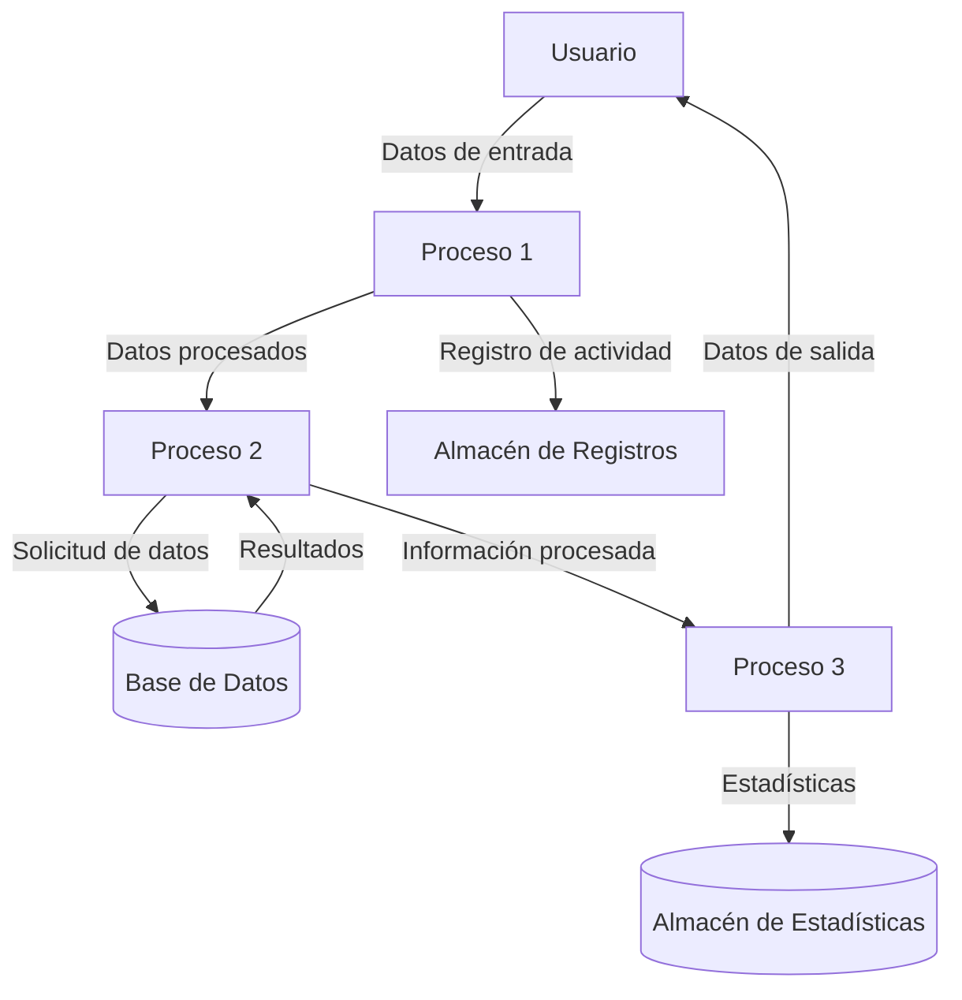

## Module: CobtenFechaAfiliacion.cpp
# Análisis Integral del Módulo CobtenFechaAfiliacion.cpp

## Nombre del Módulo/Componente SQL
CobtenFechaAfiliacion.cpp

## Objetivos Primarios
Este módulo está diseñado para obtener la fecha de afiliación de un cliente en un sistema de gestión de clientes. Su propósito principal es consultar la base de datos para recuperar información sobre cuándo un cliente específico se afilió al servicio, utilizando varios parámetros de identificación.

## Funciones, Métodos y Consultas Críticas
El código no se ha proporcionado completamente, pero por el nombre del archivo podemos inferir que contiene una función principal llamada `CobtenFechaAfiliacion` que probablemente ejecuta una consulta SQL SELECT para recuperar fechas de afiliación de clientes desde una tabla de la base de datos.

## Variables y Elementos Clave
Sin ver el código completo, podemos suponer que las variables clave incluirían:
- Identificadores de cliente (posiblemente ID de cliente, número de cuenta)
- Variables para almacenar la fecha de afiliación recuperada
- Parámetros de conexión a la base de datos
- Posibles tablas involucradas: tabla de clientes, tabla de afiliaciones o membresías

## Interdependencias y Relaciones
Este módulo probablemente interactúa con:
- Un sistema de gestión de base de datos
- Módulos de autenticación o validación de clientes
- Posiblemente módulos de gestión de errores o logging
- Tablas relacionadas con información de clientes y sus afiliaciones

## Operaciones Principales vs. Auxiliares
- **Operaciones principales**: Consulta a la base de datos para obtener la fecha de afiliación
- **Operaciones auxiliares**: Validación de parámetros de entrada, manejo de errores, formateo de fechas, logging de actividades

## Secuencia Operacional/Flujo de Ejecución
1. Recepción de parámetros de identificación del cliente
2. Validación de los parámetros recibidos
3. Conexión a la base de datos
4. Ejecución de la consulta SQL para obtener la fecha de afiliación
5. Procesamiento del resultado (formateo de fecha si es necesario)
6. Manejo de posibles errores o casos donde no se encuentra información
7. Retorno de la fecha de afiliación o un código de error/mensaje apropiado

## Aspectos de Rendimiento y Optimización
- La eficiencia de la consulta SQL sería crucial, especialmente si la tabla de clientes es grande
- Posiblemente se necesiten índices en las columnas de identificación del cliente y fechas
- El manejo de conexiones a la base de datos debería optimizarse para evitar sobrecarga

## Reusabilidad y Adaptabilidad
- Este módulo probablemente está diseñado para ser reutilizado en diferentes partes del sistema donde se necesite información sobre la fecha de afiliación
- La adaptabilidad dependería de qué tan parametrizado esté el código y si utiliza configuraciones externas para la conexión a la base de datos

## Uso y Contexto
Este módulo se utilizaría en contextos como:
- Verificación de elegibilidad para promociones basadas en antigüedad
- Cálculo de beneficios por fidelidad
- Generación de informes de clientes
- Análisis de retención de clientes

## Suposiciones y Limitaciones
- Supone que existe una estructura de base de datos con información de afiliación de clientes
- Probablemente asume un formato específico para las fechas
- Limitaciones potenciales incluyen la dependencia de la disponibilidad de la base de datos y la precisión de los datos almacenados
- Podría tener limitaciones en cuanto al manejo de casos especiales, como múltiples afiliaciones o reafiliaciones
## Flow Diagram [via mermaid]

