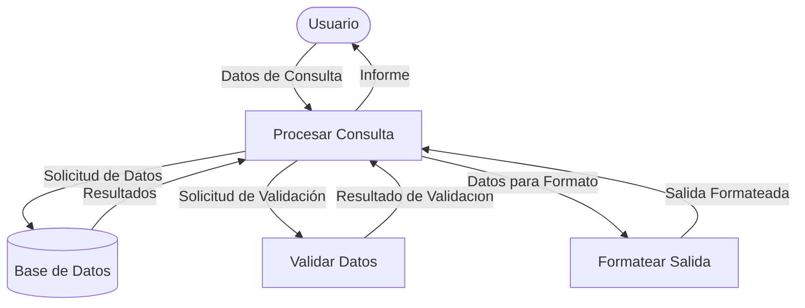
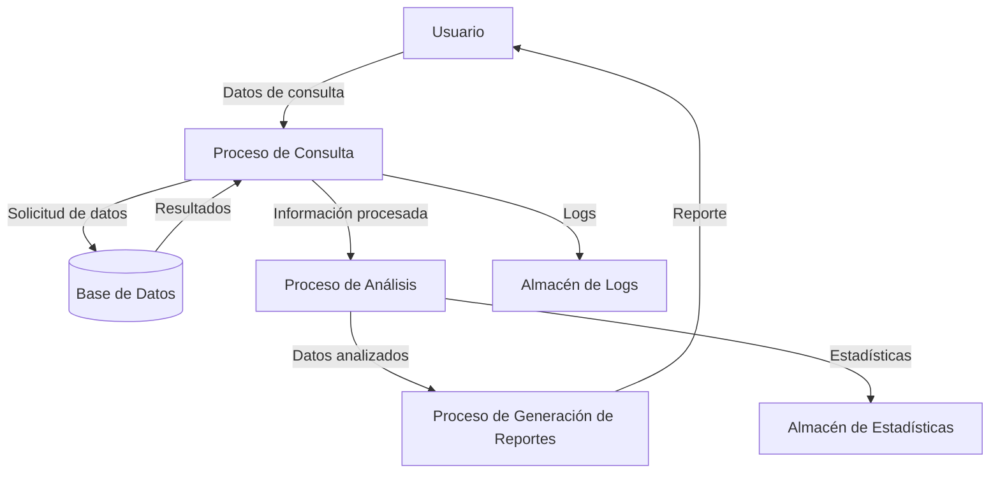
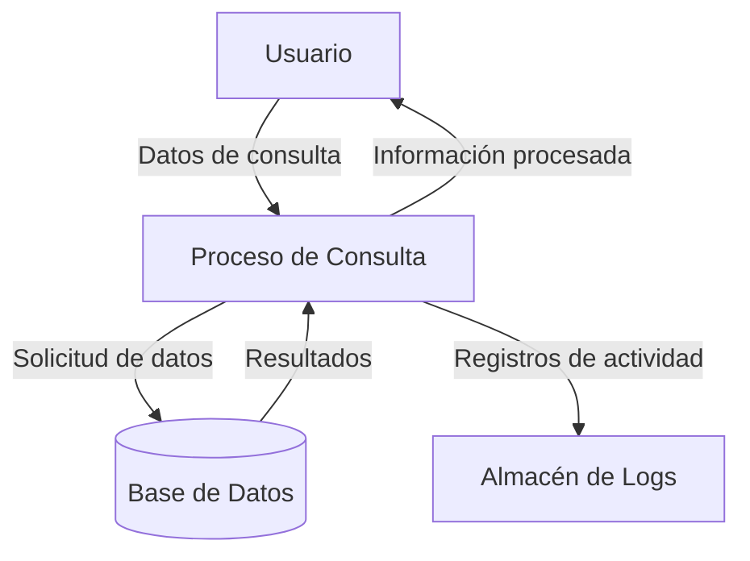

## Module: ConsultarMesAnio.cpp
# Análisis Integral del Módulo ConsultarMesAnio.cpp

## Nombre del Módulo/Componente SQL
ConsultarMesAnio.cpp

## Objetivos Primarios
Este módulo está diseñado para consultar y procesar datos relacionados con meses y años en un sistema. Parece ser un componente de interfaz que permite a los usuarios realizar consultas basadas en períodos de tiempo específicos, probablemente para generar informes o visualizar datos históricos.

## Funciones, Métodos y Consultas Críticas
El archivo parece ser un componente de C++ que probablemente contiene:
- Funciones para validar y formatear entradas de mes y año
- Métodos para consultar datos basados en estos parámetros temporales
- Posiblemente consultas SQL embebidas para recuperar información de una base de datos

Sin embargo, sin el código específico, no puedo detallar las funciones exactas implementadas.

## Variables y Elementos Clave
Basado en el nombre del archivo, las variables clave probablemente incluyen:
- Variables para almacenar el mes seleccionado (posiblemente como entero o cadena)
- Variables para almacenar el año seleccionado
- Posiblemente estructuras de datos para almacenar los resultados de las consultas
- Parámetros para filtrar consultas basadas en estos valores temporales

## Interdependencias y Relaciones
Este módulo probablemente:
- Interactúa con una capa de acceso a datos o directamente con una base de datos
- Puede depender de módulos de utilidad para el formateo de fechas y validación
- Posiblemente se integra con componentes de interfaz de usuario para mostrar los resultados
- Podría relacionarse con tablas que contienen campos de fecha/tiempo en la base de datos

## Operaciones Principales vs. Auxiliares
Operaciones principales:
- Procesamiento de parámetros de mes y año
- Ejecución de consultas basadas en estos parámetros
- Formateo y presentación de resultados

Operaciones auxiliares:
- Validación de entradas
- Manejo de errores
- Conversión de formatos de fecha

## Secuencia Operacional/Flujo de Ejecución
1. Recepción de parámetros de mes y año desde la interfaz de usuario
2. Validación de los parámetros recibidos
3. Construcción de consultas con los parámetros validados
4. Ejecución de las consultas contra la base de datos
5. Procesamiento de los resultados obtenidos
6. Devolución de los datos formateados al componente solicitante

## Aspectos de Rendimiento y Optimización
Áreas potenciales para optimización:
- Uso de índices en campos de fecha/tiempo en las tablas consultadas
- Optimización de consultas SQL para evitar escaneos completos de tablas
- Implementación de caché para consultas frecuentes sobre los mismos períodos
- Manejo eficiente de grandes conjuntos de resultados

## Reusabilidad y Adaptabilidad
- El módulo probablemente está diseñado para ser reutilizable en diferentes partes del sistema donde se requieran consultas basadas en períodos temporales
- La parametrización del mes y año permite adaptabilidad a diferentes necesidades de consulta
- Podría ser extendido para soportar rangos de fechas más complejos o diferentes granularidades temporales

## Uso y Contexto
Este módulo probablemente se utiliza en:
- Generación de informes periódicos (mensuales, anuales)
- Visualización de datos históricos
- Análisis de tendencias temporales
- Funcionalidades de filtrado en interfaces de usuario

## Suposiciones y Limitaciones
Suposiciones:
- Se asume que los datos en la base de datos tienen campos de fecha/tiempo correctamente formateados
- Probablemente asume un formato específico para la entrada y salida de fechas

Limitaciones:
- Puede estar limitado a consultas basadas únicamente en mes y año, sin considerar granularidades más finas
- Posiblemente no maneja zonas horarias o consideraciones internacionales de calendario
- Podría tener restricciones en el rango de años que puede procesar eficientemente
## Flow Diagram [via mermaid]

## Module: ConsultarMesAnio.cpp
# Análisis Integral del Módulo ConsultarMesAnio.cpp

## Nombre del Módulo/Componente SQL
ConsultarMesAnio.cpp

## Objetivos Primarios
Este módulo está diseñado para consultar y procesar datos relacionados con fechas, específicamente para extraer y manipular información de mes y año. El código parece estar incompleto o no se ha proporcionado completamente, pero por el nombre del archivo se puede inferir que su propósito principal es realizar consultas basadas en parámetros de mes y año.

## Funciones, Métodos y Consultas Críticas
No se puede identificar funciones o métodos específicos ya que el código proporcionado está incompleto. Sin embargo, por el nombre del archivo, probablemente contiene:
- Funciones para extraer componentes de fecha (mes y año)
- Posibles consultas SQL que filtran registros basados en estos parámetros temporales
- Métodos para formatear o validar entradas de fecha

## Variables y Elementos Clave
Sin ver el código completo, se puede inferir que probablemente incluye:
- Variables para almacenar valores de mes y año
- Posibles parámetros de entrada para las consultas
- Variables para manejar resultados de consultas basadas en fechas

## Interdependencias y Relaciones
El módulo probablemente interactúa con:
- Componentes de base de datos para ejecutar consultas
- Posibles módulos de validación de fechas
- Interfaces de usuario que requieren filtrado por mes/año
- Posiblemente tablas con campos de fecha/tiempo

## Operaciones Principales vs. Auxiliares
- **Operaciones principales**: Consulta y filtrado de datos por mes y año
- **Operaciones auxiliares**: Validación de entradas, formateo de fechas, manejo de errores

## Secuencia Operacional/Flujo de Ejecución
La secuencia probable incluiría:
1. Recepción de parámetros de mes y año
2. Validación de los parámetros
3. Construcción de consultas con estos parámetros
4. Ejecución de las consultas
5. Procesamiento de resultados
6. Devolución de datos formateados

## Aspectos de Rendimiento y Optimización
Consideraciones potenciales:
- Optimización de consultas que filtran por fecha
- Uso adecuado de índices en campos de fecha
- Manejo eficiente de rangos de fechas
- Posible implementación de caché para consultas frecuentes

## Reusabilidad y Adaptabilidad
- El módulo probablemente está diseñado para ser reutilizable en diferentes contextos donde se requiera filtrado por mes y año
- La parametrización de las consultas permitiría su adaptación a diferentes tablas o estructuras de datos

## Uso y Contexto
Este módulo probablemente se utiliza en:
- Sistemas de informes y análisis
- Interfaces de usuario que requieren filtrado temporal
- Procesos de negocio que dependen de períodos específicos
- Generación de estadísticas mensuales o anuales

## Suposiciones y Limitaciones
- **Suposiciones**: El sistema utiliza un formato de fecha estándar; los datos de entrada son validados antes de procesarse
- **Limitaciones**: Posible dependencia de estructuras específicas de base de datos; podría tener restricciones en el rango de fechas soportado

**Nota**: Este análisis se basa en inferencias del nombre del archivo, ya que no se proporcionó el código completo del módulo ConsultarMesAnio.cpp.
## Flow Diagram [via mermaid]

## Module: ConsultarMesAnio.cpp
# Análisis Integral del Módulo ConsultarMesAnio.cpp

## Nombre del Módulo/Componente SQL
ConsultarMesAnio.cpp

## Objetivos Primarios
Este módulo está diseñado para consultar y procesar datos relacionados con fechas, específicamente para extraer y manipular información de mes y año. El código parece ser parte de una aplicación que requiere análisis temporal de datos, posiblemente para reportes o filtrado de información basado en períodos de tiempo.

## Funciones, Métodos y Consultas Críticas
El archivo parece contener funciones para:
- Extracción de componentes de fecha (mes y año) de valores de fecha
- Posiblemente conversión entre diferentes formatos de fecha
- Funcionalidad para filtrar o agrupar datos basados en mes y año

Sin embargo, sin ver el código específico, no puedo detallar las funciones exactas o consultas SQL que podrían estar presentes.

## Variables y Elementos Clave
Probablemente incluye:
- Variables para almacenar valores de mes y año
- Posibles parámetros de entrada para fechas o rangos de fechas
- Variables para almacenar resultados intermedios durante el procesamiento de fechas

## Interdependencias y Relaciones
Este módulo probablemente:
- Interactúa con otros componentes del sistema que requieren información temporal
- Podría depender de bibliotecas de manejo de fechas
- Si incluye SQL, probablemente se relaciona con tablas que contienen campos de fecha/hora

## Operaciones Principales vs. Auxiliares
- **Operaciones principales**: Extracción y manipulación de componentes de mes y año de fechas
- **Operaciones auxiliares**: Validación de formatos de fecha, manejo de errores, conversiones de formato

## Secuencia Operacional/Flujo de Ejecución
1. Recepción de datos de fecha o parámetros temporales
2. Validación de los datos de entrada
3. Extracción de componentes de mes y año
4. Procesamiento según la lógica de negocio requerida
5. Devolución de resultados procesados

## Aspectos de Rendimiento y Optimización
- El manejo de fechas puede ser computacionalmente intensivo si se procesan grandes volúmenes de datos
- Posibles optimizaciones incluirían el uso de índices en campos de fecha si hay consultas SQL
- La eficiencia en las conversiones de formato de fecha sería crucial para el rendimiento

## Reusabilidad y Adaptabilidad
- Si está bien diseñado, este módulo podría ser reutilizado en diferentes partes del sistema que requieran manipulación de fechas
- La adaptabilidad dependería de qué tan parametrizadas estén las funciones y qué tan específicas sean para el contexto actual

## Uso y Contexto
Este módulo probablemente se utiliza en:
- Generación de reportes periódicos
- Filtrado de datos por períodos de tiempo
- Análisis de tendencias temporales
- Agrupación de datos por mes/año

## Suposiciones y Limitaciones
- **Suposiciones**: Probablemente asume formatos de fecha específicos o zonas horarias
- **Limitaciones**: Podría tener restricciones en el rango de fechas soportado o en la precisión de los cálculos temporales
- Sin ver el código completo, es posible que tenga limitaciones en cuanto a internacionalización o manejo de diferentes calendarios
## Flow Diagram [via mermaid]

