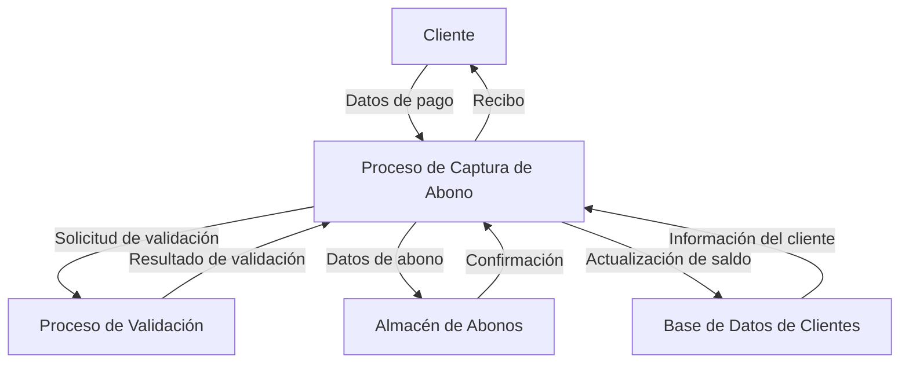

## Module: DlgCapturarAbono.cpp
# Análisis Integral del Módulo DlgCapturarAbono.cpp

## Nombre del Módulo/Componente SQL
**DlgCapturarAbono.cpp** - Módulo de diálogo para la captura de abonos en un sistema de gestión financiera.

## Objetivos Primarios
Este módulo implementa una interfaz de diálogo para capturar y procesar abonos a cuentas o facturas. Su propósito principal es gestionar la entrada de datos relacionados con pagos, validar la información ingresada y actualizar los registros correspondientes en la base de datos.

## Funciones, Métodos y Consultas Críticas
- **OnInitDialog()**: Inicializa el diálogo y configura los controles.
- **OnOK()**: Valida y procesa los datos del abono antes de cerrar el diálogo.
- **OnBnClickedBtnBuscarCliente()**: Busca información del cliente.
- **OnBnClickedBtnBuscarFactura()**: Busca facturas asociadas al cliente.
- **OnEnChangeEditImporte()**: Maneja cambios en el campo de importe.
- **OnCbnSelchangeCmbFormaPago()**: Gestiona cambios en la forma de pago seleccionada.

## Variables y Elementos Clave
- **m_strCliente**: Almacena el identificador del cliente.
- **m_strFactura**: Almacena el número de factura.
- **m_dImporte**: Valor del abono a realizar.
- **m_cmbFormaPago**: Control para seleccionar la forma de pago.
- **m_dtFecha**: Fecha del abono.
- **m_strReferencia**: Referencia del pago (número de cheque, transferencia, etc.).

## Interdependencias y Relaciones
- Interactúa con tablas de clientes para validar la existencia del cliente.
- Se relaciona con tablas de facturas para verificar facturas pendientes.
- Conecta con tablas de abonos/pagos para registrar las transacciones.
- Posiblemente interactúa con un módulo de contabilidad para actualizar saldos.

## Operaciones Principales vs. Auxiliares
**Operaciones Principales:**
- Validación de datos del abono (cliente, factura, importe).
- Registro del abono en la base de datos.
- Actualización del saldo de la factura.

**Operaciones Auxiliares:**
- Búsqueda y validación de clientes.
- Búsqueda y validación de facturas.
- Formateo de campos monetarios.
- Validación de formas de pago.

## Secuencia Operacional/Flujo de Ejecución
1. Inicialización del diálogo con valores predeterminados.
2. El usuario ingresa o busca un cliente.
3. El usuario selecciona una factura asociada al cliente.
4. Se ingresa el importe del abono y se selecciona la forma de pago.
5. Se completan datos adicionales según la forma de pago (referencia, banco, etc.).
6. Al confirmar, se validan todos los datos.
7. Si la validación es exitosa, se registra el abono y se actualiza el saldo de la factura.
8. Se cierra el diálogo con un código de éxito.

## Aspectos de Rendimiento y Optimización
- Posibles cuellos de botella en las consultas de búsqueda de clientes y facturas.
- La validación en tiempo real del importe podría optimizarse para mejorar la experiencia del usuario.
- Se recomienda implementar transacciones para garantizar la integridad de los datos al registrar abonos.

## Reusabilidad y Adaptabilidad
- El diálogo parece estar diseñado específicamente para la captura de abonos, con poca modularidad.
- La lógica de validación podría extraerse a funciones separadas para mejorar la reusabilidad.
- La implementación actual probablemente está acoplada a una estructura específica de base de datos.

## Uso y Contexto
- Este módulo se utiliza en el contexto de un sistema de gestión financiera o contable.
- Es invocado cuando un usuario necesita registrar un pago o abono a una factura.
- Probablemente forma parte de un módulo más amplio de cuentas por cobrar o gestión de pagos.

## Suposiciones y Limitaciones
- Asume la existencia de tablas específicas para clientes, facturas y abonos.
- Presupone un formato específico para los identificadores de clientes y facturas.
- Posiblemente limitado a un tipo específico de moneda o sistema de contabilidad.
- No parece manejar pagos parciales a múltiples facturas en una sola operación.
- La interfaz probablemente está diseñada para un sistema de escritorio, no para entornos web o móviles.
## Flow Diagram [via mermaid]

