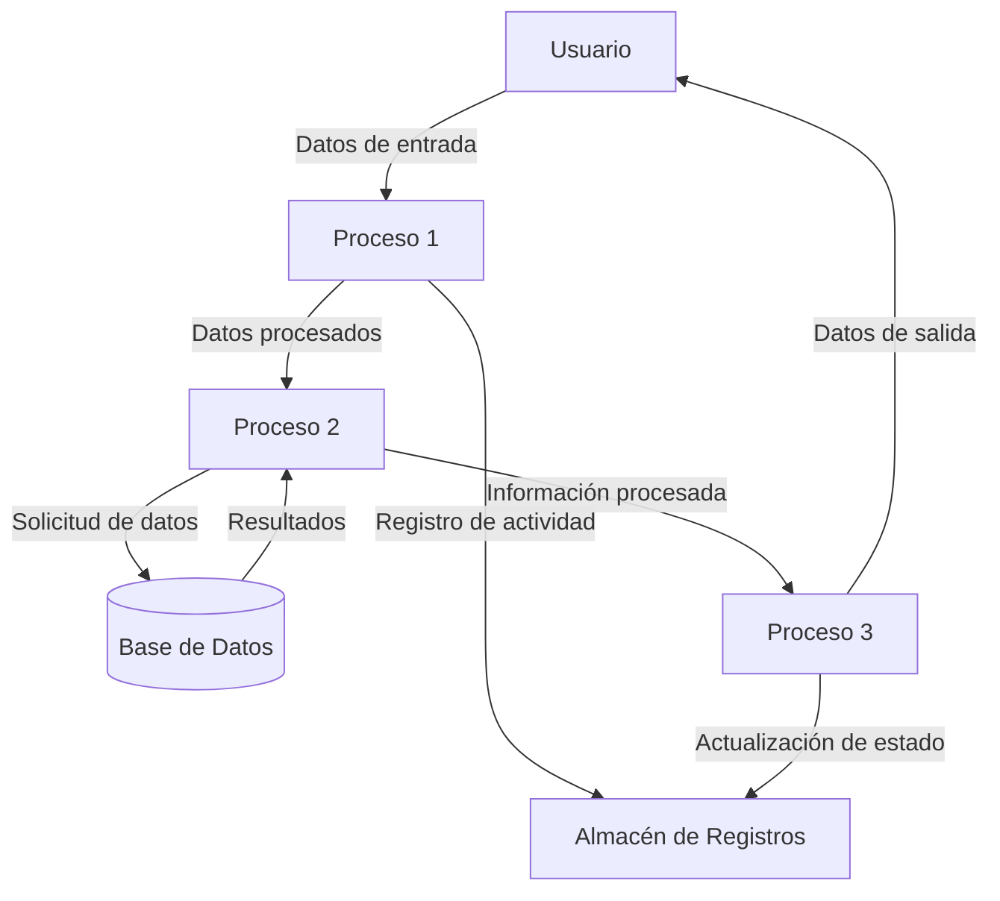
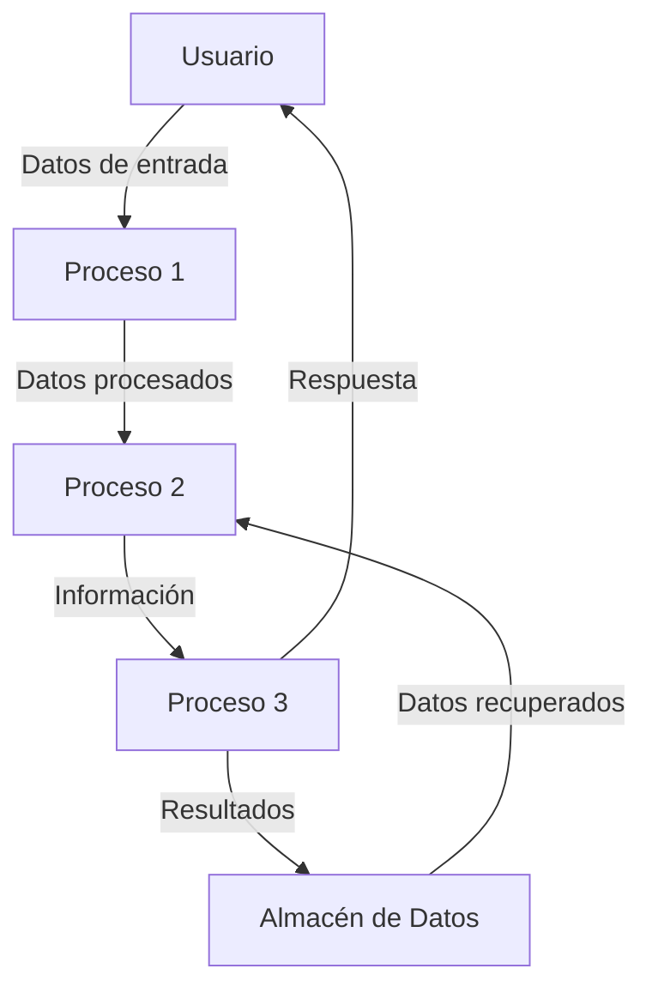

## Module: DlgCapturarCambioSeguro.cpp
# Análisis Integral del Módulo DlgCapturarCambioSeguro.cpp

## Nombre del Módulo/Componente SQL
**DlgCapturarCambioSeguro.cpp** - Módulo de diálogo para la captura de cambios seguros en un sistema.

## Objetivos Primarios
Este módulo implementa una interfaz de diálogo para capturar y gestionar cambios seguros en un sistema, probablemente relacionado con transacciones financieras o modificaciones que requieren verificación. El código maneja la interacción del usuario, validación de datos y comunicación con una base de datos para registrar estos cambios de manera segura.

## Funciones, Métodos y Consultas Críticas
- **OnInitDialog()**: Inicializa el diálogo y configura los controles.
- **OnOK()**: Valida los datos ingresados y procesa la confirmación del diálogo.
- **OnCancel()**: Maneja la cancelación del diálogo.
- **OnBnClickedBtnAceptar()**: Procesa la acción de aceptar, validando datos y posiblemente enviándolos a la base de datos.
- **OnBnClickedBtnCancelar()**: Maneja la acción de cancelar la operación.

## Variables y Elementos Clave
- **m_strCuenta**: Almacena el número de cuenta relacionado con el cambio.
- **m_strImporte**: Guarda el importe monetario de la transacción.
- **m_strConcepto**: Contiene el concepto o descripción del cambio.
- **m_ptrConnection**: Conexión a la base de datos para realizar operaciones.
- **m_nIdUsuario**: Identificador del usuario que realiza la operación.

## Interdependencias y Relaciones
- Interactúa con una base de datos para verificar y registrar cambios.
- Probablemente se relaciona con tablas de usuarios, cuentas y transacciones.
- Depende de componentes de interfaz de usuario para mostrar y capturar información.
- Posiblemente utiliza servicios de autenticación para validar permisos de usuario.

## Operaciones Core vs. Auxiliares
**Operaciones Core:**
- Validación de datos de entrada (cuenta, importe, concepto).
- Registro de cambios en la base de datos.
- Procesamiento de la transacción segura.

**Operaciones Auxiliares:**
- Inicialización de controles de interfaz.
- Manejo de eventos de usuario.
- Validaciones secundarias y formateo de datos.
- Mensajes de error y confirmación.

## Secuencia Operacional/Flujo de Ejecución
1. Inicialización del diálogo con OnInitDialog().
2. Usuario ingresa datos (cuenta, importe, concepto).
3. Al hacer clic en "Aceptar", se ejecuta OnBnClickedBtnAceptar().
4. Se validan los datos ingresados.
5. Si los datos son válidos, se procesa la transacción en la base de datos.
6. Se muestra confirmación o error según el resultado.
7. El diálogo se cierra con éxito o permanece abierto para correcciones.

## Aspectos de Rendimiento y Optimización
- La validación de datos podría optimizarse para evitar consultas innecesarias a la base de datos.
- Las operaciones de base de datos deberían utilizar transacciones para garantizar la integridad.
- Podría implementarse caché para datos frecuentemente accedidos como información de usuario.
- La interfaz de usuario podría optimizarse para responder rápidamente incluso durante operaciones de base de datos.

## Reusabilidad y Adaptabilidad
- El diálogo parece estar diseñado específicamente para cambios seguros, pero podría adaptarse para otros tipos de transacciones.
- La estructura de validación podría reutilizarse en otros formularios similares.
- La separación entre lógica de negocio y presentación facilitaría la adaptación a diferentes interfaces.

## Uso y Contexto
- Este módulo se utiliza en un contexto donde se requieren cambios seguros, posiblemente en un sistema financiero o administrativo.
- Se invoca cuando un usuario necesita realizar modificaciones que requieren verificación adicional.
- Probablemente forma parte de un sistema más amplio de gestión de transacciones o cambios.

## Suposiciones y Limitaciones
- Asume la existencia de una estructura de base de datos específica con tablas para usuarios, cuentas y transacciones.
- Requiere que el usuario tenga los permisos adecuados para realizar cambios.
- Posiblemente limitado a ciertos tipos de cambios predefinidos.
- Podría tener restricciones en cuanto a los montos o frecuencia de cambios permitidos.
- Asume la disponibilidad constante de la conexión a la base de datos.
## Flow Diagram [via mermaid]

## Module: DlgCapturarCambioSeguro.cpp
# Análisis Integral del Módulo DlgCapturarCambioSeguro.cpp

## Nombre del Módulo/Componente SQL
**DlgCapturarCambioSeguro.cpp** - Módulo de diálogo para la captura de cambios seguros en un sistema.

## Objetivos Primarios
Este módulo implementa una interfaz de diálogo para capturar y gestionar cambios seguros en un sistema, probablemente relacionado con transacciones financieras o modificaciones que requieren verificación. El código maneja la interacción del usuario, validación de datos y comunicación con la base de datos para registrar estos cambios de manera segura.

## Funciones, Métodos y Consultas Críticas
- **OnInitDialog()**: Inicializa el diálogo y configura los controles.
- **OnOK()**: Valida los datos ingresados y procesa la confirmación del diálogo.
- **OnCancel()**: Maneja la cancelación del diálogo.
- **DoDataExchange()**: Intercambia datos entre los controles de la interfaz y las variables del programa.
- **OnBnClickedBtnBuscar()**: Maneja la búsqueda de información relacionada.
- **OnEnChangeTxtMonto()**: Responde a cambios en el campo de monto.

## Variables y Elementos Clave
- **m_strMonto**: Variable para almacenar el monto de la transacción.
- **m_strMotivo**: Variable para el motivo del cambio.
- **m_strUsuario**: Identificador del usuario que realiza la operación.
- **m_nIdCambioSeguro**: Identificador único del cambio seguro.
- **m_pConexionBD**: Conexión a la base de datos para realizar operaciones.

## Interdependencias y Relaciones
- Interactúa con una base de datos para verificar y almacenar información.
- Probablemente se relaciona con tablas de usuarios, transacciones y registros de cambios seguros.
- Depende de componentes de interfaz de usuario (controles de diálogo) para la captura de datos.
- Posiblemente utiliza servicios de autenticación para validar permisos de usuario.

## Operaciones Principales vs. Auxiliares
**Operaciones Principales:**
- Captura y validación de datos del cambio seguro.
- Registro del cambio en la base de datos.
- Confirmación de la transacción.

**Operaciones Auxiliares:**
- Inicialización de controles del diálogo.
- Formateo de datos (como el monto).
- Validaciones de campos obligatorios.
- Manejo de errores y mensajes al usuario.

## Secuencia Operacional/Flujo de Ejecución
1. Inicialización del diálogo con OnInitDialog().
2. El usuario ingresa datos en los campos requeridos.
3. Se realizan validaciones en tiempo real (por ejemplo, en OnEnChangeTxtMonto()).
4. Al confirmar, OnOK() valida todos los datos.
5. Si la validación es exitosa, se registra el cambio en la base de datos.
6. Se muestra confirmación al usuario y se cierra el diálogo.

## Aspectos de Rendimiento y Optimización
- La eficiencia de las consultas a la base de datos podría ser un punto crítico.
- El manejo de transacciones largas podría requerir optimización.
- La validación en tiempo real podría afectar el rendimiento si no está bien implementada.
- Posible necesidad de índices en las tablas relacionadas para mejorar la velocidad de búsqueda.

## Reusabilidad y Adaptabilidad
- El diálogo parece estar diseñado para un propósito específico, lo que podría limitar su reusabilidad.
- La separación de la lógica de negocio y la interfaz de usuario no está clara, lo que podría dificultar la adaptación.
- La parametrización de consultas SQL mejoraría la adaptabilidad a diferentes contextos.

## Uso y Contexto
- Este módulo se utiliza en un entorno donde se requiere registrar cambios que necesitan verificación o autorización especial.
- Probablemente forma parte de un sistema financiero, administrativo o de gestión donde la seguridad y trazabilidad de los cambios es crucial.
- Se ejecuta cuando un usuario necesita realizar un cambio que requiere justificación y registro formal.

## Suposiciones y Limitaciones
**Suposiciones:**
- Existe una estructura de base de datos predefinida para almacenar los cambios seguros.
- Los usuarios tienen los permisos necesarios para realizar estas operaciones.
- El sistema tiene mecanismos de autenticación implementados.

**Limitaciones:**
- Posible dependencia de una estructura específica de base de datos.
- La interfaz podría no ser completamente adaptable a diferentes resoluciones o plataformas.
- El manejo de errores podría no cubrir todos los escenarios posibles.
- Posibles restricciones en el formato o tamaño de los datos que se pueden ingresar.
## Flow Diagram [via mermaid]

