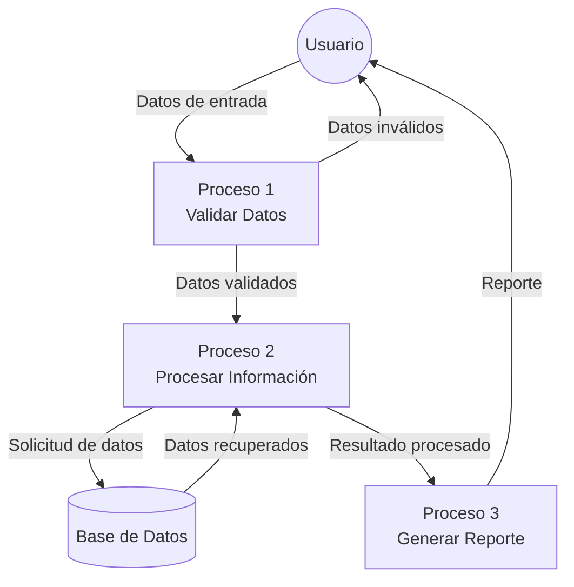

## Module: DlgCapturarClienteEtp.cpp
# Análisis Integral del Módulo DlgCapturarClienteEtp.cpp

## Nombre del Módulo/Componente SQL
**DlgCapturarClienteEtp.cpp** - Módulo de diálogo para la captura de información de clientes ETP.

## Objetivos Primarios
Este módulo implementa una interfaz de diálogo para capturar, validar y gestionar la información de clientes ETP (posiblemente Empresas de Transporte Público). Maneja la interacción con el usuario para el registro y actualización de datos de clientes, incluyendo validaciones y persistencia de información.

## Funciones, Métodos y Consultas Críticas
- **OnInitDialog()**: Inicializa el diálogo y configura los controles.
- **OnBnClickedBtnGuardar()**: Valida y guarda la información del cliente.
- **OnBnClickedBtnCancelar()**: Cancela la operación actual y cierra el diálogo.
- **ValidarDatos()**: Verifica que los datos ingresados cumplan con los requisitos establecidos.
- **CargarDatos()**: Carga los datos existentes de un cliente para su edición.
- **GuardarDatos()**: Persiste la información del cliente en la base de datos.

## Variables y Elementos Clave
- **m_strNombre**, **m_strRFC**, **m_strDireccion**: Variables para almacenar información básica del cliente.
- **m_nIdCliente**: Identificador único del cliente en la base de datos.
- **m_bModoEdicion**: Bandera que indica si se está editando un cliente existente o creando uno nuevo.
- **m_ctrlComboEstado**, **m_ctrlComboMunicipio**: Controles para la selección de ubicación geográfica.
- **m_ctrlListaContactos**: Control para gestionar múltiples contactos asociados al cliente.

## Interdependencias y Relaciones
- Interactúa con la capa de acceso a datos para persistir información de clientes.
- Se relaciona con tablas de la base de datos como "Clientes", "Contactos", "Estados" y "Municipios".
- Posiblemente utiliza servicios de validación o componentes de negocio para verificar la integridad de los datos.

## Operaciones Principales vs. Auxiliares
**Operaciones Principales:**
- Captura y validación de datos del cliente
- Persistencia de información en la base de datos
- Gestión de contactos asociados al cliente

**Operaciones Auxiliares:**
- Inicialización de controles del diálogo
- Carga de catálogos (estados, municipios)
- Validaciones específicas (formato de RFC, campos obligatorios)
- Manejo de eventos de la interfaz de usuario

## Secuencia Operacional/Flujo de Ejecución
1. Inicialización del diálogo y carga de catálogos
2. Si es modo edición, carga de datos existentes del cliente
3. Interacción del usuario con el formulario
4. Al guardar:
   - Validación de datos ingresados
   - Persistencia en base de datos si las validaciones son exitosas
   - Cierre del diálogo con código de éxito
5. Al cancelar, cierre del diálogo sin guardar cambios

## Aspectos de Rendimiento y Optimización
- Posible optimización en la carga de catálogos para evitar múltiples consultas a la base de datos
- Validaciones en tiempo real para mejorar la experiencia del usuario
- Manejo eficiente de la lista de contactos para evitar sobrecarga de memoria

## Reusabilidad y Adaptabilidad
- El componente parece estar diseñado específicamente para la gestión de clientes ETP
- Podría adaptarse para otros tipos de clientes con modificaciones en las validaciones y campos específicos
- La separación entre interfaz y lógica de negocio facilitaría su adaptación a otros contextos

## Uso y Contexto
- Se utiliza en el contexto de un sistema de gestión empresarial, específicamente para el registro y mantenimiento de clientes ETP
- Probablemente forma parte de un módulo más amplio de CRM o gestión de clientes
- Se invoca desde menús de administración o pantallas de listado de clientes

## Suposiciones y Limitaciones
- Asume la existencia de una estructura de base de datos específica con tablas relacionadas
- Requiere catálogos preexistentes de estados y municipios
- Posiblemente limitado a un formato específico de RFC (formato mexicano)
- Diseñado para un entorno Windows con interfaz MFC (Microsoft Foundation Classes)
- Podría tener limitaciones en cuanto al número de contactos que puede gestionar por cliente
## Flow Diagram [via mermaid]

