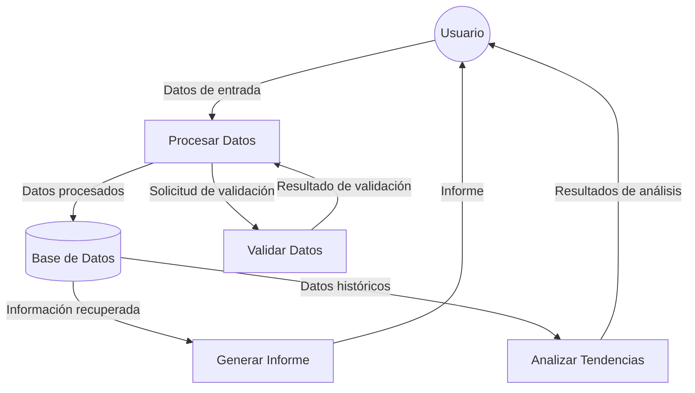
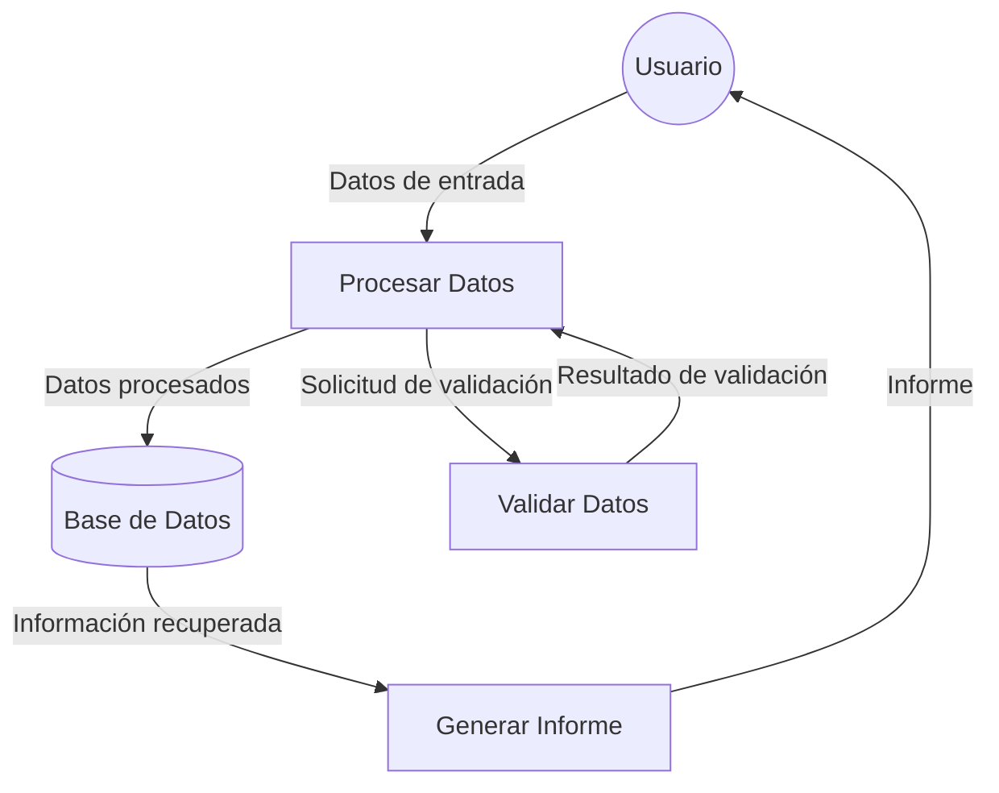

## Module: DlgCapturarConvenio.cpp
# Análisis Integral del Módulo DlgCapturarConvenio.cpp

## Nombre del Módulo/Componente SQL
**DlgCapturarConvenio.cpp** - Módulo de diálogo para la captura y gestión de convenios.

## Objetivos Primarios
Este módulo implementa una interfaz de diálogo para capturar, visualizar y gestionar convenios en un sistema. Maneja la interacción del usuario para la entrada de datos relacionados con convenios, validación de información y persistencia de datos.

## Funciones, Métodos y Consultas Críticas
- **OnInitDialog()**: Inicializa el diálogo, configura controles y carga datos iniciales.
- **OnBnClickedBtnBuscarCliente()**: Busca información de clientes para asociarlos al convenio.
- **OnBnClickedBtnAgregarProducto()**: Agrega productos al convenio actual.
- **OnBnClickedBtnGuardar()**: Valida y guarda la información del convenio.
- **OnBnClickedBtnCancelar()**: Cancela la operación actual y cierra el diálogo.
- **OnBnClickedBtnEliminarProducto()**: Elimina productos seleccionados del convenio.
- **CargarDatosConvenio()**: Carga datos existentes de un convenio para su edición.

## Variables y Elementos Clave
- **m_convenio**: Objeto principal que almacena la información del convenio.
- **m_productos**: Colección que mantiene los productos asociados al convenio.
- **m_cliente**: Información del cliente asociado al convenio.
- **m_lstProductos**: Control de lista para mostrar productos del convenio.
- **m_edtFechaInicio**, **m_edtFechaFin**: Controles para fechas del convenio.
- **m_edtDescuento**: Control para el porcentaje de descuento.

## Interdependencias y Relaciones
- Interactúa con módulos de gestión de clientes para obtener información de clientes.
- Se relaciona con módulos de gestión de productos para seleccionar y agregar productos al convenio.
- Depende de un sistema de persistencia (posiblemente una base de datos) para guardar y recuperar información de convenios.
- Utiliza componentes de la interfaz de usuario para mostrar y capturar datos.

## Operaciones Principales vs. Auxiliares
**Operaciones Principales:**
- Captura y validación de datos del convenio.
- Gestión de productos asociados al convenio.
- Persistencia de la información del convenio.

**Operaciones Auxiliares:**
- Validación de campos y formatos.
- Actualización de la interfaz de usuario.
- Manejo de eventos de controles.
- Formateo de datos para presentación.

## Secuencia Operacional/Flujo de Ejecución
1. Inicialización del diálogo y carga de datos iniciales.
2. Captura de información básica del convenio (fechas, descuento).
3. Selección del cliente asociado al convenio.
4. Adición/eliminación de productos al convenio.
5. Validación de la información completa.
6. Persistencia de datos o cancelación de la operación.
7. Cierre del diálogo con resultado apropiado.

## Aspectos de Rendimiento y Optimización
- La carga de listas de productos podría optimizarse para grandes volúmenes de datos.
- Las operaciones de búsqueda de clientes y productos podrían beneficiarse de índices adecuados en la base de datos subyacente.
- La validación de datos podría implementarse de manera más eficiente para evitar múltiples recorridos de las colecciones.

## Reusabilidad y Adaptabilidad
- El módulo parece estar diseñado específicamente para la gestión de convenios, con poca modularidad para otros contextos.
- La lógica de validación y persistencia podría extraerse a componentes separados para mejorar la reusabilidad.
- La interfaz de usuario está estrechamente acoplada con la lógica de negocio, lo que dificulta la adaptación a diferentes presentaciones.

## Uso y Contexto
Este módulo se utiliza en un sistema de gestión comercial o de ventas para crear acuerdos especiales (convenios) con clientes, posiblemente para establecer precios o descuentos especiales para ciertos productos. Se despliega como un diálogo modal dentro de la aplicación principal cuando se necesita crear o editar un convenio.

## Suposiciones y Limitaciones
- Asume la existencia de estructuras de datos predefinidas para clientes, productos y convenios.
- Presupone un sistema de persistencia subyacente (probablemente una base de datos relacional).
- Limitado a la gestión de un solo convenio a la vez.
- No parece manejar escenarios complejos como convenios con múltiples clientes o condiciones variables por producto.
- La interfaz está diseñada para un entorno de escritorio, sin consideraciones aparentes para dispositivos móviles o interfaces web.
## Flow Diagram [via mermaid]

## Module: DlgCapturarConvenio.cpp
# Análisis Integral del Módulo DlgCapturarConvenio.cpp

## Nombre del Módulo/Componente SQL
**DlgCapturarConvenio.cpp** - Módulo de diálogo para la captura y gestión de convenios.

## Objetivos Primarios
Este módulo implementa una interfaz de diálogo para capturar, visualizar y gestionar convenios en un sistema, probablemente relacionado con acuerdos financieros o comerciales. Maneja la interacción del usuario con formularios de entrada de datos, validación y persistencia de información de convenios.

## Funciones, Métodos y Consultas Críticas
- **OnInitDialog()**: Inicializa el diálogo y configura los controles.
- **OnBnClickedBtnBuscar()**: Gestiona la búsqueda de convenios existentes.
- **OnBnClickedBtnGuardar()**: Valida y guarda la información del convenio.
- **OnBnClickedBtnNuevo()**: Prepara la interfaz para capturar un nuevo convenio.
- **OnBnClickedBtnCancelar()**: Cancela la operación actual y restablece el diálogo.
- **OnBnClickedBtnEliminar()**: Elimina un convenio existente.
- **ValidarDatos()**: Verifica que los datos ingresados sean válidos antes de procesarlos.

## Variables y Elementos Clave
- **m_strFolio**: Identificador único del convenio.
- **m_strDescripcion**: Descripción detallada del convenio.
- **m_dtFechaInicio**, **m_dtFechaFin**: Fechas de vigencia del convenio.
- **m_nEstatus**: Estado actual del convenio (activo, inactivo, etc.).
- **m_btnGuardar**, **m_btnEliminar**, **m_btnNuevo**: Controles de botones para acciones principales.
- **m_editFolio**, **m_editDescripcion**: Controles de edición para datos del convenio.

## Interdependencias y Relaciones
- Interactúa con una base de datos para persistir y recuperar información de convenios.
- Probablemente se relaciona con otros módulos del sistema como gestión de clientes, facturación o contabilidad.
- Puede depender de servicios de autenticación para verificar permisos de usuario.

## Operaciones Principales vs. Auxiliares
**Operaciones Principales:**
- Creación, modificación y eliminación de convenios.
- Búsqueda y visualización de convenios existentes.

**Operaciones Auxiliares:**
- Validación de datos de entrada.
- Gestión de estados de la interfaz (habilitación/deshabilitación de controles).
- Formateo de fechas y otros datos para presentación.

## Secuencia Operacional/Flujo de Ejecución
1. Inicialización del diálogo con configuración de controles.
2. El usuario puede buscar un convenio existente o iniciar uno nuevo.
3. Ingreso de datos del convenio (folio, descripción, fechas, etc.).
4. Validación de datos antes de guardar.
5. Persistencia de datos en la base de datos.
6. Actualización de la interfaz según el resultado de la operación.

## Aspectos de Rendimiento y Optimización
- La carga de datos podría optimizarse implementando paginación para grandes volúmenes de convenios.
- Las validaciones podrían realizarse en tiempo real para mejorar la experiencia del usuario.
- La gestión de memoria para los controles de la interfaz podría revisarse para evitar fugas.

## Reusabilidad y Adaptabilidad
- El módulo parece estar diseñado específicamente para la gestión de convenios, con poca modularidad para otros usos.
- Podría mejorarse separando la lógica de negocio de la interfaz de usuario.
- La implementación de patrones como MVC mejoraría su adaptabilidad.

## Uso y Contexto
- Se utiliza en un entorno de aplicación de escritorio, probablemente desarrollado con MFC (Microsoft Foundation Classes).
- Forma parte de un sistema más amplio de gestión empresarial o comercial.
- Es utilizado por personal administrativo para gestionar acuerdos con clientes o proveedores.

## Suposiciones y Limitaciones
- Asume una estructura específica de base de datos para almacenar convenios.
- Probablemente limitado a un entorno Windows debido al uso de MFC.
- No parece tener capacidades para gestión de documentos adjuntos o flujos de trabajo complejos.
- Podría tener limitaciones en la gestión de convenios con múltiples partes o condiciones complejas.
## Flow Diagram [via mermaid]

