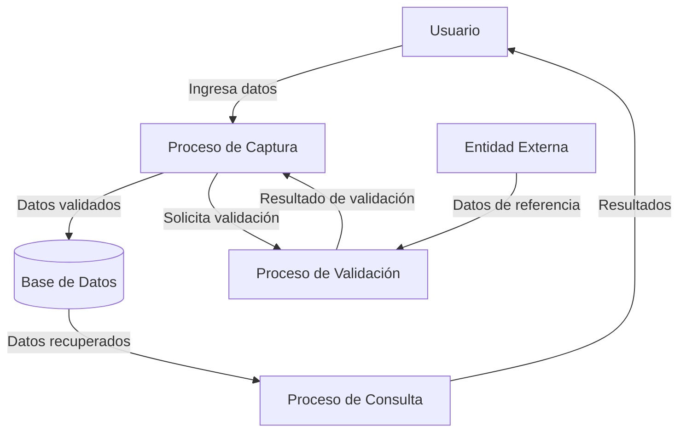

## Module: DlgCapturarDatosComplementarios.cpp
# Análisis Integral del Módulo DlgCapturarDatosComplementarios.cpp

## Nombre del Módulo/Componente SQL
**DlgCapturarDatosComplementarios.cpp** - Módulo de diálogo para captura de datos complementarios.

## Objetivos Primarios
Este módulo implementa una interfaz de diálogo para capturar datos complementarios en un sistema, probablemente relacionado con información de clientes o transacciones. Su propósito principal es gestionar la entrada de datos adicionales a través de una interfaz gráfica y validar esta información antes de procesarla.

## Funciones, Métodos y Consultas Críticas
- **OnInitDialog()**: Inicializa el diálogo y configura los controles.
- **OnOK()**: Valida los datos ingresados y procesa la información cuando el usuario confirma.
- **OnCancel()**: Maneja la cancelación del diálogo.
- **DoDataExchange()**: Intercambia datos entre los controles de la interfaz y las variables del programa.
- **ValidarDatos()**: Verifica que los datos ingresados cumplan con los requisitos establecidos.

## Variables y Elementos Clave
- **m_strNombre**: Almacena el nombre del cliente o entidad.
- **m_strDireccion**: Guarda la dirección.
- **m_strTelefono**: Contiene el número telefónico.
- **m_strEmail**: Almacena la dirección de correo electrónico.
- **m_nTipoCliente**: Probablemente un identificador numérico para categorizar al cliente.
- **m_bDatosValidos**: Bandera que indica si los datos han sido validados correctamente.

## Interdependencias y Relaciones
- Interactúa con el sistema de diálogos de la aplicación principal.
- Posiblemente se comunica con una base de datos para almacenar o recuperar información complementaria.
- Puede depender de módulos de validación externos para verificar formatos específicos (como correo electrónico o teléfono).

## Operaciones Principales vs. Auxiliares
**Operaciones Principales:**
- Captura y validación de datos complementarios.
- Procesamiento de la información ingresada.

**Operaciones Auxiliares:**
- Inicialización de controles en la interfaz.
- Manejo de eventos de cancelación.
- Formateo y limpieza de datos ingresados.
- Mensajes de error y retroalimentación al usuario.

## Secuencia Operacional/Flujo de Ejecución
1. Inicialización del diálogo con OnInitDialog().
2. Presentación de la interfaz al usuario.
3. Captura de datos por parte del usuario.
4. Al confirmar (OnOK):
   - Validación de los datos ingresados.
   - Si son válidos, procesamiento y posible almacenamiento.
   - Si no son válidos, presentación de mensajes de error.
5. Cierre del diálogo, ya sea por confirmación exitosa o cancelación.

## Aspectos de Rendimiento y Optimización
- La validación de datos podría optimizarse para evitar múltiples verificaciones redundantes.
- El manejo de memoria para las cadenas de texto debería ser eficiente, especialmente si se manejan grandes volúmenes de datos.
- La interacción con bases de datos, si existe, podría beneficiarse de consultas optimizadas o preparadas.

## Reusabilidad y Adaptabilidad
- El diálogo parece estar diseñado para un propósito específico, pero podría adaptarse para capturar diferentes tipos de datos complementarios.
- La estructura de validación probablemente podría reutilizarse para otros formularios de entrada de datos.
- La separación entre interfaz y lógica de validación facilitaría la adaptación a diferentes contextos.

## Uso y Contexto
- Este módulo se utiliza cuando se necesita recopilar información adicional del usuario, posiblemente durante un proceso de registro, actualización de perfil o como parte de una transacción.
- Probablemente se invoca desde un módulo principal cuando se requiere la captura de estos datos complementarios.

## Suposiciones y Limitaciones
**Suposiciones:**
- Se asume que el usuario tiene conocimiento de qué tipo de información debe ingresar.
- Probablemente asume la existencia de ciertas estructuras de datos o tablas donde almacenar la información.

**Limitaciones:**
- La interfaz podría estar limitada a un conjunto específico de campos.
- Las validaciones implementadas podrían no cubrir todos los casos de uso o formatos internacionales.
- Podría haber restricciones en cuanto a la longitud o formato de los datos que se pueden ingresar.
## Flow Diagram [via mermaid]

